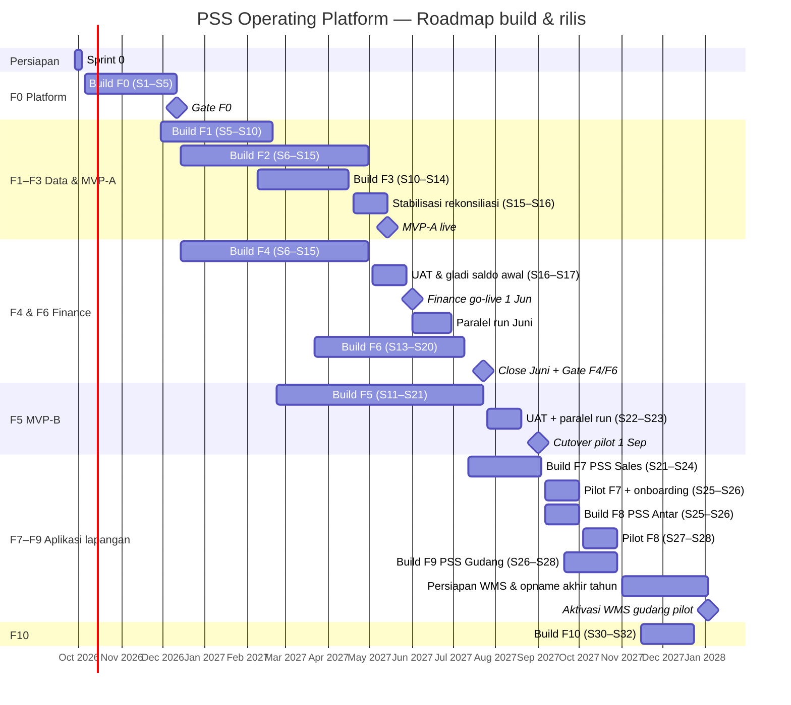

# PSS Operating Platform — Implementation Plan 1.0

**DOCUMENT STATUS: DRAFT FOR PRODUCT / OPERATIONS / FINANCE / ENGINEERING REVIEW**

| Field | Nilai |
|---|---|
| Versi | 1.1 — draf untuk review (tambahan F11 PSS Kasir / POS Grosir) |
| Tanggal | 24 September 2026 (1.0); amandemen 1.1 lihat catatan revisi di bawah |
| Lokasi di repo | `docs/IMPLEMENTATION_PLAN.md` |
| Dokumen induk | `docs/PRODUCT_PRD.md` (PSS Operating Platform — Product & Development PRD 1.0, §46A revisi 1.1) |
| Cakupan | 295 fitur PRD, fase F0–F11, dari Sprint 0 (28 Sep 2026) sampai rollout cabang 2028 |
| Sifat | Rencana kerja yang **berubah per sprint**. Rencana ini tidak mengubah perilaku produk (DOC-CTL.R05) |
| Perubahan 1.1 | Menambahkan Lampiran A rows **POS-001…POS-015** (§46A PSS Kasir / POS Grosir; 1 S + 9 M + 5 L = 54 poin) di bawah fase **F11**, Pod Commerce (O2C/P2P), sprint indikatif S24–S28. **Catatan urutan kerja:** implementasi `domains/pos` pada repository ini dikerjakan lebih awal dari sprint indikatif tersebut atas permintaan eksplisit — lihat commit/PR terkait untuk detail keputusan re-sequencing (IP.R02: dependensi domain di-stub dengan slice minimal-real, bukan dilompati diam-diam). |

**Execution addendum, 29 September 2026:** [Next implementation plan](NEXT_IMPLEMENTATION_PLAN_2026-09-29.md) lists the remaining F0 tickets and their dependency order against the current checkout. [F0 evidence register](releases/F0.md) records which release criteria are verified locally and which still require hosted proof or owner decisions. These records do not change PRD behavior, the baseline dates, or the gate's sign-off requirement.

---

## Daftar Isi

1. Ringkasan
2. Kedudukan Dokumen & Aturan Perencanaan
3. Asumsi Perencanaan
4. Tim, Pod & Tanggung Jawab
5. Model Estimasi & Kapasitas
6. Roadmap & Milestone
7. Rencana Sprint 0
8. Rencana Per Sprint
9. Rencana Per Fase: Tujuan, Isi, Bukti Gate
10. Rilis, Go-live & Cutover
11. Kalender Keputusan Bisnis (OD needed-by)
12. Jalur Kritis & Dependensi Eksternal
13. Cara Kerja Harian: Tiket, Coding Agent, Review
14. Strategi QA & Lingkungan
15. Risiko & Mitigasi
16. Pelacakan, Pelaporan & Rekalibrasi
- Lampiran A — Penjadwalan Fitur (295 fitur)
- Lampiran B — Breakdown Tugas S1–S2 (siap dikerjakan)
- Lampiran C — Template Tiket & Prompt Coding Agent
- Lampiran D — Runbook Ringkas Go-live Finance & Cutover Pilot

---

## 1. Ringkasan

Rencana ini menurunkan 295 feature spec PRD (termasuk 15 fitur F11 PSS Kasir, revisi 1.1) menjadi **32 sprint dua-mingguan** yang dikerjakan **enam pod**. Urutan kerja disusun dari graf dependensi fitur (field DEPENDENCIES di PRD), fase F0–F10, dan kapasitas tim. Setiap fitur sudah dijadwalkan setelah semua dependensinya. Jadwal ini dibuat dengan penjadwal berbasis dependensi, lalu disesuaikan secara manual untuk tanggal go-live.

| Milestone | Target | Isi |
|---|---|---|
| Sprint 0 | 28 Sep – 2 Okt 2026 | ADR vendor & tool, akun, repo, tim, permintaan data sampel |
| **Gate F0** — fondasi platform | **11 Des 2026** (akhir S5) | CI fitness function, login + MFA, audit, outbox/inbox, approval, 3 lingkungan IaC |
| **Gate F1** — master data canonical | **19 Feb 2027** (akhir S10) | Customer/outlet/produk/principal canonical, policy resolver, merge |
| **MVP-A** (Gate F2 + F3) | **14 Mei 2027** (akhir S16) | ND6 + FoxPro + file → canonical, rekonsiliasi 2 minggu stabil, Control Station |
| **Finance go-live** (tanggal akuntansi) | **1 Jun 2027** | PSS Finance menjadi buku resmi seluruh organisasi; saldo awal dari Neraca Saldo 31 Mei 2027 |
| **Gate F4 + F6** | **23 Jul 2027** (akhir S21) | Paralel run Juni lulus; tutup buku Juni selesai di PSS |
| **MVP-B** — cutover pilot | **1 Sep 2027** | Mix/Trader di cabang pilot dijalankan PSS Admin + PSS Keuangan; FoxPro read-only untuk scope pilot |
| **Gate F7** — PSS Sales pilot | **1 Okt 2027** | Aplikasi salesperson di cabang pilot; uji onboarding 10 menit lulus |
| **Gate F8** — PSS Antar pilot | **29 Okt 2027** | Bukti kirim digital & COD di cabang pilot |
| **Gate F9** — PSS Gudang pilot | **Jan 2028** | Aktivasi WMS gudang pilot setelah stock opname akhir tahun |
| F10 & rollout cabang | 2028 | Fitur lanjutan; gelombang cutover cabang lain |

Beban fitur terencana adalah **1152 poin** (1098 + 54 poin F11). Kapasitas steady state 56 poin/sprint, dan rata-rata beban fitur ±70% kapasitas. Sisa kapasitas sengaja disisihkan untuk integrasi data nyata, defect, UAT, dan persiapan cutover (§5.3).

**Tiga hal yang paling menentukan jadwal:**

1. **Akses & data sampel ND6 dan FoxPro** (OD-03, OD-04, OD-14) paling lambat awal S9 (25 Jan 2027). Tanpa data ini, connector khusus dan MVP-A mundur.
2. **Isi COA dan sumber saldo awal** (OD-104, OD-103) paling lambat awal S8 (11 Jan 2027), dan **pemetaan role akun** (OD-32) paling lambat awal S13 (22 Mar 2027). Tanpa ini, Finance go-live 1 Jun 2027 tidak bisa dipertahankan.
3. **Validasi ASUMSI pajak, costing, dan recognition** untuk MVP-B: OD-112 paling lambat 22 Feb 2027, OD-107 paling lambat 8 Mar 2027, dan OD-09 paling lambat 19 Apr 2027 (§11).

---

## 2. Kedudukan Dokumen & Aturan Perencanaan

- IP.R01 **PRD menang untuk perilaku.** Rencana ini hanya mengatur *kapan* dan *oleh siapa*. Bila tiket bertentangan dengan feature spec, feature spec yang berlaku (HIER.R01–R05).
- IP.R02 **Urutan dalam fase boleh berubah**, urutan dependensi tidak. Memindahkan fitur ke sprint sebelum dependensinya selesai dilarang, kecuali kontrak dependensi sudah di-stub dan disetujui Tech Lead. Stub dicatat di tiket.
- IP.R03 **Fase tidak boleh dilompati di produksi.** Build fase berikutnya boleh dimulai lebih awal, tetapi rilis produksi mengikuti gate PRD §93.
- IP.R04 **Satu tiket = satu fitur atau satu slice fitur.** Setiap tiket menyebut ID fitur dan ID AC/NC/TS yang dipenuhi (CAG.R07).
- IP.R05 **Fitur selesai = Appendix L PRD terpenuhi**, bukan sekadar "kode sudah di-merge".
- IP.R06 **Jadwal direkalibrasi** setiap akhir sprint ganjil berdasarkan velocity nyata (§16.3). Tanggal milestone hanya berubah lewat keputusan Steering (§4.3).

---

## 3. Asumsi Perencanaan

Asumsi di bawah ini **bukan** fakta. Semua wajib dikonfirmasi di Sprint 0. Bila berubah, jadwal dihitung ulang dengan model yang sama (§16.3).

| ID | Asumsi | Dampak bila salah | Owner konfirmasi |
|---|---|---|---|
| IP-ASM-01 | Mulai build Senin 5 Okt 2026. Sprint 0 berlangsung 28 Sep – 2 Okt 2026 | Semua tanggal bergeser dengan selisih yang sama | Management |
| IP-ASM-02 | Sprint 2 minggu (10 hari kerja). Planning Senin, demo & retro Jumat minggu kedua | Kapasitas per sprint berubah | Tech Lead |
| IP-ASM-03 | Tim inti: 1 Tech Lead/Arsitek, 7 engineer full-stack TypeScript (termasuk 1 dengan fokus DevOps/SRE), 1 QA/SDET, 1 Product Designer, 1 Product Owner, 1 BA Finance (dari Finance PSS), 1 Data Steward (dari Operasional) | Kapasitas ±8 poin per engineer per sprint. Kurang 1 engineer ≈ mundur 12–15% | Management |
| IP-ASM-04 | Engineer bekerja dengan coding agent (Codex / Claude Code) untuk implementasi dan test. Agent mengikuti AGT + PRD §81. Review manusia wajib untuk setiap PR | Tanpa agent, velocity diasumsikan turun ±35–40% | Tech Lead |
| IP-ASM-05 | Kapasitas S1–S2 = 40 poin (ramp-up). S7 (Natal/Tahun Baru) dan S12 (Idulfitri) ±60% | Sprint lain menanggung sisa kerja | Tech Lead |
| IP-ASM-06 | Idulfitri 1448 H jatuh sekitar 9–10 Mar 2027 dan Idulfitri 1449 H sekitar akhir Feb 2028 (perkiraan; tanggal final mengikuti SKB pemerintah) | Blackout window dan S12 bergeser | Product Owner |
| IP-ASM-07 | Satu cabang pilot untuk MVP-B, F7, F8, dan F9. Product Owner memilih Cimahi sebagai Operations HO trial/proof-of-concept pilot pada 25 Sep 2026; keputusan tercatat di `docs/source/branches-2026-09-25.md`. Di sistem, cabang pilot hanya berupa data konfigurasi. | Bila pilot berbeda per fase, rencana cutover dibuat per cabang | COO |
| IP-ASM-08 | Vendor cloud (region Jakarta), tool IaC, dan backend observability diputuskan di Sprint 0 (OD-119, OD-187, OD-185) | F0 mundur sebanyak keterlambatan keputusan | Tech Lead + Management |
| IP-ASM-09 | Owner bisnis per area (PRD §1.2, OD-06) ditunjuk di Sprint 0 dan tersedia ±4 jam/minggu untuk review dan UAT | Keputusan OD terlambat → fitur tertahan di balik flag | Management |
| IP-ASM-10 | Finance go-live pada awal periode (1 Jun 2027). Neraca Saldo sistem lama per 31 Mei 2027 tersedia paling lambat 7 hari kerja setelah akhir bulan | Go-live bergeser ke awal periode berikutnya | CFO |

---

## 4. Tim, Pod & Tanggung Jawab

### 4.1 Pod

Pod adalah kelompok kerja yang fleksibel. Engineer berpindah antar-pod mengikuti alokasi di §5.2. Setiap pod punya satu **pod lead** (engineer senior) yang bertanggung jawab atas kualitas dan kepatuhan batas domain.

| Pod | Domain / prefix PRD | Deployable utama | Mitra bisnis |
|---|---|---|---|
| **Pod Platform** | PLT, IDN, RBAC, AUD, APR, DOC, MED, NTF, SRC, OBS, SEC, UX, DQ-001 | `apps/web` (shell), `apps/api` (platform), `packages/*`, `infrastructure/` | Product Owner, Legal (privasi) |
| **Pod Data & Reporting** | MDM, CUS, PRD, PRI, CST, RPT, DWH, DQ-002 | `apps/api` (master-data, principal-policy, reporting), DW | Data Steward, Komersial |
| **Pod Integrasi** | INT | `apps/integration-worker` | Operasional/IT (akses ND6/FoxPro) |
| **Pod Finance** | FIN (termasuk ruang kerja PSS Keuangan FIN-004/005), GL, BNK, CLS, TAX-001, AP, MIG-001 | `apps/finance-api`, `apps/web` (PSS Keuangan) | CFO, Controller, BA Finance |
| **Pod Commerce (O2C/P2P)** | COM, TAX (kecuali TAX-001), ORD, CRD, FUL, INV, PUR, BIL, RET, AR, PAY, COL, CSH, ADM, MIG-002…004 | `apps/api` (Core ERP), `apps/web` (PSS Admin) | Sales Admin, Gudang, Kasir, AR |
| **Pod Lapangan** | GEO, SFA, SUP, DLV, FLT, WMS, PLT-013 | `apps/web` (PWA), `apps/geo-service` | Sales, Distribusi, Gudang |

### 4.2 RACI ringkas

| Aktivitas | Product Owner | Tech Lead | Pod Lead | Engineer + agent | QA | Owner bisnis |
|---|---|---|---|---|---|---|
| Prioritas backlog & isi sprint | **A** | C | C | I | I | C |
| Desain teknis & ADR | C | **A** | R | C | I | I |
| Implementasi & test otomatis | I | C | A | **R** | C | I |
| Review PR (batas domain, AC) | I | C | **A/R** | R | C | — |
| Test e2e & regresi | I | C | C | C | **A/R** | — |
| UAT & sign-off fitur | R | I | C | I | C | **A** |
| Keputusan OD | C | C | I | I | I | **A** |
| Gate fase (PRD §93) | **A** | R | C | I | R | R |
| Go-live & cutover | R | R | R | C | R | **A** (CFO/COO) |

### 4.3 Forum

| Forum | Frekuensi | Peserta | Keputusan |
|---|---|---|---|
| Daily stand-up per pod | Harian, 15 menit | Pod | Hambatan harian |
| Sync antar-pod | 2× seminggu, 30 menit | Pod lead, Tech Lead | Kontrak antar-domain, dependensi |
| Sprint planning / demo / retro | Per sprint | Tim + owner bisnis (demo) | Isi sprint, penerimaan demo |
| **Design authority** | Mingguan | Tech Lead, pod lead | ADR, perubahan registry (event/state/config) |
| **Decision board (OD)** | Mingguan, 30 menit | Product Owner + owner bisnis terkait | Jawaban OD sesuai kalender §11 |
| **Steering** | Bulanan + setiap gate | Direksi, CFO, COO, Product Owner, Tech Lead | Gate, perubahan milestone, go-live |

---

## 5. Model Estimasi & Kapasitas

### 5.1 Ukuran fitur

Ukuran fitur diturunkan dari jumlah requirement atomik di PRD Appendix B (BR + R + AC + NC + TS). Jumlah ini dipakai sebagai proksi kompleksitas yang konsisten.

| Ukuran | Jumlah ID requirement | Poin | Jumlah fitur |
|---|---|---|---|
| S | ≤ 11 | 2 | 56 |
| M | 12–14 | 3 | 133 |
| L | 15–20 | 5 | 69 |
| XL | > 20 | 8 | 37 |

Total **1152 poin** untuk 295 fitur (F11 PSS Kasir: 1 S, 9 M, 5 L = 54 poin).

**1 poin ≈ 1 hari kerja engineer dengan coding agent**, termasuk test otomatis dan review. Nilai ini dikalibrasi ulang setelah S3.

### 5.2 Alokasi kapasitas per pod (poin/sprint)

| Sprint | Platform | Data | Integrasi | Finance | Commerce | Lapangan | Total |
|---|---|---|---|---|---|---|---|
| S1–S3 | seluruh tim | — | — | — | — | — | 40–56 |
| S4 | 40 | 8 | 8 | — | — | — | 56 |
| S5–S6, S8–S11 | 8 | 14 | 12 | 12 | 10–12 | — | 56 |
| S7, S12 (libur) | 2–4 | 4–8 | 6–8 | 8–10 | 6–10 | — | 32 |
| S13–S20 | 4 | 6 | 6 | 16 | 24 | — | 56 |
| S21 | 2 | 2 | 2 | 10 | 26 | 14 | 56 |
| S22–S24 | 4 | 4 | 4 | 6 | 8 | 30 | 56 |
| S25+ | 4 | 4 | 4 | 4 | 6 | 34 | 56 |

Alokasi ini mencerminkan pergeseran fokus. F0 dikerjakan seluruh tim. Data/Integrasi/Finance memuncak di F1–F4, Commerce di F5, dan Lapangan di F7–F9. Pod Platform tetap menyisakan 4 poin/sprint untuk pemeliharaan fondasi.

### 5.3 Beban per pod

| Pod | Prefix utama | Poin total | Fitur |
|---|---|---|---|
| Pod Platform | APR, AUD, DOC, DQ, IDN, MED, NTF, OBS, PLT, RBAC, SEC, SRC, UX | 203 | 35 |
| Pod Data & Reporting | CST, CUS, DQ, DWH, MDM, PRD, PRI, RPT | 115 | 37 |
| Pod Integrasi | INT | 94 | 18 |
| Pod Finance | AP, BNK, CLS, FIN, GL, MIG, TAX | 200 | 38 |
| Pod Commerce (O2C/P2P) | ADM, AR, BIL, COL, COM, CRD, CSH, FUL, INV, MIG, ORD, PAY, POS, PUR, RET, TAX | 329 | 101 |
| Pod Lapangan (Geo/Sales/Antar/Gudang) | DLV, FLT, GEO, PLT, SFA, SUP, WMS | 211 | 66 |
| **Total** | | **1152** | **295** |

### 5.4 Cadangan kapasitas

Kapasitas yang tidak terisi fitur (±30% rata-rata) **tidak** berarti menganggur. Kapasitas ini dipakai untuk:

- Menyesuaikan connector dengan file ND6/FoxPro asli (format belum diketahui; OD-03/04).
- Defect dan hardening dari demo/UAT.
- Test performa terhadap volume nyata (OD-41).
- Gladi migrasi saldo awal (minimal 3×) dan gladi cutover (minimal 2×).
- Dokumentasi `DOMAIN.md`, runbook, dan materi pelatihan.
- Menyerap pekerjaan bila OD terjawab terlambat.

Sprint yang bebannya di atas 90% (S4, S5, S21) ditandai sebagai risiko (R-07).

---

## 6. Roadmap & Milestone

### 6.1 Ringkasan per fase

| Fase | Fitur | Poin | Sprint build | Build selesai | Rentang tanggal build |
|---|---|---|---|---|---|
| F0 | 34 | 198 | S1–S5 | 11 Des 2026 | 5 Okt – 11 Des 2026 |
| F1 | 20 | 67 | S5–S10 | 19 Feb 2027 | 30 Nov – 19 Feb 2027 |
| F2 | 25 | 111 | S6–S15 | 30 Apr 2027 | 14 Des – 30 Apr 2027 |
| F3 | 8 | 26 | S10–S14 | 16 Apr 2027 | 8 Feb – 16 Apr 2027 |
| F4 | 16 | 103 | S6–S15 | 30 Apr 2027 | 14 Des – 30 Apr 2027 |
| F5 | 75 | 257 | S11–S21 | 23 Jul 2027 | 22 Feb – 23 Jul 2027 |
| F6 | 22 | 89 | S13–S20 | 9 Jul 2027 | 22 Mar – 9 Jul 2027 |
| F7 | 31 | 104 | S21–S24 | 3 Sep 2027 | 12 Jul – 3 Sep 2027 |
| F8 | 18 | 53 | S25–S26 | 1 Okt 2027 | 6 Sep – 1 Okt 2027 |
| F9 | 16 | 50 | S26–S28 | 29 Okt 2027 | 20 Sep – 29 Okt 2027 |
| F10 | 15 | 40 | S30–S32 | 24 Des 2027 | 15 Nov – 24 Des 2027 |

Kolom *Build selesai* adalah akhir sprint fitur terakhir fase tersebut. Tanggal **gate** (rilis produksi) ada di §6.3 dan bisa lebih lambat karena stabilisasi, UAT, atau paralel run.

### 6.2 Gantt



### 6.3 Gate & kriteria keluar

Kriteria lengkap ada di PRD §93. Tabel ini menambahkan tanggal dan bukti yang dikumpulkan.

| Gate | Tanggal target | Bukti wajib (disimpan di `docs/releases/<fase>.md`) | Penyetuju |
|---|---|---|---|
| F0 | 11 Des 2026 | Laporan CI (semua fitness function aktif), demo login + MFA, audit contoh, test replay outbox/inbox, test restore pertama, 3 lingkungan dari IaC | Tech Lead |
| F1 | 19 Feb 2027 | Test merge + tombstone, test resolver policy (presedensi, effective dating), master sampel cabang pilot termuat | Data Steward, Legal (field sensitif) |
| MVP-A (F2 + F3) | 14 Mei 2027 | Laporan fault-injection (nol kehilangan), mapping ≥ 98% customer & SKU aktif cabang pilot, rekonsiliasi harian dalam toleransi 10 hari kerja berturut-turut, skenario APRD #9 & #10, tile Control Station = drill-down | Product Owner, Direksi |
| F4 (go-live) | Go/no-go 26 Mei 2027 | Gladi saldo awal ×3 lulus (TB seimbang, subledger = control), invariant INV-T01…T06 lulus, SoD teruji, OD-103/104/32/105/132/164 terjawab | CFO |
| F4 + F6 (exit) | 23 Jul 2027 | Paralel run Juni: 100% selisih Neraca Saldo dijelaskan; close Juni selesai via checklist PSS; laporan keuangan dapat di-drill | CFO, Controller |
| MVP-B (F5) | Go/no-go 25 Agu 2027 → cutover 1 Sep 2027 | Skenario APRD #1 (tanpa SFA/driver) & #5, HPP & PPN per event, paralel run tanpa double counting, rollback runbook diuji, ASUMSI pajak/costing/recognition divalidasi | COO, CFO |
| F7 | 1 Okt 2027 | Skenario APRD #1 via SFA & #6 (offline), **uji onboarding 10 menit lulus** (≥ 4/5 peserta) | Operasional Sales |
| F8 | 29 Okt 2027 | Skenario APRD #8, basis TOP dari bukti kirim, uji onboarding lulus | Operasional Distribusi, Finance |
| F9 | Jan 2028 | Skenario APRD #7, opening count gudang pilot, INV-T15, uji onboarding lulus | Operasional Gudang |

---

## 7. Rencana Sprint 0 (28 Sep – 2 Okt 2026)

Sprint 0 tidak menghasilkan fitur. Tujuannya menghapus hambatan yang bisa menahan S1–S8.

| # | Keluaran | Owner | Selesai bila |
|---|---|---|---|
| 0.1 | Owner per area ditunjuk (OD-06) & jadwal decision board | Management | Nama tercatat di PRD §1.2 |
| 0.2 | ADR-0009 vendor cloud region Jakarta (OD-119) | Tech Lead | ADR diterima; akun organisasi dibuat |
| 0.3 | ADR tool IaC (OD-187) & backend observability (OD-185) | Tech Lead | ADR diterima |
| 0.4 | Target RPO/RTO disetujui atau ASUMSI diterima (OD-188) | Management | Keputusan tercatat |
| 0.5 | Repository `pss-platform`, branch protection, board tiket, template PR | Tech Lead | Repo kosong siap, template AGT §2 aktif |
| 0.6 | Akses coding agent (Codex / Claude Code) dengan `AGENTS.md` dan PRD di repo | Tech Lead | Agent bisa menjalankan `pnpm lint` di repo kosong |
| 0.7 | **Permintaan resmi data sampel** ND6 per instance & FoxPro per cabang, beserta cara akses (OD-03, OD-03b, OD-04, OD-14) | Operasional/IT | Surat/permintaan terkirim ke principal & IT; PIC tercatat |
| 0.8 | Permintaan ke Finance: COA saat ini, Neraca Saldo contoh, daftar rekening bank + contoh mutasi (OD-103, OD-104, OD-111) | BA Finance | Permintaan diterima CFO |
| 0.9 | Cabang pilot dipilih (IP-ASM-07) | COO | Keputusan tercatat |
| 0.10 | Rekrutmen 5 peserta uji onboarding per role frontline untuk F7–F9 dijadwalkan | Product Owner | Rencana peserta ada |
| 0.11 | Konfirmasi IP-ASM-01…10 | Steering | Rencana ini di-baseline |

---

## 8. Rencana Per Sprint

Tabel berikut adalah **baseline**. Isi setiap sprint difinalkan saat sprint planning dengan aturan IP.R02. Kolom pod berisi fitur yang **selesai** (memenuhi Appendix L) di sprint tersebut. Fitur ukuran L/XL boleh dimulai satu sprint lebih awal sebagai spike atau kontrak.

| Sprint | Tanggal | Catatan | Poin | Platform | Data & Reporting | Integrasi | Finance | Commerce (O2C/P2P) | Lapangan (Geo/Sales/Antar/Gudang) |
|---|---|---|---|---|---|---|---|---|---|
| S1 | 5 Okt – 16 Okt 2026 |  | 8 | PLT-001 | — | — | — | — | — |
| S2 | 19 Okt – 30 Okt 2026 |  | 34 | OBS-001, PLT-002, PLT-003, PLT-011, UX-001 | — | — | — | — | — |
| S3 | 2 Nov – 13 Nov 2026 |  | 55 | AUD-001, IDN-001, PLT-004, PLT-006, PLT-007, RBAC-001, RBAC-002, SEC-001, UX-002 | — | — | — | — | — |
| S4 | 16 Nov – 27 Nov 2026 |  | 56 | APR-001, DQ-001, IDN-002, IDN-003, IDN-004, MED-001, PLT-005, PLT-008, PLT-009 | — | — | — | — | — |
| S5 | 30 Nov – 11 Des 2026 |  | 56 | APR-002, DOC-001, DOC-002, NTF-001, OBS-002, PLT-010, PLT-012, RBAC-003, UX-003 | MDM-001 | INT-005 | — | ADM-008 | — |
| S6 | 14 Des – 25 Des 2026 |  | 32 | — | MDM-002, MDM-003, MDM-004, PRI-001 | INT-001 | FIN-001, FIN-004 | — | — |
| S7 | 28 Des – 8 Jan 2027 | Libur Natal & Tahun Baru — kapasitas ±60% | 24 | — | PRI-003 | INT-003 | FIN-003 | — | — |
| S8 | 11 Jan – 22 Jan 2027 |  | 34 | — | CUS-001, CUS-002, CUS-003, PRI-004 | INT-004, INT-012 | CLS-001, TAX-001 | — | — |
| S9 | 25 Jan – 5 Feb 2027 |  | 38 | — | CUS-004, CUS-005, MDM-005, MDM-006, PRD-001 | INT-007, INT-013 | GL-001 | ORD-009 | — |
| S10 | 8 Feb – 19 Feb 2027 |  | 39 | — | CST-001, PRD-002, PRD-003, PRD-004, PRI-002 | INT-015, INT-016 | GL-002 | AR-001, BIL-005 | — |
| S11 | 22 Feb – 5 Mar 2027 |  | 50 | SRC-001 | CST-002, CST-003, CST-005, RPT-001 | INT-006, INT-009 | GL-003, GL-008 | ADM-004, AR-006, INV-009, PAY-008 | — |
| S12 | 8 Mar – 19 Mar 2027 | Ramadan akhir / Idulfitri 1448 H (perkiraan; ikuti SKB) — kapasitas ±60% | 25 | — | CUS-006 | INT-002 | GL-004 | ADM-003, COM-001, PUR-001, PUR-005 | — |
| S13 | 22 Mar – 2 Apr 2027 |  | 51 | — | CST-004, CST-006 | INT-008 | CLS-002, FIN-007, GL-005 | AR-003, COM-002, CRD-001, CRD-002, INV-001, PUR-002, TAX-002, TAX-003 | — |
| S14 | 5 Apr – 16 Apr 2027 |  | 51 | — | DQ-002, RPT-002 | INT-010 | FIN-002, GL-006, GL-009 | AR-004, INV-002, INV-003, INV-004, ORD-001, PAY-001, PUR-003, PUR-004 | — |
| S15 | 19 Apr – 30 Apr 2027 |  | 48 | — | DWH-001 | INT-011, INT-014 | GL-007, MIG-001 | ADM-001, ADM-002, CSH-001, ORD-002 | — |
| S16 | 3 Mei – 14 Mei 2027 |  | 45 | — | DWH-002, DWH-003 | — | AP-001, BNK-001, CLS-003 | ADM-005, COM-003, COM-004, COM-005, CRD-003, CRD-004, INV-006, INV-007, ORD-003 | — |
| S17 | 17 Mei – 28 Mei 2027 |  | 45 | — | DWH-004, RPT-004 | — | BNK-002, BNK-006, FIN-010 | ADM-006, BIL-001, BIL-002, FUL-001, FUL-002, FUL-003, FUL-004 | — |
| S18 | 31 Mei – 11 Jun 2027 |  | 38 | — | — | — | BNK-003, BNK-004, CLS-004 | ADM-007, AR-002, AR-005, AR-007, BIL-003, BIL-004, FUL-005, PAY-002 | — |
| S19 | 14 Jun – 25 Jun 2027 |  | 36 | — | — | — | BNK-005, CLS-005, FIN-006 | COL-001, CSH-002, CSH-003, PAY-003 | — |
| S20 | 28 Jun – 9 Jul 2027 |  | 43 | — | CST-007 | — | CLS-006, FIN-008, FIN-009, GL-010 | INV-005, INV-008, MIG-002, MIG-003, ORD-004, ORD-005, ORD-006, ORD-007, ORD-008, RET-001 | — |
| S21 | 12 Jul – 23 Jul 2027 |  | 56 | — | — | — | AP-002, AP-003, FIN-005 | MIG-004, PAY-004, PAY-005, PAY-006, PAY-007, RET-002, RET-003, TAX-004 | GEO-001, GEO-008, PLT-013 |
| S22 | 26 Jul – 6 Agu 2027 |  | 32 | — | — | — | — | COL-002 | GEO-002, GEO-003, GEO-004, GEO-005, GEO-006, GEO-007, SFA-001, SFA-007, SFA-008 |
| S23 | 9 Agu – 20 Agu 2027 |  | 30 | — | CUS-007 | — | — | — | SFA-002, SFA-003, SFA-004, SFA-005, SFA-006, SFA-009, SFA-010, SUP-002 |
| S24 | 23 Agu – 3 Sep 2027 |  | 29 | — | — | — | — | — | SFA-011, SFA-012, SFA-013, SFA-014, SFA-015, SFA-016, SUP-001, SUP-003, SUP-004 |
| S25 | 6 Sep – 17 Sep 2027 |  | 32 | — | — | — | — | — | DLV-001, DLV-002, DLV-003, DLV-004, DLV-005, DLV-006, FLT-001, FLT-002, FLT-003, FLT-005, FLT-007 |
| S26 | 20 Sep – 1 Okt 2027 |  | 35 | — | — | — | — | ADM-009 | DLV-007, DLV-008, DLV-009, FLT-004, FLT-006, SUP-005, WMS-001, WMS-002, WMS-005, WMS-006 |
| S27 | 4 Okt – 15 Okt 2027 |  | 33 | — | — | — | — | — | SUP-006, WMS-003, WMS-004, WMS-007, WMS-008, WMS-009, WMS-010, WMS-011, WMS-012, WMS-013, WMS-015 |
| S28 | 18 Okt – 29 Okt 2027 |  | 3 | — | — | — | — | — | WMS-014 |
| S29 | 1 Nov – 12 Nov 2027 | Buffer / stabilisasi / hardening | 0 | — | — | — | — | — | — |
| S30 | 15 Nov – 26 Nov 2027 |  | 30 | NTF-002 | RPT-003 | INT-017 | BNK-007 | COM-006, COM-007, ORD-010 | FLT-008, FLT-009, FLT-010, SFA-017 |
| S31 | 29 Nov – 10 Des 2027 |  | 8 | — | — | INT-018 | — | PAY-009, RET-004 | — |
| S32 | 13 Des – 24 Des 2027 |  | 2 | — | — | — | — | TAX-005 | — |

### 8.1 Tujuan sprint (ringkas)

| Sprint | Tujuan (demo di akhir sprint) |
|---|---|
| S1 | Monorepo hijau: `pnpm lint/typecheck/test` di 5 deployable kosong + health endpoint |
| S2 | Kontrak Zod + OpenAPI tergenerasi, CI fitness function, staging dari IaC, `packages/ui` dengan token & Storybook, log terkorelasi |
| S3 | Login OIDC (Keycloak), RBAC server-side, audit transaksional, outbox, idempotency, error RFC 9457, masking PII, registry status |
| S4 | Approval engine end-to-end, inbox dedup + replay, BFF skeleton, config effective-dated, exception queue framework, media |
| S5 | Konsol Sistem, penomoran & cetak PDF, feature flag, backup/restore teruji → **Gate F0** |
| S6 | Organisasi/gudang/reference data, principal, COA, beranda Keuangan kosong, kerangka connector |
| S7 | Principal System Policy + approval, tahun fiskal & periode, raw landing (kapasitas libur) |
| S8 | Customer & outlet canonical, resolver policy, staging state machine, periode & lock, agen upload |
| S9 | Merge + tombstone, produk/UOM, dedup, Sync Monitor, posting rule berversi, order external-origin |
| S10 | Invoice/AR external-origin, posting engine, retry/DLQ, read model Control Station → **Gate F1** |
| S11 | Dashboard Hari Ini & funnel, definisi metrik, antrian mapping, Neraca Saldo, pembayaran external-origin |
| S12 | Harga (price list), PO & pembelian external-origin, jurnal immutable & reversal (kapasitas libur) |
| S13 | **Command impor canonical** end-to-end, evaluasi kredit, persediaan ledger, manual journal, Neraca |
| S14 | **Connector ND6**, approval jurnal, saldo & availability, pesanan Admin |
| S15 | **Connector FoxPro**, rekonsiliasi control total, **saldo awal GL & subledger** (build F4 selesai) |
| S16 | Stabilisasi rekonsiliasi → **MVP-A**; konfirmasi pesanan & reservasi, rekening bank, checklist close |
| S17 | Fulfillment non-WMS + faktur & recognition; rekonsiliasi subledger ↔ GL; impor mutasi bank |
| S18 | Aging, tugas tagih, rekonsiliasi bank, cek otomatis close; **Finance go-live 1 Jun** (dalam S18) |
| S19 | Alokasi pembayaran, penagihan AR Officer, selisih & keterlambatan kas, approval close, Laba Rugi, biaya bank |
| S20 | Arus Kas, drill-down, penyesuaian audit, cutover/paralel run tooling; **close Juni** |
| S21 | Sisa MVP-B (AP, retur & nota kredit, faktur pajak, giro, lebih bayar, ruang kerja Kasir/AR, rollback); mulai Geo (lokasi, peta) & inti offline → **Gate F4/F6** |
| S22 | UAT & paralel run MVP-B; Geo lengkap (Plus Code, poligon, nearby, geofence, territory, kelengkapan GIS); beranda PSS Sales; prospek & rekam lokasi; penagihan lapangan |
| S23 | Paralel run MVP-B; PSS Sales: rencana & eksekusi kunjungan, toko terdekat, detail toko, input pesanan, status pesanan; konversi prospek |
| S24 | PSS Sales: tagihan, terima pembayaran, kas & serah terima, foto toko, sinkronisasi offline, panduan ND6; PSS Supervisor sales; **cutover pilot 1 Sep** |
| S25 | Armada: kendaraan, antrian job, susun rit, dispatch, jadwal ulang; PSS Antar: rute, stop, sampai, terkirim, gagal kirim, bukti kirim; pilot PSS Sales + uji onboarding |
| S26 | PSS Antar: COD, serah terima kas, offline; Dispatcher, kapasitas, exception live, supervisor pengiriman; PSS Gudang: layout, opening count, alokasi, pick |
| S27 | PSS Gudang: receiving, putaway, pack, stage, load, cycle count, selisih, label, rekonsiliasi fisik ↔ finansial, dashboard, supervisor; pilot PSS Antar |
| S28–S29 | Antrian outage & fallback kertas (WMS-014); stabilisasi F9; persiapan opening count; buffer |
| S30–S32 | F10 gelombang 1 (prioritas ditentukan Steering setelah Gate F8) |

---

## 9. Rencana Per Fase: Tujuan, Isi, Bukti Gate

### F0 — Platform Foundation (S1–S5)

- **Tujuan:** kontrol menyala sejak hari pertama; semua pod berikutnya membangun di atas kontrak yang sama.
- **Urutan wajib:** PLT-001 → PLT-003 → (PLT-004, PLT-006, PLT-007) → PLT-005. Paralel: PLT-011 → IDN-001 → RBAC-001 → RBAC-002. AUD-001 sebelum fitur mutasi apa pun.
- **Bukan tujuan F0:** layar bisnis. Satu *walking skeleton* (entitas contoh yang dibuat lewat command, diaudit, menerbitkan event, dikonsumsi idempotent, dan tampil di BFF) wajib ada di akhir S4 sebagai bukti fondasi.
- **Risiko utama:** menambah fitur bisnis sebelum fitness function aktif → dilarang (IP.R03).

### F1 — Master Data & Canonical Identity (S5–S10)

- **Tujuan:** satu identitas untuk cabang, gudang, principal, customer/outlet, produk, salesperson; policy resolver siap.
- **Titik perhatian:** PRI-003/PRI-004 adalah fondasi DEC-100. Resolver wajib selesai sebelum ORD-009 (S9).
- **Data:** master cabang pilot dimuat lewat connector file generik (CUS-006) begitu tersedia di S12. Sebelum itu, dipakai data sintetis.

### F2 — Integration Hub & Legacy Ingestion (S6–S15)

- **Tujuan:** ND6, FoxPro, dan file → canonical tanpa kehilangan.
- **Strategi:** connector **file generik (INT-009) lebih dulu** (S11), sehingga pipeline end-to-end bisa diuji dengan ekspor manual sebelum akses ND6/FoxPro pasti. INT-010 (S14) dan INT-011 (S15) memakai file sampel asli dari Sprint 0.7.
- **Stabilisasi:** S15–S16 menjalankan impor harian cabang pilot dan rekonsiliasi control total selama minimal 10 hari kerja.

### F3 — Control Station → MVP-A (S10–S16)

- **Tujuan:** manajemen melihat penjualan, piutang, dan pengecualian hari ini tanpa spreadsheet.
- **Rilis:** MVP-A live 14 Mei 2027 untuk Direksi, Kepala Cabang pilot, dan Operator Integrasi. Proses frontline tidak berubah.

### F4 — Finance Core (S6–S15, go-live 1 Jun 2027)

- **Tujuan:** PSS Finance menjadi buku resmi seluruh organisasi.
- **Urutan:** FIN-001 → FIN-003 → CLS-001 → GL-001 → GL-002 → GL-003/GL-004 → GL-005/GL-006 → MIG-001.
- **Gladi saldo awal:** 3 kali dengan data Neraca Saldo sistem lama. Gladi 1 di S16 (TB 30 Apr), gladi 2 di S17 (TB bulan berjalan), gladi 3 dilakukan sebagai go-live nyata di S18 (TB 31 Mei).
- **Catatan desain:** di bulan pertama, Finance memposting dokumen canonical hasil impor (OBSERVED, DEC-101). Tidak ada transaksi native sebelum MVP-B.

### F5 — Native O2C & P2P → MVP-B (S11–S21, cutover 1 Sep 2027)

- **Tujuan:** Mix/Trader di cabang pilot dicatat sekali di PSS lewat PSS Admin + PSS Keuangan.
- **Slice vertikal** (urutan demo): harga → pesanan Admin → kredit → reservasi → fulfillment non-WMS → faktur + PPN → piutang → pembayaran → verifikasi → alokasi → pembelian → utang → retur.
- **Paralel run:** S22–S23 (26 Jul – 20 Agu). Transaksi pilot dicatat di PSS dan FoxPro; rekonsiliasi harian lewat MIG-003.
- **Cutover:** baris policy effective-dated 1 Sep 2027 (MIG-002). FoxPro read-only untuk scope pilot.

### F6 — Finance Close & Reporting (S13–S20)

- **Tujuan:** close bulan pertama (Juni 2027) selesai di PSS paling lambat 23 Jul 2027.
- **Tenggat keras:** BNK-003, FIN-010, CLS-003/004/005, dan FIN-006/007 selesai **sebelum 1 Jul 2027**. FIN-008/009 boleh menyusul di S20 karena laporan arus kas bulan pertama boleh terbit setelah TB final.

### F7 — Geo + PSS Sales (S21–S24, pilot S25–S26)

- **Tujuan:** salesperson cabang pilot bekerja dengan satu aplikasi, termasuk offline.
- **Gate UX:** uji onboarding 10 menit (PRD §13.3) di S25, dengan 5 peserta baru per role.
- **Pelatihan:** 1 sesi 60 menit per tim; materi disiapkan Product Designer di S24.

### F8 — PSS Antar (S25–S26, pilot S27–S28)

- **Tujuan:** bukti kirim digital, COD (bila flag cabang aktif, OD-15), basis TOP dari bukti kirim.
- **Dependensi eksternal:** hosting OSRM (OD-171) diputuskan paling lambat awal S23.

### F9 — PSS Gudang (S26–S28, aktivasi Jan 2028)

- **Tujuan:** eksekusi gudang berbasis scan untuk gudang pilot.
- **Aktivasi:** `wms_enabled` untuk gudang pilot diaktifkan setelah stock opname akhir tahun 2027. Hasil opname menjadi opening count per lokasi (WMS-002), sehingga tidak ada opname tambahan.

### F10 — Optimization & Advanced (S30+)

Urutan F10 diputuskan Steering setelah Gate F8 berdasarkan dampak bisnis. Usulan awal urutannya: TAX-005 (DJP langsung) → PAY-009 (QRIS/VA) → FLT-008/009 (optimasi rute & GPS) → SFA-017 (kanvas, bila OD-114 menyatakan rutin) → COM-006/007 (promo & klaim).

---

## 10. Rilis, Go-live & Cutover

### 10.1 Jalur rilis

- **Deploy ≠ rilis.** Kode di-deploy ke produksi setiap sprint (setelah F0) di balik feature flag (PLT-010). Rilis fitur ke pengguna mengikuti gate.
- **Promosi image:** dev → staging (otomatis dari `main`) → produksi (persetujuan dua orang), dengan image yang sama (PLT-000.R72).
- **Jadwal deploy produksi:** Selasa/Rabu minggu kedua sprint, tidak pernah Jumat, dan tidak di blackout window (§10.4).

### 10.2 Finance go-live — linimasa

| Waktu | Kegiatan | Owner |
|---|---|---|
| T−10 minggu (S13) | COA final dimuat di staging, pemetaan role akun lengkap, posting rule direview Finance | Controller + Pod Finance |
| T−8 minggu (S14) | UAT posting dari dokumen impor 1 bulan (data April) | BA Finance |
| T−6 minggu (S16) | Gladi saldo awal 1 (TB 30 Apr) | Pod Finance + Controller |
| T−3 minggu (S17) | Gladi saldo awal 2; pelatihan Finance Maker/Approver | Pod Finance |
| T−1 minggu | **Go/no-go 26 Mei 2027** (Steering) | CFO |
| T = 1 Jun 2027 | Tanggal akuntansi go-live; posting event mulai tanggal ini (event sebelum go-live → `SKIPPED_PRE_GO_LIVE`) | Sistem |
| T+1…7 hari kerja | TB 31 Mei dari sistem lama → saldo awal diposting & divalidasi (MIG-001) | Controller |
| Juni | Paralel run: sistem lama tetap berjalan untuk pembanding | Finance |
| 1–12 Jul | Close Juni dengan checklist PSS | Controller |
| 23 Jul 2027 | Gate F4 + F6 | CFO |

### 10.3 Cutover pilot MVP-B — linimasa

| Waktu | Kegiatan | Owner |
|---|---|---|
| S21 (12–23 Jul) | Build F5 selesai; data master pilot final; pelatihan Admin, Kasir, AR | Pod Commerce |
| S22–S23 (26 Jul – 20 Agu) | Paralel run: transaksi pilot dicatat di PSS + FoxPro; rekonsiliasi harian (MIG-003) | Ops pilot + Pod Commerce |
| S23 | Gladi rollback (MIG-004) di staging | Pod Commerce |
| 25 Agu 2027 | **Go/no-go** (Steering) | COO + CFO |
| 31 Agu | Baris policy cutover disetujui (effective 1 Sep) | COO/CFO |
| 1 Sep 2027 | PSS menjadi sistem pencatat Mix/Trader cabang pilot; FoxPro read-only untuk scope pilot | Sistem |
| 1–30 Sep | Hypercare: tim on-site di cabang pilot minggu pertama; `Q-POST_CUTOVER_LEGACY` dipantau harian | Pod Commerce |

### 10.4 Blackout window

| Periode | Aturan |
|---|---|
| 2 minggu sebelum s.d. 1 minggu sesudah Idulfitri | Tidak ada go-live, cutover, atau perubahan skema besar di produksi (puncak permintaan distribusi) |
| 15 Des – 10 Jan | Tidak ada go-live atau cutover (tutup tahun buku). Hanya hotfix |
| 3 hari kerja terakhir & 5 hari kerja pertama setiap bulan (setelah Finance go-live) | Tidak ada deploy yang menyentuh `finance-api` kecuali hotfix |

### 10.5 Rollout cabang lain (2028)

Setelah pilot stabil 2 bulan, cutover per cabang dilakukan dengan MIG-002 dalam **gelombang satu cabang per bulan**. Setiap gelombang mengulang paralel run 2 minggu dan gladi rollback. Urutan cabang dan tanggal ditetapkan Steering setelah Gate F9, dengan mematuhi blackout window.

---

## 11. Kalender Keputusan Bisnis (OD needed-by)

Aturan dasar: setiap OD harus terjawab **paling lambat dua sprint sebelum** sprint fitur pertama yang merujuknya (dihitung dari field OPEN DECISIONS di setiap feature spec). Untuk OD yang berupa **isi data** (COA, kontrak, sampel file), tanggal disesuaikan dengan kapan isi itu benar-benar dipakai; alasannya tercantum di kolom catatan. OD yang berstatus CLOSED tidak dicantumkan. Untuk OD berstatus ASUMSI KERJA atau DITETAPKAN, tanggal ini adalah batas **validasi** nilai default oleh owner. Decision board (§4.3) memantau tabel ini setiap minggu.

| OD | Pertanyaan | Status | Owner | Fitur pertama terdampak | Dibutuhkan paling lambat | Catatan / bila terlambat |
|---|---|---|---|---|---|---|
| OD-119 | Platform hosting & data residency | DITETAPKAN + OPEN | Engineering + legal | PLT-011 (S2) | **5 Okt 2026** (awal S1) | Bagian yang bergantung ditahan di balik flag; gate fase tertahan |
| OD-185 | backend observability & biaya | OPEN | Engineering | OBS-001 (S2) | **5 Okt 2026** (awal S1) | Bagian yang bergantung ditahan di balik flag; gate fase tertahan |
| OD-187 | tool IaC | OPEN | Engineering | PLT-011 (S2) | **5 Okt 2026** (awal S1) | Bagian yang bergantung ditahan di balik flag; gate fase tertahan |
| OD-36 | Perlu IdP eksternal? | DITETAPKAN | Engineering | IDN-001 (S3) | **5 Okt 2026** (awal S1) | Build memakai default ASM/KOSONG; validasi sebelum gate |
| OD-121 | Desain approval engine & nilai matriks approval (threshold nominal, delegasi) | DITETAPKAN | Finance + Ops | APR-001 (S4) | **19 Okt 2026** (awal S2) | Build memakai default ASM/KOSONG; validasi sebelum gate |
| OD-38 | Maksimal umur data offline & kebijakan perangkat | DITETAPKAN | Engineering | IDN-004 (S4) | **19 Okt 2026** (awal S2) | Build memakai default ASM/KOSONG; validasi sebelum gate |
| OD-02 | Satu atau beberapa badan hukum | ASUMSI KERJA | Finance | MDM-001 (S5) | **2 Nov 2026** (awal S3) | Build memakai default ASM/KOSONG; validasi sebelum gate |
| OD-123 | Dokumen apa saja yang dicetak, dengan printer apa (A4, dot-matrix rangkap, termal/label), dan apakah memakai form pracetak | DITETAPKAN | Ops + Finance | DOC-002 (S5) | **2 Nov 2026** (awal S3) | Build memakai default ASM/KOSONG; validasi sebelum gate |
| OD-188 | RPO/RTO & retensi backup | OPEN | Management/Finance | PLT-012 (S5) | **2 Nov 2026** (awal S3) | Bagian yang bergantung ditahan di balik flag; gate fase tertahan |
| OD-24 | Perlakuan finansial cross-branch | DITETAPKAN | Finance | MDM-001 (S5) | **2 Nov 2026** (awal S3) | Build memakai default ASM/KOSONG; validasi sebelum gate |
| OD-29 | Metode pembayaran yang dipakai | ASUMSI KERJA | Finance | MDM-003 (S6) | **16 Nov 2026** (awal S4) | Build memakai default ASM/KOSONG; validasi sebelum gate |
| OD-19 | Masa retensi | ASUMSI KERJA | Finance + legal | INT-003 (S7) | **30 Nov 2026** (awal S5) | Build memakai default ASM/KOSONG; validasi sebelum gate |
| OD-109 | Arti SOFT_CLOSE: siapa boleh posting apa? | DITETAPKAN | Finance | CLS-001 (S8) | **14 Des 2026** (awal S6) | Build memakai default ASM/KOSONG; validasi sebelum gate |
| OD-132 | Sumber HPP untuk transaksi stream yang persediaannya masih dikelola sistem lama setelah Finance go-live (per baris atau rekap bulanan) | OPEN | Finance | GL-001 (S9) | **28 Des 2026** (awal S7) | Bagian yang bergantung ditahan di balik flag; gate fase tertahan |
| OD-18 | NPWP/NIK customer | OPEN | Legal | CUS-005 (S9) | **28 Des 2026** (awal S7) | Bagian yang bergantung ditahan di balik flag; gate fase tertahan |
| OD-103 | Sistem akuntansi/GL apa yang dipakai PSS hari ini, per stream/cabang? | OPEN | Finance | FIN-003 (S7) | **11 Jan 2027** (awal S8) | Sumber & format TB saldo awal untuk desain MIG-001 dan gladi. Bagian yang bergantung ditahan di balik flag; gate fase tertahan |
| OD-104 | Sumber & struktur COA; grup akun; dimensi wajib | OPEN | Finance | FIN-001 (S6) | **11 Jan 2027** (awal S8) | Isi COA untuk test posting rule (GL-001/002). Bagian yang bergantung ditahan di balik flag; gate fase tertahan |
| OD-23 | Cabang pemilik AR | DITETAPKAN | Finance | AR-001 (S10) | **11 Jan 2027** (awal S8) | Build memakai default ASM/KOSONG; validasi sebelum gate |
| OD-40 | Review kepatuhan UU PDP | OPEN | Legal | AUD-001 (S3) | **11 Jan 2027** (awal S8) | Review UU PDP sebelum data pribadi sampel masuk staging. Bagian yang bergantung ditahan di balik flag; gate fase tertahan |
| OD-03 | Cara akses ND6 per instance | OPEN | Operasional + principal | INT-001 (S6) | **25 Jan 2027** (awal S9) | Akses + file sampel untuk analisis ID (OD-03b) dan INT-010. Bagian yang bergantung ditahan di balik flag; gate fase tertahan |
| OD-04 | Format dan lokasi data FoxPro | OPEN | Operasional/IT | INT-012 (S8) | **25 Jan 2027** (awal S9) | File sampel per cabang untuk INT-011. Bagian yang bergantung ditahan di balik flag; gate fase tertahan |
| OD-128 | Definisi metrik penjualan canonical (dokumen asli tidak tersedia) | DITETAPKAN | Sales + Finance | RPT-001 (S11) | **25 Jan 2027** (awal S9) | Build memakai default ASM/KOSONG; validasi sebelum gate |
| OD-14 | Dataset per cabang | OPEN | Operasional/IT | INT-011 (S15) | **25 Jan 2027** (awal S9) | Daftar dataset per cabang. Bagian yang bergantung ditahan di balik flag; gate fase tertahan |
| OD-161 | akun antarkantor untuk TB per cabang seimbang | OPEN | Finance | GL-008 (S11) | **25 Jan 2027** (awal S9) | Bagian yang bergantung ditahan di balik flag; gate fase tertahan |
| OD-112 | Status PKP; PPN dalam invoice native; waktu integrasi faktur pajak DJP | DITETAPKAN + ASUMSI KERJA | Finance/Tax | TAX-001 (S8) | **22 Feb 2027** (awal S11) | Validasi PKP & aturan PPN sebelum TAX-002 (S13). Build memakai default ASM/KOSONG; validasi sebelum gate |
| OD-164 | reopen saat periode sesudahnya CLOSED | OPEN | Finance | CLS-002 (S13) | **22 Feb 2027** (awal S11) | Bagian yang bergantung ditahan di balik flag; gate fase tertahan |
| OD-03b | Stabilitas ID ND6 | OPEN | Operasional + principal | INT-010 (S14) | **8 Mar 2027** (awal S12) | Bagian yang bergantung ditahan di balik flag; gate fase tertahan |
| OD-07 | Authority pembuatan outlet Nestlé | OPEN | Sales + principal | PRI-003 (S7) | **8 Mar 2027** (awal S12) | Authority outlet principal mandated sebelum muat master pilot. Bagian yang bergantung ditahan di balik flag; gate fase tertahan |
| OD-107 | Metode costing (FIFO / rata-rata bergerak / rata-rata bulanan) & pemiliknya | DITETAPKAN + ASUMSI KERJA | Finance | INV-003 (S14) | **8 Mar 2027** (awal S12) | Build memakai default ASM/KOSONG; validasi sebelum gate |
| OD-11 | Siapa penerbit invoice principal mandated; jumlah instance ND6-PSS | OPEN | Finance | PRI-003 (S7) | **8 Mar 2027** (awal S12) | Penerbit invoice principal mandated sebelum impor invoice pilot. Bagian yang bergantung ditahan di balik flag; gate fase tertahan |
| OD-12 | Isi kontrak per principal | OPEN | Komersial + legal | PRI-001 (S6) | **8 Mar 2027** (awal S12) | Isi baris policy per principal sebelum muat data pilot MVP-A. Bagian yang bergantung ditahan di balik flag; gate fase tertahan |
| OD-124 | Register aset tetap masuk scope? | DITETAPKAN | Finance | GL-009 (S14) | **8 Mar 2027** (awal S12) | Build memakai default ASM/KOSONG; validasi sebelum gate |
| OD-135 | landed cost / biaya angkut masuk dalam cost persediaan | OPEN | Finance | INV-003 (S14) | **8 Mar 2027** (awal S12) | Bagian yang bergantung ditahan di balik flag; gate fase tertahan |
| OD-136 | penerimaan barang/tagihan tanpa PO | OPEN | Ops + Finance | PUR-004 (S14) | **8 Mar 2027** (awal S12) | Bagian yang bergantung ditahan di balik flag; gate fase tertahan |
| OD-137 | perlakuan pembayaran atas piutang yang sudah di-write-off | OPEN | Finance | AR-004 (S14) | **8 Mar 2027** (awal S12) | Bagian yang bergantung ditahan di balik flag; gate fase tertahan |
| OD-102 | Lampirkan BOV & DW2; konfirmasi APRD `.md` = `.docx` | OPEN | Reviewer | PUR-005 (S12) | **22 Mar 2027** (awal S13) | Dokumen DW2 sebelum DWH-001 (S15). Bagian yang bergantung ditahan di balik flag; gate fase tertahan |
| OD-181 | engine DW, orkestrator, BI tool | OPEN | Data/Engineering | DWH-001 (S15) | **22 Mar 2027** (awal S13) | Bagian yang bergantung ditahan di balik flag; gate fase tertahan |
| OD-32 | Mapping GL per event; akun pajak/diskon | OPEN | Finance | FIN-001 (S6) | **22 Mar 2027** (awal S13) | Pemetaan role akun sebelum UAT posting S14. Bagian yang bergantung ditahan di balik flag; gate fase tertahan |
| OD-111 | Bank apa saja yang dipakai, format mutasinya, dan siapa pemilik data mutasi | DITETAPKAN | Finance | BNK-001 (S16) | **5 Apr 2027** (awal S14) | Build memakai default ASM/KOSONG; validasi sebelum gate |
| OD-116 | Struktur diskon/promo (dibiayai principal vs PSS) & klaim ke principal | DITETAPKAN | Komersial + Finance | COM-003 (S16) | **5 Apr 2027** (awal S14) | Build memakai default ASM/KOSONG; validasi sebelum gate |
| OD-13 | Detail AR yang boleh dilihat salesperson | DITETAPKAN | Finance + Sales | CRD-004 (S16) | **5 Apr 2027** (awal S14) | Build memakai default ASM/KOSONG; validasi sebelum gate |
| OD-144 | uang muka supplier/principal & netting dengan klaim principal | OPEN | Finance | AP-001 (S16) | **5 Apr 2027** (awal S14) | Bagian yang bergantung ditahan di balik flag; gate fase tertahan |
| OD-09 | Titik pengakuan invoice & basis TOP | DITETAPKAN | Finance | BIL-002 (S17) | **19 Apr 2027** (awal S15) | Build memakai default ASM/KOSONG; validasi sebelum gate |
| OD-16 | Invoice cetak = dokumen fiskal? Kardinalitas DO ↔ invoice | DITETAPKAN | Finance | BIL-001 (S17) | **19 Apr 2027** (awal S15) | Build memakai default ASM/KOSONG; validasi sebelum gate |
| OD-25 | Aturan release fulfillment | DITETAPKAN | Gudang | FUL-001 (S17) | **19 Apr 2027** (awal S15) | Build memakai default ASM/KOSONG; validasi sebelum gate |
| OD-10 | Satu order boleh campur stream/principal? | DITETAPKAN | Sales + Finance | BIL-004 (S18) | **3 Mei 2027** (awal S16) | Build memakai default ASM/KOSONG; validasi sebelum gate |
| OD-125 | Kas kecil/kas cabang & biaya operasional cabang (BBM, dll.) | DITETAPKAN | Finance | BNK-004 (S18) | **3 Mei 2027** (awal S16) | Build memakai default ASM/KOSONG; validasi sebelum gate |
| OD-30 | Aturan auto-match bank | DITETAPKAN | Finance | BNK-003 (S18) | **3 Mei 2027** (awal S16) | Build memakai default ASM/KOSONG; validasi sebelum gate |
| OD-129 | Siapa yang memberi "Management approval" pada close | ASUMSI KERJA | Finance | CLS-005 (S19) | **17 Mei 2027** (awal S17) | Build memakai default ASM/KOSONG; validasi sebelum gate |
| OD-115 | Proses retur penjualan, barang rusak, retur ke principal; siapa yang menerbitkan nota kredit | DITETAPKAN | Sales + Finance + Gudang | RET-001 (S20) | **31 Mei 2027** (awal S18) | Build memakai default ASM/KOSONG; validasi sebelum gate |
| OD-140 | refund ke customer & lebih bayar kecil | OPEN | Finance | PAY-004 (S21) | **14 Jun 2027** (awal S19) | Bagian yang bergantung ditahan di balik flag; gate fase tertahan |
| OD-141 | denda giro tolak | OPEN | Finance | PAY-005 (S21) | **14 Jun 2027** (awal S19) | Bagian yang bergantung ditahan di balik flag; gate fase tertahan |
| OD-17 | Integrasi faktur pajak | OPEN | Finance/Tax | TAX-004 (S21) | **14 Jun 2027** (awal S19) | Bagian yang bergantung ditahan di balik flag; gate fase tertahan |
| OD-22 | Sumber tile peta | OPEN | GIS / Engineering | GEO-008 (S21) | **14 Jun 2027** (awal S19) | Bagian yang bergantung ditahan di balik flag; gate fase tertahan |
| OD-08 | Trigger konversi prospek | DITETAPKAN | Sales | SFA-007 (S22) | **28 Jun 2027** (awal S20) | Build memakai default ASM/KOSONG; validasi sebelum gate |
| OD-114 | Apakah PSS menjalankan penjualan kanvas? | DITETAPKAN + ASUMSI KERJA | Sales + Ops | MDM-002 (S6) | **28 Jun 2027** (awal S20) | Menentukan apakah SFA-017 ditarik ke F7. Build memakai default ASM/KOSONG; validasi sebelum gate |
| OD-127 | Protokol pengukuran target onboarding 10 menit | DITETAPKAN | Product | SFA-001 (S22) | **28 Jun 2027** (awal S20) | Build memakai default ASM/KOSONG; validasi sebelum gate |
| OD-21 | Lisensi dataset BIG | OPEN | GIS / Engineering | GEO-003 (S22) | **28 Jun 2027** (awal S20) | Bagian yang bergantung ditahan di balik flag; gate fase tertahan |
| OD-171 | hosting OSRM/VROOM & data OSM | OPEN | Engineering | FLT-003 (S25) | **9 Agu 2027** (awal S23) | Bagian yang bergantung ditahan di balik flag; gate fase tertahan |
| OD-15 | Driver menerima COD? | DITETAPKAN | Finance + Ops | DLV-007 (S26) | **23 Agu 2027** (awal S24) | Build memakai default ASM/KOSONG; validasi sebelum gate |
| OD-150 | wave picking, replenishment pick-face, standar GS1/SSCC | OPEN | Ops Gudang | WMS-005 (S26) | **23 Agu 2027** (awal S24) | Bagian yang bergantung ditahan di balik flag; gate fase tertahan |
| OD-133 | perlakuan akuntansi promo, bonus barang, dan klaim principal | OPEN | Finance | COM-006 (S30) | **18 Okt 2027** (awal S28) | Bagian yang bergantung ditahan di balik flag; gate fase tertahan |
| OD-145 | nota sementara offline & printer untuk kanvas | OPEN | Sales + Finance | SFA-017 (S30) | **18 Okt 2027** (awal S28) | Bagian yang bergantung ditahan di balik flag; gate fase tertahan |
| OD-180 | penyedia WhatsApp Business | OPEN | Ops | NTF-002 (S30) | **18 Okt 2027** (awal S28) | Bagian yang bergantung ditahan di balik flag; gate fase tertahan |
| OD-27 | Kontrak yang mengizinkan pelaporan atribusi | OPEN | Komersial + legal | RPT-003 (S30) | **18 Okt 2027** (awal S28) | Bagian yang bergantung ditahan di balik flag; gate fase tertahan |
| OD-39 | Retensi GPS kendaraan | OPEN | Ops + legal | FLT-009 (S30) | **18 Okt 2027** (awal S28) | Bagian yang bergantung ditahan di balik flag; gate fase tertahan |
| OD-142 | penyedia QRIS/VA | OPEN | Finance | PAY-009 (S31) | **1 Nov 2027** (awal S29) | Bagian yang bergantung ditahan di balik flag; gate fase tertahan |

OD berikut tidak memblokir v1 (di luar v1, atau tidak memblokir fitur mana pun). OD ini tetap dipantau di decision board:

| OD | Pertanyaan | Owner | Fitur terkait |
|---|---|---|---|
| OD-134 | aturan substitusi produk | Sales | ORD-004 |
| OD-143 | pemulihan piutang karyawan dari selisih kas | Finance + HR | CSH-002 |
| OD-146 | saran pembelian otomatis berbasis stok minimum | Ops | ADM-005 |
| OD-160 | dimensi analitik tambahan | Finance | FIN-002 |
| OD-162 | PPh dalam scope atau tidak | Finance/Tax | GL-010 |
| OD-163 | inisiasi pembayaran via API bank | Finance | BNK-007 |
| OD-165 | alokasi beban bersama ke principal/stream | Finance | FIN-006 |
| OD-166 | arus kas metode langsung | Finance | FIN-008 |
| OD-170 | input/pencarian via Plus Code | Sales | GEO-002 |
| OD-172 | perawatan/dokumen kendaraan | Ops | FLT-001 |
| OD-173 | ekspedisi pihak ketiga | Ops | FLT-005 |
| OD-174 | integrasi kartu BBM | Finance | FLT-010 |
| OD-186 | sertifikasi/penilaian keamanan formal | Management | SEC-001 |
| OD-34 | Produk gateway | Engineering | PLT-011 |

**Aturan eskalasi:** OD yang lewat tanggal *dibutuhkan* dibawa ke Steering berikutnya. Fitur yang bergantung tetap dibangun dengan default ASUMSI/KOSONG (PRD CAG.R01). Bagian yang benar-benar bergantung pada jawaban diletakkan di balik feature flag, dan gate fase tertahan sampai OD terjawab (PRD OD.R03).

---

## 12. Jalur Kritis & Dependensi Eksternal

### 12.1 Jalur kritis

| # | Rantai | Sprint | Slack |
|---|---|---|---|
| 1 | PLT-001 → PLT-003 → PLT-004 → PLT-005 → (semua consumer event) | S1–S4 | 0 |
| 2 | PRI-001 → PRI-003 → PRI-004 → ORD-009 → BIL-005 → AR-001 → AR-006 → INT-008 | S6–S13 | 0 — menentukan MVP-A |
| 3 | INT-001 → INT-003 → INT-004 → INT-007 → INT-008 → INT-010/011 → INT-014 → stabilisasi | S6–S16 | 0 — menentukan MVP-A |
| 4 | FIN-001 → FIN-003 → CLS-001 → GL-001 → GL-002 → GL-004 → GL-005 → GL-006 → MIG-001 | S6–S15 | 2 sprint terhadap go-live 1 Jun |
| 5 | BNK-001 → BNK-002 → BNK-003 → FIN-010 → CLS-003 → CLS-004 → CLS-005 | S16–S19 | ±1 sprint terhadap close Juni |
| 6 | COM-001 → COM-002 → ORD-001 → ORD-002 → ORD-003 → FUL-001…004 → BIL-001 → BIL-002 → PAY-001 → PAY-002 → PAY-003 | S12–S19 | 2 sprint terhadap paralel run |
| 7 | PLT-013 → SFA-009/015 → SFA-001… → uji onboarding | S21–S25 | 1 sprint terhadap Gate F7 |

### 12.2 Dependensi eksternal

| Dependensi | Dibutuhkan untuk | Paling lambat | PIC |
|---|---|---|---|
| Akun cloud + region Jakarta | PLT-011 (S2) | 2 Okt 2026 | Tech Lead |
| Contoh file/akses ND6 per instance | INT-010 (S14) | 25 Jan 2027 (awal S9) — mulai analisis ID (OD-03b) | Operasional + principal |
| Contoh DBF/ekspor FoxPro per cabang | INT-011 (S15) | 25 Jan 2027 | Operasional/IT |
| Isi COA / pemetaan role akun | GL-001 (S9) / UAT posting (S14) | 11 Jan 2027 (awal S8) / 22 Mar 2027 (awal S13) | Controller |
| Contoh mutasi bank per bank | BNK-002 (S17) | 5 Apr 2027 | Finance |
| TB sistem lama per 30 Apr / 31 Mei 2027 | Gladi / go-live | 10 Mei / 9 Jun 2027 | Controller |
| Format impor faktur pajak (DJP) yang dipakai | TAX-004 (S21) | 14 Jun 2027 | Finance/Tax |
| Lisensi dataset BIG & sumber tile peta (OD-21/22) | GEO-003/008 (S21–S22) | 14 Jun 2027 | GIS Admin |
| Perangkat Android & handheld scanner pilot | Pilot F7/F8/F9 | Agu / Sep / Nov 2027 | Operasional |
| Printer (A4 / label) di cabang pilot (OD-123) | DOC-002 & surat jalan (S17) | Apr 2027 | Operasional |

---

## 13. Cara Kerja Harian: Tiket, Coding Agent, Review

### 13.1 Definition of Ready (tiket)

Tiket boleh masuk sprint bila:

- [ ] Menyebut ID fitur dan ID AC/NC/TS yang dipenuhi.
- [ ] Semua dependensi fitur sudah DONE, atau kontraknya sudah di-stub dan disetujui (IP.R02).
- [ ] Event, state, error, permission, config, dan antrian yang dipakai sudah terdaftar di appendix PRD, atau tiket memuat penambahannya.
- [ ] OD yang relevan sudah terjawab, atau default ASM/KOSONG dan perilaku fail-safe-nya jelas.
- [ ] Untuk layar: template DSY dan copy tersedia di feature spec.
- [ ] Data uji tersedia (sintetis atau sampel yang sudah dimasking).

### 13.2 Pemecahan fitur menjadi tiket

Fitur M/L/XL dipecah menjadi tiket yang masing-masing bisa di-review dalam ≤ 400 baris perubahan (di luar kode tergenerasi). Pola pecahan standar:

1. **Kontrak** — skema Zod request/response/event, registry, OpenAPI.
2. **Domain** — aggregate, aturan (BR), transisi state + unit test.
3. **Persistence** — migrasi, repository, outbox, audit + integration test.
4. **Consumer/integrasi** — handler event dengan inbox + test replay.
5. **BFF + UI** — endpoint BFF, layar dari `packages/ui`, 4 state + Playwright.
6. **Hardening** — NC, fault-injection, observability, runbook.

### 13.3 Aturan coding agent

Coding agent mengikuti AGT dan PRD §81 (CAG.R01–R12). Tambahan operasional:

- CA.R01 Setiap tiket untuk agent memakai template Lampiran C, dengan tautan ke feature spec.
- CA.R02 Agent membuka PR draf dengan rencana (domain owner, file, kontrak, migrasi, test) **sebelum** menulis kode besar. Pod lead menyetujui rencana.
- CA.R03 Agent tidak boleh menutup tiket. Penutupan tiket dilakukan manusia setelah Appendix L terpenuhi.
- CA.R04 Temuan konflik dokumen atau OD yang belum terjawab dilaporkan agent di PR sebagai blocker, tidak diselesaikan sendiri (HIER.R04).
- CA.R05 Maksimal 2 PR agent aktif per engineer, agar review tetap bermutu.

### 13.4 Review & merge

- Minimal 1 reviewer dari pod pemilik domain. Perubahan lintas domain, kontrak event, atau skema butuh reviewer dari pod pemilik domain lain yang terdampak.
- Perubahan di `finance-api` butuh reviewer Pod Finance + persetujuan BA Finance untuk perubahan posting rule.
- Semua gate CI (PLT-000.R70) hijau. Tidak ada bypass kecuali hotfix terdokumentasi (PLT-000.R71).

### 13.5 Definition of Done

Appendix L PRD, ditambah: demo ke owner bisnis untuk fitur berlayar, dan tiket ditautkan ke bukti test.

---

## 14. Strategi QA & Lingkungan

### 14.1 Lingkungan

| Lingkungan | Tersedia | Data | Dipakai untuk |
|---|---|---|---|
| Lokal (Docker Compose) | S1 | Sintetis | Pengembangan, test integrasi |
| Dev bersama | S2 | Sintetis | Integrasi antar-pod |
| Staging | S2 (IaC) | Sintetis + sampel legacy yang dimasking | UAT, gladi, performa |
| Produksi | S5 | Nyata | Setelah gate masing-masing |
| Preview per PR (opsional) | S6 | Sintetis | Review UI |

### 14.2 Test per fase

| Fase | Fokus QA | Bukti |
|---|---|---|
| F0 | Fitness function punya fixture pelanggaran per aturan; replay/duplikat event; restore | Laporan CI, laporan restore |
| F1–F2 | Fault-injection integrasi (baris rusak, kirim ganda, master tak dikenal, worker mati) di setiap PR yang menyentuh integration + nightly | Laporan fault-injection mingguan |
| F3 | Tile = drill-down (test otomatis per tile) | Laporan rekonsiliasi read model |
| F4/F6 | INV-T01…T08 di setiap PR `finance-api`; gladi saldo awal | Laporan invariant, berita acara gladi |
| F5 | Skenario APRD #1 & #5 e2e; SoD via API; paralel run harian | Laporan paralel run |
| F7–F9 | Offline (network emulation), perangkat nyata, uji onboarding 10 menit | Rekaman sesi & skor onboarding |

### 14.3 Performa

Test beban ringan nightly mulai S10. Test beban penuh terhadap target ARC §18 (diskalakan dari volume terukur OD-41) dijalankan di S15 (sebelum MVP-A), S20 (sebelum MVP-B), dan S26 (sebelum pilot lapangan).

---

## 15. Risiko & Mitigasi

| ID | Risiko | Peluang | Dampak | Mitigasi | Owner |
|---|---|---|---|---|---|
| R-01 | Akses/data ND6 terlambat atau hanya manual (OD-03) | Tinggi | MVP-A mundur | Connector file generik lebih dulu (S11); transport unggah manual wajib ada (INT-012); eskalasi principal di Sprint 0 | Operasional |
| R-02 | Format FoxPro berbeda per cabang (ASM-03) | Sedang | Integrasi +1–2 sprint | Satu connector instance per dataset; mapping berversi; sampel dari semua cabang sejak S9 | Pod Integrasi |
| R-03 | COA/pemetaan akun belum siap | Sedang | Go-live 1 Jun bergeser | Needed-by 11 Jan 2027; BA Finance dilibatkan sejak S6; go-live alternatif 1 Jul 2027 dengan close Juli di akhir Agustus | CFO |
| R-04 | Selisih TB saat paralel run tidak terjelaskan | Sedang | Gate F4 tertahan | Gladi saldo awal ×3; rekonsiliasi subledger harian sejak go-live; Controller ditugaskan penuh Juni–Juli | Controller |
| R-05 | Asumsi pajak (PKP, format faktur) salah | Rendah–sedang | Faktur native tidak sah | Validasi Tax sebelum S14; TAX-002 konfiguratif; review konsultan pajak (opsional) | Finance/Tax |
| R-06 | Velocity dengan coding agent lebih rendah dari asumsi | Sedang | Semua milestone | Rekalibrasi S3/S5; opsi: tambah engineer, turunkan scope P1 non-gate ke fase berikutnya | Tech Lead |
| R-07 | Beban sprint > 90% (S4, S5, S21) | Sedang | Spill-over | Mulai fitur XL satu sprint lebih awal sebagai spike; sisa cadangan dari sprint sebelumnya | Pod lead |
| R-08 | Adopsi frontline rendah | Sedang | Data lapangan tidak masuk | Uji onboarding sebelum pilot; hypercare on-site; supervisor sebagai champion | Product Owner |
| R-09 | Double counting saat transisi | Rendah | Laporan & AR salah | Empat lapis anti double counting (PRD §66.4); rekonsiliasi harian; `Q-POST_CUTOVER_LEGACY` | Pod Integrasi |
| R-10 | Keputusan bisnis (OD) terlambat | Tinggi | Fitur tertahan | Decision board mingguan, kalender §11, eskalasi Steering | Product Owner |
| R-11 | Ketergantungan pada satu orang (Tech Lead / Controller) | Sedang | Keputusan macet | Delegasi tertulis; ADR terdokumentasi; wakil ditunjuk | Management |
| R-12 | Kebocoran data pribadi di non-produksi | Rendah | Hukum & reputasi | Masking wajib (PRV.R09); test masking di CI | Pod Platform |
| R-13 | Operasional terganggu saat puncak Lebaran | Tinggi (bila dilanggar) | Penjualan hilang | Blackout window §10.4 | Steering |

---

## 16. Pelacakan, Pelaporan & Rekalibrasi

### 16.1 Metrik mingguan

| Metrik | Target |
|---|---|
| Poin selesai (Appendix L) vs rencana, per pod | ≥ 90% per sprint |
| Fitur fase berjalan: DONE / IN PROGRESS / BLOCKED | Burn-up per fase |
| OD melewati tanggal dibutuhkan | 0 |
| Gate CI merah > 1 hari di `main` | 0 |
| Flaky test rate | < 2% |
| Lead time PR (buka → merge) | ≤ 2 hari kerja |
| Defect kritis terbuka (produksi) | 0 |
| Setelah go-live: item antrian lewat SLA per antrian | Tren turun |

### 16.2 Laporan

- **Laporan sprint** (1 halaman) untuk Steering: poin selesai vs rencana, milestone at risk, OD terlambat, risiko baru, keputusan yang diminta.
- **Laporan gate** di `docs/releases/<fase>.md` (PRD GATE.R04).

### 16.3 Rekalibrasi

Setiap akhir sprint ganjil:

1. Hitung velocity rata-rata 3 sprint terakhir per pod.
2. Jalankan ulang penjadwalan: fitur tersisa, dependensi, dan kapasitas terukur. Metodenya sama dengan §5: ukuran dari Appendix B PRD dan urutan dependensi.
3. Bila milestone bergeser > 1 sprint, bawa opsi ke Steering: tambah kapasitas, pindahkan fitur P1 non-gate, atau geser milestone. **Gate tidak pernah dilonggarkan untuk mengejar tanggal.**
4. Perbarui dokumen ini (Lampiran A dan §8) lewat PR.

---

## Lampiran A — Penjadwalan Fitur (295 fitur)

Urut menurut sprint. Kolom *Sprint* adalah sprint di mana fitur memenuhi Appendix L PRD.

| ID | Fitur | Fase | Prio | Ukuran | Pod | Sprint | Dependensi |
|---|---|---|---|---|---|---|---|
| PLT-001 | Skeleton monorepo & workspace | F0 | P0 | XL (8) | Platform | S1 | — |
| OBS-001 | Structured log, correlation ID, tracing | F0 | P0 | XL (8) | Platform | S2 | PLT-001 |
| PLT-002 | Fitness function CI (architecture/contracts/db/ui check) | F0 | P0 | XL (8) | Platform | S2 | PLT-001 |
| PLT-003 | Package contracts (Zod, OpenAPI, registry skema event) | F0 | P0 | XL (8) | Platform | S2 | PLT-001 |
| PLT-011 | Lingkungan dev/staging/prod via IaC | F0 | P1 | L (5) | Platform | S2 | PLT-001 |
| UX-001 | `packages/ui`: token, komponen dasar, template halaman A–D | F0 | P1 | L (5) | Platform | S2 | PLT-001 |
| AUD-001 | Audit log transaksional | F0 | P0 | XL (8) | Platform | S3 | PLT-003 |
| IDN-001 | Login OIDC & sesi (web + mobile) | F0 | P0 | L (5) | Platform | S3 | PLT-011 |
| PLT-004 | Transactional outbox & dispatcher event | F0 | P0 | XL (8) | Platform | S3 | PLT-003 |
| PLT-006 | Penyimpanan idempotency key command (≥ 7 hari) | F0 | P0 | L (5) | Platform | S3 | PLT-003 |
| PLT-007 | Model error RFC 9457 + `permittedActions` | F0 | P0 | L (5) | Platform | S3 | PLT-003 |
| RBAC-001 | Model & registry role, permission, scope | F0 | P0 | M (3) | Platform | S3 | PLT-003 |
| RBAC-002 | Otorisasi server-side (permission × scope × state) | F0 | P0 | L (5) | Platform | S3 | RBAC-001 |
| SEC-001 | Proteksi data pribadi (masking log, enkripsi, retensi) | F0 | P0 | XL (8) | Platform | S3 | OBS-001 |
| UX-002 | Registry status vocabulary & i18n Bahasa Indonesia (Appendix M) | F0 | P0 | XL (8) | Platform | S3 | UX-001 |
| APR-001 | Approval engine (request, step, keputusan, delegasi, kedaluwarsa, SoD) | F0 | P0 | XL (8) | Platform | S4 | RBAC-002, AUD-001 |
| DQ-001 | Kerangka exception queue (owner, alasan, SLA, aksi, resolusi, audit) | F0 | P0 | XL (8) | Platform | S4 | RBAC-002, AUD-001 |
| IDN-002 | MFA untuk role sensitif | F0 | P1 | M (3) | Platform | S4 | IDN-001 |
| IDN-003 | Manajemen user (buat, nonaktifkan, reset, penugasan role) | F0 | P1 | L (5) | Platform | S4 | IDN-001, RBAC-001 |
| IDN-004 | Registrasi & pencabutan perangkat; handheld bersama | F0 | P1 | M (3) | Platform | S4 | IDN-001 |
| MED-001 | Media/evidence (pre-signed, immutable, validasi tipe/ukuran/malware) | F0 | P1 | XL (8) | Platform | S4 | PLT-011 |
| PLT-005 | Inbox dedup consumer, retry, DLQ, replay | F0 | P0 | XL (8) | Platform | S4 | PLT-004 |
| PLT-008 | Kerangka BFF / Experience API per produk | F0 | P1 | L (5) | Platform | S4 | PLT-003, RBAC-002 |
| PLT-009 | Registry konfigurasi & policy effective-dated (Appendix N) | F0 | P0 | XL (8) | Platform | S4 | PLT-003, AUD-001 |
| ADM-008 | Konsol Sistem (user, role, config, flag, connector) | F0 | P1 | M (3) | Commerce (O2C/P2P) | S5 | IDN-003, PLT-009 |
| APR-002 | Kotak persetujuan lintas produk | F0 | P1 | L (5) | Platform | S5 | APR-001, PLT-008 |
| DOC-001 | Penomoran dokumen per cabang/tipe/tahun | F0 | P0 | XL (8) | Platform | S5 | PLT-009 |
| DOC-002 | Render & cetak PDF (template, tanda SALINAN, audit cetak ulang) | F0 | P1 | L (5) | Platform | S5 | MED-001 |
| INT-005 | External entity mapping & riwayat | F1 | P0 | XL (8) | Integrasi | S5 | PLT-003, AUD-001 |
| MDM-001 | Organisasi & cabang | F1 | P1 | M (3) | Data & Reporting | S5 | RBAC-002 |
| NTF-001 | Notifikasi in-app | F0 | P1 | L (5) | Platform | S5 | PLT-004 |
| OBS-002 | Health, metrik bisnis/integrasi, dashboard, alert | F0 | P1 | M (3) | Platform | S5 | OBS-001 |
| PLT-010 | Feature flag (OpenFeature) per organisasi/cabang/role | F0 | P1 | M (3) | Platform | S5 | PLT-009 |
| PLT-012 | Backup, restore, runbook DR | F0 | P1 | L (5) | Platform | S5 | PLT-011 |
| RBAC-003 | App entitlement & navigasi berbasis entitlement | F0 | P1 | M (3) | Platform | S5 | RBAC-002 |
| UX-003 | State standar: loading, kosong, error, offline | F0 | P1 | L (5) | Platform | S5 | UX-001 |
| FIN-001 | Chart of Accounts & grup akun (versi, control account) | F4 | P0 | XL (8) | Finance | S6 | PLT-009 |
| FIN-004 | Beranda PSS Keuangan (antrian kerja) | F4 | P1 | M (3) | Finance | S6 | PLT-008, DQ-001 |
| INT-001 | Kerangka & kontrak connector | F2 | P0 | XL (8) | Integrasi | S6 | PLT-003 |
| MDM-002 | Gudang (identitas, tipe termasuk VEHICLE, `wms_enabled`) | F1 | P1 | M (3) | Data & Reporting | S6 | MDM-001 |
| MDM-003 | Reference data dimensi bisnis (revenue stream, channel, subchannel, segmen, order source, source system/app) | F1 | P0 | L (5) | Data & Reporting | S6 | PLT-009 |
| MDM-004 | Salesperson & tim (atribusi) + kode eksternal | F1 | P1 | M (3) | Data & Reporting | S6 | MDM-001, INT-005 |
| PRI-001 | Master principal | F1 | P1 | S (2) | Data & Reporting | S6 | MDM-001 |
| FIN-003 | Tahun fiskal & periode | F4 | P0 | XL (8) | Finance | S7 | FIN-001 |
| INT-003 | Raw landing (object storage, hash, batch) | F2 | P0 | XL (8) | Integrasi | S7 | INT-001, MED-001 |
| PRI-003 | Principal System Policy: model, approval, effective dating | F1 | P0 | XL (8) | Data & Reporting | S7 | PRI-001, APR-001 |
| CLS-001 | State periode OPEN/SOFT_CLOSE/CLOSED & lock | F4 | P0 | XL (8) | Finance | S8 | FIN-003 |
| CUS-001 | Customer canonical (bill-to) | F1 | P1 | M (3) | Data & Reporting | S8 | MDM-001, MDM-003 |
| CUS-002 | Outlet (ship-to) | F1 | P1 | S (2) | Data & Reporting | S8 | CUS-001 |
| CUS-003 | Deteksi kemungkinan duplikat customer/outlet (peringatan) | F1 | P1 | M (3) | Data & Reporting | S8 | CUS-002, DQ-001 |
| INT-004 | State machine staging, validasi & normalisasi | F2 | P0 | XL (8) | Integrasi | S8 | INT-003 |
| INT-012 | Agen upload on-prem (tool existing: rclone/SFTP) | F2 | P1 | M (3) | Integrasi | S8 | INT-003 |
| PRI-004 | Resolver policy (presedensi, business date) | F1 | P0 | L (5) | Data & Reporting | S8 | PRI-003 |
| TAX-001 | Kode pajak, tarif effective-dated, pemetaan akun pajak | F4 | P1 | S (2) | Finance | S8 | FIN-001, PLT-009 |
| CUS-004 | Status kualitas master & review steward | F1 | P1 | S (2) | Data & Reporting | S9 | CUS-001, DQ-001 |
| CUS-005 | Kontak, alamat, NPWP/NIK terbatas | F1 | P1 | S (2) | Data & Reporting | S9 | CUS-001, SEC-001 |
| GL-001 | Posting rule berversi & role akun | F4 | P0 | XL (8) | Finance | S9 | FIN-001 |
| INT-007 | Dedup stable key & fingerprint kemungkinan duplikat | F2 | P0 | XL (8) | Integrasi | S9 | INT-004 |
| INT-013 | Sync Monitor | F2 | P1 | M (3) | Integrasi | S9 | INT-004 |
| MDM-005 | Referensi termin pembayaran | F1 | P1 | M (3) | Data & Reporting | S9 | PLT-009 |
| MDM-006 | Merge master dengan tombstone + approval | F1 | P1 | L (5) | Data & Reporting | S9 | APR-001, INT-005 |
| ORD-009 | Aggregate order external-origin (authority map, provenance) | F2 | P0 | L (5) | Commerce (O2C/P2P) | S9 | PRI-004, INT-005 |
| PRD-001 | Produk/SKU (principal, brand, kategori, status) | F1 | P1 | S (2) | Data & Reporting | S9 | PRI-001 |
| AR-001 | AR subledger append-only | F2 | P0 | L (5) | Commerce (O2C/P2P) | S10 | BIL-005 |
| BIL-005 | Invoice external-origin (ND6/FoxPro) | F2 | P1 | S (2) | Commerce (O2C/P2P) | S10 | ORD-009 |
| CST-001 | Read model operasional (projector idempotent, rebuildable) | F3 | P1 | L (5) | Data & Reporting | S10 | PLT-005 |
| GL-002 | Posting engine dari event (idempotent, balance, cek periode) | F4 | P0 | XL (8) | Finance | S10 | GL-001, FIN-003, PLT-005 |
| INT-015 | Retry, DLQ, replay batch | F2 | P0 | XL (8) | Integrasi | S10 | INT-004, PLT-005 |
| INT-016 | Record legacy pasca-cutover & order PENDING_MATCH | F2 | P1 | M (3) | Integrasi | S10 | INT-007, PRI-004 |
| PRD-002 | UOM & konversi | F1 | P1 | S (2) | Data & Reporting | S10 | PRD-001 |
| PRD-003 | Atribut logistik (berat, volume) & flag lot/expiry | F1 | P1 | S (2) | Data & Reporting | S10 | PRD-001 |
| PRD-004 | Barcode & kode SKU principal | F1 | P1 | S (2) | Data & Reporting | S10 | PRD-001, INT-005 |
| PRI-002 | Master supplier & relasi principal | F1 | P1 | S (2) | Data & Reporting | S10 | PRI-001 |
| ADM-004 | Ruang kerja integrasi (Sync Monitor, unggah file, perbaiki & proses ulang) | F2 | P1 | M (3) | Commerce (O2C/P2P) | S11 | INT-013, INT-015 |
| AR-006 | Receivable external-origin & saldo awal per invoice | F2 | P1 | S (2) | Commerce (O2C/P2P) | S11 | AR-001 |
| CST-002 | Dashboard Hari Ini + filter cabang/principal/stream/channel/sumber | F3 | P1 | M (3) | Data & Reporting | S11 | CST-001, RPT-001 |
| CST-003 | Funnel operasional & breakdown dimensi | F3 | P1 | M (3) | Data & Reporting | S11 | CST-001 |
| CST-005 | Kesehatan sumber & kesegaran data | F3 | P1 | M (3) | Data & Reporting | S11 | INT-013 |
| GL-003 | Antrian posting gagal & "Menunggu Keputusan Periode" | F4 | P0 | XL (8) | Finance | S11 | GL-002, DQ-001 |
| GL-008 | Neraca Saldo | F4 | P1 | M (3) | Finance | S11 | GL-002 |
| INT-006 | Antrian mapping + saran + auto-resume | F2 | P1 | L (5) | Integrasi | S11 | INT-005, DQ-001 |
| INT-009 | Connector file generik (template CSV/XLSX) | F2 | P1 | L (5) | Integrasi | S11 | INT-004 |
| INV-009 | Snapshot stok eksternal (untuk rekonsiliasi saja) | F2 | P1 | S (2) | Commerce (O2C/P2P) | S11 | MDM-002, PRD-002 |
| PAY-008 | Pembayaran external-origin | F2 | P1 | L (5) | Commerce (O2C/P2P) | S11 | AR-001 |
| RPT-001 | Definisi metrik penjualan canonical (semantik tanggal) | F3 | P1 | M (3) | Data & Reporting | S11 | ORD-009, BIL-005 |
| SRC-001 | Pencarian objek (customer, produk, dokumen) | F5 | P1 | L (5) | Platform | S11 | CUS-002, PRD-001 |
| ADM-003 | Ruang kerja data utama (toko/produk belum dikenali, duplikat) | F2 | P1 | M (3) | Commerce (O2C/P2P) | S12 | INT-006, CUS-003 |
| COM-001 | Price list effective-dated | F5 | P1 | M (3) | Commerce (O2C/P2P) | S12 | PRD-001, MDM-003 |
| CUS-006 | Impor/ekspor massal master lewat connector file generik | F2 | P1 | S (2) | Data & Reporting | S12 | CUS-002, INT-009 |
| GL-004 | Jurnal posted immutable; reversal & jurnal pengganti | F4 | P0 | XL (8) | Finance | S12 | GL-002 |
| INT-002 | Konfigurasi connector instance & referensi kredensial | F2 | P1 | L (5) | Integrasi | S12 | INT-001, ADM-008 |
| PUR-001 | Purchase order | F5 | P1 | S (2) | Commerce (O2C/P2P) | S12 | PRI-002, COM-001 |
| PUR-005 | Pembelian external-origin (visibilitas & rekonsiliasi) | F2 | P1 | S (2) | Commerce (O2C/P2P) | S12 | PRI-002 |
| AR-003 | Dispute | F5 | P1 | S (2) | Commerce (O2C/P2P) | S13 | AR-001 |
| CLS-002 | Reopen terkendali | F4 | P1 | L (5) | Finance | S13 | CLS-001, APR-001 |
| COM-002 | Resolusi harga sinkron + versi harga | F5 | P1 | M (3) | Commerce (O2C/P2P) | S13 | COM-001 |
| CRD-001 | Profil kredit customer | F5 | P1 | S (2) | Commerce (O2C/P2P) | S13 | CUS-001, MDM-005 |
| CRD-002 | Evaluasi kredit sinkron | F5 | P1 | L (5) | Commerce (O2C/P2P) | S13 | CRD-001, AR-001 |
| CST-004 | Ringkasan piutang (dari data canonical) | F3 | P1 | M (3) | Data & Reporting | S13 | CST-001, AR-006 |
| CST-006 | Halaman objek & alur dokumen (drill-down) | F3 | P1 | M (3) | Data & Reporting | S13 | CST-001 |
| FIN-007 | Neraca | F6 | P1 | M (3) | Finance | S13 | GL-008 |
| GL-005 | Wizard manual journal & template kategori | F4 | P1 | XL (8) | Finance | S13 | GL-004, MED-001 |
| INT-008 | Command impor canonical (master & transaksi external-origin) | F2 | P1 | L (5) | Integrasi | S13 | INT-007, ORD-009, BIL-005, AR-006, PAY-008, INV-009, PUR-005 |
| INV-001 | Ledger movement persediaan (kosakata canonical) | F5 | P0 | L (5) | Commerce (O2C/P2P) | S13 | MDM-002, PRD-002 |
| PUR-002 | Ekspektasi penerimaan | F5 | P1 | S (2) | Commerce (O2C/P2P) | S13 | PUR-001 |
| TAX-002 | PPN per baris invoice & nota kredit | F5 | P1 | M (3) | Commerce (O2C/P2P) | S13 | TAX-001 |
| TAX-003 | PPN Masukan pada invoice supplier | F5 | P1 | S (2) | Commerce (O2C/P2P) | S13 | TAX-001 |
| AR-004 | Write-off lewat approval | F5 | P1 | S (2) | Commerce (O2C/P2P) | S14 | AR-001, APR-001 |
| DQ-002 | Antrian "Perlu Ditindaklanjuti" terpadu per role | F3 | P1 | M (3) | Data & Reporting | S14 | DQ-001, CST-001 |
| FIN-002 | Dimensi finansial & cost center | F4 | P1 | L (5) | Finance | S14 | FIN-001, MDM-003 |
| GL-006 | Approval jurnal (maker ≠ approver) | F4 | P0 | XL (8) | Finance | S14 | GL-005, APR-001 |
| GL-009 | Template jurnal berulang (akrual, prepayment, penyusutan) | F6 | P1 | M (3) | Finance | S14 | GL-005 |
| INT-010 | Connector ND6 | F2 | P1 | L (5) | Integrasi | S14 | INT-008 |
| INV-002 | Saldo & availability (on hand − reservasi) | F5 | P0 | M (3) | Commerce (O2C/P2P) | S14 | INV-001 |
| INV-003 | Costing moving average (policy) | F5 | P1 | M (3) | Commerce (O2C/P2P) | S14 | INV-001 |
| INV-004 | Stok Dalam Pengiriman & retur barang tidak terkirim | F5 | P1 | S (2) | Commerce (O2C/P2P) | S14 | INV-001 |
| ORD-001 | Buat pesanan (Admin: WhatsApp/telepon/walk-in) | F5 | P1 | L (5) | Commerce (O2C/P2P) | S14 | ORD-009, COM-002, CRD-002 |
| PAY-001 | Pencatatan pembayaran (kasir, transfer, giro) | F5 | P1 | L (5) | Commerce (O2C/P2P) | S14 | AR-001 |
| PUR-003 | Penerimaan barang (finansial; gudang non-WMS) | F5 | P1 | S (2) | Commerce (O2C/P2P) | S14 | PUR-002, INV-001 |
| PUR-004 | Invoice supplier & pencocokan PO–penerimaan–invoice | F5 | P1 | S (2) | Commerce (O2C/P2P) | S14 | PUR-003, TAX-003 |
| RPT-002 | Proyeksi laporan principal (spesifikasi berversi) | F6 | P2 | M (3) | Data & Reporting | S14 | RPT-001 |
| ADM-001 | Beranda PSS Admin & antrian kerja | F5 | P1 | M (3) | Commerce (O2C/P2P) | S15 | DQ-002 |
| ADM-002 | Entri pesanan cepat | F5 | P1 | L (5) | Commerce (O2C/P2P) | S15 | ORD-001 |
| CSH-001 | Serah terima kas & verifikasi kasir (slip/QR) | F5 | P0 | XL (8) | Commerce (O2C/P2P) | S15 | PAY-001, DOC-002 |
| DWH-001 | DW V3: layer & load dari event/snapshot/raw landing | F6 | P2 | L (5) | Data & Reporting | S15 | CST-001, INT-003 |
| GL-007 | Buku Besar & inquiry jurnal (drill ke dokumen) | F4 | P1 | L (5) | Finance | S15 | GL-002 |
| INT-011 | Connector FoxPro (read-only) | F2 | P1 | M (3) | Integrasi | S15 | INT-008 |
| INT-014 | Rekonsiliasi terhadap control total & nilai sumber | F2 | P1 | M (3) | Integrasi | S15 | INT-008 |
| MIG-001 | Saldo awal GL & subledger pada tanggal go-live | F4 | P1 | XL (8) | Finance | S15 | GL-004, AR-006 |
| ORD-002 | Validasi pesanan (mapping, harga, policy, blokir SKU mandated) | F5 | P0 | XL (8) | Commerce (O2C/P2P) | S15 | ORD-001, PRI-004 |
| ADM-005 | Ruang kerja pembelian | F5 | P1 | M (3) | Commerce (O2C/P2P) | S16 | PUR-001 |
| AP-001 | AP subledger | F5 | P1 | L (5) | Finance | S16 | PUR-004 |
| BNK-001 | Rekening bank & kas | F5 | P1 | L (5) | Finance | S16 | FIN-001 |
| CLS-003 | Checklist Tutup Buku (owner, status, bukti) | F6 | P1 | L (5) | Finance | S16 | CLS-001 |
| COM-003 | Diskon baris & `funded_by` | F5 | P1 | M (3) | Commerce (O2C/P2P) | S16 | COM-002 |
| COM-004 | Override harga/diskon lewat approval | F5 | P1 | S (2) | Commerce (O2C/P2P) | S16 | COM-003, APR-001 |
| COM-005 | Penentuan revenue stream per baris (snapshot) | F5 | P1 | S (2) | Commerce (O2C/P2P) | S16 | MDM-003, PRD-001 |
| CRD-003 | Credit hold & override lewat approval | F5 | P1 | S (2) | Commerce (O2C/P2P) | S16 | CRD-002, APR-001 |
| CRD-004 | Pre-check kredit (untuk Admin/SFA) | F5 | P1 | S (2) | Commerce (O2C/P2P) | S16 | CRD-002 |
| DWH-002 | Mart Finance (TB, P&L, Neraca, Arus Kas, per dimensi) | F6 | P2 | M (3) | Data & Reporting | S16 | DWH-001, GL-002 |
| DWH-003 | Dataset audit & rekonsiliasi | F6 | P2 | M (3) | Data & Reporting | S16 | DWH-001 |
| INV-006 | Penyesuaian stok (request → approval → posting) | F5 | P1 | M (3) | Commerce (O2C/P2P) | S16 | INV-001, APR-001 |
| INV-007 | Stock opname (gudang non-WMS) | F5 | P1 | S (2) | Commerce (O2C/P2P) | S16 | INV-006 |
| ORD-003 | Konfirmasi & reservasi (tanpa oversell) | F5 | P0 | L (5) | Commerce (O2C/P2P) | S16 | ORD-002, INV-002 |
| ADM-006 | Ruang kerja gudang non-WMS (siap kirim, terima barang, opname) | F5 | P1 | M (3) | Commerce (O2C/P2P) | S17 | FUL-003, PUR-003, INV-007 |
| BIL-001 | Invoice draf & cetak "Siap Kirim" | F5 | P1 | S (2) | Commerce (O2C/P2P) | S17 | FUL-002, TAX-002 |
| BIL-002 | Penerbitan invoice sesuai recognition policy | F5 | P0 | XL (8) | Commerce (O2C/P2P) | S17 | BIL-001, FUL-004 |
| BNK-002 | Impor mutasi bank (template per bank) | F5 | P1 | L (5) | Finance | S17 | BNK-001, INT-009 |
| BNK-006 | Transfer antar rekening | F6 | P1 | M (3) | Finance | S17 | BNK-001, GL-006 |
| DWH-004 | Pensiun loader DW2 lama (paralel run) | F6 | P2 | M (3) | Data & Reporting | S17 | DWH-001 |
| FIN-010 | Rekonsiliasi subledger ↔ GL (AR, AP, persediaan, kas dalam perjalanan) | F6 | P0 | XL (8) | Finance | S17 | GL-002, AR-001, AP-001, INV-003 |
| FUL-001 | Fulfillment request & aturan release | F5 | P1 | S (2) | Commerce (O2C/P2P) | S17 | ORD-003 |
| FUL-002 | Delivery Order & surat jalan | F5 | P1 | S (2) | Commerce (O2C/P2P) | S17 | FUL-001, DOC-002 |
| FUL-003 | Siap kirim & dispatch manual (gudang non-WMS) | F5 | P1 | M (3) | Commerce (O2C/P2P) | S17 | FUL-002, INV-004 |
| FUL-004 | Konfirmasi pengiriman oleh Admin (dari surat jalan bertanda tangan) | F5 | P1 | M (3) | Commerce (O2C/P2P) | S17 | FUL-003 |
| RPT-004 | Akses BI untuk analis | F6 | P2 | M (3) | Data & Reporting | S17 | DWH-001 |
| ADM-007 | Konfirmasi pengiriman & surat jalan kembali | F5 | P1 | M (3) | Commerce (O2C/P2P) | S18 | FUL-004 |
| AR-002 | Scheduler aging | F5 | P1 | S (2) | Commerce (O2C/P2P) | S18 | BIL-003 |
| AR-005 | Pembuatan & penugasan collection task | F5 | P1 | S (2) | Commerce (O2C/P2P) | S18 | AR-002 |
| AR-007 | Kartu piutang customer & laporan umur piutang | F5 | P1 | S (2) | Commerce (O2C/P2P) | S18 | AR-002 |
| BIL-003 | Due date & basis TOP | F5 | P1 | S (2) | Commerce (O2C/P2P) | S18 | BIL-002, MDM-005 |
| BIL-004 | Pengelompokan invoice (DO × principal) | F5 | P1 | S (2) | Commerce (O2C/P2P) | S18 | BIL-001 |
| BNK-003 | Rekonsiliasi bank | F6 | P1 | L (5) | Finance | S18 | BNK-002, GL-002 |
| BNK-004 | Kas kecil cabang | F6 | P1 | L (5) | Finance | S18 | BNK-001, APR-001, MED-001 |
| CLS-004 | Cek otomatis close (cutoff, kelengkapan, subledger ↔ GL) | F6 | P1 | L (5) | Finance | S18 | CLS-003, FIN-010 |
| FUL-005 | Terima short / backorder | F5 | P1 | S (2) | Commerce (O2C/P2P) | S18 | FUL-004 |
| PAY-002 | Verifikasi pembayaran (mutasi bank / hitung kas) | F5 | P0 | XL (8) | Commerce (O2C/P2P) | S18 | PAY-001, BNK-002 |
| BNK-005 | Biaya bank & jurnal dari mutasi (template) | F6 | P1 | M (3) | Finance | S19 | BNK-003, GL-005 |
| CLS-005 | Approval close & re-close | F6 | P1 | L (5) | Finance | S19 | CLS-003, APR-001 |
| COL-001 | Antrian tagihan AR Officer (tanpa aplikasi lapangan) | F5 | P1 | L (5) | Commerce (O2C/P2P) | S19 | AR-005 |
| CSH-002 | Selisih kas & approval | F5 | P1 | L (5) | Commerce (O2C/P2P) | S19 | CSH-001, APR-001 |
| CSH-003 | Exception kas dalam perjalanan terlambat | F5 | P1 | L (5) | Commerce (O2C/P2P) | S19 | CSH-001, DQ-001 |
| FIN-006 | Laba Rugi (dimensi, perbandingan periode) | F6 | P1 | L (5) | Finance | S19 | GL-008, FIN-002 |
| PAY-003 | Payment application (multi-invoice, parsial) | F5 | P0 | XL (8) | Commerce (O2C/P2P) | S19 | PAY-002 |
| CLS-006 | Penyesuaian audit | F6 | P1 | L (5) | Finance | S20 | CLS-005, GL-006 |
| CST-007 | KPI kas & keuangan di Control Station | F6 | P1 | M (3) | Data & Reporting | S20 | FIN-006, CST-002 |
| FIN-008 | Arus Kas (indirect) | F6 | P1 | M (3) | Finance | S20 | FIN-006, FIN-007 |
| FIN-009 | Drill-down laporan → GL → jurnal → dokumen → record sumber | F6 | P1 | M (3) | Finance | S20 | FIN-006, GL-007, CST-006 |
| GL-010 | Jurnal & rekap PPN | F6 | P1 | L (5) | Finance | S20 | TAX-002, TAX-003, GL-002 |
| INV-005 | Transfer stok antar gudang/cabang | F5 | P1 | S (2) | Commerce (O2C/P2P) | S20 | INV-001, DOC-002 |
| INV-008 | Rekonsiliasi snapshot eksternal ↔ ledger finansial | F5 | P1 | S (2) | Commerce (O2C/P2P) | S20 | INV-009, INV-002 |
| MIG-002 | Cutover per stream/cabang lewat policy effective-dated | F5 | P1 | L (5) | Commerce (O2C/P2P) | S20 | PRI-004, INT-016 |
| MIG-003 | Paralel run & rekonsiliasi legacy ↔ PSS | F5 | P1 | M (3) | Commerce (O2C/P2P) | S20 | INT-014 |
| ORD-004 | Stok kurang: konfirmasi sebagian, backorder, batal baris | F5 | P1 | S (2) | Commerce (O2C/P2P) | S20 | ORD-003 |
| ORD-005 | Pembatalan pesanan | F5 | P1 | S (2) | Commerce (O2C/P2P) | S20 | ORD-003 |
| ORD-006 | Konflik amendemen eksternal | F5 | P1 | S (2) | Commerce (O2C/P2P) | S20 | ORD-009, FUL-001 |
| ORD-007 | Review kemungkinan duplikat & PENDING_MATCH | F5 | P1 | S (2) | Commerce (O2C/P2P) | S20 | INT-016 |
| ORD-008 | Status pesanan lintas dimensi | F5 | P1 | S (2) | Commerce (O2C/P2P) | S20 | CST-001 |
| RET-001 | Permintaan retur penjualan & approval | F5 | P1 | S (2) | Commerce (O2C/P2P) | S20 | BIL-002, APR-001 |
| AP-002 | Jadwal jatuh tempo & usulan pembayaran supplier | F5 | P1 | L (5) | Finance | S21 | AP-001 |
| AP-003 | Pembayaran supplier (approval, posting) | F5 | P1 | L (5) | Finance | S21 | AP-002, APR-001 |
| FIN-005 | Ruang kerja Kasir & AR (verifikasi, apply) | F5 | P1 | M (3) | Finance | S21 | PAY-002, PAY-003 |
| GEO-001 | Lokasi & riwayat capture (PostGIS) | F7 | P2 | L (5) | Lapangan (Geo/Sales/Antar/Gudang) | S21 | PLT-011 |
| GEO-008 | Komponen peta (MapLibre) & sumber tile | F7 | P2 | M (3) | Lapangan (Geo/Sales/Antar/Gudang) | S21 | UX-001 |
| MIG-004 | Rollback lewat revert policy & runbook | F5 | P1 | M (3) | Commerce (O2C/P2P) | S21 | MIG-002 |
| PAY-004 | Unapplied, lebih bayar & saldo kredit customer | F5 | P1 | L (5) | Commerce (O2C/P2P) | S21 | PAY-003 |
| PAY-005 | Giro/cek: jatuh tempo, cair, tolak | F5 | P1 | L (5) | Commerce (O2C/P2P) | S21 | PAY-002 |
| PAY-006 | Pembalikan application | F5 | P1 | L (5) | Commerce (O2C/P2P) | S21 | PAY-003, APR-001 |
| PAY-007 | Saran pencocokan pembayaran ↔ mutasi bank | F5 | P1 | L (5) | Commerce (O2C/P2P) | S21 | BNK-002, PAY-001 |
| PLT-013 | Inti offline klien (antrian persisten, idempotency klien, status sinkronisasi) | F7 | P2 | L (5) | Lapangan (Geo/Sales/Antar/Gudang) | S21 | PLT-006 |
| RET-002 | Penerimaan barang retur & kondisi | F5 | P1 | S (2) | Commerce (O2C/P2P) | S21 | RET-001, INV-001 |
| RET-003 | Nota kredit | F5 | P1 | M (3) | Commerce (O2C/P2P) | S21 | RET-002, TAX-002 |
| TAX-004 | Nomor faktur pajak & ekspor data faktur | F5 | P1 | S (2) | Commerce (O2C/P2P) | S21 | TAX-002 |
| COL-002 | Eksekusi penagihan & bukti di lapangan → Payment menunggu verifikasi | F7 | P2 | M (3) | Commerce (O2C/P2P) | S22 | PAY-001, AR-005 |
| GEO-002 | Plus Code turunan | F7 | P2 | M (3) | Lapangan (Geo/Sales/Antar/Gudang) | S22 | GEO-001 |
| GEO-003 | Poligon administratif berversi & re-resolusi | F7 | P2 | M (3) | Lapangan (Geo/Sales/Antar/Gudang) | S22 | GEO-001 |
| GEO-004 | Pencarian terdekat (nearby) | F7 | P2 | M (3) | Lapangan (Geo/Sales/Antar/Gudang) | S22 | GEO-001 |
| GEO-005 | Geofence | F7 | P2 | M (3) | Lapangan (Geo/Sales/Antar/Gudang) | S22 | GEO-001 |
| GEO-006 | Geometri territory | F7 | P2 | M (3) | Lapangan (Geo/Sales/Antar/Gudang) | S22 | GEO-003 |
| GEO-007 | Metrik kelengkapan GIS | F7 | P2 | M (3) | Lapangan (Geo/Sales/Antar/Gudang) | S22 | GEO-001 |
| SFA-001 | Beranda Hari Ini | F7 | P2 | L (5) | Lapangan (Geo/Sales/Antar/Gudang) | S22 | PLT-008, PLT-013 |
| SFA-007 | Daftar toko baru (prospek) | F7 | P2 | M (3) | Lapangan (Geo/Sales/Antar/Gudang) | S22 | SFA-008 |
| SFA-008 | Rekam lokasi toko | F7 | P2 | M (3) | Lapangan (Geo/Sales/Antar/Gudang) | S22 | GEO-001, GEO-003 |
| CUS-007 | Konversi prospek (approval supervisor) | F7 | P2 | S (2) | Data & Reporting | S23 | SFA-007, APR-001 |
| SFA-002 | Rencana kunjungan | F7 | P2 | M (3) | Lapangan (Geo/Sales/Antar/Gudang) | S23 | SUP-002 |
| SFA-003 | Mulai/akhiri kunjungan (GPS, peringatan geofence) | F7 | P2 | L (5) | Lapangan (Geo/Sales/Antar/Gudang) | S23 | GEO-005, SFA-002 |
| SFA-004 | Lewati kunjungan dengan alasan | F7 | P2 | M (3) | Lapangan (Geo/Sales/Antar/Gudang) | S23 | SFA-002 |
| SFA-005 | Toko terdekat | F7 | P2 | M (3) | Lapangan (Geo/Sales/Antar/Gudang) | S23 | GEO-004 |
| SFA-006 | Detail toko | F7 | P2 | M (3) | Lapangan (Geo/Sales/Antar/Gudang) | S23 | CUS-002, AR-007 |
| SFA-009 | Input pesanan (katalog terfilter policy, harga cache, indikator kredit) | F7 | P2 | L (5) | Lapangan (Geo/Sales/Antar/Gudang) | S23 | ORD-001, COM-002, CRD-004, PRI-004 |
| SFA-010 | Status pesanan | F7 | P2 | M (3) | Lapangan (Geo/Sales/Antar/Gudang) | S23 | ORD-008 |
| SUP-002 | Rencana rute tim | F7 | P2 | M (3) | Lapangan (Geo/Sales/Antar/Gudang) | S23 | GEO-006 |
| SFA-011 | Tagihan toko | F7 | P2 | M (3) | Lapangan (Geo/Sales/Antar/Gudang) | S24 | AR-005 |
| SFA-012 | Terima pembayaran & bukti | F7 | P2 | M (3) | Lapangan (Geo/Sales/Antar/Gudang) | S24 | COL-002, MED-001 |
| SFA-013 | Kas di tangan & serah terima | F7 | P2 | M (3) | Lapangan (Geo/Sales/Antar/Gudang) | S24 | CSH-001 |
| SFA-014 | Foto toko | F7 | P2 | M (3) | Lapangan (Geo/Sales/Antar/Gudang) | S24 | MED-001 |
| SFA-015 | Sinkronisasi offline & status "Tersimpan / Menunggu Sinkronisasi / Perlu Diperiksa" | F7 | P2 | L (5) | Lapangan (Geo/Sales/Antar/Gudang) | S24 | PLT-013 |
| SFA-016 | Panduan order principal mandated (koeksistensi ND6) | F7 | P2 | M (3) | Lapangan (Geo/Sales/Antar/Gudang) | S24 | PRI-004 |
| SUP-001 | Beranda Supervisor Sales (tim hari ini) | F7 | P2 | M (3) | Lapangan (Geo/Sales/Antar/Gudang) | S24 | PLT-008 |
| SUP-003 | Pantau kunjungan & tagihan tim | F7 | P2 | M (3) | Lapangan (Geo/Sales/Antar/Gudang) | S24 | SFA-003, SFA-012 |
| SUP-004 | Approve prospek & override diskon | F7 | P2 | M (3) | Lapangan (Geo/Sales/Antar/Gudang) | S24 | CUS-007, COM-004 |
| DLV-001 | Rute hari ini | F8 | P2 | M (3) | Lapangan (Geo/Sales/Antar/Gudang) | S25 | FLT-005, PLT-013 |
| DLV-002 | Stop berikutnya & navigasi | F8 | P2 | S (2) | Lapangan (Geo/Sales/Antar/Gudang) | S25 | DLV-001 |
| DLV-003 | Sudah Sampai | F8 | P2 | M (3) | Lapangan (Geo/Sales/Antar/Gudang) | S25 | DLV-002 |
| DLV-004 | Terkirim penuh / sebagian | F8 | P2 | M (3) | Lapangan (Geo/Sales/Antar/Gudang) | S25 | DLV-003 |
| DLV-005 | Gagal kirim & alasan | F8 | P2 | M (3) | Lapangan (Geo/Sales/Antar/Gudang) | S25 | DLV-003 |
| DLV-006 | Bukti pengiriman (penerima, tanda tangan / foto invoice) | F8 | P2 | M (3) | Lapangan (Geo/Sales/Antar/Gudang) | S25 | DLV-004, MED-001 |
| FLT-001 | Master kendaraan | F8 | P2 | M (3) | Lapangan (Geo/Sales/Antar/Gudang) | S25 | MDM-001 |
| FLT-002 | Antrian delivery job | F8 | P2 | M (3) | Lapangan (Geo/Sales/Antar/Gudang) | S25 | FUL-001 |
| FLT-003 | Susun shipment & rute (estimasi OSRM) | F8 | P2 | M (3) | Lapangan (Geo/Sales/Antar/Gudang) | S25 | FLT-002, FLT-001 |
| FLT-005 | Dispatch & manifest | F8 | P2 | M (3) | Lapangan (Geo/Sales/Antar/Gudang) | S25 | FLT-003, DOC-002 |
| FLT-007 | Jadwal ulang / kembali ke gudang | F8 | P2 | M (3) | Lapangan (Geo/Sales/Antar/Gudang) | S25 | DLV-005, INV-004 |
| ADM-009 | Ruang kerja Dispatcher | F8 | P2 | M (3) | Commerce (O2C/P2P) | S26 | FLT-002, FLT-007 |
| DLV-007 | Terima COD | F8 | P2 | M (3) | Lapangan (Geo/Sales/Antar/Gudang) | S26 | DLV-004, PAY-001 |
| DLV-008 | Serah terima kas driver | F8 | P2 | M (3) | Lapangan (Geo/Sales/Antar/Gudang) | S26 | DLV-007, CSH-001 |
| DLV-009 | Offline driver | F8 | P2 | M (3) | Lapangan (Geo/Sales/Antar/Gudang) | S26 | PLT-013 |
| FLT-004 | Kapasitas kendaraan | F8 | P2 | M (3) | Lapangan (Geo/Sales/Antar/Gudang) | S26 | FLT-003, PRD-003 |
| FLT-006 | Exception pengiriman live | F8 | P2 | M (3) | Lapangan (Geo/Sales/Antar/Gudang) | S26 | DLV-005, DQ-001 |
| SUP-005 | Supervisor pengiriman | F8 | P2 | M (3) | Lapangan (Geo/Sales/Antar/Gudang) | S26 | FLT-006 |
| WMS-001 | Layout lokasi (zona → bin) | F9 | P2 | M (3) | Lapangan (Geo/Sales/Antar/Gudang) | S26 | MDM-002 |
| WMS-002 | Opening count per lokasi & aktivasi `wms_enabled` | F9 | P2 | M (3) | Lapangan (Geo/Sales/Antar/Gudang) | S26 | WMS-001, INV-002 |
| WMS-005 | Alokasi lokasi/lot (FEFO) | F9 | P2 | M (3) | Lapangan (Geo/Sales/Antar/Gudang) | S26 | FUL-001, WMS-002 |
| WMS-006 | Pick | F9 | P2 | L (5) | Lapangan (Geo/Sales/Antar/Gudang) | S26 | WMS-005 |
| SUP-006 | Supervisor gudang | F9 | P2 | M (3) | Lapangan (Geo/Sales/Antar/Gudang) | S27 | WMS-015 |
| WMS-003 | Receiving | F9 | P2 | M (3) | Lapangan (Geo/Sales/Antar/Gudang) | S27 | PUR-002, WMS-012 |
| WMS-004 | Putaway | F9 | P2 | M (3) | Lapangan (Geo/Sales/Antar/Gudang) | S27 | WMS-003 |
| WMS-007 | Pack | F9 | P2 | M (3) | Lapangan (Geo/Sales/Antar/Gudang) | S27 | WMS-006 |
| WMS-008 | Stage | F9 | P2 | M (3) | Lapangan (Geo/Sales/Antar/Gudang) | S27 | WMS-007 |
| WMS-009 | Load | F9 | P2 | M (3) | Lapangan (Geo/Sales/Antar/Gudang) | S27 | WMS-008, FLT-003 |
| WMS-010 | Cycle count buta | F9 | P2 | M (3) | Lapangan (Geo/Sales/Antar/Gudang) | S27 | WMS-002 |
| WMS-011 | Laporkan selisih / barang rusak | F9 | P2 | M (3) | Lapangan (Geo/Sales/Antar/Gudang) | S27 | INV-006 |
| WMS-012 | Unit gudang & label QR | F9 | P2 | M (3) | Lapangan (Geo/Sales/Antar/Gudang) | S27 | DOC-002 |
| WMS-013 | Rekonsiliasi fisik ↔ finansial (REQ-130) | F9 | P2 | M (3) | Lapangan (Geo/Sales/Antar/Gudang) | S27 | WMS-002, INV-002 |
| WMS-015 | Dashboard gudang | F9 | P2 | M (3) | Lapangan (Geo/Sales/Antar/Gudang) | S27 | WMS-006, WMS-010 |
| WMS-014 | Antrian outage singkat & fallback kertas | F9 | P2 | M (3) | Lapangan (Geo/Sales/Antar/Gudang) | S28 | PLT-013 |
| BNK-007 | Integrasi API bank | F10 | P3 | M (3) | Finance | S30 | BNK-002 |
| COM-006 | Mesin promo | F10 | P3 | S (2) | Commerce (O2C/P2P) | S30 | COM-003 |
| COM-007 | Klaim & rebate principal | F10 | P3 | S (2) | Commerce (O2C/P2P) | S30 | COM-006 |
| FLT-008 | Optimasi rute VROOM | F10 | P3 | M (3) | Lapangan (Geo/Sales/Antar/Gudang) | S30 | FLT-003 |
| FLT-009 | GPS kendaraan selama rute aktif | F10 | P3 | M (3) | Lapangan (Geo/Sales/Antar/Gudang) | S30 | DLV-001 |
| FLT-010 | BBM & ekonomi rute | F10 | P3 | M (3) | Lapangan (Geo/Sales/Antar/Gudang) | S30 | FLT-009, BNK-004 |
| INT-017 | Ekspor outbound ke DMS principal | F10 | P3 | M (3) | Integrasi | S30 | INT-001 |
| NTF-002 | Notifikasi push / WhatsApp | F10 | P3 | M (3) | Platform | S30 | NTF-001 |
| ORD-010 | Intake order WhatsApp Business (dengan konfirmasi manusia) | F10 | P3 | S (2) | Commerce (O2C/P2P) | S30 | ORD-001 |
| RPT-003 | Record atribusi pelaporan (nonaktif sampai disetujui) | F10 | P3 | M (3) | Data & Reporting | S30 | RPT-002 |
| SFA-017 | Penjualan Kanvas | F10 | P3 | M (3) | Lapangan (Geo/Sales/Antar/Gudang) | S30 | SFA-009, INV-005, BIL-002, CSH-001 |
| INT-018 | Connector DMS-X baru | F10 | P3 | M (3) | Integrasi | S31 | INT-001 |
| PAY-009 | QRIS / Virtual Account | F10 | P3 | M (3) | Commerce (O2C/P2P) | S31 | PAY-007 |
| RET-004 | Retur ke principal | F10 | P3 | S (2) | Commerce (O2C/P2P) | S31 | RET-002, PUR-004 |
| TAX-005 | Integrasi langsung sistem faktur pajak DJP | F10 | P3 | S (2) | Commerce (O2C/P2P) | S32 | TAX-004 |
| POS-001 | Terminal konter & perangkat kasir | F11 | P1 | M (3) | Commerce (O2C/P2P) | S24 | MDM-002, PRI-004, IDN-004 |
| POS-002 | Buka & tutup shift kasir (modal laci, hitung akhir, laporan shift) | F11 | P0 | L (5) | Commerce (O2C/P2P) | S24 | POS-001, DQ-001 |
| POS-003 | Keranjang & katalog grosir (scan barcode, UOM grosir, harga & stok real-time) | F11 | P1 | L (5) | Commerce (O2C/P2P) | S24 | POS-002, COM-002, INV-002, PRD-004, SRC-001 |
| POS-004 | Pelanggan grosir di konter (terdaftar, Pelanggan Umum, daftar cepat) | F11 | P1 | M (3) | Commerce (O2C/P2P) | S25 | POS-003, CUS-001, CUS-003, CUS-005 |
| POS-005 | Checkout konter: keranjang → pesanan, reservasi, permintaan serah, faktur draf | F11 | P0 | L (5) | Commerce (O2C/P2P) | S25 | POS-003, POS-004, ORD-001, ORD-003, CRD-002, FUL-001, BIL-001 |
| POS-006 | Pembayaran tunai di konter (uang diterima, kembalian, laci) | F11 | P0 | M (3) | Commerce (O2C/P2P) | S25 | POS-005, PAY-001 |
| POS-007 | Pembayaran QRIS di konter (statis dengan konfirmasi; dinamis bila penyedia siap) | F11 | P1 | L (5) | Commerce (O2C/P2P) | S27 | POS-005, PAY-001, PAY-002, PAY-007, BNK-002 |
| POS-008 | Pembayaran transfer bank di konter (barang ditahan sampai dana terverifikasi) | F11 | P1 | M (3) | Commerce (O2C/P2P) | S27 | POS-005, PAY-002, PAY-007, BNK-002, APR-001 |
| POS-009 | Penjualan tempo di konter untuk pelanggan grosir terdaftar | F11 | P2 | S (2) | Commerce (O2C/P2P) | S28 | POS-005, CRD-002, CRD-003, BIL-003 |
| POS-010 | Pengambilan & serah barang di titik ambil gudang (customer pickup) | F11 | P0 | L (5) | Commerce (O2C/P2P) | S26 | POS-005, POS-006, FUL-002, FUL-003, FUL-004, ADM-006 |
| POS-011 | Struk konter, cetak ulang, dan faktur untuk pembeli | F11 | P1 | M (3) | Commerce (O2C/P2P) | S26 | POS-006, DOC-001, DOC-002 |
| POS-012 | Batal transaksi konter, batal tender, dan retur konter | F11 | P1 | M (3) | Commerce (O2C/P2P) | S27 | POS-005, POS-006, ORD-005, RET-001, RET-002, RET-003, PAY-004, APR-001 |
| POS-013 | Mode darurat offline untuk penjualan tunai | F11 | P2 | M (3) | Commerce (O2C/P2P) | S28 | POS-006, PLT-013 |
| POS-014 | Serah kas shift konter ke Kasir Keuangan & verifikasi | F11 | P0 | M (3) | Commerce (O2C/P2P) | S26 | POS-002, CSH-001, CSH-002, PAY-002, PAY-003 |
| POS-015 | Beranda konter (Kepala Kasir) & laporan penjualan konter harian | F11 | P1 | M (3) | Commerce (O2C/P2P) | S28 | POS-005, CST-001, CST-002, DQ-002 |

---

## Lampiran B — Breakdown Tugas S1–S2 (siap dikerjakan)

Tugas dengan ID `T-<sprint>-<nn>`. Setiap tugas bisa dikerjakan satu engineer bersama coding agent, dan dapat di-review dalam satu PR.

### S1 (5–16 Okt 2026) — PLT-001 Skeleton monorepo

| Tugas | Isi | Memenuhi | Selesai bila |
|---|---|---|---|
| T-1-01 | Workspace pnpm + Turborepo, TypeScript strict bersama, versi Node/pnpm dikunci (preinstall check) | PLT-001.BR02–BR03, E1 | `pnpm install` gagal dengan pesan jelas pada versi salah |
| T-1-02 | Lima deployable (`web`, `api`, `finance-api`, `integration-worker`, `geo-service`) dengan health/readiness endpoint | PLT-000.R60 | Kelimanya jalan lokal dan health = 200 |
| T-1-03 | Struktur `domains/*` per ARC §19 + PLT-000.R61 dengan template `README.md` & `DOMAIN.md`; generator `pnpm gen:domain` | PLT-000.R61, PLT-001 A1 | Generator membuat domain baru berstruktur standar |
| T-1-04 | `packages/*` kosong (contracts, ui, configuration, observability, auth-client, testing, offline) tanpa logika bisnis | PLT-000.R63 | Build hijau |
| T-1-05 | Skrip `lint`, `typecheck`, `architecture:check`, `contracts:check`, `db:check`, `ui:check`, `test`, `test:integration`, `test:e2e` terpasang (awalnya placeholder yang lulus) | AGT §17 | Semua skrip jalan di CI |
| T-1-06 | Docker Compose lokal: PostgreSQL + PostGIS, Redis, MinIO, Keycloak | PLT-001 IN SCOPE | `docker compose up` + health semua service |
| T-1-07 | `docs/` sesuai PLT-000.R64: PRD, ARCHITECTURE, DESIGN_SYSTEM, AGENTS, rencana ini, folder adr/runbooks/source | PLT-000.R64 | Dokumen ada di path kanonik |
| T-1-08 | Template PR (checklist AGT §2 & §20 + ID fitur/AC) dan branch protection | PLT-002.BR01 (persiapan) | PR tanpa checklist ditolak |
| T-1-09 | GitHub Actions: lint, typecheck, test pada setiap PR | PLT-000.R70 (awal) | Pipeline PR ≤ 10 menit |
| T-1-10 | ADR-0001 s.d. ADR-0011 disalin dari PRD Appendix K ke `docs/adr/` | PRD Appendix K | ADR ada di repo |

### S2 (19–30 Okt 2026) — PLT-003, PLT-002, PLT-011, UX-001, OBS-001

| Tugas | Isi | Memenuhi | Selesai bila |
|---|---|---|---|
| T-2-01 | `packages/contracts`: pola skema Zod untuk request/response, envelope event (field ARC + `branchId`/`producer`/`actor`), tipe event berversi | PLT-003 IN SCOPE; CON-12 | Contoh event & endpoint bertipe |
| T-2-02 | Generator OpenAPI + katalog event ke `docs/api` & `docs/events` | PLT-003.AC04 | Artefak tergenerasi di build |
| T-2-03 | `contracts:check`: event tak terdaftar, versi breaking, OpenAPI diff | PLT-003.AC01–AC02 | Fixture pelanggaran membuat CI gagal |
| T-2-04 | Registry sebagai data berversi (status, error, permission, config, antrian) dimuat dari Appendix PRD | PLT-003; UX-002 (persiapan) | Registry dapat di-query |
| T-2-05 | `architecture:check` (dependency-cruiser): batas modul, packages tanpa impor domain, BFF tanpa DB | PLT-002.AC01 | Fixture impor lintas domain gagal |
| T-2-06 | `db:check` awal: migrasi forward-only, tabel di skema pemilik | PLT-002.AC02 | Fixture DROP COLUMN gagal |
| T-2-07 | Lint kustom: literal principal/cabang, `console.log`, `any` tanpa komentar, TODO tanpa referensi | PLT-002.AC04; OBS-001.AC05 | Fixture pelanggaran gagal |
| T-2-08 | IaC modul jaringan, PostgreSQL managed (PostGIS), Redis, object storage (4 bucket, versioning), secret manager, DNS/TLS untuk **staging** | PLT-011.AC01 | Staging dibuat dari nol; aplikasi sehat |
| T-2-09 | Pipeline deploy staging dari `main` dengan image bertag SHA | PLT-000.R72; PLT-011.AC04 | Deploy otomatis ke staging |
| T-2-10 | Logger terstruktur + middleware `X-Request-Id`/`X-Correlation-Id` + OpenTelemetry (HTTP, Prisma, BullMQ, Redis) + masking PII | OBS-001.AC02–AC04 | Header ada; NIK termasking di log |
| T-2-11 | `packages/ui`: token DSY §17, Tailwind config, komponen dasar di atas Radix/shadcn, Storybook dengan 4 state | UX-001.AC01, AC03 | Lint hex arbitrer gagal; Storybook jalan |
| T-2-12 | Lint label tombol (tolak "Submit/OK/Process") + axe pada template A–D kosong | UX-001.AC02, AC04 | Fixture pelanggaran gagal |

---

## Lampiran C — Template Tiket & Prompt Coding Agent

### C.1 Template tiket

```text
Judul      : [<FEATURE-ID>] <slice> — <ringkas>
Fitur      : <FEATURE-ID> — <nama> (PRD §<NN>)
Slice      : Kontrak | Domain | Persistence | Consumer | BFF+UI | Hardening
Memenuhi   : <ID>.R.., <ID>.BR.., <ID>.AC.., <ID>.NC.., <ID>.TS..
Dependensi : <FEATURE-ID DONE / kontrak stub disetujui>
Domain     : <domain/modul pemilik> · Skema: <skema> · Deployable: <app>
Registry   : event/state/error/permission/config/queue yang dipakai atau ditambahkan (Appendix C/E/F/D/N/P)
OD terkait : <OD-xxx: default ASM/KOSONG + perilaku fail-safe> atau "Tidak ada"
Data uji   : <fixture/builder>
DoD        : PRD Appendix L + demo ke <owner bisnis> (bila berlayar)
```

### C.2 Prompt standar untuk coding agent

```text
Kamu bekerja di repo pss-platform. Baca dulu AGENTS.md, docs/ARCHITECTURE.md,
docs/DESIGN_SYSTEM.md, lalu feature spec <FEATURE-ID> di docs/PRODUCT_PRD.md
beserta semua fitur di field DEPENDENCIES, state machine terkait (Appendix E),
event (Appendix C), konfigurasi (Appendix N), dan antrian (Appendix P).

Tugas: <slice> untuk <FEATURE-ID>, memenuhi <daftar ID>.

Sebelum menulis kode, buka PR draf berisi rencana: domain owner, file/modul
yang berubah, dampak API/event/skema, migrasi, dan test per ID AC/NC/TS.
Tunggu persetujuan.

Aturan: jangan mengarang aturan bisnis, jangan menambah event/state/permission/
config di luar registry tanpa mencatatnya, jangan menulis ke domain lain,
jangan menulis nama principal/cabang di logika. Bila menemukan konflik dokumen
atau OD yang belum terjawab, berhenti dan laporkan di PR.

Selesai bila: semua test bernama sesuai ID lulus, gate CI hijau, registry &
DOMAIN.md diperbarui, dan laporan PR memuat daftar ID yang dipenuhi.
```

---

## Lampiran D — Runbook Ringkas Go-live Finance & Cutover Pilot

Runbook lengkap ditulis di `docs/runbooks/` oleh pod terkait paling lambat 4 minggu sebelum tanggal masing-masing.

### D.1 Go-live Finance (1 Jun 2027)

| # | Langkah | Verifikasi | Rollback |
|---|---|---|---|
| 1 | Set `finance.go_live_date = 2027-06-01` (disetujui CFO) | Config teraudit | Belum ada posting → ubah tanggal |
| 2 | Aktifkan posting engine di produksi (flag) | Event ≥ 1 Jun menghasilkan PostingRecord; event < 1 Jun = `SKIPPED_PRE_GO_LIVE` | Matikan flag; PostingRecord tetap tersimpan untuk diproses ulang |
| 3 | Muat TB 31 Mei + saldo awal subledger per dokumen (MIG-001) | TB seimbang; Σ subledger = control; selisih hanya ke OPENING_BALANCE_EQUITY dengan persetujuan CFO | Reversal jurnal OPENING, muat ulang |
| 4 | Proses posting tertunda 1 Jun s.d. hari muat | Antrian `Q-POSTING_FAILED` kosong atau tertangani | — |
| 5 | Rekonsiliasi subledger ↔ GL harian (FIN-010) | Selisih = 0 atau dijelaskan | — |

### D.2 Cutover pilot MVP-B (1 Sep 2027)

| # | Langkah | Verifikasi | Rollback (MIG-004) |
|---|---|---|---|
| 1 | Paralel run lulus (MIG-003) | Laporan paralel run ditandatangani COO/CFO | — |
| 2 | Baris policy baru effective 1 Sep: ORDER_CAPTURE, PRICING, CREDIT_CHECK, FULFILLMENT, INVENTORY (per gudang pilot), INVOICING, COLLECTION = PSS/MANAGED | Resolver mengembalikan MANAGED untuk pilot pada 1 Sep | Baris policy baru ke sistem lama dengan `active_from` ke depan |
| 3 | Opening count gudang pilot untuk proses INVENTORY (DEC-113; P-24 untuk selisih) | Movement OPENING tercatat; selisih disetujui | Reversal movement + policy kembali |
| 4 | FoxPro read-only untuk scope pilot | Record legacy baru → `Q-POST_CUTOVER_LEGACY` | — |
| 5 | Hypercare 30 hari | Antrian dalam SLA; tidak ada selisih rekonsiliasi terbuka > 2 hari | Keputusan rollback oleh COO/CFO |

---

*Akhir dokumen — PSS Operating Platform Implementation Plan 1.0 (draf).*
