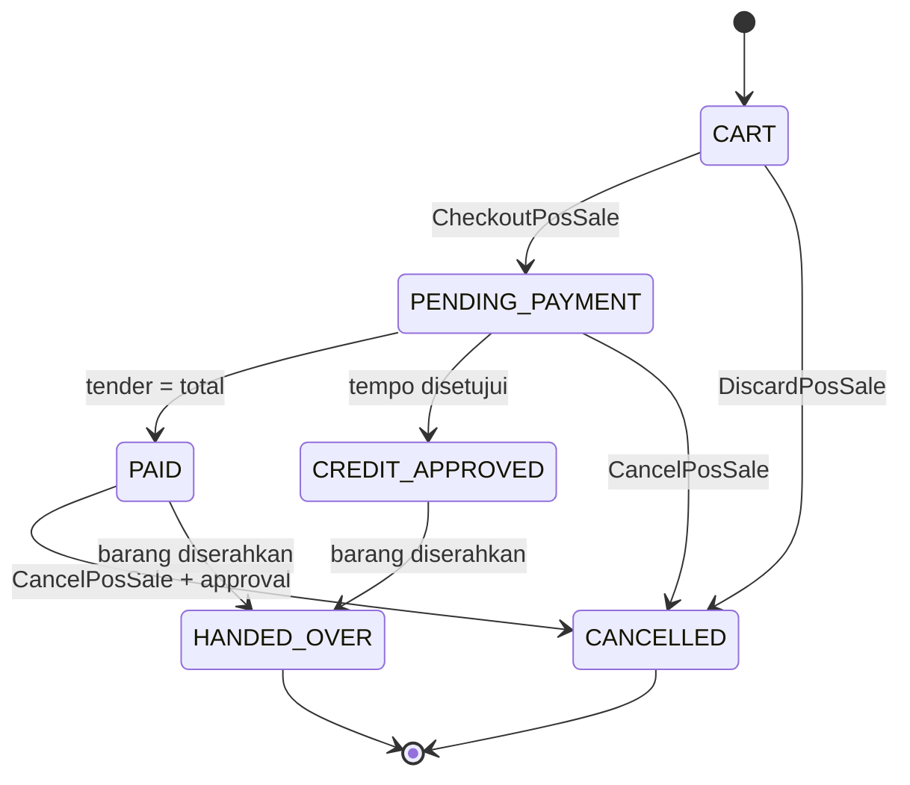
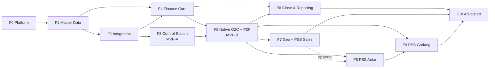

# PSS Operating Platform — Product & Development PRD 1.0
## Greenfield Implementation Baseline

**DOCUMENT STATUS: DRAFT FOR PRODUCT / OPERATIONS / FINANCE / ENGINEERING REVIEW**

| Field | Nilai |
|---|---|
| Versi | 1.0 — draf untuk review |
| Tanggal | 24 September 2026 |
| Organisasi | PT Putra Sumber Sari (PSS) |
| Isi | 93 bagian · 295 feature spec · Appendix A–P |
| Dokumen pendamping | `AGENTS.md` · `docs/ARCHITECTURE.md` · `docs/DESIGN_SYSTEM.md` · `docs/IMPLEMENTATION_PLAN.md` |
| Dokumen sumber belum diterima | Business Overview.pdf, Data Warehouse V2 (.sql/.pdf) — item bergantung ditandai ⛔ (OD-102) |

## Daftar Isi

**PART I — DOCUMENT GOVERNANCE**

- 1. Document Control
- 2. Purpose
- 3. Scope
- 4. Source Documents & Traceability
- 5. Terminology & Glossary
- 6. Decision Hierarchy
- 7. Open Decisions & Working Assumptions

**PART II — PRODUCT**

- 8. Executive Summary
- 9. Product Vision
- 10. Product Principles
- 11. User Groups
- 12. Product Surfaces
- 13. UX Constitution — Product Acceptance
- 14. Role Experience Matrix

**PART III — BUSINESS & DOMAIN MODEL**

- 15. Business Context
- 16. Business Dimensions
- 17. Canonical Domain Model
- 18. Domain Ownership Matrix
- 19. Source-of-Truth Matrix
- 20. Principal System Policy
- 21. Master Data Governance

**PART IV — CORE ERP FEATURES**

- 22. Identity & Access
- 23. Organization, Branch & Warehouse
- 24. Customer & Outlet
- 25. Product / SKU / UOM
- 26. Principal & Supplier
- 27. Commercial Rules & Pricing
- 28. Tax
- 29. Sales Order
- 30. Credit
- 31. Fulfillment
- 32. Inventory (Financial Ledger)
- 33. Procurement
- 34. Invoicing
- 35. Returns & Credit Notes
- 36. Accounts Receivable
- 37. Payments
- 38. Collections
- 39. Cash Custody
- 40. Accounts Payable

**PART V — OPERATIONAL PRODUCTS**

- 41. PSS Sales
- 42. PSS Gudang
- 43. PSS Antar
- 44. PSS Admin
- 45. PSS Supervisor
- 46. PSS Control Station

**PART VI — FINANCE**

- 47. PSS Keuangan (produk)
- 48. Chart of Accounts & Financial Dimensions
- 49. Accounting Posting
- 50. Journal
- 51. Bank & Cash
- 52. Reconciliation
- 53. Accounting Period
- 54. Month-End Close
- 55. Financial Reporting
- 56. Audit Adjustment & Opening Balances

**PART VII — SHARED SERVICES**

- 57. Geo
- 58. Fleet & Routing
- 59. Integration Hub
- 60. Approval Engine
- 61. Documents, Numbering & Printing
- 62. Media
- 63. Notifications
- 64. Search

**PART VIII — DATA**

- 65. Operational Database
- 66. Canonical Data & Provenance
- 67. Data Warehouse
- 68. Data Quality & Exception Queues
- 69. Reporting
- 70. Audit & Reconciliation

**PART IX — SYSTEM BEHAVIOR**

- 71. API Principles
- 72. Event Architecture
- 73. Idempotency
- 74. Offline Architecture
- 75. Error Handling
- 76. Observability
- 77. Security
- 78. Privacy

**PART X — IMPLEMENTATION**

- 79. Engineering Stack
- 80. Repository Structure
- 81. Coding-Agent Guardrails
- 82. Testing Strategy
- 83. CI/CD
- 84. Feature Flags
- 85. Migration & Coexistence
- 86. Deployment & Environments
- 87. Backup & Disaster Recovery

**PART XI — DELIVERY**

- 88. MVP-A — Operational Data Backbone
- 89. MVP-B — PSS-Native Operations
- 90. Phase Roadmap
- 91. Epic Map
- 92. Dependency Map
- 93. Release Acceptance Gates

**PART XII — APPENDICES**

- Appendix A — Feature Registry
- Appendix B — Requirement Registry (ringkasan)
- Appendix C — Event Catalog
- Appendix D — Role-Permission Matrix
- Appendix E — State Machine Registry
- Appendix F — Error & Reason Code Registry
- Appendix G — Reporting Matrix
- Appendix H — Accounting Posting Matrix
- Appendix I — Data Warehouse Mapping ⛔
- Appendix J — Open Decision & Working Assumption Register
- Appendix K — ADR Register
- Appendix L — Definition of Done
- Appendix M — Status Vocabulary & UI Copy Registry
- Appendix N — Policy & Configuration Registry
- Appendix O — Source Traceability & Compliance Matrix
- Appendix P — Exception Queue Registry

---

# PART I — DOCUMENT GOVERNANCE

## 1. Document Control

### 1.1 Identitas dokumen

| Field | Nilai |
|---|---|
| Judul | PSS Operating Platform — Product & Development PRD 1.0 — Greenfield Implementation Baseline |
| Nama file | `PSS_OPERATING_PLATFORM_PRODUCT_PRD.md`. Di repository, file ini disimpan sebagai `docs/PRODUCT_PRD.md` (PLT-000.R64). |
| Versi | 1.0 — draf untuk review |
| Status | **DRAFT FOR PRODUCT / OPERATIONS / FINANCE / ENGINEERING REVIEW** |
| Tanggal | 24 September 2026 |
| Organisasi | PT Putra Sumber Sari (PSS). Satu organisasi dan satu badan hukum (ASUMSI KERJA; OD-02) |
| Bahasa | Prosa dalam Bahasa Indonesia. Identifier teknis (entity, command, event, permission, config key, skema, path API, state) dalam Bahasa Inggris |
| Pembaca | Product owner, Operasional, Finance, Engineering, serta coding agent (Codex / Claude Code) yang mengimplementasikan platform |
| Sifat | Baseline implementasi greenfield. Dokumen ini **tidak** berisi kode produksi atau pseudocode |
| Dokumen pendamping | `AGENTS.md`, `docs/ARCHITECTURE.md`, `docs/DESIGN_SYSTEM.md`, dan `docs/IMPLEMENTATION_PLAN.md` (terpisah, berubah per sprint) |

### 1.2 Owner per area

Product owner per domain belum ditetapkan (OD-06). Tabel ini memuat **usulan** owner yang dibutuhkan untuk sign-off. Kolom *Menyetujui* menunjukkan bagian PRD yang wajib disetujui owner tersebut sebelum gate fase terkait.

| Area | Owner (usulan) | Menyetujui | Gate |
|---|---|---|---|
| Produk & UX | Product Owner PSS | Part II, §13, Appendix M | F0 |
| Operasional penjualan & lapangan | Kepala Operasional Sales | §24, §27, §29–§31, §41, §45 | F5 / F7 |
| Gudang & pengiriman | Kepala Operasional Gudang & Distribusi | §32, §42, §43, §58 | F5 / F8 / F9 |
| Finance & pajak | CFO / Controller | §28, §34–§40, Part VI, Appendix H | F4 / F5 / F6 |
| Master data & integrasi | Kepala Data / IT | §21, §23–§26, §59, §66, §68 | F1 / F2 |
| Engineering & arsitektur | Lead Engineer / Arsitek | Part VII–X, Appendix C, E, K | F0 |
| Legal & privasi | Legal PSS | §77, §78, retensi (OD-19, OD-40) | F1 |

### 1.3 Riwayat revisi

| Versi | Tanggal | Perubahan | Oleh |
|---|---|---|---|
| Stage 1 | 24-09-2026 | Source review: inventori keputusan, fitur, konflik, open decision, gap | Penyusun PRD |
| Stage 2 | 24-09-2026 | Resolution record, daftar isi, taksonomi & registry fitur, peta kepemilikan, roadmap F0–F10 | Penyusun PRD |
| Stage 3 | 24-09-2026 | Product model: entitas canonical, kepemilikan fakta, source of truth, role & SoD, workflow, state machine, event, posting, konfigurasi, antrian | Penyusun PRD |
| 1.0-draft | 24-09-2026 | PRD penuh: 295 feature spec, bagian naratif, Appendix A–P | Penyusun PRD |

### 1.4 Sign-off

| Peran | Nama | Keputusan | Tanggal |
|---|---|---|---|
| Product Owner | — | — | — |
| Operasional | — | — | — |
| Finance (CFO / Controller) | — | — | — |
| Engineering | — | — | — |
| Legal | — | — | — |

Sign-off tidak berarti semua OPEN DECISION sudah tertutup. Sign-off berarti reviewer menerima (a) keputusan berlabel DITETAPKAN, (b) ASUMSI KERJA sebagai nilai default konfigurasi, dan (c) daftar OPEN DECISION beserta gate masing-masing (Appendix J).

### 1.5 Aturan perubahan dokumen

- DOC-CTL.R01 Perubahan PRD dilakukan lewat pull request ke `docs/PRODUCT_PRD.md`. Reviewer wajibnya adalah owner area yang terdampak (§1.2).
- DOC-CTL.R02 ID fitur, requirement, dan acceptance criterion **tidak pernah** dipakai ulang atau dinomori ulang. Fitur yang dihapus diberi status `DEPRECATED`. Fitur yang dipecah mendapat ID baru dengan penanda `supersedes` (§4.3).
- DOC-CTL.R03 Perubahan yang menyentuh struktur (skema, deployable, batas domain, kontrak event) wajib disertai ADR (Appendix K) sesuai AGT §2 dan ARC §22.
- DOC-CTL.R04 Menjawab sebuah OPEN DECISION berarti memperbarui Appendix J, konfigurasi terkait di Appendix N, dan bagian OPEN DECISIONS pada setiap feature spec yang merujuknya, dalam PR yang sama.
- DOC-CTL.R05 `docs/IMPLEMENTATION_PLAN.md` boleh mengubah urutan kerja di dalam satu fase. Rencana tersebut tidak boleh mengubah perilaku produk yang ditetapkan PRD.

## 2. Purpose

### 2.1 Apa yang diatur PRD ini

PRD ini menetapkan **perilaku produk** PSS Operating Platform secara cukup rinci sehingga engineer dan coding agent bisa mengimplementasikannya tanpa mengarang aturan bisnis. Isinya:

1. Apa yang dibangun: tujuh produk ditambah Konsol Sistem, 295 fitur, fase F0–F10, serta MVP-A dan MVP-B.
2. Siapa pemilik setiap fakta: domain, modul, dan skema. PRD juga menetapkan dari mana setiap fakta berasal selama masa transisi.
3. Bagaimana setiap fitur berperilaku: alur, aturan, state, event, idempotensi, audit, RBAC, offline, UX, copy, dampak finance/reporting/integrasi, serta acceptance criteria yang bisa diuji.
4. Nilai mana yang masih berupa konfigurasi atau asumsi, dan siapa yang wajib memvalidasinya sebelum gate apa.
5. Kriteria selesai per fitur (Appendix L) dan gate rilis per fase (§93).

### 2.2 Apa yang tidak diatur PRD ini

| Tidak diatur di sini | Diatur di |
|---|---|
| Cara kerja engineer dan coding agent, aturan PR, larangan umum | `AGENTS.md` (AGT) |
| Struktur sistem: deployable, batas domain, skema, pola integrasi, kriteria ekstraksi | `ARCHITECTURE.md` (ARC) |
| Pola interaksi, token visual, komponen, template halaman, aturan copy | `DESIGN_SYSTEM.md` (DSY) |
| Urutan tugas per sprint, estimasi, dan penugasan | `docs/IMPLEMENTATION_PLAN.md` |
| Kode, skema fisik final, dan payload lengkap | Repository: `packages/contracts`, `docs/api/`, `docs/events/` (tergenerasi) |
| Isi kontrak principal, isi COA, tarif pajak, dan nilai threshold approval | Data konfigurasi yang diisi owner bisnis (Appendix N) |

PRD **tidak menyalin** isi AGT, ARC, atau DSY. Bila perlu, PRD cukup merujuknya (misalnya "DSY §10.2") dan menambahkan aturan yang khusus mengikat implementasi PSS.

### 2.3 Cara membaca PRD ini

**Struktur bagian.** Setiap bagian fitur (Part IV–X) memakai pola yang sama:

1. `## NN. Judul`, diikuti paragraf tujuan dan batas kepemilikan.
2. `### NN.1 Current / Transition / Target`: kondisi hari ini, masa transisi, dan target.
3. Aturan lintas fitur bila ada, dengan ID `<PREFIX>-000.Rxx`.
4. Feature spec (`#### <ID> — Nama`), diurutkan menurut ID.

**Template feature spec.** Setiap fitur memuat 50 field dengan urutan tetap, mulai dari `FEATURE ID` sampai `DEFINITION OF DONE`. Label field ditulis dalam Bahasa Inggris karena berfungsi sebagai identifier template. Bila sebuah field tidak relevan, isinya ditulis `Tidak berlaku — <alasan>`; tidak ada field yang dibiarkan kosong. Setiap `DEFINITION OF DONE` diakhiri kalimat "Appendix L berlaku".

**Label keputusan.**

| Label | Arti | Boleh diimplementasikan? |
|---|---|---|
| **DITETAPKAN** | Keputusan produk/arsitektur yang didelegasikan reviewer kepada penyusun PRD, berdasarkan prinsip yang sudah ada di sumber | Ya. Perubahan berikutnya lewat ADR atau revisi PRD |
| **ASUMSI KERJA** (`ASM`) | Fakta bisnis yang belum diketahui. PRD memilih asumsi paling masuk akal, dan implementasinya **wajib konfiguratif** | Ya, sebagai nilai default konfigurasi. Wajib divalidasi owner sebelum gate yang disebut |
| **OPEN DECISION** (`OD-…`) | Tidak bisa dijawab tanpa pihak luar atau dokumen yang belum ada | Hanya bagian yang tidak bergantung padanya |
| **KOSONG** | Nilai konfigurasi yang sengaja tidak diberi default. Sistem berperilaku *fail-safe* sampai nilai diisi (misalnya fitur nonaktif, atau permintaan dialihkan ke approval level tertinggi) | Ya. Perilaku fail-safe dijelaskan di feature spec dan di Appendix N |
| ⛔ | Bergantung pada Business Overview atau Data Warehouse V2, yang belum diterima (OD-102) | Tidak, sampai dokumen diverifikasi |

**Kata kunci requirement.** "harus" berarti wajib. "tidak boleh" berarti larangan yang wajib diuji lewat Negative Acceptance Criteria. "boleh" berarti opsional dan tidak mengikat. Frasa kabur seperti "sesuai kebutuhan", "ditangani dengan tepat", "dan sebagainya", atau "dll." tidak dipakai dalam aturan.

## 3. Scope

### 3.1 In scope v1 (F0–F10)

| Area | Isi |
|---|---|
| Platform | Monorepo, kontrak, event (outbox/inbox), idempotensi, offline core, error handling, konfigurasi & feature flag, identitas & otorisasi, audit, approval engine, dokumen & penomoran & cetak, media, notifikasi, pencarian, kerangka exception queue, observability, keamanan & privasi, CI/CD, IaC, backup/DR |
| Master data | Organisasi, cabang, gudang (termasuk tipe `VEHICLE`/`VIRTUAL`), reference data dimensi bisnis, salesperson & tim, termin, customer (bill-to) & outlet (ship-to), produk/SKU/UOM, principal, supplier, Principal System Policy, merge dengan tombstone |
| Core ERP | Harga & diskon baris, pajak (PPN), sales order, kredit, fulfillment, persediaan finansial (moving average, transfer, opname, penyesuaian), pembelian, invoicing, retur & nota kredit, piutang, pembayaran & application, penagihan, custody kas, utang usaha |
| Produk operasional | PSS Sales (SFA), PSS Gudang (WMS), PSS Antar (driver/POD), PSS Admin, PSS Supervisor, PSS Control Station |
| Finance | COA & dimensi, posting otomatis dari event, jurnal manual, bank & kas (termasuk kas kecil), rekonsiliasi bank dan subledger, periode & tutup buku, laporan keuangan, penyesuaian audit, saldo awal |
| Shared services | Geo (lokasi, Plus Code, area administratif, territory, geofence), armada & rute, Integration Hub (ND6, FoxPro, CSV/XLSX generik, outbound) |
| Data | Read model operasional, DW V3, data quality, reporting, audit & rekonsiliasi |
| Migrasi | Saldo awal, cutover per stream/cabang/gudang, paralel run, rollback |

### 3.2 Out of scope v1 dan non-goals

| Non-goal | Alasan / jalur alternatif |
|---|---|
| Menjadi SaaS multi-tenant | Satu organisasi. `organization_id` tetap ada di semua tabel bisnis dan envelope event (CON-32) |
| Mengganti ND6 untuk proses yang diwajibkan principal | ND6 tetap menjadi authority sesuai kontrak. PSS mengimpor faktanya dan berjalan dalam mode OBSERVED (DEC-100) |
| Memperluas basis kode atau produk lain | Greenfield khusus PSS (ADR-0001) |
| Register aset tetap | Penyusutan dicatat lewat template jurnal manual (OD-124) |
| Multi-currency / FX | IDR menjadi mata uang fungsional. Field `currency` tetap ada (OD-106) |
| Intercompany | Satu badan hukum. Transfer antar cabang dicatat pada nilai cost dengan dimensi cabang (OD-24) |
| Payroll, HR, dan manajemen aset kendaraan penuh | Di luar domain distribusi. Perawatan kendaraan dibahas di OD-172 |
| Kubernetes, multi-region aktif-aktif | ARC §18; §86–§87 |
| Aplikasi iOS native | Perangkat lapangan diasumsikan Android (APRD ASM-05); PWA |

### 3.3 Ditunda ke F10

Fitur berikut ditunda ke F10 (Optimization & Advanced): optimasi rute VROOM, GPS kendaraan kontinu, ekonomi rute, Penjualan Kanvas (kecuali ditarik ke F7, OD-114), mesin promo & klaim principal, retur ke principal, integrasi langsung DJP & API bank, QRIS/VA, outbound DMS otomatis, BI lanjutan, dan intake pesanan lewat WhatsApp Business.

## 4. Source Documents & Traceability

### 4.1 Dokumen sumber

| Kode | Dokumen | Status | Peran |
|---|---|---|---|
| AGT | `AGENTS.md` | Diterima, dibaca penuh | Governance (prioritas tertinggi) |
| ARC | `ARCHITECTURE.md` — Greenfield Architecture 1.0 | Diterima, dibaca penuh | Struktur |
| DSY | `DESIGN_SYSTEM.md` — Design System & UX Standard 1.0 | Diterima, dibaca penuh | UX (prioritas tertinggi untuk interaksi) |
| APRD | PSS Operating Platform Architecture PRD 1.0 (`.md`) | Diterima, dibaca penuh | Business intent dan requirement asal (REQ-xxx). Setelah PRD ini disetujui, dipindah ke `docs/source/` |
| BOV | Business Overview.pdf | **Belum diterima** (OD-102) | Business intent prioritas #1 |
| DW2 | Data Warehouse V2 (.sql / .pdf) | **Belum diterima** (OD-102) | Model analitis prioritas #1 |
| S1 / S2 / S3 | Dokumen Stage 1, Stage 2, dan Stage 3 PRD ini | Diterima reviewer tanpa koreksi | Keputusan DEC-xxx, konflik CON-xx, gap GAP-xx, dan model produk |

Semua fakta tentang ND6, FoxPro, kontrak principal, dan praktik akuntansi saat ini **hanya** berasal dari APRD. PRD tidak menambahkan fakta baru tentang hal-hal tersebut. Bagian yang bergantung pada BOV atau DW2 ditandai ⛔.

### 4.2 Aturan kutipan

- Rujukan ditulis `APRD §24.2`, `APRD REQ-240`, `ARC §13.5`, `AGT §4.3`, `DSY §10.2` atau `DSY UX-06`.
- Keputusan penyusun ditulis `DEC-xxx` (Stage 1: DEC-001…096; Stage 3: DEC-100…113). Konflik ditulis `CON-xx`, dan gap sumber ditulis `GAP-xx`.
- Setiap feature spec memuat field `SUMBER` yang berisi ID asal. ID REQ dan ADR dari APRD **tidak** dipakai ulang sebagai ID baru; ID tersebut hanya dikutip.
- Workflow W-01…W-13 (§15.3), state machine `STM-*` (Appendix E), dan baris posting `P-xx` (Appendix H) dipakai sebagai rujukan silang.

### 4.3 Strategi ID

| Jenis | Format | Contoh | Aturan |
|---|---|---|---|
| Fitur | `<PREFIX>-<NNN>` | `ORD-003` | Berurutan per prefix. Tidak pernah dipakai ulang. Dihapus → `DEPRECATED`. Dipecah → ID baru dengan `supersedes` |
| Aturan lintas fitur | `<PREFIX>-000.R<NN>` | `PLT-000.R07` | Aturan umum untuk satu area |
| Requirement | `<FEATURE>.R<NN>` | `ORD-003.R04` | Satu kalimat "harus" atau "tidak boleh" yang dapat diuji |
| Business rule | `<FEATURE>.BR<NN>` | `CRD-002.BR01` | Rumus atau aturan keputusan. Nilai default dirujuk ke Appendix N |
| Acceptance / negatif / test | `<FEATURE>.AC<NN>` / `.NC<NN>` / `.TS<NN>` | `GL-004.NC01` | AC ditulis dalam format Given/When/Then |
| Keputusan / ADR | `DEC-<NNN>` / `ADR-<NNNN>` | `DEC-105`, `ADR-0012` | Appendix K |
| Open decision / asumsi | `OD-<NNN>` / `ASM-<NNN>` | `OD-112` | Appendix J |
| State machine | `STM-<Aggregate>` | `STM-Payment` | Appendix E |
| Event | `UPPER_SNAKE_CASE`, bentuk lampau | `INVOICE_ISSUED` | Appendix C. Versi dicatat di `eventVersion` |
| Command | `PascalCase` imperatif | `IssueInvoice` | — |
| Permission | `domain.resource.action` | `finance.journal.approve` | Appendix D |
| Role | `UPPER_SNAKE_CASE` | `AR_OFFICER` | Appendix D |
| Config key | `domain.policy_name` | `invoicing.recognition_point` | Appendix N |
| Exception queue | `Q-<NAME>` | `Q-UNMAPPED_CUSTOMER` | Appendix P |
| Reason code / error code | `RC-<AREA>-<CODE>` / `UPPER_SNAKE_CASE` | `RC-DLV-STORE_CLOSED` / `CREDIT_APPROVAL_REQUIRED` | Appendix F |

### 4.4 Traceability

Appendix A memuat semua fitur beserta fase, prioritas, dependensi, dan sumbernya. Appendix B memuat ringkasan requirement per fitur. Appendix O memuat matriks sumber → fitur yang menjadi dasar compliance review (Stage 5).

## 5. Terminology & Glossary

Kolom *Label UI* adalah istilah baku yang wajib dipakai di layar (DSY §14). Kolom *Identifier* dipakai di kode, database, dan event. Istilah di kolom *Label UI* tidak boleh diganti sinonim di layar mana pun (UX-002).

| Label UI (ID) | English | Identifier | Definisi |
|---|---|---|---|
| Organisasi | Organization | `Organization` | Badan hukum PSS (satu di v1) |
| Cabang | Branch | `Branch` | Unit operasi (penjualan dan/atau fulfillment) |
| Gudang | Warehouse | `Warehouse` | Tempat stok. Tipe: `STANDARD`, `VEHICLE` (stok di kendaraan), `VIRTUAL` |
| Principal | Principal | `Principal` | Pemilik brand yang produknya didistribusikan PSS |
| Pemasok | Supplier | `Supplier` | Pihak tempat PSS membeli barang. Sering sama dengan principal |
| Pelanggan | Customer | `Customer` | Pembeli legal/komersial (bill-to). Kredit melekat di sini |
| Toko | Outlet | `Outlet` | Titik jual / ship-to milik satu customer |
| Produk / SKU | Product | `Product` | Barang yang dijual, dengan UOM dasar dan konversi |
| Satuan | Unit of measure | `ProductUom` | Satuan jual beserta faktor konversi ke satuan dasar |
| Aliran Pendapatan | Revenue stream | `revenue_stream` | PRINCIPAL / MIX / TRADER. Ditentukan per baris order (APRD ASM-02) |
| Kebijakan Sistem Principal | Principal System Policy | `PrincipalSystemPolicy` | Baris data yang menentukan sistem mana yang menjadi authority untuk proses tertentu per (principal/stream, cabang/gudang, tanggal) |
| Mode Diamati / Dikelola | Observed / Managed | `pss_mode` = `OBSERVED` / `MANAGED` | OBSERVED: fakta proses diimpor dari sistem eksternal. MANAGED: PSS menjalankan proses tersebut (DEC-100) |
| Asal eksternal | External origin | `source_system ≠ PSS` | Record yang berasal dari ND6/FoxPro/file dan membawa provenance |
| Pemetaan | Mapping | `ExternalEntityMapping` | Pasangan kode eksternal ↔ ID canonical |
| Pesanan | Sales order | `SalesOrder` | Permintaan customer yang diterima untuk diproses |
| Permintaan Pesanan | Order request | `OrderRequest` | Pesanan dari PSS Sales sebelum diterima Core ERP (DEC-108) |
| Keputusan Kredit | Credit decision | `CreditDecision` | Hasil evaluasi kredit per pesanan |
| Reservasi | Stock reservation | `StockReservation` | Stok yang dicadangkan untuk baris pesanan |
| Permintaan Penyiapan | Fulfillment request | `FulfillmentRequest` | Instruksi ke gudang untuk menyiapkan barang |
| Surat Jalan | Delivery order | `DeliveryOrder` | Dokumen pengiriman komersial |
| Pengiriman / Rit | Shipment | `Shipment` | Satu perjalanan kendaraan dengan beberapa stop |
| Percobaan Kirim | Delivery attempt | `DeliveryAttempt` | Satu upaya pengiriman satu Surat Jalan di satu stop |
| Bukti Terima | Proof of delivery | `ProofOfDelivery` | Nama penerima, tanda tangan, dan/atau foto |
| Faktur | Invoice | `Invoice` | Tagihan ke customer. Setelah ISSUED tidak bisa dibatalkan (DEC-106) |
| Faktur Pajak | Tax invoice | `tax_invoice_ref` | Nomor/referensi faktur pajak PPN |
| Nota Kredit | Credit note | `CreditNote` | Koreksi yang mengurangi faktur |
| Retur | Sales return | `SalesReturn` | Barang yang dikembalikan customer |
| Piutang | Receivable | `Receivable` | Piutang per faktur. Punya tiga dimensi independen: pelunasan, umur, dan sengketa |
| Umur Piutang | Aging | `aging_bucket` | Kelompok hari lewat jatuh tempo (turunan) |
| Tagihan / Tugas Tagih | Collection task | `CollectionTask` | Tugas menagih faktur tertentu |
| Bukti Bayar | Payment evidence | `PaymentEvidence` | Bukti yang dicatat di lapangan. **Belum** menjadi pembayaran |
| Pembayaran | Payment | `Payment` | Uang dari customer. Masuk buku saat Terverifikasi (DEC-104) |
| Terverifikasi | Verified | `VERIFIED` | Uang sudah dicocokkan dengan mutasi bank, hitungan kas, atau giro cair |
| Alokasi Pembayaran | Payment application | `PaymentApplication` | Alokasi pembayaran ke faktur (oleh AR Officer) |
| Penerimaan Belum Dialokasikan | Unapplied receipts | `UNAPPLIED_RECEIPTS` | Role akun untuk pembayaran terverifikasi yang belum dialokasikan (DEC-105) |
| Serah Terima Kas | Cash handover | `CashHandoverDeclaration` / `CashCustodyRecord` | Deklarasi oleh penagih, lalu verifikasi oleh kasir |
| Giro | Post-dated cheque | method `GIRO` | Pembayaran dengan tanggal efektif. Bisa ditolak bank (bounced) |
| Pesanan Pembelian | Purchase order | `PurchaseOrder` | Pesanan ke pemasok |
| Penerimaan Barang | Goods receipt | `GoodsReceipt` | Penerimaan finansial barang dari pemasok |
| Tagihan Pemasok | Supplier invoice | `SupplierInvoice` | Invoice dari pemasok, dicocokkan dengan PO dan penerimaan |
| Utang | Payable | `Payable` | Utang per tagihan pemasok |
| Mutasi Stok | Inventory movement | `InventoryMovement` | Perubahan stok append-only beserta nilai cost |
| Dalam Pengiriman / Dalam Transfer / Karantina | In transit / Quarantine | `IN_TRANSIT_DELIVERY` / `IN_TRANSIT_TRANSFER` / `QUARANTINE` | Lokasi finansial virtual di ledger persediaan (DEC-102) |
| HPP | Cost of goods sold | `COGS` | Diakui bersamaan dengan pendapatan per baris faktur (DEC-103) |
| Stock Opname | Stock count | `StockCount` | Penghitungan fisik gudang non-WMS |
| Tugas Gudang | Warehouse task | `WarehouseTask` | Tugas receive/putaway/pick/pack/stage/load/count di PSS Gudang |
| Lokasi / Bin | Warehouse location | `WarehouseLocation` | Zona → lorong → rak → bin |
| Kunjungan | Visit | `Visit` | Eksekusi kunjungan salesperson ke toko |
| Rencana Kunjungan | Visit plan | `VisitPlan` | Daftar toko per salesperson per hari |
| Wilayah | Territory | `Territory` | Geometri dimiliki Geo. Penugasan dimiliki SFA/Core ERP |
| Akun | Account | `Account` | Akun Chart of Accounts |
| Role Akun | Account role | `account_role` | Nama logis akun (misalnya `AR_CONTROL`) yang dipetakan Finance ke COA |
| Aturan Posting | Posting rule | `PostingRule` | Aturan event → baris jurnal, di-versioning |
| Jurnal | Journal | `Journal` | Jurnal SYSTEM / MANUAL / REVERSAL / OPENING / ADJUSTMENT / YEAR_END |
| Buku Besar | General ledger | GL | Kumpulan jurnal POSTED. Hanya ada di Finance |
| Periode | Accounting period | `AccountingPeriod` | OPEN → SOFT_CLOSE → CLOSED |
| Tutup Buku | Month-end close | `CloseChecklist` | Checklist per periode sebelum CLOSED |
| Menunggu Keputusan Periode | Posting period decision | `Q-POSTING_PERIOD_DECISION` | Antrian event yang tanggal bisnisnya jatuh di periode CLOSED (CON-05) |
| Mutasi Bank | Bank statement line | `BankStatementLine` | Baris rekening koran yang diimpor. Dimiliki Finance |
| Kas Kecil | Petty cash | `PettyCashExpense` | Pengeluaran kas cabang dengan bukti |
| Persetujuan | Approval | `ApprovalRequest` | Permintaan keputusan. Efeknya dijalankan domain pemilik (DEC-109) |
| Perlu Ditindaklanjuti | Exception item | `ExceptionItem` | Item antrian kerja (DEC-110, Appendix P) |
| Salinan | Copy | `copy_flag` | Tanda pada cetak ulang dokumen |
| Batal (nomor) | Voided number | `DOCUMENT_NUMBER_VOIDED` | Nomor yang sudah dicadangkan tetapi tidak dipakai. Tidak boleh dipakai ulang |
| Tanggal Bisnis | Business date | `businessDate` | Tanggal kejadian menurut zona Asia/Jakarta. Dasar periode dan posting |
| Kesegaran Data | Data freshness | `SourceHealthView` | Waktu data terakhir diterima per sumber |

## 6. Decision Hierarchy

### 6.1 Urutan baca ≠ urutan menang

Engineer dan coding agent membaca dokumen dengan urutan AGT → ARC → DSY → PRD → IMPLEMENTATION_PLAN. Bila terjadi konflik, dokumen yang menang **bergantung pada jenis pertanyaannya** (CON-29, ADR-0018):

| Jenis pertanyaan | Dokumen yang menang | Contoh |
|---|---|---|
| Cara kerja, larangan, gate PR, kualitas kode | **AGT** | Larangan custom auth protocol; semua gate CI wajib |
| Struktur: deployable, domain, skema, pola integrasi, ekstraksi | **ARC** (di bawah AGT) | Finance adalah deployable terpisah; modul tidak membaca tabel modul lain |
| Interaksi, visual, komponen, copy, batas aksi | **DSY** | Maksimal 3 aksi terlihat; driver maksimal 2 aksi utama |
| Perilaku produk: aturan bisnis, state, event, posting, default konfigurasi | **PRD** | Pembayaran masuk buku saat VERIFIED; HPP bersama pendapatan |
| Urutan kerja dalam fase | IMPLEMENTATION_PLAN | Urutan slice F2 |

### 6.2 Aturan penyelesaian konflik

- HIER.R01 Bila PRD bertentangan dengan AGT atau ARC dalam soal struktur atau cara kerja, AGT/ARC yang berlaku. PRD wajib dikoreksi lewat PR, dan konfliknya dicatat di Appendix K.
- HIER.R02 Bila PRD bertentangan dengan DSY dalam soal interaksi, DSY yang berlaku. Feature spec menyesuaikan.
- HIER.R03 Bila AGT/ARC/DSY diam tentang perilaku bisnis, PRD yang menentukan.
- HIER.R04 Konflik tidak boleh diselesaikan diam-diam di kode. Engineer atau agent yang menemukan konflik harus berhenti, mencatatnya di PR atau issue, lalu meminta keputusan owner (AGT §2).
- HIER.R05 APRD adalah sumber asal. Bila APRD berbeda dari PRD, **PRD yang berlaku**. Perbedaan yang disengaja sudah dicatat sebagai DEC/CON di Stage 1–3 dan di Appendix K.
- HIER.R06 Isi ASUMSI KERJA dan KOSONG berupa konfigurasi (Appendix N). Mengubah nilainya tidak memerlukan perubahan kode maupun revisi PRD. Yang diperlukan hanya persetujuan owner konfigurasi (PLT-009).

## 7. Open Decisions & Working Assumptions

### 7.1 Ringkasan

Register lengkap ada di Appendix J. Dari semua OD, hal berikut paling menentukan keberhasilan fase:

| Gate | OD / ASM yang wajib terjawab atau tervalidasi | Owner | Dampak bila tidak terjawab |
|---|---|---|---|
| F0 | OD-119 (vendor cloud), OD-120 (IdP, default Keycloak), OD-41 (volume), OD-185 (backend observability), OD-187 (tool IaC), OD-188 (RPO/RTO) | Engineering, Management | Fondasi tidak dapat dibangun atau diukur |
| F1 | OD-18 / OD-40 (NPWP/NIK & review UU PDP), OD-19 (retensi), OD-117 (customer vs outlet — DITETAPKAN, perlu validasi steward) | Legal, Data | Field sensitif tetap disembunyikan; retensi memakai ASUMSI |
| F2 | OD-03 / OD-03b (akses & stabilitas ID ND6), OD-04 / OD-14 (format & dataset FoxPro), OD-07, OD-11, OD-12 (isi kontrak per principal) | Operasional, principal, Komersial | Connector khusus menunggu. Connector file generik tetap berjalan |
| F4 | OD-103 (sistem akuntansi saat ini & saldo awal), OD-104 (isi COA), OD-32 (pemetaan role akun), OD-105 (tahun fiskal), OD-132 (HPP stream OBSERVED), OD-164 (reopen berantai) | Finance | Finance tidak bisa go-live |
| F5 | Validasi ASUMSI pajak (PKP, OD-112), costing (OD-107), recognition (OD-09), OD-135 (landed cost), OD-136 (penerimaan tanpa PO), OD-140/141 | Finance, Tax, Ops | MVP-B tertahan |
| F6 | OD-129 (approver close), OD-161 (akun antarkantor), OD-181 (engine DW/BI) | Finance, Data | Close & laporan memakai default konfigurasi; DW tertunda |
| F7 | OD-21 / OD-22 (lisensi BIG & tile), OD-114 (kanvas) | GIS, Sales | Peta memakai fallback alamat |
| F8 | OD-15 (COD — DITETAPKAN per flag), OD-171 (hosting OSRM) | Ops, Finance, Engineering | COD nonaktif |
| F10 | OD-17 (DJP), OD-142 (QRIS/VA), OD-163 (API bank), OD-180 (WhatsApp) | Finance, Engineering | Fitur F10 tertunda |

### 7.2 Aturan

- OD.R01 Setiap OD memiliki owner, gate, dan desain konfiguratif yang berlaku sementara (Appendix J).
- OD.R02 Implementasi **tidak boleh** mengarang jawaban OD. Bila feature spec belum cukup, engineer mengikuti nilai default ASUMSI/KOSONG di Appendix N, atau berhenti dan bertanya (HIER.R04).
- OD.R03 Gate rilis fase (§93) memeriksa daftar ASM dan KOSONG per fase (PLT-009.R03). Fase tidak boleh dirilis ke produksi selama ada ASM yang belum divalidasi owner untuk fase tersebut, kecuali ada pengecualian tertulis dari owner.
- OD.R04 Dokumen yang belum diterima (BOV, DW2) tetap dicatat sebagai OD-102. Semua item ⛔ diverifikasi ulang saat dokumen diterima, dan hasilnya dicatat di Appendix O.

# PART II — PRODUCT

## 8. Executive Summary

PSS (PT Putra Sumber Sari) adalah distributor dengan empat cabang di Jawa Barat. Penjualannya berjalan lewat tiga aliran pendapatan: Principal, Mix, dan Trader. Saat ini transaksi datang dari tiga jalur: **ND6** (DMS yang diwajibkan Nestlé dan juga dipakai PSS untuk beberapa principal lain), **FoxPro** per cabang (untuk Mix dan Trader), serta pesanan lewat WhatsApp yang diketik ulang secara manual. Akibatnya, master data terduplikasi, laporan terlambat, rekonsiliasi dilakukan manual, dan kontrol kas serta piutang lemah (APRD §2, §5, §7).

PSS Operating Platform dibangun **greenfield khusus untuk PSS** dengan satu aturan inti:

> Setiap transaksi, dari sistem mana pun asalnya, menjadi **satu record canonical PSS dengan provenance**. Pemenuhan, pengiriman, keuangan, dan pelaporan PSS berjalan di atas record canonical tersebut.

Keputusan kunci:

1. **Dua mode, satu model.** Untuk setiap proses, PSS berada dalam mode **OBSERVED** (fakta diimpor dari ND6/FoxPro) atau **MANAGED** (PSS menjalankan prosesnya). Mode ditentukan oleh *Principal System Policy* yang effective-dated. Tidak ada `if principal == …` di kode (DEC-100, ADR-0020).
2. **Satu buku besar, satu tanggal go-live.** PSS Finance menjadi buku resmi seluruh organisasi mulai satu tanggal. Dokumen dari sistem lama tetap diposting lewat canonical impor (ADR-0012).
3. **Kepemilikan eksklusif per fakta.** Setiap fakta punya tepat satu domain pemilik tulis. Efek lintas domain berjalan lewat command atau event. Keputusan approval dan penyelesaian antrian selalu dijalankan oleh domain pemilik (DEC-109, DEC-110).
4. **Modular monolith** dengan lima deployable (`web`, `api`, `finance-api`, `integration-worker`, `geo-service`). Service hanya diekstraksi lewat ADR dan bukti (ADR-0002).
5. **Library-first.** PostgreSQL/PostGIS, Redis/BullMQ, Keycloak, OpenFeature, MapLibre/OSM/Open Location Code, OSRM/VROOM, dan OpenTelemetry. PSS menulis aturan bisnis, workflow, adapter, dan UX, bukan infrastruktur.
6. **Bertahap tanpa big bang.**
   - **MVP-A (F0–F3):** tulang punggung data canonical dan Control Station. Belum ada perubahan proses frontline.
   - **MVP-B (F4–F6):** Finance menjadi buku resmi, lalu O2C dan P2P native menggantikan FoxPro untuk stream pilot lewat PSS Admin dan PSS Keuangan.
   - **F7–F9:** aplikasi lapangan (PSS Sales, PSS Antar, PSS Gudang).
   - **F10:** optimasi dan fitur lanjutan.

PRD ini memuat **295 fitur** dalam 11 fase. Setiap fitur memiliki spesifikasi lengkap yang bisa diimplementasikan dan diuji. Fakta bisnis yang belum diketahui (isi kontrak principal, isi COA, tarif, dan threshold) tidak dikarang. Nilai-nilai tersebut menjadi konfigurasi berlabel ASUMSI KERJA atau KOSONG, dengan owner dan gate validasi (Appendix J, N).

## 9. Product Vision

**Satu pandangan operasional dan finansial PSS yang utuh dan dapat dipercaya, apa pun sistem yang mencatat transaksinya. Setiap pengguna mengerjakan tugasnya dalam produk yang sederhana, sehingga pengguna baru bisa bekerja setelah 10 menit.**

| Stakeholder | Yang berubah |
|---|---|
| Owner / Direksi | Penjualan, piutang, kas, persediaan, dan pengecualian hari ini untuk semua cabang, principal, dan aliran pendapatan dalam satu Control Station, di hari yang sama |
| CFO / Controller | Satu GL, posting otomatis dari event, tutup buku dengan checklist, dan laporan keuangan yang bisa di-drill sampai dokumen sumber |
| Kepala Cabang | Pengecualian dan kinerja cabang tanpa konsolidasi spreadsheet; approval sesuai kewenangannya |
| Admin Penjualan | Berhenti mengetik ulang pesanan yang sudah ada di ND6; hanya menangani pesanan native dan pengecualian |
| Salesperson | Satu aplikasi untuk kunjungan, pesanan Mix/Trader, lokasi toko, tagihan, dan serah terima kas. Tetap berdampingan dengan ND6 SFA untuk proses yang diwajibkan principal |
| Petugas Gudang | Tugas berikutnya dan scan, dari satu antrian untuk semua sumber pesanan |
| Pengemudi | Rute hari ini, bukti terima, dan COD. Maksimal dua aksi utama per layar |
| Kasir & Petugas Piutang | Verifikasi uang terpisah dari alokasi; setiap rupiah punya bukti; kas yang belum disetor terlihat |
| Principal | Laporan kontraktual sebagai proyeksi yang dapat diaudit dari data canonical (F10) |
| Engineering / coding agent | Batas domain, kontrak, dan ownership yang stabil, sehingga tidak perlu menemukan ulang aturan bisnis |

**Non-goal:** mengganti ND6 untuk proses yang diwajibkan; mengganti FoxPro dalam satu langkah; menghapus WhatsApp sebagai kanal customer; membangun data lake; membangun infrastruktur sendiri untuk routing, peta, indeks spasial, autentikasi, atau messaging; melacak salesperson terus-menerus (APRD §3).

## 10. Product Principles

Prinsip arsitektur ada di ARC §3 dan prinsip interaksi di DSY §2–§3. Prinsip di bawah ini adalah prinsip **produk** yang mengikat setiap feature spec. Setiap prinsip punya cara uji.

| ID | Prinsip | Cara uji |
|---|---|---|
| PP-01 | **Satu fakta, satu pemilik.** Domain lain hanya membaca lewat API, event, atau read model | `architecture:check`, `db:check` (PLT-002) |
| PP-02 | **Canonical dengan provenance.** Record eksternal membawa `source_system`, `source_record_id`, `source_version`, dan `ingested_at`. Authority per fakta dicatat | Uji impor: provenance lengkap, field terkunci tidak bisa diubah (INT-000) |
| PP-03 | **Kebijakan sebagai data.** Authority, threshold, tarif, dan pengakuan pendapatan adalah konfigurasi effective-dated. Kode tidak memuat nama principal atau cabang | Lint literal (PLT-002); resolver PRI-004 |
| PP-04 | **Operasional tidak diblokir oleh akuntansi.** Dokumen operasional tidak pernah ditolak karena status periode. Finance memutuskan penempatan posting (CON-05) | GL-000; AC "periode CLOSED" per fitur posting |
| PP-05 | **Uang baru dianggap ada setelah terverifikasi.** Bukti lapangan dan serah terima kas bukan kas perusahaan (DEC-104) | P-10 hanya dari `PAYMENT_VERIFIED` |
| PP-06 | **Koreksi, bukan penghapusan.** Faktur, jurnal, mutasi stok, dan audit bersifat immutable. Koreksi dilakukan lewat nota kredit, reversal, atau movement baru | Uji immutabilitas di DB dan API |
| PP-07 | **Satu aksi berikutnya.** Setiap layar kerja menunjukkan satu aksi utama, maksimal tiga aksi terlihat, dan tidak menampilkan enum mentah | `ui:check`, UX-000 |
| PP-08 | **Frontline bekerja offline.** Salesperson dan pengemudi bisa menyelesaikan satu hari kerja tanpa sinyal. Server tetap authoritative | PLT-013; skenario offline |
| PP-09 | **Tidak ada yang hilang diam-diam.** Setiap kegagalan (mapping, posting, sinkronisasi, selisih) menjadi item antrian yang punya owner dan SLA | Appendix P; uji fault-injection |
| PP-10 | **Kontrol terpisah.** Maker ≠ approver, penagih ≠ verifikator ≠ pengalokasi. Kontrol ditegakkan di server | SOD-01…08 |
| PP-11 | **Terlihat sebelum diganti.** Proses dipindah ke PSS setelah datanya terlihat dan terekonsiliasi (MVP-A sebelum MVP-B), dengan paralel run dan rollback per policy | MIG-002…004; gate §93 |
| PP-12 | **Library-first.** Masalah infrastruktur diselesaikan dengan library/layanan matang (AGT §6) | Review PR; ADR untuk library baru |

## 11. User Groups

| Kelompok | Role (kode) | Konteks kerja | Perangkat | Literasi digital (asumsi) | Kebutuhan utama |
|---|---|---|---|---|---|
| Tenaga penjual lapangan | SALES_REP | Berkeliling ke banyak toko per hari sesuai rencana kunjungan; sinyal tidak stabil; bekerja sambil berdiri di toko | Android (APRD ASM-05), PWA | Menengah; terbiasa WhatsApp | Tahu toko berikutnya, pesan cepat dengan harga benar, tagih dengan bukti, setor kas tanpa sengketa |
| Supervisor lapangan | SALES_SUPERVISOR, DELIVERY_SUPERVISOR, WAREHOUSE_SUPERVISOR | Memantau tim; menyetujui pengecualian | Desktop / tablet | Menengah | Melihat siapa yang tertinggal dan apa yang tidak normal hari ini |
| Admin back-office | SALES_ADMIN, WAREHOUSE_ADMIN, DISPATCHER, PROCUREMENT_OFFICER, FLEET_ADMIN, COMMERCIAL_ADMIN | Input dan pengelolaan transaksi harian di kantor cabang | Desktop | Menengah–tinggi; terbiasa FoxPro/ND6 | Antrian kerja yang jelas; input cepat dengan keyboard; tidak mengetik ulang |
| Gudang | WAREHOUSE_OPERATOR | Bergerak di gudang; tangan sering penuh | Android / handheld scanner | Rendah–menengah | Tugas berikutnya, scan, konfirmasi. Minim mengetik |
| Pengemudi | DRIVER | Di jalan; waktu per stop singkat | Android, PWA | Rendah–menengah | Rute, stop berikutnya, bukti terima, COD. Maksimal 2 aksi utama |
| Keuangan | CASHIER, AR_OFFICER, FINANCE_MAKER, FINANCE_APPROVER, CONTROLLER | Verifikasi uang, alokasi, jurnal, rekonsiliasi, tutup buku | Desktop | Tinggi | Kontrol, bukti, jejak audit, tutup buku tepat waktu |
| Manajemen | BRANCH_MANAGER, CFO, CEO, COO | Keputusan & approval | Desktop / tablet | Menengah–tinggi | Ringkasan hari ini, pengecualian, drill-down |
| Data & integrasi | MASTER_DATA_STEWARD, INTEGRATION_OPERATOR, DATA_ANALYST | Kualitas master, mapping, kesehatan integrasi, analisis | Desktop | Tinggi | Antrian mapping/dedup, status sumber, lineage |
| Kontrol | INTERNAL_AUDIT | Pemeriksaan | Desktop | Tinggi | Akses baca penuh, ekspor audit, tanpa hak mutasi |
| Teknis | SYSTEM_ADMIN, GIS_ADMIN | Pengelolaan user, konfigurasi teknis, dataset peta | Desktop | Tinggi | Konsol Sistem; **tanpa** mutasi transaksi bisnis (SOD-07) |

Volume harian (kunjungan, pesanan, pengiriman) belum diukur. Angka yang ada adalah asumsi (APRD ASM-06) dan wajib diukur di F0 (OD-41). Volume dipakai untuk sizing, bukan sebagai aturan bisnis.

## 12. Product Surfaces

### 12.1 Produk

| Produk | Pengguna utama | Perangkat | Offline | Beranda | Navigasi (DSY §7.1) | Bagian |
|---|---|---|---|---|---|---|
| **PSS Sales** | Salesperson | Android (PWA) | **Ya**, satu hari kerja (`offline.max_age_hours` 72) | "Hari Ini": kunjungan berikutnya, tagihan jatuh tempo, pesanan bermasalah | Hari Ini · Toko · Tagihan · Saya | §41 |
| **PSS Gudang** | Petugas gudang | Android / handheld scanner (PWA) | Outage singkat | Tugas berikutnya | Tugas · Scan · Masalah · Saya | §42 |
| **PSS Antar** | Pengemudi | Android (PWA) | **Ya**, rute di-cache saat dispatch | Stop berikutnya | Rute Hari Ini · Bukti · Saya | §43 |
| **PSS Admin** | Admin Penjualan, Admin Gudang, Dispatcher, Staf Pembelian, Admin Armada, Admin Komersial, Pengelola Data Utama, Operator Integrasi | Desktop | Tidak | Antrian kerja per role | Sidebar berbasis pekerjaan sesuai entitlement | §44 |
| **PSS Supervisor** | Supervisor Sales, Supervisor Gudang, Supervisor Pengiriman | Desktop / tablet | Tidak | Tim hari ini + pengecualian tim | Sidebar ringkas per jenis supervisor | §45 |
| **PSS Keuangan** | Kasir, Petugas Piutang, Staf Akuntansi, Penyetuju Keuangan, Controller | Desktop | Tidak | "Tutup Buku" + antrian keuangan | Sidebar Finance (DSY §7.1) | §47 |
| **PSS Control Station** | Kepala Cabang, Direksi, CFO, Audit Internal (read-only), Analis Data | Desktop / tablet | Tidak | Apa yang terjadi hari ini, apa yang tidak normal, dan apa yang perlu ditindaklanjuti | Ringkasan · Penjualan · Persediaan · Piutang · Kas · Keuangan · Operasional · Pengecualian | §46 |
| **Konsol Sistem** (dalam shell PSS Admin) | Admin Sistem, Admin Peta | Desktop | Tidak | Kesehatan sistem & integrasi | Hanya fungsi teknis; **tidak ada mutasi transaksi bisnis** | §44 (ADM-008) |

Semua produk dibangun dalam satu deployable `apps/web` dengan route group per produk (PLT-000.R60). Satu identitas dipakai untuk semua produk (IDN-001). Entitlement produk ditentukan oleh role (RBAC-003).

### 12.2 Experience API (BFF)

Setiap produk punya BFF sendiri (PLT-008). BFF hanya menggabungkan read model dan domain API, lalu menerjemahkan state menjadi status vocabulary. BFF **tidak** memiliki aturan bisnis (ARC §7; PLT-000.R01).

| Produk | Endpoint BFF utama (konsep) | Menggabungkan | Offline |
|---|---|---|---|
| PSS Sales | `GET /sales/hari-ini` · `GET /sales/toko/{id}` · `GET /sales/katalog?outlet=` · `POST /sales/sync` · `GET /sales/tagihan` · `GET /sales/kas-saya` | sfa, orders, commercial, credit, ar, payments, geo, principal-policy | Snapshot harian + versi harga; `POST /sales/sync` idempotent per item |
| PSS Gudang | `GET /gudang/tugas-berikutnya` · `POST /gudang/scan` · `POST /gudang/tugas/{id}/konfirmasi` · `POST /gudang/masalah` | wms, master-data, fulfillment | Antrian konfirmasi untuk outage singkat |
| PSS Antar | `GET /antar/rute-hari-ini` · `GET /antar/stop/{id}` · `POST /antar/sync` | fleet, fulfillment, payments (COD), geo | Rute di-cache saat dispatch |
| PSS Admin | `GET /admin/antrian` · `GET /admin/pesanan/{id}` · `POST /admin/pesanan` · ruang kerja data utama, integrasi, gudang non-WMS, pembelian, dispatcher, Konsol Sistem | Domain Core ERP, integration, fleet, platform | — |
| PSS Supervisor | `GET /supervisor/tim-hari-ini` · `GET /supervisor/pengecualian` | Read model sfa/wms/fleet, approval | — |
| PSS Keuangan | `GET /finance/beranda` · `GET /finance/close/current` · `GET /finance/antrian/{queue}` · `GET /finance/laporan/{jenis}` | finance, payments, ar, ap, tax, approval | — |
| PSS Control Station | `GET /control-station/today` · `GET /control-station/breakdown` · `GET /control-station/objek/{type}/{id}` | Read model reporting, finance (KPI), kesehatan integrasi | — |

Semua endpoint BFF: filter scope dilakukan server-side; respons tidak berisi enum mentah (setiap state dikirim sebagai `{code, label, tone, icon}` dari Appendix M); respons menyertakan `permittedActions[]` yang menentukan tombol yang tampil.

### 12.3 Template halaman

Setiap layar memakai satu template DSY: **A** Mobile Task (Sales, Gudang, Antar), **B** Queue Desktop (antrian kerja Admin, Keuangan, Supervisor), **C** Control Station (dashboard), **D** Finance Close. Form desktop mengikuti DSY §8.4, dan layar scan mengikuti pola DSY §8.6. Fitur layar mencantumkan templatenya di field UX REQUIREMENTS.

## 13. UX Constitution — Product Acceptance

`DESIGN_SYSTEM.md` (DSY) adalah otoritas tertinggi untuk UX. Bagian ini **tidak menyalin** DSY. Bagian ini menerjemahkan aturan DSY menjadi **kriteria penerimaan produk** yang dapat diuji untuk setiap fitur yang tampil ke pengguna. Setiap feature spec di PRD merujuk ke aturan di bawah ini melalui field UX REQUIREMENTS, dan Definition of Done (Appendix L) mewajibkan semua aturan yang relevan lulus.

### 13.1 Cara aturan DSY diuji

Setiap aturan di bawah punya ID `UX-000.Rxx`, sumber DSY, metode uji, dan cakupan. Metode uji:

- **AUTO**: diuji otomatis di CI (`ui:check`, Playwright, lint aturan komponen; PLT-002).
- **REVIEW**: diperiksa reviewer desain/produk pada PR yang mengubah layar (checklist PR).
- **ONBOARD**: diuji lewat uji onboarding pengguna nyata (§13.3).

| ID | Aturan penerimaan | Sumber | Metode | Cakupan |
|---|---|---|---|---|
| UX-000.R01 | Satu layar mengerjakan satu pekerjaan. Judul layar adalah pekerjaan itu (kata kerja + objek). | DSY UX-01 | REVIEW | Semua |
| UX-000.R02 | Ada tepat satu aksi utama yang jelas per layar. Maksimal 3 aksi terlihat per layar/item. Aksi lain lewat menu "Lainnya". | DSY UX-02, §8.1 | AUTO (hitung tombol variant primary/visible di snapshot) + REVIEW | Semua |
| UX-000.R03 | Layar driver: maksimal 2 tombol primer, operasi satu tangan, ukuran huruf besar. | DSY §10.3; AGT §5 | AUTO | PSS Antar |
| UX-000.R04 | Alur gudang mobile: SCAN → CONFIRM → NEXT; scan salah ditolak tanpa mengubah state. | DSY §10.2; AGT §5 | AUTO (e2e) | PSS Gudang |
| UX-000.R05 | Urutan input: scan > pilih > konfirmasi > foto > ketik. Teks bebas tidak menjadi pilihan pertama untuk alasan/exception. | DSY UX-03, §8.7 | REVIEW | Semua mobile |
| UX-000.R06 | Target sentuh mobile ≥ 48 px; zoom 200% tidak merusak alur; kontras WCAG 2.2 AA; fokus terlihat; ikon-saja punya label aksesibel. | DSY §6.3, §15 | AUTO (axe + ukuran target) | Semua |
| UX-000.R07 | Tidak ada enum mentah, kode state, atau jargon backend di UI. Semua status berasal dari Appendix M (`{code,label,tone,icon}`) dan dikirim BFF. | DSY UX-04, UX-10 | AUTO (contract test BFF: tidak ada field state mentah tanpa label) | Semua |
| UX-000.R08 | Tombol adalah kata kerja Bahasa Indonesia (`Konfirmasi`, `Scan Ulang`); dilarang `OK`, `Submit`, `Process`. | DSY §8.1, §14 | AUTO (lint string) | Semua |
| UX-000.R09 | Setiap layar punya state loading, kosong, error, dan (mobile) offline yang didesain; tidak ada layar kosong tanpa pesan. | DSY §9 | AUTO (story/snapshot per state) + REVIEW | Semua |
| UX-000.R10 | Pesan error menyebut apa yang terjadi, kenapa, dan satu aksi pemulihan; tidak menyalahkan pengguna. Format: `CODE` → judul · penjelasan · aksi (Appendix F). | DSY UX-06, §14.2 | AUTO (setiap error code punya copy di registry) | Semua |
| UX-000.R11 | Konfirmasi dialog hanya untuk tindakan uang atau tidak dapat dibatalkan, dan menyebut nominal/pihak. | DSY §8.8 | REVIEW | Semua |
| UX-000.R12 | Default paling mungkin benar terisi (usulan alokasi, qty penuh, toko berikutnya). | DSY UX-05 | REVIEW | Semua |
| UX-000.R13 | Tampilan dibatasi role: menu tanpa nilai untuk role tidak tampil; aksi dari `permittedActions` server. | DSY UX-07, §7.2 | AUTO (e2e per role) | Semua |
| UX-000.R14 | Offline adalah keadaan normal di mobile: pekerjaan tersimpan lokal; hanya tiga status sinkron tampil (Tersimpan / Menunggu Sinkronisasi / Perlu Diperiksa). | DSY UX-09, §9.3–9.4 | AUTO (e2e offline) | PSS Sales, PSS Antar, PSS Gudang |
| UX-000.R15 | Uang: format Rupiah, tabular nums, rata kanan; tanggal `d MMM yyyy` Bahasa Indonesia; zona waktu Asia/Jakarta. | DSY §4, §12, §14 | AUTO (formatter tunggal di `packages/ui`) | Semua |
| UX-000.R16 | Warna hanya lewat token; tidak ada hex arbitrer di komponen fitur. | DSY §17 | AUTO (lint) | Semua |
| UX-000.R17 | Budget kinerja: PWA awal ≤ 5 detik di 3G setelah cache; transisi lokal ≤ 200 ms; umpan balik scan ≤ 700 ms online; dashboard utama ≤ 3 detik. | DSY §16 | AUTO (Lighthouse/RUM di staging) | Sesuai produk |
| UX-000.R18 | Halaman memakai template DSY §18: A Mobile Task, B Queue Desktop, C Control Station, D Finance Close; pola lain hanya dari komponen DSY §8. | DSY §8, §18 | REVIEW | Semua |
| UX-000.R19 | Exception-driven: beranda dan dashboard menampilkan yang perlu tindakan sebelum total/kinerja. | DSY UX-11 | REVIEW | Beranda & dashboard |
| UX-000.R20 | Coding agent mengikuti DSY §19 (aturan UI untuk agent); PR UI menyertakan screenshot state utama. | DSY §19 | REVIEW | Semua PR UI |

### 13.2 Checklist UX per fitur

Field **UX REQUIREMENTS** pada setiap feature spec wajib menyebutkan:

1. Template halaman (UX-000.R18) atau komponen DSY yang dipakai.
2. Aksi yang terlihat (≤ 3; driver ≤ 2 primer) dan aksi utama.
3. State non-happy-path yang relevan (UX-000.R09, R14).
4. Untuk fitur frontline (PSS Sales, PSS Antar, PSS Gudang): kriteria onboarding (§13.3).

Aturan bagian produk (`SFA-000`, `WMS-000`, `DLV-000`, `ADM-000`, `SUP-000`, `CST-000`, `FIN-000`) mengulang subset aturan ini sebagai konteks dan tidak boleh melonggarkannya.

### 13.3 Uji onboarding 10 menit (frontline)

Sumber: DEC-081, OD-127; DSY UX-08 ("pekerjaan rutin tidak membutuhkan manual book").

| Aspek | Ketentuan |
|---|---|
| Tujuan | Membuktikan pengguna frontline baru dapat menyelesaikan alur inti tanpa pelatihan kelas dan tanpa bantuan. |
| Alur yang diuji | PSS Sales: mulai kunjungan → buat pesanan 3 barang → terima pembayaran tunai → serahkan kas. PSS Antar: stop berikutnya → sudah sampai → terkirim sebagian dengan alasan → bukti → COD. PSS Gudang: tugas pick 3 baris termasuk 1 scan salah dan 1 barang kurang. |
| Peserta | Pengguna nyata dari role tersebut yang belum pernah memakai aplikasi. Jumlah per produk per rilis: 5 orang (**ASUMSI KERJA**; validasi Ops/HR sebelum F7). |
| Kondisi | Perangkat & jaringan setara lapangan; satu skenario dengan koneksi putus. Tanpa instruksi selain panduan dalam aplikasi (panel onboarding bila OD-127 memutuskan ada). |
| Kriteria lulus | ≥ 4 dari 5 peserta menyelesaikan seluruh alur ≤ 10 menit tanpa bantuan; nol kejadian data hilang; nol kejadian peserta tidak tahu aksi berikutnya lebih dari 30 detik (**ASUMSI KERJA** ambang, owner Product). |
| Bila gagal | Temuan dicatat sebagai defect UX berprioritas rilis; rilis frontline ke cabang berikutnya tertahan sampai uji ulang lulus (gate rilis §93). |
| Bukti | Rekaman layar (dengan izin), catatan waktu per langkah, daftar temuan. |

**OPEN DECISION:** OD-127 — ada atau tidaknya panel onboarding/tutorial dalam aplikasi. Kriteria uji tetap berlaku tanpa panel.

### 13.4 Fitur

#### UX-001 — `packages/ui`: Token, Komponen Dasar, Template Halaman A–D

**FEATURE ID:** UX-001
**FEATURE NAME:** `packages/ui`: token, komponen dasar, template halaman A–D
**DOMAIN OWNER:** Experience (`packages/ui`)
**PRIMARY USER:** Semua (engineer sebagai konsumen)
**FASE / PRIORITAS:** F0 · P1
**SUMBER:** DSY §3–8, §17–18; AGT §6 (Radix UI / shadcn/ui, Lucide, TanStack Table, React Hook Form); ARC §19
**PROBLEM:** Tanpa satu pustaka komponen, setiap produk membuat tombol, tabel, dan status sendiri sehingga UX tidak konsisten dan aturan §13.1 tidak bisa diuji otomatis.
**USER OUTCOME:** Semua produk memakai komponen yang sama: tombol, task card, status pill, input, selection card, scan screen, exception sheet, confirmation, toast, tabel, dan template halaman A–D.
**BUSINESS VALUE:** Konsistensi, kecepatan pengembangan, dan uji UX otomatis.
**IN SCOPE:** Token DSY §17 (warna, tipografi, spacing, radius, elevation); komponen DSY §8 di atas Radix/shadcn; template A–D; formatter uang/tanggal/angka (UX-000.R15); Storybook dengan state standar; aturan lint (warna token, label tombol).
**OUT OF SCOPE:** Komponen spesifik domain (tetap di app); logika bisnis (dilarang di `packages/*`, AGT §8).
**PRECONDITIONS:** PLT-001 (monorepo).
**TRIGGER:** Pengembangan F0.
**MAIN FLOW:** 1. Definisikan token. 2. Bangun komponen dasar + story per state. 3. Bangun template A–D. 4. Publikasikan sebagai workspace package. 5. Aktifkan lint & `ui:check`.
**ALTERNATIVE FLOW:** A1 Komponen baru diusulkan lewat PR ke `packages/ui` dengan referensi DSY.
**EXCEPTION FLOW:** E1 Kebutuhan tidak tercakup DSY → OPEN DECISION ke owner DSY, bukan komponen ad-hoc.
**BUSINESS RULES:** UX-001.BR01 Tidak ada hex arbitrer. UX-001.BR02 Tidak ada logika bisnis di `packages/ui`. UX-001.BR03 Library mengikuti daftar AGT §6; tidak membuat table/form/chart engine sendiri.
**REQUIREMENTS:** UX-001.R01 Setiap komponen punya story untuk state default, loading, disabled, error. UX-001.R02 Tombol memaksa label dari tipe kata kerja (lint). UX-001.R03 Formatter tunggal untuk Rupiah & tanggal Asia/Jakarta. UX-001.R04 Aksesibilitas WCAG 2.2 AA diuji axe di CI.
**DATA INPUT:** Tidak berlaku — pustaka komponen.
**DATA OUTPUT:** Package `@pss/ui`.
**OWNED ENTITIES:** Tidak ada.
**READ DEPENDENCIES:** Tidak ada.
**WRITE AUTHORITY:** Tidak ada.
**STATE TRANSITIONS:** Tidak ada.
**SYNCHRONOUS DEPENDENCIES:** Tidak ada.
**ASYNCHRONOUS EVENTS:** Tidak ada.
**EVENTS EMITTED:** Tidak ada.
**EVENTS CONSUMED:** Tidak ada.
**API / COMMAND CONCEPTS:** Tidak berlaku.
**IDEMPOTENCY REQUIREMENT:** Tidak berlaku — tidak ada mutasi.
**AUDIT REQUIREMENT:** Tidak berlaku.
**RBAC / SCOPE:** Tidak berlaku.
**OFFLINE BEHAVIOR:** Komponen mendukung state offline (UX-003).
**UX REQUIREMENTS:** UX-000.R01–R20 sebagai sumber.
**USER-FACING COPY EXAMPLES:** Label default komponen: `Coba Lagi`, `Muat Ulang`, `Batal`.
**ERROR / EXCEPTION COPY:** Tidak berlaku.
**REPORTING IMPACT:** Tidak ada.
**DATA WAREHOUSE IMPACT:** Tidak ada.
**FINANCE / ACCOUNTING IMPACT:** Tidak ada.
**INTEGRATION IMPACT:** Tidak ada.
**SECURITY / PRIVACY:** Tidak ada.
**OBSERVABILITY:** RUM hook standar di template.
**FEATURE FLAGS:** Tidak ada.
**MIGRATION / COEXISTENCE:** Tidak berlaku.
**ACCEPTANCE CRITERIA:** UX-001.AC01 Given komponen memakai hex arbitrer, Then lint CI gagal. UX-001.AC02 Given tombol berlabel "Submit", Then lint gagal. UX-001.AC03 Given Storybook, Then setiap komponen punya 4 state. UX-001.AC04 Given axe, Then tidak ada pelanggaran AA pada template A–D.
**NEGATIVE ACCEPTANCE CRITERIA:** UX-001.NC01 `packages/ui` tidak boleh mengimpor modul domain. UX-001.NC02 Library table/form/chart custom tidak boleh ada.
**TEST SCENARIOS:** UX-001.TS01 Architecture check impor. UX-001.TS02 Visual regression template. UX-001.TS03 Axe CI. UX-001.TS04 Lint string.
**DEPENDENCIES:** PLT-001.
**OPEN DECISIONS:** Tidak ada.
**DEFINITION OF DONE:** Semua AC/NC/TS lulus; `ui:check` aktif di CI. Appendix L berlaku.

#### UX-002 — Registry Status Vocabulary & i18n Bahasa Indonesia

**FEATURE ID:** UX-002
**FEATURE NAME:** Registry status vocabulary & i18n Bahasa Indonesia (Appendix M)
**DOMAIN OWNER:** Experience (`packages/contracts` untuk kode; registry label)
**PRIMARY USER:** Semua
**FASE / PRIORITAS:** F0 · P0
**SUMBER:** DSY UX-04, UX-10, §14; S3 §9; Appendix M; GAP-23
**PROBLEM:** Tanpa registry tunggal, setiap layar menerjemahkan state sendiri; enum mentah bocor, label berbeda antar produk, dan coding agent mengarang label.
**USER OUTCOME:** Setiap state dari setiap state machine tampil dengan label, warna (tone), dan ikon yang sama di semua produk, sesuai role bila perlu.
**BUSINESS VALUE:** Konsistensi dan kepercayaan pengguna; uji otomatis UX-000.R07.
**IN SCOPE:** Registry `{stmCode, state, role?} → {label, tone, icon, description}`; katalog copy error (Appendix F) dan copy umum; loader i18n `id-ID` (default & satu-satunya bahasa v1); endpoint/paket yang dipakai BFF; validasi kelengkapan terhadap STM registry dan error registry.
**OUT OF SCOPE:** Bahasa lain (tidak di v1).
**PRECONDITIONS:** PLT-003 (contracts).
**TRIGGER:** Setiap penambahan state/error code.
**MAIN FLOW:** 1. State baru ditambahkan di STM contracts. 2. CI memeriksa entri registry tersedia. 3. BFF memetakan state → `{code,label,tone,icon}`. 4. UI menampilkan status pill dari data itu.
**ALTERNATIVE FLOW:** A1 Label berbeda per role (misal driver vs admin) → entri dengan `role`.
**EXCEPTION FLOW:** E1 State tanpa entri → CI gagal (`contracts:check`). E2 Runtime menerima state tanpa entri → UI menampilkan label fallback "Status tidak dikenal" dan mengirim error OBS (tidak menampilkan kode).
**BUSINESS RULES:** UX-002.BR01 Label singkat (≤ 3 kata bila memungkinkan), kata benda/keadaan, Bahasa Indonesia baku (DSY §14.3 istilah baku). UX-002.BR02 Tone ∈ {neutral, info, success, warning, danger} sesuai token semantik. UX-002.BR03 Tidak ada label yang memuat kode teknis.
**REQUIREMENTS:** UX-002.R01 Sistem harus memvalidasi di CI bahwa setiap state STM dan setiap error code punya entri. UX-002.R02 BFF harus mengirim status sebagai objek, bukan string state. UX-002.R03 Registry berversi dan diimpor oleh web & PWA saat build. UX-002.R04 Perubahan label tidak memerlukan perubahan kode domain. UX-002.R05 Istilah baku DSY §14.3 menjadi kamus yang dicek lint (misal "Piutang Usaha", bukan "AR"). UX-002.R06 Copy error mengikuti format UX-000.R10.
**DATA INPUT:** Entri registry (file berversi di repo).
**DATA OUTPUT:** Paket registry; mapping BFF.
**OWNED ENTITIES:** Registry status & copy (artefak repo, Appendix M & F).
**READ DEPENDENCIES:** STM registry (Appendix E), error registry (Appendix F).
**WRITE AUTHORITY:** Owner Product/UX lewat PR; engineer tidak mengarang label (AGT §18 magic string).
**STATE TRANSITIONS:** Tidak ada.
**SYNCHRONOUS DEPENDENCIES:** Tidak ada.
**ASYNCHRONOUS EVENTS:** Tidak ada.
**EVENTS EMITTED:** Tidak ada.
**EVENTS CONSUMED:** Tidak ada.
**API / COMMAND CONCEPTS:** Paket `@pss/contracts/status`; tipe `StatusView {code,label,tone,icon}`.
**IDEMPOTENCY REQUIREMENT:** Tidak berlaku — artefak build.
**AUDIT REQUIREMENT:** Riwayat git.
**RBAC / SCOPE:** Tidak berlaku.
**OFFLINE BEHAVIOR:** Registry dibundel di PWA (tersedia offline).
**UX REQUIREMENTS:** UX-000.R07, R08, R10.
**USER-FACING COPY EXAMPLES:** `SalesOrder.CONFIRMED` → "Dikonfirmasi" (success); `Payment.PENDING_VERIFICATION` → "Menunggu verifikasi" (warning); `CreditDecision.ON_HOLD` → "Perlu persetujuan kredit" (warning).
**ERROR / EXCEPTION COPY:** Fallback runtime: "Status tidak dikenal" · "Muat ulang halaman. Bila masih muncul, hubungi admin." · Aksi: [Muat Ulang]
**REPORTING IMPACT:** Label yang sama dipakai laporan operasional.
**DATA WAREHOUSE IMPACT:** dim status label (opsional). ⛔ OD-102.
**FINANCE / ACCOUNTING IMPACT:** Tidak ada.
**INTEGRATION IMPACT:** Tidak ada.
**SECURITY / PRIVACY:** Tidak ada.
**OBSERVABILITY:** Error "status tanpa label" di runtime.
**FEATURE FLAGS:** Tidak ada.
**MIGRATION / COEXISTENCE:** Status external-origin dipetakan ke state canonical, bukan ditampilkan mentah dari sumber.
**ACCEPTANCE CRITERIA:** UX-002.AC01 Given state baru tanpa entri registry, When CI berjalan, Then `contracts:check` gagal. UX-002.AC02 Given BFF respons order, Then field status berupa objek berlabel. UX-002.AC03 Given label diubah di registry, Then semua produk menampilkan label baru tanpa perubahan domain. UX-002.AC04 Given role driver, Then label versi driver dipakai bila ada. UX-002.AC05 Given error code baru tanpa copy, Then CI gagal.
**NEGATIVE ACCEPTANCE CRITERIA:** UX-002.NC01 String state mentah tidak boleh muncul di DOM (e2e memindai enum pattern). UX-002.NC02 Komponen tidak boleh menerjemahkan state sendiri. UX-002.NC03 Label tidak boleh memuat kode teknis.
**TEST SCENARIOS:** UX-002.TS01 CI kelengkapan terhadap STM & error registry. UX-002.TS02 Contract BFF StatusView. UX-002.TS03 E2E pemindaian enum mentah di semua halaman utama. UX-002.TS04 Lint istilah baku. UX-002.TS05 Fallback runtime + OBS event.
**DEPENDENCIES:** UX-001.
**OPEN DECISIONS:** GAP-23 — label final per state divalidasi Product/Ops (draf di S3 §9).
**DEFINITION OF DONE:** Semua AC/NC/TS lulus; Appendix M lengkap untuk semua STM F0–F6. Appendix L berlaku.

#### UX-003 — State Standar: Loading, Kosong, Error, Offline

**FEATURE ID:** UX-003
**FEATURE NAME:** State standar: loading, kosong, error, offline
**DOMAIN OWNER:** Experience (`packages/ui`)
**PRIMARY USER:** Semua
**FASE / PRIORITAS:** F0 · P1
**SUMBER:** DSY §9, UX-06, UX-09; PLT-007
**PROBLEM:** Layar tanpa state non-happy-path membingungkan pengguna saat data kosong, error, atau offline.
**USER OUTCOME:** Setiap layar menampilkan skeleton saat memuat, pesan kosong yang menjelaskan langkah berikutnya, error dengan aksi pemulihan, dan banner offline di mobile.
**BUSINESS VALUE:** Pengguna tidak tersesat; beban support turun.
**IN SCOPE:** Komponen `LoadingState` (skeleton), `EmptyState` (judul, penjelasan, aksi), `ErrorState` (dari problem+json: judul, pesan, aksi dari `permittedActions`/registry), `OfflineBanner`, `SyncStatus`; pola non-blocking untuk background sync (DSY §16).
**OUT OF SCOPE:** Isi copy per layar (fitur masing-masing).
**PRECONDITIONS:** UX-001, UX-002.
**TRIGGER:** Pengembangan layar.
**MAIN FLOW:** 1. Layar memakai hook data standar (TanStack Query) yang memetakan status → komponen state. 2. Error RFC 9457 dipetakan ke copy registry lewat `code`.
**ALTERNATIVE FLOW:** A1 Error tanpa copy → copy generik "Terjadi kendala" + requestId kecil untuk support.
**EXCEPTION FLOW:** E1 Error 401 → alur login ulang tanpa kehilangan data (mobile: antrian tetap).
**BUSINESS RULES:** UX-003.BR01 Tidak ada spinner layar penuh untuk background sync. UX-003.BR02 requestId ditampilkan hanya di detail error (untuk support), bukan judul.
**REQUIREMENTS:** UX-003.R01 Semua layar di CI punya snapshot 4 state. UX-003.R02 Mapping `code` → copy memakai registry UX-002. UX-003.R03 Banner offline muncul ≤ 2 detik setelah koneksi hilang.
**DATA INPUT:** Status query; problem+json.
**DATA OUTPUT:** Tampilan state.
**OWNED ENTITIES:** Tidak ada.
**READ DEPENDENCIES:** Registry copy.
**WRITE AUTHORITY:** Tidak ada.
**STATE TRANSITIONS:** Tidak ada.
**SYNCHRONOUS DEPENDENCIES:** Tidak ada.
**ASYNCHRONOUS EVENTS:** Tidak ada.
**EVENTS EMITTED:** Tidak ada.
**EVENTS CONSUMED:** Tidak ada.
**API / COMMAND CONCEPTS:** Kontrak error PLT-007.
**IDEMPOTENCY REQUIREMENT:** Tidak berlaku — tampilan.
**AUDIT REQUIREMENT:** Tidak berlaku.
**RBAC / SCOPE:** Tidak berlaku.
**OFFLINE BEHAVIOR:** `OfflineBanner` & `SyncStatus` (UX-000.R14).
**UX REQUIREMENTS:** UX-000.R09, R10, R14.
**USER-FACING COPY EXAMPLES:** "Belum ada pesanan hari ini."; "Anda sedang offline. Pekerjaan tetap tersimpan."; "Terjadi kendala. Coba lagi."
**ERROR / EXCEPTION COPY:** Generik: "Terjadi kendala" · "Coba lagi sebentar lagi. Kode bantuan: {requestId}." · Aksi: [Coba Lagi]
**REPORTING IMPACT:** Tidak ada.
**DATA WAREHOUSE IMPACT:** Tidak ada.
**FINANCE / ACCOUNTING IMPACT:** Tidak ada.
**INTEGRATION IMPACT:** Tidak ada.
**SECURITY / PRIVACY:** Tidak menampilkan stack trace (AGT §9).
**OBSERVABILITY:** Hitung tampilan ErrorState per code (RUM).
**FEATURE FLAGS:** Tidak ada.
**MIGRATION / COEXISTENCE:** Tidak berlaku.
**ACCEPTANCE CRITERIA:** UX-003.AC01 Given data kosong, Then EmptyState dengan aksi. UX-003.AC02 Given error `STALE_DATA`, Then copy registry + `Muat Ulang`. UX-003.AC03 Given koneksi hilang di PWA, Then banner ≤ 2 detik. UX-003.AC04 Given error tanpa copy, Then copy generik dengan requestId.
**NEGATIVE ACCEPTANCE CRITERIA:** UX-003.NC01 Stack trace tidak boleh tampil. UX-003.NC02 Background sync tidak boleh memblokir layar.
**TEST SCENARIOS:** UX-003.TS01 Snapshot 4 state. UX-003.TS02 Playwright offline. UX-003.TS03 Mapping error → copy. UX-003.TS04 401 flow.
**DEPENDENCIES:** UX-001.
**OPEN DECISIONS:** Tidak ada.
**DEFINITION OF DONE:** Semua AC/NC/TS lulus. Appendix L berlaku.

## 14. Role Experience Matrix

Tabel ini menetapkan apa yang dilihat setiap role saat pertama kali membuka produknya: produk utama, beranda, antrian kerja (Appendix P), dan aksi rutin paling sering. Role Registry lengkap beserta scope dan permission ada di Appendix D. Kombinasi role yang dilarang ada di SOD-08.

### 14.1 Matriks

| Role | Label UI | Produk utama → tambahan | Beranda | Antrian kerja utama | Aksi rutin | Fitur kunci |
|---|---|---|---|---|---|---|
| SALES_REP | Salesperson | PSS Sales | Hari Ini: kunjungan berikutnya | Tagihan jatuh tempo, pesanan perlu perhatian, kas belum disetor | Mulai kunjungan · Buat pesanan · Catat pembayaran · Serahkan kas | SFA-001…016 |
| SALES_SUPERVISOR | Supervisor Sales | PSS Supervisor → PSS Sales (read-only tim) | Tim hari ini | `Q-APPROVAL_PENDING` (prospek, override L1), `Q-OVERDUE_AR` (tim), `Q-OUTLET_UNMAPPED_LOCATION` | Setujui · Tugaskan ulang kunjungan | SUP-001…004 |
| SALES_ADMIN | Admin Penjualan | PSS Admin | Antrian Penjualan | `Q-POSSIBLE_DUPLICATE_ORDER`, `Q-EXTERNAL_AMENDMENT`, `Q-STOCK_SHORTAGE`, `Q-PICK_SHORT`, `Q-DELIVERY_NOT_CONFIRMED`, `Q-FAILED_DELIVERY`, `Q-INVOICE_BLOCKED` | Buat pesanan · Konfirmasi pengiriman · Putuskan kekurangan | ADM-001, ADM-002, ORD-001…008 |
| BRANCH_MANAGER | Kepala Cabang | PSS Control Station → PSS Admin (approval) | Ringkasan cabang hari ini | `Q-APPROVAL_PENDING`, `Q-CREDIT_HOLD`, `Q-CASH_DISCREPANCY`, `Q-CASH_HANDOVER_OVERDUE` | Setujui · Tolak · Drill-down | CST-001…006, APR-002 |
| WAREHOUSE_OPERATOR | Petugas Gudang | PSS Gudang | Tugas berikutnya | Tugas pick/pack/stage/load/receive/count | Scan · Konfirmasi · Laporkan masalah | WMS-003…012 |
| WAREHOUSE_SUPERVISOR | Supervisor Gudang | PSS Supervisor → PSS Gudang | Gudang hari ini | Tugas macet, review hitung | Tugaskan ulang · Review hitung | SUP-006 |
| WAREHOUSE_ADMIN | Admin Gudang | PSS Admin → PSS Gudang | Antrian Gudang | Permintaan penyiapan (non-WMS), `Q-INVENTORY_VARIANCE`, `Q-TRANSFER_DISCREPANCY`, penerimaan barang | Siapkan · Kirim · Terima barang · Ajukan penyesuaian | ADM-006, FUL-002…004, INV-004…007, PUR-003 |
| DRIVER | Pengemudi | PSS Antar | Stop berikutnya | Stop hari ini, kas COD belum disetor | Tiba · Selesaikan pengiriman | DLV-001…009 |
| DISPATCHER | Dispatcher | PSS Admin | Pengiriman hari ini | Surat jalan siap dijadwalkan, `Q-FAILED_DELIVERY`, `Q-POD_MISSING` | Rencanakan rit · Dispatch · Jadwalkan ulang | ADM-009, FLT-002…005 |
| DELIVERY_SUPERVISOR | Supervisor Pengiriman | PSS Supervisor | Armada hari ini | Rit terlambat, gagal kirim | Tindak lanjut pengecualian | SUP-005 |
| FLEET_ADMIN | Admin Armada | PSS Admin | Kendaraan | Kendaraan tidak aktif / dokumen kedaluwarsa | Kelola kendaraan | FLT-001 |
| CASHIER | Kasir | PSS Keuangan | Kas hari ini | Serah terima kas menunggu verifikasi, pembayaran menunggu verifikasi, `Q-CASH_HANDOVER_OVERDUE`, `Q-BANK_UNMATCHED` (cabang) | Verifikasi · Catat pembayaran | FIN-005, PAY-001, PAY-002, CSH-001…003 |
| AR_OFFICER | Petugas Piutang | PSS Keuangan | Piutang hari ini | `Q-UNAPPLIED_PAYMENT`, `Q-PAYMENT_MISMATCH`, `Q-OVERDUE_AR`, `Q-POD_MISSING` | Alokasikan · Buat tugas tagih · Terbitkan nota kredit | FIN-005, PAY-003, AR-002…005, COL-001, RET-003 |
| PROCUREMENT_OFFICER | Staf Pembelian | PSS Admin | Pembelian | PO menunggu kirim/terima, `Q-SUPPLIER_INVOICE_MATCH` | Buat PO · Cocokkan tagihan pemasok | ADM-005, PUR-001…004 |
| COMMERCIAL_ADMIN | Admin Komersial | PSS Admin | Harga & aturan | `Q-POLICY_MISSING`, `Q-STREAM_UNASSIGNED`, price list menunggu persetujuan | Ajukan price list · Ajukan perubahan policy | COM-001…005, PRI-003 |
| FINANCE_MAKER | Staf Akuntansi | PSS Keuangan | Tutup Buku + antrian | `Q-BANK_UNMATCHED`, `Q-TAX_INVOICE_PENDING`, jurnal draf, pembayaran pemasok | Buat jurnal · Impor mutasi · Cocokkan | FIN-004, GL-005, BNK-002…004, TAX-004, AP-002 |
| FINANCE_APPROVER | Penyetuju Keuangan | PSS Keuangan | Persetujuan keuangan | `Q-APPROVAL_PENDING` (jurnal, pembayaran pemasok, write-off, override kredit L2) | Setujui · Tolak | GL-006, AP-003, AR-004 |
| CONTROLLER | Controller | PSS Keuangan → PSS Control Station | Tutup Buku (Template D) | `Q-POSTING_FAILED`, `Q-POSTING_PERIOD_DECISION`, `Q-GL_SUBLEDGER_VARIANCE`, `Q-AP_LEDGER_REJECTED` | Putuskan periode · Jalankan checklist | GL-003, CLS-001…006, FIN-010 |
| CFO | CFO | PSS Control Station → PSS Keuangan | Ringkasan keuangan | `Q-APPROVAL_PENDING` (close, reopen, L3) | Setujui tutup buku · Setujui buka periode | CLS-002, CLS-005, CST-007 |
| CEO / COO | Direksi | PSS Control Station | Ringkasan organisasi | `Q-APPROVAL_PENDING` (L3, policy) | Setujui · Drill-down | CST-001…007 |
| MASTER_DATA_STEWARD | Pengelola Data Utama | PSS Admin | Antrian Data Utama | `Q-UNMAPPED_CUSTOMER`, `Q-UNMAPPED_PRODUCT`, `Q-UNMAPPED_SALESPERSON`, `Q-POSSIBLE_DUPLICATE_CUSTOMER`, `Q-LOCATION_REVIEW` | Petakan · Ajukan merge | ADM-003, CUS-003, INT-005 |
| INTEGRATION_OPERATOR | Operator Integrasi | PSS Admin | Kesehatan sumber | `Q-SYNC_FAILED`, `Q-IMPORT_REJECTED`, `Q-RECON_VARIANCE`, `Q-POST_CUTOVER_LEGACY` | Coba lagi · Unggah file · Terima selisih dengan catatan | ADM-004, INT-001…016 |
| GIS_ADMIN | Admin Peta | Konsol Sistem | Dataset & territory | Dataset baru, territory tanpa penugasan | Muat dataset · Kelola territory | GEO-003, GEO-005 |
| INTERNAL_AUDIT | Audit Internal | PSS Control Station (read-only) | Ringkasan + jejak audit | — | Cari · Ekspor audit | AUD-001, RPT-004 |
| DATA_ANALYST | Analis Data | PSS Control Station → DW/BI | Dataset | — | Unduh dataset | DWH-003, RPT-002 |
| SYSTEM_ADMIN | Admin Sistem | Konsol Sistem | Kesehatan sistem | Perangkat, user, konektor | Kelola user · Kelola konfigurasi teknis | ADM-008, IDN-001…004 |

### 14.2 Aturan

- REX.R01 Beranda setiap role menampilkan paling banyak **satu** aksi utama. Aksi utama adalah item pertama dari antrian kerja yang paling mendesak (sudah lewat SLA → SLA terdekat → umur), sesuai ADM-001.BR02 dan DSY §3.
- REX.R02 Antrian yang tampil ditentukan oleh owner role antrian (Appendix P) **dan** scope user (RBAC-002). User tidak pernah melihat antrian yang tidak dapat ia kerjakan.
- REX.R03 Pengguna dengan beberapa role melihat produk utama dari role pertama yang ditetapkan. Produk lain dibuka lewat pemilih produk (RBAC-003). Beranda tidak mencampur antrian dari produk berbeda.
- REX.R04 Label role di UI memakai kolom *Label UI*; kode role tidak pernah tampil ke pengguna.
- REX.R05 Role INTERNAL_AUDIT tidak pernah melihat tombol mutasi di produk mana pun. `permittedActions` untuk role ini selalu kosong kecuali `audit.export`.

# PART III — BUSINESS & DOMAIN MODEL

## 15. Business Context

### 15.1 Organisasi

| Dimensi | Nilai saat ini (APRD §4.1) | Perlakuan di platform |
|---|---|---|
| Badan hukum | PT Putra Sumber Sari | Satu `Organization` (ASUMSI KERJA, OD-02). `organization_id` ada di semua tabel bisnis |
| Cabang | Cimahi, Sukabumi, Cianjur, Subang/Purwakarta | Record `Branch`. Nama cabang tidak pernah muncul di kode (PP-03) |
| Geografi | Jawa Barat | Scope dataset poligon v1 = Jawa Barat. Model mendukung provinsi lain (GEO-003) |
| Aliran pendapatan | Principal, Mix, Trader | Reference data `revenue_stream`. Bukan enum hard-code |
| Principal yang diketahui | Nestlé, Sekar Laut, Hanasui, Kino | Master `Principal` + baris Principal System Policy |

### 15.2 Operasi hari ini dan titik masalah

Proses order-to-cash saat ini (APRD §5.1):

1. Toko meminta barang lewat kunjungan salesperson, WhatsApp, atau telepon.
2. Pesanan dicatat di sistem yang berbeda-beda. Untuk Nestlé, salesperson mencatat di ND6 SFA. Untuk Sekar Laut/Hanasui/Kino, Admin Penjualan mengetik ulang pesanan dari WhatsApp ke ND6. Untuk Mix/Trader, Admin Penjualan mengetik ulang ke FoxPro cabang.
3. Gudang menyiapkan barang dengan daftar kertas, lalu barang dimuat dan dikirim.
4. Faktur ditandatangani toko pada rangkap karbon. Pengemudi membawa kembali rangkap yang sudah ditandatangani.
5. Pengiriman direkonsiliasi manual.
6. Kas diserahkan ke kasir. Piutang ditagih salesperson saat jatuh tempo, lalu direkonsiliasi oleh petugas piutang.

| Masalah (APRD §7.1) | Akar masalah | Dijawab oleh |
|---|---|---|
| P1 Tidak ada identitas tunggal customer/SKU | Setiap sistem punya ID sendiri tanpa referensi silang | §21, §24–§25, §59 (mapping) |
| P2 Tidak ada pandangan konsolidasi hari yang sama | Konsolidasi manual dari ND6 + FoxPro + spreadsheet | §46 Control Station, §59, §69 |
| P3 Input ulang manual dan risiko double counting | WhatsApp → admin → sistem, tanpa kunci dedup | §29 (ORD-009), §59 (dedup), DEC-100 |
| P4 Kontrol kredit/piutang terpecah, kas di perjalanan lemah | Kas dibawa salesperson dan direkonsiliasi di kertas | §30, §36–§39, SOD-01 |
| P5 Eksekusi gudang dan pengiriman tidak terlihat | Pick dan bukti terima berbasis kertas | §42, §43, §58 |
| P6 Laporan principal disusun manual | Tidak ada proyeksi dari data canonical | §69, §59 outbound (F10) |
| (Finance) Buku besar dan tutup buku di luar platform | Sistem akuntansi saat ini belum diketahui (OD-103) | Part VI, ADR-0012 |

Batasan yang mengikat (APRD §7.2):

- **C1** Principal dapat mewajibkan DMS/SFA-nya → PSS mengimpor faktanya (mode OBSERVED).
- **C2** Cara akses ND6 belum diketahui → connector wajib mendukung transport API, file, dan unggah manual.
- **C3** FoxPro tetap berjalan selama transisi → connector FoxPro bersifat read-first.
- **C4** Konektivitas lapangan tidak stabil → offline.
- **C5** Kapasitas engineering kecil → sedikit deployable, managed service, library matang.
- **C6** Data GIS historis tidak lengkap → toko tanpa lokasi tetap dilayani dan diukur kelengkapannya.
- **C7** Kewajiban pajak → PPN dan ekspor faktur pajak masuk v1, integrasi DJP di F10.

### 15.3 Current / Transition / Target per workflow

| Workflow | CURRENT | TRANSITION (MVP-A → cutover) | TARGET |
|---|---|---|---|
| Pencatatan pesanan | ND6 SFA / WhatsApp → ND6 atau FoxPro | Diimpor sebagai external-origin (OBSERVED). Dedup lintas sumber | Mix/Trader & principal yang diizinkan: PSS Admin (F5) lalu PSS Sales (F7). ND6 tetap untuk proses yang diwajibkan |
| Harga & kredit | ND6 / FoxPro / manual | Harga impor dikunci sebagai authority eksternal | Price list PSS + keputusan kredit PSS (MANAGED) |
| Penyiapan & pengiriman | Kertas | Fakta dari sumber bila ada; konfirmasi Admin | Jalur non-WMS (F5) → PSS Antar (F8) → PSS Gudang (F9) |
| Faktur & pajak | FoxPro / ND6 (OD-11) | Diimpor | Faktur PSS dengan PPN (F5) |
| Pembayaran & piutang | Kertas, FoxPro, manual | Diimpor; piutang canonical | Verifikasi kasir, alokasi AR, penagihan lapangan dengan bukti |
| Pembelian & utang | Sistem lama ⛔ | Diimpor (PUR-005) | PO → penerimaan → tagihan pemasok → pembayaran di PSS (F5) |
| Persediaan | FoxPro/ND6/kertas ⛔ | Snapshot eksternal untuk rekonsiliasi (OBSERVED per gudang) | Ledger persediaan PSS per gudang setelah cutover (DEC-113) |
| Buku besar | Sistem akuntansi saat ini (OD-103) | Sampai tanggal go-live Finance, sistem lama tetap buku resmi | PSS Finance untuk seluruh organisasi sejak go-live F4 |
| Pelaporan | Spreadsheet | Control Station dari data canonical (MVP-A) | Control Station + laporan keuangan + DW V3 |

### 15.4 Workflow inti W-01 … W-13

Format kolom: **Aktor** → **Command** → **Pemilik** → **State hasil** → **Event**. Transisi rinci ada di Appendix E, dan posting per event ada di Appendix H. Label fase menunjukkan kapan workflow tersedia.

#### W-01 Order-to-Cash native lewat PSS Admin (F5, gudang non-WMS, tanpa driver app)

| # | Aktor | Command | Pemilik | State hasil | Event |
|---|---|---|---|---|---|
| 1 | Sales Admin | `CreateSalesOrder` (order source WHATSAPP/PHONE/WALK_IN) | orders | SalesOrder DRAFT | — |
| 2 | Sales Admin | `SubmitSalesOrder` | orders | REQUESTED | `SALES_ORDER_REQUESTED` |
| 3 | Sistem | `ValidateSalesOrder`: mapping aktif, harga via `ResolvePrice`, policy `ORDER_CAPTURE=PSS`, `pss_mode=MAN` | orders | VALIDATED (atau REJECTED) | `SALES_ORDER_VALIDATED` |
| 4 | Sistem | `EvaluateCredit` (sinkron) | credit | CreditDecision APPROVED / ON_HOLD / NOT_REQUIRED | `CREDIT_HOLD_PLACED` bila hold |
| 5 | Sistem | `ReserveStock` per baris | inventory | Reservation FULL / PARTIAL / NONE | `STOCK_RESERVED` / `STOCK_SHORTAGE_DETECTED` |
| 6 | Sistem / Sales Admin | `ConfirmSalesOrder` (guard: credit OK + reservasi sesuai keputusan partial) | orders | CONFIRMED | `SALES_ORDER_CONFIRMED` |
| 7 | Sistem | `ReleaseFulfillment` (aturan release per cabang) | fulfillment | FulfillmentRequest RELEASED + DeliveryOrder PREPARED; order IN_FULFILLMENT | `FULFILLMENT_RELEASED` |
| 8 | Sistem | `PrepareInvoice` dari DO (nomor dicadangkan, dicetak bersama surat jalan) | invoicing | Invoice PREPARED | `INVOICE_PREPARED` |
| 9 | Admin Gudang | `StartPreparation` → `MarkFulfillmentReady` (qty disiapkan, short + alasan) | fulfillment | FR IN_PROGRESS → READY | `FULFILLMENT_READY` |
| 10 | Admin Gudang | `DispatchDeliveryOrder` | fulfillment → inventory | DO DISPATCHED; stok → Dalam Pengiriman | `DELIVERY_ORDER_DISPATCHED`, `INVENTORY_ISSUED` |
| 11 | Sales Admin | `ConfirmDelivery` (qty terkirim per baris dari surat jalan bertanda tangan + foto) | fulfillment | DO DELIVERED / PARTIALLY_DELIVERED | `DELIVERY_ORDER_DELIVERED` |
| 12 | Sistem | `IssueInvoice` (policy AT_DELIVERY; qty = qty terkirim) | invoicing | Invoice ISSUED; Receivable OPEN | `INVOICE_ISSUED`, `RECEIVABLE_OPENED` |
| 13 | Sistem | `RecognizeCost` per baris invoice | inventory | — | `INVENTORY_COST_RECOGNIZED` |
| 14 | Sistem | `ReturnUndelivered` untuk qty tidak terkirim | inventory | Stok kembali ke gudang | `INVENTORY_RETURNED` |
| 15 | Sistem (Finance) | Posting dari event 10, 12, 13, 14 | finance | Journal POSTED | `JOURNAL_POSTED` |
| 16 | Sistem | Order COMPLETED bila semua baris terkirim atau ditutup short | orders | COMPLETED | `SALES_ORDER_COMPLETED` |
| → | | Pembayaran | | lanjut ke W-06 | |

**Varian:** AT_DISPATCH → langkah 12 terjadi saat langkah 10, dan qty yang tidak terkirim dikoreksi lewat nota kredit. AT_POD → langkah 12 setelah POD (F8).

#### W-02 Order dari PSS Sales (F7)

| # | Aktor | Command | Pemilik | Hasil | Event |
|---|---|---|---|---|---|
| 1 | Salesperson | `StartVisit` (GPS, peringatan geofence) | sfa | Visit IN_PROGRESS | `VISIT_STARTED` |
| 2 | Salesperson | `DraftOrderRequest` dari katalog terfilter policy (SKU mandated tidak tampil; ada panduan "Pesan di ND6") | sfa | OrderRequest DRAFT (lokal) | — |
| 3 | Salesperson | `SubmitOrderRequest` (online atau antri) | sfa | QUEUED → SUBMITTED | `ORDER_REQUEST_SUBMITTED` |
| 4 | Sistem | `RequestSalesOrder` (idempotent via client key) → langkah 3–7 W-01 | orders | SalesOrder REQUESTED… | `SALES_ORDER_REQUESTED`… |
| 5 | Sistem | Versi harga berbeda → `REPRICE_REQUIRED` | orders → sfa | OrderRequest NEEDS_ATTENTION | — |
| 6 | Salesperson | Konfirmasi harga baru | sfa | SUBMITTED ulang | — |
| 7 | Sistem | Status kembali ke SFA lewat read model | sfa | OrderRequest ACCEPTED (tautan SO) | — |

#### W-03 Order principal mandated dari ND6 (F2 observed → mode manage per gudang)

| # | Aktor | Command | Pemilik | Hasil | Event |
|---|---|---|---|---|---|
| 1 | Connector ND6 | Fetch/receive → raw landing | integration | SyncBatch PROCESSING | — |
| 2 | Sistem | Validasi → normalisasi → mapping → dedup (key: instance + order id) | integration | StagingRecord MAPPED / PENDING_MAPPING / DUPLICATE / POSSIBLE_DUPLICATE | `MASTER_MAPPING_REQUIRED` bila perlu |
| 3 | Sistem | `ImportExternalSalesOrder` (authority map: header, baris, harga = ND6) | orders | SalesOrder REQUESTED → VALIDATED | `SALES_ORDER_REQUESTED`, `SALES_ORDER_VALIDATED` |
| 4a | Sistem | Bila gudang **OBS**: order dicatat saja, tanpa kredit/reservasi/fulfillment; fakta downstream (invoice/pembayaran) diimpor terpisah | orders | Order tetap VALIDATED; ditandai `observed` | — |
| 4b | Sistem | Bila gudang **MAN**: kredit per policy `CREDIT_CHECK` (eksternal → NOT_REQUIRED), reservasi, auto-confirm (`orders.auto_confirm_external`) → lanjut W-01 langkah 7 | orders | CONFIRMED | `SALES_ORDER_CONFIRMED` |
| 5 | Connector ND6 | Amendemen setelah fulfillment mulai | orders | Order tidak berubah; exception `Q-EXTERNAL_AMENDMENT` | `SALES_ORDER_EXTERNAL_AMENDMENT_RECEIVED` |
| 6 | Sistem | Invoice sesuai OD-11: ND6 menerbitkan → `ImportExternalInvoice`; PSS menerbitkan → W-01 langkah 12 | invoicing | Invoice ISSUED | `INVOICE_ISSUED` |

#### W-04 Procure-to-Pay (F5)

| # | Aktor | Command | Pemilik | Hasil | Event |
|---|---|---|---|---|---|
| 1 | Procurement Officer | `CreatePurchaseOrder` → `SubmitPurchaseOrder` | procurement | PO SUBMITTED; approval bila melebihi threshold | `APPROVAL_REQUESTED` |
| 2 | Approver | Setujui | approval → procurement | PO APPROVED | `PURCHASE_ORDER_APPROVED` |
| 3 | Procurement Officer | `SendPurchaseOrder` (cetak/ekspor) | procurement | PO SENT; InboundExpectation dibuat | — |
| 4 | Admin Gudang (F9: Petugas Gudang via WMS) | `PostGoodsReceipt` (qty, lot, expiry, kondisi) | procurement + inventory | GR POSTED; PO PARTIALLY_RECEIVED / RECEIVED | `GOODS_RECEIPT_POSTED`, `INVENTORY_RECEIVED` |
| 5 | Procurement / AP | `RecordSupplierInvoice` → `MatchSupplierInvoice` (PO–GR–invoice, toleransi) | procurement | MATCHED / MATCH_EXCEPTION | `SUPPLIER_INVOICE_MATCH_EXCEPTION` bila selisih |
| 6 | Finance Maker | `PostSupplierInvoice` | procurement → ap | SupplierInvoice POSTED; Payable OPEN | `SUPPLIER_INVOICE_POSTED`, `PAYABLE_OPENED` |
| 7 | Finance Maker → Approver | `PrepareSupplierPayment` → `ApproveSupplierPayment` (SOD-04) | ap | APPROVED | `SUPPLIER_PAYMENT_APPROVED` |
| 8 | Finance Maker | `RecordSupplierPaymentExecuted` (setelah transfer di bank) | ap | PAID; Payable PAID | `SUPPLIER_PAYMENT_EXECUTED`, `PAYABLE_SETTLED` |

#### W-05 Retur penjualan (F5)

| # | Aktor | Command | Pemilik | Hasil | Event |
|---|---|---|---|---|---|
| 1 | Sales Admin (F7: Salesperson / F8: Driver) | `RequestSalesReturn` (referensi invoice bila ada, alasan, foto) | returns | REQUESTED | `SALES_RETURN_REQUESTED` |
| 2 | Branch Manager | Approval (bila melebihi threshold / tanpa invoice) | approval → returns | APPROVED / REJECTED | `SALES_RETURN_APPROVED` |
| 3 | Admin Gudang | `ReceiveSalesReturn` (qty, kondisi BAIK/RUSAK) | returns + inventory | RECEIVED; stok ke gudang (BAIK) atau Karantina (RUSAK) | `SALES_RETURN_RECEIVED`, `INVENTORY_RETURNED` |
| 4 | AR Officer | `IssueCreditNote` (nilai dari harga invoice asal + PPN) | returns | CreditNote ISSUED; ledger AR berkurang | `CREDIT_NOTE_ISSUED` |
| 5 | Sistem | Sisa kredit melebihi outstanding → `CustomerCreditLedger` | payments | — | `CUSTOMER_CREDIT_CREATED` |

#### W-06 Penagihan → verifikasi → application (F5 kasir/bank; F7 lapangan; F8 COD)

| # | Aktor | Command | Pemilik | Hasil | Event |
|---|---|---|---|---|---|
| 1 | Sistem | Scheduler aging: due date tercapai | ar | Receivable aging = DUE | `RECEIVABLE_DUE` |
| 2 | Sistem | `CreateCollectionTask` (dikelompokkan per customer; assignee = collection owner) | ar | CollectionTask ASSIGNED | `COLLECTION_TASK_CREATED` |
| 3a | Salesperson / Driver | `RecordPaymentEvidence` (metode, nominal, usulan alokasi, foto) | sfa / fleet | PaymentEvidence tersimpan | `PAYMENT_COLLECTED` |
| 3b | Kasir | `RecordPayment` (customer bayar di kantor) | payments | Payment PENDING_VERIFICATION | `PAYMENT_RECEIVED` |
| 3c | Sistem | Mutasi bank masuk (impor Finance) | finance | BankStatementLine IMPORTED | `BANK_STATEMENT_LINE_IMPORTED` |
| 4 | Sistem | Dari 3a: `RecordPayment` (channel FIELD/COD) | payments | Payment PENDING_VERIFICATION | `PAYMENT_RECEIVED` |
| 5 | Salesperson / Driver | `DeclareCashHandover` (tunai) | sfa / fleet | Deklarasi + QR | `CASH_HANDED_OVER` |
| 6 | Kasir | `VerifyCashCustody` (scan QR, hitung, SOD-06) | payments | CashCustody VERIFIED / DISCREPANCY | `CASH_CUSTODY_VERIFIED` / `CASH_CUSTODY_DISCREPANCY_RECORDED` |
| 7 | Kasir / AR Officer | `VerifyPayment` (tunai: dari hasil custody; transfer: cocok dengan mutasi bank; giro: saat cair) | payments | VERIFIED | `PAYMENT_VERIFIED` → jurnal Kas/Bank vs Penerimaan Belum Dialokasikan |
| 8 | AR Officer | `ApplyPayment` (terima atau ubah usulan alokasi; SOD-01) | payments | Application ACTIVE; Payment PARTIALLY/FULLY_APPLIED | `PAYMENT_APPLIED` → jurnal ke Piutang |
| 9 | Sistem | Ledger AR mencatat entri; bila outstanding = 0 → settled | ar | Receivable SETTLED | `RECEIVABLE_SETTLED` |
| 10 | Sistem | CollectionTask COMPLETED bila semua invoice target lunas; sisa pembayaran → kredit customer | ar / payments | — | `COLLECTION_TASK_COMPLETED` |

#### W-07 Pengiriman dengan PSS Antar (F8)

| # | Aktor | Command | Pemilik | Hasil | Event |
|---|---|---|---|---|---|
| 1 | Sistem | Dari `FULFILLMENT_RELEASED`: buat DeliveryJob | fleet | Job di antrian | — |
| 2 | Dispatcher | `PlanShipment` (kendaraan, driver, urutan stop, estimasi OSRM, kapasitas) | fleet | Shipment PLANNED | `SHIPMENT_PLANNED` |
| 3 | Admin/Petugas Gudang | Load (non-WMS: konfirmasi; WMS: scan) | fulfillment / wms | FR READY/LOADED | `FULFILLMENT_READY` / `LOAD_COMPLETED` |
| 4 | Dispatcher | `DispatchShipment` (guard: semua DO dimuat) | fleet | Shipment DISPATCHED; rute di-cache di perangkat driver | `SHIPMENT_DISPATCHED` → ERP `DispatchDeliveryOrder` → `DELIVERY_ORDER_DISPATCHED`, `INVENTORY_ISSUED` |
| 5 | Driver | `ArriveAtStop` | fleet | Attempt ARRIVED | `STOP_ARRIVED` |
| 6 | Driver | `CompleteDelivery` (penuh/sebagian) + `CaptureProofOfDelivery` | fleet | Attempt DELIVERED / PARTIALLY_DELIVERED; POD CAPTURED | `DELIVERY_COMPLETED`, `POD_CONFIRMED` |
| 6' | Driver | `FailDelivery` (alasan + foto) | fleet | Attempt FAILED | `DELIVERY_FAILED` → exception `Q-FAILED_DELIVERY` |
| 7 | Sistem | ERP `ConfirmDelivery` dari event Fleet | fulfillment | DO DELIVERED / PARTIALLY_DELIVERED / NOT_DELIVERED | `DELIVERY_ORDER_DELIVERED` → W-01 langkah 12–15 |
| 8 | Driver | COD: `RecordPaymentEvidence` + `DeclareCashHandover` saat kembali | fleet | → W-06 langkah 4–8 | `PAYMENT_COLLECTED`, `CASH_HANDED_OVER` |
| 9 | Dispatcher | `CompleteShipment` → barang tidak terkirim diterima kembali di gudang | fleet + inventory | Shipment COMPLETED → CLOSED | `SHIPMENT_COMPLETED`, `INVENTORY_RETURNED` |

#### W-08 Picking di PSS Gudang (F9)

| # | Aktor | Command | Pemilik | Hasil | Event |
|---|---|---|---|---|---|
| 1 | Sistem | Dari `FULFILLMENT_RELEASED`: `AllocateFulfillment` (lokasi/lot, FEFO) | wms | Tasks CREATED | `ALLOCATION_COMPLETED` / `ALLOCATION_SHORT` |
| 2 | Petugas | `GetNextTask` → scan lokasi → scan barang → konfirmasi qty | wms | Task IN_PROGRESS → COMPLETED / COMPLETED_SHORT | `PICK_CONFIRMED` (per baris) |
| 3 | Sistem | Semua pick task FR selesai | wms | — | `PICK_COMPLETED` (short beserta alasan) |
| 4 | ERP | Short → exception `Q-PICK_SHORT`; Sales Admin memutuskan terima short / backorder | fulfillment | FR / DO qty disesuaikan | — |
| 5 | Petugas | Pack → Stage (scan lane) → Load (scan kendaraan) | wms | — | `PACK_COMPLETED`, `STAGE_COMPLETED`, `LOAD_COMPLETED` |

#### W-09 Posting → Tutup Buku (F4/F6)

| # | Aktor | Command | Pemilik | Hasil | Event |
|---|---|---|---|---|---|
| 1 | Sistem | Consumer menerima event ekonomi → `PostingRecord` (dedup per eventId) | finance | PostingRecord RECEIVED | — |
| 2 | Sistem | Resolve PostingRule (event type + versi berlaku pada tanggal bisnis) → bangun baris → validasi balance, akun aktif, dimensi wajib | finance | — | — |
| 3 | Sistem | Periode OPEN/SOFT_CLOSE → Journal POSTED (type SYSTEM) | finance | POSTED | `JOURNAL_POSTED` |
| 3' | Sistem | Periode CLOSED → PostingRecord DEFERRED + exception `Q-POSTING_PERIOD_DECISION` | finance | DEFERRED | `POSTING_DEFERRED` |
| 3'' | Sistem | Rule/akun tidak ada, atau tidak balance → PostingRecord FAILED + exception `Q-POSTING_FAILED` | finance | FAILED | `POSTING_FAILED` |
| 4 | Controller | Keputusan periode: posting di periode terbuka pertama (default) atau ajukan reopen | finance | POSTED / menunggu reopen | `JOURNAL_POSTED` |
| 5 | Controller | `StartClose` periode → `SoftClosePeriod` | finance | Period SOFT_CLOSE; checklist IN_PROGRESS | `ACCOUNTING_PERIOD_SOFT_CLOSED` |
| 6 | Sistem | Cek otomatis: cutoff, DO tanpa invoice, posting gagal/tertunda, subledger ↔ GL, mutasi bank belum direkonsiliasi, kas belum disetor | finance | Task auto-check PASSED / FAILED | — |
| 7 | Pemilik task | Selesaikan task manual (akrual, penyusutan, pajak, review TB) dengan bukti | finance | Task DONE | — |
| 8 | Controller | `SubmitCloseForApproval` (semua task DONE/PASSED) | finance | Checklist READY_FOR_APPROVAL | `APPROVAL_REQUESTED` |
| 9 | CFO | Setujui → `ClosePeriod` | finance | Period CLOSED | `ACCOUNTING_PERIOD_CLOSED` |

#### W-10 Ingestion data eksternal (F2)

| # | Aktor | Command | Pemilik | Hasil | Event |
|---|---|---|---|---|---|
| 1 | Scheduler / Operator | `StartSyncBatch` (fetch) atau `UploadFile` | integration | SyncBatch CREATED → FETCHING | — |
| 2 | Sistem | Simpan raw + hash **sebelum** transformasi | integration | StagingRecord RECEIVED | — |
| 3 | Sistem | Validasi skema per `mapping_version` | integration | VALIDATED / REJECTED | — |
| 4 | Sistem | Normalisasi (UOM, tanggal, uang) | integration | NORMALIZED / REJECTED | — |
| 5 | Sistem | Resolve mapping | integration | MAPPED / PENDING_MAPPING (menunggu, auto-resume) | `MASTER_MAPPING_REQUIRED` |
| 6 | Sistem | Dedup (key + hash; fingerprint lintas sumber; policy cutover) | integration | DUPLICATE / POSSIBLE_DUPLICATE / POLICY_REJECTED | — |
| 7 | Sistem | Command domain pemilik (`ImportExternal*`) | domain | APPLIED / DOMAIN_REJECTED | Event domain |
| 8 | Sistem | Hitung counter & rekonsiliasi vs control total | integration | Batch COMPLETED / COMPLETED_WITH_EXCEPTIONS / VARIANCE | `SYNC_BATCH_COMPLETED` / `RECONCILIATION_VARIANCE_DETECTED` |
| 8' | Sistem | Gagal transport → retry backoff → FAILED | integration | FAILED | `SYNC_BATCH_FAILED` |

#### W-11 Mapping & merge master (F1/F2)

| # | Aktor | Command | Pemilik | Hasil | Event |
|---|---|---|---|---|---|
| 1 | Steward | Buka `Q-UNMAPPED_CUSTOMER`/`Q-UNMAPPED_PRODUCT`: pilih saran, cari canonical, atau buat baru | integration + master-data | Mapping ACTIVE; record yang menunggu otomatis lanjut | `MASTER_MAPPING_CHANGED` |
| 2 | Steward | `RequestMerge` (survivor + duplikat) | master-data | ApprovalRequest | `APPROVAL_REQUESTED` |
| 3 | Approver (SOD-03) | Setujui | master-data | Duplikat MERGED (tombstone); mapping di-*repoint* | `CUSTOMER_MERGED` |

#### W-12 Transfer stok (F5)

| # | Aktor | Command | Pemilik | Hasil | Event |
|---|---|---|---|---|---|
| 1 | Admin Gudang asal | `CreateTransferOrder` → approval (bila lintas cabang) | inventory | APPROVED | — |
| 2 | Admin Gudang asal | `ShipTransfer` | inventory | SHIPPED; stok → Dalam Transfer | `INVENTORY_TRANSFERRED_OUT` |
| 3 | Admin Gudang tujuan | `ReceiveTransfer` (qty diterima; selisih → alasan) | inventory | RECEIVED / RECEIVED_WITH_DISCREPANCY | `INVENTORY_TRANSFERRED_IN`, `Q-TRANSFER_DISCREPANCY` bila ada selisih |

#### W-13 Cutover stream/gudang (F5+)

| # | Aktor | Command | Pemilik | Hasil |
|---|---|---|---|---|
| 1 | Ops + Finance | Paralel run ≥ 2 minggu dalam toleransi (MIG-003) | integration/reporting | Laporan rekonsiliasi disetujui |
| 2 | Admin Gudang | Opening count gudang → `PostOpeningBalance` | inventory | Saldo persediaan awal |
| 3 | Controller | Saldo awal AR per invoice terbuka (impor) | ar | Receivable OPENING |
| 4 | COMMERCIAL_ADMIN → CFO/COO | Baris policy baru berlaku tanggal D (proses → PSS, mode MAN) | principal-policy | Policy ACTIVE mulai D |
| 5 | Sistem | Record legacy bertanggal ≥ D → `POLICY_REJECTED` + exception | integration | `Q-POST_CUTOVER_LEGACY` |
| 6 | Ops | Rollback = baris policy baru yang mengembalikan authority (tidak pernah menghapus data) | principal-policy | — |

## 16. Business Dimensions

Tujuh dimensi berikut **ortogonal** (APRD §4.2, REQ-010): tidak ada dimensi yang diturunkan dari dimensi lain lewat kode. Hubungan antardimensi adalah policy atau konfigurasi.

| Dimensi | Definisi | Contoh | Tingkat | Identifier |
|---|---|---|---|---|
| Aliran Pendapatan | Model komersial tempat PSS memperoleh margin | PRINCIPAL, MIX, TRADER | Baris pesanan (snapshot); ringkasan header | `revenue_stream` |
| Principal | Pemilik brand yang perjanjiannya mengatur SKU | Principal tertentu, atau tanpa principal | Produk → baris pesanan (snapshot) | `principal_id` |
| Kanal | Kanal dagang / tipe toko | Daftar diisi Komersial (reference data) | Customer / outlet | `channel`, `subchannel` |
| Sumber Pesanan | Cara permintaan diterima | PSS_SFA, EXTERNAL_SFA, WHATSAPP, PHONE, WALK_IN, EDI/API, MANUAL | Header pesanan | `order_source` |
| Sistem Sumber | Sistem tempat record dibuat pertama kali | PSS, ND6, FOXPRO, FILE, DMS_X | Setiap record canonical (provenance) | `source_system` |
| Aplikasi Sumber | Aplikasi/UI spesifik dalam sistem | PSS Sales, PSS Admin, ND6 SFA, FoxPro per cabang | Provenance | `source_application` |
| Segmen Pelanggan | Klasifikasi pembeli oleh PSS | Daftar diisi Komersial (reference data) | Customer | `segment` |
| (atribusi) Cabang / Salesperson / Territory | Atribusi organisasi | — | Header pesanan & piutang | `sales_branch`, `salesperson_id`, `territory_id` |

Aturan:

- DIM.R01 Semua nilai dimensi adalah reference data (MDM-003) atau master data. Tidak ada enum hard-code untuk revenue stream, kanal, atau segmen.
- DIM.R02 Revenue stream ditentukan **per baris pesanan** oleh `commercial` dari (produk, segmen customer, perjanjian), lalu disimpan sebagai snapshot (APRD ASM-02; COM-005). Bila tidak dapat ditentukan, baris masuk `Q-STREAM_UNASSIGNED`.
- DIM.R03 Principal dan revenue stream pada baris transaksi adalah **snapshot** saat transaksi dibuat. Perubahan master sesudahnya tidak mengubah transaksi lama.
- DIM.R04 Dimensi finansial di jurnal (branch, principal, revenue_stream, cost_center, customer, supplier) diturunkan dari atribut dokumen sumber oleh posting rule (FIN-002). Jurnal manual wajib mengisi dimensi yang diwajibkan akun.
- DIM.R05 Cabang pemilik piutang = cabang penjualan (OD-23). Cabang fulfillment dapat berbeda, tetapi cross-branch fulfillment nonaktif sampai diaktifkan Finance (OD-24).
- DIM.R06 Semua kombinasi pada tabel APRD §4.2 wajib dapat direpresentasikan, termasuk principal yang pesanannya masuk lewat WhatsApp tetapi dicatat di ND6.

## 17. Canonical Domain Model

### 17.1 Aturan model

- CDM.R01 Satu konsep bisnis = satu entitas canonical, apa pun sistem asalnya (APRD §17.1).
- CDM.R02 Primary key internal adalah UUIDv7 (DEC-025). Kode yang dibaca manusia dibuat oleh `platform.documents` (DOC-001).
- CDM.R03 Entitas yang bisa berasal dari luar PSS wajib membawa **provenance block** (APRD §17.4): `source_system`, `source_application`, `source_instance`, `source_record_id`, `source_version`, `source_payload_hash`, `ingested_at`, `sync_batch_id`, `raw_ref`.
- CDM.R04 Authority dicatat **per fakta** (authority map, APRD ADR-006). Field yang authority-nya eksternal dikunci, dan hanya bisa berubah lewat re-sync dari sumber (REQ-176).
- CDM.R05 Aggregate transaksional punya `version` untuk optimistic concurrency dan `aggregateVersion` di event (DEC-112).
- CDM.R06 Status gabungan hanya ada di read model. Aggregate menyimpan state dimensinya sendiri (ADR-0016).

### 17.2 Keputusan model

| ID | Keputusan | Alasan |
|---|---|---|
| **DEC-100** | **Processing Mode per proses.** Principal System Policy ditambah kode proses `FULFILLMENT`, `INVENTORY`, `PROCUREMENT`, `DELIVERY_EXECUTION` (melengkapi daftar APRD §16.5). Bila authority sebuah proses untuk (principal/stream, cabang, tanggal) adalah sistem eksternal, PSS berada dalam mode **OBSERVED**: fakta proses itu diimpor dan dicatat, tetapi PSS **tidak membuat aggregate eksekusi** (tidak ada reservasi, fulfillment request, atau movement persediaan untuk proses tersebut). Bila authority-nya PSS, mode-nya **MANAGED**. | Tanpa ini, order FoxPro yang diimpor di MVP-A akan memicu reservasi dan fulfillment ganda. Mekanisme ini generik, jadi berlaku juga untuk principal baru tanpa perubahan kode. |
| **DEC-101** | Mode OBSERVED/MANAGED hanya memengaruhi **eksekusi operasional**, bukan akuntansi. Setelah Finance go-live (F4), dokumen OBSERVED tetap diposting ke GL (DEC satu GL, S2 §1.3). | Satu GL mencakup seluruh organisasi. |
| **DEC-102** | Ada tiga kondisi stok virtual per cabang: **Dalam Pengiriman** (`IN_TRANSIT_DELIVERY`), **Dalam Transfer** (`IN_TRANSIT_TRANSFER`), dan **Karantina** (`QUARANTINE`). Ketiganya berupa *lokasi finansial* di ledger persediaan Core ERP, bukan bin WMS. | Memisahkan stok yang sudah keluar gudang tetapi belum menjadi HPP. |
| **DEC-103** | HPP dihasilkan oleh modul `inventory` lewat event `INVENTORY_COST_RECOGNIZED` saat menerima `INVOICE_ISSUED`, **per baris invoice**, dengan nilai cost dari policy costing. Finance memposting HPP dari event ini, tidak menghitung cost sendiri. | Costing tetap di Core ERP (S2 §1.3); Finance hanya merepresentasikan. |
| **DEC-104** | Pembayaran baru masuk buku (Kas/Bank) saat **VERIFIED**. `PAYMENT_COLLECTED` dan serah terima kas **tidak** menghasilkan jurnal. Kas yang dipegang salesperson/driver dilacak secara operasional lewat custody, bukan lewat GL. | Uang yang belum diverifikasi tidak boleh tampil sebagai kas perusahaan. Kontrolnya ada di antrian "Kas belum disetor". |
| **DEC-105** | Payment yang VERIFIED dicatat ke akun **Penerimaan Belum Dialokasikan** (`UNAPPLIED_RECEIPTS`). Akun ini dipindahkan ke **Piutang** saat application dilakukan. | Memisahkan verifikasi (kasir) dari application (AR Officer), sehingga SoD tercermin di buku. |
| **DEC-106** | Invoice yang sudah **ISSUED** tidak bisa di-void. Koreksi selalu lewat **Nota Kredit** (penuh atau sebagian). Invoice yang masih DRAFT/PREPARED boleh dibatalkan; nomor yang sudah dicadangkan ditandai **BATAL** di urutan penomoran dan tidak dipakai ulang. | Integritas nomor fiskal & jejak audit. |
| **DEC-107** | Reopen periode akuntansi membuka ke **SOFT_CLOSE**, bukan OPEN. Hanya jurnal penyesuaian yang diizinkan, lalu periode wajib di-close ulang lewat checklist. | Membatasi dampak reopen. |
| **DEC-108** | Order dari SFA berjalan dua langkah: SFA memiliki `OrderRequest` (termasuk state sinkronisasi klien), sedangkan Core ERP membuat `SalesOrder` saat menerima command `RequestSalesOrder`. `SalesOrder` tidak pernah dibuat di perangkat. | Sesuai APRD §11.2; konfirmasi bersifat server-authoritative. |
| **DEC-109** | Keputusan approval dimiliki `platform.approval`, sedangkan **efeknya selalu dijalankan domain pemilik** lewat event `APPROVAL_DECIDED` → command domain. Approval engine tidak pernah mengubah data domain lain. | DEC-009 (ownership eksklusif). |
| **DEC-110** | Exception queue memakai satu tabel kerangka (`platform.exception_item`: owner domain, subject ref, queue code, alasan, SLA, status). Aksi penyelesaian **selalu** memanggil command domain pemilik subject; resolusi dianggap selesai hanya jika command itu berhasil. | Satu pengalaman antrian untuk semua role tanpa melanggar ownership. |
| **DEC-111** | Untuk dokumen external-origin yang diposting ke GL, **HPP-nya diambil dari sumber** bila per baris tersedia. Bila tidak, HPP diposting lewat jurnal bulanan dari laporan persediaan sistem lama (template "HPP Sistem Lama"), dengan item close wajib. Detail sumber data: **OD-132**. | Stream yang persediaannya masih OBSERVED tidak punya cost di PSS. |
| **DEC-112** | Setiap aggregate transaksional punya `version` (integer, bertambah per perubahan) yang dipakai sebagai `aggregateVersion` di event dan untuk optimistic concurrency. | APRD §30.1; ARC §12. |

Catatan: DEC-113 (resolusi proses INVENTORY/FULFILLMENT per gudang) ada di §19.2.

### 17.3 Katalog entitas canonical

Kolom **Kode** menunjukkan format kode yang dibaca manusia (prefix dan urutan dapat dikonfigurasi di DOC-001). Kolom **Prov**: **W** = wajib membawa provenance; **N** = hanya native PSS (`source_system = PSS`).

#### 17.3.1 Platform

| Entitas | Modul / skema | Definisi | Atribut kunci | Kode | Prov |
|---|---|---|---|---|---|
| `User` | identity / `identity` | Satu identitas orang untuk semua produk | idp_subject, nama, status, cabang utama, employee_code | — | N |
| `Role` | identity | Kumpulan permission bernama (§4) | code, label, default_product | — | N |
| `Permission` | identity | Hak atomik `domain.resource.action` | code, sensitive_flag | — | N |
| `RoleAssignment` | identity | User ↔ Role ↔ Scope | user, role, scope_type, scope_id, valid_from/to | — | N |
| `Device` | identity | Perangkat terdaftar | device_id, type, shared_flag, status, last_seen | — | N |
| `AuditEntry` | audit / `audit` | Jejak mutasi sensitif (append-only) | actor, action, entity_ref, before/after/diff, reason_code, request_id, correlation_id, source_application, branch | — | N |
| `ApprovalRequest` | approval / `platform` | Permintaan keputusan | type, subject_ref, owner_domain, requested_by, amount?, policy_version, status, expiry | APR-… | N |
| `ApprovalStep` | approval | Satu langkah keputusan | sequence, approver_role/user, decision, decided_by, reason | — | N |
| `DocumentSequence` | documents | Urutan nomor per (tipe, cabang, tahun) | doc_type, branch, year, next_value, prefix_pattern | — | N |
| `PrintRecord` | documents | Jejak setiap cetak | doc_ref, template_version, copy_flag, printed_by | — | N |
| `MediaObject` | media | File/evidence immutable | storage_key, hash, mime, size, owner_domain, subject_ref, captured_at, captured_by | — | N |
| `Notification` | notifications | Pesan ke user | recipient, type, subject_ref, read_at | — | N |
| `ConfigValue` | configuration | Nilai konfigurasi effective-dated (Appendix N) | key, scope, value, valid_from, approved_by | — | N |
| `FeatureFlag` | configuration | Flag per organisasi/cabang/role | key, targeting, state | — | N |
| `ExceptionItem` | platform (DQ) | Item antrian "Perlu Ditindaklanjuti" (DEC-110) | queue_code, owner_domain, subject_ref, reason_code, severity, sla_due_at, status, assignee | — | N |

#### 17.3.2 Core ERP — Master & Konfigurasi Komersial

| Entitas | Modul / skema | Definisi | Atribut kunci | Kode | Prov |
|---|---|---|---|---|---|
| `Organization` | organization / `core` | Badan hukum PSS | legal_name, npwp, functional_currency | — | N |
| `Branch` | organization | Unit operasi | code, name, address, roles (sales/fulfillment), status | CMH, SKB, … | N |
| `Warehouse` | organization | Tempat stok (identitas) | code, branch, type (`STANDARD`/`VEHICLE`/`VIRTUAL`), wms_enabled, geo_location_id | GDG-… | N |
| `ReferenceValue` | master-data | Nilai reference data (revenue stream, channel, subchannel, segmen, order source, source system/application, payment method) | domain, code, label, active | — | N |
| `PaymentTerm` | master-data | Termin | code, days, payment_type (CASH/CREDIT) | — | N |
| `Principal` | master-data | Pemilik brand | code, name, agreement_refs, status | PRN-… | N |
| `Supplier` | master-data | Pemasok (sering = principal) | code, name, principal_id?, npwp, payment_term, status | SUP-… | W |
| `Customer` | master-data | Pembeli legal/komersial (bill-to, pemegang kredit) | code, legal/trade name, npwp/nik (terbatas), segment, channel, sales_branch, status, merged_into | CUS-… | W |
| `Outlet` | master-data | Titik jual / ship-to | code, customer_id, name, address, geo_location_id, subchannel, visit_frequency, status | OUT-… | W |
| `Product` | master-data | SKU jual | sku, name, principal_id, brand, category, base_uom, tax_code, lot_managed, expiry_managed, weight, volume, status | PRD-… | W |
| `ProductUom` | master-data | Konversi UOM | product, uom, factor_to_base, barcode | — | N |
| `Salesperson` | master-data | Atribusi komersial di atas `User` | user_id, employee_code, branch, team | SLS-… | W |
| `SalesTeam` | master-data | Kelompok salesperson | code, branch, supervisor_user | — | N |
| `PrincipalSystemPolicy` | principal-policy | Authority per (principal/stream, cabang, proses, periode) | lihat APRD §16.5 + `pss_mode` (DEC-100) | — | N |
| `PriceList` / `PriceListItem` | commercial | Harga effective-dated | scope (principal/cabang/channel/segmen), product, uom, price, valid_from/to, version, status | PL-… | W |
| `DiscountLimit` | commercial | Batas diskon/override per role | role, scope, max_pct, max_amount | — | N |
| `TaxCode` / `TaxRate` | tax | Kode & tarif pajak effective-dated | code, type (VAT_OUTPUT/VAT_INPUT/EXEMPT), rate, valid_from, account_role | — | N |
| `CreditProfile` | credit | Profil kredit customer | payment_type, payment_term, top_basis_override, credit_limit, overdue_tolerance_days/amount, status (ACTIVE/WATCH/HOLD/BLOCKED), collection_owner | — | N |
| `TerritoryFulfillmentDefault` | organization | Territory → gudang fulfillment default | territory_id (Geo), warehouse_id | — | N |

#### 17.3.3 Core ERP — Transaksi Penjualan, Persediaan, Pembelian

| Entitas | Modul / skema | Definisi | Atribut kunci | Kode | Prov |
|---|---|---|---|---|---|
| `SalesOrder` | orders / `sales` | Permintaan customer yang diterima untuk diproses | number, customer, outlet, sales_branch, fulfillment_warehouse, salesperson, order_source, business_date, pss_mode, authority_map, lifecycle_status, version | SO-{CAB}-{YYYY}-{NNNNNN} | W |
| `SalesOrderLine` | orders | Baris permintaan | product, principal (snapshot), revenue_stream (snapshot), qty_requested + uom, base_qty, unit_price, discount, price_source, tax_code, line_status | — | W |
| `CreditDecision` | credit | Keputusan kredit per order | order, status, reasons[], exposure_snapshot, policy_version, approval_request? | — | N |
| `StockReservation` | inventory / `inventory` | Reservasi per baris order di gudang | order_line, warehouse, qty, status | — | N |
| `FulfillmentRequest` | fulfillment / `sales` | Instruksi ke gudang untuk menyiapkan baris | number, order, warehouse, lines, priority, requested_date, status | FR-… | N |
| `DeliveryOrder` | fulfillment | Dokumen pengiriman komersial (Surat Jalan) | number, order, fulfillment_request, outlet, lines (qty dikirim/terkirim), cod_amount, status | SJ-{CAB}-{YYYY}-{NNNNNN} | W |
| `Invoice` / `InvoiceLine` | invoicing / `sales` | Tagihan | number, customer, delivery_order_refs, lines (referensi baris DO), subtotal, discount, tax_base, tax_amount, total, invoice_date, top_basis, due_date, tax_invoice_ref, status, authority | INV-{CAB}-{YYYY}-{NNNNNN} | W |
| `SalesReturn` / `SalesReturnLine` | returns / `sales` | Retur dari customer | number, customer, invoice_ref?, lines (qty, condition, reason), status | RTN-… | W |
| `CreditNote` | returns | Nota kredit | number, invoice_ref, sales_return_ref?, amount, tax_amount, reason, status | NK-… | W |
| `InventoryMovement` | inventory / `inventory` | Perubahan stok append-only | movement_type (kosakata canonical ⛔), product, lot?, warehouse, condition/location_finansial, qty_base, unit_cost, value, source_document_ref, business_date | — | W |
| `InventoryBalance` | inventory | Proyeksi saldo per (gudang, SKU, lot, kondisi) | on_hand, reserved, available, avg_cost | — | N |
| `TransferOrder` | inventory | Transfer antar gudang/cabang | number, from_wh, to_wh, lines, status | TRF-… | N |
| `StockAdjustment` | inventory | Penyesuaian stok beserta approval | number, warehouse, lines (qty ±, reason), evidence, source (WMS report / opname / manual), status | ADJ-… | N |
| `StockCount` | inventory | Stock opname (gudang non-WMS) | number, warehouse, scope, counted lines, status | OPN-… | N |
| `ExternalStockSnapshot` | inventory | Snapshot stok sumber eksternal (rekonsiliasi saja) | source, warehouse, product, qty, as_of | — | W |
| `PurchaseOrder` / line | procurement / `purchasing` | Pesanan ke supplier | number, supplier, warehouse, lines, price, tax_code, expected_date, status | PO-… | W |
| `InboundExpectation` | procurement | Barang yang diharapkan masuk (dari PO/transfer) | source_ref, warehouse, lines, expected_date, status | — | N |
| `GoodsReceipt` | procurement | Penerimaan finansial | number, po_ref?, warehouse, lines (qty, lot, expiry, condition), status | GR-… | W |
| `SupplierInvoice` | procurement | Invoice dari supplier | supplier_invoice_no, supplier, po/gr refs, lines, tax, total, match_status, status | SINV-… | W |

#### 17.3.4 Core ERP — Piutang, Pembayaran, Utang

| Entitas | Modul / skema | Definisi | Atribut kunci | Kode | Prov |
|---|---|---|---|---|---|
| `Receivable` | ar / `ar` | Piutang per invoice | invoice, customer, ar_branch, collection_owner, original_amount, outstanding (derived), due_date, settlement_status, aging_bucket (derived), dispute_status | — | W |
| `ArLedgerEntry` | ar | Entri subledger append-only | receivable, type (INVOICE/CREDIT_NOTE/APPLICATION/APPLICATION_REVERSAL/WRITE_OFF/OPENING), amount ±, source_ref | — | W |
| `WriteOff` | ar | Penghapusan piutang beserta approval | receivable, amount, reason, approval_ref, status | WO-… | N |
| `CollectionTask` | ar | Tugas menagih invoice tertentu | customer, receivables[], amount_due, due_by, assignee (salesperson/collector/AR), channel (FIELD/PHONE), status | TGH-… | N |
| `Payment` | payments / `payments` | Uang dari customer | number, customer, method, amount, received_date, channel (FIELD/CASHIER/BANK/COD), evidence refs, giro details?, bank_line_ref?, verification_status, application_status (derived), collected_by, verified_by | PAY-… | W |
| `PaymentApplication` | payments | Alokasi payment ke invoice | payment, receivable, amount, applied_by, status (ACTIVE/REVERSED), reversal_ref | — | W |
| `CustomerCreditLedger` | payments | Saldo kredit/deposit customer | customer, entries ± (dari sisa payment / nota kredit) | — | N |
| `CashCustodyRecord` | payments | Verifikasi serah terima kas | handover_ref (SFA/Fleet), collector, payment_ids, declared_total, counted_total, status | STK-… | N |
| `Payable` | ap / `ap` | Utang per invoice supplier | supplier_invoice, supplier, amount, outstanding (derived), due_date, status | — | W |
| `ApLedgerEntry` | ap | Subledger AP append-only | payable, type, amount ±, source_ref | — | W |
| `SupplierPayment` | ap | Pembayaran ke supplier | number, supplier, bank_account, amount, applications[], approval_ref, status | SPAY-… | N |

#### 17.3.5 Finance

| Entitas | Modul / skema | Definisi | Atribut kunci | Kode | Prov |
|---|---|---|---|---|---|
| `Account` | finance / `finance` | Akun COA | code, name, type, group, normal_balance, posting_allowed, control_account, required_dimensions, status, valid_from | kode COA | N |
| `AccountGroup` | finance | Grup akun & pemetaan ke baris laporan | code, parent, statement_line (P&L/BS), cash_flow_category | — | N |
| `AccountRoleMapping` | finance | Role akun → akun COA (Appendix H) | account_role, account, scope (cabang/principal), valid_from | — | N |
| `DimensionValue` | finance | Nilai dimensi finansial (branch, principal, revenue_stream, cost_center, customer, supplier) | dimension, code, source_ref | — | N |
| `FiscalYear` / `AccountingPeriod` | finance | Tahun fiskal & periode bulanan | year, period_no, start, end, status | 2026-09 | N |
| `PostingRule` | finance | Aturan event → baris jurnal, di-versioning | event_type, version, conditions, line templates (role akun, sisi, sumber nilai, dimensi), valid_from | — | N |
| `PostingRecord` | finance | Satu record per event yang wajib diposting (inbox posting) | event_id, event_type, status, journal_id?, failure_reason | — | N |
| `Journal` / `JournalLine` | finance | Jurnal | number, type (SYSTEM/MANUAL/REVERSAL/OPENING/ADJUSTMENT), category, accounting_date, period, source_event/doc ref, status, maker, approver, reversed_by; line: account, debit, credit, dimensions, description | JV-{YYYY}{MM}-{NNNNN} | N |
| `BankAccount` | finance | Rekening bank/kas | code, bank, number (masked), gl_account, branch, type (BANK/CASH/PETTY_CASH) | — | N |
| `BankStatementImport` / `BankStatementLine` | finance | Impor mutasi | bank_account, file ref, mapping_version; line: date, amount ±, description, reference, match_status, recon_status | — | W |
| `BankReconciliation` | finance | Rekonsiliasi per rekening per periode | bank_account, period, statement_balance, gl_balance, difference, status | — | N |
| `PettyCashExpense` | finance | Pengeluaran kas kecil | fund (BankAccount PETTY_CASH), category, amount, tax, evidence, approval_ref, status | KK-… | N |
| `CloseChecklist` / `CloseTask` | finance | Checklist tutup buku per periode | period, tasks (code, owner_role, auto_check, status, evidence), status | — | N |
| `PeriodReopenRequest` | finance | Permintaan reopen | period, reason, requested_by, approval_ref, status | — | N |

#### 17.3.6 SFA, WMS, Fleet, Geo, Integration, Reporting

| Entitas | Modul / skema | Definisi | Atribut kunci | Prov |
|---|---|---|---|---|
| `VisitPlan` / `VisitStop` | sfa / `sfa` | Rencana kunjungan salesperson per hari | salesperson, date, stops (outlet, sequence) | N |
| `Visit` | sfa | Eksekusi kunjungan | outlet, salesperson, check_in/out (waktu perangkat & server, GPS, accuracy), status, skip_reason | N |
| `SalesTerritoryAssignment` | sfa | Salesperson/tim ↔ territory/outlet | salesperson, territory_id (Geo), outlets, valid_from | N |
| `Prospect` | sfa | Calon toko sebelum dikonversi | data, photo, location_capture_id, status, converted_customer_id | N |
| `OrderRequest` | sfa | Pesanan dari lapangan (termasuk state sync klien) | client_idempotency_key, visit, outlet, lines, price_version, sync_status, sales_order_id? | N |
| `FieldPhoto` | sfa | Foto toko/merchandising | visit, media_id, type | N |
| `PaymentEvidence` | sfa (dan fleet untuk COD) | Bukti pembayaran di lapangan | client_key, collection_task?, customer, method, amount, proposed_allocations, media, collected_at | N |
| `CashHandoverDeclaration` | sfa / fleet | Deklarasi serah terima kas | collector, evidence_ids, total, handover_to, qr_token | N |
| `WarehouseLocation` | wms / `wms` | Zona → lorong → rak → bin | code, parent, type, capacity, status | N |
| `PhysicalStock` | wms | Stok per (lokasi, SKU, lot, kondisi, unit) | qty | N |
| `WarehouseTask` | wms | Tugas receive/putaway/pick/pack/stage/load/count | type, source_ref, lines, assignee, status | N |
| `WarehouseUnit` / `Label` | wms | Palet/karton/item + QR | type, code, contents | N |
| `StockDiscrepancyReport` | wms | Laporan selisih/rusak → menjadi `StockAdjustment` di ERP | location, product, qty, reason, evidence | N |
| `Vehicle` | fleet / `fleet` | Kendaraan | plate, type, capacity_kg/m3/cases, branch, status | N |
| `DeliveryJob` | fleet | Salinan eksekusi dari DO | delivery_order_id, outlet, location, packages, cod_amount, window | N |
| `Shipment` / `RouteStop` | fleet | Satu rit kendaraan beserta urutan stop | vehicle, driver, date, stops, status | N |
| `DeliveryAttempt` | fleet | Percobaan kirim per DO per stop | attempt_no, arrived_at, result, delivered qty/line, reason, geo_point | N |
| `ProofOfDelivery` | fleet | Bukti pengiriman | recipient_name, signature/photo media, status | N |
| `VehiclePosition` | fleet | Titik GPS saat rute aktif (F10) | shipment, ts, point | N |
| `Location` / `LocationCapture` | geo | Titik & riwayat capture | point, accuracy, plus_code, admin_area codes, dataset_version, verification_status | N |
| `AdminArea` / `AdminAreaDataset` | geo | Poligon administratif berversi | level, codes (BPS/Kemendagri), geometry, dataset_version | N |
| `Territory` / `Geofence` | geo | Geometri territory & geofence | geometry, type, radius | N |
| `ConnectorInstance` | integration / `integration` | Instance konektor | system, instance, principals, branches, entities, schedule, credential_ref, mapping_version, owner | N |
| `SyncBatch` | integration | Satu batch sinkronisasi | instance, entity, window, counters, status | N |
| `StagingRecord` | integration | Record per baris sumber | batch, raw_ref, payload_hash, external_key, stage_status, canonical_ref | — |
| `ExternalEntityMapping` / `MappingHistory` | integration | APRD §19.1 | — | — |
| `ReconciliationResult` | integration | Hasil rekonsiliasi vs control total/nilai | batch/day, metric, source_value, pss_value, variance, status | N |
| `OrderStatusView`, `ExceptionView`, `SourceHealthView`, `DailySnapshot` | reporting / `reporting` | Read model (DEC-047) | — | — |

**Jumlah entitas utama:** ±110. Entitas yang sengaja **tidak** dibuat:

- **Shadow GL di Core ERP** — GL hanya ada di Finance.
- **Status gabungan order** — status gabungan hanya ada sebagai proyeksi di read model.
- **Register aset tetap** — OD-124.
- **Promo engine** — F10.

## 18. Domain Ownership Matrix

### 18.1 Bounded domain → modul → deployable

| Bounded domain | Modul (`domains/`) | Deployable v1 | Memiliki (write authority) | Tidak pernah |
|---|---|---|---|---|
| **Platform** | `identity`, `audit`, `approval`, `documents`, `media`, `notifications`, `search`, `configuration` | `api` | User & otorisasi, audit log, approval request/decision, sequence nomor & render dokumen, metadata media, notifikasi, feature flag & config | Memutuskan aturan bisnis domain lain; approval engine tidak tahu *arti* keputusan |
| **Core ERP** | `organization`, `master-data`, `principal-policy`, `commercial`, `tax`, `orders`, `credit`, `fulfillment`, `inventory`, `procurement`, `invoicing`, `returns`, `ar`, `payments`, `ap` | `api` | Master canonical, policy, harga, pajak dokumen, order, keputusan kredit, fulfillment request, DO, ledger persediaan finansial & costing, PO/penerimaan finansial/invoice supplier, invoice, retur & nota kredit, AR subledger, collection task, payment & application, verifikasi custody kas, AP subledger, read model Control Station | GL, periode, jurnal; bin/lokasi fisik; eksekusi kunjungan; eksekusi rute/POD; geometri spasial |
| **Finance** | `finance` | `finance-api` | COA, dimensi, fiscal year/periode, posting rule, jurnal (otomatis & manual), GL, rekening bank/kas, mutasi bank, rekonsiliasi bank, kas kecil, close, laporan keuangan, penyesuaian audit, saldo awal GL | Mengubah dokumen operasional; menentukan status invoice/pembayaran |
| **SFA** | `sfa` | `api` (L1/L2) | Kunjungan, check-in/out, skip, prospek, foto lapangan, draf/pengajuan order, bukti penagihan, deklarasi serah terima kas, rencana kunjungan, telemetri & antrian offline | Harga final, kredit, AR, invoice, payment application |
| **WMS** | `wms` | `api` (L1/L2) | Layout (zona → bin), stok fisik per lokasi, alokasi lokasi/lot, tugas receive/putaway/pick/pack/stage/load/count, unit gudang & label, adjustment request | Valuasi, keputusan ketersediaan jual, posting final penyesuaian |
| **Fleet** | `fleet` | `api` (L2), ekstraksi saat pelacakan GPS dimulai | Kendaraan, penugasan driver, delivery job (salinan eksekusi), shipment, rute & stop, dispatch, delivery attempt, POD, alasan gagal, bukti COD & deklarasi kas driver, GPS rute aktif, BBM & ekonomi rute | Invoice, AR, application |
| **Geo** | `geo` | `geo-service` | Lokasi & riwayat capture, Plus Code, poligon administratif berversi, geometri territory, geofence, query spasial, metrik kelengkapan GIS | Data bisnis customer/penugasan |
| **Integration** | `integration` | `integration-worker` | Connector instance, raw landing, staging, sync batch, external entity mapping, provenance, hasil dedup & rekonsiliasi, job ekspor outbound | Menulis entitas canonical kecuali lewat command domain pemilik |
| **Reporting** | `reporting` | `api` (read model) + pipeline DW | Read model operasional (`reporting.*`), layer DW, mart, dataset audit, semantic view BI | Menjadi sumber kebenaran transaksional; menulis balik ke domain |
| **POS** ★ | `pos` | `api` (modul; ekstraksi ke `apps/pos-service` lewat ADR-0024 bila kriteria §5 terpenuhi) | Terminal konter, shift & laci kas, keranjang/transaksi konter (`PosSale`/`PosSaleLine`), tender yang diterima di konter, riwayat cetak struk, batch offline | Fakta ekonomi domain lain (order, harga, reservasi/stok, invoice/PPN, payment/custody kas, jurnal) — POS hanya mengorkestrasi lewat command publik domain pemilik (§46A) |

**Territory:** geometri dimiliki Geo; penugasan bisnis (salesperson/tim → territory → gudang default) dimiliki SFA/Core ERP dan merujuk ID territory Geo (APRD §13.4).

### 18.2 Modul → skema operasional

ARC §8.1 ditambah empat skema baru (★). Penambahan ini bersifat aditif, konsisten dengan prinsip ARC, dan dicatat sebagai ADR-0006 (`platform`, `purchasing`, `ap`) dan ADR-0024 (`pos`, revisi 1.1, §46A).

| Skema | Modul pemilik | Isi pokok |
|---|---|---|
| `identity` | identity | user, role, permission, scope assignment, entitlement, device |
| `platform` ★ | approval, documents, media, notifications, configuration | approval request/step/decision, document sequence & template, media object, notification, feature flag, config value |
| `audit` | audit | audit log append-only |
| `core` | organization, master-data, principal-policy, commercial, tax | org, branch, warehouse (identitas), principal, supplier, customer, outlet, product, UOM, salesperson, reference data, principal_system_policy, price list, diskon, kode & tarif pajak, credit profile |
| `sales` | orders, credit, fulfillment, invoicing, returns | sales order & line, credit decision, reservation, fulfillment request, delivery order, invoice & line, retur, nota kredit |
| `inventory` | inventory | inventory movement (append-only), saldo per (gudang, SKU, lot, kondisi), cost layer/average, transfer order |
| `purchasing` ★ | procurement | purchase order, ekspektasi penerimaan, penerimaan finansial, invoice supplier, hasil pencocokan |
| `ar` | ar | receivable, AR ledger entry, dispute, write-off, collection task |
| `payments` | payments | payment, payment application, customer credit balance, cash custody record, giro |
| `ap` ★ | ap | payable, AP ledger entry, pembayaran supplier |
| `finance` | finance | COA, dimensi, periode, posting rule, jurnal & baris, rekening bank, mutasi bank, rekonsiliasi, kas kecil, close checklist |
| `sfa` | sfa | kunjungan, prospek, foto, order request, bukti penagihan, deklarasi kas, rencana kunjungan |
| `wms` | wms | lokasi, stok fisik, tugas, count, unit gudang, adjustment request |
| `fleet` | fleet | kendaraan, shipment, rute, stop, delivery attempt, POD, GPS trail |
| `geo` (DB PostGIS di `geo-service`) | geo | lokasi, capture, poligon, territory, geofence |
| `integration` | integration | connector instance, batch, staging, mapping, provenance, rekonsiliasi |
| `reporting` | reporting | read model Control Station, snapshot harian |
| `pos` ★ | pos | terminal konter, shift & laci kas, keranjang/transaksi konter (`PosSale`/`PosSaleLine`), tender diterima di konter, riwayat cetak struk, batch offline (§46A) |
| DW: `raw`, `stg`, `dim`, `fact`, `mart`, `audit_dw` | reporting (DW) | Terpisah dari DB operasional (database/instance tersendiri). Nama `audit` di DW diganti `audit_dw` agar tidak bentrok dengan skema `audit` operasional. |

**Invariant:** setiap tabel punya tepat satu modul pemilik; modul lain mengakses lewat application interface (dalam Core ERP), API, event, atau read model. Pelanggaran ditolak oleh `db:check` dan `architecture:check`.

### 18.3 Kepemilikan fakta

Satu fakta, satu pemilik tulis. Kolom *Cara baca* menunjukkan cara domain lain mengaksesnya.

| Fakta | Pemilik tulis | Cara baca domain lain | Catatan |
|---|---|---|---|
| Identitas & status customer/outlet/produk | Core ERP master-data | API + event `*_CREATED/UPDATED/MERGED` + cache | Merge meninggalkan tombstone yang tetap bisa di-resolve |
| Kode eksternal ↔ canonical | Integration | API resolve + event `MASTER_MAPPING_CHANGED` | — |
| Authority proses & pss_mode | Core ERP principal-policy | API resolver sinkron (cache per business date) | DEC-100 |
| Harga berlaku & versi | Core ERP commercial | API sinkron `ResolvePrice`; cache offline per versi | — |
| Tarif pajak | Core ERP tax | API + cache | — |
| Keputusan kredit | Core ERP credit | API `EvaluateCredit` + event | SFA hanya menampilkan (REQ-260) |
| Qty & harga dipesan (native) | Core ERP orders | Event `SALES_ORDER_*` | — |
| Qty & harga dipesan (ND6) | Core ERP orders, dengan authority ND6 terkunci | idem | Diubah hanya lewat re-sync (REQ-176) |
| Reservasi & availability | Core ERP inventory | API sinkron | — |
| Qty disiapkan (non-WMS) | Core ERP fulfillment (input Admin Gudang) | Event `FULFILLMENT_READY` | — |
| Qty dipick/dipack/distage/diload | WMS | Event `PICK_COMPLETED` dst. | — |
| Qty di DO & keputusan short/backorder | Core ERP fulfillment | Event | REQ-222 |
| Qty terkirim | Fleet (`DeliveryAttempt`); jalur tanpa driver app: Core ERP fulfillment (konfirmasi Admin) | Event `DELIVERY_COMPLETED` → `DELIVERY_ORDER_DELIVERED` | Core ERP selalu menerbitkan `DELIVERY_ORDER_DELIVERED` sebagai fakta kanonik tunggal |
| Bukti pengiriman | Fleet | Event `POD_CONFIRMED` | — |
| Pergerakan & nilai persediaan finansial | Core ERP inventory | Event `INVENTORY_*` | — |
| Stok fisik per bin | WMS | Event + API | Hanya untuk gudang `wms_enabled` |
| Invoice & nomornya | Core ERP invoicing | Event `INVOICE_*` | — |
| Nomor faktur pajak | Core ERP tax | Event `TAX_INVOICE_NUMBER_ASSIGNED` | — |
| Outstanding piutang, aging, dispute | Core ERP ar | API + event `RECEIVABLE_*` | — |
| Collection task | Core ERP ar | Event → SFA/Fleet | — |
| Bukti bayar lapangan | SFA / Fleet | Event `PAYMENT_COLLECTED` | Bukan pembayaran sampai diverifikasi |
| Deklarasi serah terima kas | SFA / Fleet | Event `CASH_HANDED_OVER` | — |
| Verifikasi kas & payment | Core ERP payments | Event `PAYMENT_VERIFIED`, `CASH_CUSTODY_*` | — |
| Application | Core ERP payments | Event `PAYMENT_APPLIED` | Collector ≠ applier (SOD-01) |
| PO, penerimaan finansial, invoice supplier | Core ERP procurement | Event `PURCHASE_*`, `GOODS_RECEIPT_POSTED`, `SUPPLIER_INVOICE_POSTED` | — |
| Utang & pembayaran supplier | Core ERP ap | Event `PAYABLE_*`, `SUPPLIER_PAYMENT_*` | — |
| Mutasi bank | Finance | Event `BANK_STATEMENT_LINE_IMPORTED` + read model di payments | CON-04 |
| Jurnal, GL, saldo, periode | Finance | API laporan + event `JOURNAL_*`, `ACCOUNTING_PERIOD_*` | — |
| Kunjungan, prospek, foto | SFA | Event | — |
| Kendaraan, rute, attempt | Fleet | Event | — |
| Lokasi, admin area, territory geometry | Geo | API + event `LOCATION_*` | — |
| Keputusan approval | Platform approval | Event `APPROVAL_DECIDED` | Efek dijalankan domain pemilik (DEC-109) |
| Item antrian exception | Platform (kerangka) — dibuat & diselesaikan lewat domain pemilik | API | DEC-110 |

### 18.4 Fakta yang sering diperebutkan

| Fakta | Owner | Bukan owner (hanya membaca) |
|---|---|---|
| Qty dipesan & harga order dari ND6 | Core ERP `orders` (authority eksternal dicatat di authority map) | Integration (hanya mengirim command) |
| Qty diambil (picked) | WMS | Core ERP (membaca lewat event) |
| Qty terkirim | Fleet (delivery attempt); untuk jalur tanpa driver app: Core ERP `fulfillment` lewat konfirmasi Admin | — |
| Qty pada DO & keputusan terima short | Core ERP `fulfillment` | WMS, Fleet |
| Stok fisik per lokasi | WMS (gudang WMS-enabled); Core ERP `inventory` (gudang non-WMS) | — |
| On-hand & nilai persediaan finansial | Core ERP `inventory` | Finance (saldo GL persediaan = hasil posting) |
| Status invoice & outstanding piutang | Core ERP `invoicing` / `ar` | Finance |
| Status verifikasi pembayaran | Core ERP `payments` | Finance |
| Mutasi bank | Finance | Core ERP `payments` (read model) |
| Jurnal & saldo GL | Finance | Semua |
| Lokasi outlet | Geo | Core ERP (atribut admin area sebagai referensi) |
| Mapping ID eksternal | Integration | Semua |
| Keputusan approval | Platform `approval` (keputusan) → domain pemilik menjalankan efeknya | — |

## 19. Source-of-Truth Matrix

### 19.1 Nilai awal per fakta × kelompok principal × fase

Nilai di tabel ini adalah **nilai awal policy** (data), bukan logika kode. Kolom principal hanya contoh isi baris policy (DEC-007).

- **CUR** = saat ini (sebelum PSS).
- **TRN** = transisi (MVP-A → cutover).
- **TGT** = target.
- **OBS** = PSS mode OBSERVED (fakta diimpor); **MAN** = PSS mode MANAGED (PSS menjalankan proses).

| Fakta / proses | Nestlé (ND6 mandated) | Sekar Laut / Hanasui / Kino (ND6-PSS) | Mix & Trader |
|---|---|---|---|
| Identitas customer/outlet | CUR ND6 · TRN PSS canonical + mapping ND6 · TGT idem (OD-07 menentukan urutan pembuatan) | CUR ND6 · TRN/TGT PSS canonical + mapping | CUR FoxPro · TRN/TGT PSS canonical + mapping |
| Identitas produk | CUR ND6 · TRN/TGT PSS + kode SKU principal | idem | CUR FoxPro · TGT PSS |
| ORDER_CAPTURE | ND6 di semua fase (OBS untuk capture; SalesOrder canonical dibuat dari impor) | CUR ND6 · TRN ND6 (OBS) · TGT PSS bila kontrak mengizinkan (OD-12) | CUR FoxPro · TRN FoxPro (OBS) · TGT PSS (MAN) |
| PRICING | ND6 (ASM-07) | Policy (OD-12) | CUR FoxPro · TGT PSS |
| CREDIT_CHECK | CUR manual · TGT PSS (OD-12) | CUR manual · TGT PSS | CUR FoxPro/manual · TGT PSS |
| FULFILLMENT & INVENTORY | CUR ND6/FoxPro/kertas ⛔ · TRN OBS · TGT PSS (MAN) per gudang setelah cutover persediaan gudang | idem | CUR FoxPro · TRN OBS · TGT PSS (MAN) |
| DELIVERY_EXECUTION | CUR kertas · TGT PSS | idem | idem |
| INVOICING | OD-11 | Policy | CUR FoxPro · TRN FoxPro (OBS) · TGT PSS |
| COLLECTION & payment application | CUR manual/FoxPro ⛔ · TGT PSS | idem | CUR FoxPro · TGT PSS |
| PROCUREMENT (PO ke principal) | CUR ND6? ⛔ · TGT PSS kecuali kontrak mewajibkan PO lewat ND6 (OD-12) | Policy | CUR FoxPro ⛔ · TGT PSS |
| INVENTORY_REPORTING ke principal | Per kontrak (outbound, F10) | Policy | n/a |
| Buku besar | CUR sistem lama (OD-103) · setelah F4 PSS Finance untuk semua | idem | idem |
| Pelaporan manajemen | PSS canonical sejak MVP-A | idem | idem |

### 19.2 Persediaan dan fulfillment per gudang

**Aturan persediaan per gudang:** mode `INVENTORY` di-resolve per **gudang** (bukan per principal), karena satu gudang hanya boleh punya satu ledger stok aktif. Principal hanya menentukan authority *pelaporan* stok (`INVENTORY_REPORTING`). Resolver policy untuk proses INVENTORY dan FULFILLMENT memakai kunci **(cabang/gudang)** dan mengabaikan principal. Ini adalah DEC-113.

| ID | Keputusan |
|---|---|
| **DEC-113** | Proses `INVENTORY` dan `FULFILLMENT` di-resolve per gudang. Gudang pindah dari OBS ke MAN pada tanggal cutover persediaan, dengan opening count (MIG). Sebelum tanggal itu, **tidak ada** order untuk gudang tersebut yang boleh berjalan dalam mode MAN. |

### 19.3 Aturan

- SOT.R01 Tabel di §19.1 adalah **isi awal** baris Principal System Policy (PRI-003), bukan logika. Mengubah authority berarti menambah baris policy baru yang effective-dated, bukan mengubah kode.
- SOT.R02 Sel bertanda ⛔ atau OD harus dikonfirmasi owner sebelum baris policy terkait diaktifkan. Sampai saat itu, baris policy default untuk proses tersebut = OBSERVED dengan authority sistem lama.
- SOT.R03 Pelaporan manajemen selalu memakai data canonical PSS sejak MVP-A, apa pun authority prosesnya.

## 20. Principal System Policy

### 20.1 Model

Principal System Policy (PRI-003) adalah sekumpulan baris data effective-dated. Setiap baris menjawab satu pertanyaan: *untuk proses P, principal/stream S, cabang/gudang B, pada tanggal bisnis D, sistem mana yang menjadi authority, dan apakah PSS mencatat saja (OBSERVED) atau menjalankan prosesnya (MANAGED)?*

| Komponen | Isi |
|---|---|
| Kunci | `principal_id` atau DEFAULT, `revenue_stream`, `branch_id`, `warehouse_id` (hanya INVENTORY/FULFILLMENT), `process`, `active_from`/`active_to` |
| Keputusan | `source_of_truth`, `required_system`, `is_mandatory`, `pss_mode`, `sync_direction`, `integration_type`, `connector_instance_id`, `pss_sfa_mode`, `manual_entry_mode` |
| Tata kelola | `contract_reference`, `approved_by`, status DRAFT → PENDING_APPROVAL → SCHEDULED → ACTIVE → SUPERSEDED |
| Proses | ORDER_CAPTURE, PRICING, CREDIT_CHECK, INVOICING, OUTLET_MASTER, SALESPERSON_MASTER, INVENTORY_REPORTING, SECONDARY_SALES_REPORTING, DELIVERY_STATUS, COLLECTION, RETURNS, FULFILLMENT, INVENTORY, PROCUREMENT, DELIVERY_EXECUTION |

### 20.2 Resolusi

Resolver PRI-004 (`ResolvePolicy`) adalah satu-satunya cara domain membaca policy.

- Presedensi: (principal + cabang + stream) > (principal + cabang) > (principal + stream) > (principal) > (DEFAULT + stream) > (DEFAULT).
- Untuk INVENTORY/FULFILLMENT: (gudang) > (cabang) > DEFAULT (DEC-113).
- Tanggal acuan adalah `business_date` transaksi, bukan tanggal impor.
- Hasil resolusi (`policyRowId`) disimpan di aggregate agar keputusan bisa diaudit ulang.
- Bila tidak ada baris yang cocok, transaksi tidak diproses dan masuk `Q-POLICY_MISSING` (`POLICY_NOT_FOUND`).

### 20.3 Efek mode

| Mode | Yang dilakukan PSS | Yang tidak dilakukan PSS |
|---|---|---|
| OBSERVED | Mengimpor fakta sebagai external-origin, memetakan, dedup, merekonsiliasi, menampilkan di Control Station, dan **memposting ke GL setelah Finance go-live** (DEC-101) | Membuat aggregate eksekusi (reservasi, fulfillment request, movement persediaan, collection task native) untuk proses itu |
| MANAGED | Menjalankan proses secara penuh di PSS | Menerima fakta proses itu dari sistem lama. Data seperti itu setelah cutover masuk `Q-POST_CUTOVER_LEGACY` |

### 20.4 Nilai awal (OD-12)

Nilai awal per kelompok principal ada di §19.1. Isi kontrak per principal masih OPEN (OD-12, owner Komersial + legal, gate F2). Sampai kontrak dikonfirmasi:

- ASM.PSP-01 Semua proses untuk principal yang ditangani ND6 = OBSERVED dengan authority ND6.
- ASM.PSP-02 Semua proses untuk Mix/Trader = OBSERVED dengan authority FoxPro, sampai cutover MIG-002.
- ASM.PSP-03 Pembuatan outlet untuk principal yang diwajibkan ND6 mengikuti OD-07. Default: outlet dibuat di PSS dan dipetakan ke ND6.

### 20.5 Perubahan & cutover

Perubahan policy mengikuti PRI-003 (usulan oleh COMMERCIAL_ADMIN, persetujuan CFO/COO, SOD-03). Cutover per stream/cabang/gudang dan rollback mengikuti MIG-002 dan MIG-004. Keduanya berupa **baris policy baru** dengan `active_from` ke depan. Baris lama tidak pernah diubah atau dihapus.

## 21. Master Data Governance

### 21.1 Kepemilikan master

Semua master canonical dimiliki Core ERP `master-data` (Customer, Outlet, Product, UOM, Principal, Supplier, Salesperson, reference data) atau `organization` (Organization, Branch, Warehouse). Lokasi outlet dimiliki Geo. Mapping kode eksternal dimiliki Integration. Pengelola hariannya adalah MASTER_DATA_STEWARD, lewat PSS Admin (ADM-003).

### 21.2 State kualitas

`DRAFT → ACTIVE → INACTIVE`, ditambah `PENDING_REVIEW` (dibuat dari impor, PSS Sales, atau pembuatan otomatis) dan `MERGED` (tombstone yang menunjuk ke survivor) (APRD §18.2; CUS-004).

| State | Boleh dipakai transaksi baru native? | Boleh menerima transaksi impor? | Keluar lewat |
|---|---|---|---|
| DRAFT | Tidak | Tidak | Aktivasi steward |
| PENDING_REVIEW | Tidak (CUS-000.R01) | Ya, dan transaksi ditandai | Review steward → ACTIVE / MERGED / INACTIVE |
| ACTIVE | Ya | Ya | Nonaktifkan / merge |
| INACTIVE | Tidak | Ya, dan transaksi ditandai | Aktifkan kembali |
| MERGED | Tidak. Referensi di-resolve ke survivor | Ya, di-resolve ke survivor | Tidak ada (permanen) |

### 21.3 Aturan governance

- MDG.R01 **Nama bukan identitas.** Tidak ada constraint unik pada nama toko atau produk. Dua toko bernama sama boleh ada bersamaan (REQ-180; CUS-000.R02).
- MDG.R02 **Deteksi duplikat bersifat peringatan**, bukan blokade. Kandidat duplikat masuk `Q-POSSIBLE_DUPLICATE_CUSTOMER` (CUS-003).
- MDG.R03 **Merge adalah operasi yang diatur**: ada pengajuan, persetujuan oleh orang yang berbeda (SOD-03), dan audit. Merge memindahkan mapping, meninggalkan tombstone yang tetap bisa di-resolve selamanya, dan menerbitkan `CUSTOMER_MERGED` / `PRODUCT_MERGED` (MDM-006).
- MDG.R04 **Legacy → Outlet.** Rekaman customer ND6/FoxPro dipetakan ke Outlet. Bila Customer (bill-to) belum ada, sistem membuatnya 1:1 berstatus PENDING_REVIEW. Kredit melekat pada Customer (OD-117).
- MDG.R05 **Mapping eksternal** dikelola Integration (INT-005). Kode eksternal yang tidak dikenali masuk `Q-UNMAPPED_*`. Transaksi terkait ditahan di staging sampai mapping diputuskan, dan tidak dibuang.
- MDG.R06 **Perubahan master tidak mengubah transaksi lama** (snapshot, DIM.R03).
- MDG.R07 **Field sensitif** (NPWP, NIK, kontak pribadi) disimpan terbatas dan dimasking sesuai SEC-001 (OD-18).
- MDG.R08 **Target kualitas:** ≥ 98% customer dan SKU aktif di cabang pilot sudah ter-mapping pada exit F2 (APRD §41.3). Kelengkapan lokasi toko diukur, tetapi tidak menjadi syarat adopsi (REQ-140; GEO-007).
- MDG.R09 **Prospek** menjadi Customer/Outlet lewat persetujuan Supervisor Sales (OD-08; CUS-007).
- MDG.R10 Steward yang mengajukan merge tidak boleh menyetujui merge tersebut. Persetujuan dilakukan oleh Controller atau steward lain (`master_data.merge.approve`).

# PART IV — CORE ERP FEATURES

## 22. Identity & Access

Bagian ini mengatur siapa pengguna, bagaimana mereka masuk, dan apa yang boleh mereka lakukan. Autentikasi (login, sesi, MFA) dijalankan oleh IdP OIDC (ADR-0010). Otorisasi (role, permission, scope, entitlement produk) dimiliki domain `identity` PSS. Tidak ada domain lain yang menyimpan data hak akses sendiri.

### 22.1 Current / Transition / Target

| Aspek | CURRENT | TRANSITION | TARGET |
|---|---|---|---|
| Identitas | Akun terpisah per sistem (ND6, FoxPro); tidak ada identitas PSS | Satu identitas PSS untuk semua produk PSS; ND6/FoxPro tetap memakai akunnya sendiri | Satu identitas PSS; kode salesperson eksternal dipetakan (REQ-123) |
| Hak akses | Implisit per aplikasi | Role × permission × scope server-side | Idem + review akses berkala |
| Perangkat | Tidak dikelola | Registrasi perangkat untuk produk mobile | Idem |

### 22.2 Aturan bagian

- IDN-000.R01 Setiap request ke API bisnis harus membawa token dari IdP PSS yang valid; token diverifikasi di layanan pemilik (APRD §32.1).
- IDN-000.R02 Otorisasi selalu dievaluasi server-side sebagai `permission × scope × state resource`. UI permission bukan batas keamanan (ARC §16).
- IDN-000.R03 SYSTEM_ADMIN hanya memiliki permission teknis dan tidak pernah memiliki permission mutasi bisnis (DEC-056, SOD-07).
- IDN-000.R04 Scope resource diturunkan dari record canonical (mis. `branch_id` invoice), tidak pernah dari parameter yang dikirim klien (APRD §39).

### 22.3 Fitur

#### IDN-001 — Login & Sesi

**FEATURE ID:** IDN-001
**FEATURE NAME:** Login & Sesi
**DOMAIN OWNER:** Platform / `identity` (autentikasi didelegasikan ke IdP OIDC)
**PRIMARY USER:** Semua pengguna, semua produk
**FASE / PRIORITAS:** F0 · P0
**SUMBER:** APRD §32.1, ADR-023; ARC §16; AGT §6, §15; S2 §1.5 OD-120 (ADR-0010)

**PROBLEM:** Pengguna saat ini memakai banyak akun terpisah tanpa kontrol terpusat, sehingga pencabutan akses dan pelacakan aktor tidak andal.
**USER OUTCOME:** Pengguna masuk sekali dengan satu akun PSS dan langsung melihat produk yang menjadi haknya.
**BUSINESS VALUE:** Satu titik kontrol akses; setiap mutasi dapat ditelusuri ke orang yang sebenarnya.
**IN SCOPE:**
- Login OIDC (authorization code + PKCE) untuk web desktop dan PWA mobile.
- Refresh token dan logout.
- Pencabutan sesi oleh admin.
- Pemetaan `idp_subject` → `User` PSS.
**OUT OF SCOPE:**
- MFA (IDN-002).
- Manajemen user (IDN-003).
- SSO dengan direktori eksternal (OD-36 tidak diaktifkan v1).
**PRECONDITIONS:** User ada dan berstatus aktif di IdP dan di `identity.User`.
**TRIGGER:** User membuka produk PSS tanpa sesi yang valid.
**MAIN FLOW:**
1. Klien mengalihkan ke IdP.
2. User memasukkan kredensial.
3. IdP menerbitkan token.
4. Layanan `identity` memuat role, scope, dan entitlement user.
5. Klien diarahkan ke beranda produk default role (S3 §4.1).
**ALTERNATIVE FLOW:**
- A1 User memiliki beberapa produk → setelah login tampil pemilih produk (hanya produk yang diizinkan).
- A2 Refresh token masih valid → sesi diperpanjang tanpa login ulang.
**EXCEPTION FLOW:**
- E1 Kredensial salah → pesan dari IdP; percobaan gagal dicatat.
- E2 User nonaktif di PSS walaupun valid di IdP → akses ditolak (`ACCOUNT_INACTIVE`).
- E3 Perangkat mobile dicabut (IDN-004) → sesi ditolak (`DEVICE_REVOKED`).
**BUSINESS RULES:**
- IDN-001.BR01 Satu `User` PSS terhubung ke tepat satu `idp_subject`.
- IDN-001.BR02 Masa berlaku access token dan refresh token berupa konfigurasi (`identity.access_token_minutes`, `identity.refresh_token_hours`).
- IDN-001.BR03 Untuk produk offline, refresh token berlaku paling lama `offline.max_age_hours` (72 jam, OD-38). Setelah itu wajib login ulang.
**REQUIREMENTS:**
- IDN-001.R01 Sistem harus memakai protokol OIDC standar melalui library/IdP yang matang dan tidak boleh mengimplementasikan protokol autentikasi sendiri (AGT §6).
- IDN-001.R02 Token harus diverifikasi lokal via JWKS di setiap deployable (`api`, `finance-api`, `geo-service`, `integration-worker`).
- IDN-001.R03 Logout harus menghapus cache data offline di perangkat (APRD §35.2).
- IDN-001.R04 Tidak boleh ada secret di bundle klien (AGT §15).
**DATA INPUT:** Kredensial (di IdP); device id (mobile).
**DATA OUTPUT:** Access token, refresh token, profil sesi (user, role, scope, entitlement).
**OWNED ENTITIES:** `User` (atribut sesi), `SessionRevocation`.
**READ DEPENDENCIES:** IdP (JWKS); `RoleAssignment`; `Device`.
**WRITE AUTHORITY:** Hanya `identity`.
**STATE TRANSITIONS:** User: ACTIVE ↔ INACTIVE (IDN-003).
**SYNCHRONOUS DEPENDENCIES:** IdP saat login dan refresh.
**ASYNCHRONOUS EVENTS:** Tidak ada.
**EVENTS EMITTED:** Tidak ada event bisnis. Event keamanan dicatat ke audit (login gagal, pencabutan sesi).
**EVENTS CONSUMED:** Tidak ada.
**API / COMMAND CONCEPTS:** `GET /auth/login` (redirect), `POST /auth/refresh`, `POST /auth/logout`, `RevokeSessions {userId}`, `GET /me`.
**IDEMPOTENCY REQUIREMENT:** `RevokeSessions` idempotent per user; logout berulang tidak error.
**AUDIT REQUIREMENT:** Login gagal, login dari perangkat baru, pencabutan sesi (aktor, target, waktu, requestId).
**RBAC / SCOPE:** Login terbuka untuk user aktif. `RevokeSessions` butuh `identity.session.revoke` (SYSTEM_ADMIN).
**OFFLINE BEHAVIOR:** Produk offline (PSS Sales/Antar) tetap bisa dipakai tanpa jaringan selama refresh token belum melewati batas BR03. Login pertama wajib online.
**UX REQUIREMENTS:** Layar login satu tugas; tidak ada menu. Setelah login langsung ke beranda produk. Pesan error actionable (DSY UX-06).
**USER-FACING COPY EXAMPLES:** "Masuk ke PSS"; "Pilih aplikasi"; "Sesi Anda berakhir. Masuk lagi untuk melanjutkan."
**ERROR / EXCEPTION COPY:**
- `ACCOUNT_INACTIVE` — "Akun tidak aktif" · "Akun Anda sedang dinonaktifkan." · Aksi: [Hubungi Admin]
- `DEVICE_REVOKED` — "Perangkat tidak diizinkan" · "Perangkat ini sudah dicabut aksesnya." · Aksi: [Hubungi Admin]
- `SESSION_EXPIRED` — "Sesi berakhir" · "Masuk lagi untuk melanjutkan. Data yang belum terkirim tetap aman." · Aksi: [Masuk]
**REPORTING IMPACT:** Laporan akses berkala (review akses triwulanan, APRD §40).
**DATA WAREHOUSE IMPACT:** Tidak ada.
**FINANCE / ACCOUNTING IMPACT:** Tidak ada.
**INTEGRATION IMPACT:** Service identity (client-credentials) untuk `integration-worker` dan konektor, dikelola terpisah dari user.
**SECURITY / PRIVACY:** TLS; token tidak disimpan di localStorage web (httpOnly cookie untuk web; secure storage untuk PWA sesuai kemampuan platform); PII tidak dicatat di log.
**OBSERVABILITY:** Metrik login sukses/gagal, latensi IdP, jumlah sesi dicabut; alert bila rasio gagal melonjak.
**FEATURE FLAGS:** Tidak ada.
**MIGRATION / COEXISTENCE:** Akun ND6/FoxPro tidak dimigrasikan. User PSS dibuat baru (IDN-003).
**ACCEPTANCE CRITERIA:**
- IDN-001.AC01 Given user aktif dengan role SALES_ADMIN, When login berhasil, Then user masuk ke beranda PSS Admin dan tidak melihat produk lain.
- IDN-001.AC02 Given user dinonaktifkan di PSS, When token lama dipakai, Then API menolak dengan `ACCOUNT_INACTIVE` dalam ≤ 1 menit setelah penonaktifan.
- IDN-001.AC03 Given sesi dicabut admin, When klien melakukan refresh, Then refresh ditolak dan klien diarahkan ke login.
- IDN-001.AC04 Given perangkat PSS Sales offline 80 jam, When jaringan kembali, Then user wajib login ulang, dan antrian offline yang belum terkirim tetap tersimpan.
**NEGATIVE ACCEPTANCE CRITERIA:**
- IDN-001.NC01 Tidak boleh ada endpoint bisnis yang menerima request tanpa token valid.
- IDN-001.NC02 Password tidak boleh pernah diterima atau disimpan oleh layanan PSS (hanya IdP).
- IDN-001.NC03 Token dan secret tidak boleh muncul di log.
**TEST SCENARIOS:**
- IDN-001.TS01 Integration: token kedaluwarsa, signature salah, dan audience salah → ditolak.
- IDN-001.TS02 E2E: login → pemilih produk → beranda.
- IDN-001.TS03 Security: scan bundle klien bebas secret.
- IDN-001.TS04 Offline: batas 72 jam ditegakkan.
**DEPENDENCIES:** PLT-011.
**OPEN DECISIONS:** OD-36 (IdP eksternal/SSO) — tidak dibutuhkan v1. Vendor hosting OD-119 menentukan lokasi IdP.
**DEFINITION OF DONE:**
- IdP berjalan di tiga lingkungan via IaC.
- Verifikasi JWKS di semua deployable.
- Appendix L berlaku.

#### IDN-002 — MFA untuk Role Sensitif

**FEATURE ID:** IDN-002
**FEATURE NAME:** Verifikasi Dua Langkah untuk Role Sensitif
**DOMAIN OWNER:** Platform / `identity` (+ IdP)
**PRIMARY USER:** Kasir, AR Officer, Finance Maker/Approver, Controller, CFO, Direksi, Branch Manager, Internal Audit, System Admin
**FASE / PRIORITAS:** F0 · P1
**SUMBER:** S2 §1.5 OD-120; S3 §4.1 (kolom MFA); AGT §15
**PROBLEM:** Role yang bisa memindahkan uang, menyetujui jurnal, atau mengubah hak akses berisiko tinggi bila hanya dilindungi password.
**USER OUTCOME:** Pengguna sensitif masuk dengan langkah verifikasi kedua, tanpa mengganggu pengguna lapangan.
**BUSINESS VALUE:** Mengurangi risiko penyalahgunaan akun keuangan dan admin.
**IN SCOPE:** Kewajiban MFA berdasarkan role (ditandai `mfa_required` di Role Registry); metode TOTP (aplikasi authenticator) via IdP; reset MFA oleh System Admin dengan audit.
**OUT OF SCOPE:** SMS OTP (tidak dipakai v1); MFA untuk role frontline (Salesperson, Petugas Gudang, Driver).
**PRECONDITIONS:** IDN-001 aktif; role user ditandai `mfa_required`.
**TRIGGER:** Login user yang memiliki minimal satu role `mfa_required`, atau aksi step-up (lihat BR02).
**MAIN FLOW:**
1. Login pertama → IdP meminta pendaftaran authenticator.
2. Login berikutnya → IdP meminta kode.
3. Token membawa klaim `amr` yang menyatakan MFA sudah dilakukan.
4. Layanan menolak permission sensitif bila klaim tersebut tidak ada.
**ALTERNATIVE FLOW:** A1 User kehilangan perangkat → System Admin menjalankan `ResetMfa` (alasan wajib) → user mendaftar ulang.
**EXCEPTION FLOW:** E1 Token tanpa klaim MFA untuk permission sensitif → `MFA_REQUIRED`.
**BUSINESS RULES:**
- IDN-002.BR01 Role `mfa_required` = kolom MFA ✔ di Role Registry (S3 §4.1).
- IDN-002.BR02 Permission bertanda `sensitive_flag` (mis. `finance.journal.approve`, `payments.payment.apply`, `identity.role.assign`, `finance.close.approve`) mewajibkan MFA dalam `identity.step_up_minutes` terakhir.
**REQUIREMENTS:**
- IDN-002.R01 Kebijakan MFA dikonfigurasi di IdP dan dicek ulang di server PSS lewat klaim token.
- IDN-002.R02 `ResetMfa` harus diaudit dan memberi notifikasi ke user.
**DATA INPUT:** Kode TOTP.
**DATA OUTPUT:** Klaim `amr` di token.
**OWNED ENTITIES:** Flag `mfa_required` pada `Role`; `sensitive_flag` pada `Permission`.
**READ DEPENDENCIES:** IdP.
**WRITE AUTHORITY:** `identity` (flag); IdP (faktor MFA).
**STATE TRANSITIONS:** Tidak ada.
**SYNCHRONOUS DEPENDENCIES:** IdP.
**ASYNCHRONOUS EVENTS:** Tidak ada.
**EVENTS EMITTED:** Tidak ada (audit keamanan).
**EVENTS CONSUMED:** Tidak ada.
**API / COMMAND CONCEPTS:** `ResetMfa {userId, reason}`.
**IDEMPOTENCY REQUIREMENT:** `ResetMfa` idempotent per permintaan.
**AUDIT REQUIREMENT:** Pendaftaran, reset, dan kegagalan MFA.
**RBAC / SCOPE:** `identity.mfa.reset` (SYSTEM_ADMIN); SOD-07 berlaku.
**OFFLINE BEHAVIOR:** Tidak berlaku — role sensitif memakai produk desktop online.
**UX REQUIREMENTS:** Langkah MFA satu layar dengan input angka besar; instruksi pendaftaran bergambar (QR).
**USER-FACING COPY EXAMPLES:** "Masukkan 6 angka dari aplikasi authenticator"; "Langkah ini melindungi transaksi keuangan."
**ERROR / EXCEPTION COPY:** `MFA_REQUIRED` — "Perlu verifikasi" · "Tindakan ini memerlukan verifikasi dua langkah." · Aksi: [Verifikasi Sekarang]
**REPORTING IMPACT:** Laporan user sensitif tanpa MFA aktif (harus nol).
**DATA WAREHOUSE IMPACT:** Tidak ada.
**FINANCE / ACCOUNTING IMPACT:** Tidak ada langsung (kontrol pendukung SoD).
**INTEGRATION IMPACT:** Tidak ada.
**SECURITY / PRIVACY:** Secret TOTP hanya di IdP.
**OBSERVABILITY:** Metrik kegagalan MFA per user; alert pola brute force.
**FEATURE FLAGS:** `identity.mfa_enforcement` (default aktif di staging/production).
**MIGRATION / COEXISTENCE:** Tidak ada.
**ACCEPTANCE CRITERIA:**
- IDN-002.AC01 Given user FINANCE_APPROVER tanpa MFA, When login, Then IdP mewajibkan pendaftaran sebelum masuk.
- IDN-002.AC02 Given token tanpa klaim MFA, When memanggil `ApproveJournal`, Then ditolak `MFA_REQUIRED`.
- IDN-002.AC03 Given user SALES_REP, When login, Then tidak diminta MFA.
- IDN-002.AC04 Given `ResetMfa` dijalankan, Then audit tercatat dan user wajib mendaftar ulang.
**NEGATIVE ACCEPTANCE CRITERIA:**
- IDN-002.NC01 Permission sensitif tidak boleh bisa dieksekusi tanpa MFA, walaupun lewat API langsung.
- IDN-002.NC02 System Admin tidak boleh bisa mereset MFA dirinya sendiri.
**TEST SCENARIOS:**
- IDN-002.TS01 Contract: klaim `amr` diperiksa di setiap deployable.
- IDN-002.TS02 E2E: pendaftaran TOTP.
- IDN-002.TS03 Negative: token lama tanpa `amr`.
- IDN-002.TS04 Step-up setelah `identity.step_up_minutes`.
**DEPENDENCIES:** IDN-001.
**OPEN DECISIONS:** Tidak ada.
**DEFINITION OF DONE:** Semua role ✔ MFA pada S3 §4.1 teruji; Appendix L berlaku.

#### IDN-003 — Manajemen User

**FEATURE ID:** IDN-003
**FEATURE NAME:** Manajemen User
**DOMAIN OWNER:** Platform / `identity`
**PRIMARY USER:** System Admin (Konsol Sistem, ADM-008)
**FASE / PRIORITAS:** F0 · P1
**SUMBER:** APRD §32; ARC §16; AGT §14 (audit role change); S3 §4
**PROBLEM:** Tanpa pengelolaan terpusat, akun karyawan yang keluar tetap aktif dan hak akses tidak terkontrol.
**USER OUTCOME:** System Admin membuat, menonaktifkan, dan memberi role kepada user dengan scope yang tepat dalam satu layar.
**BUSINESS VALUE:** Kontrol akses yang dapat diaudit; onboarding karyawan baru cepat.
**IN SCOPE:**
- Buat user (sinkron ke IdP).
- Nonaktifkan/aktifkan user.
- Penugasan role + scope + masa berlaku.
- Tautan ke `Salesperson` (MDM-004).
- Validasi SoD saat penugasan.
**OUT OF SCOPE:** Data HR (gaji, kontrak); penggajian.
**PRECONDITIONS:** Pelaksana memegang `identity.user.manage` / `identity.role.assign`.
**TRIGGER:** Karyawan baru, pindah tugas, atau keluar.
**MAIN FLOW:**
1. Admin membuat user (nama, email/username, cabang utama).
2. Sistem membuat akun IdP dan mengirim undangan.
3. Admin memilih role dan scope (mis. BRANCH = CMH).
4. Sistem memvalidasi SoD (BR02).
5. Penugasan aktif sejak `valid_from`.
**ALTERNATIVE FLOW:** A1 Penugasan sementara (cuti/pengganti) dengan `valid_to`; berakhir otomatis.
**EXCEPTION FLOW:** E1 Kombinasi role terlarang (SOD-07/08) → ditolak `SOD_ROLE_CONFLICT`, kecuali ada pengecualian `identity.sod_exception` yang disetujui CFO.
**BUSINESS RULES:**
- IDN-003.BR01 Penonaktifan user langsung mencabut semua sesi (IDN-001).
- IDN-003.BR02 SOD-07 dan SOD-08 (S3 §4.3) dievaluasi pada setiap penugasan.
- IDN-003.BR03 User tidak boleh menugaskan role kepada dirinya sendiri.
- IDN-003.BR04 User yang pernah menjadi aktor transaksi tidak dihapus, hanya dinonaktifkan (jejak audit tetap resolvable).
**REQUIREMENTS:**
- IDN-003.R01 Setiap perubahan role/scope harus diaudit dengan before/after (AGT §14).
- IDN-003.R02 Sistem harus menyediakan laporan "siapa punya akses apa" per cabang untuk review akses.
**DATA INPUT:** Data user; role; scope_type/scope_id; valid_from/to; alasan.
**DATA OUTPUT:** `User`, `RoleAssignment`.
**OWNED ENTITIES:** `User`, `RoleAssignment`.
**READ DEPENDENCIES:** Role Registry; `Branch`/`Warehouse`/`Territory` untuk validasi scope.
**WRITE AUTHORITY:** `identity`.
**STATE TRANSITIONS:** User ACTIVE ↔ INACTIVE; RoleAssignment SCHEDULED → ACTIVE → EXPIRED/REVOKED.
**SYNCHRONOUS DEPENDENCIES:** IdP admin API.
**ASYNCHRONOUS EVENTS:** Propagasi perubahan hak ke cache otorisasi layanan (≤ 1 menit).
**EVENTS EMITTED:** `USER_ACCESS_CHANGED` (baru, Appendix C; payload userId, perubahan) — dipakai untuk invalidasi cache.
**EVENTS CONSUMED:** Tidak ada.
**API / COMMAND CONCEPTS:** `CreateUser`, `DeactivateUser`, `AssignRole`, `RevokeRole`; `GET /identity/users`, `GET /identity/access-review`.
**IDEMPOTENCY REQUIREMENT:** Idempotency-Key pada semua command; `CreateUser` unik per username.
**AUDIT REQUIREMENT:** Wajib (AGT §14 "role/permission change").
**RBAC / SCOPE:** SYSTEM_ADMIN (ORGANIZATION, teknis).
**OFFLINE BEHAVIOR:** Tidak berlaku — Konsol Sistem online.
**UX REQUIREMENTS:** Form ≤ 7 field terlihat; penugasan role lewat pilihan (bukan ketik kode); konfirmasi dialog untuk perubahan hak akses (DSY §8.8).
**USER-FACING COPY EXAMPLES:** "Tambah Pengguna"; "Beri Akses"; "Akses berlaku sampai 30 Sep 2026".
**ERROR / EXCEPTION COPY:** `SOD_ROLE_CONFLICT` — "Kombinasi akses tidak diizinkan" · "Kasir dan Petugas Piutang tidak boleh dipegang orang yang sama di cabang ini." · Aksi: [Pilih Akses Lain] / [Ajukan Pengecualian]
**REPORTING IMPACT:** Laporan review akses; daftar user nonaktif.
**DATA WAREHOUSE IMPACT:** dim.salesperson membaca atribut user melalui MDM-004 (bukan tabel identity langsung).
**FINANCE / ACCOUNTING IMPACT:** Tidak ada langsung.
**INTEGRATION IMPACT:** Pemetaan kode salesperson eksternal di MDM-004 / INT-005.
**SECURITY / PRIVACY:** Email/telepon karyawan dimasking di log.
**OBSERVABILITY:** Jumlah perubahan akses per hari; alert penugasan role sensitif.
**FEATURE FLAGS:** Tidak ada.
**MIGRATION / COEXISTENCE:** User awal dimuat lewat file template (satu kali) dengan audit `MIGRATION_LOAD`.
**ACCEPTANCE CRITERIA:**
- IDN-003.AC01 Given user dengan role CASHIER di CMH, When admin menambahkan AR_OFFICER di CMH, Then ditolak `SOD_ROLE_CONFLICT`.
- IDN-003.AC02 Given penugasan dengan `valid_to` kemarin, When scheduler berjalan, Then penugasan EXPIRED dan permission hilang.
- IDN-003.AC03 Given user dinonaktifkan, Then semua sesi dicabut dan audit tercatat.
- IDN-003.AC04 Given laporan review akses diminta, Then setiap user tampil dengan role, scope, dan tanggal berlaku.
**NEGATIVE ACCEPTANCE CRITERIA:**
- IDN-003.NC01 SYSTEM_ADMIN tidak boleh bisa diberi role bisnis secara bersamaan (SOD-07).
- IDN-003.NC02 User tidak boleh bisa dihapus permanen bila memiliki riwayat audit.
**TEST SCENARIOS:**
- IDN-003.TS01 Unit: matriks SoD.
- IDN-003.TS02 Integration: sinkron IdP gagal → user tidak setengah jadi (rollback).
- IDN-003.TS03 E2E: onboarding karyawan baru.
- IDN-003.TS04 Invalidasi cache ≤ 1 menit.
**DEPENDENCIES:** IDN-001, RBAC-001.
**OPEN DECISIONS:** Tidak ada.
**DEFINITION OF DONE:** SoD teruji; laporan review akses tersedia; Appendix L berlaku.

#### IDN-004 — Registrasi & Pencabutan Perangkat

**FEATURE ID:** IDN-004
**FEATURE NAME:** Registrasi & Pencabutan Perangkat
**DOMAIN OWNER:** Platform / `identity`
**PRIMARY USER:** System Admin; secara tidak langsung Salesperson, Driver, Petugas Gudang
**FASE / PRIORITAS:** F0 · P1
**SUMBER:** APRD §32.1 (device registration), §35.2 (cache & revocation); OD-38
**PROBLEM:** Perangkat mobile menyimpan data offline (daftar toko, harga, piutang). Perangkat hilang harus bisa diputus aksesnya, dan handheld gudang dipakai bergantian.
**USER OUTCOME:** Perangkat terdaftar otomatis saat login pertama. Admin bisa mencabut perangkat hilang dalam satu klik.
**BUSINESS VALUE:** Melindungi data customer dan piutang; mendukung handheld bersama tanpa berbagi akun.
**IN SCOPE:**
- Registrasi perangkat (device id, tipe, produk).
- Tanda perangkat bersama.
- Pencabutan.
- Penghapusan cache saat dicabut atau logout.
- Sesi pendek di perangkat bersama.
**OUT OF SCOPE:** MDM (mobile device management) pihak ketiga; aplikasi native.
**PRECONDITIONS:** IDN-001.
**TRIGGER:** Login pertama di perangkat baru; permintaan cabut.
**MAIN FLOW:**
1. Login di perangkat baru → `RegisterDevice`.
2. Perangkat tercatat ACTIVE untuk user tersebut.
3. Akses API dari produk mobile menyertakan device id.
4. Admin dapat `RevokeDevice`.
**ALTERNATIVE FLOW:** A1 Perangkat bersama (`shared_flag`) → setiap pengguna login personal; sesi berakhir setelah `identity.shared_device_idle_minutes`.
**EXCEPTION FLOW:** E1 Perangkat dicabut saat offline → pada koneksi berikutnya cache dihapus sebelum sinkronisasi, dan antrian yang belum terkirim ditandai "Perlu Diperiksa" agar Admin bisa menariknya lewat server (DEC-012: tidak ada data hilang diam-diam).
**BUSINESS RULES:**
- IDN-004.BR01 Produk mobile (PSS Sales, PSS Antar, PSS Gudang) hanya bisa dipakai dari perangkat ACTIVE.
- IDN-004.BR02 Jumlah perangkat aktif per user dibatasi `identity.max_devices_per_user`.
**REQUIREMENTS:**
- IDN-004.R01 Pencabutan harus efektif pada request berikutnya dari perangkat tersebut.
- IDN-004.R02 Antrian offline dari perangkat yang dicabut tidak boleh dibuang; server menerima unggahan terakhir hanya bila admin mengizinkan (`AllowFinalSync`).
**DATA INPUT:** device id (dibuat klien), tipe, versi app.
**DATA OUTPUT:** `Device`.
**OWNED ENTITIES:** `Device`.
**READ DEPENDENCIES:** `User`.
**WRITE AUTHORITY:** `identity`.
**STATE TRANSITIONS:** Device ACTIVE → REVOKED ■.
**SYNCHRONOUS DEPENDENCIES:** Tidak ada.
**ASYNCHRONOUS EVENTS:** Tidak ada.
**EVENTS EMITTED:** Tidak ada (audit).
**EVENTS CONSUMED:** Tidak ada.
**API / COMMAND CONCEPTS:** `RegisterDevice`, `RevokeDevice {deviceId, reason}`, `AllowFinalSync`.
**IDEMPOTENCY REQUIREMENT:** `RegisterDevice` idempotent per (user, device id).
**AUDIT REQUIREMENT:** Registrasi, pencabutan (alasan wajib), final sync.
**RBAC / SCOPE:** `identity.device.revoke` (SYSTEM_ADMIN; Branch Manager untuk cabangnya — baru, lihat Appendix C/D/E/F/N/P).
**OFFLINE BEHAVIOR:** Status pencabutan hanya diketahui saat online; lihat E1.
**UX REQUIREMENTS:** Daftar perangkat per user dengan terakhir aktif; tombol `Cabut Akses` dengan konfirmasi.
**USER-FACING COPY EXAMPLES:** "Perangkat ini sudah dicabut. Hubungi admin cabang."
**ERROR / EXCEPTION COPY:** `DEVICE_REVOKED` (lihat IDN-001); `DEVICE_LIMIT_REACHED` — "Terlalu banyak perangkat" · "Cabut perangkat lama sebelum memakai perangkat baru." · Aksi: [Hubungi Admin]
**REPORTING IMPACT:** Daftar perangkat tidak aktif > 30 hari.
**DATA WAREHOUSE IMPACT:** Tidak ada.
**FINANCE / ACCOUNTING IMPACT:** Tidak ada.
**INTEGRATION IMPACT:** Tidak ada.
**SECURITY / PRIVACY:** Cache perangkat terenkripsi bila platform mendukung (APRD §35.2).
**OBSERVABILITY:** Jumlah perangkat aktif per produk; pencabutan per bulan.
**FEATURE FLAGS:** Tidak ada.
**MIGRATION / COEXISTENCE:** Tidak ada.
**ACCEPTANCE CRITERIA:**
- IDN-004.AC01 Given perangkat dicabut, When perangkat online, Then cache dihapus dan user diarahkan ke layar pencabutan.
- IDN-004.AC02 Given perangkat bersama idle melewati batas, Then sesi berakhir dan pengguna berikutnya harus login.
- IDN-004.AC03 Given antrian 5 item di perangkat dicabut, When admin `AllowFinalSync`, Then 5 item diterima server secara idempotent.
**NEGATIVE ACCEPTANCE CRITERIA:**
- IDN-004.NC01 Perangkat REVOKED tidak boleh bisa membaca data apa pun.
- IDN-004.NC02 Item antrian dari perangkat dicabut tidak boleh hilang tanpa jejak.
**TEST SCENARIOS:**
- IDN-004.TS01 E2E pencabutan.
- IDN-004.TS02 Perangkat bersama dua user bergantian.
- IDN-004.TS03 Final sync idempotent.
**DEPENDENCIES:** IDN-001.
**OPEN DECISIONS:** OD-38 (DITETAPKAN 72 jam); kebijakan MDM tidak dibutuhkan v1.
**DEFINITION OF DONE:** Pencabutan end-to-end teruji di PWA Android kelas menengah; Appendix L berlaku.

#### RBAC-001 — Model & Registry Role, Permission, Scope

**FEATURE ID:** RBAC-001
**FEATURE NAME:** Registry Role, Permission & Scope
**DOMAIN OWNER:** Platform / `identity`
**PRIMARY USER:** System Admin; engineer (registry di kode)
**FASE / PRIORITAS:** F0 · P0
**SUMBER:** ARC §16; APRD §32.2; S3 §4.1–4.3; CON-19
**PROBLEM:** Tanpa registry tunggal, permission tersebar di kode, sehingga role baru atau audit akses menjadi tidak mungkin.
**USER OUTCOME:** Satu daftar kanonik role, permission, dan scope yang dipakai semua layanan dan UI.
**BUSINESS VALUE:** Least privilege yang dapat diaudit; role baru tanpa perubahan kode domain.
**IN SCOPE:**
- Katalog permission (`domain.resource.action`) sebagai kode + data.
- Role Registry S3 §4.1 sebagai seed.
- Tipe scope: ORGANIZATION, BRANCH, WAREHOUSE, TERRITORY, PRINCIPAL, CUSTOMER, SALES_TEAM, OWN.
- Flag `sensitive_flag`, `mfa_required`.
- Aturan SoD SOD-01…08 sebagai data.
**OUT OF SCOPE:** Penugasan ke user (IDN-003); evaluasi runtime (RBAC-002).
**PRECONDITIONS:** PLT-003 (contracts).
**TRIGGER:** Deploy (seed) atau perubahan registry lewat migration.
**MAIN FLOW:**
1. Setiap domain mendeklarasikan permission-nya di `packages/contracts`.
2. `contracts:check` memastikan setiap permission yang dipakai endpoint terdaftar.
3. Seed role memetakan kelompok permission (S3 §4.2).
4. Registry di-versioning.
**ALTERNATIVE FLOW:** A1 Role baru → ditambah lewat migration data + ADR bila memengaruhi SoD.
**EXCEPTION FLOW:** E1 Endpoint memakai permission tak terdaftar → CI gagal.
**BUSINESS RULES:**
- RBAC-001.BR01 Default deny: tanpa permission eksplisit, akses ditolak.
- RBAC-001.BR02 Role adalah kumpulan permission; tidak ada logika bisnis yang mengecek nama role (cek selalu per permission).
- RBAC-001.BR03 SYSTEM_ADMIN tidak pernah mendapat permission dari kelompok mutasi bisnis.
**REQUIREMENTS:**
- RBAC-001.R01 Registry harus bisa diekspor sebagai matriks Role × Permission (Appendix D).
- RBAC-001.R02 Kode tidak boleh memuat string role untuk keputusan otorisasi (fitness function `architecture:check`).
**DATA INPUT:** Deklarasi permission; seed role.
**DATA OUTPUT:** `Role`, `Permission`, `SodRule`.
**OWNED ENTITIES:** `Role`, `Permission`, `SodRule`.
**READ DEPENDENCIES:** Tidak ada.
**WRITE AUTHORITY:** `identity` via migration.
**STATE TRANSITIONS:** Tidak ada (versi registry).
**SYNCHRONOUS DEPENDENCIES:** Tidak ada.
**ASYNCHRONOUS EVENTS:** Tidak ada.
**EVENTS EMITTED:** `USER_ACCESS_CHANGED` bila registry mengubah hak efektif.
**EVENTS CONSUMED:** Tidak ada.
**API / COMMAND CONCEPTS:** `GET /identity/roles`, `GET /identity/permissions`, `GET /identity/role-matrix`.
**IDEMPOTENCY REQUIREMENT:** Seed idempotent.
**AUDIT REQUIREMENT:** Perubahan registry tercatat (migration + audit entry).
**RBAC / SCOPE:** Baca: SYSTEM_ADMIN, INTERNAL_AUDIT.
**OFFLINE BEHAVIOR:** Tidak berlaku.
**UX REQUIREMENTS:** Matriks read-only di Konsol Sistem dengan filter produk.
**USER-FACING COPY EXAMPLES:** "Hak Akses per Peran".
**ERROR / EXCEPTION COPY:** Tidak ada error pengguna (validasi di CI).
**REPORTING IMPACT:** Appendix D dihasilkan dari registry.
**DATA WAREHOUSE IMPACT:** Tidak ada.
**FINANCE / ACCOUNTING IMPACT:** Mendukung SoD Finance (SOD-01/02/04).
**INTEGRATION IMPACT:** Service identity punya permission terbatas (`integration.*` command import).
**SECURITY / PRIVACY:** Least privilege.
**OBSERVABILITY:** Tidak ada khusus.
**FEATURE FLAGS:** Tidak ada.
**MIGRATION / COEXISTENCE:** Tidak ada.
**ACCEPTANCE CRITERIA:**
- RBAC-001.AC01 Given endpoint baru dengan permission tak terdaftar, When CI berjalan, Then `contracts:check` gagal.
- RBAC-001.AC02 Given registry, When matriks diekspor, Then cocok dengan S3 §4.1–4.2.
- RBAC-001.AC03 Given kode memeriksa `role === 'CASHIER'`, When CI, Then `architecture:check` gagal.
**NEGATIVE ACCEPTANCE CRITERIA:**
- RBAC-001.NC01 SYSTEM_ADMIN tidak boleh memiliki permission `*.approve`, `payments.*`, `finance.journal.*`.
- RBAC-001.NC02 Permission tidak boleh dihapus bila masih dipakai penugasan aktif.
**TEST SCENARIOS:**
- RBAC-001.TS01 Unit: seed role → permission.
- RBAC-001.TS02 Architecture check pada contoh pelanggaran.
- RBAC-001.TS03 Snapshot test matriks.
**DEPENDENCIES:** PLT-003.
**OPEN DECISIONS:** Tidak ada (CON-19 DITETAPKAN).
**DEFINITION OF DONE:** Registry lengkap untuk semua kelompok S3 §4.2; Appendix D digenerate; Appendix L berlaku.

#### RBAC-002 — Otorisasi Server-side

**FEATURE ID:** RBAC-002
**FEATURE NAME:** Otorisasi Server-side (Permission × Scope × State)
**DOMAIN OWNER:** Platform / `identity` (library otorisasi dipakai setiap domain)
**PRIMARY USER:** Sistem (semua command/query)
**FASE / PRIORITAS:** F0 · P0
**SUMBER:** ARC §16; AGT §15; APRD §29.2, §39; S3 §4.3
**PROBLEM:** Tanpa evaluasi terpusat, setiap endpoint mengimplementasikan cek hak akses sendiri dan celah akses menjadi tak terhindarkan.
**USER OUTCOME:** Pengguna hanya melihat dan mengubah data dalam scope-nya, secara konsisten di semua produk.
**BUSINESS VALUE:** Kerahasiaan data antar-cabang/territory; SoD dapat ditegakkan.
**IN SCOPE:**
- Policy decision point in-process `AccessPolicy.check(permission, resource, actor)`.
- Filter scope untuk query list.
- Evaluasi aturan SoD per transaksi (SOD-01…06).
- Cache hak akses dengan invalidasi via `USER_ACCESS_CHANGED`.
**OUT OF SCOPE:** Otorisasi di gateway (opsional, OD-34).
**PRECONDITIONS:** RBAC-001; IDN-001.
**TRIGGER:** Setiap command dan query yang dilindungi.
**MAIN FLOW:**
1. Handler memanggil `AccessPolicy.check`.
2. Sistem memuat penugasan aktif user.
3. Sistem mencocokkan permission.
4. Sistem memeriksa scope resource (diturunkan dari record canonical).
5. Sistem memeriksa guard state bila didefinisikan domain.
6. Izinkan atau tolak.
**ALTERNATIVE FLOW:** A1 Query list → PDP mengembalikan predicate scope yang diterapkan di repository query.
**EXCEPTION FLOW:**
- E1 Tidak punya permission → `PERMISSION_DENIED`.
- E2 Resource di luar scope → `NOT_FOUND` untuk read (tidak membocorkan keberadaan), `PERMISSION_DENIED` untuk mutasi pada resource yang sudah dikenal user.
- E3 Pelanggaran SoD → `SEGREGATION_OF_DUTIES`.
**BUSINESS RULES:**
- RBAC-002.BR01 Scope OWN berarti `assignee_id`/`collected_by`/`driver_id` = user.
- RBAC-002.BR02 Scope BRANCH berlaku untuk resource yang `branch_id`-nya (sales branch, AR branch, atau fulfillment branch sesuai definisi resource) ada di daftar scope user.
- RBAC-002.BR03 Evaluasi SoD memakai aktor yang tercatat di aggregate (`collected_by`, `verified_by`, `maker`), bukan input klien.
**REQUIREMENTS:**
- RBAC-002.R01 Setiap endpoint mutasi wajib memanggil PDP. Fitness function mendeteksi handler tanpa dekorator/guard otorisasi.
- RBAC-002.R02 Latensi PDP p95 ≤ 10 ms (cache).
- RBAC-002.R03 Perubahan hak efektif ≤ 1 menit setelah `USER_ACCESS_CHANGED`.
**DATA INPUT:** actor, permission, resource ref.
**DATA OUTPUT:** allow/deny + reason.
**OWNED ENTITIES:** Tidak ada baru (cache).
**READ DEPENDENCIES:** RoleAssignment; atribut scope resource (dari domain pemilik resource, in-process).
**WRITE AUTHORITY:** Tidak menulis.
**STATE TRANSITIONS:** Tidak ada.
**SYNCHRONOUS DEPENDENCIES:** In-process; untuk deployable terpisah, cache hak dari `identity` API.
**ASYNCHRONOUS EVENTS:** `USER_ACCESS_CHANGED` → invalidasi cache.
**EVENTS EMITTED:** Tidak ada.
**EVENTS CONSUMED:** `USER_ACCESS_CHANGED`.
**API / COMMAND CONCEPTS:** Library `AccessPolicy`; `GET /me/permissions` untuk UI.
**IDEMPOTENCY REQUIREMENT:** Tidak berlaku (read-only).
**AUDIT REQUIREMENT:** Penolakan akses pada permission sensitif dicatat.
**RBAC / SCOPE:** Tidak berlaku (fitur ini adalah mekanismenya).
**OFFLINE BEHAVIOR:** Klien offline hanya memakai data yang sudah dipilah server saat sinkronisasi. Server mengevaluasi ulang saat mutasi diunggah.
**UX REQUIREMENTS:** UI menerima `permittedActions[]` dari BFF dan menyembunyikan aksi yang tidak diizinkan (DSY §7.2).
**USER-FACING COPY EXAMPLES:** "Anda tidak memiliki akses untuk tindakan ini."
**ERROR / EXCEPTION COPY:**
- `PERMISSION_DENIED` — "Tidak ada akses" · "Tindakan ini di luar wewenang Anda." · Aksi: [Kembali]
- `SEGREGATION_OF_DUTIES` — lihat PAY-003.
**REPORTING IMPACT:** Laporan penolakan akses sensitif.
**DATA WAREHOUSE IMPACT:** Akses DW mengikuti scope DATA_ANALYST (RPT-004).
**FINANCE / ACCOUNTING IMPACT:** Menegakkan SOD-01/02/04.
**INTEGRATION IMPACT:** Service identity dievaluasi dengan PDP yang sama.
**SECURITY / PRIVACY:** Tidak membocorkan keberadaan data di luar scope.
**OBSERVABILITY:** Metrik deny per permission; latensi PDP.
**FEATURE FLAGS:** Tidak ada.
**MIGRATION / COEXISTENCE:** Tidak ada.
**ACCEPTANCE CRITERIA:**
- RBAC-002.AC01 Given Sales Admin scope CMH, When membuka order cabang SKB, Then `NOT_FOUND`.
- RBAC-002.AC02 Given Salesperson, When membaca daftar tagihan, Then hanya toko di territory/penugasannya yang tampil.
- RBAC-002.AC03 Given AR Officer yang memverifikasi payment X, When meng-apply payment X, Then `SEGREGATION_OF_DUTIES`.
- RBAC-002.AC04 Given role dicabut, Then dalam ≤ 1 menit permintaan berikutnya ditolak.
**NEGATIVE ACCEPTANCE CRITERIA:**
- RBAC-002.NC01 Scope tidak boleh diambil dari body/query klien.
- RBAC-002.NC02 Tidak boleh ada endpoint mutasi tanpa pemeriksaan PDP.
**TEST SCENARIOS:**
- RBAC-002.TS01 Tabel uji permission × scope per resource kunci.
- RBAC-002.TS02 Fitness function handler tanpa guard.
- RBAC-002.TS03 Benchmark latensi.
- RBAC-002.TS04 Invalidasi cache.
**DEPENDENCIES:** RBAC-001.
**OPEN DECISIONS:** OD-34 (gateway) tidak memblokir.
**DEFINITION OF DONE:** Semua endpoint F0 memakai PDP; Appendix L berlaku.

#### RBAC-003 — Entitlement Produk & Navigasi

**FEATURE ID:** RBAC-003
**FEATURE NAME:** Entitlement Produk & Navigasi Berbasis Hak
**DOMAIN OWNER:** Platform / `identity` + Experience
**PRIMARY USER:** Semua pengguna
**FASE / PRIORITAS:** F0 · P1
**SUMBER:** APRD §32.1 (app entitlement); DSY UX-07, §7.1–7.2; S2 §3
**PROBLEM:** Menu yang disembunyikan per user tanpa pengalaman per role membuat pengguna bingung dan melihat fitur tak relevan.
**USER OUTCOME:** Setiap pengguna hanya melihat produk dan menu yang relevan dengan pekerjaannya.
**BUSINESS VALUE:** Onboarding cepat (≤ 10 menit); mengurangi kesalahan.
**IN SCOPE:**
- Permission `app.<produk>.access` (sales, gudang, antar, admin, supervisor, keuangan, control_station, konsol).
- Navigasi per produk dari registry DSY §7.1.
- Menu muncul hanya bila user punya minimal satu permission di bawahnya.
**OUT OF SCOPE:** Isi layar (fitur masing-masing).
**PRECONDITIONS:** RBAC-002.
**TRIGGER:** Login atau pergantian produk.
**MAIN FLOW:**
1. BFF `GET /me/navigation` mengembalikan produk dan item menu yang diizinkan.
2. Klien merender tanpa logika hak sendiri.
**ALTERNATIVE FLOW:** A1 User multi-produk → pengalih produk di header.
**EXCEPTION FLOW:** E1 User tanpa produk apa pun → layar "Belum ada akses" dengan kontak admin.
**BUSINESS RULES:**
- RBAC-003.BR01 Permission ditolak = menu tidak muncul (bukan disabled) (DSY §7.2).
- RBAC-003.BR02 Bottom navigation mobile maksimal 4 item.
**REQUIREMENTS:**
- RBAC-003.R01 Navigasi dihitung server-side.
- RBAC-003.R02 Deep link ke layar tanpa hak menampilkan layar "tidak ada akses", bukan error teknis.
**DATA INPUT:** Token.
**DATA OUTPUT:** Daftar produk & menu.
**OWNED ENTITIES:** Registry navigasi (config).
**READ DEPENDENCIES:** RoleAssignment.
**WRITE AUTHORITY:** Tidak ada.
**STATE TRANSITIONS:** Tidak ada.
**SYNCHRONOUS DEPENDENCIES:** `identity`.
**ASYNCHRONOUS EVENTS:** Tidak ada.
**EVENTS EMITTED:** Tidak ada.
**EVENTS CONSUMED:** `USER_ACCESS_CHANGED`.
**API / COMMAND CONCEPTS:** `GET /me/navigation`.
**IDEMPOTENCY REQUIREMENT:** Tidak berlaku.
**AUDIT REQUIREMENT:** Tidak ada.
**RBAC / SCOPE:** Semua user.
**OFFLINE BEHAVIOR:** Navigasi di-cache bersama sesi mobile.
**UX REQUIREMENTS:** Mengikuti DSY §7.1 per produk.
**USER-FACING COPY EXAMPLES:** "Belum ada akses aplikasi. Hubungi admin cabang Anda."
**ERROR / EXCEPTION COPY:** `NO_PRODUCT_ACCESS` — "Belum ada akses" · "Akun Anda belum diberi aplikasi apa pun." · Aksi: [Hubungi Admin]
**REPORTING IMPACT:** Tidak ada.
**DATA WAREHOUSE IMPACT:** Tidak ada.
**FINANCE / ACCOUNTING IMPACT:** Tidak ada.
**INTEGRATION IMPACT:** Tidak ada.
**SECURITY / PRIVACY:** Navigasi bukan batas keamanan; RBAC-002 tetap wajib.
**OBSERVABILITY:** Tidak ada khusus.
**FEATURE FLAGS:** Item menu fitur baru dapat dijaga flag (PLT-010).
**MIGRATION / COEXISTENCE:** Tidak ada.
**ACCEPTANCE CRITERIA:**
- RBAC-003.AC01 Given Petugas Gudang, When login, Then langsung ke PSS Gudang tanpa pemilih produk.
- RBAC-003.AC02 Given Salesperson, When membuka URL PSS Keuangan, Then tampil layar "tidak ada akses".
- RBAC-003.AC03 Given Kepala Cabang dengan Control Station + Admin, Then pengalih produk tampil dengan dua produk.
**NEGATIVE ACCEPTANCE CRITERIA:**
- RBAC-003.NC01 Menu tanpa hak tidak boleh tampil sebagai disabled.
- RBAC-003.NC02 Klien tidak boleh menentukan menu dari role secara lokal.
**TEST SCENARIOS:**
- RBAC-003.TS01 Snapshot navigasi per role.
- RBAC-003.TS02 E2E deep link tanpa akses.
- RBAC-003.TS03 Mobile bottom nav ≤ 4 item.
**DEPENDENCIES:** RBAC-002.
**OPEN DECISIONS:** Tidak ada.
**DEFINITION OF DONE:** Navigasi semua produk mengikuti DSY §7.1; Appendix L berlaku.

## 23. Organization, Branch & Warehouse

Bagian ini mengatur master organisasi: badan hukum, cabang, gudang, reference data dimensi bisnis, salesperson, termin pembayaran, dan mekanisme merge master. Semuanya dimiliki Core ERP (`organization`, `master-data`; skema `core`). Menambah cabang atau gudang adalah pekerjaan data, bukan perubahan kode (APRD REQ-202).

### 23.1 Current / Transition / Target

| Aspek | CURRENT | TRANSITION | TARGET |
|---|---|---|---|
| Cabang | 4 cabang Jawa Barat; data cabang tersebar per dataset FoxPro/ND6 (ASM-03) | Cabang canonical PSS + mapping kode cabang eksternal | Cabang canonical; cabang baru = master data |
| Gudang | Dikenal per cabang, pencatatan stok di sistem lama | Gudang canonical, mode persediaan OBSERVED (DEC-113) | Gudang MANAGED; tipe STANDARD/VEHICLE/VIRTUAL |
| Dimensi bisnis | Implisit, tidak konsisten | Reference data canonical | Idem, dipakai laporan & GL |
| Salesperson | Kode berbeda per sistem | Satu salesperson PSS + mapping kode ND6/FoxPro | Idem |

### 23.2 Aturan bagian

- MDM-000.R01 Tidak ada nama cabang, gudang, principal, atau revenue stream yang ditulis di kode. Semuanya reference data (AGT §3.2, DEC-029/030).
- MDM-000.R02 Setiap master memakai UUID sebagai identitas. Kode yang dibaca manusia dibuat PSS dan tidak dipakai ulang dari sistem eksternal (DEC-025).
- MDM-000.R03 Perubahan master yang memengaruhi transaksi berjalan (mis. cabang nonaktif) tidak mengubah transaksi historis. Transaksi menyimpan snapshot atribut yang relevan.

### 23.3 Fitur

#### MDM-001 — Organisasi & Cabang

**FEATURE ID:** MDM-001
**FEATURE NAME:** Organisasi & Cabang
**DOMAIN OWNER:** Core ERP / `organization`
**PRIMARY USER:** Master Data Steward (PSS Admin)
**FASE / PRIORITAS:** F1 · P1
**SUMBER:** APRD §4.1, §20, REQ-200…202; S2 §1.2 CON-32/OD-02; S3 §1.2
**PROBLEM:** Cabang adalah dimensi utama untuk scope akses, penomoran dokumen, laporan, dan GL, tetapi saat ini tidak punya identitas tunggal.
**USER OUTCOME:** Steward mengelola cabang di satu tempat, dan semua produk langsung memakainya.
**BUSINESS VALUE:** Ekspansi ke 20+ cabang tanpa deployment baru.
**IN SCOPE:** Organisasi tunggal (`organization_id`); CRUD cabang (kode, nama, alamat, peran sales/fulfillment, status); mapping kode cabang eksternal (INT-005); data awal penomoran per cabang (DOC-001).
**OUT OF SCOPE:** Multi badan hukum & intercompany (OD-02, ASUMSI KERJA satu badan hukum).
**PRECONDITIONS:** RBAC-002.
**TRIGGER:** Cabang baru dibuka / data cabang berubah.
**MAIN FLOW:**
1. Steward mengisi data cabang.
2. Sistem memvalidasi kode unik.
3. Status DRAFT → ACTIVE setelah konfirmasi (perubahan cabang butuh System Admin + COO, APRD §18.1 → approval tipe `branch_change`).
4. `BRANCH_ACTIVATED` diterbitkan.
**ALTERNATIVE FLOW:** A1 Nonaktifkan cabang → hanya bila tidak ada order/DO terbuka; transaksi historis tetap.
**EXCEPTION FLOW:** E1 Kode duplikat → `DUPLICATE_CODE`.
**BUSINESS RULES:**
- MDM-001.BR01 Kode cabang unik dan tidak bisa diubah setelah ACTIVE (dipakai di nomor dokumen).
- MDM-001.BR02 Cabang punya peran `sales` dan/atau `fulfillment`. Sales branch ≠ fulfillment branch diperbolehkan oleh model (REQ-201), tetapi cross-branch fulfillment nonaktif sampai flag `fulfillment.cross_branch_enabled` diaktifkan Finance.
**REQUIREMENTS:**
- MDM-001.R01 Menambah cabang tidak boleh memerlukan perubahan kode atau deployment.
- MDM-001.R02 Organisasi tunggal di v1, tetapi `organization_id` wajib ada di semua tabel bisnis (CON-32).
**DATA INPUT:** kode, nama, alamat, peran, status.
**DATA OUTPUT:** `Branch`.
**OWNED ENTITIES:** `Organization`, `Branch`.
**READ DEPENDENCIES:** Geo (lokasi kantor, opsional).
**WRITE AUTHORITY:** `organization`.
**STATE TRANSITIONS:** DRAFT → ACTIVE → INACTIVE.
**SYNCHRONOUS DEPENDENCIES:** Tidak ada.
**ASYNCHRONOUS EVENTS:** Ke identity (scope), documents (sequence), reporting, finance (dimensi).
**EVENTS EMITTED:** `BRANCH_ACTIVATED`, `BRANCH_UPDATED` (baru, Appendix C).
**EVENTS CONSUMED:** `APPROVAL_DECIDED`.
**API / COMMAND CONCEPTS:** `CreateBranch`, `ActivateBranch`, `DeactivateBranch`; `GET /core/branches`.
**IDEMPOTENCY REQUIREMENT:** Idempotency-Key; kode unik.
**AUDIT REQUIREMENT:** Wajib, before/after.
**RBAC / SCOPE:** `master_data.branch.manage` (MASTER_DATA_STEWARD); aktivasi via approval (SYSTEM_ADMIN + COO).
**OFFLINE BEHAVIOR:** Tidak berlaku.
**UX REQUIREMENTS:** Form ≤ 7 field; status manusiawi.
**USER-FACING COPY EXAMPLES:** "Tambah Cabang"; "Cabang aktif sejak 1 Okt 2026".
**ERROR / EXCEPTION COPY:** `DUPLICATE_CODE` — "Kode sudah dipakai" · "Pilih kode cabang lain." · Aksi: [Ubah Kode]; `BRANCH_HAS_OPEN_DOCUMENTS` — "Cabang masih punya transaksi terbuka" · "Selesaikan N pesanan/pengiriman terbuka." · Aksi: [Lihat Daftar]
**REPORTING IMPACT:** Dimensi cabang di semua laporan.
**DATA WAREHOUSE IMPACT:** dim.branch (SCD tipe 2).
**FINANCE / ACCOUNTING IMPACT:** Nilai dimensi `branch` (FIN-002).
**INTEGRATION IMPACT:** Mapping kode cabang per connector instance.
**SECURITY / PRIVACY:** Tidak ada PII.
**OBSERVABILITY:** Tidak ada khusus.
**FEATURE FLAGS:** `fulfillment.cross_branch_enabled` (default nonaktif).
**MIGRATION / COEXISTENCE:** Cabang awal dimuat via template dengan mapping ke kode ND6/FoxPro.
**ACCEPTANCE CRITERIA:**
- MDM-001.AC01 Given cabang baru disetujui, Then cabang tersedia sebagai scope, sequence dokumen, dan dimensi tanpa deploy.
- MDM-001.AC02 Given cabang dengan DO terbuka, When dinonaktifkan, Then ditolak dengan daftar dokumen.
- MDM-001.AC03 Given kode cabang ACTIVE, When diubah, Then ditolak.
- MDM-001.AC04 Given order cabang lain, Then atribut cabang historis tidak berubah.
**NEGATIVE ACCEPTANCE CRITERIA:**
- MDM-001.NC01 Tidak boleh ada literal kode cabang di kode aplikasi (fitness function).
- MDM-001.NC02 Cross-branch fulfillment tidak boleh aktif tanpa flag.
**TEST SCENARIOS:**
- MDM-001.TS01 Unit validasi kode.
- MDM-001.TS02 Integration aktivasi via approval.
- MDM-001.TS03 Fitness function literal cabang.
- MDM-001.TS04 E2E cabang baru.
**DEPENDENCIES:** RBAC-002.
**OPEN DECISIONS:** OD-02 (ASUMSI KERJA satu badan hukum; Finance validasi sebelum F4). OD-24 (cross-branch: DITETAPKAN tanpa intercompany).
**DEFINITION OF DONE:** Cabang awal termuat; Appendix L berlaku.

#### MDM-002 — Gudang

**FEATURE ID:** MDM-002
**FEATURE NAME:** Gudang (Identitas, Tipe, Mode)
**DOMAIN OWNER:** Core ERP / `organization`
**PRIMARY USER:** Master Data Steward; Admin Gudang (baca)
**FASE / PRIORITAS:** F1 · P1
**SUMBER:** APRD §17.2, §12.3 (`wms_enabled`); S2 §1.1 OD-114; S3 DEC-102, DEC-113
**PROBLEM:** Stok, fulfillment, dan kanvas memerlukan identitas gudang yang jelas, tipe gudang, serta penanda apakah gudang dikelola PSS (MANAGED) atau masih sistem lama (OBSERVED).
**USER OUTCOME:** Setiap gudang punya identitas, tipe, cabang, dan mode yang terlihat.
**BUSINESS VALUE:** Cutover persediaan bisa dilakukan per gudang tanpa big-bang.
**IN SCOPE:**
- Gudang dengan tipe `STANDARD`, `VEHICLE` (stok kendaraan/kanvas, fitur F10), `VIRTUAL` (lokasi finansial seperti Dalam Pengiriman/Dalam Transfer/Karantina, DEC-102).
- Flag `wms_enabled`.
- Lokasi Geo.
- Default gudang fulfillment per territory (`TerritoryFulfillmentDefault`).
**OUT OF SCOPE:** Layout bin (WMS-001); mode persediaan (policy PRI-003, DEC-113).
**PRECONDITIONS:** MDM-001.
**TRIGGER:** Gudang baru, kendaraan kanvas baru, perubahan status WMS.
**MAIN FLOW:**
1. Steward membuat gudang (kode, nama, cabang, tipe).
2. Sistem otomatis membuat lokasi finansial VIRTUAL per cabang (Dalam Pengiriman, Dalam Transfer, Karantina) bila belum ada.
3. Gudang ACTIVE.
**ALTERNATIVE FLOW:** A1 Mengaktifkan `wms_enabled` hanya lewat WMS-002 (opening count), tidak lewat form ini.
**EXCEPTION FLOW:** E1 Nonaktifkan gudang dengan stok > 0 atau reservasi aktif → ditolak.
**BUSINESS RULES:**
- MDM-002.BR01 Satu gudang tepat satu cabang.
- MDM-002.BR02 Gudang VIRTUAL tidak bisa dipilih sebagai gudang fulfillment order.
- MDM-002.BR03 `wms_enabled` hanya berubah lewat WMS-002.
**REQUIREMENTS:**
- MDM-002.R01 Mode persediaan (OBS/MAN) gudang ditampilkan di detail gudang dari resolver policy (read-only di sini).
**DATA INPUT:** kode, nama, cabang, tipe, lokasi.
**DATA OUTPUT:** `Warehouse`, `TerritoryFulfillmentDefault`.
**OWNED ENTITIES:** `Warehouse`, `TerritoryFulfillmentDefault`.
**READ DEPENDENCIES:** Branch; Geo; policy resolver.
**WRITE AUTHORITY:** `organization`.
**STATE TRANSITIONS:** DRAFT → ACTIVE → INACTIVE.
**SYNCHRONOUS DEPENDENCIES:** PRI-004 (tampilan mode).
**ASYNCHRONOUS EVENTS:** Ke inventory, WMS, fleet.
**EVENTS EMITTED:** `WAREHOUSE_ACTIVATED`, `WAREHOUSE_UPDATED` (baru, Appendix C).
**EVENTS CONSUMED:** `WMS_ENABLED_CHANGED` dari WMS-002 (baru, Appendix C).
**API / COMMAND CONCEPTS:** `CreateWarehouse`, `DeactivateWarehouse`, `SetTerritoryFulfillmentDefault`.
**IDEMPOTENCY REQUIREMENT:** Idempotency-Key; kode unik.
**AUDIT REQUIREMENT:** Wajib.
**RBAC / SCOPE:** `master_data.warehouse.manage`.
**OFFLINE BEHAVIOR:** Tidak berlaku.
**UX REQUIREMENTS:** Pilihan tipe dengan kartu penjelasan singkat; lokasi finansial VIRTUAL tidak tampil di pilihan gudang operasional.
**USER-FACING COPY EXAMPLES:** "Gudang Cimahi Utama · Dikelola PSS"; "Gudang ini masih tercatat dari sistem lama".
**ERROR / EXCEPTION COPY:** `WAREHOUSE_HAS_STOCK` — "Gudang masih berisi stok" · "Pindahkan atau sesuaikan stok sebelum menonaktifkan." · Aksi: [Lihat Stok]
**REPORTING IMPACT:** Dimensi gudang.
**DATA WAREHOUSE IMPACT:** dim.warehouse.
**FINANCE / ACCOUNTING IMPACT:** Lokasi VIRTUAL menentukan akun P-04/P-05/P-18.
**INTEGRATION IMPACT:** Mapping kode gudang eksternal.
**SECURITY / PRIVACY:** Tidak ada.
**OBSERVABILITY:** Tidak ada khusus.
**FEATURE FLAGS:** Tidak ada.
**MIGRATION / COEXISTENCE:** Semua gudang awal berstatus OBSERVED sampai cutover (DEC-113).
**ACCEPTANCE CRITERIA:**
- MDM-002.AC01 Given cabang baru, When gudang pertama dibuat, Then tiga lokasi VIRTUAL cabang dibuat otomatis.
- MDM-002.AC02 Given gudang dengan stok, When dinonaktifkan, Then ditolak.
- MDM-002.AC03 Given gudang VIRTUAL, Then tidak muncul di pilihan gudang fulfillment.
- MDM-002.AC04 Given policy INVENTORY gudang = PSS, Then detail gudang menampilkan "Dikelola PSS".
**NEGATIVE ACCEPTANCE CRITERIA:**
- MDM-002.NC01 `wms_enabled` tidak boleh diubah dari form master.
- MDM-002.NC02 Lokasi VIRTUAL tidak boleh dihapus.
**TEST SCENARIOS:**
- MDM-002.TS01 Auto-create VIRTUAL.
- MDM-002.TS02 Validasi nonaktif.
- MDM-002.TS03 Tampilan mode dari resolver.
**DEPENDENCIES:** MDM-001.
**OPEN DECISIONS:** OD-114 (kanvas; tipe VEHICLE siap).
**DEFINITION OF DONE:** Appendix L berlaku.

#### MDM-003 — Reference Data Dimensi Bisnis

**FEATURE ID:** MDM-003
**FEATURE NAME:** Reference Data Dimensi Bisnis
**DOMAIN OWNER:** Core ERP / `master-data`
**PRIMARY USER:** Master Data Steward
**FASE / PRIORITAS:** F1 · P0
**SUMBER:** APRD §4.2 REQ-010; DEC-030; ARC §9.2
**PROBLEM:** Revenue stream, channel, subchannel, segmen customer, order source, source system, dan source application harus ortogonal dan konsisten di seluruh transaksi, laporan, dan GL. Bila di-hard-code sebagai enum, stream atau channel baru membutuhkan rilis kode.
**USER OUTCOME:** Steward mengelola daftar nilai dimensi. Semua layar dan laporan memakai daftar yang sama.
**BUSINESS VALUE:** Laporan per stream/principal/channel/sumber konsisten sejak MVP-A.
**IN SCOPE:** Domain reference: `REVENUE_STREAM`, `CHANNEL`, `SUBCHANNEL`, `CUSTOMER_SEGMENT`, `ORDER_SOURCE`, `SOURCE_SYSTEM`, `SOURCE_APPLICATION`, `PAYMENT_METHOD`; aktivasi/nonaktif; label UI; mapping kode eksternal.
**OUT OF SCOPE:** Aturan penentuan revenue stream per baris (COM-005).
**PRECONDITIONS:** PLT-009.
**TRIGGER:** Nilai baru dibutuhkan.
**MAIN FLOW:**
1. Steward menambah nilai (domain, kode, label).
2. Sistem memvalidasi keunikan per domain.
3. Nilai aktif dan tersedia di semua pilihan.
**ALTERNATIVE FLOW:** A1 Nonaktifkan nilai → tidak bisa dipilih untuk transaksi baru; historis tetap.
**EXCEPTION FLOW:** E1 Hapus nilai yang sudah dipakai → ditolak (hanya nonaktif).
**BUSINESS RULES:**
- MDM-003.BR01 Dimensi tidak saling diturunkan oleh kode. Relasi antar-dimensi hanya lewat policy/aturan komersial (REQ-010).
- MDM-003.BR02 Seed awal: REVENUE_STREAM = PRINCIPAL, MIX, TRADER; ORDER_SOURCE = PSS_SFA, EXTERNAL_SFA, WHATSAPP, PHONE, WALK_IN, EDI_API, MANUAL; SOURCE_SYSTEM = PSS, ND6, FOXPRO, MANUAL_FILE; PAYMENT_METHOD = TUNAI, TRANSFER, GIRO, CEK (OD-29 ASUMSI KERJA). Channel, subchannel, dan segmen: diisi PSS (APRD §4.2 "TBD by PSS") → **KOSONG** sampai Sales mengisi; transaksi tetap bisa berjalan dengan nilai `UNASSIGNED`.
**REQUIREMENTS:**
- MDM-003.R01 Kode aplikasi tidak boleh bercabang berdasarkan nilai dimensi (kecuali nilai sistem `PSS` pada SOURCE_SYSTEM untuk provenance).
- MDM-003.R02 Setiap nilai punya label Bahasa Indonesia untuk UI.
**DATA INPUT:** domain, kode, label, status.
**DATA OUTPUT:** `ReferenceValue`.
**OWNED ENTITIES:** `ReferenceValue`.
**READ DEPENDENCIES:** Tidak ada.
**WRITE AUTHORITY:** `master-data`.
**STATE TRANSITIONS:** ACTIVE ↔ INACTIVE.
**SYNCHRONOUS DEPENDENCIES:** Tidak ada.
**ASYNCHRONOUS EVENTS:** Cache di SFA, reporting, finance.
**EVENTS EMITTED:** `REFERENCE_VALUE_CHANGED` (baru, Appendix C).
**EVENTS CONSUMED:** Tidak ada.
**API / COMMAND CONCEPTS:** `UpsertReferenceValue`, `GET /core/reference/{domain}`.
**IDEMPOTENCY REQUIREMENT:** Upsert per (domain, kode).
**AUDIT REQUIREMENT:** Wajib.
**RBAC / SCOPE:** `master_data.reference.manage`.
**OFFLINE BEHAVIOR:** Di-cache di PSS Sales saat sinkronisasi pagi.
**UX REQUIREMENTS:** Daftar per domain dengan pencarian; tidak lebih dari 7 kolom.
**USER-FACING COPY EXAMPLES:** "Aliran Pendapatan: Principal / Mix / Trader".
**ERROR / EXCEPTION COPY:** `REFERENCE_IN_USE` — "Nilai sudah dipakai" · "Nilai ini tidak bisa dihapus, hanya dinonaktifkan." · Aksi: [Nonaktifkan]
**REPORTING IMPACT:** Semua breakdown Control Station.
**DATA WAREHOUSE IMPACT:** dim.revenue_stream, dim.channel, dim.subchannel, dim.order_source, dim.source_system, dim.source_application.
**FINANCE / ACCOUNTING IMPACT:** Dimensi `revenue_stream` di GL (FIN-002).
**INTEGRATION IMPACT:** Normalisasi kode eksternal ke nilai canonical (INT-004).
**SECURITY / PRIVACY:** Tidak ada.
**OBSERVABILITY:** Jumlah transaksi dengan `UNASSIGNED` (indikator kualitas data).
**FEATURE FLAGS:** Tidak ada.
**MIGRATION / COEXISTENCE:** Tabel normalisasi kode ND6/FoxPro → canonical dibuat per connector.
**ACCEPTANCE CRITERIA:**
- MDM-003.AC01 Given stream baru ditambah, Then tersedia di laporan tanpa deploy.
- MDM-003.AC02 Given nilai dipakai transaksi, When dihapus, Then ditolak.
- MDM-003.AC03 Given channel belum diisi PSS, When order dibuat, Then channel `UNASSIGNED` dan order tetap valid.
- MDM-003.AC04 Given nilai dinonaktifkan, Then tidak muncul di pilihan baru, tetapi laporan historis tetap menampilkannya.
- MDM-003.AC05 Given laporan per source system, Then ND6/FoxPro/PSS terpisah konsisten.
**NEGATIVE ACCEPTANCE CRITERIA:**
- MDM-003.NC01 Tidak boleh ada enum database untuk revenue stream/channel (AGT §11.1).
- MDM-003.NC02 Tidak boleh ada kode yang menurunkan channel dari revenue stream.
- MDM-003.NC03 Nilai tidak boleh berubah kodenya setelah dipakai.
**TEST SCENARIOS:**
- MDM-003.TS01 Fitness function enum.
- MDM-003.TS02 Nonaktif vs historis.
- MDM-003.TS03 Normalisasi kode eksternal.
- MDM-003.TS04 Cache offline.
- MDM-003.TS05 Laporan dengan `UNASSIGNED`.
**DEPENDENCIES:** PLT-009.
**OPEN DECISIONS:** Isi channel/subchannel/segmen (Sales, sebelum F3). OD-29 metode pembayaran (ASUMSI KERJA).
**DEFINITION OF DONE:** Seed termuat; Appendix L berlaku.

#### MDM-004 — Salesperson & Tim

**FEATURE ID:** MDM-004
**FEATURE NAME:** Salesperson & Tim
**DOMAIN OWNER:** Core ERP / `master-data`
**PRIMARY USER:** Master Data Steward; Supervisor Sales (baca)
**FASE / PRIORITAS:** F1 · P1
**SUMBER:** APRD §17.2, REQ-123; S3 §1.2
**PROBLEM:** Order dari ND6, FoxPro, dan PSS harus diatribusikan ke orang yang sama walaupun kodenya berbeda di setiap sistem.
**USER OUTCOME:** Satu salesperson terlihat dengan semua penjualannya lintas sumber.
**BUSINESS VALUE:** Kinerja dan tanggung jawab penagihan per salesperson akurat.
**IN SCOPE:** Salesperson (tautan User, kode karyawan, cabang, tim); SalesTeam dengan supervisor; mapping kode salesman ND6/FoxPro (INT-005); collection owner default.
**OUT OF SCOPE:** Penugasan territory (SFA, SalesTerritoryAssignment); target & insentif (GAP-42, di luar scope).
**PRECONDITIONS:** MDM-001; IDN-003 (user ada, atau salesperson tanpa user untuk data historis).
**TRIGGER:** Salesperson baru/pindah tim.
**MAIN FLOW:**
1. Steward membuat salesperson dan menautkan user.
2. Menetapkan cabang & tim.
3. Memetakan kode eksternal.
**ALTERNATIVE FLOW:** A1 Salesperson historis dari impor tanpa user → berstatus `HISTORICAL` (hanya atribusi).
**EXCEPTION FLOW:** E1 Kode eksternal sudah terpetakan ke salesperson lain → `MAPPING_CONFLICT` (INT-005).
**BUSINESS RULES:**
- MDM-004.BR01 Satu user paling banyak satu salesperson aktif.
- MDM-004.BR02 Pindah tim/cabang berlaku efektif tanggal; atribusi transaksi historis tidak berubah.
**REQUIREMENTS:**
- MDM-004.R01 Atribusi order memakai salesperson pada tanggal bisnis order.
**DATA INPUT:** user, kode karyawan, cabang, tim, valid_from.
**DATA OUTPUT:** `Salesperson`, `SalesTeam`.
**OWNED ENTITIES:** `Salesperson`, `SalesTeam`.
**READ DEPENDENCIES:** `User`; mapping.
**WRITE AUTHORITY:** `master-data`.
**STATE TRANSITIONS:** ACTIVE / INACTIVE / HISTORICAL.
**SYNCHRONOUS DEPENDENCIES:** Tidak ada.
**ASYNCHRONOUS EVENTS:** Ke SFA, reporting.
**EVENTS EMITTED:** `SALESPERSON_UPDATED` (baru, Appendix C).
**EVENTS CONSUMED:** `MASTER_MAPPING_CHANGED`.
**API / COMMAND CONCEPTS:** `CreateSalesperson`, `AssignSalespersonTeam`.
**IDEMPOTENCY REQUIREMENT:** Idempotency-Key.
**AUDIT REQUIREMENT:** Wajib.
**RBAC / SCOPE:** `master_data.salesperson.manage`.
**OFFLINE BEHAVIOR:** Tidak berlaku.
**UX REQUIREMENTS:** Detail salesperson menampilkan kode per sumber dengan badge sistem.
**USER-FACING COPY EXAMPLES:** "Kode di ND6: S-045 · Kode di FoxPro Cimahi: 12".
**ERROR / EXCEPTION COPY:** `MAPPING_CONFLICT` — "Kode sudah dipakai" · "Kode ini sudah terhubung ke salesperson lain." · Aksi: [Lihat Salesperson]
**REPORTING IMPACT:** Penjualan & AR per salesperson.
**DATA WAREHOUSE IMPACT:** dim.salesperson (SCD 2).
**FINANCE / ACCOUNTING IMPACT:** Tidak ada.
**INTEGRATION IMPACT:** `Q-UNMAPPED_SALESPERSON`.
**SECURITY / PRIVACY:** Data karyawan minimum.
**OBSERVABILITY:** Jumlah kode salesperson belum terpetakan.
**FEATURE FLAGS:** Tidak ada.
**MIGRATION / COEXISTENCE:** Muat awal dari daftar salesman ND6/FoxPro sebagai PENDING_REVIEW.
**ACCEPTANCE CRITERIA:**
- MDM-004.AC01 Given order ND6 dengan salesman S-045 terpetakan ke SLS-12, Then order teratribusi ke SLS-12.
- MDM-004.AC02 Given pindah tim per 1 Okt, Then order 30 Sep tetap tercatat di tim lama.
- MDM-004.AC03 Given kode belum terpetakan, Then order menunggu di `Q-UNMAPPED_SALESPERSON` tanpa dibuang.
- MDM-004.AC04 Given dua salesperson aktif untuk satu user, Then ditolak.
**NEGATIVE ACCEPTANCE CRITERIA:**
- MDM-004.NC01 Satu kode eksternal tidak boleh aktif ke dua salesperson.
- MDM-004.NC02 Atribusi historis tidak boleh berubah saat pindah tim.
**TEST SCENARIOS:**
- MDM-004.TS01 Atribusi per tanggal.
- MDM-004.TS02 Konflik mapping.
- MDM-004.TS03 Salesperson historis.
**DEPENDENCIES:** MDM-001, INT-005.
**OPEN DECISIONS:** Tidak ada.
**DEFINITION OF DONE:** Appendix L berlaku.

#### MDM-005 — Termin Pembayaran

**FEATURE ID:** MDM-005
**FEATURE NAME:** Referensi Termin Pembayaran
**DOMAIN OWNER:** Core ERP / `master-data`
**PRIMARY USER:** Finance (Controller / AR Officer)
**FASE / PRIORITAS:** F1 · P1
**SUMBER:** APRD §24.2 REQ-240; S2 §1.3 OD-09
**PROBLEM:** Nilai termin (0/7/14/21/30/45/60/90 hari) saat ini tersebar dan dipakai sebagai konstanta, padahal harus berupa data.
**USER OUTCOME:** Finance mengelola daftar termin; profil kredit dan order memilih dari daftar.
**BUSINESS VALUE:** Due date konsisten; perubahan termin tanpa rilis.
**IN SCOPE:** PaymentTerm (kode, hari, tipe CASH/CREDIT, label); basis TOP override tidak di sini (CRD-001/BIL-003).
**OUT OF SCOPE:** Perhitungan due date (BIL-003).
**PRECONDITIONS:** PLT-009.
**TRIGGER:** Termin baru.
**MAIN FLOW:**
1. Finance menambah termin.
2. Termin tersedia di profil kredit.
**ALTERNATIVE FLOW:** A1 Nonaktif → hanya untuk pilihan baru.
**EXCEPTION FLOW:** E1 Hari negatif → ditolak.
**BUSINESS RULES:**
- MDM-005.BR01 CASH = 0 hari.
- MDM-005.BR02 Nilai hari adalah data; kode tidak boleh memuat daftar hari.
**REQUIREMENTS:**
- MDM-005.R01 Order menyimpan snapshot termin saat konfirmasi.
**DATA INPUT:** kode, hari, tipe.
**DATA OUTPUT:** `PaymentTerm`.
**OWNED ENTITIES:** `PaymentTerm`.
**READ DEPENDENCIES:** Tidak ada.
**WRITE AUTHORITY:** `master-data`.
**STATE TRANSITIONS:** ACTIVE ↔ INACTIVE.
**SYNCHRONOUS DEPENDENCIES:** Tidak ada.
**ASYNCHRONOUS EVENTS:** Tidak ada.
**EVENTS EMITTED:** `REFERENCE_VALUE_CHANGED`.
**EVENTS CONSUMED:** Tidak ada.
**API / COMMAND CONCEPTS:** `UpsertPaymentTerm`.
**IDEMPOTENCY REQUIREMENT:** Upsert per kode.
**AUDIT REQUIREMENT:** Wajib.
**RBAC / SCOPE:** `master_data.payment_term.manage` (CONTROLLER).
**OFFLINE BEHAVIOR:** Di-cache di PSS Sales (tampilan termin toko).
**UX REQUIREMENTS:** Label manusiawi ("Tempo 30 hari", "Tunai").
**USER-FACING COPY EXAMPLES:** "Tempo 30 hari".
**ERROR / EXCEPTION COPY:** `VALIDATION_FAILED` pada field hari: "Jumlah hari tidak boleh negatif."
**REPORTING IMPACT:** Aging & DSO.
**DATA WAREHOUSE IMPACT:** atribut dim.customer.
**FINANCE / ACCOUNTING IMPACT:** Due date → aging.
**INTEGRATION IMPACT:** Normalisasi termin ND6/FoxPro.
**SECURITY / PRIVACY:** Tidak ada.
**OBSERVABILITY:** Tidak ada.
**FEATURE FLAGS:** Tidak ada.
**MIGRATION / COEXISTENCE:** Seed dari nilai yang ditemukan di data legacy saat impor (termin tak dikenal → `Q-IMPORT_REJECTED`).
**ACCEPTANCE CRITERIA:**
- MDM-005.AC01 Given termin 45 hari baru, Then bisa dipilih di profil kredit tanpa deploy.
- MDM-005.AC02 Given termin order dikonfirmasi, When termin master diubah, Then order tidak berubah.
- MDM-005.AC03 Given termin tunai, Then hari = 0.
- MDM-005.AC04 Given termin impor tak dikenal, Then record masuk antrian impor.
**NEGATIVE ACCEPTANCE CRITERIA:**
- MDM-005.NC01 Tidak boleh ada konstanta termin di kode.
- MDM-005.NC02 Termin terpakai tidak boleh dihapus.
**TEST SCENARIOS:**
- MDM-005.TS01 Snapshot termin.
- MDM-005.TS02 Normalisasi impor.
- MDM-005.TS03 Fitness function konstanta.
- MDM-005.TS04 Validasi.
**DEPENDENCIES:** PLT-009.
**OPEN DECISIONS:** Tidak ada.
**DEFINITION OF DONE:** Appendix L berlaku.

#### MDM-006 — Merge Master dengan Tombstone

**FEATURE ID:** MDM-006
**FEATURE NAME:** Gabungkan Data Utama Ganda
**DOMAIN OWNER:** Core ERP / `master-data`
**PRIMARY USER:** Master Data Steward (pengaju); Controller atau steward lain (penyetuju)
**FASE / PRIORITAS:** F1 · P1
**SUMBER:** APRD §18.2, §19.1; W-11; SOD-03; S3 STM master data
**PROBLEM:** Data legacy berisi customer dan produk ganda. Menggabungkannya secara manual berisiko merusak referensi transaksi.
**USER OUTCOME:** Steward memilih data yang dipertahankan dan data duplikat, lalu setelah disetujui semua referensi otomatis mengarah ke data yang dipertahankan.
**BUSINESS VALUE:** Satu identitas customer/produk tanpa kehilangan histori.
**IN SCOPE:** Merge Customer, Outlet, Product; tombstone `MERGED` dengan `merged_into`; re-point mapping eksternal; notifikasi ke domain lain lewat event.
**OUT OF SCOPE:** Un-merge otomatis (koreksi = merge sebaliknya tidak didukung; harus lewat pembuatan ulang dan mapping; OD tidak diperlukan karena jarang); merge salesperson (manual steward).
**PRECONDITIONS:** Kedua record ACTIVE/PENDING_REVIEW, tipe sama.
**TRIGGER:** Item `Q-POSSIBLE_DUPLICATE_CUSTOMER` atau keputusan steward.
**MAIN FLOW:**
1. Steward memilih survivor dan duplikat.
2. Sistem menampilkan perbandingan atribut dan jumlah referensi.
3. Steward memilih nilai atribut yang dipakai survivor.
4. `RequestMerge` → ApprovalRequest.
5. Penyetuju (≠ pengaju) menyetujui.
6. Sistem menandai duplikat MERGED, memindahkan mapping, dan menerbitkan `CUSTOMER_MERGED`.
7. Domain lain me-resolve referensi ke survivor.
**ALTERNATIVE FLOW:** A1 Survivor punya profil kredit berbeda dari duplikat → kredit survivor dipakai; limit duplikat dicatat di catatan merge untuk review Finance.
**EXCEPTION FLOW:** E1 Duplikat punya dokumen terbuka dengan branch berbeda → merge tetap diizinkan; dokumen terbuka tetap merujuk ID lama yang di-resolve ke survivor.
**BUSINESS RULES:**
- MDM-006.BR01 ID tombstone tidak pernah dihapus dan selalu resolvable ke survivor (APRD §18.2).
- MDM-006.BR02 Transaksi historis tidak ditulis ulang. Resolusi dilakukan saat baca/laporan.
- MDM-006.BR03 SOD-03 berlaku.
**REQUIREMENTS:**
- MDM-006.R01 Merge atomik di `master-data`; mapping di-repoint oleh `integration` saat mengonsumsi event.
- MDM-006.R02 Laporan dan DW mengelompokkan transaksi duplikat ke survivor.
**DATA INPUT:** survivorId, duplicateIds, pilihan atribut, alasan.
**DATA OUTPUT:** tombstone, event.
**OWNED ENTITIES:** status MERGED pada master; `MergeRecord`.
**READ DEPENDENCIES:** jumlah referensi (read model).
**WRITE AUTHORITY:** `master-data`; mapping oleh `integration`.
**STATE TRANSITIONS:** ACTIVE → MERGED ■.
**SYNCHRONOUS DEPENDENCIES:** APR-001.
**ASYNCHRONOUS EVENTS:** Semua domain yang menyimpan referensi.
**EVENTS EMITTED:** `CUSTOMER_MERGED` (+ `PRODUCT_MERGED`, `OUTLET_MERGED` baru, Appendix C).
**EVENTS CONSUMED:** `APPROVAL_DECIDED`.
**API / COMMAND CONCEPTS:** `RequestMerge`, `ExecuteMerge` (dipicu approval).
**IDEMPOTENCY REQUIREMENT:** mergeId unik; eksekusi ulang tidak berefek ganda.
**AUDIT REQUIREMENT:** Wajib (AGT §14 "master merge").
**RBAC / SCOPE:** `master_data.merge.request`; `master_data.merge.approve`.
**OFFLINE BEHAVIOR:** PSS Sales me-resolve ID lama saat sinkronisasi berikutnya.
**UX REQUIREMENTS:** Perbandingan dua kolom; konfirmasi dialog (tindakan irreversible).
**USER-FACING COPY EXAMPLES:** "Gabungkan 2 toko menjadi Toko Makmur (CUS-01928)"; "Semua transaksi lama tetap tersimpan".
**ERROR / EXCEPTION COPY:** `MERGE_TYPE_MISMATCH` — "Tidak bisa digabung" · "Hanya data dengan jenis yang sama yang bisa digabung." · Aksi: [Pilih Ulang]
**REPORTING IMPACT:** Laporan historis dikelompokkan ke survivor.
**DATA WAREHOUSE IMPACT:** dim.customer menyimpan pointer survivor.
**FINANCE / ACCOUNTING IMPACT:** Subledger AR per customer di-resolve ke survivor; GL tidak berubah.
**INTEGRATION IMPACT:** Mapping eksternal duplikat berpindah ke survivor (many-to-one).
**SECURITY / PRIVACY:** Data PII duplikat tidak dihapus, tetapi dibatasi akses.
**OBSERVABILITY:** Jumlah merge per bulan; latensi repoint.
**FEATURE FLAGS:** Tidak ada.
**MIGRATION / COEXISTENCE:** Merge massal pascamigrasi lewat antrian, tidak lewat skrip SQL langsung (AGT §12).
**ACCEPTANCE CRITERIA:**
- MDM-006.AC01 Given dua customer ganda dan approval, When merge, Then duplikat MERGED, mapping ND6/FoxPro pindah, dan AR customer survivor mencakup invoice duplikat.
- MDM-006.AC02 Given pengaju = penyetuju, Then ditolak.
- MDM-006.AC03 Given ID tombstone dipanggil API, Then mengembalikan survivor dengan penanda merged.
- MDM-006.AC04 Given event `CUSTOMER_MERGED` diputar ulang, Then tidak ada efek ganda.
**NEGATIVE ACCEPTANCE CRITERIA:**
- MDM-006.NC01 Transaksi historis tidak boleh di-update kolom customer-nya.
- MDM-006.NC02 Tombstone tidak boleh bisa menerima transaksi baru.
**TEST SCENARIOS:**
- MDM-006.TS01 Integration repoint mapping.
- MDM-006.TS02 Replay event.
- MDM-006.TS03 SoD.
- MDM-006.TS04 Laporan setelah merge.
**DEPENDENCIES:** APR-001, INT-005.
**OPEN DECISIONS:** Tidak ada.
**DEFINITION OF DONE:** Merge customer, outlet, dan produk teruji; Appendix L berlaku.

## 24. Customer & Outlet

Customer adalah pembeli legal/komersial (bill-to, pemegang kredit). Outlet adalah titik jual/ship-to. Satu Customer memiliki ≥ 1 Outlet. Keduanya dimiliki Core ERP `master-data`. Lokasi outlet dimiliki Geo; kunjungan dimiliki SFA. Nama bukan identitas (APRD REQ-180).

### 24.1 Current / Transition / Target

| Aspek | CURRENT | TRANSITION | TARGET |
|---|---|---|---|
| Identitas toko | Kode berbeda di ND6, FoxPro per cabang, dan catatan WhatsApp; duplikat umum | Customer/Outlet canonical; impor legacy → Outlet PENDING_REVIEW + mapping (OD-117) | Satu identitas; toko baru dari PSS Sales/Admin atau ND6 sesuai policy OUTLET_MASTER (OD-07) |
| Kredit | Tersebar | Profil kredit di Customer (CRD-001) | Idem |
| Lokasi | Tidak lengkap | UNMAPPED → CAPTURED → VERIFIED (Geo) | Kelengkapan GIS dipantau |

### 24.2 Aturan bagian

- CUS-000.R01 Transaksi baru hanya boleh merujuk Customer/Outlet berstatus ACTIVE. Record PENDING_REVIEW hanya boleh menerima transaksi external-origin (impor), yang tetap diproses dan ditandai untuk review.
- CUS-000.R02 Tidak ada constraint unik pada nama. Duplikat dideteksi sebagai peringatan (CUS-003).
- CUS-000.R03 NPWP/NIK disimpan terbatas dan dimasking (OD-18, SEC-001).

### 24.3 Fitur

#### CUS-001 — Customer Canonical (Bill-to)

**FEATURE ID:** CUS-001
**FEATURE NAME:** Customer Canonical
**DOMAIN OWNER:** Core ERP / `master-data`
**PRIMARY USER:** Master Data Steward (PSS Admin)
**FASE / PRIORITAS:** F1 · P1
**SUMBER:** APRD §17.2, §18.1, REQ-180; OD-117 (DITETAPKAN); S3 §1.2
**PROBLEM:** Satu toko tercatat berkali-kali di sistem yang berbeda, sehingga piutang, kredit, dan penjualan tidak bisa dikonsolidasikan.
**USER OUTCOME:** Setiap pembeli punya satu kode PSS (CUS-…) yang dipakai semua produk.
**BUSINESS VALUE:** Konsolidasi AR, kredit, dan penjualan lintas sumber.
**IN SCOPE:** Buat/ubah customer (nama legal/dagang, segmen, channel, sales branch, status); tautan ke outlet; NPWP opsional; status kualitas (CUS-004).
**OUT OF SCOPE:** Profil kredit (CRD-001); lokasi (Geo); prospek (SFA-007/CUS-007).
**PRECONDITIONS:** MDM-001, MDM-003.
**TRIGGER:** Steward membuat customer; impor legacy membuat customer otomatis (OD-117); prospek dikonversi (CUS-007).
**MAIN FLOW:**
1. Steward mengisi data minimum (nama dagang, sales branch, segmen).
2. Sistem menjalankan pemeriksaan duplikat (CUS-003) dan menampilkan kandidat.
3. Steward mengonfirmasi.
4. Customer ACTIVE dengan kode CUS-….
5. `CUSTOMER_CREATED`.
**ALTERNATIVE FLOW:** A1 Dari impor: outlet eksternal tanpa customer → customer dibuat 1:1 berstatus PENDING_REVIEW (OD-117).
**EXCEPTION FLOW:** E1 Kandidat duplikat kuat → steward memilih "Tetap buat baru" (alasan wajib) atau "Pakai yang ada".
**BUSINESS RULES:**
- CUS-001.BR01 Kode CUS-… dibuat oleh DOC-001 dan tidak pernah dipakai ulang.
- CUS-001.BR02 Sales branch default customer menjadi default sales branch order.
- CUS-001.BR03 Perubahan segmen/channel berlaku ke depan; transaksi menyimpan snapshot.
**REQUIREMENTS:**
- CUS-001.R01 Tidak ada unique constraint pada nama.
- CUS-001.R02 Setiap customer impor membawa provenance (source_system, instance, external id).
**DATA INPUT:** nama, segmen, channel, sales branch, NPWP (opsional).
**DATA OUTPUT:** `Customer`.
**OWNED ENTITIES:** `Customer`.
**READ DEPENDENCIES:** reference data; mapping.
**WRITE AUTHORITY:** `master-data` (Integration hanya lewat command).
**STATE TRANSITIONS:** STM master data: DRAFT/PENDING_REVIEW → ACTIVE → INACTIVE; MERGED.
**SYNCHRONOUS DEPENDENCIES:** CUS-003.
**ASYNCHRONOUS EVENTS:** Ke SFA, credit, Fleet, reporting.
**EVENTS EMITTED:** `CUSTOMER_CREATED`, `CUSTOMER_UPDATED`.
**EVENTS CONSUMED:** `PROSPECT_APPROVED`, `MASTER_MAPPING_CHANGED`.
**API / COMMAND CONCEPTS:** `CreateCustomer`, `UpdateCustomer`, `ImportExternalCustomer`; `GET /core/customers`.
**IDEMPOTENCY REQUIREMENT:** Idempotency-Key; impor per external key + hash.
**AUDIT REQUIREMENT:** Wajib (before/after).
**RBAC / SCOPE:** `master_data.customer.manage` (ORG); baca per scope.
**OFFLINE BEHAVIOR:** Tidak berlaku untuk pembuatan (desktop). Data customer di-cache di PSS Sales sesuai territory.
**UX REQUIREMENTS:** Form ≤ 7 field terlihat; kandidat duplikat tampil sebelum simpan.
**USER-FACING COPY EXAMPLES:** "Toko ini mungkin sudah ada"; "Pakai Toko Ini"; "Tetap Buat Baru".
**ERROR / EXCEPTION COPY:** `DUPLICATE_REASON_REQUIRED` — "Alasan diperlukan" · "Jelaskan kenapa toko ini berbeda dari kandidat." · Aksi: [Isi Alasan]
**REPORTING IMPACT:** Dimensi customer.
**DATA WAREHOUSE IMPACT:** dim.customer (SCD 2).
**FINANCE / ACCOUNTING IMPACT:** Dimensi customer pada control account AR.
**INTEGRATION IMPACT:** Mapping ND6/FoxPro → Outlet (OD-117).
**SECURITY / PRIVACY:** NPWP/NIK dimasking.
**OBSERVABILITY:** Jumlah customer PENDING_REVIEW; umur rata-rata review.
**FEATURE FLAGS:** Tidak ada.
**MIGRATION / COEXISTENCE:** Customer legacy dibuat dari impor (F2) sebagai PENDING_REVIEW.
**ACCEPTANCE CRITERIA:**
- CUS-001.AC01 Given dua toko bernama "Toko Makmur" di desa berbeda, When keduanya dibuat, Then keduanya ACTIVE dengan kode berbeda.
- CUS-001.AC02 Given outlet ND6 baru tanpa customer, When diimpor, Then Customer + Outlet PENDING_REVIEW dibuat dan mapping ACTIVE.
- CUS-001.AC03 Given kandidat duplikat, When steward memilih "Tetap Buat Baru" tanpa alasan, Then ditolak.
- CUS-001.AC04 Given segmen berubah, Then order lama tetap menyimpan segmen lama.
**NEGATIVE ACCEPTANCE CRITERIA:**
- CUS-001.NC01 Integration tidak boleh menulis tabel customer langsung.
- CUS-001.NC02 Customer INACTIVE tidak boleh dipakai order native baru.
**TEST SCENARIOS:**
- CUS-001.TS01 Nama sama berbeda identitas.
- CUS-001.TS02 Impor idempotent.
- CUS-001.TS03 Snapshot segmen.
**DEPENDENCIES:** MDM-001, MDM-003.
**OPEN DECISIONS:** OD-07 (siapa yang membuat outlet Nestlé lebih dulu: policy OUTLET_MASTER).
**DEFINITION OF DONE:** Appendix L berlaku.

#### CUS-002 — Outlet (Ship-to)

**FEATURE ID:** CUS-002
**FEATURE NAME:** Outlet / Toko Kirim
**DOMAIN OWNER:** Core ERP / `master-data`
**PRIMARY USER:** Master Data Steward; Salesperson & Driver (baca)
**FASE / PRIORITAS:** F1 · P1
**SUMBER:** APRD §17.2, §17.3; S3 §1.2
**PROBLEM:** Satu pembeli dapat memiliki beberapa toko fisik; pengiriman, kunjungan, dan lokasi melekat pada toko, bukan pada pembeli.
**USER OUTCOME:** Setiap toko fisik punya identitas (OUT-…), alamat, dan lokasi, serta terhubung ke satu customer.
**BUSINESS VALUE:** Rute kunjungan/pengiriman akurat; kredit tetap per customer.
**IN SCOPE:** Outlet (nama, alamat, subchannel, frekuensi kunjungan, status); tautan customer; referensi `geo_location_id`; pindah outlet ke customer lain (dengan audit).
**OUT OF SCOPE:** Capture lokasi (SFA-008/GEO-001).
**PRECONDITIONS:** CUS-001.
**TRIGGER:** Toko baru; perubahan alamat.
**MAIN FLOW:**
1. Steward membuat outlet di bawah customer.
2. Status lokasi awal UNMAPPED.
3. `OUTLET_CREATED`.
**ALTERNATIVE FLOW:** A1 Steward memindahkan outlet ke customer lain → hanya bila tidak ada invoice OPEN atas outlet tersebut di customer lama, atau dengan approval Finance.
**EXCEPTION FLOW:** E1 Outlet tanpa customer → ditolak.
**BUSINESS RULES:**
- CUS-002.BR01 Setiap outlet tepat satu customer.
- CUS-002.BR02 Lokasi outlet adalah referensi ke Geo; outlet tidak menyimpan koordinat sendiri.
**REQUIREMENTS:**
- CUS-002.R01 Status GIS outlet (UNMAPPED/CAPTURED/VERIFIED) ditampilkan dari Geo (read model).
**DATA INPUT:** customer, nama, alamat, subchannel.
**DATA OUTPUT:** `Outlet`.
**OWNED ENTITIES:** `Outlet`.
**READ DEPENDENCIES:** Geo (status lokasi).
**WRITE AUTHORITY:** `master-data`.
**STATE TRANSITIONS:** STM master data.
**SYNCHRONOUS DEPENDENCIES:** Tidak ada.
**ASYNCHRONOUS EVENTS:** Ke SFA, Fleet, Geo.
**EVENTS EMITTED:** `OUTLET_CREATED`, `OUTLET_UPDATED`.
**EVENTS CONSUMED:** `LOCATION_VERIFIED`.
**API / COMMAND CONCEPTS:** `CreateOutlet`, `UpdateOutlet`, `MoveOutletToCustomer`.
**IDEMPOTENCY REQUIREMENT:** Idempotency-Key.
**AUDIT REQUIREMENT:** Wajib; pemindahan customer alasan wajib.
**RBAC / SCOPE:** `master_data.outlet.manage`.
**OFFLINE BEHAVIOR:** Daftar outlet territory di-cache PSS Sales; alamat & lokasi di-cache PSS Antar untuk rute.
**UX REQUIREMENTS:** Detail menampilkan badge GIS ("Lokasi belum direkam").
**USER-FACING COPY EXAMPLES:** "Toko Makmur – Cabang Pasar Atas".
**ERROR / EXCEPTION COPY:** `OUTLET_HAS_OPEN_INVOICES` — "Masih ada tagihan terbuka" · "Selesaikan N tagihan atau minta persetujuan Finance." · Aksi: [Ajukan Persetujuan]
**REPORTING IMPACT:** Coverage per outlet.
**DATA WAREHOUSE IMPACT:** dim.outlet.
**FINANCE / ACCOUNTING IMPACT:** Tidak ada langsung.
**INTEGRATION IMPACT:** Mapping eksternal ke Outlet (OD-117).
**SECURITY / PRIVACY:** Nomor telepon pemilik dimasking untuk role tanpa kebutuhan.
**OBSERVABILITY:** Outlet aktif tanpa lokasi (`Q-OUTLET_UNMAPPED_LOCATION`).
**FEATURE FLAGS:** Tidak ada.
**MIGRATION / COEXISTENCE:** Dibuat dari impor F2.
**ACCEPTANCE CRITERIA:**
- CUS-002.AC01 Given customer dengan dua toko, Then dua outlet dan satu profil kredit.
- CUS-002.AC02 Given `LOCATION_VERIFIED`, Then status outlet menjadi "Lokasi terverifikasi".
- CUS-002.AC03 Given outlet dipindah dengan invoice terbuka tanpa approval, Then ditolak.
**NEGATIVE ACCEPTANCE CRITERIA:**
- CUS-002.NC01 Outlet tidak boleh menyimpan lat/lng sendiri.
- CUS-002.NC02 Outlet tanpa customer tidak boleh ada.
**TEST SCENARIOS:**
- CUS-002.TS01 Relasi 1:N.
- CUS-002.TS02 Konsumsi event Geo.
- CUS-002.TS03 Pemindahan dengan approval.
**DEPENDENCIES:** CUS-001.
**OPEN DECISIONS:** Tidak ada.
**DEFINITION OF DONE:** Appendix L berlaku.

#### CUS-003 — Deteksi Kemungkinan Duplikat

**FEATURE ID:** CUS-003
**FEATURE NAME:** Deteksi Kemungkinan Toko Ganda
**DOMAIN OWNER:** Core ERP / `master-data`
**PRIMARY USER:** Master Data Steward
**FASE / PRIORITAS:** F1 · P1
**SUMBER:** APRD REQ-180; S3 §12 `Q-POSSIBLE_DUPLICATE_CUSTOMER`
**PROBLEM:** Tanpa identitas berbasis nama, duplikat harus dideteksi dengan sinyal yang lebih kuat.
**USER OUTCOME:** Steward melihat kandidat duplikat dengan alasannya dan memutuskan.
**BUSINESS VALUE:** Mengurangi toko ganda tanpa auto-merge yang berbahaya.
**IN SCOPE:** Skor kemiripan dari nama ternormalisasi, telepon, NPWP, dan jarak lokasi (Geo, bila tersedia); saat create dan batch harian; antrian `Q-POSSIBLE_DUPLICATE_CUSTOMER`.
**OUT OF SCOPE:** Merge (MDM-006); fuzzy ML.
**PRECONDITIONS:** CUS-001/002.
**TRIGGER:** Pembuatan/impor customer/outlet; batch harian.
**MAIN FLOW:**
1. Sistem menghitung kandidat.
2. Skor ≥ `master_data.duplicate_threshold` → item antrian.
3. Steward memilih: Tandai Berbeda / Ajukan Merge.
**ALTERNATIVE FLOW:** A1 NPWP sama persis → kandidat kuat, ditandai di urutan teratas.
**EXCEPTION FLOW:** E1 Geo tidak tersedia → sinyal lokasi diabaikan, skor dihitung dari sinyal lain.
**BUSINESS RULES:**
- CUS-003.BR01 Sistem tidak pernah menggabungkan otomatis (APRD §19.4).
- CUS-003.BR02 Pasangan yang ditandai berbeda tidak diusulkan lagi.
**REQUIREMENTS:**
- CUS-003.R01 Normalisasi nama memakai aturan yang terdokumentasi (huruf kecil, hapus tanda baca, sinonim "tk"/"toko").
- CUS-003.R02 Pencocokan teks memakai kemampuan PostgreSQL (trigram), bukan algoritme custom (AGT §6).
**DATA INPUT:** atribut customer/outlet.
**DATA OUTPUT:** kandidat + skor + alasan.
**OWNED ENTITIES:** `DuplicateCandidate`.
**READ DEPENDENCIES:** Geo (jarak).
**WRITE AUTHORITY:** `master-data`.
**STATE TRANSITIONS:** ExceptionItem OPEN → RESOLVED/DISMISSED.
**SYNCHRONOUS DEPENDENCIES:** Geo nearby (opsional).
**ASYNCHRONOUS EVENTS:** `EXCEPTION_OPENED`.
**EVENTS EMITTED:** `EXCEPTION_OPENED`.
**EVENTS CONSUMED:** `CUSTOMER_CREATED`, `OUTLET_CREATED`.
**API / COMMAND CONCEPTS:** `FindDuplicateCandidates`, `MarkNotDuplicate`.
**IDEMPOTENCY REQUIREMENT:** Satu kandidat per pasangan.
**AUDIT REQUIREMENT:** Keputusan steward diaudit.
**RBAC / SCOPE:** `master_data.customer.manage`.
**OFFLINE BEHAVIOR:** Tidak berlaku.
**UX REQUIREMENTS:** Tampilan berdampingan; alasan kemiripan dalam kalimat ("Nomor telepon sama").
**USER-FACING COPY EXAMPLES:** "Kemungkinan toko ganda: telepon sama, jarak 20 m".
**ERROR / EXCEPTION COPY:** Tidak ada error khusus.
**REPORTING IMPACT:** Indikator kualitas data.
**DATA WAREHOUSE IMPACT:** Tidak ada.
**FINANCE / ACCOUNTING IMPACT:** Tidak ada.
**INTEGRATION IMPACT:** Dijalankan setelah impor master.
**SECURITY / PRIVACY:** Telepon/NPWP dimasking di tampilan kecuali untuk steward.
**OBSERVABILITY:** Jumlah kandidat per hari; tingkat "berbeda".
**FEATURE FLAGS:** Tidak ada.
**MIGRATION / COEXISTENCE:** Batch awal atas data legacy.
**ACCEPTANCE CRITERIA:**
- CUS-003.AC01 Given toko baru dengan telepon sama dengan toko lain, Then kandidat muncul sebelum simpan.
- CUS-003.AC02 Given pasangan ditandai berbeda, Then tidak diusulkan lagi.
- CUS-003.AC03 Given Geo tidak tersedia, Then deteksi tetap berjalan.
**NEGATIVE ACCEPTANCE CRITERIA:**
- CUS-003.NC01 Tidak boleh ada merge otomatis.
- CUS-003.NC02 Kandidat tidak boleh memblokir pembuatan toko.
**TEST SCENARIOS:**
- CUS-003.TS01 Normalisasi nama.
- CUS-003.TS02 Skor batas.
- CUS-003.TS03 Batch legacy.
**DEPENDENCIES:** CUS-002, DQ-001.
**OPEN DECISIONS:** Nilai `master_data.duplicate_threshold` (ASM, divalidasi steward setelah batch awal).
**DEFINITION OF DONE:** Appendix L berlaku.

#### CUS-004 — Status Kualitas Master & Review Steward

**FEATURE ID:** CUS-004
**FEATURE NAME:** Review Data Utama
**DOMAIN OWNER:** Core ERP / `master-data`
**PRIMARY USER:** Master Data Steward
**FASE / PRIORITAS:** F1 · P1
**SUMBER:** APRD §18.2; S3 STM master data
**PROBLEM:** Master dari impor atau SFA belum tentu benar, tetapi tidak boleh menghentikan transaksi.
**USER OUTCOME:** Steward memiliki antrian review. Data yang benar diaktifkan; data yang salah diperbaiki atau digabung.
**BUSINESS VALUE:** Kualitas data meningkat tanpa memblokir operasi.
**IN SCOPE:** Status DRAFT/PENDING_REVIEW/ACTIVE/INACTIVE/MERGED untuk customer, outlet, produk; antrian review; aktivasi; nonaktivasi.
**OUT OF SCOPE:** Merge (MDM-006).
**PRECONDITIONS:** CUS-001.
**TRIGGER:** Record berstatus PENDING_REVIEW.
**MAIN FLOW:**
1. Steward membuka antrian.
2. Memeriksa atribut & kandidat duplikat.
3. `ActivateMaster` atau koreksi.
**ALTERNATIVE FLOW:** A1 Nonaktifkan toko yang sudah tutup (alasan wajib).
**EXCEPTION FLOW:** E1 Nonaktifkan customer dengan piutang terbuka → diperbolehkan untuk transaksi baru, tetapi AR tetap berjalan; peringatan ditampilkan.
**BUSINESS RULES:**
- CUS-004.BR01 PENDING_REVIEW boleh menerima transaksi external-origin (CUS-000.R01), tidak boleh menerima order native baru.
- CUS-004.BR02 Record INACTIVE tetap tampil di laporan historis.
**REQUIREMENTS:**
- CUS-004.R01 SLA review ditampilkan (default 3 hari kerja, `master_data.review_sla_days`).
**DATA INPUT:** keputusan steward.
**DATA OUTPUT:** status baru.
**OWNED ENTITIES:** status master.
**READ DEPENDENCIES:** CUS-003.
**WRITE AUTHORITY:** `master-data`.
**STATE TRANSITIONS:** PENDING_REVIEW → ACTIVE; ACTIVE ↔ INACTIVE.
**SYNCHRONOUS DEPENDENCIES:** Tidak ada.
**ASYNCHRONOUS EVENTS:** `CUSTOMER_UPDATED`.
**EVENTS EMITTED:** `CUSTOMER_UPDATED`, `OUTLET_UPDATED`, `PRODUCT_UPDATED`.
**EVENTS CONSUMED:** Tidak ada.
**API / COMMAND CONCEPTS:** `ActivateMaster`, `DeactivateMaster`.
**IDEMPOTENCY REQUIREMENT:** Transisi idempotent.
**AUDIT REQUIREMENT:** Wajib; alasan wajib untuk nonaktif.
**RBAC / SCOPE:** `master_data.*.manage`.
**OFFLINE BEHAVIOR:** Tidak berlaku.
**UX REQUIREMENTS:** Template B; aksi maksimal 3 (Aktifkan, Perbaiki, Gabungkan).
**USER-FACING COPY EXAMPLES:** "12 toko menunggu diperiksa".
**ERROR / EXCEPTION COPY:** `REASON_REQUIRED` — "Alasan diperlukan" · "Pilih alasan menonaktifkan toko." · Aksi: [Pilih Alasan]
**REPORTING IMPACT:** Metrik kualitas master.
**DATA WAREHOUSE IMPACT:** Status di dim.
**FINANCE / ACCOUNTING IMPACT:** Tidak ada.
**INTEGRATION IMPACT:** Record impor masuk PENDING_REVIEW.
**SECURITY / PRIVACY:** Tidak ada.
**OBSERVABILITY:** Umur antrian.
**FEATURE FLAGS:** Tidak ada.
**MIGRATION / COEXISTENCE:** Seluruh master legacy melewati antrian ini.
**ACCEPTANCE CRITERIA:**
- CUS-004.AC01 Given outlet PENDING_REVIEW, When order ND6 diimpor, Then order diproses.
- CUS-004.AC02 Given outlet PENDING_REVIEW, When Sales Admin membuat order native, Then ditolak dengan pesan "Toko menunggu diperiksa".
- CUS-004.AC03 Given nonaktif tanpa alasan, Then ditolak.
**NEGATIVE ACCEPTANCE CRITERIA:**
- CUS-004.NC01 Record tidak boleh dihapus fisik.
- CUS-004.NC02 Nonaktif tidak boleh menghentikan penagihan AR yang ada.
**TEST SCENARIOS:**
- CUS-004.TS01 Status vs jenis transaksi.
- CUS-004.TS02 SLA.
- CUS-004.TS03 Nonaktif dengan AR.
**DEPENDENCIES:** CUS-001, DQ-001.
**OPEN DECISIONS:** Tidak ada.
**DEFINITION OF DONE:** Appendix L berlaku.

#### CUS-005 — Kontak, Alamat, NPWP/NIK Terbatas

**FEATURE ID:** CUS-005
**FEATURE NAME:** Data Kontak & Identitas Pajak Customer
**DOMAIN OWNER:** Core ERP / `master-data`
**PRIMARY USER:** Master Data Steward; Finance/Tax (baca NPWP)
**FASE / PRIORITAS:** F1 · P1
**SUMBER:** APRD §17.2, §38.1 Matrix K; OD-18, OD-40; SEC-001
**PROBLEM:** Faktur pajak dan penagihan memerlukan identitas pajak dan kontak. Data ini adalah data pribadi yang diatur UU PDP.
**USER OUTCOME:** Data kontak lengkap untuk yang membutuhkan, dan tersembunyi untuk yang tidak.
**BUSINESS VALUE:** Faktur pajak valid; kepatuhan privasi.
**IN SCOPE:** Alamat terstruktur, telepon, nama pemilik, NPWP (untuk faktur pajak), NIK (opsional, bila dibutuhkan faktur pajak); masking; akses berbasis permission.
**OUT OF SCOPE:** Validasi NPWP online ke DJP (F10 bila tersedia).
**PRECONDITIONS:** CUS-001, SEC-001.
**TRIGGER:** Pengisian/perubahan data.
**MAIN FLOW:**
1. Steward mengisi.
2. Sistem memvalidasi format (panjang, angka).
3. Nilai disimpan terenkripsi di level kolom untuk NIK.
**ALTERNATIVE FLOW:** A1 Customer tanpa NPWP → faktur pajak mengikuti aturan TAX-004 (OPEN Finance/Tax).
**EXCEPTION FLOW:** E1 Format salah → `VALIDATION_FAILED`.
**BUSINESS RULES:**
- CUS-005.BR01 NIK hanya tampil lengkap untuk permission `master_data.customer.pii.view`.
- CUS-005.BR02 Log dan audit view menampilkan versi termasking.
**REQUIREMENTS:**
- CUS-005.R01 Akses baca NIK/NPWP lengkap dicatat di audit.
**DATA INPUT:** alamat, telepon, pemilik, NPWP, NIK.
**DATA OUTPUT:** atribut customer.
**OWNED ENTITIES:** atribut `Customer`.
**READ DEPENDENCIES:** Tidak ada.
**WRITE AUTHORITY:** `master-data`.
**STATE TRANSITIONS:** Tidak ada.
**SYNCHRONOUS DEPENDENCIES:** Tidak ada.
**ASYNCHRONOUS EVENTS:** `CUSTOMER_UPDATED` (tanpa PII di payload; hanya penanda perubahan).
**EVENTS EMITTED:** `CUSTOMER_UPDATED`.
**EVENTS CONSUMED:** Tidak ada.
**API / COMMAND CONCEPTS:** `UpdateCustomerContact`, `UpdateCustomerTaxIdentity`.
**IDEMPOTENCY REQUIREMENT:** Idempotency-Key.
**AUDIT REQUIREMENT:** Perubahan & akses baca PII.
**RBAC / SCOPE:** `master_data.customer.pii.view` (steward, Finance/Tax).
**OFFLINE BEHAVIOR:** PII tidak di-cache di perangkat kecuali telepon toko untuk Salesperson/Driver (tombol telepon).
**UX REQUIREMENTS:** Nilai termasking dengan tombol `Tampilkan` untuk yang berhak.
**USER-FACING COPY EXAMPLES:** "NPWP: 01.***.***.*-***.000".
**ERROR / EXCEPTION COPY:** `VALIDATION_FAILED` — "Format NPWP tidak sesuai".
**REPORTING IMPACT:** Tidak ada.
**DATA WAREHOUSE IMPACT:** PII tidak dibawa ke DW kecuali NPWP untuk mart pajak dengan akses terbatas.
**FINANCE / ACCOUNTING IMPACT:** Faktur pajak (TAX-004).
**INTEGRATION IMPACT:** PII dari raw payload tunduk retensi 180 hari (REQ-175).
**SECURITY / PRIVACY:** UU PDP (OD-40); enkripsi kolom NIK.
**OBSERVABILITY:** Jumlah akses PII per user.
**FEATURE FLAGS:** Tidak ada.
**MIGRATION / COEXISTENCE:** PII legacy diimpor hanya bila diperlukan (keputusan OD-18).
**ACCEPTANCE CRITERIA:**
- CUS-005.AC01 Given Salesperson membuka detail toko, Then NIK tidak tampil.
- CUS-005.AC02 Given Finance membuka NPWP lengkap, Then audit akses tercatat.
- CUS-005.AC03 Given log aplikasi, Then tidak ada NIK/NPWP lengkap.
**NEGATIVE ACCEPTANCE CRITERIA:**
- CUS-005.NC01 PII tidak boleh ada di payload event.
- CUS-005.NC02 PII tidak boleh ada di cache perangkat selain telepon toko.
**TEST SCENARIOS:**
- CUS-005.TS01 Masking.
- CUS-005.TS02 Scan log.
- CUS-005.TS03 Audit akses.
**DEPENDENCIES:** CUS-001, SEC-001.
**OPEN DECISIONS:** OD-18 (NPWP/NIK wajib atau opsional), OD-40 (UU PDP). Sikap sementara: opsional & terbatas.
**DEFINITION OF DONE:** Appendix L berlaku.

#### CUS-006 — Impor/Ekspor Massal Master

**FEATURE ID:** CUS-006
**FEATURE NAME:** Impor/Ekspor Massal Data Utama
**DOMAIN OWNER:** Core ERP / `master-data` ← Integration (connector file generik)
**PRIMARY USER:** Master Data Steward
**FASE / PRIORITAS:** F2 · P1
**SUMBER:** APRD §15.4; REQ-150; INT-009
**PROBLEM:** Memuat ribuan toko dan produk satu per satu tidak mungkin, tetapi impor langsung ke database melanggar prinsip (AGT §12).
**USER OUTCOME:** Steward mengunggah template CSV/XLSX, melihat hasil per baris, dan memperbaiki yang gagal.
**BUSINESS VALUE:** Master awal siap untuk MVP-A.
**IN SCOPE:** Template customer/outlet/produk/salesperson; impor lewat INT-009 (pipeline penuh); ekspor daftar master sesuai scope.
**OUT OF SCOPE:** Connector ND6/FoxPro (INT-010/011).
**PRECONDITIONS:** INT-009, CUS-002.
**TRIGGER:** Unggah file.
**MAIN FLOW:**
1. Unduh template.
2. Unggah file.
3. Hub memvalidasi → mapping → dedup.
4. Command domain `ImportExternalCustomer`/… per baris.
5. Laporan hasil (berhasil / ditolak / duplikat).
**ALTERNATIVE FLOW:** A1 Baris ditolak → diperbaiki di file dan diunggah ulang; baris yang sudah APPLIED dilewati (dedup key).
**EXCEPTION FLOW:** E1 Template salah versi → batch REJECTED dengan pesan kolom.
**BUSINESS RULES:**
- CUS-006.BR01 Semua baris melewati pipeline Integration; tidak ada jalur tulis khusus impor (REQ-150).
- CUS-006.BR02 Dedup key file = (instance `MANUAL_FILE:<template>`, kolom kode eksternal).
**REQUIREMENTS:**
- CUS-006.R01 Laporan hasil per baris dapat diunduh.
**DATA INPUT:** file.
**DATA OUTPUT:** batch, hasil per baris.
**OWNED ENTITIES:** (Integration) SyncBatch/StagingRecord.
**READ DEPENDENCIES:** master.
**WRITE AUTHORITY:** Master via command `master-data`.
**STATE TRANSITIONS:** STM SyncBatch/StagingRecord.
**SYNCHRONOUS DEPENDENCIES:** Tidak ada.
**ASYNCHRONOUS EVENTS:** Proses di `integration-worker`.
**EVENTS EMITTED:** `SYNC_BATCH_COMPLETED`, `CUSTOMER_CREATED`….
**EVENTS CONSUMED:** Tidak ada.
**API / COMMAND CONCEPTS:** `UploadFile`, `GET /integration/templates/{entity}`, `GET /core/customers/export`.
**IDEMPOTENCY REQUIREMENT:** File hash + baris key.
**AUDIT REQUIREMENT:** Batch & aktor.
**RBAC / SCOPE:** `integration.file.upload` + `master_data.*.manage`.
**OFFLINE BEHAVIOR:** Tidak berlaku.
**UX REQUIREMENTS:** Progress text untuk batch besar (DSY §9.1).
**USER-FACING COPY EXAMPLES:** "1.240 baris diproses: 1.198 berhasil, 30 perlu diperbaiki, 12 duplikat".
**ERROR / EXCEPTION COPY:** `TEMPLATE_VERSION_MISMATCH` — "Template tidak sesuai" · "Gunakan template terbaru." · Aksi: [Unduh Template]
**REPORTING IMPACT:** Sync Monitor.
**DATA WAREHOUSE IMPACT:** Tidak ada.
**FINANCE / ACCOUNTING IMPACT:** Tidak ada.
**INTEGRATION IMPACT:** Memakai INT-009.
**SECURITY / PRIVACY:** Ekspor PII hanya untuk yang berhak.
**OBSERVABILITY:** Waktu proses 10k baris ≤ 5 menit (APRD §40).
**FEATURE FLAGS:** Tidak ada.
**MIGRATION / COEXISTENCE:** Jalur utama pemuatan master awal.
**ACCEPTANCE CRITERIA:**
- CUS-006.AC01 Given file 10.000 baris valid, Then selesai ≤ 5 menit.
- CUS-006.AC02 Given file diunggah ulang, Then baris yang sudah diterapkan tidak dibuat ganda.
- CUS-006.AC03 Given baris salah, Then tampil di laporan dengan kolom penyebab.
**NEGATIVE ACCEPTANCE CRITERIA:**
- CUS-006.NC01 Tidak boleh ada baris yang hilang tanpa status.
- CUS-006.NC02 Impor tidak boleh melewati validasi domain.
**TEST SCENARIOS:**
- CUS-006.TS01 Unggah ulang.
- CUS-006.TS02 Baris rusak.
- CUS-006.TS03 Worker mati di tengah batch.
**DEPENDENCIES:** CUS-002, INT-009.
**OPEN DECISIONS:** Tidak ada.
**DEFINITION OF DONE:** Template dipublikasikan; Appendix L berlaku.

#### CUS-007 — Konversi Prospek

**FEATURE ID:** CUS-007
**FEATURE NAME:** Konversi Prospek Menjadi Toko
**DOMAIN OWNER:** Core ERP / `master-data` (prospek dimiliki SFA sampai dikonversi)
**PRIMARY USER:** Supervisor Sales (PSS Supervisor)
**FASE / PRIORITAS:** F7 · P2
**SUMBER:** APRD §18.4; OD-08 (DITETAPKAN: approval supervisor); SFA-007
**PROBLEM:** Toko baru dari lapangan belum tentu valid, tetapi proses persetujuan yang lambat menghambat order pertama.
**USER OUTCOME:** Supervisor menyetujui prospek dalam satu klik; customer dan outlet otomatis terbentuk.
**BUSINESS VALUE:** Toko baru cepat aktif dengan kualitas data terkendali.
**IN SCOPE:** Approval prospek; pembuatan Customer + Outlet; relink lokasi Geo; pemberitahuan ke salesperson.
**OUT OF SCOPE:** Pengisian prospek (SFA-007).
**PRECONDITIONS:** Prospect SUBMITTED.
**TRIGGER:** `PROSPECT_SUBMITTED`.
**MAIN FLOW:**
1. Approval request ke supervisor tim.
2. Supervisor memeriksa data, foto, lokasi, dan kandidat duplikat.
3. Setujui → `master-data` membuat Customer + Outlet ACTIVE.
4. `PROSPECT_APPROVED`.
5. SFA menyimpan ID canonical.
**ALTERNATIVE FLOW:** A1 Duplikat ditemukan → supervisor memilih "Pakai toko yang ada"; prospek ditautkan ke outlet existing.
**EXCEPTION FLOW:** E1 Ditolak → alasan dikirim ke salesperson.
**BUSINESS RULES:**
- CUS-007.BR01 Prospek belum boleh menerima order (order menunggu konversi).
- CUS-007.BR02 Profil kredit default customer baru = CASH sampai Finance menetapkan lain.
**REQUIREMENTS:**
- CUS-007.R01 Relokasi referensi lokasi Geo dari prospek ke outlet otomatis.
**DATA INPUT:** keputusan.
**DATA OUTPUT:** Customer, Outlet.
**OWNED ENTITIES:** Customer/Outlet (master-data); Prospect tetap milik SFA.
**READ DEPENDENCIES:** SFA prospect; CUS-003.
**WRITE AUTHORITY:** `master-data`.
**STATE TRANSITIONS:** Prospect SUBMITTED → APPROVED/REJECTED (SFA, via event).
**SYNCHRONOUS DEPENDENCIES:** APR-001.
**ASYNCHRONOUS EVENTS:** Ke SFA, Geo.
**EVENTS EMITTED:** `PROSPECT_APPROVED`, `CUSTOMER_CREATED`, `OUTLET_CREATED`.
**EVENTS CONSUMED:** `PROSPECT_SUBMITTED`, `APPROVAL_DECIDED`.
**API / COMMAND CONCEPTS:** `ConvertProspect`.
**IDEMPOTENCY REQUIREMENT:** prospectId.
**AUDIT REQUIREMENT:** Wajib.
**RBAC / SCOPE:** approval tipe `prospect_conversion` — SALES_SUPERVISOR scope SALES_TEAM.
**OFFLINE BEHAVIOR:** Tidak berlaku (supervisor online). Salesperson melihat status saat sinkronisasi.
**UX REQUIREMENTS:** Kartu prospek dengan foto & peta kecil; 2 aksi: Setujui / Tolak.
**USER-FACING COPY EXAMPLES:** "Prospek baru dari Budi: Toko Sinar"; "Toko sudah aktif, pesanan bisa dibuat".
**ERROR / EXCEPTION COPY:** `REASON_REQUIRED` saat menolak.
**REPORTING IMPACT:** Outlet baru per salesperson.
**DATA WAREHOUSE IMPACT:** dim.outlet.
**FINANCE / ACCOUNTING IMPACT:** Tidak ada.
**INTEGRATION IMPACT:** Bila OUTLET_MASTER principal eksternal, outlet juga harus didaftarkan di sistem principal (manual/outbound F10).
**SECURITY / PRIVACY:** Foto toko sebagai evidence.
**OBSERVABILITY:** Waktu rata-rata persetujuan.
**FEATURE FLAGS:** Tidak ada.
**MIGRATION / COEXISTENCE:** Tidak ada.
**ACCEPTANCE CRITERIA:**
- CUS-007.AC01 Given prospek disetujui, Then customer & outlet ACTIVE dan salesperson melihat toko di daftarnya setelah sinkronisasi.
- CUS-007.AC02 Given supervisor menolak, Then salesperson menerima alasan.
- CUS-007.AC03 Given duplikat, When dipilih "pakai yang ada", Then tidak ada customer baru.
**NEGATIVE ACCEPTANCE CRITERIA:**
- CUS-007.NC01 Pengaju tidak boleh menyetujui prospeknya sendiri.
- CUS-007.NC02 Customer baru tidak boleh punya kredit non-CASH otomatis.
**TEST SCENARIOS:**
- CUS-007.TS01 E2E prospek → order.
- CUS-007.TS02 Duplikat.
- CUS-007.TS03 Replay event.
**DEPENDENCIES:** SFA-007, APR-001.
**OPEN DECISIONS:** OD-07 untuk principal mandated.
**DEFINITION OF DONE:** Appendix L berlaku.

## 25. Product / SKU / UOM

Produk adalah SKU jual canonical yang dimiliki Core ERP `master-data`. Kode SKU principal, barcode, dan kode sistem lama menjadi mapping eksternal, bukan identitas. Kuantitas disimpan dalam base UOM; UOM dan qty yang diminta tetap disimpan (DEC-026).

### 25.1 Current / Transition / Target

| Aspek | CURRENT | TRANSITION | TARGET |
|---|---|---|---|
| Identitas SKU | Kode principal di ND6; kode item per dataset FoxPro | Produk canonical + mapping kode ND6/FoxPro/principal | Idem; principal baru = mapping baru |
| UOM | Berbeda per sistem (CTN/PCS/…) | Konversi canonical per produk; normalisasi impor | Idem |
| Atribut logistik | Tidak konsisten | Diisi bertahap; wajib sebelum Fleet (kapasitas) | Idem |

### 25.2 Fitur

#### PRD-001 — Produk/SKU

**FEATURE ID:** PRD-001
**FEATURE NAME:** Produk / SKU
**DOMAIN OWNER:** Core ERP / `master-data`
**PRIMARY USER:** Master Data Steward
**FASE / PRIORITAS:** F1 · P1
**SUMBER:** APRD §17.2, §18.1; S3 §1.2
**PROBLEM:** Produk yang sama tercatat berbeda di ND6 dan FoxPro, dan produk tidak terhubung ke principal, sehingga laporan per principal tidak mungkin dibuat.
**USER OUTCOME:** Satu produk canonical dengan principal, brand, kategori, kode pajak, dan status.
**BUSINESS VALUE:** Laporan & GL per principal; policy per principal bisa diterapkan per SKU.
**IN SCOPE:** SKU (kode PRD-…, nama, principal, brand, kategori, base UOM, tax_code, status); produk non-principal (principal = kosong, untuk Mix/Trader).
**OUT OF SCOPE:** Harga (COM-001); stok (INV).
**PRECONDITIONS:** PRI-001.
**TRIGGER:** Produk baru.
**MAIN FLOW:**
1. Steward mengisi data.
2. Memilih principal (atau "tanpa principal").
3. Kode pajak dari TAX-001 (boleh kosong sampai F4; invoice native tidak bisa terbit tanpa kode pajak).
4. ACTIVE → `PRODUCT_CREATED`.
**ALTERNATIVE FLOW:** A1 Dari impor → PENDING_REVIEW.
**EXCEPTION FLOW:** E1 Produk INACTIVE dipakai di order → ditolak `PRODUCT_INACTIVE`.
**BUSINESS RULES:**
- PRD-001.BR01 Principal produk adalah snapshot di baris order; perubahan principal produk tidak mengubah transaksi lama.
- PRD-001.BR02 Satu produk paling banyak satu principal.
**REQUIREMENTS:**
- PRD-001.R01 SKU principal disimpan sebagai mapping (PRD-004), bukan kolom identitas.
**DATA INPUT:** atribut produk.
**DATA OUTPUT:** `Product`.
**OWNED ENTITIES:** `Product`.
**READ DEPENDENCIES:** Principal, TaxCode.
**WRITE AUTHORITY:** `master-data`.
**STATE TRANSITIONS:** STM master data.
**SYNCHRONOUS DEPENDENCIES:** Tidak ada.
**ASYNCHRONOUS EVENTS:** Ke SFA, WMS, Fleet, commercial.
**EVENTS EMITTED:** `PRODUCT_CREATED`, `PRODUCT_UPDATED`.
**EVENTS CONSUMED:** `MASTER_MAPPING_CHANGED`.
**API / COMMAND CONCEPTS:** `CreateProduct`, `UpdateProduct`, `ImportExternalProduct`.
**IDEMPOTENCY REQUIREMENT:** Idempotency-Key; impor per external key + hash.
**AUDIT REQUIREMENT:** Wajib.
**RBAC / SCOPE:** `master_data.product.manage`.
**OFFLINE BEHAVIOR:** Katalog terfilter policy di-cache PSS Sales (SFA-009).
**UX REQUIREMENTS:** Form ≤ 7 field; atribut lanjutan (logistik) di langkah kedua.
**USER-FACING COPY EXAMPLES:** "Milo 1 kg · Nestlé · Karton isi 12".
**ERROR / EXCEPTION COPY:** `PRODUCT_INACTIVE` — "Produk tidak aktif" · "Produk ini tidak dijual lagi." · Aksi: [Pilih Produk Lain]
**REPORTING IMPACT:** Dimensi produk & principal.
**DATA WAREHOUSE IMPACT:** dim.product.
**FINANCE / ACCOUNTING IMPACT:** Principal produk → dimensi principal di GL.
**INTEGRATION IMPACT:** `Q-UNMAPPED_PRODUCT`.
**SECURITY / PRIVACY:** Tidak ada.
**OBSERVABILITY:** Produk tanpa kode pajak (menghalangi invoicing).
**FEATURE FLAGS:** Tidak ada.
**MIGRATION / COEXISTENCE:** Dari impor legacy sebagai PENDING_REVIEW.
**ACCEPTANCE CRITERIA:**
- PRD-001.AC01 Given produk dengan principal Nestlé, Then order line menyimpan principal snapshot.
- PRD-001.AC02 Given produk tanpa principal, Then dapat dijual dengan stream MIX/TRADER.
- PRD-001.AC03 Given produk INACTIVE, When dipesan native, Then ditolak.
**NEGATIVE ACCEPTANCE CRITERIA:**
- PRD-001.NC01 Kode principal tidak boleh jadi PK.
- PRD-001.NC02 Mengubah principal produk tidak boleh mengubah transaksi historis.
**TEST SCENARIOS:**
- PRD-001.TS01 Snapshot principal.
- PRD-001.TS02 Impor produk.
- PRD-001.TS03 Validasi status.
**DEPENDENCIES:** PRI-001.
**OPEN DECISIONS:** Tidak ada.
**DEFINITION OF DONE:** Appendix L berlaku.

#### PRD-002 — UOM & Konversi

**FEATURE ID:** PRD-002
**FEATURE NAME:** Satuan & Konversi
**DOMAIN OWNER:** Core ERP / `master-data`
**PRIMARY USER:** Master Data Steward
**FASE / PRIORITAS:** F1 · P1
**SUMBER:** APRD REQ-173, §16.4 (normalisasi CTN→base); DEC-026
**PROBLEM:** Order, stok, dan harga memakai satuan berbeda (karton, pak, pcs). Konversi yang salah menyebabkan selisih stok dan uang.
**USER OUTCOME:** Setiap produk punya satuan dasar dan konversi yang jelas. Pengguna memesan dalam satuan yang biasa dipakai.
**BUSINESS VALUE:** Akurasi qty dan nilai di seluruh alur.
**IN SCOPE:** Base UOM per produk; ProductUom (uom, factor_to_base, barcode per UOM); UOM default jual; normalisasi UOM impor.
**OUT OF SCOPE:** Harga per UOM (COM-001 menyimpan harga per UOM).
**PRECONDITIONS:** PRD-001.
**TRIGGER:** Produk baru / satuan baru.
**MAIN FLOW:**
1. Steward menetapkan base UOM (biasanya pcs).
2. Menambah UOM (mis. KRT = 12).
3. Sistem menghitung qty base di setiap transaksi.
**ALTERNATIVE FLOW:** A1 Impor dengan UOM tak dikenal → StagingRecord REJECTED (normalisasi) → `Q-IMPORT_REJECTED`.
**EXCEPTION FLOW:** E1 Faktor ≤ 0 atau non-integer untuk UOM yang ditandai `integer_only` → ditolak.
**BUSINESS RULES:**
- PRD-002.BR01 `base_qty = qty × factor_to_base`; disimpan decimal tanpa float.
- PRD-002.BR02 Faktor konversi UOM yang sudah dipakai transaksi tidak boleh diubah. Perubahan dilakukan dengan UOM baru dan penonaktifan yang lama.
**REQUIREMENTS:**
- PRD-002.R01 Setiap baris transaksi menyimpan qty & UOM yang diminta serta base_qty.
**DATA INPUT:** uom, factor, barcode.
**DATA OUTPUT:** `ProductUom`.
**OWNED ENTITIES:** `ProductUom`.
**READ DEPENDENCIES:** Product.
**WRITE AUTHORITY:** `master-data`.
**STATE TRANSITIONS:** ACTIVE ↔ INACTIVE.
**SYNCHRONOUS DEPENDENCIES:** Tidak ada.
**ASYNCHRONOUS EVENTS:** `PRODUCT_UPDATED`.
**EVENTS EMITTED:** `PRODUCT_UPDATED`.
**EVENTS CONSUMED:** Tidak ada.
**API / COMMAND CONCEPTS:** `AddProductUom`, `DeactivateProductUom`.
**IDEMPOTENCY REQUIREMENT:** (product, uom) unik.
**AUDIT REQUIREMENT:** Wajib.
**RBAC / SCOPE:** `master_data.product.manage`.
**OFFLINE BEHAVIOR:** UOM di-cache bersama katalog.
**UX REQUIREMENTS:** Qty selalu ditampilkan bersama UOM (DSY §8.4).
**USER-FACING COPY EXAMPLES:** "4 Karton (48 pcs)".
**ERROR / EXCEPTION COPY:** `UOM_FACTOR_LOCKED` — "Satuan sudah dipakai" · "Buat satuan baru bila isi karton berubah." · Aksi: [Tambah Satuan]
**REPORTING IMPACT:** Qty per base UOM.
**DATA WAREHOUSE IMPACT:** dim.product_uom.
**FINANCE / ACCOUNTING IMPACT:** Valuasi per base qty.
**INTEGRATION IMPACT:** Normalisasi UOM per connector.
**SECURITY / PRIVACY:** Tidak ada.
**OBSERVABILITY:** Penolakan impor karena UOM.
**FEATURE FLAGS:** Tidak ada.
**MIGRATION / COEXISTENCE:** Tabel normalisasi UOM per sumber.
**ACCEPTANCE CRITERIA:**
- PRD-002.AC01 Given order 4 KRT (faktor 12), Then base_qty 48.
- PRD-002.AC02 Given faktor UOM terpakai, When diubah, Then ditolak.
- PRD-002.AC03 Given impor UOM "CTN" dipetakan ke KRT, Then normalisasi berhasil.
**NEGATIVE ACCEPTANCE CRITERIA:**
- PRD-002.NC01 Tidak boleh ada float untuk qty.
- PRD-002.NC02 Transaksi tidak boleh tanpa base_qty.
**TEST SCENARIOS:**
- PRD-002.TS01 Konversi decimal.
- PRD-002.TS02 Kunci faktor.
- PRD-002.TS03 Normalisasi impor.
**DEPENDENCIES:** PRD-001.
**OPEN DECISIONS:** Tidak ada.
**DEFINITION OF DONE:** Appendix L berlaku.

#### PRD-003 — Atribut Logistik & Flag Lot/Expiry

**FEATURE ID:** PRD-003
**FEATURE NAME:** Atribut Logistik & Pengelolaan Lot/Kedaluwarsa
**DOMAIN OWNER:** Core ERP / `master-data`
**PRIMARY USER:** Master Data Steward
**FASE / PRIORITAS:** F1 · P1
**SUMBER:** APRD §12.2 (lot/expiry per policy), §14.2 (kapasitas); S3 §1.2
**PROBLEM:** Perencanaan muatan kendaraan dan FEFO memerlukan berat, volume, serta penanda lot/expiry per produk.
**USER OUTCOME:** Produk memiliki berat, volume, dan penanda lot/expiry yang dipakai oleh gudang dan armada.
**BUSINESS VALUE:** Muatan realistis; barang kedaluwarsa terkendali.
**IN SCOPE:** weight, volume per base UOM; `lot_managed`; `expiry_managed`; `shelf_life_days` opsional.
**OUT OF SCOPE:** Alokasi FEFO (WMS-005).
**PRECONDITIONS:** PRD-001.
**TRIGGER:** Pengisian atribut.
**MAIN FLOW:**
1. Steward mengisi atribut.
2. Mengubah `expiry_managed` menjadi true hanya berlaku untuk penerimaan berikutnya.
**ALTERNATIVE FLOW:** A1 Atribut kosong → Fleet menampilkan kapasitas "tidak lengkap" (FLT-004).
**EXCEPTION FLOW:** E1 Nilai negatif → ditolak.
**BUSINESS RULES:**
- PRD-003.BR01 Produk `lot_managed`/`expiry_managed` mewajibkan lot/expiry pada penerimaan (PUR-003, WMS-003).
**REQUIREMENTS:**
- PRD-003.R01 Laporan produk aktif tanpa berat/volume tersedia untuk steward.
**DATA INPUT:** atribut.
**DATA OUTPUT:** atribut produk.
**OWNED ENTITIES:** atribut `Product`.
**READ DEPENDENCIES:** Tidak ada.
**WRITE AUTHORITY:** `master-data`.
**STATE TRANSITIONS:** Tidak ada.
**SYNCHRONOUS DEPENDENCIES:** Tidak ada.
**ASYNCHRONOUS EVENTS:** `PRODUCT_UPDATED`.
**EVENTS EMITTED:** `PRODUCT_UPDATED`.
**EVENTS CONSUMED:** Tidak ada.
**API / COMMAND CONCEPTS:** `UpdateProductLogistics`.
**IDEMPOTENCY REQUIREMENT:** Idempotency-Key.
**AUDIT REQUIREMENT:** Wajib.
**RBAC / SCOPE:** `master_data.product.manage`.
**OFFLINE BEHAVIOR:** Tidak berlaku.
**UX REQUIREMENTS:** Satuan ditampilkan (kg, m³).
**USER-FACING COPY EXAMPLES:** "Berat per karton: 12,5 kg".
**ERROR / EXCEPTION COPY:** `VALIDATION_FAILED` — "Nilai tidak boleh negatif".
**REPORTING IMPACT:** Kelengkapan master.
**DATA WAREHOUSE IMPACT:** atribut dim.product.
**FINANCE / ACCOUNTING IMPACT:** Tidak ada.
**INTEGRATION IMPACT:** Diisi dari katalog principal bila tersedia (impor file).
**SECURITY / PRIVACY:** Tidak ada.
**OBSERVABILITY:** Persentase produk lengkap.
**FEATURE FLAGS:** Tidak ada.
**MIGRATION / COEXISTENCE:** Diisi bertahap; wajib lengkap sebelum F8 untuk produk yang dikirim dengan Fleet.
**ACCEPTANCE CRITERIA:**
- PRD-003.AC01 Given produk expiry_managed, When penerimaan tanpa tanggal expiry, Then ditolak.
- PRD-003.AC02 Given perubahan flag, Then stok yang sudah ada tidak berubah.
- PRD-003.AC03 Given produk tanpa berat, Then tampil di laporan kelengkapan.
**NEGATIVE ACCEPTANCE CRITERIA:**
- PRD-003.NC01 Flag expiry tidak boleh diubah retroaktif pada stok yang ada.
- PRD-003.NC02 Nilai negatif tidak boleh tersimpan.
**TEST SCENARIOS:**
- PRD-003.TS01 Validasi penerimaan.
- PRD-003.TS02 Laporan kelengkapan.
- PRD-003.TS03 Perubahan flag.
**DEPENDENCIES:** PRD-001.
**OPEN DECISIONS:** Produk mana yang expiry-managed per principal (policy data Ops).
**DEFINITION OF DONE:** Appendix L berlaku.

#### PRD-004 — Barcode & Kode SKU Principal

**FEATURE ID:** PRD-004
**FEATURE NAME:** Barcode & Kode SKU Principal
**DOMAIN OWNER:** Core ERP / `master-data` (mapping via Integration INT-005)
**PRIMARY USER:** Master Data Steward
**FASE / PRIORITAS:** F1 · P1
**SUMBER:** APRD §19.3; DSY UX-03 (scan-first)
**PROBLEM:** Gudang perlu scan barcode, dan laporan principal perlu kode SKU principal, tetapi keduanya bukan identitas internal.
**USER OUTCOME:** Setiap produk bisa ditemukan lewat barcode atau kode principal.
**BUSINESS VALUE:** Scan-first di gudang; laporan principal memakai kode principal.
**IN SCOPE:** Barcode per UOM (EAN/UPC sesuai kemasan); kode SKU principal sebagai mapping `external_system = PRINCIPAL:<kode>`; pencarian produk by barcode.
**OUT OF SCOPE:** Pembuatan standar barcode (library-first; tidak membuat standar sendiri, AGT §6); label internal WMS (WMS-012).
**PRECONDITIONS:** PRD-002, INT-005.
**TRIGGER:** Pengisian data / impor katalog principal.
**MAIN FLOW:**
1. Steward menambah barcode per UOM.
2. Sistem memvalidasi check digit memakai library barcode.
3. Mapping kode principal dibuat ACTIVE.
**ALTERNATIVE FLOW:** A1 Barcode sama dipakai dua produk → ditolak kecuali ditandai `shared_barcode` dengan alasan (kemasan campuran).
**EXCEPTION FLOW:** E1 Check digit salah → `INVALID_BARCODE`.
**BUSINESS RULES:**
- PRD-004.BR01 Satu barcode ACTIVE → satu (produk, UOM), kecuali pengecualian BR-A1.
- PRD-004.BR02 Kode SKU principal unik per principal.
**REQUIREMENTS:**
- PRD-004.R01 Lookup barcode p95 ≤ 100 ms (mendukung target scan ≤ 700 ms).
**DATA INPUT:** barcode, uom, kode principal.
**DATA OUTPUT:** `ProductUom.barcode`, mapping.
**OWNED ENTITIES:** barcode di `ProductUom`; mapping di Integration.
**READ DEPENDENCIES:** Tidak ada.
**WRITE AUTHORITY:** `master-data`; `integration` untuk mapping.
**STATE TRANSITIONS:** Mapping STM.
**SYNCHRONOUS DEPENDENCIES:** Tidak ada.
**ASYNCHRONOUS EVENTS:** `PRODUCT_UPDATED`, `MASTER_MAPPING_CHANGED`.
**EVENTS EMITTED:** `PRODUCT_UPDATED`.
**EVENTS CONSUMED:** Tidak ada.
**API / COMMAND CONCEPTS:** `AddBarcode`, `GET /core/products/by-barcode/{code}`.
**IDEMPOTENCY REQUIREMENT:** barcode unik.
**AUDIT REQUIREMENT:** Wajib.
**RBAC / SCOPE:** `master_data.product.manage`.
**OFFLINE BEHAVIOR:** Tabel barcode di-cache di PSS Gudang untuk scan saat outage singkat.
**UX REQUIREMENTS:** Input barcode via scan kamera/scanner; fallback ketik (DSY §8.6).
**USER-FACING COPY EXAMPLES:** "Scan barcode kemasan".
**ERROR / EXCEPTION COPY:** `INVALID_BARCODE` — "Barcode tidak valid" · "Periksa angka barcode atau scan ulang." · Aksi: [Scan Ulang]
**REPORTING IMPACT:** Laporan principal memakai kode principal.
**DATA WAREHOUSE IMPACT:** dim.product atribut kode principal.
**FINANCE / ACCOUNTING IMPACT:** Tidak ada.
**INTEGRATION IMPACT:** Kode ND6-SKU dipetakan lewat mapping connector.
**SECURITY / PRIVACY:** Tidak ada.
**OBSERVABILITY:** Scan tak dikenal per hari (WMS).
**FEATURE FLAGS:** Tidak ada.
**MIGRATION / COEXISTENCE:** Impor katalog principal via file.
**ACCEPTANCE CRITERIA:**
- PRD-004.AC01 Given barcode karton discan, Then produk & UOM KRT ditemukan.
- PRD-004.AC02 Given barcode duplikat tanpa pengecualian, Then ditolak.
- PRD-004.AC03 Given check digit salah, Then `INVALID_BARCODE`.
**NEGATIVE ACCEPTANCE CRITERIA:**
- PRD-004.NC01 Tidak boleh membuat algoritme check digit custom (library).
- PRD-004.NC02 Kode principal tidak boleh dipakai sebagai PK.
**TEST SCENARIOS:**
- PRD-004.TS01 Lookup latency.
- PRD-004.TS02 Duplikat.
- PRD-004.TS03 Cache offline gudang.
**DEPENDENCIES:** PRD-001, INT-005.
**OPEN DECISIONS:** Tidak ada.
**DEFINITION OF DONE:** Appendix L berlaku.

## 26. Principal & Supplier

Principal adalah pemilik brand yang perjanjian distribusinya mengatur SKU. Supplier adalah pihak tempat PSS membeli barang (sering kali principal). Principal System Policy menentukan, per fakta dan per proses, sistem mana yang berwenang dan apakah PSS mencatat saja (OBSERVED) atau menjalankan prosesnya (MANAGED). Semuanya berupa data, bukan kode (ADR-005, AGT §3.2).

### 26.1 Current / Transition / Target

| Aspek | CURRENT | TRANSITION | TARGET |
|---|---|---|---|
| Principal | Nestlé (ND6 mandated), Sekar Laut / Hanasui / Kino (ND6 langganan PSS), Mix/Trader tanpa principal (APRD §4.1) | Master principal + baris policy per proses | Principal baru = master + policy + connector instance, tanpa kode |
| Authority | Implisit per kebiasaan | Policy effective-dated; semua proses legacy = OBSERVED | Proses berpindah ke PSS per tanggal cutover |
| Supplier | Di sistem lama ⛔ | Master supplier + relasi ke principal | Idem |

### 26.2 Fitur

#### PRI-001 — Master Principal

**FEATURE ID:** PRI-001
**FEATURE NAME:** Master Principal
**DOMAIN OWNER:** Core ERP / `master-data`
**PRIMARY USER:** Master Data Steward; Admin Komersial
**FASE / PRIORITAS:** F1 · P1
**SUMBER:** APRD §4.1, §17.2; S3 §1.2
**PROBLEM:** Principal belum menjadi entitas, padahal laporan, policy, kredit, dan GL membutuhkannya.
**USER OUTCOME:** Setiap principal punya identitas, status, dan referensi perjanjian.
**BUSINESS VALUE:** Dasar policy per principal dan laporan per principal.
**IN SCOPE:** Principal (kode, nama, referensi perjanjian berupa dokumen media, status); relasi ke produk dan supplier.
**OUT OF SCOPE:** Isi kontrak (OD-12); policy (PRI-003).
**PRECONDITIONS:** MDM-001.
**TRIGGER:** Principal baru.
**MAIN FLOW:**
1. Steward membuat principal.
2. Melampirkan referensi perjanjian.
3. ACTIVE → `PRINCIPAL_CREATED`.
**ALTERNATIVE FLOW:** A1 Principal berakhir kerja sama → INACTIVE setelah produk dinonaktifkan; historis tetap.
**EXCEPTION FLOW:** E1 Nonaktif dengan produk aktif → peringatan + daftar produk.
**BUSINESS RULES:**
- PRI-001.BR01 Tidak ada logika domain yang memeriksa identitas principal tertentu (AGT §3.2).
**REQUIREMENTS:**
- PRI-001.R01 Fitness function menolak literal kode/nama principal di kode.
**DATA INPUT:** kode, nama, dokumen.
**DATA OUTPUT:** `Principal`.
**OWNED ENTITIES:** `Principal`.
**READ DEPENDENCIES:** MED-001.
**WRITE AUTHORITY:** `master-data`.
**STATE TRANSITIONS:** ACTIVE ↔ INACTIVE.
**SYNCHRONOUS DEPENDENCIES:** Tidak ada.
**ASYNCHRONOUS EVENTS:** Ke reporting, finance (dimensi).
**EVENTS EMITTED:** `PRINCIPAL_CREATED`, `PRINCIPAL_UPDATED` (baru, Appendix C).
**EVENTS CONSUMED:** Tidak ada.
**API / COMMAND CONCEPTS:** `CreatePrincipal`, `UpdatePrincipal`.
**IDEMPOTENCY REQUIREMENT:** Kode unik.
**AUDIT REQUIREMENT:** Wajib.
**RBAC / SCOPE:** `master_data.principal.manage`.
**OFFLINE BEHAVIOR:** Tidak berlaku.
**UX REQUIREMENTS:** Detail principal menampilkan ringkasan policy aktif (read-only dari PRI-003).
**USER-FACING COPY EXAMPLES:** "Nestlé · Pesanan dicatat dari ND6".
**ERROR / EXCEPTION COPY:** `PRINCIPAL_HAS_ACTIVE_PRODUCTS` — "Masih ada produk aktif" · "Nonaktifkan N produk terlebih dahulu." · Aksi: [Lihat Produk]
**REPORTING IMPACT:** Dimensi principal.
**DATA WAREHOUSE IMPACT:** dim.principal.
**FINANCE / ACCOUNTING IMPACT:** Dimensi principal (FIN-002).
**INTEGRATION IMPACT:** Connector instance dikaitkan ke principal.
**SECURITY / PRIVACY:** Dokumen perjanjian bersifat rahasia; akses `master_data.principal.contract.view`.
**OBSERVABILITY:** Tidak ada.
**FEATURE FLAGS:** Tidak ada.
**MIGRATION / COEXISTENCE:** Seed principal yang diketahui (APRD §4.1) oleh steward, bukan oleh kode.
**ACCEPTANCE CRITERIA:**
- PRI-001.AC01 Given principal baru, Then tersedia sebagai dimensi laporan tanpa deploy.
- PRI-001.AC02 Given literal nama principal ditemukan di kode, When CI, Then gagal.
- PRI-001.AC03 Given dokumen perjanjian, Then hanya role berizin yang bisa membuka.
**NEGATIVE ACCEPTANCE CRITERIA:**
- PRI-001.NC01 Tidak boleh ada seed principal di migration kode (seed via data/admin).
- PRI-001.NC02 Principal INACTIVE tidak boleh dipilih untuk produk baru.
**TEST SCENARIOS:**
- PRI-001.TS01 Fitness function literal.
- PRI-001.TS02 Akses dokumen.
- PRI-001.TS03 Nonaktif.
**DEPENDENCIES:** MDM-001.
**OPEN DECISIONS:** OD-12 (isi kontrak).
**DEFINITION OF DONE:** Appendix L berlaku.

#### PRI-002 — Master Supplier & Relasi Principal

**FEATURE ID:** PRI-002
**FEATURE NAME:** Master Supplier
**DOMAIN OWNER:** Core ERP / `master-data`
**PRIMARY USER:** Master Data Steward; Staf Pembelian (baca)
**FASE / PRIORITAS:** F1 · P1
**SUMBER:** S2 §1.1 OD-113; S3 §1.2
**PROBLEM:** Pembelian dan utang memerlukan identitas supplier yang terhubung ke principal.
**USER OUTCOME:** Supplier tercatat dengan NPWP, termin, dan relasi principal.
**BUSINESS VALUE:** Dasar procure-to-pay dan PPN Masukan.
**IN SCOPE:** Supplier (kode, nama, principal opsional, NPWP, termin, rekening bank tujuan (dimasking), status); mapping kode supplier legacy.
**OUT OF SCOPE:** PO (PUR-001).
**PRECONDITIONS:** PRI-001.
**TRIGGER:** Supplier baru.
**MAIN FLOW:**
1. Steward membuat supplier.
2. Tautkan ke principal bila supplier = principal.
3. ACTIVE.
**ALTERNATIVE FLOW:** A1 Perubahan rekening bank supplier → approval Finance (kontrol fraud).
**EXCEPTION FLOW:** E1 NPWP format salah → ditolak.
**BUSINESS RULES:**
- PRI-002.BR01 Perubahan rekening bank tujuan wajib approval tipe `supplier_bank_change` dan berlaku setelah disetujui.
**REQUIREMENTS:**
- PRI-002.R01 Rekening bank dimasking kecuali untuk role Finance.
**DATA INPUT:** atribut supplier.
**DATA OUTPUT:** `Supplier`.
**OWNED ENTITIES:** `Supplier`.
**READ DEPENDENCIES:** Principal.
**WRITE AUTHORITY:** `master-data`.
**STATE TRANSITIONS:** STM master data.
**SYNCHRONOUS DEPENDENCIES:** APR-001 (perubahan rekening).
**ASYNCHRONOUS EVENTS:** Ke procurement, ap.
**EVENTS EMITTED:** `SUPPLIER_CREATED`, `SUPPLIER_UPDATED` (baru, Appendix C).
**EVENTS CONSUMED:** `APPROVAL_DECIDED`.
**API / COMMAND CONCEPTS:** `CreateSupplier`, `RequestSupplierBankChange`.
**IDEMPOTENCY REQUIREMENT:** Idempotency-Key.
**AUDIT REQUIREMENT:** Wajib; perubahan rekening before/after termasking.
**RBAC / SCOPE:** `master_data.supplier.manage`.
**OFFLINE BEHAVIOR:** Tidak berlaku.
**UX REQUIREMENTS:** Rekening ditampilkan termasking.
**USER-FACING COPY EXAMPLES:** "Perubahan rekening menunggu persetujuan Finance".
**ERROR / EXCEPTION COPY:** `VALIDATION_FAILED` — "Format NPWP tidak sesuai".
**REPORTING IMPACT:** Pembelian per supplier.
**DATA WAREHOUSE IMPACT:** dim.supplier.
**FINANCE / ACCOUNTING IMPACT:** Dimensi supplier pada AP_CONTROL.
**INTEGRATION IMPACT:** Mapping supplier legacy.
**SECURITY / PRIVACY:** Rekening bank sensitif.
**OBSERVABILITY:** Perubahan rekening per bulan.
**FEATURE FLAGS:** Tidak ada.
**MIGRATION / COEXISTENCE:** Supplier legacy diimpor ⛔ (sumber data OD-113/DW2).
**ACCEPTANCE CRITERIA:**
- PRI-002.AC01 Given perubahan rekening, Then pembayaran supplier memakai rekening lama sampai disetujui.
- PRI-002.AC02 Given supplier = principal, Then laporan pembelian per principal tersedia.
- PRI-002.AC03 Given Staf Pembelian membuka supplier, Then rekening termasking.
**NEGATIVE ACCEPTANCE CRITERIA:**
- PRI-002.NC01 Rekening tidak boleh berubah tanpa approval.
- PRI-002.NC02 Pengaju perubahan tidak boleh menyetujui sendiri.
**TEST SCENARIOS:**
- PRI-002.TS01 Approval rekening.
- PRI-002.TS02 Masking.
- PRI-002.TS03 Relasi principal.
**DEPENDENCIES:** PRI-001.
**OPEN DECISIONS:** Tidak ada.
**DEFINITION OF DONE:** Appendix L berlaku.

#### PRI-003 — Principal System Policy

**FEATURE ID:** PRI-003
**FEATURE NAME:** Kebijakan Sistem per Principal & Proses
**DOMAIN OWNER:** Core ERP / `principal-policy`
**PRIMARY USER:** Admin Komersial (pengusul); CFO/COO (penyetuju); Controller (baca)
**FASE / PRIORITAS:** F1 · P0
**SUMBER:** APRD ADR-005, §16.5 (field policy & Matrix D), REQ-161; ARC A-05; AGT §3.2; S3 DEC-100, DEC-101, DEC-113, §3
**PROBLEM:** Principal yang berbeda punya aturan berbeda: ND6 wajib untuk Nestlé, sedangkan principal lain bisa beralih ke PSS. Aturan ini berubah seiring kontrak dan cutover. Kalau ditulis di kode, setiap perubahan butuh rilis dan berisiko double counting.
**USER OUTCOME:** Admin Komersial mengusulkan baris policy per (principal/stream, cabang/gudang, proses, tanggal berlaku). Setelah disetujui, seluruh sistem mengikuti policy itu tanpa perubahan kode.
**BUSINESS VALUE:** Koeksistensi dengan ND6/FoxPro; cutover per stream/cabang/gudang tanpa big-bang; principal baru tanpa rekayasa ulang.
**IN SCOPE:**
- Model baris policy APRD §16.5: `principal_id`/DEFAULT, `revenue_stream`, `branch_id`, `warehouse_id` (untuk proses INVENTORY/FULFILLMENT, DEC-113), `process`, `required_system`, `is_mandatory`, `source_of_truth`, `sync_direction`, `integration_type`, `connector_instance_id`, `pss_sfa_mode`, `manual_entry_mode`, `pss_mode` (OBSERVED/MANAGED, DEC-100), `active_from`/`active_to`, `contract_reference`, `approved_by`.
- Daftar proses: ORDER_CAPTURE, PRICING, CREDIT_CHECK, INVOICING, OUTLET_MASTER, SALESPERSON_MASTER, INVENTORY_REPORTING, SECONDARY_SALES_REPORTING, DELIVERY_STATUS, COLLECTION, RETURNS, FULFILLMENT, INVENTORY, PROCUREMENT, DELIVERY_EXECUTION.
- Alur usulan → approval → SCHEDULED → ACTIVE.
- Riwayat permanen.
- Validasi tidak tumpang tindih.
**OUT OF SCOPE:** Resolusi runtime (PRI-004); isi nilai kontrak (OD-12).
**PRECONDITIONS:** PRI-001; APR-001.
**TRIGGER:** Principal baru, perubahan kontrak, atau cutover (MIG-002).
**MAIN FLOW:**
1. Admin Komersial membuat draf baris policy.
2. Sistem memvalidasi keunikan key per rentang tanggal (BR01) dan konsistensi (BR02–BR05).
3. `SubmitPolicy` → ApprovalRequest ke CFO/COO.
4. Disetujui → SCHEDULED (bila `active_from` di masa depan) atau ACTIVE.
5. `PRINCIPAL_SYSTEM_POLICY_ACTIVATED` diterbitkan saat ACTIVE.
6. Baris lama dengan key sama diberi `active_to = active_from baru − 1 hari` → SUPERSEDED.
**ALTERNATIVE FLOW:**
- A1 Rollback cutover → baris baru yang mengembalikan authority ke sistem lama dengan `active_from` ke depan (APRD §41.3 langkah 6). Data tidak pernah dihapus.
- A2 Default policy stream non-principal (Mix/Trader) memakai `principal_id = DEFAULT` + `revenue_stream`.
**EXCEPTION FLOW:**
- E1 Tumpang tindih rentang untuk key sama → `POLICY_OVERLAP`.
- E2 `active_from` di masa lalu → hanya boleh bila tidak ada transaksi di rentang itu yang sudah diproses dengan policy lain; bila ada → ditolak `POLICY_RETROACTIVE_CONFLICT`.
**BUSINESS RULES:**
- PRI-003.BR01 Tepat satu baris ACTIVE per key (principal/stream + cabang + gudang + proses) per tanggal (APRD §16.5).
- PRI-003.BR02 `manual_entry_mode` hanya BLOCKED atau PENDING_MATCH bila ORDER_CAPTURE `source_of_truth` ≠ PSS (REQ-160).
- PRI-003.BR03 `pss_mode = MANAGED` untuk proses X mensyaratkan `source_of_truth = PSS` untuk proses X.
- PRI-003.BR04 Proses INVENTORY & FULFILLMENT memakai key gudang dan mengabaikan principal (DEC-113). Satu gudang = satu mode.
- PRI-003.BR05 Gudang hanya bisa MANAGED untuk INVENTORY bila opening balance gudang sudah diposting (MIG-002 / WMS-002 / INV opening).
- PRI-003.BR06 Setiap baris wajib `contract_reference` bila `is_mandatory = true`.
**REQUIREMENTS:**
- PRI-003.R01 Policy disimpan sebagai data effective-dated; riwayat tidak pernah dihapus.
- PRI-003.R02 Perubahan policy memerlukan approval (SOD-03) dan diaudit (AGT §14).
- PRI-003.R03 Matriks policy aktif per tanggal dapat diekspor (Matrix D).
- PRI-003.R04 Nilai awal policy untuk MVP-A: semua proses untuk semua principal/stream/gudang = sistem lama (OBSERVED), kecuali pelaporan manajemen (S3 §3).
**DATA INPUT:** field policy; lampiran kontrak.
**DATA OUTPUT:** `PrincipalSystemPolicy`.
**OWNED ENTITIES:** `PrincipalSystemPolicy`.
**READ DEPENDENCIES:** Principal, Branch, Warehouse, ConnectorInstance, status opening balance gudang.
**WRITE AUTHORITY:** `principal-policy`.
**STATE TRANSITIONS:** STM PrincipalSystemPolicy: DRAFT → PENDING_APPROVAL → SCHEDULED → ACTIVE → SUPERSEDED/EXPIRED.
**SYNCHRONOUS DEPENDENCIES:** APR-001.
**ASYNCHRONOUS EVENTS:** Aktivasi terjadwal oleh scheduler pada `active_from` (00:00 Asia/Jakarta).
**EVENTS EMITTED:** `PRINCIPAL_SYSTEM_POLICY_ACTIVATED`.
**EVENTS CONSUMED:** `APPROVAL_DECIDED`.
**API / COMMAND CONCEPTS:** `DraftPolicy`, `SubmitPolicy`, `ActivateScheduledPolicies` (scheduler); `GET /core/policies?asOf=`.
**IDEMPOTENCY REQUIREMENT:** Idempotency-Key; aktivasi terjadwal idempotent per baris.
**AUDIT REQUIREMENT:** Wajib permanen (APRD Matrix K "Principal system policy change").
**RBAC / SCOPE:** `principal_policy.policy.propose` (COMMERCIAL_ADMIN); `principal_policy.policy.approve` (CFO/COO); baca: CONTROLLER, INTEGRATION_OPERATOR, INTERNAL_AUDIT.
**OFFLINE BEHAVIOR:** Tidak berlaku untuk pengelolaan. PSS Sales menerima ringkasan policy relevan (katalog terfilter) saat sinkronisasi.
**UX REQUIREMENTS:**
- Tampilan matriks per principal/stream × proses dengan label manusia ("Pesanan dari: ND6", "PSS hanya mencatat").
- Linimasa perubahan per key.
- Konfirmasi dialog saat mengajukan perubahan yang memengaruhi transaksi berjalan.
**USER-FACING COPY EXAMPLES:** "Mulai 1 Nov 2026 pesanan Mix di Cimahi dibuat di PSS"; "Gudang Sukabumi: persediaan masih dicatat dari sistem lama".
**ERROR / EXCEPTION COPY:**
- `POLICY_OVERLAP` — "Jadwal bertabrakan" · "Sudah ada aturan lain untuk proses ini pada tanggal tersebut." · Aksi: [Lihat Aturan]
- `POLICY_RETROACTIVE_CONFLICT` — "Tidak bisa berlaku mundur" · "Sudah ada transaksi yang diproses dengan aturan lama pada tanggal itu." · Aksi: [Pilih Tanggal Lain]
- `OPENING_BALANCE_REQUIRED` — "Saldo awal gudang belum ada" · "Posting stok awal gudang sebelum PSS mengelola persediaannya." · Aksi: [Buka Stok Awal]
**REPORTING IMPACT:** Control Station menampilkan sumber kebenaran per scope; laporan tetap canonical.
**DATA WAREHOUSE IMPACT:** dim.policy_version (baru, lihat Appendix C/D/E/F/N/P) untuk menjelaskan asal data per periode.
**FINANCE / ACCOUNTING IMPACT:** Tidak langsung (DEC-101: mode tidak memengaruhi posting setelah Finance go-live).
**INTEGRATION IMPACT:** Hub memakai policy untuk POLICY_REJECTED (REQ-193) dan untuk memilih authority map order impor.
**SECURITY / PRIVACY:** Dokumen kontrak rahasia.
**OBSERVABILITY:** Alert bila baris SCHEDULED gagal aktif; metrik jumlah transaksi per mode.
**FEATURE FLAGS:** Tidak ada (policy adalah mekanisme utamanya).
**MIGRATION / COEXISTENCE:** Inti mekanisme cutover (MIG-002). Setiap cutover = baris baru.
**ACCEPTANCE CRITERIA:**
- PRI-003.AC01 Given baris ORDER_CAPTURE Mix-Cimahi = FOXPRO sampai 31 Okt dan baris PSS mulai 1 Nov yang disetujui, When 1 Nov 00:00 WIB, Then baris baru ACTIVE, yang lama SUPERSEDED, dan event terbit.
- PRI-003.AC02 Given dua baris dengan key dan tanggal tumpang tindih, When diajukan, Then `POLICY_OVERLAP`.
- PRI-003.AC03 Given gudang tanpa opening balance, When diajukan INVENTORY = PSS MANAGED, Then `OPENING_BALANCE_REQUIRED`.
- PRI-003.AC04 Given pengusul = penyetuju, Then approval ditolak (SOD-03).
- PRI-003.AC05 Given ORDER_CAPTURE Nestlé = ND6 mandated, When `manual_entry_mode = ALLOWED` diajukan, Then ditolak (BR02).
- PRI-003.AC06 Given rollback, Then baris baru dibuat dan riwayat baris sebelumnya tetap ada.
**NEGATIVE ACCEPTANCE CRITERIA:**
- PRI-003.NC01 Baris policy yang pernah ACTIVE tidak boleh diubah atau dihapus.
- PRI-003.NC02 Tidak boleh ada dua baris ACTIVE untuk key yang sama pada tanggal yang sama.
- PRI-003.NC03 Kode domain tidak boleh membaca policy langsung dari tabel; hanya lewat resolver (PRI-004).
**TEST SCENARIOS:**
- PRI-003.TS01 Unit: validasi overlap & konsistensi BR02–BR05.
- PRI-003.TS02 Integration: aktivasi terjadwal pada batas hari Asia/Jakarta.
- PRI-003.TS03 Rollback cutover.
- PRI-003.TS04 SoD approval.
- PRI-003.TS05 Ekspor matriks per tanggal.
**DEPENDENCIES:** PRI-001, APR-001.
**OPEN DECISIONS:** OD-12 (nilai per principal), OD-07 (OUTLET_MASTER Nestlé), OD-11 (INVOICING principal mandated). Semua berupa nilai data; mekanisme tidak terblokir.
**DEFINITION OF DONE:**
- Nilai awal policy MVP-A dimuat dan disetujui.
- Ekspor Matrix D tersedia.
- Appendix L berlaku.

#### PRI-004 — Resolver Policy

**FEATURE ID:** PRI-004
**FEATURE NAME:** Resolver Kebijakan Sistem
**DOMAIN OWNER:** Core ERP / `principal-policy`
**PRIMARY USER:** Sistem (orders, integration, SFA, fulfillment, inventory, invoicing, credit, ar)
**FASE / PRIORITAS:** F1 · P0
**SUMBER:** APRD §16.5 (resolusi: paling spesifik menang, tanggal bisnis); DEC-037; DEC-100/113
**PROBLEM:** Setiap domain perlu tahu siapa yang berwenang atas suatu proses untuk kombinasi (principal/stream, cabang, gudang, tanggal) tanpa memahami struktur tabel policy.
**USER OUTCOME:** Domain memanggil satu fungsi dan menerima keputusan authority beserta mode.
**BUSINESS VALUE:** Aturan konsisten; mencegah double counting (REQ-190 lapis 2).
**IN SCOPE:**
- `ResolvePolicy {process, principalId?, revenueStream?, branchId?, warehouseId?, businessDate}` → `{sourceOfTruth, pssMode, manualEntryMode, pssSfaMode, syncDirection, connectorInstanceId, policyRowId}`.
- Presedensi.
- Cache per business date.
- Batch resolve untuk impor.
**OUT OF SCOPE:** Pengelolaan baris (PRI-003).
**PRECONDITIONS:** PRI-003.
**TRIGGER:** Setiap keputusan domain yang bergantung pada authority.
**MAIN FLOW:**
1. Domain memanggil resolver.
2. Resolver mencari baris ACTIVE pada `businessDate` dengan presedensi (BR01).
3. Resolver mengembalikan keputusan + `policyRowId` untuk dicatat di aggregate.
**ALTERNATIVE FLOW:** A1 Proses INVENTORY/FULFILLMENT → key gudang (DEC-113).
**EXCEPTION FLOW:** E1 Tidak ada baris cocok (termasuk DEFAULT) → `POLICY_NOT_FOUND`; transaksi masuk antrian `Q-POLICY_MISSING` (baru, Appendix P) dan **tidak diproses** sampai policy tersedia.
**BUSINESS RULES:**
- PRI-004.BR01 Presedensi: (principal + cabang + stream) > (principal + cabang) > (principal + stream) > (principal) > (DEFAULT + stream) > (DEFAULT). Untuk INVENTORY/FULFILLMENT: (gudang) > (cabang) > DEFAULT.
- PRI-004.BR02 Tanggal acuan = `business_date` transaksi (untuk order: `order_date`), bukan tanggal impor (APRD §16.5).
- PRI-004.BR03 Aggregate menyimpan `policyRowId` yang dipakai saat keputusan dibuat, untuk audit.
**REQUIREMENTS:**
- PRI-004.R01 Latensi p95 ≤ 5 ms dengan cache. Cache diinvalidasi oleh `PRINCIPAL_SYSTEM_POLICY_ACTIVATED`.
- PRI-004.R02 Resolver tersedia sebagai application interface in-process untuk Core ERP, dan sebagai API untuk deployable lain (`integration-worker`).
- PRI-004.R03 Hasil resolver deterministik untuk input yang sama.
**DATA INPUT:** process, principal/stream, branch/warehouse, businessDate.
**DATA OUTPUT:** keputusan policy.
**OWNED ENTITIES:** Tidak ada (read).
**READ DEPENDENCIES:** `PrincipalSystemPolicy`.
**WRITE AUTHORITY:** Tidak menulis.
**STATE TRANSITIONS:** Tidak ada.
**SYNCHRONOUS DEPENDENCIES:** Dipanggil sinkron (decision-in-request, AGT §3.5).
**ASYNCHRONOUS EVENTS:** Invalidasi cache.
**EVENTS EMITTED:** Tidak ada.
**EVENTS CONSUMED:** `PRINCIPAL_SYSTEM_POLICY_ACTIVATED`.
**API / COMMAND CONCEPTS:** `ResolvePolicy`; `POST /core/policies/resolve-batch`.
**IDEMPOTENCY REQUIREMENT:** Tidak berlaku (read-only).
**AUDIT REQUIREMENT:** `policyRowId` tercatat di aggregate pengguna keputusan.
**RBAC / SCOPE:** Service-level; tidak diekspos ke UI kecuali melalui BFF ringkasan.
**OFFLINE BEHAVIOR:** PSS Sales menyimpan snapshot hasil resolusi ORDER_CAPTURE per principal untuk filter katalog. Server tetap memvalidasi ulang saat order diterima (DEC-050).
**UX REQUIREMENTS:** Tidak ada UI langsung.
**USER-FACING COPY EXAMPLES:** (lewat fitur pengguna) "Produk Nestlé dipesan lewat ND6".
**ERROR / EXCEPTION COPY:** `POLICY_NOT_FOUND` — "Aturan belum diatur" · "Belum ada aturan sistem untuk transaksi ini. Tim Komersial sudah diberi tahu." · Aksi: [Lihat Antrian]
**REPORTING IMPACT:** Laporan dapat menampilkan mode per transaksi.
**DATA WAREHOUSE IMPACT:** policyRowId di fact.
**FINANCE / ACCOUNTING IMPACT:** Tidak langsung.
**INTEGRATION IMPACT:** Hub memanggil batch resolve per batch.
**SECURITY / PRIVACY:** Tidak ada.
**OBSERVABILITY:** Latensi, cache hit rate, jumlah `POLICY_NOT_FOUND`.
**FEATURE FLAGS:** Tidak ada.
**MIGRATION / COEXISTENCE:** Resolver adalah titik tunggal yang menentukan OBSERVED vs MANAGED selama transisi.
**ACCEPTANCE CRITERIA:**
- PRI-004.AC01 Given baris (principal) dan (principal + cabang), When resolve untuk cabang itu, Then baris (principal + cabang) dipakai.
- PRI-004.AC02 Given order bertanggal 31 Okt diimpor 2 Nov setelah cutover 1 Nov, Then policy 31 Okt (sistem lama) yang dipakai.
- PRI-004.AC03 Given proses INVENTORY untuk gudang X MANAGED dan principal apa pun, Then hasil MANAGED.
- PRI-004.AC04 Given tidak ada baris, Then `POLICY_NOT_FOUND` dan transaksi masuk antrian.
- PRI-004.AC05 Given policy baru aktif, Then hasil resolver berubah ≤ 1 menit.
**NEGATIVE ACCEPTANCE CRITERIA:**
- PRI-004.NC01 Resolver tidak boleh memakai tanggal impor atau waktu server sebagai tanggal acuan.
- PRI-004.NC02 Transaksi tanpa policy tidak boleh diproses dengan asumsi default diam-diam.
- PRI-004.NC03 Domain tidak boleh mengimplementasikan presedensi sendiri.
**TEST SCENARIOS:**
- PRI-004.TS01 Tabel presedensi lengkap.
- PRI-004.TS02 Batas tanggal cutover (23:59/00:00 WIB).
- PRI-004.TS03 Cache invalidation.
- PRI-004.TS04 Benchmark.
- PRI-004.TS05 Property test determinisme.
**DEPENDENCIES:** PRI-003.
**OPEN DECISIONS:** Tidak ada.
**DEFINITION OF DONE:** Dipakai oleh orders, integration, SFA katalog, fulfillment, inventory; Appendix L berlaku.

## 27. Commercial Rules & Pricing

Harga, diskon, override, dan penentuan revenue stream dimiliki Core ERP `commercial`. SFA dan Admin hanya menampilkan dan meminta harga; mereka tidak menghitungnya (APRD §11.2). Untuk principal yang PRICING-nya eksternal (mis. ND6, ASM-07), harga pada order impor dikunci sebagai authority eksternal (REQ-176).

### 27.1 Current / Transition / Target

| Aspek | CURRENT | TRANSITION | TARGET |
|---|---|---|---|
| Harga | Di ND6 (principal) dan FoxPro (Mix/Trader) | Harga order impor dicatat apa adanya (OBSERVED) | Price list PSS untuk stream yang PRICING = PSS; ND6 tetap untuk mandated |
| Diskon | Manual | — | Diskon baris dengan `funded_by` & batas per role |
| Promo/klaim | Manual ⛔ | — | F10 |

### 27.2 Fitur

#### COM-001 — Price List Effective-dated

**FEATURE ID:** COM-001
**FEATURE NAME:** Daftar Harga Berlaku
**DOMAIN OWNER:** Core ERP / `commercial`
**PRIMARY USER:** Admin Komersial (pengusul); Branch Manager/CFO (penyetuju aktivasi)
**FASE / PRIORITAS:** F5 · P1
**SUMBER:** APRD §10.2, §18.1; S3 STM PriceList; `PRICE_LIST_ACTIVATED`
**PROBLEM:** Harga untuk stream yang dikelola PSS harus bisa berbeda per principal, cabang, channel, atau segmen, dengan tanggal berlaku dan jejak persetujuan.
**USER OUTCOME:** Admin Komersial menyiapkan daftar harga baru, lalu setelah disetujui harga berlaku otomatis pada tanggalnya.
**BUSINESS VALUE:** Harga konsisten di Admin dan Sales; perubahan harga dapat diaudit.
**IN SCOPE:**
- PriceList: scope (principal?, cabang?, channel?, segmen?), mata uang IDR, valid_from/to, versi, status.
- PriceListItem: produk, UOM, harga (sebelum pajak), `tax_inclusive = false` (default).
- Impor harga dari file (INT-009).
- Approval aktivasi.
**OUT OF SCOPE:** Promo (COM-006); harga principal mandated (authority eksternal).
**PRECONDITIONS:** PRD-001/002; MDM-003.
**TRIGGER:** Perubahan harga.
**MAIN FLOW:**
1. Admin membuat draf (atau salin versi terakhir).
2. Mengubah harga.
3. Mengajukan → approval `price_list_activation`.
4. SCHEDULED/ACTIVE pada `valid_from`.
5. `PRICE_LIST_ACTIVATED` dengan `priceVersion` baru.
**ALTERNATIVE FLOW:** A1 Impor file harga → draf terisi → alur sama.
**EXCEPTION FLOW:** E1 Harga ≤ 0 → ditolak; E2 Tumpang tindih scope + tanggal → `PRICE_LIST_OVERLAP`.
**BUSINESS RULES:**
- COM-001.BR01 Satu harga ACTIVE per (scope, produk, UOM) per tanggal.
- COM-001.BR02 Harga yang sudah dipakai order tidak pernah diubah; perubahan = versi baru.
- COM-001.BR03 Harga disimpan sebelum PPN; PPN dihitung TAX-002.
**REQUIREMENTS:**
- COM-001.R01 Setiap versi punya `priceVersion` monoton untuk cache offline (APRD §35.2).
**DATA INPUT:** scope, item harga, tanggal.
**DATA OUTPUT:** PriceList versi.
**OWNED ENTITIES:** `PriceList`, `PriceListItem`.
**READ DEPENDENCIES:** Product, reference data.
**WRITE AUTHORITY:** `commercial`.
**STATE TRANSITIONS:** STM PriceList (DRAFT → PENDING_APPROVAL → SCHEDULED → ACTIVE → EXPIRED).
**SYNCHRONOUS DEPENDENCIES:** APR-001.
**ASYNCHRONOUS EVENTS:** Ke SFA (cache), orders.
**EVENTS EMITTED:** `PRICE_LIST_ACTIVATED`.
**EVENTS CONSUMED:** `APPROVAL_DECIDED`.
**API / COMMAND CONCEPTS:** `DraftPriceList`, `SubmitPriceList`; `GET /commercial/price-lists`.
**IDEMPOTENCY REQUIREMENT:** Idempotency-Key; aktivasi idempotent.
**AUDIT REQUIREMENT:** Wajib (APRD Matrix K price list change) + approval ref.
**RBAC / SCOPE:** `commercial.price_list.manage` (COMMERCIAL_ADMIN); approval per level `approval.price_list_activation.levels`.
**OFFLINE BEHAVIOR:** Harga aktif untuk toko di territory di-cache di PSS Sales dengan `priceVersion`.
**UX REQUIREMENTS:** Tabel dengan kolom harga lama vs baru dan selisih %; filter produk.
**USER-FACING COPY EXAMPLES:** "Daftar harga Mix Cimahi berlaku 1 Nov 2026 (versi 14)".
**ERROR / EXCEPTION COPY:** `PRICE_LIST_OVERLAP` — "Harga bertabrakan" · "Sudah ada daftar harga lain untuk produk dan tanggal ini." · Aksi: [Lihat Daftar Harga]
**REPORTING IMPACT:** Riwayat harga.
**DATA WAREHOUSE IMPACT:** fact price history (opsional).
**FINANCE / ACCOUNTING IMPACT:** Tidak langsung.
**INTEGRATION IMPACT:** Harga eksternal tidak disimpan sebagai price list PSS.
**SECURITY / PRIVACY:** Harga bersifat rahasia komersial; driver tidak melihat harga (DSY §10.3).
**OBSERVABILITY:** Umur approval; jumlah versi per bulan.
**FEATURE FLAGS:** Tidak ada.
**MIGRATION / COEXISTENCE:** Harga awal diimpor dari sistem lama per stream saat cutover (MIG-002).
**ACCEPTANCE CRITERIA:**
- COM-001.AC01 Given versi 14 disetujui untuk 1 Nov, When 1 Nov, Then order baru memakai versi 14 dan order sebelumnya tetap versi 13.
- COM-001.AC02 Given scope & tanggal tumpang tindih, Then ditolak.
- COM-001.AC03 Given pengusul = penyetuju, Then ditolak.
- COM-001.AC04 Given aktivasi, Then PSS Sales menerima versi baru saat sinkronisasi.
**NEGATIVE ACCEPTANCE CRITERIA:**
- COM-001.NC01 Harga ACTIVE tidak boleh bisa diedit.
- COM-001.NC02 Harga tidak boleh tampil di PSS Antar.
**TEST SCENARIOS:**
- COM-001.TS01 Overlap.
- COM-001.TS02 Aktivasi terjadwal.
- COM-001.TS03 Order lama vs baru.
- COM-001.TS04 Impor file.
**DEPENDENCIES:** PRD-001, MDM-003.
**OPEN DECISIONS:** Level approval harga (Appendix N, fail-safe).
**DEFINITION OF DONE:** Appendix L berlaku.

#### COM-002 — Resolusi Harga & Versi Harga

**FEATURE ID:** COM-002
**FEATURE NAME:** Penentuan Harga
**DOMAIN OWNER:** Core ERP / `commercial`
**PRIMARY USER:** Sistem (orders, SFA, Admin)
**FASE / PRIORITAS:** F5 · P1
**SUMBER:** APRD §29.3, §35.2 (`REPRICE_REQUIRED`); AGT §3.5 (sync decision)
**PROBLEM:** Harga harus ditentukan satu kali dengan aturan yang sama untuk semua kanal, termasuk order yang dibuat offline dengan harga cache.
**USER OUTCOME:** Admin dan Salesperson melihat harga yang benar; bila harga berubah sejak cache, pengguna diminta mengonfirmasi harga baru.
**BUSINESS VALUE:** Tidak ada kebocoran margin karena harga lama.
**IN SCOPE:** `ResolvePrice {customer, outlet, product, uom, businessDate}` → harga, priceListId, priceVersion; presedensi scope; validasi versi pada order.
**OUT OF SCOPE:** Diskon (COM-003); harga eksternal (dicatat dari impor).
**PRECONDITIONS:** COM-001; policy PRICING = PSS.
**TRIGGER:** Pembuatan/validasi order.
**MAIN FLOW:**
1. Orders memanggil resolver per baris.
2. Resolver memilih price list paling spesifik yang ACTIVE pada business date.
3. Harga dan versi disimpan di baris order (`price_source = PSS_PRICE_LIST:<id>@<version>`).
**ALTERNATIVE FLOW:** A1 PRICING eksternal → harga dari record sumber; `price_source = EXTERNAL:<system>`; tidak dihitung ulang.
**EXCEPTION FLOW:**
- E1 Tidak ada harga → baris ditolak `PRICE_NOT_FOUND`.
- E2 Order membawa priceVersion lama → `REPRICE_REQUIRED` beserta harga baru (APRD §35.2).
**BUSINESS RULES:**
- COM-002.BR01 Presedensi: (principal + cabang + channel + segmen) > (principal + cabang + channel) > (principal + cabang) > (principal) > (cabang) > umum.
- COM-002.BR02 Tanggal acuan = business date order.
- COM-002.BR03 Order yang dibuat offline dengan versi lama tidak otomatis di-reprice; pengguna wajib mengonfirmasi.
**REQUIREMENTS:**
- COM-002.R01 p95 ≤ 100 ms per order 20 baris (bagian dari target order submit ≤ 1,5 s).
**DATA INPUT:** konteks order.
**DATA OUTPUT:** harga per baris.
**OWNED ENTITIES:** Tidak ada (read).
**READ DEPENDENCIES:** PriceList, Customer, Outlet, PRI-004.
**WRITE AUTHORITY:** Tidak menulis.
**STATE TRANSITIONS:** Tidak ada.
**SYNCHRONOUS DEPENDENCIES:** Dipanggil sinkron oleh orders.
**ASYNCHRONOUS EVENTS:** Tidak ada.
**EVENTS EMITTED:** Tidak ada.
**EVENTS CONSUMED:** `PRICE_LIST_ACTIVATED` (cache).
**API / COMMAND CONCEPTS:** `ResolvePrice`, `GET /sales/katalog?outlet=` (BFF).
**IDEMPOTENCY REQUIREMENT:** Tidak berlaku (read).
**AUDIT REQUIREMENT:** `price_source` di baris order.
**RBAC / SCOPE:** `commercial.price.view`.
**OFFLINE BEHAVIOR:** PSS Sales memakai snapshot harga per versi; konfirmasi final di server.
**UX REQUIREMENTS:** Harga tampil dengan satuan; perubahan harga ditandai jelas.
**USER-FACING COPY EXAMPLES:** "Harga berubah sejak data terakhir. Periksa harga baru sebelum mengirim."
**ERROR / EXCEPTION COPY:**
- `PRICE_NOT_FOUND` — "Harga belum tersedia" · "Produk ini belum punya harga untuk toko ini." · Aksi: [Hapus Baris] / [Hubungi Admin]
- `REPRICE_REQUIRED` — "Harga berubah" · "3 produk berubah harga." · Aksi: [Lihat Harga Baru]
**REPORTING IMPACT:** Margin per harga.
**DATA WAREHOUSE IMPACT:** price_source di fact sales.
**FINANCE / ACCOUNTING IMPACT:** Nilai pendapatan.
**INTEGRATION IMPACT:** Harga eksternal tidak dihitung ulang.
**SECURITY / PRIVACY:** Tidak ada.
**OBSERVABILITY:** Jumlah `REPRICE_REQUIRED`/hari; latensi.
**FEATURE FLAGS:** Tidak ada.
**MIGRATION / COEXISTENCE:** Hanya untuk stream MANAGED.
**ACCEPTANCE CRITERIA:**
- COM-002.AC01 Given price list cabang dan umum, Then harga cabang dipakai.
- COM-002.AC02 Given order offline versi 13 dan versi 14 aktif, When dikirim, Then `REPRICE_REQUIRED`.
- COM-002.AC03 Given order ND6 PRICING eksternal, Then harga ND6 tersimpan tanpa perubahan.
- COM-002.AC04 Given produk tanpa harga, Then `PRICE_NOT_FOUND`.
**NEGATIVE ACCEPTANCE CRITERIA:**
- COM-002.NC01 SFA tidak boleh menghitung harga final.
- COM-002.NC02 Order tidak boleh diam-diam memakai harga baru tanpa konfirmasi.
**TEST SCENARIOS:**
- COM-002.TS01 Tabel presedensi.
- COM-002.TS02 Reprice offline.
- COM-002.TS03 Benchmark.
**DEPENDENCIES:** COM-001.
**OPEN DECISIONS:** Tidak ada.
**DEFINITION OF DONE:** Appendix L berlaku.

#### COM-003 — Diskon Baris & Sumber Dana

**FEATURE ID:** COM-003
**FEATURE NAME:** Diskon per Baris
**DOMAIN OWNER:** Core ERP / `commercial`
**PRIMARY USER:** Sales Admin; Salesperson (dalam batas)
**FASE / PRIORITAS:** F5 · P1
**SUMBER:** S2 §1.4 OD-116 (DITETAPKAN); S3 `DiscountLimit`
**PROBLEM:** Diskon diberikan secara manual tanpa batas dan tanpa catatan siapa yang menanggungnya (principal atau PSS).
**USER OUTCOME:** Diskon diberikan per baris dalam batas role; di atas batas, sistem meminta persetujuan.
**BUSINESS VALUE:** Margin terkendali; dasar klaim ke principal (F10).
**IN SCOPE:** Diskon persen atau nominal per baris; `funded_by` = PRINCIPAL/PSS; batas per role (`DiscountLimit`); pembulatan ke rupiah penuh per baris.
**OUT OF SCOPE:** Promo bertingkat/bundling (COM-006); klaim (COM-007).
**PRECONDITIONS:** COM-002.
**TRIGGER:** User mengisi diskon.
**MAIN FLOW:**
1. User memilih tipe & nilai diskon.
2. Sistem menghitung harga neto baris.
3. Bila ≤ batas role → diterima.
4. Bila > batas → COM-004.
**ALTERNATIVE FLOW:** A1 PRICING eksternal → diskon eksternal dicatat apa adanya.
**EXCEPTION FLOW:** E1 Diskon > 100% atau harga neto < 0 → ditolak.
**BUSINESS RULES:**
- COM-003.BR01 Neto baris = round_half_up(qty × harga × (1 − pct)) atau (qty × harga − nominal), dibulatkan ke rupiah penuh per baris.
- COM-003.BR02 `funded_by` wajib diisi untuk setiap diskon > 0.
- COM-003.BR03 Batas diskon diambil dari `DiscountLimit` berdasarkan role pembuat baris.
**REQUIREMENTS:**
- COM-003.R01 Nilai diskon tersimpan terpisah dari harga daftar (laporan & posting P-06 opsional terpisah).
**DATA INPUT:** tipe, nilai, funded_by.
**DATA OUTPUT:** diskon baris.
**OWNED ENTITIES:** `DiscountLimit`; atribut diskon di baris order (milik orders).
**READ DEPENDENCIES:** role user.
**WRITE AUTHORITY:** `commercial` untuk DiscountLimit; `orders` untuk baris.
**STATE TRANSITIONS:** Tidak ada.
**SYNCHRONOUS DEPENDENCIES:** Validasi batas saat order.
**ASYNCHRONOUS EVENTS:** Tidak ada.
**EVENTS EMITTED:** Tidak ada.
**EVENTS CONSUMED:** Tidak ada.
**API / COMMAND CONCEPTS:** `ValidateDiscount`; `SetDiscountLimit`.
**IDEMPOTENCY REQUIREMENT:** Tidak berlaku (validasi).
**AUDIT REQUIREMENT:** Diskon per baris beserta aktor; perubahan DiscountLimit.
**RBAC / SCOPE:** `commercial.discount_limit.manage` (COMMERCIAL_ADMIN dengan approval Finance).
**OFFLINE BEHAVIOR:** Batas diskon role di-cache; diskon di atas batas masuk antrian approval saat sinkronisasi.
**UX REQUIREMENTS:** Input diskon lewat pilihan persen umum + ketik; neto langsung terlihat.
**USER-FACING COPY EXAMPLES:** "Diskon 5% (ditanggung principal)".
**ERROR / EXCEPTION COPY:** `DISCOUNT_INVALID` — "Diskon tidak valid" · "Harga setelah diskon tidak boleh di bawah nol." · Aksi: [Ubah Diskon]
**REPORTING IMPACT:** Diskon per funded_by & principal.
**DATA WAREHOUSE IMPACT:** kolom diskon di fact sales.
**FINANCE / ACCOUNTING IMPACT:** P-06 (neto atau bruto + SALES_DISCOUNT sesuai `finance.post_discount_separately`).
**INTEGRATION IMPACT:** Diskon eksternal dari impor.
**SECURITY / PRIVACY:** Tidak ada.
**OBSERVABILITY:** Diskon rata-rata per salesperson.
**FEATURE FLAGS:** Tidak ada.
**MIGRATION / COEXISTENCE:** Tidak ada.
**ACCEPTANCE CRITERIA:**
- COM-003.AC01 Given batas 3% untuk Sales Admin, When diskon 2%, Then diterima.
- COM-003.AC02 Given diskon 5%, Then override dibutuhkan (COM-004).
- COM-003.AC03 Given diskon tanpa funded_by, Then ditolak.
- COM-003.AC04 Given qty 3 × Rp10.333 diskon 5%, Then neto dibulatkan per baris sesuai BR01.
**NEGATIVE ACCEPTANCE CRITERIA:**
- COM-003.NC01 Pembulatan tidak boleh memakai float.
- COM-003.NC02 Driver tidak boleh bisa memberi diskon.
**TEST SCENARIOS:**
- COM-003.TS01 Pembulatan.
- COM-003.TS02 Batas role.
- COM-003.TS03 Offline di atas batas.
**DEPENDENCIES:** COM-002.
**OPEN DECISIONS:** OD-116 (nilai batas diskon per role: Komersial + Finance; default KOSONG → semua diskon > 0 perlu approval).
**DEFINITION OF DONE:** Appendix L berlaku.

#### COM-004 — Override Harga/Diskon lewat Approval

**FEATURE ID:** COM-004
**FEATURE NAME:** Persetujuan Harga & Diskon Khusus
**DOMAIN OWNER:** Core ERP / `commercial` (keputusan via Platform approval)
**PRIMARY USER:** Supervisor Sales, Branch Manager (penyetuju); Sales Admin/Salesperson (pengaju)
**FASE / PRIORITAS:** F5 · P1
**SUMBER:** APRD §38.1 (price override audited + approval); DEC-109; SOD-03
**PROBLEM:** Negosiasi harga diperlukan di lapangan, tetapi harus disetujui dan terlacak.
**USER OUTCOME:** Pengaju mengirim permintaan; penyetuju memutuskan dari kotak persetujuan; order lanjut otomatis.
**BUSINESS VALUE:** Fleksibilitas komersial tanpa kebocoran margin.
**IN SCOPE:** Override harga satuan atau diskon di atas batas; level L1/L2/L3 (`approval.price_override.levels`); order menunggu keputusan.
**OUT OF SCOPE:** Perubahan price list (COM-001).
**PRECONDITIONS:** COM-003; APR-001.
**TRIGGER:** Diskon/harga di luar batas.
**MAIN FLOW:**
1. Sistem membuat ApprovalRequest dengan konteks (margin, harga daftar, riwayat toko).
2. Order tetap VALIDATED dengan label "Menunggu persetujuan harga".
3. Penyetuju setuju → `APPROVAL_DECIDED` → orders melanjutkan konfirmasi.
**ALTERNATIVE FLOW:** A1 Ditolak → baris kembali ke harga/diskon maksimal yang diizinkan, pengaju diberi tahu.
**EXCEPTION FLOW:** E1 Kedaluwarsa (`approval.price_override.expiry_hours`) → dianggap ditolak.
**BUSINESS RULES:**
- COM-004.BR01 Level approver ditentukan dari selisih nilai terhadap harga daftar.
- COM-004.BR02 Pengaju ≠ penyetuju (SOD-03).
**REQUIREMENTS:**
- COM-004.R01 Order menyimpan referensi approval di baris terkait.
**DATA INPUT:** baris, harga/diskon usulan, alasan.
**DATA OUTPUT:** keputusan.
**OWNED ENTITIES:** Tidak ada baru (ApprovalRequest milik platform).
**READ DEPENDENCIES:** order, harga.
**WRITE AUTHORITY:** `orders` menerapkan hasil.
**STATE TRANSITIONS:** STM ApprovalRequest.
**SYNCHRONOUS DEPENDENCIES:** APR-001.
**ASYNCHRONOUS EVENTS:** Keputusan lewat event.
**EVENTS EMITTED:** `APPROVAL_REQUESTED`.
**EVENTS CONSUMED:** `APPROVAL_DECIDED`.
**API / COMMAND CONCEPTS:** `RequestPriceOverride`.
**IDEMPOTENCY REQUIREMENT:** Satu request aktif per baris.
**AUDIT REQUIREMENT:** Wajib (price override).
**RBAC / SCOPE:** `commercial.price.override` dengan limit per level.
**OFFLINE BEHAVIOR:** Permintaan dari PSS Sales dikirim saat sinkronisasi; order tertahan sampai keputusan.
**UX REQUIREMENTS:** Kartu approval: harga daftar, usulan, margin, 2 aksi (Setujui/Tolak).
**USER-FACING COPY EXAMPLES:** "Permintaan diskon 7% untuk Toko Makmur menunggu Anda".
**ERROR / EXCEPTION COPY:** `APPROVAL_LIMIT_EXCEEDED` — "Di luar wewenang Anda" · "Permintaan ini diteruskan ke Kepala Cabang." · Aksi: [Mengerti]
**REPORTING IMPACT:** Laporan override per salesperson/approver.
**DATA WAREHOUSE IMPACT:** approval ref di fact sales.
**FINANCE / ACCOUNTING IMPACT:** Tidak langsung.
**INTEGRATION IMPACT:** Tidak ada.
**SECURITY / PRIVACY:** Tidak ada.
**OBSERVABILITY:** Waktu keputusan.
**FEATURE FLAGS:** Tidak ada.
**MIGRATION / COEXISTENCE:** Tidak ada.
**ACCEPTANCE CRITERIA:**
- COM-004.AC01 Given diskon 7% di atas batas, When supervisor menyetujui, Then order dapat dikonfirmasi.
- COM-004.AC02 Given ditolak, Then baris kembali ke batas maksimum dan pengaju diberi tahu.
- COM-004.AC03 Given threshold level kosong, Then permintaan dirutekan ke level tertinggi.
**NEGATIVE ACCEPTANCE CRITERIA:**
- COM-004.NC01 Order dengan override tertunda tidak boleh bisa dikonfirmasi.
- COM-004.NC02 Pengaju tidak boleh menyetujui sendiri.
**TEST SCENARIOS:**
- COM-004.TS01 Routing level.
- COM-004.TS02 Kedaluwarsa.
- COM-004.TS03 SoD.
**DEPENDENCIES:** COM-003, APR-001.
**OPEN DECISIONS:** Nilai level (Appendix N).
**DEFINITION OF DONE:** Appendix L berlaku.

#### COM-005 — Penentuan Revenue Stream per Baris

**FEATURE ID:** COM-005
**FEATURE NAME:** Penentuan Aliran Pendapatan per Baris
**DOMAIN OWNER:** Core ERP / `commercial`
**PRIMARY USER:** Sistem
**FASE / PRIORITAS:** F5 · P1
**SUMBER:** APRD ASM-02, §4.2, OD-10 (DITETAPKAN)
**PROBLEM:** Satu order bisa berisi produk principal dan produk Mix; laporan dan GL memerlukan stream per baris.
**USER OUTCOME:** Setiap baris order punya stream yang benar tanpa input manual.
**BUSINESS VALUE:** Laba rugi per stream akurat.
**IN SCOPE:** Aturan stream (reference `revenue_stream_rule`: produk, segmen customer, perjanjian) → snapshot di baris; dipakai invoicing grouping.
**OUT OF SCOPE:** Atribusi pelaporan (RPT-003).
**PRECONDITIONS:** MDM-003, PRD-001.
**TRIGGER:** Validasi order.
**MAIN FLOW:**
1. Sistem mengevaluasi aturan per baris.
2. Menyimpan snapshot `revenue_stream`.
**ALTERNATIVE FLOW:** A1 Order impor membawa stream dari sumber (dinormalisasi) → dipakai bila valid.
**EXCEPTION FLOW:** E1 Tidak ada aturan cocok → stream `UNASSIGNED` + exception `Q-STREAM_UNASSIGNED` (baru, Appendix P); order tetap diproses.
**BUSINESS RULES:**
- COM-005.BR01 Default aturan awal (ASUMSI KERJA, divalidasi Sales+Finance): produk berprincipal dan customer segmen retail/non-trader → PRINCIPAL; produk tanpa principal → MIX; customer segmen TRADER → TRADER.
- COM-005.BR02 Stream baris tidak berubah setelah order dikonfirmasi.
**REQUIREMENTS:**
- COM-005.R01 Aturan adalah data yang bisa diubah tanpa kode.
**DATA INPUT:** produk, customer.
**DATA OUTPUT:** stream baris.
**OWNED ENTITIES:** `RevenueStreamRule`.
**READ DEPENDENCIES:** Product, Customer.
**WRITE AUTHORITY:** `commercial` (rule); `orders` (snapshot).
**STATE TRANSITIONS:** Tidak ada.
**SYNCHRONOUS DEPENDENCIES:** In-process.
**ASYNCHRONOUS EVENTS:** Tidak ada.
**EVENTS EMITTED:** Tidak ada.
**EVENTS CONSUMED:** Tidak ada.
**API / COMMAND CONCEPTS:** `DetermineRevenueStream`.
**IDEMPOTENCY REQUIREMENT:** Deterministik.
**AUDIT REQUIREMENT:** Perubahan aturan diaudit.
**RBAC / SCOPE:** `commercial.stream_rule.manage` (COMMERCIAL_ADMIN + approval Finance).
**OFFLINE BEHAVIOR:** Dihitung server-side.
**UX REQUIREMENTS:** Tidak ditampilkan ke frontline; tampil di detail order desktop.
**USER-FACING COPY EXAMPLES:** "Aliran: Principal".
**ERROR / EXCEPTION COPY:** Tidak ada error pengguna.
**REPORTING IMPACT:** Semua laporan per stream.
**DATA WAREHOUSE IMPACT:** dim.revenue_stream di fact.
**FINANCE / ACCOUNTING IMPACT:** Dimensi GL revenue_stream.
**INTEGRATION IMPACT:** Normalisasi stream sumber.
**SECURITY / PRIVACY:** Tidak ada.
**OBSERVABILITY:** Jumlah baris UNASSIGNED.
**FEATURE FLAGS:** Tidak ada.
**MIGRATION / COEXISTENCE:** Transaksi impor legacy memakai stream dari sumber/aturan.
**ACCEPTANCE CRITERIA:**
- COM-005.AC01 Given order berisi produk Nestlé dan produk tanpa principal untuk toko retail, Then baris masing-masing PRINCIPAL dan MIX.
- COM-005.AC02 Given customer TRADER, Then baris TRADER.
- COM-005.AC03 Given tidak ada aturan, Then UNASSIGNED + exception.
**NEGATIVE ACCEPTANCE CRITERIA:**
- COM-005.NC01 Stream tidak boleh di-hard-code di kode.
- COM-005.NC02 Stream tidak boleh berubah setelah konfirmasi.
**TEST SCENARIOS:**
- COM-005.TS01 Tabel aturan.
- COM-005.TS02 Snapshot.
- COM-005.TS03 Impor.
**DEPENDENCIES:** MDM-003, PRD-001.
**OPEN DECISIONS:** Aturan final stream (Sales + Finance, sebelum F5).
**DEFINITION OF DONE:** Appendix L berlaku.

#### COM-006 — Mesin Promo

**FEATURE ID:** COM-006
**FEATURE NAME:** Program Promo
**DOMAIN OWNER:** Core ERP / `commercial`
**PRIMARY USER:** Admin Komersial
**FASE / PRIORITAS:** F10 · P3
**SUMBER:** APRD §44
**PROBLEM:** Promo principal (beli X gratis Y, diskon bertingkat) saat ini dihitung manual.
**USER OUTCOME:** Promo dikonfigurasi sekali dan diterapkan otomatis di order.
**BUSINESS VALUE:** Konsistensi promo; dasar klaim principal.
**IN SCOPE:** Tipe promo (diskon bertingkat qty/nilai, bonus barang), periode, scope, `funded_by`, prioritas/kombinasi.
**OUT OF SCOPE:** Klaim (COM-007).
**PRECONDITIONS:** COM-003.
**TRIGGER:** Program baru.
**MAIN FLOW:**
1. Admin membuat program.
2. Program disetujui.
3. Resolver harga menerapkan promo yang eligible.
4. Baris bonus dibuat dengan harga 0 dan `promo_ref`.
**ALTERNATIVE FLOW:** A1 Beberapa promo eligible → aturan prioritas program.
**EXCEPTION FLOW:** E1 Stok bonus tidak tersedia → baris bonus mengikuti aturan partial order.
**BUSINESS RULES:**
- COM-006.BR01 Setiap baris bonus/diskon promo menyimpan `promo_ref` dan `funded_by`.
**REQUIREMENTS:**
- COM-006.R01 Promo diterapkan server-side; cache offline menampilkan promo yang diketahui sebagai estimasi.
**DATA INPUT:** definisi program.
**DATA OUTPUT:** baris promo.
**OWNED ENTITIES:** `PromoProgram`.
**READ DEPENDENCIES:** order.
**WRITE AUTHORITY:** `commercial`.
**STATE TRANSITIONS:** DRAFT → ACTIVE → EXPIRED.
**SYNCHRONOUS DEPENDENCIES:** COM-002.
**ASYNCHRONOUS EVENTS:** Tidak ada.
**EVENTS EMITTED:** `PROMO_PROGRAM_ACTIVATED` (baru, Appendix C).
**EVENTS CONSUMED:** `APPROVAL_DECIDED`.
**API / COMMAND CONCEPTS:** `CreatePromoProgram`.
**IDEMPOTENCY REQUIREMENT:** Idempotency-Key.
**AUDIT REQUIREMENT:** Wajib.
**RBAC / SCOPE:** `commercial.promo.manage`.
**OFFLINE BEHAVIOR:** Estimasi promo di perangkat; final di server.
**UX REQUIREMENTS:** Order menampilkan promo yang diterapkan dengan bahasa sederhana.
**USER-FACING COPY EXAMPLES:** "Bonus 1 karton (promo Milo Oktober)".
**ERROR / EXCEPTION COPY:** Tidak ada error khusus.
**REPORTING IMPACT:** Biaya promo per principal.
**DATA WAREHOUSE IMPACT:** fact promo.
**FINANCE / ACCOUNTING IMPACT:** Bonus barang: HPP tanpa pendapatan; diskon promo PSS vs principal (klaim). Aturan posting perlu Finance (OD baru OD-133).
**INTEGRATION IMPACT:** Promo principal mungkin datang dari DMS (OD-12).
**SECURITY / PRIVACY:** Tidak ada.
**OBSERVABILITY:** Jumlah order ber-promo.
**FEATURE FLAGS:** `commercial.promo_enabled`.
**MIGRATION / COEXISTENCE:** Tidak ada.
**ACCEPTANCE CRITERIA:**
- COM-006.AC01 Given promo beli 10 gratis 1, When order 10, Then baris bonus 1 dengan `promo_ref`.
- COM-006.AC02 Given promo kedaluwarsa, Then tidak diterapkan.
- COM-006.AC03 Given dua promo, Then prioritas diterapkan.
**NEGATIVE ACCEPTANCE CRITERIA:**
- COM-006.NC01 Promo tidak boleh diterapkan offline sebagai harga final.
- COM-006.NC02 Baris bonus tidak boleh tanpa `funded_by`.
**TEST SCENARIOS:**
- COM-006.TS01 Kombinasi promo.
- COM-006.TS02 Batas periode.
- COM-006.TS03 Stok bonus.
**DEPENDENCIES:** COM-003.
**OPEN DECISIONS:** OD-133 posting promo & bonus.
**DEFINITION OF DONE:** Appendix L berlaku.

#### COM-007 — Klaim & Rebate Principal

**FEATURE ID:** COM-007
**FEATURE NAME:** Klaim ke Principal
**DOMAIN OWNER:** Core ERP / `commercial` + `ap` (piutang ke principal sebagai pengurang utang atau tagihan)
**PRIMARY USER:** Admin Komersial; Finance
**FASE / PRIORITAS:** F10 · P3
**SUMBER:** S2 §1.1 OD-113/§1.4 OD-116
**PROBLEM:** Diskon/promo yang ditanggung principal harus ditagihkan kembali. Tanpa jejak, klaim hilang.
**USER OUTCOME:** Sistem mengumpulkan diskon/promo `funded_by = PRINCIPAL` menjadi klaim per principal per periode.
**BUSINESS VALUE:** Pemulihan biaya promo.
**IN SCOPE:** Rekap klaim; dokumen klaim; status (DRAFT/SUBMITTED/ACCEPTED/PARTIAL/REJECTED/SETTLED); penyelesaian lewat nota kredit supplier atau pembayaran.
**OUT OF SCOPE:** Negosiasi di luar sistem.
**PRECONDITIONS:** COM-006, AP-001.
**TRIGGER:** Periode klaim berakhir.
**MAIN FLOW:**
1. Sistem merekap baris ber-`funded_by = PRINCIPAL`.
2. Admin mereview & mengajukan.
3. Status diperbarui sesuai jawaban principal.
4. Penyelesaian diposting.
**ALTERNATIVE FLOW:** A1 Klaim diterima sebagian → selisih dibiayakan (approval).
**EXCEPTION FLOW:** E1 Klaim ditolak → selisih dibiayakan dengan approval Finance.
**BUSINESS RULES:**
- COM-007.BR01 Setiap klaim menyimpan daftar baris sumber (dapat ditelusuri ke invoice).
**REQUIREMENTS:**
- COM-007.R01 Klaim tidak mengubah invoice customer.
**DATA INPUT:** periode, principal.
**DATA OUTPUT:** `PrincipalClaim`.
**OWNED ENTITIES:** `PrincipalClaim`.
**READ DEPENDENCIES:** invoice lines.
**WRITE AUTHORITY:** `commercial`; penyelesaian finansial via `ap`.
**STATE TRANSITIONS:** Lihat IN SCOPE.
**SYNCHRONOUS DEPENDENCIES:** Tidak ada.
**ASYNCHRONOUS EVENTS:** Ke finance.
**EVENTS EMITTED:** `PRINCIPAL_CLAIM_SUBMITTED`, `PRINCIPAL_CLAIM_SETTLED` (baru, Appendix C).
**EVENTS CONSUMED:** `INVOICE_ISSUED`.
**API / COMMAND CONCEPTS:** `BuildPrincipalClaim`, `SubmitPrincipalClaim`, `RecordClaimOutcome`.
**IDEMPOTENCY REQUIREMENT:** Satu klaim per (principal, periode, program).
**AUDIT REQUIREMENT:** Wajib.
**RBAC / SCOPE:** `commercial.claim.manage`.
**OFFLINE BEHAVIOR:** Tidak berlaku.
**UX REQUIREMENTS:** Template B.
**USER-FACING COPY EXAMPLES:** "Klaim Oktober Nestlé: Rp 48.200.000 dari 1.204 baris".
**ERROR / EXCEPTION COPY:** Tidak ada khusus.
**REPORTING IMPACT:** Klaim terbuka per principal.
**DATA WAREHOUSE IMPACT:** fact claim.
**FINANCE / ACCOUNTING IMPACT:** Piutang klaim principal (OD-133).
**INTEGRATION IMPACT:** Ekspor format klaim per principal (OD-12).
**SECURITY / PRIVACY:** Tidak ada.
**OBSERVABILITY:** Umur klaim.
**FEATURE FLAGS:** `commercial.claims_enabled`.
**MIGRATION / COEXISTENCE:** Tidak ada.
**ACCEPTANCE CRITERIA:**
- COM-007.AC01 Given diskon principal Oktober, Then klaim merangkum semua baris terkait.
- COM-007.AC02 Given klaim diterima sebagian, Then selisih tercatat untuk approval.
- COM-007.AC03 Given klaim, Then tiap baris dapat ditelusuri ke invoice.
**NEGATIVE ACCEPTANCE CRITERIA:**
- COM-007.NC01 Klaim tidak boleh mengubah invoice.
- COM-007.NC02 Baris tidak boleh masuk dua klaim.
**TEST SCENARIOS:**
- COM-007.TS01 Rekap.
- COM-007.TS02 Duplikasi baris.
- COM-007.TS03 Penyelesaian.
**DEPENDENCIES:** COM-006.
**OPEN DECISIONS:** OD-133; format klaim per principal (OD-12).
**DEFINITION OF DONE:** Appendix L berlaku.

## 28. Tax

Modul `tax` di Core ERP memiliki kode pajak, tarif berlaku, perhitungan PPN pada dokumen, dan referensi faktur pajak. Finance memiliki pemetaan kode pajak ke akun (lewat role akun `VAT_OUTPUT`, `VAT_INPUT`). Scope pajak untuk invoicing native ditetapkan di S2 §1.1 (OD-112). **ASUMSI KERJA:** PSS berstatus PKP; Finance/Tax memvalidasi sebelum gate F5. Tarif tidak pernah ditulis di kode.

### 28.1 Current / Transition / Target

| Aspek | CURRENT | TRANSITION | TARGET |
|---|---|---|---|
| PPN penjualan | Di sistem lama (FoxPro/ND6) ⛔; data faktur pajak ada di DW2 | Dokumen impor membawa pajak dari sumber (OBSERVED) | PPN dihitung PSS untuk invoice native; nomor faktur pajak & ekspor data |
| Integrasi DJP | Di luar PSS ⛔ | — | Ekspor file (F5); integrasi langsung F10 |

### 28.2 Aturan bagian

- TAX-000.R01 Tarif pajak adalah data effective-dated. Nilai default `tax.vat_output_rate` / `tax.vat_input_rate` = **KOSONG**; invoice native **tidak bisa diterbitkan** sampai tarif diisi dan disetujui Finance/Tax (fail-safe, S3 §11).
- TAX-000.R02 Format file impor faktur pajak mengikuti format resmi DJP yang berlaku saat implementasi. PRD tidak menetapkan format; Finance/Tax menyediakan spesifikasi file (OD-112, OPEN).
- TAX-000.R03 Pembulatan PPN mengikuti aturan yang ditetapkan Finance/Tax (`tax.rounding_rule`, default KOSONG → blocking).

### 28.3 Fitur

#### TAX-001 — Kode Pajak, Tarif Berlaku, Pemetaan Akun

**FEATURE ID:** TAX-001
**FEATURE NAME:** Kode & Tarif Pajak
**DOMAIN OWNER:** Core ERP / `tax` (pemetaan akun: Finance `AccountRoleMapping`)
**PRIMARY USER:** Finance/Tax (Finance Maker dengan `tax.rate.manage`), Controller
**FASE / PRIORITAS:** F4 · P1
**SUMBER:** S2 §1.1 OD-112; S3 §1.2 TaxCode/TaxRate, `TAX_RATE_ACTIVATED`; APRD §27
**PROBLEM:** Tarif dan perlakuan pajak berubah menurut regulasi; bila ditulis di kode, setiap perubahan membutuhkan rilis dan bisa salah hitung.
**USER OUTCOME:** Finance/Tax mengelola kode pajak dan tarif berlaku; semua dokumen memakainya otomatis sesuai tanggal dokumen.
**BUSINESS VALUE:** Kepatuhan pajak; perubahan tarif tanpa rilis.
**IN SCOPE:** TaxCode (VAT_OUTPUT, VAT_INPUT, EXEMPT, NON_VAT); TaxRate effective-dated (rate, valid_from, approval); pemetaan kode pajak → role akun; default kode pajak per produk & per supplier/customer.
**OUT OF SCOPE:** PPh; pajak daerah; validasi NPWP online.
**PRECONDITIONS:** FIN-001.
**TRIGGER:** Setup awal / perubahan regulasi.
**MAIN FLOW:**
1. Finance membuat kode pajak.
2. Menambah tarif dengan `valid_from`.
3. Mengajukan approval (`tax_rate_change`, Controller).
4. SCHEDULED → ACTIVE.
5. `TAX_RATE_ACTIVATED`.
**ALTERNATIVE FLOW:** A1 Perubahan tarif → tarif baru dengan `valid_from` baru; tarif lama berakhir otomatis.
**EXCEPTION FLOW:** E1 Dokumen dengan tanggal tanpa tarif berlaku → `TAX_RATE_NOT_CONFIGURED` (blocking).
**BUSINESS RULES:**
- TAX-001.BR01 Tarif yang dipakai dokumen = tarif ACTIVE pada tanggal dokumen (tanggal invoice untuk penjualan, tanggal invoice supplier untuk pembelian).
- TAX-001.BR02 Tarif yang pernah dipakai tidak bisa diubah; perubahan = baris baru.
**REQUIREMENTS:**
- TAX-001.R01 Tidak ada literal tarif pajak di kode (fitness function).
**DATA INPUT:** kode, tipe, tarif, tanggal.
**DATA OUTPUT:** `TaxCode`, `TaxRate`.
**OWNED ENTITIES:** `TaxCode`, `TaxRate`.
**READ DEPENDENCIES:** Finance account roles.
**WRITE AUTHORITY:** `tax`.
**STATE TRANSITIONS:** STM TaxRate (SCHEDULED → ACTIVE → EXPIRED).
**SYNCHRONOUS DEPENDENCIES:** APR-001.
**ASYNCHRONOUS EVENTS:** Ke invoicing, procurement, finance.
**EVENTS EMITTED:** `TAX_RATE_ACTIVATED`.
**EVENTS CONSUMED:** `APPROVAL_DECIDED`.
**API / COMMAND CONCEPTS:** `CreateTaxCode`, `ScheduleTaxRate`.
**IDEMPOTENCY REQUIREMENT:** Idempotency-Key.
**AUDIT REQUIREMENT:** Wajib + approval ref.
**RBAC / SCOPE:** `tax.rate.manage`.
**OFFLINE BEHAVIOR:** Tidak berlaku.
**UX REQUIREMENTS:** Linimasa tarif per kode.
**USER-FACING COPY EXAMPLES:** "PPN Keluaran · berlaku sejak {tanggal}".
**ERROR / EXCEPTION COPY:** `TAX_RATE_NOT_CONFIGURED` — "Tarif pajak belum diatur" · "Invoice belum bisa diterbitkan karena tarif pajak untuk tanggal ini belum diatur Finance." · Aksi: [Hubungi Finance]
**REPORTING IMPACT:** Rekap PPN (GL-010).
**DATA WAREHOUSE IMPACT:** dim.tax_code.
**FINANCE / ACCOUNTING IMPACT:** Role akun VAT_OUTPUT/VAT_INPUT (P-02, P-06, P-08, P-19).
**INTEGRATION IMPACT:** Pajak dokumen impor dicatat apa adanya.
**SECURITY / PRIVACY:** Tidak ada.
**OBSERVABILITY:** Alert bila tarif ACTIVE tidak ada untuk tanggal hari ini.
**FEATURE FLAGS:** Tidak ada.
**MIGRATION / COEXISTENCE:** Tarif historis diisi untuk mendukung saldo awal & dokumen impor bertanggal lama.
**ACCEPTANCE CRITERIA:**
- TAX-001.AC01 Given tarif baru berlaku tanggal D, Then invoice bertanggal D memakai tarif baru dan invoice D−1 memakai tarif lama.
- TAX-001.AC02 Given tarif belum diatur, When invoice diterbitkan, Then ditolak `TAX_RATE_NOT_CONFIGURED`.
- TAX-001.AC03 Given tarif terpakai diubah, Then ditolak.
**NEGATIVE ACCEPTANCE CRITERIA:**
- TAX-001.NC01 Tidak boleh ada tarif default di kode.
- TAX-001.NC02 Tarif tidak boleh aktif tanpa approval.
**TEST SCENARIOS:**
- TAX-001.TS01 Batas tanggal berlaku.
- TAX-001.TS02 Fitness function literal.
- TAX-001.TS03 Approval.
**DEPENDENCIES:** FIN-001, PLT-009.
**OPEN DECISIONS:** OD-112 (status PKP & tarif — Finance/Tax, sebelum F5).
**DEFINITION OF DONE:** Appendix L berlaku.

#### TAX-002 — PPN pada Invoice & Nota Kredit

**FEATURE ID:** TAX-002
**FEATURE NAME:** Perhitungan PPN Penjualan
**DOMAIN OWNER:** Core ERP / `tax` (dipanggil `invoicing` dan `returns`)
**PRIMARY USER:** Sistem; Sales Admin (lihat)
**FASE / PRIORITAS:** F5 · P1
**SUMBER:** S2 §1.1 OD-112; APRD §27 (field dasar pengenaan pajak & jumlah pajak)
**PROBLEM:** Invoice native harus menghitung PPN secara benar dan konsisten, termasuk saat ada diskon dan nota kredit.
**USER OUTCOME:** Invoice menampilkan DPP, PPN, dan total yang benar tanpa hitungan manual.
**BUSINESS VALUE:** Invoice legal; jurnal PPN akurat.
**IN SCOPE:** DPP per baris (neto setelah diskon); PPN per baris dan total; nota kredit memakai tarif invoice asal; kode pajak per baris dari produk (override per customer bila EXEMPT).
**OUT OF SCOPE:** Faktur pajak (TAX-004).
**PRECONDITIONS:** TAX-001 ACTIVE; produk punya kode pajak.
**TRIGGER:** Draf/penerbitan invoice; nota kredit.
**MAIN FLOW:**
1. Invoicing meminta perhitungan.
2. Tax menghitung DPP & PPN per baris.
3. Tax menjumlahkan dan menerapkan `tax.rounding_rule`.
4. Nilai disimpan di invoice.
**ALTERNATIVE FLOW:** A1 Nota kredit → tarif dan metode dari invoice asal, bukan tarif hari ini.
**EXCEPTION FLOW:** E1 Produk tanpa kode pajak → `TAX_CODE_MISSING` (invoice tidak bisa diterbitkan).
**BUSINESS RULES:**
- TAX-002.BR01 DPP baris = neto baris setelah diskon (COM-003).
- TAX-002.BR02 Pembulatan sesuai `tax.rounding_rule` (per baris atau per dokumen, ditetapkan Finance/Tax).
- TAX-002.BR03 Invoice ISSUED menyimpan hasil pajak sebagai snapshot yang tidak dihitung ulang.
**REQUIREMENTS:**
- TAX-002.R01 Perhitungan decimal, tanpa float.
- TAX-002.R02 Hasil perhitungan dapat diuji ulang (fungsi murni dari input + tarif + aturan pembulatan).
**DATA INPUT:** baris dokumen, kode pajak, tanggal.
**DATA OUTPUT:** DPP, PPN per baris & total.
**OWNED ENTITIES:** Tidak ada (hasil disimpan di invoice/credit note milik invoicing/returns).
**READ DEPENDENCIES:** TaxRate.
**WRITE AUTHORITY:** Tidak menulis.
**STATE TRANSITIONS:** Tidak ada.
**SYNCHRONOUS DEPENDENCIES:** In-process.
**ASYNCHRONOUS EVENTS:** Tidak ada.
**EVENTS EMITTED:** Tidak ada.
**EVENTS CONSUMED:** `TAX_RATE_ACTIVATED` (cache).
**API / COMMAND CONCEPTS:** `CalculateSalesTax`.
**IDEMPOTENCY REQUIREMENT:** Deterministik.
**AUDIT REQUIREMENT:** Tarif & aturan pembulatan yang dipakai disimpan di dokumen.
**RBAC / SCOPE:** Service.
**OFFLINE BEHAVIOR:** PSS Sales menampilkan estimasi PPN; nilai final di server.
**UX REQUIREMENTS:** Invoice menampilkan DPP, PPN, dan total dengan label baku.
**USER-FACING COPY EXAMPLES:** "DPP Rp 10.000.000 · PPN Rp {x} · Total Rp {y}".
**ERROR / EXCEPTION COPY:** `TAX_CODE_MISSING` — "Kode pajak produk belum ada" · "Lengkapi kode pajak produk {sku} sebelum menerbitkan invoice." · Aksi: [Lengkapi Produk]
**REPORTING IMPACT:** Rekap PPN Keluaran.
**DATA WAREHOUSE IMPACT:** kolom pajak di fact sales.
**FINANCE / ACCOUNTING IMPACT:** P-06, P-08.
**INTEGRATION IMPACT:** Invoice impor membawa pajak dari sumber.
**SECURITY / PRIVACY:** Tidak ada.
**OBSERVABILITY:** Invoice diblokir karena pajak.
**FEATURE FLAGS:** Tidak ada.
**MIGRATION / COEXISTENCE:** Hanya untuk invoice native.
**ACCEPTANCE CRITERIA:**
- TAX-002.AC01 Given baris neto Rp10.000.000 dan tarif ACTIVE r, Then PPN = pembulatan(10.000.000 × r) sesuai aturan.
- TAX-002.AC02 Given nota kredit atas invoice bulan lalu setelah tarif berubah, Then tarif invoice asal dipakai.
- TAX-002.AC03 Given produk tanpa kode pajak, Then invoice tidak bisa diterbitkan.
**NEGATIVE ACCEPTANCE CRITERIA:**
- TAX-002.NC01 Pajak invoice ISSUED tidak boleh dihitung ulang.
- TAX-002.NC02 Perhitungan tidak boleh memakai float.
**TEST SCENARIOS:**
- TAX-002.TS01 Tabel pembulatan.
- TAX-002.TS02 Nota kredit lintas tarif.
- TAX-002.TS03 Property test determinisme.
**DEPENDENCIES:** TAX-001.
**OPEN DECISIONS:** `tax.rounding_rule` (Finance/Tax).
**DEFINITION OF DONE:** Appendix L berlaku.

#### TAX-003 — PPN Masukan pada Invoice Supplier

**FEATURE ID:** TAX-003
**FEATURE NAME:** PPN Pembelian
**DOMAIN OWNER:** Core ERP / `tax` (dipanggil `procurement`)
**PRIMARY USER:** Staf Pembelian; Finance
**FASE / PRIORITAS:** F5 · P1
**SUMBER:** S2 §1.1 OD-112/113; P-02
**PROBLEM:** PPN atas pembelian harus dicatat dengan benar agar dapat dikreditkan.
**USER OUTCOME:** Invoice supplier mencatat PPN Masukan beserta nomor faktur pajak supplier.
**BUSINESS VALUE:** Pengkreditan PPN; AP akurat.
**IN SCOPE:** DPP & PPN dari invoice supplier (diinput sesuai dokumen supplier, divalidasi terhadap perhitungan); nomor faktur pajak supplier; kode VAT_INPUT.
**OUT OF SCOPE:** Rekonsiliasi dengan data DJP (F10).
**PRECONDITIONS:** TAX-001.
**TRIGGER:** Pencatatan invoice supplier (PUR-004).
**MAIN FLOW:**
1. Staf memasukkan DPP, PPN, dan nomor faktur pajak supplier.
2. Sistem menghitung PPN pembanding.
3. Selisih > `tax.input_vat_tolerance` → peringatan.
**ALTERNATIVE FLOW:** A1 Supplier non-PKP → kode NON_VAT.
**EXCEPTION FLOW:** E1 Nomor faktur pajak supplier duplikat untuk supplier yang sama → ditolak.
**BUSINESS RULES:**
- TAX-003.BR01 Nilai PPN yang dicatat = nilai di faktur pajak supplier (dokumen sumber). Perhitungan sistem hanya pembanding.
**REQUIREMENTS:**
- TAX-003.R01 Nomor faktur pajak supplier unik per supplier.
**DATA INPUT:** DPP, PPN, nomor faktur.
**DATA OUTPUT:** atribut pajak invoice supplier.
**OWNED ENTITIES:** Tidak ada (disimpan di SupplierInvoice).
**READ DEPENDENCIES:** TaxRate.
**WRITE AUTHORITY:** `procurement`.
**STATE TRANSITIONS:** Tidak ada.
**SYNCHRONOUS DEPENDENCIES:** In-process.
**ASYNCHRONOUS EVENTS:** Tidak ada.
**EVENTS EMITTED:** Tidak ada.
**EVENTS CONSUMED:** Tidak ada.
**API / COMMAND CONCEPTS:** `CalculatePurchaseTax`.
**IDEMPOTENCY REQUIREMENT:** Deterministik.
**AUDIT REQUIREMENT:** Selisih yang diterima dicatat dengan alasan.
**RBAC / SCOPE:** `procurement.supplier_invoice.post`.
**OFFLINE BEHAVIOR:** Tidak berlaku.
**UX REQUIREMENTS:** Selisih pembanding ditampilkan jelas.
**USER-FACING COPY EXAMPLES:** "PPN di faktur berbeda Rp 2 dari hitungan sistem".
**ERROR / EXCEPTION COPY:** `DUPLICATE_SUPPLIER_TAX_INVOICE` — "Nomor faktur pajak sudah dipakai" · "Periksa kembali faktur pajak supplier." · Aksi: [Periksa]
**REPORTING IMPACT:** Rekap PPN Masukan.
**DATA WAREHOUSE IMPACT:** fact purchase.
**FINANCE / ACCOUNTING IMPACT:** P-02.
**INTEGRATION IMPACT:** Pembelian impor membawa pajak dari sumber.
**SECURITY / PRIVACY:** Tidak ada.
**OBSERVABILITY:** Jumlah selisih PPN.
**FEATURE FLAGS:** Tidak ada.
**MIGRATION / COEXISTENCE:** Tidak ada.
**ACCEPTANCE CRITERIA:**
- TAX-003.AC01 Given faktur supplier dengan PPN, Then PPN Masukan tercatat sesuai faktur.
- TAX-003.AC02 Given nomor faktur duplikat, Then ditolak.
- TAX-003.AC03 Given selisih di atas toleransi, Then peringatan & alasan wajib.
**NEGATIVE ACCEPTANCE CRITERIA:**
- TAX-003.NC01 Sistem tidak boleh mengganti nilai PPN faktur supplier dengan hitungannya sendiri.
- TAX-003.NC02 Invoice supplier PKP tidak boleh diposting tanpa nomor faktur pajak (kecuali ditandai menyusul dengan approval).
**TEST SCENARIOS:**
- TAX-003.TS01 Toleransi.
- TAX-003.TS02 Duplikat.
- TAX-003.TS03 Non-PKP.
**DEPENDENCIES:** TAX-001.
**OPEN DECISIONS:** `tax.input_vat_tolerance` (Finance).
**DEFINITION OF DONE:** Appendix L berlaku.

#### TAX-004 — Nomor Faktur Pajak & Ekspor Data

**FEATURE ID:** TAX-004
**FEATURE NAME:** Faktur Pajak Keluaran
**DOMAIN OWNER:** Core ERP / `tax`
**PRIMARY USER:** Finance/Tax
**FASE / PRIORITAS:** F5 · P1
**SUMBER:** S2 §1.1 OD-112; APRD OD-17; S3 `TAX_INVOICE_NUMBER_ASSIGNED`
**PROBLEM:** Setiap invoice kena PPN membutuhkan faktur pajak. Tanpa sistem, pembuatan dan pelaporannya manual dan rawan selisih.
**USER OUTCOME:** Finance/Tax melihat daftar invoice yang perlu faktur pajak, mengelola nomor/referensinya, dan mengekspor data dalam format impor resmi.
**BUSINESS VALUE:** Kepatuhan; rekonsiliasi PPN Keluaran vs faktur.
**IN SCOPE:** Antrian invoice butuh faktur (`Q-TAX_INVOICE_PENDING`, baru, Appendix P); pencatatan nomor/referensi faktur (manual atau hasil impor balik); ekspor data invoice sesuai spesifikasi file dari Finance/Tax; status per invoice (PENDING/EXPORTED/NUMBERED/REPORTED).
**OUT OF SCOPE:** Integrasi API DJP (TAX-005).
**PRECONDITIONS:** TAX-002; spesifikasi file dari Finance/Tax (OPEN).
**TRIGGER:** `INVOICE_ISSUED` dengan PPN > 0.
**MAIN FLOW:**
1. Invoice masuk antrian.
2. Finance mengekspor batch.
3. Setelah diproses di sistem DJP, Finance mencatat/mengimpor nomor faktur.
4. `TAX_INVOICE_NUMBER_ASSIGNED`.
**ALTERNATIVE FLOW:** A1 Nota kredit → retur/pembetulan faktur mengikuti spesifikasi Finance/Tax.
**EXCEPTION FLOW:** E1 Invoice lewat batas waktu faktur (`tax.invoice_deadline_days`) tanpa nomor → eskalasi.
**BUSINESS RULES:**
- TAX-004.BR01 Satu invoice ↔ satu referensi faktur pajak aktif.
- TAX-004.BR02 Invoice tidak berubah karena proses faktur (faktur adalah referensi).
**REQUIREMENTS:**
- TAX-004.R01 Format ekspor berversi (`tax_export_format_version`) dan tidak di-hard-code; dikonfigurasi saat spesifikasi tersedia.
**DATA INPUT:** batch invoice; nomor faktur.
**DATA OUTPUT:** file ekspor; referensi faktur.
**OWNED ENTITIES:** `TaxInvoiceReference`, `TaxExportBatch`.
**READ DEPENDENCIES:** Invoice, Customer (NPWP).
**WRITE AUTHORITY:** `tax`.
**STATE TRANSITIONS:** PENDING → EXPORTED → NUMBERED → REPORTED; CANCELLED (via nota kredit/pembetulan).
**SYNCHRONOUS DEPENDENCIES:** Tidak ada.
**ASYNCHRONOUS EVENTS:** Dari invoicing.
**EVENTS EMITTED:** `TAX_INVOICE_NUMBER_ASSIGNED`.
**EVENTS CONSUMED:** `INVOICE_ISSUED`, `CREDIT_NOTE_ISSUED`.
**API / COMMAND CONCEPTS:** `ExportTaxInvoices`, `RecordTaxInvoiceNumbers`.
**IDEMPOTENCY REQUIREMENT:** Invoice tidak masuk dua batch aktif.
**AUDIT REQUIREMENT:** Wajib.
**RBAC / SCOPE:** `tax.export.run`, `tax.invoice_number.manage`.
**OFFLINE BEHAVIOR:** Tidak berlaku.
**UX REQUIREMENTS:** Antrian dengan hitungan per status; ekspor satu klik.
**USER-FACING COPY EXAMPLES:** "142 invoice perlu faktur pajak".
**ERROR / EXCEPTION COPY:** `TAX_EXPORT_FORMAT_NOT_CONFIGURED` — "Format ekspor belum diatur" · "Finance/Tax belum menetapkan format file." · Aksi: [Hubungi Finance]
**REPORTING IMPACT:** Rekonsiliasi PPN vs faktur.
**DATA WAREHOUSE IMPACT:** fact tax_invoice (⛔ pemetaan ke DW2 tax invoice, OD-102).
**FINANCE / ACCOUNTING IMPACT:** Item close "Pajak".
**INTEGRATION IMPACT:** File keluar.
**SECURITY / PRIVACY:** Berisi NPWP → akses terbatas.
**OBSERVABILITY:** Umur invoice tanpa faktur.
**FEATURE FLAGS:** `tax.export_enabled`.
**MIGRATION / COEXISTENCE:** Faktur untuk invoice OBSERVED tetap di sistem lama.
**ACCEPTANCE CRITERIA:**
- TAX-004.AC01 Given invoice PPN diterbitkan, Then masuk antrian.
- TAX-004.AC02 Given nomor dicatat, Then event terbit dan invoice menampilkan referensinya.
- TAX-004.AC03 Given format belum diatur, Then ekspor ditolak dengan pesan jelas.
**NEGATIVE ACCEPTANCE CRITERIA:**
- TAX-004.NC01 Invoice tidak boleh masuk dua batch aktif.
- TAX-004.NC02 Proses faktur tidak boleh mengubah nilai invoice.
**TEST SCENARIOS:**
- TAX-004.TS01 Batch ekspor.
- TAX-004.TS02 Impor nomor.
- TAX-004.TS03 Nota kredit.
**DEPENDENCIES:** TAX-002.
**OPEN DECISIONS:** OD-112 / OD-17 — spesifikasi file dan aturan pembetulan (Finance/Tax, sebelum F5).
**DEFINITION OF DONE:** Appendix L berlaku.

#### TAX-005 — Integrasi Langsung Sistem Faktur Pajak DJP

**FEATURE ID:** TAX-005
**FEATURE NAME:** Integrasi Langsung Faktur Pajak
**DOMAIN OWNER:** Core ERP / `tax` (+ Integration outbound)
**PRIMARY USER:** Finance/Tax
**FASE / PRIORITAS:** F10 · P3
**SUMBER:** S2 §1.1 OD-112; OD-17
**PROBLEM:** Ekspor/impor file manual memakan waktu dan rawan salah.
**USER OUTCOME:** Faktur pajak dibuat dan nomornya kembali otomatis.
**BUSINESS VALUE:** Otomasi kepatuhan.
**IN SCOPE:** Konektor outbound ke layanan resmi DJP (atau penyedia resmi) bila tersedia dan diizinkan; retry; status.
**OUT OF SCOPE:** Perubahan aturan perpajakan.
**PRECONDITIONS:** TAX-004; ketersediaan API resmi (OPEN).
**TRIGGER:** `INVOICE_ISSUED`.
**MAIN FLOW:**
1. Konektor mengirim data.
2. Konektor menerima nomor.
3. `TAX_INVOICE_NUMBER_ASSIGNED`.
**ALTERNATIVE FLOW:** A1 Layanan tidak tersedia → kembali ke jalur file TAX-004.
**EXCEPTION FLOW:** E1 Penolakan → `Q-TAX_INVOICE_PENDING` dengan alasan.
**BUSINESS RULES:**
- TAX-005.BR01 Jalur file (TAX-004) tetap tersedia sebagai fallback.
**REQUIREMENTS:**
- TAX-005.R01 Kredensial lewat secret manager (AGT §15).
**DATA INPUT:** invoice.
**DATA OUTPUT:** nomor faktur.
**OWNED ENTITIES:** Konfigurasi konektor.
**READ DEPENDENCIES:** TAX-004.
**WRITE AUTHORITY:** `tax`.
**STATE TRANSITIONS:** Sama dengan TAX-004.
**SYNCHRONOUS DEPENDENCIES:** Layanan eksternal.
**ASYNCHRONOUS EVENTS:** Worker.
**EVENTS EMITTED:** `TAX_INVOICE_NUMBER_ASSIGNED`.
**EVENTS CONSUMED:** `INVOICE_ISSUED`.
**API / COMMAND CONCEPTS:** `SubmitTaxInvoice`.
**IDEMPOTENCY REQUIREMENT:** invoiceId sebagai kunci eksternal.
**AUDIT REQUIREMENT:** Request/response tersimpan (tanpa secret).
**RBAC / SCOPE:** Service identity.
**OFFLINE BEHAVIOR:** Tidak berlaku.
**UX REQUIREMENTS:** Status per invoice.
**USER-FACING COPY EXAMPLES:** "Nomor faktur diterima otomatis".
**ERROR / EXCEPTION COPY:** `TAX_SUBMISSION_REJECTED` — "Faktur ditolak" · "Alasan: {alasan}." · Aksi: [Perbaiki]
**REPORTING IMPACT:** Idem TAX-004.
**DATA WAREHOUSE IMPACT:** Idem.
**FINANCE / ACCOUNTING IMPACT:** Tidak langsung.
**INTEGRATION IMPACT:** Konektor baru.
**SECURITY / PRIVACY:** Data NPWP dikirim hanya ke endpoint resmi.
**OBSERVABILITY:** Tingkat sukses.
**FEATURE FLAGS:** `tax.direct_integration_enabled`.
**MIGRATION / COEXISTENCE:** Bertahap per cabang.
**ACCEPTANCE CRITERIA:**
- TAX-005.AC01 Given invoice, Then nomor faktur diterima tanpa file manual.
- TAX-005.AC02 Given layanan down, Then invoice tetap di antrian untuk jalur file.
- TAX-005.AC03 Given pengiriman ulang, Then tidak ada faktur ganda.
**NEGATIVE ACCEPTANCE CRITERIA:**
- TAX-005.NC01 Kegagalan layanan tidak boleh memblokir penerbitan invoice.
- TAX-005.NC02 Secret tidak boleh ada di log.
**TEST SCENARIOS:**
- TAX-005.TS01 Sandbox layanan.
- TAX-005.TS02 Retry.
- TAX-005.TS03 Idempotency.
**DEPENDENCIES:** TAX-004.
**OPEN DECISIONS:** OD-17 (ketersediaan & izin API).
**DEFINITION OF DONE:** Appendix L berlaku.

## 29. Sales Order

Sales Order adalah permintaan customer yang diterima PSS untuk diproses. Order dimiliki Core ERP `orders` (skema `sales`), dari sumber mana pun: PSS Admin, PSS Sales, impor ND6/FoxPro/file. State order terpisah dari keputusan kredit, reservasi, fulfillment, pengiriman, dan invoice (ADR-013, CON-07). Order external-origin membawa authority map: field yang authority-nya eksternal bersifat read-only (REQ-176). Mode OBSERVED/MANAGED ditentukan per gudang oleh resolver policy (DEC-100/113).

### 29.1 Current / Transition / Target

| Aspek | CURRENT | TRANSITION | TARGET |
|---|---|---|---|
| Nestlé | ND6 SFA; PSS tidak punya catatan | Order ND6 diimpor sebagai canonical (OBSERVED) | Canonical dari ND6; PSS menjalankan fulfillment/pengiriman/AR bila gudang MANAGED |
| Sekar Laut / Hanasui / Kino | WhatsApp → Sales Admin mengetik ke ND6 | Impor dari ND6 (OBSERVED); entri manual PSS PENDING_MATCH bila diizinkan | ORDER_CAPTURE pindah ke PSS bila kontrak mengizinkan (OD-12) |
| Mix / Trader | WhatsApp/telepon → Sales Admin mengetik ke FoxPro | Impor dari FoxPro (OBSERVED) | Order dibuat di PSS Admin (F5) dan PSS Sales (F7) |
| Double counting | Risiko tinggi | Stable key + policy block + fingerprint (REQ-190) | Idem |

### 29.2 Aturan bagian

- ORD-000.R01 Semua jalur pembuatan order memakai domain service yang sama (REQ-150). Tidak ada jalur tulis khusus impor atau SFA.
- ORD-000.R02 Laporan penjualan hanya menghitung order canonical berstatus bukan CANCELLED/REJECTED/SUPERSEDED (REQ-192). StagingRecord tidak pernah dihitung sebagai penjualan.
- ORD-000.R03 Setiap order menyimpan `policyRowId` untuk ORDER_CAPTURE dan mode gudang pada saat validasi (PRI-004.BR03).
- ORD-000.R04 Order OBSERVED tidak pernah memicu reservasi, fulfillment request, atau movement persediaan (DEC-100).

### 29.3 Fitur

#### ORD-001 — Buat Pesanan dari PSS Admin

**FEATURE ID:** ORD-001
**FEATURE NAME:** Buat Pesanan (WhatsApp, Telepon, Datang Langsung)
**DOMAIN OWNER:** Core ERP / `orders`
**PRIMARY USER:** Sales Admin (PSS Admin, layar ADM-002)
**FASE / PRIORITAS:** F5 · P1
**SUMBER:** APRD §21.1, §6.1 (WhatsApp tetap kanal); W-01 langkah 1–2; STM-SalesOrder
**PROBLEM:** Pesanan WhatsApp/telepon saat ini diketik ulang ke FoxPro/ND6 tanpa kontrol harga, kredit, atau stok.
**USER OUTCOME:** Sales Admin membuat pesanan dengan toko, produk, dan qty. Harga, kredit, dan stok dicek otomatis.
**BUSINESS VALUE:** Menghapus re-keying ke FoxPro untuk stream MANAGED; kontrol sejak awal.
**IN SCOPE:**
- Pilih toko (outlet) → customer otomatis.
- Pilih produk + UOM + qty.
- `order_source` (WHATSAPP/PHONE/WALK_IN/MANUAL).
- Tanggal kirim diminta.
- Catatan.
- Simpan draf.
- Kirim.
**OUT OF SCOPE:** Order dari lapangan (SFA-009); impor (ORD-009).
**PRECONDITIONS:** Outlet ACTIVE; ORDER_CAPTURE authority = PSS untuk SKU/stream terkait; gudang MANAGED.
**TRIGGER:** Customer memesan via WhatsApp/telepon/datang langsung.
**MAIN FLOW:**
1. `CreateSalesOrder` → DRAFT.
2. Admin menambah baris; sistem menampilkan harga (COM-002), availability (INV-002), dan indikator kredit (CRD-004).
3. `SubmitSalesOrder` → REQUESTED.
4. Validasi & konfirmasi berjalan otomatis (ORD-002/003).
**ALTERNATIVE FLOW:** A1 Salin pesanan terakhir toko (default yang paling mungkin benar, DSY UX-05).
**EXCEPTION FLOW:**
- E1 SKU dengan ORDER_CAPTURE eksternal → baris ditolak (`MANDATED_PRINCIPAL_SKU`), atau diterima sebagai PENDING_MATCH bila `manual_entry_mode = PENDING_MATCH` (REQ-191).
- E2 Outlet PENDING_REVIEW → ditolak (CUS-004).
**BUSINESS RULES:**
- ORD-001.BR01 `order_source` wajib; `source_system = PSS`, `source_application = PSS_ADMIN`.
- ORD-001.BR02 Tanggal bisnis order = tanggal saat Submit (Asia/Jakarta).
- ORD-001.BR03 Gudang fulfillment default = default territory outlet atau default cabang; dapat diganti hanya ke gudang cabang yang sama kecuali cross-branch diaktifkan.
**REQUIREMENTS:**
- ORD-001.R01 Draf tidak mereservasi stok.
- ORD-001.R02 Order submit p95 ≤ 1,5 s untuk 20 baris (APRD §40).
**DATA INPUT:** outlet, baris (produk, UOM, qty, diskon), order_source, tanggal kirim, catatan.
**DATA OUTPUT:** SalesOrder REQUESTED.
**OWNED ENTITIES:** `SalesOrder`, `SalesOrderLine`.
**READ DEPENDENCIES:** master-data, commercial, credit, inventory, principal-policy.
**WRITE AUTHORITY:** `orders`.
**STATE TRANSITIONS:** — → DRAFT → REQUESTED (STM-SalesOrder).
**SYNCHRONOUS DEPENDENCIES:** COM-002, CRD-004, INV-002, PRI-004.
**ASYNCHRONOUS EVENTS:** Ke read model.
**EVENTS EMITTED:** `SALES_ORDER_REQUESTED`.
**EVENTS CONSUMED:** Tidak ada.
**API / COMMAND CONCEPTS:** `CreateSalesOrder`, `AddOrderLine`, `SubmitSalesOrder`; BFF `POST /admin/pesanan`.
**IDEMPOTENCY REQUIREMENT:** Idempotency-Key pada Create dan Submit; submit ganda mengembalikan order yang sama.
**AUDIT REQUIREMENT:** Pembuatan, perubahan baris, submit.
**RBAC / SCOPE:** `orders.order.create` (SALES_ADMIN, scope BRANCH).
**OFFLINE BEHAVIOR:** Tidak berlaku (desktop online).
**UX REQUIREMENTS:**
- Entri cepat dengan keyboard; pencarian produk by nama/kode/barcode.
- Qty dengan UOM terlihat.
- Maksimal 3 aksi (Kirim Pesanan, Simpan Draf, Batal).
- Indikator stok & kredit inline.
**USER-FACING COPY EXAMPLES:** "Pesanan baru untuk Toko Makmur"; "Stok cukup"; "Kredit tersedia Rp 4.500.000".
**ERROR / EXCEPTION COPY:**
- `MANDATED_PRINCIPAL_SKU` — "Produk ini dipesan lewat ND6" · "Pesanan produk {principal} dibuat di ND6 dan akan masuk otomatis." · Aksi: [Hapus Baris]
- `OUTLET_PENDING_REVIEW` — "Toko menunggu diperiksa" · "Toko ini belum aktif untuk pesanan baru." · Aksi: [Lihat Toko]
**REPORTING IMPACT:** Permintaan Masuk (RPT-001).
**DATA WAREHOUSE IMPACT:** fact sales_order.
**FINANCE / ACCOUNTING IMPACT:** Tidak ada (order bukan peristiwa akuntansi).
**INTEGRATION IMPACT:** Tidak ada outbound v1.
**SECURITY / PRIVACY:** Tidak ada.
**OBSERVABILITY:** Waktu entri order; order per kanal.
**FEATURE FLAGS:** Tidak ada.
**MIGRATION / COEXISTENCE:** Hanya tersedia untuk stream/gudang yang sudah cutover (policy).
**ACCEPTANCE CRITERIA:**
- ORD-001.AC01 Given outlet aktif Mix di gudang MANAGED, When Admin membuat & mengirim order 5 baris, Then order REQUESTED dengan `order_source = WHATSAPP` dan provenance PSS.
- ORD-001.AC02 Given SKU Nestlé (ORDER_CAPTURE = ND6, BLOCKED), When ditambahkan, Then ditolak dengan panduan ND6.
- ORD-001.AC03 Given submit dikirim dua kali dengan key sama, Then satu order.
- ORD-001.AC04 Given draf, Then tidak ada reservasi.
**NEGATIVE ACCEPTANCE CRITERIA:**
- ORD-001.NC01 Admin tidak boleh bisa membuat order untuk gudang OBSERVED.
- ORD-001.NC02 Draf tidak boleh muncul di laporan penjualan.
**TEST SCENARIOS:**
- ORD-001.TS01 Policy block & PENDING_MATCH.
- ORD-001.TS02 Idempotency.
- ORD-001.TS03 E2E entri cepat.
- ORD-001.TS04 Performa 20 baris.
**DEPENDENCIES:** ORD-009, COM-002, CRD-002.
**OPEN DECISIONS:** OD-12 (manual_entry_mode per principal).
**DEFINITION OF DONE:** Appendix L berlaku.

#### ORD-002 — Validasi Pesanan

**FEATURE ID:** ORD-002
**FEATURE NAME:** Validasi Pesanan
**DOMAIN OWNER:** Core ERP / `orders`
**PRIMARY USER:** Sistem
**FASE / PRIORITAS:** F5 · P0
**SUMBER:** APRD §21.3, §21.4, REQ-160, REQ-190; DEC-100, DEC-113; STM-SalesOrder
**PROBLEM:** Order dari berbagai sumber harus diperiksa dengan aturan yang sama sebelum menggerakkan stok atau piutang. Kesalahan di titik ini menyebabkan double counting dan oversell.
**USER OUTCOME:** Order yang valid lanjut otomatis; order bermasalah langsung terlihat dengan alasan yang jelas.
**BUSINESS VALUE:** Integritas data penjualan dan stok.
**IN SCOPE:**
- Cek master ACTIVE/ter-mapping.
- Cek harga ter-resolve (atau authority eksternal).
- Cek policy ORDER_CAPTURE sesuai sumber.
- Cek blokir SKU mandated untuk sumber PSS.
- Resolusi `pss_mode` gudang.
- Memicu kredit & reservasi bila MANAGED.
**OUT OF SCOPE:** Keputusan kredit (CRD-002); reservasi (INV-002); fingerprint duplikat lintas sumber (INT-007).
**PRECONDITIONS:** Order REQUESTED.
**TRIGGER:** `SALES_ORDER_REQUESTED`.
**MAIN FLOW:**
1. Periksa setiap baris: produk ACTIVE, UOM valid, harga ada.
2. Periksa policy ORDER_CAPTURE: sumber order harus sama dengan `source_of_truth` (atau PENDING_MATCH).
3. Resolusi `pss_mode` gudang (DEC-113).
4. Bila MANAGED: `EvaluateCredit` dan `ReserveStock`.
5. Transisi ke VALIDATED.
6. `SALES_ORDER_VALIDATED`.
**ALTERNATIVE FLOW:** A1 Mode OBSERVED → VALIDATED dengan penanda `observed`; langkah 4 dilewati.
**EXCEPTION FLOW:**
- E1 Master belum ter-mapping (impor) → order menunggu (tidak ditolak) sampai mapping ACTIVE (DEC-033).
- E2 Sumber tidak berwenang (mis. FoxPro setelah cutover) → REJECTED `POLICY_REJECTED` + `Q-POST_CUTOVER_LEGACY`.
- E3 Policy tidak ditemukan → `Q-POLICY_MISSING` (PRI-004).
**BUSINESS RULES:**
- ORD-002.BR01 Order PSS native dengan SKU ORDER_CAPTURE eksternal: BLOCKED → REJECTED; PENDING_MATCH → VALIDATED dengan penanda `pending_match` dan **tidak boleh dikonfirmasi** sampai dicocokkan (ORD-007).
- ORD-002.BR02 Order dengan baris dari gudang berbeda mode tidak diperbolehkan; satu order = satu gudang fulfillment.
- ORD-002.BR03 Validasi memakai tanggal bisnis order untuk semua resolusi (harga, policy, pajak).
- ORD-002.BR04 Hasil validasi (policyRowId, mode, priceVersion) disimpan di order.
**REQUIREMENTS:**
- ORD-002.R01 Validasi idempotent: memproses ulang order VALIDATED tidak mengubah apa pun.
- ORD-002.R02 Setiap penolakan menyimpan reason code dan terlihat di antrian yang sesuai.
- ORD-002.R03 Validasi untuk order impor dan native memakai kode yang sama.
**DATA INPUT:** SalesOrder.
**DATA OUTPUT:** order VALIDATED/REJECTED + hasil validasi.
**OWNED ENTITIES:** atribut validasi order.
**READ DEPENDENCIES:** master-data, integration (mapping), commercial, principal-policy.
**WRITE AUTHORITY:** `orders`.
**STATE TRANSITIONS:** REQUESTED → VALIDATED / REJECTED.
**SYNCHRONOUS DEPENDENCIES:** PRI-004, COM-002, CRD-002, INV-002 (in-process).
**ASYNCHRONOUS EVENTS:** Menunggu `MASTER_MAPPING_CHANGED` untuk order yang tertahan.
**EVENTS EMITTED:** `SALES_ORDER_VALIDATED`, `SALES_ORDER_REJECTED`.
**EVENTS CONSUMED:** `SALES_ORDER_REQUESTED`, `MASTER_MAPPING_CHANGED`.
**API / COMMAND CONCEPTS:** `ValidateSalesOrder` (internal).
**IDEMPOTENCY REQUIREMENT:** Per (orderId, version).
**AUDIT REQUIREMENT:** Hasil & alasan validasi.
**RBAC / SCOPE:** Sistem.
**OFFLINE BEHAVIOR:** Server-side; order dari PSS Sales divalidasi saat diterima server.
**UX REQUIREMENTS:** Hasil validasi tampil sebagai status manusiawi (Appendix M).
**USER-FACING COPY EXAMPLES:** "Menunggu data toko dikenali"; "Pesanan dari sistem lama setelah tanggal pindah".
**ERROR / EXCEPTION COPY:**
- `POLICY_REJECTED` — "Pesanan dari sistem yang tidak berwenang" · "Sejak {tanggal} pesanan ini harus dibuat di PSS." · Aksi: [Buka Antrian]
- `PENDING_MAPPING` — "Menunggu data dikenali" · "Toko atau produk belum dipetakan." · Aksi: [Petakan Sekarang]
**REPORTING IMPACT:** Order REJECTED tidak dihitung; order menunggu tampil di Control Station.
**DATA WAREHOUSE IMPACT:** status validasi di fact.
**FINANCE / ACCOUNTING IMPACT:** Tidak ada.
**INTEGRATION IMPACT:** DOMAIN_REJECTED dilaporkan ke staging.
**SECURITY / PRIVACY:** Tidak ada.
**OBSERVABILITY:** Distribusi hasil validasi; order tertahan > 24 jam.
**FEATURE FLAGS:** Tidak ada.
**MIGRATION / COEXISTENCE:** Inti mekanisme OBSERVED/MANAGED.
**ACCEPTANCE CRITERIA:**
- ORD-002.AC01 Given order Mix native di gudang MANAGED dengan harga valid, Then VALIDATED dan kredit + reservasi dievaluasi.
- ORD-002.AC02 Given order FoxPro diimpor untuk gudang OBSERVED, Then VALIDATED `observed` tanpa reservasi.
- ORD-002.AC03 Given order FoxPro bertanggal setelah cutover stream, Then REJECTED `POLICY_REJECTED` dan masuk antrian.
- ORD-002.AC04 Given order impor dengan customer belum ter-mapping, Then order menunggu dan otomatis lanjut setelah mapping ACTIVE.
- ORD-002.AC05 Given order native PENDING_MATCH, Then VALIDATED tetapi tidak dapat dikonfirmasi.
- ORD-002.AC06 Given order diproses ulang, Then hasil sama dan tidak ada event duplikat.
**NEGATIVE ACCEPTANCE CRITERIA:**
- ORD-002.NC01 Order OBSERVED tidak boleh membuat reservasi.
- ORD-002.NC02 Order impor tidak boleh dilewatkan dari validasi.
- ORD-002.NC03 Tidak boleh ada order yang dibuang tanpa status.
**TEST SCENARIOS:**
- ORD-002.TS01 Tabel keputusan mode × sumber × policy.
- ORD-002.TS02 Integration menunggu mapping.
- ORD-002.TS03 Cutover di batas tanggal.
- ORD-002.TS04 Idempotency replay.
- ORD-002.TS05 Order campuran gudang ditolak.
**DEPENDENCIES:** ORD-001, PRI-004.
**OPEN DECISIONS:** Tidak ada yang memblokir mekanisme.
**DEFINITION OF DONE:** Tabel keputusan teruji; Appendix L berlaku.

#### ORD-003 — Konfirmasi & Reservasi

**FEATURE ID:** ORD-003
**FEATURE NAME:** Konfirmasi Pesanan
**DOMAIN OWNER:** Core ERP / `orders` (reservasi oleh `inventory`)
**PRIMARY USER:** Sistem (otomatis); Sales Admin (keputusan partial)
**FASE / PRIORITAS:** F5 · P0
**SUMBER:** APRD §21.3–21.4, §12.4, §40 (no oversell); S3 CON-07 → STM-SalesOrder, STM-CreditDecision, STM-StockReservation
**PROBLEM:** Order hanya boleh diproses gudang bila kredit memenuhi syarat dan stok benar-benar tersedia. Oversell dan pengiriman ke toko yang diblokir kredit merugikan.
**USER OUTCOME:** Order yang memenuhi syarat terkonfirmasi otomatis. Order yang kurang stok atau terkena hold kredit menunggu keputusan dengan pilihan yang jelas.
**BUSINESS VALUE:** Tanpa oversell; kontrol kredit efektif.
**IN SCOPE:** Guard konfirmasi; auto-confirm; keputusan partial (backorder / tutup kurang); penyimpanan snapshot termin; memicu release (FUL-001).
**OUT OF SCOPE:** Keputusan override kredit (CRD-003); penanganan stok kurang detail (ORD-004).
**PRECONDITIONS:** Order VALIDATED, MANAGED, bukan PENDING_MATCH.
**TRIGGER:** Hasil kredit & reservasi tersedia; atau keputusan Sales Admin.
**MAIN FLOW:**
1. Sistem memeriksa guard: CreditDecision ∈ {APPROVED, OVERRIDDEN, NOT_REQUIRED}.
2. Reservasi FULL, atau PARTIAL dengan keputusan partial tercatat.
3. Bila `orders.auto_confirm` (native) / `orders.auto_confirm_external` (impor) aktif → `ConfirmSalesOrder`.
4. Snapshot termin & basis TOP disimpan.
5. `SALES_ORDER_CONFIRMED`.
**ALTERNATIVE FLOW:**
- A1 Kredit ON_HOLD → order tetap VALIDATED, label "Menunggu persetujuan kredit", item `Q-CREDIT_HOLD`.
- A2 Reservasi PARTIAL → `Q-STOCK_SHORTAGE`; Sales Admin memilih: kirim sebagian + backorder, kirim sebagian + tutup kurang, atau tunggu stok.
- A3 Kredit disetujui ulang lebih dari `credit.revalidate_after_minutes` kemudian → evaluasi ulang sebelum konfirmasi.
**EXCEPTION FLOW:**
- E1 Konflik konkurensi reservasi (dua order memperebutkan stok terakhir) → satu berhasil, satu PARTIAL; tidak ada oversell.
- E2 Order sudah dibatalkan saat approval datang → approval diabaikan (idempotent).
**BUSINESS RULES:**
- ORD-003.BR01 Σ reservasi ACTIVE ≤ on-hand SELLABLE per (gudang, SKU) — invariant no-oversell.
- ORD-003.BR02 Konfirmasi dan reservasi final dilakukan dalam satu transaksi dengan isolasi yang menjamin BR01 (mekanisme: keputusan implementasi, diuji di PostgreSQL nyata).
- ORD-003.BR03 Keputusan partial tercatat per baris (`BACKORDER` / `CLOSE_SHORT`) dengan aktor.
- ORD-003.BR04 Order external-origin dengan authority eksternal atas qty: qty tidak diubah PSS; kekurangan dicatat sebagai item rekonsiliasi (REQ-177).
**REQUIREMENTS:**
- ORD-003.R01 Konfirmasi hanya lewat `ConfirmSalesOrder`; tidak ada jalur lain yang mengubah status ke CONFIRMED.
- ORD-003.R02 Uji konkurensi dengan PostgreSQL nyata wajib (AGT §16).
**DATA INPUT:** orderId; keputusan partial.
**DATA OUTPUT:** order CONFIRMED; reservasi.
**OWNED ENTITIES:** status order; keputusan partial.
**READ DEPENDENCIES:** CreditDecision, StockReservation.
**WRITE AUTHORITY:** `orders` (status), `inventory` (reservasi).
**STATE TRANSITIONS:** VALIDATED → CONFIRMED (STM-SalesOrder); reservasi ACTIVE.
**SYNCHRONOUS DEPENDENCIES:** `inventory.ReserveStock` in-process dalam transaksi yang sama (modul Core ERP, CON-15).
**ASYNCHRONOUS EVENTS:** `SALES_ORDER_CONFIRMED` → fulfillment, SFA, integration outbound.
**EVENTS EMITTED:** `SALES_ORDER_CONFIRMED`, `STOCK_RESERVED`, `STOCK_SHORTAGE_DETECTED`.
**EVENTS CONSUMED:** `CREDIT_HOLD_RELEASED`, `CREDIT_OVERRIDDEN`, `APPROVAL_DECIDED` (price override), `INVENTORY_RECEIVED` (stok datang untuk order menunggu).
**API / COMMAND CONCEPTS:** `ConfirmSalesOrder`, `ResolveShortage {lines: [{lineId, decision}]}`.
**IDEMPOTENCY REQUIREMENT:** Konfirmasi idempotent per order version; event konsumsi dedupe per eventId.
**AUDIT REQUIREMENT:** Konfirmasi (otomatis/manual), keputusan partial (aktor, alasan).
**RBAC / SCOPE:** Otomatis: sistem. Manual: `orders.order.confirm`, `orders.order.resolve_shortage` (SALES_ADMIN, BRANCH).
**OFFLINE BEHAVIOR:** Konfirmasi selalu server-side (DEC-050).
**UX REQUIREMENTS:** Exception Sheet (DSY §8.7) untuk stok kurang: Diminta / Tersedia / pilihan keputusan / satu CTA.
**USER-FACING COPY EXAMPLES:** "Sebagian barang belum tersedia: Milo 1 kg diminta 10, ada 8"; "Kirim 8, sisanya menyusul".
**ERROR / EXCEPTION COPY:**
- `CREDIT_APPROVAL_REQUIRED` — "Pesanan perlu persetujuan kredit" · "Batas kredit terlampaui." · Aksi: [Minta Persetujuan] / [Minta Pembayaran]
- `INSUFFICIENT_STOCK` — "Stok tidak cukup" · "Tersedia {n} {uom}." · Aksi: [Kirim Sebagian] / [Tunggu Stok]
**REPORTING IMPACT:** Terkonfirmasi (RPT-001).
**DATA WAREHOUSE IMPACT:** confirmed_at di fact.
**FINANCE / ACCOUNTING IMPACT:** Tidak ada (reservasi bukan peristiwa akuntansi).
**INTEGRATION IMPACT:** Outbound konfirmasi ke DMS bila dikontrak (INT-017).
**SECURITY / PRIVACY:** Tidak ada.
**OBSERVABILITY:** Waktu REQUESTED → CONFIRMED; jumlah konflik reservasi.
**FEATURE FLAGS:** `orders.auto_confirm` (native, default aktif).
**MIGRATION / COEXISTENCE:** Tidak berlaku untuk OBSERVED.
**ACCEPTANCE CRITERIA:**
- ORD-003.AC01 Given kredit APPROVED dan reservasi FULL, Then order CONFIRMED otomatis dalam ≤ 5 detik setelah validasi.
- ORD-003.AC02 Given kredit ON_HOLD, Then order VALIDATED dan item `Q-CREDIT_HOLD` dibuat.
- ORD-003.AC03 Given stok 8 dan diminta 10, When Admin memilih "Kirim 8, sisanya menyusul", Then order CONFIRMED dengan baris backorder 2.
- ORD-003.AC04 Given dua order bersamaan untuk stok terakhir 5 (masing-masing 5), Then satu FULL dan satu PARTIAL/NONE; Σ reservasi = 5.
- ORD-003.AC05 Given override kredit disetujui setelah order dibatalkan, Then tidak ada perubahan.
- ORD-003.AC06 Given order PENDING_MATCH, Then konfirmasi ditolak.
**NEGATIVE ACCEPTANCE CRITERIA:**
- ORD-003.NC01 Σ reservasi tidak boleh melebihi on-hand SELLABLE (invariant).
- ORD-003.NC02 Order dengan kredit ON_HOLD tidak boleh CONFIRMED.
- ORD-003.NC03 Qty external-authority tidak boleh diubah PSS.
**TEST SCENARIOS:**
- ORD-003.TS01 Integration konkurensi (PostgreSQL) 50 order paralel pada 1 SKU.
- ORD-003.TS02 Guard matrix kredit × reservasi.
- ORD-003.TS03 Replay event approval.
- ORD-003.TS04 Invariant property test no-oversell.
- ORD-003.TS05 E2E partial.
**DEPENDENCIES:** ORD-002, INV-002.
**OPEN DECISIONS:** Tidak ada.
**DEFINITION OF DONE:** Uji konkurensi lulus; Appendix L berlaku.

#### ORD-004 — Penanganan Stok Kurang

**FEATURE ID:** ORD-004
**FEATURE NAME:** Barang Belum Tersedia
**DOMAIN OWNER:** Core ERP / `orders`
**PRIMARY USER:** Sales Admin
**FASE / PRIORITAS:** F5 · P1
**SUMBER:** APRD §10.4 (Stock Shortage queue); S3 `Q-STOCK_SHORTAGE`, `orders.partial_confirmation`
**PROBLEM:** Stok kurang sering terjadi. Keputusan kirim sebagian atau menunggu harus cepat dan konsisten.
**USER OUTCOME:** Sales Admin memutuskan dari satu antrian dengan pilihan yang jelas.
**BUSINESS VALUE:** Pengiriman tidak tertunda tanpa alasan; pelanggan diinformasikan.
**IN SCOPE:** Antrian stok kurang; keputusan per baris (backorder, tutup kurang, batal baris, tunggu); backorder otomatis terkonfirmasi saat stok masuk bila dipilih.
**OUT OF SCOPE:** Substitusi produk (tidak di v1; aturan substitusi belum ada — OD-134).
**PRECONDITIONS:** Reservasi PARTIAL/NONE.
**TRIGGER:** `STOCK_SHORTAGE_DETECTED`.
**MAIN FLOW:**
1. Item antrian menampilkan baris kurang.
2. Admin memilih keputusan.
3. `ResolveShortage`.
4. Order lanjut ke konfirmasi.
**ALTERNATIVE FLOW:** A1 "Tunggu stok" → order VALIDATED menunggu; saat `INVENTORY_RECEIVED` dan stok cukup, reservasi dicoba ulang otomatis.
**EXCEPTION FLOW:** E1 Menunggu > `orders.shortage_wait_hours` → eskalasi ke Branch Manager.
**BUSINESS RULES:**
- ORD-004.BR01 Backorder = baris baru di order yang sama dengan status menunggu stok; tidak membuat order baru.
- ORD-004.BR02 Tutup kurang menutup qty sisa permanen.
**REQUIREMENTS:**
- ORD-004.R01 Keputusan tercatat per baris dengan aktor.
**DATA INPUT:** keputusan per baris.
**DATA OUTPUT:** order diperbarui.
**OWNED ENTITIES:** keputusan partial.
**READ DEPENDENCIES:** INV-002.
**WRITE AUTHORITY:** `orders`.
**STATE TRANSITIONS:** Order tetap VALIDATED → CONFIRMED setelah keputusan.
**SYNCHRONOUS DEPENDENCIES:** INV-002.
**ASYNCHRONOUS EVENTS:** `INVENTORY_RECEIVED`.
**EVENTS EMITTED:** `EXCEPTION_RESOLVED`, `SALES_ORDER_CONFIRMED`.
**EVENTS CONSUMED:** `STOCK_SHORTAGE_DETECTED`, `INVENTORY_RECEIVED`.
**API / COMMAND CONCEPTS:** `ResolveShortage`.
**IDEMPOTENCY REQUIREMENT:** Per (order, version).
**AUDIT REQUIREMENT:** Wajib.
**RBAC / SCOPE:** `orders.order.resolve_shortage`.
**OFFLINE BEHAVIOR:** Tidak berlaku.
**UX REQUIREMENTS:** Exception Sheet DSY §8.7; tombol berlabel qty ("Kirim 8").
**USER-FACING COPY EXAMPLES:** "Kirim 8 sekarang, 2 menyusul"; "Tutup 2 yang kurang".
**ERROR / EXCEPTION COPY:** `STALE_DATA` bila stok berubah saat keputusan.
**REPORTING IMPACT:** Fill rate.
**DATA WAREHOUSE IMPACT:** backorder di fact.
**FINANCE / ACCOUNTING IMPACT:** Tidak ada.
**INTEGRATION IMPACT:** Untuk qty authority eksternal: item rekonsiliasi (REQ-177).
**SECURITY / PRIVACY:** Tidak ada.
**OBSERVABILITY:** Umur item stok kurang.
**FEATURE FLAGS:** Tidak ada.
**MIGRATION / COEXISTENCE:** Tidak ada.
**ACCEPTANCE CRITERIA:**
- ORD-004.AC01 Given backorder dipilih, When stok masuk, Then baris backorder terkonfirmasi & dirilis otomatis.
- ORD-004.AC02 Given tutup kurang, Then qty sisa tidak pernah dikirim.
- ORD-004.AC03 Given menunggu melewati batas, Then eskalasi.
**NEGATIVE ACCEPTANCE CRITERIA:**
- ORD-004.NC01 Sistem tidak boleh mengurangi qty tanpa keputusan tercatat.
- ORD-004.NC02 Backorder tidak boleh membuat order baru terpisah.
**TEST SCENARIOS:**
- ORD-004.TS01 Stok masuk memicu backorder.
- ORD-004.TS02 Eskalasi.
- ORD-004.TS03 Konflik stok.
**DEPENDENCIES:** ORD-003.
**OPEN DECISIONS:** OD-134 aturan substitusi produk (Sales; tidak di v1).
**DEFINITION OF DONE:** Appendix L berlaku.

#### ORD-005 — Pembatalan Pesanan

**FEATURE ID:** ORD-005
**FEATURE NAME:** Batalkan Pesanan
**DOMAIN OWNER:** Core ERP / `orders`
**PRIMARY USER:** Sales Admin; Branch Manager
**FASE / PRIORITAS:** F5 · P1
**SUMBER:** APRD §21.4 (cancel guard); STM-SalesOrder
**PROBLEM:** Pembatalan harus menghentikan semua proses turunan tanpa meninggalkan reservasi atau dokumen gantung.
**USER OUTCOME:** Pesanan dibatalkan dengan alasan; stok dilepas dan gudang tidak menyiapkan barang.
**BUSINESS VALUE:** Tidak ada pengiriman yang salah; stok akurat.
**IN SCOPE:** Batal sebelum FR IN_PROGRESS; batal baris; pembatalan order external-authority hanya lewat pembatalan dari sumber.
**OUT OF SCOPE:** Retur setelah terkirim (RET-001).
**PRECONDITIONS:** Order DRAFT/REQUESTED/VALIDATED/CONFIRMED.
**TRIGGER:** Permintaan customer / keputusan internal.
**MAIN FLOW:**
1. `CancelSalesOrder` + alasan.
2. Reservasi dilepas.
3. FR RELEASED dibatalkan.
4. Invoice PREPARED dibatalkan (nomor BATAL).
5. `SALES_ORDER_CANCELLED`.
**ALTERNATIVE FLOW:** A1 Setelah FR IN_PROGRESS → Branch Manager dapat membatalkan hanya bila gudang mengonfirmasi barang dikembalikan ke rak (FR CANCELLED).
**EXCEPTION FLOW:** E1 Sudah DISPATCHED → `ORDER_ALREADY_DISPATCHED`; gunakan penolakan kirim/retur.
**BUSINESS RULES:**
- ORD-005.BR01 Order dengan authority ORDER_CAPTURE eksternal hanya dibatalkan oleh re-sync pembatalan dari sumber.
- ORD-005.BR02 Alasan wajib (`RC-ORD-*`).
**REQUIREMENTS:**
- ORD-005.R01 Pembatalan menghasilkan efek turunan lewat event; tidak ada domain yang dimutasi langsung.
**DATA INPUT:** orderId, alasan.
**DATA OUTPUT:** CANCELLED.
**OWNED ENTITIES:** status order.
**READ DEPENDENCIES:** FR status.
**WRITE AUTHORITY:** `orders`.
**STATE TRANSITIONS:** → CANCELLED ■.
**SYNCHRONOUS DEPENDENCIES:** Cek status FR (fulfillment, in-process).
**ASYNCHRONOUS EVENTS:** Ke inventory, fulfillment, invoicing, WMS, Fleet.
**EVENTS EMITTED:** `SALES_ORDER_CANCELLED`.
**EVENTS CONSUMED:** pembatalan dari impor (via ORD-009).
**API / COMMAND CONCEPTS:** `CancelSalesOrder`, `CancelOrderLine`.
**IDEMPOTENCY REQUIREMENT:** Idempotent.
**AUDIT REQUIREMENT:** Wajib + alasan.
**RBAC / SCOPE:** `orders.order.cancel` (SALES_ADMIN sebelum release; BRANCH_MANAGER sesudah).
**OFFLINE BEHAVIOR:** Tidak berlaku.
**UX REQUIREMENTS:** Konfirmasi dialog (cancel, DSY §8.8); pilihan alasan.
**USER-FACING COPY EXAMPLES:** "Pesanan dibatalkan. Stok 10 karton dikembalikan."
**ERROR / EXCEPTION COPY:** `ORDER_ALREADY_DISPATCHED` — "Barang sudah dikirim" · "Pesanan tidak bisa dibatalkan. Catat penolakan atau retur." · Aksi: [Buat Retur]
**REPORTING IMPACT:** Order batal tidak dihitung penjualan; alasan batal dilaporkan.
**DATA WAREHOUSE IMPACT:** status di fact.
**FINANCE / ACCOUNTING IMPACT:** Tidak ada (belum ada posting).
**INTEGRATION IMPACT:** Outbound bila dikontrak.
**SECURITY / PRIVACY:** Tidak ada.
**OBSERVABILITY:** Rasio batal per alasan.
**FEATURE FLAGS:** Tidak ada.
**MIGRATION / COEXISTENCE:** Tidak ada.
**ACCEPTANCE CRITERIA:**
- ORD-005.AC01 Given order CONFIRMED dengan FR RELEASED, When dibatalkan, Then reservasi dilepas, FR CANCELLED, invoice PREPARED dibatalkan.
- ORD-005.AC02 Given order ND6, When Admin membatalkan, Then ditolak dengan pesan authority.
- ORD-005.AC03 Given tanpa alasan, Then ditolak.
**NEGATIVE ACCEPTANCE CRITERIA:**
- ORD-005.NC01 Order DISPATCHED tidak boleh dibatalkan.
- ORD-005.NC02 Nomor invoice yang dibatalkan tidak boleh dipakai ulang.
**TEST SCENARIOS:**
- ORD-005.TS01 Efek turunan.
- ORD-005.TS02 Authority eksternal.
- ORD-005.TS03 Replay.
**DEPENDENCIES:** ORD-003.
**OPEN DECISIONS:** Tidak ada.
**DEFINITION OF DONE:** Appendix L berlaku.

#### ORD-006 — Konflik Amendemen Eksternal

**FEATURE ID:** ORD-006
**FEATURE NAME:** Perubahan Pesanan dari Sistem Principal
**DOMAIN OWNER:** Core ERP / `orders`
**PRIMARY USER:** Sales Admin
**FASE / PRIORITAS:** F5 · P1
**SUMBER:** APRD REQ-176, REQ-178; Matrix L (same key different hash); `Q-EXTERNAL_AMENDMENT`
**PROBLEM:** ND6 dapat mengubah order setelah PSS mulai menyiapkan barang. Mengubah diam-diam merusak fulfillment; mengabaikannya merusak authority.
**USER OUTCOME:** Perubahan yang aman diterapkan otomatis; yang tidak aman masuk antrian untuk diputuskan.
**BUSINESS VALUE:** Konsistensi dengan principal tanpa kekacauan gudang.
**IN SCOPE:** Deteksi versi baru record sumber (external key sama, hash berbeda); aturan aman; antrian; penerapan atau penolakan.
**OUT OF SCOPE:** Pembatalan dari sumber (ORD-005.BR01 memakai jalur yang sama tetapi selalu aman sebelum dispatch).
**PRECONDITIONS:** Order external-origin.
**TRIGGER:** Staging record UPDATE untuk order yang sudah ada.
**MAIN FLOW:**
1. Hub mengirim `ApplyExternalOrderAmendment`.
2. Bila FR belum IN_PROGRESS → diterapkan otomatis (reservasi disesuaikan) dan versi lama disimpan.
3. Bila sudah IN_PROGRESS atau lebih jauh → `SALES_ORDER_EXTERNAL_AMENDMENT_RECEIVED` + `Q-EXTERNAL_AMENDMENT`.
**ALTERNATIVE FLOW:** A1 Admin menerima amendemen → FR disesuaikan (bila gudang bisa) atau dibuat FR tambahan.
**EXCEPTION FLOW:** E1 Admin menolak → PSS tetap dengan versi yang sedang diproses; selisih menjadi item rekonsiliasi dan (bila dikontrak) dikirim outbound.
**BUSINESS RULES:**
- ORD-006.BR01 Semua versi authority disimpan (versioned; prior version kept, REQ-176).
- ORD-006.BR02 PSS tidak pernah mengubah field authority eksternal di luar amendemen dari sumber.
**REQUIREMENTS:**
- ORD-006.R01 Diff versi ditampilkan per baris.
**DATA INPUT:** versi baru.
**DATA OUTPUT:** order versi baru atau exception.
**OWNED ENTITIES:** `OrderAuthorityVersion`.
**READ DEPENDENCIES:** FR status.
**WRITE AUTHORITY:** `orders`.
**STATE TRANSITIONS:** Order state tetap; versi authority bertambah.
**SYNCHRONOUS DEPENDENCIES:** fulfillment status (in-process).
**ASYNCHRONOUS EVENTS:** Dari integration.
**EVENTS EMITTED:** `SALES_ORDER_EXTERNAL_AMENDMENT_RECEIVED`.
**EVENTS CONSUMED:** —(command dari Hub).
**API / COMMAND CONCEPTS:** `ApplyExternalOrderAmendment`, `AcceptAmendment`, `RejectAmendment`.
**IDEMPOTENCY REQUIREMENT:** (external key, payload hash).
**AUDIT REQUIREMENT:** Keputusan & diff.
**RBAC / SCOPE:** `orders.amendment.resolve` (SALES_ADMIN).
**OFFLINE BEHAVIOR:** Tidak berlaku.
**UX REQUIREMENTS:** Diff dua kolom (sebelum/sesudah).
**USER-FACING COPY EXAMPLES:** "ND6 mengubah pesanan setelah barang mulai disiapkan: Milo 10 → 12".
**ERROR / EXCEPTION COPY:** Tidak ada khusus.
**REPORTING IMPACT:** Jumlah amendemen per principal.
**DATA WAREHOUSE IMPACT:** versi order.
**FINANCE / ACCOUNTING IMPACT:** Tidak ada.
**INTEGRATION IMPACT:** Outbound status bila dikontrak.
**SECURITY / PRIVACY:** Tidak ada.
**OBSERVABILITY:** Umur antrian.
**FEATURE FLAGS:** Tidak ada.
**MIGRATION / COEXISTENCE:** Untuk order OBSERVED, amendemen selalu diterapkan otomatis (PSS tidak menjalankan fulfillment).
**ACCEPTANCE CRITERIA:**
- ORD-006.AC01 Given FR RELEASED dan amendemen qty, Then diterapkan otomatis, reservasi disesuaikan.
- ORD-006.AC02 Given FR IN_PROGRESS, Then exception dibuat dan order tidak berubah.
- ORD-006.AC03 Given amendemen ditolak, Then item rekonsiliasi "delivery ≠ ordered" dibuat.
**NEGATIVE ACCEPTANCE CRITERIA:**
- ORD-006.NC01 Fulfillment berjalan tidak boleh berubah diam-diam.
- ORD-006.NC02 Versi lama tidak boleh hilang.
**TEST SCENARIOS:**
- ORD-006.TS01 Safe vs unsafe.
- ORD-006.TS02 Payload sama dikirim ulang.
- ORD-006.TS03 Observed.
**DEPENDENCIES:** ORD-009, FUL-001.
**OPEN DECISIONS:** OD-12 (kewajiban outbound).
**DEFINITION OF DONE:** Appendix L berlaku.

#### ORD-007 — Review Kemungkinan Duplikat & PENDING_MATCH

**FEATURE ID:** ORD-007
**FEATURE NAME:** Periksa Pesanan Ganda
**DOMAIN OWNER:** Core ERP / `orders` (deteksi oleh Integration INT-007/INT-016)
**PRIMARY USER:** Sales Admin
**FASE / PRIORITAS:** F5 · P1
**SUMBER:** APRD REQ-190, REQ-191; `Q-POSSIBLE_DUPLICATE_ORDER`
**PROBLEM:** Pesanan yang sama dapat masuk dari ND6 dan dari entri manual PSS (atau FoxPro dan PSS selama cutover).
**USER OUTCOME:** Sales Admin melihat pasangan kandidat dan memutuskan: berbeda atau duplikat.
**BUSINESS VALUE:** Tidak ada penjualan ganda.
**IN SCOPE:** Antrian kandidat (fingerprint: customer, business date, principal, total ± toleransi, hash baris); pencocokan PENDING_MATCH dengan order eksternal; keputusan; `SUPERSEDED_BY_EXTERNAL`.
**OUT OF SCOPE:** Auto-merge (dilarang).
**PRECONDITIONS:** INT-016.
**TRIGGER:** Kandidat duplikat / order eksternal cocok dengan PENDING_MATCH.
**MAIN FLOW:**
1. Admin membuka pasangan.
2. Pilih "Berbeda" → keduanya lanjut; atau "Duplikat" → order manual ditandai SUPERSEDED_BY_EXTERNAL dan authority pindah ke order eksternal.
**ALTERNATIVE FLOW:** A1 Order manual sudah dirilis ke gudang → fulfillment dipindahkan (re-point) ke order eksternal; tidak ada FR baru.
**EXCEPTION FLOW:** E1 Salah satu order sudah DISPATCHED → re-point dokumen turunan wajib approval Branch Manager.
**BUSINESS RULES:**
- ORD-007.BR01 Tidak pernah auto-merge (REQ-190 prioritas 3).
- ORD-007.BR02 Order SUPERSEDED tidak dihitung laporan dan tidak dihapus.
**REQUIREMENTS:**
- ORD-007.R01 Re-point FR/DO/invoice dilakukan oleh domain pemilik lewat command masing-masing.
**DATA INPUT:** keputusan.
**DATA OUTPUT:** status order.
**OWNED ENTITIES:** status SUPERSEDED (atribut order).
**READ DEPENDENCIES:** kandidat dari integration.
**WRITE AUTHORITY:** `orders`; turunan oleh pemiliknya.
**STATE TRANSITIONS:** order manual → CANCELLED dengan reason `SUPERSEDED_BY_EXTERNAL`.
**SYNCHRONOUS DEPENDENCIES:** Tidak ada.
**ASYNCHRONOUS EVENTS:** Re-point via event.
**EVENTS EMITTED:** `SALES_ORDER_CANCELLED` (reason), `EXCEPTION_RESOLVED`.
**EVENTS CONSUMED:** `EXCEPTION_OPENED`.
**API / COMMAND CONCEPTS:** `ResolveDuplicateOrder {decision}`.
**IDEMPOTENCY REQUIREMENT:** Per pasangan.
**AUDIT REQUIREMENT:** Wajib.
**RBAC / SCOPE:** `orders.duplicate.resolve`.
**OFFLINE BEHAVIOR:** Tidak berlaku.
**UX REQUIREMENTS:** Tampilan berdampingan dengan sumber (badge ND6/PSS).
**USER-FACING COPY EXAMPLES:** "Pesanan PSS SO-… kemungkinan sama dengan pesanan ND6 88921".
**ERROR / EXCEPTION COPY:** Tidak ada khusus.
**REPORTING IMPACT:** Mencegah double counting.
**DATA WAREHOUSE IMPACT:** flag superseded.
**FINANCE / ACCOUNTING IMPACT:** Bila invoice sudah terbit pada order manual → koreksi via nota kredit (DEC-106).
**INTEGRATION IMPACT:** Hasil dicatat ke staging.
**SECURITY / PRIVACY:** Tidak ada.
**OBSERVABILITY:** Jumlah duplikat terkonfirmasi.
**FEATURE FLAGS:** Tidak ada.
**MIGRATION / COEXISTENCE:** Kritis selama paralel run.
**ACCEPTANCE CRITERIA:**
- ORD-007.AC01 Given order manual PENDING_MATCH dan order ND6 cocok, When dikonfirmasi duplikat, Then order manual SUPERSEDED dan order ND6 memegang fulfillment.
- ORD-007.AC02 Given "Berbeda", Then keduanya lanjut dan pasangan tidak diusulkan lagi.
- ORD-007.AC03 Given laporan penjualan, Then order SUPERSEDED tidak dihitung.
**NEGATIVE ACCEPTANCE CRITERIA:**
- ORD-007.NC01 Tidak boleh ada auto-merge.
- ORD-007.NC02 Order SUPERSEDED tidak boleh dihapus.
**TEST SCENARIOS:**
- ORD-007.TS01 Re-point fulfillment.
- ORD-007.TS02 Laporan.
- ORD-007.TS03 Keputusan berulang idempotent.
**DEPENDENCIES:** INT-016.
**OPEN DECISIONS:** Toleransi fingerprint (`integration.fingerprint_amount_tolerance`, ASM).
**DEFINITION OF DONE:** Appendix L berlaku.

#### ORD-008 — Status Pesanan Lintas Dimensi

**FEATURE ID:** ORD-008
**FEATURE NAME:** Status Pesanan
**DOMAIN OWNER:** Core ERP / `orders` (tampilan dari read model `reporting`)
**PRIMARY USER:** Sales Admin; Salesperson (lewat SFA-010)
**FASE / PRIORITAS:** F5 · P1
**SUMBER:** APRD §10.5 (order_status_view); DEC-047; S3 §9
**PROBLEM:** Status tersebar di banyak state machine; pengguna butuh satu jawaban "pesanan saya sampai mana".
**USER OUTCOME:** Satu status yang mudah dipahami beserta rincian per tahap bila dibuka.
**BUSINESS VALUE:** Mengurangi pertanyaan ke admin; transparansi.
**IN SCOPE:** Status gabungan dari read model (order, kredit, reservasi, FR, DO, invoice, receivable); label prioritas (S3 §9 aturan prioritas); linimasa.
**OUT OF SCOPE:** Mengubah state (read-only).
**PRECONDITIONS:** CST-001.
**TRIGGER:** Membuka detail pesanan.
**MAIN FLOW:**
1. BFF membaca `OrderStatusView`.
2. Menerjemahkan ke satu label + linimasa.
**ALTERNATIVE FLOW:** A1 Read model tertinggal → tampil "Diperbarui {waktu}".
**EXCEPTION FLOW:** E1 Read model tidak tersedia → tampilkan status dari aggregate order saja + pesan.
**BUSINESS RULES:**
- ORD-008.BR01 Prioritas label: danger > warning > info > success > neutral.
**REQUIREMENTS:**
- ORD-008.R01 Tidak ada enum mentah di UI.
- ORD-008.R02 Lag read model p95 ≤ 60 s (APRD §40).
**DATA INPUT:** orderId.
**DATA OUTPUT:** status manusiawi.
**OWNED ENTITIES:** Tidak ada (read model).
**READ DEPENDENCIES:** reporting read model.
**WRITE AUTHORITY:** Tidak ada.
**STATE TRANSITIONS:** Tidak ada.
**SYNCHRONOUS DEPENDENCIES:** Read model.
**ASYNCHRONOUS EVENTS:** Proyeksi.
**EVENTS EMITTED:** Tidak ada.
**EVENTS CONSUMED:** (projector) semua event order/fulfillment/pengiriman/invoice.
**API / COMMAND CONCEPTS:** `GET /admin/pesanan/{id}`; `GET /sales/pesanan/{id}`.
**IDEMPOTENCY REQUIREMENT:** Tidak berlaku.
**AUDIT REQUIREMENT:** Tidak ada.
**RBAC / SCOPE:** Scope baca per cabang/territory/OWN.
**OFFLINE BEHAVIOR:** PSS Sales menampilkan status terakhir yang disinkronkan beserta waktunya.
**UX REQUIREMENTS:** Linimasa vertikal; tahap selesai bercentang.
**USER-FACING COPY EXAMPLES:** "Sedang dikirim · Diperbarui 10:42".
**ERROR / EXCEPTION COPY:** Tidak ada.
**REPORTING IMPACT:** Sama dengan Control Station.
**DATA WAREHOUSE IMPACT:** Tidak ada.
**FINANCE / ACCOUNTING IMPACT:** Tidak ada.
**INTEGRATION IMPACT:** Badge sumber.
**SECURITY / PRIVACY:** Driver tidak melihat harga.
**OBSERVABILITY:** Lag projector.
**FEATURE FLAGS:** Tidak ada.
**MIGRATION / COEXISTENCE:** Order OBSERVED menampilkan "Tercatat dari {sumber}".
**ACCEPTANCE CRITERIA:**
- ORD-008.AC01 Given order CONFIRMED dengan kredit OK dan FR PICKING, Then label "Sedang disiapkan".
- ORD-008.AC02 Given DO PARTIALLY_DELIVERED, Then label warning "Terkirim sebagian".
- ORD-008.AC03 Given read model tertinggal, Then waktu pembaruan ditampilkan.
**NEGATIVE ACCEPTANCE CRITERIA:**
- ORD-008.NC01 UI tidak boleh menampilkan kode state mentah.
- ORD-008.NC02 Read model tidak boleh menjadi target tulis.
**TEST SCENARIOS:**
- ORD-008.TS01 Tabel kombinasi → label.
- ORD-008.TS02 Rebuild read model.
- ORD-008.TS03 Snapshot UI.
**DEPENDENCIES:** CST-001.
**OPEN DECISIONS:** Tidak ada.
**DEFINITION OF DONE:** Appendix L berlaku.

#### ORD-009 — Aggregate Pesanan External-origin

**FEATURE ID:** ORD-009
**FEATURE NAME:** Pesanan dari Sistem Eksternal
**DOMAIN OWNER:** Core ERP / `orders`
**PRIMARY USER:** Sistem (dipanggil Integration)
**FASE / PRIORITAS:** F2 · P0
**SUMBER:** APRD §16.3–16.4, §17.4–17.5, REQ-150, REQ-176, REQ-190; DEC-100/101; W-03
**PROBLEM:** MVP-A harus menampilkan semua pesanan ND6/FoxPro dalam model canonical tanpa menjalankan proses turunan yang masih dipegang sistem lama.
**USER OUTCOME:** Setiap pesanan eksternal menjadi satu order PSS dengan provenance dan authority map; tidak ada yang ganda.
**BUSINESS VALUE:** Konsolidasi penjualan lintas sumber sejak MVP-A.
**IN SCOPE:**
- Command `ImportExternalSalesOrder`.
- Provenance block lengkap.
- Authority map (header, baris, harga, kredit, fulfillment, invoice) dari policy.
- Stable key unik (source_system, instance, entity, source_record_id).
- Status sumber (dibatalkan/amendemen).
- Mode OBSERVED/MANAGED.
**OUT OF SCOPE:** Pipeline Hub (INT-001…016); konfirmasi (ORD-003).
**PRECONDITIONS:** PRI-004; INT-005.
**TRIGGER:** StagingRecord MAPPED untuk entitas ORDER.
**MAIN FLOW:**
1. Hub memanggil command dengan data ternormalisasi + ID canonical ter-mapping + provenance.
2. Orders memeriksa stable key: baru → buat order REQUESTED; sama & hash sama → no-op; sama & hash beda → ORD-006.
3. Authority map diisi dari policy per proses.
4. Validasi (ORD-002).
5. `SALES_ORDER_REQUESTED`.
**ALTERNATIVE FLOW:** A1 Record pembatalan dari sumber → `CancelSalesOrder` dengan reason `CANCELLED_AT_SOURCE`.
**EXCEPTION FLOW:** E1 Aturan domain gagal (customer INACTIVE) → DOMAIN_REJECTED dikembalikan ke Hub (visible).
**BUSINESS RULES:**
- ORD-009.BR01 Stable key unik di level DB (constraint) — pengiriman ulang tidak pernah membuat order kedua.
- ORD-009.BR02 Field authority eksternal read-only di API/UI PSS.
- ORD-009.BR03 Nomor order PSS (SO-…) dibuat PSS; nomor eksternal disimpan di provenance.
- ORD-009.BR04 `order_source` dinormalisasi (mis. ND6 SFA → EXTERNAL_SFA; ND6 manual → MANUAL dengan source_application ND6 back office).
**REQUIREMENTS:**
- ORD-009.R01 Command yang sama dipakai untuk semua sumber eksternal (ND6, FoxPro, file, DMS-X).
- ORD-009.R02 Order external-origin tetap masuk laporan canonical (APPLIED) walau OBSERVED.
- ORD-009.R03 Tidak ada kolom spesifik ND6/FoxPro di model order (REQ-102); data spesifik tinggal di staging.
**DATA INPUT:** payload canonical + provenance.
**DATA OUTPUT:** SalesOrder.
**OWNED ENTITIES:** `SalesOrder` (external-origin), `OrderAuthorityVersion`.
**READ DEPENDENCIES:** principal-policy, master-data.
**WRITE AUTHORITY:** `orders` (Hub hanya memanggil command).
**STATE TRANSITIONS:** — → REQUESTED → VALIDATED (observed/managed).
**SYNCHRONOUS DEPENDENCIES:** PRI-004.
**ASYNCHRONOUS EVENTS:** Hasil dikembalikan ke staging (APPLIED / DOMAIN_REJECTED).
**EVENTS EMITTED:** `SALES_ORDER_REQUESTED`, `SALES_ORDER_VALIDATED`, `SALES_ORDER_CANCELLED`.
**EVENTS CONSUMED:** Tidak ada (command sinkron dari worker).
**API / COMMAND CONCEPTS:** `ImportExternalSalesOrder`; `POST /internal/orders/import` (service identity).
**IDEMPOTENCY REQUIREMENT:** Stable key + payload hash.
**AUDIT REQUIREMENT:** Provenance adalah audit; pembuatan dicatat dengan aktor service identity.
**RBAC / SCOPE:** Service identity `integration-worker` dengan permission `orders.order.import`.
**OFFLINE BEHAVIOR:** Tidak berlaku.
**UX REQUIREMENTS:** Order menampilkan badge sumber dan penanda field terkunci ("Dari ND6 — tidak bisa diubah di PSS").
**USER-FACING COPY EXAMPLES:** "Pesanan ND6 88921 · dicatat 10:31".
**ERROR / EXCEPTION COPY:** `EXTERNAL_FIELD_LOCKED` — "Data dari {sumber}" · "Ubah di {sumber}; PSS akan memperbarui otomatis." · Aksi: [Mengerti]
**REPORTING IMPACT:** Penjualan lintas sumber (Control Station).
**DATA WAREHOUSE IMPACT:** fact sales dengan source_system.
**FINANCE / ACCOUNTING IMPACT:** Tidak ada untuk order; invoice mengikuti BIL-005.
**INTEGRATION IMPACT:** Inti MVP-A.
**SECURITY / PRIVACY:** Service identity terbatas.
**OBSERVABILITY:** Order impor per sumber per jam; rasio DOMAIN_REJECTED.
**FEATURE FLAGS:** Tidak ada.
**MIGRATION / COEXISTENCE:** Semua order impor MVP-A berstatus OBSERVED.
**ACCEPTANCE CRITERIA:**
- ORD-009.AC01 Given order ND6 88921 diimpor, Then satu SalesOrder SO-… dengan provenance ND6-Nestlé/88921, authority baris & harga = ND6, status VALIDATED observed.
- ORD-009.AC02 Given payload sama dikirim 3×, Then tetap satu order dan counter DUPLICATE bertambah.
- ORD-009.AC03 Given payload berubah, Then jalur amendemen (ORD-006).
- ORD-009.AC04 Given order dibatalkan di sumber, Then order PSS CANCELLED `CANCELLED_AT_SOURCE`.
- ORD-009.AC05 Given customer INACTIVE, Then DOMAIN_REJECTED terlihat di antrian impor.
**NEGATIVE ACCEPTANCE CRITERIA:**
- ORD-009.NC01 Hub tidak boleh menulis tabel order langsung.
- ORD-009.NC02 Field authority eksternal tidak boleh bisa diubah via API PSS.
- ORD-009.NC03 Order OBSERVED tidak boleh membuat reservasi/FR.
**TEST SCENARIOS:**
- ORD-009.TS01 Constraint stable key (PostgreSQL).
- ORD-009.TS02 Replay batch.
- ORD-009.TS03 Worker mati di tengah batch.
- ORD-009.TS04 Contract test command.
- ORD-009.TS05 Laporan menghitung satu order.
**DEPENDENCIES:** PRI-004, INT-005.
**OPEN DECISIONS:** OD-03/03b (ketersediaan & stabilitas ID ND6), OD-04 (FoxPro). Mekanisme tidak terblokir (file generik).
**DEFINITION OF DONE:** Skenario APRD #2 dan #4 lulus sampai order canonical; Appendix L berlaku.

#### ORD-010 — Intake Order WhatsApp Business

**FEATURE ID:** ORD-010
**FEATURE NAME:** Pesanan Masuk dari WhatsApp Business
**DOMAIN OWNER:** Core ERP / `orders` (+ Integration connector)
**PRIMARY USER:** Sales Admin
**FASE / PRIORITAS:** F10 · P3
**SUMBER:** APRD §44 (dengan konfirmasi manusia)
**PROBLEM:** Pesanan WhatsApp diketik ulang oleh admin.
**USER OUTCOME:** Pesan WhatsApp masuk sebagai draf pesanan yang tinggal diperiksa dan dikonfirmasi.
**BUSINESS VALUE:** Mengurangi re-keying.
**IN SCOPE:** Connector WhatsApp Business API; pencocokan nomor ke outlet; parsing draf (terbatas pada format terstruktur/katalog); konfirmasi manusia wajib.
**OUT OF SCOPE:** Konfirmasi otomatis tanpa manusia.
**PRECONDITIONS:** ORD-001; akun WhatsApp Business resmi (OPEN).
**TRIGGER:** Pesan masuk.
**MAIN FLOW:**
1. Pesan masuk.
2. Outlet dikenali dari nomor.
3. Draf order dibuat.
4. Admin memeriksa & mengirim (ORD-001).
**ALTERNATIVE FLOW:** A1 Nomor tak dikenal → antrian "Toko belum dikenali".
**EXCEPTION FLOW:** E1 Parsing gagal → draf kosong dengan pesan asli terlampir.
**BUSINESS RULES:**
- ORD-010.BR01 Draf dari WhatsApp tidak pernah dikirim tanpa tindakan Admin.
**REQUIREMENTS:**
- ORD-010.R01 Pesan asli tersimpan sebagai evidence.
**DATA INPUT:** pesan.
**DATA OUTPUT:** draf order.
**OWNED ENTITIES:** Draf order.
**READ DEPENDENCIES:** outlet kontak.
**WRITE AUTHORITY:** `orders`.
**STATE TRANSITIONS:** — → DRAFT.
**SYNCHRONOUS DEPENDENCIES:** Tidak ada.
**ASYNCHRONOUS EVENTS:** Webhook.
**EVENTS EMITTED:** Tidak ada baru.
**EVENTS CONSUMED:** Tidak ada.
**API / COMMAND CONCEPTS:** Webhook connector; `CreateSalesOrder`.
**IDEMPOTENCY REQUIREMENT:** message id.
**AUDIT REQUIREMENT:** Pesan & draf.
**RBAC / SCOPE:** SALES_ADMIN.
**OFFLINE BEHAVIOR:** Tidak berlaku.
**UX REQUIREMENTS:** Draf menampilkan pesan asli di samping.
**USER-FACING COPY EXAMPLES:** "Pesanan dari WhatsApp Toko Makmur — periksa sebelum dikirim".
**ERROR / EXCEPTION COPY:** Tidak ada khusus.
**REPORTING IMPACT:** order_source WHATSAPP.
**DATA WAREHOUSE IMPACT:** Tidak ada baru.
**FINANCE / ACCOUNTING IMPACT:** Tidak ada.
**INTEGRATION IMPACT:** Connector baru.
**SECURITY / PRIVACY:** Isi pesan data pribadi → retensi & akses terbatas (OD-40).
**OBSERVABILITY:** Draf per hari.
**FEATURE FLAGS:** `orders.whatsapp_intake_enabled`.
**MIGRATION / COEXISTENCE:** Tidak ada.
**ACCEPTANCE CRITERIA:**
- ORD-010.AC01 Given pesan dari nomor terdaftar, Then draf dibuat untuk outlet tersebut.
- ORD-010.AC02 Given nomor tak dikenal, Then masuk antrian.
- ORD-010.AC03 Given draf, Then tidak terkirim tanpa Admin.
**NEGATIVE ACCEPTANCE CRITERIA:**
- ORD-010.NC01 Tidak boleh ada order terkonfirmasi otomatis dari pesan.
- ORD-010.NC02 Pesan duplikat tidak boleh membuat dua draf.
**TEST SCENARIOS:**
- ORD-010.TS01 Webhook idempotent.
- ORD-010.TS02 Pencocokan nomor.
- ORD-010.TS03 Parsing gagal.
**DEPENDENCIES:** ORD-001.
**OPEN DECISIONS:** Akun & persetujuan WhatsApp Business; UU PDP.
**DEFINITION OF DONE:** Appendix L berlaku.

## 30. Credit

Credit dimiliki Core ERP `credit` dan dioperasikan role Finance/AR (CON-33). Keputusan kredit adalah dimensi state tersendiri (STM-CreditDecision), bukan status order (CON-07). SFA hanya menampilkan hasil; tidak pernah menghitung kredit (REQ-260).

### 30.1 Current / Transition / Target

| Aspek | CURRENT | TRANSITION | TARGET |
|---|---|---|---|
| Limit & hold | Manual, per sistem | Profil kredit canonical per customer; order OBSERVED tidak dievaluasi | Evaluasi sinkron di setiap order MANAGED; override lewat approval |
| Principal mandated | Tidak ada kontrol PSS | CREDIT_CHECK per policy (OD-12) | PSS mengevaluasi bila policy mengizinkan |

### 30.2 Fitur

#### CRD-001 — Profil Kredit Customer

**FEATURE ID:** CRD-001
**FEATURE NAME:** Profil Kredit Customer
**DOMAIN OWNER:** Core ERP / `credit`
**PRIMARY USER:** AR Officer; Finance Approver (perubahan limit)
**FASE / PRIORITAS:** F5 · P1
**SUMBER:** APRD §26.1; OD-31 (DITETAPKAN per customer); S3 §1.2
**PROBLEM:** Limit dan termin tersebar dan tidak dikaitkan dengan eksposur nyata.
**USER OUTCOME:** Setiap customer punya satu profil kredit yang dipakai semua kanal order.
**BUSINESS VALUE:** Kontrol risiko piutang terpusat.
**IN SCOPE:** payment_type (CASH/CREDIT), termin, override basis TOP, limit (IDR), toleransi overdue (hari/nominal), status (ACTIVE/WATCH/HOLD/BLOCKED), collection owner; sub-limit per principal/stream (model ada, nonaktif).
**OUT OF SCOPE:** Credit scoring (F10+).
**PRECONDITIONS:** CUS-001, MDM-005.
**TRIGGER:** Customer baru (default CASH) / pengajuan perubahan.
**MAIN FLOW:**
1. AR Officer mengusulkan perubahan.
2. Kenaikan limit atau perubahan CASH→CREDIT memerlukan approval `credit_profile_change`.
3. Setelah disetujui → berlaku.
4. `CREDIT_PROFILE_CHANGED`.
**ALTERNATIVE FLOW:** A1 Penurunan limit / status HOLD/BLOCKED → berlaku segera (kontrol risiko), diaudit, notifikasi ke salesperson.
**EXCEPTION FLOW:** E1 Pengusul = penyetuju → ditolak.
**BUSINESS RULES:**
- CRD-001.BR01 Customer baru = CASH (CUS-007.BR02).
- CRD-001.BR02 Profil berlaku per customer (bill-to); semua outlet berbagi limit.
**REQUIREMENTS:**
- CRD-001.R01 Riwayat perubahan profil tersimpan.
**DATA INPUT:** atribut profil.
**DATA OUTPUT:** `CreditProfile`.
**OWNED ENTITIES:** `CreditProfile`.
**READ DEPENDENCIES:** Customer, PaymentTerm.
**WRITE AUTHORITY:** `credit`.
**STATE TRANSITIONS:** status ACTIVE/WATCH/HOLD/BLOCKED.
**SYNCHRONOUS DEPENDENCIES:** APR-001.
**ASYNCHRONOUS EVENTS:** Ke SFA, orders.
**EVENTS EMITTED:** `CREDIT_PROFILE_CHANGED`.
**EVENTS CONSUMED:** `APPROVAL_DECIDED`, `CUSTOMER_MERGED`.
**API / COMMAND CONCEPTS:** `ProposeCreditProfileChange`, `SetCreditStatus`.
**IDEMPOTENCY REQUIREMENT:** Idempotency-Key.
**AUDIT REQUIREMENT:** Wajib (APRD Matrix K credit).
**RBAC / SCOPE:** `credit.profile.manage` (AR_OFFICER); approval FINANCE_APPROVER/CFO per level `approval.credit_profile_change.levels`.
**OFFLINE BEHAVIOR:** Indikator kredit (bukan limit angka penuh bila OD-13 membatasi) di-cache di PSS Sales.
**UX REQUIREMENTS:** Ringkasan: limit, terpakai, tersedia, overdue.
**USER-FACING COPY EXAMPLES:** "Limit Rp 20.000.000 · Terpakai Rp 15.500.000 · Tersedia Rp 4.500.000".
**ERROR / EXCEPTION COPY:** `SEGREGATION_OF_DUTIES` (approval sendiri).
**REPORTING IMPACT:** Eksposur kredit.
**DATA WAREHOUSE IMPACT:** atribut dim.customer / snapshot.
**FINANCE / ACCOUNTING IMPACT:** Tidak langsung.
**INTEGRATION IMPACT:** Limit legacy dimuat saat cutover (MIG).
**SECURITY / PRIVACY:** Limit adalah data finansial rahasia.
**OBSERVABILITY:** Customer HOLD/BLOCKED.
**FEATURE FLAGS:** `credit.sub_limit_enabled` (nonaktif).
**MIGRATION / COEXISTENCE:** Profil awal dari data legacy ⛔ + review Finance.
**ACCEPTANCE CRITERIA:**
- CRD-001.AC01 Given kenaikan limit, Then berlaku hanya setelah approval.
- CRD-001.AC02 Given status BLOCKED, Then berlaku segera dan order baru ON_HOLD.
- CRD-001.AC03 Given customer baru, Then CASH.
**NEGATIVE ACCEPTANCE CRITERIA:**
- CRD-001.NC01 Salesperson tidak boleh mengubah profil kredit.
- CRD-001.NC02 Kenaikan limit tanpa approval tidak boleh berlaku.
**TEST SCENARIOS:**
- CRD-001.TS01 Approval level.
- CRD-001.TS02 Merge customer → profil survivor.
- CRD-001.TS03 Riwayat.
**DEPENDENCIES:** CUS-001, MDM-005.
**OPEN DECISIONS:** Nilai level approval (Appendix N).
**DEFINITION OF DONE:** Appendix L berlaku.

#### CRD-002 — Evaluasi Kredit Sinkron

**FEATURE ID:** CRD-002
**FEATURE NAME:** Pemeriksaan Kredit Pesanan
**DOMAIN OWNER:** Core ERP / `credit`
**PRIMARY USER:** Sistem
**FASE / PRIORITAS:** F5 · P1
**SUMBER:** APRD §26.2, REQ-260/261; STM-CreditDecision; GAP-44 (ASUMSI `credit.include_open_orders_in_exposure = true`)
**PROBLEM:** Kredit harus dievaluasi dengan data AR terbaru saat order masuk, termasuk order lain yang belum ditagih.
**USER OUTCOME:** Setiap order MANAGED langsung mendapat keputusan kredit dengan alasan.
**BUSINESS VALUE:** Mencegah eksposur berlebih.
**IN SCOPE:** `EvaluateCredit {orderId}` → NOT_REQUIRED/APPROVED/ON_HOLD + reason codes (LIMIT_EXCEEDED, OVERDUE_BEYOND_TOLERANCE, STATUS_HOLD, BLOCKED); exposure = outstanding AR + order terkonfirmasi belum ditagih (bila config) + nilai order ini.
**OUT OF SCOPE:** Override (CRD-003).
**PRECONDITIONS:** CRD-001; AR-001.
**TRIGGER:** Validasi order (ORD-002) dan re-evaluasi konfirmasi.
**MAIN FLOW:**
1. Hitung exposure dan overdue.
2. Terapkan aturan.
3. Simpan CreditDecision dengan snapshot angka & `policy_version`.
4. ON_HOLD → `CREDIT_HOLD_PLACED` + `Q-CREDIT_HOLD`.
**ALTERNATIVE FLOW:** A1 CASH atau CREDIT_CHECK eksternal → NOT_REQUIRED.
**EXCEPTION FLOW:** E1 Data AR tidak tersedia (modul down) → keputusan tidak dibuat; order menunggu (tidak auto-approve).
**BUSINESS RULES:**
- CRD-002.BR01 APPROVED bila exposure ≤ limit **dan** hari overdue maksimum ≤ toleransi **dan** nominal overdue ≤ toleransi nominal **dan** status ∈ {ACTIVE, WATCH}.
- CRD-002.BR02 Customer CASH dengan saldo AR overdue (dari data lama) tetap NOT_REQUIRED, tetapi order ditandai "Ada tagihan terlambat" untuk salesperson.
- CRD-002.BR03 Dispute: invoice DISPUTED tetap dihitung dalam exposure, tetapi tidak dihitung sebagai overdue (ASUMSI KERJA, Finance validasi).
**REQUIREMENTS:**
- CRD-002.R01 p95 ≤ 300 ms (APRD §40).
- CRD-002.R02 Evaluasi deterministik dan dapat diulang dari snapshot.
**DATA INPUT:** order, profil, AR.
**DATA OUTPUT:** CreditDecision.
**OWNED ENTITIES:** `CreditDecision`.
**READ DEPENDENCIES:** `ar` (outstanding, aging), `orders` (open exposure).
**WRITE AUTHORITY:** `credit`.
**STATE TRANSITIONS:** STM-CreditDecision.
**SYNCHRONOUS DEPENDENCIES:** In-process ar & orders.
**ASYNCHRONOUS EVENTS:** Re-evaluasi atas `PAYMENT_APPLIED`, `CREDIT_NOTE_ISSUED`, `CREDIT_PROFILE_CHANGED`.
**EVENTS EMITTED:** `CREDIT_HOLD_PLACED`, `CREDIT_HOLD_RELEASED`.
**EVENTS CONSUMED:** `PAYMENT_APPLIED`, `CREDIT_NOTE_ISSUED`, `CREDIT_PROFILE_CHANGED`, `RECEIVABLE_OVERDUE`.
**API / COMMAND CONCEPTS:** `EvaluateCredit`.
**IDEMPOTENCY REQUIREMENT:** Satu keputusan aktif per order; re-evaluasi membuat versi baru.
**AUDIT REQUIREMENT:** Snapshot angka keputusan.
**RBAC / SCOPE:** Sistem.
**OFFLINE BEHAVIOR:** Server-only.
**UX REQUIREMENTS:** Alasan hold dalam bahasa manusia.
**USER-FACING COPY EXAMPLES:** "Perlu persetujuan: melebihi limit Rp 2.300.000"; "Ada tagihan terlambat 45 hari".
**ERROR / EXCEPTION COPY:** `CREDIT_APPROVAL_REQUIRED` (AGT §9 contoh).
**REPORTING IMPACT:** Order ON_HOLD di Control Station.
**DATA WAREHOUSE IMPACT:** fact credit_decision.
**FINANCE / ACCOUNTING IMPACT:** Tidak langsung.
**INTEGRATION IMPACT:** Bila hold pada order ND6 dan dikontrak → outbound (REQ-261).
**SECURITY / PRIVACY:** Tidak ada.
**OBSERVABILITY:** Latensi; rasio hold.
**FEATURE FLAGS:** Tidak ada.
**MIGRATION / COEXISTENCE:** Hanya order MANAGED.
**ACCEPTANCE CRITERIA:**
- CRD-002.AC01 Given limit 20 jt, outstanding 15 jt, order 6 jt, Then ON_HOLD LIMIT_EXCEEDED.
- CRD-002.AC02 Given overdue 45 hari dan toleransi 30, Then ON_HOLD OVERDUE_BEYOND_TOLERANCE.
- CRD-002.AC03 Given hold lalu pembayaran diterapkan sehingga kondisi terpenuhi, Then CREDIT_HOLD_RELEASED otomatis.
- CRD-002.AC04 Given AR tidak tersedia, Then order menunggu, tidak approved.
**NEGATIVE ACCEPTANCE CRITERIA:**
- CRD-002.NC01 SFA tidak boleh menghitung kredit.
- CRD-002.NC02 Kegagalan layanan tidak boleh menghasilkan APPROVED.
**TEST SCENARIOS:**
- CRD-002.TS01 Tabel aturan.
- CRD-002.TS02 Re-evaluasi event.
- CRD-002.TS03 Benchmark.
- CRD-002.TS04 Fail-safe.
**DEPENDENCIES:** CRD-001, AR-001.
**OPEN DECISIONS:** GAP-44 & BR03 (Finance).
**DEFINITION OF DONE:** Appendix L berlaku.

#### CRD-003 — Credit Hold & Override

**FEATURE ID:** CRD-003
**FEATURE NAME:** Persetujuan Kredit
**DOMAIN OWNER:** Core ERP / `credit` (keputusan via Platform approval)
**PRIMARY USER:** Branch Manager, Finance Approver, CFO
**FASE / PRIORITAS:** F5 · P1
**SUMBER:** APRD REQ-262; STM-CreditDecision; `Q-CREDIT_HOLD`; SOD-03
**PROBLEM:** Order yang terkena hold perlu diputuskan cepat oleh orang yang berwenang, dengan konteks cukup.
**USER OUTCOME:** Penyetuju melihat konteks (limit, eksposur, overdue, riwayat bayar) dan menyetujui atau menolak dalam satu layar.
**BUSINESS VALUE:** Penjualan tidak terhambat tanpa melepas kontrol.
**IN SCOPE:** ApprovalRequest otomatis saat hold (bila `credit.auto_request_override`); level berdasarkan selisih limit (`approval.credit_override.levels`); tolak; kedaluwarsa hold; "minta pembayaran".
**OUT OF SCOPE:** Perubahan profil (CRD-001).
**PRECONDITIONS:** CreditDecision ON_HOLD.
**TRIGGER:** `CREDIT_HOLD_PLACED`.
**MAIN FLOW:**
1. Penyetuju membuka item.
2. Setujui (alasan wajib) → OVERRIDDEN → `CREDIT_OVERRIDDEN` → order lanjut konfirmasi.
**ALTERNATIVE FLOW:** A1 "Minta pembayaran" → collection task mendesak (AR-005) dan hold tetap.
**EXCEPTION FLOW:** E1 Kedaluwarsa `credit.hold_expiry_hours` → REJECTED → order CANCELLED (`RC-ORD-CREDIT_REJECTED`).
**BUSINESS RULES:**
- CRD-003.BR01 Override berlaku untuk order itu saja; tidak mengubah limit.
- CRD-003.BR02 BLOCKED hanya dapat di-override oleh CFO (level tertinggi).
**REQUIREMENTS:**
- CRD-003.R01 Keputusan menyimpan snapshot eksposur saat keputusan.
**DATA INPUT:** keputusan, alasan.
**DATA OUTPUT:** CreditDecision OVERRIDDEN/REJECTED.
**OWNED ENTITIES:** CreditDecision.
**READ DEPENDENCIES:** AR, riwayat pembayaran.
**WRITE AUTHORITY:** `credit`.
**STATE TRANSITIONS:** ON_HOLD → OVERRIDDEN / REJECTED.
**SYNCHRONOUS DEPENDENCIES:** APR-001.
**ASYNCHRONOUS EVENTS:** Ke orders, SFA, notifikasi.
**EVENTS EMITTED:** `CREDIT_OVERRIDDEN`, `CREDIT_HOLD_REJECTED`.
**EVENTS CONSUMED:** `APPROVAL_DECIDED`.
**API / COMMAND CONCEPTS:** `RequestCreditOverride`, `RequestUrgentPayment`.
**IDEMPOTENCY REQUIREMENT:** Satu keputusan per decisionId.
**AUDIT REQUIREMENT:** Wajib + alasan.
**RBAC / SCOPE:** `credit.override.approve` dengan limit level.
**OFFLINE BEHAVIOR:** Salesperson melihat status hold setelah sinkronisasi.
**UX REQUIREMENTS:** Kartu konteks; 3 aksi maksimal (Setujui, Tolak, Minta Pembayaran).
**USER-FACING COPY EXAMPLES:** "Toko Makmur melebihi limit Rp 2,3 jt · rata-rata bayar 12 hari setelah jatuh tempo".
**ERROR / EXCEPTION COPY:** `APPROVAL_LIMIT_EXCEEDED`.
**REPORTING IMPACT:** Override per approver.
**DATA WAREHOUSE IMPACT:** fact credit_decision.
**FINANCE / ACCOUNTING IMPACT:** Tidak langsung.
**INTEGRATION IMPACT:** Outbound hold bila dikontrak.
**SECURITY / PRIVACY:** Tidak ada.
**OBSERVABILITY:** Waktu keputusan (SLA 4 jam).
**FEATURE FLAGS:** `credit.auto_request_override` (default true).
**MIGRATION / COEXISTENCE:** Tidak ada.
**ACCEPTANCE CRITERIA:**
- CRD-003.AC01 Given hold dan approval L1 dalam limit, Then order dikonfirmasi.
- CRD-003.AC02 Given BLOCKED, When Branch Manager mencoba menyetujui, Then ditolak dan dirutekan ke CFO.
- CRD-003.AC03 Given kedaluwarsa, Then order dibatalkan dengan alasan kredit.
**NEGATIVE ACCEPTANCE CRITERIA:**
- CRD-003.NC01 Override tidak boleh mengubah limit.
- CRD-003.NC02 Pengaju tidak boleh menyetujui.
**TEST SCENARIOS:**
- CRD-003.TS01 Routing level.
- CRD-003.TS02 Kedaluwarsa.
- CRD-003.TS03 Replay.
**DEPENDENCIES:** CRD-002, APR-001.
**OPEN DECISIONS:** Nilai level (Appendix N).
**DEFINITION OF DONE:** Appendix L berlaku.

#### CRD-004 — Pre-check Kredit

**FEATURE ID:** CRD-004
**FEATURE NAME:** Indikator Kredit Sebelum Kirim Pesanan
**DOMAIN OWNER:** Core ERP / `credit`
**PRIMARY USER:** Sales Admin; Salesperson (via SFA-009)
**FASE / PRIORITAS:** F5 · P1
**SUMBER:** APRD REQ-260 (pre-check indicator); OD-13
**PROBLEM:** Pengguna baru tahu order tertahan setelah dikirim.
**USER OUTCOME:** Saat menyusun pesanan, pengguna melihat apakah pesanan kemungkinan butuh persetujuan.
**BUSINESS VALUE:** Mengurangi order tertahan; negosiasi pembayaran lebih awal.
**IN SCOPE:** Indikator hijau/kuning/merah + alasan singkat; nilai tersedia (bila role boleh melihat); cache offline dengan waktu data.
**OUT OF SCOPE:** Keputusan final.
**PRECONDITIONS:** CRD-002.
**TRIGGER:** Membuka order/toko.
**MAIN FLOW:**
1. BFF memanggil `PreCheckCredit {customer, draftValue}`.
2. Tampilkan indikator.
**ALTERNATIVE FLOW:** A1 Offline → indikator dari snapshot dengan label "data {waktu}".
**EXCEPTION FLOW:** E1 Layanan tidak tersedia → indikator abu "Belum bisa dicek".
**BUSINESS RULES:**
- CRD-004.BR01 Pre-check tidak membuat CreditDecision dan tidak mengikat.
- CRD-004.BR02 Salesperson melihat indikator + total overdue; nilai limit hanya bila `credit.show_limit_to_sales` (default false).
**REQUIREMENTS:**
- CRD-004.R01 p95 ≤ 300 ms.
**DATA INPUT:** customer, nilai draf.
**DATA OUTPUT:** indikator.
**OWNED ENTITIES:** Tidak ada.
**READ DEPENDENCIES:** CRD-002 logic.
**WRITE AUTHORITY:** Tidak menulis.
**STATE TRANSITIONS:** Tidak ada.
**SYNCHRONOUS DEPENDENCIES:** credit.
**ASYNCHRONOUS EVENTS:** Tidak ada.
**EVENTS EMITTED:** Tidak ada.
**EVENTS CONSUMED:** Tidak ada.
**API / COMMAND CONCEPTS:** `PreCheckCredit`.
**IDEMPOTENCY REQUIREMENT:** Tidak berlaku.
**AUDIT REQUIREMENT:** Tidak ada.
**RBAC / SCOPE:** `credit.precheck.view`.
**OFFLINE BEHAVIOR:** Snapshot dari sinkronisasi pagi; tidak dijamin akurat (label waktu).
**UX REQUIREMENTS:** Warna + ikon + label (bukan warna saja).
**USER-FACING COPY EXAMPLES:** "Kredit aman"; "Kemungkinan perlu persetujuan"; "Toko punya tagihan terlambat".
**ERROR / EXCEPTION COPY:** Tidak ada error (indikator abu).
**REPORTING IMPACT:** Tidak ada.
**DATA WAREHOUSE IMPACT:** Tidak ada.
**FINANCE / ACCOUNTING IMPACT:** Tidak ada.
**INTEGRATION IMPACT:** Tidak ada.
**SECURITY / PRIVACY:** Limit disembunyikan dari Sales secara default.
**OBSERVABILITY:** Latensi.
**FEATURE FLAGS:** `credit.show_limit_to_sales` (false).
**MIGRATION / COEXISTENCE:** Tidak ada.
**ACCEPTANCE CRITERIA:**
- CRD-004.AC01 Given draf melebihi tersedia, Then indikator kuning dengan alasan.
- CRD-004.AC02 Given offline, Then label waktu data.
- CRD-004.AC03 Given Salesperson, Then nilai limit tidak tampil.
**NEGATIVE ACCEPTANCE CRITERIA:**
- CRD-004.NC01 Pre-check tidak boleh membuat keputusan kredit.
- CRD-004.NC02 Indikator tidak boleh hanya warna.
**TEST SCENARIOS:**
- CRD-004.TS01 Parity dengan CRD-002.
- CRD-004.TS02 Offline snapshot.
- CRD-004.TS03 Aksesibilitas.
**DEPENDENCIES:** CRD-002.
**OPEN DECISIONS:** OD-13 (DITETAPKAN: total + invoice terbuka toko sendiri).
**DEFINITION OF DONE:** Appendix L berlaku.

## 31. Fulfillment

Fulfillment menjembatani order yang dikonfirmasi dengan gudang dan pengiriman. Core ERP `fulfillment` memiliki Fulfillment Request (instruksi ke gudang) dan Delivery Order / Surat Jalan (dokumen komersial pengiriman). Eksekusi fisik dimiliki WMS (gudang WMS-enabled) atau Admin Gudang (gudang non-WMS). Eksekusi pengiriman dimiliki Fleet (F8) atau dikonfirmasi Admin (F5). Keputusan terima kurang/backorder selalu di ERP (REQ-222).

### 31.1 Current / Transition / Target

| Aspek | CURRENT | TRANSITION (F5) | TARGET (F8–F9) |
|---|---|---|---|
| Penyiapan barang | Pick list kertas | Admin Gudang mencatat siap kirim di PSS Admin (non-WMS) | PSS Gudang scan-confirm |
| Pengiriman | Surat jalan kertas; tanda tangan di rangkap faktur | Surat jalan dicetak PSS; konfirmasi kirim oleh Admin dari surat jalan kembali | PSS Antar + POD digital |
| Qty terkirim | Direkonsiliasi manual | Diinput Admin dengan foto bukti | Dari DeliveryAttempt driver |

### 31.2 Fitur

#### FUL-001 — Fulfillment Request & Aturan Release

**FEATURE ID:** FUL-001
**FEATURE NAME:** Perintah Siapkan Barang
**DOMAIN OWNER:** Core ERP / `fulfillment`
**PRIMARY USER:** Sistem; Admin Gudang (lihat antrian)
**FASE / PRIORITAS:** F5 · P1
**SUMBER:** APRD §22, REQ-221; STM-FulfillmentRequest; OD-25 (DITETAPKAN IMMEDIATE); W-01 langkah 7
**PROBLEM:** Gudang perlu instruksi yang jelas dan tunggal tentang apa yang harus disiapkan, kapan, dan untuk siapa.
**USER OUTCOME:** Setiap order terkonfirmasi otomatis menjadi perintah siapkan barang di antrian gudang yang benar.
**BUSINESS VALUE:** Satu antrian gudang dari semua sumber order.
**IN SCOPE:** Pembuatan FR dari order CONFIRMED (per gudang); aturan release (`fulfillment.release_rule`, `fulfillment.cutoff_time`); prioritas; tanggal diminta; pembuatan DO PREPARED bersamaan; baris backorder dirilis saat terkonfirmasi.
**OUT OF SCOPE:** Alokasi lokasi (WMS-005); rute (FLT-003).
**PRECONDITIONS:** Order CONFIRMED; gudang MANAGED.
**TRIGGER:** `SALES_ORDER_CONFIRMED`.
**MAIN FLOW:**
1. Terapkan aturan release.
2. `ReleaseFulfillment` → FR RELEASED + DO PREPARED (nomor SJ).
3. `FULFILLMENT_RELEASED`.
4. Order → IN_FULFILLMENT.
**ALTERNATIVE FLOW:** A1 Cut-off terlewati → FR dijadwalkan ke hari kerja berikutnya (status RELEASED dengan `requested_date` berikutnya).
**EXCEPTION FLOW:** E1 Order dibatalkan sebelum dirilis → tidak ada FR.
**BUSINESS RULES:**
- FUL-001.BR01 Satu FR per (order, gudang, gelombang release). Order satu gudang (ORD-002.BR02) → umumnya satu FR.
- FUL-001.BR02 FR tidak bisa dibuat untuk gudang OBSERVED.
**REQUIREMENTS:**
- FUL-001.R01 Release idempotent per order version.
**DATA INPUT:** order.
**DATA OUTPUT:** FR, DO.
**OWNED ENTITIES:** `FulfillmentRequest`, `DeliveryOrder` (dibuat).
**READ DEPENDENCIES:** order, policy.
**WRITE AUTHORITY:** `fulfillment`.
**STATE TRANSITIONS:** — → RELEASED.
**SYNCHRONOUS DEPENDENCIES:** DOC-001 (nomor SJ).
**ASYNCHRONOUS EVENTS:** Ke WMS, Fleet, invoicing (draf invoice), read model.
**EVENTS EMITTED:** `FULFILLMENT_RELEASED`.
**EVENTS CONSUMED:** `SALES_ORDER_CONFIRMED`, `SALES_ORDER_CANCELLED`.
**API / COMMAND CONCEPTS:** `ReleaseFulfillment`.
**IDEMPOTENCY REQUIREMENT:** eventId + orderId/version.
**AUDIT REQUIREMENT:** Release (otomatis) tercatat.
**RBAC / SCOPE:** Sistem; lihat: WAREHOUSE_ADMIN scope WAREHOUSE.
**OFFLINE BEHAVIOR:** Tidak berlaku.
**UX REQUIREMENTS:** Antrian "Menunggu disiapkan" per gudang diurutkan prioritas & tanggal.
**USER-FACING COPY EXAMPLES:** "12 pesanan menunggu disiapkan untuk pengiriman besok".
**ERROR / EXCEPTION COPY:** Tidak ada error pengguna.
**REPORTING IMPACT:** Funnel "Disiapkan".
**DATA WAREHOUSE IMPACT:** fact fulfillment.
**FINANCE / ACCOUNTING IMPACT:** Tidak ada.
**INTEGRATION IMPACT:** Tidak ada.
**SECURITY / PRIVACY:** Tidak ada.
**OBSERVABILITY:** Waktu CONFIRMED → RELEASED.
**FEATURE FLAGS:** Tidak ada.
**MIGRATION / COEXISTENCE:** Hanya gudang MANAGED.
**ACCEPTANCE CRITERIA:**
- FUL-001.AC01 Given order CONFIRMED, Then FR RELEASED dan DO PREPARED dengan nomor SJ dalam ≤ 10 detik.
- FUL-001.AC02 Given cut-off 15:00 dan order 16:00, Then requested_date = hari kerja berikutnya.
- FUL-001.AC03 Given event diputar ulang, Then tidak ada FR kedua.
**NEGATIVE ACCEPTANCE CRITERIA:**
- FUL-001.NC01 FR tidak boleh dibuat untuk gudang OBSERVED.
- FUL-001.NC02 FR tidak boleh dibuat untuk order belum CONFIRMED.
**TEST SCENARIOS:**
- FUL-001.TS01 Cut-off.
- FUL-001.TS02 Replay.
- FUL-001.TS03 Backorder rilis.
**DEPENDENCIES:** ORD-003.
**OPEN DECISIONS:** OD-25 (nilai cut-off per cabang).
**DEFINITION OF DONE:** Appendix L berlaku.

#### FUL-002 — Delivery Order & Surat Jalan

**FEATURE ID:** FUL-002
**FEATURE NAME:** Surat Jalan
**DOMAIN OWNER:** Core ERP / `fulfillment`
**PRIMARY USER:** Admin Gudang
**FASE / PRIORITAS:** F5 · P1
**SUMBER:** APRD §17.2 (Delivery Order), §5.1; STM-DeliveryOrder; DOC-002; GAP-45 (istilah)
**PROBLEM:** Barang dan tagihan harus disertai dokumen fisik yang bisa ditandatangani toko, dengan nomor yang dapat ditelusuri.
**USER OUTCOME:** Surat jalan tercetak dengan nomor PSS, daftar barang, dan kolom tanda tangan penerima; dapat dicetak ulang sebagai SALINAN.
**BUSINESS VALUE:** Bukti serah terima; dasar konfirmasi kirim.
**IN SCOPE:** Isi DO (outlet, alamat, baris qty/UOM, nomor order & invoice terkait, nominal COD bila ada); template cetak (tanpa harga bila `fulfillment.sj_show_prices = false`); cetak ulang ber-watermark.
**OUT OF SCOPE:** Invoice (BIL-001).
**PRECONDITIONS:** FR RELEASED.
**TRIGGER:** Admin mencetak saat siap kirim.
**MAIN FLOW:**
1. Admin memilih FR siap kirim.
2. `PrintDeliveryOrder`.
3. PDF A4 dengan QR nomor SJ (untuk scan saat konfirmasi).
**ALTERNATIVE FLOW:** A1 Cetak ulang → tanda "SALINAN" + audit.
**EXCEPTION FLOW:** E1 Qty berubah setelah cetak (short) → cetak versi baru; versi lama ditandai tidak berlaku.
**BUSINESS RULES:**
- FUL-002.BR01 Nomor SJ unik per cabang/tahun (DOC-001) dan tidak dipakai ulang.
- FUL-002.BR02 Setiap cetak tersimpan sebagai PrintRecord.
**REQUIREMENTS:**
- FUL-002.R01 QR SJ dapat dipindai di layar konfirmasi (FUL-004).
**DATA INPUT:** FR/DO.
**DATA OUTPUT:** PDF.
**OWNED ENTITIES:** `DeliveryOrder`.
**READ DEPENDENCIES:** outlet, order.
**WRITE AUTHORITY:** `fulfillment`; PrintRecord oleh `documents`.
**STATE TRANSITIONS:** DO PREPARED (tetap).
**SYNCHRONOUS DEPENDENCIES:** DOC-002.
**ASYNCHRONOUS EVENTS:** Tidak ada.
**EVENTS EMITTED:** Tidak ada.
**EVENTS CONSUMED:** Tidak ada.
**API / COMMAND CONCEPTS:** `PrintDeliveryOrder`.
**IDEMPOTENCY REQUIREMENT:** Cetak ulang selalu membuat PrintRecord baru.
**AUDIT REQUIREMENT:** Cetak & cetak ulang.
**RBAC / SCOPE:** `fulfillment.delivery_order.print` (WAREHOUSE_ADMIN, SALES_ADMIN).
**OFFLINE BEHAVIOR:** Tidak berlaku.
**UX REQUIREMENTS:** Cetak massal per rute/tanggal.
**USER-FACING COPY EXAMPLES:** "Surat Jalan SJ-CMH-2026-000512".
**ERROR / EXCEPTION COPY:** Tidak ada khusus.
**REPORTING IMPACT:** Tidak ada.
**DATA WAREHOUSE IMPACT:** Tidak ada.
**FINANCE / ACCOUNTING IMPACT:** Tidak ada.
**INTEGRATION IMPACT:** Tidak ada.
**SECURITY / PRIVACY:** Harga tidak dicetak bila dibawa driver (default).
**OBSERVABILITY:** Cetak ulang per hari.
**FEATURE FLAGS:** Tidak ada.
**MIGRATION / COEXISTENCE:** Tidak ada.
**ACCEPTANCE CRITERIA:**
- FUL-002.AC01 Given DO, Then PDF berisi nomor, outlet, baris, QR.
- FUL-002.AC02 Given cetak ulang, Then watermark SALINAN dan audit.
- FUL-002.AC03 Given short setelah cetak, Then versi baru; versi lama tidak berlaku.
**NEGATIVE ACCEPTANCE CRITERIA:**
- FUL-002.NC01 Nomor SJ tidak boleh dipakai ulang.
- FUL-002.NC02 Harga tidak boleh tercetak bila `fulfillment.sj_show_prices = false`.
**TEST SCENARIOS:**
- FUL-002.TS01 Render template.
- FUL-002.TS02 Cetak ulang.
- FUL-002.TS03 QR terbaca.
**DEPENDENCIES:** FUL-001, DOC-002.
**OPEN DECISIONS:** OD-123 (jenis printer).
**DEFINITION OF DONE:** Appendix L berlaku.

#### FUL-003 — Siap Kirim & Dispatch Manual (Gudang Non-WMS)

**FEATURE ID:** FUL-003
**FEATURE NAME:** Siapkan & Berangkatkan Barang (Tanpa WMS)
**DOMAIN OWNER:** Core ERP / `fulfillment` (movement oleh `inventory`)
**PRIMARY USER:** Admin Gudang (PSS Admin, ADM-006)
**FASE / PRIORITAS:** F5 · P1
**SUMBER:** APRD §22 TRANSITION; STM-FulfillmentRequest, STM-DeliveryOrder; DEC-102; W-01 langkah 9–10
**PROBLEM:** Sebelum WMS, gudang tetap harus melaporkan qty yang disiapkan dan kapan barang berangkat agar stok dan invoice benar.
**USER OUTCOME:** Admin Gudang menandai "siap kirim" (dengan qty kurang bila ada) dan "berangkat" per surat jalan.
**BUSINESS VALUE:** Stok keluar dan dasar invoice akurat tanpa menunggu WMS.
**IN SCOPE:** `StartPreparation`; `MarkFulfillmentReady` (qty per baris, alasan kurang); `DispatchDeliveryOrder` (kendaraan & driver sebagai teks/pilihan sederhana sampai F8); movement ke Dalam Pengiriman.
**OUT OF SCOPE:** Scan (WMS); rute (Fleet).
**PRECONDITIONS:** Gudang `wms_enabled = false`, MANAGED.
**TRIGGER:** Barang disiapkan dan berangkat.
**MAIN FLOW:**
1. Admin Gudang membuka FR → "Mulai siapkan".
2. Mengisi qty siap (default = qty diminta).
3. "Siap kirim" → FR READY.
4. "Berangkat" → DO DISPATCHED → `INVENTORY_ISSUED` (stok → Dalam Pengiriman, P-04).
**ALTERNATIVE FLOW:** A1 Qty siap < diminta → alasan wajib (`RC-FUL-*`) → `Q-PICK_SHORT` untuk keputusan Sales Admin (FUL-005); DO & invoice draf disesuaikan setelah keputusan.
**EXCEPTION FLOW:** E1 Dispatch sebelum READY → ditolak; E2 Stok finansial kurang saat dispatch → ditolak `INSUFFICIENT_STOCK` (reservasi harus menjamin; bila terjadi, exception inventaris).
**BUSINESS RULES:**
- FUL-003.BR01 Qty siap ≤ qty diminta.
- FUL-003.BR02 Movement stok terjadi saat dispatch, bukan saat siap (DEC-102, OD-26 DITETAPKAN).
- FUL-003.BR03 Reservasi dikonsumsi saat dispatch.
**REQUIREMENTS:**
- FUL-003.R01 Dispatch banyak DO sekaligus (per kendaraan) dalam satu aksi, tiap DO transaksi terpisah dan idempotent.
**DATA INPUT:** qty siap, alasan, info kendaraan/driver.
**DATA OUTPUT:** FR READY, DO DISPATCHED, movement.
**OWNED ENTITIES:** FR, DO.
**READ DEPENDENCIES:** inventory.
**WRITE AUTHORITY:** `fulfillment`; `inventory` untuk movement (command in-process).
**STATE TRANSITIONS:** FR RELEASED → IN_PROGRESS → READY → SHIPPED; DO PREPARED → DISPATCHED.
**SYNCHRONOUS DEPENDENCIES:** `inventory.IssueToTransit`.
**ASYNCHRONOUS EVENTS:** Ke invoicing (AT_DISPATCH), finance, read model.
**EVENTS EMITTED:** `FULFILLMENT_READY`, `DELIVERY_ORDER_DISPATCHED`, `INVENTORY_ISSUED`.
**EVENTS CONSUMED:** Tidak ada.
**API / COMMAND CONCEPTS:** `StartPreparation`, `MarkFulfillmentReady`, `DispatchDeliveryOrder`.
**IDEMPOTENCY REQUIREMENT:** Idempotency-Key per DO.
**AUDIT REQUIREMENT:** Qty & alasan short; dispatch.
**RBAC / SCOPE:** `fulfillment.request.prepare`, `fulfillment.delivery_order.dispatch` (WAREHOUSE_ADMIN, scope WAREHOUSE).
**OFFLINE BEHAVIOR:** Tidak berlaku (desktop). Runbook kertas bila sistem down (WMS-014 berlaku juga untuk non-WMS).
**UX REQUIREMENTS:** Daftar per rute/kendaraan; qty default terisi; tombol berlabel ("Siap Kirim 12 Pesanan").
**USER-FACING COPY EXAMPLES:** "Barang kurang: pilih alasan"; "8 surat jalan berangkat".
**ERROR / EXCEPTION COPY:** `NOT_READY_FOR_DISPATCH` — "Belum siap kirim" · "Tandai barang siap sebelum berangkat." · Aksi: [Tandai Siap]
**REPORTING IMPACT:** Funnel siap/berangkat.
**DATA WAREHOUSE IMPACT:** fact inventory movement.
**FINANCE / ACCOUNTING IMPACT:** P-04.
**INTEGRATION IMPACT:** Outbound status bila dikontrak.
**SECURITY / PRIVACY:** Tidak ada.
**OBSERVABILITY:** Waktu RELEASED → DISPATCHED.
**FEATURE FLAGS:** Tidak ada.
**MIGRATION / COEXISTENCE:** Dipakai sampai gudang WMS-enabled (WMS-002).
**ACCEPTANCE CRITERIA:**
- FUL-003.AC01 Given FR 10 KRT, When siap 10 dan berangkat, Then DO DISPATCHED, stok gudang −10, Dalam Pengiriman +10, jurnal P-04.
- FUL-003.AC02 Given siap 8 dengan alasan "Stok Habis", Then `Q-PICK_SHORT` dibuat.
- FUL-003.AC03 Given dispatch sebelum siap, Then ditolak.
- FUL-003.AC04 Given dispatch dikirim dua kali, Then satu movement.
**NEGATIVE ACCEPTANCE CRITERIA:**
- FUL-003.NC01 Short tanpa alasan tidak boleh tersimpan.
- FUL-003.NC02 Stok tidak boleh berkurang saat "siap" (hanya saat berangkat).
**TEST SCENARIOS:**
- FUL-003.TS01 Movement & posting.
- FUL-003.TS02 Batch dispatch parsial gagal.
- FUL-003.TS03 Idempotency.
**DEPENDENCIES:** FUL-002, INV-004.
**OPEN DECISIONS:** Tidak ada.
**DEFINITION OF DONE:** Appendix L berlaku.

#### FUL-004 — Konfirmasi Pengiriman oleh Admin

**FEATURE ID:** FUL-004
**FEATURE NAME:** Konfirmasi Barang Terkirim
**DOMAIN OWNER:** Core ERP / `fulfillment`
**PRIMARY USER:** Sales Admin (PSS Admin, ADM-007)
**FASE / PRIORITAS:** F5 · P1
**SUMBER:** APRD §5.1 (surat jalan bertanda tangan kembali); S2 §1.3 OD-09; STM-DeliveryOrder; `fulfillment.admin_confirm_requires_evidence`
**PROBLEM:** Sebelum ada aplikasi driver, satu-satunya bukti kirim adalah surat jalan yang ditandatangani toko dan dibawa kembali driver.
**USER OUTCOME:** Admin memindai QR surat jalan kembali, mengisi qty terkirim (default penuh), dan memotret surat jalan; sistem lalu menerbitkan invoice sesuai policy.
**BUSINESS VALUE:** Piutang dan jatuh tempo dimulai dari tanggal kirim yang terbukti.
**IN SCOPE:** Konfirmasi DELIVERED/PARTIALLY/NOT_DELIVERED; tanggal kirim (default tanggal dispatch, bisa diubah dalam batas `fulfillment.delivery_date_backdate_days`); foto bukti wajib; alasan tidak terkirim.
**OUT OF SCOPE:** POD digital (DLV-006).
**PRECONDITIONS:** DO DISPATCHED; tidak ada Shipment Fleet aktif untuk DO ini (F8 mengambil alih).
**TRIGGER:** Surat jalan kembali ke kantor.
**MAIN FLOW:**
1. Scan QR SJ.
2. Qty terkirim terisi = qty dikirim.
3. Admin ubah bila perlu + alasan.
4. Unggah foto SJ bertanda tangan.
5. `ConfirmDelivery` → `DELIVERY_ORDER_DELIVERED`.
**ALTERNATIVE FLOW:** A1 Tidak terkirim seluruhnya → NOT_DELIVERED + alasan → `Q-FAILED_DELIVERY` (jadwal ulang/kembali stok).
**EXCEPTION FLOW:** E1 Konfirmasi tanpa foto → ditolak (bila config true); E2 DO > 24 jam belum dikonfirmasi → `Q-DELIVERY_NOT_CONFIRMED`.
**BUSINESS RULES:**
- FUL-004.BR01 `delivered_at` = tanggal kirim yang dikonfirmasi; menjadi basis TOP bila DELIVERY_DATE.
- FUL-004.BR02 Qty terkirim ≤ qty dikirim per baris.
- FUL-004.BR03 Selisih qty (dikirim − terkirim) wajib dikembalikan ke stok melalui penerimaan kembali (INV-004) sebelum DO CLOSED.
**REQUIREMENTS:**
- FUL-004.R01 Konfirmasi hanya satu kali per DO attempt; koreksi setelah invoice terbit hanya lewat nota kredit/retur.
**DATA INPUT:** qty per baris, tanggal, foto, alasan.
**DATA OUTPUT:** DO DELIVERED/PARTIAL/NOT.
**OWNED ENTITIES:** DO.
**READ DEPENDENCIES:** media.
**WRITE AUTHORITY:** `fulfillment`.
**STATE TRANSITIONS:** DISPATCHED → DELIVERED / PARTIALLY_DELIVERED / NOT_DELIVERED.
**SYNCHRONOUS DEPENDENCIES:** MED-001.
**ASYNCHRONOUS EVENTS:** Ke invoicing (AT_DELIVERY), inventory, orders.
**EVENTS EMITTED:** `DELIVERY_ORDER_DELIVERED`.
**EVENTS CONSUMED:** Tidak ada.
**API / COMMAND CONCEPTS:** `ConfirmDelivery`; BFF `POST /admin/pengiriman/{sj}/konfirmasi`.
**IDEMPOTENCY REQUIREMENT:** DO + attempt.
**AUDIT REQUIREMENT:** Wajib + foto evidence.
**RBAC / SCOPE:** `fulfillment.delivery_order.confirm_delivery` (SALES_ADMIN, BRANCH).
**OFFLINE BEHAVIOR:** Tidak berlaku.
**UX REQUIREMENTS:** Scan → konfirmasi (SCAN → CONFIRM → NEXT di desktop dengan scanner); ≤ 3 aksi.
**USER-FACING COPY EXAMPLES:** "Semua barang diterima toko?"; "Foto surat jalan bertanda tangan".
**ERROR / EXCEPTION COPY:** `EVIDENCE_REQUIRED` — "Foto bukti diperlukan" · "Unggah foto surat jalan yang sudah ditandatangani toko." · Aksi: [Ambil Foto]
**REPORTING IMPACT:** Terkirim (RPT-001); DO belum dikonfirmasi.
**DATA WAREHOUSE IMPACT:** fact delivery.
**FINANCE / ACCOUNTING IMPACT:** Memicu BIL-002 (AT_DELIVERY) → P-06/P-07.
**INTEGRATION IMPACT:** Outbound delivery status bila dikontrak.
**SECURITY / PRIVACY:** Foto evidence immutable.
**OBSERVABILITY:** Umur DO DISPATCHED tanpa konfirmasi.
**FEATURE FLAGS:** Tidak ada.
**MIGRATION / COEXISTENCE:** Digantikan otomatis oleh DLV untuk cabang yang memakai PSS Antar.
**ACCEPTANCE CRITERIA:**
- FUL-004.AC01 Given SJ kembali lengkap, When dikonfirmasi penuh dengan foto, Then DO DELIVERED dan invoice ISSUED (policy AT_DELIVERY).
- FUL-004.AC02 Given terkirim 8 dari 10, Then PARTIALLY_DELIVERED, invoice untuk 8, dan 2 menunggu diterima kembali.
- FUL-004.AC03 Given tanpa foto, Then ditolak.
- FUL-004.AC04 Given DO lewat 24 jam, Then masuk `Q-DELIVERY_NOT_CONFIRMED`.
**NEGATIVE ACCEPTANCE CRITERIA:**
- FUL-004.NC01 DO tidak boleh dikonfirmasi dua kali.
- FUL-004.NC02 Admin tidak boleh mengonfirmasi DO yang sedang ditangani Shipment Fleet.
**TEST SCENARIOS:**
- FUL-004.TS01 Penuh/sebagian/gagal.
- FUL-004.TS02 Invoice terpicu.
- FUL-004.TS03 Backdate batas.
- FUL-004.TS04 Idempotency.
**DEPENDENCIES:** FUL-003.
**OPEN DECISIONS:** OD-09 (ASUMSI AT_DELIVERY).
**DEFINITION OF DONE:** Appendix L berlaku.

#### FUL-005 — Terima Kurang / Backorder

**FEATURE ID:** FUL-005
**FEATURE NAME:** Keputusan Barang Kurang
**DOMAIN OWNER:** Core ERP / `fulfillment` (+ `orders`)
**PRIMARY USER:** Sales Admin
**FASE / PRIORITAS:** F5 · P1
**SUMBER:** APRD REQ-222; `Q-PICK_SHORT`; STM-FulfillmentRequest
**PROBLEM:** Barang kurang saat disiapkan tidak boleh mengurangi pesanan diam-diam.
**USER OUTCOME:** Sales Admin memilih terima kurang, siapkan ulang, atau backorder.
**BUSINESS VALUE:** Pelanggan dan invoice konsisten dengan barang yang benar-benar dikirim.
**IN SCOPE:** Keputusan per baris: `ACCEPT_SHORT` (DO & invoice draf disesuaikan), `REPREPARE`, `BACKORDER` (FR baru untuk sisa).
**OUT OF SCOPE:** Penyesuaian stok (INV-006) bila short karena selisih stok.
**PRECONDITIONS:** FR dengan short.
**TRIGGER:** `Q-PICK_SHORT`.
**MAIN FLOW:**
1. Admin memilih keputusan.
2. `ResolvePickShort`.
3. FR READY dengan qty final; atau CLOSED_SHORT; atau backorder FR baru.
**ALTERNATIVE FLOW:** A1 Short karena stok fisik hilang → Admin Gudang diarahkan membuat laporan selisih (INV-006).
**EXCEPTION FLOW:** E1 Qty authority eksternal (ND6) → keputusan tetap dicatat PSS dan item rekonsiliasi dibuat (REQ-177).
**BUSINESS RULES:**
- FUL-005.BR01 Tanpa keputusan, FR tidak bisa di-dispatch dengan qty kurang.
**REQUIREMENTS:**
- FUL-005.R01 Keputusan tercatat per baris.
**DATA INPUT:** keputusan.
**DATA OUTPUT:** FR/DO diperbarui.
**OWNED ENTITIES:** FR, DO.
**READ DEPENDENCIES:** order.
**WRITE AUTHORITY:** `fulfillment`.
**STATE TRANSITIONS:** FR → READY / CLOSED_SHORT.
**SYNCHRONOUS DEPENDENCIES:** Tidak ada.
**ASYNCHRONOUS EVENTS:** Ke orders, invoicing.
**EVENTS EMITTED:** `FULFILLMENT_CLOSED_SHORT`, `FULFILLMENT_RELEASED` (backorder).
**EVENTS CONSUMED:** `PICK_COMPLETED` (F9), `FULFILLMENT_READY`.
**API / COMMAND CONCEPTS:** `ResolvePickShort`.
**IDEMPOTENCY REQUIREMENT:** Per FR version.
**AUDIT REQUIREMENT:** Wajib.
**RBAC / SCOPE:** `orders.order.resolve_shortage`.
**OFFLINE BEHAVIOR:** Tidak berlaku.
**UX REQUIREMENTS:** Exception Sheet.
**USER-FACING COPY EXAMPLES:** "Kirim 8 saja" / "Sisanya dikirim menyusul".
**ERROR / EXCEPTION COPY:** `STALE_DATA`.
**REPORTING IMPACT:** Fill rate.
**DATA WAREHOUSE IMPACT:** fact fulfillment.
**FINANCE / ACCOUNTING IMPACT:** Tidak langsung.
**INTEGRATION IMPACT:** Rekonsiliasi qty eksternal.
**SECURITY / PRIVACY:** Tidak ada.
**OBSERVABILITY:** Short rate per gudang.
**FEATURE FLAGS:** Tidak ada.
**MIGRATION / COEXISTENCE:** Tidak ada.
**ACCEPTANCE CRITERIA:**
- FUL-005.AC01 Given terima kurang, Then DO & invoice draf = 8.
- FUL-005.AC02 Given backorder, Then FR baru untuk 2.
- FUL-005.AC03 Given order ND6, Then item rekonsiliasi dibuat.
**NEGATIVE ACCEPTANCE CRITERIA:**
- FUL-005.NC01 Qty order authority eksternal tidak boleh diubah.
- FUL-005.NC02 Dispatch kurang tanpa keputusan tidak boleh terjadi.
**TEST SCENARIOS:**
- FUL-005.TS01 Tiga keputusan.
- FUL-005.TS02 Rekonsiliasi.
- FUL-005.TS03 Replay.
**DEPENDENCIES:** FUL-004.
**OPEN DECISIONS:** Tidak ada.
**DEFINITION OF DONE:** Appendix L berlaku.

## 32. Inventory (Financial Ledger)

Core ERP `inventory` memiliki ledger persediaan finansial: movement append-only, saldo per (gudang, SKU, lot, kondisi), reservasi, costing, dan HPP. WMS memiliki stok fisik per bin (F9). Finance memiliki representasi GL. Ketiganya direkonsiliasi, tidak dicampur (ADR-018, DEC-019). Lokasi finansial virtual per cabang: Dalam Pengiriman, Dalam Transfer, Karantina (DEC-102).

### 32.1 Current / Transition / Target

| Aspek | CURRENT | TRANSITION | TARGET |
|---|---|---|---|
| Ledger stok | FoxPro/ND6 per cabang ⛔; stock card & valuasi bulanan di DW2 ⛔ | Snapshot stok eksternal untuk rekonsiliasi saja (INV-009); gudang OBSERVED | Ledger PSS per gudang setelah opening count; costing di Core ERP (S2 §1.3) |
| Costing | ⛔ (kemungkinan dihitung di DW2) | — | Moving average perpetual (policy, ASUMSI KERJA) |

### 32.2 Kosakata movement canonical

| `movement_type` | Arti | Dari → Ke | Event |
|---|---|---|---|
| `OPENING_BALANCE` | Saldo awal gudang | — → gudang | `INVENTORY_ADJUSTED` (subtype opening) |
| `PURCHASE_RECEIPT` | Penerimaan dari PO | — → gudang | `INVENTORY_RECEIVED` |
| `ISSUE_TO_DELIVERY_TRANSIT` | Berangkat kirim | gudang → Dalam Pengiriman | `INVENTORY_ISSUED` |
| `DELIVERY_COST_RECOGNITION` | Barang terkirim diakui HPP | Dalam Pengiriman → (keluar) | `INVENTORY_COST_RECOGNIZED` |
| `RETURN_FROM_DELIVERY_TRANSIT` | Tidak terkirim kembali | Dalam Pengiriman → gudang | `INVENTORY_RETURNED` |
| `CUSTOMER_RETURN` | Retur customer | — → gudang / Karantina | `INVENTORY_RETURNED` |
| `TRANSFER_OUT` / `TRANSFER_IN` | Transfer | gudang A → Dalam Transfer → gudang B | `INVENTORY_TRANSFERRED_OUT/IN` |
| `ADJUSTMENT_GAIN` / `ADJUSTMENT_LOSS` | Penyesuaian disetujui | ± gudang | `INVENTORY_ADJUSTED` |
| `CONDITION_CHANGE` | SELLABLE ↔ QUARANTINE/DAMAGED | kondisi → kondisi | `INVENTORY_ADJUSTED` (subtype) |
| `VEHICLE_LOAD` / `VEHICLE_UNLOAD` | Stok kanvas (F10) | gudang ↔ gudang VEHICLE | `INVENTORY_TRANSFERRED_OUT/IN` |
| `SUPPLIER_RETURN` | Retur ke supplier (F10) | gudang → — | `INVENTORY_ADJUSTED` (subtype) |

Pemetaan ke kosakata DW2 (purchase, sales, return, transfer, canvas movement, stock opname, adjustment) adalah ⛔ OD-102. Dilarang menebak nama DW2.

### 32.3 Fitur

#### INV-001 — Ledger Movement Persediaan

**FEATURE ID:** INV-001
**FEATURE NAME:** Buku Pergerakan Stok
**DOMAIN OWNER:** Core ERP / `inventory`
**PRIMARY USER:** Sistem; Admin Gudang & Finance (lihat kartu stok)
**FASE / PRIORITAS:** F5 · P0
**SUMBER:** ARC §14; AGT §8.2 (append-only ledger); ADR-018; DEC-102/103; §32.2
**PROBLEM:** Stok dan nilainya harus dapat ditelusuri ke setiap dokumen sumber dan tidak boleh diubah tanpa jejak.
**USER OUTCOME:** Kartu stok per produk/gudang menampilkan setiap pergerakan dengan dokumen sumbernya.
**BUSINESS VALUE:** Rekonsiliasi persediaan ↔ GL; audit.
**IN SCOPE:** InventoryMovement append-only (movement_type §32.2, qty base, lot, kondisi, gudang/lokasi finansial, unit_cost, value, source_document_ref, business_date); kartu stok; saldo proyeksi (INV-002).
**OUT OF SCOPE:** Bin fisik (WMS).
**PRECONDITIONS:** MDM-002, PRD-002; gudang MANAGED.
**TRIGGER:** Command dari fulfillment, procurement, returns, inventory (transfer/adjustment).
**MAIN FLOW:**
1. Domain sumber memanggil command inventory (mis. `IssueToTransit`).
2. Inventory memvalidasi saldo & kondisi.
3. Menghitung cost (INV-003).
4. Menulis movement + memperbarui saldo dalam satu transaksi.
5. Event.
**ALTERNATIVE FLOW:** A1 Koreksi → movement pembalik baru, tidak pernah UPDATE/DELETE.
**EXCEPTION FLOW:** E1 Saldo SELLABLE tidak cukup untuk issue → `INSUFFICIENT_STOCK`; E2 gudang OBSERVED → `WAREHOUSE_NOT_MANAGED`.
**BUSINESS RULES:**
- INV-001.BR01 Movement immutable; koreksi = movement baru dengan `reverses_movement_id`.
- INV-001.BR02 Saldo tidak boleh negatif per (gudang, SKU, lot, kondisi).
- INV-001.BR03 Setiap movement punya `source_document_ref` (dokumen PSS) dan business_date.
- INV-001.BR04 Movement bernilai (value) memakai cost saat movement (INV-003).
**REQUIREMENTS:**
- INV-001.R01 Tidak ada movement untuk gudang OBSERVED (DEC-100).
- INV-001.R02 Unique (source_document_ref, source_line, movement_type) mencegah movement ganda dari retry.
- INV-001.R03 Kartu stok dapat difilter per tanggal dan diekspor.
**DATA INPUT:** command movement.
**DATA OUTPUT:** InventoryMovement, InventoryBalance.
**OWNED ENTITIES:** `InventoryMovement`, `InventoryBalance`.
**READ DEPENDENCIES:** Product, Warehouse, policy.
**WRITE AUTHORITY:** Hanya `inventory`.
**STATE TRANSITIONS:** Tidak ada (ledger).
**SYNCHRONOUS DEPENDENCIES:** Dipanggil in-process oleh modul Core ERP (CON-15).
**ASYNCHRONOUS EVENTS:** Ke finance (posting), WMS (rekonsiliasi), reporting.
**EVENTS EMITTED:** `INVENTORY_RECEIVED`, `INVENTORY_ISSUED`, `INVENTORY_RETURNED`, `INVENTORY_COST_RECOGNIZED`, `INVENTORY_TRANSFERRED_OUT/IN`, `INVENTORY_ADJUSTED`.
**EVENTS CONSUMED:** Tidak ada (command-driven).
**API / COMMAND CONCEPTS:** `ReceiveInventory`, `IssueToTransit`, `RecognizeCost`, `ReturnFromTransit`, `ReceiveCustomerReturn`, `TransferOut/In`, `PostAdjustment`, `PostOpeningBalance`; `GET /inventory/stock-card`.
**IDEMPOTENCY REQUIREMENT:** R02 (unique source key).
**AUDIT REQUIREMENT:** Movement adalah audit; aktor dicatat.
**RBAC / SCOPE:** Tulis: sistem via command; baca kartu stok `inventory.stock_card.view` (WAREHOUSE_ADMIN, FINANCE, scope WAREHOUSE/ORG).
**OFFLINE BEHAVIOR:** Tidak berlaku.
**UX REQUIREMENTS:** Kartu stok: tanggal, jenis (label manusia), dokumen, masuk, keluar, saldo, nilai (hanya role finance).
**USER-FACING COPY EXAMPLES:** "Berangkat kirim · SJ-CMH-2026-000512 · −10 KRT".
**ERROR / EXCEPTION COPY:** `INSUFFICIENT_STOCK`; `WAREHOUSE_NOT_MANAGED` — "Gudang belum dikelola PSS" · "Stok gudang ini masih dicatat di sistem lama." · Aksi: [Lihat Jadwal Pindah]
**REPORTING IMPACT:** Stok & nilai persediaan.
**DATA WAREHOUSE IMPACT:** fact inventory_movement ⛔ (pemetaan DW2).
**FINANCE / ACCOUNTING IMPACT:** P-01, P-04, P-05, P-07, P-09, P-17, P-18.
**INTEGRATION IMPACT:** Tidak ada (stok eksternal terpisah INV-009).
**SECURITY / PRIVACY:** Nilai persediaan hanya untuk role finance/manajemen.
**OBSERVABILITY:** Movement per jam; penolakan saldo negatif.
**FEATURE FLAGS:** Tidak ada.
**MIGRATION / COEXISTENCE:** Mulai per gudang dari `OPENING_BALANCE` (MIG-002 / WMS-002).
**ACCEPTANCE CRITERIA:**
- INV-001.AC01 Given dispatch 10 KRT, Then satu movement ISSUE_TO_DELIVERY_TRANSIT dengan value = 10 × avg cost dan event terbit.
- INV-001.AC02 Given command sama dikirim ulang, Then tidak ada movement kedua.
- INV-001.AC03 Given saldo 5, When issue 6, Then ditolak.
- INV-001.AC04 Given koreksi, Then movement pembalik dibuat; movement asli tidak berubah.
- INV-001.AC05 Given gudang OBSERVED, Then command ditolak.
**NEGATIVE ACCEPTANCE CRITERIA:**
- INV-001.NC01 UPDATE/DELETE movement tidak boleh mungkin (DB permission + test).
- INV-001.NC02 Saldo tidak boleh negatif.
- INV-001.NC03 Domain lain tidak boleh menulis tabel inventory.
**TEST SCENARIOS:**
- INV-001.TS01 Integration konkurensi issue (PostgreSQL).
- INV-001.TS02 Idempotency.
- INV-001.TS03 Σ movement = saldo (invariant).
- INV-001.TS04 Posting event → jurnal cocok nilai.
- INV-001.TS05 Architecture check akses tabel.
**DEPENDENCIES:** MDM-002, PRD-002.
**OPEN DECISIONS:** OD-102 (pemetaan DW2) — tidak memblokir ledger.
**DEFINITION OF DONE:** Invariant teruji; Appendix L berlaku.

#### INV-002 — Saldo & Availability

**FEATURE ID:** INV-002
**FEATURE NAME:** Stok Tersedia
**DOMAIN OWNER:** Core ERP / `inventory`
**PRIMARY USER:** Sistem (orders, SFA); Sales Admin
**FASE / PRIORITAS:** F5 · P0
**SUMBER:** APRD §12.3 (available = on hand − reservasi), §40 (no oversell); STM-StockReservation
**PROBLEM:** Penjualan harus tahu stok yang benar-benar bisa dijual saat ini.
**USER OUTCOME:** Admin dan Sales melihat stok tersedia yang akurat; order tidak pernah melebihi stok.
**BUSINESS VALUE:** Tanpa oversell.
**IN SCOPE:** on_hand, reserved, available per (gudang, SKU) kondisi SELLABLE; `ReserveStock`/`ReleaseReservation`; kedaluwarsa reservasi (`inventory.reservation_expiry_hours`).
**OUT OF SCOPE:** Alokasi bin (WMS-005).
**PRECONDITIONS:** INV-001.
**TRIGGER:** Validasi order; pembatalan; dispatch.
**MAIN FLOW:**
1. `ReserveStock` dalam transaksi konfirmasi (ORD-003).
2. Hasil FULL/PARTIAL/NONE.
3. Reservasi dikonsumsi saat `IssueToTransit`.
**ALTERNATIVE FLOW:** A1 Reservasi kedaluwarsa → RELEASED + notifikasi Sales Admin.
**EXCEPTION FLOW:** E1 Konflik konkurensi → retry terbatas lalu PARTIAL.
**BUSINESS RULES:**
- INV-002.BR01 available = on_hand(SELLABLE) − Σ reservasi ACTIVE ≥ 0.
- INV-002.BR02 Stok Dalam Pengiriman/Transfer/Karantina tidak termasuk available.
**REQUIREMENTS:**
- INV-002.R01 Query availability p95 ≤ 100 ms.
- INV-002.R02 Invariant diuji dengan PostgreSQL nyata di bawah konkurensi.
**DATA INPUT:** SKU, gudang, qty.
**DATA OUTPUT:** availability; reservasi.
**OWNED ENTITIES:** `StockReservation`, `InventoryBalance`.
**READ DEPENDENCIES:** Tidak ada.
**WRITE AUTHORITY:** `inventory`.
**STATE TRANSITIONS:** STM-StockReservation.
**SYNCHRONOUS DEPENDENCIES:** Dipanggil orders.
**ASYNCHRONOUS EVENTS:** Ke SFA (snapshot availability).
**EVENTS EMITTED:** `STOCK_RESERVED`, `STOCK_RESERVATION_RELEASED`, `STOCK_SHORTAGE_DETECTED`.
**EVENTS CONSUMED:** `SALES_ORDER_CANCELLED`, `FULFILLMENT_CLOSED_SHORT`.
**API / COMMAND CONCEPTS:** `ReserveStock`, `ReleaseReservation`, `GET /inventory/availability`.
**IDEMPOTENCY REQUIREMENT:** Satu reservasi per order line.
**AUDIT REQUIREMENT:** Pelepasan manual/expiry dicatat.
**RBAC / SCOPE:** Baca: SALES_ADMIN, SALES_REP (tampilan ringkas).
**OFFLINE BEHAVIOR:** Snapshot availability di PSS Sales bersifat indikatif (label waktu).
**UX REQUIREMENTS:** Tampilkan "Stok cukup / Stok terbatas (n) / Habis" di frontline.
**USER-FACING COPY EXAMPLES:** "Tersedia 18 KRT".
**ERROR / EXCEPTION COPY:** `INSUFFICIENT_STOCK`.
**REPORTING IMPACT:** Stok tersedia.
**DATA WAREHOUSE IMPACT:** snapshot harian.
**FINANCE / ACCOUNTING IMPACT:** Tidak ada.
**INTEGRATION IMPACT:** Tidak ada.
**SECURITY / PRIVACY:** Tidak ada.
**OBSERVABILITY:** Konflik reservasi; reservasi kedaluwarsa.
**FEATURE FLAGS:** Tidak ada.
**MIGRATION / COEXISTENCE:** Hanya gudang MANAGED.
**ACCEPTANCE CRITERIA:**
- INV-002.AC01 Given on_hand 20, reserved 5, Then available 15.
- INV-002.AC02 Given 50 reservasi paralel, Then Σ reserved ≤ on_hand.
- INV-002.AC03 Given reservasi kedaluwarsa, Then dilepas dan Sales Admin diberi tahu.
**NEGATIVE ACCEPTANCE CRITERIA:**
- INV-002.NC01 available tidak boleh negatif.
- INV-002.NC02 Stok karantina tidak boleh bisa direservasi.
**TEST SCENARIOS:**
- INV-002.TS01 Konkurensi.
- INV-002.TS02 Expiry.
- INV-002.TS03 Property invariant.
**DEPENDENCIES:** INV-001.
**OPEN DECISIONS:** Tidak ada.
**DEFINITION OF DONE:** Appendix L berlaku.

#### INV-003 — Costing Moving Average

**FEATURE ID:** INV-003
**FEATURE NAME:** Perhitungan Harga Pokok Persediaan
**DOMAIN OWNER:** Core ERP / `inventory`
**PRIMARY USER:** Sistem; Controller (policy)
**FASE / PRIORITAS:** F5 · P1
**SUMBER:** S2 §1.3 OD-107 (ASUMSI moving average), ADR-0013; DEC-103
**PROBLEM:** HPP dan nilai persediaan harus dihitung di sistem operasional, bukan di DW.
**USER OUTCOME:** Setiap movement keluar memakai cost rata-rata terkini; setiap invoice memiliki HPP per baris.
**BUSINESS VALUE:** Laba kotor per invoice/principal akurat.
**IN SCOPE:** `inventory_costing_policy` (MOVING_AVERAGE default; FIFO opsi); unit valuasi (`inventory.valuation_unit`: BRANCH default); average dihitung ulang pada penerimaan; cost untuk transfer, retur, adjustment; `RecognizeCost` per baris invoice.
**OUT OF SCOPE:** Landed cost (biaya angkut masuk) — OD-135.
**PRECONDITIONS:** INV-001.
**TRIGGER:** Movement masuk/keluar; `INVOICE_ISSUED`.
**MAIN FLOW:**
1. Penerimaan: avg baru = (nilai lama + nilai masuk) / (qty lama + qty masuk) pada unit valuasi.
2. Keluar: value = qty × avg.
3. `INVOICE_ISSUED` → `RecognizeCost` per baris dari nilai issue terkait → `INVENTORY_COST_RECOGNIZED`.
**ALTERNATIVE FLOW:** A1 Retur customer → cost = cost saat issue asal (dari movement asal).
**EXCEPTION FLOW:** E1 Saldo qty 0 dengan nilai sisa ≠ 0 (pembulatan) → penyesuaian pembulatan otomatis ke akun selisih pembulatan (P-17 subtype), dicatat.
**BUSINESS RULES:**
- INV-003.BR01 Perhitungan decimal dengan presisi `inventory.cost_precision` (default 6 desimal untuk unit cost, 2 untuk nilai).
- INV-003.BR02 Perubahan metode costing hanya berlaku mulai awal periode akuntansi dan butuh approval CFO.
- INV-003.BR03 HPP diakui sekali per baris invoice (unique invoiceLineId).
**REQUIREMENTS:**
- INV-003.R01 Nilai persediaan per unit valuasi = Σ nilai movement (dapat direkonsiliasi ke GL, FIN-010).
**DATA INPUT:** movement.
**DATA OUTPUT:** avg cost, value.
**OWNED ENTITIES:** `CostLayer`/`AverageCost`.
**READ DEPENDENCIES:** movement.
**WRITE AUTHORITY:** `inventory`.
**STATE TRANSITIONS:** Tidak ada.
**SYNCHRONOUS DEPENDENCIES:** In-process.
**ASYNCHRONOUS EVENTS:** `INVOICE_ISSUED` → HPP.
**EVENTS EMITTED:** `INVENTORY_COST_RECOGNIZED`.
**EVENTS CONSUMED:** `INVOICE_ISSUED`, `CREDIT_NOTE_ISSUED` (pembalikan HPP untuk retur).
**API / COMMAND CONCEPTS:** `RecognizeCost`; `GET /inventory/valuation`.
**IDEMPOTENCY REQUIREMENT:** invoiceLineId unik.
**AUDIT REQUIREMENT:** Perubahan policy costing.
**RBAC / SCOPE:** Policy: `finance.coa.manage`-level (CONTROLLER + approval CFO).
**OFFLINE BEHAVIOR:** Tidak berlaku.
**UX REQUIREMENTS:** Laporan valuasi per gudang/cabang.
**USER-FACING COPY EXAMPLES:** "Harga pokok rata-rata Milo 1 kg: Rp …".
**ERROR / EXCEPTION COPY:** Tidak ada error pengguna.
**REPORTING IMPACT:** Laba kotor.
**DATA WAREHOUSE IMPACT:** costed movement ⛔ (bandingkan dengan DW2).
**FINANCE / ACCOUNTING IMPACT:** P-07, P-09.
**INTEGRATION IMPACT:** HPP stream OBSERVED dari sumber (DEC-111/OD-132).
**SECURITY / PRIVACY:** Cost rahasia.
**OBSERVABILITY:** Selisih pembulatan per bulan.
**FEATURE FLAGS:** Tidak ada.
**MIGRATION / COEXISTENCE:** Avg awal = nilai opening / qty opening per unit valuasi.
**ACCEPTANCE CRITERIA:**
- INV-003.AC01 Given stok 10 @100 dan terima 10 @120, Then avg 110.
- INV-003.AC02 Given invoice 5 unit, Then HPP 550 dan event sekali.
- INV-003.AC03 Given retur 2 unit, Then cost = cost issue asal.
- INV-003.AC04 Given perubahan metode di tengah periode, Then ditolak.
**NEGATIVE ACCEPTANCE CRITERIA:**
- INV-003.NC01 Finance tidak boleh menghitung cost sendiri (DEC-103).
- INV-003.NC02 HPP tidak boleh diakui dua kali.
**TEST SCENARIOS:**
- INV-003.TS01 Tabel average.
- INV-003.TS02 Pembulatan.
- INV-003.TS03 Replay invoice.
- INV-003.TS04 Rekonsiliasi nilai vs GL.
**DEPENDENCIES:** INV-001.
**OPEN DECISIONS:** OD-107 (validasi metode dengan Finance + DW2 ⛔); OD-135 landed cost.
**DEFINITION OF DONE:** Appendix L berlaku.

#### INV-004 — Stok Dalam Pengiriman & Retur Barang Tidak Terkirim

**FEATURE ID:** INV-004
**FEATURE NAME:** Barang Dalam Pengiriman
**DOMAIN OWNER:** Core ERP / `inventory`
**PRIMARY USER:** Admin Gudang; Finance
**FASE / PRIORITAS:** F5 · P1
**SUMBER:** DEC-102, OD-108 (DITETAPKAN); P-04, P-05, P-07
**PROBLEM:** Barang yang sudah keluar gudang tetapi belum diterima toko harus tetap tercatat sebagai persediaan dan dapat direkonsiliasi.
**USER OUTCOME:** Admin melihat barang di perjalanan per surat jalan; barang yang kembali diterima ke gudang dengan satu langkah.
**BUSINESS VALUE:** Tidak ada barang "hilang" di antara gudang dan toko.
**IN SCOPE:** Lokasi finansial Dalam Pengiriman; `ReturnFromTransit` untuk qty tidak terkirim (dengan kondisi); laporan barang dalam pengiriman > N hari.
**OUT OF SCOPE:** Retur customer (RET-002).
**PRECONDITIONS:** DO DISPATCHED.
**TRIGGER:** DO delivered sebagian/tidak terkirim; kendaraan kembali.
**MAIN FLOW:**
1. Admin Gudang membuka DO dengan sisa di perjalanan.
2. Konfirmasi qty diterima kembali + kondisi.
3. `ReturnFromTransit` → gudang (BAIK) atau Karantina (RUSAK).
4. DO CLOSED bila Σ terkirim + kembali = dikirim.
**ALTERNATIVE FLOW:** A1 Qty kembali < sisa → selisih → StockAdjustment REQUESTED (hilang di perjalanan) dengan alasan.
**EXCEPTION FLOW:** E1 Barang di perjalanan > `inventory.transit_max_days` → `Q-INVENTORY_VARIANCE`.
**BUSINESS RULES:**
- INV-004.BR01 Barang terkirim keluar dari Dalam Pengiriman hanya lewat `RecognizeCost` (invoice ISSUED).
**REQUIREMENTS:**
- INV-004.R01 Saldo Dalam Pengiriman per DO dapat ditampilkan.
**DATA INPUT:** qty kembali, kondisi.
**DATA OUTPUT:** movement.
**OWNED ENTITIES:** movement.
**READ DEPENDENCIES:** DO.
**WRITE AUTHORITY:** `inventory`.
**STATE TRANSITIONS:** DO → CLOSED (fulfillment).
**SYNCHRONOUS DEPENDENCIES:** Tidak ada.
**ASYNCHRONOUS EVENTS:** Ke fulfillment, finance.
**EVENTS EMITTED:** `INVENTORY_RETURNED`.
**EVENTS CONSUMED:** `DELIVERY_ORDER_DELIVERED`, `SHIPMENT_COMPLETED`.
**API / COMMAND CONCEPTS:** `ReturnFromTransit`.
**IDEMPOTENCY REQUIREMENT:** (DO, attempt, line).
**AUDIT REQUIREMENT:** Wajib.
**RBAC / SCOPE:** `inventory.transit.receive_back` (WAREHOUSE_ADMIN).
**OFFLINE BEHAVIOR:** Tidak berlaku.
**UX REQUIREMENTS:** Daftar "Barang kembali dari pengiriman" per kendaraan.
**USER-FACING COPY EXAMPLES:** "2 KRT kembali dari SJ-…".
**ERROR / EXCEPTION COPY:** Tidak ada khusus.
**REPORTING IMPACT:** Barang dalam perjalanan.
**DATA WAREHOUSE IMPACT:** fact movement.
**FINANCE / ACCOUNTING IMPACT:** P-05; item close "persediaan dalam pengiriman".
**INTEGRATION IMPACT:** Tidak ada.
**SECURITY / PRIVACY:** Tidak ada.
**OBSERVABILITY:** Umur transit.
**FEATURE FLAGS:** Tidak ada.
**MIGRATION / COEXISTENCE:** Tidak ada.
**ACCEPTANCE CRITERIA:**
- INV-004.AC01 Given DO 10 terkirim 8, When 2 diterima kembali BAIK, Then gudang +2, Dalam Pengiriman 0, DO CLOSED.
- INV-004.AC02 Given kembali 1 dari 2, Then adjustment request 1 dibuat.
- INV-004.AC03 Given transit > batas, Then exception.
**NEGATIVE ACCEPTANCE CRITERIA:**
- INV-004.NC01 Barang tidak boleh keluar dari Dalam Pengiriman tanpa invoice atau retur.
- INV-004.NC02 DO tidak boleh CLOSED bila masih ada sisa transit.
**TEST SCENARIOS:**
- INV-004.TS01 Alur partial.
- INV-004.TS02 Hilang di jalan.
- INV-004.TS03 Posting.
**DEPENDENCIES:** INV-001.
**OPEN DECISIONS:** Tidak ada.
**DEFINITION OF DONE:** Appendix L berlaku.

#### INV-005 — Transfer Stok

**FEATURE ID:** INV-005
**FEATURE NAME:** Transfer Antar Gudang
**DOMAIN OWNER:** Core ERP / `inventory`
**PRIMARY USER:** Admin Gudang (asal & tujuan)
**FASE / PRIORITAS:** F5 · P1
**SUMBER:** S2 §1.4 OD-118 (DITETAPKAN); W-12; STM TransferOrder; P-18
**PROBLEM:** Perpindahan stok antar gudang/cabang saat ini tidak terlacak dan menimbulkan selisih.
**USER OUTCOME:** Gudang asal mengirim dengan dokumen transfer; gudang tujuan menerima dan mencatat selisih.
**BUSINESS VALUE:** Stok antar cabang akurat.
**IN SCOPE:** TransferOrder; approval lintas cabang (`inventory.transfer_approval_rule`); ship → Dalam Transfer; receive; selisih → adjustment; cetak dokumen transfer.
**OUT OF SCOPE:** Intercompany (satu badan hukum, OD-24).
**PRECONDITIONS:** Kedua gudang MANAGED.
**TRIGGER:** Kebutuhan pemindahan stok.
**MAIN FLOW:**
1. `CreateTransferOrder`.
2. Approval (bila lintas cabang).
3. `ShipTransfer` → `INVENTORY_TRANSFERRED_OUT`.
4. `ReceiveTransfer` → `INVENTORY_TRANSFERRED_IN`.
**ALTERNATIVE FLOW:** A1 Terima dengan selisih → RECEIVED_WITH_DISCREPANCY + `Q-TRANSFER_DISCREPANCY` + adjustment REQUESTED.
**EXCEPTION FLOW:** E1 Gudang tujuan OBSERVED → ditolak.
**BUSINESS RULES:**
- INV-005.BR01 Nilai transfer = avg cost asal; gudang tujuan menghitung ulang avg.
- INV-005.BR02 Dimensi cabang asal/tujuan dicatat pada posting.
**REQUIREMENTS:**
- INV-005.R01 Stok Dalam Transfer tidak tersedia untuk dijual.
**DATA INPUT:** gudang, baris.
**DATA OUTPUT:** TransferOrder, movement.
**OWNED ENTITIES:** `TransferOrder`.
**READ DEPENDENCIES:** Warehouse, policy.
**WRITE AUTHORITY:** `inventory`.
**STATE TRANSITIONS:** STM TransferOrder.
**SYNCHRONOUS DEPENDENCIES:** APR-001.
**ASYNCHRONOUS EVENTS:** Ke finance.
**EVENTS EMITTED:** `INVENTORY_TRANSFERRED_OUT`, `INVENTORY_TRANSFERRED_IN`.
**EVENTS CONSUMED:** `APPROVAL_DECIDED`.
**API / COMMAND CONCEPTS:** `CreateTransferOrder`, `ShipTransfer`, `ReceiveTransfer`.
**IDEMPOTENCY REQUIREMENT:** Idempotency-Key.
**AUDIT REQUIREMENT:** Wajib.
**RBAC / SCOPE:** `inventory.transfer.manage` (WAREHOUSE_ADMIN scope gudang terkait).
**OFFLINE BEHAVIOR:** Tidak berlaku.
**UX REQUIREMENTS:** Status manusiawi; penerimaan default = qty dikirim.
**USER-FACING COPY EXAMPLES:** "Transfer TRF-… dari Cimahi ke Sukabumi: dalam perjalanan".
**ERROR / EXCEPTION COPY:** `WAREHOUSE_NOT_MANAGED`.
**REPORTING IMPACT:** Stok per cabang.
**DATA WAREHOUSE IMPACT:** fact movement.
**FINANCE / ACCOUNTING IMPACT:** P-18.
**INTEGRATION IMPACT:** Tidak ada.
**SECURITY / PRIVACY:** Tidak ada.
**OBSERVABILITY:** Umur Dalam Transfer.
**FEATURE FLAGS:** Tidak ada.
**MIGRATION / COEXISTENCE:** Hanya gudang MANAGED di kedua sisi.
**ACCEPTANCE CRITERIA:**
- INV-005.AC01 Given transfer 10, When dikirim & diterima 10, Then saldo pindah dan jurnal P-18.
- INV-005.AC02 Given diterima 9, Then selisih 1 masuk antrian & adjustment request.
- INV-005.AC03 Given lintas cabang tanpa approval, Then tidak bisa dikirim.
**NEGATIVE ACCEPTANCE CRITERIA:**
- INV-005.NC01 Stok Dalam Transfer tidak boleh direservasi.
- INV-005.NC02 Transfer tidak boleh ke gudang OBSERVED.
**TEST SCENARIOS:**
- INV-005.TS01 Alur lengkap.
- INV-005.TS02 Selisih.
- INV-005.TS03 Avg cost tujuan.
**DEPENDENCIES:** INV-001, DOC-002.
**OPEN DECISIONS:** Tidak ada.
**DEFINITION OF DONE:** Appendix L berlaku.

#### INV-006 — Penyesuaian Stok

**FEATURE ID:** INV-006
**FEATURE NAME:** Penyesuaian Stok dengan Persetujuan
**DOMAIN OWNER:** Core ERP / `inventory`
**PRIMARY USER:** Admin Gudang (pengaju); Branch Manager / Finance Approver (penyetuju)
**FASE / PRIORITAS:** F5 · P1
**SUMBER:** APRD §12.3 (WMS raises, ERP approves); AGT §14; SOD-05; STM StockAdjustment; P-17
**PROBLEM:** Selisih stok, barang rusak, atau kedaluwarsa harus dikoreksi dengan bukti dan persetujuan agar tidak menjadi celah fraud.
**USER OUTCOME:** Admin mengajukan penyesuaian dengan alasan dan foto; penyetuju memutuskan; stok dan GL terkoreksi.
**BUSINESS VALUE:** Stok akurat dengan kontrol.
**IN SCOPE:** Pengajuan dari manual, opname (INV-007), transfer (INV-005), WMS (WMS-011), transit (INV-004); level approval berdasarkan nilai; perubahan kondisi (SELLABLE → DAMAGED/QUARANTINE).
**OUT OF SCOPE:** Pemusnahan fisik (proses operasional di luar sistem; hasilnya adjustment).
**PRECONDITIONS:** INV-001.
**TRIGGER:** Selisih/rusak ditemukan.
**MAIN FLOW:**
1. `RequestStockAdjustment` (baris ±, reason `RC-INV-*`, foto).
2. ApprovalRequest (`approval.stock_adjustment.levels`).
3. APPROVED → `PostAdjustment` → `INVENTORY_ADJUSTED`.
**ALTERNATIVE FLOW:** A1 Ditolak → tidak ada movement; pengaju diberi tahu.
**EXCEPTION FLOW:** E1 Pengurangan melebihi saldo → ditolak.
**BUSINESS RULES:**
- INV-006.BR01 Alasan & bukti wajib.
- INV-006.BR02 SOD-05: penghitung/pengaju ≠ penyetuju.
- INV-006.BR03 Nilai adjustment = qty × avg cost saat posting.
**REQUIREMENTS:**
- INV-006.R01 Adjustment hanya memengaruhi GL lewat event (P-17).
**DATA INPUT:** baris, alasan, bukti.
**DATA OUTPUT:** StockAdjustment, movement.
**OWNED ENTITIES:** `StockAdjustment`.
**READ DEPENDENCIES:** saldo.
**WRITE AUTHORITY:** `inventory`.
**STATE TRANSITIONS:** REQUESTED → APPROVED/REJECTED → POSTED.
**SYNCHRONOUS DEPENDENCIES:** APR-001.
**ASYNCHRONOUS EVENTS:** Ke finance, WMS.
**EVENTS EMITTED:** `INVENTORY_ADJUSTED`.
**EVENTS CONSUMED:** `APPROVAL_DECIDED`, `STOCK_DISCREPANCY_REPORTED`.
**API / COMMAND CONCEPTS:** `RequestStockAdjustment`.
**IDEMPOTENCY REQUIREMENT:** Idempotency-Key.
**AUDIT REQUIREMENT:** Wajib (AGT §14 stock adjustment).
**RBAC / SCOPE:** `inventory.adjustment.request` / `.approve` dengan limit level.
**OFFLINE BEHAVIOR:** Tidak berlaku (desktop); dari PSS Gudang lewat WMS-011.
**UX REQUIREMENTS:** Konfirmasi dialog saat posting final (DSY §8.8).
**USER-FACING COPY EXAMPLES:** "Laporkan barang rusak: 3 KRT"; "Menunggu persetujuan Kepala Cabang".
**ERROR / EXCEPTION COPY:** `EVIDENCE_REQUIRED`; `INSUFFICIENT_STOCK`.
**REPORTING IMPACT:** Susut & rusak per gudang.
**DATA WAREHOUSE IMPACT:** fact adjustment.
**FINANCE / ACCOUNTING IMPACT:** P-17.
**INTEGRATION IMPACT:** Tidak ada.
**SECURITY / PRIVACY:** Evidence immutable.
**OBSERVABILITY:** Nilai adjustment per bulan per gudang.
**FEATURE FLAGS:** Tidak ada.
**MIGRATION / COEXISTENCE:** Tidak ada.
**ACCEPTANCE CRITERIA:**
- INV-006.AC01 Given adjustment −3 disetujui, Then movement ADJUSTMENT_LOSS & jurnal P-17.
- INV-006.AC02 Given pengaju = penyetuju, Then ditolak.
- INV-006.AC03 Given tanpa foto, Then ditolak.
**NEGATIVE ACCEPTANCE CRITERIA:**
- INV-006.NC01 Stok tidak boleh berubah sebelum approval.
- INV-006.NC02 WMS tidak boleh memposting adjustment sendiri.
**TEST SCENARIOS:**
- INV-006.TS01 Level approval.
- INV-006.TS02 SoD.
- INV-006.TS03 Posting.
**DEPENDENCIES:** INV-001, APR-001.
**OPEN DECISIONS:** Nilai level (Appendix N).
**DEFINITION OF DONE:** Appendix L berlaku.

#### INV-007 — Stock Opname (Gudang Non-WMS)

**FEATURE ID:** INV-007
**FEATURE NAME:** Stock Opname
**DOMAIN OWNER:** Core ERP / `inventory`
**PRIMARY USER:** Admin Gudang; Finance (reviewer)
**FASE / PRIORITAS:** F5 · P1
**SUMBER:** ARC §14 (stock opname); GAP-14; STM StockCount; SOD-05
**PROBLEM:** Gudang tanpa WMS tetap harus menghitung fisik secara berkala untuk mengoreksi ledger.
**USER OUTCOME:** Opname terjadwal dengan hitungan buta; selisih otomatis menjadi pengajuan penyesuaian.
**BUSINESS VALUE:** Akurasi persediaan; item close "rekonsiliasi persediaan".
**IN SCOPE:** Rencana opname (scope produk/lokasi); snapshot saldo saat mulai; input hitungan (tanpa melihat qty sistem); review; adjustment otomatis.
**OUT OF SCOPE:** Cycle count WMS (WMS-010).
**PRECONDITIONS:** Gudang non-WMS MANAGED.
**TRIGGER:** Jadwal / permintaan.
**MAIN FLOW:**
1. `PlanStockCount`.
2. `StartCount` (snapshot; movement tetap berjalan dengan pencatatan cut-off).
3. Input hitungan.
4. `SubmitCount`.
5. Reviewer memeriksa selisih.
6. POSTED → StockAdjustment per selisih.
**ALTERNATIVE FLOW:** A1 Hitung ulang item selisih besar sebelum submit.
**EXCEPTION FLOW:** E1 Movement selama opname → selisih dihitung terhadap snapshot + movement setelah snapshot.
**BUSINESS RULES:**
- INV-007.BR01 Penghitung tidak melihat qty sistem.
- INV-007.BR02 Reviewer ≠ penghitung (SOD-05).
**REQUIREMENTS:**
- INV-007.R01 Hasil opname tersimpan sebagai bukti close.
**DATA INPUT:** hitungan.
**DATA OUTPUT:** StockCount, adjustment.
**OWNED ENTITIES:** `StockCount`.
**READ DEPENDENCIES:** saldo.
**WRITE AUTHORITY:** `inventory`.
**STATE TRANSITIONS:** PLANNED → COUNTING → SUBMITTED → REVIEWED → POSTED.
**SYNCHRONOUS DEPENDENCIES:** Tidak ada.
**ASYNCHRONOUS EVENTS:** Adjustment.
**EVENTS EMITTED:** `INVENTORY_ADJUSTED` (lewat INV-006).
**EVENTS CONSUMED:** Tidak ada.
**API / COMMAND CONCEPTS:** `PlanStockCount`, `SubmitCount`, `ReviewCount`.
**IDEMPOTENCY REQUIREMENT:** Idempotency-Key.
**AUDIT REQUIREMENT:** Wajib.
**RBAC / SCOPE:** `inventory.count.execute`; review `inventory.count.review`.
**OFFLINE BEHAVIOR:** Tidak berlaku.
**UX REQUIREMENTS:** Input cepat per produk; progres "120/300 dihitung".
**USER-FACING COPY EXAMPLES:** "Opname Gudang Cimahi Sep 2026 · 12 selisih perlu diperiksa".
**ERROR / EXCEPTION COPY:** Tidak ada khusus.
**REPORTING IMPACT:** Akurasi persediaan.
**DATA WAREHOUSE IMPACT:** fact stock_count.
**FINANCE / ACCOUNTING IMPACT:** P-17 via adjustment.
**INTEGRATION IMPACT:** Tidak ada.
**SECURITY / PRIVACY:** Tidak ada.
**OBSERVABILITY:** Akurasi % per opname.
**FEATURE FLAGS:** Tidak ada.
**MIGRATION / COEXISTENCE:** Opening count saat cutover memakai fitur ini (subtype OPENING).
**ACCEPTANCE CRITERIA:**
- INV-007.AC01 Given hitungan 95 vs sistem 100, When direview, Then adjustment −5 REQUESTED.
- INV-007.AC02 Given penghitung membuka layar, Then qty sistem tidak tampil.
- INV-007.AC03 Given movement setelah snapshot, Then selisih memperhitungkannya.
**NEGATIVE ACCEPTANCE CRITERIA:**
- INV-007.NC01 Penghitung tidak boleh mereview hitungannya sendiri.
- INV-007.NC02 Opname tidak boleh langsung mengubah stok tanpa adjustment.
**TEST SCENARIOS:**
- INV-007.TS01 Blind count.
- INV-007.TS02 Cut-off movement.
- INV-007.TS03 Opening.
**DEPENDENCIES:** INV-006.
**OPEN DECISIONS:** Frekuensi opname (Ops/Finance).
**DEFINITION OF DONE:** Appendix L berlaku.

#### INV-008 — Rekonsiliasi Snapshot Eksternal vs Ledger

**FEATURE ID:** INV-008
**FEATURE NAME:** Cocokkan Stok Sistem Lama dengan PSS
**DOMAIN OWNER:** Core ERP / `inventory`
**PRIMARY USER:** Admin Gudang; Finance
**FASE / PRIORITAS:** F5 · P1
**SUMBER:** APRD §38.2 (reconciliation types); MIG-003
**PROBLEM:** Selama paralel run, stok di sistem lama dan di PSS harus cocok sebelum cutover diterima.
**USER OUTCOME:** Laporan harian selisih per SKU/gudang antara snapshot sumber dan ledger PSS.
**BUSINESS VALUE:** Bukti kesiapan cutover persediaan.
**IN SCOPE:** Perbandingan `ExternalStockSnapshot` vs `InventoryBalance` per tanggal; toleransi; antrian `Q-INVENTORY_VARIANCE`.
**OUT OF SCOPE:** Koreksi otomatis (dilarang, REQ-130).
**PRECONDITIONS:** INV-009 dan ledger berjalan untuk gudang terkait.
**TRIGGER:** Harian.
**MAIN FLOW:**
1. Job membandingkan.
2. Selisih di luar toleransi → exception.
**ALTERNATIVE FLOW:** A1 Selisih dijelaskan (timing) → ditandai dengan catatan.
**EXCEPTION FLOW:** E1 Snapshot tidak ada → exception "snapshot tidak diterima".
**BUSINESS RULES:**
- INV-008.BR01 Tidak ada koreksi otomatis.
**REQUIREMENTS:**
- INV-008.R01 Laporan dapat diunduh untuk sign-off cutover.
**DATA INPUT:** snapshot, ledger.
**DATA OUTPUT:** hasil rekonsiliasi.
**OWNED ENTITIES:** `InventoryReconciliationResult`.
**READ DEPENDENCIES:** INV-009.
**WRITE AUTHORITY:** `inventory`.
**STATE TRANSITIONS:** Exception OPEN → RESOLVED.
**SYNCHRONOUS DEPENDENCIES:** Tidak ada.
**ASYNCHRONOUS EVENTS:** Tidak ada.
**EVENTS EMITTED:** `RECONCILIATION_VARIANCE_DETECTED`.
**EVENTS CONSUMED:** Tidak ada.
**API / COMMAND CONCEPTS:** `RunInventoryReconciliation`.
**IDEMPOTENCY REQUIREMENT:** Per (gudang, tanggal).
**AUDIT REQUIREMENT:** Penjelasan selisih.
**RBAC / SCOPE:** WAREHOUSE_ADMIN, CONTROLLER.
**OFFLINE BEHAVIOR:** Tidak berlaku.
**UX REQUIREMENTS:** Tabel selisih terurut nilai.
**USER-FACING COPY EXAMPLES:** "Selisih 4 produk di Gudang Cimahi (Rp 1,2 jt)".
**ERROR / EXCEPTION COPY:** Tidak ada khusus.
**REPORTING IMPACT:** Laporan paralel run.
**DATA WAREHOUSE IMPACT:** dataset audit rekonsiliasi.
**FINANCE / ACCOUNTING IMPACT:** Bukti close.
**INTEGRATION IMPACT:** Snapshot dari connector.
**SECURITY / PRIVACY:** Tidak ada.
**OBSERVABILITY:** Jumlah selisih harian.
**FEATURE FLAGS:** Tidak ada.
**MIGRATION / COEXISTENCE:** Gate MIG-003.
**ACCEPTANCE CRITERIA:**
- INV-008.AC01 Given selisih di luar toleransi, Then exception dibuat.
- INV-008.AC02 Given snapshot tidak masuk, Then exception.
- INV-008.AC03 Given laporan, Then dapat diunduh.
**NEGATIVE ACCEPTANCE CRITERIA:**
- INV-008.NC01 Rekonsiliasi tidak boleh mengubah ledger.
- INV-008.NC02 Selisih tidak boleh diabaikan tanpa catatan.
**TEST SCENARIOS:**
- INV-008.TS01 Toleransi.
- INV-008.TS02 Snapshot hilang.
- INV-008.TS03 Ekspor.
**DEPENDENCIES:** INV-009, INV-002.
**OPEN DECISIONS:** Toleransi (GAP-33).
**DEFINITION OF DONE:** Appendix L berlaku.

#### INV-009 — Snapshot Stok Eksternal

**FEATURE ID:** INV-009
**FEATURE NAME:** Stok dari Sistem Lama
**DOMAIN OWNER:** Core ERP / `inventory`
**PRIMARY USER:** Sistem (dari Integration); Management (lihat)
**FASE / PRIORITAS:** F2 · P1
**SUMBER:** APRD §19.3 ("snapshot import for reconciliation only; not overwriting PSS stock")
**PROBLEM:** Sebelum PSS mengelola persediaan, manajemen tetap perlu melihat stok per cabang dari sistem lama.
**USER OUTCOME:** Control Station menampilkan stok sistem lama dengan tanggal datanya.
**BUSINESS VALUE:** Visibilitas stok di MVP-A.
**IN SCOPE:** `ImportExternalStockSnapshot` (source, gudang, produk, qty, as_of); penyimpanan terpisah dari ledger.
**OUT OF SCOPE:** Ledger (INV-001).
**PRECONDITIONS:** MDM-002, PRD-002, INT-008.
**TRIGGER:** Batch impor stok.
**MAIN FLOW:**
1. Hub memanggil command.
2. Snapshot disimpan per as_of.
**ALTERNATIVE FLOW:** A1 Snapshot baru untuk as_of yang sama → versi terbaru menggantikan untuk tampilan; versi lama disimpan.
**EXCEPTION FLOW:** E1 Produk/gudang belum ter-mapping → menunggu mapping.
**BUSINESS RULES:**
- INV-009.BR01 Snapshot tidak pernah membuat movement.
**REQUIREMENTS:**
- INV-009.R01 Tampilan selalu menampilkan sumber & as_of.
**DATA INPUT:** snapshot.
**DATA OUTPUT:** `ExternalStockSnapshot`.
**OWNED ENTITIES:** `ExternalStockSnapshot`.
**READ DEPENDENCIES:** mapping.
**WRITE AUTHORITY:** `inventory` via command.
**STATE TRANSITIONS:** Tidak ada.
**SYNCHRONOUS DEPENDENCIES:** Tidak ada.
**ASYNCHRONOUS EVENTS:** Ke read model.
**EVENTS EMITTED:** `EXTERNAL_STOCK_SNAPSHOT_RECEIVED` (baru, Appendix C).
**EVENTS CONSUMED:** Tidak ada.
**API / COMMAND CONCEPTS:** `ImportExternalStockSnapshot`.
**IDEMPOTENCY REQUIREMENT:** (source, gudang, as_of, payload hash).
**AUDIT REQUIREMENT:** Provenance.
**RBAC / SCOPE:** Service identity; baca CST-VIEW.
**OFFLINE BEHAVIOR:** Tidak berlaku.
**UX REQUIREMENTS:** Label "Data sistem lama per {tanggal}".
**USER-FACING COPY EXAMPLES:** "Stok FoxPro Cimahi per 24 Sep 06:00".
**ERROR / EXCEPTION COPY:** Tidak ada.
**REPORTING IMPACT:** Control Station stok MVP-A.
**DATA WAREHOUSE IMPACT:** snapshot stok.
**FINANCE / ACCOUNTING IMPACT:** Tidak ada.
**INTEGRATION IMPACT:** Entitas INVENTORY_SNAPSHOT.
**SECURITY / PRIVACY:** Tidak ada.
**OBSERVABILITY:** Kesegaran snapshot per sumber.
**FEATURE FLAGS:** Tidak ada.
**MIGRATION / COEXISTENCE:** Dasar INV-008.
**ACCEPTANCE CRITERIA:**
- INV-009.AC01 Given snapshot FoxPro, Then tampil di Control Station dengan as_of.
- INV-009.AC02 Given snapshot, Then tidak ada movement ledger.
- INV-009.AC03 Given dikirim ulang, Then tidak ganda.
**NEGATIVE ACCEPTANCE CRITERIA:**
- INV-009.NC01 Snapshot tidak boleh menimpa saldo ledger PSS.
- INV-009.NC02 Snapshot tidak boleh dipakai untuk availability order.
**TEST SCENARIOS:**
- INV-009.TS01 Impor.
- INV-009.TS02 Idempotency.
- INV-009.TS03 Isolasi dari ledger.
**DEPENDENCIES:** MDM-002, PRD-002.
**OPEN DECISIONS:** OD-04/OD-03 (ketersediaan data stok).
**DEFINITION OF DONE:** Appendix L berlaku.

## 33. Procurement

Procurement di Core ERP (`procurement`, skema `purchasing`) memiliki pesanan pembelian ke supplier/principal, ekspektasi penerimaan, penerimaan finansial, invoice supplier, dan pencocokan PO–penerimaan–invoice. Utang dimiliki `ap` (§40). Scope ini ditetapkan di S2 §1.1 (OD-113). Untuk principal yang kontraknya mewajibkan PO lewat DMS, proses PROCUREMENT mengikuti policy (OD-12).

### 33.1 Current / Transition / Target

| Aspek | CURRENT | TRANSITION | TARGET |
|---|---|---|---|
| PO & penerimaan | Di sistem lama ⛔ (DW2 memuat purchase) | Pembelian diimpor untuk visibilitas (PUR-005, OBSERVED) | PO, penerimaan, invoice supplier di PSS untuk gudang MANAGED |
| Receiving | Kertas | Admin Gudang mencatat penerimaan (non-WMS) | PSS Gudang scan (WMS-003) |

### 33.2 Fitur

#### PUR-001 — Purchase Order

**FEATURE ID:** PUR-001
**FEATURE NAME:** Pesanan Pembelian
**DOMAIN OWNER:** Core ERP / `procurement`
**PRIMARY USER:** Staf Pembelian (PSS Admin, ADM-005); approver
**FASE / PRIORITAS:** F5 · P1
**SUMBER:** W-04; STM PurchaseOrder; `procurement.po_approval_threshold`
**PROBLEM:** Pembelian ke principal tidak terhubung dengan penerimaan barang dan tagihan supplier, sehingga selisih tidak terdeteksi.
**USER OUTCOME:** Staf Pembelian membuat PO dengan harga beli dan gudang tujuan; PO disetujui lalu dikirim ke supplier.
**BUSINESS VALUE:** Kontrol pembelian; dasar three-way match.
**IN SCOPE:** PO (supplier, gudang tujuan, baris produk/UOM/qty/harga beli/kode pajak, tanggal diharapkan); approval; cetak/ekspor; tutup PO.
**OUT OF SCOPE:** Perencanaan replenishment otomatis (F10+).
**PRECONDITIONS:** Supplier ACTIVE; policy PROCUREMENT = PSS; gudang MANAGED.
**TRIGGER:** Kebutuhan stok.
**MAIN FLOW:**
1. `CreatePurchaseOrder`.
2. `SubmitPurchaseOrder` → approval bila nilai > threshold (default KOSONG → semua PO approval).
3. APPROVED → `SendPurchaseOrder` (PDF/ekspor).
4. PO SENT → InboundExpectation (PUR-002).
**ALTERNATIVE FLOW:** A1 Revisi PO sebelum ada penerimaan → versi baru + approval ulang bila nilai naik.
**EXCEPTION FLOW:** E1 Batal setelah ada penerimaan → ditolak; hanya bisa ditutup.
**BUSINESS RULES:**
- PUR-001.BR01 Harga beli PO menjadi acuan match (PUR-004).
- PUR-001.BR02 PO dapat ditutup manual dengan alasan bila sisa tidak akan dikirim.
**REQUIREMENTS:**
- PUR-001.R01 Nomor PO dari DOC-001.
**DATA INPUT:** header & baris.
**DATA OUTPUT:** PO.
**OWNED ENTITIES:** `PurchaseOrder`.
**READ DEPENDENCIES:** Supplier, Product, TaxCode.
**WRITE AUTHORITY:** `procurement`.
**STATE TRANSITIONS:** STM PurchaseOrder.
**SYNCHRONOUS DEPENDENCIES:** APR-001.
**ASYNCHRONOUS EVENTS:** Ke WMS/gudang (ekspektasi).
**EVENTS EMITTED:** `PURCHASE_ORDER_APPROVED`, `PURCHASE_ORDER_CLOSED`.
**EVENTS CONSUMED:** `APPROVAL_DECIDED`, `GOODS_RECEIPT_POSTED`.
**API / COMMAND CONCEPTS:** `CreatePurchaseOrder`, `SubmitPurchaseOrder`, `SendPurchaseOrder`, `ClosePurchaseOrder`.
**IDEMPOTENCY REQUIREMENT:** Idempotency-Key.
**AUDIT REQUIREMENT:** Wajib + approval ref.
**RBAC / SCOPE:** `procurement.po.manage`; approve `procurement.po.approve` (level).
**OFFLINE BEHAVIOR:** Tidak berlaku.
**UX REQUIREMENTS:** Form bertahap; ≤ 7 field header terlihat.
**USER-FACING COPY EXAMPLES:** "PO-CMH-2026-000231 menunggu persetujuan".
**ERROR / EXCEPTION COPY:** `PO_HAS_RECEIPTS` — "Sudah ada penerimaan" · "PO ini hanya bisa ditutup, tidak bisa dibatalkan." · Aksi: [Tutup PO]
**REPORTING IMPACT:** Pembelian terbuka.
**DATA WAREHOUSE IMPACT:** fact purchase_order.
**FINANCE / ACCOUNTING IMPACT:** Tidak ada (PO bukan peristiwa akuntansi).
**INTEGRATION IMPACT:** Ekspor PO ke DMS bila policy (F10).
**SECURITY / PRIVACY:** Harga beli rahasia.
**OBSERVABILITY:** Umur approval PO.
**FEATURE FLAGS:** Tidak ada.
**MIGRATION / COEXISTENCE:** PO terbuka legacy dibawa saat cutover gudang (MIG) ⛔.
**ACCEPTANCE CRITERIA:**
- PUR-001.AC01 Given threshold kosong, Then setiap PO butuh approval.
- PUR-001.AC02 Given PO APPROVED dan dikirim, Then ekspektasi penerimaan dibuat.
- PUR-001.AC03 Given penerimaan sudah ada, When dibatalkan, Then ditolak.
**NEGATIVE ACCEPTANCE CRITERIA:**
- PUR-001.NC01 PO tidak boleh dikirim tanpa approval.
- PUR-001.NC02 Pembuat tidak boleh menyetujui PO sendiri.
**TEST SCENARIOS:**
- PUR-001.TS01 Approval.
- PUR-001.TS02 Revisi.
- PUR-001.TS03 Tutup manual.
**DEPENDENCIES:** PRI-002, COM-001.
**OPEN DECISIONS:** OD-12 (PO lewat DMS untuk principal tertentu).
**DEFINITION OF DONE:** Appendix L berlaku.

#### PUR-002 — Ekspektasi Penerimaan

**FEATURE ID:** PUR-002
**FEATURE NAME:** Barang Akan Datang
**DOMAIN OWNER:** Core ERP / `procurement`
**PRIMARY USER:** Admin Gudang; Petugas Gudang (F9)
**FASE / PRIORITAS:** F5 · P1
**SUMBER:** APRD §12.1 (inbound expectations)
**PROBLEM:** Gudang tidak tahu barang apa yang akan datang dan kapan.
**USER OUTCOME:** Gudang melihat daftar kedatangan per tanggal dengan qty yang diharapkan.
**BUSINESS VALUE:** Persiapan penerimaan; dasar receiving scan.
**IN SCOPE:** InboundExpectation dari PO SENT dan TransferOrder SHIPPED; sisa belum diterima; status.
**OUT OF SCOPE:** ASN elektronik dari supplier (F10).
**PRECONDITIONS:** PUR-001.
**TRIGGER:** PO SENT / transfer shipped.
**MAIN FLOW:**
1. Ekspektasi dibuat per gudang/tanggal.
2. Ditampilkan di antrian penerimaan.
**ALTERNATIVE FLOW:** A1 Tanggal diubah supplier → Staf Pembelian memperbarui.
**EXCEPTION FLOW:** E1 Lewat tanggal tanpa penerimaan → penanda terlambat.
**BUSINESS RULES:**
- PUR-002.BR01 Sisa ekspektasi = qty PO − Σ diterima.
**REQUIREMENTS:**
- PUR-002.R01 Dapat dicari dengan nomor PO/QR.
**DATA INPUT:** PO.
**DATA OUTPUT:** InboundExpectation.
**OWNED ENTITIES:** `InboundExpectation`.
**READ DEPENDENCIES:** PO.
**WRITE AUTHORITY:** `procurement`.
**STATE TRANSITIONS:** OPEN → PARTIALLY_RECEIVED → RECEIVED / CLOSED.
**SYNCHRONOUS DEPENDENCIES:** Tidak ada.
**ASYNCHRONOUS EVENTS:** Ke WMS.
**EVENTS EMITTED:** `INBOUND_EXPECTATION_CREATED` (baru, Appendix C).
**EVENTS CONSUMED:** `PURCHASE_ORDER_APPROVED`, `INVENTORY_TRANSFERRED_OUT`, `GOODS_RECEIPT_POSTED`.
**API / COMMAND CONCEPTS:** `GET /gudang/kedatangan`.
**IDEMPOTENCY REQUIREMENT:** Satu ekspektasi per (PO/transfer, gudang).
**AUDIT REQUIREMENT:** Perubahan tanggal.
**RBAC / SCOPE:** WAREHOUSE_ADMIN/OPERATOR scope WAREHOUSE.
**OFFLINE BEHAVIOR:** Di-cache PSS Gudang untuk receiving saat outage singkat (F9).
**UX REQUIREMENTS:** Daftar per tanggal.
**USER-FACING COPY EXAMPLES:** "Hari ini: 3 kedatangan (PO-…, TRF-…)".
**ERROR / EXCEPTION COPY:** Tidak ada.
**REPORTING IMPACT:** Kedatangan terlambat.
**DATA WAREHOUSE IMPACT:** Tidak ada.
**FINANCE / ACCOUNTING IMPACT:** Tidak ada.
**INTEGRATION IMPACT:** Tidak ada.
**SECURITY / PRIVACY:** Harga tidak ditampilkan ke gudang.
**OBSERVABILITY:** Keterlambatan supplier.
**FEATURE FLAGS:** Tidak ada.
**MIGRATION / COEXISTENCE:** Tidak ada.
**ACCEPTANCE CRITERIA:**
- PUR-002.AC01 Given PO dikirim, Then ekspektasi muncul di gudang tujuan.
- PUR-002.AC02 Given diterima sebagian, Then sisa diperbarui.
- PUR-002.AC03 Given terlambat, Then penanda.
**NEGATIVE ACCEPTANCE CRITERIA:**
- PUR-002.NC01 Harga beli tidak boleh tampil di layar gudang.
- PUR-002.NC02 Ekspektasi tidak boleh dobel.
**TEST SCENARIOS:**
- PUR-002.TS01 Dari PO & transfer.
- PUR-002.TS02 Sisa.
- PUR-002.TS03 Visibilitas harga.
**DEPENDENCIES:** PUR-001.
**OPEN DECISIONS:** Tidak ada.
**DEFINITION OF DONE:** Appendix L berlaku.

#### PUR-003 — Penerimaan Barang

**FEATURE ID:** PUR-003
**FEATURE NAME:** Terima Barang dari Supplier
**DOMAIN OWNER:** Core ERP / `procurement` (+ movement `inventory`)
**PRIMARY USER:** Admin Gudang (non-WMS); Petugas Gudang via WMS-003 (F9)
**FASE / PRIORITAS:** F5 · P1
**SUMBER:** W-04 langkah 4; STM GoodsReceipt; P-01
**PROBLEM:** Barang masuk harus dicatat dengan qty, lot/expiry, dan kondisi yang benar agar stok dan utang cocok.
**USER OUTCOME:** Penerimaan dicatat dari ekspektasi dengan default qty; selisih dan kerusakan tercatat.
**BUSINESS VALUE:** Stok & nilai persediaan benar; dasar three-way match.
**IN SCOPE:** GoodsReceipt (baris qty, lot, expiry, kondisi); toleransi lebih terima; barang rusak ke Karantina; posting → `INVENTORY_RECEIVED`.
**OUT OF SCOPE:** Putaway bin (WMS-004).
**PRECONDITIONS:** InboundExpectation OPEN.
**TRIGGER:** Barang tiba.
**MAIN FLOW:**
1. Pilih/scan PO.
2. Qty default = sisa.
3. Isi lot/expiry bila wajib.
4. `PostGoodsReceipt` → movement PURCHASE_RECEIPT (P-01, nilai = qty × harga PO).
**ALTERNATIVE FLOW:** A1 Sebagian rusak → baris kondisi DAMAGED → Karantina.
**EXCEPTION FLOW:** E1 Qty > sisa + toleransi → ditolak; E2 Produk tidak ada di PO → ditolak (terima barang tanpa PO = OD-136).
**BUSINESS RULES:**
- PUR-003.BR01 GR POSTED immutable; koreksi = retur ke supplier (F10) atau adjustment.
- PUR-003.BR02 Nilai persediaan masuk = harga PO; selisih harga invoice → PPV (P-02).
**REQUIREMENTS:**
- PUR-003.R01 Untuk gudang WMS-enabled, penerimaan finansial dibuat dari `GOODS_RECEIVED_PHYSICAL`/WMS-003 (tidak diinput ulang).
**DATA INPUT:** baris.
**DATA OUTPUT:** GR, movement.
**OWNED ENTITIES:** `GoodsReceipt`.
**READ DEPENDENCIES:** PO.
**WRITE AUTHORITY:** `procurement`; movement `inventory`.
**STATE TRANSITIONS:** DRAFT → POSTED; PO → PARTIALLY_RECEIVED/RECEIVED.
**SYNCHRONOUS DEPENDENCIES:** `inventory.ReceiveInventory`.
**ASYNCHRONOUS EVENTS:** Ke finance, ap.
**EVENTS EMITTED:** `GOODS_RECEIPT_POSTED`, `INVENTORY_RECEIVED`.
**EVENTS CONSUMED:** `PUTAWAY_COMPLETED` (F9, informasi).
**API / COMMAND CONCEPTS:** `PostGoodsReceipt`.
**IDEMPOTENCY REQUIREMENT:** Idempotency-Key per GR.
**AUDIT REQUIREMENT:** Wajib.
**RBAC / SCOPE:** `procurement.receipt.post` (WAREHOUSE_ADMIN).
**OFFLINE BEHAVIOR:** Tidak berlaku (non-WMS desktop).
**UX REQUIREMENTS:** Scan PO → konfirmasi qty → selesai.
**USER-FACING COPY EXAMPLES:** "Terima 120 KRT Milo · Lot 2609 · Kedaluwarsa 03/2027".
**ERROR / EXCEPTION COPY:** `OVER_RECEIPT` — "Melebihi pesanan" · "Qty diterima lebih dari sisa PO." · Aksi: [Ubah Qty] / [Hubungi Pembelian]
**REPORTING IMPACT:** Penerimaan.
**DATA WAREHOUSE IMPACT:** fact goods_receipt.
**FINANCE / ACCOUNTING IMPACT:** P-01.
**INTEGRATION IMPACT:** Tidak ada.
**SECURITY / PRIVACY:** Tidak ada.
**OBSERVABILITY:** Waktu kedatangan → posting.
**FEATURE FLAGS:** Tidak ada.
**MIGRATION / COEXISTENCE:** Tidak ada.
**ACCEPTANCE CRITERIA:**
- PUR-003.AC01 Given PO 100 @ Rp10.000, When diterima 100, Then stok +100 dan jurnal Dr INVENTORY / Cr GRNI Rp1.000.000.
- PUR-003.AC02 Given produk expiry-managed tanpa expiry, Then ditolak.
- PUR-003.AC03 Given 5 rusak, Then 5 masuk Karantina.
**NEGATIVE ACCEPTANCE CRITERIA:**
- PUR-003.NC01 GR POSTED tidak boleh diedit.
- PUR-003.NC02 Penerimaan tidak boleh melebihi toleransi.
**TEST SCENARIOS:**
- PUR-003.TS01 Posting nilai.
- PUR-003.TS02 Parsial.
- PUR-003.TS03 Karantina.
**DEPENDENCIES:** PUR-002, INV-001.
**OPEN DECISIONS:** OD-136 — penerimaan tanpa PO (barang kiriman principal tanpa PO) — owner Ops/Finance.
**DEFINITION OF DONE:** Appendix L berlaku.

#### PUR-004 — Invoice Supplier & Three-way Match

**FEATURE ID:** PUR-004
**FEATURE NAME:** Tagihan Supplier & Pencocokan
**DOMAIN OWNER:** Core ERP / `procurement`
**PRIMARY USER:** Staf Pembelian; Finance Maker
**FASE / PRIORITAS:** F5 · P1
**SUMBER:** W-04 langkah 5–6; STM SupplierInvoice; P-02; `Q-SUPPLIER_INVOICE_MATCH`
**PROBLEM:** Tagihan supplier harus sesuai dengan barang yang benar-benar diterima dan harga yang disepakati.
**USER OUTCOME:** Invoice supplier dicocokkan otomatis; selisih jelas dan harus diputuskan.
**BUSINESS VALUE:** Mencegah membayar lebih.
**IN SCOPE:** Catat invoice supplier (nomor supplier, tanggal, baris, PPN); match PO–GR–invoice (qty ≤ diterima, harga dalam toleransi); MATCH_EXCEPTION; posting → Payable.
**OUT OF SCOPE:** Pembayaran (AP-003).
**PRECONDITIONS:** GR POSTED.
**TRIGGER:** Tagihan diterima.
**MAIN FLOW:**
1. `RecordSupplierInvoice`.
2. `MatchSupplierInvoice` → MATCHED.
3. Finance Maker `PostSupplierInvoice` → `SUPPLIER_INVOICE_POSTED` → Payable OPEN.
**ALTERNATIVE FLOW:** A1 MATCH_EXCEPTION → koreksi atau approval selisih (`supplier_invoice_variance`).
**EXCEPTION FLOW:** E1 Nomor invoice supplier duplikat per supplier → ditolak.
**BUSINESS RULES:**
- PUR-004.BR01 Qty invoice ≤ qty diterima belum ditagih.
- PUR-004.BR02 Selisih harga dalam toleransi → PPV; di luar → exception.
**REQUIREMENTS:**
- PUR-004.R01 Invoice supplier tanpa GR hanya untuk jasa/non-stok (OD-136).
**DATA INPUT:** invoice supplier.
**DATA OUTPUT:** SupplierInvoice POSTED.
**OWNED ENTITIES:** `SupplierInvoice`, `MatchResult`.
**READ DEPENDENCIES:** PO, GR, TAX-003.
**WRITE AUTHORITY:** `procurement`; Payable oleh `ap` via event.
**STATE TRANSITIONS:** STM SupplierInvoice.
**SYNCHRONOUS DEPENDENCIES:** TAX-003.
**ASYNCHRONOUS EVENTS:** Ke ap, finance.
**EVENTS EMITTED:** `SUPPLIER_INVOICE_MATCH_EXCEPTION`, `SUPPLIER_INVOICE_POSTED`.
**EVENTS CONSUMED:** `APPROVAL_DECIDED`.
**API / COMMAND CONCEPTS:** `RecordSupplierInvoice`, `MatchSupplierInvoice`, `PostSupplierInvoice`.
**IDEMPOTENCY REQUIREMENT:** (supplier, nomor invoice supplier) unik.
**AUDIT REQUIREMENT:** Wajib.
**RBAC / SCOPE:** `procurement.supplier_invoice.post`.
**OFFLINE BEHAVIOR:** Tidak berlaku.
**UX REQUIREMENTS:** Tampilan tiga kolom PO / Diterima / Ditagih.
**USER-FACING COPY EXAMPLES:** "Harga di tagihan Rp 10.200, di PO Rp 10.000 (di luar toleransi)".
**ERROR / EXCEPTION COPY:** `DUPLICATE_SUPPLIER_INVOICE` — "Tagihan sudah dicatat" · "Nomor tagihan ini sudah ada untuk supplier yang sama." · Aksi: [Lihat Tagihan]
**REPORTING IMPACT:** Utang & selisih pembelian.
**DATA WAREHOUSE IMPACT:** fact supplier_invoice.
**FINANCE / ACCOUNTING IMPACT:** P-02.
**INTEGRATION IMPACT:** Tidak ada.
**SECURITY / PRIVACY:** Tidak ada.
**OBSERVABILITY:** Match rate.
**FEATURE FLAGS:** Tidak ada.
**MIGRATION / COEXISTENCE:** Utang legacy = saldo awal AP (MIG-001).
**ACCEPTANCE CRITERIA:**
- PUR-004.AC01 Given PO/GR/invoice cocok, Then MATCHED dan setelah posting Payable OPEN.
- PUR-004.AC02 Given qty invoice > diterima, Then MATCH_EXCEPTION.
- PUR-004.AC03 Given nomor duplikat, Then ditolak.
**NEGATIVE ACCEPTANCE CRITERIA:**
- PUR-004.NC01 Invoice MATCH_EXCEPTION tidak boleh diposting tanpa approval.
- PUR-004.NC02 Procurement tidak boleh menulis tabel AP.
**TEST SCENARIOS:**
- PUR-004.TS01 Toleransi harga.
- PUR-004.TS02 Qty.
- PUR-004.TS03 Posting P-02.
**DEPENDENCIES:** PUR-003, TAX-003.
**OPEN DECISIONS:** OD-136.
**DEFINITION OF DONE:** Appendix L berlaku.

#### PUR-005 — Pembelian External-origin

**FEATURE ID:** PUR-005
**FEATURE NAME:** Pembelian dari Sistem Lama
**DOMAIN OWNER:** Core ERP / `procurement`
**PRIMARY USER:** Sistem; Management (lihat)
**FASE / PRIORITAS:** F2 · P1
**SUMBER:** BRIEF §8 (DW2 purchases) ⛔; DEC-100
**PROBLEM:** Sebelum PSS mengelola pembelian, manajemen dan Finance tetap perlu melihat pembelian dari sistem lama.
**USER OUTCOME:** Pembelian legacy tercatat sebagai record canonical OBSERVED.
**BUSINESS VALUE:** Visibilitas pembelian MVP-A; bahan rekonsiliasi.
**IN SCOPE:** `ImportExternalPurchase` (dokumen pembelian/penerimaan/invoice supplier dari sumber, sesuai yang tersedia) dengan provenance.
**OUT OF SCOPE:** Eksekusi PO.
**PRECONDITIONS:** PRI-002; INT-008.
**TRIGGER:** Batch impor.
**MAIN FLOW:**
1. Hub memanggil command.
2. Record disimpan OBSERVED.
**ALTERNATIVE FLOW:** A1 Setelah Finance go-live, invoice supplier impor diposting (DEC-101) → Payable external-origin.
**EXCEPTION FLOW:** E1 Supplier belum ter-mapping → menunggu.
**BUSINESS RULES:**
- PUR-005.BR01 Record OBSERVED tidak membuat movement persediaan PSS.
**REQUIREMENTS:**
- PUR-005.R01 Struktur data sumber tidak ditebak; mapping berversi dibuat setelah sampel (⛔ OD-102/OD-04).
**DATA INPUT:** payload canonical.
**DATA OUTPUT:** record pembelian OBSERVED.
**OWNED ENTITIES:** PurchaseOrder/SupplierInvoice external-origin.
**READ DEPENDENCIES:** mapping.
**WRITE AUTHORITY:** `procurement` via command.
**STATE TRANSITIONS:** Record impor langsung ke state sumber.
**SYNCHRONOUS DEPENDENCIES:** Tidak ada.
**ASYNCHRONOUS EVENTS:** Ke read model / finance (setelah F4).
**EVENTS EMITTED:** `SUPPLIER_INVOICE_POSTED` (bila diposting setelah F4).
**EVENTS CONSUMED:** Tidak ada.
**API / COMMAND CONCEPTS:** `ImportExternalPurchase`.
**IDEMPOTENCY REQUIREMENT:** Stable key + hash.
**AUDIT REQUIREMENT:** Provenance.
**RBAC / SCOPE:** Service identity.
**OFFLINE BEHAVIOR:** Tidak berlaku.
**UX REQUIREMENTS:** Badge sumber.
**USER-FACING COPY EXAMPLES:** "Pembelian dari FoxPro Cimahi".
**ERROR / EXCEPTION COPY:** Tidak ada.
**REPORTING IMPACT:** Pembelian di Control Station.
**DATA WAREHOUSE IMPACT:** fact purchase ⛔.
**FINANCE / ACCOUNTING IMPACT:** P-21 analog untuk AP setelah go-live.
**INTEGRATION IMPACT:** Entitas PURCHASE.
**SECURITY / PRIVACY:** Tidak ada.
**OBSERVABILITY:** Kesegaran data.
**FEATURE FLAGS:** Tidak ada.
**MIGRATION / COEXISTENCE:** Bahan saldo awal AP.
**ACCEPTANCE CRITERIA:**
- PUR-005.AC01 Given impor pembelian, Then tercatat OBSERVED tanpa movement.
- PUR-005.AC02 Given dikirim ulang, Then tidak ganda.
- PUR-005.AC03 Given supplier belum ter-mapping, Then menunggu.
**NEGATIVE ACCEPTANCE CRITERIA:**
- PUR-005.NC01 Tidak boleh ada movement stok dari impor pembelian.
- PUR-005.NC02 Tidak boleh ada kolom khusus FoxPro di model.
**TEST SCENARIOS:**
- PUR-005.TS01 Impor.
- PUR-005.TS02 Idempotency.
- PUR-005.TS03 Posting pasca-F4.
**DEPENDENCIES:** PRI-002.
**OPEN DECISIONS:** OD-102/OD-04 (struktur data pembelian sumber).
**DEFINITION OF DONE:** Appendix L berlaku.

## 34. Invoicing

Invoicing (Core ERP `invoicing`, skema `sales`) memiliki invoice penjualan: draf, cetak "Siap Kirim", penerbitan sesuai titik pengakuan, due date, dan pengelompokan. Invoice ISSUED tidak bisa di-void; koreksi selalu lewat nota kredit (DEC-106). Hanya ada satu canonical invoice, siapa pun penerbitnya (APRD §24.3).

### 34.1 Current / Transition / Target

| Aspek | CURRENT | TRANSITION | TARGET |
|---|---|---|---|
| Penerbit | FoxPro (Mix/Trader); ND6 untuk principal tertentu (OD-11) | Invoice impor OBSERVED; diposting ke GL setelah F4 | Invoice native PSS untuk stream MANAGED; invoice ND6 tetap bila policy |
| Titik pengakuan | Invoice dicetak & dibawa bersama barang | — | Default AT_DELIVERY; dicetak saat dispatch sebagai "Siap Kirim" (OD-09 DITETAPKAN) |

### 34.2 Fitur

#### BIL-001 — Invoice Draf & Cetak "Siap Kirim"

**FEATURE ID:** BIL-001
**FEATURE NAME:** Siapkan Invoice
**DOMAIN OWNER:** Core ERP / `invoicing`
**PRIMARY USER:** Sistem; Sales Admin (cetak)
**FASE / PRIORITAS:** F5 · P1
**SUMBER:** S2 §1.3 OD-09; STM-Invoice (DRAFT → PREPARED); DEC-106; W-01 langkah 8
**PROBLEM:** Praktik lapangan membawa invoice bersama barang, tetapi invoice baru boleh menjadi piutang setelah barang diterima.
**USER OUTCOME:** Invoice dicetak bersama surat jalan dengan nomor tetap, tetapi baru menjadi tagihan saat pengiriman dikonfirmasi.
**BUSINESS VALUE:** Selaras dengan praktik lapangan tanpa mengakui piutang terlalu cepat.
**IN SCOPE:** Draf otomatis dari DO; PPN (TAX-002); pengelompokan (BIL-004); PREPARED dengan nomor dicadangkan; cetak (DOC-002) dengan tanda "SIAP KIRIM — BELUM MENJADI TAGIHAN" bila policy AT_DELIVERY/AT_POD; penyesuaian draf saat short.
**OUT OF SCOPE:** Penerbitan (BIL-002).
**PRECONDITIONS:** DO PREPARED; tarif pajak & kode pajak lengkap.
**TRIGGER:** `FULFILLMENT_RELEASED`.
**MAIN FLOW:**
1. `DraftInvoice` dari baris DO & harga order.
2. `PrepareInvoice` → nomor dicadangkan.
3. Cetak bersama SJ.
**ALTERNATIVE FLOW:** A1 Short diterima (FUL-005) → baris draf/prepared disesuaikan; cetak ulang (nomor sama, tanda "REVISI").
**EXCEPTION FLOW:** E1 Pajak belum dikonfigurasi → draf tetap dibuat tetapi tidak bisa PREPARED (`TAX_RATE_NOT_CONFIGURED`).
**BUSINESS RULES:**
- BIL-001.BR01 Invoice PREPARED boleh diubah qty-nya (turun) sebelum ISSUED; nomor tetap.
- BIL-001.BR02 Invoice PREPARED yang dibatalkan: nomor ditandai BATAL (DEC-106).
**REQUIREMENTS:**
- BIL-001.R01 Nomor invoice dari DOC-001 per cabang/tahun, dicadangkan saat PREPARED.
**DATA INPUT:** DO.
**DATA OUTPUT:** Invoice DRAFT/PREPARED.
**OWNED ENTITIES:** `Invoice`, `InvoiceLine`.
**READ DEPENDENCIES:** order (harga), DO, tax.
**WRITE AUTHORITY:** `invoicing`.
**STATE TRANSITIONS:** — → DRAFT → PREPARED.
**SYNCHRONOUS DEPENDENCIES:** TAX-002, DOC-001.
**ASYNCHRONOUS EVENTS:** Dari fulfillment.
**EVENTS EMITTED:** `INVOICE_PREPARED`.
**EVENTS CONSUMED:** `FULFILLMENT_RELEASED`, `FULFILLMENT_CLOSED_SHORT`, `SALES_ORDER_CANCELLED`.
**API / COMMAND CONCEPTS:** `DraftInvoice`, `PrepareInvoice`, `PrintInvoice`.
**IDEMPOTENCY REQUIREMENT:** Satu invoice draf per (DO, grup).
**AUDIT REQUIREMENT:** Cetak & revisi.
**RBAC / SCOPE:** `invoicing.invoice.print` (SALES_ADMIN).
**OFFLINE BEHAVIOR:** Tidak berlaku.
**UX REQUIREMENTS:** Cetak massal bersama SJ.
**USER-FACING COPY EXAMPLES:** "Invoice INV-CMH-2026-001204 · Siap kirim".
**ERROR / EXCEPTION COPY:** `TAX_RATE_NOT_CONFIGURED`.
**REPORTING IMPACT:** Tidak dihitung sebagai penjualan (belum ISSUED).
**DATA WAREHOUSE IMPACT:** Tidak ada.
**FINANCE / ACCOUNTING IMPACT:** Tidak ada posting.
**INTEGRATION IMPACT:** Tidak ada.
**SECURITY / PRIVACY:** Tidak ada.
**OBSERVABILITY:** Invoice PREPARED > N hari.
**FEATURE FLAGS:** Tidak ada.
**MIGRATION / COEXISTENCE:** Hanya stream MANAGED dengan INVOICING = PSS.
**ACCEPTANCE CRITERIA:**
- BIL-001.AC01 Given DO dirilis, Then invoice PREPARED dengan nomor dan PPN.
- BIL-001.AC02 Given short diterima, Then invoice PREPARED disesuaikan dengan nomor sama.
- BIL-001.AC03 Given order batal, Then invoice CANCELLED dan nomor BATAL.
**NEGATIVE ACCEPTANCE CRITERIA:**
- BIL-001.NC01 Invoice PREPARED tidak boleh membuat receivable.
- BIL-001.NC02 Nomor yang dibatalkan tidak boleh dipakai ulang.
**TEST SCENARIOS:**
- BIL-001.TS01 Draf dari DO.
- BIL-001.TS02 Revisi.
- BIL-001.TS03 Pembatalan.
**DEPENDENCIES:** FUL-002, TAX-002.
**OPEN DECISIONS:** OD-16 (status fiskal invoice cetak — Finance/Tax).
**DEFINITION OF DONE:** Appendix L berlaku.

#### BIL-002 — Penerbitan Invoice sesuai Titik Pengakuan

**FEATURE ID:** BIL-002
**FEATURE NAME:** Terbitkan Invoice
**DOMAIN OWNER:** Core ERP / `invoicing`
**PRIMARY USER:** Sistem
**FASE / PRIORITAS:** F5 · P0
**SUMBER:** APRD §24.1; S2 §1.3 OD-09; STM-Invoice; DEC-103, DEC-106; P-06, P-07
**PROBLEM:** Titik invoice menjadi piutang menentukan pendapatan, HPP, jatuh tempo, dan penagihan. Kesalahan di sini merusak AR dan GL sekaligus.
**USER OUTCOME:** Invoice terbit otomatis tepat saat peristiwa pengakuan terjadi, dengan qty yang benar-benar terkirim.
**BUSINESS VALUE:** Pendapatan dan piutang akurat; jatuh tempo benar.
**IN SCOPE:**
- `IssueInvoice` dipicu event sesuai `invoicing.recognition_point` (AT_DISPATCH → `DELIVERY_ORDER_DISPATCHED`; AT_DELIVERY → `DELIVERY_ORDER_DELIVERED`; AT_POD → `POD_CONFIRMED`).
- Penyesuaian baris ke qty terkirim.
- Penetapan invoice_date.
- Pembentukan receivable (event).
- HPP (event ke inventory).
- Permintaan faktur pajak.
**OUT OF SCOPE:** Due date detail (BIL-003); nota kredit (RET-003).
**PRECONDITIONS:** Invoice DRAFT/PREPARED; policy INVOICING = PSS.
**TRIGGER:** Event pengakuan.
**MAIN FLOW:**
1. Resolve recognition point (customer > principal > org).
2. Sesuaikan qty baris = qty terkirim (AT_DELIVERY/AT_POD).
3. Hitung ulang PPN draf (belum ISSUED).
4. ISSUED + invoice_date + due_date (BIL-003).
5. `INVOICE_ISSUED` → ar (RECEIVABLE_OPENED), inventory (RecognizeCost), tax (TAX-004), finance (P-06).
**ALTERNATIVE FLOW:**
- A1 AT_DISPATCH → terbit saat dispatch dengan qty dikirim. Qty tidak terkirim dikoreksi lewat nota kredit otomatis draf (RET-003 dengan approval).
- A2 Qty terkirim 0 → invoice CANCELLED (bukan ISSUED), nomor BATAL.
**EXCEPTION FLOW:** E1 Total = 0 → tidak diterbitkan; E2 pajak tidak dikonfigurasi → ISSUE tertahan + exception `Q-INVOICE_BLOCKED` (baru, Appendix P).
**BUSINESS RULES:**
- BIL-002.BR01 Satu invoice hanya ISSUED sekali (idempotent terhadap event duplikat).
- BIL-002.BR02 Invoice ISSUED immutable; tidak ada void (DEC-106).
- BIL-002.BR03 invoice_date = tanggal bisnis peristiwa pengakuan (Asia/Jakarta).
- BIL-002.BR04 HPP diakui untuk qty invoice yang sama (DEC-103).
- BIL-002.BR05 Hanya satu recognition point per invoice; perubahan policy berlaku untuk invoice yang di-draf setelah tanggal berlaku.
**REQUIREMENTS:**
- BIL-002.R01 Penerbitan, pembuatan receivable, dan permintaan HPP konsisten lewat outbox (satu transaksi untuk invoice + outbox).
- BIL-002.R02 Uji replay event pengakuan tidak menghasilkan dua receivable/HPP/jurnal.
- BIL-002.R03 Penerbitan invoice tidak boleh ditolak karena status periode akuntansi (CON-05). Tanggal akuntansi diatur Finance (GL-003).
**DATA INPUT:** event pengakuan.
**DATA OUTPUT:** Invoice ISSUED.
**OWNED ENTITIES:** `Invoice`.
**READ DEPENDENCIES:** DO (qty terkirim), policy, tax.
**WRITE AUTHORITY:** `invoicing`.
**STATE TRANSITIONS:** DRAFT/PREPARED → ISSUED ■ atau CANCELLED ■.
**SYNCHRONOUS DEPENDENCIES:** TAX-002, DOC-001.
**ASYNCHRONOUS EVENTS:** Ke ar, inventory, tax, finance, SFA, Fleet (COD), integration.
**EVENTS EMITTED:** `INVOICE_ISSUED`, `INVOICE_CANCELLED`.
**EVENTS CONSUMED:** `DELIVERY_ORDER_DISPATCHED`, `DELIVERY_ORDER_DELIVERED`, `POD_CONFIRMED`.
**API / COMMAND CONCEPTS:** `IssueInvoice` (internal).
**IDEMPOTENCY REQUIREMENT:** eventId + invoiceId; state guard.
**AUDIT REQUIREMENT:** Penerbitan dengan event pemicu & policyRowId.
**RBAC / SCOPE:** Sistem.
**OFFLINE BEHAVIOR:** Tidak berlaku.
**UX REQUIREMENTS:** Status invoice di detail order; tidak ada tombol "void".
**USER-FACING COPY EXAMPLES:** "Invoice terbit 24 Sep · jatuh tempo 24 Okt".
**ERROR / EXCEPTION COPY:** `INVOICE_ISSUED_IMMUTABLE` — "Invoice sudah terbit" · "Koreksi dilakukan dengan nota kredit." · Aksi: [Buat Nota Kredit]
**REPORTING IMPACT:** Tertagih (RPT-001); penjualan.
**DATA WAREHOUSE IMPACT:** fact sales_invoice ⛔.
**FINANCE / ACCOUNTING IMPACT:** P-06, P-07.
**INTEGRATION IMPACT:** Outbound invoice bila dikontrak.
**SECURITY / PRIVACY:** Tidak ada.
**OBSERVABILITY:** Waktu event → ISSUED; invoice tertahan.
**FEATURE FLAGS:** Tidak ada.
**MIGRATION / COEXISTENCE:** Invoice external-origin → BIL-005.
**ACCEPTANCE CRITERIA:**
- BIL-002.AC01 Given policy AT_DELIVERY dan DO terkirim 8 dari 10, Then invoice ISSUED untuk 8, receivable OPEN, HPP 8 unit, jurnal P-06/P-07.
- BIL-002.AC02 Given event DELIVERY_ORDER_DELIVERED terkirim dua kali, Then satu ISSUED, satu receivable, satu jurnal.
- BIL-002.AC03 Given terkirim 0, Then invoice CANCELLED dan nomor BATAL.
- BIL-002.AC04 Given customer override AT_POD, Then invoice menunggu POD.
- BIL-002.AC05 Given invoice ISSUED, When ada upaya ubah qty, Then ditolak.
- BIL-002.AC06 Given tarif pajak kosong, Then invoice tertahan dan exception dibuat.
**NEGATIVE ACCEPTANCE CRITERIA:**
- BIL-002.NC01 Invoice ISSUED tidak boleh di-void/diedit.
- BIL-002.NC02 Receivable tidak boleh terbentuk dari invoice PREPARED.
- BIL-002.NC03 HPP tidak boleh diakui untuk qty yang tidak diinvoice.
**TEST SCENARIOS:**
- BIL-002.TS01 Tiga recognition point.
- BIL-002.TS02 Replay.
- BIL-002.TS03 Invariant: Σ invoice ISSUED = Σ AR ledger INVOICE = GL AR debit P-06.
- BIL-002.TS04 Qty 0.
- BIL-002.TS05 Presedensi policy.
**DEPENDENCIES:** BIL-001, FUL-004.
**OPEN DECISIONS:** OD-09 (ASUMSI AT_DELIVERY — Finance & Tax memvalidasi, termasuk kesesuaian dengan waktu terutang PPN).
**DEFINITION OF DONE:** Invariant teruji; Appendix L berlaku.

#### BIL-003 — Due Date & Basis TOP

**FEATURE ID:** BIL-003
**FEATURE NAME:** Jatuh Tempo Invoice
**DOMAIN OWNER:** Core ERP / `invoicing`
**PRIMARY USER:** Sistem
**FASE / PRIORITAS:** F5 · P1
**SUMBER:** APRD REQ-240; S2 §1.3 (DELIVERY_DATE default)
**PROBLEM:** Jatuh tempo harus dihitung dari basis yang disepakati dan diperbarui bila tanggal basis baru diketahui (mis. POD).
**USER OUTCOME:** Setiap invoice punya jatuh tempo yang benar dan dapat dijelaskan.
**BUSINESS VALUE:** Aging & penagihan akurat.
**IN SCOPE:** due_date = tanggal basis + hari termin; basis INVOICE_DATE/DELIVERY_DATE/POD_DATE; presedensi customer > principal > org; hitung ulang bila basis berubah (dengan audit).
**OUT OF SCOPE:** Aging (AR-002).
**PRECONDITIONS:** Invoice ISSUED; termin snapshot di order.
**TRIGGER:** ISSUE; `POD_CONFIRMED` (bila basis POD tiba setelah issue).
**MAIN FLOW:**
1. Resolve basis.
2. Hitung due_date.
3. Simpan dengan basis & tanggal sumber.
**ALTERNATIVE FLOW:** A1 Basis POD_DATE tapi POD belum ada saat ISSUE → due_date sementara = delivery_date + termin, diganti saat POD (event `RECEIVABLE_DUE_DATE_CHANGED`, baru, lihat Appendix C/D/E/F/N/P).
**EXCEPTION FLOW:** E1 CASH → due_date = invoice_date.
**BUSINESS RULES:**
- BIL-003.BR01 Hari termin dari snapshot order, bukan master saat ini.
**REQUIREMENTS:**
- BIL-003.R01 Setiap perubahan due_date diaudit.
**DATA INPUT:** invoice, termin, basis.
**DATA OUTPUT:** due_date.
**OWNED ENTITIES:** atribut invoice.
**READ DEPENDENCIES:** policy config.
**WRITE AUTHORITY:** `invoicing`.
**STATE TRANSITIONS:** Tidak ada.
**SYNCHRONOUS DEPENDENCIES:** Tidak ada.
**ASYNCHRONOUS EVENTS:** Ke ar.
**EVENTS EMITTED:** `RECEIVABLE_DUE_DATE_CHANGED`.
**EVENTS CONSUMED:** `POD_CONFIRMED`.
**API / COMMAND CONCEPTS:** `ComputeDueDate`.
**IDEMPOTENCY REQUIREMENT:** Deterministik.
**AUDIT REQUIREMENT:** Wajib.
**RBAC / SCOPE:** Sistem.
**OFFLINE BEHAVIOR:** Tidak berlaku.
**UX REQUIREMENTS:** "Jatuh tempo 24 Okt (30 hari dari tanggal kirim)".
**USER-FACING COPY EXAMPLES:** Lihat UX.
**ERROR / EXCEPTION COPY:** Tidak ada.
**REPORTING IMPACT:** Aging.
**DATA WAREHOUSE IMPACT:** due_date di fact AR.
**FINANCE / ACCOUNTING IMPACT:** Tidak langsung.
**INTEGRATION IMPACT:** Invoice impor membawa due_date sumber.
**SECURITY / PRIVACY:** Tidak ada.
**OBSERVABILITY:** Perubahan due_date per hari.
**FEATURE FLAGS:** Tidak ada.
**MIGRATION / COEXISTENCE:** Tidak ada.
**ACCEPTANCE CRITERIA:**
- BIL-003.AC01 Given termin 30 dan kirim 24 Sep, Then due 24 Okt.
- BIL-003.AC02 Given basis POD dan POD tiba 26 Sep, Then due diperbarui ke 26 Okt dengan audit.
- BIL-003.AC03 Given CASH, Then due = invoice_date.
**NEGATIVE ACCEPTANCE CRITERIA:**
- BIL-003.NC01 Tidak ada konstanta termin di kode.
- BIL-003.NC02 Perubahan master termin tidak boleh mengubah invoice lama.
**TEST SCENARIOS:**
- BIL-003.TS01 Presedensi basis.
- BIL-003.TS02 POD terlambat.
- BIL-003.TS03 Batas bulan.
**DEPENDENCIES:** BIL-002, MDM-005.
**OPEN DECISIONS:** OD-09.
**DEFINITION OF DONE:** Appendix L berlaku.

#### BIL-004 — Pengelompokan Invoice

**FEATURE ID:** BIL-004
**FEATURE NAME:** Aturan Pengelompokan Invoice
**DOMAIN OWNER:** Core ERP / `invoicing`
**PRIMARY USER:** Sistem; Finance (konfigurasi)
**FASE / PRIORITAS:** F5 · P1
**SUMBER:** S2 §1.4 OD-10, §1.3 OD-16 (1 DO → 1 invoice default; N:M model)
**PROBLEM:** Satu pengiriman bisa berisi produk beberapa principal dan stream; laporan principal dan penagihan memerlukan invoice terpisah.
**USER OUTCOME:** Invoice terbentuk otomatis sesuai aturan tanpa pemisahan manual.
**BUSINESS VALUE:** Laporan per principal bersih.
**IN SCOPE:** `invoicing.grouping_rule` (default: per DO × principal untuk baris stream PRINCIPAL; satu invoice gabungan untuk MIX/TRADER); baris invoice merujuk baris DO.
**OUT OF SCOPE:** Invoice konsolidasi beberapa DO (model mendukung; aktivasi = config `invoicing.consolidation_enabled`, default false).
**PRECONDITIONS:** COM-005.
**TRIGGER:** Draf invoice.
**MAIN FLOW:**
1. Kelompokkan baris DO menurut aturan.
2. Buat satu invoice per kelompok.
**ALTERNATIVE FLOW:** A1 Aturan per customer override.
**EXCEPTION FLOW:** E1 Baris stream UNASSIGNED → kelompok gabungan + exception (COM-005).
**BUSINESS RULES:**
- BIL-004.BR01 Setiap baris DO masuk tepat satu baris invoice aktif.
**REQUIREMENTS:**
- BIL-004.R01 Aturan adalah config berversi.
**DATA INPUT:** baris DO.
**DATA OUTPUT:** kelompok invoice.
**OWNED ENTITIES:** Tidak ada baru.
**READ DEPENDENCIES:** stream/principal baris.
**WRITE AUTHORITY:** `invoicing`.
**STATE TRANSITIONS:** Tidak ada.
**SYNCHRONOUS DEPENDENCIES:** Tidak ada.
**ASYNCHRONOUS EVENTS:** Tidak ada.
**EVENTS EMITTED:** Tidak ada.
**EVENTS CONSUMED:** Tidak ada.
**API / COMMAND CONCEPTS:** internal.
**IDEMPOTENCY REQUIREMENT:** Deterministik.
**AUDIT REQUIREMENT:** Perubahan config.
**RBAC / SCOPE:** Config: CONTROLLER.
**OFFLINE BEHAVIOR:** Tidak berlaku.
**UX REQUIREMENTS:** Surat jalan menampilkan daftar nomor invoice terkait.
**USER-FACING COPY EXAMPLES:** "1 surat jalan · 2 invoice (Nestlé, Mix)".
**ERROR / EXCEPTION COPY:** Tidak ada.
**REPORTING IMPACT:** Penjualan per principal.
**DATA WAREHOUSE IMPACT:** Tidak ada.
**FINANCE / ACCOUNTING IMPACT:** Dimensi principal per invoice.
**INTEGRATION IMPACT:** Tidak ada.
**SECURITY / PRIVACY:** Tidak ada.
**OBSERVABILITY:** Tidak ada.
**FEATURE FLAGS:** `invoicing.consolidation_enabled` (false).
**MIGRATION / COEXISTENCE:** Tidak ada.
**ACCEPTANCE CRITERIA:**
- BIL-004.AC01 Given DO berisi Nestlé + Kino (PRINCIPAL) + produk Mix, Then 3 invoice (Nestlé, Kino, Mix).
- BIL-004.AC02 Given aturan diubah, Then berlaku untuk draf berikutnya.
- BIL-004.AC03 Given baris UNASSIGNED, Then gabungan + exception.
**NEGATIVE ACCEPTANCE CRITERIA:**
- BIL-004.NC01 Baris DO tidak boleh masuk dua invoice aktif.
- BIL-004.NC02 Aturan tidak boleh di-hard-code.
**TEST SCENARIOS:**
- BIL-004.TS01 Tabel pengelompokan.
- BIL-004.TS02 Override customer.
- BIL-004.TS03 Perubahan config.
**DEPENDENCIES:** BIL-001.
**OPEN DECISIONS:** OD-10 (DITETAPKAN; Finance + Sales memvalidasi).
**DEFINITION OF DONE:** Appendix L berlaku.

#### BIL-005 — Invoice External-origin

**FEATURE ID:** BIL-005
**FEATURE NAME:** Invoice dari Sistem Eksternal
**DOMAIN OWNER:** Core ERP / `invoicing`
**PRIMARY USER:** Sistem
**FASE / PRIORITAS:** F2 · P1
**SUMBER:** APRD §24.3, OD-11; DEC-101; P-21
**PROBLEM:** Invoice FoxPro/ND6 harus menjadi canonical agar AR, Control Station, dan (setelah F4) GL lengkap.
**USER OUTCOME:** Invoice sumber tercatat sebagai satu invoice canonical dengan nomor aslinya.
**BUSINESS VALUE:** AR konsolidasi sejak MVP-A.
**IN SCOPE:** `ImportExternalInvoice` (nomor eksternal, tanggal, baris, pajak, total, due date sumber, provenance); relasi ke order canonical bila ada; status ISSUED langsung; pembatalan/koreksi dari sumber sebagai credit note external-origin.
**OUT OF SCOPE:** Penerbitan native.
**PRECONDITIONS:** ORD-009 (bila ada order); mapping customer.
**TRIGGER:** StagingRecord MAPPED entitas INVOICE.
**MAIN FLOW:**
1. Hub memanggil command.
2. Invoice ISSUED external-origin.
3. `INVOICE_ISSUED` (flag external) → AR-006.
**ALTERNATIVE FLOW:** A1 Order terkait belum ada → invoice tetap dibuat; tautan menyusul.
**EXCEPTION FLOW:** E1 Invoice sumber berubah setelah ISSUED → jalur koreksi (credit note/impor versi) + `Q-EXTERNAL_AMENDMENT` bila tidak bisa direpresentasikan.
**BUSINESS RULES:**
- BIL-005.BR01 Nomor PSS internal dibuat; nomor eksternal adalah authority (APRD §24.3).
- BIL-005.BR02 Posting ke GL hanya setelah Finance go-live (DEC-101), untuk invoice bertanggal ≥ tanggal go-live.
**REQUIREMENTS:**
- BIL-005.R01 Stable key unik.
**DATA INPUT:** payload canonical.
**DATA OUTPUT:** Invoice external-origin.
**OWNED ENTITIES:** `Invoice`.
**READ DEPENDENCIES:** mapping.
**WRITE AUTHORITY:** `invoicing` via command.
**STATE TRANSITIONS:** — → ISSUED.
**SYNCHRONOUS DEPENDENCIES:** Tidak ada.
**ASYNCHRONOUS EVENTS:** Ke ar, finance.
**EVENTS EMITTED:** `INVOICE_ISSUED` (external).
**EVENTS CONSUMED:** Tidak ada.
**API / COMMAND CONCEPTS:** `ImportExternalInvoice`.
**IDEMPOTENCY REQUIREMENT:** Stable key + hash.
**AUDIT REQUIREMENT:** Provenance.
**RBAC / SCOPE:** Service identity.
**OFFLINE BEHAVIOR:** Tidak berlaku.
**UX REQUIREMENTS:** Badge sumber; nomor eksternal ditampilkan utama.
**USER-FACING COPY EXAMPLES:** "Faktur FoxPro Cimahi F-012345".
**ERROR / EXCEPTION COPY:** `EXTERNAL_FIELD_LOCKED`.
**REPORTING IMPACT:** AR MVP-A.
**DATA WAREHOUSE IMPACT:** fact sales_invoice ⛔.
**FINANCE / ACCOUNTING IMPACT:** P-21 setelah F4; HPP via DEC-111/OD-132.
**INTEGRATION IMPACT:** Entitas INVOICE.
**SECURITY / PRIVACY:** Tidak ada.
**OBSERVABILITY:** Invoice impor per hari.
**FEATURE FLAGS:** Tidak ada.
**MIGRATION / COEXISTENCE:** Invoice terbuka saat cutover = saldo awal AR (AR-006).
**ACCEPTANCE CRITERIA:**
- BIL-005.AC01 Given invoice FoxPro, Then invoice canonical ISSUED dengan nomor eksternal & receivable.
- BIL-005.AC02 Given dikirim ulang, Then tidak ganda.
- BIL-005.AC03 Given tanggal sebelum Finance go-live, Then tidak diposting.
**NEGATIVE ACCEPTANCE CRITERIA:**
- BIL-005.NC01 Invoice external tidak boleh diubah dari UI PSS.
- BIL-005.NC02 Tidak boleh ada posting ganda antara sistem lama dan PSS (DEC-068).
**TEST SCENARIOS:**
- BIL-005.TS01 Impor.
- BIL-005.TS02 Batas go-live.
- BIL-005.TS03 Koreksi sumber.
**DEPENDENCIES:** ORD-009.
**OPEN DECISIONS:** OD-11; OD-132.
**DEFINITION OF DONE:** Appendix L berlaku.

## 35. Returns & Credit Notes

Retur penjualan dan nota kredit dimiliki Core ERP `returns` (skema `sales`). Penerimaan fisik barang retur dicatat `inventory`. Nota kredit adalah satu-satunya cara mengoreksi invoice ISSUED (DEC-106). Scope ditetapkan S2 §1.4 (OD-115).

### 35.1 Current / Transition / Target

| Aspek | CURRENT | TRANSITION | TARGET |
|---|---|---|---|
| Retur customer | Manual ⛔ | Retur/credit note sumber diimpor bila tersedia (OBSERVED) | Retur & nota kredit di PSS (F5); inisiasi lapangan dari PSS Sales/Antar (F7/F8) |
| Retur ke principal | Manual ⛔ | — | F10 (RET-004) |

### 35.2 Fitur

#### RET-001 — Permintaan Retur Penjualan

**FEATURE ID:** RET-001
**FEATURE NAME:** Ajukan Retur
**DOMAIN OWNER:** Core ERP / `returns`
**PRIMARY USER:** Sales Admin; (F7) Salesperson; (F8) Driver
**FASE / PRIORITAS:** F5 · P1
**SUMBER:** W-05; STM-SalesReturn; `returns.approval_rule`
**PROBLEM:** Barang dikembalikan toko karena rusak, kedaluwarsa, atau salah kirim, tanpa dokumen dan persetujuan yang jelas.
**USER OUTCOME:** Retur diajukan dengan alasan, foto, dan referensi invoice; disetujui bila perlu.
**BUSINESS VALUE:** Kontrol retur; dasar nota kredit.
**IN SCOPE:** Retur dengan/tanpa invoice referensi; alasan `RC-RET-*`; foto; approval bila tanpa invoice atau di atas threshold (default: semua perlu approval); batas qty ≤ qty invoice − retur sebelumnya.
**OUT OF SCOPE:** Penolakan saat pengiriman (DO NOT_DELIVERED, bukan retur).
**PRECONDITIONS:** Customer ACTIVE; bila referensi invoice: ISSUED.
**TRIGGER:** Toko mengembalikan barang.
**MAIN FLOW:**
1. `RequestSalesReturn`.
2. Approval (bila rule) → APPROVED.
3. Menunggu barang diterima (RET-002).
**ALTERNATIVE FLOW:** A1 Auto-approved bila rule tidak mensyaratkan approval.
**EXCEPTION FLOW:** E1 Qty melebihi qty invoice tersisa → ditolak.
**BUSINESS RULES:**
- RET-001.BR01 Retur tanpa invoice referensi selalu perlu approval Branch Manager.
- RET-001.BR02 Harga retur = harga invoice asal (bila ada referensi); tanpa referensi → harga ditentukan approver (alasan wajib).
**REQUIREMENTS:**
- RET-001.R01 Satu retur dapat mencakup beberapa invoice dari customer yang sama.
**DATA INPUT:** customer, baris, alasan, foto.
**DATA OUTPUT:** SalesReturn.
**OWNED ENTITIES:** `SalesReturn`.
**READ DEPENDENCIES:** invoice.
**WRITE AUTHORITY:** `returns`.
**STATE TRANSITIONS:** REQUESTED → APPROVED/REJECTED.
**SYNCHRONOUS DEPENDENCIES:** APR-001.
**ASYNCHRONOUS EVENTS:** Ke gudang.
**EVENTS EMITTED:** `SALES_RETURN_REQUESTED`, `SALES_RETURN_APPROVED`.
**EVENTS CONSUMED:** `APPROVAL_DECIDED`.
**API / COMMAND CONCEPTS:** `RequestSalesReturn`.
**IDEMPOTENCY REQUIREMENT:** Idempotency-Key / client key (lapangan).
**AUDIT REQUIREMENT:** Wajib.
**RBAC / SCOPE:** `returns.return.request`; approve `returns.return.approve`.
**OFFLINE BEHAVIOR:** Dari PSS Sales (F7): pengajuan diantrikan dengan client key.
**UX REQUIREMENTS:** Pilih invoice → pilih baris → qty → alasan (pilihan) → foto.
**USER-FACING COPY EXAMPLES:** "Retur 2 KRT · Rusak saat diterima".
**ERROR / EXCEPTION COPY:** `RETURN_EXCEEDS_INVOICED` — "Melebihi jumlah di invoice" · "Maksimal {n} {uom} bisa diretur." · Aksi: [Ubah Qty]
**REPORTING IMPACT:** Retur per alasan/principal.
**DATA WAREHOUSE IMPACT:** fact sales_return ⛔.
**FINANCE / ACCOUNTING IMPACT:** Tidak ada sebelum nota kredit.
**INTEGRATION IMPACT:** Outbound retur bila dikontrak (OD-12).
**SECURITY / PRIVACY:** Tidak ada.
**OBSERVABILITY:** Retur per salesperson/toko.
**FEATURE FLAGS:** Tidak ada.
**MIGRATION / COEXISTENCE:** Policy RETURNS per principal.
**ACCEPTANCE CRITERIA:**
- RET-001.AC01 Given invoice 10 unit, When retur 3, Then REQUESTED dan approval sesuai rule.
- RET-001.AC02 Given retur tanpa invoice, Then approval Branch Manager wajib.
- RET-001.AC03 Given qty 11, Then ditolak.
**NEGATIVE ACCEPTANCE CRITERIA:**
- RET-001.NC01 Retur tidak boleh mengubah invoice.
- RET-001.NC02 Pengaju tidak boleh menyetujui sendiri.
**TEST SCENARIOS:**
- RET-001.TS01 Batas qty.
- RET-001.TS02 Approval rule.
- RET-001.TS03 Offline client key.
**DEPENDENCIES:** BIL-002, APR-001.
**OPEN DECISIONS:** OD-115 (daftar alasan retur & threshold).
**DEFINITION OF DONE:** Appendix L berlaku.

#### RET-002 — Penerimaan Barang Retur

**FEATURE ID:** RET-002
**FEATURE NAME:** Terima Barang Retur
**DOMAIN OWNER:** Core ERP / `returns` (+ `inventory`)
**PRIMARY USER:** Admin Gudang
**FASE / PRIORITAS:** F5 · P1
**SUMBER:** W-05 langkah 3; P-09
**PROBLEM:** Barang retur harus diperiksa kondisinya dan masuk ke lokasi yang benar.
**USER OUTCOME:** Gudang menerima barang retur dengan qty & kondisi; stok baik masuk gudang, rusak masuk karantina.
**BUSINESS VALUE:** Stok akurat; barang rusak tidak terjual.
**IN SCOPE:** Penerimaan per retur APPROVED; kondisi BAIK/RUSAK; qty ≤ disetujui; movement CUSTOMER_RETURN (cost = cost issue asal).
**OUT OF SCOPE:** Nota kredit (RET-003).
**PRECONDITIONS:** SalesReturn APPROVED.
**TRIGGER:** Barang tiba.
**MAIN FLOW:**
1. Scan/pilih retur.
2. Konfirmasi qty & kondisi.
3. `ReceiveSalesReturn` → `SALES_RETURN_RECEIVED`, `INVENTORY_RETURNED`.
**ALTERNATIVE FLOW:** A1 Qty diterima < disetujui → retur ditutup dengan qty diterima; nota kredit untuk qty diterima.
**EXCEPTION FLOW:** E1 Gudang OBSERVED → penerimaan dicatat di sistem lama; retur PSS menunggu (policy).
**BUSINESS RULES:**
- RET-002.BR01 Nota kredit hanya untuk qty yang benar-benar diterima (kecuali nota kredit tanpa barang, RET-003.A1).
**REQUIREMENTS:**
- RET-002.R01 Kondisi wajib dipilih per baris.
**DATA INPUT:** qty, kondisi.
**DATA OUTPUT:** retur RECEIVED, movement.
**OWNED ENTITIES:** SalesReturn.
**READ DEPENDENCIES:** invoice (cost asal).
**WRITE AUTHORITY:** `returns`; `inventory` movement.
**STATE TRANSITIONS:** APPROVED → RECEIVED.
**SYNCHRONOUS DEPENDENCIES:** `inventory.ReceiveCustomerReturn`.
**ASYNCHRONOUS EVENTS:** Ke finance, ar.
**EVENTS EMITTED:** `SALES_RETURN_RECEIVED`, `INVENTORY_RETURNED`.
**EVENTS CONSUMED:** `SALES_RETURN_APPROVED`.
**API / COMMAND CONCEPTS:** `ReceiveSalesReturn`.
**IDEMPOTENCY REQUIREMENT:** Per retur.
**AUDIT REQUIREMENT:** Wajib.
**RBAC / SCOPE:** `returns.return.receive` (WAREHOUSE_ADMIN).
**OFFLINE BEHAVIOR:** Tidak berlaku (desktop; F9 via PSS Gudang).
**UX REQUIREMENTS:** Selection card kondisi (DSY §8.5).
**USER-FACING COPY EXAMPLES:** "Kondisi barang? [Baik] [Rusak]".
**ERROR / EXCEPTION COPY:** Tidak ada khusus.
**REPORTING IMPACT:** Stok karantina.
**DATA WAREHOUSE IMPACT:** movement.
**FINANCE / ACCOUNTING IMPACT:** P-09.
**INTEGRATION IMPACT:** Tidak ada.
**SECURITY / PRIVACY:** Tidak ada.
**OBSERVABILITY:** Waktu approval → terima.
**FEATURE FLAGS:** Tidak ada.
**MIGRATION / COEXISTENCE:** Hanya gudang MANAGED.
**ACCEPTANCE CRITERIA:**
- RET-002.AC01 Given retur 3 (2 baik, 1 rusak), Then gudang +2, karantina +1, jurnal P-09.
- RET-002.AC02 Given diterima 2 dari 3, Then retur RECEIVED 2.
- RET-002.AC03 Given dikonfirmasi dua kali, Then satu movement.
**NEGATIVE ACCEPTANCE CRITERIA:**
- RET-002.NC01 Barang rusak tidak boleh masuk stok SELLABLE.
- RET-002.NC02 Qty diterima tidak boleh > disetujui.
**TEST SCENARIOS:**
- RET-002.TS01 Kondisi.
- RET-002.TS02 Cost asal.
- RET-002.TS03 Idempotency.
**DEPENDENCIES:** RET-001, INV-001.
**OPEN DECISIONS:** Tidak ada.
**DEFINITION OF DONE:** Appendix L berlaku.

#### RET-003 — Nota Kredit

**FEATURE ID:** RET-003
**FEATURE NAME:** Nota Kredit
**DOMAIN OWNER:** Core ERP / `returns`
**PRIMARY USER:** AR Officer
**FASE / PRIORITAS:** F5 · P1
**SUMBER:** DEC-106; STM CreditNote; P-08; TAX-002
**PROBLEM:** Invoice yang sudah terbit perlu dikoreksi karena retur, kurang kirim (AT_DISPATCH), atau penyesuaian harga, tanpa mengubah invoice.
**USER OUTCOME:** AR Officer menerbitkan nota kredit yang mengurangi piutang dan PPN secara benar.
**BUSINESS VALUE:** Koreksi yang dapat diaudit.
**IN SCOPE:** Nota kredit dari retur RECEIVED; nota kredit tanpa barang (penyesuaian harga/diskon susulan) dengan approval; PPN mengikuti invoice asal; kelebihan → kredit customer.
**OUT OF SCOPE:** Faktur pajak pembetulan (TAX-004 mengikuti spesifikasi Finance/Tax).
**PRECONDITIONS:** Invoice ISSUED.
**TRIGGER:** `SALES_RETURN_RECEIVED` atau permintaan AR Officer.
**MAIN FLOW:**
1. Sistem membuat draf dari retur (qty × harga invoice asal + PPN).
2. AR Officer `IssueCreditNote`.
3. `CREDIT_NOTE_ISSUED` → ar (ledger CREDIT_NOTE), finance (P-08), tax, credit (re-evaluasi).
**ALTERNATIVE FLOW:** A1 Nota kredit tanpa barang → approval `credit_note_adjustment` (Finance Approver) → issue.
**EXCEPTION FLOW:** E1 Nilai > nilai invoice tersisa setelah nota kredit sebelumnya → ditolak.
**BUSINESS RULES:**
- RET-003.BR01 Σ nota kredit ≤ nilai invoice.
- RET-003.BR02 Bila outstanding invoice < nilai nota kredit → sisa menjadi kredit customer (CUSTOMER_CREDIT_CREATED).
- RET-003.BR03 Nota kredit ISSUED immutable.
**REQUIREMENTS:**
- RET-003.R01 Nomor NK dari DOC-001.
**DATA INPUT:** retur/alasan, nilai.
**DATA OUTPUT:** CreditNote ISSUED.
**OWNED ENTITIES:** `CreditNote`.
**READ DEPENDENCIES:** invoice, receivable.
**WRITE AUTHORITY:** `returns`.
**STATE TRANSITIONS:** DRAFT → ISSUED.
**SYNCHRONOUS DEPENDENCIES:** TAX-002.
**ASYNCHRONOUS EVENTS:** Ke ar, finance, tax, credit, payments.
**EVENTS EMITTED:** `CREDIT_NOTE_ISSUED`.
**EVENTS CONSUMED:** `SALES_RETURN_RECEIVED`, `APPROVAL_DECIDED`.
**API / COMMAND CONCEPTS:** `DraftCreditNote`, `IssueCreditNote`.
**IDEMPOTENCY REQUIREMENT:** Per retur / Idempotency-Key.
**AUDIT REQUIREMENT:** Wajib + alasan.
**RBAC / SCOPE:** `returns.credit_note.issue` (AR_OFFICER).
**OFFLINE BEHAVIOR:** Tidak berlaku.
**UX REQUIREMENTS:** Konfirmasi dialog (uang).
**USER-FACING COPY EXAMPLES:** "Nota kredit NK-… mengurangi tagihan INV-… Rp 1.110.000".
**ERROR / EXCEPTION COPY:** `CREDIT_NOTE_EXCEEDS_INVOICE` — "Melebihi nilai invoice" · "Sisa yang bisa dikreditkan Rp X." · Aksi: [Ubah Nilai]
**REPORTING IMPACT:** Retur & potongan.
**DATA WAREHOUSE IMPACT:** fact credit_note.
**FINANCE / ACCOUNTING IMPACT:** P-08 (+ P-14 bila kredit customer).
**INTEGRATION IMPACT:** Outbound bila dikontrak.
**SECURITY / PRIVACY:** Tidak ada.
**OBSERVABILITY:** Nilai nota kredit per bulan.
**FEATURE FLAGS:** Tidak ada.
**MIGRATION / COEXISTENCE:** Nota kredit external-origin diimpor lewat jalur BIL-005 (entitas CREDIT_NOTE).
**ACCEPTANCE CRITERIA:**
- RET-003.AC01 Given retur diterima 2 unit @ Rp500.000 + PPN, Then NK sesuai dan outstanding invoice berkurang.
- RET-003.AC02 Given invoice sudah lunas, Then NK membuat kredit customer.
- RET-003.AC03 Given NK tanpa barang tanpa approval, Then tidak bisa terbit.
- RET-003.AC04 Given Σ NK > nilai invoice, Then ditolak.
**NEGATIVE ACCEPTANCE CRITERIA:**
- RET-003.NC01 Invoice asal tidak boleh berubah.
- RET-003.NC02 NK tidak boleh diedit setelah ISSUED.
**TEST SCENARIOS:**
- RET-003.TS01 PPN tarif asal.
- RET-003.TS02 Kredit customer.
- RET-003.TS03 Invariant AR ledger = GL.
**DEPENDENCIES:** RET-002, TAX-002.
**OPEN DECISIONS:** OD-16/OD-112 (perlakuan faktur pajak nota kredit).
**DEFINITION OF DONE:** Appendix L berlaku.

#### RET-004 — Retur ke Principal

**FEATURE ID:** RET-004
**FEATURE NAME:** Retur Barang ke Principal
**DOMAIN OWNER:** Core ERP / `returns` + `procurement`
**PRIMARY USER:** Staf Pembelian
**FASE / PRIORITAS:** F10 · P3
**SUMBER:** S2 §1.4 OD-115
**PROBLEM:** Barang rusak/kedaluwarsa dari karantina perlu dikembalikan ke principal dan dikreditkan ke utang.
**USER OUTCOME:** Retur ke principal tercatat dan mengurangi utang setelah disetujui principal.
**BUSINESS VALUE:** Pemulihan nilai barang rusak.
**IN SCOPE:** Dokumen retur supplier dari stok karantina; movement SUPPLIER_RETURN; debit note/nota kredit supplier mengurangi AP.
**OUT OF SCOPE:** Pemusnahan.
**PRECONDITIONS:** Stok karantina; AP-001.
**TRIGGER:** Program retur principal.
**MAIN FLOW:**
1. Buat retur supplier.
2. Kirim.
3. Principal menerima → nota kredit supplier → AP berkurang.
**ALTERNATIVE FLOW:** A1 Principal menolak → barang kembali/dibiayakan (approval).
**EXCEPTION FLOW:** E1 Stok karantina tidak cukup → ditolak.
**BUSINESS RULES:**
- RET-004.BR01 Nilai = cost persediaan; selisih dengan nilai kredit principal → biaya/pendapatan lain (OD-133).
**REQUIREMENTS:**
- RET-004.R01 Mengikuti kontrak principal (OD-12).
**DATA INPUT:** baris karantina.
**DATA OUTPUT:** SupplierReturn.
**OWNED ENTITIES:** `SupplierReturn`.
**READ DEPENDENCIES:** inventory.
**WRITE AUTHORITY:** `returns`/`procurement`.
**STATE TRANSITIONS:** DRAFT → SHIPPED → ACCEPTED/REJECTED → CLOSED.
**SYNCHRONOUS DEPENDENCIES:** inventory.
**ASYNCHRONOUS EVENTS:** Ke ap, finance.
**EVENTS EMITTED:** `SUPPLIER_RETURN_SHIPPED`, `SUPPLIER_RETURN_SETTLED` (baru, Appendix C).
**EVENTS CONSUMED:** Tidak ada.
**API / COMMAND CONCEPTS:** `CreateSupplierReturn`.
**IDEMPOTENCY REQUIREMENT:** Idempotency-Key.
**AUDIT REQUIREMENT:** Wajib.
**RBAC / SCOPE:** `procurement.supplier_return.manage`.
**OFFLINE BEHAVIOR:** Tidak berlaku.
**UX REQUIREMENTS:** Daftar stok karantina per principal.
**USER-FACING COPY EXAMPLES:** "Retur ke Nestlé: 14 KRT rusak".
**ERROR / EXCEPTION COPY:** `INSUFFICIENT_STOCK`.
**REPORTING IMPACT:** Pemulihan retur.
**DATA WAREHOUSE IMPACT:** movement.
**FINANCE / ACCOUNTING IMPACT:** OD-133.
**INTEGRATION IMPACT:** Format retur principal.
**SECURITY / PRIVACY:** Tidak ada.
**OBSERVABILITY:** Nilai karantina.
**FEATURE FLAGS:** `returns.supplier_return_enabled`.
**MIGRATION / COEXISTENCE:** Tidak ada.
**ACCEPTANCE CRITERIA:**
- RET-004.AC01 Given retur diterima principal, Then AP berkurang.
- RET-004.AC02 Given ditolak, Then approval untuk perlakuan.
- RET-004.AC03 Given stok karantina kurang, Then ditolak.
**NEGATIVE ACCEPTANCE CRITERIA:**
- RET-004.NC01 Stok SELLABLE tidak boleh diretur tanpa pindah karantina.
- RET-004.NC02 AP tidak boleh berkurang sebelum principal menerima.
**TEST SCENARIOS:**
- RET-004.TS01 Alur.
- RET-004.TS02 Penolakan.
- RET-004.TS03 Posting.
**DEPENDENCIES:** RET-002, PUR-004.
**OPEN DECISIONS:** OD-133, OD-12.
**DEFINITION OF DONE:** Appendix L berlaku.

## 36. Accounts Receivable

Piutang Usaha dimiliki Core ERP `ar` (skema `ar`). Subledger AR append-only; outstanding diturunkan dari ledger; status lunas diturunkan dari entri, tidak pernah di-set user (DEC-043). Receivable memiliki tiga dimensi independen: settlement, aging, dispute (CON-09). Collection task juga dimiliki `ar`.

### 36.1 Current / Transition / Target

| Aspek | CURRENT | TRANSITION | TARGET |
|---|---|---|---|
| AR | FoxPro per cabang; ND6 untuk principal; direkonsiliasi manual | AR canonical dari invoice/pembayaran impor (OBSERVED) — tampil di Control Station | AR PSS untuk stream COLLECTION = PSS; saldo awal per invoice saat cutover |
| Penagihan | Salesperson kembali ke toko; direkonsiliasi di kertas | — | Collection task + bukti + verifikasi + application |

### 36.2 Fitur

#### AR-001 — Subledger AR Append-only

**FEATURE ID:** AR-001
**FEATURE NAME:** Buku Pembantu Piutang
**DOMAIN OWNER:** Core ERP / `ar`
**PRIMARY USER:** Sistem; AR Officer (lihat)
**FASE / PRIORITAS:** F2 · P0
**SUMBER:** APRD §24.4; DEC-043; STM-Receivable; P-06, P-08, P-11, P-16
**PROBLEM:** Saldo piutang per invoice harus dapat dijelaskan dari setiap transaksi yang memengaruhinya dan cocok dengan GL.
**USER OUTCOME:** Setiap invoice punya receivable dengan riwayat entri (invoice, nota kredit, application, write-off, saldo awal) dan outstanding yang akurat.
**BUSINESS VALUE:** AR yang dapat diaudit dan direkonsiliasi ke GL.
**IN SCOPE:** Receivable per invoice (termasuk external-origin); `ArLedgerEntry` tipe INVOICE / CREDIT_NOTE / APPLICATION / APPLICATION_REVERSAL / WRITE_OFF / OPENING; outstanding derived; settlement_status derived; AR branch (= sales branch, OD-23); collection owner.
**OUT OF SCOPE:** Aging scheduler (AR-002); dispute (AR-003).
**PRECONDITIONS:** BIL-005/BIL-002 menerbitkan invoice.
**TRIGGER:** `INVOICE_ISSUED`, `CREDIT_NOTE_ISSUED`, `PAYMENT_APPLIED`, `PAYMENT_APPLICATION_REVERSED`, `RECEIVABLE_WRITTEN_OFF`.
**MAIN FLOW:**
1. Consumer menerima event (dedupe per eventId).
2. Tulis entri ledger dengan kunci sumber unik.
3. Hitung ulang outstanding & settlement_status.
4. Bila outstanding = 0 → `RECEIVABLE_SETTLED`.
**ALTERNATIVE FLOW:** A1 Invoice external-origin → `RECEIVABLE_OPENED` dengan provenance.
**EXCEPTION FLOW:** E1 Entri yang membuat outstanding < 0 → ditolak dan dikembalikan sebagai exception ke produser (tidak boleh terjadi bila PAY-003.BR02 ditegakkan).
**BUSINESS RULES:**
- AR-001.BR01 outstanding = Σ entri (INVOICE + OPENING positif; lainnya negatif/positif sesuai tipe).
- AR-001.BR02 Entri immutable; koreksi = entri pembalik.
- AR-001.BR03 settlement_status: OPEN (outstanding = original), PARTIALLY_SETTLED (0 < outstanding < original), SETTLED (0), WRITTEN_OFF.
- AR-001.BR04 Unique (source_type, source_id) per entri.
**REQUIREMENTS:**
- AR-001.R01 `ar` adalah satu-satunya penulis ledger AR (PAY-003.R03).
- AR-001.R02 Saldo AR per customer/cabang/principal tersedia untuk rekonsiliasi ke AR_CONTROL (FIN-010).
- AR-001.R03 Receivable untuk invoice OBSERVED tetap dibuat (visibilitas MVP-A), ditandai `observed`; penyelesaiannya berasal dari pembayaran impor (PAY-008).
**DATA INPUT:** event.
**DATA OUTPUT:** Receivable, ArLedgerEntry.
**OWNED ENTITIES:** `Receivable`, `ArLedgerEntry`.
**READ DEPENDENCIES:** invoice.
**WRITE AUTHORITY:** Hanya `ar`.
**STATE TRANSITIONS:** STM-Receivable settlement_status ◇.
**SYNCHRONOUS DEPENDENCIES:** Menyediakan query outstanding in-process untuk payments & credit.
**ASYNCHRONOUS EVENTS:** Konsumsi event invoicing/returns/payments.
**EVENTS EMITTED:** `RECEIVABLE_OPENED`, `RECEIVABLE_SETTLED`.
**EVENTS CONSUMED:** `INVOICE_ISSUED`, `CREDIT_NOTE_ISSUED`, `PAYMENT_APPLIED`, `PAYMENT_APPLICATION_REVERSED`, `RECEIVABLE_WRITTEN_OFF`, `CUSTOMER_MERGED`.
**API / COMMAND CONCEPTS:** `GET /ar/receivables`, `GET /ar/customers/{id}/ledger`.
**IDEMPOTENCY REQUIREMENT:** eventId + BR04.
**AUDIT REQUIREMENT:** Ledger adalah audit.
**RBAC / SCOPE:** Baca `ar.receivable.view` per scope cabang AR.
**OFFLINE BEHAVIOR:** Ringkasan AR per toko di-cache PSS Sales.
**UX REQUIREMENTS:** Riwayat entri dengan label manusia.
**USER-FACING COPY EXAMPLES:** "Invoice Rp 11.100.000 · Dibayar Rp 5.000.000 · Sisa Rp 6.100.000".
**ERROR / EXCEPTION COPY:** Tidak ada error pengguna.
**REPORTING IMPACT:** AR Control Tower; Control Station.
**DATA WAREHOUSE IMPACT:** fact ar_ledger ⛔ (pemetaan AR DW2).
**FINANCE / ACCOUNTING IMPACT:** Rekonsiliasi AR ↔ AR_CONTROL.
**INTEGRATION IMPACT:** Pembayaran impor.
**SECURITY / PRIVACY:** Tidak ada.
**OBSERVABILITY:** Lag konsumsi; entri ditolak.
**FEATURE FLAGS:** Tidak ada.
**MIGRATION / COEXISTENCE:** Saldo awal per invoice (AR-006).
**ACCEPTANCE CRITERIA:**
- AR-001.AC01 Given invoice Rp11,1 jt ISSUED, Then receivable OPEN outstanding Rp11,1 jt.
- AR-001.AC02 Given application Rp5 jt, Then PARTIALLY_SETTLED Rp6,1 jt.
- AR-001.AC03 Given event application diputar ulang, Then tidak ada entri kedua.
- AR-001.AC04 Given semua dilunasi, Then SETTLED dan event terbit.
- AR-001.AC05 Given Σ outstanding per cabang, Then = saldo AR_CONTROL per cabang pada tanggal yang sama (setelah F4).
**NEGATIVE ACCEPTANCE CRITERIA:**
- AR-001.NC01 Outstanding tidak boleh negatif.
- AR-001.NC02 Entri tidak boleh di-UPDATE/DELETE.
- AR-001.NC03 Tidak ada domain lain yang menulis ledger AR.
**TEST SCENARIOS:**
- AR-001.TS01 Replay semua tipe event.
- AR-001.TS02 Invariant Σ entri = outstanding.
- AR-001.TS03 Rekonsiliasi AR ↔ GL.
- AR-001.TS04 Merge customer.
- AR-001.TS05 Observed.
**DEPENDENCIES:** BIL-005.
**OPEN DECISIONS:** OD-23 (DITETAPKAN AR branch = sales branch).
**DEFINITION OF DONE:** Invariant teruji; Appendix L berlaku.

#### AR-002 — Scheduler Aging

**FEATURE ID:** AR-002
**FEATURE NAME:** Umur Piutang Otomatis
**DOMAIN OWNER:** Core ERP / `ar`
**PRIMARY USER:** Sistem
**FASE / PRIORITAS:** F5 · P1
**SUMBER:** APRD §21.3 (aging derived); DEC-046; `ar.aging_buckets`, `ar.overdue_tolerance_days`
**PROBLEM:** Status jatuh tempo dan keterlambatan harus konsisten dan tidak diisi manual.
**USER OUTCOME:** Setiap piutang otomatis menjadi "Jatuh tempo hari ini" atau "Terlambat n hari".
**BUSINESS VALUE:** Pemicu penagihan dan kredit yang tepat waktu.
**IN SCOPE:** Job harian 00:30 Asia/Jakarta; bucket; event transisi bucket.
**OUT OF SCOPE:** Collection task (AR-005).
**PRECONDITIONS:** AR-001; due_date.
**TRIGGER:** Jadwal harian; `RECEIVABLE_DUE_DATE_CHANGED`.
**MAIN FLOW:**
1. Untuk setiap receivable OPEN/PARTIALLY_SETTLED: hitung bucket.
2. Transisi → event.
**ALTERNATIVE FLOW:** A1 Due date berubah → hitung ulang segera.
**EXCEPTION FLOW:** E1 Job gagal → retry; aging tidak boleh loncat (event bucket yang terlewat tetap diterbitkan berurutan).
**BUSINESS RULES:**
- AR-002.BR01 DUE bila business_date = due_date; OVERDUE_* bila business_date > due_date + toleransi.
- AR-002.BR02 Aging berhenti saat SETTLED/WRITTEN_OFF.
**REQUIREMENTS:**
- AR-002.R01 Job idempotent per (receivable, tanggal).
**DATA INPUT:** receivable.
**DATA OUTPUT:** aging_bucket.
**OWNED ENTITIES:** atribut receivable.
**READ DEPENDENCIES:** config.
**WRITE AUTHORITY:** `ar`.
**STATE TRANSITIONS:** aging_bucket ◇.
**SYNCHRONOUS DEPENDENCIES:** Tidak ada.
**ASYNCHRONOUS EVENTS:** Ke collection, credit, SFA, notifikasi.
**EVENTS EMITTED:** `RECEIVABLE_DUE`, `RECEIVABLE_OVERDUE`.
**EVENTS CONSUMED:** `RECEIVABLE_DUE_DATE_CHANGED`.
**API / COMMAND CONCEPTS:** `RunAging` (scheduler).
**IDEMPOTENCY REQUIREMENT:** Per (receivable, business_date).
**AUDIT REQUIREMENT:** Tidak perlu per transisi (derived), log job.
**RBAC / SCOPE:** Sistem.
**OFFLINE BEHAVIOR:** Tidak berlaku.
**UX REQUIREMENTS:** Label Appendix M.
**USER-FACING COPY EXAMPLES:** "Terlambat 12 hari".
**ERROR / EXCEPTION COPY:** Tidak ada.
**REPORTING IMPACT:** Aging report.
**DATA WAREHOUSE IMPACT:** snapshot aging harian.
**FINANCE / ACCOUNTING IMPACT:** Dasar provisi (manual journal).
**INTEGRATION IMPACT:** Tidak ada.
**SECURITY / PRIVACY:** Tidak ada.
**OBSERVABILITY:** Durasi job; alert gagal.
**FEATURE FLAGS:** Tidak ada.
**MIGRATION / COEXISTENCE:** Berlaku juga untuk receivable observed (visibilitas).
**ACCEPTANCE CRITERIA:**
- AR-002.AC01 Given due 24 Okt, When 24 Okt, Then DUE + event.
- AR-002.AC02 Given toleransi 0 dan 25 Okt, Then OVERDUE_1_30.
- AR-002.AC03 Given job 2 hari gagal lalu jalan, Then event bucket diterbitkan tanpa loncat.
**NEGATIVE ACCEPTANCE CRITERIA:**
- AR-002.NC01 Aging tidak boleh dipakai sebagai field input user.
- AR-002.NC02 Receivable SETTLED tidak boleh berubah bucket.
**TEST SCENARIOS:**
- AR-002.TS01 Batas tanggal WIB.
- AR-002.TS02 Recovery job.
- AR-002.TS03 Perubahan due date.
**DEPENDENCIES:** BIL-003.
**OPEN DECISIONS:** Nilai bucket & toleransi (Finance).
**DEFINITION OF DONE:** Appendix L berlaku.

#### AR-003 — Sengketa Piutang

**FEATURE ID:** AR-003
**FEATURE NAME:** Tagihan dalam Sengketa
**DOMAIN OWNER:** Core ERP / `ar`
**PRIMARY USER:** AR Officer
**FASE / PRIORITAS:** F5 · P1
**SUMBER:** APRD §21.3 (DISPUTED); STM-Receivable dispute_status
**PROBLEM:** Toko menolak membayar karena selisih barang/harga; penagihan tidak boleh terus berjalan tanpa penyelesaian.
**USER OUTCOME:** AR Officer menandai sengketa dengan alasan, dan penagihan berhenti sampai diselesaikan.
**BUSINESS VALUE:** Hubungan toko terjaga; akurasi aging.
**IN SCOPE:** Buka/tutup sengketa; alasan; catatan; tidak ada collection task baru; hasil penyelesaian (nota kredit/tidak).
**OUT OF SCOPE:** Nota kredit (RET-003).
**PRECONDITIONS:** Receivable OPEN/PARTIALLY_SETTLED.
**TRIGGER:** Laporan toko/salesperson.
**MAIN FLOW:**
1. `OpenDispute` + alasan.
2. `RECEIVABLE_DISPUTED`.
3. Investigasi.
4. `ResolveDispute` (hasil: tagihan benar / nota kredit diterbitkan).
**ALTERNATIVE FLOW:** A1 Salesperson melaporkan dari lapangan (F7) → item untuk AR Officer.
**EXCEPTION FLOW:** E1 Sengketa > `ar.dispute_sla_days` → eskalasi Controller.
**BUSINESS RULES:**
- AR-003.BR01 Selama DISPUTED: tidak ada collection task baru; tidak menerima application baru (PAY-003.BR05); aging tetap berjalan dengan penanda.
**REQUIREMENTS:**
- AR-003.R01 Riwayat sengketa tersimpan.
**DATA INPUT:** alasan, catatan.
**DATA OUTPUT:** dispute_status.
**OWNED ENTITIES:** `Dispute`.
**READ DEPENDENCIES:** receivable.
**WRITE AUTHORITY:** `ar`.
**STATE TRANSITIONS:** NONE → DISPUTED → RESOLVED.
**SYNCHRONOUS DEPENDENCIES:** Tidak ada.
**ASYNCHRONOUS EVENTS:** Ke collection, credit, SFA.
**EVENTS EMITTED:** `RECEIVABLE_DISPUTED`, `RECEIVABLE_DISPUTE_RESOLVED`.
**EVENTS CONSUMED:** `CREDIT_NOTE_ISSUED`.
**API / COMMAND CONCEPTS:** `OpenDispute`, `ResolveDispute`.
**IDEMPOTENCY REQUIREMENT:** Satu dispute aktif per receivable.
**AUDIT REQUIREMENT:** Wajib + alasan.
**RBAC / SCOPE:** `ar.dispute.manage`.
**OFFLINE BEHAVIOR:** Tidak berlaku (pelaporan lapangan via SFA).
**UX REQUIREMENTS:** Pilihan alasan.
**USER-FACING COPY EXAMPLES:** "Sedang dicek kantor" (label frontline).
**ERROR / EXCEPTION COPY:** `REASON_REQUIRED`.
**REPORTING IMPACT:** Piutang sengketa.
**DATA WAREHOUSE IMPACT:** dispute flag.
**FINANCE / ACCOUNTING IMPACT:** Pertimbangan provisi.
**INTEGRATION IMPACT:** Tidak ada.
**SECURITY / PRIVACY:** Tidak ada.
**OBSERVABILITY:** Umur sengketa.
**FEATURE FLAGS:** Tidak ada.
**MIGRATION / COEXISTENCE:** Tidak ada.
**ACCEPTANCE CRITERIA:**
- AR-003.AC01 Given dispute dibuka, Then collection task untuk invoice itu dibatalkan.
- AR-003.AC02 Given resolved dengan nota kredit, Then outstanding berkurang dan dispute RESOLVED.
- AR-003.AC03 Given lewat SLA, Then eskalasi.
**NEGATIVE ACCEPTANCE CRITERIA:**
- AR-003.NC01 Receivable DISPUTED tidak boleh menerima application baru.
- AR-003.NC02 Dispute tanpa alasan tidak boleh tersimpan.
**TEST SCENARIOS:**
- AR-003.TS01 Efek ke collection.
- AR-003.TS02 Resolusi.
- AR-003.TS03 SLA.
**DEPENDENCIES:** AR-001.
**OPEN DECISIONS:** CRD-002.BR03 (dispute & kredit — Finance).
**DEFINITION OF DONE:** Appendix L berlaku.

#### AR-004 — Write-off Piutang

**FEATURE ID:** AR-004
**FEATURE NAME:** Hapus Buku Piutang
**DOMAIN OWNER:** Core ERP / `ar`
**PRIMARY USER:** AR Officer (pengaju); Finance Approver / CFO
**FASE / PRIORITAS:** F5 · P1
**SUMBER:** APRD §25.2 (write-off approval); P-16; SOD-03
**PROBLEM:** Piutang tak tertagih harus dihapus dengan persetujuan dan jejak lengkap.
**USER OUTCOME:** Pengajuan write-off dengan bukti; setelah disetujui piutang ditutup dan GL terposting.
**BUSINESS VALUE:** AR realistis; kontrol fraud.
**IN SCOPE:** Pengajuan (penuh/sebagian), alasan, bukti; approval level; posting.
**OUT OF SCOPE:** Provisi (manual journal GL-005/GL-009).
**PRECONDITIONS:** Receivable OVERDUE.
**TRIGGER:** Keputusan AR.
**MAIN FLOW:**
1. `RequestWriteOff`.
2. Approval.
3. `RECEIVABLE_WRITTEN_OFF` → entri ledger WRITE_OFF → P-16.
**ALTERNATIVE FLOW:** A1 Pembayaran setelah write-off → payment masuk sebagai UNAPPLIED; pemulihan dicatat sebagai pendapatan lain melalui manual journal (tidak mengubah receivable yang ditutup) — ASUMSI KERJA, Finance validasi.
**EXCEPTION FLOW:** E1 Receivable DISPUTED → harus diselesaikan dulu.
**BUSINESS RULES:**
- AR-004.BR01 Write-off tidak pernah menghapus data; hanya entri ledger.
**REQUIREMENTS:**
- AR-004.R01 Customer yang di-write-off otomatis status kredit BLOCKED (config `ar.block_on_write_off` true).
**DATA INPUT:** receivable, nilai, alasan, bukti.
**DATA OUTPUT:** WriteOff.
**OWNED ENTITIES:** `WriteOff`.
**READ DEPENDENCIES:** receivable.
**WRITE AUTHORITY:** `ar`.
**STATE TRANSITIONS:** settlement → WRITTEN_OFF.
**SYNCHRONOUS DEPENDENCIES:** APR-001.
**ASYNCHRONOUS EVENTS:** Ke finance, credit.
**EVENTS EMITTED:** `RECEIVABLE_WRITTEN_OFF`.
**EVENTS CONSUMED:** `APPROVAL_DECIDED`.
**API / COMMAND CONCEPTS:** `RequestWriteOff`.
**IDEMPOTENCY REQUIREMENT:** Satu write-off aktif per receivable.
**AUDIT REQUIREMENT:** Wajib.
**RBAC / SCOPE:** `ar.write_off.request`, `ar.write_off.approve` (level).
**OFFLINE BEHAVIOR:** Tidak berlaku.
**UX REQUIREMENTS:** Konfirmasi dialog (uang).
**USER-FACING COPY EXAMPLES:** "Ajukan hapus buku Rp 2.400.000 untuk Toko X".
**ERROR / EXCEPTION COPY:** `RECEIVABLE_DISPUTED` — "Tagihan masih sengketa" · "Selesaikan sengketa terlebih dahulu." · Aksi: [Buka Sengketa]
**REPORTING IMPACT:** Bad debt.
**DATA WAREHOUSE IMPACT:** fact write_off.
**FINANCE / ACCOUNTING IMPACT:** P-16.
**INTEGRATION IMPACT:** Tidak ada.
**SECURITY / PRIVACY:** Tidak ada.
**OBSERVABILITY:** Nilai write-off per bulan.
**FEATURE FLAGS:** Tidak ada.
**MIGRATION / COEXISTENCE:** Tidak ada.
**ACCEPTANCE CRITERIA:**
- AR-004.AC01 Given approval, Then receivable WRITTEN_OFF dan jurnal P-16.
- AR-004.AC02 Given pengaju = penyetuju, Then ditolak.
- AR-004.AC03 Given write-off, Then kredit customer BLOCKED.
**NEGATIVE ACCEPTANCE CRITERIA:**
- AR-004.NC01 Write-off tidak boleh tanpa approval.
- AR-004.NC02 Invoice tidak boleh berubah.
**TEST SCENARIOS:**
- AR-004.TS01 Level approval.
- AR-004.TS02 Posting.
- AR-004.TS03 Pembayaran setelah write-off.
**DEPENDENCIES:** AR-001, APR-001.
**OPEN DECISIONS:** Perlakuan pemulihan (Finance, OD baru OD-137); level approval.
**DEFINITION OF DONE:** Appendix L berlaku.

#### AR-005 — Pembuatan & Penugasan Collection Task

**FEATURE ID:** AR-005
**FEATURE NAME:** Tugas Penagihan
**DOMAIN OWNER:** Core ERP / `ar`
**PRIMARY USER:** Sistem; AR Officer (penugasan ulang)
**FASE / PRIORITAS:** F5 · P1
**SUMBER:** APRD §25.1; STM-CollectionTask; `ar.collection_task_rule`; GAP-43
**PROBLEM:** Tagihan jatuh tempo tidak selalu ditagih karena tidak ada daftar kerja yang jelas per penagih.
**USER OUTCOME:** Setiap penagih punya daftar tugas per toko berisi invoice yang harus ditagih.
**BUSINESS VALUE:** Penagihan tepat waktu; DSO turun.
**IN SCOPE:** Pembuatan saat DUE (atau lead days config); pengelompokan per customer; assignee = collection owner; kanal FIELD/PHONE/CASHIER; reassign; kedaluwarsa; hasil penagihan.
**OUT OF SCOPE:** Eksekusi lapangan (COL-002/SFA-012).
**PRECONDITIONS:** AR-002.
**TRIGGER:** `RECEIVABLE_DUE`; permintaan pembayaran mendesak (CRD-003).
**MAIN FLOW:**
1. Kumpulkan receivable DUE per customer (tidak DISPUTED).
2. Buat/perbarui task ASSIGNED.
3. `COLLECTION_TASK_CREATED`.
**ALTERNATIVE FLOW:** A1 Task aktif sudah ada untuk customer → invoice ditambahkan ke task tersebut.
**EXCEPTION FLOW:** E1 Collection owner tidak aktif → task ke AR Officer cabang + exception.
**BUSINESS RULES:**
- AR-005.BR01 Maksimal satu task aktif per (customer, assignee).
- AR-005.BR02 Task selesai otomatis bila semua target lunas.
**REQUIREMENTS:**
- AR-005.R01 Rule adalah config (lead days, kelompok, assignee).
**DATA INPUT:** receivable.
**DATA OUTPUT:** CollectionTask.
**OWNED ENTITIES:** `CollectionTask`.
**READ DEPENDENCIES:** CreditProfile.collection_owner.
**WRITE AUTHORITY:** `ar`.
**STATE TRANSITIONS:** STM-CollectionTask.
**SYNCHRONOUS DEPENDENCIES:** Tidak ada.
**ASYNCHRONOUS EVENTS:** Ke SFA/Fleet.
**EVENTS EMITTED:** `COLLECTION_TASK_CREATED`, `COLLECTION_TASK_COMPLETED`.
**EVENTS CONSUMED:** `RECEIVABLE_DUE`, `RECEIVABLE_SETTLED`, `RECEIVABLE_DISPUTED`, `COLLECTION_ATTEMPT_FAILED`.
**API / COMMAND CONCEPTS:** `CreateCollectionTask`, `ReassignCollectionTask`, `RecordCollectionOutcome`.
**IDEMPOTENCY REQUIREMENT:** BR01.
**AUDIT REQUIREMENT:** Reassign & outcome.
**RBAC / SCOPE:** `ar.collection_task.assign`.
**OFFLINE BEHAVIOR:** Task di-cache di PSS Sales.
**UX REQUIREMENTS:** Daftar per penagih diurutkan jatuh tempo.
**USER-FACING COPY EXAMPLES:** "Tagih Toko Makmur: 3 invoice, Rp 8.400.000".
**ERROR / EXCEPTION COPY:** Tidak ada.
**REPORTING IMPACT:** Efektivitas penagihan.
**DATA WAREHOUSE IMPACT:** fact collection_task.
**FINANCE / ACCOUNTING IMPACT:** Tidak ada.
**INTEGRATION IMPACT:** Tidak ada.
**SECURITY / PRIVACY:** Tidak ada.
**OBSERVABILITY:** Task tanpa tindakan > 3 hari.
**FEATURE FLAGS:** Tidak ada.
**MIGRATION / COEXISTENCE:** Hanya stream COLLECTION = PSS.
**ACCEPTANCE CRITERIA:**
- AR-005.AC01 Given 3 invoice DUE untuk satu customer, Then satu task berisi 3 invoice.
- AR-005.AC02 Given invoice DISPUTED, Then tidak masuk task.
- AR-005.AC03 Given semua lunas, Then task COMPLETED.
**NEGATIVE ACCEPTANCE CRITERIA:**
- AR-005.NC01 Tidak boleh ada dua task aktif untuk customer & assignee sama.
- AR-005.NC02 Task tidak boleh dibuat untuk stream OBSERVED.
**TEST SCENARIOS:**
- AR-005.TS01 Pengelompokan.
- AR-005.TS02 Owner nonaktif.
- AR-005.TS03 Janji bayar → task baru.
**DEPENDENCIES:** AR-002.
**OPEN DECISIONS:** GAP-43 nilai rule (Finance; default S3 §11).
**DEFINITION OF DONE:** Appendix L berlaku.

#### AR-006 — Receivable External-origin & Saldo Awal

**FEATURE ID:** AR-006
**FEATURE NAME:** Piutang dari Sistem Lama
**DOMAIN OWNER:** Core ERP / `ar`
**PRIMARY USER:** Sistem; Controller (saldo awal)
**FASE / PRIORITAS:** F2 · P1
**SUMBER:** APRD §41.3 langkah 3 (AR per invoice sebagai external-origin); MIG-001
**PROBLEM:** Visibilitas AR MVP-A dan cutover AR membutuhkan piutang lama per invoice di PSS.
**USER OUTCOME:** Piutang sistem lama tampil per invoice; saat cutover, saldo terbuka menjadi saldo awal yang ditagih PSS.
**BUSINESS VALUE:** AR konsolidasi; cutover tanpa kehilangan tagihan.
**IN SCOPE:** Receivable dari invoice impor (BIL-005); entri OPENING per invoice terbuka saat cutover; rekonsiliasi total vs sumber.
**OUT OF SCOPE:** Posting saldo awal GL (MIG-001).
**PRECONDITIONS:** AR-001.
**TRIGGER:** Impor invoice/pembayaran; cutover COLLECTION.
**MAIN FLOW:**
1. Receivable observed dari impor.
2. Saat cutover: `PostOpeningReceivables` dari daftar invoice terbuka per tanggal cutover.
3. Receivable menjadi MANAGED.
**ALTERNATIVE FLOW:** A1 Invoice lama tanpa detail baris → receivable dengan satu baris ringkas.
**EXCEPTION FLOW:** E1 Total saldo awal ≠ total AR sistem lama → cutover diblokir (MIG-003).
**BUSINESS RULES:**
- AR-006.BR01 Saldo awal dicatat sebagai entri OPENING; tidak memposting pendapatan baru.
**REQUIREMENTS:**
- AR-006.R01 Rekonsiliasi saldo awal harus ditandatangani Finance (APRD §41.3).
**DATA INPUT:** invoice terbuka.
**DATA OUTPUT:** receivable OPENING.
**OWNED ENTITIES:** Receivable, entri OPENING.
**READ DEPENDENCIES:** invoice external.
**WRITE AUTHORITY:** `ar`.
**STATE TRANSITIONS:** observed → managed.
**SYNCHRONOUS DEPENDENCIES:** Tidak ada.
**ASYNCHRONOUS EVENTS:** Ke finance (opening, MIG-001).
**EVENTS EMITTED:** `RECEIVABLE_OPENED`.
**EVENTS CONSUMED:** `INVOICE_ISSUED` (external).
**API / COMMAND CONCEPTS:** `PostOpeningReceivables`.
**IDEMPOTENCY REQUIREMENT:** Per (invoice, cutover).
**AUDIT REQUIREMENT:** Wajib + sign-off.
**RBAC / SCOPE:** CONTROLLER.
**OFFLINE BEHAVIOR:** Tidak berlaku.
**UX REQUIREMENTS:** Laporan pratinjau sebelum posting.
**USER-FACING COPY EXAMPLES:** "Saldo awal piutang Cimahi: 1.204 invoice, Rp 3,21 M".
**ERROR / EXCEPTION COPY:** `OPENING_TOTAL_MISMATCH` — "Total tidak cocok" · "Total saldo awal berbeda Rp X dari sistem lama." · Aksi: [Lihat Selisih]
**REPORTING IMPACT:** AR MVP-A.
**DATA WAREHOUSE IMPACT:** fact ar.
**FINANCE / ACCOUNTING IMPACT:** Saldo awal AR_CONTROL (P-23).
**INTEGRATION IMPACT:** Impor invoice terbuka.
**SECURITY / PRIVACY:** Tidak ada.
**OBSERVABILITY:** Selisih rekonsiliasi.
**FEATURE FLAGS:** Tidak ada.
**MIGRATION / COEXISTENCE:** Inti cutover AR.
**ACCEPTANCE CRITERIA:**
- AR-006.AC01 Given invoice FoxPro terbuka, Then receivable observed tampil.
- AR-006.AC02 Given cutover, Then entri OPENING sesuai daftar dan total cocok.
- AR-006.AC03 Given total tidak cocok, Then cutover diblokir.
**NEGATIVE ACCEPTANCE CRITERIA:**
- AR-006.NC01 Saldo awal tidak boleh memposting pendapatan.
- AR-006.NC02 Invoice tidak boleh punya dua entri OPENING.
**TEST SCENARIOS:**
- AR-006.TS01 Impor.
- AR-006.TS02 Cutover.
- AR-006.TS03 Selisih.
**DEPENDENCIES:** AR-001.
**OPEN DECISIONS:** OD-103 (sumber data AR).
**DEFINITION OF DONE:** Appendix L berlaku.

#### AR-007 — Kartu Piutang & Laporan Umur Piutang

**FEATURE ID:** AR-007
**FEATURE NAME:** Kartu Piutang Customer
**DOMAIN OWNER:** Core ERP / `ar`
**PRIMARY USER:** AR Officer; Supervisor; Salesperson (ringkas)
**FASE / PRIORITAS:** F5 · P1
**SUMBER:** APRD §24.5 (AR Control Tower)
**PROBLEM:** AR Officer butuh gambaran per customer: invoice, pembayaran, sisa, umur.
**USER OUTCOME:** Kartu piutang per customer dan laporan umur piutang per cabang/principal/salesperson.
**BUSINESS VALUE:** Keputusan penagihan & kredit.
**IN SCOPE:** Kartu piutang; laporan aging dengan filter (cabang, principal, stream, salesperson, territory, sumber); ekspor; pernyataan tagihan (statement) PDF untuk customer.
**OUT OF SCOPE:** DSO lanjutan (RPT).
**PRECONDITIONS:** AR-002.
**TRIGGER:** Membuka laporan.
**MAIN FLOW:**
1. Pilih filter.
2. Tampil.
3. Ekspor/cetak.
**ALTERNATIVE FLOW:** A1 Statement ke customer (cetak/PDF).
**EXCEPTION FLOW:** E1 Dataset besar → paginasi server-side.
**BUSINESS RULES:**
- AR-007.BR01 Angka = subledger AR (bukan DW) untuk laporan operasional.
**REQUIREMENTS:**
- AR-007.R01 Laporan ≤ 3 detik untuk 1 cabang.
**DATA INPUT:** filter.
**DATA OUTPUT:** laporan.
**OWNED ENTITIES:** Tidak ada.
**READ DEPENDENCIES:** AR.
**WRITE AUTHORITY:** Tidak ada.
**STATE TRANSITIONS:** Tidak ada.
**SYNCHRONOUS DEPENDENCIES:** Tidak ada.
**ASYNCHRONOUS EVENTS:** Tidak ada.
**EVENTS EMITTED:** Tidak ada.
**EVENTS CONSUMED:** Tidak ada.
**API / COMMAND CONCEPTS:** `GET /ar/aging`, `GET /ar/customers/{id}/statement`.
**IDEMPOTENCY REQUIREMENT:** Tidak berlaku.
**AUDIT REQUIREMENT:** Ekspor dicatat.
**RBAC / SCOPE:** `ar.receivable.view` per scope; Salesperson hanya toko sendiri (OD-13).
**OFFLINE BEHAVIOR:** Ringkasan toko di PSS Sales (SFA-011).
**UX REQUIREMENTS:** Tabel DSY §12; kolom angka rata kanan.
**USER-FACING COPY EXAMPLES:** "Umur Piutang Cabang {nama cabang} per 24 Sep 2026".
**ERROR / EXCEPTION COPY:** Tidak ada.
**REPORTING IMPACT:** Laporan inti AR.
**DATA WAREHOUSE IMPACT:** mart ar_aging (analitik).
**FINANCE / ACCOUNTING IMPACT:** Bahan item close AR.
**INTEGRATION IMPACT:** Tidak ada.
**SECURITY / PRIVACY:** Scope ketat.
**OBSERVABILITY:** Latensi laporan.
**FEATURE FLAGS:** Tidak ada.
**MIGRATION / COEXISTENCE:** Receivable observed ditandai sumbernya.
**ACCEPTANCE CRITERIA:**
- AR-007.AC01 Given filter principal, Then hanya invoice principal tersebut.
- AR-007.AC02 Given total laporan, Then = Σ outstanding subledger.
- AR-007.AC03 Given Salesperson, Then hanya toko sendiri.
**NEGATIVE ACCEPTANCE CRITERIA:**
- AR-007.NC01 Laporan operasional tidak boleh membaca DW mart.
- AR-007.NC02 Data di luar scope tidak boleh tampil.
**TEST SCENARIOS:**
- AR-007.TS01 Total cocok.
- AR-007.TS02 Scope.
- AR-007.TS03 Statement PDF.
**DEPENDENCIES:** AR-002.
**OPEN DECISIONS:** Definisi DSO (RPT-001).
**DEFINITION OF DONE:** Appendix L berlaku.

## 37. Payments

Modul Core ERP `payments` (skema `payments`) memiliki `Payment`, `PaymentApplication`, `CustomerCreditLedger`, dan `CashCustodyRecord`. `payments` tidak memiliki mutasi bank: `BankStatementLine` dimiliki `finance` (CON-04). `payments` hanya membaca mutasi dan memasangkannya lewat command ke `finance`. `payments` tidak menulis ledger AR: perubahan piutang terjadi di `ar` dari event `PAYMENT_APPLIED` / `PAYMENT_APPLICATION_REVERSED`. Uang baru masuk buku saat `VERIFIED` (DEC-104), ke `UNAPPLIED_RECEIPTS` (DEC-105), lalu pindah ke Piutang saat application (P-10…P-14).

### 37.1 Current / Transition / Target

| Aspek | CURRENT | TRANSITION | TARGET |
|---|---|---|---|
| Pencatatan pembayaran | Kasir mencatat di FoxPro per cabang; transfer dicek manual ke rekening koran; bukti lapangan di kertas/WhatsApp (APRD §5–6) | Pembayaran diimpor sebagai fakta external-origin (PAY-008) untuk Control Station | Payment PSS untuk stream COLLECTION = PSS; semua kanal (kasir, bank, lapangan, COD) menjadi `Payment` PENDING_VERIFICATION |
| Verifikasi | Tidak ada pemisahan tegas antara penerima uang dan pencatat | — | Verifikasi terhadap mutasi bank / hitungan kas / giro cair; SOD-01 |
| Alokasi | Alokasi ke invoice dilakukan di FoxPro tanpa jejak usulan lapangan | — | Application eksplisit, parsial, multi-invoice; sisa → kredit customer |

### 37.2 Aturan bagian

- PAY-000.R01 Setiap `Payment` punya tepat satu `channel` (CASHIER / BANK / FIELD / COD) dan satu `method` (TUNAI / TRANSFER / GIRO / CEK; QRIS/VA hanya F10) yang tidak berubah setelah dibuat.
- PAY-000.R02 `verification_status` dan `application_status` adalah dua dimensi terpisah (STM-Payment). Tidak ada status gabungan di tabel `payments`.
- PAY-000.R03 SOD-01 ditegakkan per payment di server: `collected_by` ≠ `verified_by` ≠ `applied_by`.
- PAY-000.R04 `payments` tidak boleh menulis `ArLedgerEntry`, `BankStatementLine`, maupun jurnal. Efek finansial hanya lewat event (P-10…P-15).
- PAY-000.R05 Nominal disimpan decimal(18,2) dalam IDR. Tidak ada float, tidak ada pembulatan implisit.
- PAY-000.R06 Untuk stream dengan proses COLLECTION berstatus OBSERVED (PRI-004), PSS tidak membuat `Payment` native. Fakta pembayaran masuk lewat PAY-008.

### 37.3 Fitur

#### PAY-001 — Pencatatan Pembayaran

**FEATURE ID:** PAY-001
**FEATURE NAME:** Pencatatan Pembayaran (kasir, transfer, giro)
**DOMAIN OWNER:** Core ERP / `payments`
**PRIMARY USER:** Kasir, AR Officer (PSS Keuangan — FIN-005)
**FASE / PRIORITAS:** F5 · P1
**SUMBER:** APRD §25.3; W-06 langkah 3b/4; STM-Payment; DEC-104; OD-29
**PROBLEM:** Uang dari customer masuk lewat banyak kanal (datang ke kantor, transfer, giro, dari lapangan). Tanpa satu pencatatan seragam, pembayaran tercecer dan tidak bisa diverifikasi.
**USER OUTCOME:** Kasir/AR Officer mencatat pembayaran dalam satu form singkat. Pembayaran lapangan dan COD otomatis tercatat dari bukti yang disinkronkan.
**BUSINESS VALUE:** Semua uang masuk tercatat sebagai `Payment` yang dapat diverifikasi dan dialokasikan.
**IN SCOPE:**
- `RecordPayment` untuk channel CASHIER dan BANK; method TUNAI, TRANSFER, GIRO, CEK.
- Detail giro/cek: nomor, bank penerbit (teks referensi, bukan master bank), tanggal jatuh tempo.
- Pembuatan otomatis dari `PAYMENT_COLLECTED` (channel FIELD/COD) beserta usulan alokasi.
- Lampiran bukti (MED-001).
**OUT OF SCOPE:**
- Verifikasi (PAY-002); alokasi (PAY-003); QRIS/VA (PAY-009).
**PRECONDITIONS:**
- Customer ACTIVE (atau MERGED → di-resolve ke survivor).
- Policy COLLECTION untuk (principal/stream, cabang, tanggal) = PSS mode MANAGED (PRI-004).
- User memegang `payments.payment.record`.
**TRIGGER:** Customer membayar di kantor; transfer diberitahukan customer; giro diterima; atau event `PAYMENT_COLLECTED` dari SFA/Fleet.
**MAIN FLOW:**
1. Kasir memilih customer (pencarian SRC-001).
2. Kasir memilih metode dan mengisi nominal, tanggal terima, referensi; untuk giro/cek mengisi nomor dan tanggal jatuh tempo.
3. Kasir (opsional) memilih invoice sebagai usulan alokasi.
4. Kasir menekan `Simpan Pembayaran`.
5. Sistem membuat `Payment` PENDING_VERIFICATION dan menerbitkan `PAYMENT_RECEIVED`.
6. Layar menampilkan nomor PAY-… dan langkah berikutnya "Verifikasi".
**ALTERNATIVE FLOW:**
- A1 Dari `PAYMENT_COLLECTED`: sistem membuat Payment channel FIELD/COD dengan `collected_by` = collector, usulan alokasi disalin, idempotent per evidenceId.
- A2 Customer tidak diketahui (transfer tanpa keterangan): pembayaran tidak dicatat di `payments`; mutasi tetap UNMATCHED di `finance` (`Q-BANK_UNMATCHED`) sampai customer diketahui.
**EXCEPTION FLOW:**
- E1 Nominal ≤ 0 → ditolak (`VALIDATION_FAILED`).
- E2 Policy COLLECTION stream = OBSERVED → ditolak (`PROCESS_NOT_MANAGED`).
- E3 Nomor giro sama untuk customer & bank penerbit yang sama sudah tercatat → ditolak (`DUPLICATE_PAYMENT_REFERENCE`).
**BUSINESS RULES:**
- PAY-001.BR01 amount > 0, decimal(18,2).
- PAY-001.BR02 Channel CASHIER hanya method TUNAI/GIRO/CEK/TRANSFER; channel FIELD/COD hanya dari event lapangan.
- PAY-001.BR03 Giro/cek wajib nomor dan tanggal jatuh tempo.
- PAY-001.BR04 Usulan alokasi hanya boleh menunjuk receivable customer yang sama; usulan tidak mengubah piutang.
- PAY-001.BR05 `received_date` ≤ tanggal bisnis hari ini (Asia/Jakarta).
**REQUIREMENTS:**
- PAY-001.R01 Sistem harus membuat Payment dan outbox event dalam satu transaksi.
- PAY-001.R02 Sistem tidak boleh menerbitkan jurnal saat pencatatan (DEC-104).
- PAY-001.R03 Consumer `PAYMENT_COLLECTED` harus idempotent per evidenceId (satu evidence → satu Payment).
- PAY-001.R04 Sistem harus menyimpan `collected_by` (FIELD/COD) atau `recorded_by` (CASHIER/BANK) untuk SOD-01.
**DATA INPUT:** customerId, channel, method, amount, receivedDate, reference, giro{number, issuerBankText, dueDate}?, proposedAllocations[]?, mediaIds[]?; Idempotency-Key.
**DATA OUTPUT:** Payment (number, status PENDING_VERIFICATION).
**OWNED ENTITIES:** `Payment`.
**READ DEPENDENCIES:** `master-data` (customer), `principal-policy` (resolver COLLECTION), `ar` (receivable terbuka untuk usulan), `sfa`/`fleet` (payload event).
**WRITE AUTHORITY:** Hanya `payments`.
**STATE TRANSITIONS:** STM-Payment: — → PENDING_VERIFICATION.
**SYNCHRONOUS DEPENDENCIES:** Resolver policy PRI-004; query customer.
**ASYNCHRONOUS EVENTS:** `PAYMENT_RECEIVED` ke reporting; konsumsi `PAYMENT_COLLECTED`.
**EVENTS EMITTED:** `PAYMENT_RECEIVED`.
**EVENTS CONSUMED:** `PAYMENT_COLLECTED`, `CUSTOMER_MERGED`.
**API / COMMAND CONCEPTS:** `RecordPayment` → `POST /payments`; BFF `GET /finance/antrian/pembayaran-baru`.
**IDEMPOTENCY REQUIREMENT:** Header `Idempotency-Key` (kasir); evidenceId (lapangan). Duplikat mengembalikan Payment yang sama.
**AUDIT REQUIREMENT:** Audit pembuatan (actor, channel, amount, customer, requestId).
**RBAC / SCOPE:** `payments.payment.record`; scope BRANCH. Role CASHIER, AR_OFFICER.
**OFFLINE BEHAVIOR:** Tidak berlaku — fitur desktop online (ARC §15). Kanal lapangan offline ditangani SFA-012/DLV-007.
**UX REQUIREMENTS:** Form desktop (DSY §8.4); aksi `Simpan Pembayaran` (primary), `Batal`; field giro hanya tampil bila metode Giro/Cek (progressive disclosure); nominal format Rupiah.
**USER-FACING COPY EXAMPLES:** "Catat Pembayaran"; "Metode: Tunai · Transfer · Giro · Cek"; toast "Pembayaran PAY-… tersimpan. Lanjut verifikasi."
**ERROR / EXCEPTION COPY:**
- `PROCESS_NOT_MANAGED` — "Pembayaran dicatat di sistem lain" · "Penagihan untuk principal ini masih dicatat di {sistem sumber}." · Aksi: [Kembali]
- `DUPLICATE_PAYMENT_REFERENCE` — "Giro sudah tercatat" · "Giro nomor {no} sudah dicatat pada {tanggal}." · Aksi: [Lihat Pembayaran]
**REPORTING IMPACT:** Control Station: "Pembayaran menunggu verifikasi".
**DATA WAREHOUSE IMPACT:** fact payment (grain: payment). ⛔ Pemetaan DW2 (OD-102).
**FINANCE / ACCOUNTING IMPACT:** Tidak ada jurnal saat pencatatan (DEC-104).
**INTEGRATION IMPACT:** Tidak ada outbound.
**SECURITY / PRIVACY:** Foto bukti hanya lewat pre-signed URL (MED-001).
**OBSERVABILITY:** Metrik payment tercatat per channel/hari; umur PENDING_VERIFICATION.
**FEATURE FLAGS:** Tidak ada.
**MIGRATION / COEXISTENCE:** Hanya untuk stream COLLECTION = PSS MANAGED; lainnya lewat PAY-008.
**ACCEPTANCE CRITERIA:**
- PAY-001.AC01 Given customer ACTIVE dan stream MANAGED, When kasir mencatat tunai Rp2.000.000, Then Payment PENDING_VERIFICATION tercipta dan `PAYMENT_RECEIVED` terbit.
- PAY-001.AC02 Given metode Giro, When nomor/jatuh tempo kosong, Then form tidak bisa disimpan dengan pesan per field.
- PAY-001.AC03 Given event `PAYMENT_COLLECTED` diterima dua kali, Then hanya satu Payment channel FIELD.
- PAY-001.AC04 Given usulan alokasi 2 invoice, When tersimpan, Then outstanding kedua invoice tidak berubah.
**NEGATIVE ACCEPTANCE CRITERIA:**
- PAY-001.NC01 Pencatatan tidak boleh menghasilkan `JOURNAL_POSTED`.
- PAY-001.NC02 Payment tidak boleh dibuat untuk stream COLLECTION OBSERVED.
**TEST SCENARIOS:**
- PAY-001.TS01 Unit: BR01–BR05.
- PAY-001.TS02 Contract: `PAYMENT_RECEIVED` v1.
- PAY-001.TS03 Replay `PAYMENT_COLLECTED` → tidak dobel.
- PAY-001.TS04 E2E: kasir mencatat giro → muncul di antrian verifikasi.
**DEPENDENCIES:** AR-001.
**OPEN DECISIONS:** OD-29 (kanal/metode tambahan) — daftar metode adalah reference data; tidak memblokir F5.
**DEFINITION OF DONE:**
- Semua AC/NC/TS lulus; `PAYMENT_RECEIVED` terdaftar di contracts.
- Appendix L berlaku.

#### PAY-002 — Verifikasi Pembayaran

**FEATURE ID:** PAY-002
**FEATURE NAME:** Verifikasi Pembayaran (mutasi bank / hitung kas)
**DOMAIN OWNER:** Core ERP / `payments`
**PRIMARY USER:** Kasir, AR Officer (PSS Keuangan — FIN-005)
**FASE / PRIORITAS:** F5 · P0
**SUMBER:** APRD §25.1; CON-04; DEC-104, DEC-105; STM-Payment; STM-CashCustodyRecord; W-06 langkah 6–7; SOD-01, SOD-06; P-10, P-13
**PROBLEM:** Pembayaran yang dicatat belum tentu uangnya ada. Bila langsung diakui sebagai kas atau langsung mengurangi piutang, laporan kas dan piutang bisa salah, dan penagih bisa menutup tagihan tanpa uang.
**USER OUTCOME:** Kasir/AR Officer memverifikasi setiap pembayaran terhadap bukti objektif: hasil hitung serah terima kas (tunai), baris mutasi bank (transfer), atau pencairan giro. Setelah VERIFIED, uang tercatat di Kas/Bank.
**BUSINESS VALUE:** Kas dan bank di GL hanya berisi uang yang benar-benar diterima. Verifikasi terpisah dari penagihan (SOD-01).
**IN SCOPE:**
- `VerifyPayment` untuk TUNAI (lewat CashCustodyRecord VERIFIED/RESOLVED), TRANSFER (dipasangkan dengan `BankStatementLine` yang belum dipakai), GIRO/CEK (saat cair di mutasi).
- `RejectPayment` dengan alasan.
- `ReversePayment` setelah VERIFIED (koreksi bank/salah catat) lewat approval.
**OUT OF SCOPE:**
- Alokasi (PAY-003); giro ditolak/bounced (PAY-005); impor mutasi (BNK-002); saran pencocokan (PAY-007).
**PRECONDITIONS:**
- Payment PENDING_VERIFICATION.
- Untuk TRANSFER/GIRO: `BankStatementLine` berstatus IMPORTED/UNMATCHED di rekening yang benar.
- Untuk TUNAI: CashCustodyRecord mencakup payment ini berstatus VERIFIED atau RESOLVED.
- User memegang `payments.payment.verify`.
**TRIGGER:** Item di antrian "Menunggu verifikasi"; hasil `CASH_CUSTODY_VERIFIED`; mutasi bank baru diimpor.
**MAIN FLOW:**
1. Sistem menampilkan payment dan kandidat bukti (baris mutasi dengan nominal/tanggal/referensi mirip, dari PAY-007; atau record custody).
2. Verifikator memilih baris mutasi (transfer/giro) atau sistem memakai hasil custody (tunai).
3. Verifikator menekan `Verifikasi`.
4. Sistem memvalidasi BR01–BR07.
5. Sistem mengubah payment → VERIFIED, menyimpan `verified_by`, `bank_line_ref`, dan meminta `finance` menandai baris mutasi MATCHED (command `MatchBankStatementLine` ke `finance`).
6. Sistem menerbitkan `PAYMENT_VERIFIED`; `finance` memposting P-10 (Dr CASH_ON_HAND/BANK, Cr UNAPPLIED_RECEIPTS).
7. Payment muncul di antrian "Belum dialokasikan" (PAY-003).
**ALTERNATIVE FLOW:**
- A1 TUNAI: `CASH_CUSTODY_VERIFIED` → sistem memverifikasi semua payment dalam deklarasi secara otomatis (actor sistem atas nama kasir custody; `verified_by` = kasir custody).
- A2 Satu baris mutasi menutup beberapa payment (customer transfer sekaligus): verifikator memilih beberapa payment; Σ nominal harus = nominal baris.
- A3 `RejectPayment` (dana tidak ditemukan / bukti tidak valid, alasan wajib) → REJECTED; exception `Q-PAYMENT_MISMATCH` untuk collection owner.
- A4 `ReversePayment` (VERIFIED, semua application sudah dibalik) → ApprovalRequest (Finance Approver) → REVERSED; P-13.
**EXCEPTION FLOW:**
- E1 Verifikator = collector/pencatat → `SEGREGATION_OF_DUTIES`.
- E2 Baris mutasi sudah MATCHED ke payment/jurnal lain → `BANK_LINE_ALREADY_MATCHED`.
- E3 Nominal baris ≠ Σ payment terpilih → `AMOUNT_MISMATCH`.
- E4 TUNAI tanpa custody VERIFIED → `CASH_CUSTODY_REQUIRED`.
- E5 Reverse dengan application aktif → `ACTIVE_APPLICATIONS_EXIST`.
- E6 Konflik versi → `STALE_DATA`.
**BUSINESS RULES:**
- PAY-002.BR01 `verified_by` ≠ `collected_by`/`recorded_by` (SOD-01); untuk tunai, kasir custody ≠ collector (SOD-06).
- PAY-002.BR02 Satu `BankStatementLine` hanya boleh dipakai sekali (MATCHED ke satu set payment atau satu dokumen lain).
- PAY-002.BR03 Σ payment yang dipasangkan ke satu baris = nominal baris (toleransi 0).
- PAY-002.BR04 Rekening baris mutasi harus rekening yang diizinkan untuk cabang payment (BNK-001).
- PAY-002.BR05 Tanggal akuntansi P-10 = tanggal mutasi (transfer/giro) atau tanggal verifikasi custody (tunai); bila periodenya CLOSED → `Q-POSTING_PERIOD_DECISION` di sisi finance, verifikasi tetap sah (CON-05).
- PAY-002.BR06 REJECTED/REVERSED/BOUNCED adalah terminal; payment baru dibuat bila uang datang kemudian.
- PAY-002.BR07 `ReversePayment` hanya bila tidak ada application ACTIVE.
**REQUIREMENTS:**
- PAY-002.R01 Sistem harus mengubah status payment dan mengirim command `MatchBankStatementLine` secara atomik secara bisnis: bila `finance` menolak (baris sudah dipakai), verifikasi dibatalkan (saga dengan kompensasi; command sinkron in-process diperbolehkan karena ini keputusan dalam request, AGT §3.5).
- PAY-002.R02 Sistem tidak boleh menulis `BankStatementLine` langsung (CON-04).
- PAY-002.R03 Sistem harus menerbitkan `PAYMENT_VERIFIED` dengan method, bankAccount, bankLineRef, verifiedBy.
- PAY-002.R04 Sistem harus menegakkan SOD-01 di command (bukan hanya UI), termasuk verifikasi otomatis dari custody.
- PAY-002.R05 Sistem harus membuat ApprovalRequest tipe `payment_reversal` untuk `ReversePayment` dan mengeksekusi REVERSED hanya saat `APPROVAL_DECIDED` approve.
- PAY-002.R06 Sistem harus menampilkan umur payment PENDING (jam) di antrian.
**DATA INPUT:** paymentIds[]; bankStatementLineId? ; custodyId?; reasonCode (reject/reverse); Idempotency-Key.
**DATA OUTPUT:** Payment VERIFIED/REJECTED/REVERSED; tautan baris mutasi.
**OWNED ENTITIES:** `Payment` (verification_status, verified_by, bank_line_ref).
**READ DEPENDENCIES:** `finance` (BankStatementLine via application interface), `payments.CashCustodyRecord`, `platform.approval`.
**WRITE AUTHORITY:** `payments` untuk Payment; `finance` untuk status baris mutasi (via command).
**STATE TRANSITIONS:** STM-Payment: PENDING → VERIFIED / REJECTED; VERIFIED → REVERSED. STM-BankStatementLine: IMPORTED/UNMATCHED → MATCHED (dieksekusi `finance`).
**SYNCHRONOUS DEPENDENCIES:** `finance.MatchBankStatementLine` (in-process), cek custody.
**ASYNCHRONOUS EVENTS:** `PAYMENT_VERIFIED` → finance (P-10), SFA (status bukti), credit, reporting.
**EVENTS EMITTED:** `PAYMENT_VERIFIED`, `PAYMENT_REJECTED`, `PAYMENT_REVERSED`, `APPROVAL_REQUESTED` (lewat platform).
**EVENTS CONSUMED:** `CASH_CUSTODY_VERIFIED`, `CASH_CUSTODY_DISCREPANCY_RESOLVED`, `BANK_STATEMENT_LINE_IMPORTED`, `APPROVAL_DECIDED`.
**API / COMMAND CONCEPTS:** `VerifyPayment {paymentIds[], bankStatementLineId?}` → `POST /payments/verifications`; `RejectPayment` → `POST /payments/{id}/reject`; `ReversePayment` → `POST /payments/{id}/reversal-requests`; BFF `GET /finance/antrian/verifikasi`.
**IDEMPOTENCY REQUIREMENT:** `Idempotency-Key` wajib; unique (bank_statement_line_id) pada tabel pasangan; consumer custody dedupe per eventId dan custodyId.
**AUDIT REQUIREMENT:** Audit verify/reject/reverse (actor, bukti yang dipakai, alasan, requestId).
**RBAC / SCOPE:** `payments.payment.verify` (CASHIER, AR_OFFICER), scope BRANCH; approval reverse `payments.application.reverse.approve` (FINANCE_APPROVER).
**OFFLINE BEHAVIOR:** Tidak berlaku — fitur desktop online (ARC §15).
**UX REQUIREMENTS:** Template B (Queue Desktop); panel kiri payment, panel kanan kandidat mutasi berperingkat; aksi `Verifikasi` (primary), `Tolak`, `Lewati`; konfirmasi dialog untuk `Tolak` dan `Batalkan Pembayaran` (tindakan uang, DSY §8.8).
**USER-FACING COPY EXAMPLES:** "Menunggu verifikasi (12)"; "Cocok dengan mutasi BCA 12 Sep · Rp 5.000.000"; toast "Pembayaran terverifikasi".
**ERROR / EXCEPTION COPY:**
- `SEGREGATION_OF_DUTIES` — "Tidak bisa Anda proses" · "Anda yang menerima pembayaran ini. Minta rekan lain memverifikasi." · Aksi: [Kembali ke Antrian]
- `BANK_LINE_ALREADY_MATCHED` — "Mutasi sudah dipakai" · "Mutasi ini sudah dicocokkan dengan {dokumen}." · Aksi: [Pilih Mutasi Lain]
- `AMOUNT_MISMATCH` — "Nominal tidak sama" · "Mutasi Rp X, pembayaran terpilih Rp Y." · Aksi: [Ubah Pilihan]
- `CASH_CUSTODY_REQUIRED` — "Kas belum diserahkan" · "Pembayaran tunai diverifikasi saat serah terima kas." · Aksi: [Buka Serah Terima]
**REPORTING IMPACT:** Control Station: kas terverifikasi hari ini; umur verifikasi; CST-007.
**DATA WAREHOUSE IMPACT:** fact payment (verification timestamps). ⛔ OD-102.
**FINANCE / ACCOUNTING IMPACT:** P-10 saat VERIFIED; P-13 saat REVERSED. Payment REJECTED tidak berdampak GL.
**INTEGRATION IMPACT:** Tidak ada outbound. BNK-007 (F10) dapat menyuplai mutasi via API.
**SECURITY / PRIVACY:** Nomor rekening dimasking (BNK-001).
**OBSERVABILITY:** Metrik: p50/p95 umur PENDING, rasio reject, jumlah kompensasi saga; alert bila kompensasi gagal.
**FEATURE FLAGS:** Tidak ada.
**MIGRATION / COEXISTENCE:** Payment external-origin (PAY-008) masuk langsung dengan status sumber; tidak melalui fitur ini.
**ACCEPTANCE CRITERIA:**
- PAY-002.AC01 Given payment transfer PENDING Rp5.000.000 dan baris mutasi Rp5.000.000 UNMATCHED, When verifikator (bukan pencatat) memverifikasi, Then payment VERIFIED, baris MATCHED, `PAYMENT_VERIFIED` terbit, dan jurnal P-10 terposting.
- PAY-002.AC02 Given custody VERIFIED berisi 3 payment tunai, Then ketiganya VERIFIED otomatis dengan `verified_by` = kasir custody.
- PAY-002.AC03 Given baris Rp10.000.000, When dua payment Rp6.000.000 + Rp4.000.000 dipilih, Then keduanya VERIFIED ke baris yang sama.
- PAY-002.AC04 Given payment ditolak dengan alasan, Then status REJECTED dan item `Q-PAYMENT_MISMATCH` terbuka untuk collection owner.
- PAY-002.AC05 Given payment VERIFIED tanpa application, When reversal disetujui Finance Approver, Then REVERSED dan P-13 terposting.
- PAY-002.AC06 Given periode tanggal mutasi CLOSED, Then payment tetap VERIFIED dan posting masuk `Q-POSTING_PERIOD_DECISION`.
**NEGATIVE ACCEPTANCE CRITERIA:**
- PAY-002.NC01 Collector tidak boleh memverifikasi payment yang ia kumpulkan, termasuk lewat API.
- PAY-002.NC02 Satu baris mutasi tidak boleh dipakai untuk dua verifikasi.
- PAY-002.NC03 `payments` tidak boleh menulis tabel `finance`.
- PAY-002.NC04 Payment dengan application ACTIVE tidak boleh di-reverse.
**TEST SCENARIOS:**
- PAY-002.TS01 Unit: BR01–BR07 termasuk batas Σ = nominal ± 0,01.
- PAY-002.TS02 Integration: dua verifikator memakai baris yang sama bersamaan → satu berhasil, satu `BANK_LINE_ALREADY_MATCHED`.
- PAY-002.TS03 Saga: `finance` menolak match → payment tetap PENDING, tidak ada event.
- PAY-002.TS04 Replay `PAYMENT_VERIFIED` → satu jurnal (PostingRecord unik).
- PAY-002.TS05 Invariant: Σ payment VERIFIED − REVERSED per hari = mutasi Dr Kas/Bank P-10 − P-13.
- PAY-002.TS06 E2E: antrian → pilih mutasi → verifikasi → item pindah ke "Belum dialokasikan".
**DEPENDENCIES:** PAY-001, BNK-002.
**OPEN DECISIONS:** Tidak ada yang memblokir. OD-30 (auto-match) hanya memengaruhi PAY-007.
**DEFINITION OF DONE:**
- Semua AC/NC/TS lulus; SOD-01/06 teruji di API.
- Rekonsiliasi P-10 ↔ payment VERIFIED teruji.
- Appendix L berlaku.

#### PAY-003 — Alokasi Pembayaran ke Invoice

**FEATURE ID:** PAY-003
**FEATURE NAME:** Alokasi Pembayaran ke Invoice
**DOMAIN OWNER:** Core ERP / `payments`
**PRIMARY USER:** AR Officer (PSS Keuangan — ruang kerja FIN-005)
**FASE / PRIORITAS:** F5 · P0
**SUMBER:** APRD REQ-251, §25.2–25.3; AGT §4.5; DEC-043, DEC-044, DEC-105; STM-Payment, STM-PaymentApplication; W-06 langkah 8; P-11/P-12/P-14

**PROBLEM:** Pembayaran customer sering menutup beberapa invoice sekaligus, sebagian, atau lebih dari tagihan. Tanpa alokasi eksplisit, saldo piutang per invoice tidak akurat, aging salah, dan penagihan menyasar invoice yang sudah dibayar.

**USER OUTCOME:** AR Officer mengalokasikan pembayaran yang sudah terverifikasi ke satu atau banyak invoice dalam satu layar, dengan usulan alokasi dari lapangan sebagai default, lalu sistem memperbarui piutang secara otomatis.

**BUSINESS VALUE:** Saldo piutang per invoice benar; aging dan kredit customer akurat; pemisahan tugas antara penagih, verifikator, dan pengalokasi tercermin di buku.

**IN SCOPE:**
- Alokasi 1 payment → N invoice dan N payment → 1 invoice.
- Alokasi sebagian; sisa tetap "Belum dialokasikan".
- Memakai usulan alokasi dari `PaymentEvidence` sebagai default.
- Memindahkan sisa ke kredit customer (`TransferToCustomerCredit`).

**OUT OF SCOPE:**
- Pembalikan alokasi (PAY-006).
- Verifikasi pembayaran (PAY-002).
- Pencocokan mutasi bank (PAY-007).
- Alokasi otomatis tanpa manusia (tidak ada di v1; DEC-044).

**PRECONDITIONS:**
- Payment berstatus `VERIFIED` (STM-Payment).
- Receivable target berstatus `OPEN`/`PARTIALLY_SETTLED`, `dispute_status ≠ DISPUTED`, customer sama.
- User memegang `payments.payment.apply` dengan scope cabang AR invoice.

**TRIGGER:** AR Officer membuka item di `Q-UNAPPLIED_PAYMENT`, atau payment baru VERIFIED muncul di antrian "Belum dialokasikan".

**MAIN FLOW:**
1. Sistem menampilkan payment (customer, nominal, metode, tanggal) dan daftar invoice terbuka customer, diurutkan dari jatuh tempo paling lama.
2. Sistem mengisi alokasi awal dari usulan lapangan. Bila tidak ada usulan, sistem mengisi dari invoice tertua (FIFO jatuh tempo) sampai nominal habis.
3. AR Officer menerima atau mengubah nominal per invoice.
4. AR Officer menekan `Alokasikan`.
5. Sistem memvalidasi BR01–BR06 dan membuat satu `PaymentApplication` per invoice dalam satu transaksi.
6. Sistem menerbitkan `PAYMENT_APPLIED` per application. `ar` mencatat entri ledger `APPLICATION`; receivable yang outstanding-nya menjadi 0 berubah `SETTLED`.
7. Layar menampilkan ringkasan: "Rp X dialokasikan ke N invoice. Sisa Rp Y."

**ALTERNATIVE FLOW:**
- A1 Sisa > 0 → AR Officer memilih `Pindahkan ke Kredit Customer` → `TransferToCustomerCredit` → `CUSTOMER_CREDIT_CREATED` (P-14).
- A2 Invoice target lunas lewat kanal lain sebelum konfirmasi → invoice itu dikeluarkan dari daftar dengan pesan; alokasi lain tetap bisa disimpan.

**EXCEPTION FLOW:**
- E1 Total alokasi > nominal payment → ditolak (`APPLICATION_EXCEEDS_PAYMENT`).
- E2 Alokasi ke satu invoice > outstanding → ditolak (`APPLICATION_EXCEEDS_OUTSTANDING`).
- E3 User adalah collector atau verifier payment ini → ditolak (`SEGREGATION_OF_DUTIES`).
- E4 Konflik versi (invoice berubah saat layar terbuka) → ditolak (`STALE_DATA`); layar memuat ulang.

**BUSINESS RULES:**
- PAY-003.BR01 Σ alokasi aktif payment ≤ nominal payment.
- PAY-003.BR02 Alokasi ke satu receivable ≤ outstanding receivable saat transaksi.
- PAY-003.BR03 Payment dan receivable harus milik customer yang sama (bill-to). Customer yang di-merge di-resolve ke survivor.
- PAY-003.BR04 `applied_by` ≠ `collected_by` dan ≠ `verified_by` (SOD-01).
- PAY-003.BR05 Receivable `DISPUTED` tidak boleh menerima alokasi baru.
- PAY-003.BR06 Nominal dalam rupiah penuh, decimal(18,2), tanpa pembulatan implisit.

**REQUIREMENTS:**
- PAY-003.R01 Sistem harus membuat seluruh application dalam satu transaksi. Bila satu gagal, tidak ada yang tersimpan.
- PAY-003.R02 Sistem harus mengunci versi payment & receivable (optimistic concurrency, DEC-112).
- PAY-003.R03 Sistem tidak boleh mengubah `ArLedgerEntry` langsung; perubahan piutang hanya lewat event `PAYMENT_APPLIED` yang dikonsumsi `ar`.
- PAY-003.R04 Sistem harus menghitung `application_status` Payment dari Σ application aktif.
- PAY-003.R05 Sistem harus menampilkan usulan lapangan beserta sumbernya ("Usulan dari Budi, 12 Sep").

**DATA INPUT:** paymentId; daftar {receivableId, amount}; idempotency key.
**DATA OUTPUT:** PaymentApplication[]; application_status baru; sisa unapplied.
**OWNED ENTITIES:** `PaymentApplication`, atribut turunan `Payment.application_status`.
**READ DEPENDENCIES:** `ar` (outstanding & status receivable via application interface), `master-data` (customer merge resolution), `sfa` (usulan alokasi via read model PaymentEvidence).
**WRITE AUTHORITY:** Hanya `payments`. `ar` menulis ledger-nya sendiri dari event.
**STATE TRANSITIONS:** Mengikuti STM-Payment (application_status ◇ UNAPPLIED → PARTIALLY_APPLIED → FULLY_APPLIED) dan STM-PaymentApplication (— → ACTIVE). Receivable settlement_status diturunkan oleh `ar`.
**SYNCHRONOUS DEPENDENCIES:** Query outstanding receivable (`ar`, in-process application interface) saat validasi.
**ASYNCHRONOUS EVENTS:** Propagasi ke `ar`, `credit`, `finance`, SFA, dan read model lewat outbox.
**EVENTS EMITTED:** `PAYMENT_APPLIED` (per application); `CUSTOMER_CREDIT_CREATED` (A1).
**EVENTS CONSUMED:** `PAYMENT_VERIFIED` (membuka item antrian), `RECEIVABLE_SETTLED`/`RECEIVABLE_DISPUTED` (memperbarui daftar).
**API / COMMAND CONCEPTS:** `ApplyPayment {paymentId, allocations[]}` → `POST /payments/{id}/applications`; `TransferToCustomerCredit`; BFF `GET /finance/antrian/unapplied`.
**IDEMPOTENCY REQUIREMENT:** Header `Idempotency-Key` wajib. Pengulangan dengan key sama mengembalikan hasil semula tanpa application baru. Consumer `ar` dedupe per `eventId` dan per `applicationId`.
**AUDIT REQUIREMENT:** Audit per application (actor, payment, receivable, amount, before/after outstanding, requestId). Perubahan dari usulan lapangan dicatat sebagai diff.
**RBAC / SCOPE:** `payments.payment.apply`; scope BRANCH (cabang AR receivable) atau ORGANIZATION. Role: AR_OFFICER, FINANCE_APPROVER. Kasir tidak (OD-28 DITETAPKAN).
**OFFLINE BEHAVIOR:** Tidak berlaku — fitur desktop online (ARC §15).
**UX REQUIREMENTS:**
- Template B (Queue Desktop, DSY §18).
- Maksimal 3 aksi: `Alokasikan` (primary), `Pindahkan ke Kredit Customer`, `Lewati`.
- Kolom angka rata kanan dengan tabular nums.
- Sisa dihitung langsung saat mengetik.
- Konfirmasi dialog hanya bila sisa > 0 dan user memilih memindahkan ke kredit (tindakan uang, DSY §8.8).

**USER-FACING COPY EXAMPLES:** Judul "Alokasikan Pembayaran"; "Usulan dari lapangan"; "Sisa belum dialokasikan: Rp 1.250.000"; toast "Pembayaran dialokasikan ke 3 invoice".
**ERROR / EXCEPTION COPY:**
- `APPLICATION_EXCEEDS_PAYMENT` — "Melebihi nominal pembayaran" · "Total alokasi Rp X lebih besar dari pembayaran Rp Y." · Aksi: [Kurangi Alokasi]
- `APPLICATION_EXCEEDS_OUTSTANDING` — "Melebihi sisa tagihan" · "Sisa tagihan invoice INV-… hanya Rp X." · Aksi: [Sesuaikan]
- `SEGREGATION_OF_DUTIES` — "Tidak bisa Anda proses" · "Pembayaran ini Anda catat atau verifikasi sendiri. Minta rekan AR lain mengalokasikan." · Aksi: [Kembali ke Antrian]
- `STALE_DATA` — "Data sudah berubah" · "Invoice diperbarui orang lain. Muat data terbaru." · Aksi: [Muat Ulang]

**REPORTING IMPACT:** Control Station: "Pembayaran belum dialokasikan", "Dialokasikan hari ini"; AR Control Tower.
**DATA WAREHOUSE IMPACT:** fact payment_application (grain: application). ⛔ Nama tabel DW2 perlu dipetakan (OD-102).
**FINANCE / ACCOUNTING IMPACT:** P-11 (Dr UNAPPLIED_RECEIPTS / Cr AR_CONTROL); P-14 untuk A1.
**INTEGRATION IMPACT:** Tidak ada outbound pada v1. Payment external-origin (PAY-008) memakai aturan yang sama saat PSS mode MAN untuk COLLECTION.
**SECURITY / PRIVACY:** Nominal & data customer hanya untuk role berizin; tidak ada PII tambahan.
**OBSERVABILITY:** Metrik: jumlah application/hari, umur unapplied (p50/p95), rasio penolakan per error code; log berkorelasi requestId.
**FEATURE FLAGS:** Tidak ada (fitur inti MVP-B).
**MIGRATION / COEXISTENCE:** Untuk stream yang COLLECTION-nya masih OBSERVED, application tidak dibuat PSS; alokasi diimpor sebagai fakta (PAY-008). Saldo awal: receivable OPENING (MIG-001) dapat menerima alokasi setelah go-live.

**ACCEPTANCE CRITERIA:**
- PAY-003.AC01 Given payment VERIFIED Rp25.000.000 dan invoice A/B/C outstanding Rp8/7/10 juta, When AR Officer mengalokasikan 8/7/10 juta, Then tiga application ACTIVE dibuat, payment FULLY_APPLIED, dan ketiga receivable SETTLED.
- PAY-003.AC02 Given payment Rp5.000.000 dan invoice outstanding Rp8.000.000, When dialokasikan Rp5.000.000, Then receivable PARTIALLY_SETTLED dengan outstanding Rp3.000.000.
- PAY-003.AC03 Given usulan lapangan ada, When layar dibuka, Then usulan terisi sebagai default dan sumbernya terlihat.
- PAY-003.AC04 Given sisa Rp1.000.000 setelah alokasi, When user memilih pindah ke kredit customer, Then `CUSTOMER_CREDIT_CREATED` terbit dan payment FULLY_APPLIED.
- PAY-003.AC05 Given request yang sama dikirim dua kali dengan Idempotency-Key sama, Then hanya satu set application yang tercipta.

**NEGATIVE ACCEPTANCE CRITERIA:**
- PAY-003.NC01 Payment PENDING_VERIFICATION tidak boleh bisa dialokasikan.
- PAY-003.NC02 User yang mencatat atau memverifikasi payment tidak boleh bisa mengalokasikannya, termasuk lewat API langsung.
- PAY-003.NC03 Sistem tidak boleh menulis `ArLedgerEntry` dari modul `payments`.
- PAY-003.NC04 Alokasi tidak boleh menyebabkan outstanding negatif.

**TEST SCENARIOS:**
- PAY-003.TS01 Unit: BR01/BR02 batas tepat (sama dengan, lebih 1 rupiah).
- PAY-003.TS02 Integration (PostgreSQL): dua AR Officer mengalokasikan payment yang sama bersamaan → satu berhasil, satu `STALE_DATA`.
- PAY-003.TS03 Contract: payload `PAYMENT_APPLIED` v1 valid terhadap skema `contracts`.
- PAY-003.TS04 Idempotency/replay: event `PAYMENT_APPLIED` diputar ulang → ledger AR tidak dobel.
- PAY-003.TS05 Invariant finance: Σ application = Σ entri ledger APPLICATION = mutasi GL P-11 per hari.
- PAY-003.TS06 E2E (Playwright): antrian → alokasi 3 invoice → toast → item hilang dari antrian.

**DEPENDENCIES:** PAY-002 (verifikasi), AR-001 (ledger), APR tidak diperlukan.
**OPEN DECISIONS:** Tidak ada yang memblokir. OD-30 (auto-match) tidak memengaruhi alokasi manual.
**DEFINITION OF DONE:**
- Semua AC/NC/TS lulus.
- `PAYMENT_APPLIED` terdaftar di contracts.
- Rekonsiliasi P-11 teruji.
- Appendix L berlaku.

#### PAY-004 — Unapplied, Lebih Bayar & Saldo Kredit Customer

**FEATURE ID:** PAY-004
**FEATURE NAME:** Unapplied, Lebih Bayar & Saldo Kredit Customer
**DOMAIN OWNER:** Core ERP / `payments`
**PRIMARY USER:** AR Officer (PSS Keuangan — FIN-005)
**FASE / PRIORITAS:** F5 · P1
**SUMBER:** APRD REQ-251; DEC-105; STM-Payment; W-05 langkah 5; W-06 langkah 10; P-14; `Q-UNAPPLIED_PAYMENT`, `Q-PAYMENT_MISMATCH`
**PROBLEM:** Sisa pembayaran yang tidak teralokasi, lebih bayar, dan sisa nota kredit mudah terlupakan sehingga customer ditagih padahal punya saldo, atau saldo tidak pernah dipakai.
**USER OUTCOME:** AR Officer melihat semua dana belum teralokasi per customer dengan umurnya, memindahkannya ke kredit customer, lalu memakai kredit tersebut untuk invoice berikutnya.
**BUSINESS VALUE:** Tidak ada dana customer yang "hilang"; saldo `UNAPPLIED_RECEIPTS` dan `CUSTOMER_DEPOSITS` dapat dijelaskan per customer.
**IN SCOPE:**
- Daftar payment VERIFIED dengan sisa unapplied > 0, umur, dan collection owner.
- `TransferToCustomerCredit` untuk sisa payment.
- Kredit dari nota kredit yang melebihi outstanding (reaksi `CREDIT_NOTE_ISSUED`, W-05 langkah 5).
- `ApplyCustomerCredit` ke receivable terbuka customer yang sama.
- Saldo `CustomerCreditLedger` per customer.
**OUT OF SCOPE:**
- Pengembalian dana (refund) tunai/transfer ke customer — OD-140.
- Kredit lintas customer (dilarang, BR03).
**PRECONDITIONS:** Payment VERIFIED dengan sisa > 0, atau nota kredit ISSUED dengan sisa > outstanding.
**TRIGGER:** `Q-UNAPPLIED_PAYMENT` (VERIFIED + UNAPPLIED > 1 hari); `CREDIT_NOTE_ISSUED` dengan kelebihan; AR Officer membuka profil kredit customer.
**MAIN FLOW:**
1. AR Officer membuka daftar "Belum dialokasikan".
2. Memilih payment; sistem menampilkan invoice terbuka customer (bila ada) dan sisa.
3. Bila tidak ada invoice yang cocok, AR Officer memilih `Pindahkan ke Kredit Customer`.
4. Sistem membuat entri `CustomerCreditLedger` (+) dan menerbitkan `CUSTOMER_CREDIT_CREATED`; payment menjadi FULLY_APPLIED.
5. Saat invoice baru terbit, AR Officer memilih `Pakai Kredit` → `ApplyCustomerCredit` → entri kredit (−) dan application ke receivable.
**ALTERNATIVE FLOW:**
- A1 Sisa nota kredit > outstanding invoice asal → `returns` menerbitkan `CREDIT_NOTE_ISSUED`; `payments` membuat entri kredit untuk selisih yang dikirim `ar` (lihat RET-003).
- A2 Lebih bayar kecil di bawah `payments.small_overpayment_threshold` → tetap menjadi kredit customer (tidak ada write-off otomatis; OD-140).
**EXCEPTION FLOW:**
- E1 Pemakaian kredit > saldo → `CUSTOMER_CREDIT_INSUFFICIENT`.
- E2 Receivable DISPUTED → `RECEIVABLE_DISPUTED`.
- E3 User = collector payment asal → `SEGREGATION_OF_DUTIES` (SOD-01 berlaku juga untuk transfer ke kredit).
**BUSINESS RULES:**
- PAY-004.BR01 Saldo kredit customer = Σ entri `CustomerCreditLedger`; tidak boleh negatif.
- PAY-004.BR02 Pemakaian kredit tidak menciptakan uang baru: application dari kredit tercatat dengan sumber `CUSTOMER_CREDIT`.
- PAY-004.BR03 Kredit hanya untuk customer yang sama (bill-to); merge customer memindahkan saldo ke survivor lewat entri pindah.
- PAY-004.BR04 Sisa payment tetap UNAPPLIED sampai dialokasikan atau dipindah; tidak ada perpindahan otomatis.
**REQUIREMENTS:**
- PAY-004.R01 Sistem harus menampilkan umur dana unapplied dan membuka item `Q-UNAPPLIED_PAYMENT` setelah 1 hari.
- PAY-004.R02 Sistem harus menerbitkan `CUSTOMER_CREDIT_CREATED` untuk setiap entri (+).
- PAY-004.R03 Pemakaian kredit harus menghasilkan `PAYMENT_APPLIED` dengan `source = CUSTOMER_CREDIT` agar `ar` dan `finance` memprosesnya (Dr CUSTOMER_DEPOSITS / Cr AR_CONTROL — varian P-11, lihat registry).
- PAY-004.R04 Sistem harus menyediakan saldo kredit per customer untuk SFA-006 dan CRD (exposure).
**DATA INPUT:** paymentId / creditNoteRef; amount; receivableId (pemakaian); Idempotency-Key.
**DATA OUTPUT:** Entri CustomerCreditLedger; PaymentApplication (pemakaian).
**OWNED ENTITIES:** `CustomerCreditLedger`.
**READ DEPENDENCIES:** `ar` (receivable terbuka), `returns` (nota kredit), `master-data` (merge).
**WRITE AUTHORITY:** Hanya `payments`.
**STATE TRANSITIONS:** STM-Payment application ◇ → FULLY_APPLIED saat sisa dipindah; STM-PaymentApplication — → ACTIVE (pemakaian).
**SYNCHRONOUS DEPENDENCIES:** Query outstanding `ar`.
**ASYNCHRONOUS EVENTS:** `CUSTOMER_CREDIT_CREATED` → finance (P-14), credit.
**EVENTS EMITTED:** `CUSTOMER_CREDIT_CREATED`, `PAYMENT_APPLIED` (source CUSTOMER_CREDIT).
**EVENTS CONSUMED:** `PAYMENT_VERIFIED`, `CREDIT_NOTE_ISSUED`, `CUSTOMER_MERGED`, `INVOICE_ISSUED`.
**API / COMMAND CONCEPTS:** `TransferToCustomerCredit` → `POST /payments/{id}/customer-credit`; `ApplyCustomerCredit` → `POST /customers/{id}/credit/applications`; BFF `GET /finance/antrian/unapplied`.
**IDEMPOTENCY REQUIREMENT:** `Idempotency-Key` wajib; unique (source_type, source_id) per entri kredit.
**AUDIT REQUIREMENT:** Audit setiap entri kredit dan pemakaiannya.
**RBAC / SCOPE:** `payments.payment.apply`; scope BRANCH/ORG; AR_OFFICER.
**OFFLINE BEHAVIOR:** Tidak berlaku — fitur desktop online (ARC §15).
**UX REQUIREMENTS:** Template B; kolom umur dana; aksi `Alokasikan`, `Pindahkan ke Kredit Customer`, `Lewati`; saldo kredit tampil di header customer.
**USER-FACING COPY EXAMPLES:** "Kredit customer: Rp 750.000"; "Pakai kredit untuk invoice ini"; toast "Sisa Rp 250.000 dipindahkan ke kredit customer".
**ERROR / EXCEPTION COPY:**
- `CUSTOMER_CREDIT_INSUFFICIENT` — "Kredit tidak cukup" · "Saldo kredit customer Rp X." · Aksi: [Sesuaikan]
**REPORTING IMPACT:** Laporan dana belum dialokasikan per umur; saldo kredit customer.
**DATA WAREHOUSE IMPACT:** fact customer_credit_entry. ⛔ OD-102.
**FINANCE / ACCOUNTING IMPACT:** P-14 (Dr UNAPPLIED_RECEIPTS / Cr CUSTOMER_DEPOSITS); pemakaian kredit: Dr CUSTOMER_DEPOSITS / Cr AR_CONTROL (P-11b, registry).
**INTEGRATION IMPACT:** Tidak ada.
**SECURITY / PRIVACY:** Tidak ada data tambahan.
**OBSERVABILITY:** Umur unapplied p95; saldo total kredit customer vs GL CUSTOMER_DEPOSITS (FIN-010).
**FEATURE FLAGS:** Tidak ada.
**MIGRATION / COEXISTENCE:** Saldo deposit/kredit customer dari sistem lama masuk sebagai saldo awal (MIG-001) berupa entri OPENING.
**ACCEPTANCE CRITERIA:**
- PAY-004.AC01 Given payment VERIFIED Rp1.000.000 dengan sisa Rp250.000, When dipindah ke kredit, Then saldo kredit +Rp250.000, payment FULLY_APPLIED, P-14 terposting.
- PAY-004.AC02 Given saldo kredit Rp250.000 dan invoice baru Rp600.000, When kredit dipakai, Then outstanding Rp350.000 dan saldo kredit 0.
- PAY-004.AC03 Given payment unapplied > 1 hari, Then item `Q-UNAPPLIED_PAYMENT` terbuka.
- PAY-004.AC04 Given customer di-merge, Then saldo kredit pindah ke survivor dengan entri berpasangan.
**NEGATIVE ACCEPTANCE CRITERIA:**
- PAY-004.NC01 Saldo kredit tidak boleh negatif.
- PAY-004.NC02 Kredit customer A tidak boleh dipakai untuk invoice customer B.
**TEST SCENARIOS:**
- PAY-004.TS01 Unit: BR01–BR04.
- PAY-004.TS02 Invariant: Σ saldo CustomerCreditLedger = saldo GL CUSTOMER_DEPOSITS.
- PAY-004.TS03 Replay `CREDIT_NOTE_ISSUED` → tidak dobel.
- PAY-004.TS04 E2E: pindah sisa → pakai kredit pada invoice baru.
**DEPENDENCIES:** PAY-003.
**OPEN DECISIONS:** OD-140 — refund ke customer & perlakuan lebih bayar kecil; sampai diputuskan, sistem tidak menyediakan refund dan saldo tetap sebagai kredit customer.
**DEFINITION OF DONE:**
- Semua AC/NC/TS lulus; varian posting P-11b disetujui Finance (OD-32).
- Appendix L berlaku.

#### PAY-005 — Giro/Cek: Jatuh Tempo, Cair, Tolak

**FEATURE ID:** PAY-005
**FEATURE NAME:** Giro/Cek: Jatuh Tempo, Cair, Tolak
**DOMAIN OWNER:** Core ERP / `payments`
**PRIMARY USER:** AR Officer
**FASE / PRIORITAS:** F5 · P1
**SUMBER:** APRD REQ-251; STM-Payment (BOUNCED); W-06 langkah 7; P-10
**PROBLEM:** Giro diterima jauh sebelum dananya cair. Bila dianggap lunas saat diterima, kas dan piutang salah; bila giro ditolak, kredit customer harus segera ditinjau.
**USER OUTCOME:** AR Officer melihat giro yang akan jatuh tempo, menandai cair saat mutasi masuk, atau menandai ditolak dengan satu aksi.
**BUSINESS VALUE:** Kas diakui hanya saat cair; giro tolak memicu tindakan kredit.
**IN SCOPE:** Daftar giro PENDING per tanggal jatuh tempo; verifikasi saat cair (memakai PAY-002 dengan baris mutasi); `MarkPaymentBounced`; notifikasi H-1 jatuh tempo (NTF-001).
**OUT OF SCOPE:** Denda/biaya giro tolak (OD-141); setoran fisik giro ke bank (proses di luar sistem).
**PRECONDITIONS:** Payment method GIRO/CEK status PENDING_VERIFICATION.
**TRIGGER:** Tanggal jatuh tempo; mutasi bank masuk; pemberitahuan bank giro ditolak.
**MAIN FLOW:**
1. Sistem menampilkan "Giro jatuh tempo" diurutkan tanggal.
2. Saat mutasi masuk, PAY-007 menyarankan pasangan; AR Officer `Verifikasi` (PAY-002).
3. Bila ditolak bank, AR Officer memilih `Tandai Ditolak`, mengisi alasan.
4. Sistem → BOUNCED, menerbitkan `PAYMENT_BOUNCED`; `credit` mengevaluasi ulang profil customer; item exception terbuka untuk collection owner.
**ALTERNATIVE FLOW:** A1 Giro diganti tunai/transfer → giro lama BOUNCED/REJECTED, payment baru dicatat (PAY-001).
**EXCEPTION FLOW:** E1 Tandai ditolak untuk payment VERIFIED → `INVALID_STATE_TRANSITION` (gunakan `ReversePayment`). E2 Usulan alokasi giro menunjuk invoice yang sudah lunas → usulan diabaikan saat application.
**BUSINESS RULES:**
- PAY-005.BR01 Giro tidak mengurangi piutang sebelum VERIFIED + application.
- PAY-005.BR02 BOUNCED wajib reason code `RC-PAY-GIRO_*`.
- PAY-005.BR03 Giro dengan jatuh tempo lewat `payments.giro_overdue_days` tanpa mutasi → item `Q-PAYMENT_MISMATCH`.
- PAY-005.BR04 Nilai giro PENDING ditampilkan terpisah dari piutang di SFA/credit (tidak mengurangi exposure; konfigurasi `credit.include_pending_giro_in_exposure`, default true).
**REQUIREMENTS:**
- PAY-005.R01 Sistem harus menerbitkan `PAYMENT_BOUNCED` dan membuka item exception untuk collection owner.
- PAY-005.R02 Sistem harus mengirim notifikasi in-app H-1 jatuh tempo ke AR Officer cabang.
- PAY-005.R03 Sistem tidak boleh mengizinkan edit nominal/nomor giro setelah dicatat; koreksi = REJECTED + payment baru.
**DATA INPUT:** paymentId, reasonCode, catatan; Idempotency-Key.
**DATA OUTPUT:** Payment BOUNCED; exception item.
**OWNED ENTITIES:** `Payment` (detail giro).
**READ DEPENDENCIES:** `finance` (mutasi), `credit`.
**WRITE AUTHORITY:** `payments`.
**STATE TRANSITIONS:** STM-Payment PENDING → VERIFIED (PAY-002) / BOUNCED.
**SYNCHRONOUS DEPENDENCIES:** Tidak ada.
**ASYNCHRONOUS EVENTS:** `PAYMENT_BOUNCED` → credit, SFA, exception.
**EVENTS EMITTED:** `PAYMENT_BOUNCED`.
**EVENTS CONSUMED:** `BANK_STATEMENT_LINE_IMPORTED`.
**API / COMMAND CONCEPTS:** `MarkPaymentBounced` → `POST /payments/{id}/bounce`; BFF `GET /finance/antrian/giro`.
**IDEMPOTENCY REQUIREMENT:** `Idempotency-Key`; transisi terminal kedua mengembalikan hasil semula.
**AUDIT REQUIREMENT:** Audit bounce beserta alasan.
**RBAC / SCOPE:** `payments.payment.verify`; AR_OFFICER; scope BRANCH.
**OFFLINE BEHAVIOR:** Tidak berlaku — fitur desktop online (ARC §15).
**UX REQUIREMENTS:** Template B; kelompok "Jatuh tempo hari ini / minggu ini / lewat"; aksi `Verifikasi`, `Tandai Ditolak`.
**USER-FACING COPY EXAMPLES:** "Giro jatuh tempo besok (3)"; "Giro ditolak — kredit customer ditinjau ulang".
**ERROR / EXCEPTION COPY:** `INVALID_STATE_TRANSITION` — "Tidak bisa ditandai ditolak" · "Pembayaran ini sudah terverifikasi. Gunakan Batalkan Pembayaran." · Aksi: [Batalkan Pembayaran]
**REPORTING IMPACT:** Laporan giro beredar per jatuh tempo.
**DATA WAREHOUSE IMPACT:** fact payment (atribut giro). ⛔ OD-102.
**FINANCE / ACCOUNTING IMPACT:** P-10 saat cair; tidak ada jurnal saat diterima/ditolak (DEC-104).
**INTEGRATION IMPACT:** Tidak ada.
**SECURITY / PRIVACY:** Foto giro via MED-001.
**OBSERVABILITY:** Jumlah giro beredar, rasio bounce per cabang.
**FEATURE FLAGS:** Tidak ada.
**MIGRATION / COEXISTENCE:** Giro beredar saat cutover diimpor sebagai payment PENDING dengan provenance (MIG-001).
**ACCEPTANCE CRITERIA:**
- PAY-005.AC01 Given giro PENDING jatuh tempo besok, Then notifikasi in-app H-1 dikirim.
- PAY-005.AC02 Given mutasi cair cocok, When diverifikasi, Then P-10 terposting pada tanggal mutasi.
- PAY-005.AC03 Given bank menolak, When ditandai ditolak dengan alasan, Then BOUNCED, `PAYMENT_BOUNCED` terbit, exception terbuka.
- PAY-005.AC04 Given giro lewat `payments.giro_overdue_days`, Then item `Q-PAYMENT_MISMATCH` terbuka.
**NEGATIVE ACCEPTANCE CRITERIA:**
- PAY-005.NC01 Giro PENDING tidak boleh bisa dialokasikan.
- PAY-005.NC02 Payment VERIFIED tidak boleh di-bounce.
**TEST SCENARIOS:**
- PAY-005.TS01 Unit: BR01–BR04.
- PAY-005.TS02 Scheduler H-1 dan overdue pada batas tanggal Asia/Jakarta.
- PAY-005.TS03 Contract `PAYMENT_BOUNCED` v1.
- PAY-005.TS04 E2E: giro → cair → verifikasi → alokasi.
**DEPENDENCIES:** PAY-002.
**OPEN DECISIONS:** OD-141 — biaya/denda giro tolak ditagihkan ke customer atau tidak. Tidak memblokir; tanpa keputusan tidak ada tagihan denda.
**DEFINITION OF DONE:**
- Semua AC/NC/TS lulus.
- Appendix L berlaku.

#### PAY-006 — Pembalikan Application

**FEATURE ID:** PAY-006
**FEATURE NAME:** Pembalikan Application
**DOMAIN OWNER:** Core ERP / `payments`
**PRIMARY USER:** AR Officer (pengaju), Finance Approver
**FASE / PRIORITAS:** F5 · P1
**SUMBER:** APRD §25.2; STM-PaymentApplication; DEC-109; SOD-03; P-12
**PROBLEM:** Alokasi yang salah invoice harus bisa dikoreksi tanpa menghapus jejak.
**USER OUTCOME:** AR Officer membalik application yang salah lalu mengalokasikan ulang; bila periode application sudah SOFT_CLOSE/CLOSED, pembalikan lewat persetujuan.
**BUSINESS VALUE:** Koreksi piutang yang dapat diaudit; tidak ada edit diam-diam.
**IN SCOPE:** `ReversePaymentApplication` dengan alasan; approval bila periode tanggal application ≠ OPEN; alokasi ulang via PAY-003.
**OUT OF SCOPE:** Pembalikan payment (PAY-002 A4).
**PRECONDITIONS:** Application ACTIVE; receivable belum WRITTEN_OFF.
**TRIGGER:** AR Officer menemukan alokasi salah (dari `Q-PAYMENT_MISMATCH` atau dispute customer).
**MAIN FLOW:**
1. AR Officer membuka application, memilih `Balik Alokasi`, mengisi alasan.
2. Bila periode application OPEN → sistem langsung membalik; bila tidak → ApprovalRequest tipe `payment_application_reversal`.
3. Saat efektif: application → REVERSED, `PAYMENT_APPLICATION_REVERSED` terbit; `ar` menambah entri APPLICATION_REVERSAL; payment kembali PARTIALLY_APPLIED/UNAPPLIED.
4. AR Officer mengalokasikan ulang (PAY-003).
**ALTERNATIVE FLOW:** A1 Approver menolak → application tetap ACTIVE; pengaju diberi notifikasi.
**EXCEPTION FLOW:** E1 Receivable WRITTEN_OFF → `RECEIVABLE_WRITTEN_OFF` (perlakuan OD-137). E2 Approver = pengaju → `SEGREGATION_OF_DUTIES`.
**BUSINESS RULES:**
- PAY-006.BR01 Pembalikan selalu penuh per application; koreksi sebagian = balik penuh + application baru.
- PAY-006.BR02 Alasan wajib (`RC-PAY-REV_*`).
- PAY-006.BR03 Approval diperlukan bila periode tanggal application SOFT_CLOSE/CLOSED; tanggal akuntansi pembalikan mengikuti GL-003.
- PAY-006.BR04 Receivable yang kembali punya outstanding > 0 mengikuti aging normal.
**REQUIREMENTS:**
- PAY-006.R01 Sistem harus mengeksekusi REVERSED hanya pada `APPROVAL_DECIDED` approve bila approval diperlukan (DEC-109).
- PAY-006.R02 Sistem tidak boleh menghapus atau mengubah application; pembalikan adalah record baru yang menunjuk asal.
- PAY-006.R03 Sistem harus mengevaluasi ulang credit hold customer setelah pembalikan (lewat event).
**DATA INPUT:** applicationId, reasonCode, catatan; Idempotency-Key.
**DATA OUTPUT:** Application REVERSED; ApprovalRequest?.
**OWNED ENTITIES:** `PaymentApplication` (reversal_ref).
**READ DEPENDENCIES:** `finance` (status periode), `ar`.
**WRITE AUTHORITY:** `payments`.
**STATE TRANSITIONS:** STM-PaymentApplication ACTIVE → REVERSED.
**SYNCHRONOUS DEPENDENCIES:** Query status periode (`finance`).
**ASYNCHRONOUS EVENTS:** `PAYMENT_APPLICATION_REVERSED` → ar, finance (P-12), credit.
**EVENTS EMITTED:** `PAYMENT_APPLICATION_REVERSED`, `APPROVAL_REQUESTED`.
**EVENTS CONSUMED:** `APPROVAL_DECIDED`.
**API / COMMAND CONCEPTS:** `ReversePaymentApplication` → `POST /payments/applications/{id}/reversal`.
**IDEMPOTENCY REQUIREMENT:** `Idempotency-Key`; unique reversal per applicationId.
**AUDIT REQUIREMENT:** Audit pengajuan, keputusan, eksekusi.
**RBAC / SCOPE:** `payments.payment.apply` (pengaju); `payments.application.reverse.approve` (FINANCE_APPROVER).
**OFFLINE BEHAVIOR:** Tidak berlaku — fitur desktop online (ARC §15).
**UX REQUIREMENTS:** Aksi di halaman objek payment; dialog alasan (tindakan uang, DSY §8.8); status "Menunggu persetujuan".
**USER-FACING COPY EXAMPLES:** "Balik Alokasi"; "Alokasi ke INV-… dibalik. Sisa belum dialokasikan Rp X."
**ERROR / EXCEPTION COPY:** `SEGREGATION_OF_DUTIES` — "Tidak bisa Anda setujui" · "Anda yang mengajukan pembalikan ini." · Aksi: [Kembali]
**REPORTING IMPACT:** Jumlah pembalikan per AR Officer (indikator kualitas).
**DATA WAREHOUSE IMPACT:** fact payment_application (reversal). ⛔ OD-102.
**FINANCE / ACCOUNTING IMPACT:** P-12 (Dr AR_CONTROL / Cr UNAPPLIED_RECEIPTS).
**INTEGRATION IMPACT:** Tidak ada.
**SECURITY / PRIVACY:** Tidak ada tambahan.
**OBSERVABILITY:** Rasio pembalikan per total application.
**FEATURE FLAGS:** Tidak ada.
**MIGRATION / COEXISTENCE:** Tidak berlaku untuk alokasi external-origin (dikoreksi di sumber).
**ACCEPTANCE CRITERIA:**
- PAY-006.AC01 Given application ACTIVE di periode OPEN, When dibalik dengan alasan, Then REVERSED, entri AR APPLICATION_REVERSAL tercatat, P-12 terposting.
- PAY-006.AC02 Given periode application CLOSED, When dibalik, Then ApprovalRequest dibuat dan application tetap ACTIVE sampai disetujui.
- PAY-006.AC03 Given pembalikan disetujui, Then payment kembali UNAPPLIED/PARTIALLY_APPLIED dan bisa dialokasikan ulang.
**NEGATIVE ACCEPTANCE CRITERIA:**
- PAY-006.NC01 Application tidak boleh bisa diedit nominalnya.
- PAY-006.NC02 Pengaju tidak boleh menyetujui pembalikannya sendiri.
**TEST SCENARIOS:**
- PAY-006.TS01 Unit: BR01–BR04.
- PAY-006.TS02 Replay `PAYMENT_APPLICATION_REVERSED` → ledger AR tidak dobel.
- PAY-006.TS03 Invariant: Σ application aktif = Σ (P-11 − P-12).
- PAY-006.TS04 E2E: balik → alokasi ulang.
**DEPENDENCIES:** PAY-003, APR-001.
**OPEN DECISIONS:** OD-137 (pembayaran atas piutang write-off) memengaruhi E1.
**DEFINITION OF DONE:**
- Semua AC/NC/TS lulus.
- Appendix L berlaku.

#### PAY-007 — Saran Pencocokan Pembayaran ↔ Mutasi Bank

**FEATURE ID:** PAY-007
**FEATURE NAME:** Saran Pencocokan Pembayaran ↔ Mutasi Bank
**DOMAIN OWNER:** Core ERP / `payments`
**PRIMARY USER:** Kasir, AR Officer
**FASE / PRIORITAS:** F5 · P1
**SUMBER:** APRD §25.5; CON-04; OD-30; config `payments.bank_auto_match_rules`
**PROBLEM:** Mencari pasangan transfer di ratusan baris mutasi memakan waktu dan rawan salah.
**USER OUTCOME:** Untuk setiap payment transfer/giro, sistem menampilkan kandidat baris mutasi berperingkat beserta alasannya; untuk mutasi tanpa pasangan, sistem menyarankan customer/invoice.
**BUSINESS VALUE:** Verifikasi lebih cepat tanpa menghilangkan keputusan manusia (OD-30: v1 hanya saran).
**IN SCOPE:** Skor kandidat berdasarkan nominal sama, tanggal dalam jendela, referensi/nama customer di deskripsi, nomor invoice di deskripsi; saran dua arah (payment → mutasi, mutasi → customer).
**OUT OF SCOPE:** Auto-match tanpa manusia (OD-30); pencocokan supplier payment (BNK-003).
**PRECONDITIONS:** Mutasi diimpor (BNK-002); payment PENDING.
**TRIGGER:** `BANK_STATEMENT_LINE_IMPORTED`; pembukaan layar verifikasi.
**MAIN FLOW:**
1. Saat mutasi diimpor, sistem menghitung kandidat untuk payment PENDING rekening terkait.
2. Layar verifikasi menampilkan ≤ 5 kandidat berperingkat dengan alasan ("Nominal sama", "Nama toko di keterangan").
3. User memilih kandidat → PAY-002.
**ALTERNATIVE FLOW:** A1 Mutasi tanpa payment → saran customer berdasarkan pola deskripsi historis; user dapat `Catat Pembayaran` dari mutasi (PAY-001 prefilled).
**EXCEPTION FLOW:** E1 Tidak ada kandidat → tampil "Belum ada mutasi yang cocok" dan item tetap di antrian.
**BUSINESS RULES:**
- PAY-007.BR01 Saran tidak pernah mengubah status payment atau mutasi.
- PAY-007.BR02 Kandidat hanya dari rekening yang diizinkan untuk cabang payment dan baris yang belum MATCHED.
- PAY-007.BR03 Aturan skor disimpan sebagai konfigurasi berversi (`payments.bank_auto_match_rules`, default hanya saran).
**REQUIREMENTS:**
- PAY-007.R01 Sistem harus menampilkan alasan untuk setiap kandidat.
- PAY-007.R02 Sistem harus menghitung saran secara asinkron setelah impor tanpa memblokir impor.
- PAY-007.R03 Sistem harus mencatat kandidat mana yang dipilih user (untuk evaluasi OD-30).
**DATA INPUT:** paymentId atau bankStatementLineId.
**DATA OUTPUT:** Daftar kandidat {ref, skor, alasan[]}.
**OWNED ENTITIES:** `PaymentMatchSuggestion` (read model di `payments`).
**READ DEPENDENCIES:** `finance` (BankStatementLine read interface), `master-data` (nama customer).
**WRITE AUTHORITY:** `payments` untuk saran saja.
**STATE TRANSITIONS:** Tidak ada.
**SYNCHRONOUS DEPENDENCIES:** Tidak ada.
**ASYNCHRONOUS EVENTS:** Konsumsi impor mutasi.
**EVENTS EMITTED:** Tidak ada.
**EVENTS CONSUMED:** `BANK_STATEMENT_LINE_IMPORTED`, `PAYMENT_RECEIVED`, `BANK_STATEMENT_LINE_RECONCILED`.
**API / COMMAND CONCEPTS:** `GET /payments/{id}/bank-match-suggestions`; `GET /bank-lines/{id}/payment-suggestions`.
**IDEMPOTENCY REQUIREMENT:** Consumer dedupe per eventId; saran dihitung ulang deterministik.
**AUDIT REQUIREMENT:** Pemilihan kandidat tercatat di audit verifikasi (PAY-002).
**RBAC / SCOPE:** `payments.payment.verify`; scope BRANCH.
**OFFLINE BEHAVIOR:** Tidak berlaku — fitur desktop online (ARC §15).
**UX REQUIREMENTS:** Kandidat sebagai kartu dengan alasan; tidak ada centang otomatis.
**USER-FACING COPY EXAMPLES:** "Kemungkinan cocok"; "Nominal sama · 1 hari setelah tanggal bayar".
**ERROR / EXCEPTION COPY:** Tidak ada error khusus; kosong: "Belum ada mutasi yang cocok. Coba lagi setelah mutasi terbaru diimpor."
**REPORTING IMPACT:** Rasio saran diterima (evaluasi OD-30).
**DATA WAREHOUSE IMPACT:** Tidak ada.
**FINANCE / ACCOUNTING IMPACT:** Tidak ada.
**INTEGRATION IMPACT:** Tidak ada.
**SECURITY / PRIVACY:** Deskripsi mutasi dapat berisi nama pribadi; hanya untuk role berizin.
**OBSERVABILITY:** Latensi hitung saran; precision@1.
**FEATURE FLAGS:** Tidak ada.
**MIGRATION / COEXISTENCE:** Tidak berlaku.
**ACCEPTANCE CRITERIA:**
- PAY-007.AC01 Given payment Rp5.000.000 tanggal 10 Sep dan mutasi Rp5.000.000 tanggal 11 Sep, Then mutasi tersebut menjadi kandidat peringkat 1 dengan alasan "Nominal sama".
- PAY-007.AC02 Given mutasi sudah MATCHED, Then tidak muncul sebagai kandidat.
- PAY-007.AC03 Given user memilih kandidat peringkat 2, Then pilihan tercatat.
- PAY-007.AC04 Given impor 1.000 baris, Then impor selesai tanpa menunggu perhitungan saran.
**NEGATIVE ACCEPTANCE CRITERIA:**
- PAY-007.NC01 Saran tidak boleh memverifikasi payment tanpa aksi user.
- PAY-007.NC02 Kandidat dari rekening cabang lain yang tidak diizinkan tidak boleh tampil.
**TEST SCENARIOS:**
- PAY-007.TS01 Unit: fungsi skor dengan fixture.
- PAY-007.TS02 Replay event impor → saran tidak duplikat.
- PAY-007.TS03 Performance: 1.000 baris × 500 payment < 30 detik (target ASUMSI, validasi Engineering).
**DEPENDENCIES:** BNK-002, PAY-001.
**OPEN DECISIONS:** OD-30 — auto-match; v1 tetap saran saja.
**DEFINITION OF DONE:**
- Semua AC/NC/TS lulus.
- Appendix L berlaku.

#### PAY-008 — Pembayaran External-origin

**FEATURE ID:** PAY-008
**FEATURE NAME:** Pembayaran External-origin
**DOMAIN OWNER:** Core ERP / `payments`
**PRIMARY USER:** Sistem (dari Integration Hub)
**FASE / PRIORITAS:** F2 · P1
**SUMBER:** APRD §19.3; DEC-100, DEC-101; W-10 langkah 7; P-21; INT-008
**PROBLEM:** Untuk stream yang penagihannya masih di ND6/FoxPro, pembayaran dan alokasinya harus tampil di PSS agar piutang canonical dan Control Station benar.
**USER OUTCOME:** Pembayaran dari sistem lama tampil sebagai Payment canonical beserta alokasinya, dengan sumber yang jelas, tanpa perlu verifikasi ulang di PSS.
**BUSINESS VALUE:** Piutang canonical lengkap di MVP-A; satu GL setelah F4 (DEC-101).
**IN SCOPE:** `ImportExternalPayment` (header + alokasi sumber); provenance; mode OBSERVED; koreksi dari sumber (superseding).
**OUT OF SCOPE:** Verifikasi PSS; custody; payment untuk stream MANAGED (ditolak sebagai legacy pasca-cutover, INT-016).
**PRECONDITIONS:** Customer & invoice sumber ter-mapping (INT-005); policy COLLECTION stream = eksternal (OBSERVED).
**TRIGGER:** Command `ImportExternalPayment` dari INT-008.
**MAIN FLOW:**
1. Hub mengirim command dengan external key + hash.
2. `payments` memvalidasi mapping dan policy, membuat Payment `origin = EXTERNAL`, `verification_status = VERIFIED` (authority sumber), application sesuai alokasi sumber.
3. Sistem menerbitkan `PAYMENT_VERIFIED` dan `PAYMENT_APPLIED` dengan flag `externalOrigin`.
4. `ar` memperbarui ledger; `finance` (setelah F4) memposting P-21.
**ALTERNATIVE FLOW:** A1 Sumber mengirim koreksi (hash berbeda, key sama) → versi lama dibalik (REVERSED/application REVERSED) dan versi baru dibuat; keduanya menunjuk StagingRecord.
**EXCEPTION FLOW:** E1 Invoice belum ada → `DOMAIN_REJECTED` + `Q-IMPORT_REJECTED`, auto-retry saat invoice tiba. E2 Stream MANAGED pada tanggal bayar → `POLICY_REJECTED` (`Q-POST_CUTOVER_LEGACY`). E3 Alokasi > outstanding → `DOMAIN_REJECTED`.
**BUSINESS RULES:**
- PAY-008.BR01 External key unik per (connector instance, entity, external id); hash sama → no-op.
- PAY-008.BR02 SOD-01 tidak diterapkan untuk external-origin (authority sumber) dan dicatat sebagai atribut `sod_not_applicable_reason = EXTERNAL_AUTHORITY`.
- PAY-008.BR03 Payment external-origin tidak bisa diubah lewat UI PSS; koreksi hanya dari sumber.
- PAY-008.BR04 Invariant PAY-003.BR01/BR02 tetap berlaku.
**REQUIREMENTS:**
- PAY-008.R01 Sistem harus menyimpan provenance (system, instance, external id, staging record, batch).
- PAY-008.R02 Sistem harus menerbitkan event yang sama dengan payment native, dengan flag `externalOrigin = true`.
- PAY-008.R03 Sistem harus menolak import untuk (stream, cabang, tanggal) yang COLLECTION-nya PSS.
**DATA INPUT:** externalRef{system, instance, id, hash}, customer ref, method, amount, date, allocations[]{invoice ref, amount}.
**DATA OUTPUT:** Payment + PaymentApplication (origin EXTERNAL); hasil ke StagingRecord (APPLIED / DOMAIN_REJECTED).
**OWNED ENTITIES:** `Payment`, `PaymentApplication` (origin EXTERNAL).
**READ DEPENDENCIES:** `integration` (mapping), `principal-policy`, `ar`.
**WRITE AUTHORITY:** `payments` lewat command; Hub tidak menulis tabel `payments`.
**STATE TRANSITIONS:** STM-Payment — → VERIFIED (import); VERIFIED → REVERSED (koreksi sumber).
**SYNCHRONOUS DEPENDENCIES:** Resolver policy.
**ASYNCHRONOUS EVENTS:** Event ke ar, finance, reporting.
**EVENTS EMITTED:** `PAYMENT_VERIFIED`, `PAYMENT_APPLIED`, `PAYMENT_REVERSED`, `PAYMENT_APPLICATION_REVERSED` (flag externalOrigin).
**EVENTS CONSUMED:** `INVOICE_ISSUED` (untuk auto-retry record yang menunggu).
**API / COMMAND CONCEPTS:** `ImportExternalPayment` (command internal, in-process dari integration-worker via application interface `payments`).
**IDEMPOTENCY REQUIREMENT:** External key + payload hash (AGT §3.6).
**AUDIT REQUIREMENT:** Audit actor sistem + batch id.
**RBAC / SCOPE:** Service identity integration; tidak ada role manusia.
**OFFLINE BEHAVIOR:** Tidak berlaku — proses server.
**UX REQUIREMENTS:** Halaman objek payment menampilkan badge "Dari {sistem}" dan menyembunyikan aksi ubah.
**USER-FACING COPY EXAMPLES:** "Dari ND6 · diimpor 12 Sep 08.10".
**ERROR / EXCEPTION COPY:** Tidak tampil ke user lapangan; di `Q-IMPORT_REJECTED`: "Invoice pembayaran belum ada di PSS" · Aksi: [Proses Ulang]
**REPORTING IMPACT:** Control Station piutang canonical (CST-004) memakai data ini.
**DATA WAREHOUSE IMPACT:** fact payment dengan source_system. ⛔ OD-102.
**FINANCE / ACCOUNTING IMPACT:** P-21 setelah Finance go-live (DEC-101).
**INTEGRATION IMPACT:** Dipanggil INT-008; hasil kembali ke StagingRecord.
**SECURITY / PRIVACY:** Sama dengan payment native.
**OBSERVABILITY:** Jumlah import/rejected per batch; latensi.
**FEATURE FLAGS:** Tidak ada.
**MIGRATION / COEXISTENCE:** Inti mode OBSERVED; berhenti per stream saat cutover (MIG-002).
**ACCEPTANCE CRITERIA:**
- PAY-008.AC01 Given invoice external ter-mapping, When payment sumber diimpor, Then Payment VERIFIED origin EXTERNAL dan receivable berkurang.
- PAY-008.AC02 Given payload sama diimpor ulang, Then tidak ada perubahan.
- PAY-008.AC03 Given koreksi sumber, Then versi lama dibalik dan versi baru berlaku, jejak lengkap.
- PAY-008.AC04 Given stream sudah MANAGED, Then import ditolak POLICY_REJECTED.
**NEGATIVE ACCEPTANCE CRITERIA:**
- PAY-008.NC01 User PSS tidak boleh mengubah payment external-origin.
- PAY-008.NC02 Hub tidak boleh menulis tabel `payments` langsung.
**TEST SCENARIOS:**
- PAY-008.TS01 Idempotency key+hash.
- PAY-008.TS02 Worker mati di tengah batch → replay aman.
- PAY-008.TS03 Contract: flag externalOrigin pada event.
- PAY-008.TS04 Invariant: Σ alokasi impor ≤ outstanding.
**DEPENDENCIES:** AR-001.
**OPEN DECISIONS:** OD-03/OD-04 (format sumber) memblokir connector, bukan command ini.
**DEFINITION OF DONE:**
- Semua AC/NC/TS lulus.
- Appendix L berlaku.

#### PAY-009 — QRIS / Virtual Account

**FEATURE ID:** PAY-009
**FEATURE NAME:** QRIS / Virtual Account
**DOMAIN OWNER:** Core ERP / `payments`
**PRIMARY USER:** AR Officer
**FASE / PRIORITAS:** F10 · P3
**SUMBER:** APRD §44; PAY-007; BNK-007
**PROBLEM:** Transfer tanpa referensi sulit dicocokkan; QRIS/VA per customer/invoice membuat pembayaran teridentifikasi otomatis.
**USER OUTCOME:** Invoice dapat membawa kode QRIS/VA; notifikasi pembayaran dari penyedia langsung menjadi Payment dengan customer & invoice yang tepat.
**BUSINESS VALUE:** Verifikasi dan alokasi lebih cepat, lebih sedikit dana tak dikenal.
**IN SCOPE:** Pembuatan referensi VA/QRIS per invoice atau customer lewat adapter penyedia; penerimaan callback → `RecordPayment` channel BANK dengan referensi; verifikasi tetap terhadap mutasi/settlement penyedia.
**OUT OF SCOPE:** Pemilihan penyedia (OD-142); biaya MDR (dicatat via BNK-005).
**PRECONDITIONS:** Flag `payments.qris_va` aktif; penyedia dikonfigurasi (INT-002).
**TRIGGER:** Invoice ISSUED (buat referensi); callback penyedia.
**MAIN FLOW:**
1. Saat `INVOICE_ISSUED`, sistem meminta referensi VA/QRIS ke adapter dan menyimpannya.
2. Customer membayar; penyedia mengirim callback bertanda tangan.
3. Sistem memvalidasi tanda tangan & idempotency, membuat Payment PENDING dengan usulan alokasi = invoice referensi.
4. Saat settlement/mutasi masuk, PAY-002 memverifikasi (saran otomatis peringkat 1).
**ALTERNATIVE FLOW:** A1 VA per customer → usulan alokasi FIFO jatuh tempo.
**EXCEPTION FLOW:** E1 Callback tanda tangan tidak valid → ditolak dan dicatat (alert keamanan). E2 Penyedia down → invoice tetap terbit tanpa referensi.
**BUSINESS RULES:**
- PAY-009.BR01 Callback bukan bukti final; verifikasi tetap terhadap settlement/mutasi (DEC-104).
- PAY-009.BR02 Satu referensi VA/QRIS tidak boleh dipakai dua invoice aktif.
**REQUIREMENTS:**
- PAY-009.R01 Sistem harus memverifikasi tanda tangan callback sebelum memproses.
- PAY-009.R02 Sistem harus idempotent per id transaksi penyedia.
**DATA INPUT:** invoiceId; callback {providerTxId, amount, reference, signature}.
**DATA OUTPUT:** Referensi VA/QRIS; Payment PENDING.
**OWNED ENTITIES:** `PaymentCollectionReference`.
**READ DEPENDENCIES:** `invoicing`, `integration` (adapter).
**WRITE AUTHORITY:** `payments`.
**STATE TRANSITIONS:** STM-Payment — → PENDING_VERIFICATION.
**SYNCHRONOUS DEPENDENCIES:** Adapter penyedia (timeout, tidak memblokir invoice).
**ASYNCHRONOUS EVENTS:** `PAYMENT_RECEIVED`.
**EVENTS EMITTED:** `PAYMENT_RECEIVED`.
**EVENTS CONSUMED:** `INVOICE_ISSUED`.
**API / COMMAND CONCEPTS:** `POST /integrations/payments/{provider}/callback`; `CreateCollectionReference`.
**IDEMPOTENCY REQUIREMENT:** providerTxId unik.
**AUDIT REQUIREMENT:** Audit callback (payload hash, hasil validasi).
**RBAC / SCOPE:** Service identity untuk callback; AR_OFFICER untuk melihat.
**OFFLINE BEHAVIOR:** Tidak berlaku — proses server.
**UX REQUIREMENTS:** Kode QRIS/VA tercetak di invoice (DOC-002).
**USER-FACING COPY EXAMPLES:** "Bayar lewat VA: 8808 1234 5678".
**ERROR / EXCEPTION COPY:** Tidak tampil ke customer; internal `INVALID_SIGNATURE` di log keamanan.
**REPORTING IMPACT:** Porsi pembayaran lewat QRIS/VA.
**DATA WAREHOUSE IMPACT:** Atribut method. ⛔ OD-102.
**FINANCE / ACCOUNTING IMPACT:** P-10 saat verifikasi; MDR via BNK-005.
**INTEGRATION IMPACT:** Adapter penyedia baru (INT-001).
**SECURITY / PRIVACY:** Secret penyedia via referensi kredensial (INT-002); endpoint callback rate-limited.
**OBSERVABILITY:** Callback gagal validasi; latensi callback→payment.
**FEATURE FLAGS:** `payments.qris_va` (default off).
**MIGRATION / COEXISTENCE:** Tidak berlaku.
**ACCEPTANCE CRITERIA:**
- PAY-009.AC01 Given flag aktif dan invoice terbit, Then referensi VA tersimpan dan tercetak.
- PAY-009.AC02 Given callback valid, Then Payment PENDING dengan usulan invoice referensi.
- PAY-009.AC03 Given callback sama dikirim dua kali, Then satu Payment.
**NEGATIVE ACCEPTANCE CRITERIA:**
- PAY-009.NC01 Callback dengan tanda tangan salah tidak boleh membuat Payment.
- PAY-009.NC02 Callback tidak boleh langsung membuat payment VERIFIED.
**TEST SCENARIOS:**
- PAY-009.TS01 Contract adapter dengan simulator penyedia.
- PAY-009.TS02 Idempotency providerTxId.
- PAY-009.TS03 Penyedia timeout → invoice tetap terbit.
**DEPENDENCIES:** PAY-007.
**OPEN DECISIONS:** OD-142 — penyedia QRIS/VA dan model biaya. Memblokir fitur ini.
**DEFINITION OF DONE:**
- Semua AC/NC/TS lulus.
- Appendix L berlaku.

## 38. Collections

Penagihan dimiliki `ar` (`CollectionTask`, STM-CollectionTask). Eksekusi di lapangan terjadi di SFA/Fleet, tetapi hasilnya selalu menjadi `PaymentEvidence` → `Payment` PENDING_VERIFICATION di `payments` (W-06). Penagih tidak pernah menutup piutang sendiri (SOD-01).

### 38.1 Current / Transition / Target

| Aspek | CURRENT | TRANSITION | TARGET |
|---|---|---|---|
| Daftar tagihan | Dicetak dari FoxPro; dibawa salesperson/kolektor | Ringkasan piutang canonical di Control Station (CST-004) | Collection task otomatis saat jatuh tempo, per customer, ke collection owner |
| Hasil penagihan | Kertas/WhatsApp; setoran direkap manual | — | Hasil tercatat (bayar / tidak tertagih + alasan / janji bayar), bukti foto, verifikasi kasir |

### 38.2 Fitur

#### COL-001 — Antrian Tagihan AR Officer

**FEATURE ID:** COL-001
**FEATURE NAME:** Antrian Tagihan AR Officer (tanpa aplikasi lapangan)
**DOMAIN OWNER:** Core ERP / `ar`
**PRIMARY USER:** AR Officer (PSS Keuangan)
**FASE / PRIORITAS:** F5 · P1
**SUMBER:** APRD §24.5; W-06 langkah 1–2; STM-CollectionTask; config `ar.collection_task_rule`, `ar.collection_task_expiry_days`; `Q-OVERDUE_AR`
**PROBLEM:** Sebelum PSS Sales (F7) tersedia, piutang jatuh tempo tetap harus ditagih dan dipantau. Tanpa daftar kerja, tagihan terlewat.
**USER OUTCOME:** AR Officer melihat daftar tugas tagih per customer, menugaskan ke penagih, mencatat hasil panggilan/kunjungan, dan melihat janji bayar.
**BUSINESS VALUE:** Penagihan terstruktur sejak MVP-B tanpa menunggu aplikasi lapangan.
**IN SCOPE:** Pembuatan task otomatis saat `RECEIVABLE_DUE` (kelompok per customer); penugasan ulang; `RecordCollectionOutcome` channel PHONE/FIELD (dicatat AR Officer); janji bayar membuat task baru; cetak daftar tagih (DOC-002).
**OUT OF SCOPE:** Eksekusi mobile (COL-002); pencatatan uang (PAY-001).
**PRECONDITIONS:** Receivable DUE/OVERDUE, `dispute_status ≠ DISPUTED`, COLLECTION = PSS MANAGED.
**TRIGGER:** `RECEIVABLE_DUE`/`RECEIVABLE_OVERDUE`; AR Officer membuka "Tagihan".
**MAIN FLOW:**
1. Scheduler membuat `CollectionTask` ASSIGNED ke collection owner (W-06 langkah 2).
2. AR Officer membuka antrian (urut umur terlama, nominal).
3. AR Officer menugaskan ulang bila perlu, mencetak daftar tagih.
4. Setelah kontak, AR Officer mencatat hasil: `Sudah Bayar` (arahkan ke PAY-001), `Tidak Tertagih` + alasan, atau `Janji Bayar` + tanggal.
5. Task selesai otomatis saat `PAYMENT_APPLIED` melunasi semua target.
**ALTERNATIVE FLOW:** A1 Janji bayar → task NOT_COLLECTED + task baru tanggal janji. A2 Invoice lunas lewat kanal lain → task CANCELLED.
**EXCEPTION FLOW:** E1 Invoice di-dispute → dikeluarkan dari task; pesan ke AR Officer. E2 Task EXPIRED → task baru bila masih outstanding.
**BUSINESS RULES:**
- COL-001.BR01 Satu task aktif per (customer, collection owner); invoice baru jatuh tempo ditambahkan ke task aktif.
- COL-001.BR02 Hasil "Tidak Tertagih" wajib reason code `RC-COL-*`.
- COL-001.BR03 Task tidak mengubah receivable; hanya application yang mengubah.
- COL-001.BR04 Janji bayar tanggal ≤ hari ini ditolak.
**REQUIREMENTS:**
- COL-001.R01 Sistem harus membuat task sesuai `ar.collection_task_rule` idempotent per (customer, business date).
- COL-001.R02 Sistem harus menampilkan total outstanding, umur, janji bayar terakhir per task.
- COL-001.R03 Sistem harus membuka `Q-OVERDUE_AR` untuk bucket ≥ 61–90.
- COL-001.R04 Sistem harus menerbitkan `COLLECTION_ATTEMPT_FAILED` untuk hasil tidak tertagih.
**DATA INPUT:** taskId, outcome, reasonCode, promiseDate?, catatan, assignee.
**DATA OUTPUT:** CollectionTask diperbarui; task baru (janji bayar).
**OWNED ENTITIES:** `CollectionTask`.
**READ DEPENDENCIES:** `ar.Receivable`, `master-data` (collection owner customer), `payments` (usulan).
**WRITE AUTHORITY:** Hanya `ar`.
**STATE TRANSITIONS:** STM-CollectionTask: — → ASSIGNED; ASSIGNED → ASSIGNED (reassign); IN_PROGRESS/ASSIGNED → NOT_COLLECTED; → COMPLETED/CANCELLED/EXPIRED oleh sistem.
**SYNCHRONOUS DEPENDENCIES:** Tidak ada.
**ASYNCHRONOUS EVENTS:** Konsumsi aging & application.
**EVENTS EMITTED:** `COLLECTION_TASK_CREATED`, `COLLECTION_TASK_COMPLETED`, `COLLECTION_ATTEMPT_FAILED`.
**EVENTS CONSUMED:** `RECEIVABLE_DUE`, `RECEIVABLE_OVERDUE`, `PAYMENT_APPLIED`, `RECEIVABLE_DISPUTED`, `RECEIVABLE_SETTLED`.
**API / COMMAND CONCEPTS:** `CreateCollectionTask` (sistem), `ReassignCollectionTask`, `RecordCollectionOutcome` → `POST /ar/collection-tasks/{id}/outcomes`; BFF `GET /finance/antrian/tagihan`.
**IDEMPOTENCY REQUIREMENT:** Scheduler idempotent per (customer, business date); `Idempotency-Key` pada outcome.
**AUDIT REQUIREMENT:** Audit penugasan & hasil.
**RBAC / SCOPE:** `ar.collection_task.assign`; AR_OFFICER, SALES_SUPERVISOR (lihat tim); scope BRANCH.
**OFFLINE BEHAVIOR:** Tidak berlaku — fitur desktop online (ARC §15).
**UX REQUIREMENTS:** Template B; aksi `Catat Hasil` (primary), `Tugaskan Ulang`, `Cetak Daftar`; janji bayar pakai pemilih tanggal.
**USER-FACING COPY EXAMPLES:** "Tagihan hari ini (18)"; "Janji bayar 20 Sep"; "Toko tutup".
**ERROR / EXCEPTION COPY:** `VALIDATION_FAILED` — "Tanggal janji tidak valid" · "Pilih tanggal setelah hari ini." · Aksi: [Pilih Tanggal]
**REPORTING IMPACT:** Collection effectiveness per penagih; janji bayar terpenuhi.
**DATA WAREHOUSE IMPACT:** fact collection_task/attempt. ⛔ OD-102.
**FINANCE / ACCOUNTING IMPACT:** Tidak ada.
**INTEGRATION IMPACT:** Tidak ada.
**SECURITY / PRIVACY:** Nomor telepon customer hanya untuk role berizin (CUS-005).
**OBSERVABILITY:** Task dibuat/selesai per hari; task EXPIRED.
**FEATURE FLAGS:** Tidak ada.
**MIGRATION / COEXISTENCE:** Untuk receivable OPENING (MIG-001), task dibuat pada run scheduler pertama setelah go-live.
**ACCEPTANCE CRITERIA:**
- COL-001.AC01 Given 3 invoice customer A jatuh tempo hari ini, Then satu task berisi 3 invoice untuk collection owner.
- COL-001.AC02 Given hasil "Janji Bayar 25 Sep", Then task lama NOT_COLLECTED dan task baru bertanggal 25 Sep.
- COL-001.AC03 Given application melunasi semua invoice task, Then task COMPLETED.
- COL-001.AC04 Given invoice di-dispute, Then invoice keluar dari task.
**NEGATIVE ACCEPTANCE CRITERIA:**
- COL-001.NC01 Mencatat "Sudah Bayar" tidak boleh mengurangi piutang.
- COL-001.NC02 Invoice DISPUTED tidak boleh masuk task baru.
**TEST SCENARIOS:**
- COL-001.TS01 Unit: pengelompokan per customer.
- COL-001.TS02 Scheduler dijalankan dua kali di hari sama → tidak duplikat.
- COL-001.TS03 Expiry & regenerasi.
- COL-001.TS04 E2E: antrian → catat hasil → task baru.
**DEPENDENCIES:** AR-005.
**OPEN DECISIONS:** Tidak ada.
**DEFINITION OF DONE:**
- Semua AC/NC/TS lulus.
- Appendix L berlaku.

#### COL-002 — Eksekusi Penagihan & Bukti di Lapangan

**FEATURE ID:** COL-002
**FEATURE NAME:** Eksekusi penagihan & bukti di lapangan → Payment menunggu verifikasi
**DOMAIN OWNER:** Core ERP / `payments` ← SFA (`PaymentEvidence`)
**PRIMARY USER:** Salesperson (PSS Sales)
**FASE / PRIORITAS:** F7 · P2
**SUMBER:** APRD §25.1; W-06 langkah 3a–4; DEC-104; SOD-01; STM-Payment
**PROBLEM:** Uang yang diterima di toko tidak tercatat sampai salesperson kembali ke kantor.
**USER OUTCOME:** Salesperson mencatat pembayaran di toko (bisa offline), sistem membuatnya menjadi Payment PENDING_VERIFICATION setelah sinkron.
**BUSINESS VALUE:** Jejak uang sejak diterima; kas di tangan penagih terlihat.
**IN SCOPE:** Konsumsi `PAYMENT_COLLECTED` → `RecordPayment` channel FIELD; pemutakhiran task ke IN_PROGRESS saat kunjungan; hasil tidak tertagih dari SFA.
**OUT OF SCOPE:** Layar mobile (SFA-011/SFA-012); serah terima kas (CSH-001).
**PRECONDITIONS:** Task ASSIGNED ke salesperson; COLLECTION MANAGED.
**TRIGGER:** `PAYMENT_COLLECTED`, `VISIT_STARTED`, `COLLECTION_ATTEMPT_FAILED` dari SFA.
**MAIN FLOW:**
1. Salesperson memulai kunjungan → task IN_PROGRESS.
2. Salesperson mencatat bukti (SFA-012) → `PAYMENT_COLLECTED`.
3. `payments` membuat Payment FIELD PENDING (PAY-001 A1) dengan usulan alokasi.
4. Tunai menunggu serah terima (CSH-001); transfer menunggu mutasi (PAY-002).
**ALTERNATIVE FLOW:** A1 Hasil tidak tertagih dari SFA → `RecordCollectionOutcome` di `ar`.
**EXCEPTION FLOW:** E1 Evidence untuk customer lain dari task → Payment tetap dibuat untuk customer evidence; task tidak berubah. E2 Evidence tiba setelah invoice lunas → Payment tetap dibuat; sisa → PAY-004.
**BUSINESS RULES:**
- COL-002.BR01 Evidence tidak pernah mengurangi piutang.
- COL-002.BR02 `collected_by` = salesperson; SOD-01 berlaku di verifikasi & application.
- COL-002.BR03 Satu evidence (client key) → satu Payment.
**REQUIREMENTS:**
- COL-002.R01 Sistem harus membuat Payment idempotent per evidenceId.
- COL-002.R02 Sistem harus menghubungkan Payment ke CollectionTask bila evidence merujuk task.
- COL-002.R03 Sistem harus mengembalikan status payment ke SFA lewat read model (Menunggu Verifikasi / Terverifikasi / Ditolak).
**DATA INPUT:** Payload `PAYMENT_COLLECTED`.
**DATA OUTPUT:** Payment PENDING; tautan task.
**OWNED ENTITIES:** `Payment` (payments); `PaymentEvidence` tetap milik `sfa`.
**READ DEPENDENCIES:** `sfa` (evidence), `ar` (task).
**WRITE AUTHORITY:** `payments` (Payment), `ar` (task), `sfa` (evidence).
**STATE TRANSITIONS:** STM-Payment — → PENDING_VERIFICATION; STM-CollectionTask ASSIGNED → IN_PROGRESS.
**SYNCHRONOUS DEPENDENCIES:** Tidak ada.
**ASYNCHRONOUS EVENTS:** Event dari SFA lewat `POST /sales/sync`.
**EVENTS EMITTED:** `PAYMENT_RECEIVED`.
**EVENTS CONSUMED:** `PAYMENT_COLLECTED`, `VISIT_STARTED`.
**API / COMMAND CONCEPTS:** Consumer internal; BFF `GET /sales/tagihan`.
**IDEMPOTENCY REQUIREMENT:** evidenceId (client key).
**AUDIT REQUIREMENT:** Audit pembuatan payment dari evidence.
**RBAC / SCOPE:** `payments.evidence.record` (OWN) di SFA.
**OFFLINE BEHAVIOR:** Evidence dibuat offline di SFA (PLT-013); Payment dibuat saat sinkron.
**UX REQUIREMENTS:** Lihat SFA-011/012.
**USER-FACING COPY EXAMPLES:** "Menunggu verifikasi kasir".
**ERROR / EXCEPTION COPY:** Tidak ada error langsung ke user; status "Perlu Diperiksa" di SFA bila ditolak.
**REPORTING IMPACT:** Uang tertagih lapangan vs terverifikasi.
**DATA WAREHOUSE IMPACT:** fact payment channel FIELD. ⛔ OD-102.
**FINANCE / ACCOUNTING IMPACT:** Tidak ada jurnal (DEC-104).
**INTEGRATION IMPACT:** Tidak ada.
**SECURITY / PRIVACY:** Foto bukti via MED-001.
**OBSERVABILITY:** Latensi evidence → payment.
**FEATURE FLAGS:** Tidak ada.
**MIGRATION / COEXISTENCE:** Hanya stream COLLECTION MANAGED.
**ACCEPTANCE CRITERIA:**
- COL-002.AC01 Given evidence tunai Rp1.000.000 disinkron, Then Payment FIELD PENDING tercipta dan task IN_PROGRESS.
- COL-002.AC02 Given evidence disinkron ulang, Then tetap satu Payment.
- COL-002.AC03 Given payment diverifikasi & dialokasikan penuh, Then task COMPLETED.
**NEGATIVE ACCEPTANCE CRITERIA:**
- COL-002.NC01 Evidence tidak boleh mengubah outstanding.
- COL-002.NC02 Salesperson tidak boleh memverifikasi payment-nya.
**TEST SCENARIOS:**
- COL-002.TS01 Idempotency evidenceId.
- COL-002.TS02 Contract `PAYMENT_COLLECTED` v1.
- COL-002.TS03 E2E offline: catat → sinkron → payment PENDING.
**DEPENDENCIES:** PAY-001, AR-005.
**OPEN DECISIONS:** Tidak ada.
**DEFINITION OF DONE:**
- Semua AC/NC/TS lulus.
- Appendix L berlaku.

## 39. Cash Custody

Custody kas dimiliki `payments` (`CashCustodyRecord`, STM-CashCustodyRecord). Deklarasi serah terima dibuat di SFA/Fleet (`CashHandoverDeclaration`), verifikasi dilakukan kasir. Kas di tangan penagih tidak masuk GL (DEC-104); kontrolnya operasional lewat custody dan antrian `Q-CASH_HANDOVER_OVERDUE`.

### 39.1 Current / Transition / Target

| Aspek | CURRENT | TRANSITION | TARGET |
|---|---|---|---|
| Setoran kas | Salesperson/driver menyetor tunai ke kasir dengan rekap kertas | — | Deklarasi digital + slip/QR, kasir scan & hitung, selisih ke approval |
| Kas terlambat | Diketahui saat rekap akhir hari/minggu | — | Exception otomatis bila kas di tangan > `payments.cash_in_hand_max_hours` |

### 39.2 Fitur

#### CSH-001 — Serah Terima Kas & Verifikasi Kasir

**FEATURE ID:** CSH-001
**FEATURE NAME:** Serah terima kas & verifikasi kasir (slip/QR)
**DOMAIN OWNER:** Core ERP / `payments`
**PRIMARY USER:** Kasir (PSS Keuangan); collector (Admin mewakili sebelum F7/F8)
**FASE / PRIORITAS:** F5 · P0
**SUMBER:** APRD §25.4; W-06 langkah 5–7; STM-CashCustodyRecord; SOD-06; DEC-104; DOC-002
**PROBLEM:** Tunai berpindah tangan dari penagih ke kasir tanpa bukti yang dapat dicocokkan ke pembayaran per invoice. Selisih baru ketahuan jauh kemudian.
**USER OUTCOME:** Penagih menyerahkan kas dengan slip ber-QR yang berisi daftar pembayaran. Kasir memindai, menghitung, dan menekan satu tombol. Semua pembayaran di slip terverifikasi sekaligus bila jumlahnya cocok.
**BUSINESS VALUE:** Setiap rupiah tunai dapat ditelusuri dari toko ke kas cabang. SOD kasir ≠ collector ditegakkan.
**IN SCOPE:**
- Konsumsi `CASH_HANDED_OVER` → CashCustodyRecord DECLARED.
- F5 tanpa aplikasi lapangan: Admin/Kasir membuat deklarasi atas nama collector dari payment TUNAI PENDING milik collector (`DeclareCashHandover` di desktop, collector tetap = penagih).
- Cetak slip serah terima dengan QR (DOC-002).
- `VerifyCashCustody`: scan QR, input hitungan per pecahan (opsional) atau total.
- Verifikasi otomatis payment terkait (PAY-002 A1).
**OUT OF SCOPE:** Penyelesaian selisih (CSH-002); setoran kas cabang ke bank (dicatat Finance via BNK-006).
**PRECONDITIONS:** Payment TUNAI PENDING milik collector; kasir memegang `payments.cash_custody.verify`; kasir ≠ collector.
**TRIGGER:** Collector datang ke kasir dengan kas dan slip/QR.
**MAIN FLOW:**
1. Collector membuat deklarasi (SFA-013 / DLV-008 / desktop F5) → `CASH_HANDED_OVER`.
2. Sistem membuat CashCustodyRecord DECLARED dengan daftar payment dan total deklarasi.
3. Kasir memindai QR; sistem menampilkan collector, jumlah payment, total deklarasi (bukan rincian per toko secara default).
4. Kasir menghitung uang dan memasukkan total hitungan.
5. Kasir menekan `Konfirmasi Terima Kas`.
6. Bila hitungan = deklarasi: custody VERIFIED, semua payment → VERIFIED, `CASH_CUSTODY_VERIFIED` terbit, P-10 per payment ke CASH_ON_HAND cabang.
7. Layar: "Kas Rp X diterima dari {collector}. N pembayaran terverifikasi." dan slip bukti terima dapat dicetak.
**ALTERNATIVE FLOW:**
- A1 Hitungan ≠ deklarasi → DISCREPANCY (CSH-002).
- A2 QR rusak → kasir mencari deklarasi dengan kode STK-… atau nama collector.
**EXCEPTION FLOW:**
- E1 Kasir = collector → `SEGREGATION_OF_DUTIES`.
- E2 Deklarasi berisi payment yang sudah VERIFIED/REJECTED → deklarasi ditolak saat dibuat (`CUSTODY_PAYMENT_NOT_PENDING`).
- E3 QR sudah dipakai → `CUSTODY_ALREADY_VERIFIED`.
- E4 Konflik versi → `STALE_DATA`.
**BUSINESS RULES:**
- CSH-001.BR01 Satu payment TUNAI hanya boleh ada di satu deklarasi aktif.
- CSH-001.BR02 Total deklarasi = Σ nominal payment dalam deklarasi.
- CSH-001.BR03 VERIFIED hanya bila hitungan = deklarasi (toleransi 0).
- CSH-001.BR04 Kasir ≠ collector (SOD-06); kasir ≠ pembuat deklarasi desktop atas nama collector.
- CSH-001.BR05 QR token sekali pakai, bertanda tangan server, berlaku sampai custody final.
- CSH-001.BR06 Tanggal akuntansi P-10 = tanggal bisnis verifikasi custody.
**REQUIREMENTS:**
- CSH-001.R01 Sistem harus memverifikasi seluruh payment dalam custody dalam satu transaksi bersama perubahan custody.
- CSH-001.R02 Sistem harus menerbitkan `PAYMENT_VERIFIED` per payment dan `CASH_CUSTODY_VERIFIED` per custody.
- CSH-001.R03 Sistem tidak boleh menerbitkan jurnal saat `CASH_HANDED_OVER` (DEC-104).
- CSH-001.R04 Sistem harus menolak deklarasi dengan payment yang bukan milik collector.
- CSH-001.R05 Sistem harus mencetak slip serah terima dan bukti terima dengan nomor STK-… (DOC-001).
- CSH-001.R06 Sistem harus menutup item `Q-CASH_HANDOVER_OVERDUE` untuk payment yang terverifikasi.
**DATA INPUT:** declarationId / qrToken; countedTotal; denominations[]?; Idempotency-Key.
**DATA OUTPUT:** CashCustodyRecord VERIFIED; Payment[] VERIFIED; slip PDF.
**OWNED ENTITIES:** `CashCustodyRecord`.
**READ DEPENDENCIES:** `sfa`/`fleet` (deklarasi via event), `payments.Payment`.
**WRITE AUTHORITY:** `payments`.
**STATE TRANSITIONS:** STM-CashCustodyRecord — → DECLARED → VERIFIED / DISCREPANCY; STM-Payment PENDING → VERIFIED.
**SYNCHRONOUS DEPENDENCIES:** Validasi QR (server).
**ASYNCHRONOUS EVENTS:** Event ke finance, SFA, Fleet, reporting.
**EVENTS EMITTED:** `CASH_CUSTODY_VERIFIED`, `CASH_CUSTODY_DISCREPANCY_RECORDED`, `PAYMENT_VERIFIED`.
**EVENTS CONSUMED:** `CASH_HANDED_OVER`.
**API / COMMAND CONCEPTS:** `DeclareCashHandover` (desktop F5) → `POST /payments/cash-handovers`; `VerifyCashCustody` → `POST /payments/cash-custody/{id}/verification`; BFF `GET /finance/antrian/serah-terima`.
**IDEMPOTENCY REQUIREMENT:** declarationId unik; `Idempotency-Key` pada verifikasi; QR sekali pakai.
**AUDIT REQUIREMENT:** Audit deklarasi, hitungan, keputusan (actor kasir, collector, total, requestId).
**RBAC / SCOPE:** `payments.cash_custody.verify` (CASHIER); `payments.cash_handover.declare` (collector; Admin atas nama collector di F5); scope BRANCH.
**OFFLINE BEHAVIOR:** Tidak berlaku di sisi kasir (desktop online). Deklarasi lapangan dibuat offline di SFA/Antar dan QR dihasilkan server saat sinkron; bila belum sinkron, kasir memakai pencarian nama collector setelah perangkat sinkron.
**UX REQUIREMENTS:** Pola Scan Screen (DSY §8.6) di desktop; aksi `Scan QR` → `Konfirmasi Terima Kas` (primary), `Ada Selisih`; angka besar tabular; konfirmasi dialog sebelum konfirmasi (tindakan uang).
**USER-FACING COPY EXAMPLES:** "Serah Terima Kas"; "Budi · 7 pembayaran · Rp 12.450.000"; "Uang yang dihitung"; toast "Kas diterima. 7 pembayaran terverifikasi."
**ERROR / EXCEPTION COPY:**
- `SEGREGATION_OF_DUTIES` — "Tidak bisa Anda terima" · "Anda tercatat sebagai penagih kas ini. Minta kasir lain." · Aksi: [Kembali]
- `CUSTODY_ALREADY_VERIFIED` — "Slip sudah dipakai" · "Kas dari slip ini sudah diterima {waktu}." · Aksi: [Lihat Bukti]
**REPORTING IMPACT:** Kas diterima per kasir/hari; kas di tangan per collector (CST-007).
**DATA WAREHOUSE IMPACT:** fact cash_custody. ⛔ OD-102.
**FINANCE / ACCOUNTING IMPACT:** P-10 per payment (Dr CASH_ON_HAND cabang / Cr UNAPPLIED_RECEIPTS).
**INTEGRATION IMPACT:** Tidak ada.
**SECURITY / PRIVACY:** QR bertanda tangan; tidak memuat nominal dalam teks terbuka.
**OBSERVABILITY:** Umur kas di tangan (p95), jumlah deklarasi/hari, rasio selisih.
**FEATURE FLAGS:** Tidak ada.
**MIGRATION / COEXISTENCE:** Hanya untuk payment native (stream COLLECTION MANAGED).
**ACCEPTANCE CRITERIA:**
- CSH-001.AC01 Given deklarasi 3 payment total Rp3.000.000, When kasir (bukan collector) memindai dan menghitung Rp3.000.000, Then custody VERIFIED, 3 payment VERIFIED, P-10 ×3 terposting.
- CSH-001.AC02 Given hitungan Rp2.900.000, Then custody DISCREPANCY dan item `Q-CASH_DISCREPANCY` terbuka; payment tetap PENDING.
- CSH-001.AC03 Given QR dipindai ulang setelah VERIFIED, Then pesan "Slip sudah dipakai".
- CSH-001.AC04 Given F5 tanpa aplikasi lapangan, When Admin membuat deklarasi atas nama collector, Then kasir lain dapat memverifikasi.
- CSH-001.AC05 Given verifikasi dikirim dua kali dengan key sama, Then satu custody VERIFIED dan tidak ada jurnal ganda.
**NEGATIVE ACCEPTANCE CRITERIA:**
- CSH-001.NC01 Collector tidak boleh memverifikasi kasnya sendiri, termasuk lewat API.
- CSH-001.NC02 Payment tidak boleh masuk dua deklarasi aktif.
- CSH-001.NC03 `CASH_HANDED_OVER` tidak boleh menghasilkan jurnal.
**TEST SCENARIOS:**
- CSH-001.TS01 Unit: BR01–BR06.
- CSH-001.TS02 Integration: dua kasir memindai QR sama bersamaan → satu berhasil.
- CSH-001.TS03 Contract `CASH_HANDED_OVER` / `CASH_CUSTODY_VERIFIED` v1.
- CSH-001.TS04 Invariant: Σ custody VERIFIED per hari = Σ P-10 tunai per cabang.
- CSH-001.TS05 E2E: deklarasi → cetak slip → scan → konfirmasi.
**DEPENDENCIES:** PAY-001, DOC-002.
**OPEN DECISIONS:** Tidak ada yang memblokir.
**DEFINITION OF DONE:**
- Semua AC/NC/TS lulus; SOD-06 teruji di API.
- Appendix L berlaku.

#### CSH-002 — Selisih Kas & Approval

**FEATURE ID:** CSH-002
**FEATURE NAME:** Selisih kas & approval
**DOMAIN OWNER:** Core ERP / `payments`
**PRIMARY USER:** Kasir (pengaju), Branch Manager (approver)
**FASE / PRIORITAS:** F5 · P1
**SUMBER:** APRD §25.4; STM-CashCustodyRecord (DISCREPANCY → RESOLVED); SOD-03; P-15; `Q-CASH_DISCREPANCY`
**PROBLEM:** Selisih kas harus diputuskan dengan jelas: salah catat, ditanggung penagih, atau dibiayakan, dengan persetujuan.
**USER OUTCOME:** Kasir memilih penyebab selisih, Branch Manager menyetujui, dan sistem menyelesaikan payment serta jurnal sesuai pilihan.
**BUSINESS VALUE:** Selisih kas tidak menggantung; tanggung jawab tercatat.
**IN SCOPE:** `ResolveCashDiscrepancy` dengan tiga opsi STM: (a) salah input bukti → koreksi payment (REJECTED + payment baru nominal benar); (b) kekurangan ditanggung collector → piutang karyawan; (c) dibiayakan. Kelebihan kas → payment tambahan tanpa invoice (menjadi unapplied) atau pengembalian ke collector.
**OUT OF SCOPE:** Penagihan piutang karyawan (di luar sistem v1; OD-143).
**PRECONDITIONS:** Custody DISCREPANCY.
**TRIGGER:** Item `Q-CASH_DISCREPANCY`.
**MAIN FLOW:**
1. Kasir membuka item, memilih opsi penyelesaian, alasan, bukti.
2. Sistem membuat ApprovalRequest `cash_discrepancy` (level dari `approval.cash_discrepancy.levels`).
3. Branch Manager menyetujui.
4. Sistem mengeksekusi opsi: payment diverifikasi sesuai keputusan; custody RESOLVED; `CASH_CUSTODY_DISCREPANCY_RESOLVED` terbit; P-15 untuk opsi (b)/(c).
**ALTERNATIVE FLOW:** A1 Ditolak approver → item kembali ke kasir dengan catatan.
**EXCEPTION FLOW:** E1 Approver = kasir pengaju atau collector → `SEGREGATION_OF_DUTIES`.
**BUSINESS RULES:**
- CSH-002.BR01 Opsi (b)/(c): payment tetap diverifikasi penuh; selisih dibukukan terpisah (P-15).
- CSH-002.BR02 Opsi (a): payment salah → REJECTED; payment koreksi dicatat dengan nominal yang benar, lalu custody diverifikasi ulang.
- CSH-002.BR03 Alasan wajib `RC-CSH-*`.
- CSH-002.BR04 Threshold kosong → level tertinggi (fail-safe).
**REQUIREMENTS:**
- CSH-002.R01 Sistem harus mengeksekusi penyelesaian hanya pada `APPROVAL_DECIDED` approve.
- CSH-002.R02 Sistem harus menyimpan opsi, nominal selisih, dan penanggung.
- CSH-002.R03 Sistem harus menerbitkan `CASH_CUSTODY_DISCREPANCY_RESOLVED` dengan payload resolusi untuk posting.
**DATA INPUT:** custodyId, option, amount, reasonCode, catatan, mediaIds.
**DATA OUTPUT:** Custody RESOLVED; payment diperbarui; ApprovalRequest.
**OWNED ENTITIES:** `CashCustodyRecord` (resolution).
**READ DEPENDENCIES:** `platform.approval`.
**WRITE AUTHORITY:** `payments`.
**STATE TRANSITIONS:** STM-CashCustodyRecord DISCREPANCY → RESOLVED.
**SYNCHRONOUS DEPENDENCIES:** Tidak ada.
**ASYNCHRONOUS EVENTS:** Ke finance (P-15), exception.
**EVENTS EMITTED:** `CASH_CUSTODY_DISCREPANCY_RESOLVED`, `APPROVAL_REQUESTED`, `PAYMENT_VERIFIED`/`PAYMENT_REJECTED`.
**EVENTS CONSUMED:** `APPROVAL_DECIDED`.
**API / COMMAND CONCEPTS:** `ResolveCashDiscrepancy` → `POST /payments/cash-custody/{id}/resolution`.
**IDEMPOTENCY REQUIREMENT:** `Idempotency-Key`; satu resolusi per custody.
**AUDIT REQUIREMENT:** Audit pengajuan, keputusan, eksekusi.
**RBAC / SCOPE:** `payments.cash_custody.verify` (pengaju), `payments.cash_custody.discrepancy.approve` (BRANCH_MANAGER).
**OFFLINE BEHAVIOR:** Tidak berlaku — fitur desktop online (ARC §15).
**UX REQUIREMENTS:** Template B; pilihan opsi sebagai radio dengan penjelasan satu kalimat; aksi `Ajukan Penyelesaian`.
**USER-FACING COPY EXAMPLES:** "Kurang Rp 100.000"; "Ditanggung penagih"; "Dicatat sebagai biaya".
**ERROR / EXCEPTION COPY:** `SEGREGATION_OF_DUTIES` — "Tidak bisa Anda setujui" · "Anda terlibat dalam serah terima ini." · Aksi: [Kembali]
**REPORTING IMPACT:** Selisih kas per collector/cabang.
**DATA WAREHOUSE IMPACT:** fact cash_custody (resolution). ⛔ OD-102.
**FINANCE / ACCOUNTING IMPACT:** P-15 (Dr EMPLOYEE_RECEIVABLE / CASH_SHORTAGE_EXPENSE, Cr UNAPPLIED_RECEIPTS); kelebihan kas: P-15b (registry).
**INTEGRATION IMPACT:** Tidak ada.
**SECURITY / PRIVACY:** Data penanggung (karyawan) hanya untuk role berizin.
**OBSERVABILITY:** Umur item selisih; frekuensi per collector.
**FEATURE FLAGS:** Tidak ada.
**MIGRATION / COEXISTENCE:** Tidak berlaku.
**ACCEPTANCE CRITERIA:**
- CSH-002.AC01 Given kurang Rp100.000 dan opsi "ditanggung penagih" disetujui, Then payment VERIFIED penuh dan P-15 Dr EMPLOYEE_RECEIVABLE Rp100.000.
- CSH-002.AC02 Given opsi salah input, Then payment salah REJECTED, payment koreksi dibuat, dan custody dapat diverifikasi.
- CSH-002.AC03 Given approval ditolak, Then custody tetap DISCREPANCY.
- CSH-002.AC04 Given threshold kosong, Then approval dirutekan ke level tertinggi.
**NEGATIVE ACCEPTANCE CRITERIA:**
- CSH-002.NC01 Custody tidak boleh RESOLVED tanpa approval.
- CSH-002.NC02 Collector tidak boleh menyetujui selisih kasnya.
**TEST SCENARIOS:**
- CSH-002.TS01 Unit: tiap opsi.
- CSH-002.TS02 Invariant: payment VERIFIED penuh + selisih = hitungan.
- CSH-002.TS03 Replay `APPROVAL_DECIDED` → satu eksekusi.
- CSH-002.TS04 E2E: selisih → ajukan → setujui.
**DEPENDENCIES:** CSH-001, APR-001.
**OPEN DECISIONS:** OD-143 — pemulihan piutang karyawan (potong gaji/setor) di luar v1; tidak memblokir.
**DEFINITION OF DONE:**
- Semua AC/NC/TS lulus.
- Appendix L berlaku.

#### CSH-003 — Exception Kas dalam Perjalanan Terlambat

**FEATURE ID:** CSH-003
**FEATURE NAME:** Exception kas dalam perjalanan terlambat
**DOMAIN OWNER:** Core ERP / `payments`
**PRIMARY USER:** Kasir, Branch Manager
**FASE / PRIORITAS:** F5 · P1
**SUMBER:** APRD §10.4; STM-CashCustodyRecord (turunan ◇); config `payments.cash_in_hand_max_hours`; `Q-CASH_HANDOVER_OVERDUE`; DQ-001
**PROBLEM:** Tunai yang tertahan lama di tangan penagih adalah risiko kehilangan dan penyalahgunaan.
**USER OUTCOME:** Kasir dan Branch Manager otomatis melihat penagih yang kasnya belum disetor melewati batas jam, lengkap dengan nominal dan umur.
**BUSINESS VALUE:** Risiko kas di tangan terkendali; eskalasi otomatis.
**IN SCOPE:** Scheduler menghitung payment TUNAI PENDING yang belum dideklarasikan > batas; item exception per collector; eskalasi SLA; penutupan otomatis saat deklarasi/verifikasi.
**OUT OF SCOPE:** Sanksi kepegawaian.
**PRECONDITIONS:** Payment TUNAI PENDING tanpa deklarasi aktif.
**TRIGGER:** Scheduler per jam.
**MAIN FLOW:**
1. Scheduler menghitung umur sejak `collected_at` untuk payment TUNAI tanpa deklarasi.
2. Umur > `payments.cash_in_hand_max_hours` → item `Q-CASH_HANDOVER_OVERDUE` per collector (satu item aktif, nominal teragregasi).
3. Kasir/Branch Manager menghubungi collector (aksi `Tandai Sudah Dihubungi`) atau `Eskalasi`.
4. Deklarasi dibuat → item RESOLVED otomatis.
**ALTERNATIVE FLOW:** A1 Payment ditolak (REJECTED) → keluar dari agregasi.
**EXCEPTION FLOW:** E1 Collector non-aktif → item dieskalasi langsung ke Controller.
**BUSINESS RULES:**
- CSH-003.BR01 Satu item aktif per collector; nominal & jumlah payment diperbarui tiap run.
- CSH-003.BR02 Item hanya selesai lewat deklarasi/verifikasi/penolakan payment (DEC-110), bukan ditutup manual.
- CSH-003.BR03 Umur dihitung dari waktu server penerimaan evidence bila waktu perangkat meragukan (selisih > 15 menit, ASUMSI).
**REQUIREMENTS:**
- CSH-003.R01 Sistem harus menjalankan scheduler idempotent per jam.
- CSH-003.R02 Sistem harus mengirim notifikasi in-app ke kasir & Branch Manager cabang saat item dibuka.
- CSH-003.R03 Sistem harus menampilkan kas di tangan per collector di Control Station.
**DATA INPUT:** Tidak ada (scheduler); aksi kerja item.
**DATA OUTPUT:** ExceptionItem; notifikasi.
**OWNED ENTITIES:** Tidak ada entitas baru (pemakaian `platform.exception_item`).
**READ DEPENDENCIES:** `payments.Payment`, `sfa`/`fleet` (collector).
**WRITE AUTHORITY:** `payments` membuka item lewat API platform.
**STATE TRANSITIONS:** STM-ExceptionItem OPEN → IN_PROGRESS → RESOLVED.
**SYNCHRONOUS DEPENDENCIES:** Tidak ada.
**ASYNCHRONOUS EVENTS:** `EXCEPTION_OPENED` → notifikasi.
**EVENTS EMITTED:** `EXCEPTION_OPENED`, `EXCEPTION_RESOLVED` (oleh platform).
**EVENTS CONSUMED:** `CASH_HANDED_OVER`, `PAYMENT_REJECTED`.
**API / COMMAND CONCEPTS:** Job `EvaluateCashInHand`; BFF `GET /finance/antrian/kas-belum-disetor`.
**IDEMPOTENCY REQUIREMENT:** Satu item aktif per (queue, collector).
**AUDIT REQUIREMENT:** Audit aksi pada item.
**RBAC / SCOPE:** `platform.exception.work`; CASHIER, BRANCH_MANAGER; scope BRANCH.
**OFFLINE BEHAVIOR:** Tidak berlaku — proses server; data lapangan dihitung setelah sinkron.
**UX REQUIREMENTS:** Template B; kolom collector, nominal, umur; aksi `Tandai Sudah Dihubungi`, `Eskalasi`.
**USER-FACING COPY EXAMPLES:** "Kas belum disetor: Budi · Rp 4.200.000 · 30 jam".
**ERROR / EXCEPTION COPY:** Tidak ada error khusus.
**REPORTING IMPACT:** KPI kas di tangan (CST-007).
**DATA WAREHOUSE IMPACT:** Tidak ada.
**FINANCE / ACCOUNTING IMPACT:** Tidak ada (DEC-104).
**INTEGRATION IMPACT:** Tidak ada.
**SECURITY / PRIVACY:** Nama collector hanya untuk role berizin.
**OBSERVABILITY:** Jumlah item aktif; umur maksimum.
**FEATURE FLAGS:** Tidak ada.
**MIGRATION / COEXISTENCE:** Tidak berlaku.
**ACCEPTANCE CRITERIA:**
- CSH-003.AC01 Given payment tunai 25 jam tanpa deklarasi dan batas 24 jam, Then item terbuka untuk collector.
- CSH-003.AC02 Given collector membuat deklarasi, Then item RESOLVED otomatis.
- CSH-003.AC03 Given dua payment tunai milik collector sama, Then satu item dengan nominal gabungan.
- CSH-003.AC04 Given SLA lewat, Then item dieskalasi ke role eskalasi (Appendix P).
**NEGATIVE ACCEPTANCE CRITERIA:**
- CSH-003.NC01 Item tidak boleh bisa di-dismiss manual.
- CSH-003.NC02 Scheduler tidak boleh membuat item ganda.
**TEST SCENARIOS:**
- CSH-003.TS01 Unit: batas umur tepat 24 jam.
- CSH-003.TS02 Scheduler idempotent.
- CSH-003.TS03 E2E: item muncul → deklarasi → hilang.
- CSH-003.TS04 Zona waktu Asia/Jakarta.
**DEPENDENCIES:** CSH-001, DQ-001.
**OPEN DECISIONS:** Tidak ada.
**DEFINITION OF DONE:**
- Semua AC/NC/TS lulus.
- Appendix L berlaku.

## 40. Accounts Payable

Utang usaha dimiliki Core ERP `ap` (skema `ap`): `Payable`, `ApLedgerEntry`, `SupplierPayment`. Payable lahir dari `SUPPLIER_INVOICE_POSTED` (PUR-004). Outstanding dan status lunas diturunkan dari ledger (pola sama dengan AR-001). Eksekusi transfer terjadi di bank di luar sistem; PSS mencatat persetujuan dan eksekusinya, lalu Finance mencocokkan ke mutasi (BNK-003). SOD-04: pembuat ≠ penyetuju pembayaran supplier.

### 40.1 Current / Transition / Target

| Aspek | CURRENT | TRANSITION | TARGET |
|---|---|---|---|
| Utang ke principal/supplier | Dicatat di FoxPro/spreadsheet; jadwal bayar manual | Pembelian external-origin (PUR-005) tampil sebagai fakta | AP subledger PSS untuk stream PROCUREMENT = PSS; jadwal jatuh tempo, usulan bayar, approval, posting |
| Pembayaran supplier | Transfer bank tanpa jejak approval di sistem | — | SupplierPayment dengan maker/approver, dicocokkan ke mutasi |

### 40.2 Fitur

#### AP-001 — AP Subledger

**FEATURE ID:** AP-001
**FEATURE NAME:** AP subledger
**DOMAIN OWNER:** Core ERP / `ap`
**PRIMARY USER:** Finance (FINANCE_MAKER), Sistem
**FASE / PRIORITAS:** F5 · P1
**SUMBER:** S1 OD-113 (DITETAPKAN: procurement/AP in scope); W-04 langkah 6–8; STM-Payable; P-02, P-03
**PROBLEM:** Tanpa subledger, saldo utang per supplier dan per invoice tidak dapat direkonsiliasi ke AP_CONTROL.
**USER OUTCOME:** Setiap invoice supplier yang diposting menjadi Payable dengan riwayat entri dan outstanding akurat per supplier.
**BUSINESS VALUE:** Utang yang dapat diaudit dan direkonsiliasi (FIN-010).
**IN SCOPE:** Payable per SupplierInvoice; `ApLedgerEntry` tipe INVOICE / PAYMENT / DEBIT_NOTE (retur supplier) / OPENING / ADJUSTMENT_REVERSAL; outstanding & settlement_status derived; saldo per supplier/cabang/principal.
**OUT OF SCOPE:** Jadwal & usulan bayar (AP-002); pembayaran (AP-003); uang muka supplier (OD-144).
**PRECONDITIONS:** PUR-004 memposting invoice supplier; policy PROCUREMENT = PSS MANAGED, atau pembelian external-origin (PUR-005).
**TRIGGER:** `SUPPLIER_INVOICE_POSTED`, `SUPPLIER_PAYMENT_EXECUTED`, `SUPPLIER_RETURN_SETTLED`.
**MAIN FLOW:**
1. Consumer menerima event (dedupe per eventId).
2. Tulis entri ledger dengan kunci sumber unik.
3. Hitung ulang outstanding & settlement_status.
4. Payable baru → `PAYABLE_OPENED`; outstanding = 0 → `PAYABLE_SETTLED`.
**ALTERNATIVE FLOW:** A1 Invoice external-origin → Payable dengan provenance (tanpa pembayaran PSS bila PROCUREMENT OBSERVED).
**EXCEPTION FLOW:** E1 Entri yang membuat outstanding < 0 → ditolak, exception `Q-POSTING_FAILED`-setara di `ap` (`Q-AP_LEDGER_REJECTED`).
**BUSINESS RULES:**
- AP-001.BR01 outstanding = Σ entri; entri immutable; koreksi = entri pembalik.
- AP-001.BR02 settlement_status: OPEN / PARTIALLY_PAID / PAID (◇).
- AP-001.BR03 Unique (source_type, source_id).
- AP-001.BR04 Due date = tanggal invoice supplier + termin supplier (`Supplier.payment_term`, MDM-005); bila termin kosong → due date = tanggal invoice (fail-safe: tampil jatuh tempo).
**REQUIREMENTS:**
- AP-001.R01 `ap` adalah satu-satunya penulis ledger AP.
- AP-001.R02 Saldo AP per supplier tersedia untuk FIN-010 (vs AP_CONTROL).
- AP-001.R03 Sistem harus menerbitkan `PAYABLE_OPENED`/`PAYABLE_SETTLED`.
- AP-001.R04 Saldo awal AP per invoice supplier terbuka diimpor saat go-live (MIG-001) dengan cek control total.
**DATA INPUT:** Payload event.
**DATA OUTPUT:** Payable, ApLedgerEntry.
**OWNED ENTITIES:** `Payable`, `ApLedgerEntry`.
**READ DEPENDENCIES:** `procurement` (invoice via event), `master-data` (supplier).
**WRITE AUTHORITY:** Hanya `ap`.
**STATE TRANSITIONS:** STM-Payable settlement ◇ OPEN → PARTIALLY_PAID → PAID.
**SYNCHRONOUS DEPENDENCIES:** Tidak ada.
**ASYNCHRONOUS EVENTS:** Konsumsi event procurement/ap.
**EVENTS EMITTED:** `PAYABLE_OPENED`, `PAYABLE_SETTLED`.
**EVENTS CONSUMED:** `SUPPLIER_INVOICE_POSTED`, `SUPPLIER_PAYMENT_EXECUTED`, `SUPPLIER_RETURN_SETTLED`.
**API / COMMAND CONCEPTS:** `GET /ap/payables?supplier=`; `GET /ap/suppliers/{id}/statement`.
**IDEMPOTENCY REQUIREMENT:** eventId + unique source per entri.
**AUDIT REQUIREMENT:** Entri ledger adalah jejak audit; akses laporan diaudit.
**RBAC / SCOPE:** `ap.payable.view` (FINANCE_MAKER, FINANCE_APPROVER, CONTROLLER, PROCUREMENT_OFFICER lihat); scope ORG/BRANCH.
**OFFLINE BEHAVIOR:** Tidak berlaku — fitur desktop online (ARC §15).
**UX REQUIREMENTS:** Halaman objek supplier: saldo, daftar payable, kartu utang; kolom angka rata kanan.
**USER-FACING COPY EXAMPLES:** "Utang ke {supplier}: Rp 125.000.000"; "Jatuh tempo 30 Sep".
**ERROR / EXCEPTION COPY:** Tidak ada error user.
**REPORTING IMPACT:** Aging AP; saldo per supplier.
**DATA WAREHOUSE IMPACT:** fact ap_ledger_entry. ⛔ OD-102.
**FINANCE / ACCOUNTING IMPACT:** Sumber rekonsiliasi AP_CONTROL (P-02, P-03).
**INTEGRATION IMPACT:** Tidak ada.
**SECURITY / PRIVACY:** Rekening bank supplier dimasking.
**OBSERVABILITY:** Lag event → entri.
**FEATURE FLAGS:** Tidak ada.
**MIGRATION / COEXISTENCE:** Saldo awal per invoice (MIG-001).
**ACCEPTANCE CRITERIA:**
- AP-001.AC01 Given invoice supplier Rp50.000.000 diposting, Then Payable OPEN Rp50.000.000 dan `PAYABLE_OPENED`.
- AP-001.AC02 Given pembayaran Rp20.000.000 dieksekusi, Then outstanding Rp30.000.000 PARTIALLY_PAID.
- AP-001.AC03 Given event diputar ulang, Then entri tidak dobel.
- AP-001.AC04 Given termin supplier kosong, Then due date = tanggal invoice.
**NEGATIVE ACCEPTANCE CRITERIA:**
- AP-001.NC01 Entri tidak boleh diedit.
- AP-001.NC02 Modul lain tidak boleh menulis ledger AP.
**TEST SCENARIOS:**
- AP-001.TS01 Unit: BR01–BR04.
- AP-001.TS02 Replay.
- AP-001.TS03 Invariant: Σ outstanding = saldo AP_CONTROL.
- AP-001.TS04 Contract `PAYABLE_OPENED` v1.
**DEPENDENCIES:** PUR-004.
**OPEN DECISIONS:** OD-144 — uang muka ke supplier/principal (prepayment) dan saling hapus (netting) dengan klaim principal; sampai diputuskan tidak ada uang muka di AP.
**DEFINITION OF DONE:**
- Semua AC/NC/TS lulus.
- Appendix L berlaku.

#### AP-002 — Jadwal Jatuh Tempo & Usulan Pembayaran Supplier

**FEATURE ID:** AP-002
**FEATURE NAME:** Jadwal jatuh tempo & usulan pembayaran supplier
**DOMAIN OWNER:** Core ERP / `ap`
**PRIMARY USER:** Finance (FINANCE_MAKER)
**FASE / PRIORITAS:** F5 · P1
**SUMBER:** S1 OD-113; W-04 langkah 7
**PROBLEM:** Tanpa jadwal, pembayaran supplier terlambat atau terlalu awal; kas tidak terencana.
**USER OUTCOME:** Finance melihat payable yang jatuh tempo dalam rentang tanggal, memilih yang akan dibayar, dan membuat draf pembayaran.
**BUSINESS VALUE:** Pembayaran tepat waktu; perencanaan kas.
**IN SCOPE:** Daftar payable per rentang jatuh tempo/supplier/rekening; usulan batch (semua jatuh tempo ≤ tanggal X); pembuatan SupplierPayment DRAFT dari pilihan.
**OUT OF SCOPE:** Prioritas otomatis berdasar diskon pembayaran cepat (tidak ada data; OD-144).
**PRECONDITIONS:** Payable OPEN/PARTIALLY_PAID.
**TRIGGER:** Finance membuka "Jadwal Bayar Supplier".
**MAIN FLOW:**
1. Finance memilih rentang tanggal jatuh tempo.
2. Sistem menampilkan payable dikelompokkan per supplier dengan total.
3. Finance memilih payable (penuh/sebagian) dan rekening bank sumber.
4. `PrepareSupplierPayment` → SupplierPayment DRAFT per supplier.
**ALTERNATIVE FLOW:** A1 Pembayaran sebagian satu payable.
**EXCEPTION FLOW:** E1 Payable sudah ada di SupplierPayment aktif lain → `PAYABLE_ALREADY_SCHEDULED`.
**BUSINESS RULES:**
- AP-002.BR01 Σ alokasi per payable di SupplierPayment aktif (DRAFT/SUBMITTED/APPROVED) ≤ outstanding.
- AP-002.BR02 Satu SupplierPayment = satu supplier + satu rekening sumber.
- AP-002.BR03 Supplier INACTIVE tetap dapat dibayar untuk payable yang ada.
**REQUIREMENTS:**
- AP-002.R01 Sistem harus menampilkan total per supplier dan total keseluruhan pilihan.
- AP-002.R02 Sistem harus mencegah penjadwalan ganda (BR01).
- AP-002.R03 Sistem harus mengizinkan ekspor daftar (CSV) untuk persiapan transfer.
**DATA INPUT:** dueDateRange, supplier?, selections[]{payableId, amount}, bankAccountId.
**DATA OUTPUT:** SupplierPayment DRAFT.
**OWNED ENTITIES:** `SupplierPayment` (DRAFT).
**READ DEPENDENCIES:** `finance` (BankAccount), `master-data`.
**WRITE AUTHORITY:** `ap`.
**STATE TRANSITIONS:** STM-SupplierPayment — → DRAFT.
**SYNCHRONOUS DEPENDENCIES:** Validasi rekening aktif (`finance`).
**ASYNCHRONOUS EVENTS:** Tidak ada.
**EVENTS EMITTED:** Tidak ada.
**EVENTS CONSUMED:** `PAYABLE_OPENED`, `PAYABLE_SETTLED`.
**API / COMMAND CONCEPTS:** `PrepareSupplierPayment` → `POST /ap/supplier-payments`; BFF `GET /finance/antrian/jadwal-bayar`.
**IDEMPOTENCY REQUIREMENT:** `Idempotency-Key`.
**AUDIT REQUIREMENT:** Audit pembuatan draf.
**RBAC / SCOPE:** `ap.payment.prepare` (FINANCE_MAKER); scope ORG.
**OFFLINE BEHAVIOR:** Tidak berlaku — fitur desktop online (ARC §15).
**UX REQUIREMENTS:** Template B; aksi `Buat Pembayaran` (primary), `Ekspor`; total berjalan saat memilih.
**USER-FACING COPY EXAMPLES:** "Jatuh tempo s.d. 30 Sep: 14 invoice · Rp 480.000.000".
**ERROR / EXCEPTION COPY:** `PAYABLE_ALREADY_SCHEDULED` — "Sudah dijadwalkan" · "Invoice ini sudah ada di pembayaran SPAY-…" · Aksi: [Lihat Pembayaran]
**REPORTING IMPACT:** Proyeksi kas keluar.
**DATA WAREHOUSE IMPACT:** Tidak ada.
**FINANCE / ACCOUNTING IMPACT:** Tidak ada jurnal di DRAFT.
**INTEGRATION IMPACT:** Ekspor CSV untuk internet banking (format bank = OD-111).
**SECURITY / PRIVACY:** Rekening tujuan dimasking kecuali untuk ekspor oleh role berizin.
**OBSERVABILITY:** Payable lewat jatuh tempo belum dijadwalkan.
**FEATURE FLAGS:** Tidak ada.
**MIGRATION / COEXISTENCE:** Tidak berlaku.
**ACCEPTANCE CRITERIA:**
- AP-002.AC01 Given 5 payable jatuh tempo minggu ini, When dipilih 3, Then satu SupplierPayment DRAFT per supplier dengan total benar.
- AP-002.AC02 Given payable sudah dijadwalkan, Then tidak bisa dipilih lagi.
- AP-002.AC03 Given pembayaran sebagian, Then sisa tetap tampil di jadwal.
- AP-002.AC04 Given ekspor, Then file berisi supplier, rekening (sesuai izin), nominal.
**NEGATIVE ACCEPTANCE CRITERIA:**
- AP-002.NC01 Σ alokasi tidak boleh melebihi outstanding.
- AP-002.NC02 Draf tidak boleh menghasilkan jurnal.
**TEST SCENARIOS:**
- AP-002.TS01 Unit: BR01–BR03.
- AP-002.TS02 Concurrency dua draf untuk payable sama.
- AP-002.TS03 E2E jadwal → draf.
- AP-002.TS04 Ekspor sesuai izin masking.
**DEPENDENCIES:** AP-001.
**OPEN DECISIONS:** OD-111 (format ekspor per bank) tidak memblokir draf.
**DEFINITION OF DONE:**
- Semua AC/NC/TS lulus.
- Appendix L berlaku.

#### AP-003 — Pembayaran Supplier

**FEATURE ID:** AP-003
**FEATURE NAME:** Pembayaran supplier (approval, posting)
**DOMAIN OWNER:** Core ERP / `ap`
**PRIMARY USER:** Finance Maker (pembuat), Finance Approver (penyetuju)
**FASE / PRIORITAS:** F5 · P1
**SUMBER:** S1 OD-113; W-04 langkah 7–8; STM-SupplierPayment; SOD-04; P-03; BNK-003
**PROBLEM:** Uang keluar ke supplier harus disetujui orang berbeda dan tercatat saat benar-benar ditransfer.
**USER OUTCOME:** Maker mengajukan, Approver menyetujui, Maker mencatat eksekusi setelah transfer di bank; utang berkurang dan jurnal terbentuk otomatis.
**BUSINESS VALUE:** Kontrol kas keluar; SOD-04; utang akurat.
**IN SCOPE:** `SubmitSupplierPayment` → ApprovalRequest; `ApproveSupplierPayment`/tolak; `RecordSupplierPaymentExecuted` (tanggal transfer, referensi bank, bukti); pencocokan dengan mutasi oleh Finance (BNK-003).
**OUT OF SCOPE:** Inisiasi transfer via API bank (BNK-007, F10).
**PRECONDITIONS:** SupplierPayment DRAFT; rekening sumber aktif.
**TRIGGER:** Maker menekan `Ajukan`.
**MAIN FLOW:**
1. Maker `Ajukan` → SUBMITTED; ApprovalRequest `supplier_payment` (level dari `approval.supplier_payment.levels`).
2. Approver (≠ maker) `Setujui` → APPROVED; `SUPPLIER_PAYMENT_APPROVED`.
3. Transfer dilakukan di internet banking (di luar sistem).
4. Maker `Catat Sudah Ditransfer` (tanggal, referensi, bukti) → EXECUTED; `SUPPLIER_PAYMENT_EXECUTED`.
5. `ap` mencatat entri PAYMENT; `finance` memposting P-03.
6. Mutasi bank keluar dicocokkan (BNK-003).
**ALTERNATIVE FLOW:** A1 Ditolak → REJECTED; payable kembali tersedia di jadwal. A2 Transfer gagal setelah APPROVED → `CancelSupplierPayment` (alasan) → REJECTED.
**EXCEPTION FLOW:** E1 Approver = maker → `SEGREGATION_OF_DUTIES`. E2 Outstanding berubah (retur/nota debit) sehingga alokasi > outstanding → `APPLICATION_EXCEEDS_OUTSTANDING`; draf harus disesuaikan. E3 Periode tanggal eksekusi CLOSED → pembayaran EXECUTED, posting ke `Q-POSTING_PERIOD_DECISION`.
**BUSINESS RULES:**
- AP-003.BR01 SOD-04: `approved_by` ≠ `prepared_by` / `submitted_by`.
- AP-003.BR02 EXECUTED hanya dari APPROVED; tanggal eksekusi ≥ tanggal approval.
- AP-003.BR03 Threshold kosong → level tertinggi.
- AP-003.BR04 EXECUTED immutable; koreksi = reversal (`ReverseSupplierPayment` lewat approval) yang membuka kembali payable.
- AP-003.BR05 Bukti transfer wajib saat EXECUTED.
**REQUIREMENTS:**
- AP-003.R01 Sistem harus mengeksekusi APPROVED hanya pada `APPROVAL_DECIDED` approve.
- AP-003.R02 Sistem harus menerbitkan `SUPPLIER_PAYMENT_EXECUTED` dengan applications per payable dan bankAccount.
- AP-003.R03 Sistem harus menegakkan SOD-04 di server.
- AP-003.R04 Sistem harus menandai SupplierPayment EXECUTED yang belum dicocokkan ke mutasi > 2 hari sebagai item `Q-BANK_UNMATCHED` (dibuka `finance`).
**DATA INPUT:** supplierPaymentId; decision; executedDate, bankReference, mediaIds; Idempotency-Key.
**DATA OUTPUT:** SupplierPayment APPROVED/EXECUTED/REJECTED.
**OWNED ENTITIES:** `SupplierPayment`.
**READ DEPENDENCIES:** `platform.approval`, `finance` (rekening, periode).
**WRITE AUTHORITY:** `ap`.
**STATE TRANSITIONS:** STM-SupplierPayment DRAFT → SUBMITTED → APPROVED → EXECUTED; SUBMITTED/APPROVED → REJECTED.
**SYNCHRONOUS DEPENDENCIES:** Cek outstanding saat submit & execute.
**ASYNCHRONOUS EVENTS:** Ke finance (P-03), ap ledger, reporting.
**EVENTS EMITTED:** `SUPPLIER_PAYMENT_APPROVED`, `SUPPLIER_PAYMENT_EXECUTED`, `APPROVAL_REQUESTED`.
**EVENTS CONSUMED:** `APPROVAL_DECIDED`, `BANK_STATEMENT_LINE_RECONCILED`.
**API / COMMAND CONCEPTS:** `SubmitSupplierPayment`, `ApproveSupplierPayment` (via approval), `RecordSupplierPaymentExecuted` → `POST /ap/supplier-payments/{id}/execution`, `ReverseSupplierPayment`.
**IDEMPOTENCY REQUIREMENT:** `Idempotency-Key`; transisi terminal kedua mengembalikan hasil semula.
**AUDIT REQUIREMENT:** Audit submit/approve/execute/reverse beserta bukti.
**RBAC / SCOPE:** `ap.payment.prepare` (FINANCE_MAKER), `ap.payment.approve` (FINANCE_APPROVER); scope ORG.
**OFFLINE BEHAVIOR:** Tidak berlaku — fitur desktop online (ARC §15).
**UX REQUIREMENTS:** Halaman objek pembayaran dengan status stepper; aksi sesuai `permittedActions` (≤ 3); konfirmasi dialog untuk `Setujui` dan `Catat Sudah Ditransfer` (tindakan uang).
**USER-FACING COPY EXAMPLES:** "Menunggu persetujuan"; "Disetujui — lakukan transfer lalu catat di sini"; toast "Pembayaran supplier tercatat".
**ERROR / EXCEPTION COPY:** `SEGREGATION_OF_DUTIES` — "Tidak bisa Anda setujui" · "Pembayaran ini Anda siapkan sendiri." · Aksi: [Kembali]
**REPORTING IMPACT:** Kas keluar per supplier; pembayaran menunggu approval.
**DATA WAREHOUSE IMPACT:** fact supplier_payment. ⛔ OD-102.
**FINANCE / ACCOUNTING IMPACT:** P-03 (Dr AP_CONTROL / Cr BANK); reversal: kebalikan P-03.
**INTEGRATION IMPACT:** Tidak ada v1.
**SECURITY / PRIVACY:** Rekening tujuan dimasking; perubahan rekening supplier diaudit (PRI).
**OBSERVABILITY:** Umur APPROVED belum EXECUTED; pembayaran EXECUTED belum cocok mutasi.
**FEATURE FLAGS:** Tidak ada.
**MIGRATION / COEXISTENCE:** Hanya stream PROCUREMENT MANAGED.
**ACCEPTANCE CRITERIA:**
- AP-003.AC01 Given draf Rp20.000.000, When maker mengajukan dan approver lain menyetujui, Then APPROVED.
- AP-003.AC02 Given APPROVED, When dicatat ditransfer dengan bukti, Then EXECUTED, payable berkurang, P-03 terposting.
- AP-003.AC03 Given approver = maker, Then ditolak `SEGREGATION_OF_DUTIES`.
- AP-003.AC04 Given ditolak approver, Then payable kembali tersedia di jadwal.
**NEGATIVE ACCEPTANCE CRITERIA:**
- AP-003.NC01 EXECUTED tidak boleh dari SUBMITTED.
- AP-003.NC02 EXECUTED tanpa bukti tidak boleh tersimpan.
**TEST SCENARIOS:**
- AP-003.TS01 Unit: BR01–BR05.
- AP-003.TS02 Replay `SUPPLIER_PAYMENT_EXECUTED` → satu jurnal, satu entri AP.
- AP-003.TS03 Invariant AP ledger ↔ AP_CONTROL.
- AP-003.TS04 E2E draf → setujui → catat eksekusi.
**DEPENDENCIES:** AP-002, APR-001.
**OPEN DECISIONS:** Tidak ada yang memblokir.
**DEFINITION OF DONE:**
- Semua AC/NC/TS lulus; SOD-04 teruji di API.
- Appendix L berlaku.

# PART V — OPERATIONAL PRODUCTS

## 41. PSS Sales

PSS Sales adalah aplikasi mobile PWA offline-first untuk salesperson (ARC §15, DSY §10.1). Domain `sfa` (skema `sfa`) memiliki `VisitPlan`, `Visit`, `SalesTerritoryAssignment`, `Prospect`, `OrderRequest`, `FieldPhoto`, `PaymentEvidence`, dan `CashHandoverDeclaration`. SFA **tidak** memiliki order, harga, kredit, piutang, pembayaran, atau lokasi canonical: semua itu dibaca dari BFF `/sales/*` dan diubah hanya lewat command ke domain pemilik (DEC-108). Server tetap otoritas untuk harga, kredit, dan konfirmasi (AGT §13).

### 41.1 Current / Transition / Target

| Aspek | CURRENT | TRANSITION | TARGET |
|---|---|---|---|
| Kunjungan & order | Salesperson mencatat order di kertas/WhatsApp; admin mengetik ulang ke FoxPro; order principal tertentu wajib lewat ND6 (APRD §5–6) | Order FoxPro/ND6 diimpor (OBSERVED) untuk Control Station | Order dari aplikasi → `OrderRequest` → `SalesOrder` (W-02); SKU mandated diarahkan ke ND6 lewat panduan (SFA-016) |
| Penagihan & kas | Kwitansi kertas; setoran direkap manual | — | Bukti bayar digital + serah terima kas ber-QR (W-06) |
| Lokasi toko | Tidak terstruktur | — | Capture GPS + Plus Code turunan (GEO) |

### 41.2 Aturan bagian

- SFA-000.R01 Setiap layar SFA mengikuti DSY §10.1 dan UX Constitution §13: satu pekerjaan per layar, satu aksi utama, maksimal 3 aksi terlihat, target sentuh ≥ 48 px (DSY §6.3), state loading/kosong/error/offline (DSY §9), label status dari Appendix M.
- SFA-000.R02 Setiap mutasi dibuat di perangkat dengan client idempotency key (UUID v7) dan disimpan di antrian persisten (PLT-013) sebelum dikirim lewat `POST /sales/sync`. Status sinkronisasi yang tampil hanya: **Tersimpan**, **Menunggu Sinkronisasi**, **Perlu Diperiksa**.
- SFA-000.R03 Snapshot data kerja (rencana, toko, katalog, harga berversi, tagihan) diunduh saat online; umur maksimum `offline.max_age_hours`. Lewat batas → input order tetap bisa disimpan tetapi ditandai "Harga perlu diperbarui".
- SFA-000.R04 Data yang tampil dibatasi scope TERRITORY + OWN; harga beli, margin, dan data customer di luar territory tidak dikirim ke perangkat (SEC-001).
- SFA-000.R05 Kriteria onboarding (OD-127/DEC-081): salesperson baru harus bisa menyelesaikan alur inti fitur tanpa bantuan dalam uji 10 menit (§13).
- SFA-000.R06 GPS tidak pernah memblokir transaksi, kecuali `sfa.geofence_block = true` untuk check-in (APRD §13.5).

### 41.3 Fitur

#### SFA-001 — Beranda Hari Ini

**FEATURE ID:** SFA-001
**FEATURE NAME:** Beranda Hari Ini
**DOMAIN OWNER:** SFA (BFF `sales`)
**PRIMARY USER:** Salesperson (PSS Sales)
**FASE / PRIORITAS:** F7 · P2
**SUMBER:** DSY §10.1, UX-02, UX-09; ARC §7, §15; S3 §5
**PROBLEM:** Salesperson harus tahu apa yang dikerjakan berikutnya tanpa membuka banyak menu.
**USER OUTCOME:** Membuka aplikasi langsung melihat kunjungan berikutnya, tagihan yang harus ditagih, pesanan bermasalah, dan progres hari ini.
**BUSINESS VALUE:** Hari kerja terarah; exception lapangan terlihat.
**IN SCOPE:** Kartu urut DSY §10.1; indikator sinkronisasi; jumlah item "Perlu Diperiksa".
**OUT OF SCOPE:** Grafik/KPI kompleks (dilarang di mobile Sales, DSY §10.1).
**PRECONDITIONS:** User login dengan role SALES_REP; snapshot harian tersedia (online) atau cache.
**TRIGGER:** Membuka aplikasi.
**MAIN FLOW:** 1. BFF `GET /sales/hari-ini` mengembalikan kartu. 2. Aplikasi menampilkan kartu "Kunjungan berikutnya" dengan aksi `Mulai Kunjungan`. 3. Di bawahnya: "Tagihan hari ini", "Pesanan perlu diperiksa", progres (kunjungan selesai / rencana).
**ALTERNATIVE FLOW:** A1 Offline → data dari cache dengan penanda waktu "Data per 07.12".
**EXCEPTION FLOW:** E1 Snapshot > `offline.max_age_hours` → banner "Hubungkan ke internet untuk memperbarui data".
**BUSINESS RULES:** SFA-001.BR01 Urutan kartu tetap sesuai DSY §10.1. SFA-001.BR02 Hanya satu aksi utama (kunjungan berikutnya). SFA-001.BR03 Kartu kosong tidak ditampilkan.
**REQUIREMENTS:** SFA-001.R01 Beranda harus tampil dari cache < 2 detik di perangkat referensi (ASUMSI, validasi Engineering). SFA-001.R02 Beranda harus menampilkan jumlah item antrian sinkronisasi. SFA-001.R03 BFF tidak boleh mengirim enum mentah.
**DATA INPUT:** Tidak ada.
**DATA OUTPUT:** Kartu {jenis, judul, ringkasan, aksi}.
**OWNED ENTITIES:** Tidak ada (tampilan).
**READ DEPENDENCIES:** `sfa` (rencana, visit), `ar` (tagihan via read model), `orders` (status OrderRequest).
**WRITE AUTHORITY:** Tidak ada.
**STATE TRANSITIONS:** Tidak ada.
**SYNCHRONOUS DEPENDENCIES:** BFF saat online.
**ASYNCHRONOUS EVENTS:** Tidak ada.
**EVENTS EMITTED:** Tidak ada.
**EVENTS CONSUMED:** Tidak ada (read model).
**API / COMMAND CONCEPTS:** BFF `GET /sales/hari-ini`.
**IDEMPOTENCY REQUIREMENT:** Tidak berlaku — hanya baca.
**AUDIT REQUIREMENT:** Tidak ada (baca).
**RBAC / SCOPE:** SALES_REP; scope TERRITORY + OWN.
**OFFLINE BEHAVIOR:** Tampil dari snapshot cache; penanda waktu data.
**UX REQUIREMENTS:** SFA-000.R01–R05; aksi terlihat: `Mulai Kunjungan` (primary), `Lihat Tagihan`, `Lihat Pesanan`.
**USER-FACING COPY EXAMPLES:** "Kunjungan berikutnya: Toko Sumber Rejeki · 08.30"; "3 tagihan hari ini"; "1 pesanan perlu diperiksa".
**ERROR / EXCEPTION COPY:** `SNAPSHOT_STALE` — "Data belum diperbarui" · "Data terakhir 3 hari lalu." · Aksi: [Perbarui]
**REPORTING IMPACT:** Tidak ada.
**DATA WAREHOUSE IMPACT:** Tidak ada.
**FINANCE / ACCOUNTING IMPACT:** Tidak ada.
**INTEGRATION IMPACT:** Tidak ada.
**SECURITY / PRIVACY:** SFA-000.R04.
**OBSERVABILITY:** Waktu render beranda (RUM), umur snapshot saat dibuka.
**FEATURE FLAGS:** `sfa.app_enabled` per cabang (rollout F7).
**MIGRATION / COEXISTENCE:** Cabang tanpa flag tetap memakai proses lama.
**ACCEPTANCE CRITERIA:** SFA-001.AC01 Given rencana 8 kunjungan, 2 selesai, Then kartu pertama adalah kunjungan ke-3 dengan `Mulai Kunjungan`. SFA-001.AC02 Given offline, Then beranda tampil dari cache dengan penanda waktu. SFA-001.AC03 Given tidak ada tagihan, Then kartu tagihan tidak tampil. SFA-001.AC04 Given uji onboarding, Then salesperson baru menemukan kunjungan berikutnya tanpa bantuan.
**NEGATIVE ACCEPTANCE CRITERIA:** SFA-001.NC01 Beranda tidak boleh menampilkan grafik. SFA-001.NC02 Beranda tidak boleh menampilkan lebih dari satu tombol primary.
**TEST SCENARIOS:** SFA-001.TS01 Playwright mobile viewport: urutan kartu. SFA-001.TS02 Mode offline (service worker) menampilkan cache. SFA-001.TS03 Contract BFF tanpa enum mentah.
**DEPENDENCIES:** PLT-008, PLT-013.
**OPEN DECISIONS:** OD-127 (panel onboarding).
**DEFINITION OF DONE:** Semua AC/NC/TS lulus; uji onboarding lulus. Appendix L berlaku.

#### SFA-002 — Rencana Kunjungan

**FEATURE ID:** SFA-002
**FEATURE NAME:** Rencana kunjungan
**DOMAIN OWNER:** SFA
**PRIMARY USER:** Salesperson
**FASE / PRIORITAS:** F7 · P2
**SUMBER:** APRD §11.2; entitas `VisitPlan`/`VisitStop`; SUP-002
**PROBLEM:** Tanpa rencana harian, cakupan toko tidak merata.
**USER OUTCOME:** Salesperson melihat daftar toko hari ini berurutan, dapat mengubah urutan, dan menambah kunjungan tak terencana.
**BUSINESS VALUE:** Cakupan kunjungan terukur (rencana vs realisasi).
**IN SCOPE:** Rencana dari supervisor (SUP-002) atau rute default territory; ubah urutan; tambah kunjungan ad-hoc ke outlet dalam territory.
**OUT OF SCOPE:** Optimasi rute (FLT-008 hanya untuk pengiriman).
**PRECONDITIONS:** `VisitPlan` untuk tanggal hari ini ada atau dibuat dari default territory.
**TRIGGER:** Membuka "Rencana".
**MAIN FLOW:** 1. Tampilkan stop berurutan dengan status (Belum / Selesai / Dilewati). 2. Salesperson menyeret untuk mengubah urutan. 3. Perubahan disimpan lokal dan disinkron.
**ALTERNATIVE FLOW:** A1 `Tambah Kunjungan` → pilih toko (SFA-005/pencarian) → VisitStop ad-hoc.
**EXCEPTION FLOW:** E1 Toko di luar territory → tidak muncul di pencarian (scope).
**BUSINESS RULES:** SFA-002.BR01 Urutan diubah tidak menghapus stop. SFA-002.BR02 Stop ad-hoc ditandai `unplanned = true`. SFA-002.BR03 Stop yang belum dikunjungi di akhir hari → Visit MISSED (◇).
**REQUIREMENTS:** SFA-002.R01 Perubahan urutan harus bekerja offline. SFA-002.R02 Sistem harus menjalankan penanda MISSED di akhir business date Asia/Jakarta. SFA-002.R03 Rencana supervisor yang berubah setelah diunduh harus digabung tanpa menghapus stop yang sudah selesai.
**DATA INPUT:** stop order[]; outletId (ad-hoc); client key.
**DATA OUTPUT:** VisitPlan diperbarui.
**OWNED ENTITIES:** `VisitPlan`, `VisitStop`.
**READ DEPENDENCIES:** `master-data` (outlet), `sfa.SalesTerritoryAssignment`.
**WRITE AUTHORITY:** `sfa`.
**STATE TRANSITIONS:** STM Visit: PLANNED → MISSED (◇).
**SYNCHRONOUS DEPENDENCIES:** Tidak ada (offline-first).
**ASYNCHRONOUS EVENTS:** Sinkron lewat `POST /sales/sync`.
**EVENTS EMITTED:** Tidak ada event katalog (perubahan internal SFA).
**EVENTS CONSUMED:** `OUTLET_UPDATED`, `OUTLET_MERGED`.
**API / COMMAND CONCEPTS:** `ReorderVisitPlan`, `AddUnplannedStop` (lewat `POST /sales/sync`).
**IDEMPOTENCY REQUIREMENT:** Client key per mutasi (SFA-000.R02).
**AUDIT REQUIREMENT:** Perubahan rencana tercatat (actor, waktu perangkat & server).
**RBAC / SCOPE:** `sfa.visit.execute`; TERRITORY + OWN.
**OFFLINE BEHAVIOR:** Penuh offline; konflik dengan versi supervisor digabung server (R03).
**UX REQUIREMENTS:** SFA-000.R01–R05; aksi `Mulai Kunjungan` pada stop berikutnya, `Tambah Kunjungan`.
**USER-FACING COPY EXAMPLES:** "8 toko hari ini · 2 selesai"; "Kunjungan tambahan".
**ERROR / EXCEPTION COPY:** Tidak ada error khusus; kosong: "Belum ada rencana hari ini. Tambah kunjungan atau hubungi supervisor."
**REPORTING IMPACT:** Rencana vs realisasi (SUP-003).
**DATA WAREHOUSE IMPACT:** fact visit_plan. ⛔ OD-102.
**FINANCE / ACCOUNTING IMPACT:** Tidak ada.
**INTEGRATION IMPACT:** Tidak ada.
**SECURITY / PRIVACY:** SFA-000.R04.
**OBSERVABILITY:** Konflik penggabungan rencana.
**FEATURE FLAGS:** `sfa.app_enabled`.
**MIGRATION / COEXISTENCE:** Tidak berlaku.
**ACCEPTANCE CRITERIA:** SFA-002.AC01 Given urutan diubah offline, Then urutan baru tersimpan dan tersinkron saat online. SFA-002.AC02 Given toko ad-hoc ditambah, Then muncul dengan tanda "Tambahan". SFA-002.AC03 Given akhir hari stop belum dikunjungi, Then status menjadi "Terlewat".
**NEGATIVE ACCEPTANCE CRITERIA:** SFA-002.NC01 Toko di luar territory tidak boleh bisa ditambahkan. SFA-002.NC02 Penggabungan tidak boleh menghapus kunjungan selesai.
**TEST SCENARIOS:** SFA-002.TS01 Merge rencana server vs lokal. SFA-002.TS02 Scheduler MISSED zona waktu. SFA-002.TS03 E2E ubah urutan offline.
**DEPENDENCIES:** SUP-002.
**OPEN DECISIONS:** Tidak ada.
**DEFINITION OF DONE:** Semua AC/NC/TS lulus. Appendix L berlaku.

#### SFA-003 — Mulai/Akhiri Kunjungan

**FEATURE ID:** SFA-003
**FEATURE NAME:** Mulai/akhiri kunjungan (GPS, peringatan geofence)
**DOMAIN OWNER:** SFA
**PRIMARY USER:** Salesperson
**FASE / PRIORITAS:** F7 · P2
**SUMBER:** APRD §11.4, §13.5; STM Visit; config `sfa.geofence_radius_m`, `sfa.geofence_block`, `sfa.gps_accuracy_threshold_m`; GEO-005
**PROBLEM:** Kunjungan tanpa bukti waktu dan lokasi tidak bisa diverifikasi.
**USER OUTCOME:** Salesperson menekan `Mulai Kunjungan`; waktu dan GPS tercatat; bila jauh dari toko, muncul peringatan, bukan blokir.
**BUSINESS VALUE:** Data kunjungan yang dapat dipercaya; pemicu collection task IN_PROGRESS.
**IN SCOPE:** `StartVisit`/`CompleteVisit` dengan waktu perangkat & server, GPS + akurasi; peringatan geofence; durasi kunjungan.
**OUT OF SCOPE:** Pelacakan GPS terus-menerus (tidak ada di SFA).
**PRECONDITIONS:** Stop di rencana atau ad-hoc; izin lokasi perangkat (bila ditolak → kunjungan tetap bisa tanpa GPS dengan tanda).
**TRIGGER:** `Mulai Kunjungan`.
**MAIN FLOW:** 1. Aplikasi mengambil posisi (timeout 15 detik, ASUMSI). 2. Bandingkan dengan lokasi outlet (geofence dari cache). 3. Di dalam radius → Visit IN_PROGRESS. 4. Di luar radius → peringatan "Anda sekitar 350 m dari toko" dengan `Tetap Mulai` / `Batal`. 5. Selesai kunjungan: `Selesai Kunjungan` → COMPLETED.
**ALTERNATIVE FLOW:** A1 Outlet belum punya lokasi → tanpa geofence; tawarkan `Rekam Lokasi Toko` (SFA-008). A2 Akurasi > `sfa.gps_accuracy_threshold_m` → dicatat dengan tanda akurasi rendah.
**EXCEPTION FLOW:** E1 `sfa.geofence_block = true` dan di luar radius → check-in ditolak dengan pesan. E2 Izin lokasi ditolak → dicatat `gps_unavailable`.
**BUSINESS RULES:** SFA-003.BR01 Satu Visit IN_PROGRESS per salesperson pada satu waktu. SFA-003.BR02 Check-out tanpa check-in tidak diizinkan. SFA-003.BR03 Selisih waktu perangkat vs server > 15 menit ditandai (ASUMSI). SFA-003.BR04 Geofence default warning (APRD §13.5).
**REQUIREMENTS:** SFA-003.R01 Sistem harus menyimpan GPS, akurasi, waktu perangkat, dan waktu server. SFA-003.R02 Sistem harus menerbitkan `VISIT_STARTED`/`VISIT_COMPLETED` saat sinkron. SFA-003.R03 Sistem tidak boleh memblokir order/pembayaran karena status GPS.
**DATA INPUT:** outletId, geoPoint, accuracy, deviceTime, client key.
**DATA OUTPUT:** Visit.
**OWNED ENTITIES:** `Visit`.
**READ DEPENDENCIES:** `geo` (geofence/lokasi outlet via snapshot).
**WRITE AUTHORITY:** `sfa`; capture lokasi dikirim ke `geo` via command (GEO-001).
**STATE TRANSITIONS:** STM Visit PLANNED → IN_PROGRESS → COMPLETED.
**SYNCHRONOUS DEPENDENCIES:** Tidak ada.
**ASYNCHRONOUS EVENTS:** `VISIT_STARTED` → `ar` (collection task IN_PROGRESS).
**EVENTS EMITTED:** `VISIT_STARTED`, `VISIT_COMPLETED`.
**EVENTS CONSUMED:** Tidak ada.
**API / COMMAND CONCEPTS:** `StartVisit`, `CompleteVisit` via `POST /sales/sync`.
**IDEMPOTENCY REQUIREMENT:** Client key per visit.
**AUDIT REQUIREMENT:** Visit adalah jejak; peringatan geofence yang diabaikan tercatat.
**RBAC / SCOPE:** `sfa.visit.execute`, `geo.location.capture`; OWN.
**OFFLINE BEHAVIOR:** Penuh offline; event terbit saat sinkron dengan waktu perangkat.
**UX REQUIREMENTS:** SFA-000.R01–R05; aksi `Mulai Kunjungan`; peringatan sebagai Exception Sheet (DSY §8.7) dengan 2 aksi.
**USER-FACING COPY EXAMPLES:** "Kunjungan dimulai 08.32"; "Anda sekitar 350 m dari toko".
**ERROR / EXCEPTION COPY:** `GEOFENCE_BLOCKED` — "Terlalu jauh dari toko" · "Mulai kunjungan saat sudah di toko." · Aksi: [Coba Lagi]
**REPORTING IMPACT:** Durasi kunjungan; kepatuhan geofence (SUP-003).
**DATA WAREHOUSE IMPACT:** fact visit. ⛔ OD-102.
**FINANCE / ACCOUNTING IMPACT:** Tidak ada.
**INTEGRATION IMPACT:** Tidak ada.
**SECURITY / PRIVACY:** Lokasi hanya saat check-in/out (minimum-required, AGT §15).
**OBSERVABILITY:** Rasio GPS tidak tersedia; akurasi median.
**FEATURE FLAGS:** `sfa.app_enabled`.
**MIGRATION / COEXISTENCE:** Tidak berlaku.
**ACCEPTANCE CRITERIA:** SFA-003.AC01 Given di dalam radius, Then Visit IN_PROGRESS tanpa peringatan. SFA-003.AC02 Given 350 m di luar radius dan blokir nonaktif, Then peringatan tampil dan `Tetap Mulai` berhasil. SFA-003.AC03 Given offline, Then visit tersimpan dan `VISIT_STARTED` terbit saat sinkron. SFA-003.AC04 Given izin lokasi ditolak, Then kunjungan tetap bisa dimulai dengan tanda.
**NEGATIVE ACCEPTANCE CRITERIA:** SFA-003.NC01 Dua visit IN_PROGRESS bersamaan tidak boleh ada. SFA-003.NC02 Status GPS tidak boleh memblokir input order.
**TEST SCENARIOS:** SFA-003.TS01 Unit jarak & radius. SFA-003.TS02 Mock GPS di Playwright. SFA-003.TS03 Sinkron ulang → satu visit.
**DEPENDENCIES:** GEO-005, SFA-002.
**OPEN DECISIONS:** Tidak ada.
**DEFINITION OF DONE:** Semua AC/NC/TS lulus. Appendix L berlaku.

#### SFA-004 — Lewati Kunjungan dengan Alasan

**FEATURE ID:** SFA-004
**FEATURE NAME:** Lewati kunjungan dengan alasan
**DOMAIN OWNER:** SFA
**PRIMARY USER:** Salesperson
**FASE / PRIORITAS:** F7 · P2
**SUMBER:** APRD §11.4; STM Visit (SKIPPED ✔); GAP-21
**PROBLEM:** Kunjungan yang tidak dilakukan tanpa alasan membuat rencana vs realisasi tidak bermakna.
**USER OUTCOME:** Salesperson memilih alasan dari daftar dan (opsional) foto.
**BUSINESS VALUE:** Alasan terstruktur untuk evaluasi supervisor.
**IN SCOPE:** `SkipVisit` dengan reason code `RC-SFA-SKIP_*`; foto opsional (wajib bila `sfa.skip_photo_required`).
**OUT OF SCOPE:** Penjadwalan ulang otomatis.
**PRECONDITIONS:** Visit PLANNED.
**TRIGGER:** `Lewati` pada stop.
**MAIN FLOW:** 1. Pilih alasan (Toko tutup, Pemilik tidak ada, Stok masih penuh, Waktu habis, Lainnya). 2. (Opsional) foto. 3. `Simpan` → SKIPPED.
**ALTERNATIVE FLOW:** A1 "Lainnya" → teks singkat wajib (≤ 140 karakter).
**EXCEPTION FLOW:** E1 Visit sudah IN_PROGRESS → tidak bisa dilewati; gunakan `Selesai Kunjungan`.
**BUSINESS RULES:** SFA-004.BR01 Alasan wajib. SFA-004.BR02 Daftar alasan = reference data (MDM-003), bukan hard-coded.
**REQUIREMENTS:** SFA-004.R01 Sistem harus menerbitkan `VISIT_SKIPPED` dengan reason code. SFA-004.R02 Fitur harus bekerja offline.
**DATA INPUT:** visitId, reasonCode, note?, mediaId?, client key.
**DATA OUTPUT:** Visit SKIPPED.
**OWNED ENTITIES:** `Visit`.
**READ DEPENDENCIES:** reference data alasan.
**WRITE AUTHORITY:** `sfa`.
**STATE TRANSITIONS:** Visit PLANNED → SKIPPED.
**SYNCHRONOUS DEPENDENCIES:** Tidak ada.
**ASYNCHRONOUS EVENTS:** `VISIT_SKIPPED` → reporting.
**EVENTS EMITTED:** `VISIT_SKIPPED`.
**EVENTS CONSUMED:** Tidak ada.
**API / COMMAND CONCEPTS:** `SkipVisit` via `POST /sales/sync`.
**IDEMPOTENCY REQUIREMENT:** Client key.
**AUDIT REQUIREMENT:** Alasan & actor tercatat.
**RBAC / SCOPE:** `sfa.visit.execute`; OWN.
**OFFLINE BEHAVIOR:** Penuh offline.
**UX REQUIREMENTS:** SFA-000.R01–R05; pilihan alasan sebagai Selection Card (DSY §8.5); aksi `Simpan`.
**USER-FACING COPY EXAMPLES:** "Kenapa kunjungan dilewati?"; "Toko tutup".
**ERROR / EXCEPTION COPY:** `INVALID_STATE_TRANSITION` — "Kunjungan sudah dimulai" · "Selesaikan kunjungan ini." · Aksi: [Selesai Kunjungan]
**REPORTING IMPACT:** Alasan lewat per salesperson/toko.
**DATA WAREHOUSE IMPACT:** fact visit (skip_reason). ⛔ OD-102.
**FINANCE / ACCOUNTING IMPACT:** Tidak ada.
**INTEGRATION IMPACT:** Tidak ada.
**SECURITY / PRIVACY:** Foto via MED-001.
**OBSERVABILITY:** Distribusi alasan.
**FEATURE FLAGS:** `sfa.app_enabled`.
**MIGRATION / COEXISTENCE:** Tidak berlaku.
**ACCEPTANCE CRITERIA:** SFA-004.AC01 Given alasan "Toko tutup", Then Visit SKIPPED dan `VISIT_SKIPPED` terbit saat sinkron. SFA-004.AC02 Given "Lainnya" tanpa teks, Then tidak bisa disimpan. SFA-004.AC03 Given offline, Then tersimpan dengan status "Menunggu Sinkronisasi".
**NEGATIVE ACCEPTANCE CRITERIA:** SFA-004.NC01 Tanpa alasan tidak boleh tersimpan. SFA-004.NC02 Visit IN_PROGRESS tidak boleh di-skip.
**TEST SCENARIOS:** SFA-004.TS01 Unit alasan wajib. SFA-004.TS02 Sinkron ulang → satu event. SFA-004.TS03 E2E lewati.
**DEPENDENCIES:** SFA-002.
**OPEN DECISIONS:** GAP-21 — daftar alasan final divalidasi Sales (reference data; tidak memblokir).
**DEFINITION OF DONE:** Semua AC/NC/TS lulus. Appendix L berlaku.

#### SFA-005 — Toko Terdekat

**FEATURE ID:** SFA-005
**FEATURE NAME:** Toko terdekat
**DOMAIN OWNER:** SFA (memakai Geo)
**PRIMARY USER:** Salesperson
**FASE / PRIORITAS:** F7 · P2
**SUMBER:** APRD §11.4; GEO-004
**PROBLEM:** Salesperson sering perlu mengunjungi toko di sekitar posisi tanpa mencari nama.
**USER OUTCOME:** Daftar toko terdekat dalam territory, dengan jarak, status tagihan, dan aksi `Kunjungi`.
**BUSINESS VALUE:** Kunjungan tambahan efisien.
**IN SCOPE:** Query nearby online (GEO-004); fallback offline dari snapshot outlet (hitung jarak lokal).
**OUT OF SCOPE:** Navigasi turn-by-turn (buka aplikasi peta eksternal).
**PRECONDITIONS:** Posisi perangkat tersedia.
**TRIGGER:** Membuka "Toko Terdekat".
**MAIN FLOW:** 1. Ambil posisi. 2. Online: `GET /sales/toko-terdekat?lat&lng`; offline: hitung dari snapshot. 3. Tampilkan ≤ 20 toko terurut jarak. 4. `Kunjungi` → tambah stop ad-hoc (SFA-002 A1) → `Mulai Kunjungan`.
**ALTERNATIVE FLOW:** A1 Tampilan peta (GEO-008) opsional.
**EXCEPTION FLOW:** E1 GPS tidak tersedia → pesan dan tautan ke pencarian nama.
**BUSINESS RULES:** SFA-005.BR01 Hanya outlet ACTIVE dalam territory. SFA-005.BR02 Outlet tanpa lokasi tidak tampil (ditampilkan terpisah "Belum ada lokasi").
**REQUIREMENTS:** SFA-005.R01 Query online < 1 detik untuk radius default (ASUMSI). SFA-005.R02 Offline harus tetap memberi hasil dari snapshot.
**DATA INPUT:** lat, lng, radius?.
**DATA OUTPUT:** Daftar outlet {nama, jarak, badge tagihan}.
**OWNED ENTITIES:** Tidak ada.
**READ DEPENDENCIES:** `geo` (nearby), `master-data`, `ar` (badge).
**WRITE AUTHORITY:** Tidak ada.
**STATE TRANSITIONS:** Tidak ada.
**SYNCHRONOUS DEPENDENCIES:** GEO-004 saat online.
**ASYNCHRONOUS EVENTS:** Tidak ada.
**EVENTS EMITTED:** Tidak ada.
**EVENTS CONSUMED:** Tidak ada.
**API / COMMAND CONCEPTS:** BFF `GET /sales/toko-terdekat`.
**IDEMPOTENCY REQUIREMENT:** Tidak berlaku — hanya baca.
**AUDIT REQUIREMENT:** Tidak ada.
**RBAC / SCOPE:** SALES_REP; TERRITORY.
**OFFLINE BEHAVIOR:** Perhitungan jarak lokal dari snapshot.
**UX REQUIREMENTS:** SFA-000.R01–R05; aksi per baris `Kunjungi`; toggle `Peta`.
**USER-FACING COPY EXAMPLES:** "Toko Makmur · 120 m · Ada tagihan".
**ERROR / EXCEPTION COPY:** `LOCATION_UNAVAILABLE` — "Lokasi tidak terbaca" · "Nyalakan GPS atau cari toko dengan nama." · Aksi: [Cari Toko]
**REPORTING IMPACT:** Tidak ada.
**DATA WAREHOUSE IMPACT:** Tidak ada.
**FINANCE / ACCOUNTING IMPACT:** Tidak ada.
**INTEGRATION IMPACT:** Tidak ada.
**SECURITY / PRIVACY:** Posisi tidak disimpan untuk query ini.
**OBSERVABILITY:** Latensi nearby.
**FEATURE FLAGS:** `sfa.app_enabled`.
**MIGRATION / COEXISTENCE:** Tidak berlaku.
**ACCEPTANCE CRITERIA:** SFA-005.AC01 Given 3 toko dalam 500 m, Then terurut jarak. SFA-005.AC02 Given offline, Then daftar dari snapshot. SFA-005.AC03 Given `Kunjungi`, Then stop ad-hoc dibuat.
**NEGATIVE ACCEPTANCE CRITERIA:** SFA-005.NC01 Toko di luar territory tidak boleh tampil. SFA-005.NC02 Posisi query tidak boleh disimpan.
**TEST SCENARIOS:** SFA-005.TS01 Fixture PostGIS nearby. SFA-005.TS02 Offline haversine vs PostGIS (selisih < 5%). SFA-005.TS03 E2E.
**DEPENDENCIES:** GEO-004.
**OPEN DECISIONS:** Tidak ada.
**DEFINITION OF DONE:** Semua AC/NC/TS lulus. Appendix L berlaku.

#### SFA-006 — Detail Toko

**FEATURE ID:** SFA-006
**FEATURE NAME:** Detail toko
**DOMAIN OWNER:** SFA (BFF)
**PRIMARY USER:** Salesperson
**FASE / PRIORITAS:** F7 · P2
**SUMBER:** APRD §11.4; OD-13; AR-007; CRD-004
**PROBLEM:** Di toko, salesperson perlu ringkasan cepat: tagihan, kredit, pesanan terakhir, kontak.
**USER OUTCOME:** Satu layar ringkasan toko dengan aksi `Buat Pesanan`, `Tagih`, `Foto Toko`.
**BUSINESS VALUE:** Keputusan di toko lebih tepat (misal tagih dulu sebelum order).
**IN SCOPE:** Header toko; tagihan terbuka & jatuh tempo; indikator kredit (Aman / Mendekati Batas / Ditahan — tanpa angka limit bila OD-13 membatasi); 5 pesanan terakhir; kontak (sesuai izin); lokasi.
**OUT OF SCOPE:** Edit master toko (hanya usulan perubahan via steward, v1 tidak ada).
**PRECONDITIONS:** Toko dalam territory.
**TRIGGER:** Membuka toko dari rencana/pencarian.
**MAIN FLOW:** 1. BFF `GET /sales/toko/{id}`. 2. Tampilkan ringkasan dan tiga aksi.
**ALTERNATIVE FLOW:** A1 Offline → dari snapshot dengan penanda waktu.
**EXCEPTION FLOW:** E1 Toko MERGED → alihkan ke survivor dengan pesan.
**BUSINESS RULES:** SFA-006.BR01 Nilai limit kredit hanya tampil bila `sfa.show_credit_limit_amount = true` (OD-13; default false → hanya indikator). SFA-006.BR02 Tagihan diurutkan jatuh tempo tertua.
**REQUIREMENTS:** SFA-006.R01 BFF harus menyatukan data dari master-data, ar, credit, orders tanpa logika bisnis. SFA-006.R02 Aksi yang tampil berasal dari `permittedActions`.
**DATA INPUT:** outletId.
**DATA OUTPUT:** Ringkasan toko.
**OWNED ENTITIES:** Tidak ada.
**READ DEPENDENCIES:** `master-data`, `ar`, `credit`, `orders`, `geo`.
**WRITE AUTHORITY:** Tidak ada.
**STATE TRANSITIONS:** Tidak ada.
**SYNCHRONOUS DEPENDENCIES:** BFF saat online.
**ASYNCHRONOUS EVENTS:** Tidak ada.
**EVENTS EMITTED:** Tidak ada.
**EVENTS CONSUMED:** Tidak ada.
**API / COMMAND CONCEPTS:** BFF `GET /sales/toko/{id}`.
**IDEMPOTENCY REQUIREMENT:** Tidak berlaku — hanya baca.
**AUDIT REQUIREMENT:** Tidak ada.
**RBAC / SCOPE:** SALES_REP; TERRITORY.
**OFFLINE BEHAVIOR:** Snapshot.
**UX REQUIREMENTS:** SFA-000.R01–R05; aksi `Buat Pesanan` (primary), `Tagih`, `Foto Toko`.
**USER-FACING COPY EXAMPLES:** "Tagihan: 2 invoice · Rp 3.400.000 · 1 lewat jatuh tempo"; "Kredit: Mendekati batas".
**ERROR / EXCEPTION COPY:** `OUTLET_MERGED` — "Toko digabung" · "Data toko ini sekarang ada di {toko survivor}." · Aksi: [Buka Toko]
**REPORTING IMPACT:** Tidak ada.
**DATA WAREHOUSE IMPACT:** Tidak ada.
**FINANCE / ACCOUNTING IMPACT:** Tidak ada.
**INTEGRATION IMPACT:** Tidak ada.
**SECURITY / PRIVACY:** NIK/NPWP tidak dikirim ke perangkat (CUS-005).
**OBSERVABILITY:** Latensi BFF.
**FEATURE FLAGS:** `sfa.app_enabled`.
**MIGRATION / COEXISTENCE:** Tagihan external-origin tampil dengan badge sumber.
**ACCEPTANCE CRITERIA:** SFA-006.AC01 Given toko dengan 2 tagihan, Then tampil terurut jatuh tempo. SFA-006.AC02 Given `show_credit_limit_amount = false`, Then hanya indikator kredit. SFA-006.AC03 Given offline, Then ringkasan dari snapshot.
**NEGATIVE ACCEPTANCE CRITERIA:** SFA-006.NC01 NIK/NPWP tidak boleh ada di respons BFF. SFA-006.NC02 Lebih dari 3 aksi tidak boleh tampil.
**TEST SCENARIOS:** SFA-006.TS01 Contract BFF. SFA-006.TS02 Masking. SFA-006.TS03 E2E buka toko → buat pesanan.
**DEPENDENCIES:** CUS-002, AR-007.
**OPEN DECISIONS:** OD-13 — nilai limit kredit boleh dilihat salesperson atau tidak (konfigurasi `sfa.show_credit_limit_amount`).
**DEFINITION OF DONE:** Semua AC/NC/TS lulus. Appendix L berlaku.

#### SFA-007 — Daftar Toko Baru (Prospek)

**FEATURE ID:** SFA-007
**FEATURE NAME:** Daftar toko baru (prospek)
**DOMAIN OWNER:** SFA
**PRIMARY USER:** Salesperson
**FASE / PRIORITAS:** F7 · P2
**SUMBER:** APRD §11.4; STM Prospect; OD-08; CUS-007
**PROBLEM:** Toko baru tidak bisa langsung menjadi customer tanpa verifikasi.
**USER OUTCOME:** Salesperson mendaftarkan toko baru (nama, pemilik, telepon, foto, lokasi) sebagai prospek; supervisor menyetujui menjadi customer.
**BUSINESS VALUE:** Akuisisi toko tercatat dengan kualitas data terjaga.
**IN SCOPE:** Form prospek minimal; foto toko; capture lokasi (SFA-008); kirim → SUBMITTED.
**OUT OF SCOPE:** Approval & konversi (CUS-007, SUP-004); order ke prospek (tidak boleh sebelum ACTIVE).
**PRECONDITIONS:** Role SALES_REP.
**TRIGGER:** `Daftar Toko Baru`.
**MAIN FLOW:** 1. Isi nama toko, nama pemilik, telepon. 2. Foto toko. 3. Rekam lokasi. 4. `Kirim` → Prospect SUBMITTED, `PROSPECT_SUBMITTED` saat sinkron.
**ALTERNATIVE FLOW:** A1 Simpan draf offline.
**EXCEPTION FLOW:** E1 Telepon/nama mirip toko yang ada → peringatan kemungkinan duplikat (CUS-003) dengan `Tetap Daftarkan` / `Buka Toko yang Ada`.
**BUSINESS RULES:** SFA-007.BR01 Field wajib: nama toko, foto, lokasi (bila GPS tersedia). SFA-007.BR02 Prospek tidak bisa menerima order.
**REQUIREMENTS:** SFA-007.R01 Sistem harus menerbitkan `PROSPECT_SUBMITTED`. SFA-007.R02 Pemeriksaan duplikat harus memakai snapshot lokal offline dan server online.
**DATA INPUT:** data prospek, mediaIds, locationCaptureId, client key.
**DATA OUTPUT:** Prospect SUBMITTED.
**OWNED ENTITIES:** `Prospect`.
**READ DEPENDENCIES:** `master-data` (dedup).
**WRITE AUTHORITY:** `sfa`.
**STATE TRANSITIONS:** Prospect DRAFT → SUBMITTED.
**SYNCHRONOUS DEPENDENCIES:** Cek duplikat saat online.
**ASYNCHRONOUS EVENTS:** `PROSPECT_SUBMITTED` → antrian supervisor.
**EVENTS EMITTED:** `PROSPECT_SUBMITTED`.
**EVENTS CONSUMED:** `PROSPECT_APPROVED`.
**API / COMMAND CONCEPTS:** `SubmitProspect` via `POST /sales/sync`.
**IDEMPOTENCY REQUIREMENT:** Client key.
**AUDIT REQUIREMENT:** Pembuatan prospek tercatat.
**RBAC / SCOPE:** `sfa.prospect.create`; OWN.
**OFFLINE BEHAVIOR:** Penuh offline; cek duplikat server dijalankan saat sinkron.
**UX REQUIREMENTS:** SFA-000.R01–R05; form 1 layar; aksi `Kirim`, `Simpan Draf`.
**USER-FACING COPY EXAMPLES:** "Toko baru dikirim ke supervisor"; "Mungkin toko ini sudah terdaftar".
**ERROR / EXCEPTION COPY:** `POSSIBLE_DUPLICATE` — "Mungkin sudah terdaftar" · "Toko Makmur di jalan yang sama sudah ada." · Aksi: [Buka Toko yang Ada]
**REPORTING IMPACT:** Toko baru per salesperson.
**DATA WAREHOUSE IMPACT:** fact prospect. ⛔ OD-102.
**FINANCE / ACCOUNTING IMPACT:** Tidak ada.
**INTEGRATION IMPACT:** Tidak ada.
**SECURITY / PRIVACY:** Telepon pemilik = PII (SEC-001).
**OBSERVABILITY:** Rasio prospek disetujui.
**FEATURE FLAGS:** `sfa.app_enabled`.
**MIGRATION / COEXISTENCE:** Tidak berlaku.
**ACCEPTANCE CRITERIA:** SFA-007.AC01 Given data lengkap, Then Prospect SUBMITTED dan muncul di antrian supervisor. SFA-007.AC02 Given toko mirip, Then peringatan duplikat. SFA-007.AC03 Given offline, Then tersimpan dan terkirim saat online.
**NEGATIVE ACCEPTANCE CRITERIA:** SFA-007.NC01 Prospek tidak boleh bisa diberi order. SFA-007.NC02 Tanpa foto tidak boleh terkirim.
**TEST SCENARIOS:** SFA-007.TS01 Validasi. SFA-007.TS02 Dedup fixture. SFA-007.TS03 E2E.
**DEPENDENCIES:** SFA-008.
**OPEN DECISIONS:** OD-08 (approver prospek) — ditetapkan Supervisor Sales di S3; tidak memblokir.
**DEFINITION OF DONE:** Semua AC/NC/TS lulus. Appendix L berlaku.

#### SFA-008 — Rekam Lokasi Toko

**FEATURE ID:** SFA-008
**FEATURE NAME:** Rekam lokasi toko
**DOMAIN OWNER:** SFA + Geo
**PRIMARY USER:** Salesperson
**FASE / PRIORITAS:** F7 · P2
**SUMBER:** APRD §13.5; STM LocationCapture; GEO-001, GEO-003
**PROBLEM:** Banyak toko belum punya koordinat, sehingga geofence, pengiriman, dan analisis wilayah tidak bisa berjalan.
**USER OUTCOME:** Di toko, salesperson menekan `Rekam Lokasi`; titik & akurasi tersimpan sebagai capture yang menunggu verifikasi.
**BUSINESS VALUE:** Kelengkapan GIS meningkat (GEO-007).
**IN SCOPE:** Capture titik, akurasi, foto opsional; kirim ke Geo sebagai `LocationCapture` CAPTURED; ulangi bila akurasi buruk.
**OUT OF SCOPE:** Verifikasi (GIS Admin/steward, GEO-001).
**PRECONDITIONS:** Berada di toko; izin lokasi.
**TRIGGER:** `Rekam Lokasi` dari detail toko / prospek / check-in tanpa lokasi.
**MAIN FLOW:** 1. Ambil posisi hingga akurasi ≤ threshold atau 30 detik. 2. Tampilkan titik di peta kecil. 3. `Simpan Lokasi` → capture CAPTURED; `LOCATION_CAPTURED` dari Geo.
**ALTERNATIVE FLOW:** A1 Akurasi > threshold → `Simpan dengan Akurasi Rendah` (tanda NEEDS_REVIEW) atau `Coba Lagi`.
**EXCEPTION FLOW:** E1 Titik > 1 km dari lokasi lama → capture NEEDS_REVIEW.
**BUSINESS RULES:** SFA-008.BR01 Capture tidak langsung menimpa lokasi terverifikasi. SFA-008.BR02 Plus Code diturunkan server (GEO-002).
**REQUIREMENTS:** SFA-008.R01 Sistem harus menyimpan akurasi & waktu. SFA-008.R02 Capture harus bekerja offline dan dikirim saat sinkron.
**DATA INPUT:** outletId/prospectId, point, accuracy, deviceTime, mediaId?, client key.
**DATA OUTPUT:** LocationCapture.
**OWNED ENTITIES:** Tidak ada di SFA; `LocationCapture` milik `geo`.
**READ DEPENDENCIES:** `geo`.
**WRITE AUTHORITY:** `geo` via command `CaptureLocation`.
**STATE TRANSITIONS:** STM LocationCapture → CAPTURED / NEEDS_REVIEW.
**SYNCHRONOUS DEPENDENCIES:** Tidak ada (offline-first).
**ASYNCHRONOUS EVENTS:** `LOCATION_CAPTURED`.
**EVENTS EMITTED:** Tidak ada dari SFA (Geo menerbitkan `LOCATION_CAPTURED`).
**EVENTS CONSUMED:** `LOCATION_VERIFIED`.
**API / COMMAND CONCEPTS:** `CaptureLocation` via `POST /sales/sync` → geo.
**IDEMPOTENCY REQUIREMENT:** Client key → captureId.
**AUDIT REQUIREMENT:** Capture tercatat di riwayat Geo.
**RBAC / SCOPE:** `geo.location.capture`; OWN.
**OFFLINE BEHAVIOR:** Penuh offline.
**UX REQUIREMENTS:** SFA-000.R01–R05; indikator akurasi sederhana (Baik / Kurang); aksi `Simpan Lokasi`, `Coba Lagi`.
**USER-FACING COPY EXAMPLES:** "Akurasi baik (8 m)"; "Lokasi tersimpan, menunggu verifikasi".
**ERROR / EXCEPTION COPY:** `LOCATION_UNAVAILABLE` — "Lokasi tidak terbaca" · "Pastikan GPS menyala dan coba di luar ruangan." · Aksi: [Coba Lagi]
**REPORTING IMPACT:** Kelengkapan lokasi (GEO-007).
**DATA WAREHOUSE IMPACT:** dim outlet location. ⛔ OD-102.
**FINANCE / ACCOUNTING IMPACT:** Tidak ada.
**INTEGRATION IMPACT:** Tidak ada.
**SECURITY / PRIVACY:** Lokasi toko bukan PII; posisi salesperson hanya saat capture.
**OBSERVABILITY:** Distribusi akurasi.
**FEATURE FLAGS:** `sfa.app_enabled`.
**MIGRATION / COEXISTENCE:** Koordinat dari sistem lama (bila ada) masuk sebagai capture sumber IMPORT.
**ACCEPTANCE CRITERIA:** SFA-008.AC01 Given akurasi 8 m, Then capture CAPTURED. SFA-008.AC02 Given akurasi 60 m dan disimpan, Then NEEDS_REVIEW. SFA-008.AC03 Given offline, Then terkirim saat sinkron.
**NEGATIVE ACCEPTANCE CRITERIA:** SFA-008.NC01 Capture tidak boleh menimpa lokasi VERIFIED. SFA-008.NC02 Plus Code tidak boleh dihitung di klien sebagai kebenaran.
**TEST SCENARIOS:** SFA-008.TS01 Mock GPS akurasi. SFA-008.TS02 Idempotency capture. SFA-008.TS03 E2E.
**DEPENDENCIES:** GEO-001, GEO-003.
**OPEN DECISIONS:** Tidak ada.
**DEFINITION OF DONE:** Semua AC/NC/TS lulus. Appendix L berlaku.

#### SFA-009 — Input Pesanan

**FEATURE ID:** SFA-009
**FEATURE NAME:** Input pesanan (katalog terfilter policy, harga cache, indikator kredit)
**DOMAIN OWNER:** SFA (`OrderRequest`) → Core ERP `orders`
**PRIMARY USER:** Salesperson
**FASE / PRIORITAS:** F7 · P2
**SUMBER:** APRD §11.4, REQ-121, REQ-160; W-02; DEC-108; STM OrderRequest; ORD-001; COM-002; CRD-004; PRI-004
**PROBLEM:** Order kertas diketik ulang, harga salah, dan SKU principal mandated bisa masuk jalur yang salah.
**USER OUTCOME:** Salesperson memilih produk dari katalog yang sudah terfilter policy, melihat harga dan indikator kredit, lalu mengirim; bila offline, order tersimpan dan terkirim otomatis.
**BUSINESS VALUE:** Order masuk tanpa ketik ulang; harga & kredit tetap diputuskan server.
**IN SCOPE:** Katalog per outlet (`GET /sales/katalog?outlet=`) tanpa SKU mandated (panduan SFA-016); qty per UOM jual; harga dari cache berversi; diskon hanya dalam batas (COM); indikator kredit; `SubmitOrderRequest`; penanganan `REPRICE_REQUIRED`.
**OUT OF SCOPE:** Konfirmasi order (server, W-01); promo engine (F10).
**PRECONDITIONS:** Visit IN_PROGRESS (atau order tanpa kunjungan bila `sfa.order_without_visit = true`); outlet ACTIVE.
**TRIGGER:** `Buat Pesanan`.
**MAIN FLOW:** 1. Tampilkan katalog (pencarian, favorit toko, pesanan terakhir). 2. Salesperson mengisi qty. 3. Ringkasan: subtotal indikatif, indikator kredit. 4. `Kirim Pesanan` → OrderRequest QUEUED → SUBMITTED (`ORDER_REQUEST_SUBMITTED`). 5. Server `RequestSalesOrder` (idempotent client key) → W-01 langkah 3–7. 6. Status kembali: ACCEPTED dengan nomor SO.
**ALTERNATIVE FLOW:** A1 Versi harga beda → NEEDS_ATTENTION "Harga berubah" dengan selisih; `Setujui Harga Baru` → SUBMITTED ulang. A2 Kredit ditahan → order tetap diterima server dengan status "Menunggu persetujuan kredit".
**EXCEPTION FLOW:** E1 Validasi server gagal permanen (SKU tidak aktif) → NEEDS_ATTENTION dengan baris bermasalah. E2 Duplikat client key → respons semula.
**BUSINESS RULES:** SFA-009.BR01 Harga di perangkat bersifat indikatif; harga final dari `ResolvePrice` server. SFA-009.BR02 SKU dengan ORDER_CAPTURE authority eksternal tidak tampil di katalog (REQ-160). SFA-009.BR03 Diskon manual > batas salesperson → tidak bisa dikirim (butuh SUP-004). SFA-009.BR04 Qty > 0 dan dalam kelipatan UOM jual.
**REQUIREMENTS:** SFA-009.R01 Setiap OrderRequest membawa `client_idempotency_key` dan `price_version`. SFA-009.R02 SalesOrder tidak pernah dibuat di perangkat (DEC-108). SFA-009.R03 Sistem harus menampilkan status OrderRequest dengan label sinkronisasi SFA-000.R02 dan status bisnis dari SFA-010. SFA-009.R04 Katalog harus difilter server berdasarkan resolver PRI-004 per (principal, cabang, tanggal).
**DATA INPUT:** outletId, visitId?, lines[]{productId, uom, qty, discount?}, priceVersion, client key.
**DATA OUTPUT:** OrderRequest; tautan SalesOrder.
**OWNED ENTITIES:** `OrderRequest`.
**READ DEPENDENCIES:** `commercial` (harga cache), `credit` (indikator), `principal-policy`, `master-data`.
**WRITE AUTHORITY:** `sfa` (OrderRequest); `orders` (SalesOrder).
**STATE TRANSITIONS:** OrderRequest DRAFT → QUEUED → SUBMITTED → ACCEPTED / NEEDS_ATTENTION → SUBMITTED / DISCARDED; SalesOrder per STM-SalesOrder.
**SYNCHRONOUS DEPENDENCIES:** Tidak ada di perangkat; server memanggil `ResolvePrice`, `EvaluateCredit`.
**ASYNCHRONOUS EVENTS:** `ORDER_REQUEST_SUBMITTED` → orders.
**EVENTS EMITTED:** `ORDER_REQUEST_SUBMITTED`.
**EVENTS CONSUMED:** `SALES_ORDER_CONFIRMED`, `SALES_ORDER_REJECTED`, `CREDIT_HOLD_PLACED`, `PRICE_LIST_ACTIVATED`.
**API / COMMAND CONCEPTS:** `SubmitOrderRequest` via `POST /sales/sync`; `RequestSalesOrder` (orders); BFF `GET /sales/katalog?outlet=`.
**IDEMPOTENCY REQUIREMENT:** Client key end-to-end (OrderRequest → SalesOrder).
**AUDIT REQUIREMENT:** OrderRequest dan perubahan harga yang disetujui salesperson tercatat.
**RBAC / SCOPE:** `orders.order_request.submit`, `commercial.price.view`, `credit.precheck.view`; OWN/TERRITORY.
**OFFLINE BEHAVIOR:** Order dibuat & diantrikan offline; dikirim otomatis saat online; harga dari cache versi terakhir.
**UX REQUIREMENTS:** SFA-000.R01–R05; aksi `Kirim Pesanan` (primary), `Simpan`, `Batal`; qty stepper besar; total indikatif berlabel "Perkiraan".
**USER-FACING COPY EXAMPLES:** "Perkiraan total Rp 2.350.000"; "Pesanan tersimpan, akan dikirim saat online"; "Harga berubah untuk 2 barang".
**ERROR / EXCEPTION COPY:** `REPRICE_REQUIRED` — "Harga berubah" · "2 barang punya harga baru. Periksa sebelum mengirim ulang." · Aksi: [Lihat Harga Baru] · `DISCOUNT_LIMIT_EXCEEDED` — "Diskon melebihi batas" · "Minta persetujuan supervisor." · Aksi: [Minta Persetujuan]
**REPORTING IMPACT:** Order per salesperson; order source SFA (RPT-001).
**DATA WAREHOUSE IMPACT:** fact order_request. ⛔ OD-102.
**FINANCE / ACCOUNTING IMPACT:** Tidak ada langsung.
**INTEGRATION IMPACT:** Order stream mandated tidak lewat fitur ini (SFA-016).
**SECURITY / PRIVACY:** Harga beli/margin tidak dikirim (SFA-000.R04).
**OBSERVABILITY:** Umur antrian order; rasio REPRICE_REQUIRED; waktu kirim → ACCEPTED.
**FEATURE FLAGS:** `sfa.app_enabled`; `sfa.order_without_visit`.
**MIGRATION / COEXISTENCE:** Untuk stream ORDER_CAPTURE eksternal, katalog kosong untuk SKU tersebut.
**ACCEPTANCE CRITERIA:** SFA-009.AC01 Given online dan harga versi sama, When pesanan dikirim, Then OrderRequest ACCEPTED dengan nomor SO. SFA-009.AC02 Given offline, Then status "Menunggu Sinkronisasi" dan otomatis terkirim saat online. SFA-009.AC03 Given versi harga berubah, Then status "Perlu Diperiksa" dengan selisih per barang. SFA-009.AC04 Given SKU mandated, Then tidak tampil di katalog. SFA-009.AC05 Given uji onboarding, Then salesperson baru membuat pesanan 3 barang tanpa bantuan.
**NEGATIVE ACCEPTANCE CRITERIA:** SFA-009.NC01 Mengirim ulang item antrian tidak boleh membuat dua SalesOrder. SFA-009.NC02 Harga cache tidak boleh menjadi harga final. SFA-009.NC03 Diskon di atas batas tidak boleh terkirim.
**TEST SCENARIOS:** SFA-009.TS01 Replay sync → satu SO. SFA-009.TS02 REPRICE flow. SFA-009.TS03 Filter katalog per policy. SFA-009.TS04 Playwright offline→online.
**DEPENDENCIES:** ORD-001, COM-002, CRD-004, PRI-004.
**OPEN DECISIONS:** Tidak ada yang memblokir.
**DEFINITION OF DONE:** Semua AC/NC/TS lulus; uji onboarding lulus. Appendix L berlaku.

#### SFA-010 — Status Pesanan

**FEATURE ID:** SFA-010
**FEATURE NAME:** Status pesanan
**DOMAIN OWNER:** SFA (BFF, read model)
**PRIMARY USER:** Salesperson
**FASE / PRIORITAS:** F7 · P2
**SUMBER:** APRD §11.4; DEC-047 (status gabungan hanya di read model); ORD-008; Appendix M
**PROBLEM:** Salesperson tidak tahu pesanannya ditahan kredit, kurang stok, atau sudah dikirim, sehingga toko menelepon berulang.
**USER OUTCOME:** Daftar pesanan milik salesperson dengan satu status yang mudah dipahami dan alasan singkat bila bermasalah.
**BUSINESS VALUE:** Komunikasi ke toko akurat; beban telepon ke admin turun.
**IN SCOPE:** Status gabungan dari read model `OrderStatusView` (Tersimpan → Diterima → Menunggu Kredit → Disiapkan → Dikirim → Terkirim / Sebagian / Batal); alasan; filter hari ini/minggu ini.
**OUT OF SCOPE:** Mengubah/membatalkan pesanan (Sales Admin).
**PRECONDITIONS:** OrderRequest milik user.
**TRIGGER:** Membuka "Pesanan".
**MAIN FLOW:** 1. BFF `GET /sales/pesanan` memadukan OrderRequest lokal (sinkronisasi) dan read model. 2. Tampilkan kartu per pesanan dengan status pill.
**ALTERNATIVE FLOW:** A1 Offline → status terakhir yang diketahui + penanda waktu.
**EXCEPTION FLOW:** E1 Read model tertinggal → penanda "Diperbarui 10 menit lalu".
**BUSINESS RULES:** SFA-010.BR01 Status gabungan hanya dari read model, tidak disimpan di SFA. SFA-010.BR02 Label & warna dari Appendix M.
**REQUIREMENTS:** SFA-010.R01 BFF harus mengirim `{code,label,tone,icon}`. SFA-010.R02 Pesanan "Perlu Diperiksa" harus di atas.
**DATA INPUT:** filter tanggal.
**DATA OUTPUT:** Daftar pesanan + status.
**OWNED ENTITIES:** Tidak ada.
**READ DEPENDENCIES:** `reporting.OrderStatusView`, `sfa.OrderRequest`.
**WRITE AUTHORITY:** Tidak ada.
**STATE TRANSITIONS:** Tidak ada (tampilan).
**SYNCHRONOUS DEPENDENCIES:** BFF online.
**ASYNCHRONOUS EVENTS:** Tidak ada.
**EVENTS EMITTED:** Tidak ada.
**EVENTS CONSUMED:** Tidak ada (read model).
**API / COMMAND CONCEPTS:** BFF `GET /sales/pesanan`.
**IDEMPOTENCY REQUIREMENT:** Tidak berlaku — hanya baca.
**AUDIT REQUIREMENT:** Tidak ada.
**RBAC / SCOPE:** OWN.
**OFFLINE BEHAVIOR:** Status terakhir dari cache.
**UX REQUIREMENTS:** SFA-000.R01–R05; tanpa aksi mutasi; tap → detail.
**USER-FACING COPY EXAMPLES:** "Menunggu persetujuan kredit"; "Terkirim sebagian · 2 barang kurang".
**ERROR / EXCEPTION COPY:** Tidak ada error khusus; kosong: "Belum ada pesanan hari ini."
**REPORTING IMPACT:** Tidak ada.
**DATA WAREHOUSE IMPACT:** Tidak ada.
**FINANCE / ACCOUNTING IMPACT:** Tidak ada.
**INTEGRATION IMPACT:** Pesanan external-origin milik salesperson tampil dengan badge sumber.
**SECURITY / PRIVACY:** OWN saja.
**OBSERVABILITY:** Lag read model.
**FEATURE FLAGS:** `sfa.app_enabled`.
**MIGRATION / COEXISTENCE:** Tidak berlaku.
**ACCEPTANCE CRITERIA:** SFA-010.AC01 Given order ditahan kredit, Then status "Menunggu persetujuan kredit". SFA-010.AC02 Given DO PARTIALLY_DELIVERED, Then "Terkirim sebagian" dengan jumlah barang kurang. SFA-010.AC03 Given offline, Then status terakhir dengan waktu.
**NEGATIVE ACCEPTANCE CRITERIA:** SFA-010.NC01 Enum mentah tidak boleh tampil. SFA-010.NC02 Pesanan salesperson lain tidak boleh tampil.
**TEST SCENARIOS:** SFA-010.TS01 Mapping status read model → label. SFA-010.TS02 Contract BFF. SFA-010.TS03 E2E.
**DEPENDENCIES:** ORD-008.
**OPEN DECISIONS:** Tidak ada.
**DEFINITION OF DONE:** Semua AC/NC/TS lulus. Appendix L berlaku.

#### SFA-011 — Tagihan Toko

**FEATURE ID:** SFA-011
**FEATURE NAME:** Tagihan toko
**DOMAIN OWNER:** SFA (BFF)
**PRIMARY USER:** Salesperson
**FASE / PRIORITAS:** F7 · P2
**SUMBER:** APRD §11.4; STM-CollectionTask; AR-005; OD-13
**PROBLEM:** Salesperson perlu tahu invoice mana yang harus ditagih hari ini.
**USER OUTCOME:** Daftar tugas tagih per toko dengan invoice, jatuh tempo, sisa, dan aksi `Terima Pembayaran` atau `Catat Tidak Tertagih`.
**BUSINESS VALUE:** Penagihan terarah dari collection task.
**IN SCOPE:** Tugas tagih milik user; rincian invoice; pencatatan hasil tidak tertagih (`RecordCollectionOutcome`).
**OUT OF SCOPE:** Pencatatan uang (SFA-012).
**PRECONDITIONS:** CollectionTask ASSIGNED ke user.
**TRIGGER:** Membuka "Tagihan" atau dari detail toko.
**MAIN FLOW:** 1. BFF `GET /sales/tagihan`. 2. Pilih toko → daftar invoice. 3. `Terima Pembayaran` (SFA-012) atau `Tidak Tertagih` → alasan (`RC-COL-*`) / janji bayar.
**ALTERNATIVE FLOW:** A1 Invoice dalam sengketa → tampil dengan label "Sedang ditinjau" dan tanpa aksi tagih.
**EXCEPTION FLOW:** E1 Tagihan sudah lunas sejak snapshot → saat sinkron, hasil dicatat tetapi ditandai "Sudah lunas".
**BUSINESS RULES:** SFA-011.BR01 Nominal sisa di perangkat indikatif; kebenaran dari `ar`. SFA-011.BR02 Janji bayar harus tanggal setelah hari ini.
**REQUIREMENTS:** SFA-011.R01 Hasil tidak tertagih dikirim ke `ar` sebagai `RecordCollectionOutcome`. SFA-011.R02 Fitur harus bekerja offline dari snapshot.
**DATA INPUT:** taskId, outcome, reasonCode, promiseDate?, client key.
**DATA OUTPUT:** Hasil penagihan.
**OWNED ENTITIES:** Tidak ada di SFA (task milik `ar`).
**READ DEPENDENCIES:** `ar` (task, receivable).
**WRITE AUTHORITY:** `ar` via command.
**STATE TRANSITIONS:** STM-CollectionTask IN_PROGRESS → NOT_COLLECTED (via `ar`).
**SYNCHRONOUS DEPENDENCIES:** Tidak ada di perangkat.
**ASYNCHRONOUS EVENTS:** `COLLECTION_ATTEMPT_FAILED` dari `ar`.
**EVENTS EMITTED:** Tidak ada dari SFA.
**EVENTS CONSUMED:** `COLLECTION_TASK_CREATED`, `RECEIVABLE_SETTLED`.
**API / COMMAND CONCEPTS:** BFF `GET /sales/tagihan`; `RecordCollectionOutcome` via `POST /sales/sync`.
**IDEMPOTENCY REQUIREMENT:** Client key.
**AUDIT REQUIREMENT:** Dicatat di `ar` (COL-001).
**RBAC / SCOPE:** OWN.
**OFFLINE BEHAVIOR:** Snapshot + antrian hasil.
**UX REQUIREMENTS:** SFA-000.R01–R05; aksi `Terima Pembayaran` (primary), `Tidak Tertagih`.
**USER-FACING COPY EXAMPLES:** "Toko Makmur · 2 invoice · Rp 3.400.000"; "Janji bayar tanggal".
**ERROR / EXCEPTION COPY:** Tidak ada error khusus; kosong: "Tidak ada tagihan hari ini."
**REPORTING IMPACT:** Collection effectiveness.
**DATA WAREHOUSE IMPACT:** Tidak ada tambahan.
**FINANCE / ACCOUNTING IMPACT:** Tidak ada.
**INTEGRATION IMPACT:** Tidak ada.
**SECURITY / PRIVACY:** OWN.
**OBSERVABILITY:** Hasil tercatat/hari.
**FEATURE FLAGS:** `sfa.app_enabled`.
**MIGRATION / COEXISTENCE:** Tagihan stream COLLECTION OBSERVED tidak tampil (tidak ada task PSS).
**ACCEPTANCE CRITERIA:** SFA-011.AC01 Given task 2 invoice, Then tampil dengan sisa & jatuh tempo. SFA-011.AC02 Given "Tidak tertagih: toko tutup", Then task NOT_COLLECTED di `ar` setelah sinkron. SFA-011.AC03 Given janji bayar 25 Sep, Then task baru tanggal tersebut.
**NEGATIVE ACCEPTANCE CRITERIA:** SFA-011.NC01 Invoice DISPUTED tidak boleh punya aksi tagih. SFA-011.NC02 SFA tidak boleh mengubah receivable.
**TEST SCENARIOS:** SFA-011.TS01 Contract BFF. SFA-011.TS02 Sinkron hasil. SFA-011.TS03 E2E.
**DEPENDENCIES:** AR-005.
**OPEN DECISIONS:** OD-13 (visibilitas nilai kredit) tidak memengaruhi tagihan.
**DEFINITION OF DONE:** Semua AC/NC/TS lulus. Appendix L berlaku.

#### SFA-012 — Terima Pembayaran & Bukti

**FEATURE ID:** SFA-012
**FEATURE NAME:** Terima pembayaran & bukti
**DOMAIN OWNER:** SFA (`PaymentEvidence`) → `payments`
**PRIMARY USER:** Salesperson
**FASE / PRIORITAS:** F7 · P2
**SUMBER:** APRD §25.1; W-06 langkah 3a; DEC-104; COL-002; MED-001
**PROBLEM:** Kwitansi kertas hilang dan tidak bisa dicocokkan.
**USER OUTCOME:** Salesperson memilih metode, nominal, invoice yang dibayar, dan foto bukti; toko menerima bukti terima digital/cetak.
**BUSINESS VALUE:** Bukti bayar sejak di toko; dasar verifikasi & alokasi.
**IN SCOPE:** `RecordPaymentEvidence` (TUNAI/TRANSFER/GIRO); usulan alokasi (default FIFO jatuh tempo); foto (bukti transfer/giro); bukti terima untuk toko (tampilan/berbagi).
**OUT OF SCOPE:** Verifikasi & alokasi (kasir/AR).
**PRECONDITIONS:** Task tagih atau toko dengan invoice terbuka; COLLECTION MANAGED.
**TRIGGER:** `Terima Pembayaran`.
**MAIN FLOW:** 1. Pilih metode. 2. Isi nominal (default = total invoice terpilih). 3. Sistem mengusulkan alokasi FIFO; salesperson dapat mengubah. 4. Foto bukti (wajib untuk transfer/giro). 5. `Simpan Pembayaran` → evidence QUEUED → SUBMITTED → `PAYMENT_COLLECTED`. 6. Tunai → masuk "Kas di tangan" (SFA-013).
**ALTERNATIVE FLOW:** A1 Bayar sebagian → alokasi parsial; sisa tagihan tetap.
**EXCEPTION FLOW:** E1 Nominal > total tagihan → peringatan "Lebih bayar Rp X" dengan `Tetap Simpan`.
**BUSINESS RULES:** SFA-012.BR01 Evidence tidak mengurangi piutang (COL-002.BR01). SFA-012.BR02 Foto wajib untuk TRANSFER/GIRO. SFA-012.BR03 Nominal dalam Rupiah penuh.
**REQUIREMENTS:** SFA-012.R01 Evidence membawa client key sebagai evidenceId. SFA-012.R02 Status evidence setelah sinkron: "Menunggu verifikasi" / "Terverifikasi" / "Ditolak — perlu dicek". SFA-012.R03 Bukti terima untuk toko menyatakan "Belum diverifikasi kasir".
**DATA INPUT:** customerId, method, amount, proposedAllocations[], mediaIds, collectionTaskId?, client key.
**DATA OUTPUT:** PaymentEvidence; bukti terima.
**OWNED ENTITIES:** `PaymentEvidence`.
**READ DEPENDENCIES:** `ar` (invoice terbuka dari snapshot).
**WRITE AUTHORITY:** `sfa` (evidence); `payments` membuat Payment.
**STATE TRANSITIONS:** PaymentEvidence QUEUED → SUBMITTED / NEEDS_ATTENTION.
**SYNCHRONOUS DEPENDENCIES:** Tidak ada.
**ASYNCHRONOUS EVENTS:** `PAYMENT_COLLECTED` → payments.
**EVENTS EMITTED:** `PAYMENT_COLLECTED`.
**EVENTS CONSUMED:** `PAYMENT_VERIFIED`, `PAYMENT_REJECTED`.
**API / COMMAND CONCEPTS:** `RecordPaymentEvidence` via `POST /sales/sync`.
**IDEMPOTENCY REQUIREMENT:** Client key = evidenceId.
**AUDIT REQUIREMENT:** Evidence immutable setelah SUBMITTED.
**RBAC / SCOPE:** `payments.evidence.record` (OWN).
**OFFLINE BEHAVIOR:** Penuh offline; foto diunggah saat online (MED-001 pre-signed).
**UX REQUIREMENTS:** SFA-000.R01–R05; aksi `Simpan Pembayaran` (primary), `Ambil Foto`; nominal keypad angka besar.
**USER-FACING COPY EXAMPLES:** "Tunai Rp 1.500.000 untuk 2 invoice"; "Bukti terima: belum diverifikasi kasir".
**ERROR / EXCEPTION COPY:** `EVIDENCE_PHOTO_REQUIRED` — "Foto bukti diperlukan" · "Ambil foto bukti transfer atau giro." · Aksi: [Ambil Foto]
**REPORTING IMPACT:** Tertagih lapangan per salesperson.
**DATA WAREHOUSE IMPACT:** fact payment_evidence. ⛔ OD-102.
**FINANCE / ACCOUNTING IMPACT:** Tidak ada jurnal (DEC-104).
**INTEGRATION IMPACT:** Tidak ada.
**SECURITY / PRIVACY:** Foto bukti hanya lewat pre-signed URL.
**OBSERVABILITY:** Umur evidence di antrian; unggah foto gagal.
**FEATURE FLAGS:** `sfa.app_enabled`.
**MIGRATION / COEXISTENCE:** Hanya stream COLLECTION MANAGED.
**ACCEPTANCE CRITERIA:** SFA-012.AC01 Given tunai Rp1.500.000 untuk 2 invoice, Then evidence tersimpan dan masuk kas di tangan. SFA-012.AC02 Given transfer tanpa foto, Then tidak bisa disimpan. SFA-012.AC03 Given sinkron, Then Payment PENDING di `payments` dan status "Menunggu verifikasi".
**NEGATIVE ACCEPTANCE CRITERIA:** SFA-012.NC01 Evidence tidak boleh bisa diedit setelah SUBMITTED. SFA-012.NC02 Sinkron ulang tidak boleh membuat dua Payment.
**TEST SCENARIOS:** SFA-012.TS01 Offline + foto tertunda. SFA-012.TS02 Idempotency. SFA-012.TS03 E2E.
**DEPENDENCIES:** COL-002, MED-001.
**OPEN DECISIONS:** Tidak ada.
**DEFINITION OF DONE:** Semua AC/NC/TS lulus. Appendix L berlaku.

#### SFA-013 — Kas di Tangan & Serah Terima

**FEATURE ID:** SFA-013
**FEATURE NAME:** Kas di tangan & serah terima
**DOMAIN OWNER:** SFA (`CashHandoverDeclaration`) → `payments`
**PRIMARY USER:** Salesperson
**FASE / PRIORITAS:** F7 · P2
**SUMBER:** APRD §25.4; W-06 langkah 5; CSH-001; config `payments.cash_in_hand_max_hours`
**PROBLEM:** Salesperson tidak punya rekap tunai yang dipegang, dan setoran sulit dicocokkan.
**USER OUTCOME:** Salesperson melihat total tunai di tangan per toko, membuat deklarasi serah terima, dan menunjukkan QR ke kasir.
**BUSINESS VALUE:** Serah terima cepat dan dapat dicocokkan.
**IN SCOPE:** Rekap evidence TUNAI belum diserahkan; `DeclareCashHandover` → QR; status serah terima (Diserahkan / Diterima / Ada Selisih).
**OUT OF SCOPE:** Verifikasi kasir (CSH-001).
**PRECONDITIONS:** Ada evidence TUNAI belum diserahkan.
**TRIGGER:** Membuka "Kas Saya".
**MAIN FLOW:** 1. BFF `GET /sales/kas-saya` + evidence lokal. 2. `Serahkan Kas` → deklarasi dengan semua evidence tunai. 3. QR tampil (dari server; offline: kode deklarasi lokal + QR setelah sinkron). 4. Kasir memindai (CSH-001). 5. Status "Diterima" / "Ada selisih".
**ALTERNATIVE FLOW:** A1 Offline → deklarasi diantrikan; QR tampil setelah sinkron.
**EXCEPTION FLOW:** E1 Evidence belum tersinkron → sistem menyinkronkan dulu sebelum membuat deklarasi.
**BUSINESS RULES:** SFA-013.BR01 Deklarasi mencakup semua evidence tunai yang belum diserahkan (tidak bisa memilih sebagian). SFA-013.BR02 Peringatan bila umur kas mendekati batas.
**REQUIREMENTS:** SFA-013.R01 Sistem harus menerbitkan `CASH_HANDED_OVER`. SFA-013.R02 Total deklarasi = Σ evidence tunai.
**DATA INPUT:** evidenceIds (otomatis), client key.
**DATA OUTPUT:** Deklarasi + QR.
**OWNED ENTITIES:** `CashHandoverDeclaration`.
**READ DEPENDENCIES:** `payments` (status custody).
**WRITE AUTHORITY:** `sfa` (deklarasi); `payments` (custody).
**STATE TRANSITIONS:** Deklarasi QUEUED → SUBMITTED; CashCustodyRecord di `payments`.
**SYNCHRONOUS DEPENDENCIES:** Tidak ada.
**ASYNCHRONOUS EVENTS:** `CASH_HANDED_OVER`.
**EVENTS EMITTED:** `CASH_HANDED_OVER`.
**EVENTS CONSUMED:** `CASH_CUSTODY_VERIFIED`, `CASH_CUSTODY_DISCREPANCY_RECORDED`.
**API / COMMAND CONCEPTS:** `DeclareCashHandover` via `POST /sales/sync`; BFF `GET /sales/kas-saya`.
**IDEMPOTENCY REQUIREMENT:** Client key = declarationId.
**AUDIT REQUIREMENT:** Deklarasi immutable.
**RBAC / SCOPE:** `payments.cash_handover.declare` (OWN).
**OFFLINE BEHAVIOR:** Deklarasi offline; QR setelah sinkron.
**UX REQUIREMENTS:** SFA-000.R01–R05; aksi `Serahkan Kas` (primary); QR layar penuh dengan kecerahan maksimal.
**USER-FACING COPY EXAMPLES:** "Kas di tangan Rp 4.200.000 · 5 toko"; "Tunjukkan QR ke kasir".
**ERROR / EXCEPTION COPY:** `SYNC_REQUIRED` — "Sinkronkan dulu" · "Ada pembayaran yang belum terkirim." · Aksi: [Sinkronkan]
**REPORTING IMPACT:** Kas di tangan per salesperson.
**DATA WAREHOUSE IMPACT:** Tidak ada tambahan.
**FINANCE / ACCOUNTING IMPACT:** Tidak ada (DEC-104).
**INTEGRATION IMPACT:** Tidak ada.
**SECURITY / PRIVACY:** QR bertanda tangan server.
**OBSERVABILITY:** Umur kas di tangan.
**FEATURE FLAGS:** `sfa.app_enabled`.
**MIGRATION / COEXISTENCE:** Tidak berlaku.
**ACCEPTANCE CRITERIA:** SFA-013.AC01 Given 5 evidence tunai, Then deklarasi total benar dan QR tampil. SFA-013.AC02 Given kasir menerima, Then status "Diterima". SFA-013.AC03 Given offline, Then deklarasi diantrikan dan QR tampil setelah online.
**NEGATIVE ACCEPTANCE CRITERIA:** SFA-013.NC01 Evidence tidak boleh masuk dua deklarasi. SFA-013.NC02 Deklarasi tidak boleh bisa diubah.
**TEST SCENARIOS:** SFA-013.TS01 Total deklarasi. SFA-013.TS02 Idempotency. SFA-013.TS03 E2E SFA→kasir.
**DEPENDENCIES:** CSH-001.
**OPEN DECISIONS:** Tidak ada.
**DEFINITION OF DONE:** Semua AC/NC/TS lulus. Appendix L berlaku.

#### SFA-014 — Foto Toko

**FEATURE ID:** SFA-014
**FEATURE NAME:** Foto toko
**DOMAIN OWNER:** SFA
**PRIMARY USER:** Salesperson
**FASE / PRIORITAS:** F7 · P2
**SUMBER:** APRD §11.2; entitas `FieldPhoto`; MED-001
**PROBLEM:** Kondisi toko/display tidak terdokumentasi.
**USER OUTCOME:** Salesperson mengambil foto toko/display dengan kategori dan tersimpan di kunjungan.
**BUSINESS VALUE:** Bukti kunjungan dan merchandising.
**IN SCOPE:** Foto per kunjungan dengan tipe (FASAD, DISPLAY, STOK, LAINNYA — reference data); kompresi di perangkat; unggah tertunda.
**OUT OF SCOPE:** Analisis gambar otomatis.
**PRECONDITIONS:** Visit IN_PROGRESS.
**TRIGGER:** `Foto Toko`.
**MAIN FLOW:** 1. Pilih tipe. 2. Kamera. 3. Simpan → FieldPhoto + media antri unggah.
**ALTERNATIVE FLOW:** A1 Offline → unggah saat online.
**EXCEPTION FLOW:** E1 File melebihi batas setelah kompresi → ditolak dengan pesan.
**BUSINESS RULES:** SFA-014.BR01 Hanya kamera langsung (bukan galeri) bila `sfa.photo_camera_only = true` (default true). SFA-014.BR02 Metadata waktu & visit melekat.
**REQUIREMENTS:** SFA-014.R01 Media diunggah via pre-signed URL (MED-001). SFA-014.R02 Kompresi ke ukuran maksimum `media.max_image_kb`.
**DATA INPUT:** visitId, type, image, client key.
**DATA OUTPUT:** FieldPhoto.
**OWNED ENTITIES:** `FieldPhoto`.
**READ DEPENDENCIES:** Tidak ada.
**WRITE AUTHORITY:** `sfa`; objek media di storage (platform).
**STATE TRANSITIONS:** Tidak ada.
**SYNCHRONOUS DEPENDENCIES:** Tidak ada.
**ASYNCHRONOUS EVENTS:** Tidak ada.
**EVENTS EMITTED:** Tidak ada.
**EVENTS CONSUMED:** Tidak ada.
**API / COMMAND CONCEPTS:** `AttachFieldPhoto` via `POST /sales/sync`; `POST /media/upload-urls`.
**IDEMPOTENCY REQUIREMENT:** Client key per foto.
**AUDIT REQUIREMENT:** Media immutable (MED-001).
**RBAC / SCOPE:** `sfa.photo.create`; OWN.
**OFFLINE BEHAVIOR:** Foto disimpan lokal terenkripsi-at-rest perangkat bila tersedia; unggah tertunda.
**UX REQUIREMENTS:** SFA-000.R01–R05; aksi `Ambil Foto`.
**USER-FACING COPY EXAMPLES:** "Foto display tersimpan · menunggu unggah".
**ERROR / EXCEPTION COPY:** `MEDIA_TOO_LARGE` — "Foto terlalu besar" · "Ambil ulang foto." · Aksi: [Ambil Ulang]
**REPORTING IMPACT:** Foto per kunjungan (SUP-003).
**DATA WAREHOUSE IMPACT:** Tidak ada.
**FINANCE / ACCOUNTING IMPACT:** Tidak ada.
**INTEGRATION IMPACT:** Tidak ada.
**SECURITY / PRIVACY:** Hindari wajah orang (panduan copy); retensi media per SEC-001.
**OBSERVABILITY:** Antrian unggah tertunda.
**FEATURE FLAGS:** `sfa.app_enabled`.
**MIGRATION / COEXISTENCE:** Tidak berlaku.
**ACCEPTANCE CRITERIA:** SFA-014.AC01 Given foto display, Then tersimpan pada visit. SFA-014.AC02 Given offline, Then unggah otomatis saat online. SFA-014.AC03 Given `photo_camera_only`, Then galeri tidak tersedia.
**NEGATIVE ACCEPTANCE CRITERIA:** SFA-014.NC01 Foto tanpa visit tidak boleh tersimpan. SFA-014.NC02 Media tidak boleh bisa diganti setelah tersimpan.
**TEST SCENARIOS:** SFA-014.TS01 Kompresi. SFA-014.TS02 Unggah tertunda. SFA-014.TS03 E2E.
**DEPENDENCIES:** MED-001.
**OPEN DECISIONS:** Tidak ada.
**DEFINITION OF DONE:** Semua AC/NC/TS lulus. Appendix L berlaku.

#### SFA-015 — Sinkronisasi Offline & Status

**FEATURE ID:** SFA-015
**FEATURE NAME:** Sinkronisasi offline & status "Tersimpan / Menunggu Sinkronisasi / Perlu Diperiksa"
**DOMAIN OWNER:** SFA (di atas PLT-013)
**PRIMARY USER:** Salesperson
**FASE / PRIORITAS:** F7 · P2
**SUMBER:** BRIEF §19; ARC §15; AGT §13; DSY §9.3–9.4, UX-09; PLT-013
**PROBLEM:** Sinyal lapangan tidak stabil; salesperson harus yakin datanya tidak hilang tanpa memahami detail teknis.
**USER OUTCOME:** Semua pekerjaan tersimpan di perangkat dan terkirim otomatis; hanya tiga status yang terlihat; item bermasalah menjelaskan apa yang perlu dilakukan.
**BUSINESS VALUE:** Tidak ada data lapangan hilang; beban support turun.
**IN SCOPE:** Antrian persisten; pengiriman batch `POST /sales/sync` per item idempotent; retry backoff; status per item; halaman "Perlu Diperiksa"; unduh snapshot; indikator online/offline.
**OUT OF SCOPE:** Resolusi konflik teknis oleh user (dilarang kecuali bisnis, AGT §13).
**PRECONDITIONS:** Aplikasi terpasang (PWA) dan login pernah online.
**TRIGGER:** Koneksi tersedia; aksi user; interval.
**MAIN FLOW:** 1. Mutasi → item antrian (Tersimpan). 2. Online → kirim batch (Menunggu Sinkronisasi → hilang dari antrian bila diterima). 3. Respons per item: diterima / ditolak bisnis (Perlu Diperiksa + pesan) / error sementara (retry). 4. Setelah antrian kosong → unduh snapshot baru.
**ALTERNATIVE FLOW:** A1 Sesi kedaluwarsa → antrian tetap; minta login ulang tanpa menghapus data.
**EXCEPTION FLOW:** E1 Perangkat penuh → peringatan sebelum menerima input baru. E2 Item gagal > N kali (`offline.max_retry`) → Perlu Diperiksa "Tidak bisa dikirim, hubungi admin" + laporan ke OBS.
**BUSINESS RULES:** SFA-015.BR01 Urutan pengiriman mengikuti urutan pembuatan per aggregate (visit sebelum order dari visit itu). SFA-015.BR02 Item tidak pernah dihapus otomatis; DISCARDED hanya atas aksi user untuk item Perlu Diperiksa yang memang bisa dibuang (draf order). SFA-015.BR03 Logout dengan antrian tidak kosong diblokir dengan peringatan.
**REQUIREMENTS:** SFA-015.R01 Antrian tahan restart aplikasi & perangkat. SFA-015.R02 Setiap item punya client key; server mengembalikan hasil semula untuk key yang sama (PLT-006). SFA-015.R03 Hanya tiga label status tampil. SFA-015.R04 Server mengembalikan pesan Bahasa Indonesia yang actionable untuk penolakan bisnis.
**DATA INPUT:** Item antrian.
**DATA OUTPUT:** Hasil per item; snapshot.
**OWNED ENTITIES:** State sinkronisasi klien pada OrderRequest/PaymentEvidence/Declaration/Visit.
**READ DEPENDENCIES:** BFF sales.
**WRITE AUTHORITY:** `sfa` di server; perangkat hanya antrian lokal.
**STATE TRANSITIONS:** OrderRequest/PaymentEvidence: QUEUED → SUBMITTED / NEEDS_ATTENTION.
**SYNCHRONOUS DEPENDENCIES:** `POST /sales/sync`.
**ASYNCHRONOUS EVENTS:** Event domain terbit di server saat item diterima.
**EVENTS EMITTED:** Sesuai item (lihat fitur masing-masing).
**EVENTS CONSUMED:** Tidak ada.
**API / COMMAND CONCEPTS:** `POST /sales/sync` (batch, hasil per item); `GET /sales/snapshot`.
**IDEMPOTENCY REQUIREMENT:** Client key per item; retensi ≥ `idempotency.retention_days` dan ≥ `offline.max_age_hours`.
**AUDIT REQUIREMENT:** Waktu perangkat & server per item.
**RBAC / SCOPE:** SALES_REP.
**OFFLINE BEHAVIOR:** Inti fitur ini.
**UX REQUIREMENTS:** SFA-000.R01–R05; indikator di header; halaman Perlu Diperiksa dengan satu aksi per item; tidak ada istilah teknis.
**USER-FACING COPY EXAMPLES:** "Tersimpan"; "Menunggu sinkronisasi (3)"; "Perlu diperiksa: harga berubah".
**ERROR / EXCEPTION COPY:** `SESSION_EXPIRED` — "Masuk lagi" · "Data Anda aman dan akan dikirim setelah masuk." · Aksi: [Masuk]
**REPORTING IMPACT:** Umur data lapangan (CST-005).
**DATA WAREHOUSE IMPACT:** Tidak ada.
**FINANCE / ACCOUNTING IMPACT:** Tidak ada.
**INTEGRATION IMPACT:** Tidak ada.
**SECURITY / PRIVACY:** Data lokal minimal; hapus cache saat perangkat dicabut (IDN-004).
**OBSERVABILITY:** Umur antrian per perangkat; kegagalan sinkron per kode.
**FEATURE FLAGS:** `sfa.app_enabled`.
**MIGRATION / COEXISTENCE:** Tidak berlaku.
**ACCEPTANCE CRITERIA:** SFA-015.AC01 Given 5 item offline dan aplikasi ditutup, When dibuka dan online, Then kelima item terkirim. SFA-015.AC02 Given respons hilang lalu retry, Then server tidak membuat duplikat. SFA-015.AC03 Given penolakan harga, Then item di Perlu Diperiksa dengan satu aksi. SFA-015.AC04 Given antrian tidak kosong, When logout, Then peringatan.
**NEGATIVE ACCEPTANCE CRITERIA:** SFA-015.NC01 Item tidak boleh hilang tanpa aksi user. SFA-015.NC02 Label teknis (409, conflict) tidak boleh tampil.
**TEST SCENARIOS:** SFA-015.TS01 Kill app di tengah pengiriman. SFA-015.TS02 Jaringan putus-sambung (Playwright offline toggle). SFA-015.TS03 Urutan dependensi visit→order. SFA-015.TS04 Retensi idempotency ≥ umur offline.
**DEPENDENCIES:** PLT-013.
**OPEN DECISIONS:** OD-38 (perangkat bersama/pribadi) memengaruhi kebijakan cache.
**DEFINITION OF DONE:** Semua AC/NC/TS lulus. Appendix L berlaku.

#### SFA-016 — Panduan Order Principal Mandated

**FEATURE ID:** SFA-016
**FEATURE NAME:** Panduan order principal mandated (koeksistensi ND6)
**DOMAIN OWNER:** SFA (membaca `principal-policy`)
**PRIMARY USER:** Salesperson
**FASE / PRIORITAS:** F7 · P2
**SUMBER:** APRD REQ-121, REQ-160; W-02 langkah 2; W-03; DEC-100; PRI-004
**PROBLEM:** Principal tertentu mewajibkan order lewat sistem mereka (ND6). Bila salesperson memasukkannya di PSS, order dobel atau ditolak principal.
**USER OUTCOME:** Saat toko butuh produk principal mandated, salesperson melihat panduan jelas "Pesan lewat ND6" beserta langkahnya, bukan katalog PSS.
**BUSINESS VALUE:** Kepatuhan kontrak principal; tidak ada order ganda.
**IN SCOPE:** Deteksi per principal/cabang/tanggal dari resolver (ORDER_CAPTURE authority eksternal); kartu panduan di katalog & detail toko; tautan/deeplink ke aplikasi eksternal bila dikonfigurasi (`principal_policy.external_order_app_link`, default KOSONG → hanya teks).
**OUT OF SCOPE:** Integrasi tulis ke ND6 (INT-017, F10).
**PRECONDITIONS:** Policy aktif.
**TRIGGER:** Membuka katalog/toko dengan principal mandated.
**MAIN FLOW:** 1. Snapshot katalog menyertakan daftar principal mandated. 2. Kartu "Produk {principal} dipesan lewat {sistem}" tampil. 3. Order yang dibuat di ND6 masuk PSS lewat impor (W-03) dan tampil di SFA-010 dengan badge sumber.
**ALTERNATIVE FLOW:** A1 Policy berubah (cutover) → snapshot berikutnya menampilkan katalog PSS untuk principal itu.
**EXCEPTION FLOW:** E1 Snapshot lama setelah cutover → order tetap divalidasi server (REQ-160) dan ditolak/diarahkan sesuai policy.
**BUSINESS RULES:** SFA-016.BR01 Tidak ada nama principal di kode; semuanya dari policy. SFA-016.BR02 Server menolak OrderRequest berisi SKU mandated (defense in depth).
**REQUIREMENTS:** SFA-016.R01 Snapshot harus memuat versi policy. SFA-016.R02 Penolakan server untuk SKU mandated menampilkan panduan yang sama.
**DATA INPUT:** Tidak ada.
**DATA OUTPUT:** Kartu panduan.
**OWNED ENTITIES:** Tidak ada.
**READ DEPENDENCIES:** `principal-policy`.
**WRITE AUTHORITY:** Tidak ada.
**STATE TRANSITIONS:** Tidak ada.
**SYNCHRONOUS DEPENDENCIES:** Tidak ada di perangkat.
**ASYNCHRONOUS EVENTS:** `PRINCIPAL_SYSTEM_POLICY_ACTIVATED` memicu pembaruan snapshot.
**EVENTS EMITTED:** Tidak ada.
**EVENTS CONSUMED:** `PRINCIPAL_SYSTEM_POLICY_ACTIVATED`.
**API / COMMAND CONCEPTS:** Bagian dari `GET /sales/katalog`.
**IDEMPOTENCY REQUIREMENT:** Tidak berlaku — hanya baca.
**AUDIT REQUIREMENT:** Tidak ada.
**RBAC / SCOPE:** SALES_REP.
**OFFLINE BEHAVIOR:** Dari snapshot.
**UX REQUIREMENTS:** SFA-000.R01–R05; kartu informasi tanpa tombol mutasi (satu tautan opsional `Buka {aplikasi}`).
**USER-FACING COPY EXAMPLES:** "Produk {principal} dipesan lewat {sistem principal}. Pesanan akan muncul di sini setelah masuk."
**ERROR / EXCEPTION COPY:** `ORDER_CAPTURE_EXTERNAL` — "Pesan lewat sistem principal" · "Produk ini dipesan lewat {sistem}." · Aksi: [Mengerti]
**REPORTING IMPACT:** Order per source system (RPT-001).
**DATA WAREHOUSE IMPACT:** Tidak ada.
**FINANCE / ACCOUNTING IMPACT:** Tidak ada.
**INTEGRATION IMPACT:** Bergantung pada impor ND6 (INT-010).
**SECURITY / PRIVACY:** Tidak ada.
**OBSERVABILITY:** Penolakan server `ORDER_CAPTURE_EXTERNAL` (indikasi snapshot lama).
**FEATURE FLAGS:** `sfa.app_enabled`.
**MIGRATION / COEXISTENCE:** Inti koeksistensi; berubah otomatis mengikuti MIG-002.
**ACCEPTANCE CRITERIA:** SFA-016.AC01 Given principal X mandated di cabang A, Then SKU X tidak ada di katalog dan panduan tampil. SFA-016.AC02 Given cutover efektif, Then snapshot berikutnya menampilkan SKU X. SFA-016.AC03 Given OrderRequest berisi SKU mandated dari snapshot lama, Then ditolak dengan panduan.
**NEGATIVE ACCEPTANCE CRITERIA:** SFA-016.NC01 Kode tidak boleh berisi nama principal. SFA-016.NC02 SKU mandated tidak boleh lolos ke SalesOrder native.
**TEST SCENARIOS:** SFA-016.TS01 Resolver fixture policy. SFA-016.TS02 Architecture check larangan literal principal. SFA-016.TS03 E2E cutover.
**DEPENDENCIES:** PRI-004.
**OPEN DECISIONS:** OD-12 (policy awal per principal) menentukan data, bukan perilaku.
**DEFINITION OF DONE:** Semua AC/NC/TS lulus. Appendix L berlaku.

#### SFA-017 — Penjualan Kanvas

**FEATURE ID:** SFA-017
**FEATURE NAME:** Penjualan Kanvas
**DOMAIN OWNER:** SFA + Core ERP (`inventory`, `invoicing`, `payments`)
**PRIMARY USER:** Salesperson kanvas
**FASE / PRIORITAS:** F10 · P3
**SUMBER:** S1 OD-114; MDM-002 (gudang tipe VEHICLE); INV-005; BIL-002; CSH-001
**PROBLEM:** Penjualan langsung dari kendaraan (kanvas) butuh stok kendaraan, invoice di tempat, dan setoran kas, yang tidak cocok dengan alur order → gudang → kirim.
**USER OUTCOME:** Salesperson kanvas memuat stok ke kendaraan, menjual di toko dengan invoice langsung, menerima pembayaran, lalu membongkar sisa dan menyetor kas.
**BUSINESS VALUE:** Mendukung model kanvas tanpa sistem terpisah.
**IN SCOPE:** Gudang VEHICLE per kendaraan; VEHICLE_LOAD/UNLOAD (INV-005); order kanvas → SalesOrder dengan fulfillment langsung dari gudang kendaraan (DO DELIVERED seketika); invoice ISSUED di tempat (BIL-002, recognition AT_DELIVERY terpenuhi); cetak/berbagi invoice; pembayaran & serah terima (SFA-012/013).
**OUT OF SCOPE:** Printer Bluetooth tertentu (OD-145); faktur pajak di tempat (TAX-004 setelah sinkron).
**PRECONDITIONS:** Flag `sfa.canvas_selling` aktif; kendaraan terdaftar sebagai gudang VEHICLE; policy FULFILLMENT/INVENTORY untuk gudang kendaraan = PSS MANAGED.
**TRIGGER:** Awal hari muat; penjualan di toko; akhir hari bongkar.
**MAIN FLOW:** 1. Admin Gudang memuat stok (TRANSFER ke gudang VEHICLE = VEHICLE_LOAD). 2. Salesperson menjual: `SubmitOrderRequest` tipe CANVAS. 3. Server membuat SO → reservasi dari gudang VEHICLE → DO DISPATCHED+DELIVERED dalam satu keputusan → invoice ISSUED. 4. Pembayaran di tempat. 5. Akhir hari: bongkar sisa (VEHICLE_UNLOAD) + serah terima kas.
**ALTERNATIVE FLOW:** A1 Offline di toko → invoice tidak bisa diterbitkan offline; aplikasi mencetak "Nota Sementara" dan invoice terbit saat sinkron (ASUMSI, OD-145).
**EXCEPTION FLOW:** E1 Stok kendaraan kurang → baris ditolak dengan sisa tersedia. E2 Kredit ditahan → penjualan kredit tidak bisa; hanya tunai.
**BUSINESS RULES:** SFA-017.BR01 Stok kendaraan adalah gudang biasa bertipe VEHICLE (tidak ada logika khusus stok). SFA-017.BR02 Invoice tetap diterbitkan server (nomor fiskal). SFA-017.BR03 Selisih bongkar → StockAdjustment REQUESTED (INV-006).
**REQUIREMENTS:** SFA-017.R01 Sistem harus memakai alur SO/DO/Invoice standar dengan konfigurasi, bukan alur paralel. SFA-017.R02 Sistem harus menampilkan stok kendaraan terkini di perangkat.
**DATA INPUT:** Order kanvas; muat/bongkar.
**DATA OUTPUT:** SO, DO, Invoice, movement.
**OWNED ENTITIES:** Tidak ada entitas baru.
**READ DEPENDENCIES:** `inventory` (stok VEHICLE).
**WRITE AUTHORITY:** Masing-masing domain pemilik.
**STATE TRANSITIONS:** STM-SalesOrder, STM-DeliveryOrder, STM-Invoice standar.
**SYNCHRONOUS DEPENDENCIES:** Server saat penerbitan invoice.
**ASYNCHRONOUS EVENTS:** Event standar.
**EVENTS EMITTED:** Event standar (`SALES_ORDER_CONFIRMED`, `DELIVERY_ORDER_DELIVERED`, `INVOICE_ISSUED`, `INVENTORY_TRANSFERRED_OUT/IN`).
**EVENTS CONSUMED:** Standar.
**API / COMMAND CONCEPTS:** `SubmitOrderRequest {type: CANVAS}`.
**IDEMPOTENCY REQUIREMENT:** Client key.
**AUDIT REQUIREMENT:** Standar.
**RBAC / SCOPE:** SALES_REP dengan penugasan kendaraan (scope WAREHOUSE = kendaraan).
**OFFLINE BEHAVIOR:** Order diantrikan; invoice setelah sinkron (A1).
**UX REQUIREMENTS:** SFA-000.R01–R05; stok kendaraan di layar order.
**USER-FACING COPY EXAMPLES:** "Stok mobil: 24 karton"; "Invoice diterbitkan".
**ERROR / EXCEPTION COPY:** `INSUFFICIENT_STOCK` — "Stok mobil kurang" · "Tersisa 4 karton." · Aksi: [Ubah Jumlah]
**REPORTING IMPACT:** Penjualan kanvas per kendaraan.
**DATA WAREHOUSE IMPACT:** Dimensi order_source CANVAS. ⛔ OD-102.
**FINANCE / ACCOUNTING IMPACT:** P-18 (muat/bongkar), P-06, P-07 standar.
**INTEGRATION IMPACT:** Tidak ada.
**SECURITY / PRIVACY:** Standar.
**OBSERVABILITY:** Selisih bongkar per kendaraan.
**FEATURE FLAGS:** `sfa.canvas_selling` (default off).
**MIGRATION / COEXISTENCE:** Tidak berlaku.
**ACCEPTANCE CRITERIA:** SFA-017.AC01 Given stok kendaraan 24 dan jual 10, Then invoice ISSUED dan stok 14. SFA-017.AC02 Given bongkar 13 dari 14, Then adjustment REQUESTED untuk selisih 1. SFA-017.AC03 Given flag off, Then menu kanvas tidak tampil.
**NEGATIVE ACCEPTANCE CRITERIA:** SFA-017.NC01 Invoice tidak boleh bernomor dari perangkat. SFA-017.NC02 Penjualan melebihi stok kendaraan tidak boleh terjadi.
**TEST SCENARIOS:** SFA-017.TS01 Alur end-to-end muat→jual→bongkar. SFA-017.TS02 Invariant stok kendaraan. SFA-017.TS03 Offline nota sementara.
**DEPENDENCIES:** SFA-009, INV-005, BIL-002, CSH-001.
**OPEN DECISIONS:** OD-114 (kanvas: model didukung, fitur F10) · OD-145 (nota sementara offline & printer). Memblokir rilis fitur, bukan model.
**DEFINITION OF DONE:** Semua AC/NC/TS lulus. Appendix L berlaku.

## 42. PSS Gudang

PSS Gudang (domain `wms`, skema `wms`) mengelola eksekusi fisik gudang yang `wms_enabled = true` (MDM-002): lokasi/bin, stok fisik per (lokasi, SKU, lot, kondisi, unit), tugas gudang, unit & label. Ledger persediaan **finansial** tetap milik Core ERP `inventory` (sec. 32). WMS tidak pernah menulis movement finansial: selisih fisik menjadi `StockDiscrepancyReport` → `StockAdjustment` di `inventory` (INV-006). Gudang non-WMS dilayani PSS Admin (ADM-006). Alur wajib mobile: **SCAN → CONFIRM → NEXT** (AGT §5, DSY §10.2).

### 42.1 Current / Transition / Target

| Aspek | CURRENT | TRANSITION | TARGET |
|---|---|---|---|
| Penyiapan barang | Picking list kertas dari FoxPro; lokasi di ingatan petugas | Gudang non-WMS memakai ADM-006 (F5) | Tugas digital per lokasi dengan scan, FEFO, short beralasan |
| Stok fisik | Opname periodik manual | Opening balance finansial per gudang (INV-007 subtype OPENING) | Stok per bin, cycle count buta, rekonsiliasi fisik ↔ finansial |

### 42.2 Aturan bagian

- WMS-000.R01 Setiap layar handheld: satu tugas per layar, aksi utama besar, maksimal 3 aksi terlihat, target sentuh ≥ 48 px, state loading/kosong/error/offline (DSY §9), label dari Appendix M; kriteria onboarding petugas baru ≤ 10 menit (OD-127/DEC-081, §13).
- WMS-000.R02 Scan salah **ditolak tanpa mengubah state** dan menampilkan penyebab (BRIEF §33).
- WMS-000.R03 Alokasi lokasi/lot dan stok final adalah otoritas server; perangkat hanya menyimpan konfirmasi saat outage singkat (WMS-014, AGT §13).
- WMS-000.R04 WMS hanya aktif untuk gudang dengan `wms_enabled = true` **dan** policy INVENTORY/FULFILLMENT = PSS MANAGED untuk gudang itu (DEC-113).
- WMS-000.R05 Semua konfirmasi membawa idempotency key perangkat dan `task.version`.

### 42.3 Fitur

#### WMS-001 — Layout Lokasi

**FEATURE ID:** WMS-001
**FEATURE NAME:** Layout lokasi (zona → bin)
**DOMAIN OWNER:** WMS
**PRIMARY USER:** Admin Gudang (PSS Admin / konsol gudang)
**FASE / PRIORITAS:** F9 · P2
**SUMBER:** APRD §12.2; entitas `WarehouseLocation`; MDM-002
**PROBLEM:** Tanpa struktur lokasi, stok tidak bisa dilacak per bin dan tugas tidak bisa diarahkan.
**USER OUTCOME:** Admin Gudang mendefinisikan zona → lorong → rak → bin, tipe (PICK, BULK, STAGING, RECEIVING, QUARANTINE, DOCK), kapasitas opsional, dan mencetak label lokasi.
**BUSINESS VALUE:** Dasar pelacakan fisik.
**IN SCOPE:** CRUD hierarki; impor massal CSV; status ACTIVE/BLOCKED; cetak label QR lokasi (WMS-012/DOC-002).
**OUT OF SCOPE:** Desain layout visual/CAD.
**PRECONDITIONS:** Gudang terdaftar (MDM-002).
**TRIGGER:** Setup gudang atau perubahan layout.
**MAIN FLOW:** 1. Buat zona. 2. Tambah lokasi anak (atau impor). 3. Set tipe & kapasitas. 4. Cetak label.
**ALTERNATIVE FLOW:** A1 Blokir lokasi (rusak/renovasi) → tidak dipakai alokasi.
**EXCEPTION FLOW:** E1 Hapus lokasi berisi stok → ditolak (`LOCATION_NOT_EMPTY`); hanya BLOCKED.
**BUSINESS RULES:** WMS-001.BR01 Kode lokasi unik per gudang. WMS-001.BR02 Lokasi berisi stok tidak bisa dihapus/dipindah induk. WMS-001.BR03 Tipe = reference data.
**REQUIREMENTS:** WMS-001.R01 Impor CSV dengan validasi per baris dan laporan error. WMS-001.R02 Perubahan diaudit.
**DATA INPUT:** code, parent, type, capacity?.
**DATA OUTPUT:** WarehouseLocation.
**OWNED ENTITIES:** `WarehouseLocation`.
**READ DEPENDENCIES:** `organization` (gudang).
**WRITE AUTHORITY:** `wms`.
**STATE TRANSITIONS:** Lokasi ACTIVE ↔ BLOCKED.
**SYNCHRONOUS DEPENDENCIES:** Tidak ada.
**ASYNCHRONOUS EVENTS:** Tidak ada.
**EVENTS EMITTED:** Tidak ada event katalog.
**EVENTS CONSUMED:** `WAREHOUSE_UPDATED`.
**API / COMMAND CONCEPTS:** `CreateLocation`, `BlockLocation`, `ImportLocations` → `/wms/warehouses/{id}/locations`.
**IDEMPOTENCY REQUIREMENT:** `Idempotency-Key`; impor idempotent per file hash.
**AUDIT REQUIREMENT:** Audit perubahan lokasi.
**RBAC / SCOPE:** `wms.location.manage`; WAREHOUSE.
**OFFLINE BEHAVIOR:** Tidak berlaku — fitur desktop online (ARC §15).
**UX REQUIREMENTS:** Form desktop (DSY §8.4); tree view; aksi `Tambah Lokasi`, `Impor`, `Cetak Label`.
**USER-FACING COPY EXAMPLES:** "Zona A · 24 rak · 96 bin".
**ERROR / EXCEPTION COPY:** `LOCATION_NOT_EMPTY` — "Lokasi masih berisi barang" · "Pindahkan barang dulu atau blokir lokasi." · Aksi: [Blokir Lokasi]
**REPORTING IMPACT:** Utilisasi lokasi (WMS-015).
**DATA WAREHOUSE IMPACT:** dim location. ⛔ OD-102.
**FINANCE / ACCOUNTING IMPACT:** Tidak ada.
**INTEGRATION IMPACT:** Tidak ada.
**SECURITY / PRIVACY:** Tidak ada.
**OBSERVABILITY:** Error impor.
**FEATURE FLAGS:** `wms_enabled` per gudang (MDM-002).
**MIGRATION / COEXISTENCE:** Tidak berlaku.
**ACCEPTANCE CRITERIA:** WMS-001.AC01 Given impor 100 lokasi dengan 2 kode ganda, Then 98 tersimpan dan 2 dilaporkan. WMS-001.AC02 Given lokasi BLOCKED, Then tidak dipakai alokasi. WMS-001.AC03 Given cetak, Then label QR per lokasi.
**NEGATIVE ACCEPTANCE CRITERIA:** WMS-001.NC01 Lokasi berisi stok tidak boleh dihapus. WMS-001.NC02 Kode ganda tidak boleh tersimpan.
**TEST SCENARIOS:** WMS-001.TS01 Validasi impor. WMS-001.TS02 Constraint unik. WMS-001.TS03 E2E.
**DEPENDENCIES:** MDM-002.
**OPEN DECISIONS:** Tidak ada.
**DEFINITION OF DONE:** Semua AC/NC/TS lulus. Appendix L berlaku.

#### WMS-002 — Opening Count & Aktivasi WMS

**FEATURE ID:** WMS-002
**FEATURE NAME:** Opening count per lokasi & aktivasi `wms_enabled`
**DOMAIN OWNER:** WMS
**PRIMARY USER:** Admin Gudang
**FASE / PRIORITAS:** F9 · P2
**SUMBER:** APRD §12.3; W-13 langkah 2; INV-002 (saldo), INV-007 (opening); WMS_ENABLED_CHANGED
**PROBLEM:** Mengaktifkan WMS tanpa stok fisik per lokasi membuat tugas pick menunjuk bin kosong.
**USER OUTCOME:** Gudang dihitung per lokasi; total per SKU dibandingkan dengan saldo finansial; setelah cocok (atau selisih disetujui), WMS diaktifkan.
**BUSINESS VALUE:** Aktivasi WMS tanpa gangguan operasional.
**IN SCOPE:** Tugas hitung per lokasi (buta); rekonsiliasi Σ fisik vs saldo `inventory` per SKU/lot; adjustment selisih lewat INV-006; `EnableWms` (flag gudang) setelah checklist lulus.
**OUT OF SCOPE:** Opening balance finansial (INV-007 subtype OPENING / MIG-001).
**PRECONDITIONS:** Layout lokasi (WMS-001); saldo finansial gudang ada.
**TRIGGER:** Admin memulai "Aktivasi WMS".
**MAIN FLOW:** 1. Buat tugas hitung semua lokasi. 2. Petugas menghitung (WMS-010 alur). 3. Sistem membandingkan per SKU/lot. 4. Selisih → StockDiscrepancyReport → adjustment REQUESTED. 5. Semua selisih POSTED/ditolak → `Aktifkan WMS` → `WMS_ENABLED_CHANGED`.
**ALTERNATIVE FLOW:** A1 Aktivasi bertahap per zona tidak didukung v1 (seluruh gudang).
**EXCEPTION FLOW:** E1 Aktivasi dengan selisih terbuka → ditolak (`WMS_ACTIVATION_BLOCKED`).
**BUSINESS RULES:** WMS-002.BR01 Aktivasi hanya bila Σ fisik = saldo finansial per (SKU, lot, kondisi) setelah adjustment. WMS-002.BR02 Selama opening count, fulfillment gudang tetap lewat ADM-006.
**REQUIREMENTS:** WMS-002.R01 Laporan rekonsiliasi dapat diunduh sebagai bukti. WMS-002.R02 Aktivasi & deaktivasi diaudit dan menerbitkan event.
**DATA INPUT:** warehouseId; hasil hitung.
**DATA OUTPUT:** PhysicalStock awal; laporan; flag aktif.
**OWNED ENTITIES:** `PhysicalStock`, `WarehouseTask` (COUNT).
**READ DEPENDENCIES:** `inventory` (saldo), `organization`.
**WRITE AUTHORITY:** `wms` (fisik); `organization` (flag via command); `inventory` (adjustment).
**STATE TRANSITIONS:** WarehouseTask per STM; StockAdjustment per STM.
**SYNCHRONOUS DEPENDENCIES:** Query saldo `inventory`.
**ASYNCHRONOUS EVENTS:** `STOCK_DISCREPANCY_REPORTED` → inventory.
**EVENTS EMITTED:** `STOCK_DISCREPANCY_REPORTED`; `WMS_ENABLED_CHANGED` (organization).
**EVENTS CONSUMED:** `INVENTORY_ADJUSTED`.
**API / COMMAND CONCEPTS:** `StartWmsActivation`, `EnableWms` (organization).
**IDEMPOTENCY REQUIREMENT:** `Idempotency-Key`.
**AUDIT REQUIREMENT:** Audit aktivasi dan hasil rekonsiliasi.
**RBAC / SCOPE:** `wms.location.manage` (WMS-CONFIG); WAREHOUSE.
**OFFLINE BEHAVIOR:** Hitung mengikuti WMS-014.
**UX REQUIREMENTS:** Desktop checklist aktivasi; aksi `Mulai Hitung`, `Aktifkan WMS`.
**USER-FACING COPY EXAMPLES:** "12 SKU masih selisih"; "Siap diaktifkan".
**ERROR / EXCEPTION COPY:** `WMS_ACTIVATION_BLOCKED` — "Belum bisa diaktifkan" · "Masih ada 12 selisih stok." · Aksi: [Lihat Selisih]
**REPORTING IMPACT:** Status aktivasi per gudang.
**DATA WAREHOUSE IMPACT:** Tidak ada.
**FINANCE / ACCOUNTING IMPACT:** Adjustment → P-17.
**INTEGRATION IMPACT:** Tidak ada.
**SECURITY / PRIVACY:** Tidak ada.
**OBSERVABILITY:** Progres hitung.
**FEATURE FLAGS:** `wms_enabled` (hasil fitur ini).
**MIGRATION / COEXISTENCE:** Titik transisi ADM-006 → WMS per gudang.
**ACCEPTANCE CRITERIA:** WMS-002.AC01 Given semua cocok, Then WMS aktif dan `WMS_ENABLED_CHANGED` terbit. WMS-002.AC02 Given selisih terbuka, Then aktivasi ditolak. WMS-002.AC03 Given selisih disetujui & POSTED, Then aktivasi berhasil.
**NEGATIVE ACCEPTANCE CRITERIA:** WMS-002.NC01 WMS tidak boleh menulis movement finansial. WMS-002.NC02 Aktivasi dengan selisih tidak boleh terjadi.
**TEST SCENARIOS:** WMS-002.TS01 Rekonsiliasi per lot. WMS-002.TS02 Event aktivasi. WMS-002.TS03 E2E.
**DEPENDENCIES:** WMS-001, INV-002.
**OPEN DECISIONS:** Tidak ada.
**DEFINITION OF DONE:** Semua AC/NC/TS lulus. Appendix L berlaku.

#### WMS-003 — Receiving

**FEATURE ID:** WMS-003
**FEATURE NAME:** Receiving
**DOMAIN OWNER:** WMS (→ `procurement` GoodsReceipt)
**PRIMARY USER:** Petugas Gudang (PSS Gudang)
**FASE / PRIORITAS:** F9 · P2
**SUMBER:** APRD §12.5; W-04 langkah 4; PUR-002/PUR-003; INBOUND_EXPECTATION_CREATED
**PROBLEM:** Penerimaan manual rawan salah qty/lot/expiry.
**USER OUTCOME:** Petugas memindai ekspektasi penerimaan, memindai barang, mengisi qty/lot/expiry/kondisi; hasil menjadi GoodsReceipt POSTED.
**BUSINESS VALUE:** Stok masuk akurat sejak awal.
**IN SCOPE:** Tugas RECEIVE dari `INBOUND_EXPECTATION_CREATED`; scan barang (barcode produk/UOM); lot & expiry wajib bila produk lot/expiry-managed; kondisi BAIK/RUSAK; staging ke lokasi RECEIVING; `PostGoodsReceipt` ke procurement.
**OUT OF SCOPE:** Penerimaan tanpa PO (OD-136); retur customer (RET, via ADM-006/WMS receive sederhana).
**PRECONDITIONS:** PO SENT dengan ekspektasi.
**TRIGGER:** Truk supplier tiba.
**MAIN FLOW:** 1. Scan nomor PO/ekspektasi. 2. Scan barang → qty, lot, expiry, kondisi. 3. Ulangi. 4. `Selesai Terima` → WMS mengirim `PostGoodsReceipt` → GR POSTED → `INVENTORY_RECEIVED`. 5. Tugas PUTAWAY dibuat.
**ALTERNATIVE FLOW:** A1 Barang RUSAK → lokasi QUARANTINE.
**EXCEPTION FLOW:** E1 Qty > sisa PO + toleransi → `OVER_RECEIPT`. E2 Barang tidak ada di PO → ditolak, catat di laporan penerimaan.
**BUSINESS RULES:** WMS-003.BR01 Toleransi `procurement.over_receipt_tolerance_pct`. WMS-003.BR02 Expiry < hari ini ditolak kecuali kondisi RUSAK.
**REQUIREMENTS:** WMS-003.R01 WMS tidak membuat GoodsReceipt sendiri; memanggil command procurement. WMS-003.R02 PhysicalStock di RECEIVING bertambah hanya setelah GR POSTED.
**DATA INPUT:** expectationId, lines[]{product, uom, qty, lot, expiry, condition}.
**DATA OUTPUT:** GR POSTED; tugas putaway.
**OWNED ENTITIES:** `WarehouseTask` (RECEIVE), `PhysicalStock`.
**READ DEPENDENCIES:** `procurement` (ekspektasi), `master-data` (barcode).
**WRITE AUTHORITY:** `wms` (tugas/fisik), `procurement` (GR), `inventory` (movement).
**STATE TRANSITIONS:** WarehouseTask CREATED → IN_PROGRESS → COMPLETED; GoodsReceipt DRAFT → POSTED.
**SYNCHRONOUS DEPENDENCIES:** `procurement.PostGoodsReceipt`.
**ASYNCHRONOUS EVENTS:** `GOODS_RECEIPT_POSTED`, `INVENTORY_RECEIVED`.
**EVENTS EMITTED:** Tidak ada dari WMS (procurement/inventory menerbitkan).
**EVENTS CONSUMED:** `INBOUND_EXPECTATION_CREATED`, `PURCHASE_ORDER_CLOSED`.
**API / COMMAND CONCEPTS:** BFF `POST /gudang/scan`, `POST /gudang/tugas/{id}/konfirmasi`.
**IDEMPOTENCY REQUIREMENT:** Key perangkat per konfirmasi; GR idempotent per taskId.
**AUDIT REQUIREMENT:** Audit per baris terima.
**RBAC / SCOPE:** `wms.task.execute`, `procurement.receipt.post`; WAREHOUSE.
**OFFLINE BEHAVIOR:** Konfirmasi baris diantrikan (WMS-014); `Selesai Terima` butuh online.
**UX REQUIREMENTS:** WMS-000.R01–R05; SCAN → CONFIRM → NEXT; aksi `Konfirmasi`, `Laporkan Masalah`.
**USER-FACING COPY EXAMPLES:** "Scan barang"; "Lot & tanggal kedaluwarsa"; "12 dari 20 karton".
**ERROR / EXCEPTION COPY:** `OVER_RECEIPT` — "Melebihi pesanan" · "PO hanya sisa 8 karton." · Aksi: [Ubah Jumlah] · `SCAN_NOT_EXPECTED` — "Barang tidak ada di PO" · "Pisahkan barang ini dan lapor ke admin." · Aksi: [Scan Ulang]
**REPORTING IMPACT:** Waktu terima; akurasi.
**DATA WAREHOUSE IMPACT:** fact goods_receipt. ⛔ OD-102.
**FINANCE / ACCOUNTING IMPACT:** P-01 lewat `INVENTORY_RECEIVED`.
**INTEGRATION IMPACT:** Tidak ada.
**SECURITY / PRIVACY:** Tidak ada.
**OBSERVABILITY:** Scan gagal per jenis.
**FEATURE FLAGS:** `wms_enabled`.
**MIGRATION / COEXISTENCE:** Gudang non-WMS: PUR-003 via ADM-006.
**ACCEPTANCE CRITERIA:** WMS-003.AC01 Given PO 20 karton, When 20 diterima, Then GR POSTED dan tugas putaway dibuat. WMS-003.AC02 Given produk lot-managed tanpa lot, Then tidak bisa konfirmasi. WMS-003.AC03 Given scan barang di luar PO, Then ditolak tanpa mengubah tugas.
**NEGATIVE ACCEPTANCE CRITERIA:** WMS-003.NC01 WMS tidak boleh menulis tabel procurement/inventory. WMS-003.NC02 Qty melebihi toleransi tidak boleh diterima.
**TEST SCENARIOS:** WMS-003.TS01 Scan ditolak tanpa state change. WMS-003.TS02 Idempotency konfirmasi. WMS-003.TS03 E2E handheld.
**DEPENDENCIES:** PUR-002, WMS-012.
**OPEN DECISIONS:** OD-136 (penerimaan tanpa PO).
**DEFINITION OF DONE:** Semua AC/NC/TS lulus. Appendix L berlaku.

#### WMS-004 — Putaway

**FEATURE ID:** WMS-004
**FEATURE NAME:** Putaway
**DOMAIN OWNER:** WMS
**PRIMARY USER:** Petugas Gudang
**FASE / PRIORITAS:** F9 · P2
**SUMBER:** APRD §12.5; `PUTAWAY_COMPLETED`
**PROBLEM:** Barang di area terima tidak berpindah ke lokasi simpan secara tercatat.
**USER OUTCOME:** Petugas mendapat tugas putaway dengan lokasi saran, scan unit/barang, scan lokasi tujuan, konfirmasi.
**BUSINESS VALUE:** Stok per bin akurat.
**IN SCOPE:** Saran lokasi (lokasi dengan SKU sama, kapasitas, tipe); scan lokasi berbeda dari saran diperbolehkan bila valid.
**OUT OF SCOPE:** Replenishment otomatis pick face (OD-150).
**PRECONDITIONS:** Stok di lokasi RECEIVING.
**TRIGGER:** Tugas PUTAWAY dari WMS-003.
**MAIN FLOW:** 1. `Tugas Berikutnya`. 2. Scan barang/unit. 3. Tampil lokasi saran. 4. Scan lokasi. 5. Konfirmasi qty → PhysicalStock pindah → `PUTAWAY_COMPLETED`.
**ALTERNATIVE FLOW:** A1 Lokasi saran penuh → pilih lokasi lain (scan).
**EXCEPTION FLOW:** E1 Lokasi BLOCKED/tipe salah → `INVALID_LOCATION`.
**BUSINESS RULES:** WMS-004.BR01 Putaway tidak mengubah saldo finansial (dalam satu gudang). WMS-004.BR02 Barang QUARANTINE hanya ke lokasi QUARANTINE.
**REQUIREMENTS:** WMS-004.R01 Perpindahan fisik atomik (keluar RECEIVING, masuk bin). WMS-004.R02 Scan salah tidak mengubah state.
**DATA INPUT:** taskId, scans, qty.
**DATA OUTPUT:** PhysicalStock diperbarui.
**OWNED ENTITIES:** `WarehouseTask` (PUTAWAY), `PhysicalStock`.
**READ DEPENDENCIES:** `wms`.
**WRITE AUTHORITY:** `wms`.
**STATE TRANSITIONS:** WarehouseTask → COMPLETED.
**SYNCHRONOUS DEPENDENCIES:** Tidak ada.
**ASYNCHRONOUS EVENTS:** `PUTAWAY_COMPLETED` → reporting.
**EVENTS EMITTED:** `PUTAWAY_COMPLETED`.
**EVENTS CONSUMED:** `GOODS_RECEIPT_POSTED`, `SALES_RETURN_RECEIVED`.
**API / COMMAND CONCEPTS:** BFF `/gudang/*`.
**IDEMPOTENCY REQUIREMENT:** Key perangkat.
**AUDIT REQUIREMENT:** Perpindahan tercatat.
**RBAC / SCOPE:** `wms.task.execute`; WAREHOUSE.
**OFFLINE BEHAVIOR:** WMS-014.
**UX REQUIREMENTS:** WMS-000.R01–R05; aksi `Konfirmasi`, `Lokasi Lain`, `Laporkan Masalah`.
**USER-FACING COPY EXAMPLES:** "Simpan ke A-03-02"; "Scan lokasi".
**ERROR / EXCEPTION COPY:** `INVALID_LOCATION` — "Lokasi tidak bisa dipakai" · "Lokasi ini diblokir." · Aksi: [Scan Ulang]
**REPORTING IMPACT:** Waktu terima → siap jual.
**DATA WAREHOUSE IMPACT:** Tidak ada.
**FINANCE / ACCOUNTING IMPACT:** Tidak ada.
**INTEGRATION IMPACT:** Tidak ada.
**SECURITY / PRIVACY:** Tidak ada.
**OBSERVABILITY:** Umur stok di RECEIVING.
**FEATURE FLAGS:** `wms_enabled`.
**MIGRATION / COEXISTENCE:** Tidak berlaku.
**ACCEPTANCE CRITERIA:** WMS-004.AC01 Given 10 karton di RECEIVING, When putaway ke A-03-02, Then stok bin +10 dan RECEIVING −10. WMS-004.AC02 Given scan lokasi BLOCKED, Then ditolak tanpa state change. WMS-004.AC03 Given barang RUSAK, Then hanya lokasi QUARANTINE diterima.
**NEGATIVE ACCEPTANCE CRITERIA:** WMS-004.NC01 Putaway tidak boleh menerbitkan movement finansial. WMS-004.NC02 Qty melebihi stok RECEIVING tidak boleh.
**TEST SCENARIOS:** WMS-004.TS01 Atomik. WMS-004.TS02 Saran lokasi. WMS-004.TS03 E2E.
**DEPENDENCIES:** WMS-003.
**OPEN DECISIONS:** OD-150 (replenishment).
**DEFINITION OF DONE:** Semua AC/NC/TS lulus. Appendix L berlaku.

#### WMS-005 — Alokasi Lokasi/Lot (FEFO)

**FEATURE ID:** WMS-005
**FEATURE NAME:** Alokasi lokasi/lot (FEFO)
**DOMAIN OWNER:** WMS
**PRIMARY USER:** Sistem
**FASE / PRIORITAS:** F9 · P2
**SUMBER:** APRD §12.4; W-08 langkah 1; `ALLOCATION_COMPLETED`/`ALLOCATION_SHORT`
**PROBLEM:** Tanpa alokasi, petugas memilih lot sembarang sehingga barang kedaluwarsa tertinggal.
**USER OUTCOME:** Saat fulfillment dirilis, sistem menentukan lokasi & lot per baris (FEFO) dan membuat tugas pick.
**BUSINESS VALUE:** Rotasi stok benar; waste turun.
**IN SCOPE:** FEFO untuk produk expiry-managed, FIFO lot untuk lainnya; minimum sisa umur (`wms.min_remaining_shelf_life_days` per produk/customer, default KOSONG → tanpa batas); pemecahan ke beberapa lokasi; short allocation.
**OUT OF SCOPE:** Wave planning lanjutan (OD-150).
**PRECONDITIONS:** `FULFILLMENT_RELEASED` untuk gudang WMS.
**TRIGGER:** `FULFILLMENT_RELEASED`.
**MAIN FLOW:** 1. Ambil stok fisik tersedia (bukan QUARANTINE/BLOCKED). 2. Urutkan expiry naik (FEFO). 3. Alokasikan per baris. 4. Buat tugas PICK per lokasi. 5. `ALLOCATION_COMPLETED`.
**ALTERNATIVE FLOW:** A1 Stok fisik kurang dari reservasi finansial → `ALLOCATION_SHORT` (indikasi selisih fisik) + tugas pick untuk yang ada.
**EXCEPTION FLOW:** E1 FR dibatalkan → tugas CANCELLED.
**BUSINESS RULES:** WMS-005.BR01 Alokasi fisik tidak boleh melebihi PhysicalStock tersedia. WMS-005.BR02 Stok teralokasi tidak dialokasikan ke FR lain.
**REQUIREMENTS:** WMS-005.R01 Idempotent per frId + version. WMS-005.R02 `ALLOCATION_SHORT` membuka `Q-INVENTORY_VARIANCE` karena menandakan fisik < finansial.
**DATA INPUT:** Payload `FULFILLMENT_RELEASED`.
**DATA OUTPUT:** Alokasi; tugas PICK.
**OWNED ENTITIES:** Alokasi fisik, `WarehouseTask` (PICK).
**READ DEPENDENCIES:** `wms.PhysicalStock`, `master-data` (flag expiry).
**WRITE AUTHORITY:** `wms`.
**STATE TRANSITIONS:** WarehouseTask — → CREATED.
**SYNCHRONOUS DEPENDENCIES:** Tidak ada.
**ASYNCHRONOUS EVENTS:** Konsumsi release; emit alokasi.
**EVENTS EMITTED:** `ALLOCATION_COMPLETED`, `ALLOCATION_SHORT`.
**EVENTS CONSUMED:** `FULFILLMENT_RELEASED`, `FULFILLMENT_CANCELLED`.
**API / COMMAND CONCEPTS:** `AllocateFulfillment` (internal).
**IDEMPOTENCY REQUIREMENT:** eventId + frId.
**AUDIT REQUIREMENT:** Alokasi tercatat.
**RBAC / SCOPE:** Sistem.
**OFFLINE BEHAVIOR:** Tidak berlaku — proses server.
**UX REQUIREMENTS:** Tidak ada layar (hasil di WMS-006).
**USER-FACING COPY EXAMPLES:** Tidak ada.
**ERROR / EXCEPTION COPY:** Di `Q-INVENTORY_VARIANCE`: "Stok fisik kurang dari catatan untuk {SKU}".
**REPORTING IMPACT:** Short allocation rate.
**DATA WAREHOUSE IMPACT:** Tidak ada.
**FINANCE / ACCOUNTING IMPACT:** Tidak ada.
**INTEGRATION IMPACT:** Tidak ada.
**SECURITY / PRIVACY:** Tidak ada.
**OBSERVABILITY:** Latensi release → tugas.
**FEATURE FLAGS:** `wms_enabled`.
**MIGRATION / COEXISTENCE:** Tidak berlaku.
**ACCEPTANCE CRITERIA:** WMS-005.AC01 Given lot exp 10 Okt dan 20 Nov, Then lot 10 Okt dialokasikan dulu. WMS-005.AC02 Given fisik kurang, Then `ALLOCATION_SHORT` dan item variance. WMS-005.AC03 Given event diputar ulang, Then tidak ada tugas ganda.
**NEGATIVE ACCEPTANCE CRITERIA:** WMS-005.NC01 Stok QUARANTINE tidak boleh dialokasikan. WMS-005.NC02 Satu unit stok tidak boleh dialokasikan dua kali.
**TEST SCENARIOS:** WMS-005.TS01 FEFO unit. WMS-005.TS02 Concurrency dua FR. WMS-005.TS03 Replay.
**DEPENDENCIES:** FUL-001, WMS-002.
**OPEN DECISIONS:** OD-150 (wave/replenishment).
**DEFINITION OF DONE:** Semua AC/NC/TS lulus. Appendix L berlaku.

#### WMS-006 — Pick

**FEATURE ID:** WMS-006
**FEATURE NAME:** Pick
**DOMAIN OWNER:** WMS
**PRIMARY USER:** Petugas Gudang (PSS Gudang)
**FASE / PRIORITAS:** F9 · P2
**SUMBER:** APRD §12.5; DSY §10.2; W-08 langkah 2–4; `PICK_CONFIRMED`, `PICK_COMPLETED`; `Q-PICK_SHORT`
**PROBLEM:** Picking dari kertas menghasilkan salah barang/qty dan short yang tidak dijelaskan.
**USER OUTCOME:** Petugas mengikuti tugas berikutnya: lokasi → scan lokasi → barang & qty → scan barang → konfirmasi → otomatis ke tugas berikutnya.
**BUSINESS VALUE:** Akurasi pick; short beralasan langsung terlihat oleh Sales Admin.
**IN SCOPE:** `GetNextTask`; scan lokasi & barang; konfirmasi qty; short dengan alasan (`RC-WMS-SHORT_*`); pick ke unit/karton (WMS-012).
**OUT OF SCOPE:** Keputusan short (Sales Admin, FUL).
**PRECONDITIONS:** Tugas PICK CREATED/ASSIGNED.
**TRIGGER:** `Tugas Berikutnya`.
**MAIN FLOW:** 1. Tampil lokasi. 2. Scan lokasi. 3. Tampil barang & qty. 4. Scan barang. 5. Konfirmasi qty → `PICK_CONFIRMED`. 6. Next otomatis. 7. Semua tugas FR selesai → `PICK_COMPLETED`.
**ALTERNATIVE FLOW:** A1 Qty fisik kurang → `Kurang` → alasan → COMPLETED_SHORT; WMS mencoba lokasi alternatif bila ada.
**EXCEPTION FLOW:** E1 Scan lokasi/barang salah → ditolak tanpa state change (`SCAN_MISMATCH`). E2 Tugas dibatalkan saat dikerjakan → pesan "Tugas dibatalkan, kembalikan barang ke lokasi".
**BUSINESS RULES:** WMS-006.BR01 Qty pick ≤ qty tugas. WMS-006.BR02 Short wajib alasan. WMS-006.BR03 Lot yang di-scan harus lot teralokasi kecuali `wms.allow_lot_substitution = true` (default false).
**REQUIREMENTS:** WMS-006.R01 Scan salah tidak mengubah state (WMS-000.R02). WMS-006.R02 `PICK_COMPLETED` membawa short per baris untuk `fulfillment`. WMS-006.R03 Konfirmasi harus < 1 detik respons server (ASUMSI).
**DATA INPUT:** taskId, scanLocation, scanProduct/lot, qty, reason?.
**DATA OUTPUT:** Tugas COMPLETED/COMPLETED_SHORT.
**OWNED ENTITIES:** `WarehouseTask` (PICK), `PhysicalStock`.
**READ DEPENDENCIES:** `master-data` (barcode).
**WRITE AUTHORITY:** `wms`.
**STATE TRANSITIONS:** WarehouseTask ASSIGNED → IN_PROGRESS → COMPLETED / COMPLETED_SHORT.
**SYNCHRONOUS DEPENDENCIES:** Validasi scan server.
**ASYNCHRONOUS EVENTS:** `PICK_COMPLETED` → fulfillment.
**EVENTS EMITTED:** `PICK_CONFIRMED`, `PICK_COMPLETED`.
**EVENTS CONSUMED:** `ALLOCATION_COMPLETED`, `FULFILLMENT_CANCELLED`.
**API / COMMAND CONCEPTS:** BFF `GET /gudang/tugas-berikutnya`, `POST /gudang/scan`, `POST /gudang/tugas/{id}/konfirmasi`.
**IDEMPOTENCY REQUIREMENT:** Key perangkat + task.version.
**AUDIT REQUIREMENT:** Per konfirmasi & short.
**RBAC / SCOPE:** `wms.task.execute`; WAREHOUSE.
**OFFLINE BEHAVIOR:** WMS-014.
**UX REQUIREMENTS:** WMS-000.R01–R05; SCAN → CONFIRM → NEXT; aksi `Konfirmasi`, `Kurang`, `Laporkan Masalah`; lokasi & qty huruf besar.
**USER-FACING COPY EXAMPLES:** "Ambil di A-03-02"; "Scan barang"; "6 karton".
**ERROR / EXCEPTION COPY:** `SCAN_MISMATCH` — "Barang tidak sesuai" · "Yang dipindai: {produk}. Yang diminta: {produk}." · Aksi: [Scan Ulang]
**REPORTING IMPACT:** Lines/jam; akurasi pick.
**DATA WAREHOUSE IMPACT:** fact warehouse_task. ⛔ OD-102.
**FINANCE / ACCOUNTING IMPACT:** Tidak ada (stok finansial berubah saat dispatch).
**INTEGRATION IMPACT:** Tidak ada.
**SECURITY / PRIVACY:** Tidak ada.
**OBSERVABILITY:** Scan mismatch rate; durasi tugas.
**FEATURE FLAGS:** `wms_enabled`.
**MIGRATION / COEXISTENCE:** Tidak berlaku.
**ACCEPTANCE CRITERIA:** WMS-006.AC01 Given tugas 6 karton, When scan benar & konfirmasi 6, Then COMPLETED dan tugas berikutnya tampil. WMS-006.AC02 Given scan barang salah, Then ditolak dan tugas tetap IN_PROGRESS. WMS-006.AC03 Given short 2 dengan alasan, Then COMPLETED_SHORT dan `PICK_COMPLETED` memuat short. WMS-006.AC04 Given uji onboarding, Then petugas baru menyelesaikan 3 pick tanpa bantuan.
**NEGATIVE ACCEPTANCE CRITERIA:** WMS-006.NC01 Qty > qty tugas tidak boleh. WMS-006.NC02 Short tanpa alasan tidak boleh.
**TEST SCENARIOS:** WMS-006.TS01 Scan state invariance. WMS-006.TS02 Idempotency. WMS-006.TS03 E2E handheld (Playwright mobile).
**DEPENDENCIES:** WMS-005.
**OPEN DECISIONS:** Tidak ada.
**DEFINITION OF DONE:** Semua AC/NC/TS lulus. Appendix L berlaku.

#### WMS-007 — Pack

**FEATURE ID:** WMS-007
**FEATURE NAME:** Pack
**DOMAIN OWNER:** WMS
**PRIMARY USER:** Petugas Gudang
**FASE / PRIORITAS:** F9 · P2
**SUMBER:** APRD §12.5; `PACK_COMPLETED`
**PROBLEM:** Tanpa pack tercatat, jumlah koli per DO tidak diketahui driver dan toko.
**USER OUTCOME:** Petugas memindai barang hasil pick ke unit kemasan (karton/koli) berlabel; jumlah koli per DO tercatat.
**BUSINESS VALUE:** Serah terima ke driver & toko berdasarkan koli.
**IN SCOPE:** Buat unit PACKAGE; scan barang ke unit; cetak label koli (WMS-012); `PACK_COMPLETED` dengan jumlah koli.
**OUT OF SCOPE:** Pack station dengan timbangan.
**PRECONDITIONS:** `PICK_COMPLETED` untuk FR.
**TRIGGER:** Tugas PACK.
**MAIN FLOW:** 1. Scan FR/DO. 2. `Buat Koli` → label. 3. Scan barang ke koli. 4. `Selesai Pack` → `PACK_COMPLETED`.
**ALTERNATIVE FLOW:** A1 Barang langsung dalam karton utuh principal → karton = koli (tanpa label baru bila `wms.use_case_as_package = true`).
**EXCEPTION FLOW:** E1 Barang tidak termasuk FR → `SCAN_MISMATCH`.
**BUSINESS RULES:** WMS-007.BR01 Σ isi koli = qty picked. WMS-007.BR02 Satu koli satu DO.
**REQUIREMENTS:** WMS-007.R01 Label koli memuat nomor DO & urutan (1/5). WMS-007.R02 Tidak ada selisih pick–pack yang diam-diam.
**DATA INPUT:** frId, packages[], scans.
**DATA OUTPUT:** WarehouseUnit PACKAGE.
**OWNED ENTITIES:** `WarehouseUnit`, `WarehouseTask` (PACK).
**READ DEPENDENCIES:** `fulfillment` (DO).
**WRITE AUTHORITY:** `wms`.
**STATE TRANSITIONS:** WarehouseTask → COMPLETED.
**SYNCHRONOUS DEPENDENCIES:** Tidak ada.
**ASYNCHRONOUS EVENTS:** `PACK_COMPLETED` → fulfillment, fleet.
**EVENTS EMITTED:** `PACK_COMPLETED`.
**EVENTS CONSUMED:** `PICK_COMPLETED`.
**API / COMMAND CONCEPTS:** BFF `/gudang/*`.
**IDEMPOTENCY REQUIREMENT:** Key perangkat.
**AUDIT REQUIREMENT:** Tercatat per koli.
**RBAC / SCOPE:** `wms.task.execute`; WAREHOUSE.
**OFFLINE BEHAVIOR:** WMS-014.
**UX REQUIREMENTS:** WMS-000.R01–R05; aksi `Buat Koli`, `Selesai Pack`.
**USER-FACING COPY EXAMPLES:** "Koli 2 dari 5"; "Scan barang ke koli".
**ERROR / EXCEPTION COPY:** `PACK_QTY_MISMATCH` — "Jumlah belum sesuai" · "Masih ada 3 barang belum masuk koli." · Aksi: [Lanjut Scan]
**REPORTING IMPACT:** Koli per DO.
**DATA WAREHOUSE IMPACT:** Tidak ada.
**FINANCE / ACCOUNTING IMPACT:** Tidak ada.
**INTEGRATION IMPACT:** Tidak ada.
**SECURITY / PRIVACY:** Tidak ada.
**OBSERVABILITY:** Durasi pack.
**FEATURE FLAGS:** `wms_enabled`.
**MIGRATION / COEXISTENCE:** Tidak berlaku.
**ACCEPTANCE CRITERIA:** WMS-007.AC01 Given 30 barang di 5 koli, Then `PACK_COMPLETED` dengan 5 koli. WMS-007.AC02 Given barang tersisa, Then selesai pack ditolak. WMS-007.AC03 Given label, Then memuat DO & 1/5.
**NEGATIVE ACCEPTANCE CRITERIA:** WMS-007.NC01 Koli tidak boleh berisi dua DO. WMS-007.NC02 Barang di luar FR tidak boleh masuk koli.
**TEST SCENARIOS:** WMS-007.TS01 Σ isi = picked. WMS-007.TS02 Label render. WMS-007.TS03 E2E.
**DEPENDENCIES:** WMS-006.
**OPEN DECISIONS:** Tidak ada.
**DEFINITION OF DONE:** Semua AC/NC/TS lulus. Appendix L berlaku.

#### WMS-008 — Stage

**FEATURE ID:** WMS-008
**FEATURE NAME:** Stage
**DOMAIN OWNER:** WMS
**PRIMARY USER:** Petugas Gudang
**FASE / PRIORITAS:** F9 · P2
**SUMBER:** APRD §12.5; STM-FulfillmentRequest (READY dari `STAGE_COMPLETED`)
**PROBLEM:** Koli siap kirim tercecer di area muat.
**USER OUTCOME:** Petugas memindai koli ke lajur staging per shipment/rute; FR menjadi READY.
**BUSINESS VALUE:** Muat cepat dan benar.
**IN SCOPE:** Lajur staging (lokasi tipe STAGING); scan koli → lajur; `STAGE_COMPLETED` saat semua koli FR ter-stage.
**OUT OF SCOPE:** Penentuan shipment (Dispatcher).
**PRECONDITIONS:** `PACK_COMPLETED`; lajur tersedia (bila shipment sudah PLANNED, lajur = shipment).
**TRIGGER:** Tugas STAGE.
**MAIN FLOW:** 1. Scan koli. 2. Tampil lajur tujuan. 3. Scan lajur. 4. Semua koli → `STAGE_COMPLETED` → FR READY (fulfillment).
**ALTERNATIVE FLOW:** A1 Shipment belum direncanakan → lajur umum per tanggal kirim.
**EXCEPTION FLOW:** E1 Scan lajur salah → ditolak.
**BUSINESS RULES:** WMS-008.BR01 FR READY hanya bila semua koli ter-stage. WMS-008.BR02 Pindah lajur setelah re-plan shipment dicatat.
**REQUIREMENTS:** WMS-008.R01 `STAGE_COMPLETED` membawa lajur & jumlah koli. WMS-008.R02 Scan salah tidak mengubah state.
**DATA INPUT:** packageId, laneId.
**DATA OUTPUT:** Posisi koli.
**OWNED ENTITIES:** `WarehouseUnit` (lokasi), `WarehouseTask` (STAGE).
**READ DEPENDENCIES:** `fleet` (shipment rencana).
**WRITE AUTHORITY:** `wms`.
**STATE TRANSITIONS:** WarehouseTask → COMPLETED; FR IN_PROGRESS → READY (oleh fulfillment).
**SYNCHRONOUS DEPENDENCIES:** Tidak ada.
**ASYNCHRONOUS EVENTS:** `STAGE_COMPLETED` → fulfillment.
**EVENTS EMITTED:** `STAGE_COMPLETED`.
**EVENTS CONSUMED:** `PACK_COMPLETED`, `SHIPMENT_PLANNED`.
**API / COMMAND CONCEPTS:** BFF `/gudang/*`.
**IDEMPOTENCY REQUIREMENT:** Key perangkat.
**AUDIT REQUIREMENT:** Posisi koli tercatat.
**RBAC / SCOPE:** `wms.task.execute`; WAREHOUSE.
**OFFLINE BEHAVIOR:** WMS-014.
**UX REQUIREMENTS:** WMS-000.R01–R05.
**USER-FACING COPY EXAMPLES:** "Taruh di Lajur 3 (Rute B 1234 XY)".
**ERROR / EXCEPTION COPY:** `SCAN_MISMATCH` — "Lajur salah" · "Koli ini untuk Lajur 3." · Aksi: [Scan Ulang]
**REPORTING IMPACT:** Siap kirim per jam.
**DATA WAREHOUSE IMPACT:** Tidak ada.
**FINANCE / ACCOUNTING IMPACT:** Tidak ada.
**INTEGRATION IMPACT:** Tidak ada.
**SECURITY / PRIVACY:** Tidak ada.
**OBSERVABILITY:** Koli ter-stage belum dimuat > 4 jam.
**FEATURE FLAGS:** `wms_enabled`.
**MIGRATION / COEXISTENCE:** Tidak berlaku.
**ACCEPTANCE CRITERIA:** WMS-008.AC01 Given 5 koli ter-stage, Then FR READY. WMS-008.AC02 Given lajur salah, Then ditolak. WMS-008.AC03 Given shipment re-plan, Then lajur tujuan baru tampil.
**NEGATIVE ACCEPTANCE CRITERIA:** WMS-008.NC01 FR READY tidak boleh dengan koli belum ter-stage. WMS-008.NC02 WMS tidak boleh mengubah FR langsung.
**TEST SCENARIOS:** WMS-008.TS01 Event → FR READY. WMS-008.TS02 Scan invariance. WMS-008.TS03 E2E.
**DEPENDENCIES:** WMS-007.
**OPEN DECISIONS:** Tidak ada.
**DEFINITION OF DONE:** Semua AC/NC/TS lulus. Appendix L berlaku.

#### WMS-009 — Load

**FEATURE ID:** WMS-009
**FEATURE NAME:** Load
**DOMAIN OWNER:** WMS
**PRIMARY USER:** Petugas Gudang
**FASE / PRIORITAS:** F9 · P2
**SUMBER:** APRD §12.5; W-07 langkah 3–4; `LOAD_COMPLETED`; FLT-003
**PROBLEM:** Koli bisa tertinggal atau masuk kendaraan yang salah.
**USER OUTCOME:** Petugas memindai kendaraan lalu setiap koli; sistem menyatakan shipment siap dispatch saat semua koli dimuat.
**BUSINESS VALUE:** Tidak ada koli salah kendaraan.
**IN SCOPE:** Scan kendaraan (label QR kendaraan) → daftar koli shipment; scan koli; `LOAD_COMPLETED`; urutan muat terbalik dari urutan stop (saran).
**OUT OF SCOPE:** Dispatch (Dispatcher, FLT-005).
**PRECONDITIONS:** Shipment PLANNED/LOADING; koli ter-stage.
**TRIGGER:** Tugas LOAD.
**MAIN FLOW:** 1. Scan kendaraan. 2. Daftar koli (urut stop terakhir dulu). 3. Scan tiap koli. 4. Semua → `LOAD_COMPLETED` → Fleet dapat dispatch.
**ALTERNATIVE FLOW:** A1 Koli tidak muat (kapasitas) → `Tidak Muat` → Dispatcher diberi tahu.
**EXCEPTION FLOW:** E1 Koli bukan milik shipment → ditolak.
**BUSINESS RULES:** WMS-009.BR01 Dispatch diblokir sampai semua DO shipment LOADED. WMS-009.BR02 Koli yang dikeluarkan dari shipment kembali ke staging.
**REQUIREMENTS:** WMS-009.R01 `LOAD_COMPLETED` membawa shipmentId & koli. WMS-009.R02 Scan salah tidak mengubah state.
**DATA INPUT:** vehicle scan, package scans.
**DATA OUTPUT:** Status muat.
**OWNED ENTITIES:** `WarehouseTask` (LOAD), `WarehouseUnit`.
**READ DEPENDENCIES:** `fleet` (shipment).
**WRITE AUTHORITY:** `wms`.
**STATE TRANSITIONS:** WarehouseTask → COMPLETED; Shipment PLANNED → LOADING (fleet, reaksi).
**SYNCHRONOUS DEPENDENCIES:** Tidak ada.
**ASYNCHRONOUS EVENTS:** `LOAD_COMPLETED` → fleet, fulfillment.
**EVENTS EMITTED:** `LOAD_COMPLETED`.
**EVENTS CONSUMED:** `SHIPMENT_PLANNED`, `STAGE_COMPLETED`.
**API / COMMAND CONCEPTS:** BFF `/gudang/*`.
**IDEMPOTENCY REQUIREMENT:** Key perangkat.
**AUDIT REQUIREMENT:** Per koli.
**RBAC / SCOPE:** `wms.task.execute`; WAREHOUSE.
**OFFLINE BEHAVIOR:** WMS-014.
**UX REQUIREMENTS:** WMS-000.R01–R05; aksi `Konfirmasi`, `Tidak Muat`.
**USER-FACING COPY EXAMPLES:** "Muat 14 koli ke B 1234 XY · 9 sudah".
**ERROR / EXCEPTION COPY:** `SCAN_MISMATCH` — "Koli bukan untuk kendaraan ini" · "Koli untuk rute B 5678 AB." · Aksi: [Scan Ulang]
**REPORTING IMPACT:** Waktu muat.
**DATA WAREHOUSE IMPACT:** Tidak ada.
**FINANCE / ACCOUNTING IMPACT:** Tidak ada (dispatch memicu P-04).
**INTEGRATION IMPACT:** Tidak ada.
**SECURITY / PRIVACY:** Tidak ada.
**OBSERVABILITY:** Koli tertinggal.
**FEATURE FLAGS:** `wms_enabled`.
**MIGRATION / COEXISTENCE:** Gudang non-WMS: konfirmasi muat di ADM-006.
**ACCEPTANCE CRITERIA:** WMS-009.AC01 Given 14 koli dimuat, Then `LOAD_COMPLETED`. WMS-009.AC02 Given koli rute lain, Then ditolak. WMS-009.AC03 Given `Tidak Muat`, Then koli kembali staging dan Dispatcher mendapat exception.
**NEGATIVE ACCEPTANCE CRITERIA:** WMS-009.NC01 Dispatch tidak boleh sebelum semua koli dimuat. WMS-009.NC02 Koli tidak boleh tercatat di dua kendaraan.
**TEST SCENARIOS:** WMS-009.TS01 Guard dispatch. WMS-009.TS02 Scan invariance. WMS-009.TS03 E2E.
**DEPENDENCIES:** WMS-008, FLT-003.
**OPEN DECISIONS:** Tidak ada.
**DEFINITION OF DONE:** Semua AC/NC/TS lulus. Appendix L berlaku.

#### WMS-010 — Cycle Count Buta

**FEATURE ID:** WMS-010
**FEATURE NAME:** Cycle count buta
**DOMAIN OWNER:** WMS (→ `inventory` StockCount)
**PRIMARY USER:** Petugas Gudang
**FASE / PRIORITAS:** F9 · P2
**SUMBER:** APRD §12.5; STM StockCount (hitung buta); SOD-05; `CYCLE_COUNT_SUBMITTED`
**PROBLEM:** Opname tahunan terlambat menemukan selisih.
**USER OUTCOME:** Petugas menerima tugas hitung lokasi tertentu tanpa melihat qty sistem, memindai dan memasukkan jumlah; supervisor meninjau selisih.
**BUSINESS VALUE:** Akurasi stok berkelanjutan.
**IN SCOPE:** Rencana cycle count (lokasi/SKU, frekuensi `wms.cycle_count_policy`); tugas COUNT; hitung buta; recount otomatis bila selisih > `wms.recount_threshold_pct`; submit → review (SUP-006).
**OUT OF SCOPE:** Approval adjustment (INV-006).
**PRECONDITIONS:** Gudang WMS aktif.
**TRIGGER:** Jadwal atau permintaan supervisor.
**MAIN FLOW:** 1. Tugas COUNT. 2. Scan lokasi. 3. Scan barang/lot, input qty. 4. Submit → `CYCLE_COUNT_SUBMITTED`. 5. Selisih besar → recount oleh petugas lain. 6. Review → StockDiscrepancyReport → adjustment REQUESTED.
**ALTERNATIVE FLOW:** A1 Lokasi kosong → `Kosong`.
**EXCEPTION FLOW:** E1 Pergerakan stok di lokasi selama hitung → tugas di-freeze atau hasil ditandai (`wms.count_freeze_location = true` default).
**BUSINESS RULES:** WMS-010.BR01 Qty sistem tidak pernah tampil ke penghitung. WMS-010.BR02 Recount oleh orang berbeda. WMS-010.BR03 SOD-05 di review/approval.
**REQUIREMENTS:** WMS-010.R01 Lokasi yang sedang dihitung tidak dialokasikan (freeze). WMS-010.R02 Hasil tersimpan dengan waktu & penghitung.
**DATA INPUT:** taskId, scans, qty.
**DATA OUTPUT:** Hasil hitung; laporan selisih.
**OWNED ENTITIES:** `WarehouseTask` (COUNT), hasil hitung; `StockCount` (inventory).
**READ DEPENDENCIES:** `wms.PhysicalStock` (untuk selisih, server).
**WRITE AUTHORITY:** `wms`; `inventory` (adjustment).
**STATE TRANSITIONS:** StockCount PLANNED → COUNTING → SUBMITTED → REVIEWED → POSTED.
**SYNCHRONOUS DEPENDENCIES:** Tidak ada.
**ASYNCHRONOUS EVENTS:** `CYCLE_COUNT_SUBMITTED`, `STOCK_DISCREPANCY_REPORTED`.
**EVENTS EMITTED:** `CYCLE_COUNT_SUBMITTED`, `STOCK_DISCREPANCY_REPORTED`.
**EVENTS CONSUMED:** `INVENTORY_ADJUSTED`.
**API / COMMAND CONCEPTS:** `PlanCycleCount`, BFF `/gudang/*`.
**IDEMPOTENCY REQUIREMENT:** Key perangkat.
**AUDIT REQUIREMENT:** Hitungan & recount tercatat.
**RBAC / SCOPE:** `wms.task.execute`, `inventory.count.execute`; WAREHOUSE.
**OFFLINE BEHAVIOR:** WMS-014.
**UX REQUIREMENTS:** WMS-000.R01–R05; keypad angka besar; aksi `Simpan Hitungan`, `Kosong`.
**USER-FACING COPY EXAMPLES:** "Hitung A-03-02"; "Berapa karton?".
**ERROR / EXCEPTION COPY:** `LOCATION_FROZEN` — "Lokasi sedang dihitung" · "Tunggu hitungan selesai." · Aksi: [Tugas Lain]
**REPORTING IMPACT:** Akurasi stok (IRA).
**DATA WAREHOUSE IMPACT:** fact stock_count. ⛔ OD-102.
**FINANCE / ACCOUNTING IMPACT:** Via adjustment P-17.
**INTEGRATION IMPACT:** Tidak ada.
**SECURITY / PRIVACY:** Tidak ada.
**OBSERVABILITY:** Recount rate.
**FEATURE FLAGS:** `wms_enabled`.
**MIGRATION / COEXISTENCE:** Gudang non-WMS: INV-007 via ADM-006.
**ACCEPTANCE CRITERIA:** WMS-010.AC01 Given tugas hitung, Then qty sistem tidak tampil. WMS-010.AC02 Given selisih > threshold, Then recount ke petugas lain. WMS-010.AC03 Given review, Then adjustment REQUESTED per selisih.
**NEGATIVE ACCEPTANCE CRITERIA:** WMS-010.NC01 Respons API ke penghitung tidak boleh berisi qty sistem. WMS-010.NC02 Recount tidak boleh oleh penghitung yang sama.
**TEST SCENARIOS:** WMS-010.TS01 Contract respons tanpa qty sistem. WMS-010.TS02 Freeze lokasi. WMS-010.TS03 E2E.
**DEPENDENCIES:** WMS-002.
**OPEN DECISIONS:** Tidak ada.
**DEFINITION OF DONE:** Semua AC/NC/TS lulus. Appendix L berlaku.

#### WMS-011 — Laporkan Selisih / Barang Rusak

**FEATURE ID:** WMS-011
**FEATURE NAME:** Laporkan selisih / barang rusak
**DOMAIN OWNER:** WMS → Core ERP `inventory`
**PRIMARY USER:** Petugas Gudang
**FASE / PRIORITAS:** F9 · P2
**SUMBER:** APRD §12.5; entitas `StockDiscrepancyReport`; INV-006; DSY §8.7
**PROBLEM:** Barang rusak atau hilang ditemukan saat bekerja, tetapi tidak dilaporkan terstruktur.
**USER OUTCOME:** Dari tugas apa pun, petugas menekan `Laporkan Masalah`, memilih jenis (rusak, hilang, lebih, salah lokasi), qty, foto.
**BUSINESS VALUE:** Selisih dilaporkan saat ditemukan.
**IN SCOPE:** Exception sheet; `StockDiscrepancyReport`; pemindahan fisik barang rusak ke QUARANTINE; laporan → adjustment REQUESTED / CONDITION_CHANGE di `inventory`.
**OUT OF SCOPE:** Approval (INV-006).
**PRECONDITIONS:** Petugas di lokasi.
**TRIGGER:** `Laporkan Masalah`.
**MAIN FLOW:** 1. Pilih jenis. 2. Scan barang, qty. 3. Foto. 4. `Kirim Laporan` → `STOCK_DISCREPANCY_REPORTED`. 5. `inventory` membuat adjustment REQUESTED / CONDITION_CHANGE.
**ALTERNATIVE FLOW:** A1 Salah lokasi → tugas pindah lokasi (tanpa dampak finansial).
**EXCEPTION FLOW:** E1 Qty > stok lokasi → peringatan, tetap bisa dikirim.
**BUSINESS RULES:** WMS-011.BR01 Laporan tidak mengubah saldo finansial sampai adjustment POSTED. WMS-011.BR02 Foto wajib untuk rusak.
**REQUIREMENTS:** WMS-011.R01 Laporan membawa lokasi, produk, lot, qty, alasan, bukti. WMS-011.R02 Barang rusak dipindah fisik ke QUARANTINE.
**DATA INPUT:** type, product, lot, qty, location, mediaIds.
**DATA OUTPUT:** StockDiscrepancyReport.
**OWNED ENTITIES:** `StockDiscrepancyReport`.
**READ DEPENDENCIES:** `wms`.
**WRITE AUTHORITY:** `wms`; `inventory` (adjustment).
**STATE TRANSITIONS:** StockAdjustment — → REQUESTED (inventory).
**SYNCHRONOUS DEPENDENCIES:** Tidak ada.
**ASYNCHRONOUS EVENTS:** `STOCK_DISCREPANCY_REPORTED` → inventory.
**EVENTS EMITTED:** `STOCK_DISCREPANCY_REPORTED`.
**EVENTS CONSUMED:** `INVENTORY_ADJUSTED`.
**API / COMMAND CONCEPTS:** BFF `POST /gudang/masalah`.
**IDEMPOTENCY REQUIREMENT:** Key perangkat.
**AUDIT REQUIREMENT:** Laporan + bukti.
**RBAC / SCOPE:** `wms.task.execute`; WAREHOUSE.
**OFFLINE BEHAVIOR:** WMS-014 (foto diunggah setelah online).
**UX REQUIREMENTS:** WMS-000.R01–R05; Exception Sheet (DSY §8.7) dengan pilihan terstruktur, bukan teks bebas lebih dulu.
**USER-FACING COPY EXAMPLES:** "Barang rusak"; "Laporan terkirim ke Admin Gudang".
**ERROR / EXCEPTION COPY:** `EVIDENCE_PHOTO_REQUIRED` — "Foto diperlukan" · "Ambil foto barang rusak." · Aksi: [Ambil Foto]
**REPORTING IMPACT:** Kerusakan per SKU/lokasi.
**DATA WAREHOUSE IMPACT:** Tidak ada.
**FINANCE / ACCOUNTING IMPACT:** Via adjustment/condition change (P-17).
**INTEGRATION IMPACT:** Tidak ada.
**SECURITY / PRIVACY:** Tidak ada.
**OBSERVABILITY:** Laporan per hari.
**FEATURE FLAGS:** `wms_enabled`.
**MIGRATION / COEXISTENCE:** Tidak berlaku.
**ACCEPTANCE CRITERIA:** WMS-011.AC01 Given rusak 2 karton + foto, Then laporan terkirim dan adjustment/condition change REQUESTED. WMS-011.AC02 Given salah lokasi, Then hanya tugas pindah. WMS-011.AC03 Given offline, Then laporan terkirim saat online.
**NEGATIVE ACCEPTANCE CRITERIA:** WMS-011.NC01 Laporan tidak boleh langsung mengubah saldo finansial. WMS-011.NC02 Rusak tanpa foto tidak boleh terkirim.
**TEST SCENARIOS:** WMS-011.TS01 Event → adjustment. WMS-011.TS02 Idempotency. WMS-011.TS03 E2E.
**DEPENDENCIES:** INV-006.
**OPEN DECISIONS:** Tidak ada.
**DEFINITION OF DONE:** Semua AC/NC/TS lulus. Appendix L berlaku.

#### WMS-012 — Unit Gudang & Label QR

**FEATURE ID:** WMS-012
**FEATURE NAME:** Unit gudang & label QR
**DOMAIN OWNER:** WMS
**PRIMARY USER:** Petugas Gudang
**FASE / PRIORITAS:** F9 · P2
**SUMBER:** APRD §12.2; entitas `WarehouseUnit`/`Label`; DOC-002; AGT §6 (tidak membuat barcode standard sendiri)
**PROBLEM:** Palet/karton tanpa identitas tidak bisa di-scan.
**USER OUTCOME:** Unit (palet, karton, koli) dan lokasi punya label QR standar yang dapat dicetak ulang.
**BUSINESS VALUE:** Semua alur scan punya objek untuk dipindai.
**IN SCOPE:** Tipe unit; kode unik; label QR (payload: tipe + id, bukan data bisnis); cetak/ulang cetak dengan tanda SALINAN (DOC-002); dukungan barcode produk (EAN/GS1 dari PRD-001).
**OUT OF SCOPE:** SSCC GS1 penuh (OD-150).
**PRECONDITIONS:** Printer label terkonfigurasi di gudang.
**TRIGGER:** Pembuatan unit/lokasi; permintaan cetak.
**MAIN FLOW:** 1. Buat unit. 2. Cetak label. 3. Scan dipakai di alur lain.
**ALTERNATIVE FLOW:** A1 Label rusak → cetak ulang (audit).
**EXCEPTION FLOW:** E1 QR tidak dikenal → `UNKNOWN_LABEL`.
**BUSINESS RULES:** WMS-012.BR01 QR hanya berisi referensi. WMS-012.BR02 Pembacaan QR memakai library standar.
**REQUIREMENTS:** WMS-012.R01 Kode unik global per organisasi. WMS-012.R02 Cetak ulang diaudit.
**DATA INPUT:** unit type, contents.
**DATA OUTPUT:** WarehouseUnit, label PDF.
**OWNED ENTITIES:** `WarehouseUnit`, `Label`.
**READ DEPENDENCIES:** `platform.documents`.
**WRITE AUTHORITY:** `wms`.
**STATE TRANSITIONS:** Tidak ada signifikan.
**SYNCHRONOUS DEPENDENCIES:** DOC-002 render.
**ASYNCHRONOUS EVENTS:** Tidak ada.
**EVENTS EMITTED:** Tidak ada.
**EVENTS CONSUMED:** Tidak ada.
**API / COMMAND CONCEPTS:** `CreateWarehouseUnit`, `PrintLabel`.
**IDEMPOTENCY REQUIREMENT:** `Idempotency-Key`.
**AUDIT REQUIREMENT:** Cetak & cetak ulang.
**RBAC / SCOPE:** `wms.task.execute`; WAREHOUSE.
**OFFLINE BEHAVIOR:** Scan label tetap bisa di WMS-014; cetak butuh online.
**UX REQUIREMENTS:** WMS-000.R01–R05.
**USER-FACING COPY EXAMPLES:** "Label palet dicetak"; "Salinan".
**ERROR / EXCEPTION COPY:** `UNKNOWN_LABEL` — "Label tidak dikenal" · "Label ini tidak terdaftar di gudang ini." · Aksi: [Scan Ulang]
**REPORTING IMPACT:** Tidak ada.
**DATA WAREHOUSE IMPACT:** Tidak ada.
**FINANCE / ACCOUNTING IMPACT:** Tidak ada.
**INTEGRATION IMPACT:** Tidak ada.
**SECURITY / PRIVACY:** QR tanpa data sensitif.
**OBSERVABILITY:** Scan label tidak dikenal.
**FEATURE FLAGS:** `wms_enabled`.
**MIGRATION / COEXISTENCE:** Tidak berlaku.
**ACCEPTANCE CRITERIA:** WMS-012.AC01 Given unit baru, Then label QR unik tercetak. WMS-012.AC02 Given cetak ulang, Then tanda SALINAN dan audit. WMS-012.AC03 Given QR asing, Then ditolak.
**NEGATIVE ACCEPTANCE CRITERIA:** WMS-012.NC01 QR tidak boleh memuat harga/nama customer. WMS-012.NC02 Kode duplikat tidak boleh.
**TEST SCENARIOS:** WMS-012.TS01 Uniqueness. WMS-012.TS02 Render label. WMS-012.TS03 Scan decode.
**DEPENDENCIES:** DOC-002.
**OPEN DECISIONS:** OD-150 (standar GS1/SSCC).
**DEFINITION OF DONE:** Semua AC/NC/TS lulus. Appendix L berlaku.

#### WMS-013 — Rekonsiliasi Fisik ↔ Finansial

**FEATURE ID:** WMS-013
**FEATURE NAME:** Rekonsiliasi fisik ↔ finansial (REQ-130)
**DOMAIN OWNER:** WMS + Core ERP `inventory`
**PRIMARY USER:** Admin Gudang, Finance
**FASE / PRIORITAS:** F9 · P2
**SUMBER:** APRD REQ-130; `Q-INVENTORY_VARIANCE`; FIN-010
**PROBLEM:** Stok fisik WMS dan stok finansial bisa menyimpang tanpa ada yang tahu.
**USER OUTCOME:** Laporan harian per gudang/SKU/lot/kondisi: Σ fisik WMS vs saldo `inventory`, dengan selisih dan penyebab kandidat (tugas terbuka, movement tertunda).
**BUSINESS VALUE:** Integritas persediaan untuk tutup buku.
**IN SCOPE:** Job harian; perbandingan dengan penyesuaian waktu (stok ter-pick belum dispatch dihitung fisik di staging tetapi finansial masih di gudang — keduanya sama gudang); item `Q-INVENTORY_VARIANCE` untuk selisih.
**OUT OF SCOPE:** Koreksi otomatis.
**PRECONDITIONS:** WMS aktif.
**TRIGGER:** Jadwal harian (cutoff business date).
**MAIN FLOW:** 1. Snapshot fisik & finansial pada cutoff. 2. Hitung selisih per kunci. 3. Selisih ≠ 0 → item variance. 4. Hasil tersedia untuk close (CLS-004).
**ALTERNATIVE FLOW:** A1 Selisih dijelaskan oleh tugas terbuka → ditandai "dalam proses".
**EXCEPTION FLOW:** E1 Job gagal → alert OBS dan item close check FAILED.
**BUSINESS RULES:** WMS-013.BR01 Kunci perbandingan (gudang, SKU, lot, kondisi). WMS-013.BR02 Kondisi virtual (Dalam Pengiriman/Transfer) tidak dibandingkan dengan fisik gudang (DEC-102).
**REQUIREMENTS:** WMS-013.R01 Hasil disimpan per tanggal. WMS-013.R02 Laporan dapat diunduh sebagai bukti close.
**DATA INPUT:** Tidak ada (job).
**DATA OUTPUT:** ReconciliationResult persediaan.
**OWNED ENTITIES:** `InventoryReconciliationResult` (wms).
**READ DEPENDENCIES:** `inventory` (saldo via interface), `wms`.
**WRITE AUTHORITY:** `wms` (hasil).
**STATE TRANSITIONS:** Tidak ada.
**SYNCHRONOUS DEPENDENCIES:** Query saldo.
**ASYNCHRONOUS EVENTS:** `EXCEPTION_OPENED`.
**EVENTS EMITTED:** `EXCEPTION_OPENED` (platform).
**EVENTS CONSUMED:** Tidak ada.
**API / COMMAND CONCEPTS:** Job `ReconcilePhysicalFinancial`; `GET /wms/reconciliation?date=`.
**IDEMPOTENCY REQUIREMENT:** Per (gudang, tanggal).
**AUDIT REQUIREMENT:** Hasil immutable.
**RBAC / SCOPE:** WAREHOUSE_ADMIN, CONTROLLER (lihat).
**OFFLINE BEHAVIOR:** Tidak berlaku — proses server.
**UX REQUIREMENTS:** Tabel desktop dengan filter selisih ≠ 0.
**USER-FACING COPY EXAMPLES:** "3 SKU selisih · total nilai Rp 1.250.000".
**ERROR / EXCEPTION COPY:** Tidak ada error user.
**REPORTING IMPACT:** Close checklist.
**DATA WAREHOUSE IMPACT:** audit dataset (DWH-003).
**FINANCE / ACCOUNTING IMPACT:** Bukti close; tidak ada jurnal.
**INTEGRATION IMPACT:** Tidak ada.
**SECURITY / PRIVACY:** Tidak ada.
**OBSERVABILITY:** Job durasi & gagal.
**FEATURE FLAGS:** `wms_enabled`.
**MIGRATION / COEXISTENCE:** Tidak berlaku.
**ACCEPTANCE CRITERIA:** WMS-013.AC01 Given fisik 100 dan finansial 98, Then item variance 2. WMS-013.AC02 Given selisih 0, Then tidak ada item. WMS-013.AC03 Given dijalankan ulang, Then hasil sama tanpa item ganda.
**NEGATIVE ACCEPTANCE CRITERIA:** WMS-013.NC01 Job tidak boleh membuat adjustment. WMS-013.NC02 Stok Dalam Pengiriman tidak boleh dianggap selisih gudang.
**TEST SCENARIOS:** WMS-013.TS01 Fixture selisih. WMS-013.TS02 Idempotency. WMS-013.TS03 Cutoff waktu.
**DEPENDENCIES:** WMS-002, INV-002.
**OPEN DECISIONS:** Tidak ada.
**DEFINITION OF DONE:** Semua AC/NC/TS lulus. Appendix L berlaku.

#### WMS-014 — Antrian Outage Singkat & Fallback Kertas

**FEATURE ID:** WMS-014
**FEATURE NAME:** Antrian outage singkat & fallback kertas
**DOMAIN OWNER:** WMS
**PRIMARY USER:** Petugas Gudang
**FASE / PRIORITAS:** F9 · P2
**SUMBER:** ARC §15; AGT §13; GAP-30; PLT-013
**PROBLEM:** Wi-Fi gudang putus sebentar tidak boleh menghentikan picking; outage panjang butuh prosedur.
**USER OUTCOME:** Saat koneksi putus, petugas tetap mengonfirmasi tugas yang sudah dimuat; konfirmasi dikirim saat tersambung. Bila outage > batas, petugas beralih ke daftar cetak.
**BUSINESS VALUE:** Operasional gudang tahan gangguan.
**IN SCOPE:** Cache tugas yang sudah ditugaskan (maks `wms.offline_task_buffer`); antrian konfirmasi; validasi ulang server saat sinkron; cetak picking list darurat dari tugas terbuka; input balik hasil kertas.
**OUT OF SCOPE:** Alokasi baru offline (server-only).
**PRECONDITIONS:** Tugas sudah diunduh.
**TRIGGER:** Koneksi hilang.
**MAIN FLOW:** 1. Banner "Offline". 2. Konfirmasi disimpan lokal. 3. Online → kirim berurutan; server validasi; konflik → tugas "Perlu Diperiksa" untuk supervisor.
**ALTERNATIVE FLOW:** A1 Outage > `wms.paper_fallback_minutes` → supervisor mencetak daftar tugas terbuka (desktop/printer lokal bila tersedia); hasil diinput ulang via `Input Hasil Manual`.
**EXCEPTION FLOW:** E1 Konfirmasi offline bertabrakan (tugas dibatalkan) → dicatat, barang dikembalikan.
**BUSINESS RULES:** WMS-014.BR01 Hanya konfirmasi tugas yang sudah ditugaskan ke perangkat. WMS-014.BR02 Server tetap otoritas; hasil offline dapat ditolak.
**REQUIREMENTS:** WMS-014.R01 Antrian persisten di perangkat. WMS-014.R02 Input manual pasca-kertas diaudit sebagai sumber PAPER.
**DATA INPUT:** Konfirmasi offline; hasil kertas.
**DATA OUTPUT:** Tugas diperbarui.
**OWNED ENTITIES:** Tidak ada baru.
**READ DEPENDENCIES:** `wms`.
**WRITE AUTHORITY:** `wms`.
**STATE TRANSITIONS:** Sesuai tugas.
**SYNCHRONOUS DEPENDENCIES:** Saat sinkron.
**ASYNCHRONOUS EVENTS:** Event tugas terbit saat diterima server.
**EVENTS EMITTED:** Sesuai tugas.
**EVENTS CONSUMED:** Tidak ada.
**API / COMMAND CONCEPTS:** BFF `/gudang/*` batch.
**IDEMPOTENCY REQUIREMENT:** Key perangkat.
**AUDIT REQUIREMENT:** Sumber OFFLINE/PAPER.
**RBAC / SCOPE:** `wms.task.execute`; supervisor untuk input kertas.
**OFFLINE BEHAVIOR:** Inti fitur.
**UX REQUIREMENTS:** WMS-000.R01–R05; banner offline; label status sinkron sama dengan SFA-000.R02.
**USER-FACING COPY EXAMPLES:** "Offline — konfirmasi tersimpan"; "Terkirim".
**ERROR / EXCEPTION COPY:** `OFFLINE_BUFFER_EMPTY` — "Tugas habis saat offline" · "Tunggu koneksi atau minta daftar cetak ke supervisor." · Aksi: [Coba Lagi]
**REPORTING IMPACT:** Durasi outage.
**DATA WAREHOUSE IMPACT:** Tidak ada.
**FINANCE / ACCOUNTING IMPACT:** Tidak ada.
**INTEGRATION IMPACT:** Tidak ada.
**SECURITY / PRIVACY:** Cache minimal.
**OBSERVABILITY:** Konfirmasi offline ditolak.
**FEATURE FLAGS:** `wms_enabled`.
**MIGRATION / COEXISTENCE:** Tidak berlaku.
**ACCEPTANCE CRITERIA:** WMS-014.AC01 Given offline 5 menit, Then konfirmasi tersimpan dan terkirim saat online. WMS-014.AC02 Given tugas dibatalkan saat offline, Then konfirmasi ditolak dan ditandai. WMS-014.AC03 Given input kertas, Then sumber PAPER tercatat.
**NEGATIVE ACCEPTANCE CRITERIA:** WMS-014.NC01 Alokasi baru tidak boleh terjadi offline. WMS-014.NC02 Konfirmasi tidak boleh hilang.
**TEST SCENARIOS:** WMS-014.TS01 Offline toggle. WMS-014.TS02 Konflik pembatalan. WMS-014.TS03 Kill app.
**DEPENDENCIES:** PLT-013.
**OPEN DECISIONS:** GAP-30 — batas outage dan prosedur kertas adalah ASUMSI; divalidasi Ops.
**DEFINITION OF DONE:** Semua AC/NC/TS lulus. Appendix L berlaku.

#### WMS-015 — Dashboard Gudang

**FEATURE ID:** WMS-015
**FEATURE NAME:** Dashboard gudang
**DOMAIN OWNER:** Experience
**PRIMARY USER:** Admin/Supervisor Gudang
**FASE / PRIORITAS:** F9 · P2
**SUMBER:** APRD §12.5; DSY UX-11
**PROBLEM:** Supervisor tidak melihat backlog dan hambatan gudang.
**USER OUTCOME:** Dashboard: tugas per tipe & status, petugas aktif, tugas macet, FR menunggu, short hari ini, cycle count menunggu review, selisih.
**BUSINESS VALUE:** Pengendalian throughput.
**IN SCOPE:** Tampilan read model WMS; drill ke tugas; aksi di SUP-006.
**OUT OF SCOPE:** Analitik historis (DW).
**PRECONDITIONS:** WMS aktif.
**TRIGGER:** Membuka dashboard.
**MAIN FLOW:** 1. BFF `GET /supervisor/gudang`. 2. Exception di atas. 3. Drill.
**ALTERNATIVE FLOW:** A1 Filter zona.
**EXCEPTION FLOW:** E1 Read model tertinggal → banner kesegaran.
**BUSINESS RULES:** WMS-015.BR01 Angka dari read model dengan asOf. WMS-015.BR02 Scope WAREHOUSE.
**REQUIREMENTS:** WMS-015.R01 Refresh ≤ 1 menit. WMS-015.R02 Tidak ada aksi mutasi di dashboard kecuali tautan ke SUP-006.
**DATA INPUT:** Filter.
**DATA OUTPUT:** Panel.
**OWNED ENTITIES:** Tidak ada.
**READ DEPENDENCIES:** `reporting` (read model WMS).
**WRITE AUTHORITY:** Tidak ada.
**STATE TRANSITIONS:** Tidak ada.
**SYNCHRONOUS DEPENDENCIES:** BFF.
**ASYNCHRONOUS EVENTS:** Tidak ada.
**EVENTS EMITTED:** Tidak ada.
**EVENTS CONSUMED:** Event WMS (projector read model).
**API / COMMAND CONCEPTS:** BFF `GET /supervisor/gudang`.
**IDEMPOTENCY REQUIREMENT:** Tidak berlaku — hanya baca.
**AUDIT REQUIREMENT:** Tidak ada.
**RBAC / SCOPE:** WAREHOUSE_ADMIN, WAREHOUSE_SUPERVISOR; WAREHOUSE.
**OFFLINE BEHAVIOR:** Tidak berlaku — fitur desktop online (ARC §15).
**UX REQUIREMENTS:** Template C (Control Station, DSY §18); chart sederhana sesuai DSY §13.
**USER-FACING COPY EXAMPLES:** "Pick menunggu: 42 · macet: 3".
**ERROR / EXCEPTION COPY:** Tidak ada error khusus.
**REPORTING IMPACT:** Konsumen.
**DATA WAREHOUSE IMPACT:** Tidak ada.
**FINANCE / ACCOUNTING IMPACT:** Tidak ada.
**INTEGRATION IMPACT:** Tidak ada.
**SECURITY / PRIVACY:** Tidak ada.
**OBSERVABILITY:** Lag projector.
**FEATURE FLAGS:** `wms_enabled`.
**MIGRATION / COEXISTENCE:** Tidak berlaku.
**ACCEPTANCE CRITERIA:** WMS-015.AC01 Given 3 tugas macet, Then tampil di atas. WMS-015.AC02 Given data 2 menit lalu, Then asOf tampil. WMS-015.AC03 Given gudang lain, Then tidak tampil.
**NEGATIVE ACCEPTANCE CRITERIA:** WMS-015.NC01 Dashboard tidak boleh menghitung dari tabel transaksi langsung. WMS-015.NC02 Aksi mutasi tidak boleh ada di dashboard.
**TEST SCENARIOS:** WMS-015.TS01 Projector rebuild. WMS-015.TS02 Scope. WMS-015.TS03 E2E.
**DEPENDENCIES:** WMS-006, WMS-010.
**OPEN DECISIONS:** Tidak ada.
**DEFINITION OF DONE:** Semua AC/NC/TS lulus. Appendix L berlaku.

## 43. PSS Antar

PSS Antar adalah aplikasi mobile PWA untuk driver, offline-first (ARC §15, DSY §10.3). Domain `fleet` (skema `fleet`) memiliki `DeliveryJob`, `Shipment`/`RouteStop`, `DeliveryAttempt`, `ProofOfDelivery`, dan deklarasi kas driver. Status Delivery Order dan invoice tetap milik `fulfillment` dan `invoicing`: Fleet hanya menerbitkan fakta eksekusi (`DELIVERY_COMPLETED`, `DELIVERY_FAILED`, `POD_CONFIRMED`) dan ERP bereaksi (W-07). COD menjadi `PaymentEvidence` → `Payment` PENDING_VERIFICATION di `payments`. Driver tidak melihat harga produk (DSY §10.3).

### 43.1 Current / Transition / Target

| Aspek | CURRENT | TRANSITION | TARGET |
|---|---|---|---|
| Pengiriman | Surat jalan kertas; hasil kirim dilaporkan saat kembali; admin mengetik | F5: Sales Admin mengonfirmasi pengiriman dari surat jalan bertanda tangan (ADM-007) | Driver mencatat per stop: sampai, terkirim penuh/sebagian, gagal + alasan, bukti |
| COD | Uang tunai dan rekap kertas | F5: kasir mencatat pembayaran driver (PAY-001) | COD tercatat per stop + serah terima kas ber-QR |

### 43.2 Aturan bagian

- DLV-000.R01 Maksimal **2 tombol primer** per layar, operasi satu tangan, huruf besar (DSY §10.3, AGT §5); target sentuh ≥ 48 px; state loading/kosong/error/offline (DSY §9); onboarding driver baru ≤ 10 menit (OD-127/DEC-081, §13).
- DLV-000.R02 Rute & data stop di-cache saat dispatch; seluruh aksi stop bekerja offline dengan client key dan antrian persisten (PLT-013). Label sinkronisasi sama dengan SFA-000.R02.
- DLV-000.R03 Driver hanya melihat shipment miliknya (scope OWN) dan tidak melihat harga produk; nominal COD boleh terlihat.
- DLV-000.R04 Fakta driver tidak langsung mengubah DO/invoice; ERP memproses event (W-07 langkah 7).

### 43.3 Fitur

#### DLV-001 — Rute Hari Ini

**FEATURE ID:** DLV-001
**FEATURE NAME:** Rute hari ini
**DOMAIN OWNER:** Fleet (BFF `antar`)
**PRIMARY USER:** Driver (PSS Antar)
**FASE / PRIORITAS:** F8 · P2
**SUMBER:** APRD §14.4; DSY §10.3; W-07 langkah 4; FLT-005
**PROBLEM:** Driver perlu tahu urutan stop, jumlah koli, dan COD sebelum berangkat, tanpa bergantung sinyal.
**USER OUTCOME:** Setelah dispatch, driver melihat daftar stop berurutan dengan koli dan COD, tersimpan di perangkat.
**BUSINESS VALUE:** Rute berjalan walau offline.
**IN SCOPE:** `GET /antar/rute-hari-ini`; cache penuh saat `SHIPMENT_DISPATCHED`; ringkasan (stop, koli, total COD).
**OUT OF SCOPE:** Mengubah urutan rute (Dispatcher); GPS kendaraan (FLT-009).
**PRECONDITIONS:** Shipment DISPATCHED untuk driver.
**TRIGGER:** Membuka aplikasi.
**MAIN FLOW:** 1. Tampil ringkasan. 2. Kartu stop berikutnya dengan `Mulai Rute` / `Stop Berikutnya`.
**ALTERNATIVE FLOW:** A1 Belum ada shipment → "Belum ada rute hari ini".
**EXCEPTION FLOW:** E1 Shipment di-replan setelah cache → saat online, perbedaan diterapkan dengan pemberitahuan.
**BUSINESS RULES:** DLV-001.BR01 Hanya shipment OWN. DLV-001.BR02 Harga produk tidak dikirim.
**REQUIREMENTS:** DLV-001.R01 Cache lengkap termasuk alamat, lokasi, koli, COD. DLV-001.R02 Respons BFF tanpa enum mentah.
**DATA INPUT:** Tidak ada.
**DATA OUTPUT:** Rute & stop.
**OWNED ENTITIES:** Tidak ada (tampilan).
**READ DEPENDENCIES:** `fleet`, `fulfillment` (DO ringkas), `payments` (COD).
**WRITE AUTHORITY:** Tidak ada.
**STATE TRANSITIONS:** Tidak ada.
**SYNCHRONOUS DEPENDENCIES:** BFF saat online.
**ASYNCHRONOUS EVENTS:** Tidak ada.
**EVENTS EMITTED:** Tidak ada.
**EVENTS CONSUMED:** `SHIPMENT_DISPATCHED`.
**API / COMMAND CONCEPTS:** BFF `GET /antar/rute-hari-ini`.
**IDEMPOTENCY REQUIREMENT:** Tidak berlaku — hanya baca.
**AUDIT REQUIREMENT:** Tidak ada.
**RBAC / SCOPE:** DRIVER; OWN.
**OFFLINE BEHAVIOR:** Dari cache dispatch.
**UX REQUIREMENTS:** DLV-000.R01–R03; 1 tombol primer `Stop Berikutnya`.
**USER-FACING COPY EXAMPLES:** "14 stop · 38 koli · COD Rp 12.400.000".
**ERROR / EXCEPTION COPY:** Kosong: "Belum ada rute hari ini. Hubungi dispatcher."
**REPORTING IMPACT:** Tidak ada.
**DATA WAREHOUSE IMPACT:** Tidak ada.
**FINANCE / ACCOUNTING IMPACT:** Tidak ada.
**INTEGRATION IMPACT:** Tidak ada.
**SECURITY / PRIVACY:** DLV-000.R03.
**OBSERVABILITY:** Umur cache.
**FEATURE FLAGS:** `fleet.driver_app_enabled` per cabang.
**MIGRATION / COEXISTENCE:** Cabang tanpa flag memakai ADM-007.
**ACCEPTANCE CRITERIA:** DLV-001.AC01 Given shipment 14 stop, Then ringkasan benar. DLV-001.AC02 Given offline setelah dispatch, Then rute tampil lengkap. DLV-001.AC03 Given uji onboarding, Then driver baru menemukan stop berikutnya tanpa bantuan.
**NEGATIVE ACCEPTANCE CRITERIA:** DLV-001.NC01 Harga produk tidak boleh ada di respons. DLV-001.NC02 Shipment driver lain tidak boleh tampil.
**TEST SCENARIOS:** DLV-001.TS01 Contract BFF tanpa harga. DLV-001.TS02 Offline cache. DLV-001.TS03 E2E.
**DEPENDENCIES:** FLT-005, PLT-013.
**OPEN DECISIONS:** Tidak ada.
**DEFINITION OF DONE:** Semua AC/NC/TS lulus. Appendix L berlaku.

#### DLV-002 — Stop Berikutnya & Navigasi

**FEATURE ID:** DLV-002
**FEATURE NAME:** Stop berikutnya & navigasi
**DOMAIN OWNER:** Fleet
**PRIMARY USER:** Driver
**FASE / PRIORITAS:** F8 · P2
**SUMBER:** APRD §14.4; AGT §6 (tidak membuat navigasi sendiri)
**PROBLEM:** Driver perlu menuju toko tanpa mencari alamat.
**USER OUTCOME:** Layar stop berikutnya: nama toko, alamat, patokan, telepon, koli, COD, tombol `Navigasi` yang membuka aplikasi peta perangkat.
**BUSINESS VALUE:** Waktu tempuh lebih singkat.
**IN SCOPE:** Deeplink koordinat ke aplikasi peta eksternal; telepon toko (tap-to-call, sesuai izin); catatan pengiriman.
**OUT OF SCOPE:** Navigasi turn-by-turn di dalam aplikasi.
**PRECONDITIONS:** Rute tersimpan.
**TRIGGER:** `Stop Berikutnya`.
**MAIN FLOW:** 1. Tampil stop. 2. `Navigasi` → aplikasi peta. 3. Tiba → `Sudah Sampai` (DLV-003).
**ALTERNATIVE FLOW:** A1 Lokasi toko tidak ada → alamat teks saja.
**EXCEPTION FLOW:** E1 Aplikasi peta tidak ada → salin alamat.
**BUSINESS RULES:** DLV-002.BR01 Urutan dari shipment; driver boleh memilih stop lain (`Pilih Stop Lain`) dan pilihan tercatat.
**REQUIREMENTS:** DLV-002.R01 Deeplink bekerja offline (aplikasi peta sendiri yang butuh data). DLV-002.R02 Perubahan urutan oleh driver dikirim sebagai fakta.
**DATA INPUT:** Tidak ada.
**DATA OUTPUT:** Tampilan stop.
**OWNED ENTITIES:** Tidak ada.
**READ DEPENDENCIES:** Cache rute.
**WRITE AUTHORITY:** Tidak ada.
**STATE TRANSITIONS:** Tidak ada.
**SYNCHRONOUS DEPENDENCIES:** Tidak ada.
**ASYNCHRONOUS EVENTS:** Tidak ada.
**EVENTS EMITTED:** Tidak ada.
**EVENTS CONSUMED:** Tidak ada.
**API / COMMAND CONCEPTS:** BFF `GET /antar/stop/{id}`.
**IDEMPOTENCY REQUIREMENT:** Tidak berlaku — hanya baca.
**AUDIT REQUIREMENT:** Pilihan stop lain tercatat.
**RBAC / SCOPE:** DRIVER; OWN.
**OFFLINE BEHAVIOR:** Penuh offline.
**UX REQUIREMENTS:** DLV-000.R01–R03; 2 tombol primer: `Navigasi`, `Sudah Sampai`.
**USER-FACING COPY EXAMPLES:** "Toko Makmur · Jl. Melati 12 · 3 koli · COD Rp 850.000".
**ERROR / EXCEPTION COPY:** `NO_MAP_APP` — "Aplikasi peta tidak ditemukan" · "Alamat sudah disalin." · Aksi: [Mengerti]
**REPORTING IMPACT:** Kepatuhan urutan.
**DATA WAREHOUSE IMPACT:** Tidak ada.
**FINANCE / ACCOUNTING IMPACT:** Tidak ada.
**INTEGRATION IMPACT:** Tidak ada.
**SECURITY / PRIVACY:** Telepon toko hanya untuk stop aktif.
**OBSERVABILITY:** Tidak ada khusus.
**FEATURE FLAGS:** `fleet.driver_app_enabled`.
**MIGRATION / COEXISTENCE:** Tidak berlaku.
**ACCEPTANCE CRITERIA:** DLV-002.AC01 Given stop dengan lokasi, Then `Navigasi` membuka peta ke koordinat. DLV-002.AC02 Given tanpa lokasi, Then alamat tampil. DLV-002.AC03 Given driver memilih stop lain, Then urutan aktual tercatat.
**NEGATIVE ACCEPTANCE CRITERIA:** DLV-002.NC01 Lebih dari 2 tombol primer tidak boleh. DLV-002.NC02 Harga tidak boleh tampil.
**TEST SCENARIOS:** DLV-002.TS01 Deeplink. DLV-002.TS02 Offline. DLV-002.TS03 E2E.
**DEPENDENCIES:** DLV-001.
**OPEN DECISIONS:** Tidak ada.
**DEFINITION OF DONE:** Semua AC/NC/TS lulus. Appendix L berlaku.

#### DLV-003 — Sudah Sampai

**FEATURE ID:** DLV-003
**FEATURE NAME:** Sudah Sampai
**DOMAIN OWNER:** Fleet
**PRIMARY USER:** Driver
**FASE / PRIORITAS:** F8 · P2
**SUMBER:** DSY §10.3; W-07 langkah 5; STM DeliveryAttempt; `STOP_ARRIVED`
**PROBLEM:** Waktu tiba tidak tercatat sehingga keterlambatan tidak terukur.
**USER OUTCOME:** Satu tap `Sudah Sampai` mencatat waktu & posisi; layar beralih ke pilihan hasil.
**BUSINESS VALUE:** Data ketepatan waktu; bukti kehadiran.
**IN SCOPE:** DeliveryAttempt PENDING → ARRIVED; GPS + akurasi; peringatan jarak (bukan blokir).
**OUT OF SCOPE:** Pelacakan kontinu.
**PRECONDITIONS:** Stop PENDING.
**TRIGGER:** `Sudah Sampai`.
**MAIN FLOW:** 1. Ambil posisi. 2. Attempt ARRIVED. 3. Tampil `Terkirim` / `Gagal Dikirim`.
**ALTERNATIVE FLOW:** A1 Jauh dari lokasi toko → peringatan "Anda sekitar 500 m dari toko" dengan `Tetap Lanjut`.
**EXCEPTION FLOW:** E1 GPS tidak tersedia → dicatat tanpa posisi.
**BUSINESS RULES:** DLV-003.BR01 Satu attempt ARRIVED per stop per penjadwalan. DLV-003.BR02 Posisi tidak memblokir.
**REQUIREMENTS:** DLV-003.R01 `STOP_ARRIVED` terbit saat sinkron dengan waktu perangkat & server. DLV-003.R02 Penuh offline.
**DATA INPUT:** stopId, geoPoint, accuracy, deviceTime, client key.
**DATA OUTPUT:** Attempt ARRIVED.
**OWNED ENTITIES:** `DeliveryAttempt`.
**READ DEPENDENCIES:** Cache lokasi toko.
**WRITE AUTHORITY:** `fleet`.
**STATE TRANSITIONS:** DeliveryAttempt PENDING → ARRIVED.
**SYNCHRONOUS DEPENDENCIES:** Tidak ada.
**ASYNCHRONOUS EVENTS:** `STOP_ARRIVED`.
**EVENTS EMITTED:** `STOP_ARRIVED`.
**EVENTS CONSUMED:** Tidak ada.
**API / COMMAND CONCEPTS:** `ArriveAtStop` via `POST /antar/sync`.
**IDEMPOTENCY REQUIREMENT:** Client key.
**AUDIT REQUIREMENT:** Waktu & posisi.
**RBAC / SCOPE:** `fleet.delivery.execute`; OWN.
**OFFLINE BEHAVIOR:** Penuh offline.
**UX REQUIREMENTS:** DLV-000.R01–R03; 1 tombol primer.
**USER-FACING COPY EXAMPLES:** "Sampai 10.42".
**ERROR / EXCEPTION COPY:** Peringatan jarak (bukan error): "Anda sekitar 500 m dari toko" · Aksi: [Tetap Lanjut]
**REPORTING IMPACT:** Waktu tiba vs rencana.
**DATA WAREHOUSE IMPACT:** fact delivery_attempt. ⛔ OD-102.
**FINANCE / ACCOUNTING IMPACT:** Tidak ada.
**INTEGRATION IMPACT:** Tidak ada.
**SECURITY / PRIVACY:** Posisi hanya saat tap (minimum-required).
**OBSERVABILITY:** Jarak median tiba vs lokasi toko.
**FEATURE FLAGS:** `fleet.driver_app_enabled`.
**MIGRATION / COEXISTENCE:** Tidak berlaku.
**ACCEPTANCE CRITERIA:** DLV-003.AC01 Given tap, Then attempt ARRIVED dengan waktu. DLV-003.AC02 Given offline, Then `STOP_ARRIVED` terbit saat sinkron. DLV-003.AC03 Given jauh, Then peringatan dan tetap bisa lanjut.
**NEGATIVE ACCEPTANCE CRITERIA:** DLV-003.NC01 Tap ganda tidak boleh membuat dua attempt. DLV-003.NC02 GPS tidak boleh memblokir.
**TEST SCENARIOS:** DLV-003.TS01 Idempotency. DLV-003.TS02 Mock GPS. DLV-003.TS03 E2E.
**DEPENDENCIES:** DLV-002.
**OPEN DECISIONS:** Tidak ada.
**DEFINITION OF DONE:** Semua AC/NC/TS lulus. Appendix L berlaku.

#### DLV-004 — Terkirim Penuh / Sebagian

**FEATURE ID:** DLV-004
**FEATURE NAME:** Terkirim penuh / sebagian
**DOMAIN OWNER:** Fleet (→ `fulfillment` ConfirmDelivery)
**PRIMARY USER:** Driver
**FASE / PRIORITAS:** F8 · P2
**SUMBER:** APRD §14.4; W-07 langkah 6–7; STM-DeliveryOrder; `DELIVERY_COMPLETED`
**PROBLEM:** Qty terkirim sebenarnya baru diketahui kantor saat surat jalan kembali; invoice dan stok terlambat benar.
**USER OUTCOME:** Driver menekan `Terkirim` (penuh) atau `Sebagian` lalu mengurangi qty per barang dengan alasan; data langsung menjadi dasar invoice.
**BUSINESS VALUE:** Invoice sesuai qty terkirim (AT_DELIVERY); stok kembali tercatat.
**IN SCOPE:** Penuh: satu tap; sebagian: qty per baris (tanpa harga) + alasan (`RC-DLV-PARTIAL_*`); lanjut ke POD (DLV-006) dan COD (DLV-007).
**OUT OF SCOPE:** Retur barang lama dari toko (RET, F8 hanya permintaan retur bila `fleet.driver_can_request_return`).
**PRECONDITIONS:** Attempt ARRIVED.
**TRIGGER:** `Terkirim` / `Sebagian`.
**MAIN FLOW:** 1. Pilih penuh/sebagian. 2. (Sebagian) ubah qty per barang, alasan. 3. POD (DLV-006). 4. COD bila ada (DLV-007). 5. `Selesai Stop` → attempt DELIVERED/PARTIALLY_DELIVERED → `DELIVERY_COMPLETED` → ERP `ConfirmDelivery` → DO DELIVERED/PARTIALLY_DELIVERED → invoice ISSUED (AT_DELIVERY).
**ALTERNATIVE FLOW:** A1 Toko menolak sebagian karena rusak → alasan RUSAK; barang kembali sebagai stok QUARANTINE saat shipment ditutup.
**EXCEPTION FLOW:** E1 Qty terkirim > qty dikirim → tidak mungkin (stepper dibatasi).
**BUSINESS RULES:** DLV-004.BR01 Qty terkirim ≤ qty dikirim per baris. DLV-004.BR02 Sebagian wajib alasan. DLV-004.BR03 Stop selesai hanya bila POD sesuai `fleet.pod_policy` terpenuhi atau ditandai "POD menyusul".
**REQUIREMENTS:** DLV-004.R01 Fleet tidak mengubah DO; ERP bereaksi terhadap event. DLV-004.R02 Event membawa qty per baris & attemptNo.
**DATA INPUT:** attemptId, lines[]{doLineId, deliveredQty}, reasonCode?, client key.
**DATA OUTPUT:** Attempt selesai.
**OWNED ENTITIES:** `DeliveryAttempt`.
**READ DEPENDENCIES:** Cache DO lines (tanpa harga).
**WRITE AUTHORITY:** `fleet`; `fulfillment` (DO) via reaksi.
**STATE TRANSITIONS:** DeliveryAttempt ARRIVED → DELIVERED / PARTIALLY_DELIVERED; DO DISPATCHED → DELIVERED / PARTIALLY_DELIVERED (fulfillment).
**SYNCHRONOUS DEPENDENCIES:** Tidak ada.
**ASYNCHRONOUS EVENTS:** `DELIVERY_COMPLETED` → fulfillment, SFA.
**EVENTS EMITTED:** `DELIVERY_COMPLETED`.
**EVENTS CONSUMED:** Tidak ada.
**API / COMMAND CONCEPTS:** `CompleteDelivery` via `POST /antar/sync`.
**IDEMPOTENCY REQUIREMENT:** Client key; ERP dedupe per doId+attemptNo.
**AUDIT REQUIREMENT:** Qty & alasan.
**RBAC / SCOPE:** `fleet.delivery.execute`; OWN.
**OFFLINE BEHAVIOR:** Penuh offline; invoice terbit setelah sinkron.
**UX REQUIREMENTS:** DLV-000.R01–R03; 2 tombol primer `Terkirim`, `Sebagian`; stepper qty besar.
**USER-FACING COPY EXAMPLES:** "Terkirim semua"; "Kurangi jumlah yang ditolak toko".
**ERROR / EXCEPTION COPY:** `REASON_REQUIRED` — "Pilih alasan" · "Kenapa sebagian tidak diterima?" · Aksi: [Pilih Alasan]
**REPORTING IMPACT:** Delivery fill rate.
**DATA WAREHOUSE IMPACT:** fact delivery_attempt. ⛔ OD-102.
**FINANCE / ACCOUNTING IMPACT:** Memicu P-06/P-07 lewat invoice; P-05 untuk qty kembali.
**INTEGRATION IMPACT:** Tidak ada.
**SECURITY / PRIVACY:** Tanpa harga.
**OBSERVABILITY:** Rasio sebagian; lag event → invoice.
**FEATURE FLAGS:** `fleet.driver_app_enabled`.
**MIGRATION / COEXISTENCE:** Cabang tanpa aplikasi driver: ADM-007.
**ACCEPTANCE CRITERIA:** DLV-004.AC01 Given `Terkirim`, Then DO DELIVERED dan invoice ISSUED dengan qty penuh. DLV-004.AC02 Given sebagian 8 dari 10 alasan rusak, Then DO PARTIALLY_DELIVERED dan invoice 8. DLV-004.AC03 Given offline, Then invoice terbit setelah sinkron.
**NEGATIVE ACCEPTANCE CRITERIA:** DLV-004.NC01 Fleet tidak boleh menulis tabel fulfillment/invoicing. DLV-004.NC02 Event ganda tidak boleh membuat invoice ganda.
**TEST SCENARIOS:** DLV-004.TS01 Event → DO → invoice. DLV-004.TS02 Replay. DLV-004.TS03 E2E offline.
**DEPENDENCIES:** DLV-003.
**OPEN DECISIONS:** Tidak ada.
**DEFINITION OF DONE:** Semua AC/NC/TS lulus. Appendix L berlaku.

#### DLV-005 — Gagal Kirim & Alasan

**FEATURE ID:** DLV-005
**FEATURE NAME:** Gagal kirim & alasan
**DOMAIN OWNER:** Fleet
**PRIMARY USER:** Driver
**FASE / PRIORITAS:** F8 · P2
**SUMBER:** APRD §14.4; W-07 langkah 6'; `DELIVERY_FAILED`; `Q-FAILED_DELIVERY`; GAP-21
**PROBLEM:** Gagal kirim tanpa alasan membuat penjadwalan ulang dan penagihan salah.
**USER OUTCOME:** Driver memilih alasan (toko tutup, menolak, alamat tidak ditemukan, tidak ada uang COD, lainnya) + foto; stop selesai sebagai gagal.
**BUSINESS VALUE:** Exception langsung ke dispatcher/Sales Admin.
**IN SCOPE:** `FailDelivery` dengan reason code; foto wajib untuk toko tutup/menolak (`fleet.fail_photo_required`, default true).
**OUT OF SCOPE:** Keputusan jadwal ulang (FLT-007).
**PRECONDITIONS:** Attempt ARRIVED (atau PENDING bila tidak bisa mencapai lokasi).
**TRIGGER:** `Gagal Dikirim`.
**MAIN FLOW:** 1. Pilih alasan. 2. Foto. 3. `Simpan` → FAILED → `DELIVERY_FAILED` → `Q-FAILED_DELIVERY`.
**ALTERNATIVE FLOW:** A1 Tidak bisa sampai (jalan tertutup) → gagal dari PENDING dengan alasan.
**EXCEPTION FLOW:** E1 Foto belum terunggah → tetap tersimpan, unggah tertunda.
**BUSINESS RULES:** DLV-005.BR01 Alasan wajib dari reference data. DLV-005.BR02 Barang tetap di kendaraan sampai shipment selesai.
**REQUIREMENTS:** DLV-005.R01 `DELIVERY_FAILED` membawa reasonCode & evidence. DLV-005.R02 Penuh offline.
**DATA INPUT:** attemptId, reasonCode, mediaIds, client key.
**DATA OUTPUT:** Attempt FAILED.
**OWNED ENTITIES:** `DeliveryAttempt`.
**READ DEPENDENCIES:** Reference alasan.
**WRITE AUTHORITY:** `fleet`.
**STATE TRANSITIONS:** DeliveryAttempt ARRIVED/PENDING → FAILED.
**SYNCHRONOUS DEPENDENCIES:** Tidak ada.
**ASYNCHRONOUS EVENTS:** `DELIVERY_FAILED` → fulfillment, exception.
**EVENTS EMITTED:** `DELIVERY_FAILED`.
**EVENTS CONSUMED:** Tidak ada.
**API / COMMAND CONCEPTS:** `FailDelivery` via `POST /antar/sync`.
**IDEMPOTENCY REQUIREMENT:** Client key.
**AUDIT REQUIREMENT:** Alasan & bukti.
**RBAC / SCOPE:** `fleet.delivery.execute`; OWN.
**OFFLINE BEHAVIOR:** Penuh offline.
**UX REQUIREMENTS:** DLV-000.R01–R03; pilihan alasan sebagai Selection Card besar; 1 tombol primer `Simpan`.
**USER-FACING COPY EXAMPLES:** "Kenapa tidak terkirim?"; "Toko tutup".
**ERROR / EXCEPTION COPY:** `EVIDENCE_PHOTO_REQUIRED` — "Foto diperlukan" · "Foto toko yang tutup." · Aksi: [Ambil Foto]
**REPORTING IMPACT:** Gagal kirim per alasan.
**DATA WAREHOUSE IMPACT:** fact delivery_attempt. ⛔ OD-102.
**FINANCE / ACCOUNTING IMPACT:** Tidak ada langsung (invoice tidak terbit; stok kembali P-05 saat shipment ditutup).
**INTEGRATION IMPACT:** Tidak ada.
**SECURITY / PRIVACY:** Foto via MED-001.
**OBSERVABILITY:** Gagal kirim/hari.
**FEATURE FLAGS:** `fleet.driver_app_enabled`.
**MIGRATION / COEXISTENCE:** Tidak berlaku.
**ACCEPTANCE CRITERIA:** DLV-005.AC01 Given toko tutup + foto, Then FAILED dan item `Q-FAILED_DELIVERY`. DLV-005.AC02 Given tanpa alasan, Then tidak bisa simpan. DLV-005.AC03 Given offline, Then event terbit saat sinkron.
**NEGATIVE ACCEPTANCE CRITERIA:** DLV-005.NC01 Gagal kirim tidak boleh menerbitkan invoice. DLV-005.NC02 Alasan teks bebas tidak boleh menjadi pilihan pertama.
**TEST SCENARIOS:** DLV-005.TS01 Event → exception. DLV-005.TS02 Idempotency. DLV-005.TS03 E2E.
**DEPENDENCIES:** DLV-003.
**OPEN DECISIONS:** GAP-21 — daftar alasan final (reference data).
**DEFINITION OF DONE:** Semua AC/NC/TS lulus. Appendix L berlaku.

#### DLV-006 — Bukti Pengiriman

**FEATURE ID:** DLV-006
**FEATURE NAME:** Bukti pengiriman (penerima, tanda tangan / foto invoice)
**DOMAIN OWNER:** Fleet
**PRIMARY USER:** Driver
**FASE / PRIORITAS:** F8 · P2
**SUMBER:** APRD REQ-231; STM ProofOfDelivery; config `fleet.pod_policy`, `fleet.pod_missing_hours`; `Q-POD_MISSING`
**PROBLEM:** Tanpa bukti terima, sengketa "barang tidak sampai" tidak bisa diselesaikan dan invoice AT_POD tidak bisa diterbitkan.
**USER OUTCOME:** Driver mengisi nama penerima dan mengambil foto surat jalan/invoice bertanda tangan (atau tanda tangan digital bila diaktifkan).
**BUSINESS VALUE:** Bukti hukum pengiriman; dasar AT_POD.
**IN SCOPE:** POD per DO; nama penerima; foto dokumen bertanda tangan (wajib default); tanda tangan digital opsional; "POD menyusul" dengan alasan.
**OUT OF SCOPE:** e-meterai.
**PRECONDITIONS:** Attempt DELIVERED/PARTIALLY_DELIVERED.
**TRIGGER:** Bagian dari DLV-004.
**MAIN FLOW:** 1. Nama penerima. 2. Foto. 3. `Simpan Bukti` → POD CAPTURED → `POD_CONFIRMED`.
**ALTERNATIVE FLOW:** A1 "POD menyusul" → POD REQUIRED; > `fleet.pod_missing_hours` → MISSING → `POD_MISSING` → `Q-POD_MISSING`.
**EXCEPTION FLOW:** E1 Foto buram → driver dapat mengambil ulang sebelum simpan.
**BUSINESS RULES:** DLV-006.BR01 Kebijakan POD per segmen dari `fleet.pod_policy`. DLV-006.BR02 POD immutable setelah CAPTURED; koreksi = POD baru REJECTED/ACCEPTED oleh AR/Dispatcher.
**REQUIREMENTS:** DLV-006.R01 `POD_CONFIRMED` membawa evidence ids & recipient. DLV-006.R02 Invoice AT_POD hanya setelah POD CAPTURED.
**DATA INPUT:** doId, recipientName, mediaIds, signature?, client key.
**DATA OUTPUT:** ProofOfDelivery.
**OWNED ENTITIES:** `ProofOfDelivery`.
**READ DEPENDENCIES:** Tidak ada.
**WRITE AUTHORITY:** `fleet`.
**STATE TRANSITIONS:** POD REQUIRED → CAPTURED → ACCEPTED/REJECTED; MISSING ◇.
**SYNCHRONOUS DEPENDENCIES:** Tidak ada.
**ASYNCHRONOUS EVENTS:** `POD_CONFIRMED`, `POD_MISSING`.
**EVENTS EMITTED:** `POD_CONFIRMED`, `POD_MISSING`.
**EVENTS CONSUMED:** Tidak ada.
**API / COMMAND CONCEPTS:** `CaptureProofOfDelivery` via `POST /antar/sync`.
**IDEMPOTENCY REQUIREMENT:** Client key.
**AUDIT REQUIREMENT:** POD immutable; review diaudit.
**RBAC / SCOPE:** `fleet.delivery.execute`; OWN.
**OFFLINE BEHAVIOR:** Penuh offline; foto diunggah tertunda.
**UX REQUIREMENTS:** DLV-000.R01–R03; 1 tombol primer `Simpan Bukti`.
**USER-FACING COPY EXAMPLES:** "Nama penerima"; "Foto surat jalan yang sudah ditandatangani".
**ERROR / EXCEPTION COPY:** `EVIDENCE_PHOTO_REQUIRED` — "Foto bukti diperlukan" · "Ambil foto surat jalan bertanda tangan." · Aksi: [Ambil Foto]
**REPORTING IMPACT:** POD completeness.
**DATA WAREHOUSE IMPACT:** fact pod. ⛔ OD-102.
**FINANCE / ACCOUNTING IMPACT:** Pemicu invoice AT_POD.
**INTEGRATION IMPACT:** Tidak ada.
**SECURITY / PRIVACY:** Nama penerima & tanda tangan = PII (SEC-001).
**OBSERVABILITY:** POD MISSING rate.
**FEATURE FLAGS:** `fleet.digital_signature` (off).
**MIGRATION / COEXISTENCE:** Tidak berlaku.
**ACCEPTANCE CRITERIA:** DLV-006.AC01 Given nama + foto, Then POD CAPTURED dan `POD_CONFIRMED`. DLV-006.AC02 Given POD menyusul > 24 jam, Then `POD_MISSING` dan item antrian. DLV-006.AC03 Given AT_POD, Then invoice terbit setelah POD.
**NEGATIVE ACCEPTANCE CRITERIA:** DLV-006.NC01 POD tidak boleh diubah setelah CAPTURED. DLV-006.NC02 Invoice AT_POD tidak boleh terbit tanpa POD.
**TEST SCENARIOS:** DLV-006.TS01 Missing scheduler. DLV-006.TS02 Upload tertunda. DLV-006.TS03 E2E.
**DEPENDENCIES:** DLV-004, MED-001.
**OPEN DECISIONS:** Tidak ada.
**DEFINITION OF DONE:** Semua AC/NC/TS lulus. Appendix L berlaku.

#### DLV-007 — Terima COD

**FEATURE ID:** DLV-007
**FEATURE NAME:** Terima COD
**DOMAIN OWNER:** Fleet (`PaymentEvidence`) → Core ERP `payments`
**PRIMARY USER:** Driver
**FASE / PRIORITAS:** F8 · P2
**SUMBER:** APRD §14.4; W-07 langkah 8; W-06 langkah 3a/4; DEC-104; OD-15
**PROBLEM:** Uang COD tercatat hanya di kertas.
**USER OUTCOME:** Setelah terkirim, driver melihat nominal COD (disesuaikan qty terkirim), menerima tunai/transfer, dan mencatatnya.
**BUSINESS VALUE:** Jejak COD per stop.
**IN SCOPE:** Nominal COD dari DO; penyesuaian otomatis saat sebagian terkirim (nilai dari server/DO snapshot, bukan harga di perangkat); `RecordPaymentEvidence` channel COD; foto transfer.
**OUT OF SCOPE:** Verifikasi (kasir).
**PRECONDITIONS:** DO COD; attempt DELIVERED/PARTIALLY_DELIVERED.
**TRIGGER:** Bagian dari DLV-004.
**MAIN FLOW:** 1. Tampil nominal COD. 2. Pilih Tunai/Transfer. 3. Isi nominal diterima. 4. `Simpan` → evidence → `PAYMENT_COLLECTED`.
**ALTERNATIVE FLOW:** A1 Toko tidak bayar → alasan (`RC-DLV-COD_*`); DO tetap terkirim; piutang tetap outstanding dan collection mengikuti AR.
**EXCEPTION FLOW:** E1 Nominal diterima ≠ COD → konfirmasi "Kurang/Lebih Rp X".
**BUSINESS RULES:** DLV-007.BR01 Nominal COD untuk sebagian terkirim dihitung server saat dispatch sebagai nilai per baris ter-snapshot (tanpa menampilkan harga per barang) (ASUMSI, OD-15). DLV-007.BR02 Evidence tidak mengurangi piutang.
**REQUIREMENTS:** DLV-007.R01 `collected_by` = driver (SOD-01). DLV-007.R02 Penuh offline.
**DATA INPUT:** doId, method, amount, mediaIds?, reasonCode?, client key.
**DATA OUTPUT:** PaymentEvidence COD.
**OWNED ENTITIES:** `PaymentEvidence` (fleet).
**READ DEPENDENCIES:** Cache COD.
**WRITE AUTHORITY:** `fleet`; `payments` (Payment).
**STATE TRANSITIONS:** Evidence QUEUED → SUBMITTED; Payment — → PENDING_VERIFICATION.
**SYNCHRONOUS DEPENDENCIES:** Tidak ada.
**ASYNCHRONOUS EVENTS:** `PAYMENT_COLLECTED` → payments.
**EVENTS EMITTED:** `PAYMENT_COLLECTED`.
**EVENTS CONSUMED:** `PAYMENT_VERIFIED`, `PAYMENT_REJECTED`.
**API / COMMAND CONCEPTS:** `RecordPaymentEvidence` via `POST /antar/sync`.
**IDEMPOTENCY REQUIREMENT:** Client key.
**AUDIT REQUIREMENT:** Evidence immutable.
**RBAC / SCOPE:** `payments.evidence.record` (COL-COD); OWN.
**OFFLINE BEHAVIOR:** Penuh offline.
**UX REQUIREMENTS:** DLV-000.R01–R03; 2 tombol primer `Tunai`, `Transfer`; nominal huruf besar.
**USER-FACING COPY EXAMPLES:** "COD Rp 850.000"; "Diterima tunai".
**ERROR / EXCEPTION COPY:** `AMOUNT_MISMATCH` — "Nominal berbeda" · "Diterima Rp 800.000 dari COD Rp 850.000." · Aksi: [Konfirmasi]
**REPORTING IMPACT:** COD tertagih vs tagihan.
**DATA WAREHOUSE IMPACT:** fact payment_evidence. ⛔ OD-102.
**FINANCE / ACCOUNTING IMPACT:** Tidak ada jurnal (DEC-104).
**INTEGRATION IMPACT:** Tidak ada.
**SECURITY / PRIVACY:** Tidak ada tambahan.
**OBSERVABILITY:** COD tidak tertagih.
**FEATURE FLAGS:** `fleet.driver_app_enabled`.
**MIGRATION / COEXISTENCE:** Hanya COLLECTION MANAGED.
**ACCEPTANCE CRITERIA:** DLV-007.AC01 Given COD Rp850.000 tunai penuh, Then evidence tersimpan dan kas driver bertambah. DLV-007.AC02 Given terkirim sebagian, Then nominal COD tampil sesuai qty terkirim. DLV-007.AC03 Given toko tidak bayar, Then alasan tercatat dan piutang tetap.
**NEGATIVE ACCEPTANCE CRITERIA:** DLV-007.NC01 Harga per barang tidak boleh tampil. DLV-007.NC02 Evidence tidak boleh menutup piutang.
**TEST SCENARIOS:** DLV-007.TS01 Perhitungan COD sebagian (server). DLV-007.TS02 Idempotency. DLV-007.TS03 E2E.
**DEPENDENCIES:** DLV-004, PAY-001.
**OPEN DECISIONS:** OD-15 — aturan COD (siapa yang wajib COD, perlakuan kurang bayar). Nilai & segmen COD adalah konfigurasi.
**DEFINITION OF DONE:** Semua AC/NC/TS lulus. Appendix L berlaku.

#### DLV-008 — Serah Terima Kas Driver

**FEATURE ID:** DLV-008
**FEATURE NAME:** Serah terima kas driver
**DOMAIN OWNER:** Fleet → Core ERP `payments`
**PRIMARY USER:** Driver
**FASE / PRIORITAS:** F8 · P2
**SUMBER:** APRD §25.4; STM Shipment (CLOSED setelah kas dideklarasikan); CSH-001
**PROBLEM:** Kas COD harus diserahkan dan cocok sebelum shipment ditutup.
**USER OUTCOME:** Di akhir rute, driver membuat deklarasi kas dan menunjukkan QR ke kasir.
**BUSINESS VALUE:** Kontrol kas COD.
**IN SCOPE:** Rekap COD tunai; `DeclareCashHandover`; QR; status diterima/selisih; syarat penutupan shipment.
**OUT OF SCOPE:** Verifikasi (CSH-001).
**PRECONDITIONS:** Evidence COD tunai.
**TRIGGER:** `Selesai Rute`.
**MAIN FLOW:** 1. Rekap. 2. `Serahkan Kas` → `CASH_HANDED_OVER`. 3. QR. 4. Kasir verifikasi. 5. Shipment dapat CLOSED.
**ALTERNATIVE FLOW:** A1 Tidak ada COD tunai → langsung selesai.
**EXCEPTION FLOW:** E1 Evidence belum tersinkron → sinkron dulu.
**BUSINESS RULES:** DLV-008.BR01 Semua evidence tunai shipment masuk deklarasi. DLV-008.BR02 Shipment CLOSED hanya setelah deklarasi dibuat (STM Shipment).
**REQUIREMENTS:** DLV-008.R01 `CASH_HANDED_OVER` membawa shipmentId. DLV-008.R02 Kas driver tampil di SUP-005.
**DATA INPUT:** shipmentId, client key.
**DATA OUTPUT:** Deklarasi + QR.
**OWNED ENTITIES:** `CashHandoverDeclaration` (fleet).
**READ DEPENDENCIES:** `payments`.
**WRITE AUTHORITY:** `fleet`; `payments`.
**STATE TRANSITIONS:** Shipment COMPLETED → CLOSED (setelah deklarasi & retur barang).
**SYNCHRONOUS DEPENDENCIES:** Tidak ada.
**ASYNCHRONOUS EVENTS:** `CASH_HANDED_OVER`.
**EVENTS EMITTED:** `CASH_HANDED_OVER`.
**EVENTS CONSUMED:** `CASH_CUSTODY_VERIFIED`.
**API / COMMAND CONCEPTS:** `DeclareCashHandover` via `POST /antar/sync`.
**IDEMPOTENCY REQUIREMENT:** Client key.
**AUDIT REQUIREMENT:** Immutable.
**RBAC / SCOPE:** `payments.cash_handover.declare`; OWN.
**OFFLINE BEHAVIOR:** Deklarasi offline; QR setelah sinkron.
**UX REQUIREMENTS:** DLV-000.R01–R03; 1 tombol primer `Serahkan Kas`.
**USER-FACING COPY EXAMPLES:** "Kas COD Rp 11.600.000 · 12 toko".
**ERROR / EXCEPTION COPY:** `SYNC_REQUIRED` — "Sinkronkan dulu" · "Ada data yang belum terkirim." · Aksi: [Sinkronkan]
**REPORTING IMPACT:** Kas driver.
**DATA WAREHOUSE IMPACT:** Tidak ada.
**FINANCE / ACCOUNTING IMPACT:** P-10 saat kasir verifikasi.
**INTEGRATION IMPACT:** Tidak ada.
**SECURITY / PRIVACY:** QR bertanda tangan.
**OBSERVABILITY:** Umur kas driver.
**FEATURE FLAGS:** `fleet.driver_app_enabled`.
**MIGRATION / COEXISTENCE:** Tidak berlaku.
**ACCEPTANCE CRITERIA:** DLV-008.AC01 Given 12 COD tunai, Then deklarasi total benar. DLV-008.AC02 Given kasir verifikasi, Then status diterima. DLV-008.AC03 Given tanpa deklarasi, Then shipment tidak bisa CLOSED.
**NEGATIVE ACCEPTANCE CRITERIA:** DLV-008.NC01 Evidence tunai tidak boleh tertinggal di luar deklarasi. DLV-008.NC02 Deklarasi tidak boleh diubah.
**TEST SCENARIOS:** DLV-008.TS01 Guard CLOSED. DLV-008.TS02 Idempotency. DLV-008.TS03 E2E.
**DEPENDENCIES:** DLV-007, CSH-001.
**OPEN DECISIONS:** Tidak ada.
**DEFINITION OF DONE:** Semua AC/NC/TS lulus. Appendix L berlaku.

#### DLV-009 — Offline Driver

**FEATURE ID:** DLV-009
**FEATURE NAME:** Offline driver
**DOMAIN OWNER:** Fleet (di atas PLT-013)
**PRIMARY USER:** Driver
**FASE / PRIORITAS:** F8 · P2
**SUMBER:** APRD §35.2; ARC §15; GAP-29; PLT-013
**PROBLEM:** Rute melewati area tanpa sinyal; driver tidak boleh berhenti bekerja.
**USER OUTCOME:** Semua aksi stop tersimpan dan terkirim otomatis; driver melihat berapa item belum terkirim.
**BUSINESS VALUE:** Data pengiriman lengkap.
**IN SCOPE:** Cache rute (DLV-001); antrian persisten; urutan per stop; unggah media tertunda; indikator; batas umur cache (`offline.max_age_hours`).
**OUT OF SCOPE:** Perubahan rute offline oleh dispatcher (diterapkan saat online).
**PRECONDITIONS:** Rute tersimpan.
**TRIGGER:** Koneksi hilang.
**MAIN FLOW:** 1. Banner offline. 2. Aksi tersimpan. 3. Online → sinkron berurutan. 4. Hasil per item.
**ALTERNATIVE FLOW:** A1 Perangkat mati → antrian utuh setelah menyala.
**EXCEPTION FLOW:** E1 Konflik (DO dibatalkan kantor saat offline) → item "Perlu Diperiksa" dan dispatcher diberi tahu.
**BUSINESS RULES:** DLV-009.BR01 Urutan: arrive → complete/fail → POD → COD → deklarasi. DLV-009.BR02 Item tidak dihapus otomatis.
**REQUIREMENTS:** DLV-009.R01 Antrian tahan restart. DLV-009.R02 Label sinkron sama dengan SFA-000.R02.
**DATA INPUT:** Item antrian.
**DATA OUTPUT:** Hasil sinkron.
**OWNED ENTITIES:** State sinkron klien.
**READ DEPENDENCIES:** BFF antar.
**WRITE AUTHORITY:** `fleet` di server.
**STATE TRANSITIONS:** Evidence/attempt state sinkron.
**SYNCHRONOUS DEPENDENCIES:** `POST /antar/sync`.
**ASYNCHRONOUS EVENTS:** Event terbit saat diterima.
**EVENTS EMITTED:** Sesuai item.
**EVENTS CONSUMED:** Tidak ada.
**API / COMMAND CONCEPTS:** `POST /antar/sync`.
**IDEMPOTENCY REQUIREMENT:** Client key per item.
**AUDIT REQUIREMENT:** Waktu perangkat & server.
**RBAC / SCOPE:** DRIVER.
**OFFLINE BEHAVIOR:** Inti fitur.
**UX REQUIREMENTS:** DLV-000.R01–R03; indikator di header.
**USER-FACING COPY EXAMPLES:** "Offline — 4 data menunggu dikirim".
**ERROR / EXCEPTION COPY:** `SESSION_EXPIRED` — "Masuk lagi" · "Data Anda aman." · Aksi: [Masuk]
**REPORTING IMPACT:** Kesegaran data pengiriman.
**DATA WAREHOUSE IMPACT:** Tidak ada.
**FINANCE / ACCOUNTING IMPACT:** Tidak ada.
**INTEGRATION IMPACT:** Tidak ada.
**SECURITY / PRIVACY:** Cache dihapus saat perangkat dicabut.
**OBSERVABILITY:** Umur antrian per driver.
**FEATURE FLAGS:** `fleet.driver_app_enabled`.
**MIGRATION / COEXISTENCE:** Tidak berlaku.
**ACCEPTANCE CRITERIA:** DLV-009.AC01 Given 3 stop dikerjakan offline, Then semua terkirim berurutan saat online. DLV-009.AC02 Given aplikasi di-restart, Then antrian utuh. DLV-009.AC03 Given DO dibatalkan saat offline, Then item Perlu Diperiksa.
**NEGATIVE ACCEPTANCE CRITERIA:** DLV-009.NC01 Item tidak boleh hilang. DLV-009.NC02 Urutan tidak boleh terbalik (complete sebelum arrive).
**TEST SCENARIOS:** DLV-009.TS01 Kill app. DLV-009.TS02 Offline toggle. DLV-009.TS03 Konflik.
**DEPENDENCIES:** PLT-013.
**OPEN DECISIONS:** GAP-29 — batas umur cache & perilaku setelahnya (ASUMSI `offline.max_age_hours`).
**DEFINITION OF DONE:** Semua AC/NC/TS lulus. Appendix L berlaku.

## 44. PSS Admin

PSS Admin adalah produk desktop untuk peran administrasi cabang dan kantor pusat: Sales Admin, Admin Gudang (gudang non-WMS), Procurement Officer, Master Data Steward, Integration Operator, Dispatcher, dan System Admin (Konsol Sistem). PSS Admin tidak memiliki data bisnis. Setiap ruang kerja adalah komposisi BFF `/admin/*` atas domain pemilik dan antrian `platform.exception_item` (ARC §7, DSY §10.4). Navigasi hanya menampilkan ruang kerja yang entitlement-nya dimiliki user (RBAC-003).

### 44.1 Current / Transition / Target

| Aspek | CURRENT | TRANSITION | TARGET |
|---|---|---|---|
| Entri order | Admin mengetik order dari WhatsApp/telepon/kertas ke FoxPro; order principal tertentu di ND6 | F2–F3: data impor + antrian data utama/integrasi | F5: entri order cepat PSS, konfirmasi pengiriman, gudang non-WMS, pembelian |
| Data utama & integrasi | Kode ganda per sistem; perbaikan manual di masing-masing sistem | Antrian mapping & Sync Monitor | Satu ruang kerja data utama dan integrasi |
| Administrasi sistem | Tidak terpusat | — | Konsol Sistem: user, role, config, flag, connector |

### 44.2 Aturan bagian

- ADM-000.R01 Setiap ruang kerja memakai template DSY §17–18 (Template B Queue Desktop untuk antrian; form desktop memakai komponen DSY §8.4; layar scan memakai pola DSY §8.6), maksimal 3 aksi terlihat per item, satu aksi berikutnya yang jelas, dukungan keyboard penuh untuk entri berulang (UX-05), state loading/kosong/error (DSY §9).
- ADM-000.R02 Aksi yang tampil ditentukan `permittedActions` dari server; UI tidak menebak permission.
- ADM-000.R03 Setiap resolusi item antrian memanggil command domain pemilik; item selesai hanya bila command berhasil (DEC-110).
- ADM-000.R04 Tidak ada aturan bisnis di BFF/komponen (AGT §18).

### 44.3 Fitur

#### ADM-001 — Beranda PSS Admin & Antrian Kerja

**FEATURE ID:** ADM-001
**FEATURE NAME:** Beranda PSS Admin & antrian kerja
**DOMAIN OWNER:** Experience (BFF `admin`)
**PRIMARY USER:** Sales Admin (dan peran admin lain)
**FASE / PRIORITAS:** F5 · P1
**SUMBER:** DSY §10.4, UX-11; DQ-002; S3 §5, §12
**PROBLEM:** Admin bekerja dari banyak sumber (chat, telepon, kertas) dan tidak tahu mana yang mendesak.
**USER OUTCOME:** Beranda menampilkan antrian milik role user, diurutkan SLA, dengan jumlah per antrian dan item berikutnya.
**BUSINESS VALUE:** Exception ditangani sebelum SLA lewat.
**IN SCOPE:** Kartu antrian per role (Appendix P) dengan jumlah, overdue, SLA terdekat; `Kerjakan Berikutnya`; pintasan ke ruang kerja yang diizinkan.
**OUT OF SCOPE:** Dashboard manajemen (CST).
**PRECONDITIONS:** User punya role admin.
**TRIGGER:** Login.
**MAIN FLOW:** 1. BFF `GET /admin/antrian`. 2. Tampil kartu antrian terurut (overdue dulu). 3. `Kerjakan Berikutnya` membuka item teratas di ruang kerja terkait.
**ALTERNATIVE FLOW:** A1 Filter cabang (bila scope > 1 cabang).
**EXCEPTION FLOW:** E1 Tidak ada antrian → empty state "Tidak ada yang perlu ditindaklanjuti".
**BUSINESS RULES:** ADM-001.BR01 Antrian yang tampil = antrian dengan owner role milik user (DQ-WORK). ADM-001.BR02 Urutan: overdue → SLA terdekat → umur.
**REQUIREMENTS:** ADM-001.R01 Jumlah antrian diperbarui ≤ 30 detik (push atau polling). ADM-001.R02 Item yang sedang dikerjakan user lain ditandai (IN_PROGRESS).
**DATA INPUT:** Filter.
**DATA OUTPUT:** Kartu antrian.
**OWNED ENTITIES:** Tidak ada.
**READ DEPENDENCIES:** `platform.exception_item`, `platform.approval`.
**WRITE AUTHORITY:** Tidak ada.
**STATE TRANSITIONS:** Tidak ada.
**SYNCHRONOUS DEPENDENCIES:** BFF.
**ASYNCHRONOUS EVENTS:** `EXCEPTION_OPENED`/`EXCEPTION_RESOLVED` memperbarui jumlah.
**EVENTS EMITTED:** Tidak ada.
**EVENTS CONSUMED:** `EXCEPTION_OPENED`, `EXCEPTION_RESOLVED`.
**API / COMMAND CONCEPTS:** BFF `GET /admin/antrian`.
**IDEMPOTENCY REQUIREMENT:** Tidak berlaku — hanya baca.
**AUDIT REQUIREMENT:** Tidak ada.
**RBAC / SCOPE:** `platform.exception.work`; scope sesuai role.
**OFFLINE BEHAVIOR:** Tidak berlaku — fitur desktop online (ARC §15).
**UX REQUIREMENTS:** ADM-000.R01–R04; Template B (Queue Desktop); aksi `Kerjakan Berikutnya` (primary).
**USER-FACING COPY EXAMPLES:** "Kemungkinan pesanan ganda (3) · 1 lewat batas waktu"; "Barang belum tersedia (5)".
**ERROR / EXCEPTION COPY:** Kosong: "Tidak ada yang perlu ditindaklanjuti."
**REPORTING IMPACT:** SLA antrian (DQ-001).
**DATA WAREHOUSE IMPACT:** Tidak ada.
**FINANCE / ACCOUNTING IMPACT:** Tidak ada.
**INTEGRATION IMPACT:** Tidak ada.
**SECURITY / PRIVACY:** Scope.
**OBSERVABILITY:** Latensi BFF.
**FEATURE FLAGS:** Tidak ada.
**MIGRATION / COEXISTENCE:** Antrian impor (F2) tampil sejak F2 untuk steward/operator.
**ACCEPTANCE CRITERIA:** ADM-001.AC01 Given Sales Admin dengan 3 antrian, Then 3 kartu terurut overdue dulu. ADM-001.AC02 Given `Kerjakan Berikutnya`, Then item teratas terbuka. ADM-001.AC03 Given item selesai di layar lain, Then jumlah berkurang ≤ 30 detik. ADM-001.AC04 Given user tanpa antrian, Then empty state.
**NEGATIVE ACCEPTANCE CRITERIA:** ADM-001.NC01 Antrian role lain tidak boleh tampil. ADM-001.NC02 Enum queue code tidak boleh tampil.
**TEST SCENARIOS:** ADM-001.TS01 Contract BFF. ADM-001.TS02 Scope. ADM-001.TS03 Update jumlah. ADM-001.TS04 E2E.
**DEPENDENCIES:** DQ-002.
**OPEN DECISIONS:** Tidak ada.
**DEFINITION OF DONE:** Semua AC/NC/TS lulus. Appendix L berlaku.

#### ADM-002 — Entri Pesanan Cepat

**FEATURE ID:** ADM-002
**FEATURE NAME:** Entri pesanan cepat
**DOMAIN OWNER:** Experience → Core ERP `orders`
**PRIMARY USER:** Sales Admin
**FASE / PRIORITAS:** F5 · P1
**SUMBER:** DSY UX-05; W-01 langkah 1–6; ORD-001; STM-SalesOrder
**PROBLEM:** Admin mengetik ratusan order per hari dari WhatsApp/telepon; form lambat berarti antrean dan salah ketik.
**USER OUTCOME:** Admin memilih toko, mengetik kode/nama barang dan qty dengan keyboard, melihat harga resmi & status kredit/stok langsung, lalu `Kirim` dalam hitungan detik.
**BUSINESS VALUE:** Throughput admin; harga & kredit benar sejak entri.
**IN SCOPE:** Pencarian toko (SRC-001); baris cepat (kode → qty → Enter); salin pesanan terakhir; sumber order (WHATSAPP/PHONE/WALK_IN — reference data); lampiran foto chat (opsional); tampilan hasil validasi (harga, kredit, stok) sebelum konfirmasi.
**OUT OF SCOPE:** Aturan harga/kredit (domain); order SKU mandated (ditolak REQ-160).
**PRECONDITIONS:** Policy ORDER_CAPTURE = PSS untuk stream; outlet ACTIVE.
**TRIGGER:** `Pesanan Baru`.
**MAIN FLOW:** 1. Pilih toko. 2. Tambah baris (kode/nama + qty). 3. Sistem menampilkan harga (ResolvePrice) per baris. 4. `Kirim` → `CreateSalesOrder` + `SubmitSalesOrder` → validasi, kredit, reservasi (W-01). 5. Hasil: Terkonfirmasi / Perlu persetujuan kredit / Barang kurang (dengan pilihan).
**ALTERNATIVE FLOW:** A1 Stok kurang → pilihan `Kirim Sebagian + Backorder` / `Tutup Kurang` / `Batalkan Baris` (orders.partial_confirmation). A2 Simpan draf.
**EXCEPTION FLOW:** E1 SKU mandated → baris ditolak dengan panduan. E2 Kemungkinan duplikat (INT-007 fingerprint) → peringatan sebelum kirim.
**BUSINESS RULES:** ADM-002.BR01 Harga final dari server; tidak ada input harga manual kecuali override berizin (COM). ADM-002.BR02 Order source wajib.
**REQUIREMENTS:** ADM-002.R01 Seluruh entri bisa dilakukan tanpa mouse. ADM-002.R02 Respons harga per baris ≤ 500 ms (ASUMSI). ADM-002.R03 `Idempotency-Key` per submit mencegah order ganda dari klik ganda.
**DATA INPUT:** outletId, source, lines[], note, mediaIds?.
**DATA OUTPUT:** SalesOrder dengan status & hasil validasi.
**OWNED ENTITIES:** Tidak ada (SalesOrder milik `orders`).
**READ DEPENDENCIES:** `commercial`, `credit`, `inventory`, `master-data`.
**WRITE AUTHORITY:** `orders`.
**STATE TRANSITIONS:** STM-SalesOrder DRAFT → REQUESTED → VALIDATED → CONFIRMED.
**SYNCHRONOUS DEPENDENCIES:** `ResolvePrice`, `EvaluateCredit` (dalam alur orders).
**ASYNCHRONOUS EVENTS:** Event order standar.
**EVENTS EMITTED:** Tidak ada dari Experience.
**EVENTS CONSUMED:** Tidak ada.
**API / COMMAND CONCEPTS:** BFF `POST /admin/pesanan`, `GET /admin/pesanan/{id}`.
**IDEMPOTENCY REQUIREMENT:** `Idempotency-Key` per submit.
**AUDIT REQUIREMENT:** Di `orders`.
**RBAC / SCOPE:** `orders.order.create`, `orders.order.confirm`; BRANCH.
**OFFLINE BEHAVIOR:** Tidak berlaku — fitur desktop online (ARC §15).
**UX REQUIREMENTS:** ADM-000.R01–R04; form desktop (DSY §8.4) dengan grid baris; aksi `Kirim` (primary), `Simpan Draf`, `Batal`; pintasan keyboard terlihat.
**USER-FACING COPY EXAMPLES:** "Pesanan SO-… terkonfirmasi"; "Perlu persetujuan kredit — sudah diteruskan ke Kepala Cabang".
**ERROR / EXCEPTION COPY:** `ORDER_CAPTURE_EXTERNAL` — "Pesan lewat sistem principal" · "Barang {SKU} dipesan lewat {sistem}." · Aksi: [Hapus Baris] · `POSSIBLE_DUPLICATE` — "Mungkin pesanan ganda" · "Pesanan serupa untuk toko ini dibuat 10 menit lalu." · Aksi: [Lihat Pesanan]
**REPORTING IMPACT:** Order per source & admin.
**DATA WAREHOUSE IMPACT:** Tidak ada tambahan.
**FINANCE / ACCOUNTING IMPACT:** Tidak ada langsung.
**INTEGRATION IMPACT:** Tidak ada.
**SECURITY / PRIVACY:** Foto chat bisa berisi nomor pribadi — akses terbatas.
**OBSERVABILITY:** Waktu entri per order (RUM).
**FEATURE FLAGS:** Tidak ada.
**MIGRATION / COEXISTENCE:** Hanya stream ORDER_CAPTURE = PSS; lainnya tetap di sumber.
**ACCEPTANCE CRITERIA:** ADM-002.AC01 Given toko & 5 baris diisi dengan keyboard, When `Kirim`, Then SO terkonfirmasi bila kredit & stok cukup. ADM-002.AC02 Given stok kurang, Then pilihan tiga keputusan tampil. ADM-002.AC03 Given klik ganda, Then satu SO. ADM-002.AC04 Given SKU mandated, Then baris ditolak dengan panduan.
**NEGATIVE ACCEPTANCE CRITERIA:** ADM-002.NC01 Harga tidak boleh bisa diketik tanpa permission override. ADM-002.NC02 BFF tidak boleh menghitung harga.
**TEST SCENARIOS:** ADM-002.TS01 Playwright keyboard-only. ADM-002.TS02 Idempotency. ADM-002.TS03 Partial flow. ADM-002.TS04 Performance harga per baris.
**DEPENDENCIES:** ORD-001.
**OPEN DECISIONS:** Tidak ada.
**DEFINITION OF DONE:** Semua AC/NC/TS lulus. Appendix L berlaku.

#### ADM-003 — Ruang Kerja Data Utama

**FEATURE ID:** ADM-003
**FEATURE NAME:** Ruang kerja data utama (toko/produk belum dikenali, duplikat)
**DOMAIN OWNER:** Experience → `integration` + `master-data`
**PRIMARY USER:** Master Data Steward
**FASE / PRIORITAS:** F2 · P1
**SUMBER:** DSY §10.4; W-11; INT-006; CUS-003; `Q-UNMAPPED_CUSTOMER`, `Q-UNMAPPED_PRODUCT`, `Q-UNMAPPED_SALESPERSON`, `Q-POSSIBLE_DUPLICATE_CUSTOMER`
**PROBLEM:** Record dari ND6/FoxPro tertahan karena kode toko/produk belum dikenali; duplikat menumpuk.
**USER OUTCOME:** Steward mengerjakan satu antrian: melihat record eksternal, saran kandidat canonical berperingkat, lalu memetakan, membuat baru, atau menolak; record yang menunggu otomatis lanjut.
**BUSINESS VALUE:** Data impor mengalir; satu identitas per toko/produk.
**IN SCOPE:** Antrian mapping dengan saran (INT-006); pencarian canonical; `Buat Baru` (prefill dari data eksternal, status PENDING_REVIEW); ajukan merge duplikat (MDM-006); riwayat mapping.
**OUT OF SCOPE:** Aturan saran (INT-006); approval merge (approver).
**PRECONDITIONS:** Item antrian terbuka.
**TRIGGER:** `MASTER_MAPPING_REQUIRED` / fingerprint duplikat.
**MAIN FLOW:** 1. Buka item. 2. Lihat data eksternal (sistem, instance, kode, nama, alamat) & kandidat. 3. `Petakan ke {kandidat}` → `DecideMapping` → mapping ACTIVE → `MASTER_MAPPING_CHANGED` → record menunggu lanjut. 4. Item berikutnya.
**ALTERNATIVE FLOW:** A1 `Buat Toko Baru` → CUS-001 prefill → mapping. A2 `Tolak` dengan alasan → record REJECTED.
**EXCEPTION FLOW:** E1 Kandidat MERGED → dialihkan ke survivor. E2 Mapping one-to-many → ditolak (`MAPPING_CONFLICT`).
**BUSINESS RULES:** ADM-003.BR01 Satu external id → satu canonical ACTIVE. ADM-003.BR02 Membuat baru dari impor menghasilkan PENDING_REVIEW (CUS-004).
**REQUIREMENTS:** ADM-003.R01 Menampilkan jumlah record yang menunggu mapping ini. ADM-003.R02 Keputusan dapat dibatalkan hanya lewat mapping baru (SUPERSEDED), bukan hapus.
**DATA INPUT:** itemId, decision, canonicalId?, reason?.
**DATA OUTPUT:** Mapping ACTIVE / record REJECTED.
**OWNED ENTITIES:** Tidak ada (mapping milik `integration`).
**READ DEPENDENCIES:** `integration`, `master-data`.
**WRITE AUTHORITY:** `integration` (mapping), `master-data` (entitas baru).
**STATE TRANSITIONS:** ExternalEntityMapping PROPOSED → ACTIVE / REJECTED; StagingRecord PENDING_MAPPING → MAPPED.
**SYNCHRONOUS DEPENDENCIES:** Tidak ada.
**ASYNCHRONOUS EVENTS:** `MASTER_MAPPING_CHANGED`.
**EVENTS EMITTED:** Tidak ada dari Experience.
**EVENTS CONSUMED:** `MASTER_MAPPING_REQUIRED`.
**API / COMMAND CONCEPTS:** BFF `GET /admin/data-utama/antrian`; `DecideMapping` → `POST /integration/mappings/decisions`.
**IDEMPOTENCY REQUIREMENT:** `Idempotency-Key`.
**AUDIT REQUIREMENT:** Keputusan mapping (AGT §14 mapping override).
**RBAC / SCOPE:** `integration.mapping.decide`, `master_data.*.manage`; ORG.
**OFFLINE BEHAVIOR:** Tidak berlaku — fitur desktop online (ARC §15).
**UX REQUIREMENTS:** ADM-000.R01–R04; Template B split view; aksi `Petakan` (primary), `Buat Baru`, `Tolak`.
**USER-FACING COPY EXAMPLES:** "Toko dari ND6: 'TK MAKMUR JAYA' · 12 pesanan menunggu"; "Kemungkinan sama: Toko Makmur Jaya (91%)".
**ERROR / EXCEPTION COPY:** `MAPPING_CONFLICT` — "Kode sudah dipetakan" · "Kode ini sudah terhubung ke {toko}." · Aksi: [Lihat Pemetaan]
**REPORTING IMPACT:** Umur antrian mapping (CST-005).
**DATA WAREHOUSE IMPACT:** Tidak ada.
**FINANCE / ACCOUNTING IMPACT:** Tidak ada.
**INTEGRATION IMPACT:** Membuka blokir record impor.
**SECURITY / PRIVACY:** NIK/NPWP masked (CUS-005).
**OBSERVABILITY:** Item/jam per steward.
**FEATURE FLAGS:** Tidak ada.
**MIGRATION / COEXISTENCE:** Inti MVP-A.
**ACCEPTANCE CRITERIA:** ADM-003.AC01 Given 12 order menunggu mapping toko, When dipetakan, Then 12 record lanjut otomatis. ADM-003.AC02 Given `Buat Baru`, Then customer PENDING_REVIEW dengan provenance. ADM-003.AC03 Given `Tolak`, Then record REJECTED dengan alasan. ADM-003.AC04 Given kandidat MERGED, Then diarahkan ke survivor.
**NEGATIVE ACCEPTANCE CRITERIA:** ADM-003.NC01 Mapping one-to-many tidak boleh. ADM-003.NC02 Mapping tidak boleh dihapus.
**TEST SCENARIOS:** ADM-003.TS01 Auto-resume. ADM-003.TS02 Constraint mapping. ADM-003.TS03 E2E. ADM-003.TS04 Audit.
**DEPENDENCIES:** INT-006, CUS-003.
**OPEN DECISIONS:** Tidak ada.
**DEFINITION OF DONE:** Semua AC/NC/TS lulus. Appendix L berlaku.

#### ADM-004 — Ruang Kerja Integrasi

**FEATURE ID:** ADM-004
**FEATURE NAME:** Ruang kerja integrasi (Sync Monitor, unggah file, perbaiki & proses ulang)
**DOMAIN OWNER:** Experience → `integration`
**PRIMARY USER:** Integration Operator
**FASE / PRIORITAS:** F2 · P1
**SUMBER:** APRD §38.2; INT-013, INT-015, INT-009; `Q-SYNC_FAILED`, `Q-IMPORT_REJECTED`, `Q-RECON_VARIANCE`, `Q-POST_CUTOVER_LEGACY`
**PROBLEM:** Operator harus tahu connector mana yang gagal, batch mana yang bermasalah, dan bisa memperbaikinya tanpa engineer.
**USER OUTCOME:** Satu ruang kerja: status connector, batch terakhir, record ditolak dengan alasan per baris, unggah file manual, coba lagi / proses ulang.
**BUSINESS VALUE:** Data impor andal dan kesegaran terjaga.
**IN SCOPE:** UI untuk INT-013 (Sync Monitor), INT-009 (unggah file), INT-015 (retry/replay), INT-014 (variance); unduh record ditolak (CSV); lihat raw (terbatas `integration.raw.view`).
**OUT OF SCOPE:** Konfigurasi connector (Konsol Sistem, ADM-008).
**PRECONDITIONS:** Connector terdaftar.
**TRIGGER:** Membuka ruang kerja / item antrian.
**MAIN FLOW:** 1. Daftar connector dengan status & kesegaran. 2. Drill batch → counter (diterima, valid, dipetakan, duplikat, ditolak). 3. Record ditolak → alasan → `Proses Ulang` setelah perbaikan mapping/data, atau `Tolak`. 4. `Coba Lagi` batch gagal.
**ALTERNATIVE FLOW:** A1 `Unggah File` (template generik) → batch baru.
**EXCEPTION FLOW:** E1 Replay batch besar → konfirmasi dengan perkiraan jumlah.
**BUSINESS RULES:** ADM-004.BR01 Replay selalu idempotent (INT-015). ADM-004.BR02 Raw payload hanya untuk permission raw.view.
**REQUIREMENTS:** ADM-004.R01 Setiap alasan penolakan dalam Bahasa Indonesia yang actionable. ADM-004.R02 Unduhan record ditolak menyertakan baris sumber & alasan.
**DATA INPUT:** Aksi operator; file.
**DATA OUTPUT:** Batch/record status.
**OWNED ENTITIES:** Tidak ada.
**READ DEPENDENCIES:** `integration`.
**WRITE AUTHORITY:** `integration`.
**STATE TRANSITIONS:** SyncBatch FAILED → FETCHING (retry); StagingRecord REJECTED → RECEIVED (reprocess).
**SYNCHRONOUS DEPENDENCIES:** Tidak ada.
**ASYNCHRONOUS EVENTS:** Event batch.
**EVENTS EMITTED:** Tidak ada dari Experience.
**EVENTS CONSUMED:** `SYNC_BATCH_COMPLETED`, `SYNC_BATCH_FAILED`, `RECONCILIATION_VARIANCE_DETECTED`.
**API / COMMAND CONCEPTS:** BFF `GET /admin/integrasi`; `RetrySyncBatch`, `ReprocessStagingRecords`, `UploadFile`.
**IDEMPOTENCY REQUIREMENT:** `Idempotency-Key`; replay per batch id.
**AUDIT REQUIREMENT:** Retry/replay/reject/upload diaudit.
**RBAC / SCOPE:** `integration.batch.retry`, `integration.file.upload`, `integration.raw.view`; ORG.
**OFFLINE BEHAVIOR:** Tidak berlaku — fitur desktop online (ARC §15).
**UX REQUIREMENTS:** ADM-000.R01–R04; status connector dengan label Appendix M; aksi `Coba Lagi`, `Proses Ulang`, `Unggah File`.
**USER-FACING COPY EXAMPLES:** "ND6 Cimahi · terakhir berhasil 07.10 · 3 ditolak"; "Kode produk tidak dikenal (12 baris)".
**ERROR / EXCEPTION COPY:** `FILE_TEMPLATE_INVALID` — "Format file tidak sesuai" · "Kolom 'kode_toko' tidak ditemukan." · Aksi: [Unduh Template]
**REPORTING IMPACT:** Source health (CST-005).
**DATA WAREHOUSE IMPACT:** Tidak ada.
**FINANCE / ACCOUNTING IMPACT:** Tidak ada.
**INTEGRATION IMPACT:** UI utama operasi integrasi.
**SECURITY / PRIVACY:** Raw payload dapat berisi PII; akses terbatas & diaudit.
**OBSERVABILITY:** Waktu resolusi `Q-SYNC_FAILED`.
**FEATURE FLAGS:** Tidak ada.
**MIGRATION / COEXISTENCE:** Inti MVP-A.
**ACCEPTANCE CRITERIA:** ADM-004.AC01 Given batch FAILED, When `Coba Lagi`, Then batch diproses ulang dan status diperbarui. ADM-004.AC02 Given 12 record ditolak karena mapping, When mapping selesai & `Proses Ulang`, Then APPLIED. ADM-004.AC03 Given file tidak sesuai template, Then ditolak dengan kolom yang hilang. ADM-004.AC04 Given user tanpa raw.view, Then raw tidak tampil.
**NEGATIVE ACCEPTANCE CRITERIA:** ADM-004.NC01 Replay tidak boleh menggandakan record canonical. ADM-004.NC02 Record tidak boleh hilang tanpa status.
**TEST SCENARIOS:** ADM-004.TS01 Replay idempotent. ADM-004.TS02 Upload template. ADM-004.TS03 Permission raw. ADM-004.TS04 E2E.
**DEPENDENCIES:** INT-013, INT-015.
**OPEN DECISIONS:** Tidak ada.
**DEFINITION OF DONE:** Semua AC/NC/TS lulus. Appendix L berlaku.

#### ADM-005 — Ruang Kerja Pembelian

**FEATURE ID:** ADM-005
**FEATURE NAME:** Ruang kerja pembelian
**DOMAIN OWNER:** Experience → `procurement`
**PRIMARY USER:** Procurement Officer
**FASE / PRIORITAS:** F5 · P1
**SUMBER:** S1 OD-113; W-04; PUR-001, PUR-004; `Q-SUPPLIER_INVOICE_MATCH`
**PROBLEM:** PO, penerimaan, dan tagihan supplier tersebar sehingga selisih tidak terlihat.
**USER OUTCOME:** Satu ruang kerja: PO per status, ekspektasi penerimaan, invoice supplier untuk dicocokkan, dan selisih yang perlu tindakan.
**BUSINESS VALUE:** Procure-to-pay terkendali.
**IN SCOPE:** Daftar PO (draf, menunggu persetujuan, terkirim, sebagian diterima); buat PO (PUR-001); catat & cocokkan invoice supplier (PUR-004); antrian match exception.
**OUT OF SCOPE:** Pembayaran supplier (AP-003).
**PRECONDITIONS:** Role PROCUREMENT_OFFICER.
**TRIGGER:** Membuka ruang kerja.
**MAIN FLOW:** 1. Tab PO / Penerimaan / Tagihan Supplier. 2. Aksi per item sesuai `permittedActions`.
**ALTERNATIVE FLOW:** A1 Buat PO dari saran stok minimum — tidak ada di v1 (OD-146).
**EXCEPTION FLOW:** E1 Match exception → pilih koreksi / ajukan persetujuan selisih.
**BUSINESS RULES:** ADM-005.BR01 Aturan match di `procurement`. ADM-005.BR02 Procurement Officer tidak bisa menyetujui PO miliknya (SOD-03).
**REQUIREMENTS:** ADM-005.R01 Tampilkan selisih PO–GR–invoice per baris. ADM-005.R02 Filter supplier/principal/cabang.
**DATA INPUT:** Aksi.
**DATA OUTPUT:** Daftar.
**OWNED ENTITIES:** Tidak ada.
**READ DEPENDENCIES:** `procurement`, `ap`.
**WRITE AUTHORITY:** `procurement`.
**STATE TRANSITIONS:** STM PurchaseOrder/SupplierInvoice.
**SYNCHRONOUS DEPENDENCIES:** Tidak ada.
**ASYNCHRONOUS EVENTS:** Tidak ada.
**EVENTS EMITTED:** Tidak ada dari Experience.
**EVENTS CONSUMED:** `SUPPLIER_INVOICE_MATCH_EXCEPTION`.
**API / COMMAND CONCEPTS:** BFF `GET /admin/pembelian`.
**IDEMPOTENCY REQUIREMENT:** Per command domain.
**AUDIT REQUIREMENT:** Di domain.
**RBAC / SCOPE:** `procurement.po.manage`, `procurement.supplier_invoice.post`; BRANCH/ORG.
**OFFLINE BEHAVIOR:** Tidak berlaku — fitur desktop online (ARC §15).
**UX REQUIREMENTS:** ADM-000.R01–R04; Template B.
**USER-FACING COPY EXAMPLES:** "PO menunggu persetujuan (2)"; "Tagihan tidak cocok: harga beda Rp 1.200/karton".
**ERROR / EXCEPTION COPY:** `SEGREGATION_OF_DUTIES` — "Tidak bisa Anda setujui" · "PO ini Anda buat sendiri." · Aksi: [Kembali]
**REPORTING IMPACT:** PO outstanding.
**DATA WAREHOUSE IMPACT:** Tidak ada.
**FINANCE / ACCOUNTING IMPACT:** Tidak ada langsung.
**INTEGRATION IMPACT:** Tidak ada.
**SECURITY / PRIVACY:** Harga beli hanya untuk role berizin.
**OBSERVABILITY:** Umur match exception.
**FEATURE FLAGS:** Tidak ada.
**MIGRATION / COEXISTENCE:** Hanya stream PROCUREMENT MANAGED.
**ACCEPTANCE CRITERIA:** ADM-005.AC01 Given 2 PO menunggu, Then tampil di tab PO. ADM-005.AC02 Given invoice selisih, Then selisih per baris tampil. ADM-005.AC03 Given PO milik sendiri, Then aksi setujui tidak tampil. ADM-005.AC04 Given filter supplier, Then hanya supplier itu.
**NEGATIVE ACCEPTANCE CRITERIA:** ADM-005.NC01 Harga beli tidak boleh tampil ke role lain. ADM-005.NC02 BFF tidak boleh menghitung match.
**TEST SCENARIOS:** ADM-005.TS01 Contract BFF. ADM-005.TS02 SoD. ADM-005.TS03 E2E PO → GR → invoice. ADM-005.TS04 Scope.
**DEPENDENCIES:** PUR-001.
**OPEN DECISIONS:** OD-146 — saran pembelian otomatis (stok minimum) di luar v1.
**DEFINITION OF DONE:** Semua AC/NC/TS lulus. Appendix L berlaku.

#### ADM-006 — Ruang Kerja Gudang Non-WMS

**FEATURE ID:** ADM-006
**FEATURE NAME:** Ruang kerja gudang non-WMS (siap kirim, terima barang, opname)
**DOMAIN OWNER:** Experience → `fulfillment`, `procurement`, `inventory`, `returns`
**PRIMARY USER:** Admin Gudang
**FASE / PRIORITAS:** F5 · P1
**SUMBER:** APRD §12.3; W-01 langkah 9–10; W-04 langkah 4; W-05 langkah 3; W-12; FUL-003, PUR-003, INV-007
**PROBLEM:** Gudang tanpa WMS tetap harus menyiapkan, mengirim, menerima, dan menghitung stok secara tercatat.
**USER OUTCOME:** Admin Gudang punya daftar kerja: pesanan untuk disiapkan (cetak picking list & surat jalan), tandai siap dengan qty & short, dispatch, terima barang PO/retur/transfer, dan opname.
**BUSINESS VALUE:** Order-to-cash native berjalan di MVP-B tanpa WMS.
**IN SCOPE:** Tab Siapkan (FR RELEASED → `StartPreparation` → `MarkFulfillmentReady`), Kirim (`DispatchDeliveryOrder`), Terima (GR, retur, transfer), Opname (StockCount), cetak dokumen (DOC-002).
**OUT OF SCOPE:** Lokasi/bin (WMS).
**PRECONDITIONS:** Gudang `wms_enabled = false`; policy FULFILLMENT/INVENTORY = PSS MANAGED untuk gudang.
**TRIGGER:** Membuka ruang kerja.
**MAIN FLOW:** 1. Siapkan: pilih FR → cetak picking list → isi qty siap (short + alasan) → `Tandai Siap`. 2. Kirim: pilih DO siap → `Kirim` (stok → Dalam Pengiriman). 3. Terima: pilih PO/retur/transfer → qty/lot/kondisi → `Posting Penerimaan`. 4. Opname: buat/isi hitungan.
**ALTERNATIVE FLOW:** A1 Short → `Q-PICK_SHORT` untuk Sales Admin.
**EXCEPTION FLOW:** E1 Gudang WMS aktif → ruang kerja menampilkan info "Gudang ini memakai PSS Gudang".
**BUSINESS RULES:** ADM-006.BR01 Semua aturan di domain pemilik. ADM-006.BR02 Opname buta: qty sistem tidak tampil ke penghitung (STM StockCount).
**REQUIREMENTS:** ADM-006.R01 Batch aksi (tandai siap beberapa FR) diperbolehkan dengan satu konfirmasi. ADM-006.R02 Cetak surat jalan + invoice PREPARED bersama (W-01 langkah 8).
**DATA INPUT:** Aksi & qty.
**DATA OUTPUT:** State domain.
**OWNED ENTITIES:** Tidak ada.
**READ DEPENDENCIES:** `fulfillment`, `procurement`, `inventory`, `returns`.
**WRITE AUTHORITY:** Domain pemilik.
**STATE TRANSITIONS:** STM-FulfillmentRequest, STM-DeliveryOrder, GoodsReceipt, SalesReturn, TransferOrder, StockCount.
**SYNCHRONOUS DEPENDENCIES:** Tidak ada.
**ASYNCHRONOUS EVENTS:** Event domain.
**EVENTS EMITTED:** Tidak ada dari Experience.
**EVENTS CONSUMED:** `FULFILLMENT_RELEASED`, `INBOUND_EXPECTATION_CREATED`, `SALES_RETURN_APPROVED`, `INVENTORY_TRANSFERRED_OUT`.
**API / COMMAND CONCEPTS:** BFF `GET /admin/gudang/{tab}`.
**IDEMPOTENCY REQUIREMENT:** Per command.
**AUDIT REQUIREMENT:** Di domain.
**RBAC / SCOPE:** FUL-PREPARE, PUR-RECEIVE, RET-RECEIVE, INV-COUNT, INV-TRANSFER; WAREHOUSE.
**OFFLINE BEHAVIOR:** Tidak berlaku — fitur desktop online (ARC §15).
**UX REQUIREMENTS:** ADM-000.R01–R04; tab per pekerjaan; aksi utama per tab satu (`Tandai Siap`, `Kirim`, `Posting Penerimaan`, `Simpan Hitungan`).
**USER-FACING COPY EXAMPLES:** "Siapkan hari ini (24)"; "Kurang 2 karton — alasan?".
**ERROR / EXCEPTION COPY:** `INVALID_STATE_TRANSITION` — "Pesanan sudah dikirim" · "Muat ulang daftar." · Aksi: [Muat Ulang]
**REPORTING IMPACT:** Throughput gudang non-WMS.
**DATA WAREHOUSE IMPACT:** Tidak ada.
**FINANCE / ACCOUNTING IMPACT:** Via event domain (P-01, P-04, P-09, P-18).
**INTEGRATION IMPACT:** Tidak ada.
**SECURITY / PRIVACY:** Harga tidak tampil di picking list.
**OBSERVABILITY:** Umur FR RELEASED.
**FEATURE FLAGS:** Tidak ada.
**MIGRATION / COEXISTENCE:** Untuk gudang OBSERVED, ruang kerja menampilkan info saja.
**ACCEPTANCE CRITERIA:** ADM-006.AC01 Given FR dirilis, When ditandai siap penuh, Then FR READY. ADM-006.AC02 Given DO siap, When dikirim, Then `INVENTORY_ISSUED` dan stok Dalam Pengiriman. ADM-006.AC03 Given terima PO 20, Then GR POSTED. ADM-006.AC04 Given opname, Then qty sistem tidak tampil.
**NEGATIVE ACCEPTANCE CRITERIA:** ADM-006.NC01 Gudang WMS tidak boleh diproses di sini. ADM-006.NC02 Harga tidak boleh tercetak di picking list.
**TEST SCENARIOS:** ADM-006.TS01 E2E W-01 langkah 9–10. ADM-006.TS02 Blind count. ADM-006.TS03 Batch aksi. ADM-006.TS04 Guard WMS.
**DEPENDENCIES:** FUL-003, PUR-003, INV-007.
**OPEN DECISIONS:** Tidak ada.
**DEFINITION OF DONE:** Semua AC/NC/TS lulus. Appendix L berlaku.

#### ADM-007 — Konfirmasi Pengiriman & Surat Jalan Kembali

**FEATURE ID:** ADM-007
**FEATURE NAME:** Konfirmasi pengiriman & surat jalan kembali
**DOMAIN OWNER:** Experience → `fulfillment`
**PRIMARY USER:** Sales Admin
**FASE / PRIORITAS:** F5 · P1
**SUMBER:** APRD §5.1; W-01 langkah 11–14; STM-DeliveryOrder; config `fulfillment.admin_confirm_requires_evidence`; `Q-DELIVERY_NOT_CONFIRMED`
**PROBLEM:** Tanpa aplikasi driver (F5), qty terkirim baru diketahui dari surat jalan yang kembali, dan invoice harus mengikuti qty tersebut.
**USER OUTCOME:** Sales Admin memindai/memilih surat jalan yang kembali, mengisi qty terkirim per baris (default penuh), mengunggah foto surat jalan bertanda tangan, dan menekan `Konfirmasi Pengiriman`.
**BUSINESS VALUE:** Invoice AT_DELIVERY akurat di MVP-B.
**IN SCOPE:** Daftar DO DISPATCHED belum dikonfirmasi (umur); scan QR surat jalan (DOC-002); qty per baris; alasan tidak terkirim; foto wajib (config); `ConfirmDelivery`.
**OUT OF SCOPE:** Aplikasi driver (DLV).
**PRECONDITIONS:** DO DISPATCHED.
**TRIGGER:** Surat jalan kembali ke kantor.
**MAIN FLOW:** 1. Scan QR surat jalan. 2. Qty default = dikirim; ubah bila kurang + alasan. 3. Unggah foto. 4. `Konfirmasi Pengiriman` → DO DELIVERED/PARTIALLY/NOT_DELIVERED → invoice ISSUED (AT_DELIVERY), stok tidak terkirim kembali.
**ALTERNATIVE FLOW:** A1 Tidak terkirim sama sekali → NOT_DELIVERED → `Q-FAILED_DELIVERY`.
**EXCEPTION FLOW:** E1 Tanpa foto dan config wajib → ditolak. E2 DO > 24 jam belum dikonfirmasi → `Q-DELIVERY_NOT_CONFIRMED`.
**BUSINESS RULES:** ADM-007.BR01 Qty terkirim ≤ qty dikirim. ADM-007.BR02 `delivered_at` = tanggal di surat jalan bila diisi, selain itu tanggal konfirmasi (basis TOP) — tanggal di surat jalan tidak boleh sebelum dispatch.
**REQUIREMENTS:** ADM-007.R01 `DELIVERY_ORDER_DELIVERED` membawa source = ADMIN. ADM-007.R02 Batch konfirmasi "semua penuh" untuk banyak surat jalan dengan foto masing-masing.
**DATA INPUT:** doId, lines[], deliveredAt, reasonCode?, mediaIds.
**DATA OUTPUT:** DO terkonfirmasi.
**OWNED ENTITIES:** Tidak ada.
**READ DEPENDENCIES:** `fulfillment`.
**WRITE AUTHORITY:** `fulfillment`.
**STATE TRANSITIONS:** STM-DeliveryOrder DISPATCHED → DELIVERED / PARTIALLY_DELIVERED / NOT_DELIVERED.
**SYNCHRONOUS DEPENDENCIES:** Tidak ada.
**ASYNCHRONOUS EVENTS:** `DELIVERY_ORDER_DELIVERED` → invoicing, inventory.
**EVENTS EMITTED:** Tidak ada dari Experience.
**EVENTS CONSUMED:** `DELIVERY_ORDER_DISPATCHED`.
**API / COMMAND CONCEPTS:** `ConfirmDelivery` → `POST /fulfillment/delivery-orders/{id}/confirmation`.
**IDEMPOTENCY REQUIREMENT:** `Idempotency-Key`; DO tidak bisa dikonfirmasi dua kali.
**AUDIT REQUIREMENT:** Di fulfillment + bukti.
**RBAC / SCOPE:** `fulfillment.delivery_order.confirm_delivery`; BRANCH.
**OFFLINE BEHAVIOR:** Tidak berlaku — fitur desktop online (ARC §15).
**UX REQUIREMENTS:** ADM-000.R01–R04; pola Scan Screen DSY §8.6 di desktop; aksi `Konfirmasi Pengiriman` (primary), `Ada yang Tidak Terkirim`.
**USER-FACING COPY EXAMPLES:** "Surat jalan SJ-… · 5 barang · dikirim kemarin"; "Invoice INV-… diterbitkan".
**ERROR / EXCEPTION COPY:** `EVIDENCE_PHOTO_REQUIRED` — "Foto surat jalan diperlukan" · "Unggah foto surat jalan yang sudah ditandatangani toko." · Aksi: [Unggah Foto]
**REPORTING IMPACT:** Lag kirim → konfirmasi.
**DATA WAREHOUSE IMPACT:** Tidak ada.
**FINANCE / ACCOUNTING IMPACT:** Memicu P-06/P-07/P-05.
**INTEGRATION IMPACT:** Tidak ada.
**SECURITY / PRIVACY:** Foto via MED-001.
**OBSERVABILITY:** Umur DO DISPATCHED.
**FEATURE FLAGS:** Tidak ada.
**MIGRATION / COEXISTENCE:** Dipakai sampai PSS Antar aktif per cabang.
**ACCEPTANCE CRITERIA:** ADM-007.AC01 Given surat jalan penuh + foto, Then DO DELIVERED dan invoice ISSUED. ADM-007.AC02 Given 2 barang kurang, Then PARTIALLY_DELIVERED dan invoice sesuai qty terkirim. ADM-007.AC03 Given tanpa foto (wajib), Then ditolak. ADM-007.AC04 Given > 24 jam, Then item `Q-DELIVERY_NOT_CONFIRMED`.
**NEGATIVE ACCEPTANCE CRITERIA:** ADM-007.NC01 DO tidak boleh dikonfirmasi dua kali. ADM-007.NC02 Tanggal kirim sebelum dispatch tidak boleh.
**TEST SCENARIOS:** ADM-007.TS01 E2E → invoice. ADM-007.TS02 Idempotency. ADM-007.TS03 Scan QR. ADM-007.TS04 Batch.
**DEPENDENCIES:** FUL-004.
**OPEN DECISIONS:** Tidak ada.
**DEFINITION OF DONE:** Semua AC/NC/TS lulus. Appendix L berlaku.

#### ADM-008 — Konsol Sistem

**FEATURE ID:** ADM-008
**FEATURE NAME:** Konsol Sistem (user, role, config, flag, connector)
**DOMAIN OWNER:** Experience → `identity`, `configuration`, `integration`
**PRIMARY USER:** System Admin
**FASE / PRIORITAS:** F0 · P1
**SUMBER:** S1 CON-20; SOD-07; IDN-003, PLT-009, PLT-010, INT-002
**PROBLEM:** Administrasi teknis tersebar dan berisiko memberi admin hak bisnis.
**USER OUTCOME:** System Admin mengelola user, penugasan role, perangkat, nilai konfigurasi, feature flag, dan instance connector dari satu konsol, tanpa akses mutasi bisnis.
**BUSINESS VALUE:** Operasi platform terkendali; SOD-07.
**IN SCOPE:** UI untuk IDN-003/004, RBAC-001 (penugasan), PLT-009 (config effective-dated dengan approval bila key sensitif), PLT-010 (flag), INT-002 (connector & referensi kredensial); log audit administrasi.
**OUT OF SCOPE:** Mutasi data bisnis (dilarang).
**PRECONDITIONS:** Role SYSTEM_ADMIN (MFA).
**TRIGGER:** Membuka Konsol Sistem.
**MAIN FLOW:** 1. Menu: Pengguna, Peran, Perangkat, Konfigurasi, Fitur, Konektor. 2. Setiap perubahan menampilkan diff dan (untuk key tertentu) meminta approval.
**ALTERNATIVE FLOW:** A1 Key konfigurasi finansial (owner Finance) → admin hanya bisa mengusulkan; approval owner.
**EXCEPTION FLOW:** E1 Menugaskan role bisnis ke SYSTEM_ADMIN → `SEGREGATION_OF_DUTIES` (SOD-07). E2 Kombinasi role terlarang (SOD-08) → ditolak kecuali `identity.sod_exception`.
**BUSINESS RULES:** ADM-008.BR01 SYSTEM_ADMIN tidak punya permission bisnis. ADM-008.BR02 Nilai rahasia tidak pernah ditampilkan (hanya referensi).
**REQUIREMENTS:** ADM-008.R01 Semua perubahan diaudit (AGT §14 role/permission, credential). ADM-008.R02 Perubahan config effective-dated tidak menimpa histori.
**DATA INPUT:** Perubahan admin.
**DATA OUTPUT:** Entitas identitas/config.
**OWNED ENTITIES:** Tidak ada.
**READ DEPENDENCIES:** `identity`, `configuration`, `integration`.
**WRITE AUTHORITY:** Domain pemilik.
**STATE TRANSITIONS:** Config/policy STM.
**SYNCHRONOUS DEPENDENCIES:** Tidak ada.
**ASYNCHRONOUS EVENTS:** `USER_ACCESS_CHANGED`.
**EVENTS EMITTED:** Tidak ada dari Experience.
**EVENTS CONSUMED:** Tidak ada.
**API / COMMAND CONCEPTS:** BFF `/admin/konsol/*`.
**IDEMPOTENCY REQUIREMENT:** Per command.
**AUDIT REQUIREMENT:** Wajib, dengan diff.
**RBAC / SCOPE:** SYS-ADMIN; teknis.
**OFFLINE BEHAVIOR:** Tidak berlaku — fitur desktop online (ARC §15).
**UX REQUIREMENTS:** ADM-000.R01–R04; konfirmasi untuk perubahan yang berlaku seketika; tampilan "berlaku mulai".
**USER-FACING COPY EXAMPLES:** "Perubahan berlaku mulai 1 Okt 00.00"; "Menunggu persetujuan pemilik (Finance)".
**ERROR / EXCEPTION COPY:** `SEGREGATION_OF_DUTIES` — "Kombinasi peran tidak diizinkan" · "Admin Sistem tidak boleh memegang peran bisnis." · Aksi: [Kembali]
**REPORTING IMPACT:** Audit administrasi.
**DATA WAREHOUSE IMPACT:** Tidak ada.
**FINANCE / ACCOUNTING IMPACT:** Tidak ada langsung.
**INTEGRATION IMPACT:** Konfigurasi connector.
**SECURITY / PRIVACY:** MFA wajib; secret hanya referensi (vault).
**OBSERVABILITY:** Perubahan config/flag sebagai anotasi di dashboard OBS.
**FEATURE FLAGS:** Mengelola flag.
**MIGRATION / COEXISTENCE:** Tidak berlaku.
**ACCEPTANCE CRITERIA:** ADM-008.AC01 Given admin mengubah flag cabang, Then berlaku dan diaudit. ADM-008.AC02 Given admin memberi dirinya AR_OFFICER, Then ditolak. ADM-008.AC03 Given key milik Finance, Then perubahan menunggu approval Finance. ADM-008.AC04 Given connector, Then kredensial tampil sebagai referensi saja.
**NEGATIVE ACCEPTANCE CRITERIA:** ADM-008.NC01 Secret tidak boleh tampil/diunduh. ADM-008.NC02 SYSTEM_ADMIN tidak boleh mengeksekusi command bisnis lewat API.
**TEST SCENARIOS:** ADM-008.TS01 SOD-07/08. ADM-008.TS02 Audit diff. ADM-008.TS03 Effective-dating. ADM-008.TS04 E2E.
**DEPENDENCIES:** IDN-003, PLT-009.
**OPEN DECISIONS:** Tidak ada.
**DEFINITION OF DONE:** Semua AC/NC/TS lulus. Appendix L berlaku.

#### ADM-009 — Ruang Kerja Dispatcher

**FEATURE ID:** ADM-009
**FEATURE NAME:** Ruang kerja Dispatcher
**DOMAIN OWNER:** Experience → `fleet`
**PRIMARY USER:** Dispatcher
**FASE / PRIORITAS:** F8 · P2
**SUMBER:** S1 CON-20; W-07; FLT-002, FLT-003, FLT-005, FLT-006, FLT-007
**PROBLEM:** Dispatcher butuh satu layar untuk job pengiriman, penyusunan rute, dispatch, dan exception.
**USER OUTCOME:** Papan dengan kolom: Job menunggu → Rencana shipment (peta & kapasitas) → Siap dispatch → Sedang jalan (exception).
**BUSINESS VALUE:** Perencanaan rute cepat.
**IN SCOPE:** UI untuk FLT-002/003/004/005/006/007; peta (GEO-008).
**OUT OF SCOPE:** Optimasi VROOM (FLT-008, F10).
**PRECONDITIONS:** Role DISPATCHER.
**TRIGGER:** Membuka ruang kerja.
**MAIN FLOW:** 1. Pilih job → seret ke shipment. 2. Lihat estimasi & kapasitas. 3. `Rencanakan` → PLANNED. 4. Setelah muat → `Berangkatkan`. 5. Pantau exception.
**ALTERNATIVE FLOW:** A1 Jadwal ulang job gagal (FLT-007).
**EXCEPTION FLOW:** E1 Kapasitas terlampaui → peringatan (FLT-004).
**BUSINESS RULES:** ADM-009.BR01 Aturan di `fleet`. ADM-009.BR02 Dispatch hanya bila semua DO dimuat.
**REQUIREMENTS:** ADM-009.R01 Peta memuat ≤ 200 job tanpa lag berarti (ASUMSI). ADM-009.R02 Aksi via `permittedActions`.
**DATA INPUT:** Aksi.
**DATA OUTPUT:** Shipment.
**OWNED ENTITIES:** Tidak ada.
**READ DEPENDENCIES:** `fleet`, `geo`.
**WRITE AUTHORITY:** `fleet`.
**STATE TRANSITIONS:** STM Shipment.
**SYNCHRONOUS DEPENDENCIES:** OSRM estimasi (FLT-003).
**ASYNCHRONOUS EVENTS:** Tidak ada.
**EVENTS EMITTED:** Tidak ada dari Experience.
**EVENTS CONSUMED:** `FULFILLMENT_RELEASED`, `DELIVERY_FAILED`.
**API / COMMAND CONCEPTS:** BFF `GET /admin/dispatcher`.
**IDEMPOTENCY REQUIREMENT:** Per command.
**AUDIT REQUIREMENT:** Di fleet.
**RBAC / SCOPE:** `fleet.shipment.plan`, `fleet.shipment.dispatch`; BRANCH.
**OFFLINE BEHAVIOR:** Tidak berlaku — fitur desktop online (ARC §15).
**UX REQUIREMENTS:** ADM-000.R01–R04; drag-and-drop dengan alternatif keyboard.
**USER-FACING COPY EXAMPLES:** "Job menunggu (37)"; "Muatan 82% · perkiraan 5 jam 10 menit".
**ERROR / EXCEPTION COPY:** `CAPACITY_EXCEEDED` — "Melebihi kapasitas" · "Berat 1.320 kg dari 1.200 kg." · Aksi: [Pindahkan Job]
**REPORTING IMPACT:** Utilisasi kendaraan.
**DATA WAREHOUSE IMPACT:** Tidak ada.
**FINANCE / ACCOUNTING IMPACT:** Tidak ada.
**INTEGRATION IMPACT:** Tidak ada.
**SECURITY / PRIVACY:** Tidak ada.
**OBSERVABILITY:** Waktu perencanaan per shipment.
**FEATURE FLAGS:** `fleet.driver_app_enabled`.
**MIGRATION / COEXISTENCE:** Tidak berlaku.
**ACCEPTANCE CRITERIA:** ADM-009.AC01 Given 10 job, When disusun ke 1 shipment, Then PLANNED dengan estimasi. ADM-009.AC02 Given kapasitas lewat, Then peringatan. ADM-009.AC03 Given semua dimuat, Then `Berangkatkan` aktif.
**NEGATIVE ACCEPTANCE CRITERIA:** ADM-009.NC01 Dispatch tidak boleh sebelum muat lengkap. ADM-009.NC02 Job cabang lain tidak boleh tampil.
**TEST SCENARIOS:** ADM-009.TS01 E2E perencanaan. ADM-009.TS02 Guard dispatch. ADM-009.TS03 Keyboard alternative.
**DEPENDENCIES:** FLT-002, FLT-007.
**OPEN DECISIONS:** Tidak ada.
**DEFINITION OF DONE:** Semua AC/NC/TS lulus. Appendix L berlaku.

## 45. PSS Supervisor

PSS Supervisor adalah pengalaman desktop/tablet untuk Supervisor Sales, Supervisor Pengiriman, dan Supervisor Gudang (CON-20, DSY §7.1). Produk ini tidak memiliki data bisnis sendiri, kecuali rencana rute tim (`sfa.VisitPlan`, SUP-002). Semua layar dibangun di atas read model SFA/WMS/Fleet dan approval engine melalui BFF `/supervisor/*`. Aksi persetujuan selalu dieksekusi domain pemilik (DEC-109). Beranda supervisor untuk tim hari ini didefinisikan sebagai ASUMSI KERJA (GAP-24).

### 45.1 Current / Transition / Target

| Aspek | CURRENT | TRANSITION | TARGET |
|---|---|---|---|
| Pemantauan tim | Grup WhatsApp, telepon, rekap kertas | Control Station menampilkan order & piutang (F3) | Beranda tim hari ini dengan exception; approval dari satu kotak |
| Approval lapangan | Lisan / pesan | — | Approval prospek & override diskon lewat approval engine |

### 45.2 Aturan bagian

- SUP-000.R01 Layar mengikuti Template B (Queue Desktop) dan Template C (Control Station) (DSY §18) dan UX-11: yang tampil pertama adalah exception, bukan total.
- SUP-000.R02 Scope data = SALES_TEAM (sales), BRANCH (pengiriman), WAREHOUSE (gudang).
- SUP-000.R03 Setiap angka menampilkan waktu data (kesegaran read model).
- SUP-000.R04 Maksimal 3 aksi terlihat per item; label status dari Appendix M.

### 45.3 Fitur

#### SUP-001 — Beranda Supervisor Sales

**FEATURE ID:** SUP-001
**FEATURE NAME:** Beranda Supervisor Sales (tim hari ini)
**DOMAIN OWNER:** Experience (BFF `supervisor`)
**PRIMARY USER:** Supervisor Sales (PSS Supervisor)
**FASE / PRIORITAS:** F7 · P2
**SUMBER:** APRD §34; GAP-24; DSY UX-11; PLT-008
**PROBLEM:** Supervisor tidak tahu salesperson mana yang tertinggal, tidak berkunjung, atau punya pesanan/tagihan bermasalah, sampai akhir hari.
**USER OUTCOME:** Satu layar per salesperson: kunjungan (selesai/rencana), pesanan, tagihan tertagih, kas di tangan, dan item yang perlu tindakan.
**BUSINESS VALUE:** Intervensi di hari yang sama.
**IN SCOPE:** Kartu per salesperson; daftar exception tim (kunjungan terlewat, order ditahan, kas belum disetor, prospek menunggu); approval menunggu.
**OUT OF SCOPE:** Pelacakan GPS real-time salesperson (tidak ada).
**PRECONDITIONS:** User SALES_SUPERVISOR dengan tim.
**TRIGGER:** Membuka PSS Supervisor.
**MAIN FLOW:** 1. BFF `GET /supervisor/tim-hari-ini`. 2. Tampilkan exception teratas, lalu kartu salesperson. 3. Klik → SUP-003.
**ALTERNATIVE FLOW:** A1 Filter per salesperson/territory.
**EXCEPTION FLOW:** E1 Read model tertinggal > 15 menit → banner kesegaran.
**BUSINESS RULES:** SUP-001.BR01 Metrik berasal dari read model, bukan hitung ulang di BFF. SUP-001.BR02 Urutan: exception → approval → kinerja.
**REQUIREMENTS:** SUP-001.R01 BFF harus membatasi data ke SALES_TEAM. SUP-001.R02 Setiap angka membawa `asOf`.
**DATA INPUT:** Filter.
**DATA OUTPUT:** Kartu tim & exception.
**OWNED ENTITIES:** Tidak ada.
**READ DEPENDENCIES:** `reporting` (read model SFA/orders/payments), `platform.approval`, `platform.exception_item`.
**WRITE AUTHORITY:** Tidak ada.
**STATE TRANSITIONS:** Tidak ada.
**SYNCHRONOUS DEPENDENCIES:** BFF.
**ASYNCHRONOUS EVENTS:** Tidak ada.
**EVENTS EMITTED:** Tidak ada.
**EVENTS CONSUMED:** Tidak ada (read model).
**API / COMMAND CONCEPTS:** BFF `GET /supervisor/tim-hari-ini`.
**IDEMPOTENCY REQUIREMENT:** Tidak berlaku — hanya baca.
**AUDIT REQUIREMENT:** Tidak ada.
**RBAC / SCOPE:** `sfa.team.view`, `reporting.control_station.view` (CST-VIEW-TEAM); SALES_TEAM.
**OFFLINE BEHAVIOR:** Tidak berlaku — fitur desktop/tablet online (ARC §15).
**UX REQUIREMENTS:** SUP-000.R01–R04; aksi `Lihat Tim`, `Kotak Persetujuan`.
**USER-FACING COPY EXAMPLES:** "Budi · 5/8 kunjungan · Kas Rp 3,2 jt"; "2 kunjungan terlewat".
**ERROR / EXCEPTION COPY:** Kosong: "Tim belum ditetapkan. Hubungi Admin Sistem."
**REPORTING IMPACT:** Konsumen read model.
**DATA WAREHOUSE IMPACT:** Tidak ada.
**FINANCE / ACCOUNTING IMPACT:** Tidak ada.
**INTEGRATION IMPACT:** Tidak ada.
**SECURITY / PRIVACY:** Scope tim.
**OBSERVABILITY:** Latensi BFF.
**FEATURE FLAGS:** `supervisor.app_enabled` per cabang.
**MIGRATION / COEXISTENCE:** Tidak berlaku.
**ACCEPTANCE CRITERIA:** SUP-001.AC01 Given tim 6 orang, Then 6 kartu dengan metrik & asOf. SUP-001.AC02 Given 1 salesperson kas > batas, Then exception "Kas belum disetor" di atas. SUP-001.AC03 Given supervisor tim lain, Then data tim ini tidak tampil.
**NEGATIVE ACCEPTANCE CRITERIA:** SUP-001.NC01 Posisi GPS real-time salesperson tidak boleh tampil. SUP-001.NC02 Data di luar SALES_TEAM tidak boleh dikirim.
**TEST SCENARIOS:** SUP-001.TS01 Contract BFF scope. SUP-001.TS02 Kesegaran. SUP-001.TS03 E2E.
**DEPENDENCIES:** PLT-008.
**OPEN DECISIONS:** GAP-24 — isi beranda supervisor adalah ASUMSI KERJA; divalidasi Sales Ops sebelum F7.
**DEFINITION OF DONE:** Semua AC/NC/TS lulus. Appendix L berlaku.

#### SUP-002 — Rencana Rute Tim

**FEATURE ID:** SUP-002
**FEATURE NAME:** Rencana rute tim
**DOMAIN OWNER:** SFA
**PRIMARY USER:** Supervisor Sales
**FASE / PRIORITAS:** F7 · P2
**SUMBER:** APRD §11.2; entitas `VisitPlan`, `SalesTerritoryAssignment`; GEO-006
**PROBLEM:** Rencana kunjungan disusun manual dan tidak terhubung ke territory.
**USER OUTCOME:** Supervisor menyusun pola kunjungan mingguan per salesperson (toko × hari), sistem menghasilkan `VisitPlan` harian.
**BUSINESS VALUE:** Cakupan toko terencana.
**IN SCOPE:** Penugasan salesperson ↔ territory/outlet (effective-dated); pola kunjungan (hari dalam minggu, frekuensi mingguan/2-mingguan); generasi rencana harian; peta territory (GEO-006, GEO-008).
**OUT OF SCOPE:** Optimasi urutan otomatis (tidak di v1).
**PRECONDITIONS:** Territory & outlet ACTIVE.
**TRIGGER:** Supervisor membuka "Rencana Tim".
**MAIN FLOW:** 1. Pilih salesperson. 2. Tambah/ubah outlet per hari. 3. `Simpan Pola` (berlaku mulai tanggal). 4. Scheduler harian membuat VisitPlan H+1.
**ALTERNATIVE FLOW:** A1 Pindah outlet antar salesperson → penugasan baru effective-dated; collection owner tidak berubah otomatis (diatur master data).
**EXCEPTION FLOW:** E1 Outlet tanpa lokasi → tetap bisa dijadwalkan dengan tanda.
**BUSINESS RULES:** SUP-002.BR01 Perubahan pola tidak mengubah VisitPlan yang sudah dibuat untuk hari ini. SUP-002.BR02 Satu outlet satu salesperson aktif per stream (bila `sfa.single_owner_per_outlet_stream = true`, default true ASM).
**REQUIREMENTS:** SUP-002.R01 Scheduler idempotent per (salesperson, tanggal). SUP-002.R02 Riwayat penugasan disimpan.
**DATA INPUT:** salespersonId, pattern[], validFrom.
**DATA OUTPUT:** SalesTerritoryAssignment, VisitPlan.
**OWNED ENTITIES:** `SalesTerritoryAssignment`, pola kunjungan (`VisitPattern`), `VisitPlan`.
**READ DEPENDENCIES:** `master-data`, `geo`.
**WRITE AUTHORITY:** `sfa`.
**STATE TRANSITIONS:** Visit — → PLANNED (generasi).
**SYNCHRONOUS DEPENDENCIES:** Tidak ada.
**ASYNCHRONOUS EVENTS:** Tidak ada event katalog.
**EVENTS EMITTED:** Tidak ada.
**EVENTS CONSUMED:** `OUTLET_MERGED`, `OUTLET_UPDATED`.
**API / COMMAND CONCEPTS:** `SaveVisitPattern` → `PUT /sfa/salespersons/{id}/visit-pattern`; job `GenerateVisitPlans`.
**IDEMPOTENCY REQUIREMENT:** Job per (salesperson, date).
**AUDIT REQUIREMENT:** Audit perubahan pola & penugasan.
**RBAC / SCOPE:** `sfa.visit_plan.manage`; SALES_TEAM.
**OFFLINE BEHAVIOR:** Tidak berlaku — fitur desktop online (ARC §15).
**UX REQUIREMENTS:** SUP-000.R01–R04; kalender mingguan; aksi `Simpan Pola`.
**USER-FACING COPY EXAMPLES:** "Senin: 12 toko"; "Berlaku mulai 1 Okt".
**ERROR / EXCEPTION COPY:** `OUTLET_ALREADY_ASSIGNED` — "Toko sudah punya salesperson" · "Toko ini dipegang Andi untuk stream yang sama." · Aksi: [Pindahkan]
**REPORTING IMPACT:** Rencana vs realisasi.
**DATA WAREHOUSE IMPACT:** dim territory assignment. ⛔ OD-102.
**FINANCE / ACCOUNTING IMPACT:** Tidak ada.
**INTEGRATION IMPACT:** Penugasan salesperson external (MDM-004) dipetakan, bukan ditimpa.
**SECURITY / PRIVACY:** Tidak ada.
**OBSERVABILITY:** Job generasi gagal.
**FEATURE FLAGS:** `supervisor.app_enabled`.
**MIGRATION / COEXISTENCE:** Pola awal dapat diimpor via CUS-006.
**ACCEPTANCE CRITERIA:** SUP-002.AC01 Given pola Senin 12 toko, Then VisitPlan Senin berisi 12 stop. SUP-002.AC02 Given pola diubah hari ini, Then rencana hari ini tetap. SUP-002.AC03 Given outlet dipindah, Then riwayat penugasan tersimpan.
**NEGATIVE ACCEPTANCE CRITERIA:** SUP-002.NC01 Job tidak boleh membuat rencana ganda. SUP-002.NC02 Supervisor tidak boleh mengatur salesperson di luar tim.
**TEST SCENARIOS:** SUP-002.TS01 Generasi 2-mingguan. SUP-002.TS02 Idempotency job. SUP-002.TS03 E2E.
**DEPENDENCIES:** GEO-006.
**OPEN DECISIONS:** Tidak ada.
**DEFINITION OF DONE:** Semua AC/NC/TS lulus. Appendix L berlaku.

#### SUP-003 — Pantau Kunjungan & Tagihan Tim

**FEATURE ID:** SUP-003
**FEATURE NAME:** Pantau kunjungan & tagihan tim
**DOMAIN OWNER:** Experience
**PRIMARY USER:** Supervisor Sales
**FASE / PRIORITAS:** F7 · P2
**SUMBER:** APRD §34; SFA-003, SFA-012
**PROBLEM:** Supervisor perlu melihat detail kunjungan (waktu, lokasi, alasan lewat, foto) dan hasil penagihan per salesperson.
**USER OUTCOME:** Timeline harian per salesperson dan daftar tagihan tim dengan hasil.
**BUSINESS VALUE:** Coaching berbasis data.
**IN SCOPE:** Timeline visit (mulai/selesai, durasi, peringatan geofence, foto); tagihan: tertagih, tidak tertagih + alasan, janji bayar; peta kunjungan (GEO-008); ekspor CSV.
**OUT OF SCOPE:** Mengubah data kunjungan.
**PRECONDITIONS:** Data tim.
**TRIGGER:** Klik salesperson dari SUP-001.
**MAIN FLOW:** 1. Tampilkan timeline. 2. Tab "Tagihan". 3. `Tugaskan Ulang Tagihan` (ar) bila perlu.
**ALTERNATIVE FLOW:** A1 Rentang tanggal lain.
**EXCEPTION FLOW:** E1 Media belum terunggah → placeholder "Foto belum terkirim".
**BUSINESS RULES:** SUP-003.BR01 Titik GPS hanya dari check-in/out. SUP-003.BR02 Reassign tagihan memakai `ReassignCollectionTask`.
**REQUIREMENTS:** SUP-003.R01 Timeline harus memuat peringatan geofence yang diabaikan. SUP-003.R02 Ekspor mengikuti scope.
**DATA INPUT:** salespersonId, tanggal.
**DATA OUTPUT:** Timeline, daftar tagihan.
**OWNED ENTITIES:** Tidak ada.
**READ DEPENDENCIES:** `sfa`, `ar`, `payments`, `geo`, `media`.
**WRITE AUTHORITY:** `ar` untuk reassign.
**STATE TRANSITIONS:** CollectionTask ASSIGNED → ASSIGNED (reassign).
**SYNCHRONOUS DEPENDENCIES:** BFF.
**ASYNCHRONOUS EVENTS:** Tidak ada.
**EVENTS EMITTED:** Tidak ada.
**EVENTS CONSUMED:** Tidak ada.
**API / COMMAND CONCEPTS:** BFF `GET /supervisor/salesperson/{id}/hari/{date}`; `ReassignCollectionTask`.
**IDEMPOTENCY REQUIREMENT:** `Idempotency-Key` pada reassign.
**AUDIT REQUIREMENT:** Reassign diaudit; akses foto dicatat.
**RBAC / SCOPE:** `sfa.team.view`; `ar.collection_task.assign` (reassign); SALES_TEAM.
**OFFLINE BEHAVIOR:** Tidak berlaku — fitur desktop online (ARC §15).
**UX REQUIREMENTS:** SUP-000.R01–R04; aksi `Tugaskan Ulang`, `Ekspor`.
**USER-FACING COPY EXAMPLES:** "08.32–08.51 Toko Makmur · 19 menit"; "Dilewati: toko tutup".
**ERROR / EXCEPTION COPY:** Tidak ada error khusus.
**REPORTING IMPACT:** Konsumen.
**DATA WAREHOUSE IMPACT:** Tidak ada.
**FINANCE / ACCOUNTING IMPACT:** Tidak ada.
**INTEGRATION IMPACT:** Tidak ada.
**SECURITY / PRIVACY:** Lokasi salesperson hanya titik kunjungan (AGT §15).
**OBSERVABILITY:** Latensi BFF.
**FEATURE FLAGS:** `supervisor.app_enabled`.
**MIGRATION / COEXISTENCE:** Tidak berlaku.
**ACCEPTANCE CRITERIA:** SUP-003.AC01 Given 8 kunjungan, Then timeline 8 entri dengan durasi. SUP-003.AC02 Given tagihan tidak tertagih, Then alasan tampil. SUP-003.AC03 Given reassign, Then task pindah ke salesperson lain.
**NEGATIVE ACCEPTANCE CRITERIA:** SUP-003.NC01 Supervisor tidak boleh mengubah data kunjungan. SUP-003.NC02 Jejak GPS di luar kunjungan tidak boleh tampil.
**TEST SCENARIOS:** SUP-003.TS01 Contract BFF. SUP-003.TS02 Reassign idempotent. SUP-003.TS03 E2E.
**DEPENDENCIES:** SFA-003, SFA-012.
**OPEN DECISIONS:** Tidak ada.
**DEFINITION OF DONE:** Semua AC/NC/TS lulus. Appendix L berlaku.

#### SUP-004 — Approve Prospek & Override Diskon

**FEATURE ID:** SUP-004
**FEATURE NAME:** Approve prospek & override diskon
**DOMAIN OWNER:** Experience (di atas `platform.approval`)
**PRIMARY USER:** Supervisor Sales
**FASE / PRIORITAS:** F7 · P2
**SUMBER:** APRD §32.2; CUS-007; COM-004; STM-ApprovalRequest; SOD-03; DEC-109
**PROBLEM:** Prospek dan permintaan diskon di atas batas perlu keputusan cepat supervisor.
**USER OUTCOME:** Supervisor melihat prospek (foto, lokasi, data) dan permintaan diskon (toko, barang, diskon diminta vs batas) lalu menyetujui/menolak.
**BUSINESS VALUE:** Keputusan cepat dengan kontrol.
**IN SCOPE:** Tampilan tipe approval `prospect_conversion` dan `discount_override` L1 di Kotak Persetujuan (APR-002) dengan konteks spesifik.
**OUT OF SCOPE:** Override kredit (Branch Manager/Finance).
**PRECONDITIONS:** ApprovalRequest PENDING dengan step untuk role supervisor.
**TRIGGER:** `APPROVAL_REQUESTED`.
**MAIN FLOW:** 1. Buka item. 2. Tinjau konteks. 3. `Setujui` / `Tolak` (alasan). 4. `APPROVAL_DECIDED` → domain pemilik mengeksekusi (Prospect APPROVED → Customer/Outlet dibuat; atau harga override diterapkan ke OrderRequest).
**ALTERNATIVE FLOW:** A1 Diskon melebihi limit L1 supervisor → eskalasi ke L2 (Branch Manager).
**EXCEPTION FLOW:** E1 Approver = pengaju → `SEGREGATION_OF_DUTIES`. E2 Request EXPIRED → tidak bisa diputuskan.
**BUSINESS RULES:** SUP-004.BR01 Limit diskon L1 dari `DiscountLimit` (COM-004). SUP-004.BR02 Supervisor hanya melihat request dari tim.
**REQUIREMENTS:** SUP-004.R01 UI tidak mengeksekusi efek; hanya keputusan (DEC-109). SUP-004.R02 Konteks prospek menampilkan kemungkinan duplikat (CUS-003).
**DATA INPUT:** requestId, decision, reason?.
**DATA OUTPUT:** Keputusan.
**OWNED ENTITIES:** Tidak ada (ApprovalStep milik platform).
**READ DEPENDENCIES:** `sfa` (prospek), `commercial` (limit), `platform.approval`.
**WRITE AUTHORITY:** `platform.approval` (keputusan); domain pemilik (efek).
**STATE TRANSITIONS:** STM-ApprovalRequest PENDING → APPROVED/REJECTED; Prospect SUBMITTED → APPROVED/REJECTED.
**SYNCHRONOUS DEPENDENCIES:** Tidak ada.
**ASYNCHRONOUS EVENTS:** `APPROVAL_DECIDED`.
**EVENTS EMITTED:** `APPROVAL_DECIDED` (platform).
**EVENTS CONSUMED:** `APPROVAL_REQUESTED`.
**API / COMMAND CONCEPTS:** `DecideApproval` → `POST /approvals/{id}/decision`.
**IDEMPOTENCY REQUIREMENT:** `Idempotency-Key`; keputusan kedua ditolak `INVALID_STATE_TRANSITION`.
**AUDIT REQUIREMENT:** Keputusan diaudit (APR-001).
**RBAC / SCOPE:** `commercial.price.override` (L1), `master_data.prospect.approve`; SALES_TEAM.
**OFFLINE BEHAVIOR:** Tidak berlaku — fitur desktop/tablet online (ARC §15).
**UX REQUIREMENTS:** SUP-000.R01–R04; aksi `Setujui` (primary), `Tolak`.
**USER-FACING COPY EXAMPLES:** "Diskon 7% diminta · batas Anda 5%"; "Toko baru: Warung Ibu Sri".
**ERROR / EXCEPTION COPY:** `APPROVAL_LIMIT_EXCEEDED` — "Melebihi batas Anda" · "Permintaan ini diteruskan ke Kepala Cabang." · Aksi: [Mengerti]
**REPORTING IMPACT:** Waktu respons approval.
**DATA WAREHOUSE IMPACT:** Tidak ada.
**FINANCE / ACCOUNTING IMPACT:** Tidak ada langsung.
**INTEGRATION IMPACT:** Tidak ada.
**SECURITY / PRIVACY:** Telepon pemilik prospek = PII.
**OBSERVABILITY:** Umur approval.
**FEATURE FLAGS:** `supervisor.app_enabled`.
**MIGRATION / COEXISTENCE:** Tidak berlaku.
**ACCEPTANCE CRITERIA:** SUP-004.AC01 Given prospek disetujui, Then Customer & Outlet PENDING_REVIEW/ACTIVE dibuat oleh master-data. SUP-004.AC02 Given diskon 7% dan limit 5%, Then tombol setujui diganti info eskalasi. SUP-004.AC03 Given ditolak, Then pengaju menerima alasan.
**NEGATIVE ACCEPTANCE CRITERIA:** SUP-004.NC01 Pengaju tidak boleh menyetujui sendiri. SUP-004.NC02 UI tidak boleh membuat Customer langsung.
**TEST SCENARIOS:** SUP-004.TS01 SoD. SUP-004.TS02 Eskalasi limit. SUP-004.TS03 E2E prospek → customer.
**DEPENDENCIES:** CUS-007, COM-004.
**OPEN DECISIONS:** Tidak ada.
**DEFINITION OF DONE:** Semua AC/NC/TS lulus. Appendix L berlaku.

#### SUP-005 — Supervisor Pengiriman

**FEATURE ID:** SUP-005
**FEATURE NAME:** Supervisor pengiriman
**DOMAIN OWNER:** Experience
**PRIMARY USER:** Supervisor Pengiriman
**FASE / PRIORITAS:** F8 · P2
**SUMBER:** CON-20; GAP-24; FLT-006
**PROBLEM:** Supervisor pengiriman perlu melihat progres semua rute dan exception tanpa bergantung pada dispatcher.
**USER OUTCOME:** Papan rute hari ini: per shipment progres stop, gagal kirim, POD belum ada, kas driver belum disetor.
**BUSINESS VALUE:** Ketepatan pengiriman dan kontrol COD.
**IN SCOPE:** Papan shipment; exception `Q-FAILED_DELIVERY`, `Q-POD_MISSING`, `Q-CASH_HANDOVER_OVERDUE` (driver); eskalasi.
**OUT OF SCOPE:** Menyusun rute (Dispatcher).
**PRECONDITIONS:** Shipment hari ini.
**TRIGGER:** Membuka papan.
**MAIN FLOW:** 1. BFF `GET /supervisor/pengiriman-hari-ini`. 2. Exception di atas. 3. Klik shipment → detail stop.
**ALTERNATIVE FLOW:** A1 Ambil alih item exception yang melewati SLA.
**EXCEPTION FLOW:** E1 Driver offline lama → tanda "Belum sinkron sejak 11.20".
**BUSINESS RULES:** SUP-005.BR01 Scope BRANCH. SUP-005.BR02 Status dari read model.
**REQUIREMENTS:** SUP-005.R01 Tampilkan waktu sinkron terakhir per driver. SUP-005.R02 Aksi exception memanggil command domain pemilik.
**DATA INPUT:** Tanggal.
**DATA OUTPUT:** Papan.
**OWNED ENTITIES:** Tidak ada.
**READ DEPENDENCIES:** `fleet`, `payments`, `platform.exception_item`.
**WRITE AUTHORITY:** Domain pemilik via aksi exception.
**STATE TRANSITIONS:** Tidak ada langsung.
**SYNCHRONOUS DEPENDENCIES:** BFF.
**ASYNCHRONOUS EVENTS:** Tidak ada.
**EVENTS EMITTED:** Tidak ada.
**EVENTS CONSUMED:** Tidak ada.
**API / COMMAND CONCEPTS:** BFF `GET /supervisor/pengiriman-hari-ini`.
**IDEMPOTENCY REQUIREMENT:** Tidak berlaku untuk baca; aksi mengikuti command.
**AUDIT REQUIREMENT:** Aksi exception diaudit.
**RBAC / SCOPE:** `fleet.shipment.view` (FLT-SUPERVISE); BRANCH.
**OFFLINE BEHAVIOR:** Tidak berlaku — fitur desktop online (ARC §15).
**UX REQUIREMENTS:** SUP-000.R01–R04.
**USER-FACING COPY EXAMPLES:** "Rute B 1234 XY · 9/14 stop · 1 gagal".
**ERROR / EXCEPTION COPY:** Tidak ada error khusus.
**REPORTING IMPACT:** On-time delivery.
**DATA WAREHOUSE IMPACT:** Tidak ada.
**FINANCE / ACCOUNTING IMPACT:** Tidak ada.
**INTEGRATION IMPACT:** Tidak ada.
**SECURITY / PRIVACY:** Posisi kendaraan hanya bila FLT-009 aktif.
**OBSERVABILITY:** Lag read model fleet.
**FEATURE FLAGS:** `supervisor.app_enabled`.
**MIGRATION / COEXISTENCE:** Tidak berlaku.
**ACCEPTANCE CRITERIA:** SUP-005.AC01 Given 5 shipment, Then 5 baris progres. SUP-005.AC02 Given gagal kirim, Then exception tampil di atas. SUP-005.AC03 Given driver belum sinkron, Then waktu sinkron terakhir tampil.
**NEGATIVE ACCEPTANCE CRITERIA:** SUP-005.NC01 Shipment cabang lain tidak boleh tampil. SUP-005.NC02 Supervisor tidak boleh mengubah hasil kirim driver langsung.
**TEST SCENARIOS:** SUP-005.TS01 Contract BFF. SUP-005.TS02 Scope. SUP-005.TS03 E2E.
**DEPENDENCIES:** FLT-006.
**OPEN DECISIONS:** GAP-24 (ASUMSI isi papan).
**DEFINITION OF DONE:** Semua AC/NC/TS lulus. Appendix L berlaku.

#### SUP-006 — Supervisor Gudang

**FEATURE ID:** SUP-006
**FEATURE NAME:** Supervisor gudang
**DOMAIN OWNER:** Experience
**PRIMARY USER:** Supervisor Gudang
**FASE / PRIORITAS:** F9 · P2
**SUMBER:** CON-20; WMS-015; SOD-05
**PROBLEM:** Supervisor gudang perlu menyeimbangkan beban petugas dan meninjau hasil opname.
**USER OUTCOME:** Supervisor melihat antrian tugas per tipe, petugas aktif, tugas macet, dan hasil cycle count yang perlu review; dapat menugaskan ulang.
**BUSINESS VALUE:** Throughput gudang; akurasi stok.
**IN SCOPE:** Dashboard WMS-015 dengan aksi `Tugaskan Ulang` (`wms.task.reassign`) dan `Tinjau Hitungan` (`wms.count.review`).
**OUT OF SCOPE:** Approval adjustment (Branch Manager, INV).
**PRECONDITIONS:** Gudang `wms_enabled`.
**TRIGGER:** Membuka dashboard.
**MAIN FLOW:** 1. Lihat antrian. 2. Reassign tugas macet. 3. Tinjau hitungan → REVIEWED → adjustment REQUESTED.
**ALTERNATIVE FLOW:** A1 Minta hitung ulang (recount task).
**EXCEPTION FLOW:** E1 Reviewer = penghitung → `SEGREGATION_OF_DUTIES` (SOD-05).
**BUSINESS RULES:** SUP-006.BR01 SOD-05. SUP-006.BR02 Scope WAREHOUSE.
**REQUIREMENTS:** SUP-006.R01 Tugas > `wms.task_stuck_minutes` tanpa progres ditandai macet. SUP-006.R02 Review hitungan tidak menampilkan qty sistem sebelum penghitung submit.
**DATA INPUT:** taskId, assignee; countId, decision.
**DATA OUTPUT:** Tugas diperbarui; count REVIEWED.
**OWNED ENTITIES:** Tidak ada (milik `wms`/`inventory`).
**READ DEPENDENCIES:** `wms`, `inventory`.
**WRITE AUTHORITY:** `wms` (task), `inventory` (count).
**STATE TRANSITIONS:** WarehouseTask ASSIGNED → ASSIGNED; StockCount SUBMITTED → REVIEWED.
**SYNCHRONOUS DEPENDENCIES:** Tidak ada.
**ASYNCHRONOUS EVENTS:** Tidak ada.
**EVENTS EMITTED:** Tidak ada baru.
**EVENTS CONSUMED:** `CYCLE_COUNT_SUBMITTED`.
**API / COMMAND CONCEPTS:** `ReassignWarehouseTask`, `ReviewStockCount`.
**IDEMPOTENCY REQUIREMENT:** `Idempotency-Key`.
**AUDIT REQUIREMENT:** Reassign & review diaudit.
**RBAC / SCOPE:** `wms.task.reassign`, `wms.count.review`; WAREHOUSE.
**OFFLINE BEHAVIOR:** Tidak berlaku — fitur desktop/tablet online (ARC §15).
**UX REQUIREMENTS:** SUP-000.R01–R04.
**USER-FACING COPY EXAMPLES:** "3 tugas macet > 30 menit"; "Hitungan rak A-03 perlu ditinjau".
**ERROR / EXCEPTION COPY:** `SEGREGATION_OF_DUTIES` — "Tidak bisa Anda tinjau" · "Anda ikut menghitung stok ini." · Aksi: [Kembali]
**REPORTING IMPACT:** Produktivitas gudang.
**DATA WAREHOUSE IMPACT:** Tidak ada.
**FINANCE / ACCOUNTING IMPACT:** Tidak ada langsung.
**INTEGRATION IMPACT:** Tidak ada.
**SECURITY / PRIVACY:** Tidak ada.
**OBSERVABILITY:** Tugas macet.
**FEATURE FLAGS:** `supervisor.app_enabled`.
**MIGRATION / COEXISTENCE:** Hanya gudang WMS.
**ACCEPTANCE CRITERIA:** SUP-006.AC01 Given tugas macet, Then tampil dan bisa ditugaskan ulang. SUP-006.AC02 Given hitungan disetujui, Then adjustment REQUESTED dibuat. SUP-006.AC03 Given reviewer adalah penghitung, Then ditolak.
**NEGATIVE ACCEPTANCE CRITERIA:** SUP-006.NC01 Supervisor tidak boleh mem-posting adjustment. SUP-006.NC02 Gudang lain tidak boleh tampil.
**TEST SCENARIOS:** SUP-006.TS01 SOD-05. SUP-006.TS02 Stuck detection. SUP-006.TS03 E2E.
**DEPENDENCIES:** WMS-015.
**OPEN DECISIONS:** Tidak ada.
**DEFINITION OF DONE:** Semua AC/NC/TS lulus. Appendix L berlaku.

## 46. PSS Control Station

PSS Control Station adalah produk desktop untuk manajemen (Direksi, CFO, Kepala Cabang), Audit Internal, dan Analis Data. Produk ini adalah **gate MVP-A** (F3): satu pandangan operasional canonical dari data impor dan data native. Seluruh tampilan dibaca dari read model `reporting` (skema `reporting`) yang dibangun projector idempotent dan dapat dibangun ulang (DEC-047). Control Station tidak pernah membaca DW mart sebagai kebenaran transaksional (AGT §11.2) dan tidak memiliki aksi mutasi bisnis kecuali lewat antrian/approval.

### 46.1 Current / Transition / Target

| Aspek | CURRENT | TRANSITION | TARGET |
|---|---|---|---|
| Visibilitas | Laporan terpisah per sistem (ND6, FoxPro per cabang) digabung manual di spreadsheet; DW V2 (tidak diterima, OD-102) | F3: data impor canonical tampil lintas cabang/principal/stream dengan kesegaran sumber | Satu Control Station untuk data impor + native, KPI keuangan (F6) |
| Exception | Diketahui terlambat | — | "Perlu Ditindaklanjuti" terpadu per role |

### 46.2 Aturan bagian

- CST-000.R01 Setiap angka menampilkan definisi metrik (RPT-001) dan waktu data (`asOf`) serta kesegaran sumber (CST-005).
- CST-000.R02 Filter standar: cabang, principal, revenue stream, channel, sumber (source system/app), rentang tanggal dengan semantik tanggal eksplisit (tanggal order / kirim / invoice).
- CST-000.R03 Angka dari stream OBSERVED dan MANAGED dijumlahkan dengan penanda asal data yang dapat diperluas (drill).
- CST-000.R04 Template C (Control Station, DSY §18); chart mengikuti DSY §13; tabel DSY §12; tidak ada aksi lebih dari 3 per panel.

### 46.3 Fitur

#### CST-001 — Read Model Operasional

**FEATURE ID:** CST-001
**FEATURE NAME:** Read model operasional (projector idempotent, rebuildable)
**DOMAIN OWNER:** Core ERP / `reporting`
**PRIMARY USER:** Sistem
**FASE / PRIORITAS:** F3 · P1
**SUMBER:** APRD §10.5; DEC-047; ARC §9, §12; PLT-005; entitas `OrderStatusView`, `ExceptionView`, `SourceHealthView`, `DailySnapshot`
**PROBLEM:** Tampilan lintas domain (status gabungan order, piutang, exception) tidak boleh dihitung dari query lintas skema.
**USER OUTCOME:** Semua layar operasional membaca read model yang selalu mutakhir dalam hitungan detik dan dapat dibangun ulang dari event.
**BUSINESS VALUE:** Tampilan cepat tanpa melanggar ownership.
**IN SCOPE:** Projector per view dari event katalog; checkpoint per consumer; rebuild dari awal (replay event store/outbox archive) atau dari snapshot; versi skema read model; lag metrik.
**OUT OF SCOPE:** DW (DWH-001).
**PRECONDITIONS:** Event terbit via outbox (PLT-004), inbox dedup (PLT-005).
**TRIGGER:** Event domain.
**MAIN FLOW:** 1. Consumer menerima event (dedupe eventId). 2. Terapkan ke view dengan urutan per aggregate (aggregateVersion). 3. Simpan checkpoint.
**ALTERNATIVE FLOW:** A1 Rebuild: buat versi view baru, replay, swap atomik.
**EXCEPTION FLOW:** E1 Event out-of-order (versi melompat) → tahan & tunggu, lalu alert bila > N menit. E2 Event tak dikenal → DLQ.
**BUSINESS RULES:** CST-001.BR01 View hanya diturunkan dari event/snapshot, tidak dari tabel domain lain. CST-001.BR02 Status gabungan hanya di view (DEC-047).
**REQUIREMENTS:** CST-001.R01 Lag p95 ≤ 60 detik (ASUMSI, validasi Engineering). CST-001.R02 Rebuild penuh tanpa downtime baca. CST-001.R03 Projector idempotent terhadap replay. CST-001.R04 Setiap view mendokumentasikan event sumbernya.
**DATA INPUT:** Event.
**DATA OUTPUT:** Read model.
**OWNED ENTITIES:** `OrderStatusView`, `ExceptionView`, `SourceHealthView`, `DailySnapshot`, view lain di skema `reporting`.
**READ DEPENDENCIES:** Event katalog.
**WRITE AUTHORITY:** `reporting`.
**STATE TRANSITIONS:** Tidak ada.
**SYNCHRONOUS DEPENDENCIES:** Tidak ada.
**ASYNCHRONOUS EVENTS:** Semua event yang dikonsumsi.
**EVENTS EMITTED:** Tidak ada.
**EVENTS CONSUMED:** Event order, fulfillment, invoice, AR, payment, integration, exception (Appendix C).
**API / COMMAND CONCEPTS:** `RebuildReadModel {view}` (operasi, bukan user); query `GET /reporting/...` internal.
**IDEMPOTENCY REQUIREMENT:** eventId per consumer + aggregateVersion.
**AUDIT REQUIREMENT:** Rebuild dicatat.
**RBAC / SCOPE:** Engineer untuk rebuild.
**OFFLINE BEHAVIOR:** Tidak berlaku — proses server.
**UX REQUIREMENTS:** Tidak ada layar.
**USER-FACING COPY EXAMPLES:** Tidak ada.
**ERROR / EXCEPTION COPY:** Tidak ada.
**REPORTING IMPACT:** Fondasi seluruh Control Station.
**DATA WAREHOUSE IMPACT:** Terpisah dari DW.
**FINANCE / ACCOUNTING IMPACT:** Tidak ada.
**INTEGRATION IMPACT:** Memuat data external-origin dengan provenance.
**SECURITY / PRIVACY:** View mematuhi scope saat query.
**OBSERVABILITY:** Lag per projector; DLQ.
**FEATURE FLAGS:** Tidak ada.
**MIGRATION / COEXISTENCE:** Sumber impor (F2) dan native (F5) masuk view yang sama.
**ACCEPTANCE CRITERIA:** CST-001.AC01 Given event order terbit, Then view terbarui ≤ 60 detik. CST-001.AC02 Given replay seluruh event, Then view identik dengan sebelum rebuild. CST-001.AC03 Given event duplikat, Then view tidak berubah. CST-001.AC04 Given rebuild berjalan, Then baca tetap dilayani versi lama.
**NEGATIVE ACCEPTANCE CRITERIA:** CST-001.NC01 Projector tidak boleh membaca tabel domain lain. CST-001.NC02 View tidak boleh menjadi sumber command domain.
**TEST SCENARIOS:** CST-001.TS01 Replay determinisme. CST-001.TS02 Out-of-order. CST-001.TS03 Architecture check akses skema. CST-001.TS04 Rebuild swap.
**DEPENDENCIES:** PLT-005.
**OPEN DECISIONS:** Tidak ada.
**DEFINITION OF DONE:** Semua AC/NC/TS lulus. Appendix L berlaku.

#### CST-002 — Dashboard Hari Ini

**FEATURE ID:** CST-002
**FEATURE NAME:** Dashboard Hari Ini + filter cabang/principal/stream/channel/sumber
**DOMAIN OWNER:** Experience (BFF `control-station`)
**PRIMARY USER:** Management, Branch Manager
**FASE / PRIORITAS:** F3 · P1
**SUMBER:** APRD §10.4; DSY §10.6; GAP-27; RPT-001
**PROBLEM:** Manajemen tidak punya satu angka hari ini yang konsisten lintas cabang dan principal.
**USER OUTCOME:** Dashboard: order hari ini (jumlah & nilai), terkirim, diinvoice, tertagih, exception terbuka, kesegaran sumber — dengan filter standar.
**BUSINESS VALUE:** Keputusan harian berbasis data canonical.
**IN SCOPE:** KPI inti (definisi RPT-001); perbandingan kemarin & minggu lalu; filter CST-000.R02; drill ke CST-003/006.
**OUT OF SCOPE:** KPI keuangan (CST-007, F6).
**PRECONDITIONS:** CST-001.
**TRIGGER:** Membuka Control Station.
**MAIN FLOW:** 1. BFF `GET /control-station/today?filters`. 2. Kartu KPI + exception + kesegaran.
**ALTERNATIVE FLOW:** A1 Simpan filter favorit (per user, browser storage aman).
**EXCEPTION FLOW:** E1 Sumber terlambat → KPI ditandai "Data {sumber} belum lengkap".
**BUSINESS RULES:** CST-002.BR01 Hari = business date Asia/Jakarta. CST-002.BR02 KPI hanya dari definisi RPT-001 berversi.
**REQUIREMENTS:** CST-002.R01 Waktu muat ≤ 3 detik (ASUMSI). CST-002.R02 Scope server-side.
**DATA INPUT:** Filter.
**DATA OUTPUT:** KPI.
**OWNED ENTITIES:** Tidak ada.
**READ DEPENDENCIES:** `reporting`.
**WRITE AUTHORITY:** Tidak ada.
**STATE TRANSITIONS:** Tidak ada.
**SYNCHRONOUS DEPENDENCIES:** BFF.
**ASYNCHRONOUS EVENTS:** Tidak ada.
**EVENTS EMITTED:** Tidak ada.
**EVENTS CONSUMED:** Tidak ada.
**API / COMMAND CONCEPTS:** BFF `GET /control-station/today`.
**IDEMPOTENCY REQUIREMENT:** Tidak berlaku — hanya baca.
**AUDIT REQUIREMENT:** Tidak ada.
**RBAC / SCOPE:** `reporting.control_station.view`; scope role.
**OFFLINE BEHAVIOR:** Tidak berlaku — fitur desktop online (ARC §15).
**UX REQUIREMENTS:** CST-000.R01–R04.
**USER-FACING COPY EXAMPLES:** "Order hari ini: 1.284 · Rp 2,31 M · +6% vs kemarin"; "Data FoxPro Sukabumi terakhir 06.00".
**ERROR / EXCEPTION COPY:** Kosong: "Belum ada data untuk filter ini."
**REPORTING IMPACT:** Konsumen RPT-001.
**DATA WAREHOUSE IMPACT:** Tidak ada.
**FINANCE / ACCOUNTING IMPACT:** Tidak ada.
**INTEGRATION IMPACT:** Tidak ada.
**SECURITY / PRIVACY:** Scope.
**OBSERVABILITY:** Latensi.
**FEATURE FLAGS:** Tidak ada.
**MIGRATION / COEXISTENCE:** CST-000.R03.
**ACCEPTANCE CRITERIA:** CST-002.AC01 Given filter cabang A, Then KPI hanya cabang A. CST-002.AC02 Given sumber terlambat, Then penanda tampil. CST-002.AC03 Given Branch Manager, Then hanya cabangnya. CST-002.AC04 Given definisi metrik dibuka, Then semantik tanggal tampil.
**NEGATIVE ACCEPTANCE CRITERIA:** CST-002.NC01 KPI tidak boleh dihitung dari DW mart. CST-002.NC02 Data di luar scope tidak boleh terkirim ke klien.
**TEST SCENARIOS:** CST-002.TS01 Rekonsiliasi KPI vs view. CST-002.TS02 Scope. CST-002.TS03 Performance. CST-002.TS04 E2E filter.
**DEPENDENCIES:** CST-001, RPT-001.
**OPEN DECISIONS:** GAP-27 — daftar KPI final adalah ASUMSI; divalidasi Management sebelum gate MVP-A.
**DEFINITION OF DONE:** Semua AC/NC/TS lulus. Appendix L berlaku.

#### CST-003 — Funnel Operasional & Breakdown Dimensi

**FEATURE ID:** CST-003
**FEATURE NAME:** Funnel operasional & breakdown dimensi
**DOMAIN OWNER:** Experience
**PRIMARY USER:** Management
**FASE / PRIORITAS:** F3 · P1
**SUMBER:** APRD §10.4; S2 §16 (7 dimensi ortogonal)
**PROBLEM:** Kebocoran dari order ke kas (tidak terkirim, tidak diinvoice, tidak tertagih) tidak terlihat per dimensi.
**USER OUTCOME:** Funnel order → dikonfirmasi → dikirim → diinvoice → tertagih dengan breakdown per dimensi bisnis.
**BUSINESS VALUE:** Menemukan kebocoran per cabang/principal/channel.
**IN SCOPE:** Funnel nilai & jumlah; breakdown dimensi; perbandingan periode; drill ke daftar objek.
**OUT OF SCOPE:** Analitik historis panjang (DW).
**PRECONDITIONS:** CST-001.
**TRIGGER:** Membuka "Funnel".
**MAIN FLOW:** 1. Pilih periode & semantik tanggal. 2. Funnel. 3. Pilih dimensi breakdown. 4. Drill.
**ALTERNATIVE FLOW:** A1 Ekspor CSV.
**EXCEPTION FLOW:** E1 Stream OBSERVED tanpa data kirim (sumber tidak menyediakan) → tahap ditandai "tidak tersedia dari sumber".
**BUSINESS RULES:** CST-003.BR01 Tahap funnel hanya dihitung bila fakta tersedia (authority per fakta). CST-003.BR02 Dimensi tidak digabung (ortogonal).
**REQUIREMENTS:** CST-003.R01 Setiap tahap memiliki definisi di RPT-001. CST-003.R02 Ekspor mengikuti scope & diaudit.
**DATA INPUT:** Periode, dimensi.
**DATA OUTPUT:** Funnel.
**OWNED ENTITIES:** Tidak ada.
**READ DEPENDENCIES:** `reporting`.
**WRITE AUTHORITY:** Tidak ada.
**STATE TRANSITIONS:** Tidak ada.
**SYNCHRONOUS DEPENDENCIES:** BFF.
**ASYNCHRONOUS EVENTS:** Tidak ada.
**EVENTS EMITTED:** Tidak ada.
**EVENTS CONSUMED:** Tidak ada.
**API / COMMAND CONCEPTS:** BFF `GET /control-station/breakdown`.
**IDEMPOTENCY REQUIREMENT:** Tidak berlaku — hanya baca.
**AUDIT REQUIREMENT:** Ekspor dicatat.
**RBAC / SCOPE:** `reporting.control_station.view`.
**OFFLINE BEHAVIOR:** Tidak berlaku — fitur desktop online (ARC §15).
**UX REQUIREMENTS:** CST-000.R01–R04.
**USER-FACING COPY EXAMPLES:** "Diinvoice 96% dari terkirim"; "Tidak tersedia dari sumber".
**ERROR / EXCEPTION COPY:** Tidak ada error khusus.
**REPORTING IMPACT:** Konsumen.
**DATA WAREHOUSE IMPACT:** Tidak ada.
**FINANCE / ACCOUNTING IMPACT:** Tidak ada.
**INTEGRATION IMPACT:** Tidak ada.
**SECURITY / PRIVACY:** Scope.
**OBSERVABILITY:** Latensi query.
**FEATURE FLAGS:** Tidak ada.
**MIGRATION / COEXISTENCE:** CST-000.R03.
**ACCEPTANCE CRITERIA:** CST-003.AC01 Given periode September, Then funnel 5 tahap dengan nilai. CST-003.AC02 Given breakdown principal, Then satu baris per principal. CST-003.AC03 Given stream tanpa data kirim, Then tahap ditandai. CST-003.AC04 Given ekspor, Then tercatat audit.
**NEGATIVE ACCEPTANCE CRITERIA:** CST-003.NC01 Tahap tanpa fakta tidak boleh diisi nol diam-diam. CST-003.NC02 Dimensi tidak boleh digabung.
**TEST SCENARIOS:** CST-003.TS01 Fixture funnel. CST-003.TS02 Ekspor audit. CST-003.TS03 Scope. CST-003.TS04 E2E drill.
**DEPENDENCIES:** CST-001.
**OPEN DECISIONS:** Tidak ada.
**DEFINITION OF DONE:** Semua AC/NC/TS lulus. Appendix L berlaku.

#### CST-004 — Ringkasan Piutang

**FEATURE ID:** CST-004
**FEATURE NAME:** Ringkasan piutang (dari data canonical)
**DOMAIN OWNER:** Experience
**PRIMARY USER:** Management, AR
**FASE / PRIORITAS:** F3 · P1
**SUMBER:** APRD §24.5; AR-006; STM-Receivable
**PROBLEM:** Total piutang lintas sistem hanya diketahui lewat rekap manual.
**USER OUTCOME:** Ringkasan outstanding & aging per cabang/principal/stream/salesperson dari receivable canonical (impor + native), dengan penanda sumber.
**BUSINESS VALUE:** Risiko piutang terlihat di MVP-A.
**IN SCOPE:** Total, aging bucket, top customer overdue, tren; drill ke AR-007.
**OUT OF SCOPE:** Tindakan penagihan (COL).
**PRECONDITIONS:** Receivable canonical (AR-006 impor).
**TRIGGER:** Membuka "Piutang".
**MAIN FLOW:** 1. Ringkasan. 2. Breakdown. 3. Drill.
**ALTERNATIVE FLOW:** A1 Filter dispute.
**EXCEPTION FLOW:** E1 Sumber AR belum sinkron hari ini → penanda.
**BUSINESS RULES:** CST-004.BR01 Bucket dari `ar.aging_buckets`. CST-004.BR02 Aging per business date.
**REQUIREMENTS:** CST-004.R01 Angka sama dengan AR-007 untuk filter yang sama. CST-004.R02 Menampilkan asOf per sumber.
**DATA INPUT:** Filter.
**DATA OUTPUT:** Ringkasan.
**OWNED ENTITIES:** Tidak ada.
**READ DEPENDENCIES:** `reporting` (view AR).
**WRITE AUTHORITY:** Tidak ada.
**STATE TRANSITIONS:** Tidak ada.
**SYNCHRONOUS DEPENDENCIES:** BFF.
**ASYNCHRONOUS EVENTS:** Tidak ada.
**EVENTS EMITTED:** Tidak ada.
**EVENTS CONSUMED:** Tidak ada.
**API / COMMAND CONCEPTS:** BFF `GET /control-station/piutang`.
**IDEMPOTENCY REQUIREMENT:** Tidak berlaku — hanya baca.
**AUDIT REQUIREMENT:** Tidak ada.
**RBAC / SCOPE:** `reporting.control_station.view`, `ar.receivable.view`.
**OFFLINE BEHAVIOR:** Tidak berlaku — fitur desktop online (ARC §15).
**UX REQUIREMENTS:** CST-000.R01–R04.
**USER-FACING COPY EXAMPLES:** "Piutang Rp 18,4 M · 12% lewat 60 hari".
**ERROR / EXCEPTION COPY:** Tidak ada error khusus.
**REPORTING IMPACT:** Konsumen.
**DATA WAREHOUSE IMPACT:** Tidak ada.
**FINANCE / ACCOUNTING IMPACT:** Operasional; bukan saldo GL (FIN-010 untuk rekonsiliasi).
**INTEGRATION IMPACT:** Bergantung impor AR.
**SECURITY / PRIVACY:** Scope.
**OBSERVABILITY:** Latensi.
**FEATURE FLAGS:** Tidak ada.
**MIGRATION / COEXISTENCE:** CST-000.R03.
**ACCEPTANCE CRITERIA:** CST-004.AC01 Given filter cabang, Then total = Σ AR-007 cabang. CST-004.AC02 Given receivable dispute, Then dapat difilter. CST-004.AC03 Given sumber terlambat, Then penanda. CST-004.AC04 Given drill, Then kartu piutang terbuka.
**NEGATIVE ACCEPTANCE CRITERIA:** CST-004.NC01 Angka tidak boleh berbeda dari AR-007 untuk filter sama. CST-004.NC02 Tidak ada aksi mutasi.
**TEST SCENARIOS:** CST-004.TS01 Konsistensi vs AR-007. CST-004.TS02 Aging boundary. CST-004.TS03 Scope. CST-004.TS04 E2E.
**DEPENDENCIES:** CST-001, AR-006.
**OPEN DECISIONS:** Tidak ada.
**DEFINITION OF DONE:** Semua AC/NC/TS lulus. Appendix L berlaku.

#### CST-005 — Kesehatan Sumber & Kesegaran Data

**FEATURE ID:** CST-005
**FEATURE NAME:** Kesehatan sumber & kesegaran data
**DOMAIN OWNER:** Experience (atas `integration`)
**PRIMARY USER:** Management, Integration Operator
**FASE / PRIORITAS:** F3 · P1
**SUMBER:** APRD REQ-110; INT-013; `SourceHealthView`
**PROBLEM:** Angka dashboard menyesatkan bila sumber belum sinkron.
**USER OUTCOME:** Panel per sumber (sistem × instance × entitas): terakhir berhasil, umur, antrian exception, variance.
**BUSINESS VALUE:** Kepercayaan pada angka.
**IN SCOPE:** Status sehat/terlambat/gagal berdasarkan `integration.freshness_sla_minutes` per connector; tautan ke ADM-004.
**OUT OF SCOPE:** Operasi retry (ADM-004).
**PRECONDITIONS:** Connector aktif.
**TRIGGER:** Membuka panel / banner di CST-002.
**MAIN FLOW:** 1. Tampilkan tabel sumber. 2. Status dihitung dari SLA kesegaran.
**ALTERNATIVE FLOW:** A1 Sumber native (PSS Sales, dll.) dengan umur sinkron perangkat.
**EXCEPTION FLOW:** E1 SLA kosong → status "Tanpa target" (bukan sehat).
**BUSINESS RULES:** CST-005.BR01 SLA per connector di config (default KOSONG → tanpa status sehat). CST-005.BR02 Gagal = batch terakhir FAILED.
**REQUIREMENTS:** CST-005.R01 Diperbarui ≤ 1 menit. CST-005.R02 Setiap KPI di CST-002 mengaitkan sumber yang dipakainya.
**DATA INPUT:** Tidak ada.
**DATA OUTPUT:** Status sumber.
**OWNED ENTITIES:** Tidak ada.
**READ DEPENDENCIES:** `reporting.SourceHealthView`.
**WRITE AUTHORITY:** Tidak ada.
**STATE TRANSITIONS:** Tidak ada.
**SYNCHRONOUS DEPENDENCIES:** BFF.
**ASYNCHRONOUS EVENTS:** Tidak ada.
**EVENTS EMITTED:** Tidak ada.
**EVENTS CONSUMED:** `SYNC_BATCH_COMPLETED`, `SYNC_BATCH_FAILED` (via projector).
**API / COMMAND CONCEPTS:** BFF `GET /control-station/sumber`.
**IDEMPOTENCY REQUIREMENT:** Tidak berlaku — hanya baca.
**AUDIT REQUIREMENT:** Tidak ada.
**RBAC / SCOPE:** `reporting.control_station.view`.
**OFFLINE BEHAVIOR:** Tidak berlaku — fitur desktop online (ARC §15).
**UX REQUIREMENTS:** CST-000.R01–R04; label status Appendix M.
**USER-FACING COPY EXAMPLES:** "FoxPro Sukabumi · Terlambat 3 jam"; "ND6 · Sehat · 07.10".
**ERROR / EXCEPTION COPY:** Tidak ada error khusus.
**REPORTING IMPACT:** Konteks semua KPI.
**DATA WAREHOUSE IMPACT:** Tidak ada.
**FINANCE / ACCOUNTING IMPACT:** Tidak ada.
**INTEGRATION IMPACT:** Konsumen status integrasi.
**SECURITY / PRIVACY:** Tidak ada.
**OBSERVABILITY:** Sama dengan OBS-002 alert integrasi.
**FEATURE FLAGS:** Tidak ada.
**MIGRATION / COEXISTENCE:** Inti MVP-A.
**ACCEPTANCE CRITERIA:** CST-005.AC01 Given batch terakhir 3 jam lalu dan SLA 60 menit, Then "Terlambat". CST-005.AC02 Given batch FAILED, Then "Gagal". CST-005.AC03 Given SLA kosong, Then "Tanpa target". CST-005.AC04 Given KPI, Then sumbernya dapat dilihat.
**NEGATIVE ACCEPTANCE CRITERIA:** CST-005.NC01 Sumber tanpa SLA tidak boleh tampil "Sehat". CST-005.NC02 Status tidak boleh dihitung di klien.
**TEST SCENARIOS:** CST-005.TS01 Status rules. CST-005.TS02 Projector. CST-005.TS03 E2E. CST-005.TS04 Refresh.
**DEPENDENCIES:** INT-013.
**OPEN DECISIONS:** Tidak ada.
**DEFINITION OF DONE:** Semua AC/NC/TS lulus. Appendix L berlaku.

#### CST-006 — Halaman Objek & Alur Dokumen

**FEATURE ID:** CST-006
**FEATURE NAME:** Halaman objek & alur dokumen (drill-down)
**DOMAIN OWNER:** Experience
**PRIMARY USER:** Semua desktop
**FASE / PRIORITAS:** F3 · P1
**SUMBER:** APRD §10.4; DEC-047; FIN-009
**PROBLEM:** Menelusuri satu transaksi dari order sampai kas membutuhkan membuka banyak sistem.
**USER OUTCOME:** Halaman objek (order, DO, invoice, payment, customer, produk, batch impor) menampilkan status per dimensi (bukan gabungan) dan alur dokumen terkait sebagai timeline dengan tautan.
**BUSINESS VALUE:** Investigasi cepat; audit trail terlihat.
**IN SCOPE:** Tipe objek utama; timeline event; provenance (sumber, batch, staging record); dokumen terkait; tautan ke jurnal (F4+, FIN-009).
**OUT OF SCOPE:** Aksi mutasi (hanya tautan ke ruang kerja pemilik).
**PRECONDITIONS:** CST-001.
**TRIGGER:** Klik objek / pencarian (SRC-001).
**MAIN FLOW:** 1. BFF `GET /control-station/objek/{type}/{id}`. 2. Header + status per dimensi. 3. Alur dokumen. 4. Timeline.
**ALTERNATIVE FLOW:** A1 Objek MERGED → survivor.
**EXCEPTION FLOW:** E1 Di luar scope → `FORBIDDEN` dengan pesan.
**BUSINESS RULES:** CST-006.BR01 Status tiap aggregate ditampilkan terpisah (AGT §3.8). CST-006.BR02 Provenance selalu tampil untuk external-origin.
**REQUIREMENTS:** CST-006.R01 Alur dokumen dibangun dari relasi di read model. CST-006.R02 Aksi yang tampil hanya tautan sesuai `permittedActions`.
**DATA INPUT:** type, id.
**DATA OUTPUT:** Halaman objek.
**OWNED ENTITIES:** Tidak ada.
**READ DEPENDENCIES:** `reporting`, `audit` (timeline terbatas).
**WRITE AUTHORITY:** Tidak ada.
**STATE TRANSITIONS:** Tidak ada.
**SYNCHRONOUS DEPENDENCIES:** BFF.
**ASYNCHRONOUS EVENTS:** Tidak ada.
**EVENTS EMITTED:** Tidak ada.
**EVENTS CONSUMED:** Tidak ada.
**API / COMMAND CONCEPTS:** BFF `GET /control-station/objek/{type}/{id}`.
**IDEMPOTENCY REQUIREMENT:** Tidak berlaku — hanya baca.
**AUDIT REQUIREMENT:** Akses objek sensitif (customer PII) dicatat.
**RBAC / SCOPE:** Sesuai scope objek.
**OFFLINE BEHAVIOR:** Tidak berlaku — fitur desktop online (ARC §15).
**UX REQUIREMENTS:** CST-000.R01–R04; status pill per dimensi; timeline vertikal.
**USER-FACING COPY EXAMPLES:** "Pesanan: Selesai · Pengiriman: Terkirim sebagian · Invoice: Diterbitkan · Piutang: Sebagian lunas".
**ERROR / EXCEPTION COPY:** `FORBIDDEN` — "Tidak bisa dibuka" · "Objek ini di luar akses Anda." · Aksi: [Kembali]
**REPORTING IMPACT:** Konsumen.
**DATA WAREHOUSE IMPACT:** Tidak ada.
**FINANCE / ACCOUNTING IMPACT:** Tautan ke jurnal (F4+).
**INTEGRATION IMPACT:** Menampilkan provenance.
**SECURITY / PRIVACY:** Masking PII sesuai role.
**OBSERVABILITY:** Latensi.
**FEATURE FLAGS:** Tidak ada.
**MIGRATION / COEXISTENCE:** Objek impor & native sama.
**ACCEPTANCE CRITERIA:** CST-006.AC01 Given order terkirim sebagian & invoice terbit, Then 4 status terpisah tampil. CST-006.AC02 Given order impor, Then sumber & batch tampil. CST-006.AC03 Given objek di luar scope, Then ditolak. CST-006.AC04 Given alur dokumen, Then tautan ke DO/invoice/payment.
**NEGATIVE ACCEPTANCE CRITERIA:** CST-006.NC01 Status gabungan tidak boleh menggantikan status per dimensi. CST-006.NC02 Tombol mutasi langsung tidak boleh ada.
**TEST SCENARIOS:** CST-006.TS01 Contract BFF. CST-006.TS02 Scope. CST-006.TS03 Provenance. CST-006.TS04 E2E.
**DEPENDENCIES:** CST-001.
**OPEN DECISIONS:** Tidak ada.
**DEFINITION OF DONE:** Semua AC/NC/TS lulus. Appendix L berlaku.

#### CST-007 — KPI Kas & Keuangan

**FEATURE ID:** CST-007
**FEATURE NAME:** KPI kas & keuangan di Control Station
**DOMAIN OWNER:** Experience (atas `finance` & `payments`)
**PRIMARY USER:** CFO, Management
**FASE / PRIORITAS:** F6 · P1
**SUMBER:** DSY §7.1; FIN-006; CSH-003; FIN-010
**PROBLEM:** Manajemen tidak melihat posisi kas, kas di tangan, dan status tutup buku di satu tempat.
**USER OUTCOME:** Panel: kas & bank (GL), kas di tangan penagih, dana belum dialokasikan, piutang vs AR_CONTROL, status close periode, laba kotor bulan berjalan.
**BUSINESS VALUE:** Kontrol keuangan harian.
**IN SCOPE:** KPI dari finance (saldo GL posted) dan payments (operasional), dengan label sumber masing-masing.
**OUT OF SCOPE:** Laporan keuangan lengkap (FIN-006..009).
**PRECONDITIONS:** Finance live (F4) & close (F6).
**TRIGGER:** Membuka panel keuangan.
**MAIN FLOW:** 1. BFF `GET /control-station/keuangan`. 2. Kartu KPI dengan asOf & sumber.
**ALTERNATIVE FLOW:** A1 Drill ke FIN-006/GL-007.
**EXCEPTION FLOW:** E1 Posting tertunda/gagal > 0 → penanda "Angka belum final".
**BUSINESS RULES:** CST-007.BR01 Angka GL hanya dari jurnal POSTED. CST-007.BR02 Kas di tangan adalah operasional, bukan GL (DEC-104), dan diberi label itu.
**REQUIREMENTS:** CST-007.R01 Tampilkan jumlah `Q-POSTING_FAILED`/`Q-POSTING_PERIOD_DECISION` sebagai konteks. CST-007.R02 Scope ORG untuk CFO; BRANCH untuk Branch Manager (kas cabang).
**DATA INPUT:** Filter.
**DATA OUTPUT:** KPI.
**OWNED ENTITIES:** Tidak ada.
**READ DEPENDENCIES:** `finance` (read interface saldo), `payments`, `reporting`.
**WRITE AUTHORITY:** Tidak ada.
**STATE TRANSITIONS:** Tidak ada.
**SYNCHRONOUS DEPENDENCIES:** BFF.
**ASYNCHRONOUS EVENTS:** Tidak ada.
**EVENTS EMITTED:** Tidak ada.
**EVENTS CONSUMED:** Tidak ada.
**API / COMMAND CONCEPTS:** BFF `GET /control-station/keuangan`.
**IDEMPOTENCY REQUIREMENT:** Tidak berlaku — hanya baca.
**AUDIT REQUIREMENT:** Tidak ada.
**RBAC / SCOPE:** CFO, CEO/COO, BRANCH_MANAGER (terbatas).
**OFFLINE BEHAVIOR:** Tidak berlaku — fitur desktop online (ARC §15).
**UX REQUIREMENTS:** CST-000.R01–R04.
**USER-FACING COPY EXAMPLES:** "Kas & bank Rp 4,2 M (buku besar)"; "Kas di tangan penagih Rp 186 jt (operasional)".
**ERROR / EXCEPTION COPY:** Penanda: "Angka belum final — 3 jurnal otomatis tertunda".
**REPORTING IMPACT:** Konsumen.
**DATA WAREHOUSE IMPACT:** Tidak ada.
**FINANCE / ACCOUNTING IMPACT:** Konsumen GL.
**INTEGRATION IMPACT:** Tidak ada.
**SECURITY / PRIVACY:** Data keuangan sensitif — role terbatas.
**OBSERVABILITY:** Latensi.
**FEATURE FLAGS:** Tidak ada.
**MIGRATION / COEXISTENCE:** Tidak berlaku.
**ACCEPTANCE CRITERIA:** CST-007.AC01 Given saldo GL kas Rp4,2 M, Then kartu sama dengan neraca saldo. CST-007.AC02 Given posting tertunda, Then penanda. CST-007.AC03 Given Branch Manager, Then hanya kas cabangnya. CST-007.AC04 Given kas di tangan, Then label operasional.
**NEGATIVE ACCEPTANCE CRITERIA:** CST-007.NC01 Jurnal DRAFT tidak boleh masuk angka. CST-007.NC02 Kas di tangan tidak boleh dijumlahkan dengan saldo GL.
**TEST SCENARIOS:** CST-007.TS01 Konsistensi vs GL-008. CST-007.TS02 Scope. CST-007.TS03 Penanda. CST-007.TS04 E2E.
**DEPENDENCIES:** FIN-006, CST-002.
**OPEN DECISIONS:** Tidak ada.
**DEFINITION OF DONE:** Semua AC/NC/TS lulus. Appendix L berlaku.

#### DQ-002 — Antrian "Perlu Ditindaklanjuti" Terpadu per Role

**FEATURE ID:** DQ-002
**FEATURE NAME:** Antrian "Perlu Ditindaklanjuti" terpadu per role
**DOMAIN OWNER:** Experience (atas `platform.exception_item`)
**PRIMARY USER:** Semua desktop
**FASE / PRIORITAS:** F3 · P1
**SUMBER:** DSY UX-11; DEC-110; DQ-001; Appendix P
**PROBLEM:** Exception tersebar di banyak layar dan tidak ada satu daftar kerja per orang.
**USER OUTCOME:** Setiap user desktop punya satu daftar "Perlu Ditindaklanjuti" berisi item dari semua antrian yang owner role-nya ia pegang, plus approval yang menunggu.
**BUSINESS VALUE:** Tidak ada exception terlewat; SLA terukur.
**IN SCOPE:** Agregasi item OPEN/IN_PROGRESS + approval PENDING; urut SLA; ambil item (`Ambil`) → IN_PROGRESS; tautan ke ruang kerja penyelesaian; overdue & eskalasi terlihat.
**OUT OF SCOPE:** Logika penyelesaian (domain pemilik).
**PRECONDITIONS:** DQ-001.
**TRIGGER:** Membuka daftar / lencana di header.
**MAIN FLOW:** 1. BFF `GET /{product}/antrian`. 2. Daftar item terurut. 3. `Ambil` → IN_PROGRESS (assignee = user). 4. `Kerjakan` → ruang kerja pemilik.
**ALTERNATIVE FLOW:** A1 `Lepaskan` → OPEN kembali.
**EXCEPTION FLOW:** E1 Item diambil orang lain bersamaan → `STALE_DATA`.
**BUSINESS RULES:** DQ-002.BR01 Item hanya selesai lewat command pemilik (DEC-110). DQ-002.BR02 DISMISSED hanya untuk queue yang mengizinkan (Appendix P).
**REQUIREMENTS:** DQ-002.R01 Lencana jumlah di header semua produk desktop. DQ-002.R02 Satu item satu assignee.
**DATA INPUT:** itemId, aksi.
**DATA OUTPUT:** Daftar & status item.
**OWNED ENTITIES:** Tidak ada (item milik platform).
**READ DEPENDENCIES:** `platform.exception_item`, `platform.approval`.
**WRITE AUTHORITY:** `platform` (assign/release).
**STATE TRANSITIONS:** STM-ExceptionItem OPEN → IN_PROGRESS → OPEN (release).
**SYNCHRONOUS DEPENDENCIES:** Tidak ada.
**ASYNCHRONOUS EVENTS:** Tidak ada baru.
**EVENTS EMITTED:** Tidak ada.
**EVENTS CONSUMED:** `EXCEPTION_OPENED`, `EXCEPTION_RESOLVED`, `APPROVAL_REQUESTED`, `APPROVAL_DECIDED`.
**API / COMMAND CONCEPTS:** `ClaimExceptionItem`, `ReleaseExceptionItem` → `/platform/exceptions/{id}/claim`.
**IDEMPOTENCY REQUIREMENT:** `Idempotency-Key`; optimistic version.
**AUDIT REQUIREMENT:** Claim/release diaudit.
**RBAC / SCOPE:** `platform.exception.work` (DQ-WORK).
**OFFLINE BEHAVIOR:** Tidak berlaku — fitur desktop online (ARC §15).
**UX REQUIREMENTS:** Template B; aksi `Ambil`, `Kerjakan`, `Lepaskan` (≤ 3).
**USER-FACING COPY EXAMPLES:** "Perlu Ditindaklanjuti (7)"; "Lewat batas waktu 2 jam".
**ERROR / EXCEPTION COPY:** `STALE_DATA` — "Sudah diambil rekan" · "Item ini sedang dikerjakan {nama}." · Aksi: [Item Berikutnya]
**REPORTING IMPACT:** SLA per antrian & user.
**DATA WAREHOUSE IMPACT:** fact exception_item. ⛔ OD-102.
**FINANCE / ACCOUNTING IMPACT:** Tidak ada.
**INTEGRATION IMPACT:** Tidak ada.
**SECURITY / PRIVACY:** Item hanya untuk owner role.
**OBSERVABILITY:** Overdue per antrian.
**FEATURE FLAGS:** Tidak ada.
**MIGRATION / COEXISTENCE:** Tidak berlaku.
**ACCEPTANCE CRITERIA:** DQ-002.AC01 Given user pemilik 2 antrian + 1 approval, Then satu daftar berisi keduanya. DQ-002.AC02 Given `Ambil`, Then IN_PROGRESS dengan assignee. DQ-002.AC03 Given dua user mengambil bersamaan, Then satu `STALE_DATA`. DQ-002.AC04 Given command pemilik berhasil, Then item hilang dari daftar.
**NEGATIVE ACCEPTANCE CRITERIA:** DQ-002.NC01 Item tidak boleh ditutup tanpa command pemilik. DQ-002.NC02 Item antrian role lain tidak boleh tampil.
**TEST SCENARIOS:** DQ-002.TS01 Concurrency claim. DQ-002.TS02 Resolution via command. DQ-002.TS03 E2E. DQ-002.TS04 Lencana count.
**DEPENDENCIES:** DQ-001, CST-001.
**OPEN DECISIONS:** Tidak ada.
**DEFINITION OF DONE:** Semua AC/NC/TS lulus. Appendix L berlaku.

## 46A. PSS Kasir (POS Grosir)

PSS Kasir adalah produk konter untuk **penjualan langsung di gudang** kepada pembeli grosir yang datang sendiri (walk-in, *cash and carry*). Pembeli memilih barang di konter, membayar di tempat dengan **tunai, QRIS, atau transfer bank**, menerima struk, lalu mengambil barang di titik serah gudang. Bagian ini ditambahkan pada revisi 1.1 dan menjadi fase **F11**.

Domain `pos` (skema `pos`) **hanya** memiliki fakta konter: terminal, shift & laci kas, keranjang/transaksi konter, tender yang diterima di konter, riwayat cetak struk, dan batch offline. Semua fakta ekonomi tetap dimiliki domain pemiliknya: pesanan (`orders`), harga (`commercial`), reservasi, stok & HPP (`inventory`), serah barang (`fulfillment`), faktur & PPN (`invoicing`, `tax`), pembayaran & custody kas (`payments`), piutang (`ar`), dan jurnal (`finance`). POS menjalankan penjualan dengan memanggil command publik domain tersebut, sama seperti PSS Sales (DEC-108). POS tidak pernah menulis skema lain (PP-01).

Permintaan bisnis menyebut POS sebagai *microservice*. PRD memperlakukannya sebagai **batas service yang siap diekstraksi sejak hari pertama**: skema sendiri, kontrak API `/pos/*` dan event sendiri, tanpa jalan pintas in-process ke domain lain. Apakah `pos` dirilis sebagai modul di `apps/api` atau sebagai deployable `apps/pos-service` sendiri diputuskan lewat ADR-0024 (OD-189), karena menambah deployable wajib lewat ADR dan bukti (ADR-0002, HIER.R01).

### 46A.1 Current / Transition / Target

| Aspek | CURRENT | TRANSITION | TARGET |
|---|---|---|---|
| Penjualan konter grosir | Pembeli grosir datang ke gudang untuk belanja langsung. Alur pencatatan, pembayaran, dan pengambilan barangnya saat ini belum didokumentasikan (GAP-46) | Setelah cutover gudang pilot (MVP-B), penjualan konter dicatat Admin Penjualan lewat ORD-001 (`order_source` WALK_IN) dan pembayaran lewat PAY-001 (channel CASHIER, tanpa QRIS) | PSS Kasir: keranjang → bayar → struk → ambil barang dalam satu transaksi. Stok, kas, dan penjualan konter langsung terlihat di Control Station |
| Metode bayar | Tunai / transfer (detail GAP-46) | Tunai, transfer, giro via kasir Keuangan | Tunai, QRIS, dan transfer di konter (channel `POS`); tempo untuk grosir terdaftar bila diizinkan (OD-195) |
| Serah barang | Kertas | Konfirmasi Admin Gudang non-WMS | Serah barang dengan scan struk di titik ambil: jalur non-WMS sejak F11; jalur WMS setelah gudang aktif F9 |
| Kas konter | Laci tanpa sesi shift (GAP-46) | — | Shift dengan modal laci, hitung tutup shift, serah terima ke Kasir Keuangan (CSH-001) |

### 46A.2 Aturan bagian

- POS-000.R01 Domain `pos` hanya memiliki `PosTerminal`, `PosShift`, `PosSale` / `PosSaleLine`, `PosTender`, `PosReceiptPrint`, dan `PosOfflineBatch`. `pos` tidak boleh menulis tabel atau skema domain lain. Efek ke domain lain hanya lewat command publik (application interface atau API) dan event (PP-01, ADR-0004, ADR-0024).
- POS-000.R02 `pos` tidak pernah menghasilkan jurnal. Posting berasal dari event domain pemilik (`INVENTORY_ISSUED`, `INVOICE_ISSUED`, `INVENTORY_COST_RECOGNIZED`, `PAYMENT_VERIFIED`, `PAYMENT_APPLIED`) sesuai Appendix H (CAG.R05).
- POS-000.R03 Setiap `PosSale` menjadi tepat satu `SalesOrder` dengan `order_source = WALK_IN`, `source_application = PSS Kasir`, dan `handover_mode = CUSTOMER_PICKUP`. Kunci idempotensinya adalah `posSaleId` (ORD-000.R01, DEC-117). Tidak ada jalur tulis penjualan khusus POS.
- POS-000.R04 Tender yang **Diterima** di konter (`PosTender` ACCEPTED) belum menjadi kas perusahaan. Setiap tender menghasilkan `Payment` channel `POS` berstatus PENDING_VERIFICATION, dan baru masuk buku saat VERIFIED (DEC-104, DEC-115).
- POS-000.R05 Barang tidak boleh diserahkan sebelum `PosSale` berstatus PAID (Σ tender ACCEPTED = total) atau CREDIT_APPROVED (POS-009). Guard ini ditegakkan server-side pada `ConfirmPickupHandover` (DEC-117).
- POS-000.R06 Katalog POS terfilter policy. SKU yang ORDER_CAPTURE-nya bukan PSS untuk (principal/stream, cabang, tanggal) tidak dapat masuk keranjang (REQ-160, OD-193).
- POS-000.R07 PSS Kasir hanya aktif di gudang dengan proses INVENTORY dan FULFILLMENT = MANAGED, untuk stream dengan ORDER_CAPTURE, INVOICING, dan COLLECTION = PSS MANAGED (DEC-113, PRI-004). Bila tidak terpenuhi, terminal tidak bisa membuka shift (`WAREHOUSE_NOT_MANAGED`).
- POS-000.R08 Satu terminal hanya boleh punya satu shift OPEN, dan satu kasir hanya boleh punya satu shift OPEN. Setiap transaksi konter terikat pada satu shift OPEN.
- POS-000.R09 Harga berasal dari `ResolvePrice` (COM-002) dengan scope price list konter (`pos.price_list_scope`). Kasir tidak mengetik harga. Diskon dan override hanya lewat COM-003/COM-004 dengan approval.
- POS-000.R10 Layar konter memakai template konter (usulan **Template E — Counter**, OD-197) dengan satu aksi utama per langkah (`Bayar`, `Terima Uang`, `Cetak Struk`, `Serahkan Barang`) dan maksimal 3 aksi terlihat (UX-000.R02). Urutan input: scan > pilih > ketik (UX-000.R05). Budget kinerja: tambah barang lewat scan ≤ 300 ms, checkout ≤ 2 detik online.
- POS-000.R11 SoD: penerima tender (`accepted_by`) ≠ pengonfirmasi serah barang untuk `PosSale` yang sama bila `pos.sod.cashier_not_handover` aktif (SOD-09). Kasir grosir ≠ verifikator kas shift-nya (SOD-06). Kasir tidak boleh menyetujui batal, diskon, atau retur transaksinya sendiri (SOD-03).

### 46A.3 Perubahan pada bagian lain

Penambahan POS mengubah beberapa aturan domain lain. Perubahan ini **aditif** dan dicatat sebagai DEC-114…DEC-117 (§17.2).

| Bagian | Perubahan | Rujukan |
|---|---|---|
| §18, §80 | Bounded domain **POS**, modul `domains/pos`, skema `pos` ★, route group `apps/web` `/kasir`, BFF `/kasir/*` | DEC-114, ADR-0024 |
| §37 PAY-000.R01 | Channel `POS` ditambahkan. Method `QRIS` diizinkan untuk channel `POS` sejak F11. QRIS/VA pada invoice piutang tetap PAY-009 (F10) | DEC-115 |
| §37 PAY-003 | Auto-application oleh SYSTEM: payment channel `POS` yang VERIFIED dialokasikan otomatis ke invoice `PosSale` yang sama (`payments.pos_auto_apply`) | DEC-116 |
| §31 FUL | Atribut `handover_mode` (`DELIVERY` / `CUSTOMER_PICKUP`) pada `FulfillmentRequest` dan `DeliveryOrder`. Command baru `ConfirmPickupHandover`: DO PREPARED → DELIVERED / PARTIALLY_DELIVERED dalam satu transaksi, menerbitkan `DELIVERY_ORDER_DISPATCHED`, `INVENTORY_ISSUED`, dan `DELIVERY_ORDER_DELIVERED`. DO pickup tidak masuk antrian Dispatcher/Fleet | DEC-117 |
| §34 BIL-001 / BIL-002 | Invoice PREPARED saat checkout, sehingga nomornya tercetak di struk. Invoice ISSUED dari `DELIVERY_ORDER_DELIVERED` pickup. Untuk pickup, AT_DISPATCH, AT_DELIVERY, dan AT_POD jatuh di momen yang sama (serah barang) | DEC-117 |
| §39 CSH-001 | Deklarasi serah kas dapat dibuat dari penutupan shift (`collector` = kasir grosir, sumber `POS_SHIFT`) | POS-014 |
| §24 CUS | Customer generik **Pelanggan Umum Grosir** per cabang (kredit nonaktif) dan daftar cepat pelanggan grosir dari konter | POS-004, ASM-POS-01 |
| §61 DOC-001 | Tipe dokumen baru `KSR` (transaksi konter) dan `SHF` (shift); blok nomor offline per terminal | POS-001, POS-013 |
| App D | Role `POS_CASHIER`, `POS_SUPERVISOR`; permission `fulfillment.pickup.handover`; SOD-08 diperluas; SOD-09 baru | POS-000.R11 |

### 46A.4 Workflow W-14 — Penjualan konter grosir (F11)

| # | Aktor | Command | Pemilik | State hasil | Event |
|---|---|---|---|---|---|
| 1 | Kasir Grosir | `OpenPosShift` (modal laci) | pos | PosShift OPEN | `POS_SHIFT_OPENED` |
| 2 | Kasir Grosir | `CreatePosSale` → `AddPosSaleLine` (scan/cari; harga via `ResolvePrice`; stok tersedia via availability) | pos | PosSale CART | — |
| 3 | Kasir Grosir | `SelectPosCustomer` (pelanggan terdaftar atau Pelanggan Umum Grosir) | pos | — | — |
| 4 | Kasir Grosir | `CheckoutPosSale` → `RequestSalesOrder` (WALK_IN, CUSTOMER_PICKUP, key = posSaleId) → validasi, kredit (NOT_REQUIRED untuk bayar di tempat), reservasi FULL, auto-confirm konter, release, `PrepareInvoice` | pos → orders, credit, inventory, fulfillment, invoicing | PosSale PENDING_PAYMENT; SO CONFIRMED; FR RELEASED; DO PREPARED (pickup); Invoice PREPARED | `POS_SALE_CHECKED_OUT`, `SALES_ORDER_CONFIRMED`, `STOCK_RESERVED`, `FULFILLMENT_RELEASED`, `INVOICE_PREPARED` |
| 5 | Kasir Grosir | `AcceptPosTender` (tunai / QRIS / transfer) → `RecordPayment` channel POS | pos → payments | Tender ACCEPTED (transfer: PENDING_CONFIRMATION); Payment PENDING_VERIFICATION | `POS_TENDER_ACCEPTED`, `PAYMENT_RECEIVED` |
| 6 | Sistem | Σ tender ACCEPTED = total → cetak struk | pos | PosSale PAID | `POS_SALE_PAID` |
| 7 | Petugas / Admin Gudang | Siapkan barang (ADM-006 non-WMS; WMS pick bila gudang WMS) → scan struk → `ConfirmPickupHandover` (qty diserahkan, nama penerima, tanda tangan/foto) | fulfillment | DO DELIVERED / PARTIALLY_DELIVERED; stok keluar | `DELIVERY_ORDER_DISPATCHED`, `INVENTORY_ISSUED`, `DELIVERY_ORDER_DELIVERED` |
| 8 | Sistem | `IssueInvoice` (qty = qty diserahkan) → `RecognizeCost` | invoicing, inventory | Invoice ISSUED; Receivable OPEN | `INVOICE_ISSUED`, `RECEIVABLE_OPENED`, `INVENTORY_COST_RECOGNIZED` |
| 9 | Sistem | Reaksi `DELIVERY_ORDER_DELIVERED` | pos | PosSale HANDED_OVER | `POS_SALE_HANDED_OVER` |
| 10 | Kasir Grosir | `ClosePosShift` (hitung laci) → `DeclareCashHandover` (sumber POS_SHIFT) | pos → payments | PosShift CLOSED / CLOSED_WITH_DISCREPANCY → HANDED_OVER | `POS_SHIFT_CLOSED`, `CASH_HANDED_OVER` |
| 11 | Kasir (Keuangan) | `VerifyCashCustody` → verifikasi payment tunai | payments | CashCustody VERIFIED; Payment VERIFIED | `CASH_CUSTODY_VERIFIED`, `PAYMENT_VERIFIED` → P-10 |
| 11' | Staf Akuntansi | QRIS/transfer: mutasi atau settlement diimpor (BNK-002) → `VerifyPayment` | payments | Payment VERIFIED | `PAYMENT_VERIFIED` → P-10 |
| 12 | Sistem | Auto-application ke invoice PosSale (DEC-116) | payments → ar | Application ACTIVE; Receivable SETTLED | `PAYMENT_APPLIED`, `RECEIVABLE_SETTLED` → P-11 |
| 13 | Sistem (Finance) | Posting dari event 7, 8, 11, 12 | finance | Journal POSTED | `JOURNAL_POSTED` |

**Varian:**

- **Tempo (POS-009):** langkah 5–6 diganti keputusan kredit APPROVED → PosSale CREDIT_APPROVED. Piutang ditagih lewat W-06.
- **Barang kurang saat disiapkan:** serah sebagian. Qty yang tidak diserahkan kembali ke stok (`ReturnUndelivered`). Kelebihan tender yang belum diverifikasi dibatalkan (POS-012); yang sudah diverifikasi menjadi kredit pelanggan (PAY-004).
- **Batal sebelum serah barang (POS-012):** `CancelSalesOrder`, reservasi dilepas, tender dibatalkan, invoice PREPARED dibatalkan dan nomornya ditandai BATAL (DEC-106).
- **Offline (POS-013):** hanya tunai; transaksi disimpan lokal dengan nomor dari blok offline, lalu disinkronkan dan menjalankan langkah 4–6 di server.

### 46A.5 Fitur

#### POS-001 — Terminal Konter & Perangkat Kasir

**FEATURE ID:** POS-001
**FEATURE NAME:** Terminal konter & perangkat kasir
**DOMAIN OWNER:** POS / `pos`
**PRIMARY USER:** Kepala Kasir Grosir, Admin Sistem
**FASE / PRIORITAS:** F11 · P1
**SUMBER:** Permintaan bisnis rev 1.1 (POS grosir); IDN-004; DOC-001; POS-000.R07; ADR-0024; OD-194
**PROBLEM:** Konter butuh identitas terminal yang terikat pada satu gudang, satu printer struk, dan satu laci kas. Tanpa itu, transaksi tidak bisa ditelusuri ke konter dan kasir mana.
**USER OUTCOME:** Kepala Kasir mendaftarkan terminal konter per gudang beserta perangkatnya. Kasir hanya melihat terminal di gudangnya.
**BUSINESS VALUE:** Setiap struk dan setiap rupiah di laci dapat ditelusuri ke terminal, gudang, dan cabang.
**IN SCOPE:** Master `PosTerminal` (kode, nama, cabang, gudang, perangkat terdaftar IDN-004, profil printer struk, laci kas via printer, scanner HID, status ACTIVE/INACTIVE); validasi POS-000.R07 saat aktivasi; blok nomor offline per terminal (POS-013); flag `pos.enabled` per gudang.
**OUT OF SCOPE:** Pengadaan hardware (OD-194); pembayaran kartu EDC (ditunda).
**PRECONDITIONS:** Gudang ACTIVE dengan INVENTORY/FULFILLMENT MANAGED (PRI-004); perangkat terdaftar (IDN-004); flag `pos.enabled` aktif untuk gudang.
**TRIGGER:** Pembukaan konter baru atau penggantian perangkat.
**MAIN FLOW:** 1. Kepala Kasir membuka `Kelola Terminal`. 2. Mengisi kode, nama, gudang, dan perangkat. 3. Sistem memvalidasi mode gudang dan perangkat. 4. Terminal ACTIVE; event `POS_TERMINAL_UPDATED`.
**ALTERNATIVE FLOW:** A1 Perangkat diganti → perangkat lama dicabut (IDN-004), terminal tetap sama sehingga riwayat tidak terputus.
**EXCEPTION FLOW:** E1 Gudang belum MANAGED → ditolak (`WAREHOUSE_NOT_MANAGED`). E2 Terminal masih punya shift OPEN → tidak bisa dinonaktifkan (`POS_SHIFT_STILL_OPEN`).
**BUSINESS RULES:** POS-001.BR01 Satu terminal terikat tepat satu gudang dan satu cabang. POS-001.BR02 Kode terminal unik per cabang dan tidak dipakai ulang. POS-001.BR03 Terminal INACTIVE tidak bisa membuka shift.
**REQUIREMENTS:** POS-001.R01 Sistem harus menolak aktivasi terminal di gudang yang tidak memenuhi POS-000.R07. POS-001.R02 Perubahan terminal harus diaudit dan menerbitkan `POS_TERMINAL_UPDATED`. POS-001.R03 Nama gudang/cabang tidak boleh muncul di kode (PP-03).
**DATA INPUT:** code, name, branchId, warehouseId, deviceId, printerProfile, status.
**DATA OUTPUT:** PosTerminal.
**OWNED ENTITIES:** `PosTerminal`.
**READ DEPENDENCIES:** `organization` (cabang, gudang), `principal-policy` (resolver mode gudang), `identity` (perangkat).
**WRITE AUTHORITY:** Hanya `pos`.
**STATE TRANSITIONS:** PosTerminal ACTIVE ↔ INACTIVE.
**SYNCHRONOUS DEPENDENCIES:** Resolver PRI-004.
**ASYNCHRONOUS EVENTS:** `POS_TERMINAL_UPDATED` ke reporting.
**EVENTS EMITTED:** `POS_TERMINAL_UPDATED`.
**EVENTS CONSUMED:** `WAREHOUSE_UPDATED`, `PRINCIPAL_SYSTEM_POLICY_ACTIVATED` (tandai terminal bila mode gudang berubah).
**API / COMMAND CONCEPTS:** `RegisterPosTerminal`, `UpdatePosTerminal`, `DeactivatePosTerminal` → `POST/PATCH /pos/terminals`.
**IDEMPOTENCY REQUIREMENT:** Header `Idempotency-Key`.
**AUDIT REQUIREMENT:** Audit pembuatan/perubahan (actor, field lama/baru).
**RBAC / SCOPE:** `pos.terminal.manage`; scope WAREHOUSE. Role POS_SUPERVISOR; SYSTEM_ADMIN untuk perangkat saja (SOD-07).
**OFFLINE BEHAVIOR:** Tidak berlaku — konfigurasi online.
**UX REQUIREMENTS:** Template B (Queue Desktop) daftar terminal; form DSY §8.4; aksi `Simpan Terminal` (primary), `Nonaktifkan` (menu Lainnya).
**USER-FACING COPY EXAMPLES:** "Kelola Terminal"; "Terminal KSR-01 aktif di Gudang {gudang}."
**ERROR / EXCEPTION COPY:** `WAREHOUSE_NOT_MANAGED` — copy mengikuti Appendix F ("Gudang belum dikelola PSS"). `POS_SHIFT_STILL_OPEN` — "Terminal masih dipakai" · "Tutup shift di terminal ini sebelum menonaktifkannya." · Aksi: [Lihat Shift]
**REPORTING IMPACT:** Dimensi terminal pada laporan konter (POS-015).
**DATA WAREHOUSE IMPACT:** dim pos_terminal. ⛔ OD-102.
**FINANCE / ACCOUNTING IMPACT:** Tidak ada.
**INTEGRATION IMPACT:** Tidak ada.
**SECURITY / PRIVACY:** Hanya perangkat terdaftar yang bisa memakai terminal (IDN-004).
**OBSERVABILITY:** Terminal aktif tanpa heartbeat > 10 menit selama shift OPEN.
**FEATURE FLAGS:** `pos.enabled` (per gudang, default off).
**MIGRATION / COEXISTENCE:** Tidak berlaku.
**ACCEPTANCE CRITERIA:** POS-001.AC01 Given gudang MANAGED, When terminal didaftarkan, Then terminal ACTIVE dan event terbit. POS-001.AC02 Given gudang OBSERVED, Then aktivasi ditolak dengan `WAREHOUSE_NOT_MANAGED`. POS-001.AC03 Given terminal punya shift OPEN, When dinonaktifkan, Then ditolak.
**NEGATIVE ACCEPTANCE CRITERIA:** POS-001.NC01 Terminal tidak boleh terikat ke dua gudang. POS-001.NC02 SYSTEM_ADMIN tidak boleh membuka shift.
**TEST SCENARIOS:** POS-001.TS01 Unit BR01–BR03. POS-001.TS02 Resolver mode gudang. POS-001.TS03 E2E daftar & nonaktifkan.
**DEPENDENCIES:** MDM-002, PRI-004, IDN-004.
**OPEN DECISIONS:** OD-194 — hardware konter & cara cetak struk.
**DEFINITION OF DONE:** Semua AC/NC/TS lulus. Appendix L berlaku.

#### POS-002 — Buka & Tutup Shift Kasir

**FEATURE ID:** POS-002
**FEATURE NAME:** Buka & tutup shift kasir (modal laci, hitung akhir, laporan shift)
**DOMAIN OWNER:** POS / `pos`
**PRIMARY USER:** Kasir Grosir, Kepala Kasir Grosir
**FASE / PRIORITAS:** F11 · P0
**SUMBER:** Permintaan bisnis rev 1.1; CSH-001.BR03; DEC-104; SOD-06; POS-000.R08
**PROBLEM:** Tanpa sesi shift, uang di laci tidak bisa dicocokkan dengan transaksi, dan selisih tidak bisa dibebankan ke kasir yang tepat.
**USER OUTCOME:** Kasir membuka shift dengan modal laci, bekerja, lalu menutup shift dengan menghitung uang. Sistem langsung menunjukkan apakah hitungan cocok dengan yang seharusnya.
**BUSINESS VALUE:** Selisih kas terlihat per kasir per shift di hari yang sama.
**IN SCOPE:**
- `OpenPosShift`: terminal, kasir, modal laci (default `pos.opening_float_amount`).
- Laporan shift berjalan (X) dan laporan tutup (Z): jumlah transaksi, total per metode, tunai seharusnya = modal + tunai diterima − kembalian − tunai dibatalkan.
- `ClosePosShift`: input hitungan per pecahan, alasan bila selisih (reason code), foto opsional.
- `ForceClosePosShift` oleh Kepala Kasir (kasir tidak hadir), dengan alasan.
- Batas durasi shift `pos.shift.max_hours` → `Q-POS_SHIFT_NOT_CLOSED`.
**OUT OF SCOPE:** Serah kas ke Keuangan (POS-014); keputusan atas selisih (CSH-002).
**PRECONDITIONS:** Terminal ACTIVE (POS-001); kasir memegang `pos.shift.open`; tidak ada shift OPEN lain untuk terminal/kasir yang sama.
**TRIGGER:** Awal dan akhir jam kerja konter.
**MAIN FLOW:**
1. Kasir login di terminal, menekan `Buka Shift`, mengonfirmasi modal laci.
2. Sistem membuat PosShift OPEN dan menerbitkan `POS_SHIFT_OPENED`.
3. Saat selesai, kasir menekan `Tutup Shift` dan mengisi hitungan per pecahan.
4. Sistem menghitung tunai seharusnya, lalu menetapkan CLOSED (cocok) atau CLOSED_WITH_DISCREPANCY (alasan wajib).
5. Sistem mencetak laporan Z dan menampilkan langkah berikutnya: `Serahkan Kas` (POS-014).
**ALTERNATIVE FLOW:** A1 Modal berbeda dari default → kasir mengisi nominal, Kepala Kasir mengonfirmasi di layar yang sama (PIN/step-up). A2 Transaksi PENDING_PAYMENT saat tutup → sistem meminta selesaikan atau batalkan dulu (POS-012).
**EXCEPTION FLOW:** E1 Shift OPEN sudah ada → ditolak (`POS_SHIFT_ALREADY_OPEN`). E2 Masih ada transaksi PENDING_PAYMENT → ditolak (`POS_SHIFT_HAS_PENDING_SALE`).
**BUSINESS RULES:**
- POS-002.BR01 Tunai seharusnya = modal laci + Σ tender TUNAI ACCEPTED − Σ kembalian − Σ tender TUNAI VOIDED.
- POS-002.BR02 Toleransi selisih = `pos.shift.close_tolerance` (default 0, sama dengan CSH-001.BR03).
- POS-002.BR03 Modal laci **bukan** penjualan dan tidak ikut diserahkan sebagai penerimaan; modal tetap di laci (imprest).
- POS-002.BR04 Hitungan tutup shift tidak bisa diubah setelah disimpan. Koreksi hanya lewat catatan Kepala Kasir yang diaudit.
**REQUIREMENTS:**
- POS-002.R01 Sistem harus menegakkan satu shift OPEN per terminal dan per kasir (POS-000.R08).
- POS-002.R02 Sistem harus menyimpan hitungan per pecahan dan tunai seharusnya pada saat tutup.
- POS-002.R03 Sistem tidak boleh menerbitkan jurnal saat buka/tutup shift (POS-000.R02).
- POS-002.R04 Shift OPEN melewati `pos.shift.max_hours` harus masuk `Q-POS_SHIFT_NOT_CLOSED`.
**DATA INPUT:** terminalId, openingFloat; closing: denominations[], reasonCode?, note?, mediaIds[]?; Idempotency-Key.
**DATA OUTPUT:** PosShift (number, status, expectedCash, countedCash, variance); laporan X/Z.
**OWNED ENTITIES:** `PosShift`.
**READ DEPENDENCIES:** `pos` (tender), `configuration`.
**WRITE AUTHORITY:** Hanya `pos`.
**STATE TRANSITIONS:** STM-PosShift: — → OPEN → CLOSED / CLOSED_WITH_DISCREPANCY.
**SYNCHRONOUS DEPENDENCIES:** Tidak ada.
**ASYNCHRONOUS EVENTS:** Ke reporting; exception.
**EVENTS EMITTED:** `POS_SHIFT_OPENED`, `POS_SHIFT_CLOSED`.
**EVENTS CONSUMED:** Tidak ada.
**API / COMMAND CONCEPTS:** `OpenPosShift`, `ClosePosShift`, `ForceClosePosShift`; BFF `GET /kasir/shift-saya`, `GET /kasir/shift/{id}/laporan`.
**IDEMPOTENCY REQUIREMENT:** Idempotency-Key per command.
**AUDIT REQUIREMENT:** Buka, tutup, force close, konfirmasi modal (actor, nominal, alasan).
**RBAC / SCOPE:** `pos.shift.open`, `pos.shift.close` (POS_CASHIER, OWN); `pos.shift.force_close`, `pos.shift.review` (POS_SUPERVISOR, WAREHOUSE).
**OFFLINE BEHAVIOR:** Buka/tutup shift wajib online. Saat offline, shift OPEN tetap berjalan (POS-013).
**UX REQUIREMENTS:** Template E (OD-197); layar hitung per pecahan dengan total otomatis; aksi `Tutup Shift` (primary); konfirmasi dialog menyebut nominal selisih (UX-000.R11).
**USER-FACING COPY EXAMPLES:** "Buka Shift"; "Modal laci Rp500.000"; "Uang di laci seharusnya Rp12.450.000. Hitungan Anda Rp12.400.000 (kurang Rp50.000)."
**ERROR / EXCEPTION COPY:** `POS_SHIFT_HAS_PENDING_SALE` — "Masih ada transaksi belum selesai" · "2 transaksi menunggu pembayaran." · Aksi: [Lihat Transaksi]. `POS_SHIFT_ALREADY_OPEN` — "Shift sudah dibuka" · "Anda masih punya shift di terminal {terminal}." · Aksi: [Buka Shift Itu]
**REPORTING IMPACT:** Laporan shift; tile "Selisih kas konter" (POS-015).
**DATA WAREHOUSE IMPACT:** fact pos_shift (grain: shift). ⛔ OD-102.
**FINANCE / ACCOUNTING IMPACT:** Tidak ada jurnal. Selisih diputuskan lewat CSH-002 setelah serah kas (POS-014). Modal laci dicatat Finance satu kali lewat template jurnal "Modal Laci Kasir" (role akun `POS_CASH_FLOAT`).
**INTEGRATION IMPACT:** Tidak ada.
**SECURITY / PRIVACY:** Konfirmasi modal dan force close memakai step-up (IDN-002).
**OBSERVABILITY:** Umur shift OPEN; jumlah shift dengan selisih per minggu.
**FEATURE FLAGS:** `pos.enabled`.
**MIGRATION / COEXISTENCE:** Tidak berlaku.
**ACCEPTANCE CRITERIA:** POS-002.AC01 Given modal Rp500.000 dan tunai diterima Rp2.000.000 dengan kembalian Rp150.000, When kasir menghitung Rp2.350.000, Then shift CLOSED. POS-002.AC02 Given hitungan kurang Rp50.000, Then CLOSED_WITH_DISCREPANCY dan alasan wajib. POS-002.AC03 Given shift OPEN > 12 jam, Then item `Q-POS_SHIFT_NOT_CLOSED`. POS-002.AC04 Given transaksi PENDING_PAYMENT, When tutup, Then ditolak.
**NEGATIVE ACCEPTANCE CRITERIA:** POS-002.NC01 Dua shift OPEN pada satu terminal tidak boleh ada. POS-002.NC02 Tutup shift tidak boleh menghasilkan `JOURNAL_POSTED`. POS-002.NC03 Hitungan yang tersimpan tidak boleh diedit.
**TEST SCENARIOS:** POS-002.TS01 Unit BR01–BR04. POS-002.TS02 Concurrency buka shift ganda. POS-002.TS03 E2E buka → jual → tutup cocok & selisih. POS-002.TS04 Scheduler shift terlalu lama.
**DEPENDENCIES:** POS-001, DQ-001.
**OPEN DECISIONS:** OD-196 — jam operasional & jumlah shift per hari.
**DEFINITION OF DONE:** Semua AC/NC/TS lulus; laporan Z tercetak di printer konter. Appendix L berlaku.

#### POS-003 — Keranjang & Katalog Grosir

**FEATURE ID:** POS-003
**FEATURE NAME:** Keranjang & katalog grosir (scan barcode, UOM grosir, harga & stok real-time)
**DOMAIN OWNER:** POS / `pos`
**PRIMARY USER:** Kasir Grosir
**FASE / PRIORITAS:** F11 · P1
**SUMBER:** Permintaan bisnis rev 1.1; PRD-002/PRD-004 (UOM & barcode); COM-002; INV-002; POS-000.R06, R09
**PROBLEM:** Kasir harus mengisi keranjang cepat dengan harga yang benar dan stok yang benar-benar ada, termasuk pembelian per karton/pak.
**USER OUTCOME:** Kasir scan barcode (pcs, pak, atau karton) atau mencari SKU; harga, satuan, dan stok tersedia langsung tampil.
**BUSINESS VALUE:** Antrian konter cepat; tidak ada salah harga dan tidak ada barang terjual yang tidak ada di gudang.
**IN SCOPE:** Scan barcode per UOM (PRD-004); pencarian SKU (SRC-001); pilihan UOM jual; qty; harga dari `ResolvePrice` scope `pos.price_list_scope` dan customer terpilih; indikator stok tersedia gudang terminal (INV-002); diskon baris lewat COM-003, override lewat COM-004 (approval Kepala Kasir); filter SKU mandated (POS-000.R06); simpan keranjang sementara (`Tahan`) dan panggil kembali dalam shift yang sama.
**OUT OF SCOPE:** Mesin promo (COM-006, F10); harga manual.
**PRECONDITIONS:** Shift OPEN (POS-002); price list konter ACTIVE.
**TRIGGER:** Pembeli datang ke konter.
**MAIN FLOW:** 1. Kasir menekan `Transaksi Baru` (PosSale CART). 2. Scan barcode → baris bertambah dengan UOM dari barcode. 3. Sistem menampilkan harga dan stok tersedia. 4. Kasir mengubah qty bila perlu. 5. Total, DPP, dan PPN tampil berjalan.
**ALTERNATIVE FLOW:** A1 Barcode tidak dikenal → pencarian nama/kode; barcode tidak dikenal dicatat untuk steward (`Q-UNMAPPED_PRODUCT` tidak dipakai; cukup log OBS). A2 Pembeli ganti pelanggan → harga dihitung ulang (POS-004).
**EXCEPTION FLOW:** E1 SKU mandated → ditolak (`POS_SKU_NOT_SELLABLE`) dengan panduan. E2 Qty > tersedia → baris ditandai, checkout diblok (`POS_STOCK_INSUFFICIENT`). E3 Harga tidak ter-resolve → baris tidak bisa ditambah (`PRICE_NOT_FOUND`).
**BUSINESS RULES:**
- POS-003.BR01 Qty disimpan dalam UOM jual dan base UOM (DEC-026).
- POS-003.BR02 Harga dan versi harga di-snapshot per baris saat checkout; perubahan harga sebelum checkout menghitung ulang keranjang.
- POS-003.BR03 Indikator stok hanya informasi; kepastian stok ada di reservasi saat checkout (POS-005).
- POS-003.BR04 Keranjang `Tahan` kedaluwarsa saat shift ditutup.
**REQUIREMENTS:**
- POS-003.R01 Sistem harus menambah baris dari scan dalam ≤ 300 ms (p95, online).
- POS-003.R02 Sistem tidak boleh menerima harga dari klien; harga selalu dari `ResolvePrice`.
- POS-003.R03 Sistem harus menyembunyikan atau menolak SKU dengan ORDER_CAPTURE ≠ PSS.
- POS-003.R04 PPN dihitung dengan aturan TAX-002 (termasuk `tax.rounding_rule`).
**DATA INPUT:** barcode / productId, uom, qty, discount?; Idempotency-Key per baris.
**DATA OUTPUT:** PosSale CART dengan baris, subtotal, diskon, DPP, PPN, total.
**OWNED ENTITIES:** `PosSale` (CART), `PosSaleLine`.
**READ DEPENDENCIES:** `master-data` (produk, UOM, barcode), `commercial` (`ResolvePrice`), `inventory` (availability), `tax`, `principal-policy`.
**WRITE AUTHORITY:** Hanya `pos`.
**STATE TRANSITIONS:** STM-PosSale: — → CART.
**SYNCHRONOUS DEPENDENCIES:** `ResolvePrice`, availability query, resolver policy (timeout → pesan, bukan harga tebakan).
**ASYNCHRONOUS EVENTS:** Konsumsi `PRICE_LIST_ACTIVATED` (invalidasi cache katalog konter).
**EVENTS EMITTED:** Tidak ada (keranjang bukan fakta ekonomi).
**EVENTS CONSUMED:** `PRICE_LIST_ACTIVATED`, `PRODUCT_UPDATED`.
**API / COMMAND CONCEPTS:** `CreatePosSale`, `AddPosSaleLine`, `UpdatePosSaleLine`, `RemovePosSaleLine`, `HoldPosSale`; BFF `GET /kasir/katalog?q=`, `GET /kasir/scan/{barcode}`.
**IDEMPOTENCY REQUIREMENT:** Idempotency-Key per mutasi baris; scan ganda dalam 500 ms diperlakukan sebagai satu scan.
**AUDIT REQUIREMENT:** Audit override harga/diskon (lewat COM-004); perubahan keranjang tidak diaudit per ketukan, hanya snapshot saat checkout.
**RBAC / SCOPE:** `pos.sale.create`; scope WAREHOUSE terminal.
**OFFLINE BEHAVIOR:** Katalog, barcode, dan harga di-cache per shift untuk POS-013. Stok offline hanya indikatif.
**UX REQUIREMENTS:** Template E: kiri daftar baris, kanan total & aksi `Bayar`; fokus input selalu di kolom scan; umpan balik bunyi/visual per scan; tombol qty besar (≥ 48 px).
**USER-FACING COPY EXAMPLES:** "Scan barang"; "Indomie Goreng · Karton (40) · Rp118.000 · Stok 25 karton"; "Keranjang ditahan."
**ERROR / EXCEPTION COPY:** `POS_SKU_NOT_SELLABLE` — "Barang ini tidak dijual di konter" · "{produk} dipesan lewat {sistem sumber} sesuai aturan principal." · Aksi: [Hapus Baris]. `POS_STOCK_INSUFFICIENT` — "Stok tidak cukup" · "Tersedia {qty} {satuan} di gudang ini." · Aksi: [Ubah Jumlah]
**REPORTING IMPACT:** Tidak ada sampai checkout.
**DATA WAREHOUSE IMPACT:** Tidak ada.
**FINANCE / ACCOUNTING IMPACT:** Tidak ada.
**INTEGRATION IMPACT:** Tidak ada.
**SECURITY / PRIVACY:** Tidak ada.
**OBSERVABILITY:** Latensi scan p95; barcode tidak dikenal per hari.
**FEATURE FLAGS:** `pos.enabled`.
**MIGRATION / COEXISTENCE:** Tidak berlaku.
**ACCEPTANCE CRITERIA:** POS-003.AC01 Given barcode karton, When discan, Then baris dengan UOM karton dan harga karton. POS-003.AC02 Given SKU mandated, Then tidak bisa ditambahkan. POS-003.AC03 Given qty melebihi tersedia, Then `Bayar` nonaktif dengan pesan. POS-003.AC04 Given price list baru aktif, Then keranjang CART dihitung ulang dengan pemberitahuan.
**NEGATIVE ACCEPTANCE CRITERIA:** POS-003.NC01 Harga dari klien tidak boleh diterima. POS-003.NC02 Keranjang tidak boleh membuat reservasi.
**TEST SCENARIOS:** POS-003.TS01 Unit UOM & PPN. POS-003.TS02 Contract `ResolvePrice`. POS-003.TS03 Performa scan. POS-003.TS04 E2E scan → ubah qty → tahan → panggil.
**DEPENDENCIES:** POS-002, COM-002, INV-002, PRD-004, SRC-001.
**OPEN DECISIONS:** OD-193 — SKU principal mandated di konter; OD-190 — price list & stream grosir.
**DEFINITION OF DONE:** Semua AC/NC/TS lulus. Appendix L berlaku.

#### POS-004 — Pelanggan Grosir di Konter

**FEATURE ID:** POS-004
**FEATURE NAME:** Pelanggan grosir di konter (terdaftar, Pelanggan Umum, daftar cepat)
**DOMAIN OWNER:** POS / `pos` (pemilihan); Core ERP / `master-data` (customer)
**PRIMARY USER:** Kasir Grosir
**FASE / PRIORITAS:** F11 · P1
**SUMBER:** CUS-001, CUS-005; TAX-004; ASM-POS-01; OD-192
**PROBLEM:** Sebagian pembeli grosir adalah pelanggan tetap (harga khusus, faktur pajak, tempo), sebagian lagi tidak dikenal. Kasir perlu memilih dengan cepat tanpa membuat data dobel.
**USER OUTCOME:** Kasir mencari pelanggan dengan nama/telepon/kode, atau memakai Pelanggan Umum Grosir. Pembeli baru yang butuh faktur pajak didaftarkan cepat.
**BUSINESS VALUE:** Penjualan konter tercatat per pelanggan bila dikenal; faktur pajak benar; master data tetap bersih.
**IN SCOPE:** Pencarian customer (SRC-001) dengan segmen/kanal grosir; default Pelanggan Umum Grosir per cabang (`pos.walk_in_customer_id`); daftar cepat (`QuickRegisterCustomer` → CUS-001 dengan status review steward CUS-004; NPWP via CUS-005 bila butuh faktur pajak); nama & telepon pembeli opsional pada struk Pelanggan Umum.
**OUT OF SCOPE:** Program loyalti (ditunda); kredit untuk Pelanggan Umum (dilarang).
**PRECONDITIONS:** PosSale CART; customer Pelanggan Umum Grosir cabang sudah dibuat (ASM-POS-01).
**TRIGGER:** Sebelum checkout.
**MAIN FLOW:** 1. Kasir menekan `Pilih Pelanggan` atau langsung `Bayar` (default Pelanggan Umum). 2. Mencari; memilih. 3. Harga dihitung ulang untuk customer terpilih.
**ALTERNATIVE FLOW:** A1 Pembeli baru → `Daftar Cepat` (nama, telepon, alamat singkat, NPWP opsional) → customer ACTIVE dengan tanda "perlu review steward".
**EXCEPTION FLOW:** E1 Kemungkinan duplikat → sistem menampilkan kandidat (CUS-003) sebelum membuat baru. E2 Faktur pajak diminta tanpa NPWP → `POS_CUSTOMER_REQUIRED_FOR_TAX_INVOICE`.
**BUSINESS RULES:** POS-004.BR01 Pelanggan Umum Grosir tidak punya limit kredit dan tidak bisa tempo. POS-004.BR02 Nama/telepon pada struk Pelanggan Umum hanya disimpan di `PosSale`, bukan di master customer. POS-004.BR03 Daftar cepat memakai command `master-data` yang sama dengan jalur lain (CUS-001); POS tidak menyimpan master customer.
**REQUIREMENTS:** POS-004.R01 Sistem harus memeriksa kandidat duplikat sebelum daftar cepat. POS-004.R02 Sistem harus menghitung ulang harga saat customer berubah. POS-004.R03 NPWP/NIK hanya tampil bagi pemegang `master_data.customer.pii.view` (CUS-005).
**DATA INPUT:** customerId atau quick register {name, phone, address, npwp?}; walkInName?, walkInPhone?.
**DATA OUTPUT:** PosSale.customerId; customer baru (bila daftar cepat).
**OWNED ENTITIES:** `PosSale.customer_ref`, atribut pembeli walk-in pada `PosSale`.
**READ DEPENDENCIES:** `master-data`, `credit` (profil untuk POS-009), `search`.
**WRITE AUTHORITY:** `pos` untuk pilihan; `master-data` untuk customer.
**STATE TRANSITIONS:** Tidak ada pada PosSale. Customer: — → ACTIVE (review steward pending).
**SYNCHRONOUS DEPENDENCIES:** `CreateCustomer` (master-data), pencarian.
**ASYNCHRONOUS EVENTS:** `CUSTOMER_CREATED` dari master-data.
**EVENTS EMITTED:** Tidak ada (dari pos).
**EVENTS CONSUMED:** `CUSTOMER_MERGED` (resolve survivor pada PosSale terbuka).
**API / COMMAND CONCEPTS:** `SelectPosCustomer`; `QuickRegisterCustomer` → master-data `CreateCustomer`.
**IDEMPOTENCY REQUIREMENT:** Idempotency-Key untuk daftar cepat.
**AUDIT REQUIREMENT:** Pembuatan customer diaudit di master-data.
**RBAC / SCOPE:** `pos.customer.quick_register`; scope BRANCH.
**OFFLINE BEHAVIOR:** Offline: hanya Pelanggan Umum Grosir (POS-013).
**UX REQUIREMENTS:** Sheet pencarian; default Pelanggan Umum tertulis jelas di header keranjang; daftar cepat ≤ 4 field wajib.
**USER-FACING COPY EXAMPLES:** "Pelanggan: Pelanggan Umum Grosir"; "Daftar Cepat"; "Mungkin pelanggan ini sudah terdaftar."
**ERROR / EXCEPTION COPY:** `POS_CUSTOMER_REQUIRED_FOR_TAX_INVOICE` — "Faktur pajak perlu data pelanggan" · "Isi NPWP pelanggan atau pilih pelanggan terdaftar." · Aksi: [Daftar Cepat]
**REPORTING IMPACT:** Porsi penjualan konter terdaftar vs Pelanggan Umum.
**DATA WAREHOUSE IMPACT:** dim customer (sudah ada). ⛔ OD-102.
**FINANCE / ACCOUNTING IMPACT:** Piutang Pelanggan Umum selalu lunas di hari yang sama atau dibatalkan.
**INTEGRATION IMPACT:** Tidak ada.
**SECURITY / PRIVACY:** Telepon pembeli walk-in dimasking di laporan; retensi mengikuti OD-19.
**OBSERVABILITY:** Jumlah daftar cepat per hari; kandidat duplikat yang diabaikan.
**FEATURE FLAGS:** Tidak ada.
**MIGRATION / COEXISTENCE:** Tidak berlaku.
**ACCEPTANCE CRITERIA:** POS-004.AC01 Given kasir tidak memilih pelanggan, Then checkout memakai Pelanggan Umum Grosir cabang. POS-004.AC02 Given daftar cepat nama & telepon mirip, Then kandidat duplikat tampil dulu. POS-004.AC03 Given customer berharga khusus dipilih, Then harga keranjang berubah.
**NEGATIVE ACCEPTANCE CRITERIA:** POS-004.NC01 Pelanggan Umum tidak boleh mendapat tempo. POS-004.NC02 `pos` tidak boleh menulis tabel customer.
**TEST SCENARIOS:** POS-004.TS01 Unit BR01–BR03. POS-004.TS02 Contract `CreateCustomer`. POS-004.TS03 E2E daftar cepat + duplikat.
**DEPENDENCIES:** POS-003, CUS-001, CUS-003, CUS-005.
**OPEN DECISIONS:** OD-192 — faktur pajak untuk pembeli tanpa NPWP; ASM-POS-01.
**DEFINITION OF DONE:** Semua AC/NC/TS lulus. Appendix L berlaku.

#### POS-005 — Checkout Konter: Pesanan, Reservasi & Faktur

**FEATURE ID:** POS-005
**FEATURE NAME:** Checkout konter: keranjang → pesanan, reservasi, permintaan serah, faktur draf
**DOMAIN OWNER:** POS / `pos` (orkestrasi); Core ERP `orders`, `inventory`, `fulfillment`, `invoicing` (fakta)
**PRIMARY USER:** Kasir Grosir
**FASE / PRIORITAS:** F11 · P0
**SUMBER:** W-01; W-14; ORD-000.R01; DEC-108; DEC-117; BIL-001; POS-000.R03
**PROBLEM:** Penjualan konter harus menjadi pesanan, reservasi stok, dan faktur yang sama dengan jalur lain. Kalau tidak, stok, pajak, dan piutang konter terpisah dari buku PSS.
**USER OUTCOME:** Kasir menekan `Bayar`; dalam ≤ 2 detik stok sudah dicadangkan, nomor faktur sudah ada, dan layar pembayaran terbuka.
**BUSINESS VALUE:** Satu transaksi dicatat sekali; stok konter tidak bisa terjual dua kali.
**IN SCOPE:**
- `CheckoutPosSale`: snapshot baris & harga → `RequestSalesOrder` (order_source WALK_IN, source_application PSS Kasir, handover_mode CUSTOMER_PICKUP, fulfillment_warehouse = gudang terminal, client key = posSaleId).
- Validasi order, kredit (`NOT_REQUIRED` untuk bayar di tempat; POS-009 untuk tempo), reservasi dengan syarat FULL, auto-confirm konter (`orders.auto_confirm_pos` = true), release fulfillment, `PrepareInvoice` (nomor dicadangkan).
- PosSale PENDING_PAYMENT dengan total final = total invoice PREPARED.
**OUT OF SCOPE:** Pembayaran (POS-006…009); serah barang (POS-010).
**PRECONDITIONS:** PosSale CART dengan ≥ 1 baris valid; shift OPEN; customer terpilih.
**TRIGGER:** Kasir menekan `Bayar`.
**MAIN FLOW:**
1. POS membekukan keranjang dan mengirim `RequestSalesOrder`.
2. `orders` memvalidasi (mapping, harga, policy ORDER_CAPTURE, mode gudang).
3. `credit` → NOT_REQUIRED (bayar di tempat) atau keputusan POS-009.
4. `inventory` mereservasi seluruh baris (FULL).
5. `orders` mengonfirmasi; `fulfillment` membuat FR RELEASED + DO PREPARED (pickup); `invoicing` membuat invoice PREPARED.
6. POS menerima hasil (sinkron dengan batas waktu 2 detik; selebihnya via read model) → PosSale PENDING_PAYMENT; `POS_SALE_CHECKED_OUT`.
**ALTERNATIVE FLOW:** A1 Reservasi PARTIAL → order tidak dikonfirmasi; POS menampilkan qty tersedia; kasir ubah keranjang lalu checkout ulang (order sebelumnya dibatalkan otomatis). A2 Respons > 2 detik → layar "Sedang memproses", selesai lewat read model; kasir tidak mengulang checkout (idempotent posSaleId).
**EXCEPTION FLOW:** E1 Validasi order REJECTED → PosSale kembali CART dengan alasan. E2 Tarif PPN KOSONG → invoice tidak bisa dicadangkan (`INVOICE_BLOCKED`), checkout ditolak. E3 Harga berubah antara keranjang dan validasi → `REPRICE_REQUIRED`, keranjang dihitung ulang.
**BUSINESS RULES:**
- POS-005.BR01 Satu PosSale → satu SalesOrder aktif. Checkout ulang setelah gagal memakai versi keranjang baru dengan order lama CANCELLED.
- POS-005.BR02 Reservasi konter wajib FULL; partial tidak diizinkan di konter.
- POS-005.BR03 Total yang ditagih = total invoice PREPARED (termasuk PPN), bukan hitungan klien.
- POS-005.BR04 Reservasi konter kedaluwarsa `pos.reservation_expiry_minutes` (ASM 60) bila PosSale tetap PENDING_PAYMENT.
**REQUIREMENTS:**
- POS-005.R01 Sistem harus memakai domain service order yang sama dengan jalur lain (ORD-000.R01).
- POS-005.R02 Sistem harus idempotent per posSaleId: checkout ganda menghasilkan satu SalesOrder.
- POS-005.R03 Sistem harus menyelesaikan checkout ≤ 2 detik p95 pada volume OD-196.
- POS-005.R04 POS tidak boleh membuat reservasi, DO, atau invoice sendiri; hanya lewat command domain pemilik.
**DATA INPUT:** posSaleId, versi keranjang; Idempotency-Key = posSaleId.
**DATA OUTPUT:** PosSale PENDING_PAYMENT {salesOrderId, deliveryOrderId, invoiceNumber, total}.
**OWNED ENTITIES:** `PosSale` (referensi ke SO/DO/Invoice).
**READ DEPENDENCIES:** `orders`, `inventory`, `fulfillment`, `invoicing` (read model status).
**WRITE AUTHORITY:** `pos` untuk PosSale; domain pemilik untuk fakta masing-masing.
**STATE TRANSITIONS:** STM-PosSale CART → PENDING_PAYMENT; STM-SalesOrder — → REQUESTED → VALIDATED → CONFIRMED; STM-DeliveryOrder — → PREPARED; STM-Invoice — → PREPARED.
**SYNCHRONOUS DEPENDENCIES:** `RequestSalesOrder` (orders) dan rantai sinkronnya (credit, reserve); timeout 2 detik → lanjut async.
**ASYNCHRONOUS EVENTS:** Konsumsi `SALES_ORDER_CONFIRMED`, `STOCK_SHORTAGE_DETECTED`, `INVOICE_PREPARED`, `SALES_ORDER_REJECTED`.
**EVENTS EMITTED:** `POS_SALE_CHECKED_OUT`.
**EVENTS CONSUMED:** `SALES_ORDER_CONFIRMED`, `SALES_ORDER_REJECTED`, `STOCK_SHORTAGE_DETECTED`, `INVOICE_PREPARED`.
**API / COMMAND CONCEPTS:** `CheckoutPosSale` → `POST /pos/sales/{id}/checkout`.
**IDEMPOTENCY REQUIREMENT:** posSaleId sebagai client key di `RequestSalesOrder`.
**AUDIT REQUIREMENT:** Snapshot keranjang saat checkout (baris, harga, versi harga, actor, terminal, shift).
**RBAC / SCOPE:** `pos.sale.checkout`; scope WAREHOUSE terminal. Service identity `svc-pos` memanggil `orders` dengan actor yang diteruskan.
**OFFLINE BEHAVIOR:** Tidak berlaku online; offline lihat POS-013.
**UX REQUIREMENTS:** Satu tombol `Bayar`; state "Mencadangkan barang…"; hasil gagal kembali ke keranjang dengan baris yang bermasalah disorot.
**USER-FACING COPY EXAMPLES:** "Barang sudah dicadangkan. Faktur INV-CMH-2027-000123."; "Stok berubah: tersedia 8 karton."
**ERROR / EXCEPTION COPY:** `REPRICE_REQUIRED` — "Harga berubah" · "Harga {produk} diperbarui. Periksa total baru." · Aksi: [Lihat Keranjang]. `INVOICE_BLOCKED` — "Faktur belum bisa dibuat" · "Data pajak belum lengkap. Hubungi Keuangan." · Aksi: [Kembali]
**REPORTING IMPACT:** Order konter masuk metrik penjualan (RPT-001) dengan sumber WALK_IN / PSS Kasir.
**DATA WAREHOUSE IMPACT:** fact sales_order dengan source_application. ⛔ OD-102.
**FINANCE / ACCOUNTING IMPACT:** Tidak ada jurnal saat checkout (invoice PREPARED belum diposting).
**INTEGRATION IMPACT:** Tidak ada.
**SECURITY / PRIVACY:** Tidak ada.
**OBSERVABILITY:** Latensi checkout p95; checkout gagal per alasan; reservasi konter kedaluwarsa.
**FEATURE FLAGS:** `pos.enabled`.
**MIGRATION / COEXISTENCE:** Hanya untuk gudang/stream MANAGED (POS-000.R07).
**ACCEPTANCE CRITERIA:** POS-005.AC01 Given keranjang 3 baris stok cukup, When `Bayar`, Then SO CONFIRMED, reservasi FULL, DO pickup PREPARED, invoice PREPARED, PosSale PENDING_PAYMENT. POS-005.AC02 Given checkout dikirim dua kali, Then satu SO. POS-005.AC03 Given satu baris stok kurang, Then PosSale tetap CART dan baris disorot. POS-005.AC04 Given PENDING_PAYMENT 60 menit, Then reservasi dilepas dan PosSale CANCELLED dengan alasan kedaluwarsa.
**NEGATIVE ACCEPTANCE CRITERIA:** POS-005.NC01 `pos` tidak boleh menulis skema `sales`/`inventory`. POS-005.NC02 Reservasi partial tidak boleh lolos untuk konter. POS-005.NC03 Checkout tidak boleh menghasilkan `JOURNAL_POSTED`.
**TEST SCENARIOS:** POS-005.TS01 Contract `RequestSalesOrder` dengan handover_mode. POS-005.TS02 Idempotency. POS-005.TS03 Timeout → async. POS-005.TS04 `architecture:check` batas modul pos. POS-005.TS05 E2E W-14 langkah 1–6.
**DEPENDENCIES:** POS-003, POS-004, ORD-001, ORD-003, CRD-002, FUL-001, BIL-001.
**OPEN DECISIONS:** OD-196 — volume konter untuk sizing.
**DEFINITION OF DONE:** Semua AC/NC/TS lulus; `POS_SALE_CHECKED_OUT` terdaftar di contracts. Appendix L berlaku.

#### POS-006 — Pembayaran Tunai di Konter

**FEATURE ID:** POS-006
**FEATURE NAME:** Pembayaran tunai di konter (uang diterima, kembalian, laci)
**DOMAIN OWNER:** POS / `pos` (tender); Core ERP / `payments` (Payment)
**PRIMARY USER:** Kasir Grosir
**FASE / PRIORITAS:** F11 · P0
**SUMBER:** PAY-001; DEC-104; DEC-115; POS-000.R04
**PROBLEM:** Tunai adalah metode utama di konter. Uang diterima, kembalian, dan isi laci harus selalu cocok.
**USER OUTCOME:** Kasir mengetik uang diterima; kembalian tampil besar; laci terbuka; struk tercetak.
**BUSINESS VALUE:** Setiap rupiah tunai konter tercatat sebagai Payment yang bisa diverifikasi.
**IN SCOPE:** `AcceptPosTender` method TUNAI (nominal diterima ≥ sisa tagihan; kembalian dihitung); tombol pecahan cepat (uang pas, Rp50.000, Rp100.000); `RecordPayment` channel POS method TUNAI nominal = sisa tagihan (bukan uang diterima); buka laci; split tender (tunai + QRIS/transfer).
**OUT OF SCOPE:** Verifikasi kas (POS-014 → CSH-001/PAY-002).
**PRECONDITIONS:** PosSale PENDING_PAYMENT.
**TRIGGER:** Pembeli membayar tunai.
**MAIN FLOW:** 1. Kasir memilih `Tunai`. 2. Mengisi uang diterima. 3. Sistem menampilkan kembalian. 4. Kasir menekan `Terima Uang`. 5. Tender ACCEPTED; Payment PENDING_VERIFICATION; laci terbuka. 6. Bila lunas → PosSale PAID, struk tercetak (POS-011).
**ALTERNATIVE FLOW:** A1 Split: tunai sebagian, sisa lewat QRIS/transfer; PosSale tetap PENDING_PAYMENT sampai Σ tender = total.
**EXCEPTION FLOW:** E1 Uang diterima < sisa tagihan tanpa split → ditolak (`VALIDATION_FAILED`). E2 Shift bukan OPEN → `POS_SHIFT_NOT_OPEN`.
**BUSINESS RULES:** POS-006.BR01 Nominal Payment = nominal yang dialokasikan ke transaksi; kembalian tidak pernah menjadi Payment. POS-006.BR02 `accepted_by` = kasir shift. POS-006.BR03 Satu tender tunai → satu Payment (idempotent per tenderId).
**REQUIREMENTS:** POS-006.R01 Sistem harus membuat tender dan meminta Payment dalam satu unit kerja dengan outbox. POS-006.R02 Sistem tidak boleh menerbitkan jurnal saat tender diterima (DEC-104). POS-006.R03 Laci hanya terbuka pada tender tunai ACCEPTED atau perintah Kepala Kasir yang diaudit.
**DATA INPUT:** posSaleId, method TUNAI, cashReceived, amount; Idempotency-Key = tenderId.
**DATA OUTPUT:** PosTender ACCEPTED {amount, change}; Payment PENDING_VERIFICATION.
**OWNED ENTITIES:** `PosTender`.
**READ DEPENDENCIES:** `payments` (status payment).
**WRITE AUTHORITY:** `pos` (tender); `payments` (Payment).
**STATE TRANSITIONS:** STM-PosTender — → ACCEPTED; STM-PosSale PENDING_PAYMENT → PAID; STM-Payment — → PENDING_VERIFICATION.
**SYNCHRONOUS DEPENDENCIES:** `RecordPayment` (payments).
**ASYNCHRONOUS EVENTS:** `PAYMENT_RECEIVED` dari payments.
**EVENTS EMITTED:** `POS_TENDER_ACCEPTED`, `POS_SALE_PAID`.
**EVENTS CONSUMED:** Tidak ada.
**API / COMMAND CONCEPTS:** `AcceptPosTender` → `POST /pos/sales/{id}/tenders`.
**IDEMPOTENCY REQUIREMENT:** tenderId sebagai kunci ke `RecordPayment`.
**AUDIT REQUIREMENT:** Tender (actor, nominal, uang diterima, kembalian, terminal, shift); buka laci manual.
**RBAC / SCOPE:** `pos.tender.accept`; OWN shift.
**OFFLINE BEHAVIOR:** Didukung dalam mode darurat (POS-013).
**UX REQUIREMENTS:** Angka kembalian besar; aksi `Terima Uang` (primary); maksimal 3 tombol pecahan cepat terlihat.
**USER-FACING COPY EXAMPLES:** "Total Rp1.254.000 · Diterima Rp1.300.000 · Kembalian Rp46.000".
**ERROR / EXCEPTION COPY:** `POS_SHIFT_NOT_OPEN` — "Shift belum dibuka" · "Buka shift sebelum menerima pembayaran." · Aksi: [Buka Shift]
**REPORTING IMPACT:** Penjualan konter per metode (POS-015).
**DATA WAREHOUSE IMPACT:** fact payment (method, channel POS). ⛔ OD-102.
**FINANCE / ACCOUNTING IMPACT:** Tidak ada jurnal sampai VERIFIED (P-10 setelah custody).
**INTEGRATION IMPACT:** Perintah buka laci ke printer (OD-194).
**SECURITY / PRIVACY:** Tidak ada.
**OBSERVABILITY:** Tender tunai per shift; buka laci manual.
**FEATURE FLAGS:** Tidak ada.
**MIGRATION / COEXISTENCE:** Tidak berlaku.
**ACCEPTANCE CRITERIA:** POS-006.AC01 Given total Rp1.254.000 dan diterima Rp1.300.000, Then Payment Rp1.254.000 dan kembalian Rp46.000. POS-006.AC02 Given split Rp1.000.000 tunai + sisa QRIS, Then PAID setelah QRIS ACCEPTED. POS-006.AC03 Given tender dikirim dua kali, Then satu Payment.
**NEGATIVE ACCEPTANCE CRITERIA:** POS-006.NC01 Kembalian tidak boleh tercatat sebagai Payment. POS-006.NC02 Tender tidak boleh menghasilkan `JOURNAL_POSTED`.
**TEST SCENARIOS:** POS-006.TS01 Unit kembalian & split. POS-006.TS02 Contract `RecordPayment` channel POS. POS-006.TS03 E2E tunai → struk.
**DEPENDENCIES:** POS-005, PAY-001.
**OPEN DECISIONS:** Tidak ada.
**DEFINITION OF DONE:** Semua AC/NC/TS lulus. Appendix L berlaku.

#### POS-007 — Pembayaran QRIS di Konter

**FEATURE ID:** POS-007
**FEATURE NAME:** Pembayaran QRIS di konter (statis dengan konfirmasi; dinamis bila penyedia siap)
**DOMAIN OWNER:** POS / `pos` (tender); Core ERP / `payments` (Payment, referensi QRIS)
**PRIMARY USER:** Kasir Grosir; Staf Akuntansi (verifikasi)
**FASE / PRIORITAS:** F11 · P1
**SUMBER:** Permintaan bisnis rev 1.1; PAY-009 (pola adapter & callback); PAY-002; BNK-002, BNK-005; DEC-115; OD-142, OD-191
**PROBLEM:** Pembeli grosir makin sering membayar dengan QRIS. Tanpa pencatatan per transaksi, dana QRIS sulit dicocokkan dengan settlement bank.
**USER OUTCOME:** Kasir memilih QRIS; pembeli scan; kasir mengonfirmasi pembayaran berhasil (atau sistem mengonfirmasi otomatis pada mode dinamis); struk tercetak.
**BUSINESS VALUE:** Setiap QRIS konter punya pasangan Payment yang dicocokkan dengan settlement H+1.
**IN SCOPE:**
- Mode `STATIC_CONFIRM` (default ASM): QRIS statis merchant per gudang; kasir menekan `QRIS Diterima` setelah melihat notifikasi merchant dan mengisi nomor referensi (RRN/ID transaksi) → tender ACCEPTED → `RecordPayment` channel POS method QRIS dengan referensi.
- Mode `DYNAMIC` (flag `pos.qris_dynamic`, OD-191): `CreateCollectionReference` untuk nominal PosSale lewat adapter penyedia (pola PAY-009); callback bertanda tangan → tender ACCEPTED otomatis.
- Verifikasi terhadap settlement/mutasi (PAY-002, saran PAY-007); belum cocok setelah `pos.qris.settlement_days` → `Q-POS_QRIS_UNSETTLED`.
**OUT OF SCOPE:** QRIS pada invoice piutang (PAY-009, F10); pemilihan penyedia (OD-191/OD-142); biaya MDR (BNK-005).
**PRECONDITIONS:** PosSale PENDING_PAYMENT; merchant QRIS gudang dikonfigurasi (`pos.qris.merchant_ref`).
**TRIGGER:** Pembeli memilih bayar QRIS.
**MAIN FLOW:** 1. Kasir memilih `QRIS`; layar menampilkan nominal (dinamis: kode QR). 2. Pembeli membayar. 3. Statis: kasir mengisi referensi dan menekan `QRIS Diterima`; dinamis: callback valid diterima. 4. Tender ACCEPTED; Payment PENDING_VERIFICATION. 5. H+1: settlement diimpor, Payment VERIFIED.
**ALTERNATIVE FLOW:** A1 Dinamis tidak tersedia (penyedia down) → fallback statis (bila diaktifkan) dengan penanda. A2 Pembeli batal sebelum bayar → tender tidak dibuat.
**EXCEPTION FLOW:** E1 Referensi kosong pada mode statis → ditolak (`POS_QRIS_REFERENCE_REQUIRED`). E2 Referensi sama sudah dipakai → ditolak (`DUPLICATE_PAYMENT_REFERENCE`). E3 Nominal QRIS > sisa tagihan → ditolak (`POS_NONCASH_OVERPAY`).
**BUSINESS RULES:**
- POS-007.BR01 QRIS tidak boleh melebihi sisa tagihan (tidak ada kembalian non-tunai).
- POS-007.BR02 Konfirmasi kasir (statis) dan callback (dinamis) **bukan** verifikasi; verifikasi hanya terhadap settlement/mutasi (DEC-104, PAY-009.BR01).
- POS-007.BR03 Referensi QRIS unik per merchant.
- POS-007.BR04 Settlement dicatat bruto sebagai Payment; MDR dicatat terpisah lewat BNK-005.
**REQUIREMENTS:**
- POS-007.R01 Sistem harus menyimpan referensi transaksi QRIS pada tender dan Payment.
- POS-007.R02 Mode dinamis harus memverifikasi tanda tangan callback dan idempotent per providerTxId.
- POS-007.R03 Tender QRIS statis yang belum cocok dengan settlement setelah `pos.qris.settlement_days` harus menjadi item `Q-POS_QRIS_UNSETTLED`.
**DATA INPUT:** posSaleId, amount, reference (statis) / callback {providerTxId, amount, signature} (dinamis).
**DATA OUTPUT:** PosTender ACCEPTED; Payment PENDING_VERIFICATION (method QRIS).
**OWNED ENTITIES:** `PosTender` (pos); `PaymentCollectionReference` (payments, mode dinamis).
**READ DEPENDENCIES:** `payments`, `integration` (adapter), `finance` (mutasi/settlement lewat PAY-007).
**WRITE AUTHORITY:** `pos` (tender); `payments` (Payment, referensi).
**STATE TRANSITIONS:** STM-PosTender — → ACCEPTED; STM-Payment — → PENDING_VERIFICATION → VERIFIED.
**SYNCHRONOUS DEPENDENCIES:** `RecordPayment`; adapter penyedia (dinamis, timeout 30 detik → fallback).
**ASYNCHRONOUS EVENTS:** Callback penyedia; `PAYMENT_VERIFIED`.
**EVENTS EMITTED:** `POS_TENDER_ACCEPTED`, `POS_SALE_PAID`.
**EVENTS CONSUMED:** `PAYMENT_VERIFIED` (tutup item antrian).
**API / COMMAND CONCEPTS:** `AcceptPosTender` (method QRIS); `POST /integrations/payments/{provider}/callback` (dinamis).
**IDEMPOTENCY REQUIREMENT:** tenderId; providerTxId (dinamis).
**AUDIT REQUIREMENT:** Konfirmasi statis (actor, referensi); callback (payload hash, hasil validasi).
**RBAC / SCOPE:** `pos.tender.accept` (POS_CASHIER); verifikasi `payments.payment.verify` (FINANCE_MAKER/CASHIER).
**OFFLINE BEHAVIOR:** Tidak didukung offline (POS-013: tunai saja).
**UX REQUIREMENTS:** Nominal besar; kolom referensi dengan contoh format; aksi `QRIS Diterima` (primary); peringatan jelas "Pastikan notifikasi berhasil sudah muncul di aplikasi merchant".
**USER-FACING COPY EXAMPLES:** "Bayar QRIS Rp1.254.000"; "Masukkan nomor referensi dari notifikasi QRIS."
**ERROR / EXCEPTION COPY:** `POS_QRIS_REFERENCE_REQUIRED` — "Nomor referensi QRIS wajib" · "Salin nomor referensi dari notifikasi pembayaran." · Aksi: [Isi Referensi]. `POS_NONCASH_OVERPAY` — "Nominal melebihi tagihan" · "QRIS dan transfer tidak bisa diberi kembalian." · Aksi: [Ubah Nominal]
**REPORTING IMPACT:** Porsi QRIS; QRIS belum settle per hari.
**DATA WAREHOUSE IMPACT:** fact payment (method QRIS). ⛔ OD-102.
**FINANCE / ACCOUNTING IMPACT:** P-10 saat VERIFIED (Dr BANK rekening settlement / Cr UNAPPLIED_RECEIPTS); MDR via BNK-005 (P-20).
**INTEGRATION IMPACT:** Impor settlement/mutasi rekening QRIS (BNK-002 atau file generik INT-009); adapter penyedia untuk mode dinamis.
**SECURITY / PRIVACY:** Secret penyedia lewat referensi kredensial (INT-002); endpoint callback rate-limited.
**OBSERVABILITY:** QRIS statis tanpa pasangan settlement; latensi callback.
**FEATURE FLAGS:** `pos.qris_dynamic` (default off).
**MIGRATION / COEXISTENCE:** Tidak berlaku.
**ACCEPTANCE CRITERIA:** POS-007.AC01 Given mode statis dan referensi diisi, Then tender ACCEPTED dan Payment QRIS PENDING. POS-007.AC02 Given settlement H+1 cocok, Then Payment VERIFIED dan auto-application terjadi (DEC-116). POS-007.AC03 Given QRIS tanpa settlement setelah 1 hari, Then item `Q-POS_QRIS_UNSETTLED`. POS-007.AC04 Given callback valid (dinamis), Then tender ACCEPTED tanpa input kasir.
**NEGATIVE ACCEPTANCE CRITERIA:** POS-007.NC01 Konfirmasi kasir tidak boleh membuat Payment VERIFIED. POS-007.NC02 Callback dengan tanda tangan salah tidak boleh membuat tender. POS-007.NC03 QRIS tidak boleh melebihi sisa tagihan.
**TEST SCENARIOS:** POS-007.TS01 Unit BR01–BR04. POS-007.TS02 Simulator penyedia (dinamis). POS-007.TS03 Pencocokan settlement. POS-007.TS04 E2E split tunai + QRIS.
**DEPENDENCIES:** POS-005, PAY-001, PAY-002, PAY-007, BNK-002.
**OPEN DECISIONS:** OD-191 — penyedia & mode QRIS konter (terkait OD-142).
**DEFINITION OF DONE:** Semua AC/NC/TS lulus. Appendix L berlaku.

#### POS-008 — Pembayaran Transfer Bank di Konter

**FEATURE ID:** POS-008
**FEATURE NAME:** Pembayaran transfer bank di konter (barang ditahan sampai dana terverifikasi)
**DOMAIN OWNER:** POS / `pos` (tender); Core ERP / `payments`
**PRIMARY USER:** Kasir Grosir, Kepala Kasir Grosir
**FASE / PRIORITAS:** F11 · P1
**SUMBER:** PAY-001, PAY-002, PAY-007; BNK-002; DEC-104; POS-000.R05
**PROBLEM:** Bukti transfer (screenshot) mudah dipalsukan. Barang tidak boleh keluar hanya karena bukti transfer.
**USER OUTCOME:** Kasir mencatat transfer dengan bukti; transaksi menunggu dana masuk; begitu mutasi cocok, transaksi siap diambil.
**BUSINESS VALUE:** Tidak ada barang keluar untuk transfer yang tidak pernah masuk.
**IN SCOPE:** `AcceptPosTender` method TRANSFER → tender PENDING_CONFIRMATION, Payment PENDING_VERIFICATION dengan foto bukti & rekening tujuan; aturan rilis `pos.transfer.release_rule`: `AFTER_VERIFICATION` (default) atau `ON_EVIDENCE_WITH_APPROVAL` (Kepala Kasir menyetujui rilis berdasarkan bukti, hanya untuk pelanggan terdaftar); status "Menunggu dana masuk" di layar konter; `Q-POS_TRANSFER_PENDING`.
**OUT OF SCOPE:** API bank real-time (F10, OD-163).
**PRECONDITIONS:** PosSale PENDING_PAYMENT; rekening tujuan terdaftar (BNK-001).
**TRIGGER:** Pembeli membayar transfer.
**MAIN FLOW:** 1. Kasir memilih `Transfer`, memilih rekening tujuan, mengunggah foto bukti. 2. Tender PENDING_CONFIRMATION. 3. Staf Akuntansi mengimpor mutasi / mencocokkan (PAY-007). 4. `PAYMENT_VERIFIED` → tender ACCEPTED → PosSale PAID → struk & serah barang.
**ALTERNATIVE FLOW:** A1 `ON_EVIDENCE_WITH_APPROVAL` → Kepala Kasir `Setujui Rilis` (approval APR, SOD-03) → PosSale PAID dengan penanda risiko; bila dana tidak masuk dalam `pos.transfer.max_wait_hours`, item eskalasi ke Controller.
**EXCEPTION FLOW:** E1 Pelanggan Umum + `ON_EVIDENCE_WITH_APPROVAL` → ditolak (hanya pelanggan terdaftar). E2 Nominal > sisa tagihan → `POS_NONCASH_OVERPAY`.
**BUSINESS RULES:** POS-008.BR01 Default: barang ditahan sampai Payment VERIFIED. POS-008.BR02 Rilis dengan bukti hanya lewat approval, tidak pernah oleh kasir penerima. POS-008.BR03 PosSale yang menunggu transfer tidak menahan penutupan shift (tender non-tunai tidak memengaruhi laci).
**REQUIREMENTS:** POS-008.R01 Sistem harus mengubah tender menjadi ACCEPTED hanya dari `PAYMENT_VERIFIED` atau approval rilis. POS-008.R02 Sistem harus memperpanjang reservasi selama PosSale menunggu transfer sampai `pos.transfer.max_wait_hours`.
**DATA INPUT:** posSaleId, amount, bankAccountId, mediaIds[].
**DATA OUTPUT:** PosTender PENDING_CONFIRMATION / ACCEPTED.
**OWNED ENTITIES:** `PosTender`.
**READ DEPENDENCIES:** `payments`, `finance` (rekening bank).
**WRITE AUTHORITY:** `pos` (tender); `payments` (Payment).
**STATE TRANSITIONS:** STM-PosTender — → PENDING_CONFIRMATION → ACCEPTED / VOIDED.
**SYNCHRONOUS DEPENDENCIES:** `RecordPayment`.
**ASYNCHRONOUS EVENTS:** `PAYMENT_VERIFIED`, `APPROVAL_DECIDED`.
**EVENTS EMITTED:** `POS_TENDER_ACCEPTED`, `POS_SALE_PAID`.
**EVENTS CONSUMED:** `PAYMENT_VERIFIED`, `PAYMENT_REJECTED`, `APPROVAL_DECIDED`.
**API / COMMAND CONCEPTS:** `AcceptPosTender` (method TRANSFER); `RequestPosTransferRelease`.
**IDEMPOTENCY REQUIREMENT:** tenderId.
**AUDIT REQUIREMENT:** Tender, bukti, approval rilis.
**RBAC / SCOPE:** `pos.tender.accept` (POS_CASHIER); `pos.transfer.release.approve` (POS_SUPERVISOR).
**OFFLINE BEHAVIOR:** Tidak didukung offline.
**UX REQUIREMENTS:** Status "Menunggu dana masuk" dengan umur; transaksi lain tetap bisa dilayani sementara (keranjang paralel).
**USER-FACING COPY EXAMPLES:** "Menunggu dana masuk · 12 menit"; "Dana sudah masuk. Barang siap diambil."
**ERROR / EXCEPTION COPY:** `POS_TRANSFER_RELEASE_NOT_ALLOWED` — "Rilis dengan bukti tidak diizinkan" · "Untuk Pelanggan Umum, barang diserahkan setelah dana masuk." · Aksi: [Kembali]
**REPORTING IMPACT:** Transfer konter menunggu; rilis berisiko.
**DATA WAREHOUSE IMPACT:** fact payment. ⛔ OD-102.
**FINANCE / ACCOUNTING IMPACT:** P-10 saat VERIFIED.
**INTEGRATION IMPACT:** Impor mutasi (BNK-002).
**SECURITY / PRIVACY:** Foto bukti lewat pre-signed URL (MED-001).
**OBSERVABILITY:** Umur transfer menunggu; rilis dengan bukti tanpa dana.
**FEATURE FLAGS:** Tidak ada (aturan rilis lewat config).
**MIGRATION / COEXISTENCE:** Tidak berlaku.
**ACCEPTANCE CRITERIA:** POS-008.AC01 Given default, When transfer dicatat, Then serah barang ditolak sampai VERIFIED. POS-008.AC02 Given mutasi cocok, Then PosSale PAID. POS-008.AC03 Given `ON_EVIDENCE_WITH_APPROVAL` dan Kepala Kasir menyetujui, Then PosSale PAID dengan penanda risiko.
**NEGATIVE ACCEPTANCE CRITERIA:** POS-008.NC01 Kasir penerima tidak boleh menyetujui rilis transaksinya sendiri. POS-008.NC02 Pelanggan Umum tidak boleh dirilis dengan bukti.
**TEST SCENARIOS:** POS-008.TS01 Unit aturan rilis. POS-008.TS02 Reaksi `PAYMENT_VERIFIED`. POS-008.TS03 E2E transfer → verifikasi → serah.
**DEPENDENCIES:** POS-005, PAY-002, PAY-007, BNK-002, APR-001.
**OPEN DECISIONS:** Tidak ada.
**DEFINITION OF DONE:** Semua AC/NC/TS lulus. Appendix L berlaku.

#### POS-009 — Penjualan Tempo untuk Grosir Terdaftar

**FEATURE ID:** POS-009
**FEATURE NAME:** Penjualan tempo di konter untuk pelanggan grosir terdaftar
**DOMAIN OWNER:** POS / `pos`; Core ERP / `credit`, `ar`
**PRIMARY USER:** Kasir Grosir, Kepala Cabang / Finance Approver (override kredit)
**FASE / PRIORITAS:** F11 · P2
**SUMBER:** CRD-001…CRD-003; BIL-003; W-06; OD-195
**PROBLEM:** Sebagian grosir langganan biasa mengambil barang dengan tempo. Tanpa cek kredit sistem, piutang konter tidak terkendali.
**USER OUTCOME:** Kasir memilih `Tempo`; sistem langsung memutuskan boleh atau perlu persetujuan kredit.
**BUSINESS VALUE:** Tempo konter tunduk pada limit dan aging yang sama dengan jalur lain.
**IN SCOPE:** Pilihan pembayaran `Tempo` bila flag `pos.credit_sale` aktif dan customer punya CreditProfile ACTIVE; `EvaluateCredit` (CRD-002) sinkron; hold → `Q-CREDIT_HOLD` (CRD-003); PosSale CREDIT_APPROVED setelah APPROVED; kombinasi uang muka (tender sebagian) + tempo.
**OUT OF SCOPE:** Penagihan (W-06, COL-001).
**PRECONDITIONS:** Flag aktif; customer terdaftar dengan profil kredit; PosSale PENDING_PAYMENT.
**TRIGGER:** Pembeli meminta tempo.
**MAIN FLOW:** 1. Kasir memilih `Tempo`. 2. Sistem mengevaluasi kredit untuk sisa tagihan. 3. APPROVED → PosSale CREDIT_APPROVED → struk bertanda "Tempo" + jatuh tempo. 4. Serah barang (POS-010). 5. Invoice ISSUED → piutang OPEN dengan TOP customer.
**ALTERNATIVE FLOW:** A1 ON_HOLD → transaksi menunggu keputusan; kasir dapat menawarkan bayar tunai/QRIS.
**EXCEPTION FLOW:** E1 Flag nonaktif / Pelanggan Umum → `POS_CREDIT_NOT_ALLOWED`. E2 Override ditolak → PosSale tetap PENDING_PAYMENT.
**BUSINESS RULES:** POS-009.BR01 Evaluasi kredit memakai CRD-002 tanpa aturan khusus konter. POS-009.BR02 Uang muka mengurangi eksposur yang dievaluasi.
**REQUIREMENTS:** POS-009.R01 Sistem harus menolak tempo untuk Pelanggan Umum Grosir. POS-009.R02 Sistem harus memakai TOP customer (BIL-003) dengan basis tanggal serah barang.
**DATA INPUT:** posSaleId, downPaymentTenders[]?.
**DATA OUTPUT:** CreditDecision; PosSale CREDIT_APPROVED.
**OWNED ENTITIES:** `PosSale` (status).
**READ DEPENDENCIES:** `credit`, `ar`.
**WRITE AUTHORITY:** `pos` (status); `credit` (keputusan).
**STATE TRANSITIONS:** STM-PosSale PENDING_PAYMENT → CREDIT_APPROVED; STM-CreditDecision.
**SYNCHRONOUS DEPENDENCIES:** `EvaluateCredit`.
**ASYNCHRONOUS EVENTS:** `CREDIT_HOLD_PLACED`, `APPROVAL_DECIDED`.
**EVENTS EMITTED:** `POS_SALE_PAID` dengan `settlement = CREDIT` (label "Tempo disetujui").
**EVENTS CONSUMED:** `CREDIT_HOLD_RELEASED`, `APPROVAL_DECIDED`.
**API / COMMAND CONCEPTS:** `RequestPosCreditSale`.
**IDEMPOTENCY REQUIREMENT:** posSaleId.
**AUDIT REQUIREMENT:** Keputusan kredit (di credit).
**RBAC / SCOPE:** `pos.credit_sale.request` (POS_CASHIER); override sesuai CRD-003.
**OFFLINE BEHAVIOR:** Tidak didukung offline.
**UX REQUIREMENTS:** Pilihan `Tempo` hanya tampil bila diizinkan (UX-000.R13).
**USER-FACING COPY EXAMPLES:** "Tempo disetujui · jatuh tempo 14 hari setelah barang diambil."
**ERROR / EXCEPTION COPY:** `POS_CREDIT_NOT_ALLOWED` — "Tempo tidak tersedia" · "Pelanggan ini belum punya fasilitas tempo." · Aksi: [Pilih Metode Lain]
**REPORTING IMPACT:** Piutang dari konter (CST-004 dengan sumber PSS Kasir).
**DATA WAREHOUSE IMPACT:** Tidak ada tambahan.
**FINANCE / ACCOUNTING IMPACT:** P-06 saat invoice ISSUED; pelunasan lewat W-06.
**INTEGRATION IMPACT:** Tidak ada.
**SECURITY / PRIVACY:** Tidak ada.
**OBSERVABILITY:** Tempo konter per hari; hold konter.
**FEATURE FLAGS:** `pos.credit_sale` (default off; OD-195).
**MIGRATION / COEXISTENCE:** Tidak berlaku.
**ACCEPTANCE CRITERIA:** POS-009.AC01 Given limit cukup, Then CREDIT_APPROVED dan barang boleh diserahkan. POS-009.AC02 Given limit kurang, Then `Q-CREDIT_HOLD`. POS-009.AC03 Given Pelanggan Umum, Then pilihan Tempo tidak tampil.
**NEGATIVE ACCEPTANCE CRITERIA:** POS-009.NC01 Tempo tidak boleh tanpa `CreditDecision` APPROVED. POS-009.NC02 Flag nonaktif tidak boleh menampilkan Tempo.
**TEST SCENARIOS:** POS-009.TS01 Contract `EvaluateCredit`. POS-009.TS02 E2E tempo → piutang → W-06.
**DEPENDENCIES:** POS-005, CRD-002, CRD-003, BIL-003.
**OPEN DECISIONS:** OD-195 — apakah tempo di konter diizinkan dan batasnya.
**DEFINITION OF DONE:** Semua AC/NC/TS lulus. Appendix L berlaku.

#### POS-010 — Pengambilan & Serah Barang di Gudang

**FEATURE ID:** POS-010
**FEATURE NAME:** Pengambilan & serah barang di titik ambil gudang (customer pickup)
**DOMAIN OWNER:** Core ERP / `fulfillment` (serah barang); POS / `pos` (status PosSale)
**PRIMARY USER:** Admin Gudang (non-WMS), Petugas Gudang (WMS)
**FASE / PRIORITAS:** F11 · P0
**SUMBER:** W-01 langkah 9–14; FUL-002…FUL-004; ADM-006; WMS pick; DEC-117; POS-000.R05, R11
**PROBLEM:** Barang konter keluar lewat pintu gudang. Tanpa scan struk dan tanda terima, barang bisa keluar tanpa bayar atau keluar dua kali.
**USER OUTCOME:** Petugas melihat antrian "Siap diambil", menyiapkan barang, scan QR struk pembeli, mengonfirmasi qty, dan meminta tanda terima.
**BUSINESS VALUE:** Setiap barang yang keluar punya transaksi lunas atau tempo yang disetujui, dan stok langsung berkurang.
**IN SCOPE:**
- Antrian pickup per gudang (FR `handover_mode = CUSTOMER_PICKUP`, prioritas tinggi, urut waktu bayar).
- Penyiapan: non-WMS lewat ADM-006 (daftar ambil tercetak/layar); WMS lewat tugas pick berprioritas (setelah gudang WMS aktif).
- `ConfirmPickupHandover` (fulfillment): scan QR struk → guard POS-000.R05 → qty diserahkan per baris (≤ qty disiapkan) → nama penerima + tanda tangan/foto → DO DELIVERED / PARTIALLY_DELIVERED; `INVENTORY_ISSUED` + `DELIVERY_ORDER_DELIVERED` dalam satu transaksi.
- Serah sebagian dengan alasan (stok rusak/kurang) → qty sisa `ReturnUndelivered`; selisih nilai → POS-012.
- `Q-POS_PICKUP_PENDING`: PAID tetapi belum diambil melewati `pos.pickup.sla_minutes`.
**OUT OF SCOPE:** Pengiriman ke alamat pembeli (pakai W-01/W-07 biasa).
**PRECONDITIONS:** PosSale PAID atau CREDIT_APPROVED; FR RELEASED; DO PREPARED pickup.
**TRIGGER:** `POS_SALE_PAID` (masuk antrian siap diambil).
**MAIN FLOW:** 1. Antrian menampilkan transaksi baru. 2. Petugas menyiapkan barang. 3. Pembeli datang dengan struk. 4. Petugas scan QR struk. 5. Sistem memeriksa status bayar dan SoD. 6. Petugas mengonfirmasi qty dan menangkap tanda terima. 7. DO DELIVERED; invoice ISSUED; PosSale HANDED_OVER.
**ALTERNATIVE FLOW:** A1 Struk hilang → cari dengan nomor transaksi + verifikasi nama/telepon, alasan wajib, diaudit. A2 Gudang WMS → tugas pick otomatis, scan lokasi/barang (WMS-000), lalu serah seperti langkah 4–7.
**EXCEPTION FLOW:** E1 PosSale belum PAID → ditolak (`POS_NOT_PAID`). E2 Petugas = penerima tender dan SOD-09 aktif → ditolak (`SEGREGATION_OF_DUTIES`). E3 Struk sudah diserahkan → ditolak (`POS_ALREADY_HANDED_OVER`).
**BUSINESS RULES:**
- POS-010.BR01 Serah barang hanya satu kali per DO pickup; tidak ada serah bertahap multi-hari (sisa → retur ke stok + penyelesaian nilai).
- POS-010.BR02 Qty diserahkan ≤ qty dibayar per baris.
- POS-010.BR03 Tanggal bisnis invoice = tanggal serah barang (BIL-002.BR03).
- POS-010.BR04 DO pickup tidak pernah masuk antrian Dispatcher/Fleet.
**REQUIREMENTS:**
- POS-010.R01 `ConfirmPickupHandover` harus memeriksa status PosSale lewat query `pos` (read model atau API), bukan tabel `pos` langsung.
- POS-010.R02 Sistem harus menerbitkan `INVENTORY_ISSUED` dan `DELIVERY_ORDER_DELIVERED` dalam satu transaksi fulfillment/inventory.
- POS-010.R03 Sistem harus menegakkan SOD-09 server-side bila `pos.sod.cashier_not_handover` aktif.
**DATA INPUT:** receiptQr / posSaleNumber, lines[{deliveryOrderLineId, qtyHandedOver, reasonCode?}], receiverName, signature/mediaIds.
**DATA OUTPUT:** DO DELIVERED/PARTIALLY_DELIVERED; PosSale HANDED_OVER.
**OWNED ENTITIES:** `DeliveryOrder` (fulfillment); status `PosSale` (pos).
**READ DEPENDENCIES:** `pos` (status bayar), `inventory`, `wms` (bila aktif).
**WRITE AUTHORITY:** `fulfillment` untuk DO & serah; `inventory` untuk movement; `pos` untuk status PosSale (reaksi event).
**STATE TRANSITIONS:** STM-DeliveryOrder PREPARED → DELIVERED / PARTIALLY_DELIVERED (pickup, E.99); STM-PosSale PAID/CREDIT_APPROVED → HANDED_OVER.
**SYNCHRONOUS DEPENDENCIES:** Query status PosSale.
**ASYNCHRONOUS EVENTS:** `DELIVERY_ORDER_DELIVERED` → invoicing (`IssueInvoice`) dan pos.
**EVENTS EMITTED:** `DELIVERY_ORDER_DISPATCHED`, `INVENTORY_ISSUED`, `DELIVERY_ORDER_DELIVERED` (fulfillment/inventory); `POS_SALE_HANDED_OVER` (pos).
**EVENTS CONSUMED:** `POS_SALE_PAID` (fulfillment: tandai siap diambil); `DELIVERY_ORDER_DELIVERED` (pos).
**API / COMMAND CONCEPTS:** `ConfirmPickupHandover` → `POST /fulfillment/delivery-orders/{id}/pickup-handover`; BFF `GET /admin/gudang/siap-diambil`, `GET /gudang/tugas-berikutnya`.
**IDEMPOTENCY REQUIREMENT:** Idempotency-Key per serah; DO pickup hanya bisa DELIVERED sekali.
**AUDIT REQUIREMENT:** Serah (actor, qty per baris, penerima, bukti, pencarian tanpa struk).
**RBAC / SCOPE:** `fulfillment.pickup.handover` (WAREHOUSE_ADMIN, WAREHOUSE_OPERATOR); scope WAREHOUSE.
**OFFLINE BEHAVIOR:** Serah barang wajib online (guard bayar). Saat outage: barang ditahan, atau fallback kertas WMS-014 untuk transaksi yang statusnya PAID sebelum outage.
**UX REQUIREMENTS:** PSS Gudang: pola SCAN → CONFIRM → NEXT (UX-000.R04). PSS Admin: Template B antrian "Siap Diambil". Aksi utama `Serahkan Barang`.
**USER-FACING COPY EXAMPLES:** "Siap diambil · KSR-CMH-2027-000451 · 6 baris"; "Scan struk pembeli"; "Barang sudah diserahkan ke {nama}."
**ERROR / EXCEPTION COPY:** `POS_NOT_PAID` — "Transaksi belum lunas" · "Barang bisa diserahkan setelah pembayaran diterima." · Aksi: [Kembali]. `POS_ALREADY_HANDED_OVER` — "Barang sudah diambil" · "Struk ini diserahkan pada {waktu} oleh {petugas}." · Aksi: [Lihat Riwayat]
**REPORTING IMPACT:** Waktu tunggu ambil; transaksi lunas belum diambil.
**DATA WAREHOUSE IMPACT:** fact delivery (handover_mode). ⛔ OD-102.
**FINANCE / ACCOUNTING IMPACT:** P-04/P-05 (bila akun transit dipakai, keluar-masuk dalam transaksi yang sama), P-06 dan P-07 dari invoice ISSUED.
**INTEGRATION IMPACT:** Tidak ada.
**SECURITY / PRIVACY:** QR struk bertanda tangan server, sekali pakai untuk serah.
**OBSERVABILITY:** Umur PAID → HANDED_OVER; serah tanpa struk.
**FEATURE FLAGS:** `pos.enabled`.
**MIGRATION / COEXISTENCE:** Jalur non-WMS sejak F11; jalur WMS mengikuti aktivasi `wms_enabled` gudang (F9).
**ACCEPTANCE CRITERIA:** POS-010.AC01 Given PosSale PAID, When struk discan dan qty penuh dikonfirmasi, Then DO DELIVERED, invoice ISSUED, PosSale HANDED_OVER. POS-010.AC02 Given PosSale PENDING_PAYMENT, Then serah ditolak. POS-010.AC03 Given petugas = kasir penerima tender dan SOD-09 aktif, Then ditolak. POS-010.AC04 Given 1 baris rusak, When serah sebagian, Then qty sisa kembali ke stok dan invoice memakai qty diserahkan.
**NEGATIVE ACCEPTANCE CRITERIA:** POS-010.NC01 Struk yang sama tidak boleh diserahkan dua kali. POS-010.NC02 DO pickup tidak boleh muncul di antrian Dispatcher. POS-010.NC03 Barang tidak boleh keluar sebelum PAID/CREDIT_APPROVED.
**TEST SCENARIOS:** POS-010.TS01 Guard bayar & SoD. POS-010.TS02 Atomicity issue + delivered. POS-010.TS03 E2E non-WMS. POS-010.TS04 E2E WMS (setelah F9). POS-010.TS05 Serah sebagian.
**DEPENDENCIES:** POS-005, POS-006, FUL-002, FUL-003, FUL-004, ADM-006.
**OPEN DECISIONS:** Tidak ada.
**DEFINITION OF DONE:** Semua AC/NC/TS lulus. Appendix L berlaku.

#### POS-011 — Struk, Cetak Ulang & Dokumen Konter

**FEATURE ID:** POS-011
**FEATURE NAME:** Struk konter, cetak ulang, dan faktur untuk pembeli
**DOMAIN OWNER:** POS / `pos`; Platform / `documents`
**PRIMARY USER:** Kasir Grosir
**FASE / PRIORITAS:** F11 · P1
**SUMBER:** DOC-001, DOC-002; TAX-004; DEC-106; OD-194
**PROBLEM:** Pembeli butuh bukti bayar yang juga menjadi tiket ambil barang. Cetak ulang tanpa kendali membuka celah struk palsu.
**USER OUTCOME:** Struk thermal tercetak otomatis saat lunas, berisi nomor transaksi, nomor faktur, rincian, PPN, metode bayar, dan QR ambil barang. Cetak ulang bertanda "SALINAN".
**BUSINESS VALUE:** Satu struk = satu tiket ambil; faktur resmi tersedia bila diminta.
**IN SCOPE:** Template struk 80 mm (`pos.receipt.format`); nomor `KSR-{CAB}-{YYYY}-{NNNNNN}` (DOC-001); QR bertanda tangan untuk POS-010; cetak ulang dengan tanda `copy_flag` (DOC-002); cetak faktur A4/PDF dari invoice (BIL-001) atas permintaan; kirim struk digital (tautan) opsional bila NTF tersedia.
**OUT OF SCOPE:** Cetak faktur pajak (TAX-004 mengekspor data; nomor faktur pajak mengikuti proses Finance).
**PRECONDITIONS:** PosSale PAID / CREDIT_APPROVED.
**TRIGGER:** `POS_SALE_PAID`; permintaan cetak ulang.
**MAIN FLOW:** 1. Sistem merender struk. 2. Printer konter mencetak. 3. Riwayat cetak tersimpan (`PosReceiptPrint`).
**ALTERNATIVE FLOW:** A1 Printer gagal → struk tetap tersimpan; kasir `Cetak Ulang` setelah printer pulih (bukan salinan untuk cetak pertama yang gagal).
**EXCEPTION FLOW:** E1 Cetak ulang ke-2 dan seterusnya → wajib alasan.
**BUSINESS RULES:** POS-011.BR01 Nomor struk tidak dipakai ulang; transaksi batal menandai nomor BATAL (DEC-106 pola). POS-011.BR02 Semua cetak setelah cetak pertama bertanda SALINAN. POS-011.BR03 QR struk hanya berlaku untuk serah barang PosSale itu.
**REQUIREMENTS:** POS-011.R01 Struk harus memuat nomor faktur (PREPARED/ISSUED), DPP, PPN, total, metode, dan QR. POS-011.R02 Sistem harus mencatat setiap cetak (actor, waktu, salinan ke-n).
**DATA INPUT:** posSaleId; reprintReason?.
**DATA OUTPUT:** Struk (ESC/POS atau HTML cetak 80 mm); PDF faktur.
**OWNED ENTITIES:** `PosReceiptPrint`.
**READ DEPENDENCIES:** `invoicing`, `documents`.
**WRITE AUTHORITY:** `pos`.
**STATE TRANSITIONS:** Tidak ada.
**SYNCHRONOUS DEPENDENCIES:** Render dokumen (DOC-002).
**ASYNCHRONOUS EVENTS:** Tidak ada.
**EVENTS EMITTED:** Tidak ada.
**EVENTS CONSUMED:** `POS_SALE_PAID`, `INVOICE_ISSUED` (faktur final).
**API / COMMAND CONCEPTS:** `PrintPosReceipt`, `ReprintPosReceipt`.
**IDEMPOTENCY REQUIREMENT:** Cetak pertama idempotent per PosSale.
**AUDIT REQUIREMENT:** Cetak ulang beserta alasan.
**RBAC / SCOPE:** `pos.receipt.reprint`.
**OFFLINE BEHAVIOR:** Struk offline dicetak dari perangkat dengan nomor blok offline dan tanda "Menunggu sinkronisasi" (POS-013).
**UX REQUIREMENTS:** Cetak otomatis; aksi `Cetak Ulang` di menu Lainnya.
**USER-FACING COPY EXAMPLES:** "SALINAN ke-2"; "Tunjukkan struk ini di titik ambil barang."
**ERROR / EXCEPTION COPY:** `POS_PRINTER_UNAVAILABLE` — "Printer tidak merespons" · "Struk tersimpan. Periksa kertas dan kabel printer." · Aksi: [Cetak Ulang]
**REPORTING IMPACT:** Jumlah cetak ulang per kasir.
**DATA WAREHOUSE IMPACT:** Tidak ada.
**FINANCE / ACCOUNTING IMPACT:** Tidak ada.
**INTEGRATION IMPACT:** Driver/bridge printer (OD-194).
**SECURITY / PRIVACY:** Telepon pembeli dimasking di struk.
**OBSERVABILITY:** Gagal cetak per terminal.
**FEATURE FLAGS:** Tidak ada.
**MIGRATION / COEXISTENCE:** Tidak berlaku.
**ACCEPTANCE CRITERIA:** POS-011.AC01 Given lunas, Then struk tercetak dengan QR dan nomor faktur. POS-011.AC02 Given cetak ulang, Then tanda SALINAN ke-n. POS-011.AC03 Given cetak ulang ke-2, Then alasan wajib.
**NEGATIVE ACCEPTANCE CRITERIA:** POS-011.NC01 Salinan tidak boleh tanpa tanda SALINAN. POS-011.NC02 Nomor struk tidak boleh dipakai ulang.
**TEST SCENARIOS:** POS-011.TS01 Render template. POS-011.TS02 Penomoran & BATAL. POS-011.TS03 E2E cetak ulang.
**DEPENDENCIES:** POS-006, DOC-001, DOC-002.
**OPEN DECISIONS:** OD-194 — printer & cara cetak struk.
**DEFINITION OF DONE:** Semua AC/NC/TS lulus. Appendix L berlaku.

#### POS-012 — Batal Transaksi & Retur Konter

**FEATURE ID:** POS-012
**FEATURE NAME:** Batal transaksi konter, batal tender, dan retur konter
**DOMAIN OWNER:** POS / `pos`; Core ERP / `orders`, `payments`, `returns`
**PRIMARY USER:** Kasir Grosir, Kepala Kasir Grosir
**FASE / PRIORITAS:** F11 · P1
**SUMBER:** STM-SalesOrder (cancel); STM-Payment; W-05; RET-001…RET-003; DEC-106; OD-140
**PROBLEM:** Pembeli berubah pikiran, salah barang, atau barang rusak. Batal dan retur di konter adalah titik fraud paling umum.
**USER OUTCOME:** Batal sebelum bayar cukup satu tombol. Batal setelah bayar dan retur setelah barang diambil memerlukan persetujuan Kepala Kasir dan meninggalkan jejak lengkap.
**BUSINESS VALUE:** Pembatalan dan retur terkontrol; nomor faktur tetap utuh.
**IN SCOPE:**
- `DiscardPosSale` (CART) oleh kasir.
- `CancelPosSale` (PENDING_PAYMENT / PAID, sebelum serah barang): approval Kepala Kasir bila ada tender ACCEPTED → `CancelSalesOrder`, reservasi dilepas, invoice PREPARED dibatalkan (nomor BATAL), tender dibatalkan (`VoidPosTender`) → Payment dibatalkan sebelum verifikasi; tunai dikembalikan dari laci; QRIS/transfer yang sudah masuk → saldo kredit pelanggan (PAY-004) sampai OD-140 diputuskan.
- Retur konter setelah serah barang: `RequestSalesReturn` (RET-001) dengan referensi invoice → penerimaan barang (RET-002) → nota kredit (RET-003) → saldo kredit pelanggan (PAY-004). Refund tunai hanya bila OD-140 memutuskan (P-25 usulan).
**OUT OF SCOPE:** Tukar barang langsung (dilakukan sebagai retur + transaksi baru).
**PRECONDITIONS:** Sesuai state.
**TRIGGER:** Permintaan pembeli.
**MAIN FLOW (batal setelah bayar):** 1. Kasir `Batalkan Transaksi` + alasan. 2. Approval Kepala Kasir. 3. Sistem menjalankan pembatalan berantai. 4. Laporan shift mencatat tunai keluar.
**ALTERNATIVE FLOW:** A1 Barang kurang saat serah (POS-010) → tender kelebihan dibatalkan sebagian sebelum verifikasi.
**EXCEPTION FLOW:** E1 Barang sudah diserahkan → batal ditolak (`POS_ALREADY_HANDED_OVER`), gunakan retur. E2 Payment sudah VERIFIED → tidak bisa dibatalkan; menjadi kredit pelanggan (PAY-004).
**BUSINESS RULES:** POS-012.BR01 Invoice ISSUED tidak pernah dibatalkan; koreksi lewat nota kredit (DEC-106). POS-012.BR02 Setiap batal/retur wajib reason code `RC-POS-*`. POS-012.BR03 Pengaju ≠ penyetuju (SOD-03).
**REQUIREMENTS:** POS-012.R01 Pembatalan berantai harus idempotent dan dapat dilanjutkan bila salah satu command gagal (saga dengan status per langkah). POS-012.R02 Sistem tidak boleh mengeluarkan refund tunai pasca-serah selama OD-140 OPEN.
**DATA INPUT:** posSaleId, reasonCode, note?, approvalId?.
**DATA OUTPUT:** PosSale CANCELLED; tender VOIDED; SalesReturn/CreditNote (retur).
**OWNED ENTITIES:** `PosSale`, `PosTender` (status).
**READ DEPENDENCIES:** `orders`, `payments`, `invoicing`, `returns`.
**WRITE AUTHORITY:** `pos` (status); domain pemilik untuk efek.
**STATE TRANSITIONS:** STM-PosSale → CANCELLED; STM-PosTender → VOIDED; STM-SalesOrder → CANCELLED; STM-Invoice PREPARED → CANCELLED.
**SYNCHRONOUS DEPENDENCIES:** Approval (APR-001).
**ASYNCHRONOUS EVENTS:** `APPROVAL_DECIDED`, `SALES_ORDER_CANCELLED`.
**EVENTS EMITTED:** `POS_SALE_CANCELLED`, `POS_TENDER_VOIDED`.
**EVENTS CONSUMED:** `APPROVAL_DECIDED`, `SALES_ORDER_CANCELLED`, `CREDIT_NOTE_ISSUED`.
**API / COMMAND CONCEPTS:** `DiscardPosSale`, `CancelPosSale`, `VoidPosTender`; retur lewat `RequestSalesReturn`.
**IDEMPOTENCY REQUIREMENT:** Idempotency-Key per command; saga per posSaleId.
**AUDIT REQUIREMENT:** Alasan, pengaju, penyetuju, nominal dikembalikan.
**RBAC / SCOPE:** `pos.sale.cancel` (POS_CASHIER); `pos.sale.cancel.approve`, `pos.tender.void.approve` (POS_SUPERVISOR).
**OFFLINE BEHAVIOR:** Batal offline hanya untuk transaksi offline yang belum disinkronkan, dengan PIN Kepala Kasir.
**UX REQUIREMENTS:** Konfirmasi menyebut nominal dan pembeli (UX-000.R11); alasan dipilih dari daftar (UX-000.R05).
**USER-FACING COPY EXAMPLES:** "Batalkan transaksi Rp1.254.000? Uang tunai dikembalikan dari laci."
**ERROR / EXCEPTION COPY:** `POS_REFUND_NOT_AVAILABLE` — "Pengembalian uang belum tersedia" · "Nilai retur disimpan sebagai saldo pelanggan." · Aksi: [Lihat Saldo]
**REPORTING IMPACT:** Batal & retur konter per kasir/alasan.
**DATA WAREHOUSE IMPACT:** fact pos_cancellation. ⛔ OD-102.
**FINANCE / ACCOUNTING IMPACT:** Batal sebelum serah: tidak ada jurnal. Retur: P-08, P-09. Refund: P-25 (usulan, OD-140).
**INTEGRATION IMPACT:** Refund QRIS lewat penyedia (OD-191) — di luar v1 sampai OD-140.
**SECURITY / PRIVACY:** Tidak ada.
**OBSERVABILITY:** Rasio batal per kasir (sinyal fraud).
**FEATURE FLAGS:** Tidak ada.
**MIGRATION / COEXISTENCE:** Tidak berlaku.
**ACCEPTANCE CRITERIA:** POS-012.AC01 Given CART, Then `DiscardPosSale` tanpa approval. POS-012.AC02 Given PAID belum diserahkan, When batal disetujui, Then SO CANCELLED, reservasi dilepas, nomor faktur BATAL, tender VOIDED. POS-012.AC03 Given HANDED_OVER, Then batal ditolak dan retur ditawarkan.
**NEGATIVE ACCEPTANCE CRITERIA:** POS-012.NC01 Kasir tidak boleh menyetujui batal transaksinya sendiri. POS-012.NC02 Invoice ISSUED tidak boleh dibatalkan.
**TEST SCENARIOS:** POS-012.TS01 Saga pembatalan dengan kegagalan di tengah. POS-012.TS02 SoD. POS-012.TS03 E2E retur → nota kredit → saldo.
**DEPENDENCIES:** POS-005, POS-006, ORD-005, RET-001, RET-002, RET-003, PAY-004, APR-001.
**OPEN DECISIONS:** OD-140 — refund ke customer.
**DEFINITION OF DONE:** Semua AC/NC/TS lulus. Appendix L berlaku.

#### POS-013 — Mode Darurat Offline (Tunai)

**FEATURE ID:** POS-013
**FEATURE NAME:** Mode darurat offline untuk penjualan tunai
**DOMAIN OWNER:** POS / `pos`
**PRIMARY USER:** Kasir Grosir, Kepala Kasir Grosir
**FASE / PRIORITAS:** F11 · P2
**SUMBER:** PLT-013; PP-08; UX-000.R14; DOC-001
**PROBLEM:** Internet gudang bisa putus. Konter tidak boleh berhenti total, tetapi penjualan offline membawa risiko stok dan kas.
**USER OUTCOME:** Saat koneksi putus, Kepala Kasir mengaktifkan mode darurat; kasir tetap bisa menjual tunai dengan batas; semua transaksi tersinkron otomatis saat online.
**BUSINESS VALUE:** Konter tetap melayani saat gangguan singkat, dengan risiko yang dibatasi.
**IN SCOPE:** Aktivasi per terminal oleh Kepala Kasir (PIN lokal); cache katalog, harga, barcode per shift; nomor dari blok offline per terminal (`pos.offline.number_block_size`); tunai saja; batas durasi `pos.offline.max_hours` dan nilai `pos.offline.max_sale_amount`; antrian lokal terenkripsi (PLT-013); `SyncPosOfflineBatch` idempotent; konflik (stok kurang, harga beda) → `Q-POS_OFFLINE_CONFLICT`.
**OUT OF SCOPE:** QRIS, transfer, tempo, daftar cepat pelanggan saat offline.
**PRECONDITIONS:** Flag `pos.offline_mode` aktif; shift OPEN sebelum putus; blok nomor tersedia.
**TRIGGER:** Koneksi hilang > 60 detik.
**MAIN FLOW:** 1. Banner offline. 2. Kepala Kasir `Aktifkan Mode Darurat`. 3. Kasir menjual tunai; struk bertanda "Menunggu sinkronisasi". 4. Online → batch dikirim → server menjalankan checkout + tender per transaksi. 5. Hasil per transaksi: Tersimpan / Perlu Diperiksa.
**ALTERNATIVE FLOW:** A1 Barang offline diserahkan langsung di konter hanya bila `pos.offline.allow_immediate_handover` (default false); default barang diserahkan setelah sinkron.
**EXCEPTION FLOW:** E1 Batas nilai/durasi tercapai → penjualan offline berhenti (`POS_OFFLINE_LIMIT_REACHED`). E2 Metode non-tunai → `POS_OFFLINE_METHOD_NOT_ALLOWED`.
**BUSINESS RULES:** POS-013.BR01 Server tetap authoritative; transaksi offline yang gagal sinkron tidak hilang dan menjadi item antrian (PP-09). POS-013.BR02 Tanggal bisnis = waktu transaksi di perangkat (dengan jam server terakhir sebagai batas). POS-013.BR03 Stok offline boleh minus sementara; konflik diselesaikan Kepala Kasir.
**REQUIREMENTS:** POS-013.R01 Sistem harus idempotent per offline sale id. POS-013.R02 Sistem harus menolak aktivasi bila `pos.offline.max_sale_amount` KOSONG. POS-013.R03 Data lokal harus terenkripsi dan terhapus saat logout paksa (PLT-013).
**DATA INPUT:** batch {offlineSaleId, number, lines, cash tender, deviceTime}.
**DATA OUTPUT:** Hasil sinkron per transaksi.
**OWNED ENTITIES:** `PosOfflineBatch`.
**READ DEPENDENCIES:** Seperti POS-005/006.
**WRITE AUTHORITY:** `pos`.
**STATE TRANSITIONS:** PosOfflineBatch RECEIVED → APPLIED / APPLIED_WITH_CONFLICTS.
**SYNCHRONOUS DEPENDENCIES:** Saat sinkron: seperti POS-005/006.
**ASYNCHRONOUS EVENTS:** Tidak ada selain event checkout/tender biasa.
**EVENTS EMITTED:** `POS_OFFLINE_BATCH_SYNCED`.
**EVENTS CONSUMED:** Tidak ada.
**API / COMMAND CONCEPTS:** `ActivatePosOfflineMode`, `SyncPosOfflineBatch` → `POST /kasir/sync`.
**IDEMPOTENCY REQUIREMENT:** offlineSaleId unik.
**AUDIT REQUIREMENT:** Aktivasi, transaksi offline, konflik & penyelesaian.
**RBAC / SCOPE:** `pos.offline.activate` (POS_SUPERVISOR).
**OFFLINE BEHAVIOR:** Inti fitur ini.
**UX REQUIREMENTS:** Tiga status sinkron saja (UX-000.R14); banner offline selalu tampil.
**USER-FACING COPY EXAMPLES:** "Mode darurat aktif · tunai saja · sisa 3 jam 20 menit".
**ERROR / EXCEPTION COPY:** `POS_OFFLINE_LIMIT_REACHED` — "Batas mode darurat tercapai" · "Tunggu koneksi pulih sebelum melanjutkan penjualan." · Aksi: [Coba Sambungkan]
**REPORTING IMPACT:** Transaksi offline & konflik.
**DATA WAREHOUSE IMPACT:** Atribut origin OFFLINE. ⛔ OD-102.
**FINANCE / ACCOUNTING IMPACT:** Sama dengan online setelah sinkron.
**INTEGRATION IMPACT:** Tidak ada.
**SECURITY / PRIVACY:** Enkripsi lokal; perangkat terdaftar.
**OBSERVABILITY:** Durasi offline; konflik per batch.
**FEATURE FLAGS:** `pos.offline_mode` (default off).
**MIGRATION / COEXISTENCE:** Tidak berlaku.
**ACCEPTANCE CRITERIA:** POS-013.AC01 Given mode darurat, When 5 transaksi tunai lalu online, Then 5 PosSale PAID di server tanpa duplikat. POS-013.AC02 Given QRIS dipilih offline, Then ditolak. POS-013.AC03 Given stok server kurang saat sinkron, Then item `Q-POS_OFFLINE_CONFLICT`.
**NEGATIVE ACCEPTANCE CRITERIA:** POS-013.NC01 Transaksi offline tidak boleh hilang saat sinkron gagal. POS-013.NC02 Aktivasi tanpa batas nilai tidak boleh berhasil.
**TEST SCENARIOS:** POS-013.TS01 Replay batch. POS-013.TS02 Playwright offline. POS-013.TS03 Konflik stok & harga.
**DEPENDENCIES:** POS-006, PLT-013.
**OPEN DECISIONS:** Tidak ada.
**DEFINITION OF DONE:** Semua AC/NC/TS lulus. Appendix L berlaku.

#### POS-014 — Serah Kas Shift & Verifikasi Keuangan

**FEATURE ID:** POS-014
**FEATURE NAME:** Serah kas shift konter ke Kasir Keuangan & verifikasi
**DOMAIN OWNER:** POS / `pos` (shift); Core ERP / `payments` (custody, verifikasi)
**PRIMARY USER:** Kasir Grosir, Kasir (Keuangan)
**FASE / PRIORITAS:** F11 · P0
**SUMBER:** CSH-001, CSH-002; PAY-002; DEC-104; SOD-06
**PROBLEM:** Uang tunai konter harus berpindah ke kas perusahaan dengan hitungan dan penanggung jawab yang jelas.
**USER OUTCOME:** Setelah tutup shift, kasir grosir menyerahkan uang penjualan (tanpa modal laci) ke Kasir Keuangan lewat QR; Kasir Keuangan menghitung dan memverifikasi.
**BUSINESS VALUE:** Kas konter masuk buku hanya setelah dihitung pihak lain.
**IN SCOPE:** `DeclareCashHandover` otomatis dari shift CLOSED (sumber POS_SHIFT, collector = kasir grosir, isi = Payment TUNAI shift); QR serah terima (CSH-001.BR05); verifikasi custody → Payment VERIFIED → auto-application (DEC-116); selisih → CSH-002 (`Q-CASH_DISCREPANCY`); penyetoran ke bank lanjut di BNK.
**OUT OF SCOPE:** Setoran bank (BNK-001/002).
**PRECONDITIONS:** PosShift CLOSED / CLOSED_WITH_DISCREPANCY.
**TRIGGER:** Tutup shift.
**MAIN FLOW:** 1. Tutup shift → deklarasi dibuat. 2. Kasir grosir membawa uang + QR ke Kasir Keuangan. 3. Kasir Keuangan scan QR, menghitung. 4. VERIFIED → Payment TUNAI shift VERIFIED → P-10 → auto-apply → P-11. 5. PosShift HANDED_OVER.
**ALTERNATIVE FLOW:** A1 Selisih saat tutup shift sudah tercatat → deklarasi memuat nilai hitungan kasir; keputusan selisih lewat CSH-002.
**EXCEPTION FLOW:** E1 Verifikator = kasir grosir → `SEGREGATION_OF_DUTIES` (SOD-06). E2 Deklarasi belum diverifikasi melewati SLA → `Q-CASH_HANDOVER_OVERDUE`.
**BUSINESS RULES:** POS-014.BR01 Deklarasi = Σ Payment TUNAI ACCEPTED di shift − tunai VOIDED; modal laci tidak termasuk. POS-014.BR02 Satu Payment TUNAI hanya di satu deklarasi aktif (CSH-001.BR01).
**REQUIREMENTS:** POS-014.R01 Sistem harus membuat deklarasi dari shift secara idempotent per shiftId. POS-014.R02 Sistem tidak boleh menjurnal sebelum custody VERIFIED.
**DATA INPUT:** shiftId.
**DATA OUTPUT:** CashHandoverDeclaration; CashCustodyRecord.
**OWNED ENTITIES:** `PosShift` (status HANDED_OVER); `CashCustodyRecord` (payments).
**READ DEPENDENCIES:** `payments`.
**WRITE AUTHORITY:** `pos` (shift); `payments` (custody).
**STATE TRANSITIONS:** STM-PosShift → HANDED_OVER; STM-CashCustodyRecord.
**SYNCHRONOUS DEPENDENCIES:** `DeclareCashHandover` (payments).
**ASYNCHRONOUS EVENTS:** `CASH_CUSTODY_VERIFIED`, `CASH_CUSTODY_DISCREPANCY_RECORDED`.
**EVENTS EMITTED:** `CASH_HANDED_OVER` (payments).
**EVENTS CONSUMED:** `POS_SHIFT_CLOSED` (payments), `CASH_CUSTODY_VERIFIED` (pos).
**API / COMMAND CONCEPTS:** `DeclareCashHandover` (source POS_SHIFT).
**IDEMPOTENCY REQUIREMENT:** shiftId.
**AUDIT REQUIREMENT:** Deklarasi & verifikasi (di payments).
**RBAC / SCOPE:** CSH-DECLARE (POS_CASHIER); CSH-VERIFY (CASHIER).
**OFFLINE BEHAVIOR:** Tidak berlaku.
**UX REQUIREMENTS:** Setelah tutup shift, satu aksi `Serahkan Kas` dengan QR.
**USER-FACING COPY EXAMPLES:** "Serahkan Rp11.950.000 ke Kasir Keuangan. Modal laci Rp500.000 tetap di laci."
**ERROR / EXCEPTION COPY:** Mengikuti CSH-001.
**REPORTING IMPACT:** Kas konter belum disetor (CST-007).
**DATA WAREHOUSE IMPACT:** Tidak ada tambahan.
**FINANCE / ACCOUNTING IMPACT:** P-10 (CASH_ON_HAND / UNAPPLIED_RECEIPTS) saat VERIFIED; P-11 dari auto-application; P-15/P-15b untuk selisih.
**INTEGRATION IMPACT:** Tidak ada.
**SECURITY / PRIVACY:** QR sekali pakai.
**OBSERVABILITY:** Umur deklarasi konter.
**FEATURE FLAGS:** Tidak ada.
**MIGRATION / COEXISTENCE:** Tidak berlaku.
**ACCEPTANCE CRITERIA:** POS-014.AC01 Given shift CLOSED dengan tunai Rp11.950.000, Then deklarasi Rp11.950.000 (tanpa modal). POS-014.AC02 Given verifikasi cocok, Then Payment VERIFIED, auto-apply, invoice lunas, shift HANDED_OVER. POS-014.AC03 Given kasir grosir mencoba memverifikasi sendiri, Then ditolak.
**NEGATIVE ACCEPTANCE CRITERIA:** POS-014.NC01 Modal laci tidak boleh masuk deklarasi. POS-014.NC02 Deklarasi tidak boleh menghasilkan jurnal.
**TEST SCENARIOS:** POS-014.TS01 Unit BR01. POS-014.TS02 E2E tutup shift → serah → verifikasi → posting. POS-014.TS03 SoD.
**DEPENDENCIES:** POS-002, CSH-001, CSH-002, PAY-002, PAY-003.
**OPEN DECISIONS:** Tidak ada.
**DEFINITION OF DONE:** Semua AC/NC/TS lulus. Appendix L berlaku.

#### POS-015 — Beranda Konter & Laporan Harian

**FEATURE ID:** POS-015
**FEATURE NAME:** Beranda konter (Kepala Kasir) & laporan penjualan konter harian
**DOMAIN OWNER:** Core ERP / `reporting` (read model); Experience
**PRIMARY USER:** Kepala Kasir Grosir, Kepala Cabang
**FASE / PRIORITAS:** F11 · P1
**SUMBER:** CST-001, CST-002; RPT-001; DQ-002; UX-000.R19
**PROBLEM:** Kepala Kasir perlu tahu apa yang tidak normal di konter hari ini: shift berselisih, transaksi lunas belum diambil, transfer menunggu, QRIS belum settle.
**USER OUTCOME:** Satu beranda berisi pengecualian konter lebih dulu, lalu penjualan per shift, metode bayar, dan kasir. Kepala Cabang melihat tile konter di Control Station.
**BUSINESS VALUE:** Masalah konter ditindaklanjuti hari itu juga.
**IN SCOPE:** Read model `reporting.pos_daily` dari event POS + order/invoice/payment; antrian `Q-POS_*`; penjualan per terminal/shift/kasir/metode; batal & cetak ulang per kasir; tile "Konter Grosir" di Control Station (CST-002 dengan filter sumber PSS Kasir); ekspor.
**OUT OF SCOPE:** Analitik lanjutan (DW).
**PRECONDITIONS:** Event POS terbit.
**TRIGGER:** Membuka beranda.
**MAIN FLOW:** 1. Beranda menampilkan pengecualian urut SLA. 2. Ringkasan hari ini. 3. Drill ke transaksi (CST-006).
**ALTERNATIVE FLOW:** A1 Filter per gudang untuk Kepala Cabang.
**EXCEPTION FLOW:** E1 Read model tertinggal → penanda kesegaran (CST-005).
**BUSINESS RULES:** POS-015.BR01 Penjualan konter dihitung dari order canonical (RPT-001), bukan dari keranjang. POS-015.BR02 Pengecualian tampil sebelum total (UX-000.R19).
**REQUIREMENTS:** POS-015.R01 Read model harus idempotent & rebuildable (CST-001). POS-015.R02 Setiap angka menampilkan definisi metrik dan `asOf` (CST-000.R01).
**DATA INPUT:** Filter.
**DATA OUTPUT:** Tampilan & ekspor.
**OWNED ENTITIES:** `reporting.pos_daily` (read model).
**READ DEPENDENCIES:** Event katalog.
**WRITE AUTHORITY:** `reporting` (projector).
**STATE TRANSITIONS:** Tidak ada.
**SYNCHRONOUS DEPENDENCIES:** Tidak ada.
**ASYNCHRONOUS EVENTS:** Konsumsi event POS & domain terkait.
**EVENTS EMITTED:** Tidak ada.
**EVENTS CONSUMED:** `POS_*`, `SALES_ORDER_CONFIRMED`, `INVOICE_ISSUED`, `PAYMENT_RECEIVED`, `PAYMENT_VERIFIED`, `DELIVERY_ORDER_DELIVERED`.
**API / COMMAND CONCEPTS:** BFF `GET /kasir/beranda`, `GET /control-station/breakdown?source=PSS_KASIR`.
**IDEMPOTENCY REQUIREMENT:** Projector dedup per eventId.
**AUDIT REQUIREMENT:** Ekspor diaudit.
**RBAC / SCOPE:** `pos.report.view` (POS_SUPERVISOR, WAREHOUSE); CST-VIEW (BRANCH_MANAGER).
**OFFLINE BEHAVIOR:** Tidak berlaku.
**UX REQUIREMENTS:** Template C untuk tile; Template B untuk antrian; maksimal 3 aksi per panel.
**USER-FACING COPY EXAMPLES:** "Perlu ditindaklanjuti: 2 transaksi lunas belum diambil · 1 shift ada selisih"; "Penjualan konter hari ini Rp84.300.000 · 213 transaksi".
**ERROR / EXCEPTION COPY:** Mengikuti CST-005.
**REPORTING IMPACT:** Laporan baru "Penjualan Konter Harian" (Appendix G).
**DATA WAREHOUSE IMPACT:** fact pos_sale. ⛔ OD-102.
**FINANCE / ACCOUNTING IMPACT:** Tidak ada.
**INTEGRATION IMPACT:** Tidak ada.
**SECURITY / PRIVACY:** Scope gudang/cabang server-side.
**OBSERVABILITY:** Lag projector.
**FEATURE FLAGS:** Tidak ada.
**MIGRATION / COEXISTENCE:** Tidak berlaku.
**ACCEPTANCE CRITERIA:** POS-015.AC01 Given 1 shift berselisih, Then tampil di atas ringkasan. POS-015.AC02 Given tile konter, Then angka = daftar drill-down. POS-015.AC03 Given Kepala Kasir gudang A, Then hanya gudang A.
**NEGATIVE ACCEPTANCE CRITERIA:** POS-015.NC01 Keranjang CART tidak boleh dihitung penjualan. POS-015.NC02 Data di luar scope tidak boleh terkirim.
**TEST SCENARIOS:** POS-015.TS01 Rekonsiliasi tile vs daftar. POS-015.TS02 Rebuild projector. POS-015.TS03 Scope.
**DEPENDENCIES:** POS-005, CST-001, CST-002, DQ-002.
**OPEN DECISIONS:** Tidak ada.
**DEFINITION OF DONE:** Semua AC/NC/TS lulus. Appendix L berlaku.

# PART VI — FINANCE

## 47. PSS Keuangan (produk)

PSS Keuangan adalah produk desktop untuk Kasir, AR Officer, Finance Maker, Finance Approver, dan Controller (DSY §10.5, §11). Produk ini menampung ruang kerja atas domain `payments`, `ar`, `ap`, `tax`, dan `finance` (finance-api). Bagian 48–56 mendefinisikan kemampuan finansial; bagian ini mendefinisikan beranda dan ruang kerja kasir/AR. Semua aksi finansial mengikuti SOD-01…SOD-04 dan maker ≠ approver.

### 47.1 Current / Transition / Target

| Aspek | CURRENT | TRANSITION | TARGET |
|---|---|---|---|
| Kerja harian keuangan | Rekap kas & bank di spreadsheet; jurnal di sistem akuntansi terpisah per kebiasaan cabang (APRD §5–6) | F4: GL PSS dengan posting otomatis dari event (termasuk external-origin) | Satu beranda antrian keuangan + ruang kerja kasir & AR + tutup buku (F6) |

### 47.2 Aturan bagian

- FIN-000.R01 Beranda keuangan menampilkan antrian terlebih dahulu (UX-11), lalu status periode berjalan (DSY §10.5).
- FIN-000.R02 Detail baris jurnal hanya untuk permission `finance.journal.lines.view` (S3 §4.1 catatan).
- FIN-000.R03 Setiap tindakan uang memakai konfirmasi (DSY §8.8) yang menyebut nominal dan pihak.
- FIN-000.R04 Angka memakai tabular nums, rata kanan, format Rupiah; negatif dalam tanda kurung bila laporan (DSY §11.3).

### 47.3 Fitur

#### FIN-004 — Beranda PSS Keuangan

**FEATURE ID:** FIN-004
**FEATURE NAME:** Beranda PSS Keuangan (antrian kerja)
**DOMAIN OWNER:** Experience (BFF `finance`)
**PRIMARY USER:** Finance (semua role keuangan)
**FASE / PRIORITAS:** F4 · P1
**SUMBER:** DSY §10.5, UX-11; PLT-008; DQ-001; S3 §5 (`GET /finance/beranda`)
**PROBLEM:** Tim keuangan harus tahu dengan cepat apa yang tertahan: posting gagal, periode, mutasi belum cocok, pembayaran belum dialokasikan, approval.
**USER OUTCOME:** Beranda per role: antrian keuangan dengan jumlah & SLA, approval menunggu, dan status periode berjalan (OPEN/SOFT_CLOSE, checklist close).
**BUSINESS VALUE:** Kerja keuangan terarah; close tidak terlambat.
**IN SCOPE:** Kartu `Q-POSTING_FAILED`, `Q-POSTING_PERIOD_DECISION`, `Q-BANK_UNMATCHED`, `Q-UNAPPLIED_PAYMENT`, `Q-PAYMENT_MISMATCH`, `Q-CASH_DISCREPANCY`, `Q-GL_SUBLEDGER_VARIANCE`, `Q-APPROVAL_PENDING` sesuai role; kartu periode (`GET /finance/close/current`).
**OUT OF SCOPE:** Laporan (FIN-006..009).
**PRECONDITIONS:** Role keuangan.
**TRIGGER:** Membuka PSS Keuangan.
**MAIN FLOW:** 1. BFF `GET /finance/beranda`. 2. Kartu antrian terurut overdue. 3. Kartu periode. 4. `Kerjakan Berikutnya`.
**ALTERNATIVE FLOW:** A1 Controller melihat semua antrian keuangan.
**EXCEPTION FLOW:** E1 Finance belum live untuk organisasi → beranda menampilkan status persiapan (MIG-001).
**BUSINESS RULES:** FIN-004.BR01 Kartu sesuai owner role antrian. FIN-004.BR02 Status periode dari `finance`.
**REQUIREMENTS:** FIN-004.R01 Jumlah antrian diperbarui ≤ 30 detik. FIN-004.R02 Tidak ada enum mentah.
**DATA INPUT:** Tidak ada.
**DATA OUTPUT:** Kartu.
**OWNED ENTITIES:** Tidak ada.
**READ DEPENDENCIES:** `platform`, `finance`, `payments`, `ar`, `ap`.
**WRITE AUTHORITY:** Tidak ada.
**STATE TRANSITIONS:** Tidak ada.
**SYNCHRONOUS DEPENDENCIES:** BFF.
**ASYNCHRONOUS EVENTS:** Tidak ada.
**EVENTS EMITTED:** Tidak ada.
**EVENTS CONSUMED:** `EXCEPTION_OPENED`, `EXCEPTION_RESOLVED`.
**API / COMMAND CONCEPTS:** BFF `GET /finance/beranda`, `GET /finance/close/current`.
**IDEMPOTENCY REQUIREMENT:** Tidak berlaku — hanya baca.
**AUDIT REQUIREMENT:** Tidak ada.
**RBAC / SCOPE:** Role keuangan; scope masing-masing.
**OFFLINE BEHAVIOR:** Tidak berlaku — fitur desktop online (ARC §15).
**UX REQUIREMENTS:** FIN-000.R01–R04; Template B (Queue Desktop, DSY §18); aksi `Kerjakan Berikutnya`.
**USER-FACING COPY EXAMPLES:** "Jurnal otomatis gagal (2)"; "Periode Sep 2026 · Tutup sementara · 9/14 tugas selesai".
**ERROR / EXCEPTION COPY:** Kosong: "Semua pekerjaan keuangan beres."
**REPORTING IMPACT:** SLA antrian keuangan.
**DATA WAREHOUSE IMPACT:** Tidak ada.
**FINANCE / ACCOUNTING IMPACT:** Tidak ada langsung.
**INTEGRATION IMPACT:** Tidak ada.
**SECURITY / PRIVACY:** MFA untuk role sensitif (IDN-002).
**OBSERVABILITY:** Latensi BFF.
**FEATURE FLAGS:** Tidak ada.
**MIGRATION / COEXISTENCE:** Tidak berlaku.
**ACCEPTANCE CRITERIA:** FIN-004.AC01 Given Controller dengan 2 posting gagal, Then kartu tampil paling atas. FIN-004.AC02 Given kasir, Then hanya antrian kasir. FIN-004.AC03 Given periode SOFT_CLOSE, Then kartu periode menampilkan progres checklist. FIN-004.AC04 Given item selesai, Then jumlah berkurang ≤ 30 detik.
**NEGATIVE ACCEPTANCE CRITERIA:** FIN-004.NC01 Antrian role lain tidak boleh tampil. FIN-004.NC02 Status periode tidak boleh dihitung di klien.
**TEST SCENARIOS:** FIN-004.TS01 Contract BFF. FIN-004.TS02 Scope role. FIN-004.TS03 E2E. FIN-004.TS04 Update count.
**DEPENDENCIES:** PLT-008, DQ-001.
**OPEN DECISIONS:** Tidak ada.
**DEFINITION OF DONE:** Semua AC/NC/TS lulus. Appendix L berlaku.

#### FIN-005 — Ruang Kerja Kasir & AR

**FEATURE ID:** FIN-005
**FEATURE NAME:** Ruang kerja Kasir & AR (verifikasi, apply)
**DOMAIN OWNER:** Experience → `payments`, `ar`
**PRIMARY USER:** Kasir, AR Officer
**FASE / PRIORITAS:** F5 · P1
**SUMBER:** DSY §10.5; W-06; PAY-001..007; CSH-001..003; COL-001
**PROBLEM:** Kasir & AR bekerja dari banyak daftar: kas masuk, mutasi, verifikasi, alokasi, tagihan.
**USER OUTCOME:** Ruang kerja bertab: Terima Kas (CSH-001), Menunggu Verifikasi (PAY-002), Belum Dialokasikan (PAY-003/004), Giro (PAY-005), Tagihan (COL-001), dengan jumlah dan SLA di setiap tab.
**BUSINESS VALUE:** Siklus kas → piutang cepat dengan SoD.
**IN SCOPE:** Komposisi layar fitur PAY/CSH/COL; tab tampil sesuai permission; pencarian customer/payment.
**OUT OF SCOPE:** Aturan (domain).
**PRECONDITIONS:** Role CASHIER/AR_OFFICER.
**TRIGGER:** Membuka ruang kerja.
**MAIN FLOW:** 1. Tab default = tab dengan item overdue terbanyak. 2. Kerjakan item. 3. Item selesai hilang.
**ALTERNATIVE FLOW:** A1 User memegang kedua role di cabang berbeda → tab dipisah per cabang (SOD-08).
**EXCEPTION FLOW:** E1 Item SoD-blocked untuk user → tampil abu-abu dengan alasan "Anda terlibat di transaksi ini".
**BUSINESS RULES:** FIN-005.BR01 SoD per transaksi dari server (`permittedActions`). FIN-005.BR02 Tab tanpa permission tidak tampil.
**REQUIREMENTS:** FIN-005.R01 Tab menampilkan jumlah dan umur tertua. FIN-005.R02 Aksi keyboard untuk verifikasi berulang.
**DATA INPUT:** Aksi.
**DATA OUTPUT:** State domain.
**OWNED ENTITIES:** Tidak ada.
**READ DEPENDENCIES:** `payments`, `ar`, `finance` (mutasi).
**WRITE AUTHORITY:** Domain pemilik.
**STATE TRANSITIONS:** Lihat fitur PAY/CSH/COL.
**SYNCHRONOUS DEPENDENCIES:** BFF.
**ASYNCHRONOUS EVENTS:** Tidak ada.
**EVENTS EMITTED:** Tidak ada dari Experience.
**EVENTS CONSUMED:** Tidak ada.
**API / COMMAND CONCEPTS:** BFF `GET /finance/antrian/{queue}`.
**IDEMPOTENCY REQUIREMENT:** Per command.
**AUDIT REQUIREMENT:** Di domain.
**RBAC / SCOPE:** PAY-RECORD/VERIFY/APPLY, CSH-VERIFY, COL-ASSIGN; BRANCH.
**OFFLINE BEHAVIOR:** Tidak berlaku — fitur desktop online (ARC §15).
**UX REQUIREMENTS:** FIN-000.R01–R04; Template B per tab.
**USER-FACING COPY EXAMPLES:** "Terima Kas (3) · Menunggu Verifikasi (12) · Belum Dialokasikan (8)".
**ERROR / EXCEPTION COPY:** `SEGREGATION_OF_DUTIES` — "Tidak bisa Anda proses" · "Anda terlibat di transaksi ini." · Aksi: [Item Berikutnya]
**REPORTING IMPACT:** Produktivitas kasir/AR.
**DATA WAREHOUSE IMPACT:** Tidak ada.
**FINANCE / ACCOUNTING IMPACT:** Via fitur PAY/CSH.
**INTEGRATION IMPACT:** Tidak ada.
**SECURITY / PRIVACY:** MFA.
**OBSERVABILITY:** Umur item per tab.
**FEATURE FLAGS:** Tidak ada.
**MIGRATION / COEXISTENCE:** Tidak berlaku.
**ACCEPTANCE CRITERIA:** FIN-005.AC01 Given kasir, Then tab Terima Kas & Verifikasi tampil. FIN-005.AC02 Given AR Officer, Then tab Alokasi & Tagihan tampil. FIN-005.AC03 Given item yang user kumpulkan sendiri, Then aksi dinonaktifkan dengan alasan. FIN-005.AC04 Given item selesai, Then hilang dari tab.
**NEGATIVE ACCEPTANCE CRITERIA:** FIN-005.NC01 UI tidak boleh menentukan SoD sendiri. FIN-005.NC02 Tab tanpa permission tidak boleh tampil.
**TEST SCENARIOS:** FIN-005.TS01 E2E W-06 kasir → AR. FIN-005.TS02 SoD UI dari permittedActions. FIN-005.TS03 Keyboard. FIN-005.TS04 Scope cabang.
**DEPENDENCIES:** PAY-002, PAY-003.
**OPEN DECISIONS:** Tidak ada.
**DEFINITION OF DONE:** Semua AC/NC/TS lulus. Appendix L berlaku.

## 48. Chart of Accounts & Financial Dimensions

Domain `finance` (deployable `finance-api`, skema `finance`) memiliki Chart of Accounts (`Account`, `AccountGroup`), pemetaan role akun (`AccountRoleMapping`), dan dimensi finansial (`DimensionValue`). **Struktur** COA ditetapkan PRD; **isi** COA disediakan Finance (OD-104). Tidak ada COA terpisah per cabang atau principal: pembeda memakai dimensi (ARC §13.4). Semua fitur operasional hanya mengenal **role akun** (Appendix H), tidak pernah nomor akun.

### 48.1 Current / Transition / Target

| Aspek | CURRENT | TRANSITION | TARGET |
|---|---|---|---|
| Bagan akun | Sistem akuntansi saat ini tidak diketahui PRD (OD-103); kemungkinan akun per cabang/principal | Finance menyiapkan COA tunggal + pemetaan role akun sebelum F4 | Satu COA berversi dengan control account dan dimensi wajib |
| Analisis per cabang/principal | Akun terpisah atau spreadsheet | — | Dimensi finansial pada setiap baris jurnal |

### 48.2 Aturan bagian

- FIN-000.R10 Satu COA untuk seluruh organisasi; akun tidak diduplikasi per cabang/principal/stream (ARC §13.4).
- FIN-000.R11 Control account (AR_CONTROL, AP_CONTROL, INVENTORY*, UNAPPLIED_RECEIPTS, CUSTOMER_DEPOSITS, GRNI) hanya boleh disentuh jurnal SYSTEM dari event subledger (Appendix H invariant).
- FIN-000.R12 Akun tidak pernah dihapus; akun yang sudah dipakai hanya bisa INACTIVE mulai tanggal tertentu.
- FIN-000.R13 Perubahan COA, pemetaan role akun, dan dimensi wajib bersifat effective-dated, diaudit, dan memerlukan approval (maker ≠ approver).

### 48.3 Fitur

#### FIN-001 — Chart of Accounts & Grup Akun

**FEATURE ID:** FIN-001
**FEATURE NAME:** Chart of Accounts & grup akun (versi, control account)
**DOMAIN OWNER:** Finance / `finance`
**PRIMARY USER:** Controller (PSS Keuangan)
**FASE / PRIORITAS:** F4 · P0
**SUMBER:** ARC §4.2, §13.4; AGT §4; S1 OD-104 (struktur DITETAPKAN, isi OPEN); OD-32; S3 §1.5, §10
**PROBLEM:** Posting otomatis, laporan keuangan, dan rekonsiliasi tidak mungkin tanpa COA yang terstruktur, berversi, dan melindungi control account.
**USER OUTCOME:** Controller memuat dan memelihara COA (kode, nama, tipe, grup, saldo normal, boleh diposting, control account, dimensi wajib, status, berlaku-dari), memetakan setiap role akun ke akun COA, dan melihat grup akun sebagai baris laporan.
**BUSINESS VALUE:** Fondasi GL tunggal; laporan konsisten; control account aman dari jurnal manual.
**IN SCOPE:**
- `Account` dengan atribut S3 §1.5; tipe ASSET / LIABILITY / EQUITY / REVENUE / EXPENSE.
- `AccountGroup` hierarkis dengan pemetaan ke baris P&L/Neraca dan kategori arus kas.
- `AccountRoleMapping`: role akun (Appendix H) → akun, dengan scope opsional (cabang/principal) dan effective-dating.
- Impor COA awal dari template CSV/XLSX; validasi.
- Versi & histori; approval perubahan.
- Cek kelengkapan: setiap role akun yang dipakai posting rule aktif harus punya pemetaan.
**OUT OF SCOPE:** Isi COA (disediakan Finance, OD-104); posting rule (GL-001); dimensi (FIN-002).
**PRECONDITIONS:** PLT-009 (registry konfigurasi effective-dated); role CONTROLLER dengan `finance.coa.manage`.
**TRIGGER:** Persiapan go-live Finance (F4) atau perubahan COA.
**MAIN FLOW:**
1. Controller mengunduh template COA dan mengisinya.
2. Controller mengunggah; sistem memvalidasi (BR01–BR07) per baris.
3. Sistem menampilkan ringkasan: jumlah akun per tipe, control account, akun tanpa grup.
4. Controller mengajukan; Finance Approver (≠ Controller pengaju) menyetujui → COA versi 1 ACTIVE berlaku dari tanggal go-live.
5. Controller memetakan role akun → akun; sistem menandai role akun yang belum terpetakan.
6. Sistem menjalankan cek kelengkapan terhadap posting rule aktif (GL-001); hasil menjadi item checklist go-live.
**ALTERNATIVE FLOW:**
- A1 Tambah akun baru → versi baru effective-dated → approval.
- A2 Nonaktifkan akun → berlaku mulai tanggal; posting ke akun itu setelah tanggal tersebut gagal (GL-002 → `Q-POSTING_FAILED`).
- A3 Pemetaan role akun berbeda per cabang (misal CASH_ON_HAND per cabang) → baris mapping dengan scope cabang.
**EXCEPTION FLOW:**
- E1 Kode akun ganda → `ACCOUNT_CODE_DUPLICATE`.
- E2 Mengubah tipe akun yang sudah punya saldo/jurnal → `ACCOUNT_IN_USE`.
- E3 Menandai akun sebagai control account tanpa role akun subledger → ditolak (`CONTROL_ACCOUNT_ROLE_REQUIRED`).
- E4 Role akun yang dipakai posting rule aktif tanpa pemetaan saat aktivasi → aktivasi posting ditolak (`ACCOUNT_ROLE_UNMAPPED`).
**BUSINESS RULES:**
- FIN-001.BR01 Kode akun unik; format kode dikonfigurasi Finance (`finance.coa.code_pattern`, default KOSONG → hanya unik & alfanumerik).
- FIN-001.BR02 Saldo normal sesuai tipe (ASSET/EXPENSE debit; LIABILITY/EQUITY/REVENUE kredit) kecuali akun kontra ditandai `contra = true`.
- FIN-001.BR03 Hanya akun leaf dengan `posting_allowed = true` yang dapat diposting.
- FIN-001.BR04 `control_account = true` hanya untuk akun yang dipetakan dari role akun control (FIN-000.R11).
- FIN-001.BR05 Satu role akun → tepat satu akun ACTIVE per (scope, tanggal).
- FIN-001.BR06 Akun yang sudah dipakai tidak bisa dihapus atau diubah tipenya (FIN-000.R12).
- FIN-001.BR07 Setiap akun leaf punya grup yang terpetakan ke baris laporan (untuk FIN-006/007) dan kategori arus kas bila akun kas/non-kas relevan (FIN-008).
**REQUIREMENTS:**
- FIN-001.R01 Sistem harus menyimpan COA berversi dan menjawab "akun ACTIVE untuk role X, scope Y, tanggal Z".
- FIN-001.R02 Sistem harus memblokir aktivasi posting rule bila role akunnya belum terpetakan (E4).
- FIN-001.R03 Sistem harus menyediakan laporan kelengkapan pemetaan untuk checklist go-live Finance.
- FIN-001.R04 Semua perubahan COA & mapping diaudit dengan diff dan approval (SOD-03).
- FIN-001.R05 Sistem tidak boleh memiliki nomor akun yang di-hard-code di kode mana pun (architecture check).
- FIN-001.R06 Sistem harus mengekspor COA & mapping (CSV) untuk review auditor.
**DATA INPUT:** File COA; entri akun {code, name, type, group, normalBalance, postingAllowed, controlAccount, requiredDimensions[], status, validFrom}; mapping {accountRole, account, scope?, validFrom}.
**DATA OUTPUT:** COA versi; AccountRoleMapping; laporan kelengkapan.
**OWNED ENTITIES:** `Account`, `AccountGroup`, `AccountRoleMapping`.
**READ DEPENDENCIES:** `finance.PostingRule` (role akun yang dipakai), `organization` (scope cabang).
**WRITE AUTHORITY:** Hanya `finance`.
**STATE TRANSITIONS:** Account: DRAFT → ACTIVE → INACTIVE (effective-dated); perubahan lewat ApprovalRequest (STM-ApprovalRequest).
**SYNCHRONOUS DEPENDENCIES:** Tidak ada.
**ASYNCHRONOUS EVENTS:** `APPROVAL_DECIDED` untuk eksekusi perubahan.
**EVENTS EMITTED:** `APPROVAL_REQUESTED` (platform); `CHART_OF_ACCOUNTS_CHANGED` (baru, registry) untuk reporting/DW.
**EVENTS CONSUMED:** `APPROVAL_DECIDED`.
**API / COMMAND CONCEPTS:** `ImportChartOfAccounts`, `ProposeAccountChange`, `MapAccountRole` → `/finance/accounts`, `/finance/account-role-mappings`; BFF `GET /finance/coa`.
**IDEMPOTENCY REQUIREMENT:** `Idempotency-Key`; impor idempotent per file hash + versi.
**AUDIT REQUIREMENT:** Audit per perubahan (actor, before/after, approval ref).
**RBAC / SCOPE:** `finance.coa.manage`, `finance.account_role.map` (CONTROLLER); approval FINANCE_APPROVER/CFO; scope ORG.
**OFFLINE BEHAVIOR:** Tidak berlaku — fitur desktop online (ARC §15).
**UX REQUIREMENTS:** Template B untuk daftar akun + panel detail; impor dengan laporan error per baris; indikator "role akun belum terpetakan"; konfirmasi aktivasi.
**USER-FACING COPY EXAMPLES:** "Bagan Akun · versi 3 · berlaku 1 Jan 2027"; "4 role akun belum terpetakan"; "Akun pengendali — hanya bisa diisi jurnal otomatis".
**ERROR / EXCEPTION COPY:**
- `ACCOUNT_CODE_DUPLICATE` — "Kode akun sudah ada" · "Kode 1-1100 dipakai akun Kas Cabang." · Aksi: [Ubah Kode]
- `ACCOUNT_IN_USE` — "Akun sudah dipakai" · "Tipe akun tidak bisa diubah karena sudah ada jurnal. Buat akun baru." · Aksi: [Buat Akun Baru]
- `ACCOUNT_ROLE_UNMAPPED` — "Role akun belum terpetakan" · "PAYMENT_VERIFIED butuh akun untuk UNAPPLIED_RECEIPTS." · Aksi: [Petakan Akun]
**REPORTING IMPACT:** Struktur baris P&L/Neraca/Arus Kas (FIN-006..008).
**DATA WAREHOUSE IMPACT:** dim account (berversi). ⛔ OD-102.
**FINANCE / ACCOUNTING IMPACT:** Fondasi seluruh posting (Appendix H).
**INTEGRATION IMPACT:** Tidak ada.
**SECURITY / PRIVACY:** Perubahan hanya role berizin + MFA.
**OBSERVABILITY:** Jumlah role akun tak terpetakan; posting gagal karena akun INACTIVE.
**FEATURE FLAGS:** Tidak ada.
**MIGRATION / COEXISTENCE:** COA awal dimuat sebelum tanggal go-live Finance; pemetaan akun lama → baru disimpan sebagai referensi untuk saldo awal (MIG-001).
**ACCEPTANCE CRITERIA:**
- FIN-001.AC01 Given file COA 300 akun valid, When diunggah & disetujui, Then COA versi 1 ACTIVE dan dapat dicari.
- FIN-001.AC02 Given role akun AR_CONTROL dipetakan ke akun 1-1300, Then akun itu bertanda control account dan manual journal ke akun itu ditolak (GL-005).
- FIN-001.AC03 Given posting rule aktif memakai role tanpa pemetaan, When aktivasi, Then ditolak `ACCOUNT_ROLE_UNMAPPED`.
- FIN-001.AC04 Given akun dinonaktifkan mulai 1 Feb, Then posting bertanggal 1 Feb ke akun itu gagal dan masuk `Q-POSTING_FAILED`.
- FIN-001.AC05 Given mapping CASH_ON_HAND per cabang, Then resolusi mengembalikan akun sesuai cabang dimensi baris.
- FIN-001.AC06 Given pengaju = penyetuju, Then approval ditolak (SOD-03).
**NEGATIVE ACCEPTANCE CRITERIA:**
- FIN-001.NC01 Akun yang punya jurnal tidak boleh dihapus.
- FIN-001.NC02 Dua akun ACTIVE untuk role & scope & tanggal yang sama tidak boleh ada.
- FIN-001.NC03 Nomor akun tidak boleh muncul sebagai literal di kode (architecture check).
**TEST SCENARIOS:**
- FIN-001.TS01 Unit: BR01–BR07.
- FIN-001.TS02 Integration: resolusi role akun per scope & tanggal (effective-dating).
- FIN-001.TS03 Architecture check literal kode akun di `domains/*`.
- FIN-001.TS04 Invariant: setiap role akun di posting rule aktif punya mapping pada setiap tanggal dalam periode OPEN.
- FIN-001.TS05 E2E: impor → approval → mapping → laporan kelengkapan 0.
**DEPENDENCIES:** PLT-009.
**OPEN DECISIONS:** OD-104 (isi COA) dan OD-32 (pemetaan role akun) — **memblokir go-live Finance (gate F4)**, tidak memblokir pembangunan fitur. Format kode akun `finance.coa.code_pattern` (KOSONG).
**DEFINITION OF DONE:**
- Semua AC/NC/TS lulus.
- COA & mapping PSS dimuat di staging dari data Finance dan laporan kelengkapan = 0.
- Appendix L berlaku.

#### FIN-002 — Dimensi Finansial & Cost Center

**FEATURE ID:** FIN-002
**FEATURE NAME:** Dimensi finansial & cost center
**DOMAIN OWNER:** Finance / `finance`
**PRIMARY USER:** Controller
**FASE / PRIORITAS:** F4 · P1
**SUMBER:** ARC §13.4; S2 §16 (dimensi bisnis); MDM-003; Appendix H (dimensi default per baris)
**PROBLEM:** Laporan per cabang, principal, revenue stream, dan cost center membutuhkan dimensi yang konsisten di setiap baris jurnal, bukan akun terpisah.
**USER OUTCOME:** Setiap baris jurnal membawa dimensi: branch, principal, revenue_stream, cost_center, dan customer/supplier untuk control account. Controller mengatur cost center dan dimensi wajib per akun.
**BUSINESS VALUE:** P&L per dimensi tanpa ledakan COA.
**IN SCOPE:** `DimensionValue` untuk branch, principal, revenue_stream (direplikasi dari reference data MDM-003/MDM-001/PRI via event), cost_center (dikelola Finance), customer/supplier (referensi); dimensi wajib per akun (`required_dimensions`); aturan default dimensi pada posting rule (GL-001).
**OUT OF SCOPE:** Dimensi analitik bebas (tag) — OD-160.
**PRECONDITIONS:** FIN-001; reference data MDM-003.
**TRIGGER:** Event reference data; Controller membuat cost center.
**MAIN FLOW:** 1. Sistem mereplikasi nilai dimensi dari event master (REFERENCE_VALUE_CHANGED, BRANCH_ACTIVATED, PRINCIPAL_CREATED). 2. Controller membuat cost center dan menautkannya ke cabang/fungsi. 3. Controller menetapkan dimensi wajib per akun (misal beban wajib cost_center). 4. Posting engine (GL-002) menolak baris tanpa dimensi wajib.
**ALTERNATIVE FLOW:** A1 Nilai dimensi dinonaktifkan di master → dimensi INACTIVE untuk tanggal setelahnya; jurnal lama tetap valid.
**EXCEPTION FLOW:** E1 Baris jurnal tanpa dimensi wajib → `REQUIRED_DIMENSION_MISSING` (GL-002/GL-005).
**BUSINESS RULES:** FIN-002.BR01 Dimensi branch wajib di semua baris. FIN-002.BR02 Control account wajib dimensi customer (AR) atau supplier (AP). FIN-002.BR03 Nilai dimensi berasal dari master (tidak diketik bebas). FIN-002.BR04 Dimensi revenue_stream wajib untuk akun REVENUE & COGS bila tersedia dari dokumen sumber.
**REQUIREMENTS:** FIN-002.R01 Sistem harus mereplikasi nilai dimensi idempotent dari event master. FIN-002.R02 Sistem harus menyediakan saldo per kombinasi dimensi untuk laporan. FIN-002.R03 Perubahan dimensi wajib per akun effective-dated dan diaudit.
**DATA INPUT:** Cost center {code, name, branch?, validFrom}; requiredDimensions per akun.
**DATA OUTPUT:** DimensionValue.
**OWNED ENTITIES:** `DimensionValue` (salinan referensi + cost center milik finance).
**READ DEPENDENCIES:** `master-data`, `organization`, `principal-policy` via event.
**WRITE AUTHORITY:** `finance`.
**STATE TRANSITIONS:** DimensionValue ACTIVE ↔ INACTIVE (effective-dated).
**SYNCHRONOUS DEPENDENCIES:** Tidak ada.
**ASYNCHRONOUS EVENTS:** Konsumsi event master.
**EVENTS EMITTED:** Tidak ada.
**EVENTS CONSUMED:** `REFERENCE_VALUE_CHANGED`, `BRANCH_ACTIVATED`, `BRANCH_UPDATED`, `PRINCIPAL_CREATED`, `PRINCIPAL_UPDATED`, `CUSTOMER_CREATED`, `CUSTOMER_MERGED`, `SUPPLIER_CREATED`.
**API / COMMAND CONCEPTS:** `CreateCostCenter`, `SetRequiredDimensions` → `/finance/dimensions`.
**IDEMPOTENCY REQUIREMENT:** eventId untuk replikasi; `Idempotency-Key` untuk command.
**AUDIT REQUIREMENT:** Perubahan cost center & dimensi wajib.
**RBAC / SCOPE:** `finance.coa.manage` (CONTROLLER); ORG.
**OFFLINE BEHAVIOR:** Tidak berlaku — fitur desktop online (ARC §15).
**UX REQUIREMENTS:** Template B; daftar dimensi per jenis; aksi `Tambah Cost Center`.
**USER-FACING COPY EXAMPLES:** "Cost center: Gudang Cimahi"; "Akun beban ini wajib punya cost center".
**ERROR / EXCEPTION COPY:** `REQUIRED_DIMENSION_MISSING` — "Dimensi belum lengkap" · "Akun 6-2100 wajib diisi cost center." · Aksi: [Isi Dimensi]
**REPORTING IMPACT:** Filter & breakdown laporan keuangan.
**DATA WAREHOUSE IMPACT:** dim financial dimensions. ⛔ OD-102.
**FINANCE / ACCOUNTING IMPACT:** Setiap baris jurnal.
**INTEGRATION IMPACT:** Tidak ada.
**SECURITY / PRIVACY:** Dimensi customer = referensi ID, bukan PII.
**OBSERVABILITY:** Posting gagal karena dimensi.
**FEATURE FLAGS:** Tidak ada.
**MIGRATION / COEXISTENCE:** Saldo awal (MIG-001) diberi dimensi branch minimal; dimensi lain opsional (ASUMSI, validasi Finance).
**ACCEPTANCE CRITERIA:** FIN-002.AC01 Given cabang baru aktif, Then dimensi branch tersedia tanpa input manual. FIN-002.AC02 Given akun beban wajib cost center, When jurnal tanpa cost center, Then ditolak. FIN-002.AC03 Given customer di-merge, Then dimensi customer jurnal baru memakai survivor; jurnal lama tetap. FIN-002.AC04 Given event master diputar ulang, Then dimensi tidak dobel.
**NEGATIVE ACCEPTANCE CRITERIA:** FIN-002.NC01 Nilai dimensi tidak boleh diketik bebas. FIN-002.NC02 Baris tanpa branch tidak boleh terposting.
**TEST SCENARIOS:** FIN-002.TS01 Replikasi idempotent. FIN-002.TS02 Validasi dimensi wajib. FIN-002.TS03 Saldo per dimensi = total akun. FIN-002.TS04 E2E cost center.
**DEPENDENCIES:** FIN-001, MDM-003.
**OPEN DECISIONS:** OD-160 — perlu atau tidak dimensi analitik tambahan (tag proyek/kampanye); v1 tanpa.
**DEFINITION OF DONE:** Semua AC/NC/TS lulus. Appendix L berlaku.

## 49. Accounting Posting

Posting otomatis adalah satu-satunya jalan transaksi operasional masuk GL (AGT §4.2, ARC §13.1). Domain operasional **tidak** menghitung jurnal; mereka menerbitkan event ekonomi. `finance` mengonsumsi event, mencatat `PostingRecord` (inbox posting, unik per `event_id`), me-resolve `PostingRule` berversi yang berlaku pada tanggal bisnis event, membangun baris dengan role akun → akun (FIN-001), memvalidasi, lalu memposting jurnal SYSTEM (W-09). Posting ke periode CLOSED tidak pernah menolak dokumen operasional (CON-05): posting ditunda ke `Q-POSTING_PERIOD_DECISION`.

### 49.1 Current / Transition / Target

| Aspek | CURRENT | TRANSITION | TARGET |
|---|---|---|---|
| Jurnal transaksi | Diinput manual/semi-manual di sistem akuntansi saat ini (OD-103) | Sebelum go-live Finance: PSS tidak memposting apa pun (S2 §1.3) | Sejak go-live: semua dokumen (native & external-origin) diposting otomatis dari event, termasuk stream OBSERVED (DEC-101, P-21/P-22) |

### 49.2 Aturan bagian

- GL-000.R01 Satu event ekonomi → tepat satu jurnal SYSTEM (unique `PostingRecord.event_id`).
- GL-000.R02 Setiap jurnal balance: Σ debit = Σ kredit per jurnal dalam IDR, toleransi 0 (AGT §4.7; `finance.balance_tolerance` = 0).
- GL-000.R03 Tanggal akuntansi default = tanggal bisnis event (Asia/Jakarta). Periode CLOSED → DEFERRED (CON-05).
- GL-000.R04 Nilai jurnal diambil dari payload event (nilai dokumen, cost dari `inventory`), tidak dihitung ulang oleh Finance (DEC-103).
- GL-000.R05 Posting engine tidak pernah memanggil domain operasional secara sinkron; bila data kurang, posting FAILED dan diperbaiki di sumber atau di rule.
- GL-000.R06 Setelah go-live Finance, dokumen external-origin diposting dengan rule yang sama seperti native (P-21), ditandai `origin = EXTERNAL`.

### 49.3 Fitur

#### GL-001 — Posting Rule Berversi & Role Akun

**FEATURE ID:** GL-001
**FEATURE NAME:** Posting rule berversi & role akun
**DOMAIN OWNER:** Finance / `finance`
**PRIMARY USER:** Controller
**FASE / PRIORITAS:** F4 · P0
**SUMBER:** ARC §13.1; AGT §4.2; S1 OD-32; S3 §10 (P-01…P-23); FIN-001
**PROBLEM:** Tanpa aturan posting yang eksplisit dan berversi, jurnal otomatis tidak bisa direview Finance, tidak bisa diubah dengan aman, dan tidak bisa diaudit ulang.
**USER OUTCOME:** Controller melihat dan mengelola aturan posting per event type: kondisi, baris (role akun, sisi debit/kredit, sumber nilai dari payload, dimensi), versi, dan tanggal berlaku; setiap jurnal SYSTEM menunjuk versi rule yang dipakai.
**BUSINESS VALUE:** Posting otomatis yang dapat dijelaskan, diuji, dan diaudit.
**IN SCOPE:**
- `PostingRule` per `event_type` + kondisi (misal method, kondisi stok BAIK/RUSAK, origin) dengan versi & `valid_from`.
- Line template: accountRole, side, amount expression berbasis field payload yang dideklarasikan di skema event (bukan ekspresi bebas), dimension mapping (branch/principal/stream/customer/supplier/cost_center dari payload).
- Seed rule dari Appendix H (P-01…P-23) sebagai draf untuk review Finance (OD-32).
- Simulasi: jalankan rule terhadap contoh event (dry-run) dan tampilkan jurnal hasil.
- Aktivasi rule versi baru lewat approval (maker ≠ approver).
**OUT OF SCOPE:** Mesin posting (GL-002); pemetaan role akun → akun (FIN-001).
**PRECONDITIONS:** FIN-001 (role akun terpetakan); skema event di `packages/contracts` (PLT-003).
**TRIGGER:** Persiapan go-live; perubahan kebijakan akuntansi.
**MAIN FLOW:**
1. Controller membuka daftar event ekonomi (dari Appendix C, kategori "ekonomi").
2. Memilih event → melihat rule aktif & histori versi.
3. Membuat versi baru: kondisi, baris, sumber nilai (pilih dari field payload), dimensi.
4. Menjalankan simulasi dengan contoh event nyata dari staging; sistem menampilkan jurnal & validasi (balance, akun aktif, dimensi wajib).
5. Mengajukan; approver menyetujui → versi ACTIVE berlaku mulai `valid_from` (tidak boleh di periode CLOSED).
**ALTERNATIVE FLOW:**
- A1 Rule bertingkat kondisi (misal P-09 BAIK vs RUSAK) → beberapa cabang kondisi dalam satu rule; tepat satu cabang harus cocok.
- A2 Config flag akuntansi (`finance.post_discount_separately`, `finance.track_in_transit_account`) memengaruhi rule lewat kondisi yang membaca config pada tanggal event.
**EXCEPTION FLOW:**
- E1 Simulasi tidak balance → pengajuan ditolak (`RULE_NOT_BALANCED`).
- E2 Field payload tidak ada di skema event → ditolak (`RULE_FIELD_UNKNOWN`).
- E3 `valid_from` di periode CLOSED → ditolak (`PERIOD_CLOSED`).
- E4 Kondisi tumpang tindih (dua cabang cocok) → ditolak (`RULE_CONDITION_AMBIGUOUS`).
**BUSINESS RULES:**
- GL-001.BR01 Tepat satu versi rule ACTIVE per (event_type, tanggal).
- GL-001.BR02 Setiap cabang kondisi rule harus balance secara struktural (Σ debit expression = Σ kredit expression untuk semua nilai payload valid) — diverifikasi dengan simulasi & property test.
- GL-001.BR03 Rule hanya boleh memakai role akun, bukan akun langsung.
- GL-001.BR04 Rule yang menyentuh control account wajib mengisi dimensi customer/supplier dari payload.
- GL-001.BR05 Perubahan rule tidak memposting ulang jurnal lama; koreksi historis = reversal event dari domain sumber atau jurnal penyesuaian (GL-004/005).
- GL-001.BR06 Event ekonomi tanpa rule ACTIVE pada tanggalnya → posting FAILED (tidak diabaikan).
**REQUIREMENTS:**
- GL-001.R01 Sistem harus menyimpan setiap versi rule immutable setelah ACTIVE.
- GL-001.R02 Sistem harus menyediakan simulasi dry-run tanpa menulis jurnal.
- GL-001.R03 Sistem harus menyediakan daftar event ekonomi yang belum punya rule (checklist go-live).
- GL-001.R04 Setiap jurnal SYSTEM menyimpan `posting_rule_id` + `version`.
- GL-001.R05 Seed P-01…P-23 dimuat sebagai DRAFT dan wajib disetujui Finance sebelum go-live (OD-32).
- GL-001.R06 Ekspresi nilai terbatas pada: field payload, penjumlahan/pengurangan field, dan konstanta 0 — tidak ada bahasa skrip bebas (AGT §18, tidak ada speculative abstraction).
**DATA INPUT:** eventType, conditions, lines[]{accountRole, side, amountField(s), dimensions}, validFrom; sample event untuk simulasi.
**DATA OUTPUT:** PostingRule versi; hasil simulasi.
**OWNED ENTITIES:** `PostingRule`.
**READ DEPENDENCIES:** `packages/contracts` (skema event), `finance.AccountRoleMapping`, config registry.
**WRITE AUTHORITY:** `finance`.
**STATE TRANSITIONS:** PostingRule DRAFT → PENDING_APPROVAL → ACTIVE → SUPERSEDED (pola effective-dated seperti PrincipalSystemPolicy).
**SYNCHRONOUS DEPENDENCIES:** Tidak ada.
**ASYNCHRONOUS EVENTS:** `APPROVAL_DECIDED`.
**EVENTS EMITTED:** `APPROVAL_REQUESTED`; `POSTING_RULE_ACTIVATED` (baru, registry).
**EVENTS CONSUMED:** `APPROVAL_DECIDED`.
**API / COMMAND CONCEPTS:** `ProposePostingRule`, `SimulatePostingRule` → `POST /finance/posting-rules/{id}/simulate`, `GET /finance/posting-rules?eventType=`.
**IDEMPOTENCY REQUIREMENT:** `Idempotency-Key` pada propose; simulasi tanpa efek.
**AUDIT REQUIREMENT:** Setiap versi, pengaju, approver, diff.
**RBAC / SCOPE:** `finance.posting_rule.manage` (CONTROLLER); approval FINANCE_APPROVER/CFO; ORG.
**OFFLINE BEHAVIOR:** Tidak berlaku — fitur desktop online (ARC §15).
**UX REQUIREMENTS:** Template B; editor rule berbentuk tabel baris (bukan kode); panel simulasi dengan jurnal hasil; tampilan debit/kredit hanya untuk `finance.journal.lines.view`.
**USER-FACING COPY EXAMPLES:** "Aturan posting: Invoice diterbitkan · versi 2 · berlaku 1 Jan 2027"; "Simulasi: seimbang ✓".
**ERROR / EXCEPTION COPY:**
- `RULE_NOT_BALANCED` — "Aturan tidak seimbang" · "Debit Rp 11.100.000, kredit Rp 10.000.000 pada contoh INV-…" · Aksi: [Periksa Baris]
- `RULE_FIELD_UNKNOWN` — "Data tidak tersedia di event" · "Field 'discountAmount' tidak ada di event Invoice diterbitkan v1." · Aksi: [Pilih Field Lain]
- `RULE_CONDITION_AMBIGUOUS` — "Kondisi tumpang tindih" · "Dua kondisi cocok untuk contoh ini." · Aksi: [Perbaiki Kondisi]
**REPORTING IMPACT:** Tidak langsung.
**DATA WAREHOUSE IMPACT:** dim posting_rule (versi) untuk lineage. ⛔ OD-102.
**FINANCE / ACCOUNTING IMPACT:** Mendefinisikan Appendix H yang dieksekusi.
**INTEGRATION IMPACT:** Rule external-origin (P-21/P-22) memakai flag origin.
**SECURITY / PRIVACY:** MFA; SoD maker/approver.
**OBSERVABILITY:** Event ekonomi tanpa rule; perubahan rule sebagai anotasi.
**FEATURE FLAGS:** Tidak ada.
**MIGRATION / COEXISTENCE:** Rule berlaku mulai tanggal go-live Finance; event bertanggal sebelum go-live diabaikan dengan status `PRE_GO_LIVE` (tidak diposting, tercatat) — lihat GL-002.BR07.
**ACCEPTANCE CRITERIA:**
- GL-001.AC01 Given seed P-06 disetujui, When simulasi dengan contoh `INVOICE_ISSUED` Rp11.100.000 (DPP 10 jt + PPN), Then jurnal Dr AR_CONTROL 11,1 jt / Cr SALES_REVENUE 10 jt + VAT_OUTPUT 1,1 jt dan seimbang.
- GL-001.AC02 Given rule versi 2 berlaku 1 Feb, Then event bertanggal 31 Jan memakai versi 1 dan 1 Feb memakai versi 2.
- GL-001.AC03 Given event ekonomi baru tanpa rule, Then muncul di daftar "belum punya aturan" dan posting-nya FAILED.
- GL-001.AC04 Given rule dengan field tidak ada di skema, Then pengajuan ditolak.
- GL-001.AC05 Given pengaju = approver, Then ditolak (SOD-03).
- GL-001.AC06 Given `finance.post_discount_separately = true`, Then simulasi P-06 memisahkan SALES_DISCOUNT.
**NEGATIVE ACCEPTANCE CRITERIA:**
- GL-001.NC01 Rule ACTIVE tidak boleh diedit (hanya versi baru).
- GL-001.NC02 Rule tidak boleh merujuk nomor akun langsung.
- GL-001.NC03 Aktivasi rule tidak boleh memposting ulang jurnal lama.
**TEST SCENARIOS:**
- GL-001.TS01 Unit: resolusi versi per tanggal.
- GL-001.TS02 Property test: setiap rule seed balance untuk payload acak valid (fast-check/Vitest).
- GL-001.TS03 Contract: setiap field yang dirujuk ada di skema event versi terkait.
- GL-001.TS04 Golden test: P-01…P-23 terhadap fixture event → jurnal yang diharapkan (disetujui Finance).
- GL-001.TS05 Invariant: setiap event di katalog berkategori ekonomi punya rule ACTIVE pada tanggal go-live.
- GL-001.TS06 E2E: buat versi → simulasi → approve → posting memakai versi baru.
**DEPENDENCIES:** FIN-001.
**OPEN DECISIONS:** OD-32 — isi & pemetaan matriks posting disetujui Finance (memblokir go-live F4). OD-132 — sumber HPP stream OBSERVED (P-22).
**DEFINITION OF DONE:**
- Semua AC/NC/TS lulus; golden test P-01…P-23 disetujui Finance.
- Appendix L berlaku.

#### GL-002 — Posting Engine dari Event

**FEATURE ID:** GL-002
**FEATURE NAME:** Posting engine dari event (idempotent, balance, cek periode)
**DOMAIN OWNER:** Finance / `finance`
**PRIMARY USER:** Sistem
**FASE / PRIORITAS:** F4 · P0
**SUMBER:** ARC §13.1; AGT §4.2, §4.4, §4.7, §10; W-09 langkah 1–3''; STM-PostingRecord; STM-Journal; CON-05; OD-109; PLT-005
**PROBLEM:** Ribuan event per hari harus menjadi jurnal yang benar tepat sekali, termasuk saat event diputar ulang, datang terlambat, atau periode sudah ditutup.
**USER OUTCOME:** Setiap event ekonomi menghasilkan tepat satu jurnal SYSTEM yang seimbang di periode yang benar, atau masuk antrian yang jelas (gagal / menunggu keputusan periode) — tidak ada yang hilang diam-diam.
**BUSINESS VALUE:** GL akurat dan dapat direkonsiliasi ke subledger.
**IN SCOPE:**
- Consumer event ekonomi (inbox dedupe per eventId) → `PostingRecord` RECEIVED.
- Resolve rule (GL-001) pada tanggal bisnis; bangun baris; resolve role akun → akun (FIN-001) per scope & tanggal; isi dimensi (FIN-002).
- Validasi: balance, akun ACTIVE & `posting_allowed`, dimensi wajib, control account hanya dari rule subledger, periode.
- Periode OPEN/SOFT_CLOSE → Journal POSTED (type SYSTEM) dengan nomor `JV-{YYYY}{MM}-{NNNNN}` (DOC-001).
- Periode CLOSED → PostingRecord DEFERRED + `Q-POSTING_PERIOD_DECISION` (GL-003).
- Gagal validasi → FAILED + `Q-POSTING_FAILED` (GL-003).
- Retry setelah perbaikan rule/mapping.
- Event pembalik dari domain (misal `PAYMENT_APPLICATION_REVERSED`, `PAYMENT_REVERSED`) → jurnal SYSTEM sendiri sesuai rule (bukan edit jurnal lama).
**OUT OF SCOPE:** Keputusan periode (GL-003); manual journal (GL-005).
**PRECONDITIONS:** Tanggal go-live Finance ditetapkan (`finance.go_live_date`); rule & mapping ACTIVE.
**TRIGGER:** Event ekonomi dari outbox.
**MAIN FLOW:**
1. Consumer menerima event; bila eventId sudah punya PostingRecord → abaikan (idempotent).
2. Buat PostingRecord RECEIVED dalam transaksi yang sama dengan inbox.
3. Tentukan tanggal akuntansi = business date event (atau tanggal akuntansi eksplisit di payload untuk event yang membawanya, misal mutasi bank).
4. Resolve rule & baris; resolve akun & dimensi.
5. Validasi (BR01–BR06).
6. Cek periode: OPEN/SOFT_CLOSE → tulis Journal POSTED + JournalLine + update PostingRecord POSTED + outbox `JOURNAL_POSTED` dalam satu transaksi.
7. CLOSED → DEFERRED + `POSTING_DEFERRED`.
8. Validasi gagal → FAILED + `POSTING_FAILED` dengan alasan terstruktur.
**ALTERNATIVE FLOW:**
- A1 Event bertanggal sebelum `finance.go_live_date` → PostingRecord status `SKIPPED_PRE_GO_LIVE` (tercatat, tidak diposting).
- A2 Retry FAILED (setelah rule/mapping diperbaiki) → proses dari langkah 4; tetap satu jurnal.
- A3 Event dari stream OBSERVED setelah go-live → diposting dengan rule P-21/P-22 (DEC-101).
**EXCEPTION FLOW:**
- E1 Event schema versi tidak dikenal → DLQ (PLT-005) + alert.
- E2 Kegagalan DB di tengah → transaksi rollback; event diproses ulang (at-least-once) tanpa duplikasi (unique event_id).
- E3 Konflik penomoran → retry nomor (DOC-001 menjamin unik).
**BUSINESS RULES:**
- GL-002.BR01 Unique `PostingRecord.event_id`; unique `Journal.source_event_id` untuk type SYSTEM.
- GL-002.BR02 Σ debit = Σ kredit (toleransi `finance.balance_tolerance` = 0).
- GL-002.BR03 Akun harus ACTIVE & `posting_allowed` pada tanggal akuntansi.
- GL-002.BR04 Dimensi wajib per akun terisi.
- GL-002.BR05 Control account hanya dari rule yang ditandai subledger (FIN-000.R11).
- GL-002.BR06 Periode OPEN/SOFT_CLOSE menerima posting SYSTEM (OD-109); CLOSED tidak (CON-05).
- GL-002.BR07 Event dengan business date < `finance.go_live_date` tidak diposting.
- GL-002.BR08 Jurnal SYSTEM tidak pernah diedit; koreksi = event pembalik dari domain sumber (STM-Journal).
**REQUIREMENTS:**
- GL-002.R01 Posting jurnal, update PostingRecord, dan outbox `JOURNAL_POSTED` dalam satu transaksi DB.
- GL-002.R02 Engine harus aman untuk replay penuh (idempotent) dan kill-in-the-middle (AGT §16 integration tests).
- GL-002.R03 Latensi event → jurnal p95 ≤ 5 menit (ASUMSI, validasi Finance & Engineering).
- GL-002.R04 Setiap jurnal menyimpan: source event id/type/version, dokumen sumber (type, id, nomor), posting rule id+version, origin (NATIVE/EXTERNAL).
- GL-002.R05 Alasan FAILED terstruktur: `RULE_MISSING`, `ACCOUNT_ROLE_UNMAPPED`, `ACCOUNT_INACTIVE`, `REQUIRED_DIMENSION_MISSING`, `NOT_BALANCED`, `CONTROL_ACCOUNT_VIOLATION`.
- GL-002.R06 Engine tidak boleh memanggil domain operasional (GL-000.R05).
- GL-002.R07 Engine berjalan di `finance-api`/worker finance, terpisah dari `api` operasional (ARC deployables).
**DATA INPUT:** Event ekonomi (envelope + payload).
**DATA OUTPUT:** PostingRecord; Journal SYSTEM; event.
**OWNED ENTITIES:** `PostingRecord`, `Journal`, `JournalLine`.
**READ DEPENDENCIES:** `finance.PostingRule`, `AccountRoleMapping`, `Account`, `DimensionValue`, `AccountingPeriod`, config.
**WRITE AUTHORITY:** Hanya `finance`.
**STATE TRANSITIONS:** STM-PostingRecord RECEIVED → POSTED / FAILED / DEFERRED; FAILED → POSTED; DEFERRED → POSTED. STM-Journal — → POSTED (SYSTEM).
**SYNCHRONOUS DEPENDENCIES:** Tidak ada (lintas domain).
**ASYNCHRONOUS EVENTS:** Konsumsi semua event ekonomi Appendix H.
**EVENTS EMITTED:** `JOURNAL_POSTED`, `POSTING_FAILED`, `POSTING_DEFERRED`.
**EVENTS CONSUMED:** `INVENTORY_RECEIVED`, `SUPPLIER_INVOICE_POSTED`, `SUPPLIER_PAYMENT_EXECUTED`, `INVENTORY_ISSUED`, `INVENTORY_RETURNED`, `INVOICE_ISSUED`, `INVENTORY_COST_RECOGNIZED`, `CREDIT_NOTE_ISSUED`, `PAYMENT_VERIFIED`, `PAYMENT_APPLIED`, `PAYMENT_APPLICATION_REVERSED`, `PAYMENT_REVERSED`, `CUSTOMER_CREDIT_CREATED`, `CASH_CUSTODY_DISCREPANCY_RESOLVED`, `RECEIVABLE_WRITTEN_OFF`, `INVENTORY_ADJUSTED`, `INVENTORY_TRANSFERRED_OUT`, `INVENTORY_TRANSFERRED_IN`, `PETTY_CASH_EXPENSE_APPROVED`, `BANK_STATEMENT_LINE_RECONCILED` (template biaya bank).
**API / COMMAND CONCEPTS:** Consumer internal; `RetryPosting {postingRecordId}` → `POST /finance/posting-records/{id}/retry`; `GET /finance/posting-records?status=`.
**IDEMPOTENCY REQUIREMENT:** eventId (unique PostingRecord) + unique source_event_id pada Journal SYSTEM.
**AUDIT REQUIREMENT:** PostingRecord sebagai jejak; retry diaudit (actor).
**RBAC / SCOPE:** Sistem; retry oleh CONTROLLER (`finance.posting_rule.manage`).
**OFFLINE BEHAVIOR:** Tidak berlaku — proses server.
**UX REQUIREMENTS:** Tidak ada layar langsung; hasil di GL-003 & GL-007.
**USER-FACING COPY EXAMPLES:** Di GL-003.
**ERROR / EXCEPTION COPY:** Alasan FAILED dipetakan ke copy: `NOT_BALANCED` — "Jurnal otomatis tidak seimbang" · "Aturan posting menghasilkan selisih Rp X." · Aksi: [Periksa Aturan]
**REPORTING IMPACT:** Sumber GL-007/008, FIN-006..009.
**DATA WAREHOUSE IMPACT:** fact gl_journal_line (grain: baris jurnal). ⛔ OD-102.
**FINANCE / ACCOUNTING IMPACT:** Eksekutor Appendix H.
**INTEGRATION IMPACT:** Dokumen external-origin ikut diposting setelah go-live (DEC-101).
**SECURITY / PRIVACY:** Tidak ada PII di jurnal selain referensi ID customer/supplier.
**OBSERVABILITY:** Lag event→jurnal; jumlah FAILED/DEFERRED per alasan; alert bila FAILED > 0 lebih dari 1 jam; DLQ.
**FEATURE FLAGS:** `finance.posting_enabled` (per organisasi; aktif pada go-live).
**MIGRATION / COEXISTENCE:** GL-002.BR07 & MIG-001.
**ACCEPTANCE CRITERIA:**
- GL-002.AC01 Given `INVOICE_ISSUED` bertanggal di periode OPEN, Then satu jurnal SYSTEM POSTED seimbang dengan dimensi branch/principal/stream/customer dan `JOURNAL_POSTED` terbit.
- GL-002.AC02 Given event yang sama diterima 3 kali, Then tetap satu jurnal.
- GL-002.AC03 Given periode tanggal event CLOSED, Then PostingRecord DEFERRED dan item `Q-POSTING_PERIOD_DECISION` terbuka; dokumen operasional tidak terpengaruh.
- GL-002.AC04 Given akun INACTIVE, Then FAILED `ACCOUNT_INACTIVE` + item `Q-POSTING_FAILED`; setelah mapping diperbaiki & retry, POSTED satu kali.
- GL-002.AC05 Given event bertanggal sebelum go-live, Then `SKIPPED_PRE_GO_LIVE` tanpa jurnal.
- GL-002.AC06 Given worker dimatikan setelah menulis jurnal tetapi sebelum ack broker, When event dikirim ulang, Then tidak ada jurnal ganda.
- GL-002.AC07 Given periode SOFT_CLOSE, Then posting SYSTEM diterima (OD-109).
**NEGATIVE ACCEPTANCE CRITERIA:**
- GL-002.NC01 Jurnal tidak seimbang tidak boleh POSTED.
- GL-002.NC02 Event ekonomi tidak boleh hilang tanpa PostingRecord.
- GL-002.NC03 Engine tidak boleh mengubah jurnal POSTED.
- GL-002.NC04 Engine tidak boleh membaca tabel domain operasional.
**TEST SCENARIOS:**
- GL-002.TS01 Integration (PostgreSQL): unique constraint event_id di bawah concurrency 10 consumer.
- GL-002.TS02 Kill-mid-transaction & replay.
- GL-002.TS03 Invariant harian: Σ debit = Σ kredit seluruh jurnal POSTED per hari & per periode.
- GL-002.TS04 Invariant subledger: saldo AR_CONTROL = saldo ledger AR per tanggal (dengan FIN-010).
- GL-002.TS05 Period lock: CLOSED → DEFERRED; SOFT_CLOSE → POSTED.
- GL-002.TS06 Contract: konsumsi setiap event ekonomi versi 1.
- GL-002.TS07 Load: 50.000 event/jam tanpa lag > target (ASUMSI volume, validasi Engineering).
**DEPENDENCIES:** GL-001, FIN-003, PLT-005.
**OPEN DECISIONS:** Tanggal go-live Finance & sumber saldo awal (OD-103) memblokir aktivasi `finance.posting_enabled`. OD-132 (HPP OBSERVED).
**DEFINITION OF DONE:**
- Semua AC/NC/TS lulus; invariant harian berjalan terjadwal di staging.
- Appendix L berlaku.

#### GL-003 — Antrian Posting Gagal & "Menunggu Keputusan Periode"

**FEATURE ID:** GL-003
**FEATURE NAME:** Antrian posting gagal & "Menunggu Keputusan Periode"
**DOMAIN OWNER:** Finance / `finance`
**PRIMARY USER:** Controller (PSS Keuangan)
**FASE / PRIORITAS:** F4 · P0
**SUMBER:** S1 CON-05; W-09 langkah 3'–4; STM-PostingRecord; `Q-POSTING_FAILED`, `Q-POSTING_PERIOD_DECISION`; config `finance.late_posting_default`
**PROBLEM:** Posting yang gagal atau terlambat harus diselesaikan dengan keputusan yang jelas dan tercatat, tanpa menolak dokumen operasional dan tanpa membiarkan GL tidak lengkap.
**USER OUTCOME:** Controller melihat dua antrian: (1) posting gagal beserta alasan dan tautan perbaikan; (2) transaksi untuk periode terkunci, dengan pilihan "Posting di periode terbuka pertama" (default) atau "Ajukan buka periode".
**BUSINESS VALUE:** GL lengkap; keputusan periode dapat diaudit; close tidak tertahan.
**IN SCOPE:**
- Tampilan item dengan event, dokumen sumber, nilai, alasan.
- `Q-POSTING_FAILED`: aksi `Perbaiki Pemetaan` (ke FIN-001), `Perbaiki Aturan` (GL-001), `Coba Lagi` (retry).
- `Q-POSTING_PERIOD_DECISION`: `DecidePostingPeriod` dengan opsi FIRST_OPEN_PERIOD (tanggal akuntansi = tanggal pertama periode terbuka pertama) atau REQUEST_REOPEN (membuat PeriodReopenRequest, CLS-002).
- Penanda "posting terlambat" pada jurnal; tampil di checklist close berikutnya (CLS-004).
- Keputusan massal untuk banyak item dengan alasan sama.
**OUT OF SCOPE:** Reopen itu sendiri (CLS-002).
**PRECONDITIONS:** PostingRecord FAILED/DEFERRED.
**TRIGGER:** `POSTING_FAILED` / `POSTING_DEFERRED`.
**MAIN FLOW:**
1. Controller membuka antrian periode.
2. Memilih item (atau beberapa) → melihat detail & dampak (akun, nilai).
3. Memilih `Posting di Periode Terbuka` → sistem memposting dengan tanggal akuntansi baru, menyimpan tanggal bisnis asli dan penanda `late_posting = true`.
4. Item RESOLVED; jurnal muncul di daftar "posting terlambat" periode berikutnya.
**ALTERNATIVE FLOW:**
- A1 `Ajukan Buka Periode` → PeriodReopenRequest REQUESTED (CLS-002); item tetap DEFERRED sampai reopen EXECUTED lalu diposting otomatis ke periode aslinya (yang kini SOFT_CLOSE).
- A2 Item FAILED: setelah perbaikan, `Coba Lagi` → POSTED.
**EXCEPTION FLOW:**
- E1 Tidak ada periode terbuka setelah periode asli (misal periode berikutnya FUTURE) → sistem membuka otomatis periode FUTURE bila tanggal mulainya ≤ hari ini, selain itu ditolak (`NO_OPEN_PERIOD`).
- E2 Retry masih gagal → alasan diperbarui; item tetap OPEN.
**BUSINESS RULES:**
- GL-003.BR01 Default keputusan = `finance.late_posting_default` (FIRST_OPEN_PERIOD) tetapi **Controller tetap harus memutuskan** (tidak otomatis).
- GL-003.BR02 Tanggal bisnis asli tidak pernah diubah; hanya tanggal akuntansi.
- GL-003.BR03 Keputusan wajib alasan (`RC-GL-LATE_*`).
- GL-003.BR04 Item hanya RESOLVED bila jurnal POSTED atau reopen REQUESTED tercatat (DEC-110).
- GL-003.BR05 Posting terlambat tercatat sebagai item informasi di checklist close periode tujuan.
**REQUIREMENTS:**
- GL-003.R01 Sistem harus menampilkan umur item dan total nilai per akun untuk keputusan.
- GL-003.R02 Keputusan massal harus atomik per item (satu gagal tidak membatalkan yang lain) dengan ringkasan hasil.
- GL-003.R03 Sistem harus membuka item eskalasi ke CFO bila SLA lewat (Appendix P).
- GL-003.R04 Laporan "posting terlambat" per periode tersedia untuk auditor.
**DATA INPUT:** postingRecordIds[], decision, reasonCode, note.
**DATA OUTPUT:** Jurnal POSTED (late) atau reopen request.
**OWNED ENTITIES:** `PostingRecord` (decision fields).
**READ DEPENDENCIES:** `finance.AccountingPeriod`.
**WRITE AUTHORITY:** `finance`.
**STATE TRANSITIONS:** PostingRecord DEFERRED → POSTED; FAILED → POSTED; STM-ExceptionItem OPEN → RESOLVED.
**SYNCHRONOUS DEPENDENCIES:** Tidak ada.
**ASYNCHRONOUS EVENTS:** `ACCOUNTING_PERIOD_REOPENED` memicu posting item yang menunggu reopen.
**EVENTS EMITTED:** `JOURNAL_POSTED`, `EXCEPTION_RESOLVED` (platform).
**EVENTS CONSUMED:** `POSTING_FAILED`, `POSTING_DEFERRED`, `ACCOUNTING_PERIOD_REOPENED`.
**API / COMMAND CONCEPTS:** `DecidePostingPeriod` → `POST /finance/posting-records/period-decisions`; `RetryPosting`; BFF `GET /finance/antrian/posting`.
**IDEMPOTENCY REQUIREMENT:** `Idempotency-Key`; keputusan kedua untuk item yang sama ditolak `INVALID_STATE_TRANSITION`.
**AUDIT REQUIREMENT:** Keputusan (actor, alasan, tanggal akuntansi baru) — AGT §14.
**RBAC / SCOPE:** `finance.posting.period_decision` (CONTROLLER); ORG.
**OFFLINE BEHAVIOR:** Tidak berlaku — fitur desktop online (ARC §15).
**UX REQUIREMENTS:** Template B dengan tab "Gagal" dan "Periode terkunci"; aksi ≤ 3 per item; konfirmasi menyebut periode tujuan & nilai.
**USER-FACING COPY EXAMPLES:** "Transaksi untuk periode terkunci (6) · Agustus 2026 · Rp 42.300.000"; "Posting di Oktober 2026 (periode terbuka pertama)".
**ERROR / EXCEPTION COPY:**
- `NO_OPEN_PERIOD` — "Belum ada periode terbuka" · "Buka periode berikutnya lebih dulu." · Aksi: [Kelola Periode]
- `PERIOD_CLOSED` — "Periode sudah ditutup" · "Transaksi ini perlu keputusan periode." · Aksi: [Pilih Periode]
**REPORTING IMPACT:** Laporan posting terlambat; indikator "angka belum final" (CST-007).
**DATA WAREHOUSE IMPACT:** Atribut late_posting pada fact jurnal. ⛔ OD-102.
**FINANCE / ACCOUNTING IMPACT:** Menentukan periode pengakuan transaksi terlambat.
**INTEGRATION IMPACT:** Data impor terlambat (sumber lama) paling sering masuk antrian ini.
**SECURITY / PRIVACY:** MFA.
**OBSERVABILITY:** Umur item; jumlah per alasan; alert SLA.
**FEATURE FLAGS:** Tidak ada.
**MIGRATION / COEXISTENCE:** Setelah go-live, impor sumber lama dengan tanggal periode tertutup masuk antrian ini.
**ACCEPTANCE CRITERIA:**
- GL-003.AC01 Given item DEFERRED Agustus dan Oktober OPEN (September CLOSED), When Controller memilih periode terbuka, Then jurnal POSTED tanggal akuntansi 1 Okt, tanggal bisnis asli tersimpan, penanda late_posting = true.
- GL-003.AC02 Given `Ajukan Buka Periode`, Then PeriodReopenRequest dibuat dan item menunggu; setelah reopen EXECUTED, jurnal POSTED di Agustus.
- GL-003.AC03 Given item FAILED karena mapping, When mapping diperbaiki dan `Coba Lagi`, Then POSTED sekali.
- GL-003.AC04 Given keputusan massal 20 item dengan 1 gagal, Then 19 POSTED dan ringkasan menampilkan 1 gagal.
- GL-003.AC05 Given SLA lewat, Then eskalasi ke CFO.
**NEGATIVE ACCEPTANCE CRITERIA:**
- GL-003.NC01 Item DEFERRED tidak boleh diposting otomatis tanpa keputusan Controller.
- GL-003.NC02 Tanggal bisnis asli tidak boleh berubah.
- GL-003.NC03 User tanpa `finance.posting.period_decision` tidak boleh memutuskan.
**TEST SCENARIOS:**
- GL-003.TS01 Unit: pemilihan periode terbuka pertama.
- GL-003.TS02 Integration: reopen → posting otomatis item menunggu.
- GL-003.TS03 Idempotency keputusan.
- GL-003.TS04 Invariant: Σ PostingRecord (POSTED + FAILED + DEFERRED + SKIPPED_PRE_GO_LIVE) = Σ event ekonomi diterima.
- GL-003.TS05 E2E: antrian → keputusan → jurnal & laporan terlambat.
**DEPENDENCIES:** GL-002, DQ-001.
**OPEN DECISIONS:** Tidak ada (CON-05 DITETAPKAN).
**DEFINITION OF DONE:**
- Semua AC/NC/TS lulus.
- Appendix L berlaku.

## 50. Journal

Bagian ini mengatur jurnal: immutabilitas & pembalikan, jurnal manual lewat wizard, approval maker ≠ approver, inquiry Buku Besar, Neraca Saldo, jurnal berulang, dan jurnal/rekap PPN. Jurnal dimiliki `finance` (STM-Journal). Manual journal **diperbolehkan** untuk tujuan di AGT §4.3, **tidak pernah** menyentuh control account, dan **tidak pernah** mengubah state operasional.

### 50.1 Current / Transition / Target

| Aspek | CURRENT | TRANSITION | TARGET |
|---|---|---|---|
| Jurnal manual | Di sistem akuntansi saat ini tanpa pemisahan maker/approver yang terjamin sistem (OD-103) | — | Wizard berkategori, bukti wajib, approval, posted immutable |
| Koreksi | Edit/hapus jurnal (praktik umum sistem lama; tidak diverifikasi) | — | Reversal + jurnal pengganti saja |

### 50.2 Aturan bagian

- GL-000.R10 Jurnal POSTED tidak pernah di-UPDATE untuk mengubah makna ekonomi; setiap upaya → `POSTED_JOURNAL_IMMUTABLE` (AGT §4.4).
- GL-000.R11 Maker ≠ approver (SOD-02); pengecualian darurat hanya lewat `finance.journal.emergency_self_approval` (default nonaktif) dengan alasan & audit khusus.
- GL-000.R12 Manual journal ke control account ditolak (`CONTROL_ACCOUNT_MANUAL_POSTING`).
- GL-000.R13 Manual journal di periode SOFT_CLOSE hanya bertipe ADJUSTMENT dan hanya oleh approver dengan `finance.period.soft_close.post` (OD-109); CLOSED ditolak.
- GL-000.R14 Tampilan debit/kredit penuh hanya untuk `finance.journal.lines.view`; mode awal wizard menyembunyikan debit/kredit bila template tersedia (DSY §10.5).

### 50.3 Fitur

#### GL-004 — Jurnal Posted Immutable; Reversal & Jurnal Pengganti

**FEATURE ID:** GL-004
**FEATURE NAME:** Jurnal posted immutable; reversal & jurnal pengganti
**DOMAIN OWNER:** Finance / `finance`
**PRIMARY USER:** Finance Maker (pengaju), Finance Approver
**FASE / PRIORITAS:** F4 · P0
**SUMBER:** AGT §4.4, §4.7; STM-Journal (POSTED → reversed; edit selalu ditolak); ARC §13.3
**PROBLEM:** Jurnal yang bisa diedit setelah posting merusak jejak audit dan rekonsiliasi.
**USER OUTCOME:** Untuk mengoreksi jurnal MANUAL, Finance Maker mengajukan pembalikan (jurnal REVERSAL bersisi terbalik) dan jurnal pengganti bila perlu; jurnal SYSTEM hanya dikoreksi lewat event pembalik dari domain sumber.
**BUSINESS VALUE:** GL yang dapat diaudit sepenuhnya.
**IN SCOPE:** Penolakan edit POSTED di level DB & aplikasi; `ReverseJournal` untuk MANUAL/ADJUSTMENT/OPENING (dengan approval); jurnal pengganti (salin → DRAFT) terhubung ke reversal; `reversed_by` / `reverses` tautan dua arah; tanggal reversal default = tanggal jurnal asal bila periode OPEN, selain itu periode terbuka pertama.
**OUT OF SCOPE:** Reversal jurnal SYSTEM secara manual (ditolak; harus dari domain sumber).
**PRECONDITIONS:** Jurnal POSTED, belum di-reverse.
**TRIGGER:** Finance Maker menemukan kesalahan.
**MAIN FLOW:**
1. Buka jurnal POSTED → `Ajukan Pembalikan` (alasan wajib).
2. (Opsional) `Buat Jurnal Pengganti` → DRAFT salinan.
3. ApprovalRequest `journal_reversal` → approver (≠ maker).
4. Disetujui → jurnal REVERSAL POSTED; asal ditandai `reversed_by`; `JOURNAL_REVERSED` terbit.
5. Jurnal pengganti mengikuti GL-005/GL-006.
**ALTERNATIVE FLOW:** A1 Periode asal CLOSED → tanggal reversal = periode terbuka pertama (penanda late) atau lewat reopen (CLS-002).
**EXCEPTION FLOW:**
- E1 Edit jurnal POSTED (UI/API/SQL) → `POSTED_JOURNAL_IMMUTABLE`.
- E2 Reverse jurnal SYSTEM → `SYSTEM_JOURNAL_REVERSAL_FORBIDDEN` dengan tautan ke dokumen sumber.
- E3 Reverse jurnal yang sudah di-reverse → `ALREADY_REVERSED`.
**BUSINESS RULES:**
- GL-004.BR01 Jurnal POSTED immutable (header & baris), kecuali atribut non-ekonomi `reversed_by` yang diisi sistem.
- GL-004.BR02 Reversal = baris identik dengan sisi terbalik, dimensi sama.
- GL-004.BR03 Satu jurnal hanya bisa di-reverse sekali.
- GL-004.BR04 Jurnal SYSTEM hanya dibalik oleh event domain (STM-Journal).
- GL-004.BR05 Reversal & pengganti butuh approval (SOD-02).
- GL-004.BR06 Alasan wajib (`RC-GL-REV_*`).
**REQUIREMENTS:**
- GL-004.R01 DB menolak UPDATE/DELETE pada baris jurnal POSTED (trigger/permission DB) selain kolom `reversed_by`.
- GL-004.R02 Aplikasi menolak dengan error stabil `POSTED_JOURNAL_IMMUTABLE` (PLT-007).
- GL-004.R03 Reversal & jurnal asal saling menaut; Buku Besar menampilkan keduanya.
- GL-004.R04 Reversal tercatat di audit dengan alasan & approval ref.
- GL-004.R05 `JOURNAL_REVERSED` terbit dengan journalId asal & reversal.
- GL-004.R06 Migration check CI mendeteksi migrasi yang menghapus proteksi (PLT-002 db:check).
**DATA INPUT:** journalId, reasonCode, note, createReplacement (bool).
**DATA OUTPUT:** Jurnal REVERSAL; draf pengganti.
**OWNED ENTITIES:** `Journal`, `JournalLine`.
**READ DEPENDENCIES:** `finance.AccountingPeriod`, `platform.approval`.
**WRITE AUTHORITY:** `finance`.
**STATE TRANSITIONS:** STM-Journal POSTED → (reversed); — → POSTED (REVERSAL); pengganti — → DRAFT.
**SYNCHRONOUS DEPENDENCIES:** Tidak ada.
**ASYNCHRONOUS EVENTS:** `APPROVAL_DECIDED`.
**EVENTS EMITTED:** `JOURNAL_REVERSED`, `JOURNAL_POSTED` (reversal), `APPROVAL_REQUESTED`.
**EVENTS CONSUMED:** `APPROVAL_DECIDED`.
**API / COMMAND CONCEPTS:** `RequestJournalReversal` → `POST /finance/journals/{id}/reversal-requests`.
**IDEMPOTENCY REQUIREMENT:** `Idempotency-Key`; unique reversal per journalId.
**AUDIT REQUIREMENT:** Wajib (AGT §14 journal reverse).
**RBAC / SCOPE:** `finance.journal.reverse.request` (FINANCE_MAKER), `finance.journal.approve` (FINANCE_APPROVER); ORG.
**OFFLINE BEHAVIOR:** Tidak berlaku — fitur desktop online (ARC §15).
**UX REQUIREMENTS:** Aksi di halaman jurnal (≤ 3: `Ajukan Pembalikan`, `Buat Jurnal Pengganti`, `Lihat Sumber`); tidak ada tombol Edit untuk POSTED; konfirmasi menyebut nominal.
**USER-FACING COPY EXAMPLES:** "Jurnal sudah diposting dan tidak bisa diubah. Ajukan pembalikan untuk mengoreksi."; "Dibalik oleh JV-202610-00123".
**ERROR / EXCEPTION COPY:**
- `POSTED_JOURNAL_IMMUTABLE` — "Jurnal tidak bisa diubah" · "Jurnal yang sudah diposting hanya bisa dibalik." · Aksi: [Ajukan Pembalikan]
- `SYSTEM_JOURNAL_REVERSAL_FORBIDDEN` — "Koreksi dari dokumen sumber" · "Jurnal ini dibuat otomatis dari INV-… Koreksi lewat nota kredit." · Aksi: [Buka Dokumen]
- `ALREADY_REVERSED` — "Sudah dibalik" · "Jurnal ini sudah dibalik oleh JV-…" · Aksi: [Lihat Pembalik]
**REPORTING IMPACT:** Buku Besar menampilkan pasangan asal/pembalik.
**DATA WAREHOUSE IMPACT:** fact jurnal dengan tautan reversal. ⛔ OD-102.
**FINANCE / ACCOUNTING IMPACT:** Koreksi tanpa mengubah histori.
**INTEGRATION IMPACT:** Tidak ada.
**SECURITY / PRIVACY:** Proteksi DB level.
**OBSERVABILITY:** Upaya edit POSTED (alert keamanan bila via jalur tak terduga).
**FEATURE FLAGS:** Tidak ada.
**MIGRATION / COEXISTENCE:** Jurnal OPENING (MIG-001) juga immutable.
**ACCEPTANCE CRITERIA:**
- GL-004.AC01 Given jurnal MANUAL POSTED, When pembalikan disetujui, Then jurnal REVERSAL POSTED bersisi terbalik dan asal bertanda dibalik.
- GL-004.AC02 Given API PATCH ke jurnal POSTED, Then 409 `POSTED_JOURNAL_IMMUTABLE`.
- GL-004.AC03 Given UPDATE SQL langsung oleh role aplikasi, Then ditolak DB.
- GL-004.AC04 Given jurnal SYSTEM, When diajukan pembalikan, Then ditolak dengan tautan dokumen sumber.
- GL-004.AC05 Given maker = approver, Then ditolak (SOD-02).
- GL-004.AC06 Given periode asal CLOSED, Then reversal bertanggal periode terbuka pertama dengan penanda.
**NEGATIVE ACCEPTANCE CRITERIA:**
- GL-004.NC01 Jurnal tidak boleh bisa di-reverse dua kali.
- GL-004.NC02 Baris jurnal POSTED tidak boleh dihapus oleh migrasi atau job.
- GL-004.NC03 Reversal tidak boleh mengubah dimensi.
**TEST SCENARIOS:**
- GL-004.TS01 Integration: trigger DB menolak UPDATE/DELETE.
- GL-004.TS02 Invariant: jurnal asal + reversal = nol per akun & dimensi.
- GL-004.TS03 SoD test API.
- GL-004.TS04 db:check mendeteksi migrasi yang menghapus trigger.
- GL-004.TS05 E2E: ajukan → setujui → Buku Besar menampilkan pasangan.
**DEPENDENCIES:** GL-002.
**OPEN DECISIONS:** Tidak ada.
**DEFINITION OF DONE:**
- Semua AC/NC/TS lulus; proteksi DB aktif di semua lingkungan.
- Appendix L berlaku.

#### GL-005 — Wizard Manual Journal & Template Kategori

**FEATURE ID:** GL-005
**FEATURE NAME:** Wizard manual journal & template kategori
**DOMAIN OWNER:** Finance / `finance`
**PRIMARY USER:** Finance Maker (PSS Keuangan)
**FASE / PRIORITAS:** F4 · P1
**SUMBER:** DSY §11.1; AGT §4.3; STM-Journal (— → DRAFT → SUBMITTED); GAP-06; MED-001
**PROBLEM:** Jurnal manual bebas rawan salah akun, tanpa bukti, dan bisa menyentuh akun yang seharusnya hanya dari subledger.
**USER OUTCOME:** Finance Maker memilih tujuan jurnal (kategori), mengisi konteks minimum, sistem membangun baris dari template, maker meninjau debit/kredit, mengunggah bukti, lalu mengajukan approval.
**BUSINESS VALUE:** Jurnal manual cepat, benar, dan dapat diaudit.
**IN SCOPE:** Kategori DSY §11.1: Akrual Biaya, Penyusutan, Biaya Bank, Pajak, Koreksi, Penyesuaian Audit, Lainnya; template per kategori (role akun + input konteks, misal nominal, periode, cost center); mode bebas untuk "Lainnya" dan role advanced; bukti wajib; validasi balance & control account; tipe jurnal MANUAL/ADJUSTMENT.
**OUT OF SCOPE:** Approval (GL-006); berulang (GL-009); saldo awal (MIG-001).
**PRECONDITIONS:** Periode tujuan OPEN (atau SOFT_CLOSE untuk ADJUSTMENT).
**TRIGGER:** `Buat Jurnal`.
**MAIN FLOW:**
1. Pilih tujuan (kategori).
2. Isi konteks (tanggal akuntansi, nominal, deskripsi, dimensi yang diminta template).
3. Sistem membangun baris dari template.
4. Maker meninjau debit/kredit (tampil bila punya `finance.journal.lines.view`, selain itu ringkasan).
5. Unggah bukti.
6. `Ajukan Persetujuan` → SUBMITTED (GL-006).
**ALTERNATIVE FLOW:** A1 Simpan DRAFT dan lanjutkan nanti. A2 Kategori "Lainnya" → baris manual (role advanced).
**EXCEPTION FLOW:**
- E1 Baris ke control account → `CONTROL_ACCOUNT_MANUAL_POSTING`.
- E2 Tidak balance → tidak bisa diajukan (`JOURNAL_NOT_BALANCED`).
- E3 Tanpa bukti → `EVIDENCE_REQUIRED`.
- E4 Periode CLOSED → `PERIOD_CLOSED`; SOFT_CLOSE untuk non-ADJUSTMENT → `SOFT_CLOSE_ADJUSTMENT_ONLY`.
**BUSINESS RULES:**
- GL-005.BR01 Manual journal tidak boleh menyentuh control account (GL-000.R12).
- GL-005.BR02 Bukti wajib untuk semua manual journal.
- GL-005.BR03 Balance wajib sebelum submit.
- GL-005.BR04 Dimensi wajib per akun (FIN-002).
- GL-005.BR05 Template kategori adalah konfigurasi Finance (berversi), bukan kode.
- GL-005.BR06 Manual journal tidak mengubah state operasional (AGT §4.3).
**REQUIREMENTS:**
- GL-005.R01 Template dikelola Controller sebagai konfigurasi berversi dengan role akun.
- GL-005.R02 Wizard menyembunyikan debit/kredit untuk user tanpa permission lines.view (GL-000.R14).
- GL-005.R03 DRAFT dapat diedit; SUBMITTED terkunci sampai ditolak.
- GL-005.R04 Nomor jurnal dicadangkan saat POSTED (bukan saat DRAFT) (DOC-001).
**DATA INPUT:** category, templateVersion, accountingDate, amounts, dimensions, description, mediaIds, lines[] (mode bebas).
**DATA OUTPUT:** Journal DRAFT/SUBMITTED.
**OWNED ENTITIES:** `Journal` (MANUAL/ADJUSTMENT), `JournalTemplate`.
**READ DEPENDENCIES:** `finance.Account`, `AccountRoleMapping`, `AccountingPeriod`; `media`.
**WRITE AUTHORITY:** `finance`.
**STATE TRANSITIONS:** STM-Journal — → DRAFT → SUBMITTED; REJECTED → DRAFT (edit ulang).
**SYNCHRONOUS DEPENDENCIES:** Tidak ada.
**ASYNCHRONOUS EVENTS:** `APPROVAL_REQUESTED`.
**EVENTS EMITTED:** `APPROVAL_REQUESTED` (platform).
**EVENTS CONSUMED:** Tidak ada.
**API / COMMAND CONCEPTS:** `CreateManualJournal`, `SubmitJournal` → `/finance/journals`; `ManageJournalTemplate`.
**IDEMPOTENCY REQUIREMENT:** `Idempotency-Key`.
**AUDIT REQUIREMENT:** Pembuatan, perubahan draf, submit.
**RBAC / SCOPE:** `finance.journal.create`, `finance.journal.submit` (FINANCE_MAKER, CONTROLLER); ORG.
**OFFLINE BEHAVIOR:** Tidak berlaku — fitur desktop online (ARC §15).
**UX REQUIREMENTS:** Wizard 6 langkah DSY §11.1; progres langkah terlihat; aksi utama per langkah satu (`Lanjut`, terakhir `Ajukan Persetujuan`).
**USER-FACING COPY EXAMPLES:** "Apa tujuan jurnal ini?"; "Akrual Biaya · Listrik Sep 2026 · Rp 4.500.000"; "Unggah bukti (tagihan/memo)".
**ERROR / EXCEPTION COPY:**
- `CONTROL_ACCOUNT_MANUAL_POSTING` — "Akun hanya untuk jurnal otomatis" · "Piutang Usaha diisi dari invoice & pembayaran. Pilih akun lain atau koreksi dokumen sumber." · Aksi: [Pilih Akun Lain]
- `JOURNAL_NOT_BALANCED` — "Belum seimbang" · "Selisih debit dan kredit Rp 250.000." · Aksi: [Periksa Baris]
- `SOFT_CLOSE_ADJUSTMENT_ONLY` — "Periode sedang ditutup" · "Hanya jurnal penyesuaian yang bisa diposting." · Aksi: [Ubah Jenis]
**REPORTING IMPACT:** Jurnal manual per kategori (review close).
**DATA WAREHOUSE IMPACT:** fact jurnal (type/category). ⛔ OD-102.
**FINANCE / ACCOUNTING IMPACT:** Jurnal non-operasional sesuai AGT §4.3.
**INTEGRATION IMPACT:** Tidak ada.
**SECURITY / PRIVACY:** Bukti via MED-001.
**OBSERVABILITY:** Jurnal manual per maker; penolakan control account.
**FEATURE FLAGS:** Tidak ada.
**MIGRATION / COEXISTENCE:** Tidak berlaku.
**ACCEPTANCE CRITERIA:**
- GL-005.AC01 Given kategori Akrual Biaya dan nominal Rp4.500.000, Then baris Dr EXPENSE_{kategori} / Cr ACCRUED_EXPENSES terbangun dan seimbang.
- GL-005.AC02 Given baris ke AR_CONTROL, Then ditolak.
- GL-005.AC03 Given tanpa bukti, Then tidak bisa diajukan.
- GL-005.AC04 Given user tanpa lines.view, Then ringkasan tanpa debit/kredit tampil.
- GL-005.AC05 Given periode SOFT_CLOSE dan tipe MANUAL, Then ditolak dengan saran ADJUSTMENT.
**NEGATIVE ACCEPTANCE CRITERIA:**
- GL-005.NC01 Jurnal manual tidak boleh mengubah receivable/payable/stok.
- GL-005.NC02 SUBMITTED tidak boleh diedit.
**TEST SCENARIOS:**
- GL-005.TS01 Unit template → baris.
- GL-005.TS02 Control account guard (API).
- GL-005.TS03 Period guard.
- GL-005.TS04 E2E wizard 6 langkah.
**DEPENDENCIES:** GL-004, MED-001.
**OPEN DECISIONS:** GAP-06 — daftar template awal per kategori divalidasi Finance (konfigurasi).
**DEFINITION OF DONE:** Semua AC/NC/TS lulus. Appendix L berlaku.

#### GL-006 — Approval Jurnal (Maker ≠ Approver)

**FEATURE ID:** GL-006
**FEATURE NAME:** Approval jurnal (maker ≠ approver)
**DOMAIN OWNER:** Finance / `finance` (memakai `platform.approval`)
**PRIMARY USER:** Finance Approver
**FASE / PRIORITAS:** F4 · P0
**SUMBER:** AGT §4.5; SOD-02; STM-Journal (SUBMITTED → POSTED / REJECTED); DEC-109; config `finance.journal.emergency_self_approval`
**PROBLEM:** Tanpa pemisahan pembuat dan penyetuju, jurnal manual menjadi celah fraud dan salah saji.
**USER OUTCOME:** Approver melihat jurnal yang diajukan dengan bukti dan dampak, lalu `Setujui & Posting` atau `Tolak` dengan alasan; sistem menjamin approver ≠ maker.
**BUSINESS VALUE:** Kontrol internal atas jurnal manual.
**IN SCOPE:** ApprovalRequest `journal` dengan level berdasarkan nominal (`approval.journal.levels`, KOSONG → level tertinggi); tampilan bukti & baris; `ApproveJournal` memposting (periode OPEN, atau SOFT_CLOSE untuk ADJUSTMENT dengan `finance.period.soft_close.post`); `RejectJournal`; emergency self-approval (default off) dengan alasan & notifikasi CFO.
**OUT OF SCOPE:** Approval reversal (GL-004 memakai mekanisme sama).
**PRECONDITIONS:** Journal SUBMITTED.
**TRIGGER:** `APPROVAL_REQUESTED` tipe journal.
**MAIN FLOW:**
1. Approver membuka item di Kotak Persetujuan (APR-002) / beranda keuangan.
2. Meninjau bukti, baris, dampak saldo akun.
3. `Setujui & Posting` → `APPROVAL_DECIDED` → `finance` memvalidasi ulang (balance, periode, akun aktif) → POSTED → `JOURNAL_POSTED`.
**ALTERNATIVE FLOW:** A1 `Tolak` + alasan → REJECTED → maker dapat mengedit dan mengajukan ulang. A2 Multi-level: semua step harus APPROVED berurutan.
**EXCEPTION FLOW:**
- E1 Approver = maker → `SEGREGATION_OF_DUTIES`.
- E2 Saat approve, periode sudah CLOSED → posting ditolak (`PERIOD_CLOSED`) dan jurnal kembali DRAFT dengan pesan.
- E3 Emergency self-approval saat flag nonaktif → ditolak.
**BUSINESS RULES:**
- GL-006.BR01 SOD-02 ditegakkan server-side, termasuk untuk user dengan beberapa role.
- GL-006.BR02 Posting hanya setelah semua level APPROVED.
- GL-006.BR03 Validasi ulang saat approve (state bisa berubah sejak submit).
- GL-006.BR04 Emergency self-approval: hanya bila flag aktif, alasan wajib, audit khusus, notifikasi CFO, dan masuk item review di checklist close.
- GL-006.BR05 Threshold kosong → level tertinggi (fail-safe).
**REQUIREMENTS:**
- GL-006.R01 Keputusan dan posting efek dijalankan domain finance pada `APPROVAL_DECIDED` (DEC-109).
- GL-006.R02 Approval menampilkan maker, tanggal submit, bukti, dan diff vs versi yang ditolak sebelumnya.
- GL-006.R03 Approval kedaluwarsa (`approval.journal.expiry_days`) → EXPIRED; jurnal kembali DRAFT.
- GL-006.R04 Semua keputusan diaudit.
- GL-006.R05 Laporan "jurnal manual periode ini" per maker/approver untuk review close.
**DATA INPUT:** approvalRequestId, decision, reason.
**DATA OUTPUT:** Journal POSTED/REJECTED.
**OWNED ENTITIES:** `Journal` (status, approver).
**READ DEPENDENCIES:** `platform.approval`, `finance.AccountingPeriod`.
**WRITE AUTHORITY:** `platform.approval` (keputusan); `finance` (jurnal).
**STATE TRANSITIONS:** STM-Journal SUBMITTED → POSTED / REJECTED; STM-ApprovalRequest PENDING → APPROVED/REJECTED/EXPIRED.
**SYNCHRONOUS DEPENDENCIES:** Tidak ada.
**ASYNCHRONOUS EVENTS:** `APPROVAL_DECIDED`.
**EVENTS EMITTED:** `JOURNAL_POSTED`.
**EVENTS CONSUMED:** `APPROVAL_DECIDED`.
**API / COMMAND CONCEPTS:** `DecideApproval` (platform); `ApproveJournal` (internal reaksi); BFF `GET /finance/antrian/persetujuan-jurnal`.
**IDEMPOTENCY REQUIREMENT:** `Idempotency-Key`; `APPROVAL_DECIDED` dedupe per eventId; satu posting per jurnal.
**AUDIT REQUIREMENT:** Wajib (AGT §14 journal approve/post).
**RBAC / SCOPE:** `finance.journal.approve` (FINANCE_APPROVER, CONTROLLER); `finance.period.soft_close.post` untuk ADJUSTMENT di SOFT_CLOSE; ORG.
**OFFLINE BEHAVIOR:** Tidak berlaku — fitur desktop online (ARC §15).
**UX REQUIREMENTS:** Template B; panel bukti; aksi `Setujui & Posting` (primary), `Tolak`; konfirmasi menyebut total & periode.
**USER-FACING COPY EXAMPLES:** "3 jurnal menunggu persetujuan"; "Akrual Biaya · Rp 4.500.000 · diajukan Rina"; toast "Jurnal JV-202609-00412 diposting".
**ERROR / EXCEPTION COPY:**
- `SEGREGATION_OF_DUTIES` — "Tidak bisa Anda setujui" · "Jurnal ini Anda buat sendiri." · Aksi: [Kembali]
- `PERIOD_CLOSED` — "Periode sudah ditutup" · "Jurnal dikembalikan ke draf. Pilih tanggal di periode terbuka." · Aksi: [Buka Draf]
**REPORTING IMPACT:** Review jurnal manual (CLS-004).
**DATA WAREHOUSE IMPACT:** Atribut maker/approver. ⛔ OD-102.
**FINANCE / ACCOUNTING IMPACT:** Pintu masuk jurnal manual ke GL.
**INTEGRATION IMPACT:** Tidak ada.
**SECURITY / PRIVACY:** MFA; emergency path diawasi.
**OBSERVABILITY:** Umur approval; jumlah emergency self-approval (alert).
**FEATURE FLAGS:** `finance.journal.emergency_self_approval` (config, default nonaktif).
**MIGRATION / COEXISTENCE:** Tidak berlaku.
**ACCEPTANCE CRITERIA:**
- GL-006.AC01 Given jurnal diajukan Rina, When Budi (approver) menyetujui, Then POSTED dan `JOURNAL_POSTED` terbit.
- GL-006.AC02 Given Rina mencoba menyetujui jurnalnya lewat API, Then 403 `SEGREGATION_OF_DUTIES`.
- GL-006.AC03 Given periode CLOSED saat approve, Then tidak diposting dan kembali DRAFT.
- GL-006.AC04 Given ditolak, Then REJECTED dengan alasan dan dapat diajukan ulang.
- GL-006.AC05 Given dua level, Then posting hanya setelah level 2 menyetujui.
- GL-006.AC06 Given flag emergency aktif dan maker menyetujui sendiri dengan alasan, Then POSTED dengan audit khusus dan notifikasi CFO.
**NEGATIVE ACCEPTANCE CRITERIA:**
- GL-006.NC01 Maker tidak boleh menyetujui jurnalnya saat flag nonaktif, termasuk dengan role ganda.
- GL-006.NC02 `APPROVAL_DECIDED` ganda tidak boleh memposting dua kali.
- GL-006.NC03 Jurnal tidak boleh POSTED tanpa bukti.
**TEST SCENARIOS:**
- GL-006.TS01 SoD matrix test (role ganda).
- GL-006.TS02 Replay `APPROVAL_DECIDED`.
- GL-006.TS03 Period lock saat approve.
- GL-006.TS04 Multi-level.
- GL-006.TS05 Invariant: setiap jurnal MANUAL POSTED punya approver ≠ maker kecuali flag emergency tercatat.
- GL-006.TS06 E2E wizard → approve → Buku Besar.
**DEPENDENCIES:** GL-005, APR-001.
**OPEN DECISIONS:** Threshold level approval jurnal (`approval.journal.levels`) divalidasi Finance (fail-safe berlaku).
**DEFINITION OF DONE:**
- Semua AC/NC/TS lulus.
- Appendix L berlaku.

#### GL-007 — Buku Besar & Inquiry Jurnal

**FEATURE ID:** GL-007
**FEATURE NAME:** Buku Besar & inquiry jurnal (drill ke dokumen)
**DOMAIN OWNER:** Finance / `finance`
**PRIMARY USER:** Finance
**FASE / PRIORITAS:** F4 · P1
**SUMBER:** DSY §11.3; FIN-009; CST-006
**PROBLEM:** Menjawab "kenapa saldo akun ini segini" memerlukan daftar mutasi dengan sumbernya.
**USER OUTCOME:** Buku Besar per akun & periode dengan saldo awal, mutasi (baris jurnal), saldo akhir, filter dimensi, dan drill ke jurnal → dokumen sumber → record sumber (impor).
**BUSINESS VALUE:** Investigasi & audit cepat.
**IN SCOPE:** Buku Besar per akun/grup/dimensi/periode; inquiry jurnal (nomor, tipe, sumber, maker/approver, tanggal); drill; ekspor CSV/XLSX.
**OUT OF SCOPE:** Laporan keuangan (FIN-006..008).
**PRECONDITIONS:** Jurnal POSTED.
**TRIGGER:** Membuka Buku Besar.
**MAIN FLOW:** 1. Pilih akun & periode. 2. Tampil saldo awal, baris, saldo akhir. 3. Klik baris → jurnal → dokumen sumber (CST-006) → record sumber (bila external-origin).
**ALTERNATIVE FLOW:** A1 Filter dimensi (cabang, principal, stream, customer).
**EXCEPTION FLOW:** E1 Data besar → paginasi server-side & ekspor asinkron.
**BUSINESS RULES:** GL-007.BR01 Hanya jurnal POSTED. GL-007.BR02 Saldo awal = Σ jurnal POSTED sebelum periode (termasuk OPENING).
**REQUIREMENTS:** GL-007.R01 Saldo akhir akun = Neraca Saldo (GL-008) untuk filter sama. GL-007.R02 Ekspor diaudit. GL-007.R03 Detail baris hanya untuk lines.view.
**DATA INPUT:** account, period range, dimensions.
**DATA OUTPUT:** Buku Besar.
**OWNED ENTITIES:** Tidak ada baru.
**READ DEPENDENCIES:** `finance.Journal*`.
**WRITE AUTHORITY:** Tidak ada.
**STATE TRANSITIONS:** Tidak ada.
**SYNCHRONOUS DEPENDENCIES:** Tidak ada.
**ASYNCHRONOUS EVENTS:** Tidak ada.
**EVENTS EMITTED:** Tidak ada.
**EVENTS CONSUMED:** Tidak ada.
**API / COMMAND CONCEPTS:** `GET /finance/ledger?account=&from=&to=&dims=`; `GET /finance/journals/{id}`.
**IDEMPOTENCY REQUIREMENT:** Tidak berlaku — hanya baca.
**AUDIT REQUIREMENT:** Ekspor dicatat.
**RBAC / SCOPE:** Role keuangan; AUDIT-READ-ALL; `finance.journal.lines.view` untuk baris.
**OFFLINE BEHAVIOR:** Tidak berlaku — fitur desktop online (ARC §15).
**UX REQUIREMENTS:** Tabel DSY §12; angka rata kanan; drill satu klik.
**USER-FACING COPY EXAMPLES:** "Buku Besar · Kas Cabang Cimahi · Sep 2026"; "Saldo awal Rp 120.400.000".
**ERROR / EXCEPTION COPY:** Tidak ada error khusus.
**REPORTING IMPACT:** Inti.
**DATA WAREHOUSE IMPACT:** Tidak ada.
**FINANCE / ACCOUNTING IMPACT:** Konsumen GL.
**INTEGRATION IMPACT:** Drill ke record sumber impor.
**SECURITY / PRIVACY:** Scope.
**OBSERVABILITY:** Latensi query.
**FEATURE FLAGS:** Tidak ada.
**MIGRATION / COEXISTENCE:** Jurnal OPENING tampil sebagai saldo awal periode go-live.
**ACCEPTANCE CRITERIA:** GL-007.AC01 Given akun kas & September, Then saldo akhir = saldo awal + Σ mutasi. GL-007.AC02 Given klik baris dari invoice, Then halaman invoice terbuka. GL-007.AC03 Given invoice external-origin, Then record sumber (batch, staging) dapat dibuka. GL-007.AC04 Given filter cabang, Then hanya baris cabang itu.
**NEGATIVE ACCEPTANCE CRITERIA:** GL-007.NC01 Jurnal DRAFT/SUBMITTED tidak boleh tampil di Buku Besar. GL-007.NC02 Baris tidak boleh tampil ke user tanpa lines.view.
**TEST SCENARIOS:** GL-007.TS01 Konsistensi vs GL-008. GL-007.TS02 Drill chain. GL-007.TS03 Paginasi. GL-007.TS04 Ekspor audit.
**DEPENDENCIES:** GL-002.
**OPEN DECISIONS:** Tidak ada.
**DEFINITION OF DONE:** Semua AC/NC/TS lulus. Appendix L berlaku.

#### GL-008 — Neraca Saldo

**FEATURE ID:** GL-008
**FEATURE NAME:** Neraca Saldo
**DOMAIN OWNER:** Finance / `finance`
**PRIMARY USER:** Finance
**FASE / PRIORITAS:** F4 · P1
**SUMBER:** ARC §4.2; DSY §14.3 ("Neraca Saldo")
**PROBLEM:** Finance membutuhkan neraca saldo seimbang per periode sebagai dasar review dan laporan.
**USER OUTCOME:** Neraca Saldo per periode (atau rentang) per akun dengan saldo awal, debit, kredit, saldo akhir; filter dimensi; total debit = total kredit.
**BUSINESS VALUE:** Kontrol kelengkapan & keseimbangan GL.
**IN SCOPE:** TB per akun/grup; per dimensi; perbandingan periode; indikator "angka belum final" bila ada posting FAILED/DEFERRED; ekspor.
**OUT OF SCOPE:** Laporan keuangan (FIN-006/007).
**PRECONDITIONS:** GL-002.
**TRIGGER:** Membuka Neraca Saldo.
**MAIN FLOW:** 1. Pilih periode. 2. Tampil TB. 3. Drill ke GL-007.
**ALTERNATIVE FLOW:** A1 TB "sebelum penyesuaian" vs "setelah penyesuaian" (memisahkan jurnal ADJUSTMENT).
**EXCEPTION FLOW:** E1 Total tidak seimbang (seharusnya mustahil) → alert kritis OBS + banner.
**BUSINESS RULES:** GL-008.BR01 Hanya POSTED. GL-008.BR02 Σ debit = Σ kredit.
**REQUIREMENTS:** GL-008.R01 Menampilkan jumlah item `Q-POSTING_FAILED`/`Q-POSTING_PERIOD_DECISION` untuk periode itu. GL-008.R02 Hasil periode CLOSED dapat di-snapshot sebagai bukti close (CLS-003).
**DATA INPUT:** period, dims.
**DATA OUTPUT:** TB.
**OWNED ENTITIES:** `TrialBalanceSnapshot` (saat close).
**READ DEPENDENCIES:** `finance`.
**WRITE AUTHORITY:** `finance` (snapshot).
**STATE TRANSITIONS:** Tidak ada.
**SYNCHRONOUS DEPENDENCIES:** Tidak ada.
**ASYNCHRONOUS EVENTS:** Tidak ada.
**EVENTS EMITTED:** Tidak ada.
**EVENTS CONSUMED:** Tidak ada.
**API / COMMAND CONCEPTS:** `GET /finance/trial-balance?period=`; `SnapshotTrialBalance` (close).
**IDEMPOTENCY REQUIREMENT:** Snapshot per (period, close version).
**AUDIT REQUIREMENT:** Ekspor & snapshot dicatat.
**RBAC / SCOPE:** Role keuangan; AUDIT.
**OFFLINE BEHAVIOR:** Tidak berlaku — fitur desktop online (ARC §15).
**UX REQUIREMENTS:** Tabel DSY §12; baris total; penanda belum final.
**USER-FACING COPY EXAMPLES:** "Neraca Saldo Sep 2026 · seimbang"; "Belum final: 2 jurnal otomatis gagal".
**ERROR / EXCEPTION COPY:** Banner kritis: "Neraca Saldo tidak seimbang. Tim teknis sudah diberi tahu." · Aksi: [Muat Ulang]
**REPORTING IMPACT:** Dasar FIN-006/007.
**DATA WAREHOUSE IMPACT:** mart TB (DWH-002). ⛔ OD-102.
**FINANCE / ACCOUNTING IMPACT:** Kontrol utama.
**INTEGRATION IMPACT:** Tidak ada.
**SECURITY / PRIVACY:** Scope.
**OBSERVABILITY:** Alert ketidakseimbangan (mustahil secara desain).
**FEATURE FLAGS:** Tidak ada.
**MIGRATION / COEXISTENCE:** TB periode go-live = saldo awal (MIG-001) + mutasi.
**ACCEPTANCE CRITERIA:** GL-008.AC01 Given periode, Then Σ debit = Σ kredit. GL-008.AC02 Given posting FAILED, Then penanda belum final. GL-008.AC03 Given close, Then snapshot tersimpan. GL-008.AC04 Given filter cabang, Then per cabang seimbang bila jurnal antarcabang memakai akun antarkantor (ASUMSI; lihat OD-161).
**NEGATIVE ACCEPTANCE CRITERIA:** GL-008.NC01 Jurnal non-POSTED tidak boleh masuk. GL-008.NC02 Snapshot tidak boleh diubah.
**TEST SCENARIOS:** GL-008.TS01 Invariant balance. GL-008.TS02 Konsistensi vs GL-007. GL-008.TS03 Snapshot immutability. GL-008.TS04 Performance TB 1 tahun.
**DEPENDENCIES:** GL-002.
**OPEN DECISIONS:** OD-161 — perlakuan akun antarkantor/antarcabang agar TB per cabang seimbang (P-18 transfer lintas cabang); tidak memblokir TB organisasi.
**DEFINITION OF DONE:** Semua AC/NC/TS lulus. Appendix L berlaku.

#### GL-009 — Template Jurnal Berulang

**FEATURE ID:** GL-009
**FEATURE NAME:** Template jurnal berulang (akrual, prepayment, penyusutan)
**DOMAIN OWNER:** Finance / `finance`
**PRIMARY USER:** Finance Maker
**FASE / PRIORITAS:** F6 · P1
**SUMBER:** AGT §4.3; OD-124 (penyusutan lewat template, tanpa register aset); GL-005
**PROBLEM:** Jurnal rutin bulanan (penyusutan, amortisasi prepayment, akrual tetap) dibuat ulang manual setiap bulan.
**USER OUTCOME:** Finance Maker membuat jadwal jurnal berulang (template + nominal + frekuensi + periode mulai/akhir); setiap periode sistem membuat DRAFT dan mengajukannya untuk approval.
**BUSINESS VALUE:** Close lebih cepat; tidak ada jurnal rutin terlewat.
**IN SCOPE:** Jadwal bulanan; nominal tetap atau tabel per periode (misal penyusutan garis lurus dihitung di luar & diunggah); pembuatan DRAFT otomatis di hari pertama periode (atau tanggal yang dikonfigurasi); pengajuan otomatis ke approval; item checklist close "jurnal berulang periode ini".
**OUT OF SCOPE:** Register aset tetap & perhitungan penyusutan (OD-124).
**PRECONDITIONS:** Template kategori (GL-005).
**TRIGGER:** Scheduler awal periode.
**MAIN FLOW:** 1. Buat jadwal. 2. Scheduler membuat DRAFT per periode & mengajukan. 3. Approver menyetujui (GL-006).
**ALTERNATIVE FLOW:** A1 Hentikan jadwal → DRAFT berikutnya tidak dibuat.
**EXCEPTION FLOW:** E1 Akun jadwal INACTIVE → DRAFT tidak dibuat; item exception ke maker.
**BUSINESS RULES:** GL-009.BR01 Jurnal berulang tetap melalui approval (SOD-02). GL-009.BR02 Satu jurnal per (jadwal, periode).
**REQUIREMENTS:** GL-009.R01 Scheduler idempotent per (jadwal, periode). GL-009.R02 Checklist close menampilkan jadwal yang belum POSTED.
**DATA INPUT:** templateId, amounts per periode, startPeriod, endPeriod, dimensions.
**DATA OUTPUT:** RecurringJournalSchedule; Journal DRAFT/SUBMITTED.
**OWNED ENTITIES:** `RecurringJournalSchedule`.
**READ DEPENDENCIES:** `finance`.
**WRITE AUTHORITY:** `finance`.
**STATE TRANSITIONS:** Schedule ACTIVE → STOPPED/ENDED; Journal per STM.
**SYNCHRONOUS DEPENDENCIES:** Tidak ada.
**ASYNCHRONOUS EVENTS:** `APPROVAL_REQUESTED`.
**EVENTS EMITTED:** `APPROVAL_REQUESTED`.
**EVENTS CONSUMED:** `ACCOUNTING_PERIOD_REOPENED` (tidak memicu ulang).
**API / COMMAND CONCEPTS:** `CreateRecurringJournalSchedule`, job `GenerateRecurringJournals`.
**IDEMPOTENCY REQUIREMENT:** Per (schedule, period).
**AUDIT REQUIREMENT:** Jadwal & jurnal hasil.
**RBAC / SCOPE:** `finance.journal.create`; ORG.
**OFFLINE BEHAVIOR:** Tidak berlaku — fitur desktop online (ARC §15).
**UX REQUIREMENTS:** Form jadwal; daftar jadwal dengan status per periode.
**USER-FACING COPY EXAMPLES:** "Penyusutan kendaraan · Rp 12.500.000/bulan · Jan–Des 2027".
**ERROR / EXCEPTION COPY:** `ACCOUNT_INACTIVE` — "Akun tidak aktif" · "Jurnal berulang tidak dibuat karena akun 6-5100 nonaktif." · Aksi: [Perbarui Jadwal]
**REPORTING IMPACT:** Checklist close.
**DATA WAREHOUSE IMPACT:** Tidak ada.
**FINANCE / ACCOUNTING IMPACT:** Jurnal rutin.
**INTEGRATION IMPACT:** Tidak ada.
**SECURITY / PRIVACY:** Tidak ada.
**OBSERVABILITY:** Jadwal gagal generate.
**FEATURE FLAGS:** Tidak ada.
**MIGRATION / COEXISTENCE:** Jadwal lama dari sistem akuntansi dibuat ulang manual (OD-103).
**ACCEPTANCE CRITERIA:** GL-009.AC01 Given jadwal Jan–Des, Then DRAFT dibuat di setiap awal periode dan diajukan. GL-009.AC02 Given job dijalankan dua kali, Then satu jurnal per periode. GL-009.AC03 Given jadwal dihentikan, Then periode berikutnya tidak dibuat. GL-009.AC04 Given belum POSTED saat close, Then tampil di checklist.
**NEGATIVE ACCEPTANCE CRITERIA:** GL-009.NC01 Jurnal berulang tidak boleh POSTED tanpa approval. GL-009.NC02 Tidak boleh ada dua jurnal per periode.
**TEST SCENARIOS:** GL-009.TS01 Idempotency job. GL-009.TS02 Stop/end. GL-009.TS03 E2E. GL-009.TS04 Checklist integration.
**DEPENDENCIES:** GL-005.
**OPEN DECISIONS:** OD-124 (DITETAPKAN: tanpa register aset v1).
**DEFINITION OF DONE:** Semua AC/NC/TS lulus. Appendix L berlaku.

#### GL-010 — Jurnal & Rekap PPN

**FEATURE ID:** GL-010
**FEATURE NAME:** Jurnal & rekap PPN
**DOMAIN OWNER:** Finance / `finance` (data pajak dari `tax`)
**PRIMARY USER:** Finance/Tax
**FASE / PRIORITAS:** F6 · P1
**SUMBER:** S1 OD-112 (ASUMSI PKP); TAX-002, TAX-003, TAX-004; P-02, P-06, P-08, P-19
**PROBLEM:** Finance perlu mencocokkan PPN Keluaran/Masukan di GL dengan data faktur pajak dan menutup PPN bulanan.
**USER OUTCOME:** Rekap PPN per masa pajak: PPN Keluaran (invoice − nota kredit), PPN Masukan (invoice supplier, kas kecil), selisih vs saldo GL VAT_OUTPUT/VAT_INPUT, dan jurnal kompensasi/penyetoran lewat template.
**BUSINESS VALUE:** Kepatuhan PPN dan rekonsiliasi pajak ↔ GL.
**IN SCOPE:** Rekap dari data `tax` (faktur, nomor, DPP, PPN) vs GL; daftar selisih (dokumen tanpa nomor faktur, jurnal tanpa dokumen pajak); template jurnal "Pajak" untuk pemindahbukuan PPN (VAT_OUTPUT vs VAT_INPUT → VAT_PAYABLE) dan penyetoran; item close "Rekap PPN".
**OUT OF SCOPE:** SPT/pelaporan DJP (TAX-004 ekspor, TAX-005 F10); PPh (OD-162).
**PRECONDITIONS:** Tarif PPN diisi (TAX-001, `tax.vat_output_rate` KOSONG memblokir invoice); jurnal PPN dari P-02/P-06/P-08/P-19.
**TRIGGER:** Akhir masa pajak / checklist close.
**MAIN FLOW:** 1. Pilih masa. 2. Sistem menyusun rekap dari `tax` & GL. 3. Tampil selisih. 4. Buat jurnal pemindahbukuan via template (GL-005/006). 5. Tandai rekap selesai (bukti close).
**ALTERNATIVE FLOW:** A1 Lebih bayar → saldo VAT_INPUT dibawa ke masa berikutnya (tanpa jurnal).
**EXCEPTION FLOW:** E1 Invoice ISSUED tanpa nomor faktur → daftar `Q-TAX_INVOICE_PENDING`.
**BUSINESS RULES:** GL-010.BR01 Nilai PPN dari dokumen, bukan dihitung ulang. GL-010.BR02 Masa pajak = bulan kalender (ASUMSI, validasi Tax). GL-010.BR03 Rekap selesai hanya bila selisih = 0 atau dijelaskan.
**REQUIREMENTS:** GL-010.R01 Rekap dapat diekspor untuk konsultan pajak. GL-010.R02 Jurnal pemindahbukuan tidak menyentuh akun di luar role pajak. GL-010.R03 Rekap tersimpan per masa (snapshot).
**DATA INPUT:** masa pajak.
**DATA OUTPUT:** Rekap PPN; jurnal via template.
**OWNED ENTITIES:** `VatReconciliation` (snapshot per masa).
**READ DEPENDENCIES:** `tax` (read interface faktur), `finance`.
**WRITE AUTHORITY:** `finance`.
**STATE TRANSITIONS:** VatReconciliation DRAFT → COMPLETED.
**SYNCHRONOUS DEPENDENCIES:** Query `tax`.
**ASYNCHRONOUS EVENTS:** Tidak ada.
**EVENTS EMITTED:** Tidak ada.
**EVENTS CONSUMED:** `TAX_INVOICE_NUMBER_ASSIGNED` (indikator).
**API / COMMAND CONCEPTS:** `GET /finance/vat-recap?period=`; `CompleteVatReconciliation`.
**IDEMPOTENCY REQUIREMENT:** Per masa.
**AUDIT REQUIREMENT:** Penyelesaian rekap.
**RBAC / SCOPE:** `tax.export.run`, `finance.journal.create`; FINANCE_MAKER (TAX-MANAGE).
**OFFLINE BEHAVIOR:** Tidak berlaku — fitur desktop online (ARC §15).
**UX REQUIREMENTS:** Template D bagian close; tabel selisih.
**USER-FACING COPY EXAMPLES:** "PPN Keluaran Sep 2026 Rp 412.300.000 · selisih GL Rp 0".
**ERROR / EXCEPTION COPY:** `VAT_RECAP_VARIANCE` — "Ada selisih PPN" · "12 invoice belum punya nomor faktur pajak." · Aksi: [Lihat Invoice]
**REPORTING IMPACT:** Item close.
**DATA WAREHOUSE IMPACT:** mart tax. ⛔ OD-102.
**FINANCE / ACCOUNTING IMPACT:** Jurnal pemindahbukuan PPN.
**INTEGRATION IMPACT:** Ekspor TAX-004.
**SECURITY / PRIVACY:** NPWP customer dalam data pajak — akses terbatas.
**OBSERVABILITY:** Selisih per masa.
**FEATURE FLAGS:** Tidak ada.
**MIGRATION / COEXISTENCE:** Saldo PPN awal dari MIG-001.
**ACCEPTANCE CRITERIA:** GL-010.AC01 Given masa September, Then rekap PPN Keluaran = Σ PPN invoice − nota kredit dan = mutasi VAT_OUTPUT. GL-010.AC02 Given invoice tanpa nomor faktur, Then selisih tampil. GL-010.AC03 Given jurnal pemindahbukuan disetujui, Then saldo VAT_PAYABLE sesuai. GL-010.AC04 Given selisih 0, Then rekap dapat diselesaikan.
**NEGATIVE ACCEPTANCE CRITERIA:** GL-010.NC01 Rekap tidak boleh menghitung PPN ulang dari DPP. GL-010.NC02 Rekap dengan selisih tak dijelaskan tidak boleh COMPLETED.
**TEST SCENARIOS:** GL-010.TS01 Invariant rekap vs GL. GL-010.TS02 Nota kredit lintas masa. GL-010.TS03 Snapshot. GL-010.TS04 E2E.
**DEPENDENCIES:** TAX-002, TAX-003, GL-002.
**OPEN DECISIONS:** OD-112 (ASUMSI PKP, validasi Tax sebelum F5). OD-162 — PPh (potongan/pemotongan) di luar v1.
**DEFINITION OF DONE:** Semua AC/NC/TS lulus. Appendix L berlaku.

## 51. Bank & Cash

`finance` memiliki rekening bank & kas (`BankAccount`), impor mutasi (`BankStatementImport`, `BankStatementLine`), kas kecil (`PettyCashExpense`), dan transfer antar rekening (CON-04). `payments` dan `ap` hanya membaca mutasi dan meminta pencocokan lewat command ke `finance`. Bank yang dipakai PSS dan format filenya belum diketahui (OD-111): mekanisme impor berupa **template per bank** yang dikonfigurasi, tanpa nama bank di kode.

### 51.1 Current / Transition / Target

| Aspek | CURRENT | TRANSITION | TARGET |
|---|---|---|---|
| Mutasi bank | Rekening koran diunduh & dicek manual per cabang | — | Impor CSV/XLSX per template bank; mutasi menjadi dasar verifikasi pembayaran & rekonsiliasi |
| Kas kecil | Buku kas kecil kertas/spreadsheet per cabang | — | Pengeluaran berbukti foto, approval, jurnal otomatis, pengisian ulang (F6) |

### 51.2 Aturan bagian

- BNK-000.R01 Satu `BankAccount` terhubung ke tepat satu akun COA (role CASH_ON_HAND / BANK / PETTY_CASH dengan scope rekening) dan satu cabang pemilik.
- BNK-000.R02 Nomor rekening disimpan terenkripsi dan selalu tampil ter-masking kecuali untuk permission `finance.bank.account.view_full` (SEC-001).
- BNK-000.R03 `BankStatementLine` immutable setelah diimpor; koreksi = baris EXCLUDED dengan alasan + impor ulang.
- BNK-000.R04 Duplikat mutasi ditolak berdasarkan (rekening, tanggal, nominal, referensi, hash baris) (STM-BankStatementLine).

### 51.3 Fitur

#### BNK-001 — Rekening Bank & Kas

**FEATURE ID:** BNK-001
**FEATURE NAME:** Rekening bank & kas
**DOMAIN OWNER:** Finance / `finance`
**PRIMARY USER:** Controller
**FASE / PRIORITAS:** F5 · P1
**SUMBER:** ARC §4.2; S1 OD-111; CON-04; S3 §1.5 (`BankAccount`)
**PROBLEM:** Verifikasi pembayaran, rekonsiliasi, dan kas kecil membutuhkan daftar rekening yang jelas pemilik, akun GL, dan cabangnya.
**USER OUTCOME:** Controller mendaftarkan rekening bank, kas cabang, dan kas kecil beserta akun GL, cabang, template mutasi, dan cabang lain yang boleh memakai rekening itu untuk verifikasi pembayaran.
**BUSINESS VALUE:** Setiap uang masuk/keluar terkait ke rekening dan akun yang benar.
**IN SCOPE:** CRUD rekening (type BANK/CASH/PETTY_CASH); nama bank sebagai teks referensi; nomor terenkripsi; akun GL; cabang pemilik; cabang yang diizinkan untuk PAY-002 (BR04 di PAY-002); template impor (BNK-002); status ACTIVE/INACTIVE; saldo menurut GL.
**OUT OF SCOPE:** Integrasi API (BNK-007).
**PRECONDITIONS:** FIN-001.
**TRIGGER:** Setup Finance / rekening baru.
**MAIN FLOW:** 1. `Tambah Rekening`. 2. Isi atribut. 3. Pilih/ buat mapping akun (role akun scope rekening). 4. Approval (maker ≠ approver). 5. ACTIVE.
**ALTERNATIVE FLOW:** A1 Nonaktifkan rekening → tidak bisa dipakai verifikasi baru; mutasi lama tetap.
**EXCEPTION FLOW:** E1 Akun GL sudah dipakai rekening lain → `BANK_ACCOUNT_GL_CONFLICT`.
**BUSINESS RULES:** BNK-001.BR01 BNK-000.R01. BNK-001.BR02 Rekening dengan saldo GL ≠ 0 tidak bisa dinonaktifkan tanpa konfirmasi Controller dan alasan.
**REQUIREMENTS:** BNK-001.R01 Nomor rekening terenkripsi at rest. BNK-001.R02 Perubahan rekening diaudit & butuh approval. BNK-001.R03 Daftar rekening tersedia untuk `payments`/`ap` lewat read interface tanpa nomor penuh.
**DATA INPUT:** code, type, bankNameText, number, glAccount, ownerBranch, allowedBranches[], templateId?.
**DATA OUTPUT:** BankAccount.
**OWNED ENTITIES:** `BankAccount`.
**READ DEPENDENCIES:** `finance.Account`, `organization`.
**WRITE AUTHORITY:** `finance`.
**STATE TRANSITIONS:** BankAccount DRAFT → ACTIVE → INACTIVE.
**SYNCHRONOUS DEPENDENCIES:** Tidak ada.
**ASYNCHRONOUS EVENTS:** `APPROVAL_DECIDED`.
**EVENTS EMITTED:** `BANK_ACCOUNT_CHANGED` (baru).
**EVENTS CONSUMED:** `APPROVAL_DECIDED`.
**API / COMMAND CONCEPTS:** `CreateBankAccount`, `UpdateBankAccount` → `/finance/bank-accounts`.
**IDEMPOTENCY REQUIREMENT:** `Idempotency-Key`.
**AUDIT REQUIREMENT:** Wajib.
**RBAC / SCOPE:** `finance.coa.manage` (CONTROLLER); approval FINANCE_APPROVER.
**OFFLINE BEHAVIOR:** Tidak berlaku — fitur desktop online (ARC §15).
**UX REQUIREMENTS:** Template B; nomor ter-masking; aksi `Tambah Rekening`.
**USER-FACING COPY EXAMPLES:** "Rekening operasional · ••••4521 · Cabang Cimahi".
**ERROR / EXCEPTION COPY:** `BANK_ACCOUNT_GL_CONFLICT` — "Akun sudah dipakai" · "Akun 1-1210 sudah terhubung ke rekening lain." · Aksi: [Pilih Akun Lain]
**REPORTING IMPACT:** Posisi kas per rekening (CST-007).
**DATA WAREHOUSE IMPACT:** dim bank_account (masked). ⛔ OD-102.
**FINANCE / ACCOUNTING IMPACT:** Target akun P-03/P-10/P-19/P-20.
**INTEGRATION IMPACT:** Tidak ada.
**SECURITY / PRIVACY:** BNK-000.R02.
**OBSERVABILITY:** Tidak ada khusus.
**FEATURE FLAGS:** Tidak ada.
**MIGRATION / COEXISTENCE:** Saldo awal per rekening via MIG-001.
**ACCEPTANCE CRITERIA:** BNK-001.AC01 Given rekening disetujui, Then ACTIVE dan dapat dipilih PAY-002. BNK-001.AC02 Given nomor, Then tampil ••••4521 untuk user tanpa view_full. BNK-001.AC03 Given akun GL bentrok, Then ditolak. BNK-001.AC04 Given dinonaktifkan, Then tidak muncul untuk verifikasi baru.
**NEGATIVE ACCEPTANCE CRITERIA:** BNK-001.NC01 Nomor penuh tidak boleh ada di log/respons tanpa izin. BNK-001.NC02 Pengaju tidak boleh menyetujui.
**TEST SCENARIOS:** BNK-001.TS01 Enkripsi & masking. BNK-001.TS02 SoD. BNK-001.TS03 Read interface tanpa nomor. BNK-001.TS04 E2E.
**DEPENDENCIES:** FIN-001.
**OPEN DECISIONS:** OD-111 — daftar bank & rekening PSS (data, tidak memblokir fitur).
**DEFINITION OF DONE:** Semua AC/NC/TS lulus. Appendix L berlaku.

#### BNK-002 — Impor Mutasi Bank

**FEATURE ID:** BNK-002
**FEATURE NAME:** Impor mutasi bank (template per bank)
**DOMAIN OWNER:** Finance / `finance`
**PRIMARY USER:** Kasir, Finance
**FASE / PRIORITAS:** F5 · P1
**SUMBER:** S1 CON-04, OD-111; STM-BankStatementLine; INT-009 (connector file generik); `Q-BANK_UNMATCHED`
**PROBLEM:** Verifikasi transfer dan rekonsiliasi bank butuh mutasi dalam sistem, bukan PDF rekening koran.
**USER OUTCOME:** Kasir/Finance mengunggah file mutasi (CSV/XLSX) untuk rekening tertentu; sistem memetakan kolom sesuai template bank, menolak duplikat, dan menampilkan baris yang masuk.
**BUSINESS VALUE:** Dasar verifikasi PAY-002 dan rekonsiliasi BNK-003.
**IN SCOPE:** Template mapping per bank berversi (kolom tanggal, deskripsi, debit/kredit atau nominal bertanda, saldo, referensi; format tanggal & angka); unggah manual; validasi; dedupe; saldo awal/akhir file vs perhitungan; baris IMPORTED; `BANK_STATEMENT_LINE_IMPORTED`; item `Q-BANK_UNMATCHED` untuk baris UNMATCHED > 2 hari.
**OUT OF SCOPE:** API bank (BNK-007); pencocokan (PAY-007/BNK-003).
**PRECONDITIONS:** BankAccount ACTIVE dengan template.
**TRIGGER:** `Unggah Mutasi`.
**MAIN FLOW:** 1. Pilih rekening. 2. Unggah file (raw disimpan di object storage, INT-003). 3. Parsing sesuai template. 4. Validasi & dedupe. 5. Ringkasan: baris baru, duplikat, ditolak; saldo cocok/tidak. 6. `Simpan` → baris IMPORTED + event.
**ALTERNATIVE FLOW:** A1 Template baru → Controller membuat template dari contoh file (pilih kolom) → versi baru.
**EXCEPTION FLOW:** E1 Saldo akhir file ≠ saldo awal + Σ mutasi → impor ditolak (`STATEMENT_BALANCE_MISMATCH`). E2 Periode file tumpang tindih dengan impor sebelumnya → baris duplikat dilewati, lainnya diimpor. E3 Format tidak cocok template → `FILE_TEMPLATE_INVALID`.
**BUSINESS RULES:** BNK-002.BR01 BNK-000.R04 dedupe. BNK-002.BR02 Kontinuitas saldo antar impor diperiksa bila file menyediakan saldo. BNK-002.BR03 Mutasi kredit (+) dan debit (−) disimpan dengan tanda.
**REQUIREMENTS:** BNK-002.R01 Raw file disimpan sebelum parsing. BNK-002.R02 Impor idempotent per (rekening, file hash). BNK-002.R03 Setiap baris menyimpan referensi file & nomor baris sumber. BNK-002.R04 `BANK_STATEMENT_LINE_IMPORTED` terbit per baris untuk `payments`/`ap`.
**DATA INPUT:** bankAccountId, file.
**DATA OUTPUT:** BankStatementImport, BankStatementLine[].
**OWNED ENTITIES:** `BankStatementImport`, `BankStatementLine`, `BankStatementTemplate`.
**READ DEPENDENCIES:** `finance.BankAccount`; object storage.
**WRITE AUTHORITY:** `finance`.
**STATE TRANSITIONS:** STM-BankStatementLine — → IMPORTED; UNMATCHED (◇ setelah 2 hari tanpa pasangan).
**SYNCHRONOUS DEPENDENCIES:** Tidak ada.
**ASYNCHRONOUS EVENTS:** `BANK_STATEMENT_LINE_IMPORTED`.
**EVENTS EMITTED:** `BANK_STATEMENT_LINE_IMPORTED`.
**EVENTS CONSUMED:** Tidak ada.
**API / COMMAND CONCEPTS:** `ImportBankStatement` → `POST /finance/bank-accounts/{id}/statements`; `ManageBankStatementTemplate`.
**IDEMPOTENCY REQUIREMENT:** File hash + rekening; baris hash.
**AUDIT REQUIREMENT:** Impor (actor, file, ringkasan).
**RBAC / SCOPE:** `finance.bank.import` (CASHIER, FINANCE_MAKER); scope rekening (cabang).
**OFFLINE BEHAVIOR:** Tidak berlaku — fitur desktop online (ARC §15).
**UX REQUIREMENTS:** Unggah drag-and-drop; ringkasan sebelum simpan; aksi `Simpan Mutasi`, `Batal`.
**USER-FACING COPY EXAMPLES:** "312 baris baru · 18 sudah pernah diimpor · saldo cocok ✓".
**ERROR / EXCEPTION COPY:** `STATEMENT_BALANCE_MISMATCH` — "Saldo tidak cocok" · "Saldo akhir file Rp X, hitungan Rp Y. Periksa file yang diunggah." · Aksi: [Unggah Ulang]
**REPORTING IMPACT:** Mutasi belum cocok (FIN-004).
**DATA WAREHOUSE IMPACT:** fact bank_statement_line. ⛔ OD-102.
**FINANCE / ACCOUNTING IMPACT:** Tidak ada jurnal saat impor; dasar P-10/P-20.
**INTEGRATION IMPACT:** Memakai raw landing platform (INT-003) untuk file.
**SECURITY / PRIVACY:** Deskripsi mutasi dapat memuat nama pribadi; akses terbatas.
**OBSERVABILITY:** Impor gagal; baris UNMATCHED > 2 hari.
**FEATURE FLAGS:** Tidak ada.
**MIGRATION / COEXISTENCE:** Mutasi sebelum go-live Finance boleh diimpor untuk verifikasi, tetapi tidak memicu jurnal sebelum `finance.go_live_date`.
**ACCEPTANCE CRITERIA:** BNK-002.AC01 Given file 330 baris dengan 18 duplikat, Then 312 IMPORTED. BNK-002.AC02 Given saldo tidak cocok, Then impor ditolak. BNK-002.AC03 Given file sama diunggah ulang, Then tidak ada baris baru. BNK-002.AC04 Given baris 2 hari tanpa pasangan, Then item `Q-BANK_UNMATCHED`.
**NEGATIVE ACCEPTANCE CRITERIA:** BNK-002.NC01 Baris tidak boleh diedit setelah impor. BNK-002.NC02 Nama bank tidak boleh di-hard-code di parser.
**TEST SCENARIOS:** BNK-002.TS01 Parser per template fixture. BNK-002.TS02 Dedupe. BNK-002.TS03 Kontinuitas saldo. BNK-002.TS04 E2E impor → saran PAY-007.
**DEPENDENCIES:** BNK-001, INT-009.
**OPEN DECISIONS:** OD-111 — contoh file per bank untuk menyusun template (data).
**DEFINITION OF DONE:** Semua AC/NC/TS lulus. Appendix L berlaku.

#### BNK-004 — Kas Kecil Cabang

**FEATURE ID:** BNK-004
**FEATURE NAME:** Kas kecil cabang
**DOMAIN OWNER:** Finance / `finance`
**PRIMARY USER:** Kasir (pencatat), Branch Manager (approver)
**FASE / PRIORITAS:** F6 · P1
**SUMBER:** S1 OD-125; STM-PettyCashExpense; P-19; config `finance.petty_cash.max_per_expense`
**PROBLEM:** Pengeluaran kecil cabang (bensin, parkir, ATK) tidak terdokumentasi dan tidak terkontrol.
**USER OUTCOME:** Kasir mencatat pengeluaran kas kecil dengan kategori, nominal, foto bukti; Branch Manager menyetujui; jurnal terbentuk otomatis; dana kas kecil diisi ulang lewat transfer.
**BUSINESS VALUE:** Kontrol biaya cabang.
**IN SCOPE:** Fund per cabang (BankAccount PETTY_CASH); pengeluaran (kategori = reference data → role akun EXPENSE_{kategori}); PPN masukan bila ada faktur; approval; posting; saldo fund; pengisian ulang (BNK-006).
**OUT OF SCOPE:** Reimbursement karyawan non-kas kecil.
**PRECONDITIONS:** Fund ACTIVE.
**TRIGGER:** `Catat Pengeluaran`.
**MAIN FLOW:** 1. Kategori, nominal, tanggal, foto. 2. `Ajukan` → SUBMITTED → approval. 3. Disetujui → APPROVED → `PETTY_CASH_EXPENSE_APPROVED` → P-19 → POSTED.
**ALTERNATIVE FLOW:** A1 Ditolak → REJECTED dengan alasan.
**EXCEPTION FLOW:** E1 Nominal > `max_per_expense` → approval level lebih tinggi (atau semua perlu approval bila KOSONG). E2 Saldo fund kurang → `PETTY_CASH_INSUFFICIENT`.
**BUSINESS RULES:** BNK-004.BR01 Bukti foto wajib. BNK-004.BR02 Approver ≠ pencatat. BNK-004.BR03 Saldo fund tidak boleh negatif.
**REQUIREMENTS:** BNK-004.R01 Saldo fund real-time dari GL + pengeluaran APPROVED belum POSTED. BNK-004.R02 Laporan kas kecil per cabang per periode.
**DATA INPUT:** fundId, category, amount, date, tax?, mediaIds.
**DATA OUTPUT:** PettyCashExpense.
**OWNED ENTITIES:** `PettyCashExpense`.
**READ DEPENDENCIES:** `finance.BankAccount`.
**WRITE AUTHORITY:** `finance`.
**STATE TRANSITIONS:** STM-PettyCashExpense SUBMITTED → APPROVED/REJECTED → POSTED.
**SYNCHRONOUS DEPENDENCIES:** Tidak ada.
**ASYNCHRONOUS EVENTS:** `APPROVAL_DECIDED`.
**EVENTS EMITTED:** `PETTY_CASH_EXPENSE_APPROVED`, `APPROVAL_REQUESTED`.
**EVENTS CONSUMED:** `APPROVAL_DECIDED`.
**API / COMMAND CONCEPTS:** `RecordPettyCashExpense` → `POST /finance/petty-cash/expenses`.
**IDEMPOTENCY REQUIREMENT:** `Idempotency-Key`.
**AUDIT REQUIREMENT:** Wajib.
**RBAC / SCOPE:** `finance.petty_cash.expense.record` (CASHIER); approval BRANCH_MANAGER; BRANCH.
**OFFLINE BEHAVIOR:** Tidak berlaku — fitur desktop online (ARC §15).
**UX REQUIREMENTS:** Form singkat; foto wajib; saldo fund terlihat.
**USER-FACING COPY EXAMPLES:** "Kas kecil Cimahi: Rp 1.850.000"; "Parkir & tol · Rp 45.000".
**ERROR / EXCEPTION COPY:** `PETTY_CASH_INSUFFICIENT` — "Saldo kas kecil kurang" · "Saldo Rp 30.000. Ajukan pengisian ulang." · Aksi: [Ajukan Pengisian]
**REPORTING IMPACT:** Biaya cabang per kategori.
**DATA WAREHOUSE IMPACT:** fact petty_cash_expense. ⛔ OD-102.
**FINANCE / ACCOUNTING IMPACT:** P-19.
**INTEGRATION IMPACT:** Tidak ada.
**SECURITY / PRIVACY:** Foto bukti via MED-001.
**OBSERVABILITY:** Umur approval.
**FEATURE FLAGS:** Tidak ada.
**MIGRATION / COEXISTENCE:** Saldo fund awal via MIG-001.
**ACCEPTANCE CRITERIA:** BNK-004.AC01 Given pengeluaran disetujui, Then P-19 POSTED dan saldo fund berkurang. BNK-004.AC02 Given tanpa foto, Then tidak bisa diajukan. BNK-004.AC03 Given `max_per_expense` KOSONG, Then semua perlu approval Branch Manager. BNK-004.AC04 Given saldo kurang, Then ditolak.
**NEGATIVE ACCEPTANCE CRITERIA:** BNK-004.NC01 Pencatat tidak boleh menyetujui. BNK-004.NC02 Saldo tidak boleh negatif.
**TEST SCENARIOS:** BNK-004.TS01 Invariant saldo fund = GL PETTY_CASH. BNK-004.TS02 SoD. BNK-004.TS03 Replay event. BNK-004.TS04 E2E.
**DEPENDENCIES:** BNK-001, APR-001, MED-001.
**OPEN DECISIONS:** OD-125 (DITETAPKAN scope F6). Kategori & batas = konfigurasi Finance.
**DEFINITION OF DONE:** Semua AC/NC/TS lulus. Appendix L berlaku.

#### BNK-005 — Biaya Bank & Jurnal dari Mutasi

**FEATURE ID:** BNK-005
**FEATURE NAME:** Biaya bank & jurnal dari mutasi (template)
**DOMAIN OWNER:** Finance / `finance`
**PRIMARY USER:** Finance Maker
**FASE / PRIORITAS:** F6 · P1
**SUMBER:** AGT §4.3; P-20; BNK-003; GL-005
**PROBLEM:** Mutasi bank tanpa dokumen operasional (biaya admin, bunga, pajak bunga) harus dijurnal tanpa jurnal manual bebas.
**USER OUTCOME:** Dari baris mutasi UNMATCHED, Finance Maker memilih template (Biaya Bank, Bunga, Pajak Bunga, MDR); sistem membangun jurnal & mengajukan approval; setelah posting, baris MATCHED/RECONCILED.
**BUSINESS VALUE:** Rekonsiliasi bank selesai tanpa jurnal manual acak.
**IN SCOPE:** Template dari mutasi; aturan saran otomatis per pola deskripsi (`finance.bank_line_rules`, default kosong → hanya manual); jurnal lewat GL-005/006 dengan tautan ke baris mutasi.
**OUT OF SCOPE:** Pencocokan payment (PAY-007).
**PRECONDITIONS:** Baris UNMATCHED.
**TRIGGER:** Item `Q-BANK_UNMATCHED` atau layar rekonsiliasi.
**MAIN FLOW:** 1. Pilih baris. 2. `Buat Jurnal dari Template` → kategori. 3. Jurnal DRAFT (Dr BANK_CHARGES / Cr BANK untuk biaya). 4. Ajukan & disetujui → POSTED → baris MATCHED → `BANK_STATEMENT_LINE_RECONCILED`.
**ALTERNATIVE FLOW:** A1 Banyak baris biaya sejenis → satu jurnal gabungan menaut ke banyak baris.
**EXCEPTION FLOW:** E1 Jurnal ditolak → baris tetap UNMATCHED.
**BUSINESS RULES:** BNK-005.BR01 Nominal jurnal = nominal baris. BNK-005.BR02 Baris hanya MATCHED setelah jurnal POSTED.
**REQUIREMENTS:** BNK-005.R01 Tautan baris ↔ jurnal disimpan. BNK-005.R02 Template memakai role akun.
**DATA INPUT:** lineIds[], templateId.
**DATA OUTPUT:** Jurnal; baris MATCHED.
**OWNED ENTITIES:** Tautan `BankLineMatch`.
**READ DEPENDENCIES:** `finance`.
**WRITE AUTHORITY:** `finance`.
**STATE TRANSITIONS:** BankStatementLine UNMATCHED → MATCHED → RECONCILED.
**SYNCHRONOUS DEPENDENCIES:** Tidak ada.
**ASYNCHRONOUS EVENTS:** `APPROVAL_DECIDED`.
**EVENTS EMITTED:** `BANK_STATEMENT_LINE_RECONCILED`, `JOURNAL_POSTED`.
**EVENTS CONSUMED:** `JOURNAL_POSTED` (internal).
**API / COMMAND CONCEPTS:** `CreateJournalFromBankLines`.
**IDEMPOTENCY REQUIREMENT:** Satu baris satu match aktif.
**AUDIT REQUIREMENT:** Tautan & jurnal.
**RBAC / SCOPE:** `finance.journal.create`, `finance.bank.reconcile`; ORG.
**OFFLINE BEHAVIOR:** Tidak berlaku — fitur desktop online (ARC §15).
**UX REQUIREMENTS:** Aksi dari baris mutasi; template sebagai pilihan.
**USER-FACING COPY EXAMPLES:** "Biaya admin bank · Rp 15.000 · 30 Sep".
**ERROR / EXCEPTION COPY:** `BANK_LINE_ALREADY_MATCHED` — "Mutasi sudah dicocokkan" · "Mutasi ini sudah terhubung ke {dokumen}." · Aksi: [Lihat]
**REPORTING IMPACT:** Rekonsiliasi bank.
**DATA WAREHOUSE IMPACT:** Tidak ada.
**FINANCE / ACCOUNTING IMPACT:** P-20.
**INTEGRATION IMPACT:** Tidak ada.
**SECURITY / PRIVACY:** Tidak ada.
**OBSERVABILITY:** Baris biaya belum dijurnal saat close.
**FEATURE FLAGS:** Tidak ada.
**MIGRATION / COEXISTENCE:** Tidak berlaku.
**ACCEPTANCE CRITERIA:** BNK-005.AC01 Given biaya Rp15.000, Then jurnal Dr BANK_CHARGES / Cr BANK dan baris MATCHED setelah POSTED. BNK-005.AC02 Given 5 baris biaya, Then satu jurnal gabungan menaut ke 5 baris. BNK-005.AC03 Given ditolak, Then baris tetap UNMATCHED.
**NEGATIVE ACCEPTANCE CRITERIA:** BNK-005.NC01 Nominal jurnal ≠ baris tidak boleh. BNK-005.NC02 Baris tidak boleh MATCHED sebelum POSTED.
**TEST SCENARIOS:** BNK-005.TS01 Tautan. BNK-005.TS02 Approval flow. BNK-005.TS03 E2E.
**DEPENDENCIES:** BNK-003, GL-005.
**OPEN DECISIONS:** Tidak ada.
**DEFINITION OF DONE:** Semua AC/NC/TS lulus. Appendix L berlaku.

#### BNK-006 — Transfer Antar Rekening

**FEATURE ID:** BNK-006
**FEATURE NAME:** Transfer antar rekening
**DOMAIN OWNER:** Finance / `finance`
**PRIMARY USER:** Finance Maker
**FASE / PRIORITAS:** F6 · P1
**SUMBER:** GL-006; BNK-001; BNK-004 (pengisian kas kecil)
**PROBLEM:** Setoran kas cabang ke bank, pengisian kas kecil, dan pemindahan dana antarbank harus tercatat seimbang di kedua rekening.
**USER OUTCOME:** Finance Maker mencatat transfer (dari → ke, nominal, tanggal, bukti); setelah disetujui, jurnal memindahkan saldo; kedua sisi dicocokkan dengan mutasi.
**BUSINESS VALUE:** Posisi kas per rekening akurat.
**IN SCOPE:** `RecordInternalTransfer` (tipe: setoran kas ke bank, pengisian kas kecil, antarbank); dana dalam perjalanan bila tanggal keluar ≠ tanggal masuk (role akun CASH_IN_TRANSIT); approval; pencocokan dua sisi (BNK-003).
**OUT OF SCOPE:** Transfer ke pihak ketiga (AP-003).
**PRECONDITIONS:** Dua rekening ACTIVE.
**TRIGGER:** `Catat Transfer`.
**MAIN FLOW:** 1. Isi dari/ke/nominal/tanggal. 2. Ajukan → approval. 3. POSTED: Dr rekening tujuan (atau CASH_IN_TRANSIT) / Cr rekening asal. 4. Saat mutasi masuk di tujuan: Dr tujuan / Cr CASH_IN_TRANSIT (bila dipakai).
**ALTERNATIVE FLOW:** A1 Setoran kas cabang: rekening asal = CASH_ON_HAND cabang.
**EXCEPTION FLOW:** E1 Saldo asal (GL) kurang → peringatan (tidak memblokir karena GL bisa tertinggal), wajib alasan.
**BUSINESS RULES:** BNK-006.BR01 Rekening asal ≠ tujuan. BNK-006.BR02 Transfer lintas cabang memakai dimensi branch masing-masing (OD-161 akun antarkantor). BNK-006.BR03 Maker ≠ approver.
**REQUIREMENTS:** BNK-006.R01 Transfer menaut ke baris mutasi keluar & masuk. BNK-006.R02 CASH_IN_TRANSIT per transfer dapat direkonsiliasi (FIN-010).
**DATA INPUT:** fromAccount, toAccount, amount, date, type, mediaIds.
**DATA OUTPUT:** InternalTransfer; jurnal.
**OWNED ENTITIES:** `InternalTransfer`.
**READ DEPENDENCIES:** `finance`.
**WRITE AUTHORITY:** `finance`.
**STATE TRANSITIONS:** InternalTransfer SUBMITTED → APPROVED → POSTED → COMPLETED (sisi masuk dicocokkan).
**SYNCHRONOUS DEPENDENCIES:** Tidak ada.
**ASYNCHRONOUS EVENTS:** `APPROVAL_DECIDED`.
**EVENTS EMITTED:** `JOURNAL_POSTED`.
**EVENTS CONSUMED:** `APPROVAL_DECIDED`, `BANK_STATEMENT_LINE_IMPORTED`.
**API / COMMAND CONCEPTS:** `RecordInternalTransfer` → `POST /finance/internal-transfers`.
**IDEMPOTENCY REQUIREMENT:** `Idempotency-Key`.
**AUDIT REQUIREMENT:** Wajib.
**RBAC / SCOPE:** `finance.journal.create` (FINANCE_MAKER); approval FINANCE_APPROVER; ORG.
**OFFLINE BEHAVIOR:** Tidak berlaku — fitur desktop online (ARC §15).
**UX REQUIREMENTS:** Form; konfirmasi menyebut nominal & rekening.
**USER-FACING COPY EXAMPLES:** "Setoran kas Cimahi ke rekening operasional · Rp 45.000.000".
**ERROR / EXCEPTION COPY:** `SAME_ACCOUNT` — "Rekening sama" · "Pilih rekening tujuan yang berbeda." · Aksi: [Ubah Tujuan]
**REPORTING IMPACT:** Kas dalam perjalanan.
**DATA WAREHOUSE IMPACT:** Tidak ada.
**FINANCE / ACCOUNTING IMPACT:** Jurnal pemindahan kas; CASH_IN_TRANSIT.
**INTEGRATION IMPACT:** Tidak ada.
**SECURITY / PRIVACY:** Tidak ada.
**OBSERVABILITY:** Transfer belum COMPLETED > 3 hari.
**FEATURE FLAGS:** Tidak ada.
**MIGRATION / COEXISTENCE:** Tidak berlaku.
**ACCEPTANCE CRITERIA:** BNK-006.AC01 Given setoran kas Rp45 jt disetujui, Then CASH_ON_HAND −45 jt dan CASH_IN_TRANSIT +45 jt. BNK-006.AC02 Given mutasi masuk dicocokkan, Then CASH_IN_TRANSIT 0 dan transfer COMPLETED. BNK-006.AC03 Given asal = tujuan, Then ditolak.
**NEGATIVE ACCEPTANCE CRITERIA:** BNK-006.NC01 Maker tidak boleh menyetujui. BNK-006.NC02 Transfer tidak boleh COMPLETED tanpa pencocokan sisi masuk.
**TEST SCENARIOS:** BNK-006.TS01 Invariant CASH_IN_TRANSIT = Σ transfer belum COMPLETED. BNK-006.TS02 SoD. BNK-006.TS03 E2E.
**DEPENDENCIES:** BNK-001, GL-006.
**OPEN DECISIONS:** OD-161 (akun antarkantor).
**DEFINITION OF DONE:** Semua AC/NC/TS lulus. Appendix L berlaku.

#### BNK-007 — Integrasi API Bank

**FEATURE ID:** BNK-007
**FEATURE NAME:** Integrasi API bank
**DOMAIN OWNER:** Finance / `finance` (adapter di `integration`)
**PRIMARY USER:** Finance
**FASE / PRIORITAS:** F10 · P3
**SUMBER:** S1 OD-111; BNK-002; INT-001
**PROBLEM:** Unggah file mutasi manual memperlambat verifikasi transfer.
**USER OUTCOME:** Mutasi rekening terpilih masuk otomatis berkala lewat API bank, dengan jalur dan validasi yang sama dengan BNK-002.
**BUSINESS VALUE:** Verifikasi transfer hampir real-time.
**IN SCOPE:** Adapter per bank (connector INT-001) dengan kredensial via referensi (INT-002); penarikan mutasi terjadwal → alur BNK-002 (dedupe, kontinuitas).
**OUT OF SCOPE:** Inisiasi pembayaran via API (OD-163).
**PRECONDITIONS:** Flag `finance.bank_api` aktif; bank mendukung API; perjanjian dengan bank.
**TRIGGER:** Jadwal.
**MAIN FLOW:** 1. Scheduler menarik mutasi sejak cursor terakhir. 2. Raw disimpan. 3. Alur BNK-002.
**ALTERNATIVE FLOW:** A1 API gagal → fallback unggah manual; item `Q-SYNC_FAILED`.
**EXCEPTION FLOW:** E1 Token kedaluwarsa → alert & Konsol Sistem.
**BUSINESS RULES:** BNK-007.BR01 Dedupe identik dengan BNK-002. BNK-007.BR02 Cursor per rekening.
**REQUIREMENTS:** BNK-007.R01 Tidak ada kredensial di kode/log. BNK-007.R02 Kegagalan tidak memblokir unggah manual.
**DATA INPUT:** Respons API bank.
**DATA OUTPUT:** BankStatementLine.
**OWNED ENTITIES:** Cursor sinkronisasi per rekening.
**READ DEPENDENCIES:** `integration` (connector).
**WRITE AUTHORITY:** `finance` (lewat command dari adapter).
**STATE TRANSITIONS:** Seperti BNK-002.
**SYNCHRONOUS DEPENDENCIES:** API bank (di worker).
**ASYNCHRONOUS EVENTS:** `BANK_STATEMENT_LINE_IMPORTED`.
**EVENTS EMITTED:** `BANK_STATEMENT_LINE_IMPORTED`.
**EVENTS CONSUMED:** Tidak ada.
**API / COMMAND CONCEPTS:** Connector `bank-api-<bank>`; command `ImportBankStatement` (source API).
**IDEMPOTENCY REQUIREMENT:** Hash baris; cursor.
**AUDIT REQUIREMENT:** Penarikan dicatat.
**RBAC / SCOPE:** Service identity; konfigurasi SYSTEM_ADMIN + Finance.
**OFFLINE BEHAVIOR:** Tidak berlaku — proses server.
**UX REQUIREMENTS:** Status di Sync Monitor (INT-013).
**USER-FACING COPY EXAMPLES:** "Mutasi terakhir ditarik 10.05".
**ERROR / EXCEPTION COPY:** Di `Q-SYNC_FAILED`: "Mutasi bank gagal ditarik" · Aksi: [Coba Lagi] [Unggah File]
**REPORTING IMPACT:** Kesegaran mutasi.
**DATA WAREHOUSE IMPACT:** Tidak ada.
**FINANCE / ACCOUNTING IMPACT:** Tidak ada langsung.
**INTEGRATION IMPACT:** Connector baru per bank.
**SECURITY / PRIVACY:** Kredensial di vault; mTLS bila diwajibkan bank.
**OBSERVABILITY:** Latensi & kegagalan tarik.
**FEATURE FLAGS:** `finance.bank_api` (off).
**MIGRATION / COEXISTENCE:** Berdampingan dengan unggah manual.
**ACCEPTANCE CRITERIA:** BNK-007.AC01 Given flag aktif, Then mutasi baru masuk sesuai jadwal. BNK-007.AC02 Given data tumpang tindih dengan unggahan manual, Then tidak ada duplikat. BNK-007.AC03 Given API gagal, Then unggah manual tetap bisa.
**NEGATIVE ACCEPTANCE CRITERIA:** BNK-007.NC01 Kredensial tidak boleh tampil di log. BNK-007.NC02 Kegagalan API tidak boleh memblokir BNK-002.
**TEST SCENARIOS:** BNK-007.TS01 Simulator API. BNK-007.TS02 Dedupe lintas jalur. BNK-007.TS03 Token expiry.
**DEPENDENCIES:** BNK-002.
**OPEN DECISIONS:** OD-111 (bank & ketersediaan API) memblokir fitur ini; OD-163 — inisiasi pembayaran via API bank (di luar v1).
**DEFINITION OF DONE:** Semua AC/NC/TS lulus. Appendix L berlaku.

## 52. Reconciliation

Rekonsiliasi membuktikan bahwa GL cocok dengan realitas eksternal (mutasi bank) dan dengan subledger internal (AR, AP, persediaan, pembayaran). Kedua rekonsiliasi dimiliki `finance`, membaca subledger lewat read interface/snapshot per tanggal (tidak lewat query lintas skema), dan hasilnya menjadi bukti task tutup buku (CLS-004).

### 52.1 Current / Transition / Target

| Aspek | CURRENT | TRANSITION | TARGET |
|---|---|---|---|
| Rekonsiliasi bank | Manual di spreadsheet, per cabang, tidak rutin | — | Per rekening per periode, pencocokan dua arah, item rekonsiliasi terjelaskan |
| Subledger ↔ GL | Tidak tersedia secara sistematis | — | Otomatis harian & saat close; selisih menjadi `Q-GL_SUBLEDGER_VARIANCE` |

### 52.2 Fitur

#### BNK-003 — Rekonsiliasi Bank

**FEATURE ID:** BNK-003
**FEATURE NAME:** Rekonsiliasi bank
**DOMAIN OWNER:** Finance / `finance`
**PRIMARY USER:** Finance (FINANCE_MAKER), Controller
**FASE / PRIORITAS:** F6 · P1
**SUMBER:** ARC §4.2; STM-BankStatementLine & BankReconciliation; GAP-02; PAY-002, AP-003, BNK-005, BNK-006
**PROBLEM:** Saldo bank di GL dan di rekening koran bisa berbeda karena transaksi belum tercatat di salah satu sisi. Tanpa rekonsiliasi, selisih tidak terdeteksi.
**USER OUTCOME:** Per rekening per periode, Finance melihat saldo mutasi vs saldo GL, daftar baris mutasi yang belum cocok dan jurnal bank yang belum ada di mutasi, lalu mencocokkan, membuat jurnal dari template, atau menandai item rekonsiliasi (misal setoran dalam perjalanan), sampai selisih = 0 atau terjelaskan.
**BUSINESS VALUE:** Kas akurat; bukti close.
**IN SCOPE:**
- `BankReconciliation` per (rekening, periode).
- Pencocokan baris mutasi ↔ jurnal GL bank (payment VERIFIED P-10, supplier payment P-03, biaya P-20, transfer internal, reversal).
- Saran pencocokan (nominal, tanggal, referensi) — tidak otomatis kecuali aturan `payments.bank_auto_match_rules`/`finance.bank_line_rules` disetujui (OD-30).
- Item rekonsiliasi: deposit in transit, outstanding cheque, bank error — dengan alasan & tanggal ekspektasi.
- `EXCLUDED` baris (✔ alasan).
- Penyelesaian: COMPLETED bila selisih = 0 atau semua dijelaskan.
**OUT OF SCOPE:** Verifikasi payment (PAY-002, tetap di payments).
**PRECONDITIONS:** Mutasi periode diimpor lengkap (kontinuitas saldo BNK-002); jurnal bank POSTED.
**TRIGGER:** Task close "Rekonsiliasi Bank" atau kapan saja.
**MAIN FLOW:**
1. Finance membuka rekonsiliasi rekening X periode P.
2. Sistem menampilkan saldo akhir mutasi, saldo GL, selisih; daftar kiri (mutasi belum cocok), kanan (jurnal belum cocok).
3. Sistem menampilkan saran pasangan.
4. Finance mencocokkan (1:1, 1:N, N:1) atau membuat jurnal dari template (BNK-005).
5. Sisa selisih dijelaskan dengan item rekonsiliasi.
6. `Selesaikan Rekonsiliasi` → COMPLETED; laporan rekonsiliasi (PDF) sebagai bukti close.
**ALTERNATIVE FLOW:** A1 Item rekonsiliasi dari periode lalu otomatis dibawa dan dicek apakah sudah muncul di mutasi periode ini.
**EXCEPTION FLOW:** E1 Mutasi periode belum lengkap (gap saldo) → tidak bisa diselesaikan (`STATEMENT_INCOMPLETE`). E2 Pencocokan nominal tidak sama → `AMOUNT_MISMATCH`.
**BUSINESS RULES:**
- BNK-003.BR01 Satu baris mutasi & satu baris jurnal hanya ada di satu pasangan aktif.
- BNK-003.BR02 COMPLETED hanya bila saldo mutasi − saldo GL = Σ item rekonsiliasi terjelaskan.
- BNK-003.BR03 Rekonsiliasi COMPLETED terkunci; perubahan = buka ulang dengan alasan (tercatat) selama periode belum CLOSED.
- BNK-003.BR04 Pencocokan tidak mengubah jurnal; hanya status baris & tautan.
**REQUIREMENTS:**
- BNK-003.R01 Sistem harus menghitung saldo GL rekening per tanggal akhir periode dari jurnal POSTED.
- BNK-003.R02 Sistem harus menerbitkan `BANK_STATEMENT_LINE_RECONCILED` untuk baris yang tuntas.
- BNK-003.R03 Laporan rekonsiliasi dapat dicetak/diekspor.
- BNK-003.R04 Status rekonsiliasi per rekening dikonsumsi CLS-004.
**DATA INPUT:** bankAccountId, periodId, pairings[], reconItems[], exclusions[].
**DATA OUTPUT:** BankReconciliation; laporan.
**OWNED ENTITIES:** `BankReconciliation`, `ReconciliationItem`, `BankLineMatch`.
**READ DEPENDENCIES:** `finance` (jurnal, mutasi).
**WRITE AUTHORITY:** `finance`.
**STATE TRANSITIONS:** BankStatementLine IMPORTED/UNMATCHED → MATCHED → RECONCILED / EXCLUDED; BankReconciliation DRAFT → COMPLETED.
**SYNCHRONOUS DEPENDENCIES:** Tidak ada.
**ASYNCHRONOUS EVENTS:** Tidak ada baru.
**EVENTS EMITTED:** `BANK_STATEMENT_LINE_RECONCILED`.
**EVENTS CONSUMED:** `JOURNAL_POSTED` (akun bank), `BANK_STATEMENT_LINE_IMPORTED`.
**API / COMMAND CONCEPTS:** `MatchBankLines`, `AddReconciliationItem`, `CompleteBankReconciliation` → `/finance/bank-reconciliations/{id}`.
**IDEMPOTENCY REQUIREMENT:** `Idempotency-Key`; unique pasangan aktif.
**AUDIT REQUIREMENT:** Pencocokan, pengecualian, penyelesaian, buka ulang.
**RBAC / SCOPE:** `finance.bank.reconcile` (FINANCE_MAKER, CONTROLLER); ORG.
**OFFLINE BEHAVIOR:** Tidak berlaku — fitur desktop online (ARC §15).
**UX REQUIREMENTS:** Dua panel berdampingan; selisih berjalan di header; aksi `Cocokkan`, `Buat Jurnal`, `Tambah Penjelasan`; `Selesaikan Rekonsiliasi` aktif hanya bila selisih terjelaskan.
**USER-FACING COPY EXAMPLES:** "Saldo mutasi Rp 1.204.500.000 · Buku besar Rp 1.203.900.000 · Selisih Rp 600.000 (dijelaskan: setoran dalam perjalanan)".
**ERROR / EXCEPTION COPY:** `STATEMENT_INCOMPLETE` — "Mutasi belum lengkap" · "Ada mutasi 14–16 Sep yang belum diimpor." · Aksi: [Unggah Mutasi]
**REPORTING IMPACT:** Checklist close; CST-007.
**DATA WAREHOUSE IMPACT:** Dataset audit (DWH-003). ⛔ OD-102.
**FINANCE / ACCOUNTING IMPACT:** Bukti saldo kas; memicu jurnal biaya bank.
**INTEGRATION IMPACT:** Tidak ada.
**SECURITY / PRIVACY:** Nomor rekening ter-masking di laporan.
**OBSERVABILITY:** Rekonsiliasi belum COMPLETED saat close.
**FEATURE FLAGS:** Tidak ada.
**MIGRATION / COEXISTENCE:** Rekonsiliasi pertama dimulai dari saldo awal go-live (MIG-001) dengan item rekonsiliasi awal dari sistem lama (diimpor).
**ACCEPTANCE CRITERIA:** BNK-003.AC01 Given semua mutasi & jurnal cocok, Then selisih 0 dan rekonsiliasi dapat diselesaikan. BNK-003.AC02 Given setoran belum muncul di mutasi, When ditandai deposit in transit, Then rekonsiliasi dapat diselesaikan dan item dibawa ke periode berikutnya. BNK-003.AC03 Given gap mutasi, Then tidak bisa diselesaikan. BNK-003.AC04 Given pasangan 1:N (satu transfer untuk 3 payment), Then tercocokkan. BNK-003.AC05 Given COMPLETED, Then task close "Rekonsiliasi Bank" PASSED untuk rekening itu.
**NEGATIVE ACCEPTANCE CRITERIA:** BNK-003.NC01 Rekonsiliasi dengan selisih tak dijelaskan tidak boleh COMPLETED. BNK-003.NC02 Satu baris tidak boleh ada di dua pasangan.
**TEST SCENARIOS:** BNK-003.TS01 Invariant: saldo mutasi − saldo GL = Σ item. BNK-003.TS02 Carry-forward item. BNK-003.TS03 Concurrency pencocokan. BNK-003.TS04 E2E close.
**DEPENDENCIES:** BNK-002, GL-002.
**OPEN DECISIONS:** GAP-02 — jenis item rekonsiliasi final divalidasi Finance; OD-30 (auto-match).
**DEFINITION OF DONE:** Semua AC/NC/TS lulus. Appendix L berlaku.

#### FIN-010 — Rekonsiliasi Subledger ↔ GL

**FEATURE ID:** FIN-010
**FEATURE NAME:** Rekonsiliasi subledger ↔ GL (AR, AP, persediaan, kas dalam perjalanan)
**DOMAIN OWNER:** Finance / `finance`
**PRIMARY USER:** Controller
**FASE / PRIORITAS:** F6 · P0
**SUMBER:** ARC §9.3, §22; AGT §16 (Finance tests: subledger ↔ GL); S3 §10 invariant posting; `Q-GL_SUBLEDGER_VARIANCE`
**PROBLEM:** Karena subledger (AR, AP, persediaan, pembayaran) dan GL dimiliki domain berbeda dan terhubung lewat event, event yang hilang, gagal posting, atau salah aturan akan membuat saldo control account menyimpang dari subledger tanpa ada yang tahu.
**USER OUTCOME:** Setiap hari dan saat close, sistem membandingkan saldo control account GL dengan saldo subledger per tanggal dan per dimensi, menampilkan selisih beserta penyebab kandidat (event tanpa jurnal, posting FAILED/DEFERRED, jurnal tanpa event), dan membuka item bila tidak nol.
**BUSINESS VALUE:** Integritas satu GL; syarat close; bukti audit.
**IN SCOPE:**
- Pasangan rekonsiliasi (registry, dapat diperluas):
  - AR: Σ outstanding receivable (`ar`) vs saldo AR_CONTROL, per customer & cabang.
  - UNAPPLIED_RECEIPTS: Σ payment VERIFIED − application aktif (`payments`) vs saldo GL.
  - CUSTOMER_DEPOSITS: Σ CustomerCreditLedger vs GL.
  - AP: Σ outstanding payable (`ap`) vs AP_CONTROL, per supplier.
  - GRNI: Σ GR POSTED belum diinvoice (`procurement`) vs GRNI.
  - Persediaan: nilai persediaan per gudang/kondisi (`inventory`) vs INVENTORY, INVENTORY_IN_TRANSIT, INVENTORY_IN_TRANSFER, INVENTORY_QUARANTINE.
  - Kas di tangan: tidak di GL (DEC-104) — ditampilkan sebagai informasi, bukan selisih.
  - CASH_IN_TRANSIT: transfer internal belum COMPLETED (BNK-006) vs GL.
- Snapshot subledger per tanggal cutoff yang diminta `finance` lewat read interface/snapshot job masing-masing domain (bukan query lintas skema).
- Analisis penyebab: event ekonomi tanpa PostingRecord POSTED; PostingRecord FAILED/DEFERRED; jurnal SYSTEM yang source event-nya tidak ada di subledger.
- Item `Q-GL_SUBLEDGER_VARIANCE` dengan aksi Selidiki / Jurnal koreksi (non-control) / Tandai dijelaskan.
- Hasil sebagai auto-check close (CLS-004).
**OUT OF SCOPE:** Koreksi otomatis; rekonsiliasi bank (BNK-003).
**PRECONDITIONS:** GL-002 berjalan; domain subledger menyediakan snapshot interface.
**TRIGGER:** Scheduler harian (setelah cutoff business date) dan permintaan close.
**MAIN FLOW:**
1. `finance` meminta snapshot saldo per pasangan per tanggal cutoff (command `ProvideLedgerSnapshot` ke tiap domain, hasil disimpan sebagai `SubledgerSnapshot`).
2. `finance` menghitung saldo control account GL per tanggal & dimensi yang sama.
3. Selisih per pasangan & dimensi dihitung.
4. Untuk selisih ≠ 0: jalankan analisis penyebab dan buka item.
5. Hasil (`ReconciliationRun`) tersimpan immutable dan ditautkan ke task close.
**ALTERNATIVE FLOW:**
- A1 Selisih sepenuhnya dijelaskan oleh posting FAILED/DEFERRED → item bertanda "akan hilang setelah posting diselesaikan" dan otomatis tertutup saat run berikutnya nol.
- A2 Run ulang on-demand oleh Controller.
**EXCEPTION FLOW:**
- E1 Domain tidak menyediakan snapshot tepat waktu → run status INCOMPLETE, alert OBS, task close FAILED.
- E2 Selisih akibat jurnal manual ke control account (seharusnya mustahil) → alert kritis keamanan.
**BUSINESS RULES:**
- FIN-010.BR01 Tanggal cutoff = akhir business date Asia/Jakarta; snapshot & GL memakai cutoff yang sama.
- FIN-010.BR02 Toleransi selisih = 0 (tidak ada toleransi pembulatan untuk IDR bulat; decimal(18,2)).
- FIN-010.BR03 Perbandingan per dimensi control (customer/supplier/gudang) dan agregat.
- FIN-010.BR04 Koreksi tidak boleh lewat jurnal manual ke control account; koreksi = perbaiki posting / event pembalik di domain / jurnal koreksi pada akun non-control.
- FIN-010.BR05 Periode tidak dapat CLOSED bila pasangan mana pun punya selisih tak dijelaskan (CLS-004).
- FIN-010.BR06 Stream OBSERVED setelah go-live: persediaan legacy tidak punya subledger PSS; pasangan persediaan untuk gudang OBSERVED dibandingkan dengan laporan persediaan sumber (DEC-111/OD-132) sebagai informasi, bukan gate, sampai OD-132 diputuskan.
**REQUIREMENTS:**
- FIN-010.R01 Sistem harus menyediakan registry pasangan rekonsiliasi berversi (control role akun ↔ sumber subledger ↔ dimensi).
- FIN-010.R02 Setiap domain subledger wajib menyediakan snapshot saldo per tanggal lewat application interface (ownership tetap; AGT §3.1).
- FIN-010.R03 Run harian harus selesai sebelum jam kerja (target ASUMSI 06.00 WIB, validasi Engineering).
- FIN-010.R04 Hasil run immutable, dapat diunduh sebagai bukti audit.
- FIN-010.R05 Analisis penyebab menampilkan daftar event/jurnal spesifik dengan tautan.
- FIN-010.R06 Item dibuka/ditutup otomatis sesuai hasil run (DEC-110: penutupan karena run nol).
**DATA INPUT:** cutoffDate; pasangan (opsional).
**DATA OUTPUT:** ReconciliationRun; SubledgerSnapshot; item variance.
**OWNED ENTITIES:** `ReconciliationPair`, `ReconciliationRun`, `SubledgerSnapshot` (salinan hasil dari domain).
**READ DEPENDENCIES:** Snapshot interface `ar`, `ap`, `payments`, `inventory`, `procurement`; `finance` GL.
**WRITE AUTHORITY:** `finance`.
**STATE TRANSITIONS:** ReconciliationRun RUNNING → COMPLETED_ZERO / COMPLETED_WITH_VARIANCE / INCOMPLETE; STM-ExceptionItem.
**SYNCHRONOUS DEPENDENCIES:** `ProvideLedgerSnapshot` (in-process/internal API; batas waktu).
**ASYNCHRONOUS EVENTS:** `EXCEPTION_OPENED` / `EXCEPTION_RESOLVED`.
**EVENTS EMITTED:** `SUBLEDGER_RECONCILIATION_COMPLETED` (baru).
**EVENTS CONSUMED:** Tidak ada (terjadwal).
**API / COMMAND CONCEPTS:** Job `RunSubledgerReconciliation`; `GET /finance/subledger-reconciliations?date=`; interface domain `ProvideLedgerSnapshot {asOf}`.
**IDEMPOTENCY REQUIREMENT:** Per (cutoffDate, pairVersion, runNo); snapshot idempotent per (domain, asOf).
**AUDIT REQUIREMENT:** Run & keputusan "tandai dijelaskan".
**RBAC / SCOPE:** CONTROLLER (kerja item); CFO & AUDIT (lihat); ORG.
**OFFLINE BEHAVIOR:** Tidak berlaku — proses server.
**UX REQUIREMENTS:** Template D (Finance Close) bagian rekonsiliasi; tabel pasangan dengan status ✓/Perlu Dicek; drill ke penyebab.
**USER-FACING COPY EXAMPLES:** "Piutang vs Buku Besar · 30 Sep · selisih Rp 0 ✓"; "Persediaan Gudang Sukabumi · selisih Rp 2.450.000 · 3 jurnal otomatis gagal".
**ERROR / EXCEPTION COPY:** `SUBLEDGER_SNAPSHOT_TIMEOUT` — "Data belum lengkap" · "Saldo persediaan belum tersedia. Rekonsiliasi dijalankan ulang otomatis." · Aksi: [Jalankan Ulang]
**REPORTING IMPACT:** Checklist close; CST-007; audit.
**DATA WAREHOUSE IMPACT:** Dataset audit & rekonsiliasi (DWH-003). ⛔ OD-102.
**FINANCE / ACCOUNTING IMPACT:** Gate close; deteksi kesalahan posting.
**INTEGRATION IMPACT:** External-origin subledger (AR impor) ikut direkonsiliasi.
**SECURITY / PRIVACY:** Data agregat keuangan; akses terbatas.
**OBSERVABILITY:** Durasi run; selisih per pasangan (metrik); alert selisih > 0 pada H+1.
**FEATURE FLAGS:** Tidak ada.
**MIGRATION / COEXISTENCE:** Run pertama pada go-live membandingkan saldo awal subledger (MIG-001) vs GL OPENING — harus nol.
**ACCEPTANCE CRITERIA:**
- FIN-010.AC01 Given semua event terposting, Then semua pasangan selisih 0 dan task close PASSED.
- FIN-010.AC02 Given satu `INVOICE_ISSUED` posting FAILED, Then pasangan AR selisih = nilai invoice, penyebab menunjuk PostingRecord itu, item terbuka.
- FIN-010.AC03 Given posting itu diperbaiki, Then run berikutnya nol dan item tertutup otomatis.
- FIN-010.AC04 Given snapshot `inventory` terlambat, Then run INCOMPLETE dan task close FAILED.
- FIN-010.AC05 Given go-live, Then saldo awal AR per customer = AR_CONTROL OPENING per customer.
- FIN-010.AC06 Given selisih per customer tetapi total nol, Then tetap dilaporkan per customer.
**NEGATIVE ACCEPTANCE CRITERIA:**
- FIN-010.NC01 `finance` tidak boleh membaca tabel `ar`/`ap`/`inventory` langsung (architecture check).
- FIN-010.NC02 Periode tidak boleh CLOSED dengan selisih tak dijelaskan.
- FIN-010.NC03 Koreksi tidak boleh berupa jurnal manual ke control account.
**TEST SCENARIOS:**
- FIN-010.TS01 Invariant end-to-end: skenario W-01/W-04/W-05/W-06 lengkap → semua pasangan nol.
- FIN-010.TS02 Fault injection: drop satu event di consumer finance → selisih terdeteksi & penyebab benar.
- FIN-010.TS03 Replay event → tetap nol (tidak dobel).
- FIN-010.TS04 Cutoff: transaksi 23.59 vs 00.01 WIB masuk tanggal yang benar di kedua sisi.
- FIN-010.TS05 Architecture check akses skema.
- FIN-010.TS06 Performance: run harian dengan volume 1 tahun (ASUMSI) < 30 menit.
**DEPENDENCIES:** GL-002, AR-001, AP-001, INV-003.
**OPEN DECISIONS:** OD-132 — HPP & persediaan stream OBSERVED (menentukan apakah pasangan persediaan legacy menjadi gate). Tidak memblokir pasangan lain.
**DEFINITION OF DONE:**
- Semua AC/NC/TS lulus; run harian aktif di staging dengan hasil nol pada skenario uji.
- Appendix L berlaku.

## 53. Accounting Period

`finance` memiliki tahun fiskal dan periode akuntansi bulanan (STM-AccountingPeriod). Periode mengatur **posting ke GL**, bukan operasi: domain operasional tidak pernah menolak dokumen karena status periode (CON-05). Arti status ditetapkan OD-109: **OPEN** menerima semua posting; **SOFT_CLOSE** menerima posting SYSTEM dari event dan hanya jurnal manual bertipe ADJUSTMENT oleh role berizin; **CLOSED** tidak menerima posting apa pun (posting tertunda ke GL-003). Reopen hanya ke SOFT_CLOSE (DEC-107).

### 53.1 Current / Transition / Target

| Aspek | CURRENT | TRANSITION | TARGET |
|---|---|---|---|
| Periode | Penguncian periode di sistem akuntansi saat ini tidak diketahui (OD-103) | Periode PSS dimulai dari tanggal go-live Finance | Periode bulanan dengan status berbasis state machine, reopen terkendali |

### 53.2 Fitur

#### FIN-003 — Tahun Fiskal & Periode

**FEATURE ID:** FIN-003
**FEATURE NAME:** Tahun fiskal & periode
**DOMAIN OWNER:** Finance / `finance`
**PRIMARY USER:** Controller
**FASE / PRIORITAS:** F4 · P0
**SUMBER:** ARC §13.5; S3 §1.5 (`FiscalYear`/`AccountingPeriod`); config `finance.fiscal_year_start_month` (1, ASM Jan–Des)
**PROBLEM:** Setiap jurnal harus jatuh ke satu periode yang jelas; tanpa kalender fiskal, laporan dan penguncian tidak mungkin.
**USER OUTCOME:** Controller membuat tahun fiskal; sistem membentuk 12 periode bulanan dengan tanggal mulai/akhir, status awal FUTURE, dan periode pertama OPEN pada tanggal go-live.
**BUSINESS VALUE:** Fondasi pelaporan & close.
**IN SCOPE:** `FiscalYear` dengan bulan awal dari config; 12 `AccountingPeriod` (kode YYYY-MM); resolusi periode dari tanggal akuntansi; pembuatan tahun berikutnya otomatis N bulan sebelum berakhir (`finance.fiscal_year_autocreate_months`); periode khusus penyesuaian tahunan (ASUMSI, lihat CLS-006).
**OUT OF SCOPE:** Status transisi (CLS-001).
**PRECONDITIONS:** FIN-001; `finance.go_live_date`.
**TRIGGER:** Setup Finance; mendekati akhir tahun fiskal.
**MAIN FLOW:** 1. Controller membuat tahun fiskal. 2. Sistem membentuk periode. 3. Periode yang memuat `finance.go_live_date` = periode pertama; sebelum itu tidak dibuat.
**ALTERNATIVE FLOW:** A1 Autocreate tahun berikutnya dengan notifikasi Controller.
**EXCEPTION FLOW:** E1 Tanggal go-live bukan tanggal 1 → ditolak (`GO_LIVE_NOT_PERIOD_START`) karena satu GL dimulai di awal periode (S2 §1.3). E2 Tumpang tindih tahun → ditolak.
**BUSINESS RULES:**
- FIN-003.BR01 Periode bulanan kalender; tidak ada celah atau tumpang tindih.
- FIN-003.BR02 Bulan awal tahun fiskal dari config (default 1, ASUMSI, validasi Finance).
- FIN-003.BR03 Tanggal go-live harus tanggal pertama sebuah periode.
- FIN-003.BR04 Setiap tanggal akuntansi terpetakan ke tepat satu periode.
- FIN-003.BR05 Periode sebelum go-live tidak ada di PSS.
- FIN-003.BR06 Perubahan bulan awal fiskal setelah ada jurnal dilarang.
**REQUIREMENTS:**
- FIN-003.R01 Sistem harus menjawab `periodFor(date)` secara deterministik dengan zona Asia/Jakarta.
- FIN-003.R02 Sistem harus membuat tahun berikutnya sebelum dibutuhkan (autocreate) agar posting tidak gagal di pergantian tahun.
- FIN-003.R03 Perubahan tahun fiskal diaudit.
- FIN-003.R04 Tanggal akuntansi di luar tahun yang ada → posting FAILED dengan alasan `PERIOD_NOT_FOUND` (bukan diabaikan).
- FIN-003.R05 Kode periode dipakai di penomoran jurnal (JV-{YYYY}{MM}-…).
- FIN-003.R06 Kalender tersedia via read interface untuk domain lain (hanya informasi, tidak untuk menolak dokumen).
**DATA INPUT:** fiscalYear {startDate}; config.
**DATA OUTPUT:** FiscalYear, AccountingPeriod[].
**OWNED ENTITIES:** `FiscalYear`, `AccountingPeriod`.
**READ DEPENDENCIES:** Config registry.
**WRITE AUTHORITY:** `finance`.
**STATE TRANSITIONS:** AccountingPeriod — → FUTURE; periode go-live → OPEN (CLS-001).
**SYNCHRONOUS DEPENDENCIES:** Tidak ada.
**ASYNCHRONOUS EVENTS:** Tidak ada.
**EVENTS EMITTED:** `FISCAL_YEAR_CREATED` (baru).
**EVENTS CONSUMED:** Tidak ada.
**API / COMMAND CONCEPTS:** `CreateFiscalYear` → `POST /finance/fiscal-years`; `GET /finance/periods?date=`.
**IDEMPOTENCY REQUIREMENT:** Unique (organization, fiscal year start).
**AUDIT REQUIREMENT:** Wajib.
**RBAC / SCOPE:** `finance.close.manage` (CONTROLLER); ORG.
**OFFLINE BEHAVIOR:** Tidak berlaku — fitur desktop online (ARC §15).
**UX REQUIREMENTS:** Daftar tahun & periode dengan status pill (Appendix M).
**USER-FACING COPY EXAMPLES:** "Tahun fiskal 2027 · Jan–Des · 12 periode".
**ERROR / EXCEPTION COPY:** `GO_LIVE_NOT_PERIOD_START` — "Tanggal mulai tidak sesuai" · "Buku PSS harus dimulai di tanggal 1." · Aksi: [Ubah Tanggal]
**REPORTING IMPACT:** Periode laporan.
**DATA WAREHOUSE IMPACT:** dim period. ⛔ OD-102.
**FINANCE / ACCOUNTING IMPACT:** Penentu periode jurnal.
**INTEGRATION IMPACT:** Tidak ada.
**SECURITY / PRIVACY:** Tidak ada.
**OBSERVABILITY:** Alert bila tahun berikutnya belum ada H−30.
**FEATURE FLAGS:** Tidak ada.
**MIGRATION / COEXISTENCE:** Periode pertama = periode go-live; saldo awal diposting di periode itu (MIG-001).
**ACCEPTANCE CRITERIA:** FIN-003.AC01 Given tahun 2027 dibuat, Then 12 periode 2027-01…2027-12 FUTURE. FIN-003.AC02 Given go-live 1 Jan 2027, Then 2027-01 OPEN. FIN-003.AC03 Given tanggal 31 Jan 23.59 WIB, Then periode 2027-01. FIN-003.AC04 Given go-live 15 Jan, Then ditolak. FIN-003.AC05 Given Nov 2027 dan autocreate 2 bulan, Then tahun 2028 dibuat otomatis.
**NEGATIVE ACCEPTANCE CRITERIA:** FIN-003.NC01 Periode tumpang tindih tidak boleh ada. FIN-003.NC02 Bulan awal fiskal tidak boleh diubah setelah ada jurnal. FIN-003.NC03 Posting ke tanggal tanpa periode tidak boleh diam-diam diabaikan.
**TEST SCENARIOS:** FIN-003.TS01 Unit periodFor boundary UTC vs WIB. FIN-003.TS02 Autocreate job. FIN-003.TS03 Constraint tumpang tindih. FIN-003.TS04 Posting ke tanggal tanpa periode → FAILED. FIN-003.TS05 E2E setup.
**DEPENDENCIES:** FIN-001.
**OPEN DECISIONS:** `finance.fiscal_year_start_month` = 1 (ASUMSI, validasi Finance sebelum F4); tanggal go-live (OD-103).
**DEFINITION OF DONE:** Semua AC/NC/TS lulus. Appendix L berlaku.

#### CLS-001 — State Periode OPEN/SOFT_CLOSE/CLOSED & Lock

**FEATURE ID:** CLS-001
**FEATURE NAME:** State periode OPEN/SOFT_CLOSE/CLOSED & lock
**DOMAIN OWNER:** Finance / `finance`
**PRIMARY USER:** Controller
**FASE / PRIORITAS:** F4 · P0
**SUMBER:** ARC §13.5; AGT §4.6; S1 OD-109; CON-05; DEC-107; STM-AccountingPeriod
**PROBLEM:** Tanpa penguncian periode yang ditegakkan sistem, jurnal dapat masuk ke periode yang sudah dilaporkan, merusak laporan yang sudah terbit.
**USER OUTCOME:** Controller memindahkan periode OPEN → SOFT_CLOSE → CLOSED (lewat checklist & approval); sistem menegakkan aturan posting per status secara konsisten untuk semua jalur posting.
**BUSINESS VALUE:** Laporan terbit stabil; kontrol audit.
**IN SCOPE:** Transisi FUTURE→OPEN (otomatis di tanggal mulai atau manual), OPEN→SOFT_CLOSE (`SoftClosePeriod`, syarat periode sebelumnya SOFT_CLOSE/CLOSED), SOFT_CLOSE→CLOSED (`ClosePeriod`, syarat checklist APPROVED — CLS-003/005); penegakan di GL-002 (SYSTEM), GL-005/006 (MANUAL/ADJUSTMENT), GL-004 (reversal), MIG-001 (OPENING); banyak periode OPEN bersamaan diperbolehkan (misal bulan lalu belum soft close).
**OUT OF SCOPE:** Checklist (CLS-003); reopen (CLS-002).
**PRECONDITIONS:** FIN-003.
**TRIGGER:** Tanggal mulai periode; keputusan Controller.
**MAIN FLOW:**
1. Periode FUTURE otomatis OPEN pada tanggal mulai.
2. Setelah akhir bulan, Controller `Mulai Tutup Buku` → SoftClosePeriod → SOFT_CLOSE; checklist IN_PROGRESS (CLS-003).
3. Setelah checklist APPROVED (CLS-005), sistem `ClosePeriod` → CLOSED → `ACCOUNTING_PERIOD_CLOSED`.
**ALTERNATIVE FLOW:** A1 Controller membuka FUTURE lebih awal (manual) untuk kebutuhan tanggal akuntansi mendatang (misal jurnal akrual tanggal 1 bulan depan).
**EXCEPTION FLOW:** E1 SoftClose periode N saat N−1 masih OPEN → ditolak (`PREVIOUS_PERIOD_OPEN`). E2 Close tanpa checklist APPROVED → `CLOSE_CHECKLIST_NOT_APPROVED`. E3 Transisi mundur selain reopen → `INVALID_STATE_TRANSITION`.
**BUSINESS RULES:**
- CLS-001.BR01 OPEN: semua tipe jurnal diterima.
- CLS-001.BR02 SOFT_CLOSE: SYSTEM diterima; MANUAL ditolak; ADJUSTMENT hanya oleh approver dengan `finance.period.soft_close.post` (OD-109).
- CLS-001.BR03 CLOSED: tidak ada posting; SYSTEM → DEFERRED (GL-003); manual ditolak.
- CLS-001.BR04 Periode ditutup berurutan.
- CLS-001.BR05 CLOSED → SOFT_CLOSE hanya lewat reopen EXECUTED (DEC-107).
- CLS-001.BR06 Status periode tidak pernah dipakai domain operasional untuk menolak dokumen (CON-05).
**REQUIREMENTS:**
- CLS-001.R01 Penegakan status di satu komponen (`PeriodGuard`) yang dipakai semua jalur posting.
- CLS-001.R02 Pemeriksaan status dan penulisan jurnal dalam satu transaksi dengan lock baris periode (hindari race saat close).
- CLS-001.R03 Event `ACCOUNTING_PERIOD_SOFT_CLOSED`/`CLOSED` terbit.
- CLS-001.R04 Status periode tampil di beranda keuangan (FIN-004).
- CLS-001.R05 Semua transisi diaudit (AGT §14 period close/reopen).
- CLS-001.R06 Uji race: posting bersamaan dengan ClosePeriod tidak boleh menghasilkan jurnal POSTED di periode CLOSED.
**DATA INPUT:** periodId, command.
**DATA OUTPUT:** Status periode.
**OWNED ENTITIES:** `AccountingPeriod` (status).
**READ DEPENDENCIES:** `finance.CloseChecklist`.
**WRITE AUTHORITY:** `finance`.
**STATE TRANSITIONS:** STM-AccountingPeriod FUTURE → OPEN → SOFT_CLOSE → CLOSED; CLOSED → SOFT_CLOSE (reopen).
**SYNCHRONOUS DEPENDENCIES:** Tidak ada.
**ASYNCHRONOUS EVENTS:** Event periode ke semua domain (info).
**EVENTS EMITTED:** `ACCOUNTING_PERIOD_SOFT_CLOSED`, `ACCOUNTING_PERIOD_CLOSED`.
**EVENTS CONSUMED:** `APPROVAL_DECIDED` (close approval, CLS-005).
**API / COMMAND CONCEPTS:** `OpenPeriod`, `SoftClosePeriod`, `ClosePeriod` → `/finance/periods/{id}/…`; BFF `GET /finance/close/current`.
**IDEMPOTENCY REQUIREMENT:** `Idempotency-Key`; transisi ulang ke status yang sama mengembalikan hasil semula.
**AUDIT REQUIREMENT:** Wajib.
**RBAC / SCOPE:** `finance.close.manage` (CONTROLLER); CLOSED lewat CLS-005 (CFO); ORG.
**OFFLINE BEHAVIOR:** Tidak berlaku — fitur desktop online (ARC §15).
**UX REQUIREMENTS:** Template D (Finance Close, DSY §18); CTA `Lanjutkan Tutup Buku` / `Selesaikan N Masalah` (DSY §11.2).
**USER-FACING COPY EXAMPLES:** "September 2026 · Tutup sementara"; "Oktober 2026 · Terbuka".
**ERROR / EXCEPTION COPY:**
- `PREVIOUS_PERIOD_OPEN` — "Periode sebelumnya masih terbuka" · "Tutup sementara Agustus 2026 lebih dulu." · Aksi: [Buka Agustus]
- `CLOSE_CHECKLIST_NOT_APPROVED` — "Checklist belum disetujui" · "Selesaikan 3 tugas dan minta persetujuan CFO." · Aksi: [Lihat Checklist]
**REPORTING IMPACT:** Status final/tidak final laporan.
**DATA WAREHOUSE IMPACT:** Atribut status periode. ⛔ OD-102.
**FINANCE / ACCOUNTING IMPACT:** Penegak integritas periode.
**INTEGRATION IMPACT:** Impor terlambat masuk GL-003.
**SECURITY / PRIVACY:** MFA.
**OBSERVABILITY:** Posting ditolak/deferred per status.
**FEATURE FLAGS:** Tidak ada.
**MIGRATION / COEXISTENCE:** Periode go-live OPEN sejak awal.
**ACCEPTANCE CRITERIA:**
- CLS-001.AC01 Given SOFT_CLOSE, When event `INVOICE_ISSUED` bertanggal periode itu, Then POSTED.
- CLS-001.AC02 Given SOFT_CLOSE, When jurnal MANUAL diajukan, Then ditolak; ADJUSTMENT oleh approver berizin diterima.
- CLS-001.AC03 Given CLOSED, When event terlambat, Then DEFERRED ke GL-003 dan dokumen operasional tetap sah.
- CLS-001.AC04 Given Agustus OPEN, When SoftClose September, Then ditolak.
- CLS-001.AC05 Given posting & ClosePeriod bersamaan, Then tidak ada jurnal POSTED di periode CLOSED.
- CLS-001.AC06 Given CLOSED, When transisi ke OPEN langsung, Then ditolak.
**NEGATIVE ACCEPTANCE CRITERIA:**
- CLS-001.NC01 Domain operasional tidak boleh membaca status periode untuk menolak dokumen (architecture/contract review).
- CLS-001.NC02 Jalur posting mana pun tidak boleh melewati PeriodGuard.
- CLS-001.NC03 Periode tidak boleh CLOSED tanpa checklist APPROVED.
**TEST SCENARIOS:**
- CLS-001.TS01 Matriks status × tipe jurnal (unit).
- CLS-001.TS02 Race condition (integration, PostgreSQL row lock).
- CLS-001.TS03 Urutan close.
- CLS-001.TS04 Invariant: tidak ada jurnal POSTED dengan created_at > closed_at pada periode CLOSED (kecuali setelah reopen tercatat).
- CLS-001.TS05 E2E close sederhana.
**DEPENDENCIES:** FIN-003.
**OPEN DECISIONS:** Tidak ada (OD-109 DITETAPKAN).
**DEFINITION OF DONE:** Semua AC/NC/TS lulus. Appendix L berlaku.

#### CLS-002 — Reopen Terkendali

**FEATURE ID:** CLS-002
**FEATURE NAME:** Reopen terkendali
**DOMAIN OWNER:** Finance / `finance`
**PRIMARY USER:** Controller (pengaju), CFO (approver)
**FASE / PRIORITAS:** F4 · P1
**SUMBER:** AGT §4.6; DEC-107; STM PeriodReopenRequest; SOD-03; GL-003 A1
**PROBLEM:** Kesalahan material setelah close kadang harus dibukukan di periode aslinya; tanpa jalur terkendali, orang akan mencari jalan pintas.
**USER OUTCOME:** Controller mengajukan reopen dengan alasan & dampak; CFO menyetujui; periode kembali SOFT_CLOSE sehingga hanya penyesuaian & posting tertunda yang masuk; lalu periode wajib ditutup ulang lewat checklist.
**BUSINESS VALUE:** Koreksi periode yang diaudit tanpa merusak kontrol.
**IN SCOPE:** `RequestPeriodReopen` (alasan, dampak, daftar PostingRecord DEFERRED terkait); approval CFO (`approval.period_reopen.levels`); eksekusi → SOFT_CLOSE + `ACCOUNTING_PERIOD_REOPENED`; posting otomatis item DEFERRED yang menunggu reopen; checklist baru (re-close) wajib; RECLOSED saat CLOSED lagi; periode setelahnya yang sudah CLOSED tidak otomatis dibuka (laporan periode sesudahnya ditandai "perlu review").
**OUT OF SCOPE:** Reopen ke OPEN (dilarang).
**PRECONDITIONS:** Periode CLOSED.
**TRIGGER:** Controller menemukan koreksi material / GL-003 A1.
**MAIN FLOW:** 1. Ajukan reopen. 2. CFO menyetujui. 3. Periode SOFT_CLOSE; item menunggu diposting. 4. Controller memposting penyesuaian. 5. Checklist re-close → approval → CLOSED → request RECLOSED.
**ALTERNATIVE FLOW:** A1 Ditolak → tetap CLOSED; item GL-003 kembali ke pilihan periode terbuka.
**EXCEPTION FLOW:** E1 Approver = pengaju → `SEGREGATION_OF_DUTIES`. E2 Reopen periode yang periode berikutnya sudah CLOSED → diizinkan dengan peringatan dampak (ASUMSI; validasi Finance, OD-164).
**BUSINESS RULES:** CLS-002.BR01 Reopen hanya ke SOFT_CLOSE (DEC-107). CLS-002.BR02 Alasan wajib (`RC-CLS-REOPEN_*`). CLS-002.BR03 Re-close wajib melalui checklist & approval yang sama. CLS-002.BR04 Satu reopen request aktif per periode.
**REQUIREMENTS:** CLS-002.R01 Eksekusi hanya pada `APPROVAL_DECIDED` approve. CLS-002.R02 Laporan periode yang di-reopen menampilkan versi (sebelum/sesudah reopen). CLS-002.R03 Notifikasi ke CFO/Controller saat reopen & re-close. CLS-002.R04 Audit lengkap.
**DATA INPUT:** periodId, reasonCode, impact, relatedPostingRecords[].
**DATA OUTPUT:** PeriodReopenRequest; status periode.
**OWNED ENTITIES:** `PeriodReopenRequest`.
**READ DEPENDENCIES:** `platform.approval`.
**WRITE AUTHORITY:** `finance`.
**STATE TRANSITIONS:** PeriodReopenRequest REQUESTED → APPROVED/REJECTED → EXECUTED → RECLOSED; AccountingPeriod CLOSED → SOFT_CLOSE → CLOSED.
**SYNCHRONOUS DEPENDENCIES:** Tidak ada.
**ASYNCHRONOUS EVENTS:** `APPROVAL_DECIDED`.
**EVENTS EMITTED:** `ACCOUNTING_PERIOD_REOPENED`, `ACCOUNTING_PERIOD_CLOSED`, `APPROVAL_REQUESTED`.
**EVENTS CONSUMED:** `APPROVAL_DECIDED`.
**API / COMMAND CONCEPTS:** `RequestPeriodReopen` → `POST /finance/periods/{id}/reopen-requests`.
**IDEMPOTENCY REQUIREMENT:** `Idempotency-Key`; satu request aktif.
**AUDIT REQUIREMENT:** Wajib (AGT §4.6).
**RBAC / SCOPE:** `finance.period.reopen.request` (CONTROLLER), `finance.period.reopen.approve` (CFO); ORG.
**OFFLINE BEHAVIOR:** Tidak berlaku — fitur desktop online (ARC §15).
**UX REQUIREMENTS:** Form alasan & dampak; konfirmasi CFO menyebut periode & jumlah item.
**USER-FACING COPY EXAMPLES:** "Ajukan buka kembali Agustus 2026"; "Agustus 2026 dibuka sementara untuk penyesuaian".
**ERROR / EXCEPTION COPY:** `SEGREGATION_OF_DUTIES` — "Tidak bisa Anda setujui" · "Anda yang mengajukan pembukaan periode ini." · Aksi: [Kembali]
**REPORTING IMPACT:** Versi laporan periode.
**DATA WAREHOUSE IMPACT:** Versi snapshot TB. ⛔ OD-102.
**FINANCE / ACCOUNTING IMPACT:** Koreksi periode lalu.
**INTEGRATION IMPACT:** Tidak ada.
**SECURITY / PRIVACY:** MFA.
**OBSERVABILITY:** Jumlah reopen per tahun (indikator kontrol).
**FEATURE FLAGS:** Tidak ada.
**MIGRATION / COEXISTENCE:** Tidak berlaku.
**ACCEPTANCE CRITERIA:** CLS-002.AC01 Given reopen disetujui, Then periode SOFT_CLOSE dan `ACCOUNTING_PERIOD_REOPENED`. CLS-002.AC02 Given item DEFERRED menunggu, Then diposting ke periode asli. CLS-002.AC03 Given re-close disetujui, Then CLOSED dan request RECLOSED. CLS-002.AC04 Given pengaju = approver, Then ditolak.
**NEGATIVE ACCEPTANCE CRITERIA:** CLS-002.NC01 Reopen tidak boleh menghasilkan OPEN. CLS-002.NC02 Jurnal MANUAL non-adjustment tidak boleh masuk periode reopen.
**TEST SCENARIOS:** CLS-002.TS01 Alur penuh reopen → re-close. CLS-002.TS02 SoD. CLS-002.TS03 Posting item menunggu. CLS-002.TS04 Laporan versi.
**DEPENDENCIES:** CLS-001, APR-001.
**OPEN DECISIONS:** OD-164 — kebijakan reopen bila periode sesudahnya sudah CLOSED (ASUMSI: diizinkan dengan peringatan).
**DEFINITION OF DONE:** Semua AC/NC/TS lulus. Appendix L berlaku.

## 54. Month-End Close

Tutup buku bulanan dijalankan sebagai **checklist** per periode (`CloseChecklist`/`CloseTask`, STM terkait) dengan task otomatis (auto-check) dan manual (dengan owner & bukti), lalu disetujui CFO (OD-129) sebelum `ClosePeriod` (CLS-001). Pola UX mengikuti DSY §11.2 dan Template D (Finance Close).

### 54.1 Current / Transition / Target

| Aspek | CURRENT | TRANSITION | TARGET |
|---|---|---|---|
| Tutup buku | Proses manual per kebiasaan tim keuangan; tidak ada bukti terstruktur | — | Checklist berversi dengan auto-check subledger↔GL, rekonsiliasi bank, cutoff, dan approval CFO |

### 54.2 Fitur

#### CLS-003 — Checklist Tutup Buku

**FEATURE ID:** CLS-003
**FEATURE NAME:** Checklist Tutup Buku (owner, status, bukti)
**DOMAIN OWNER:** Finance / `finance`
**PRIMARY USER:** Controller
**FASE / PRIORITAS:** F6 · P1
**SUMBER:** ARC §13.5; DSY §11.2; GAP-04; STM CloseChecklist/CloseTask; W-09 langkah 5–8
**PROBLEM:** Tanpa checklist, langkah close terlewat dan tidak ada bukti siapa mengerjakan apa.
**USER OUTCOME:** Saat periode SOFT_CLOSE, sistem membuat checklist dari template berversi: task otomatis (PASSED/FAILED dari CLS-004) dan manual (akrual, penyusutan, pajak, review TB) dengan owner role, tenggat, dan bukti.
**BUSINESS VALUE:** Close konsisten, cepat, dan dapat diaudit.
**IN SCOPE:** `CloseChecklistTemplate` berversi (task code, nama, owner role, jenis AUTO/MANUAL, bukti wajib, urutan, tenggat relatif H+n); pembuatan checklist saat `ACCOUNTING_PERIOD_SOFT_CLOSED`; update status task; unggah bukti; WAIVE dengan alasan & persetujuan Controller; progres %; CTA DSY §11.2.
**OUT OF SCOPE:** Logika auto-check (CLS-004); approval (CLS-005).
**PRECONDITIONS:** Periode SOFT_CLOSE.
**TRIGGER:** `ACCOUNTING_PERIOD_SOFT_CLOSED`.
**MAIN FLOW:** 1. Checklist NOT_STARTED → IN_PROGRESS. 2. Auto-check berjalan (CLS-004). 3. Owner menyelesaikan task manual dengan bukti → DONE. 4. Semua DONE/PASSED/WAIVED → READY_FOR_APPROVAL (CLS-005).
**ALTERNATIVE FLOW:** A1 WAIVE task (alasan + Controller) — misal tidak ada transaksi pajak bulan ini.
**EXCEPTION FLOW:** E1 DONE tanpa bukti wajib → `EVIDENCE_REQUIRED`. E2 WAIVE oleh owner sendiri tanpa Controller → ditolak.
**BUSINESS RULES:**
- CLS-003.BR01 Template default memuat minimal: cutoff penjualan & invoice, kelengkapan invoice (DO tanpa invoice), rekonsiliasi AR, AP, persediaan, kas/UNAPPLIED (FIN-010), rekonsiliasi bank per rekening (BNK-003), posting gagal/tertunda = 0, kas belum disetor = 0 (CSH-003), akrual, penyusutan (GL-009), rekap PPN (GL-010), review jurnal manual & emergency self-approval, review posting terlambat (GL-003), review Neraca Saldo (ARC §13.5; DSY §11.2). Isi final: GAP-04.
- CLS-003.BR02 Task AUTO tidak bisa ditandai DONE manual; hanya PASSED dari auto-check atau WAIVED.
- CLS-003.BR03 WAIVE wajib alasan dan persetujuan Controller (bukan owner yang sama).
- CLS-003.BR04 Template berversi; perubahan tidak memengaruhi checklist yang sudah berjalan.
**REQUIREMENTS:** CLS-003.R01 Checklist dibuat otomatis & idempotent per periode (versi re-close terpisah). CLS-003.R02 Setiap task menampilkan owner, status, tenggat, bukti, riwayat. CLS-003.R03 Progres & task terlambat tampil di beranda keuangan. CLS-003.R04 Checklist dan buktinya dapat diekspor sebagai paket bukti audit.
**DATA INPUT:** taskId, status, mediaIds, note; template.
**DATA OUTPUT:** CloseChecklist, CloseTask.
**OWNED ENTITIES:** `CloseChecklist`, `CloseTask`, `CloseChecklistTemplate`.
**READ DEPENDENCIES:** CLS-004 hasil.
**WRITE AUTHORITY:** `finance`.
**STATE TRANSITIONS:** CloseChecklist NOT_STARTED → IN_PROGRESS → READY_FOR_APPROVAL → APPROVED; CloseTask PENDING → PASSED/FAILED/DONE/WAIVED.
**SYNCHRONOUS DEPENDENCIES:** Tidak ada.
**ASYNCHRONOUS EVENTS:** Konsumsi event periode.
**EVENTS EMITTED:** Tidak ada baru (APPROVAL_REQUESTED di CLS-005).
**EVENTS CONSUMED:** `ACCOUNTING_PERIOD_SOFT_CLOSED`, `ACCOUNTING_PERIOD_REOPENED`.
**API / COMMAND CONCEPTS:** `CompleteCloseTask`, `WaiveCloseTask`, `ManageCloseChecklistTemplate`; BFF `GET /finance/close/current`.
**IDEMPOTENCY REQUIREMENT:** Checklist per (period, closeRound).
**AUDIT REQUIREMENT:** Setiap perubahan task.
**RBAC / SCOPE:** `finance.close.manage` (CONTROLLER); owner role per task (FINANCE_MAKER, AR_OFFICER, dll.).
**OFFLINE BEHAVIOR:** Tidak berlaku — fitur desktop online (ARC §15).
**UX REQUIREMENTS:** Template D (Finance Close, DSY §18); daftar checklist ✓ / Perlu Dicek / Menunggu; CTA `Lanjutkan Tutup Buku` atau `Selesaikan N Masalah`.
**USER-FACING COPY EXAMPLES:** "Tutup Buku September 2026 · 72%"; "Rekonsiliasi Bank ✓"; "Persediaan · Perlu Dicek".
**ERROR / EXCEPTION COPY:** `EVIDENCE_REQUIRED` — "Bukti diperlukan" · "Unggah kertas kerja akrual." · Aksi: [Unggah Bukti]
**REPORTING IMPACT:** Durasi close (KPI).
**DATA WAREHOUSE IMPACT:** fact close_task. ⛔ OD-102.
**FINANCE / ACCOUNTING IMPACT:** Pengendali close.
**INTEGRATION IMPACT:** Tidak ada.
**SECURITY / PRIVACY:** Bukti via MED-001.
**OBSERVABILITY:** Task terlambat.
**FEATURE FLAGS:** Tidak ada.
**MIGRATION / COEXISTENCE:** Close pertama setelah go-live memakai template default + task "rekonsiliasi saldo awal".
**ACCEPTANCE CRITERIA:** CLS-003.AC01 Given periode SOFT_CLOSE, Then checklist dari template aktif dibuat. CLS-003.AC02 Given task manual dengan bukti, Then DONE. CLS-003.AC03 Given task AUTO FAILED, Then tidak bisa DONE manual. CLS-003.AC04 Given semua selesai, Then READY_FOR_APPROVAL. CLS-003.AC05 Given WAIVE oleh Controller dengan alasan, Then WAIVED.
**NEGATIVE ACCEPTANCE CRITERIA:** CLS-003.NC01 Checklist tidak boleh READY dengan task FAILED/PENDING. CLS-003.NC02 Owner tidak boleh WAIVE task sendiri tanpa Controller.
**TEST SCENARIOS:** CLS-003.TS01 Generasi idempotent. CLS-003.TS02 Aturan AUTO vs MANUAL. CLS-003.TS03 WAIVE SoD. CLS-003.TS04 E2E Template D.
**DEPENDENCIES:** CLS-001.
**OPEN DECISIONS:** GAP-04 — daftar task final & owner per task divalidasi Finance (template = konfigurasi).
**DEFINITION OF DONE:** Semua AC/NC/TS lulus. Appendix L berlaku.

#### CLS-004 — Cek Otomatis Close

**FEATURE ID:** CLS-004
**FEATURE NAME:** Cek otomatis close (cutoff, kelengkapan, subledger ↔ GL)
**DOMAIN OWNER:** Finance / `finance`
**PRIMARY USER:** Sistem
**FASE / PRIORITAS:** F6 · P1
**SUMBER:** BRIEF §26; W-09 langkah 6; FIN-010; BNK-003; GL-003; CSH-003
**PROBLEM:** Pemeriksaan kelengkapan manual lambat dan tidak konsisten.
**USER OUTCOME:** Task AUTO di checklist diperiksa sistem dan menampilkan PASSED/FAILED beserta daftar penyebab yang dapat diklik.
**BUSINESS VALUE:** Close lebih cepat, berbasis bukti.
**IN SCOPE:** Auto-check terdaftar (registry `CloseCheck`): (1) posting FAILED/DEFERRED periode = 0; (2) DO DELIVERED tanpa invoice ISSUED (sesuai recognition point) = 0; (3) FIN-010 semua pasangan nol/terjelaskan; (4) BNK-003 semua rekening COMPLETED; (5) kas belum disetor (CSH-003) = 0; (6) `Q-UNAPPLIED_PAYMENT` > SLA = 0 (informasi); (7) jurnal manual SUBMITTED belum diputuskan = 0; (8) rekap PPN COMPLETED; (9) sync batch FAILED sumber aktif = 0 (external-origin lengkap); (10) cutoff: event bertanggal periode yang diterima setelah SOFT_CLOSE ditampilkan; dijalankan ulang otomatis saat data berubah dan on-demand.
**OUT OF SCOPE:** Koreksi (fitur masing-masing).
**PRECONDITIONS:** Checklist IN_PROGRESS.
**TRIGGER:** Checklist dibuat; interval; event relevan; `Periksa Ulang`.
**MAIN FLOW:** 1. Jalankan setiap check untuk periode. 2. Simpan hasil & detail. 3. Update CloseTask PASSED/FAILED.
**ALTERNATIVE FLOW:** A1 Check informasi (tidak memblokir) → status "Perlu Dicek" yang bisa di-acknowledge Controller.
**EXCEPTION FLOW:** E1 Sumber data check tidak tersedia → FAILED dengan alasan "data belum tersedia".
**BUSINESS RULES:** CLS-004.BR01 Setiap check deterministik dan idempotent. CLS-004.BR02 Hasil disimpan per run. CLS-004.BR03 Check memakai read interface/snapshot, bukan query lintas skema.
**REQUIREMENTS:** CLS-004.R01 Registry check berversi dengan kode, deskripsi, blocking/informational. CLS-004.R02 Detail FAILED menaut ke objek penyebab. CLS-004.R03 Run otomatis ≤ setiap 30 menit selama SOFT_CLOSE (ASUMSI).
**DATA INPUT:** periodId.
**DATA OUTPUT:** CloseCheckResult.
**OWNED ENTITIES:** `CloseCheck` (registry), `CloseCheckResult`.
**READ DEPENDENCIES:** `finance`, read interface `fulfillment`/`invoicing` (DO tanpa invoice), `payments`, `integration` (status batch).
**WRITE AUTHORITY:** `finance`.
**STATE TRANSITIONS:** CloseTask PENDING ↔ PASSED/FAILED.
**SYNCHRONOUS DEPENDENCIES:** Read interface domain (batas waktu).
**ASYNCHRONOUS EVENTS:** Event relevan memicu run ulang.
**EVENTS EMITTED:** Tidak ada baru.
**EVENTS CONSUMED:** `JOURNAL_POSTED`, `POSTING_FAILED`, `SUBLEDGER_RECONCILIATION_COMPLETED`, `BANK_STATEMENT_LINE_RECONCILED`, `SYNC_BATCH_FAILED`.
**API / COMMAND CONCEPTS:** Job `RunCloseChecks`; `POST /finance/close/{periodId}/checks/run`.
**IDEMPOTENCY REQUIREMENT:** Per (period, check, runAt).
**AUDIT REQUIREMENT:** Hasil run tersimpan.
**RBAC / SCOPE:** Sistem; CONTROLLER memicu ulang.
**OFFLINE BEHAVIOR:** Tidak berlaku — proses server.
**UX REQUIREMENTS:** Bagian dari Template D; detail FAILED sebagai daftar tautan.
**USER-FACING COPY EXAMPLES:** "4 surat jalan terkirim belum diinvoice"; "Rekonsiliasi piutang ✓".
**ERROR / EXCEPTION COPY:** "Data belum tersedia" · "Saldo persediaan belum siap. Diperiksa ulang otomatis." · Aksi: [Periksa Ulang]
**REPORTING IMPACT:** Checklist.
**DATA WAREHOUSE IMPACT:** Tidak ada.
**FINANCE / ACCOUNTING IMPACT:** Gate close.
**INTEGRATION IMPACT:** Kelengkapan sumber external-origin.
**SECURITY / PRIVACY:** Tidak ada.
**OBSERVABILITY:** Durasi & kegagalan check.
**FEATURE FLAGS:** Tidak ada.
**MIGRATION / COEXISTENCE:** Check (9) memastikan data sumber lama sudah lengkap sebelum close.
**ACCEPTANCE CRITERIA:** CLS-004.AC01 Given 4 DO tanpa invoice, Then check (2) FAILED dengan 4 tautan. CLS-004.AC02 Given semua posting beres, Then check (1) PASSED. CLS-004.AC03 Given invoice diterbitkan, Then run ulang PASSED otomatis. CLS-004.AC04 Given sumber data timeout, Then FAILED "data belum tersedia".
**NEGATIVE ACCEPTANCE CRITERIA:** CLS-004.NC01 Check tidak boleh mengubah data domain. CLS-004.NC02 Check blocking FAILED tidak boleh bisa di-acknowledge.
**TEST SCENARIOS:** CLS-004.TS01 Fixture per check. CLS-004.TS02 Run ulang oleh event. CLS-004.TS03 Architecture check akses. CLS-004.TS04 E2E close.
**DEPENDENCIES:** CLS-003, FIN-010.
**OPEN DECISIONS:** Tidak ada.
**DEFINITION OF DONE:** Semua AC/NC/TS lulus. Appendix L berlaku.

#### CLS-005 — Approval Close & Re-close

**FEATURE ID:** CLS-005
**FEATURE NAME:** Approval close & re-close
**DOMAIN OWNER:** Finance / `finance` (memakai `platform.approval`)
**PRIMARY USER:** CFO
**FASE / PRIORITAS:** F6 · P1
**SUMBER:** ARC §13.5; OD-129 (ASUMSI: CFO, fallback Owner/CEO); STM CloseChecklist; W-09 langkah 8–9; SOD-03
**PROBLEM:** Penutupan periode adalah keputusan manajemen yang harus didokumentasikan.
**USER OUTCOME:** Controller mengajukan checklist yang lengkap; CFO meninjau ringkasan (TB, P&L ringkas, hasil rekonsiliasi, posting terlambat, waiver) lalu menyetujui; sistem menutup periode.
**BUSINESS VALUE:** Close dengan akuntabilitas.
**IN SCOPE:** `SubmitCloseForApproval` (checklist READY); paket review; approval `period_close` (approver dari config `finance.close.approver_role`, default CFO, fallback CEO bila CFO tidak diisi); `ClosePeriod` saat approve; snapshot TB (GL-008); re-close setelah reopen memakai alur sama.
**OUT OF SCOPE:** Isi checklist (CLS-003).
**PRECONDITIONS:** Checklist READY_FOR_APPROVAL.
**TRIGGER:** Controller `Ajukan Persetujuan Tutup Buku`.
**MAIN FLOW:** 1. Ajukan → APPROVAL_REQUESTED. 2. CFO meninjau paket. 3. `Setujui & Tutup Periode` → checklist APPROVED → `ClosePeriod` → CLOSED → snapshot TB.
**ALTERNATIVE FLOW:** A1 CFO menolak dengan catatan → checklist IN_PROGRESS.
**EXCEPTION FLOW:** E1 Data berubah setelah pengajuan (task kembali FAILED) → approval dibatalkan otomatis (`CHECKLIST_CHANGED`). E2 Approver = pengaju → SoD.
**BUSINESS RULES:** CLS-005.BR01 Approver ≠ pengaju. CLS-005.BR02 Close hanya bila semua task tetap DONE/PASSED/WAIVED saat approve (validasi ulang). CLS-005.BR03 Snapshot TB immutable per close round.
**REQUIREMENTS:** CLS-005.R01 Paket review mencakup TB, P&L & Neraca ringkas, daftar waiver, posting terlambat, reopen history. CLS-005.R02 Eksekusi close pada `APPROVAL_DECIDED` approve (DEC-109). CLS-005.R03 Notifikasi ke Controller.
**DATA INPUT:** checklistId, decision, note.
**DATA OUTPUT:** Checklist APPROVED; periode CLOSED; snapshot.
**OWNED ENTITIES:** `CloseChecklist` (approval), `TrialBalanceSnapshot`.
**READ DEPENDENCIES:** `platform.approval`, GL-008.
**WRITE AUTHORITY:** `finance`.
**STATE TRANSITIONS:** CloseChecklist READY_FOR_APPROVAL → APPROVED; AccountingPeriod SOFT_CLOSE → CLOSED.
**SYNCHRONOUS DEPENDENCIES:** Tidak ada.
**ASYNCHRONOUS EVENTS:** `APPROVAL_DECIDED`.
**EVENTS EMITTED:** `APPROVAL_REQUESTED`, `ACCOUNTING_PERIOD_CLOSED`.
**EVENTS CONSUMED:** `APPROVAL_DECIDED`.
**API / COMMAND CONCEPTS:** `SubmitCloseForApproval` → `POST /finance/close/{periodId}/approval-requests`.
**IDEMPOTENCY REQUIREMENT:** Satu approval aktif per checklist.
**AUDIT REQUIREMENT:** Wajib.
**RBAC / SCOPE:** `finance.close.manage` (CONTROLLER), `finance.close.approve` (CFO); ORG.
**OFFLINE BEHAVIOR:** Tidak berlaku — fitur desktop online (ARC §15).
**UX REQUIREMENTS:** Template D; paket review satu halaman; aksi `Setujui & Tutup Periode`, `Kembalikan`.
**USER-FACING COPY EXAMPLES:** "Tutup buku September 2026 siap disetujui"; "Periode ditutup. Neraca Saldo tersimpan."
**ERROR / EXCEPTION COPY:** `CHECKLIST_CHANGED` — "Checklist berubah" · "Ada tugas yang kembali gagal setelah diajukan." · Aksi: [Lihat Checklist]
**REPORTING IMPACT:** Laporan periode final.
**DATA WAREHOUSE IMPACT:** Snapshot TB. ⛔ OD-102.
**FINANCE / ACCOUNTING IMPACT:** Penutupan periode.
**INTEGRATION IMPACT:** Tidak ada.
**SECURITY / PRIVACY:** MFA.
**OBSERVABILITY:** Durasi close (hari setelah akhir bulan).
**FEATURE FLAGS:** Tidak ada.
**MIGRATION / COEXISTENCE:** Tidak berlaku.
**ACCEPTANCE CRITERIA:** CLS-005.AC01 Given checklist lengkap, When CFO menyetujui, Then periode CLOSED dan snapshot TB tersimpan. CLS-005.AC02 Given ditolak, Then checklist IN_PROGRESS dengan catatan. CLS-005.AC03 Given task FAILED setelah pengajuan, Then approval dibatalkan. CLS-005.AC04 Given CFO tidak diisi, Then approver = CEO (config).
**NEGATIVE ACCEPTANCE CRITERIA:** CLS-005.NC01 Controller tidak boleh menyetujui pengajuannya. CLS-005.NC02 Periode tidak boleh CLOSED tanpa approval.
**TEST SCENARIOS:** CLS-005.TS01 Revalidasi saat approve. CLS-005.TS02 SoD. CLS-005.TS03 Snapshot immutability. CLS-005.TS04 E2E close lengkap W-09.
**DEPENDENCIES:** CLS-003, APR-001.
**OPEN DECISIONS:** OD-129 — approver close (ASUMSI CFO; config `finance.close.approver_role`).
**DEFINITION OF DONE:** Semua AC/NC/TS lulus. Appendix L berlaku.

## 55. Financial Reporting

Laporan keuangan (Laba Rugi, Neraca, Arus Kas) dihasilkan dari GL PSS (`finance`) berdasarkan grup akun dan pemetaan baris laporan (FIN-001, `AccountGroup.statement_line`, `cash_flow_category`). Tata letak laporan adalah **konfigurasi** Finance (GAP-03), bukan kode. Semua laporan memenuhi DSY §11.3: periode, perbandingan periode sebelumnya, filter Branch/Principal/Revenue Stream, dan drill-down angka → baris GL → jurnal → dokumen sumber.

### 55.1 Current / Transition / Target

| Aspek | CURRENT | TRANSITION | TARGET |
|---|---|---|---|
| Laporan keuangan | Dari sistem akuntansi saat ini (OD-103) dan/atau DW V2 (tidak diterima, OD-102) | F4: Neraca Saldo & Buku Besar PSS | F6: P&L, Neraca, Arus Kas PSS per dimensi dengan drill-down |

### 55.2 Aturan bagian

- FIN-000.R20 Laporan hanya dari jurnal POSTED; laporan periode belum CLOSED diberi label "Belum final".
- FIN-000.R21 Layout laporan (`ReportLayout`) berversi dan disetujui Finance; setiap akun leaf harus masuk tepat satu baris (validasi kelengkapan).
- FIN-000.R22 Angka laporan = angka Neraca Saldo untuk akun yang sama (konsistensi terhadap GL-008).
- FIN-000.R23 Ekspor (PDF/XLSX) mencantumkan periode, filter, versi layout, waktu cetak, dan status final.

### 55.3 Fitur

#### FIN-006 — Laba Rugi

**FEATURE ID:** FIN-006
**FEATURE NAME:** Laba Rugi (dimensi, perbandingan periode)
**DOMAIN OWNER:** Finance / `finance`
**PRIMARY USER:** Controller, CFO
**FASE / PRIORITAS:** F6 · P1
**SUMBER:** DSY §11.3, §14.3 ("Laporan Laba Rugi"); GAP-03; GL-008; FIN-002
**PROBLEM:** Manajemen perlu laba rugi per cabang, principal, dan revenue stream tanpa rekap spreadsheet.
**USER OUTCOME:** Laporan Laba Rugi untuk periode/rentang dengan perbandingan (periode lalu, tahun lalu), filter dimensi, subtotal (penjualan neto, HPP, laba kotor, beban, laba usaha, dst. sesuai layout), dan drill-down.
**BUSINESS VALUE:** Profitabilitas per dimensi.
**IN SCOPE:** Layout P&L berversi; kolom perbandingan & varians; filter branch/principal/revenue_stream/cost_center; persentase terhadap penjualan; ekspor; penanda belum final.
**OUT OF SCOPE:** Alokasi biaya antar-dimensi (OD-165); budget (tidak di v1).
**PRECONDITIONS:** GL-008; layout disetujui.
**TRIGGER:** Membuka laporan.
**MAIN FLOW:** 1. Pilih periode & perbandingan. 2. Pilih filter. 3. Tampil laporan. 4. Klik angka → GL-007 terfilter.
**ALTERNATIVE FLOW:** A1 Tampilan per kolom dimensi (misal per cabang berdampingan).
**EXCEPTION FLOW:** E1 Akun tidak terpetakan di layout → laporan menampilkan baris "Belum terpetakan" dan peringatan (tidak menyembunyikan angka).
**BUSINESS RULES:** FIN-006.BR01 FIN-000.R20–R23. FIN-006.BR02 Biaya tanpa dimensi principal/stream tampil sebagai "Tidak teralokasi" saat difilter.
**REQUIREMENTS:** FIN-006.R01 Laporan 12 bulan dimuat ≤ 5 detik (ASUMSI). FIN-006.R02 Drill satu klik. FIN-006.R03 Ekspor PDF/XLSX.
**DATA INPUT:** period range, comparison, dims, layoutVersion.
**DATA OUTPUT:** Laporan.
**OWNED ENTITIES:** `ReportLayout` (P&L).
**READ DEPENDENCIES:** `finance` GL, FIN-001.
**WRITE AUTHORITY:** `finance` (layout).
**STATE TRANSITIONS:** ReportLayout DRAFT → ACTIVE (approval).
**SYNCHRONOUS DEPENDENCIES:** Tidak ada.
**ASYNCHRONOUS EVENTS:** Tidak ada.
**EVENTS EMITTED:** Tidak ada.
**EVENTS CONSUMED:** Tidak ada.
**API / COMMAND CONCEPTS:** BFF `GET /finance/laporan/laba-rugi`; `ManageReportLayout`.
**IDEMPOTENCY REQUIREMENT:** Tidak berlaku — hanya baca (layout via Idempotency-Key).
**AUDIT REQUIREMENT:** Ekspor & perubahan layout.
**RBAC / SCOPE:** CONTROLLER, CFO, CEO/COO, BRANCH_MANAGER (cabangnya, bila `finance.branch_pnl_visible = true`), AUDIT.
**OFFLINE BEHAVIOR:** Tidak berlaku — fitur desktop online (ARC §15).
**UX REQUIREMENTS:** Tabel laporan DSY §12 & §11.3; angka negatif dalam kurung; penanda "Belum final".
**USER-FACING COPY EXAMPLES:** "Laba Rugi · Sep 2026 vs Agu 2026 · Semua cabang"; "Laba kotor 18,4%".
**ERROR / EXCEPTION COPY:** Peringatan: "3 akun belum masuk format laporan" · Aksi: [Atur Format]
**REPORTING IMPACT:** Inti.
**DATA WAREHOUSE IMPACT:** Mart finance (DWH-002) memakai layout sama. ⛔ OD-102.
**FINANCE / ACCOUNTING IMPACT:** Laporan resmi PSS.
**INTEGRATION IMPACT:** Tidak ada.
**SECURITY / PRIVACY:** Data sensitif; scope ketat.
**OBSERVABILITY:** Latensi.
**FEATURE FLAGS:** Tidak ada.
**MIGRATION / COEXISTENCE:** Perbandingan tahun lalu sebelum go-live tidak tersedia di PSS (hanya dari saldo awal; data historis via DW, OD-102).
**ACCEPTANCE CRITERIA:** FIN-006.AC01 Given periode September, Then total laba = Σ saldo REVENUE − EXPENSE di GL-008. FIN-006.AC02 Given filter principal X, Then pendapatan & HPP principal X; beban tanpa principal tampil "Tidak teralokasi". FIN-006.AC03 Given klik angka HPP, Then GL-007 terfilter terbuka. FIN-006.AC04 Given periode belum CLOSED, Then label "Belum final".
**NEGATIVE ACCEPTANCE CRITERIA:** FIN-006.NC01 Akun tak terpetakan tidak boleh hilang dari total. FIN-006.NC02 Branch Manager tidak boleh melihat cabang lain.
**TEST SCENARIOS:** FIN-006.TS01 Konsistensi vs TB. FIN-006.TS02 Layout completeness. FIN-006.TS03 Scope. FIN-006.TS04 Ekspor.
**DEPENDENCIES:** GL-008, FIN-002.
**OPEN DECISIONS:** GAP-03 (layout final Finance). OD-165 — alokasi beban bersama ke principal/stream (di luar v1).
**DEFINITION OF DONE:** Semua AC/NC/TS lulus. Appendix L berlaku.

#### FIN-007 — Neraca

**FEATURE ID:** FIN-007
**FEATURE NAME:** Neraca
**DOMAIN OWNER:** Finance / `finance`
**PRIMARY USER:** Controller, CFO
**FASE / PRIORITAS:** F6 · P1
**SUMBER:** DSY §11.3, §14.3 ("Neraca / Laporan Posisi Keuangan"); GAP-03; GL-008
**PROBLEM:** Posisi keuangan per tanggal dibutuhkan untuk manajemen, bank, dan auditor.
**USER OUTCOME:** Neraca per tanggal akhir periode dengan perbandingan, laba berjalan dihitung dari P&L, dan drill-down.
**BUSINESS VALUE:** Pelaporan posisi keuangan resmi.
**IN SCOPE:** Layout neraca berversi; laba tahun berjalan & laba ditahan (role akun RETAINED_EARNINGS; penutupan tahunan lewat jurnal SYSTEM akhir tahun, lihat registry); filter cabang (bila OD-161 akun antarkantor tersedia); perbandingan.
**OUT OF SCOPE:** Konsolidasi multi-entitas (satu organisasi v1).
**PRECONDITIONS:** GL-008; layout.
**TRIGGER:** Membuka laporan.
**MAIN FLOW:** 1. Pilih tanggal. 2. Tampil aset = liabilitas + ekuitas. 3. Drill.
**ALTERNATIVE FLOW:** A1 Per cabang (bila akun antarkantor dipakai).
**EXCEPTION FLOW:** E1 Tidak seimbang (seharusnya mustahil) → alert kritis.
**BUSINESS RULES:** FIN-007.BR01 Aset = Liabilitas + Ekuitas (termasuk laba berjalan). FIN-007.BR02 FIN-000.R20–R23.
**REQUIREMENTS:** FIN-007.R01 Laba berjalan = hasil FIN-006 untuk tahun fiskal berjalan s.d. tanggal. FIN-007.R02 Penutupan tahun (closing laba ke laba ditahan) dijalankan sebagai jurnal SYSTEM tipe YEAR_END saat periode terakhir tahun CLOSED.
**DATA INPUT:** asOfPeriod, comparison, dims.
**DATA OUTPUT:** Laporan.
**OWNED ENTITIES:** `ReportLayout` (BS).
**READ DEPENDENCIES:** `finance`.
**WRITE AUTHORITY:** `finance`.
**STATE TRANSITIONS:** Tidak ada.
**SYNCHRONOUS DEPENDENCIES:** Tidak ada.
**ASYNCHRONOUS EVENTS:** `ACCOUNTING_PERIOD_CLOSED` (periode terakhir tahun) → jurnal tutup tahun.
**EVENTS EMITTED:** `JOURNAL_POSTED` (YEAR_END).
**EVENTS CONSUMED:** `ACCOUNTING_PERIOD_CLOSED`.
**API / COMMAND CONCEPTS:** BFF `GET /finance/laporan/neraca`.
**IDEMPOTENCY REQUIREMENT:** Jurnal tutup tahun unik per tahun fiskal.
**AUDIT REQUIREMENT:** Ekspor & jurnal tutup tahun.
**RBAC / SCOPE:** CONTROLLER, CFO, CEO/COO, AUDIT.
**OFFLINE BEHAVIOR:** Tidak berlaku — fitur desktop online (ARC §15).
**UX REQUIREMENTS:** Seperti FIN-006.
**USER-FACING COPY EXAMPLES:** "Neraca per 30 Sep 2026 · seimbang".
**ERROR / EXCEPTION COPY:** Banner kritis bila tidak seimbang.
**REPORTING IMPACT:** Inti.
**DATA WAREHOUSE IMPACT:** Mart finance. ⛔ OD-102.
**FINANCE / ACCOUNTING IMPACT:** Laporan resmi; jurnal tutup tahun.
**INTEGRATION IMPACT:** Tidak ada.
**SECURITY / PRIVACY:** Scope ketat.
**OBSERVABILITY:** Alert ketidakseimbangan.
**FEATURE FLAGS:** Tidak ada.
**MIGRATION / COEXISTENCE:** Neraca periode go-live = saldo awal + mutasi.
**ACCEPTANCE CRITERIA:** FIN-007.AC01 Given tanggal akhir September, Then Aset = Liabilitas + Ekuitas. FIN-007.AC02 Given laba September Rp X, Then laba berjalan bertambah X. FIN-007.AC03 Given Desember CLOSED, Then jurnal tutup tahun memindahkan laba ke laba ditahan sekali. FIN-007.AC04 Given drill akun AR, Then GL-007.
**NEGATIVE ACCEPTANCE CRITERIA:** FIN-007.NC01 Jurnal tutup tahun tidak boleh terbit dua kali. FIN-007.NC02 Neraca tidak boleh memakai jurnal non-POSTED.
**TEST SCENARIOS:** FIN-007.TS01 Invariant persamaan. FIN-007.TS02 Tutup tahun idempotent. FIN-007.TS03 Konsistensi vs TB. FIN-007.TS04 Ekspor.
**DEPENDENCIES:** GL-008.
**OPEN DECISIONS:** GAP-03; OD-161 (neraca per cabang).
**DEFINITION OF DONE:** Semua AC/NC/TS lulus. Appendix L berlaku.

#### FIN-008 — Arus Kas (Indirect)

**FEATURE ID:** FIN-008
**FEATURE NAME:** Arus Kas (indirect)
**DOMAIN OWNER:** Finance / `finance`
**PRIMARY USER:** Controller, CFO
**FASE / PRIORITAS:** F6 · P1
**SUMBER:** BRIEF §27; DSY §11.3, §14.3; GAP-03; FIN-006, FIN-007
**PROBLEM:** Laba tidak sama dengan kas; manajemen perlu tahu dari mana kas berasal dan ke mana.
**USER OUTCOME:** Laporan Arus Kas metode tidak langsung: laba bersih, penyesuaian non-kas, perubahan modal kerja (piutang, persediaan, utang), investasi, pendanaan; dengan rekonsiliasi ke perubahan saldo kas & bank.
**BUSINESS VALUE:** Pemahaman likuiditas.
**IN SCOPE:** Kategori arus kas per grup akun (`cash_flow_category`); perhitungan dari perubahan saldo Neraca antar dua tanggal + P&L; baris "tidak terklasifikasi" bila ada; cek rekonsiliasi ke kas.
**OUT OF SCOPE:** Metode langsung (OD-166).
**PRECONDITIONS:** FIN-006, FIN-007; kategori arus kas pada grup akun.
**TRIGGER:** Membuka laporan.
**MAIN FLOW:** 1. Pilih rentang. 2. Hitung. 3. Tampil dengan cek "Kenaikan kas = saldo kas akhir − awal".
**ALTERNATIVE FLOW:** A1 Perbandingan periode.
**EXCEPTION FLOW:** E1 Grup akun tanpa kategori → baris "Belum terklasifikasi" + peringatan.
**BUSINESS RULES:** FIN-008.BR01 Kenaikan kas bersih = perubahan saldo akun kas & bank (termasuk CASH_IN_TRANSIT bila diklasifikasi kas). FIN-008.BR02 Kategori dari grup akun, bukan kode.
**REQUIREMENTS:** FIN-008.R01 Cek rekonsiliasi kas selalu tampil. FIN-008.R02 Drill per baris ke akun penyusun.
**DATA INPUT:** period range.
**DATA OUTPUT:** Laporan.
**OWNED ENTITIES:** `ReportLayout` (CF).
**READ DEPENDENCIES:** `finance`.
**WRITE AUTHORITY:** `finance` (layout).
**STATE TRANSITIONS:** Tidak ada.
**SYNCHRONOUS DEPENDENCIES:** Tidak ada.
**ASYNCHRONOUS EVENTS:** Tidak ada.
**EVENTS EMITTED:** Tidak ada.
**EVENTS CONSUMED:** Tidak ada.
**API / COMMAND CONCEPTS:** BFF `GET /finance/laporan/arus-kas`.
**IDEMPOTENCY REQUIREMENT:** Tidak berlaku — hanya baca.
**AUDIT REQUIREMENT:** Ekspor.
**RBAC / SCOPE:** CONTROLLER, CFO, CEO/COO, AUDIT.
**OFFLINE BEHAVIOR:** Tidak berlaku — fitur desktop online (ARC §15).
**UX REQUIREMENTS:** Seperti FIN-006; baris cek rekonsiliasi di bawah.
**USER-FACING COPY EXAMPLES:** "Kas bersih dari aktivitas operasi Rp 1,2 M"; "Cocok dengan perubahan kas ✓".
**ERROR / EXCEPTION COPY:** Peringatan: "2 grup akun belum punya kategori arus kas" · Aksi: [Atur Kategori]
**REPORTING IMPACT:** Inti.
**DATA WAREHOUSE IMPACT:** Mart finance. ⛔ OD-102.
**FINANCE / ACCOUNTING IMPACT:** Laporan resmi.
**INTEGRATION IMPACT:** Tidak ada.
**SECURITY / PRIVACY:** Scope ketat.
**OBSERVABILITY:** Tidak ada khusus.
**FEATURE FLAGS:** Tidak ada.
**MIGRATION / COEXISTENCE:** Arus kas pertama dimulai dari saldo awal go-live.
**ACCEPTANCE CRITERIA:** FIN-008.AC01 Given rentang September, Then kenaikan kas bersih = perubahan saldo kas & bank. FIN-008.AC02 Given piutang naik Rp X, Then operasi berkurang X. FIN-008.AC03 Given grup tanpa kategori, Then baris belum terklasifikasi tampil.
**NEGATIVE ACCEPTANCE CRITERIA:** FIN-008.NC01 Cek rekonsiliasi tidak boleh disembunyikan. FIN-008.NC02 Grup tanpa kategori tidak boleh hilang.
**TEST SCENARIOS:** FIN-008.TS01 Invariant rekonsiliasi kas. FIN-008.TS02 Fixture skenario. FIN-008.TS03 Ekspor.
**DEPENDENCIES:** FIN-006, FIN-007.
**OPEN DECISIONS:** GAP-03; OD-166 — metode langsung (di luar v1).
**DEFINITION OF DONE:** Semua AC/NC/TS lulus. Appendix L berlaku.

#### FIN-009 — Drill-down Laporan → GL → Jurnal → Dokumen → Record Sumber

**FEATURE ID:** FIN-009
**FEATURE NAME:** Drill-down laporan → GL → jurnal → dokumen → record sumber
**DOMAIN OWNER:** Finance / `finance` + Experience
**PRIMARY USER:** Finance, Audit
**FASE / PRIORITAS:** F6 · P1
**SUMBER:** BRIEF §28; DSY §11.3; GL-007; CST-006; INT-003 (raw landing)
**PROBLEM:** Auditor dan Controller perlu menelusuri setiap angka sampai bukti asalnya.
**USER OUTCOME:** Dari angka laporan, klik bertingkat: baris GL → jurnal (dengan rule & event) → dokumen operasional (invoice, payment, GR, dll.) → record sumber (batch & baris impor, bila external-origin) atau bukti media (jurnal manual).
**BUSINESS VALUE:** Auditability end-to-end.
**IN SCOPE:** Tautan konsisten di semua laporan & Buku Besar; breadcrumb; tampilan metadata (posting rule versi, event id, maker/approver); akses raw landing hanya untuk `integration.raw.view`/AUDIT.
**OUT OF SCOPE:** Pencarian bebas (SRC-001).
**PRECONDITIONS:** GL-007, CST-006.
**TRIGGER:** Klik angka.
**MAIN FLOW:** 1. Laporan → daftar baris GL. 2. Jurnal. 3. Dokumen. 4. Record sumber / bukti.
**ALTERNATIVE FLOW:** A1 Jurnal manual → bukti media & approval.
**EXCEPTION FLOW:** E1 Dokumen di luar scope user → tampil ringkasan tanpa detail + pesan.
**BUSINESS RULES:** FIN-009.BR01 Setiap jurnal SYSTEM wajib menyimpan referensi event & dokumen (GL-002.R04). FIN-009.BR02 Drill menghormati scope & masking.
**REQUIREMENTS:** FIN-009.R01 Setiap level ≤ 2 detik. FIN-009.R02 Breadcrumb dapat dibagikan sebagai URL (dengan otorisasi saat dibuka).
**DATA INPUT:** Klik.
**DATA OUTPUT:** Halaman berjenjang.
**OWNED ENTITIES:** Tidak ada.
**READ DEPENDENCIES:** `finance`, `reporting`, `integration` (raw), `media`.
**WRITE AUTHORITY:** Tidak ada.
**STATE TRANSITIONS:** Tidak ada.
**SYNCHRONOUS DEPENDENCIES:** BFF.
**ASYNCHRONOUS EVENTS:** Tidak ada.
**EVENTS EMITTED:** Tidak ada.
**EVENTS CONSUMED:** Tidak ada.
**API / COMMAND CONCEPTS:** BFF `GET /finance/drill/{level}/{id}`.
**IDEMPOTENCY REQUIREMENT:** Tidak berlaku — hanya baca.
**AUDIT REQUIREMENT:** Akses raw & dokumen sensitif dicatat.
**RBAC / SCOPE:** Role keuangan, AUDIT-READ-ALL.
**OFFLINE BEHAVIOR:** Tidak berlaku — fitur desktop online (ARC §15).
**UX REQUIREMENTS:** Breadcrumb; satu klik per level.
**USER-FACING COPY EXAMPLES:** "Laba Rugi › HPP › JV-202609-01234 › INV-CMH-2026-00456 › FoxPro Cimahi batch 2026-09-12".
**ERROR / EXCEPTION COPY:** `FORBIDDEN` — "Tidak bisa dibuka" · "Dokumen ini di luar akses Anda." · Aksi: [Kembali]
**REPORTING IMPACT:** Inti audit.
**DATA WAREHOUSE IMPACT:** Lineage DW (DWH-003). ⛔ OD-102.
**FINANCE / ACCOUNTING IMPACT:** Auditability.
**INTEGRATION IMPACT:** Raw landing sebagai level terakhir.
**SECURITY / PRIVACY:** Raw payload berisi PII → akses terbatas.
**OBSERVABILITY:** Latensi per level.
**FEATURE FLAGS:** Tidak ada.
**MIGRATION / COEXISTENCE:** Jurnal OPENING drill ke file saldo awal (MIG-001).
**ACCEPTANCE CRITERIA:** FIN-009.AC01 Given angka HPP, When drill, Then sampai ke invoice dan baris cost. FIN-009.AC02 Given invoice external-origin, Then record sumber (batch, baris) dapat dibuka oleh auditor. FIN-009.AC03 Given jurnal manual, Then bukti & approver tampil. FIN-009.AC04 Given user tanpa raw.view, Then level raw tidak tersedia.
**NEGATIVE ACCEPTANCE CRITERIA:** FIN-009.NC01 Rantai tidak boleh putus untuk jurnal SYSTEM. FIN-009.NC02 Raw tidak boleh tampil tanpa izin.
**TEST SCENARIOS:** FIN-009.TS01 Rantai lengkap untuk setiap P-xx. FIN-009.TS02 Scope. FIN-009.TS03 Performance. FIN-009.TS04 E2E audit walkthrough.
**DEPENDENCIES:** FIN-006, GL-007, CST-006.
**OPEN DECISIONS:** Tidak ada.
**DEFINITION OF DONE:** Semua AC/NC/TS lulus. Appendix L berlaku.

## 56. Audit Adjustment & Opening Balances

Bagian ini mengatur dua jenis jurnal non-rutin yang memiliki kontrol khusus: **penyesuaian audit** (setelah close, atas temuan auditor) dan **saldo awal** pada tanggal go-live Finance (satu GL, satu tanggal go-live; S2 §1.3, OD-103). Keduanya dimiliki `finance`; saldo awal subledger dimiliki domain masing-masing (`ar`, `ap`, `inventory`, `payments`) dan harus cocok dengan GL OPENING.

### 56.1 Current / Transition / Target

| Aspek | CURRENT | TRANSITION | TARGET |
|---|---|---|---|
| Buku resmi | Sistem akuntansi saat ini (OD-103) | Sebelum tanggal go-live: sistem lama tetap resmi; PSS tidak memposting | Sejak go-live: PSS GL resmi untuk seluruh organisasi, mulai dari Neraca Saldo awal |
| Penyesuaian audit | Jurnal di sistem lama | — | Jurnal ADJUSTMENT bertanda audit dengan approval & reopen terkendali |

### 56.2 Fitur

#### CLS-006 — Penyesuaian Audit

**FEATURE ID:** CLS-006
**FEATURE NAME:** Penyesuaian audit
**DOMAIN OWNER:** Finance / `finance`
**PRIMARY USER:** Controller
**FASE / PRIORITAS:** F6 · P1
**SUMBER:** ARC §4.2; AGT §4.3 (audit adjustment); GAP-07; CLS-002; GL-005/006
**PROBLEM:** Temuan auditor atas tahun/periode yang sudah ditutup harus dibukukan dengan jejak khusus agar laporan sebelum & sesudah audit dapat dibandingkan.
**USER OUTCOME:** Controller mencatat jurnal penyesuaian audit (kategori "Penyesuaian Audit") dengan referensi temuan, ke periode yang di-reopen atau ke periode penyesuaian tahunan; laporan dapat ditampilkan "sebelum audit" dan "setelah audit".
**BUSINESS VALUE:** Laporan audited terdokumentasi.
**IN SCOPE:** Tipe jurnal ADJUSTMENT dengan `adjustment_kind = AUDIT` dan referensi temuan; dua opsi penempatan: (a) reopen periode terkait (CLS-002) lalu posting ADJUSTMENT; (b) periode penyesuaian tahunan "13" (`finance.audit_adjustment_period_enabled`, ASUMSI default false → hanya opsi a); approval (GL-006); tampilan laporan dengan/ tanpa penyesuaian audit.
**OUT OF SCOPE:** Manajemen temuan audit (di luar sistem).
**PRECONDITIONS:** Periode target SOFT_CLOSE (hasil reopen) atau periode 13 aktif.
**TRIGGER:** Temuan auditor.
**MAIN FLOW:** 1. Controller mengajukan reopen (bila opsi a). 2. Setelah SOFT_CLOSE, buat jurnal lewat wizard kategori Penyesuaian Audit dengan referensi temuan & bukti. 3. Approval (≠ Controller pembuat). 4. POSTED. 5. Re-close.
**ALTERNATIVE FLOW:** A1 Opsi b: posting ke periode 13 tahun terkait tanpa reopen periode bulanan.
**EXCEPTION FLOW:** E1 Menyentuh control account → ditolak (GL-000.R12); koreksi subledger harus lewat dokumen domain (misal nota kredit) di periode terbuka.
**BUSINESS RULES:** CLS-006.BR01 Semua aturan GL-005/006. CLS-006.BR02 Referensi temuan wajib. CLS-006.BR03 Laporan "setelah audit" = semua; "sebelum audit" = tanpa `adjustment_kind = AUDIT`.
**REQUIREMENTS:** CLS-006.R01 Filter laporan berdasarkan adjustment_kind. CLS-006.R02 Daftar penyesuaian audit per tahun fiskal dapat diekspor.
**DATA INPUT:** jurnal + findingRef.
**DATA OUTPUT:** Jurnal ADJUSTMENT/AUDIT.
**OWNED ENTITIES:** `Journal` (atribut adjustment_kind, finding_ref).
**READ DEPENDENCIES:** `finance`.
**WRITE AUTHORITY:** `finance`.
**STATE TRANSITIONS:** STM-Journal; STM-AccountingPeriod (reopen/re-close).
**SYNCHRONOUS DEPENDENCIES:** Tidak ada.
**ASYNCHRONOUS EVENTS:** `APPROVAL_DECIDED`.
**EVENTS EMITTED:** `JOURNAL_POSTED`.
**EVENTS CONSUMED:** `APPROVAL_DECIDED`, `ACCOUNTING_PERIOD_REOPENED`.
**API / COMMAND CONCEPTS:** `CreateManualJournal {category: AUDIT_ADJUSTMENT, findingRef}`.
**IDEMPOTENCY REQUIREMENT:** `Idempotency-Key`.
**AUDIT REQUIREMENT:** Wajib.
**RBAC / SCOPE:** CONTROLLER (buat), FINANCE_APPROVER/CFO (setujui).
**OFFLINE BEHAVIOR:** Tidak berlaku — fitur desktop online (ARC §15).
**UX REQUIREMENTS:** Wizard GL-005 dengan field referensi temuan; toggle laporan "Sebelum/Setelah audit".
**USER-FACING COPY EXAMPLES:** "Penyesuaian audit · temuan AUD-2027-03 · Rp 38.000.000".
**ERROR / EXCEPTION COPY:** `CONTROL_ACCOUNT_MANUAL_POSTING` — "Akun hanya untuk jurnal otomatis" · "Koreksi piutang lewat nota kredit." · Aksi: [Buat Nota Kredit]
**REPORTING IMPACT:** Laporan sebelum/sesudah audit.
**DATA WAREHOUSE IMPACT:** Atribut adjustment_kind. ⛔ OD-102.
**FINANCE / ACCOUNTING IMPACT:** Laporan audited.
**INTEGRATION IMPACT:** Tidak ada.
**SECURITY / PRIVACY:** MFA.
**OBSERVABILITY:** Tidak ada khusus.
**FEATURE FLAGS:** Tidak ada.
**MIGRATION / COEXISTENCE:** Penyesuaian audit untuk tahun sebelum go-live dilakukan di sistem lama; saldo awal PSS memakai TB audited bila tersedia (MIG-001).
**ACCEPTANCE CRITERIA:** CLS-006.AC01 Given periode di-reopen, When jurnal audit disetujui, Then POSTED dengan adjustment_kind AUDIT. CLS-006.AC02 Given toggle "Sebelum audit", Then jurnal audit dikecualikan. CLS-006.AC03 Given tanpa referensi temuan, Then tidak bisa diajukan. CLS-006.AC04 Given ke AR_CONTROL, Then ditolak.
**NEGATIVE ACCEPTANCE CRITERIA:** CLS-006.NC01 Jurnal audit tidak boleh masuk periode CLOSED tanpa reopen (atau periode 13). CLS-006.NC02 Maker tidak boleh menyetujui.
**TEST SCENARIOS:** CLS-006.TS01 Alur reopen → adjust → re-close. CLS-006.TS02 Filter laporan. CLS-006.TS03 SoD. CLS-006.TS04 Control account guard.
**DEPENDENCIES:** CLS-005, GL-006.
**OPEN DECISIONS:** GAP-07 — pemakaian periode penyesuaian tahunan (periode 13) vs reopen; ASUMSI default reopen saja (`finance.audit_adjustment_period_enabled = false`).
**DEFINITION OF DONE:** Semua AC/NC/TS lulus. Appendix L berlaku.

#### MIG-001 — Saldo Awal GL & Subledger pada Tanggal Go-live

**FEATURE ID:** MIG-001
**FEATURE NAME:** Saldo awal GL & subledger pada tanggal go-live
**DOMAIN OWNER:** Finance + Core ERP (`ar`, `ap`, `inventory`, `payments`)
**PRIMARY USER:** Controller
**FASE / PRIORITAS:** F4 · P1
**SUMBER:** S1 OD-33/OD-103 (satu GL, satu tanggal go-live DITETAPKAN; sumber TB awal OPEN); P-23; W-13 langkah 2–3; AR-006; INV-007 (opening); FIN-010
**PROBLEM:** GL PSS harus dimulai dari posisi yang sama persis dengan buku lama, dan subledger (piutang per invoice, utang per invoice supplier, persediaan per gudang, deposit customer) harus cocok dengan saldo GL itu.
**USER OUTCOME:** Controller mengimpor Neraca Saldo awal per akun & dimensi dan saldo awal subledger per dokumen; sistem memvalidasi kecocokan total subledger vs akun control, lalu memposting satu jurnal OPENING yang disetujui.
**BUSINESS VALUE:** Go-live Finance yang dapat diaudit tanpa selisih bawaan.
**IN SCOPE:**
- Template impor TB awal (akun lama → akun PSS via tabel pemetaan, dimensi branch minimal).
- Saldo awal subledger: AR per invoice terbuka (AR-006 OPENING), AP per invoice supplier terbuka (AP-001 OPENING), persediaan per gudang/SKU/lot/kondisi dengan nilai (INV-007 subtype OPENING), deposit/kredit customer (PAY-004 OPENING), giro beredar (PAY-005), item rekonsiliasi bank awal (BNK-003).
- Validasi: Σ subledger = saldo akun control terkait per dimensi; TB awal seimbang; selisih → OPENING_BALANCE_EQUITY hanya dengan persetujuan CFO dan alasan (P-23).
- Jurnal type OPENING di periode go-live, tanggal = tanggal go-live, dengan approval (maker ≠ approver).
- Laporan rekonsiliasi saldo awal (bukti close pertama).
- Dry-run di staging (MIG-003) sebelum produksi.
**OUT OF SCOPE:** Migrasi transaksi historis sebelum go-live (tidak dimigrasi ke GL; tersedia via DW, OD-102).
**PRECONDITIONS:** FIN-001 (COA & mapping), FIN-003 (periode go-live OPEN), sumber TB awal (OD-103).
**TRIGGER:** Persiapan go-live Finance.
**MAIN FLOW:**
1. Controller mengunggah TB awal dan tabel pemetaan akun lama → baru.
2. Sistem memvalidasi keseimbangan & pemetaan.
3. Domain subledger mengimpor saldo awal masing-masing (command `ImportOpeningBalance` per domain) dengan control total dari file.
4. `finance` membandingkan Σ subledger vs akun control (via FIN-010 snapshot pada tanggal go-live).
5. Semua cocok → Controller mengajukan jurnal OPENING; approver menyetujui → POSTED (P-23).
6. Laporan rekonsiliasi saldo awal tersimpan.
**ALTERNATIVE FLOW:** A1 Selisih kecil tak terjelaskan → CFO dapat menyetujui pembebanan ke OPENING_BALANCE_EQUITY dengan alasan; item tercatat untuk review audit.
**EXCEPTION FLOW:**
- E1 Σ AR per invoice ≠ saldo AR_CONTROL → `OPENING_TOTAL_MISMATCH` (sudah ada di §36).
- E2 TB tidak seimbang → ditolak.
- E3 Akun lama tanpa pemetaan → ditolak dengan daftar.
- E4 OPENING diposting dua kali → `OPENING_ALREADY_POSTED`.
**BUSINESS RULES:**
- MIG-001.BR01 Satu jurnal OPENING per organisasi (bisa multi-baris per dimensi); tidak ada OPENING kedua (koreksi = jurnal ADJUSTMENT di periode go-live).
- MIG-001.BR02 Tanggal OPENING = `finance.go_live_date` (tanggal 1 periode).
- MIG-001.BR03 Control account di OPENING hanya boleh bila subledger opening untuk akun itu sudah ada dan cocok.
- MIG-001.BR04 Saldo awal subledger ditandai `origin = OPENING` dan provenance file.
- MIG-001.BR05 OPENING_BALANCE_EQUITY ≠ 0 hanya dengan persetujuan CFO.
**REQUIREMENTS:**
- MIG-001.R01 Setiap domain subledger menyediakan `ImportOpeningBalance` idempotent per (file hash, go-live date).
- MIG-001.R02 Validasi kecocokan berjalan sebelum approval dan diulang saat approve.
- MIG-001.R03 Dry-run lengkap wajib lulus di staging dengan data produksi ter-masking (gate go-live).
- MIG-001.R04 Laporan rekonsiliasi saldo awal immutable & dapat diekspor.
- MIG-001.R05 Pemetaan akun lama → baru disimpan untuk referensi audit.
**DATA INPUT:** TB awal file; pemetaan akun; file subledger per domain dengan control total.
**DATA OUTPUT:** Jurnal OPENING; subledger OPENING; laporan rekonsiliasi.
**OWNED ENTITIES:** `OpeningBalanceImport`, `LegacyAccountMapping` (finance); entri OPENING di masing-masing subledger (domain pemilik).
**READ DEPENDENCIES:** FIN-001, FIN-003, FIN-010 snapshot.
**WRITE AUTHORITY:** `finance` (GL); `ar`/`ap`/`inventory`/`payments` (subledger masing-masing).
**STATE TRANSITIONS:** OpeningBalanceImport DRAFT → VALIDATED → SUBMITTED → POSTED; STM-Journal — → POSTED (OPENING).
**SYNCHRONOUS DEPENDENCIES:** Snapshot subledger (FIN-010 interface).
**ASYNCHRONOUS EVENTS:** `APPROVAL_DECIDED`.
**EVENTS EMITTED:** `JOURNAL_POSTED` (OPENING); `RECEIVABLE_OPENED` (opening AR); persediaan memakai movement berjenis OPENING_BALANCE (§32, `INVENTORY_ADJUSTED` subtype OPENING) yang **tidak** diposting dengan P-17 melainkan dengan rule P-24 (lihat registry) agar tidak terjadi posting ganda dengan P-23.
**EVENTS CONSUMED:** `APPROVAL_DECIDED`.
**API / COMMAND CONCEPTS:** `ImportOpeningTrialBalance` → `POST /finance/opening-balances`; `ImportOpeningBalance` (per domain); `PostOpeningJournal`.
**IDEMPOTENCY REQUIREMENT:** File hash + go-live date per domain; unique OPENING per organisasi.
**AUDIT REQUIREMENT:** Wajib (AGT §4.3 opening balance).
**RBAC / SCOPE:** CONTROLLER; approval FINANCE_APPROVER/CFO; ORG.
**OFFLINE BEHAVIOR:** Tidak berlaku — fitur desktop online (ARC §15).
**UX REQUIREMENTS:** Checklist go-live (Template D) dengan langkah & status; laporan kecocokan per akun control.
**USER-FACING COPY EXAMPLES:** "Saldo awal piutang: 1.204 invoice · Rp 3,21 M · cocok dengan Buku Besar ✓"; "Persediaan Gudang Sukabumi: selisih Rp 2.450.000".
**ERROR / EXCEPTION COPY:**
- `OPENING_TOTAL_MISMATCH` — "Total tidak cocok" · "Rincian piutang Rp 3,21 M, saldo akun Rp 3,19 M." · Aksi: [Lihat Selisih]
- `OPENING_ALREADY_POSTED` — "Saldo awal sudah diposting" · "Koreksi dengan jurnal penyesuaian di periode pertama." · Aksi: [Buat Penyesuaian]
**REPORTING IMPACT:** Saldo awal semua laporan.
**DATA WAREHOUSE IMPACT:** Titik sambung DW historis ↔ PSS. ⛔ OD-102.
**FINANCE / ACCOUNTING IMPACT:** P-23.
**INTEGRATION IMPACT:** File dari sistem lama (format OPEN, OD-103).
**SECURITY / PRIVACY:** Data sensitif; akses terbatas.
**OBSERVABILITY:** Status checklist go-live.
**FEATURE FLAGS:** `finance.posting_enabled` baru diaktifkan setelah OPENING POSTED.
**MIGRATION / COEXISTENCE:** Inti cutover Finance.
**ACCEPTANCE CRITERIA:**
- MIG-001.AC01 Given TB awal seimbang dan semua subledger cocok, When OPENING disetujui, Then satu jurnal OPENING POSTED bertanggal go-live dan FIN-010 run pertama nol.
- MIG-001.AC02 Given Σ AR invoice ≠ AR_CONTROL, Then pengajuan diblokir dengan daftar selisih per cabang/customer.
- MIG-001.AC03 Given pengajuan kedua, Then `OPENING_ALREADY_POSTED`.
- MIG-001.AC04 Given selisih kecil disetujui CFO, Then masuk OPENING_BALANCE_EQUITY dengan alasan.
- MIG-001.AC05 Given dry-run staging, Then laporan rekonsiliasi dihasilkan identik dengan hasil produksi yang diharapkan.
**NEGATIVE ACCEPTANCE CRITERIA:** MIG-001.NC01 Persediaan tidak boleh terposting dua kali (OPENING + movement). MIG-001.NC02 Posting operasional tidak boleh aktif sebelum OPENING POSTED. MIG-001.NC03 Maker tidak boleh menyetujui OPENING.
**TEST SCENARIOS:** MIG-001.TS01 Validasi keseimbangan & pemetaan. MIG-001.TS02 Kecocokan per dimensi. MIG-001.TS03 Idempotency impor per domain. MIG-001.TS04 Invariant FIN-010 = 0 setelah OPENING. MIG-001.TS05 Rehearsal end-to-end di staging.
**DEPENDENCIES:** GL-004, AR-006.
**OPEN DECISIONS:** OD-103 — sumber & format TB awal dan tanggal go-live Finance: **memblokir go-live F4**.
**DEFINITION OF DONE:** Semua AC/NC/TS lulus; rehearsal staging lulus. Appendix L berlaku.

# PART VII — SHARED SERVICES

## 57. Geo

Domain `geo` (deployable `geo-service`, skema `geo`, PostGIS) memiliki lokasi & riwayat capture, dataset poligon administratif berversi, territory, dan geofence. Geo adalah **shared service**: domain lain menyimpan `locationId` dan membaca lewat API/event, tidak pernah menyimpan geometri sendiri. Library-first: PostGIS, Open Location Code, MapLibre + OSM (AGT §6: tidak membuat spatial index, Plus Code, atau map renderer sendiri). GIS tidak pernah memblokir transaksi (APRD §13.5).

### 57.1 Current / Transition / Target

| Aspek | CURRENT | TRANSITION | TARGET |
|---|---|---|---|
| Lokasi toko | Alamat teks; koordinat sporadis | Koordinat dari sumber lama (bila ada) diimpor sebagai capture IMPORT | Capture GPS terverifikasi, Plus Code turunan, kode wilayah administratif berversi |
| Wilayah & territory | Pembagian manual | — | Poligon territory untuk rencana kunjungan & analitik |

### 57.2 Aturan bagian

- GEO-000.R01 Kebenaran lokasi adalah titik (lat/lng WGS84) + akurasi + sumber; Plus Code dan kode wilayah adalah **turunan** yang dihitung server dan dapat dihitung ulang.
- GEO-000.R02 Lokasi VERIFIED tidak ditimpa capture baru; capture baru menjadi kandidat (NEEDS_REVIEW) sampai diverifikasi.
- GEO-000.R03 Posisi pengguna hanya dikumpulkan pada aksi eksplisit (check-in, capture, arrive) kecuali FLT-009 aktif (AGT §15 minimum-required).
- GEO-000.R04 Dataset wilayah administratif berversi; perubahan dataset memicu re-resolusi, bukan edit data lama.

### 57.3 Fitur

#### GEO-001 — Lokasi & Riwayat Capture

**FEATURE ID:** GEO-001
**FEATURE NAME:** Lokasi & riwayat capture (PostGIS)
**DOMAIN OWNER:** Geo / `geo`
**PRIMARY USER:** Sistem (konsumen: SFA, Fleet, master-data); verifikator: Master Data Steward / GIS Admin
**FASE / PRIORITAS:** F7 · P2
**SUMBER:** APRD §13.2, §13.5; STM LocationCapture; entitas `Location`/`LocationCapture`
**PROBLEM:** Lokasi toko dari berbagai sumber (lapangan, impor) harus punya satu kebenaran dengan riwayat dan tingkat kepercayaan.
**USER OUTCOME:** Setiap outlet punya `Location` dengan status (UNMAPPED/CAPTURED/VERIFIED/NEEDS_REVIEW/REJECTED) dan riwayat capture; steward memverifikasi kandidat.
**BUSINESS VALUE:** Data lokasi andal untuk kunjungan, pengiriman, dan analitik.
**IN SCOPE:** `CaptureLocation` (subjectRef, point, accuracy, source SFA/DRIVER/IMPORT/MANUAL, deviceTime); riwayat immutable; aturan status; antrian verifikasi (`Q-LOCATION_REVIEW`); `VerifyLocation`/`RejectLocationCapture`; event.
**OUT OF SCOPE:** Plus Code (GEO-002); wilayah (GEO-003).
**PRECONDITIONS:** Subject (outlet/prospect) ada.
**TRIGGER:** Command dari SFA/Fleet/impor.
**MAIN FLOW:** 1. Terima capture (idempotent client key). 2. Simpan riwayat. 3. Tentukan status: pertama & akurasi baik → CAPTURED; > 1 km dari VERIFIED atau akurasi buruk → NEEDS_REVIEW. 4. `LOCATION_CAPTURED`. 5. Steward verifikasi → VERIFIED → `LOCATION_VERIFIED`.
**ALTERNATIVE FLOW:** A1 Beberapa capture berdekatan → saran titik median untuk verifikasi.
**EXCEPTION FLOW:** E1 Koordinat di luar Indonesia/tidak valid → REJECTED otomatis dengan alasan.
**BUSINESS RULES:** GEO-001.BR01 GEO-000.R02. GEO-001.BR02 Ambang akurasi `sfa.gps_accuracy_threshold_m`; ambang jarak `geo.review_distance_m` (1000 ASM). GEO-001.BR03 Riwayat tidak dihapus.
**REQUIREMENTS:** GEO-001.R01 Index spasial PostGIS (GiST). GEO-001.R02 API baca lokasi aktif per subject batch. GEO-001.R03 Event membawa datasetVersion wilayah.
**DATA INPUT:** subjectRef, point, accuracy, source, deviceTime, clientKey.
**DATA OUTPUT:** Location, LocationCapture.
**OWNED ENTITIES:** `Location`, `LocationCapture`.
**READ DEPENDENCIES:** Tidak ada.
**WRITE AUTHORITY:** `geo`.
**STATE TRANSITIONS:** STM LocationCapture/Outlet location.
**SYNCHRONOUS DEPENDENCIES:** Tidak ada.
**ASYNCHRONOUS EVENTS:** `LOCATION_CAPTURED`, `LOCATION_VERIFIED`.
**EVENTS EMITTED:** `LOCATION_CAPTURED`, `LOCATION_VERIFIED`.
**EVENTS CONSUMED:** `OUTLET_MERGED` (repoint lokasi).
**API / COMMAND CONCEPTS:** `CaptureLocation`, `VerifyLocation`, `RejectLocationCapture` → `/geo/locations`; `GET /geo/locations?subjectRefs=`.
**IDEMPOTENCY REQUIREMENT:** Client key → captureId.
**AUDIT REQUIREMENT:** Verifikasi/penolakan.
**RBAC / SCOPE:** `geo.location.capture` (lapangan); verifikasi `master_data.*.manage` / GEO-ADMIN.
**OFFLINE BEHAVIOR:** Capture dibuat offline di perangkat (SFA-008) dan dikirim saat sinkron.
**UX REQUIREMENTS:** Antrian verifikasi desktop (Template B) dengan peta (GEO-008): titik lama vs baru.
**USER-FACING COPY EXAMPLES:** "Lokasi baru 1,2 km dari lokasi terverifikasi"; "Verifikasi".
**ERROR / EXCEPTION COPY:** `LOCATION_INVALID` — "Lokasi tidak valid" · "Titik berada di luar wilayah layanan." · Aksi: [Rekam Ulang]
**REPORTING IMPACT:** Kelengkapan GIS (GEO-007).
**DATA WAREHOUSE IMPACT:** dim location. ⛔ OD-102.
**FINANCE / ACCOUNTING IMPACT:** Tidak ada.
**INTEGRATION IMPACT:** Koordinat impor sebagai source IMPORT.
**SECURITY / PRIVACY:** Posisi salesperson/driver pada capture adalah data pribadi terkait pekerja; retensi SEC-001.
**OBSERVABILITY:** Antrian review; akurasi median.
**FEATURE FLAGS:** Tidak ada.
**MIGRATION / COEXISTENCE:** Koordinat sumber lama → capture IMPORT (NEEDS_REVIEW bila akurasi tak diketahui).
**ACCEPTANCE CRITERIA:** GEO-001.AC01 Given capture pertama akurasi 8 m, Then CAPTURED. GEO-001.AC02 Given capture 1,2 km dari VERIFIED, Then NEEDS_REVIEW dan lokasi aktif tetap lama. GEO-001.AC03 Given steward memverifikasi, Then VERIFIED & event. GEO-001.AC04 Given outlet di-merge, Then lokasi survivor dipakai.
**NEGATIVE ACCEPTANCE CRITERIA:** GEO-001.NC01 Capture tidak boleh menimpa VERIFIED. GEO-001.NC02 Riwayat tidak boleh dihapus.
**TEST SCENARIOS:** GEO-001.TS01 Aturan status. GEO-001.TS02 Idempotency. GEO-001.TS03 Query batch performa.
**DEPENDENCIES:** PLT-011.
**OPEN DECISIONS:** Tidak ada.
**DEFINITION OF DONE:** Semua AC/NC/TS lulus. Appendix L berlaku.

#### GEO-002 — Plus Code Turunan

**FEATURE ID:** GEO-002
**FEATURE NAME:** Plus Code turunan
**DOMAIN OWNER:** Geo / `geo`
**PRIMARY USER:** Sistem
**FASE / PRIORITAS:** F7 · P2
**SUMBER:** APRD ADR-019; AGT §6 (Open Location Code library)
**PROBLEM:** Pengguna lapangan butuh kode lokasi pendek yang bisa dibagikan, tanpa menjadikannya sumber kebenaran.
**USER OUTCOME:** Setiap lokasi menampilkan Plus Code (dihitung server) yang dapat disalin/dibagikan.
**BUSINESS VALUE:** Komunikasi lokasi mudah.
**IN SCOPE:** Perhitungan OLC dengan library resmi; panjang kode `geo.plus_code_length` (10 ASM); penyimpanan sebagai kolom turunan; perhitungan ulang bila titik berubah.
**OUT OF SCOPE:** Input lokasi dari Plus Code oleh user (OD-170).
**PRECONDITIONS:** Location dengan titik.
**TRIGGER:** Capture/verifikasi.
**MAIN FLOW:** 1. Titik berubah. 2. Hitung OLC. 3. Simpan turunan.
**ALTERNATIVE FLOW:** A1 Recompute massal bila panjang kode diubah.
**EXCEPTION FLOW:** E1 Library error → kolom null + log; tidak memblokir.
**BUSINESS RULES:** GEO-002.BR01 GEO-000.R01. GEO-002.BR02 Tidak ada implementasi OLC custom.
**REQUIREMENTS:** GEO-002.R01 Plus Code selalu konsisten dengan titik aktif. GEO-002.R02 Recompute idempotent.
**DATA INPUT:** point.
**DATA OUTPUT:** plusCode.
**OWNED ENTITIES:** Atribut turunan `Location.plus_code`.
**READ DEPENDENCIES:** Tidak ada.
**WRITE AUTHORITY:** `geo`.
**STATE TRANSITIONS:** Tidak ada.
**SYNCHRONOUS DEPENDENCIES:** Tidak ada.
**ASYNCHRONOUS EVENTS:** Tidak ada.
**EVENTS EMITTED:** Tidak ada baru (termasuk di payload `LOCATION_CAPTURED`).
**EVENTS CONSUMED:** Tidak ada.
**API / COMMAND CONCEPTS:** Internal; job `RecomputePlusCodes`.
**IDEMPOTENCY REQUIREMENT:** Deterministik.
**AUDIT REQUIREMENT:** Tidak ada (turunan).
**RBAC / SCOPE:** Sistem.
**OFFLINE BEHAVIOR:** Tidak berlaku — dihitung server.
**UX REQUIREMENTS:** Tampil dengan tombol salin di detail toko.
**USER-FACING COPY EXAMPLES:** "Plus Code: 6P58QQ2G+XV".
**ERROR / EXCEPTION COPY:** Tidak ada.
**REPORTING IMPACT:** Tidak ada.
**DATA WAREHOUSE IMPACT:** Atribut. ⛔ OD-102.
**FINANCE / ACCOUNTING IMPACT:** Tidak ada.
**INTEGRATION IMPACT:** Tidak ada.
**SECURITY / PRIVACY:** Tidak ada.
**OBSERVABILITY:** Error hitung.
**FEATURE FLAGS:** Tidak ada.
**MIGRATION / COEXISTENCE:** Dihitung untuk capture impor.
**ACCEPTANCE CRITERIA:** GEO-002.AC01 Given titik, Then Plus Code sesuai library referensi. GEO-002.AC02 Given titik diverifikasi baru, Then Plus Code diperbarui. GEO-002.AC03 Given recompute dua kali, Then hasil sama.
**NEGATIVE ACCEPTANCE CRITERIA:** GEO-002.NC01 Plus Code tidak boleh dipakai sebagai kunci. GEO-002.NC02 Klien tidak boleh menghitung sebagai kebenaran.
**TEST SCENARIOS:** GEO-002.TS01 Vektor uji resmi OLC. GEO-002.TS02 Recompute. GEO-002.TS03 Null handling.
**DEPENDENCIES:** GEO-001.
**OPEN DECISIONS:** OD-170 — pencarian/input lokasi via Plus Code (di luar v1).
**DEFINITION OF DONE:** Semua AC/NC/TS lulus. Appendix L berlaku.

#### GEO-003 — Poligon Administratif Berversi & Re-resolusi

**FEATURE ID:** GEO-003
**FEATURE NAME:** Poligon administratif berversi & re-resolusi
**DOMAIN OWNER:** Geo / `geo`
**PRIMARY USER:** GIS Admin (Konsol Sistem)
**FASE / PRIORITAS:** F7 · P2
**SUMBER:** APRD §13.3; OD-21; STM `AdminAreaDataset`; `ADMIN_AREA_DATASET_ACTIVATED`
**PROBLEM:** Analitik per provinsi/kabupaten/kecamatan/desa butuh kode wilayah resmi yang konsisten dan dapat diperbarui saat pemekaran.
**USER OUTCOME:** GIS Admin memuat dataset poligon (dengan kode BPS/Kemendagri), mengaktifkannya, dan sistem me-resolve ulang kode wilayah semua lokasi.
**BUSINESS VALUE:** Dimensi wilayah yang benar dan dapat diaudit.
**IN SCOPE:** Muat dataset (GeoJSON/Shapefile via library), validasi geometri, versi, aktivasi, re-resolusi batch, penyimpanan kode per level per dataset version.
**OUT OF SCOPE:** Pemilihan sumber dataset (OD-21).
**PRECONDITIONS:** Dataset tersedia.
**TRIGGER:** GIS Admin mengunggah dataset.
**MAIN FLOW:** 1. Unggah. 2. Validasi (geometri valid, kode unik per level). 3. Aktifkan → `ADMIN_AREA_DATASET_ACTIVATED`. 4. Job re-resolusi → kode wilayah lokasi diperbarui dengan datasetVersion baru.
**ALTERNATIVE FLOW:** A1 Titik di celah/perbatasan → level tertinggi yang cocok + tanda.
**EXCEPTION FLOW:** E1 Geometri tidak valid → dataset ditolak dengan laporan.
**BUSINESS RULES:** GEO-003.BR01 GEO-000.R04. GEO-003.BR02 Satu dataset ACTIVE pada satu waktu. GEO-003.BR03 Kode lama tersimpan untuk histori.
**REQUIREMENTS:** GEO-003.R01 Re-resolusi batch tanpa mengunci layanan baca. GEO-003.R02 Setiap lokasi menyimpan datasetVersion kode wilayahnya.
**DATA INPUT:** File dataset, metadata sumber.
**DATA OUTPUT:** AdminAreaDataset, AdminArea[].
**OWNED ENTITIES:** `AdminArea`, `AdminAreaDataset`.
**READ DEPENDENCIES:** Tidak ada.
**WRITE AUTHORITY:** `geo`.
**STATE TRANSITIONS:** AdminAreaDataset DRAFT → ACTIVE → SUPERSEDED.
**SYNCHRONOUS DEPENDENCIES:** Tidak ada.
**ASYNCHRONOUS EVENTS:** `ADMIN_AREA_DATASET_ACTIVATED`.
**EVENTS EMITTED:** `ADMIN_AREA_DATASET_ACTIVATED`, `LOCATION_VERIFIED` (kode wilayah diperbarui; versi baru).
**EVENTS CONSUMED:** Tidak ada.
**API / COMMAND CONCEPTS:** `LoadAdminAreaDataset`, `ActivateAdminAreaDataset`.
**IDEMPOTENCY REQUIREMENT:** File hash; job per datasetVersion.
**AUDIT REQUIREMENT:** Aktivasi.
**RBAC / SCOPE:** `geo.dataset.load` (GIS_ADMIN).
**OFFLINE BEHAVIOR:** Tidak berlaku — fitur desktop online (ARC §15).
**UX REQUIREMENTS:** Konsol: unggah, ringkasan per level, pratinjau peta.
**USER-FACING COPY EXAMPLES:** "Dataset wilayah 2026 · 83.xxx desa · valid ✓".
**ERROR / EXCEPTION COPY:** `DATASET_INVALID` — "Dataset tidak valid" · "12 poligon rusak." · Aksi: [Unduh Laporan]
**REPORTING IMPACT:** Dimensi wilayah.
**DATA WAREHOUSE IMPACT:** dim admin_area berversi. ⛔ OD-102.
**FINANCE / ACCOUNTING IMPACT:** Tidak ada.
**INTEGRATION IMPACT:** Tidak ada.
**SECURITY / PRIVACY:** Tidak ada.
**OBSERVABILITY:** Durasi re-resolusi.
**FEATURE FLAGS:** Tidak ada.
**MIGRATION / COEXISTENCE:** Tidak berlaku.
**ACCEPTANCE CRITERIA:** GEO-003.AC01 Given dataset valid diaktifkan, Then semua lokasi punya kode wilayah dataset baru. GEO-003.AC02 Given geometri rusak, Then ditolak. GEO-003.AC03 Given pemekaran desa, Then lokasi terkait berpindah kode dan kode lama tetap di histori.
**NEGATIVE ACCEPTANCE CRITERIA:** GEO-003.NC01 Dua dataset ACTIVE tidak boleh. GEO-003.NC02 Re-resolusi tidak boleh mengubah titik.
**TEST SCENARIOS:** GEO-003.TS01 Point-in-polygon fixture. GEO-003.TS02 Re-resolusi idempotent. GEO-003.TS03 Performance batch.
**DEPENDENCIES:** GEO-001.
**OPEN DECISIONS:** OD-21 — sumber dataset wilayah resmi & lisensinya. Memblokir aktivasi dataset produksi.
**DEFINITION OF DONE:** Semua AC/NC/TS lulus. Appendix L berlaku.

#### GEO-004 — Pencarian Terdekat

**FEATURE ID:** GEO-004
**FEATURE NAME:** Pencarian terdekat (nearby)
**DOMAIN OWNER:** Geo / `geo`
**PRIMARY USER:** Sistem (konsumen SFA-005, Fleet)
**FASE / PRIORITAS:** F7 · P2
**SUMBER:** APRD §13.4
**PROBLEM:** Fitur lapangan butuh daftar subjek terdekat dari posisi dengan cepat dan dibatasi scope.
**USER OUTCOME:** API mengembalikan subjek (outlet) terdekat dalam radius, terurut jarak, difilter daftar ID yang diizinkan pemanggil.
**BUSINESS VALUE:** Kunjungan ad-hoc efisien.
**IN SCOPE:** `GET /geo/nearby?lat&lng&radius&subjectType&allowedIds|scopeToken`; KNN PostGIS; limit.
**OUT OF SCOPE:** Rute (FLT-003).
**PRECONDITIONS:** Lokasi terindeks.
**TRIGGER:** Panggilan API.
**MAIN FLOW:** 1. Validasi parameter. 2. Query KNN dengan filter scope. 3. Kembalikan hasil.
**ALTERNATIVE FLOW:** A1 Tidak ada hasil dalam radius → kosong.
**EXCEPTION FLOW:** E1 Radius > maksimum `geo.nearby_max_radius_m` → dipotong.
**BUSINESS RULES:** GEO-004.BR01 Scope diterapkan server (BFF menyediakan daftar outlet territory). GEO-004.BR02 Hanya lokasi CAPTURED/VERIFIED.
**REQUIREMENTS:** GEO-004.R01 p95 ≤ 300 ms (ASUMSI). GEO-004.R02 Posisi query tidak disimpan.
**DATA INPUT:** lat, lng, radius, filter.
**DATA OUTPUT:** Daftar {subjectId, distance}.
**OWNED ENTITIES:** Tidak ada.
**READ DEPENDENCIES:** `geo`.
**WRITE AUTHORITY:** Tidak ada.
**STATE TRANSITIONS:** Tidak ada.
**SYNCHRONOUS DEPENDENCIES:** Tidak ada.
**ASYNCHRONOUS EVENTS:** Tidak ada.
**EVENTS EMITTED:** Tidak ada.
**EVENTS CONSUMED:** Tidak ada.
**API / COMMAND CONCEPTS:** `GET /geo/nearby`.
**IDEMPOTENCY REQUIREMENT:** Tidak berlaku — hanya baca.
**AUDIT REQUIREMENT:** Tidak ada.
**RBAC / SCOPE:** Service-to-service (BFF).
**OFFLINE BEHAVIOR:** Klien memakai fallback lokal (SFA-005).
**UX REQUIREMENTS:** Tidak ada layar.
**USER-FACING COPY EXAMPLES:** Tidak ada.
**ERROR / EXCEPTION COPY:** `VALIDATION_FAILED` untuk parameter tidak valid (internal).
**REPORTING IMPACT:** Tidak ada.
**DATA WAREHOUSE IMPACT:** Tidak ada.
**FINANCE / ACCOUNTING IMPACT:** Tidak ada.
**INTEGRATION IMPACT:** Tidak ada.
**SECURITY / PRIVACY:** Posisi tidak dicatat di log.
**OBSERVABILITY:** Latensi.
**FEATURE FLAGS:** Tidak ada.
**MIGRATION / COEXISTENCE:** Tidak berlaku.
**ACCEPTANCE CRITERIA:** GEO-004.AC01 Given 3 outlet dalam 500 m, Then terurut jarak. GEO-004.AC02 Given allowedIds, Then hanya ID tersebut. GEO-004.AC03 Given radius terlalu besar, Then dipotong ke maksimum.
**NEGATIVE ACCEPTANCE CRITERIA:** GEO-004.NC01 Outlet di luar filter tidak boleh kembali. GEO-004.NC02 Posisi tidak boleh tersimpan.
**TEST SCENARIOS:** GEO-004.TS01 KNN fixture. GEO-004.TS02 Performance. GEO-004.TS03 Log scrubbing.
**DEPENDENCIES:** GEO-001.
**OPEN DECISIONS:** Tidak ada.
**DEFINITION OF DONE:** Semua AC/NC/TS lulus. Appendix L berlaku.

#### GEO-005 — Geofence

**FEATURE ID:** GEO-005
**FEATURE NAME:** Geofence
**DOMAIN OWNER:** Geo / `geo`
**PRIMARY USER:** Sistem (konsumen SFA-003, DLV-003)
**FASE / PRIORITAS:** F7 · P2
**SUMBER:** APRD §13.4; config `sfa.geofence_radius_m`, `sfa.geofence_block`
**PROBLEM:** Check-in dan kedatangan perlu dibandingkan dengan lokasi toko secara konsisten.
**USER OUTCOME:** Geofence per outlet (lingkaran radius dari config atau poligon khusus) tersedia untuk perangkat (snapshot) dan server (validasi).
**BUSINESS VALUE:** Data kunjungan/kedatangan dapat dipercaya.
**IN SCOPE:** Geofence lingkaran default dari lokasi VERIFIED/CAPTURED; geofence poligon opsional; evaluasi server `ContainsPoint`; distribusi dalam snapshot SFA/Antar.
**OUT OF SCOPE:** Blokir (hanya bila config cabang).
**PRECONDITIONS:** Lokasi outlet.
**TRIGGER:** Evaluasi check-in/arrive; pembuatan snapshot.
**MAIN FLOW:** 1. Snapshot memuat pusat + radius. 2. Perangkat menghitung jarak lokal. 3. Server mengevaluasi ulang saat sinkron & menyimpan hasil (inside/outside, distance).
**ALTERNATIVE FLOW:** A1 Outlet tanpa lokasi → hasil "tidak diketahui".
**EXCEPTION FLOW:** E1 Hasil perangkat ≠ server (misal cache usang) → hasil server yang disimpan.
**BUSINESS RULES:** GEO-005.BR01 Default peringatan (SFA-000.R06). GEO-005.BR02 Radius per cabang dari config.
**REQUIREMENTS:** GEO-005.R01 Evaluasi server deterministik. GEO-005.R02 Snapshot membawa versi geofence.
**DATA INPUT:** outletId, point.
**DATA OUTPUT:** {inside, distance}.
**OWNED ENTITIES:** `Geofence`.
**READ DEPENDENCIES:** `geo.Location`.
**WRITE AUTHORITY:** `geo`.
**STATE TRANSITIONS:** Tidak ada.
**SYNCHRONOUS DEPENDENCIES:** Tidak ada.
**ASYNCHRONOUS EVENTS:** Tidak ada.
**EVENTS EMITTED:** Tidak ada.
**EVENTS CONSUMED:** `LOCATION_VERIFIED`.
**API / COMMAND CONCEPTS:** `POST /geo/geofences/evaluate`.
**IDEMPOTENCY REQUIREMENT:** Tidak berlaku — evaluasi.
**AUDIT REQUIREMENT:** Hasil disimpan di Visit/Attempt (domain pemanggil).
**RBAC / SCOPE:** Service.
**OFFLINE BEHAVIOR:** Evaluasi lokal dari snapshot.
**UX REQUIREMENTS:** Peringatan di SFA-003/DLV-003.
**USER-FACING COPY EXAMPLES:** "Anda sekitar 350 m dari toko".
**ERROR / EXCEPTION COPY:** Tidak ada.
**REPORTING IMPACT:** Kepatuhan geofence.
**DATA WAREHOUSE IMPACT:** Tidak ada.
**FINANCE / ACCOUNTING IMPACT:** Tidak ada.
**INTEGRATION IMPACT:** Tidak ada.
**SECURITY / PRIVACY:** GEO-000.R03.
**OBSERVABILITY:** Rasio outside.
**FEATURE FLAGS:** Tidak ada.
**MIGRATION / COEXISTENCE:** Tidak berlaku.
**ACCEPTANCE CRITERIA:** GEO-005.AC01 Given titik 80 m & radius 100 m, Then inside. GEO-005.AC02 Given 350 m, Then outside dengan jarak. GEO-005.AC03 Given hasil perangkat berbeda, Then hasil server disimpan.
**NEGATIVE ACCEPTANCE CRITERIA:** GEO-005.NC01 Geofence tidak boleh memblokir bila `sfa.geofence_block = false`. GEO-005.NC02 Radius tidak boleh di-hard-code.
**TEST SCENARIOS:** GEO-005.TS01 Evaluasi lingkaran/poligon. GEO-005.TS02 Konsistensi lokal vs server. GEO-005.TS03 Config per cabang.
**DEPENDENCIES:** GEO-001.
**OPEN DECISIONS:** Tidak ada.
**DEFINITION OF DONE:** Semua AC/NC/TS lulus. Appendix L berlaku.

#### GEO-006 — Geometri Territory

**FEATURE ID:** GEO-006
**FEATURE NAME:** Geometri territory
**DOMAIN OWNER:** Geo / `geo`
**PRIMARY USER:** GIS Admin
**FASE / PRIORITAS:** F7 · P2
**SUMBER:** APRD §13.4; SUP-002; `SalesTerritoryAssignment`
**PROBLEM:** Territory salesperson ditentukan manual tanpa batas yang jelas.
**USER OUTCOME:** GIS Admin menggambar atau mengimpor poligon territory; sistem menampilkan outlet di dalamnya untuk penugasan (SUP-002).
**BUSINESS VALUE:** Pembagian wilayah jelas.
**IN SCOPE:** CRUD territory (poligon), versi effective-dated, daftar outlet dalam territory, tumpang tindih diperingatkan.
**OUT OF SCOPE:** Optimasi territory otomatis.
**PRECONDITIONS:** GEO-003 (opsional untuk snapping ke batas administratif).
**TRIGGER:** GIS Admin.
**MAIN FLOW:** 1. Gambar/impor poligon. 2. Simpan versi. 3. Sistem menghitung outlet di dalam.
**ALTERNATIVE FLOW:** A1 Territory dari gabungan wilayah administratif.
**EXCEPTION FLOW:** E1 Poligon tidak valid → ditolak.
**BUSINESS RULES:** GEO-006.BR01 Tumpang tindih boleh tetapi diperingatkan. GEO-006.BR02 Penugasan outlet tetap keputusan SUP-002 (territory hanya alat bantu).
**REQUIREMENTS:** GEO-006.R01 Versi berlaku per tanggal. GEO-006.R02 API outlet-dalam-territory.
**DATA INPUT:** geometry, name, validFrom.
**DATA OUTPUT:** Territory.
**OWNED ENTITIES:** `Territory`.
**READ DEPENDENCIES:** `geo.Location`.
**WRITE AUTHORITY:** `geo`.
**STATE TRANSITIONS:** Territory DRAFT → ACTIVE → SUPERSEDED.
**SYNCHRONOUS DEPENDENCIES:** Tidak ada.
**ASYNCHRONOUS EVENTS:** Tidak ada.
**EVENTS EMITTED:** `TERRITORY_CHANGED` (baru).
**EVENTS CONSUMED:** Tidak ada.
**API / COMMAND CONCEPTS:** `/geo/territories`; `GET /geo/territories/{id}/subjects`.
**IDEMPOTENCY REQUIREMENT:** `Idempotency-Key`.
**AUDIT REQUIREMENT:** Perubahan territory.
**RBAC / SCOPE:** `geo.territory.manage` (GIS_ADMIN).
**OFFLINE BEHAVIOR:** Tidak berlaku — fitur desktop online (ARC §15).
**UX REQUIREMENTS:** Editor peta (GEO-008) dengan gambar poligon (library MapLibre draw).
**USER-FACING COPY EXAMPLES:** "Territory Cimahi Utara · 312 toko".
**ERROR / EXCEPTION COPY:** `GEOMETRY_INVALID` — "Bentuk wilayah tidak valid" · "Garis batas saling memotong." · Aksi: [Perbaiki]
**REPORTING IMPACT:** Analitik per territory.
**DATA WAREHOUSE IMPACT:** dim territory. ⛔ OD-102.
**FINANCE / ACCOUNTING IMPACT:** Tidak ada.
**INTEGRATION IMPACT:** Tidak ada.
**SECURITY / PRIVACY:** Tidak ada.
**OBSERVABILITY:** Tidak ada khusus.
**FEATURE FLAGS:** Tidak ada.
**MIGRATION / COEXISTENCE:** Tidak berlaku.
**ACCEPTANCE CRITERIA:** GEO-006.AC01 Given poligon valid, Then outlet di dalam terhitung. GEO-006.AC02 Given tumpang tindih, Then peringatan. GEO-006.AC03 Given versi baru, Then versi lama SUPERSEDED.
**NEGATIVE ACCEPTANCE CRITERIA:** GEO-006.NC01 Poligon self-intersect tidak boleh tersimpan. GEO-006.NC02 Territory tidak boleh menugaskan outlet otomatis.
**TEST SCENARIOS:** GEO-006.TS01 Validasi geometri. GEO-006.TS02 Point-in-polygon. GEO-006.TS03 Versi.
**DEPENDENCIES:** GEO-003.
**OPEN DECISIONS:** Tidak ada.
**DEFINITION OF DONE:** Semua AC/NC/TS lulus. Appendix L berlaku.

#### GEO-007 — Metrik Kelengkapan GIS

**FEATURE ID:** GEO-007
**FEATURE NAME:** Metrik kelengkapan GIS
**DOMAIN OWNER:** Geo / `geo` (read model)
**PRIMARY USER:** Management, Supervisor
**FASE / PRIORITAS:** F7 · P2
**SUMBER:** APRD REQ-141; `Q-OUTLET_UNMAPPED_LOCATION`
**PROBLEM:** Tidak diketahui seberapa lengkap lokasi toko per cabang/territory.
**USER OUTCOME:** Metrik: % outlet aktif dengan lokasi VERIFIED/CAPTURED/UNMAPPED per cabang/territory/salesperson; tren; antrian tugas rekam lokasi.
**BUSINESS VALUE:** Mendorong kelengkapan data.
**IN SCOPE:** Read model dari event lokasi & outlet; `Q-OUTLET_UNMAPPED_LOCATION` untuk outlet aktif 90 hari tanpa lokasi.
**OUT OF SCOPE:** Penilaian kinerja individu.
**PRECONDITIONS:** GEO-001.
**TRIGGER:** Event; tampilan.
**MAIN FLOW:** 1. Projector menghitung. 2. Panel di Control Station/Supervisor.
**ALTERNATIVE FLOW:** A1 Drill ke daftar outlet tanpa lokasi.
**EXCEPTION FLOW:** Tidak ada khusus.
**BUSINESS RULES:** GEO-007.BR01 Hanya outlet ACTIVE. GEO-007.BR02 Ambang 90 hari = config `geo.unmapped_outlet_days`.
**REQUIREMENTS:** GEO-007.R01 Rebuildable. GEO-007.R02 Item antrian otomatis & tertutup saat lokasi tercatat.
**DATA INPUT:** Event.
**DATA OUTPUT:** Metrik.
**OWNED ENTITIES:** Read model `GisCompletenessView`.
**READ DEPENDENCIES:** Event geo & master-data.
**WRITE AUTHORITY:** `geo` (read model).
**STATE TRANSITIONS:** STM-ExceptionItem.
**SYNCHRONOUS DEPENDENCIES:** Tidak ada.
**ASYNCHRONOUS EVENTS:** Konsumsi event.
**EVENTS EMITTED:** `EXCEPTION_OPENED` (platform).
**EVENTS CONSUMED:** `LOCATION_CAPTURED`, `LOCATION_VERIFIED`, `OUTLET_CREATED`, `OUTLET_UPDATED`.
**API / COMMAND CONCEPTS:** `GET /geo/completeness`.
**IDEMPOTENCY REQUIREMENT:** eventId.
**AUDIT REQUIREMENT:** Tidak ada.
**RBAC / SCOPE:** Management, SALES_SUPERVISOR (tim).
**OFFLINE BEHAVIOR:** Tidak berlaku — fitur desktop online (ARC §15).
**UX REQUIREMENTS:** Panel Template C.
**USER-FACING COPY EXAMPLES:** "Lokasi toko lengkap 64% · Cabang Sukabumi 41%".
**ERROR / EXCEPTION COPY:** Tidak ada.
**REPORTING IMPACT:** KPI GIS.
**DATA WAREHOUSE IMPACT:** Tidak ada.
**FINANCE / ACCOUNTING IMPACT:** Tidak ada.
**INTEGRATION IMPACT:** Tidak ada.
**SECURITY / PRIVACY:** Tidak ada.
**OBSERVABILITY:** Lag projector.
**FEATURE FLAGS:** Tidak ada.
**MIGRATION / COEXISTENCE:** Tidak berlaku.
**ACCEPTANCE CRITERIA:** GEO-007.AC01 Given 100 outlet aktif 64 berlokasi, Then 64%. GEO-007.AC02 Given outlet 90 hari tanpa lokasi, Then item antrian. GEO-007.AC03 Given lokasi direkam, Then item tertutup.
**NEGATIVE ACCEPTANCE CRITERIA:** GEO-007.NC01 Outlet INACTIVE tidak boleh dihitung. GEO-007.NC02 Item tidak boleh ganda.
**TEST SCENARIOS:** GEO-007.TS01 Projector fixture. GEO-007.TS02 Queue lifecycle. GEO-007.TS03 Rebuild.
**DEPENDENCIES:** GEO-001.
**OPEN DECISIONS:** Tidak ada.
**DEFINITION OF DONE:** Semua AC/NC/TS lulus. Appendix L berlaku.

#### GEO-008 — Komponen Peta & Sumber Tile

**FEATURE ID:** GEO-008
**FEATURE NAME:** Komponen peta (MapLibre) & sumber tile
**DOMAIN OWNER:** Geo / Experience (`packages/ui` map component)
**PRIMARY USER:** Semua layar dengan peta
**FASE / PRIORITAS:** F7 · P2
**SUMBER:** APRD ADR-020; AGT §6 (MapLibre, OSM; tidak membuat renderer); OD-22
**PROBLEM:** Setiap layar peta tidak boleh memilih library/tile sendiri.
**USER OUTCOME:** Satu komponen peta standar (marker, cluster, poligon, rute) dengan sumber tile dari konfigurasi.
**BUSINESS VALUE:** Konsistensi dan kontrol biaya tile.
**IN SCOPE:** Komponen MapLibre di `packages/ui`; style & URL tile dari config (`geo.tile_source_url`, KOSONG → peta dinonaktifkan dengan fallback daftar); atribusi OSM; cluster; batas penggunaan offline (tidak ada tile offline v1).
**OUT OF SCOPE:** Hosting tile sendiri (OD-22).
**PRECONDITIONS:** UX-001.
**TRIGGER:** Layar memakai peta.
**MAIN FLOW:** 1. Layar memasang `<Map>` dengan layer. 2. Tile dimuat dari sumber config.
**ALTERNATIVE FLOW:** A1 Tile tidak tersedia/offline → tampilan daftar sebagai fallback.
**EXCEPTION FLOW:** E1 Kuota tile habis → fallback daftar + alert.
**BUSINESS RULES:** GEO-008.BR01 Satu komponen; tidak ada library peta lain. GEO-008.BR02 Atribusi wajib tampil.
**REQUIREMENTS:** GEO-008.R01 Komponen aksesibel (daftar alternatif). GEO-008.R02 URL tile tidak di-hard-code.
**DATA INPUT:** Layer data.
**DATA OUTPUT:** Peta.
**OWNED ENTITIES:** Tidak ada.
**READ DEPENDENCIES:** Config.
**WRITE AUTHORITY:** Tidak ada.
**STATE TRANSITIONS:** Tidak ada.
**SYNCHRONOUS DEPENDENCIES:** Penyedia tile.
**ASYNCHRONOUS EVENTS:** Tidak ada.
**EVENTS EMITTED:** Tidak ada.
**EVENTS CONSUMED:** Tidak ada.
**API / COMMAND CONCEPTS:** Komponen `@pss/ui/map`.
**IDEMPOTENCY REQUIREMENT:** Tidak berlaku — komponen UI.
**AUDIT REQUIREMENT:** Tidak berlaku.
**RBAC / SCOPE:** Tidak berlaku.
**OFFLINE BEHAVIOR:** Fallback daftar; tidak ada tile offline v1.
**UX REQUIREMENTS:** UX-000.R06 (alternatif non-peta), R09.
**USER-FACING COPY EXAMPLES:** "Peta tidak tersedia. Menampilkan daftar."
**ERROR / EXCEPTION COPY:** "Peta tidak tersedia" · "Menampilkan daftar sebagai gantinya." · Aksi: [Coba Lagi]
**REPORTING IMPACT:** Tidak ada.
**DATA WAREHOUSE IMPACT:** Tidak ada.
**FINANCE / ACCOUNTING IMPACT:** Tidak ada.
**INTEGRATION IMPACT:** Penyedia tile eksternal.
**SECURITY / PRIVACY:** Tidak mengirim data bisnis ke penyedia tile (hanya request tile).
**OBSERVABILITY:** Error tile; pemakaian.
**FEATURE FLAGS:** Tidak ada.
**MIGRATION / COEXISTENCE:** Tidak berlaku.
**ACCEPTANCE CRITERIA:** GEO-008.AC01 Given config tile, Then peta tampil dengan atribusi. GEO-008.AC02 Given config KOSONG, Then fallback daftar. GEO-008.AC03 Given 5.000 marker, Then cluster tanpa hang.
**NEGATIVE ACCEPTANCE CRITERIA:** GEO-008.NC01 Library peta lain tidak boleh ada di repo (dependency check). GEO-008.NC02 Data bisnis tidak boleh dikirim ke penyedia tile.
**TEST SCENARIOS:** GEO-008.TS01 Visual regression. GEO-008.TS02 Fallback. GEO-008.TS03 Dependency lint.
**DEPENDENCIES:** UX-001.
**OPEN DECISIONS:** OD-22 — penyedia/hosting tile & biaya. Memblokir peta produksi, bukan fallback daftar.
**DEFINITION OF DONE:** Semua AC/NC/TS lulus. Appendix L berlaku.

## 58. Fleet & Routing

Domain `fleet` (skema `fleet`) memiliki kendaraan, delivery job (salinan eksekusi dari DO), shipment/rit & urutan stop, attempt, POD, dan (F10) posisi kendaraan. Fleet **tidak** memiliki DO, stok, atau invoice: dispatch shipment menerbitkan `SHIPMENT_DISPATCHED` dan `fulfillment` mengeksekusi `DispatchDeliveryOrder` → `inventory` mencatat stok ke Dalam Pengiriman (W-07 langkah 4). Estimasi rute memakai OSRM; optimasi (F10) memakai VROOM — tidak ada mesin rute buatan sendiri (AGT §6). Fleet aktif per cabang bila policy DELIVERY_EXECUTION untuk gudang = PSS MANAGED (DEC-100/113).

### 58.1 Current / Transition / Target

| Aspek | CURRENT | TRANSITION | TARGET |
|---|---|---|---|
| Perencanaan rute | Dispatcher menyusun di kertas/spreadsheet dari pengalaman | F5: dispatch per DO oleh Admin Gudang (ADM-006) tanpa shipment | F8: shipment dengan kendaraan, driver, urutan stop, estimasi, kapasitas; exception live |
| Armada | Daftar kendaraan manual | — | Master kendaraan dengan kapasitas; F10: GPS & ekonomi rute |

### 58.2 Aturan bagian

- FLT-000.R01 Satu DO hanya berada di satu shipment aktif; satu shipment satu kendaraan & satu driver utama.
- FLT-000.R02 Shipment DISPATCHED hanya bila semua DO-nya dimuat (non-WMS: konfirmasi Admin; WMS: `LOAD_COMPLETED`) (STM Shipment).
- FLT-000.R03 Fleet hanya mengirim fakta eksekusi; perubahan DO/stok/invoice dilakukan domain pemilik lewat event.
- FLT-000.R04 Estimasi & optimasi rute memakai OSRM/VROOM yang di-host sesuai OD-22/OD-171; tanpa layanan → fallback urutan manual.

### 58.3 Fitur

#### FLT-001 — Master Kendaraan

**FEATURE ID:** FLT-001
**FEATURE NAME:** Master kendaraan
**DOMAIN OWNER:** Fleet / `fleet`
**PRIMARY USER:** Fleet Admin (PSS Admin)
**FASE / PRIORITAS:** F8 · P2
**SUMBER:** APRD §14.2; entitas `Vehicle`
**PROBLEM:** Perencanaan kapasitas butuh daftar kendaraan dengan kapasitas dan status.
**USER OUTCOME:** Fleet Admin mengelola kendaraan: nomor polisi, tipe, kapasitas (kg, m³, karton), cabang, status (Aktif/Servis/Nonaktif), label QR kendaraan.
**BUSINESS VALUE:** Dasar penyusunan shipment.
**IN SCOPE:** CRUD kendaraan; status; label QR (WMS-009 scan); tautan ke gudang VEHICLE (kanvas, SFA-017) bila dipakai.
**OUT OF SCOPE:** Perawatan & dokumen kendaraan (OD-172).
**PRECONDITIONS:** MDM-001.
**TRIGGER:** Kendaraan baru/berubah.
**MAIN FLOW:** 1. `Tambah Kendaraan`. 2. Isi atribut. 3. Simpan → ACTIVE.
**ALTERNATIVE FLOW:** A1 Status SERVIS → tidak bisa dipilih shipment.
**EXCEPTION FLOW:** E1 Nomor polisi ganda → ditolak.
**BUSINESS RULES:** FLT-001.BR01 Nomor polisi unik. FLT-001.BR02 Kapasitas > 0 untuk minimal satu satuan.
**REQUIREMENTS:** FLT-001.R01 Perubahan diaudit. FLT-001.R02 Kendaraan dengan shipment aktif tidak bisa dinonaktifkan.
**DATA INPUT:** plate, type, capacityKg, capacityM3, capacityCases, branch, status.
**DATA OUTPUT:** Vehicle.
**OWNED ENTITIES:** `Vehicle`.
**READ DEPENDENCIES:** `organization`.
**WRITE AUTHORITY:** `fleet`.
**STATE TRANSITIONS:** Vehicle ACTIVE ↔ MAINTENANCE → INACTIVE.
**SYNCHRONOUS DEPENDENCIES:** Tidak ada.
**ASYNCHRONOUS EVENTS:** Tidak ada.
**EVENTS EMITTED:** `VEHICLE_UPDATED` (baru).
**EVENTS CONSUMED:** Tidak ada.
**API / COMMAND CONCEPTS:** `/fleet/vehicles`.
**IDEMPOTENCY REQUIREMENT:** `Idempotency-Key`.
**AUDIT REQUIREMENT:** Perubahan.
**RBAC / SCOPE:** `fleet.vehicle.manage` (FLEET_ADMIN); BRANCH.
**OFFLINE BEHAVIOR:** Tidak berlaku — fitur desktop online (ARC §15).
**UX REQUIREMENTS:** Template B; aksi `Tambah Kendaraan`, `Cetak Label`.
**USER-FACING COPY EXAMPLES:** "B 1234 XY · Engkel · 2.000 kg · Aktif".
**ERROR / EXCEPTION COPY:** `VEHICLE_IN_USE` — "Kendaraan sedang dipakai" · "Selesaikan rute hari ini dulu." · Aksi: [Lihat Rute]
**REPORTING IMPACT:** Utilisasi kendaraan.
**DATA WAREHOUSE IMPACT:** dim vehicle. ⛔ OD-102.
**FINANCE / ACCOUNTING IMPACT:** Tidak ada.
**INTEGRATION IMPACT:** Tidak ada.
**SECURITY / PRIVACY:** Tidak ada.
**OBSERVABILITY:** Tidak ada khusus.
**FEATURE FLAGS:** `fleet.driver_app_enabled`.
**MIGRATION / COEXISTENCE:** Impor awal via CSV (INT-009).
**ACCEPTANCE CRITERIA:** FLT-001.AC01 Given kendaraan baru, Then ACTIVE & dapat dipilih. FLT-001.AC02 Given SERVIS, Then tidak muncul di perencanaan. FLT-001.AC03 Given nomor ganda, Then ditolak.
**NEGATIVE ACCEPTANCE CRITERIA:** FLT-001.NC01 Kendaraan dengan shipment aktif tidak boleh dinonaktifkan. FLT-001.NC02 Kapasitas nol semua satuan tidak boleh.
**TEST SCENARIOS:** FLT-001.TS01 Validasi. FLT-001.TS02 Guard nonaktif. FLT-001.TS03 E2E.
**DEPENDENCIES:** MDM-001.
**OPEN DECISIONS:** OD-172 — perawatan/dokumen kendaraan (STNK, KIR) di luar v1.
**DEFINITION OF DONE:** Semua AC/NC/TS lulus. Appendix L berlaku.

#### FLT-002 — Antrian Delivery Job

**FEATURE ID:** FLT-002
**FEATURE NAME:** Antrian delivery job
**DOMAIN OWNER:** Fleet / `fleet`
**PRIMARY USER:** Dispatcher
**FASE / PRIORITAS:** F8 · P2
**SUMBER:** APRD §14.4; W-07 langkah 1; `FULFILLMENT_RELEASED`
**PROBLEM:** Dispatcher perlu daftar semua pengiriman yang harus dijadwalkan beserta lokasi, koli, dan jendela waktu.
**USER OUTCOME:** Antrian job dari DO yang dirilis, dengan lokasi toko, koli/berat (dari PRD-003 dimensi), COD, tanggal kirim diminta, dan status kesiapan gudang.
**BUSINESS VALUE:** Perencanaan berbasis data.
**IN SCOPE:** Pembuatan `DeliveryJob` dari `FULFILLMENT_RELEASED` (idempotent per doId); pembaruan kesiapan dari `FULFILLMENT_READY`/`STAGE_COMPLETED`; pembatalan dari `FULFILLMENT_CANCELLED`; filter tanggal/area/status.
**OUT OF SCOPE:** Penyusunan shipment (FLT-003).
**PRECONDITIONS:** Policy DELIVERY_EXECUTION = PSS MANAGED untuk gudang.
**TRIGGER:** Event fulfillment.
**MAIN FLOW:** 1. Terima event. 2. Buat/perbarui job. 3. Tampil di antrian.
**ALTERNATIVE FLOW:** A1 Job jadwal ulang (FLT-007) kembali ke antrian dengan attempt berikutnya.
**EXCEPTION FLOW:** E1 Outlet tanpa lokasi → job bertanda "lokasi belum ada" (tetap bisa dijadwalkan).
**BUSINESS RULES:** FLT-002.BR01 Satu job per DO per attempt. FLT-002.BR02 Berat/volume dihitung dari dimensi produk × qty; dimensi kosong → tanda "ukuran belum ada".
**REQUIREMENTS:** FLT-002.R01 Consumer idempotent. FLT-002.R02 Job untuk gudang OBSERVED tidak dibuat.
**DATA INPUT:** Event.
**DATA OUTPUT:** DeliveryJob.
**OWNED ENTITIES:** `DeliveryJob`.
**READ DEPENDENCIES:** `master-data` (dimensi produk), `geo` (lokasi).
**WRITE AUTHORITY:** `fleet`.
**STATE TRANSITIONS:** DeliveryJob QUEUED → PLANNED → DISPATCHED → DONE/CANCELLED.
**SYNCHRONOUS DEPENDENCIES:** Tidak ada.
**ASYNCHRONOUS EVENTS:** Konsumsi event.
**EVENTS EMITTED:** Tidak ada.
**EVENTS CONSUMED:** `FULFILLMENT_RELEASED`, `FULFILLMENT_READY`, `STAGE_COMPLETED`, `FULFILLMENT_CANCELLED`, `FULFILLMENT_CLOSED_SHORT`.
**API / COMMAND CONCEPTS:** BFF `GET /admin/dispatcher/jobs`.
**IDEMPOTENCY REQUIREMENT:** eventId + doId.
**AUDIT REQUIREMENT:** Tidak ada khusus (turunan).
**RBAC / SCOPE:** `fleet.shipment.plan`; BRANCH.
**OFFLINE BEHAVIOR:** Tidak berlaku — fitur desktop online (ARC §15).
**UX REQUIREMENTS:** Bagian ADM-009; kolom siap/tidak siap.
**USER-FACING COPY EXAMPLES:** "37 job menunggu · 29 siap muat".
**ERROR / EXCEPTION COPY:** Tidak ada error khusus.
**REPORTING IMPACT:** Backlog pengiriman.
**DATA WAREHOUSE IMPACT:** Tidak ada.
**FINANCE / ACCOUNTING IMPACT:** Tidak ada.
**INTEGRATION IMPACT:** Tidak ada.
**SECURITY / PRIVACY:** Tidak ada.
**OBSERVABILITY:** Lag event → job.
**FEATURE FLAGS:** `fleet.driver_app_enabled`.
**MIGRATION / COEXISTENCE:** Sebelum F8, DO dikirim tanpa shipment (ADM-006).
**ACCEPTANCE CRITERIA:** FLT-002.AC01 Given FR dirilis, Then job muncul. FLT-002.AC02 Given FR READY, Then job "siap muat". FLT-002.AC03 Given dibatalkan, Then job CANCELLED.
**NEGATIVE ACCEPTANCE CRITERIA:** FLT-002.NC01 Job ganda tidak boleh. FLT-002.NC02 Gudang OBSERVED tidak boleh menghasilkan job.
**TEST SCENARIOS:** FLT-002.TS01 Replay. FLT-002.TS02 Policy filter. FLT-002.TS03 Berat/volume.
**DEPENDENCIES:** FUL-001.
**OPEN DECISIONS:** Tidak ada.
**DEFINITION OF DONE:** Semua AC/NC/TS lulus. Appendix L berlaku.

#### FLT-003 — Susun Shipment & Rute

**FEATURE ID:** FLT-003
**FEATURE NAME:** Susun shipment & rute (estimasi OSRM)
**DOMAIN OWNER:** Fleet / `fleet`
**PRIMARY USER:** Dispatcher
**FASE / PRIORITAS:** F8 · P2
**SUMBER:** APRD ADR-021; W-07 langkah 2; `SHIPMENT_PLANNED`
**PROBLEM:** Menyusun rit dan urutan stop tanpa estimasi jarak/waktu tidak efisien.
**USER OUTCOME:** Dispatcher memilih job ke shipment, memilih kendaraan & driver, mengatur urutan stop; sistem menampilkan estimasi jarak & durasi dari OSRM dan kapasitas (FLT-004).
**BUSINESS VALUE:** Rute layak sebelum berangkat.
**IN SCOPE:** `PlanShipment`; urutan stop manual; estimasi OSRM (matrix/route); jam berangkat; ubah rencana sebelum dispatch.
**OUT OF SCOPE:** Optimasi otomatis (FLT-008).
**PRECONDITIONS:** Job QUEUED; kendaraan ACTIVE; driver terdaftar.
**TRIGGER:** Dispatcher menyusun.
**MAIN FLOW:** 1. Pilih job. 2. Pilih kendaraan & driver. 3. Urutkan stop. 4. Lihat estimasi. 5. `Rencanakan` → PLANNED → `SHIPMENT_PLANNED`.
**ALTERNATIVE FLOW:** A1 OSRM tidak tersedia → rencana tanpa estimasi (tanda).
**EXCEPTION FLOW:** E1 DO sudah di shipment lain → ditolak.
**BUSINESS RULES:** FLT-003.BR01 FLT-000.R01. FLT-003.BR02 Driver tidak boleh punya dua shipment tumpang tindih waktu.
**REQUIREMENTS:** FLT-003.R01 Estimasi ≤ 3 detik untuk 30 stop (ASUMSI). FLT-003.R02 `SHIPMENT_PLANNED` memberi tahu WMS lajur staging.
**DATA INPUT:** jobIds[], vehicleId, driverId, sequence[], departAt.
**DATA OUTPUT:** Shipment, RouteStop[].
**OWNED ENTITIES:** `Shipment`, `RouteStop`.
**READ DEPENDENCIES:** `fleet`, `geo`, OSRM.
**WRITE AUTHORITY:** `fleet`.
**STATE TRANSITIONS:** Shipment — → PLANNED; PLANNED → CANCELLED.
**SYNCHRONOUS DEPENDENCIES:** OSRM (timeout, fallback).
**ASYNCHRONOUS EVENTS:** `SHIPMENT_PLANNED`.
**EVENTS EMITTED:** `SHIPMENT_PLANNED`.
**EVENTS CONSUMED:** Tidak ada.
**API / COMMAND CONCEPTS:** `PlanShipment` → `POST /fleet/shipments`; `EstimateRoute`.
**IDEMPOTENCY REQUIREMENT:** `Idempotency-Key`.
**AUDIT REQUIREMENT:** Rencana & perubahan.
**RBAC / SCOPE:** `fleet.shipment.plan`; BRANCH.
**OFFLINE BEHAVIOR:** Tidak berlaku — fitur desktop online (ARC §15).
**UX REQUIREMENTS:** Bagian ADM-009 dengan peta.
**USER-FACING COPY EXAMPLES:** "14 stop · 62 km · perkiraan 5 jam 10 menit".
**ERROR / EXCEPTION COPY:** `DO_ALREADY_PLANNED` — "Sudah direncanakan" · "Surat jalan ini ada di rute B 5678 AB." · Aksi: [Buka Rute]
**REPORTING IMPACT:** Rencana vs aktual.
**DATA WAREHOUSE IMPACT:** fact shipment. ⛔ OD-102.
**FINANCE / ACCOUNTING IMPACT:** Tidak ada.
**INTEGRATION IMPACT:** OSRM self-host.
**SECURITY / PRIVACY:** Tidak ada.
**OBSERVABILITY:** Latensi & error OSRM.
**FEATURE FLAGS:** `fleet.driver_app_enabled`.
**MIGRATION / COEXISTENCE:** Tidak berlaku.
**ACCEPTANCE CRITERIA:** FLT-003.AC01 Given 14 job & kendaraan, Then shipment PLANNED dengan estimasi. FLT-003.AC02 Given OSRM mati, Then rencana tetap tersimpan tanpa estimasi. FLT-003.AC03 Given DO di shipment lain, Then ditolak.
**NEGATIVE ACCEPTANCE CRITERIA:** FLT-003.NC01 Satu DO tidak boleh di dua shipment aktif. FLT-003.NC02 Driver tidak boleh ganda di waktu sama.
**TEST SCENARIOS:** FLT-003.TS01 Constraint. FLT-003.TS02 OSRM fallback. FLT-003.TS03 E2E.
**DEPENDENCIES:** FLT-002, FLT-001.
**OPEN DECISIONS:** OD-171 — hosting OSRM/VROOM & data jalan (OSM Indonesia) — Engineering — gate F8.
**DEFINITION OF DONE:** Semua AC/NC/TS lulus. Appendix L berlaku.

#### FLT-004 — Kapasitas Kendaraan

**FEATURE ID:** FLT-004
**FEATURE NAME:** Kapasitas kendaraan
**DOMAIN OWNER:** Fleet / `fleet`
**PRIMARY USER:** Dispatcher
**FASE / PRIORITAS:** F8 · P2
**SUMBER:** APRD §14.4; PRD-003 (dimensi & berat)
**PROBLEM:** Kelebihan muatan berbahaya dan menyebabkan barang tertinggal.
**USER OUTCOME:** Saat menyusun shipment, sistem menampilkan persentase muatan (berat, volume, karton) dan memperingatkan bila melebihi kapasitas.
**BUSINESS VALUE:** Muatan aman & efisien.
**IN SCOPE:** Hitung muatan dari job; peringatan > 100%; blokir bila `fleet.capacity_block = true` (default false); tanda job tanpa dimensi.
**OUT OF SCOPE:** Susunan muat 3D.
**PRECONDITIONS:** Dimensi produk (PRD-003).
**TRIGGER:** Perubahan isi shipment.
**MAIN FLOW:** 1. Hitung. 2. Tampil bar muatan. 3. > 100% → peringatan/blokir.
**ALTERNATIVE FLOW:** A1 Dimensi kosong → dihitung berdasarkan karton saja + tanda.
**EXCEPTION FLOW:** Tidak ada khusus.
**BUSINESS RULES:** FLT-004.BR01 Batas per satuan kapasitas kendaraan. FLT-004.BR02 Perilaku melebihi kapasitas dari config.
**REQUIREMENTS:** FLT-004.R01 Perhitungan real-time saat seret job. FLT-004.R02 Satuan tidak tersedia tidak dihitung (tidak diasumsikan 0).
**DATA INPUT:** shipment isi.
**DATA OUTPUT:** Utilisasi.
**OWNED ENTITIES:** Tidak ada.
**READ DEPENDENCIES:** `master-data`, `fleet`.
**WRITE AUTHORITY:** Tidak ada.
**STATE TRANSITIONS:** Tidak ada.
**SYNCHRONOUS DEPENDENCIES:** Tidak ada.
**ASYNCHRONOUS EVENTS:** Tidak ada.
**EVENTS EMITTED:** Tidak ada.
**EVENTS CONSUMED:** Tidak ada.
**API / COMMAND CONCEPTS:** Bagian respons `PlanShipment`/`EstimateRoute`.
**IDEMPOTENCY REQUIREMENT:** Tidak berlaku — perhitungan.
**AUDIT REQUIREMENT:** Override kapasitas tercatat.
**RBAC / SCOPE:** `fleet.shipment.plan`.
**OFFLINE BEHAVIOR:** Tidak berlaku — fitur desktop online (ARC §15).
**UX REQUIREMENTS:** Bar muatan per satuan dengan warna token.
**USER-FACING COPY EXAMPLES:** "Berat 82% · Volume 67% · Karton 91%".
**ERROR / EXCEPTION COPY:** `CAPACITY_EXCEEDED` — "Melebihi kapasitas" · "Berat 1.320 kg dari 1.200 kg." · Aksi: [Pindahkan Job]
**REPORTING IMPACT:** Utilisasi.
**DATA WAREHOUSE IMPACT:** Tidak ada.
**FINANCE / ACCOUNTING IMPACT:** Tidak ada.
**INTEGRATION IMPACT:** Tidak ada.
**SECURITY / PRIVACY:** Tidak ada.
**OBSERVABILITY:** Override kapasitas.
**FEATURE FLAGS:** Tidak ada.
**MIGRATION / COEXISTENCE:** Tidak berlaku.
**ACCEPTANCE CRITERIA:** FLT-004.AC01 Given berat 1.320/1.200 kg, Then peringatan. FLT-004.AC02 Given `capacity_block = true`, Then rencana ditolak. FLT-004.AC03 Given dimensi kosong, Then tanda "ukuran belum ada".
**NEGATIVE ACCEPTANCE CRITERIA:** FLT-004.NC01 Satuan tanpa data tidak boleh dianggap 0. FLT-004.NC02 Override tanpa jejak tidak boleh.
**TEST SCENARIOS:** FLT-004.TS01 Perhitungan. FLT-004.TS02 Config block. FLT-004.TS03 Missing dimension.
**DEPENDENCIES:** FLT-003, PRD-003.
**OPEN DECISIONS:** Tidak ada.
**DEFINITION OF DONE:** Semua AC/NC/TS lulus. Appendix L berlaku.

#### FLT-005 — Dispatch & Manifest

**FEATURE ID:** FLT-005
**FEATURE NAME:** Dispatch & manifest
**DOMAIN OWNER:** Fleet / `fleet` (→ `fulfillment`)
**PRIMARY USER:** Dispatcher
**FASE / PRIORITAS:** F8 · P2
**SUMBER:** APRD §14.4; W-07 langkah 4; STM Shipment, STM-DeliveryOrder; DOC-002
**PROBLEM:** Keberangkatan harus mengunci isi rit, memindahkan stok ke Dalam Pengiriman, dan memberi driver data rute.
**USER OUTCOME:** Dispatcher menekan `Berangkatkan` setelah semua DO dimuat; manifest tercetak; rute tersimpan di perangkat driver.
**BUSINESS VALUE:** Stok & invoice (AT_DISPATCH) akurat; driver siap offline.
**IN SCOPE:** `DispatchShipment` (guard FLT-000.R02); manifest PDF (DOC-002) berisi stop, DO, koli, COD (tanpa harga); `SHIPMENT_DISPATCHED` → fulfillment `DispatchDeliveryOrder` per DO; cache rute di perangkat.
**OUT OF SCOPE:** Pengiriman oleh pihak ketiga (OD-173).
**PRECONDITIONS:** Shipment PLANNED/LOADING; semua DO dimuat.
**TRIGGER:** `Berangkatkan`.
**MAIN FLOW:** 1. Validasi muat. 2. Shipment DISPATCHED. 3. Event → fulfillment memproses setiap DO → `DELIVERY_ORDER_DISPATCHED`, `INVENTORY_ISSUED`. 4. Manifest dicetak.
**ALTERNATIVE FLOW:** A1 Satu DO gagal diproses fulfillment (misal dibatalkan) → DO dikeluarkan dengan exception dan driver diberi tahu.
**EXCEPTION FLOW:** E1 Belum semua dimuat → `LOAD_INCOMPLETE`.
**BUSINESS RULES:** FLT-005.BR01 FLT-000.R02. FLT-005.BR02 Setelah DISPATCHED, isi shipment hanya berubah lewat exception (FLT-006/007).
**REQUIREMENTS:** FLT-005.R01 Fleet tidak menulis DO/stok. FLT-005.R02 Manifest bernomor & tercetak ulang bertanda SALINAN.
**DATA INPUT:** shipmentId.
**DATA OUTPUT:** Shipment DISPATCHED; manifest.
**OWNED ENTITIES:** `Shipment`.
**READ DEPENDENCIES:** `wms`/`fulfillment` (status muat).
**WRITE AUTHORITY:** `fleet`; `fulfillment` (DO).
**STATE TRANSITIONS:** Shipment LOADING → DISPATCHED; DO PREPARED → DISPATCHED (fulfillment).
**SYNCHRONOUS DEPENDENCIES:** Tidak ada.
**ASYNCHRONOUS EVENTS:** `SHIPMENT_DISPATCHED`.
**EVENTS EMITTED:** `SHIPMENT_DISPATCHED`.
**EVENTS CONSUMED:** `LOAD_COMPLETED`, `FULFILLMENT_READY`.
**API / COMMAND CONCEPTS:** `DispatchShipment` → `POST /fleet/shipments/{id}/dispatch`.
**IDEMPOTENCY REQUIREMENT:** `Idempotency-Key`; fulfillment dedupe per shipmentId+doId.
**AUDIT REQUIREMENT:** Dispatch.
**RBAC / SCOPE:** `fleet.shipment.dispatch`; BRANCH.
**OFFLINE BEHAVIOR:** Tidak berlaku (desktop); menyiapkan cache offline driver.
**UX REQUIREMENTS:** Tombol `Berangkatkan` aktif hanya bila siap; konfirmasi menyebut jumlah DO & COD.
**USER-FACING COPY EXAMPLES:** "Berangkatkan B 1234 XY · 14 surat jalan · COD Rp 12,4 jt".
**ERROR / EXCEPTION COPY:** `LOAD_INCOMPLETE` — "Belum semua dimuat" · "2 surat jalan belum dimuat." · Aksi: [Lihat Daftar]
**REPORTING IMPACT:** Jam berangkat.
**DATA WAREHOUSE IMPACT:** Tidak ada.
**FINANCE / ACCOUNTING IMPACT:** Memicu P-04 via inventory; AT_DISPATCH memicu P-06.
**INTEGRATION IMPACT:** Tidak ada.
**SECURITY / PRIVACY:** Manifest tanpa harga.
**OBSERVABILITY:** Lag dispatch → DO DISPATCHED.
**FEATURE FLAGS:** `fleet.driver_app_enabled`.
**MIGRATION / COEXISTENCE:** Tidak berlaku.
**ACCEPTANCE CRITERIA:** FLT-005.AC01 Given semua dimuat, Then DISPATCHED, DO DISPATCHED, stok ke Dalam Pengiriman. FLT-005.AC02 Given belum dimuat, Then ditolak. FLT-005.AC03 Given dispatch dikirim ulang, Then tidak ada DO ganda.
**NEGATIVE ACCEPTANCE CRITERIA:** FLT-005.NC01 Fleet tidak boleh menulis stok. FLT-005.NC02 Manifest tidak boleh memuat harga.
**TEST SCENARIOS:** FLT-005.TS01 Saga dispatch → DO. FLT-005.TS02 Idempotency. FLT-005.TS03 E2E W-07.
**DEPENDENCIES:** FLT-003, DOC-002.
**OPEN DECISIONS:** OD-173 — pengiriman oleh ekspedisi pihak ketiga (di luar v1).
**DEFINITION OF DONE:** Semua AC/NC/TS lulus. Appendix L berlaku.

#### FLT-006 — Exception Pengiriman Live

**FEATURE ID:** FLT-006
**FEATURE NAME:** Exception pengiriman live
**DOMAIN OWNER:** Fleet / `fleet`
**PRIMARY USER:** Dispatcher
**FASE / PRIORITAS:** F8 · P2
**SUMBER:** APRD §10.4; DLV-005; `Q-FAILED_DELIVERY`, `Q-POD_MISSING`; DQ-001
**PROBLEM:** Gagal kirim, keterlambatan, dan POD hilang harus ditangani di hari yang sama.
**USER OUTCOME:** Dispatcher melihat exception rute berjalan: gagal kirim, stop terlambat vs estimasi, driver tidak sinkron lama, POD belum ada; dengan aksi (hubungi driver, jadwal ulang, kembalikan).
**BUSINESS VALUE:** Pengiriman terselamatkan.
**IN SCOPE:** Deteksi dari event & read model; item antrian; aksi mengarah ke FLT-007; eskalasi SLA.
**OUT OF SCOPE:** Pelacakan GPS (FLT-009).
**PRECONDITIONS:** Shipment DISPATCHED.
**TRIGGER:** `DELIVERY_FAILED`, `POD_MISSING`, keterlambatan (◇), tidak sinkron > `fleet.driver_silence_minutes`.
**MAIN FLOW:** 1. Item terbuka. 2. Dispatcher mengambil. 3. Pilih aksi. 4. Selesai lewat command pemilik.
**ALTERNATIVE FLOW:** A1 Hubungi driver → catat hasil.
**EXCEPTION FLOW:** Tidak ada khusus.
**BUSINESS RULES:** FLT-006.BR01 Terlambat = waktu sekarang > estimasi tiba + `fleet.late_tolerance_minutes`. FLT-006.BR02 Item selesai via command (DEC-110).
**REQUIREMENTS:** FLT-006.R01 Deteksi berjalan tiap 5 menit. FLT-006.R02 Item tidak ganda per (stop, jenis).
**DATA INPUT:** Event; aksi.
**DATA OUTPUT:** ExceptionItem.
**OWNED ENTITIES:** Tidak ada baru.
**READ DEPENDENCIES:** `fleet` read model.
**WRITE AUTHORITY:** `fleet` (aksi), `platform` (item).
**STATE TRANSITIONS:** STM-ExceptionItem.
**SYNCHRONOUS DEPENDENCIES:** Tidak ada.
**ASYNCHRONOUS EVENTS:** Konsumsi event fleet.
**EVENTS EMITTED:** `EXCEPTION_OPENED`.
**EVENTS CONSUMED:** `DELIVERY_FAILED`, `POD_MISSING`, `STOP_ARRIVED`.
**API / COMMAND CONCEPTS:** BFF `GET /admin/dispatcher/exceptions`.
**IDEMPOTENCY REQUIREMENT:** Item per (stop, type).
**AUDIT REQUIREMENT:** Aksi.
**RBAC / SCOPE:** `fleet.shipment.dispatch` (FLT-EXCEPTION); BRANCH.
**OFFLINE BEHAVIOR:** Tidak berlaku — fitur desktop online (ARC §15).
**UX REQUIREMENTS:** Template B; aksi ≤ 3.
**USER-FACING COPY EXAMPLES:** "Gagal kirim: Toko Makmur · toko tutup"; "Terlambat 45 menit".
**ERROR / EXCEPTION COPY:** Tidak ada error khusus.
**REPORTING IMPACT:** Exception rate.
**DATA WAREHOUSE IMPACT:** Tidak ada.
**FINANCE / ACCOUNTING IMPACT:** Tidak ada.
**INTEGRATION IMPACT:** Tidak ada.
**SECURITY / PRIVACY:** Tidak ada.
**OBSERVABILITY:** Umur item.
**FEATURE FLAGS:** `fleet.driver_app_enabled`.
**MIGRATION / COEXISTENCE:** Tidak berlaku.
**ACCEPTANCE CRITERIA:** FLT-006.AC01 Given `DELIVERY_FAILED`, Then item terbuka. FLT-006.AC02 Given terlambat melewati toleransi, Then item "Terlambat". FLT-006.AC03 Given driver tak sinkron 60 menit, Then item.
**NEGATIVE ACCEPTANCE CRITERIA:** FLT-006.NC01 Item ganda tidak boleh. FLT-006.NC02 Item tidak boleh ditutup tanpa command.
**TEST SCENARIOS:** FLT-006.TS01 Deteksi. FLT-006.TS02 Dedupe. FLT-006.TS03 E2E.
**DEPENDENCIES:** DLV-005, DQ-001.
**OPEN DECISIONS:** Tidak ada.
**DEFINITION OF DONE:** Semua AC/NC/TS lulus. Appendix L berlaku.

#### FLT-007 — Jadwal Ulang / Kembali ke Gudang

**FEATURE ID:** FLT-007
**FEATURE NAME:** Jadwal ulang / kembali ke gudang
**DOMAIN OWNER:** Fleet / `fleet` (→ `fulfillment`, `inventory`)
**PRIMARY USER:** Dispatcher
**FASE / PRIORITAS:** F8 · P2
**SUMBER:** APRD §21.3; STM-DeliveryOrder (NOT_DELIVERED → PREPARED, → CLOSED); W-07 langkah 9
**PROBLEM:** Barang gagal kirim harus dijadwalkan ulang atau dikembalikan ke stok dengan jelas.
**USER OUTCOME:** Untuk DO gagal/sebagian, Dispatcher memilih `Jadwal Ulang` (tetap di kendaraan/dimuat ulang besok) atau `Kembalikan ke Gudang`; saat shipment selesai, barang tidak terkirim diterima kembali.
**BUSINESS VALUE:** Stok & DO konsisten.
**IN SCOPE:** `RescheduleDelivery` (DO NOT_DELIVERED → PREPARED, attempt baru); `CompleteShipment` → penerimaan kembali barang tidak terkirim (non-WMS: konfirmasi Admin; WMS: receive return task) → `RETURN_FROM_DELIVERY_TRANSIT` → `INVENTORY_RETURNED`; `CloseShipment` setelah kas driver dideklarasikan.
**OUT OF SCOPE:** Retur barang dari customer (RET).
**PRECONDITIONS:** Attempt FAILED/PARTIALLY_DELIVERED.
**TRIGGER:** Item exception; akhir rute.
**MAIN FLOW:** 1. Pilih keputusan. 2. Jadwal ulang → job kembali ke antrian. 3. Akhir rute → barang dihitung kembali → stok kembali. 4. Shipment COMPLETED → CLOSED.
**ALTERNATIVE FLOW:** A1 Batalkan pengiriman → Sales Admin (FUL) memutuskan tutup kurang.
**EXCEPTION FLOW:** E1 Qty kembali ≠ qty tidak terkirim → selisih → adjustment REQUESTED + item variance.
**BUSINESS RULES:** FLT-007.BR01 Σ(terkirim + dikembalikan) = dikirim sebelum DO CLOSED. FLT-007.BR02 Shipment CLOSED hanya bila barang kembali & kas dideklarasikan.
**REQUIREMENTS:** FLT-007.R01 `SHIPMENT_COMPLETED` membawa returned lines. FLT-007.R02 Tidak ada perubahan stok oleh fleet.
**DATA INPUT:** doId, decision; returned lines.
**DATA OUTPUT:** DO/Shipment state.
**OWNED ENTITIES:** `Shipment`.
**READ DEPENDENCIES:** `fulfillment`, `inventory`.
**WRITE AUTHORITY:** `fleet`; `fulfillment`; `inventory`.
**STATE TRANSITIONS:** Shipment DISPATCHED → COMPLETED → CLOSED; DO NOT_DELIVERED → PREPARED / → CLOSED.
**SYNCHRONOUS DEPENDENCIES:** Tidak ada.
**ASYNCHRONOUS EVENTS:** `SHIPMENT_COMPLETED`.
**EVENTS EMITTED:** `SHIPMENT_COMPLETED`.
**EVENTS CONSUMED:** `DELIVERY_FAILED`, `CASH_HANDED_OVER`, `INVENTORY_RETURNED`.
**API / COMMAND CONCEPTS:** `RescheduleDelivery` (fulfillment), `CompleteShipment`, `CloseShipment`.
**IDEMPOTENCY REQUIREMENT:** `Idempotency-Key`.
**AUDIT REQUIREMENT:** Keputusan & penerimaan kembali.
**RBAC / SCOPE:** `fleet.shipment.dispatch`; WAREHOUSE_ADMIN untuk penerimaan kembali.
**OFFLINE BEHAVIOR:** Tidak berlaku — fitur desktop online (ARC §15).
**UX REQUIREMENTS:** Aksi `Jadwal Ulang`, `Kembalikan ke Gudang`.
**USER-FACING COPY EXAMPLES:** "Kirim ulang besok"; "3 karton kembali ke gudang".
**ERROR / EXCEPTION COPY:** `RETURN_QTY_MISMATCH` — "Jumlah kembali tidak sesuai" · "Seharusnya 3 karton, dihitung 2." · Aksi: [Laporkan Selisih]
**REPORTING IMPACT:** Pengiriman ulang.
**DATA WAREHOUSE IMPACT:** Tidak ada.
**FINANCE / ACCOUNTING IMPACT:** P-05 via inventory.
**INTEGRATION IMPACT:** Tidak ada.
**SECURITY / PRIVACY:** Tidak ada.
**OBSERVABILITY:** Shipment belum CLOSED > 24 jam.
**FEATURE FLAGS:** `fleet.driver_app_enabled`.
**MIGRATION / COEXISTENCE:** Tidak berlaku.
**ACCEPTANCE CRITERIA:** FLT-007.AC01 Given jadwal ulang, Then DO PREPARED & job baru. FLT-007.AC02 Given barang kembali 3, Then `INVENTORY_RETURNED` dan DO CLOSED. FLT-007.AC03 Given kas belum dideklarasikan, Then shipment tidak CLOSED.
**NEGATIVE ACCEPTANCE CRITERIA:** FLT-007.NC01 DO tidak boleh CLOSED dengan selisih tak dijelaskan. FLT-007.NC02 Fleet tidak boleh menulis stok.
**TEST SCENARIOS:** FLT-007.TS01 Invariant qty. FLT-007.TS02 Guard CLOSED. FLT-007.TS03 E2E.
**DEPENDENCIES:** DLV-005, INV-004.
**OPEN DECISIONS:** Tidak ada.
**DEFINITION OF DONE:** Semua AC/NC/TS lulus. Appendix L berlaku.

#### FLT-008 — Optimasi Rute VROOM

**FEATURE ID:** FLT-008
**FEATURE NAME:** Optimasi rute VROOM
**DOMAIN OWNER:** Fleet / `fleet`
**PRIMARY USER:** Dispatcher
**FASE / PRIORITAS:** F10 · P3
**SUMBER:** APRD ADR-021; AGT §6 (VROOM)
**PROBLEM:** Penyusunan manual banyak rit tidak optimal.
**USER OUTCOME:** Dispatcher meminta usulan pembagian job ke kendaraan dan urutan stop; sistem memberi usulan dari VROOM yang dapat diubah sebelum disimpan.
**BUSINESS VALUE:** Jarak & waktu lebih rendah.
**IN SCOPE:** Panggilan VROOM (kendaraan, kapasitas, jendela waktu, lokasi depot, job); usulan sebagai DRAFT; perbandingan dengan rencana manual.
**OUT OF SCOPE:** Optimasi real-time saat jalan.
**PRECONDITIONS:** Flag `fleet.route_optimization`; OD-171.
**TRIGGER:** `Usulkan Rute`.
**MAIN FLOW:** 1. Kirim masalah ke VROOM. 2. Tampilkan usulan. 3. Dispatcher menerima/mengubah → FLT-003.
**ALTERNATIVE FLOW:** A1 Job tanpa lokasi dikecualikan dengan daftar.
**EXCEPTION FLOW:** E1 VROOM gagal/timeout → pesan, kembali ke manual.
**BUSINESS RULES:** FLT-008.BR01 Usulan tidak otomatis menjadi rencana. FLT-008.BR02 Kapasitas & jendela waktu dihormati.
**REQUIREMENTS:** FLT-008.R01 Timeout `fleet.optimizer_timeout_s`. FLT-008.R02 Input/hasil disimpan untuk evaluasi.
**DATA INPUT:** jobs, vehicles, depot.
**DATA OUTPUT:** Usulan rute.
**OWNED ENTITIES:** `RouteProposal`.
**READ DEPENDENCIES:** `fleet`, `geo`, VROOM.
**WRITE AUTHORITY:** `fleet`.
**STATE TRANSITIONS:** RouteProposal DRAFT → ACCEPTED/DISCARDED.
**SYNCHRONOUS DEPENDENCIES:** VROOM.
**ASYNCHRONOUS EVENTS:** Tidak ada.
**EVENTS EMITTED:** Tidak ada.
**EVENTS CONSUMED:** Tidak ada.
**API / COMMAND CONCEPTS:** `ProposeRoutes` → `POST /fleet/route-proposals`.
**IDEMPOTENCY REQUIREMENT:** Per request id.
**AUDIT REQUIREMENT:** Penerimaan usulan.
**RBAC / SCOPE:** `fleet.shipment.plan`.
**OFFLINE BEHAVIOR:** Tidak berlaku — fitur desktop online (ARC §15).
**UX REQUIREMENTS:** Perbandingan km/waktu usulan vs manual.
**USER-FACING COPY EXAMPLES:** "Usulan: 4 rute · total 188 km (−14%)".
**ERROR / EXCEPTION COPY:** "Usulan rute tidak tersedia" · "Coba lagi atau susun manual." · Aksi: [Susun Manual]
**REPORTING IMPACT:** Penghematan.
**DATA WAREHOUSE IMPACT:** Tidak ada.
**FINANCE / ACCOUNTING IMPACT:** Tidak ada.
**INTEGRATION IMPACT:** VROOM self-host.
**SECURITY / PRIVACY:** Tidak ada.
**OBSERVABILITY:** Durasi optimasi.
**FEATURE FLAGS:** `fleet.route_optimization` (off).
**MIGRATION / COEXISTENCE:** Tidak berlaku.
**ACCEPTANCE CRITERIA:** FLT-008.AC01 Given 40 job & 4 kendaraan, Then usulan dalam batas waktu. FLT-008.AC02 Given usulan diterima, Then shipment PLANNED. FLT-008.AC03 Given timeout, Then kembali manual.
**NEGATIVE ACCEPTANCE CRITERIA:** FLT-008.NC01 Usulan tidak boleh otomatis dispatch. FLT-008.NC02 Kapasitas tidak boleh dilanggar.
**TEST SCENARIOS:** FLT-008.TS01 Fixture VROOM. FLT-008.TS02 Timeout. FLT-008.TS03 E2E.
**DEPENDENCIES:** FLT-003.
**OPEN DECISIONS:** OD-171 (hosting).
**DEFINITION OF DONE:** Semua AC/NC/TS lulus. Appendix L berlaku.

#### FLT-009 — GPS Kendaraan selama Rute Aktif

**FEATURE ID:** FLT-009
**FEATURE NAME:** GPS kendaraan selama rute aktif
**DOMAIN OWNER:** Fleet / `fleet`
**PRIMARY USER:** Dispatcher
**FASE / PRIORITAS:** F10 · P3
**SUMBER:** APRD ADR-015; OD-39; AGT §15 (minimum-required); entitas `VehiclePosition`
**PROBLEM:** Tanpa posisi, dispatcher tidak tahu progres rute di antara stop.
**USER OUTCOME:** Selama shipment DISPATCHED, aplikasi driver mengirim posisi berkala; dispatcher melihat posisi & ETA di peta; pelacakan berhenti otomatis saat rute selesai.
**BUSINESS VALUE:** Visibilitas & ETA ke toko.
**IN SCOPE:** Posisi tiap `fleet.gps_interval_s` hanya saat shipment DISPATCHED dan aplikasi aktif; retensi `fleet.gps_retention_days`; tampilan peta; persetujuan driver (notifikasi pelacakan aktif).
**OUT OF SCOPE:** Pelacakan di luar rute (dilarang).
**PRECONDITIONS:** Flag `fleet.vehicle_gps`; OD-39.
**TRIGGER:** Dispatch.
**MAIN FLOW:** 1. Dispatch → pelacakan mulai (indikator di aplikasi). 2. Kirim posisi batch (offline diantrikan). 3. Shipment COMPLETED → berhenti.
**ALTERNATIVE FLOW:** A1 Driver menjeda (istirahat) → jeda tercatat.
**EXCEPTION FLOW:** E1 Izin lokasi dicabut → berhenti + exception FLT-006.
**BUSINESS RULES:** FLT-009.BR01 Tidak ada pengumpulan di luar shipment aktif. FLT-009.BR02 Data dihapus setelah retensi.
**REQUIREMENTS:** FLT-009.R01 Indikator pelacakan selalu terlihat saat aktif. FLT-009.R02 Posisi tidak tampil ke role selain dispatcher/supervisor pengiriman.
**DATA INPUT:** points[].
**DATA OUTPUT:** VehiclePosition.
**OWNED ENTITIES:** `VehiclePosition`.
**READ DEPENDENCIES:** `fleet`.
**WRITE AUTHORITY:** `fleet`.
**STATE TRANSITIONS:** Tidak ada.
**SYNCHRONOUS DEPENDENCIES:** Tidak ada.
**ASYNCHRONOUS EVENTS:** Tidak ada (stream posisi bukan event katalog).
**EVENTS EMITTED:** Tidak ada.
**EVENTS CONSUMED:** `SHIPMENT_DISPATCHED`, `SHIPMENT_COMPLETED`.
**API / COMMAND CONCEPTS:** `POST /antar/positions` (batch).
**IDEMPOTENCY REQUIREMENT:** (shipment, ts) unik.
**AUDIT REQUIREMENT:** Akses posisi dicatat.
**RBAC / SCOPE:** DRIVER (kirim); DISPATCHER, DELIVERY_SUPERVISOR (lihat).
**OFFLINE BEHAVIOR:** Posisi diantrikan & dikirim batch.
**UX REQUIREMENTS:** Indikator "Pelacakan aktif" di aplikasi driver.
**USER-FACING COPY EXAMPLES:** "Pelacakan aktif selama rute"; "ETA Toko Makmur 10.45".
**ERROR / EXCEPTION COPY:** "Lokasi tidak aktif" · "Nyalakan lokasi agar dispatcher bisa melihat rute." · Aksi: [Buka Pengaturan]
**REPORTING IMPACT:** Rute aktual vs rencana.
**DATA WAREHOUSE IMPACT:** Tidak dimuat ke DW (privasi) kecuali agregat.
**FINANCE / ACCOUNTING IMPACT:** Tidak ada.
**INTEGRATION IMPACT:** Tidak ada.
**SECURITY / PRIVACY:** Data lokasi pekerja; retensi & akses ketat (SEC-001, OD-39).
**OBSERVABILITY:** Volume posisi.
**FEATURE FLAGS:** `fleet.vehicle_gps` (off).
**MIGRATION / COEXISTENCE:** Tidak berlaku.
**ACCEPTANCE CRITERIA:** FLT-009.AC01 Given dispatch, Then posisi terkirim berkala. FLT-009.AC02 Given shipment selesai, Then pengiriman posisi berhenti. FLT-009.AC03 Given retensi lewat, Then data terhapus.
**NEGATIVE ACCEPTANCE CRITERIA:** FLT-009.NC01 Posisi di luar shipment aktif tidak boleh terkirim. FLT-009.NC02 Role lain tidak boleh melihat posisi.
**TEST SCENARIOS:** FLT-009.TS01 Start/stop. FLT-009.TS02 Retensi job. FLT-009.TS03 Akses.
**DEPENDENCIES:** DLV-001.
**OPEN DECISIONS:** OD-39 — kebijakan pelacakan lokasi driver (persetujuan, retensi). Memblokir fitur.
**DEFINITION OF DONE:** Semua AC/NC/TS lulus. Appendix L berlaku.

#### FLT-010 — BBM & Ekonomi Rute

**FEATURE ID:** FLT-010
**FEATURE NAME:** BBM & ekonomi rute
**DOMAIN OWNER:** Fleet / `fleet` (biaya via Finance)
**PRIMARY USER:** Fleet Admin
**FASE / PRIORITAS:** F10 · P3
**SUMBER:** APRD §14.2; OD-125; BNK-004
**PROBLEM:** Biaya per rute tidak diketahui sehingga efisiensi pengiriman tidak terukur.
**USER OUTCOME:** Biaya BBM/tol/parkir per shipment (dari kas kecil atau kartu BBM) tertaut ke shipment; laporan biaya per km/drop/karton.
**BUSINESS VALUE:** Ekonomi pengiriman terukur.
**IN SCOPE:** Tautan PettyCashExpense ke shipmentId; odometer awal/akhir; metrik biaya per km/stop/karton.
**OUT OF SCOPE:** Integrasi kartu BBM (OD-174).
**PRECONDITIONS:** Flag `fleet.route_economics`; BNK-004.
**TRIGGER:** Pengeluaran rute; akhir rute.
**MAIN FLOW:** 1. Driver/kasir mencatat biaya dengan shipmentId. 2. Odometer dicatat. 3. Laporan.
**ALTERNATIVE FLOW:** A1 Biaya tanpa shipment → biaya umum cabang.
**EXCEPTION FLOW:** E1 Odometer akhir < awal → ditolak.
**BUSINESS RULES:** FLT-010.BR01 Biaya dicatat lewat BNK-004 (tidak ada jalur biaya kedua). FLT-010.BR02 Metrik dihitung, bukan jurnal.
**REQUIREMENTS:** FLT-010.R01 Tautan biaya ↔ shipment. FLT-010.R02 Laporan per kendaraan/driver/rute.
**DATA INPUT:** shipmentId, odometer, expenseIds.
**DATA OUTPUT:** Metrik.
**OWNED ENTITIES:** `ShipmentCostLink`.
**READ DEPENDENCIES:** `finance` (pengeluaran).
**WRITE AUTHORITY:** `fleet`.
**STATE TRANSITIONS:** Tidak ada.
**SYNCHRONOUS DEPENDENCIES:** Tidak ada.
**ASYNCHRONOUS EVENTS:** `PETTY_CASH_EXPENSE_APPROVED`.
**EVENTS EMITTED:** Tidak ada.
**EVENTS CONSUMED:** `PETTY_CASH_EXPENSE_APPROVED`.
**API / COMMAND CONCEPTS:** `/fleet/shipments/{id}/costs`.
**IDEMPOTENCY REQUIREMENT:** eventId.
**AUDIT REQUIREMENT:** Tautan.
**RBAC / SCOPE:** `fleet.vehicle.manage`.
**OFFLINE BEHAVIOR:** Tidak berlaku — fitur desktop online (ARC §15).
**UX REQUIREMENTS:** Laporan tabel.
**USER-FACING COPY EXAMPLES:** "Rp 1.850/km · Rp 12.400/drop".
**ERROR / EXCEPTION COPY:** `ODOMETER_INVALID` — "Odometer tidak valid" · "Angka akhir lebih kecil dari awal." · Aksi: [Perbaiki]
**REPORTING IMPACT:** Biaya logistik.
**DATA WAREHOUSE IMPACT:** fact shipment_cost. ⛔ OD-102.
**FINANCE / ACCOUNTING IMPACT:** Tidak ada jurnal baru (P-19 via kas kecil).
**INTEGRATION IMPACT:** Tidak ada.
**SECURITY / PRIVACY:** Tidak ada.
**OBSERVABILITY:** Tidak ada khusus.
**FEATURE FLAGS:** `fleet.route_economics` (off).
**MIGRATION / COEXISTENCE:** Tidak berlaku.
**ACCEPTANCE CRITERIA:** FLT-010.AC01 Given biaya BBM tertaut, Then biaya per km dihitung. FLT-010.AC02 Given odometer tidak valid, Then ditolak. FLT-010.AC03 Given tanpa shipment, Then masuk biaya umum.
**NEGATIVE ACCEPTANCE CRITERIA:** FLT-010.NC01 Tidak boleh ada jalur biaya selain BNK-004. FLT-010.NC02 Metrik tidak boleh menghasilkan jurnal.
**TEST SCENARIOS:** FLT-010.TS01 Perhitungan metrik. FLT-010.TS02 Tautan event. FLT-010.TS03 Laporan.
**DEPENDENCIES:** FLT-009, BNK-004.
**OPEN DECISIONS:** OD-125 (DITETAPKAN kas kecil F6); OD-174 — integrasi kartu BBM (di luar v1).
**DEFINITION OF DONE:** Semua AC/NC/TS lulus. Appendix L berlaku.

## 59. Integration Hub

Integration Hub (domain `integration`, deployable `integration-worker`, skema `integration`) adalah **anti-corruption layer** yang mengubah data sistem eksternal (ND6, FoxPro, file generik, DMS lain) menjadi command canonical ke domain pemilik, dan — bila dikontrakkan — data canonical menjadi format eksternal (APRD §15.1). Hub memiliki connector instance, sync batch, staging record, raw landing, external entity mapping, dan hasil rekonsiliasi. Hub **tidak pernah** menulis tabel domain: record impor memanggil **layanan domain yang sama** dengan record native (REQ-150). Tidak ada data yang hilang diam-diam (AGT §3.7): raw disimpan sebelum transformasi, setiap transisi staging tersimpan (REQ-151).

Format, field, dan mekanisme ekspor ND6 dan FoxPro **belum diketahui** (OD-03, OD-03b, OD-04, OD-11, OD-14). PRD menetapkan kontrak connector, mapping field yang dapat dikonfigurasi, dan perilaku pipeline; isi mapping per sumber diisi setelah contoh file diterima.

### 59.1 Current / Transition / Target

| Aspek | CURRENT | TRANSITION | TARGET |
|---|---|---|---|
| Data ND6/FoxPro | Terpisah per sistem & per cabang; digabung manual; DW V2 (tidak diterima, OD-102) | F1–F2: mapping master, raw landing, staging, impor canonical (OBSERVED) → Control Station (F3) | Hub stabil untuk stream yang tetap di sistem principal; stream yang cutover (MANAGED) hanya diawasi untuk data legacy pasca-cutover |
| Kode ganda | Kode toko/produk berbeda per sistem | Antrian mapping + saran | Satu identitas canonical; banyak kode eksternal |
| Kesalahan impor | Tidak terlihat | Sync Monitor, antrian penolakan, rekonsiliasi control total | Sama, dengan SLA & eskalasi |

### 59.2 Aturan bagian

- INT-000.R01 Pipeline wajib berurutan: raw landing → validasi skema eksternal → normalisasi → mapping → dedup → command canonical → rekonsiliasi (AGT §12; APRD §15.2).
- INT-000.R02 Raw payload disimpan (object storage + hash + batch) **sebelum** transformasi apa pun.
- INT-000.R03 Hub tidak menulis tabel domain; hanya memanggil command `ImportExternal*` / `Import*` milik domain (REQ-150).
- INT-000.R04 Dedup: kunci stabil (system, instance, entity, external id) + payload hash lebih dulu; fingerprint lintas sumber hanya menghasilkan `POSSIBLE_DUPLICATE` — **tidak pernah** auto-merge (REQ-190).
- INT-000.R05 Record transaksi yang merujuk master belum ter-mapping **menunggu** (PENDING_MAPPING) dan otomatis lanjut saat mapping ACTIVE; tidak ditolak, tidak dibuang (APRD §19.2).
- INT-000.R06 Record dengan tanggal bisnis ≥ tanggal cutover stream yang sudah MANAGED → `POLICY_REJECTED` + `Q-POST_CUTOVER_LEGACY` (REQ-193, W-13 langkah 5).
- INT-000.R07 Tidak ada tipe data connector yang bocor ke domain; kontrak connector di `packages/contracts` (APRD §15.3).
- INT-000.R08 Semua proses idempotent dan aman terhadap worker mati di tengah batch (AGT §16 integration tests).

### 59.3 Fitur

#### INT-001 — Kerangka & Kontrak Connector

**FEATURE ID:** INT-001
**FEATURE NAME:** Kerangka & kontrak connector
**DOMAIN OWNER:** Integration / `integration`
**PRIMARY USER:** Engineer
**FASE / PRIORITAS:** F2 · P0
**SUMBER:** APRD §15.3; ARC §6; AGT §3.3, §12; PLT-003
**PROBLEM:** Tanpa kontrak seragam, setiap connector menjadi kode khusus yang menembus domain dan sulit diuji.
**USER OUTCOME:** Engineer membangun connector baru dengan mengimplementasikan satu kontrak (identify, supportedEntities, direction, transport, syncType, fetch/receive, validate, normalize, toCanonical, fromCanonical, deliver, health, mappingVersion) dan mendapat pipeline, staging, retry, dan monitoring secara otomatis.
**BUSINESS VALUE:** Menambah sumber data (principal baru, DMS-X) tanpa mengubah domain.
**IN SCOPE:** Interface TypeScript + skema Zod di `packages/contracts/integration`; runtime pipeline di `integration-worker` (BullMQ jobs); registrasi connector; capability descriptor; test kit connector (fixture, contract test); health model (HEALTHY/DEGRADED/FAILING/DISABLED).
**OUT OF SCOPE:** Connector spesifik (INT-009..012, 017, 018).
**PRECONDITIONS:** PLT-003 (contracts), PLT-004/005 (outbox/inbox).
**TRIGGER:** Pengembangan connector.
**MAIN FLOW:**
1. Engineer membuat modul connector di `domains/integration/infrastructure/external/<system>`.
2. Mengimplementasikan kontrak; mendeklarasikan entitas & versi mapping.
3. Menjalankan test kit (contract, fixture, idempotency).
4. Mendaftarkan connector; instance dikonfigurasi di INT-002.
5. Runtime menjalankan tahap pipeline dan menyimpan setiap transisi (INT-004).
**ALTERNATIVE FLOW:** A1 Connector OUTBOUND (INT-017) memakai `fromCanonical` + `deliver` dari event canonical.
**EXCEPTION FLOW:** E1 Connector melempar error tak tertangani → tahap gagal, record REJECTED/batch FAILED dengan pesan; tidak ada record hilang. E2 Connector mengembalikan tipe di luar kontrak → ditolak runtime (validasi Zod).
**BUSINESS RULES:**
- INT-001.BR01 Domain tidak mengimpor modul connector (architecture check).
- INT-001.BR02 Setiap connector mendeklarasikan `connector_version` & `mapping_version`; keduanya tersimpan di provenance.
- INT-001.BR03 Skema eksternal divalidasi dengan Zod per versi connector.
- INT-001.BR04 Tidak ada nama principal/cabang di logika connector; instance & principal adalah konfigurasi (AGT §3.2).
- INT-001.BR05 `toCanonical` hanya menghasilkan command yang terdaftar di katalog command canonical.
- INT-001.BR06 Credential diambil lewat referensi secret manager, tidak pernah dari kode/config teks.
**REQUIREMENTS:**
- INT-001.R01 Runtime menyediakan tahap generik: landing, validate, normalize, map, dedup, apply, reconcile — connector hanya mengisi fungsi spesifik.
- INT-001.R02 Test kit wajib lulus di CI untuk setiap connector (contracts:check).
- INT-001.R03 Health tiap instance dilaporkan ke Sync Monitor (INT-013) dan OBS-002.
- INT-001.R04 Batas concurrency per instance dapat dikonfigurasi.
- INT-001.R05 Dokumentasi connector (`DOMAIN.md` bagian connector) wajib: entitas, field, mapping, keterbatasan, OD terkait.
- INT-001.R06 Connector berjalan hanya di `integration-worker` (bukan di `api`).
**DATA INPUT:** Tidak berlaku — kerangka.
**DATA OUTPUT:** Kontrak & runtime.
**OWNED ENTITIES:** `ConnectorDefinition` (registry kode).
**READ DEPENDENCIES:** `packages/contracts`.
**WRITE AUTHORITY:** `integration`.
**STATE TRANSITIONS:** Tidak ada langsung (lihat INT-004).
**SYNCHRONOUS DEPENDENCIES:** Tidak ada.
**ASYNCHRONOUS EVENTS:** Job BullMQ internal; event domain via command.
**EVENTS EMITTED:** Melalui runtime: `SYNC_BATCH_COMPLETED`, `SYNC_BATCH_FAILED`, `MASTER_MAPPING_REQUIRED`, `RECONCILIATION_VARIANCE_DETECTED`.
**EVENTS CONSUMED:** Event canonical untuk OUTBOUND (INT-017).
**API / COMMAND CONCEPTS:** Interface `Connector`; runtime `RunPipelineStage`; tidak ada API publik.
**IDEMPOTENCY REQUIREMENT:** Runtime menjamin idempotency per (instance, entity, external id, payload hash).
**AUDIT REQUIREMENT:** Registrasi & versi connector di riwayat deploy; eksekusi di batch.
**RBAC / SCOPE:** Engineer (kode); tidak ada permission runtime user.
**OFFLINE BEHAVIOR:** Tidak berlaku — proses server.
**UX REQUIREMENTS:** Tidak ada layar.
**USER-FACING COPY EXAMPLES:** Tidak ada.
**ERROR / EXCEPTION COPY:** Error connector dipetakan ke alasan staging berbahasa Indonesia di INT-004.
**REPORTING IMPACT:** Sync Monitor.
**DATA WAREHOUSE IMPACT:** Raw & staging menjadi sumber layer raw/stg DW V3 (DWH-001). ⛔ OD-102.
**FINANCE / ACCOUNTING IMPACT:** Tidak langsung.
**INTEGRATION IMPACT:** Fondasi semua connector.
**SECURITY / PRIVACY:** Secret via referensi; payload PII dilindungi (INT-003).
**OBSERVABILITY:** Metrik per tahap per instance (durasi, throughput, error rate); tracing per batch.
**FEATURE FLAGS:** Per instance `enabled` (INT-002).
**MIGRATION / COEXISTENCE:** Inti MVP-A.
**ACCEPTANCE CRITERIA:**
- INT-001.AC01 Given connector contoh (fixture) yang mengimplementasikan kontrak, When test kit dijalankan, Then contract, idempotency, dan malformed tests lulus.
- INT-001.AC02 Given modul domain mengimpor modul connector, Then architecture check gagal.
- INT-001.AC03 Given connector mengembalikan command tak terdaftar, Then runtime menolak dan record REJECTED dengan alasan.
- INT-001.AC04 Given health instance FAILING, Then Sync Monitor & alert menampilkan.
- INT-001.AC05 Given literal nama principal di kode connector, Then lint gagal.
**NEGATIVE ACCEPTANCE CRITERIA:**
- INT-001.NC01 Connector tidak boleh menulis DB domain.
- INT-001.NC02 Credential tidak boleh ada di repo/log.
- INT-001.NC03 Connector tidak boleh berjalan di deployable `api`.
**TEST SCENARIOS:**
- INT-001.TS01 Contract test kit terhadap fixture connector.
- INT-001.TS02 Architecture check (dependency-cruiser) batas modul.
- INT-001.TS03 Secret scan CI.
- INT-001.TS04 Worker kill mid-stage → resume tanpa duplikasi.
- INT-001.TS05 Validasi Zod skema eksternal per versi.
**DEPENDENCIES:** PLT-003.
**OPEN DECISIONS:** Tidak ada untuk kerangka. Connector spesifik bergantung OD-03/04/11/14.
**DEFINITION OF DONE:**
- Kontrak & runtime siap; connector fixture lulus test kit di CI.
- Appendix L berlaku.

#### INT-002 — Konfigurasi Connector Instance & Referensi Kredensial

**FEATURE ID:** INT-002
**FEATURE NAME:** Konfigurasi connector instance & referensi kredensial
**DOMAIN OWNER:** Integration / `integration`
**PRIMARY USER:** Integration Operator; System Admin (kredensial)
**FASE / PRIORITAS:** F2 · P1
**SUMBER:** APRD §15.3 (`connector_instance`); ADM-008; AGT §14 (integration credential change), §15
**PROBLEM:** Instance sumber (ND6 per tenant, FoxPro per cabang) perlu dikonfigurasi tanpa deploy, dengan kredensial aman.
**USER OUTCOME:** Operator mendaftarkan instance: sistem, nama instance, principal(s), cabang(s), entitas, jadwal, transport, versi mapping, owner, enabled; System Admin menautkan referensi kredensial di secret manager.
**BUSINESS VALUE:** Menambah/mengubah sumber tanpa kode.
**IN SCOPE:** CRUD `ConnectorInstance`; jadwal cron per entitas; referensi secret (bukan nilai); aktif/nonaktif; uji koneksi (`health()`); riwayat perubahan.
**OUT OF SCOPE:** Mapping field (INT-004 mapping version).
**PRECONDITIONS:** INT-001; ADM-008.
**TRIGGER:** Sumber baru/berubah.
**MAIN FLOW:** 1. Tambah instance. 2. Pilih connector & entitas. 3. Set jadwal. 4. Tautkan referensi kredensial. 5. `Uji Koneksi`. 6. Aktifkan.
**ALTERNATIVE FLOW:** A1 Nonaktifkan instance → batch terjadwal berhenti; batch berjalan selesai.
**EXCEPTION FLOW:** E1 Uji koneksi gagal → instance tetap nonaktif dengan pesan.
**BUSINESS RULES:** INT-002.BR01 Nama instance unik per sistem. INT-002.BR02 Kredensial hanya referensi. INT-002.BR03 Perubahan principal/cabang instance effective-dated (tidak mengubah provenance lama).
**REQUIREMENTS:** INT-002.R01 Perubahan diaudit (AGT §14). INT-002.R02 Nilai secret tidak pernah dikembalikan API. INT-002.R03 Jadwal memakai zona Asia/Jakarta.
**DATA INPUT:** system, instanceName, principals[], branches[], entities[], schedule, transport, credentialRef, mappingVersion, owner, enabled.
**DATA OUTPUT:** ConnectorInstance.
**OWNED ENTITIES:** `ConnectorInstance`.
**READ DEPENDENCIES:** `organization`, `master-data` (principal).
**WRITE AUTHORITY:** `integration`.
**STATE TRANSITIONS:** ConnectorInstance DRAFT → ENABLED ↔ DISABLED.
**SYNCHRONOUS DEPENDENCIES:** Secret manager (uji koneksi).
**ASYNCHRONOUS EVENTS:** Tidak ada.
**EVENTS EMITTED:** `CONNECTOR_INSTANCE_CHANGED` (baru).
**EVENTS CONSUMED:** Tidak ada.
**API / COMMAND CONCEPTS:** `/integration/connector-instances`; `TestConnector`.
**IDEMPOTENCY REQUIREMENT:** `Idempotency-Key`.
**AUDIT REQUIREMENT:** Wajib (credential change).
**RBAC / SCOPE:** `integration.connector.manage` (SYSTEM_ADMIN); Operator lihat & jadwal.
**OFFLINE BEHAVIOR:** Tidak berlaku — fitur desktop online (ARC §15).
**UX REQUIREMENTS:** Konsol Sistem (ADM-008); form bertahap; status health.
**USER-FACING COPY EXAMPLES:** "FoxPro Cimahi · Pesanan & Invoice · setiap hari 05.00 · Sehat".
**ERROR / EXCEPTION COPY:** `CONNECTOR_TEST_FAILED` — "Koneksi gagal" · "Folder unggahan tidak ditemukan." · Aksi: [Periksa Pengaturan]
**REPORTING IMPACT:** Daftar sumber (CST-005).
**DATA WAREHOUSE IMPACT:** dim source_instance. ⛔ OD-102.
**FINANCE / ACCOUNTING IMPACT:** Tidak ada.
**INTEGRATION IMPACT:** Konfigurasi utama.
**SECURITY / PRIVACY:** Secret manager; MFA admin.
**OBSERVABILITY:** Perubahan instance sebagai anotasi.
**FEATURE FLAGS:** `enabled` per instance.
**MIGRATION / COEXISTENCE:** Instance per cabang FoxPro (OD-14).
**ACCEPTANCE CRITERIA:** INT-002.AC01 Given instance baru dengan kredensial valid, Then uji koneksi sukses & ENABLED. INT-002.AC02 Given respons API, Then tidak ada nilai secret. INT-002.AC03 Given dinonaktifkan, Then jadwal berhenti. INT-002.AC04 Given perubahan, Then audit dengan diff.
**NEGATIVE ACCEPTANCE CRITERIA:** INT-002.NC01 Secret tidak boleh tersimpan di DB aplikasi. INT-002.NC02 Operator tanpa izin tidak boleh mengubah kredensial.
**TEST SCENARIOS:** INT-002.TS01 Secret redaction. INT-002.TS02 Scheduler timezone. INT-002.TS03 Audit. INT-002.TS04 Disable mid-batch.
**DEPENDENCIES:** INT-001, ADM-008.
**OPEN DECISIONS:** OD-04 (lokasi file sumber) memengaruhi konfigurasi transport, bukan fitur.
**DEFINITION OF DONE:** Semua AC/NC/TS lulus. Appendix L berlaku.

#### INT-003 — Raw Landing

**FEATURE ID:** INT-003
**FEATURE NAME:** Raw landing (object storage, hash, batch)
**DOMAIN OWNER:** Integration / `integration`
**PRIMARY USER:** Sistem
**FASE / PRIORITAS:** F2 · P0
**SUMBER:** APRD §15.2, REQ-175; OD-19; AGT §12; config `integration.raw_retention_days` (180)
**PROBLEM:** Bila data sumber tidak disimpan persis seperti diterima, kesalahan transformasi tidak bisa diperbaiki dan tidak ada bukti audit.
**USER OUTCOME:** Setiap file/payload yang diterima disimpan utuh di object storage dengan hash SHA-256 dan metadata batch sebelum diproses; dapat diputar ulang dan diperiksa oleh pihak berizin.
**BUSINESS VALUE:** Replay, audit, dan perbaikan tanpa meminta ulang ke sumber.
**IN SCOPE:** `SyncBatch` CREATED → FETCHING; penyimpanan raw (file utuh atau per record) di S3-compatible; hash kanonik; pemecahan menjadi `StagingRecord` RECEIVED dengan `raw_ref` & `payload_hash`; retensi per connector; penghapusan terjadwal payload dengan mempertahankan hash & metadata; akses `integration.raw.view`.
**OUT OF SCOPE:** Validasi (INT-004).
**PRECONDITIONS:** Instance ENABLED atau unggah manual.
**TRIGGER:** Fetch terjadwal, webhook, unggah file.
**MAIN FLOW:**
1. Buat SyncBatch (instance, entity, window).
2. Terima payload; simpan objek raw (path berbasis batch) + hash.
3. Tulis metadata batch (ukuran, jumlah baris, hash file).
4. Pecah menjadi StagingRecord RECEIVED (satu per baris/record) dengan hash per record.
5. Batch → PROCESSING; tahap berikutnya dijadwalkan.
**ALTERNATIVE FLOW:** A1 File identik (hash sama) diunggah ulang → batch baru bertanda "duplikat file", record tidak dibuat ulang (link ke batch asal).
**EXCEPTION FLOW:** E1 Storage gagal → batch FAILED sebelum ada record; retry (INT-015). E2 File tidak bisa dipecah (korup) → batch FAILED dengan raw tersimpan untuk investigasi.
**BUSINESS RULES:**
- INT-003.BR01 Raw disimpan sebelum transformasi (INT-000.R02).
- INT-003.BR02 Hash SHA-256 atas payload terkanonikalisasi (urutan field stabil) untuk record; atas bytes untuk file.
- INT-003.BR03 Raw immutable; tidak ada edit.
- INT-003.BR04 Retensi default 180 hari per connector; hash & metadata permanen (REQ-175).
- INT-003.BR05 Raw berisi PII hanya dapat dibuka `integration.raw.view` dan diaudit.
- INT-003.BR06 Raw tidak disimpan di DB transaksional.
**REQUIREMENTS:**
- INT-003.R01 Penyimpanan raw & pembuatan batch bersifat atomik secara bisnis: record staging hanya dibuat setelah raw tersimpan.
- INT-003.R02 Objek raw dienkripsi at rest; akses lewat pre-signed URL berumur pendek.
- INT-003.R03 Job retensi menghapus payload lewat batas & mencatat penghapusan.
- INT-003.R04 Ukuran file maksimum `integration.max_file_mb` (ASUMSI 200 MB); lebih besar → ditolak dengan pesan pecah file.
- INT-003.R05 Batch & record menyimpan provenance APRD §17.4.
- INT-003.R06 Throughput: 100.000 baris per batch diproses tanpa kehabisan memori (streaming).
**DATA INPUT:** Payload/file, instance, entity.
**DATA OUTPUT:** SyncBatch, objek raw, StagingRecord RECEIVED.
**OWNED ENTITIES:** `SyncBatch`, `RawObject`, `StagingRecord`.
**READ DEPENDENCIES:** `ConnectorInstance`.
**WRITE AUTHORITY:** `integration`.
**STATE TRANSITIONS:** SyncBatch CREATED → FETCHING → PROCESSING / FAILED; StagingRecord — → RECEIVED.
**SYNCHRONOUS DEPENDENCIES:** Object storage.
**ASYNCHRONOUS EVENTS:** Job tahap berikutnya.
**EVENTS EMITTED:** `SYNC_BATCH_FAILED` (bila gagal).
**EVENTS CONSUMED:** Tidak ada.
**API / COMMAND CONCEPTS:** `StartSyncBatch`, `UploadFile` → `POST /integration/uploads`; `GET /integration/batches/{id}/raw` (pre-signed).
**IDEMPOTENCY REQUIREMENT:** File hash per instance/entity; record hash + external key.
**AUDIT REQUIREMENT:** Akses raw & penghapusan retensi.
**RBAC / SCOPE:** `integration.file.upload`, `integration.raw.view`.
**OFFLINE BEHAVIOR:** Tidak berlaku — proses server.
**UX REQUIREMENTS:** Status batch di ADM-004.
**USER-FACING COPY EXAMPLES:** "File diterima · 12.340 baris · diproses".
**ERROR / EXCEPTION COPY:** `FILE_TOO_LARGE` — "File terlalu besar" · "Maksimum 200 MB. Pecah file per tanggal." · Aksi: [Unggah Ulang]
**REPORTING IMPACT:** Sync Monitor.
**DATA WAREHOUSE IMPACT:** Sumber layer raw DW V3 (DWH-001). ⛔ OD-102.
**FINANCE / ACCOUNTING IMPACT:** Bukti audit sumber dokumen external-origin (retensi dokumen akuntansi dipenuhi record canonical; OD-19).
**INTEGRATION IMPACT:** Fondasi replay.
**SECURITY / PRIVACY:** Enkripsi, akses terbatas, retensi.
**OBSERVABILITY:** Volume raw, gagal simpan, umur objek.
**FEATURE FLAGS:** Tidak ada.
**MIGRATION / COEXISTENCE:** Inti MVP-A.
**ACCEPTANCE CRITERIA:**
- INT-003.AC01 Given file 12.340 baris, Then raw tersimpan dengan hash dan 12.340 StagingRecord RECEIVED.
- INT-003.AC02 Given storage gagal, Then tidak ada StagingRecord dan batch FAILED.
- INT-003.AC03 Given file sama diunggah ulang, Then tidak ada record baru.
- INT-003.AC04 Given retensi 180 hari lewat, Then payload terhapus dan hash/metadata tetap.
- INT-003.AC05 Given user tanpa raw.view, Then akses raw ditolak.
**NEGATIVE ACCEPTANCE CRITERIA:**
- INT-003.NC01 Transformasi tidak boleh berjalan sebelum raw tersimpan.
- INT-003.NC02 Raw tidak boleh diubah.
- INT-003.NC03 Raw tidak boleh disimpan di DB transaksional.
**TEST SCENARIOS:**
- INT-003.TS01 Fault injection storage.
- INT-003.TS02 Hash kanonik stabil.
- INT-003.TS03 Streaming file besar (memori terbatas).
- INT-003.TS04 Retensi job.
- INT-003.TS05 Kill worker saat pemecahan → resume tanpa duplikat record.
**DEPENDENCIES:** INT-001, MED-001.
**OPEN DECISIONS:** OD-19 — retensi raw vs kebutuhan legal (default 180 hari).
**DEFINITION OF DONE:**
- Semua AC/NC/TS lulus.
- Appendix L berlaku.

#### INT-004 — State Machine Staging, Validasi & Normalisasi

**FEATURE ID:** INT-004
**FEATURE NAME:** State machine staging, validasi & normalisasi
**DOMAIN OWNER:** Integration / `integration`
**PRIMARY USER:** Sistem; Integration Operator (hasil)
**FASE / PRIORITAS:** F2 · P0
**SUMBER:** APRD §15.2, §17.4, REQ-151; STM Integration (StagingRecord); W-10 langkah 3–4
**PROBLEM:** Tanpa state machine per record, tidak ada jawaban untuk "baris mana yang gagal dan kenapa", dan counter rekonsiliasi tidak bisa dihitung.
**USER OUTCOME:** Setiap baris sumber punya status jelas (RECEIVED → VALIDATED → NORMALIZED → MAPPED → APPLIED, atau REJECTED / PENDING_MAPPING / DUPLICATE / POSSIBLE_DUPLICATE / POLICY_REJECTED / DOMAIN_REJECTED / SUPERSEDED) dengan alasan berbahasa Indonesia dan riwayat transisi.
**BUSINESS VALUE:** Tidak ada data hilang; perbaikan terarah.
**IN SCOPE:** Validasi skema eksternal per `mapping_version` (Zod); normalisasi (UOM ke base unit via PRD, tanggal ke Asia/Jakarta, uang decimal IDR, kode referensi); penyimpanan setiap transisi; alasan penolakan terstruktur (kode + field + nilai); reprocess record REJECTED/DOMAIN_REJECTED setelah perbaikan; mapping version berversi (field sumber → field canonical, transformasi terdaftar).
**OUT OF SCOPE:** Mapping entitas (INT-005/006); dedup (INT-007); command (INT-008).
**PRECONDITIONS:** StagingRecord RECEIVED.
**TRIGGER:** Job tahap.
**MAIN FLOW:**
1. Ambil record RECEIVED per batch (chunk).
2. Validasi terhadap skema versi mapping → VALIDATED atau REJECTED (alasan).
3. Normalisasi → NORMALIZED (atau REJECTED bila UOM/konversi tidak dikenal).
4. Serahkan ke mapping (INT-005/006).
5. Update counter batch.
**ALTERNATIVE FLOW:** A1 Reprocess: operator memperbaiki mapping version atau data referensi → `ReprocessStagingRecords` → record kembali RECEIVED dengan versi baru; riwayat lama tetap.
**EXCEPTION FLOW:** E1 Mapping version tidak ada untuk connector/entity → batch FAILED (konfigurasi). E2 Worker mati → record tetap di status terakhir; job melanjutkan.
**BUSINESS RULES:**
- INT-004.BR01 Setiap transisi tersimpan (REQ-151) dengan timestamp & versi.
- INT-004.BR02 Status terminal: APPLIED, DUPLICATE, SUPERSEDED; lainnya dapat diproses ulang.
- INT-004.BR03 Transformasi mapping hanya dari daftar fungsi terdaftar (trim, upper, parse tanggal format X, konversi UOM, lookup reference) — tidak ada skrip bebas.
- INT-004.BR04 Alasan penolakan wajib kode dari registry (`RC-INT-*`) + field.
- INT-004.BR05 Normalisasi UOM memakai konversi produk (PRD); UOM tak dikenal → REJECTED `RC-INT-UOM_UNKNOWN`.
- INT-004.BR06 Tanggal tanpa zona dianggap Asia/Jakarta (ASUMSI per connector, dapat dikonfigurasi).
**REQUIREMENTS:**
- INT-004.R01 Counter batch (received, validated, normalized, mapped, applied, rejected, pending, duplicate, possible_duplicate, policy_rejected, domain_rejected) dihitung dari state record.
- INT-004.R02 Mapping version immutable setelah dipakai; perubahan = versi baru.
- INT-004.R03 Alasan penolakan dapat diunduh bersama baris sumber (ADM-004).
- INT-004.R04 Pemrosesan per chunk dengan checkpoint; restart aman.
- INT-004.R05 Waktu proses 10.000 record ≤ 5 menit (ASUMSI).
- INT-004.R06 Record REJECTED membuka/menambah item `Q-IMPORT_REJECTED` teragregasi per batch & alasan.
**DATA INPUT:** StagingRecord; mapping version.
**DATA OUTPUT:** StagingRecord status & normalized payload.
**OWNED ENTITIES:** `StagingRecord`, `StagingTransition`, `MappingVersion`.
**READ DEPENDENCIES:** `master-data` (UOM/konversi via read interface), reference data.
**WRITE AUTHORITY:** `integration`.
**STATE TRANSITIONS:** STM StagingRecord RECEIVED → VALIDATED → NORMALIZED → (mapping); cabang REJECTED.
**SYNCHRONOUS DEPENDENCIES:** Read interface konversi UOM.
**ASYNCHRONOUS EVENTS:** Job tahap.
**EVENTS EMITTED:** `EXCEPTION_OPENED` (platform) untuk penolakan.
**EVENTS CONSUMED:** `PRODUCT_UPDATED` (konversi berubah → record REJECTED UOM dapat diproses ulang otomatis).
**API / COMMAND CONCEPTS:** `ReprocessStagingRecords {batchId|recordIds, mappingVersion?}`; `ManageMappingVersion`.
**IDEMPOTENCY REQUIREMENT:** Transisi idempotent per (record, stage, version).
**AUDIT REQUIREMENT:** Transisi & reprocess (actor).
**RBAC / SCOPE:** `integration.batch.retry` (operator reprocess).
**OFFLINE BEHAVIOR:** Tidak berlaku — proses server.
**UX REQUIREMENTS:** Hasil di ADM-004 dengan label status Appendix M.
**USER-FACING COPY EXAMPLES:** "Tanggal tidak terbaca (kolom tgl_faktur)"; "Satuan 'BAL' belum dikenal untuk produk ini".
**ERROR / EXCEPTION COPY:** `RC-INT-SCHEMA_INVALID` — "Format baris tidak sesuai" · "Kolom 'qty' berisi teks." · Aksi: [Proses Ulang Setelah Diperbaiki]
**REPORTING IMPACT:** Counter Sync Monitor; kualitas data.
**DATA WAREHOUSE IMPACT:** Layer stg DW. ⛔ OD-102.
**FINANCE / ACCOUNTING IMPACT:** Tidak langsung.
**INTEGRATION IMPACT:** Inti pipeline.
**SECURITY / PRIVACY:** Normalized payload menyimpan PII seperlunya; masking di log.
**OBSERVABILITY:** Throughput per tahap; rasio reject per alasan.
**FEATURE FLAGS:** Tidak ada.
**MIGRATION / COEXISTENCE:** Inti MVP-A.
**ACCEPTANCE CRITERIA:**
- INT-004.AC01 Given 100 record dengan 3 tanggal rusak, Then 97 NORMALIZED, 3 REJECTED dengan alasan field.
- INT-004.AC02 Given UOM tak dikenal lalu konversi ditambahkan, Then record diproses ulang otomatis/ manual dan NORMALIZED.
- INT-004.AC03 Given worker mati di tengah chunk, Then restart melanjutkan tanpa transisi ganda.
- INT-004.AC04 Given counter batch, Then Σ status = jumlah record diterima.
- INT-004.AC05 Given mapping version baru, Then record lama tetap menunjuk versi lama.
**NEGATIVE ACCEPTANCE CRITERIA:**
- INT-004.NC01 Record tidak boleh hilang tanpa status.
- INT-004.NC02 Transformasi skrip bebas tidak boleh ada.
- INT-004.NC03 Record REJECTED tidak boleh menghasilkan command domain.
**TEST SCENARIOS:**
- INT-004.TS01 Malformed row fixtures per connector.
- INT-004.TS02 Invariant counter = Σ status.
- INT-004.TS03 Kill mid-chunk.
- INT-004.TS04 Reprocess dengan versi baru.
- INT-004.TS05 Zona waktu tanggal.
**DEPENDENCIES:** INT-003.
**OPEN DECISIONS:** OD-03/04 — skema sumber ND6/FoxPro (mengisi mapping version).
**DEFINITION OF DONE:**
- Semua AC/NC/TS lulus.
- Appendix L berlaku.

#### INT-005 — External Entity Mapping & Riwayat

**FEATURE ID:** INT-005
**FEATURE NAME:** External entity mapping & riwayat
**DOMAIN OWNER:** Integration / `integration`
**PRIMARY USER:** Master Data Steward
**FASE / PRIORITAS:** F1 · P0
**SUMBER:** APRD §19.1; STM ExternalEntityMapping; `MASTER_MAPPING_CHANGED`; AUD-001
**PROBLEM:** Satu toko/produk punya kode berbeda di ND6, FoxPro per cabang, dan PSS; tanpa tabel mapping berriwayat, semua laporan salah hitung.
**USER OUTCOME:** Setiap kode eksternal (system, instance, entity, external id) terhubung ke tepat satu entitas canonical ACTIVE, dengan metode, confidence, pengambil keputusan, dan riwayat.
**BUSINESS VALUE:** Satu identitas canonical lintas sumber.
**IN SCOPE:** `ExternalEntityMapping` (APRD §19.1 field), `MappingHistory`; entitas CUSTOMER, OUTLET, PRODUCT, SALESPERSON, WAREHOUSE, BRANCH, ORDER, INVOICE, PAYMENT, VEHICLE, SUPPLIER; metode EXACT_KEY / STEWARD_MANUAL / RULE_MATCH / SUGGESTED / MIGRATION_LOAD; many-to-one diizinkan; one-to-many ACTIVE dilarang; retire/supersede; repoint saat merge (MDM-006); lookup API untuk pipeline.
**OUT OF SCOPE:** Antrian & saran (INT-006).
**PRECONDITIONS:** PLT-003, AUD-001.
**TRIGGER:** Keputusan steward; muatan migrasi; aturan deterministik; merge.
**MAIN FLOW:**
1. Pipeline memanggil `ResolveMapping(system, instance, entity, externalId)`.
2. ACTIVE ada → canonical id dikembalikan.
3. Tidak ada → PENDING_MAPPING (INT-006).
4. Keputusan → mapping ACTIVE → `MASTER_MAPPING_CHANGED` → record menunggu dilanjutkan.
**ALTERNATIVE FLOW:** A1 Muatan awal (MIGRATION_LOAD) dari file pemetaan yang disiapkan tim data. A2 Merge canonical → semua mapping ke duplikat di-repoint ke survivor (SUPERSEDED + baru ACTIVE).
**EXCEPTION FLOW:** E1 Mapping kedua untuk kunci eksternal yang sama → `MAPPING_CONFLICT`. E2 Canonical target MERGED/INACTIVE → ditolak dengan arahan ke survivor.
**BUSINESS RULES:**
- INT-005.BR01 Unik (external_system, external_instance, entity_type, external_id) untuk ACTIVE.
- INT-005.BR02 Many-to-one boleh; one-to-many ACTIVE tidak.
- INT-005.BR03 Setiap perubahan tercatat di history dengan before/after & actor (AGT §14 mapping override).
- INT-005.BR04 Mapping tidak pernah dihapus; RETIRED/SUPERSEDED.
- INT-005.BR05 RULE_MATCH hanya aturan deterministik terdaftar (misal NPWP sama) dan tetap tercatat metodenya.
- INT-005.BR06 Mapping bersifat per instance: kode sama di dua instance adalah kunci berbeda.
**REQUIREMENTS:**
- INT-005.R01 `ResolveMapping` p95 ≤ 10 ms (cache dengan invalidasi via event).
- INT-005.R02 `MASTER_MAPPING_CHANGED` memicu auto-resume record PENDING_MAPPING terkait (INT-006).
- INT-005.R03 Ekspor mapping per entitas untuk audit.
- INT-005.R04 Repoint saat merge atomik untuk semua mapping duplikat.
- INT-005.R05 Tidak ada mapping ke entitas canonical dari domain lain secara langsung (hanya ID + entity type).
- INT-005.R06 F1: dapat dipakai sebelum pipeline F2 (muatan awal & steward manual).
**DATA INPUT:** key eksternal, canonicalId, method, confidence?, decidedBy.
**DATA OUTPUT:** Mapping, history.
**OWNED ENTITIES:** `ExternalEntityMapping`, `MappingHistory`.
**READ DEPENDENCIES:** `master-data` (validasi canonical ACTIVE via interface).
**WRITE AUTHORITY:** `integration`.
**STATE TRANSITIONS:** STM ExternalEntityMapping PROPOSED → ACTIVE / REJECTED; ACTIVE → RETIRED / SUPERSEDED.
**SYNCHRONOUS DEPENDENCIES:** Validasi canonical.
**ASYNCHRONOUS EVENTS:** `MASTER_MAPPING_CHANGED`.
**EVENTS EMITTED:** `MASTER_MAPPING_CHANGED`, `MASTER_MAPPING_REQUIRED`.
**EVENTS CONSUMED:** `CUSTOMER_MERGED`, `OUTLET_MERGED`, `PRODUCT_MERGED`.
**API / COMMAND CONCEPTS:** `ResolveMapping` (internal), `DecideMapping`, `LoadMappings` → `/integration/mappings`.
**IDEMPOTENCY REQUIREMENT:** `Idempotency-Key`; load idempotent per file hash.
**AUDIT REQUIREMENT:** Wajib (history + AUD-001).
**RBAC / SCOPE:** `integration.mapping.decide` (MASTER_DATA_STEWARD); ORG.
**OFFLINE BEHAVIOR:** Tidak berlaku — fitur desktop online (ARC §15).
**UX REQUIREMENTS:** Dipakai di ADM-003; halaman objek menampilkan semua kode eksternal.
**USER-FACING COPY EXAMPLES:** "Kode di ND6 (Nestlé): ND6-CUST-88921 · FoxPro Cimahi: 001928".
**ERROR / EXCEPTION COPY:** `MAPPING_CONFLICT` — "Kode sudah dipetakan" · "Kode ini sudah terhubung ke {toko}." · Aksi: [Lihat Pemetaan]
**REPORTING IMPACT:** Menentukan agregasi lintas sumber.
**DATA WAREHOUSE IMPACT:** Bridge mapping DW. ⛔ OD-102.
**FINANCE / ACCOUNTING IMPACT:** Dimensi customer/supplier jurnal external-origin benar.
**INTEGRATION IMPACT:** Inti.
**SECURITY / PRIVACY:** Tidak ada PII di mapping.
**OBSERVABILITY:** Cache hit rate; conflict rate.
**FEATURE FLAGS:** Tidak ada.
**MIGRATION / COEXISTENCE:** F1: muatan awal dari data lama.
**ACCEPTANCE CRITERIA:**
- INT-005.AC01 Given 3 kode eksternal ke satu customer, Then semuanya ACTIVE (many-to-one).
- INT-005.AC02 Given kode eksternal sama ke customer lain, Then `MAPPING_CONFLICT`.
- INT-005.AC03 Given merge customer B ke A, Then mapping B di-repoint ke A dan history tercatat.
- INT-005.AC04 Given mapping ACTIVE baru, Then record PENDING_MAPPING terkait lanjut.
- INT-005.AC05 Given kode sama di dua instance FoxPro, Then dua mapping terpisah.
**NEGATIVE ACCEPTANCE CRITERIA:**
- INT-005.NC01 One-to-many ACTIVE tidak boleh (constraint DB).
- INT-005.NC02 Mapping tidak boleh dihapus.
- INT-005.NC03 Mapping ke entitas MERGED tidak boleh.
**TEST SCENARIOS:**
- INT-005.TS01 Constraint unik (partial index ACTIVE).
- INT-005.TS02 Repoint merge atomik.
- INT-005.TS03 Cache invalidasi via event.
- INT-005.TS04 Load idempotent.
- INT-005.TS05 Audit history.
**DEPENDENCIES:** PLT-003, AUD-001.
**OPEN DECISIONS:** Tidak ada.
**DEFINITION OF DONE:**
- Semua AC/NC/TS lulus.
- Appendix L berlaku.

#### INT-006 — Antrian Mapping + Saran + Auto-resume

**FEATURE ID:** INT-006
**FEATURE NAME:** Antrian mapping + saran + auto-resume
**DOMAIN OWNER:** Integration / `integration`
**PRIMARY USER:** Master Data Steward
**FASE / PRIORITAS:** F2 · P1
**SUMBER:** APRD §19.2; W-11 langkah 1; `Q-UNMAPPED_CUSTOMER`, `Q-UNMAPPED_PRODUCT`, `Q-UNMAPPED_SALESPERSON`
**PROBLEM:** Record transaksi tertahan menunggu mapping; steward butuh saran agar cepat dan konsisten.
**USER OUTCOME:** Satu item antrian per kode eksternal belum dikenali (bukan per record), dengan jumlah record menunggu, saran berperingkat (aturan deterministik dulu, lalu fuzzy), dan setelah diputuskan semua record menunggu otomatis lanjut.
**BUSINESS VALUE:** Aliran data cepat pulih.
**IN SCOPE:** Agregasi per kunci eksternal; saran (kode sama di instance lain, NPWP/telepon sama, nama+alamat trigram, nama produk + barcode); SLA & eskalasi; auto-resume; saran tidak pernah diterapkan tanpa keputusan (kecuali RULE_MATCH yang disetujui sebagai aturan otomatis, `integration.auto_rule_match`, default false).
**OUT OF SCOPE:** UI (ADM-003).
**PRECONDITIONS:** INT-005.
**TRIGGER:** `MASTER_MAPPING_REQUIRED`.
**MAIN FLOW:** 1. Record PENDING_MAPPING. 2. Item antrian dibuat/ditambah. 3. Saran dihitung. 4. Keputusan (ADM-003). 5. Auto-resume record → lanjut dedup/apply.
**ALTERNATIVE FLOW:** A1 Ditolak → semua record menunggu REJECTED `RC-INT-MAPPING_REJECTED`.
**EXCEPTION FLOW:** E1 Record menunggu > `integration.pending_mapping_max_days` → eskalasi Controller.
**BUSINESS RULES:** INT-006.BR01 Satu item per kunci eksternal. INT-006.BR02 Transaksi menunggu, tidak dibuang (INT-000.R05). INT-006.BR03 Saran menyertakan alasan & skor.
**REQUIREMENTS:** INT-006.R01 Auto-resume ≤ 1 menit setelah mapping ACTIVE. INT-006.R02 Item menampilkan contoh record & total nilai transaksi menunggu. INT-006.R03 Saran tidak memakai layanan eksternal (library lokal).
**DATA INPUT:** Event; keputusan.
**DATA OUTPUT:** Item & saran; record dilanjutkan.
**OWNED ENTITIES:** `MappingSuggestion`.
**READ DEPENDENCIES:** `master-data` (kandidat via search index SRC-001/read model).
**WRITE AUTHORITY:** `integration`.
**STATE TRANSITIONS:** StagingRecord PENDING_MAPPING → MAPPED / REJECTED; STM-ExceptionItem.
**SYNCHRONOUS DEPENDENCIES:** Tidak ada.
**ASYNCHRONOUS EVENTS:** `MASTER_MAPPING_REQUIRED`, `MASTER_MAPPING_CHANGED`.
**EVENTS EMITTED:** `EXCEPTION_OPENED`.
**EVENTS CONSUMED:** `MASTER_MAPPING_REQUIRED`, `MASTER_MAPPING_CHANGED`.
**API / COMMAND CONCEPTS:** `GET /integration/mapping-queue`; `DecideMapping`.
**IDEMPOTENCY REQUIREMENT:** Item per kunci; resume idempotent.
**AUDIT REQUIREMENT:** Keputusan (INT-005).
**RBAC / SCOPE:** `integration.mapping.decide`.
**OFFLINE BEHAVIOR:** Tidak berlaku — proses server.
**UX REQUIREMENTS:** Lihat ADM-003.
**USER-FACING COPY EXAMPLES:** "12 pesanan menunggu · nilai Rp 48 jt"; "Saran: Toko Makmur Jaya (NPWP sama)".
**ERROR / EXCEPTION COPY:** Tidak ada error khusus.
**REPORTING IMPACT:** Umur antrian mapping (CST-005).
**DATA WAREHOUSE IMPACT:** Tidak ada.
**FINANCE / ACCOUNTING IMPACT:** Transaksi tertahan belum diposting (tampil sebagai item close CLS-004 (9)).
**INTEGRATION IMPACT:** Inti.
**SECURITY / PRIVACY:** Saran berbasis NPWP/telepon memakai hash, tidak menampilkan penuh.
**OBSERVABILITY:** Umur & jumlah item; resume latency.
**FEATURE FLAGS:** `integration.auto_rule_match` (config, false).
**MIGRATION / COEXISTENCE:** Inti MVP-A.
**ACCEPTANCE CRITERIA:** INT-006.AC01 Given 12 record kode toko sama, Then 1 item dengan 12 menunggu. INT-006.AC02 Given mapping diputuskan, Then 12 record lanjut ≤ 1 menit. INT-006.AC03 Given ditolak, Then 12 REJECTED dengan alasan. INT-006.AC04 Given NPWP sama, Then saran peringkat 1 dengan alasan.
**NEGATIVE ACCEPTANCE CRITERIA:** INT-006.NC01 Saran fuzzy tidak boleh diterapkan otomatis. INT-006.NC02 Record menunggu tidak boleh dibuang.
**TEST SCENARIOS:** INT-006.TS01 Agregasi. INT-006.TS02 Auto-resume. INT-006.TS03 Ranking fixture. INT-006.TS04 Eskalasi SLA.
**DEPENDENCIES:** INT-005, DQ-001.
**OPEN DECISIONS:** Tidak ada.
**DEFINITION OF DONE:** Semua AC/NC/TS lulus. Appendix L berlaku.

#### INT-007 — Dedup Stable Key & Fingerprint Kemungkinan Duplikat

**FEATURE ID:** INT-007
**FEATURE NAME:** Dedup stable key & fingerprint kemungkinan duplikat
**DOMAIN OWNER:** Integration / `integration`
**PRIMARY USER:** Sistem / Sales Admin (keputusan)
**FASE / PRIORITAS:** F2 · P0
**SUMBER:** APRD §19.4 (REQ-190..193); AGT §3.6; `Q-POSSIBLE_DUPLICATE_ORDER`; W-10 langkah 6
**PROBLEM:** Record yang dikirim ulang, order yang dicatat di dua sistem, dan data legacy setelah cutover akan menggandakan penjualan dan piutang bila tidak dicegah.
**USER OUTCOME:** Pengiriman ulang record yang sama tidak pernah membuat entitas kedua; record berubah memperbarui versi; order yang mirip lintas sumber ditandai "kemungkinan ganda" untuk diputuskan Sales Admin; tidak ada penggabungan otomatis.
**BUSINESS VALUE:** Angka penjualan & piutang tidak dobel.
**IN SCOPE:**
- Prioritas 1: kunci stabil (system, instance, entity, external id) + payload hash → no-op (hash sama) / update versi (hash beda → SUPERSEDED lama, domain menerima koreksi sesuai aturan domain).
- Prioritas 2: blokir kebijakan — record order untuk SKU dengan ORDER_CAPTURE authority lain (atau pasca-cutover) → POLICY_REJECTED (REQ-160/193).
- Prioritas 3: fingerprint lintas sumber (customer canonical, business date, principal, total ± toleransi `integration.duplicate_amount_tolerance`, hash himpunan SKU+qty) → POSSIBLE_DUPLICATE + item antrian, keputusan manusia.
- Prioritas 4: idempotency key command native (PLT-006).
- Keputusan: `Tandai Berbeda` (lanjut apply) atau `Tautkan sebagai Duplikat` (record DUPLICATE, link ke canonical).
**OUT OF SCOPE:** PENDING_MATCH order manual (INT-016).
**PRECONDITIONS:** Record MAPPED.
**TRIGGER:** Tahap dedup.
**MAIN FLOW:**
1. Cek kunci stabil pada provenance canonical.
2. Tidak ada → cek policy authority/cutover.
3. Lolos → hitung fingerprint; cocok dengan canonical lain dari sumber berbeda → POSSIBLE_DUPLICATE (item).
4. Tidak cocok → lanjut command (INT-008).
**ALTERNATIVE FLOW:** A1 Hash beda untuk kunci sama → perlakuan update per entitas (order: amendment → `Q-EXTERNAL_AMENDMENT` bila sudah fulfillment; invoice: koreksi via mekanisme domain; master: update).
**EXCEPTION FLOW:** E1 Fingerprint cocok dengan banyak kandidat → item menampilkan semua kandidat.
**BUSINESS RULES:**
- INT-007.BR01 Satu kunci stabil → maksimal satu entitas canonical (unique constraint provenance).
- INT-007.BR02 Fingerprint tidak pernah auto-merge (REQ-190).
- INT-007.BR03 Laporan hanya menghitung record APPLIED dan tidak SUPERSEDED/CANCELLED (REQ-192).
- INT-007.BR04 Kebijakan authority dievaluasi per (principal, cabang, tanggal bisnis record) via PRI-004.
- INT-007.BR05 Keputusan duplikat wajib alasan dan diaudit.
**REQUIREMENTS:**
- INT-007.R01 Unique constraint DB pada provenance canonical per domain (domain menyimpan provenance; Hub mengirimnya dalam command).
- INT-007.R02 Fingerprint dihitung deterministik & disimpan untuk pencarian cepat.
- INT-007.R03 Item `Q-POSSIBLE_DUPLICATE_ORDER` menampilkan perbandingan berdampingan.
- INT-007.R04 Record POSSIBLE_DUPLICATE tidak diaplikasikan sampai diputuskan.
- INT-007.R05 Metrik: duplikat per sumber, keputusan berbeda vs duplikat.
- INT-007.R06 Perubahan toleransi fingerprint effective-dated.
**DATA INPUT:** Record MAPPED; keputusan.
**DATA OUTPUT:** Status dedup; item.
**OWNED ENTITIES:** `DuplicateCandidate` (fingerprint & link).
**READ DEPENDENCIES:** `principal-policy` (resolver), read model fingerprint canonical (dari event domain).
**WRITE AUTHORITY:** `integration`.
**STATE TRANSITIONS:** StagingRecord MAPPED → DUPLICATE / POSSIBLE_DUPLICATE / POLICY_REJECTED / (lanjut); POSSIBLE_DUPLICATE → DUPLICATE / (lanjut).
**SYNCHRONOUS DEPENDENCIES:** Resolver policy.
**ASYNCHRONOUS EVENTS:** Event domain untuk memperbarui indeks fingerprint.
**EVENTS EMITTED:** `EXCEPTION_OPENED`.
**EVENTS CONSUMED:** `SALES_ORDER_REQUESTED`, `INVOICE_ISSUED` (indeks fingerprint).
**API / COMMAND CONCEPTS:** `DecideDuplicate {recordId, decision, canonicalId?}` → `POST /integration/duplicates/{id}/decision`.
**IDEMPOTENCY REQUIREMENT:** Kunci stabil + hash; keputusan per item.
**AUDIT REQUIREMENT:** Keputusan duplikat.
**RBAC / SCOPE:** `orders.duplicate.resolve` (SALES_ADMIN).
**OFFLINE BEHAVIOR:** Tidak berlaku — proses server.
**UX REQUIREMENTS:** Tampilan berdampingan di ADM-001/antrian; aksi `Tandai Berbeda`, `Tautkan sebagai Duplikat`.
**USER-FACING COPY EXAMPLES:** "Kemungkinan pesanan ganda: ND6 SO-7781 dan PSS SO-… · toko sama · total sama · 10 menit berbeda".
**ERROR / EXCEPTION COPY:** `POLICY_REJECTED` (di antrian impor) — "Dicatat di sistem yang salah" · "Pesanan {principal} setelah {tanggal} harus dari PSS." · Aksi: [Selidiki]
**REPORTING IMPACT:** REQ-192 aturan hitung.
**DATA WAREHOUSE IMPACT:** Flag duplikat di stg. ⛔ OD-102.
**FINANCE / ACCOUNTING IMPACT:** Mencegah jurnal ganda dari dokumen ganda.
**INTEGRATION IMPACT:** Inti.
**SECURITY / PRIVACY:** Tidak ada.
**OBSERVABILITY:** Rasio POSSIBLE_DUPLICATE; waktu keputusan.
**FEATURE FLAGS:** Tidak ada.
**MIGRATION / COEXISTENCE:** Kunci ke koeksistensi (REQ-193).
**ACCEPTANCE CRITERIA:**
- INT-007.AC01 Given record order sama dikirim 3 kali (hash sama), Then satu SalesOrder.
- INT-007.AC02 Given order ND6 & order PSS dengan fingerprint sama, Then POSSIBLE_DUPLICATE dan item antrian; tidak ada auto-merge.
- INT-007.AC03 Given `Tautkan sebagai Duplikat`, Then record DUPLICATE & tidak dihitung laporan.
- INT-007.AC04 Given order FoxPro bertanggal setelah cutover stream, Then POLICY_REJECTED + `Q-POST_CUTOVER_LEGACY`.
- INT-007.AC05 Given hash berbeda setelah order sudah fulfillment, Then `Q-EXTERNAL_AMENDMENT` (order tidak berubah).
**NEGATIVE ACCEPTANCE CRITERIA:**
- INT-007.NC01 Dua canonical untuk satu kunci stabil tidak boleh ada (constraint).
- INT-007.NC02 Fingerprint tidak boleh menggabungkan otomatis.
- INT-007.NC03 Record POSSIBLE_DUPLICATE tidak boleh diaplikasikan sebelum keputusan.
**TEST SCENARIOS:**
- INT-007.TS01 Replay file identik.
- INT-007.TS02 Fingerprint boundary (toleransi).
- INT-007.TS03 Concurrency dua worker untuk kunci sama → satu entitas.
- INT-007.TS04 Policy cutover per tanggal.
- INT-007.TS05 Invariant REQ-192: Σ penjualan laporan = Σ order APPLIED tidak superseded.
**DEPENDENCIES:** INT-004.
**OPEN DECISIONS:** Toleransi fingerprint `integration.duplicate_amount_tolerance` (ASUMSI 0) divalidasi Sales Ops.
**DEFINITION OF DONE:**
- Semua AC/NC/TS lulus.
- Appendix L berlaku.

#### INT-008 — Command Impor Canonical

**FEATURE ID:** INT-008
**FEATURE NAME:** Command impor canonical (master & transaksi external-origin)
**DOMAIN OWNER:** Integration → domain pemilik
**PRIMARY USER:** Sistem
**FASE / PRIORITAS:** F2 · P1
**SUMBER:** APRD REQ-150; W-03; W-10 langkah 7; ORD-009, BIL-005, AR-006, PAY-008, INV-009, PUR-005
**PROBLEM:** Record lolos pipeline harus menjadi entitas canonical lewat validasi domain yang sama dengan native.
**USER OUTCOME:** Record MAPPED/dedup-lolos memanggil command domain (`ImportExternalSalesOrder`, `ImportExternalInvoice`, `PostOpeningReceivables` / impor receivable external-origin (AR-006), `ImportExternalPayment`, `ImportExternalStockSnapshot`, `ImportExternalPurchase`, master upsert) dengan provenance & authority map; hasil APPLIED atau DOMAIN_REJECTED dengan alasan domain.
**BUSINESS VALUE:** Data impor setara native dalam validasi, audit, dan event.
**IN SCOPE:** Katalog command impor; pemanggilan in-process (application interface) dari worker; penerusan provenance; urutan dependensi (master sebelum transaksi; invoice sebelum payment) dengan retry tertunda; hasil ke StagingRecord.
**OUT OF SCOPE:** Logika domain (di fitur domain).
**PRECONDITIONS:** Record lolos dedup.
**TRIGGER:** Tahap apply.
**MAIN FLOW:** 1. Bentuk command dari normalized + mapping. 2. Panggil domain. 3. APPLIED (canonical id) / DOMAIN_REJECTED. 4. Update counter.
**ALTERNATIVE FLOW:** A1 Dependensi belum ada (invoice untuk payment) → DOMAIN_REJECTED sementara `RC-INT-DEPENDENCY_PENDING` dengan auto-retry saat event dependensi tiba.
**EXCEPTION FLOW:** E1 Domain tidak tersedia → retry (INT-015).
**BUSINESS RULES:** INT-008.BR01 INT-000.R03. INT-008.BR02 Authority map dari PRI-004 pada tanggal bisnis record. INT-008.BR03 Command membawa external key + hash untuk idempotency domain.
**REQUIREMENTS:** INT-008.R01 Setiap domain menyediakan command impor terdaftar. INT-008.R02 Alasan domain diteruskan ke staging dalam Bahasa Indonesia. INT-008.R03 Auto-retry dependensi dengan batas `integration.dependency_retry_hours`.
**DATA INPUT:** Record normalized, mappings.
**DATA OUTPUT:** Canonical entity + provenance.
**OWNED ENTITIES:** Tidak ada (entitas di domain).
**READ DEPENDENCIES:** Semua domain via command.
**WRITE AUTHORITY:** Domain pemilik.
**STATE TRANSITIONS:** StagingRecord → APPLIED / DOMAIN_REJECTED.
**SYNCHRONOUS DEPENDENCIES:** Command domain in-process.
**ASYNCHRONOUS EVENTS:** Event domain dari hasil.
**EVENTS EMITTED:** Event domain (oleh domain).
**EVENTS CONSUMED:** `INVOICE_ISSUED`, `CUSTOMER_CREATED` (retry dependensi).
**API / COMMAND CONCEPTS:** Katalog `ImportExternal*` (Appendix C/registry command).
**IDEMPOTENCY REQUIREMENT:** External key + hash.
**AUDIT REQUIREMENT:** Actor sistem + batch.
**RBAC / SCOPE:** Service identity integration.
**OFFLINE BEHAVIOR:** Tidak berlaku — proses server.
**UX REQUIREMENTS:** Hasil di ADM-004.
**USER-FACING COPY EXAMPLES:** "Diterapkan: 12.201 · Ditolak domain: 14".
**ERROR / EXCEPTION COPY:** `RC-INT-DEPENDENCY_PENDING` — "Menunggu data terkait" · "Invoice untuk pembayaran ini belum masuk." · Aksi: [Lihat Pembayaran]
**REPORTING IMPACT:** Data canonical.
**DATA WAREHOUSE IMPACT:** Tidak ada tambahan.
**FINANCE / ACCOUNTING IMPACT:** Dokumen external-origin → posting P-21 setelah go-live.
**INTEGRATION IMPACT:** Inti.
**SECURITY / PRIVACY:** Tidak ada.
**OBSERVABILITY:** Rasio DOMAIN_REJECTED per alasan.
**FEATURE FLAGS:** Tidak ada.
**MIGRATION / COEXISTENCE:** Inti mode OBSERVED.
**ACCEPTANCE CRITERIA:** INT-008.AC01 Given order ND6 ter-mapping, Then SalesOrder REQUESTED/VALIDATED dengan provenance. INT-008.AC02 Given payment sebelum invoice, Then menunggu lalu APPLIED saat invoice masuk. INT-008.AC03 Given domain menolak, Then DOMAIN_REJECTED dengan alasan. INT-008.AC04 Given replay, Then tidak ada entitas ganda.
**NEGATIVE ACCEPTANCE CRITERIA:** INT-008.NC01 Tidak ada jalur tulis impor yang melewati validasi domain. INT-008.NC02 Hub tidak boleh menulis tabel domain.
**TEST SCENARIOS:** INT-008.TS01 Contract command per domain. INT-008.TS02 Dependency retry. INT-008.TS03 Architecture check. INT-008.TS04 Replay.
**DEPENDENCIES:** INT-007, ORD-009, BIL-005, AR-006, PAY-008, INV-009, PUR-005.
**OPEN DECISIONS:** OD-11 (siapa menerbitkan invoice untuk ND6) menentukan authority map, bukan command.
**DEFINITION OF DONE:** Semua AC/NC/TS lulus. Appendix L berlaku.

#### INT-009 — Connector File Generik

**FEATURE ID:** INT-009
**FEATURE NAME:** Connector file generik (template CSV/XLSX)
**DOMAIN OWNER:** Integration / `integration`
**PRIMARY USER:** Integration Operator
**FASE / PRIORITAS:** F2 · P1
**SUMBER:** APRD §15.4 (Generic File); CUS-006; BNK-002
**PROBLEM:** Banyak data (migrasi awal, principal tanpa API, master massal) datang sebagai spreadsheet.
**USER OUTCOME:** Operator mengunduh template resmi per entitas, mengisi, mengunggah; file diproses lewat pipeline standar dengan laporan per baris.
**BUSINESS VALUE:** Jalur impor universal tanpa kode baru.
**IN SCOPE:** Template berversi per entitas (kolom, tipe, wajib, contoh); CSV (UTF-8) & XLSX (library mature); unggah manual & SFTP drop folder; mapping version generik; laporan hasil (unduh baris ditolak).
**OUT OF SCOPE:** Format bebas tanpa template.
**PRECONDITIONS:** Instance "Generic File" untuk tujuan (misal migrasi).
**TRIGGER:** Unggah / file masuk SFTP.
**MAIN FLOW:** 1. Unduh template. 2. Isi. 3. Unggah. 4. Raw landing (INT-003) → pipeline. 5. Ringkasan & unduh penolakan.
**ALTERNATIVE FLOW:** A1 SFTP → batch otomatis per file.
**EXCEPTION FLOW:** E1 Header tidak cocok template → `FILE_TEMPLATE_INVALID` (seluruh file).
**BUSINESS RULES:** INT-009.BR01 Satu file satu entitas. INT-009.BR02 Versi template tercatat di batch. INT-009.BR03 Kolom tambahan diabaikan dengan peringatan; kolom wajib hilang → file ditolak.
**REQUIREMENTS:** INT-009.R01 Template dapat diunduh dari UI dengan contoh baris. INT-009.R02 XLSX dibaca dengan library, tanpa makro. INT-009.R03 Encoding & pemisah desimal dikonfigurasi per template (ASUMSI: koma desimal Indonesia didukung).
**DATA INPUT:** File, entity, template version.
**DATA OUTPUT:** Batch & hasil.
**OWNED ENTITIES:** `FileTemplate`.
**READ DEPENDENCIES:** `integration`.
**WRITE AUTHORITY:** `integration`.
**STATE TRANSITIONS:** SyncBatch/StagingRecord standar.
**SYNCHRONOUS DEPENDENCIES:** Tidak ada.
**ASYNCHRONOUS EVENTS:** Standar.
**EVENTS EMITTED:** `SYNC_BATCH_COMPLETED`/`SYNC_BATCH_FAILED`.
**EVENTS CONSUMED:** Tidak ada.
**API / COMMAND CONCEPTS:** `GET /integration/templates/{entity}`; `UploadFile`.
**IDEMPOTENCY REQUIREMENT:** File hash.
**AUDIT REQUIREMENT:** Unggah (actor).
**RBAC / SCOPE:** `integration.file.upload`.
**OFFLINE BEHAVIOR:** Tidak berlaku — fitur desktop online (ARC §15).
**UX REQUIREMENTS:** ADM-004: unduh template, unggah, ringkasan.
**USER-FACING COPY EXAMPLES:** "Template Toko v3 · 14 kolom · 4 wajib".
**ERROR / EXCEPTION COPY:** `FILE_TEMPLATE_INVALID` — "Format file tidak sesuai" · "Kolom 'kode_toko' tidak ditemukan." · Aksi: [Unduh Template]
**REPORTING IMPACT:** Sync Monitor.
**DATA WAREHOUSE IMPACT:** Raw/stg. ⛔ OD-102.
**FINANCE / ACCOUNTING IMPACT:** Tidak langsung.
**INTEGRATION IMPACT:** Connector universal.
**SECURITY / PRIVACY:** File berisi PII → raw.view.
**OBSERVABILITY:** Error per template.
**FEATURE FLAGS:** Tidak ada.
**MIGRATION / COEXISTENCE:** Jalur utama muatan awal & MIG-001 file.
**ACCEPTANCE CRITERIA:** INT-009.AC01 Given file sesuai template, Then batch diproses. INT-009.AC02 Given kolom wajib hilang, Then file ditolak. INT-009.AC03 Given XLSX 20.000 baris, Then diproses streaming. INT-009.AC04 Given SFTP drop, Then batch otomatis.
**NEGATIVE ACCEPTANCE CRITERIA:** INT-009.NC01 Makro XLSX tidak boleh dieksekusi. INT-009.NC02 File tanpa template tidak boleh diproses.
**TEST SCENARIOS:** INT-009.TS01 Fixture per template. INT-009.TS02 Encoding/desimal. INT-009.TS03 SFTP. INT-009.TS04 Streaming.
**DEPENDENCIES:** INT-004.
**OPEN DECISIONS:** Tidak ada.
**DEFINITION OF DONE:** Semua AC/NC/TS lulus. Appendix L berlaku.

#### INT-010 — Connector ND6

**FEATURE ID:** INT-010
**FEATURE NAME:** Connector ND6
**DOMAIN OWNER:** Integration / `integration`
**PRIMARY USER:** Integration Operator
**FASE / PRIORITAS:** F2 · P1
**SUMBER:** APRD §15.4, §16; W-03; OD-03, OD-03b, OD-11; DEC-100/101/113
**PROBLEM:** Principal tertentu mewajibkan order (dan mungkin invoice) di ND6; PSS harus melihat data itu sebagai canonical dan, bila gudang MANAGED, menjalankan fulfillment.
**USER OUTCOME:** Data ND6 (master, order, invoice bila ada, status pengiriman/retur bila ada, snapshot stok) masuk otomatis/terjadwal per instance ND6 dan menjadi canonical dengan authority map sesuai policy.
**BUSINESS VALUE:** Koeksistensi dengan sistem principal tanpa input ganda.
**IN SCOPE:** Connector sesuai kontrak INT-001 untuk entitas APRD §15.4; transport minimum: file terjadwal + unggah manual (APRD §15.4 catatan); mapping version per instance; amendment handling (W-03 langkah 5); authority map (ORDER_CAPTURE, PRICING, INVOICING per OD-11).
**OUT OF SCOPE:** Outbound ke ND6 (INT-017, F10); tulis ke ND6.
**PRECONDITIONS:** OD-03 (akses & format ekspor ND6) terjawab; instance terdaftar.
**TRIGGER:** Jadwal / unggah.
**MAIN FLOW:** 1. Ambil file/payload ND6. 2. Pipeline standar. 3. `ImportExternalSalesOrder` dengan authority ND6. 4. Gudang OBSERVED → order dicatat saja; MANAGED → kredit/reservasi/fulfillment (W-03 4b). 5. Invoice ND6 → `ImportExternalInvoice` (bila OD-11 = ND6 menerbitkan).
**ALTERNATIVE FLOW:** A1 Satu vs dua instance ND6 (OD-03/OD-11) → konfigurasi instance, bukan kode.
**EXCEPTION FLOW:** E1 Amendment setelah fulfillment → `Q-EXTERNAL_AMENDMENT`. E2 Format berubah dari ND6 → validasi gagal → batch VARIANCE/REJECTED + alert.
**BUSINESS RULES:** INT-010.BR01 Tidak ada nama principal di kode (instance & policy). INT-010.BR02 Field ND6 yang authoritative tidak diubah PSS. INT-010.BR03 **Field, format, dan mekanisme ekspor ND6 tidak ditetapkan PRD** — didefinisikan sebagai mapping version setelah OD-03 terjawab.
**REQUIREMENTS:** INT-010.R01 Connector lulus test kit INT-001 dengan contoh file nyata (disanitasi). INT-010.R02 Mapping version ND6 terdokumentasi di `DOMAIN.md` integration. INT-010.R03 Rekonsiliasi control total per batch (INT-014).
**DATA INPUT:** Ekspor ND6 (format OPEN).
**DATA OUTPUT:** Canonical order/invoice/master.
**OWNED ENTITIES:** Connector ND6 (kode), mapping versions.
**READ DEPENDENCIES:** `principal-policy`.
**WRITE AUTHORITY:** Domain via INT-008.
**STATE TRANSITIONS:** Standar pipeline.
**SYNCHRONOUS DEPENDENCIES:** Tidak ada.
**ASYNCHRONOUS EVENTS:** Standar.
**EVENTS EMITTED:** Standar + `SALES_ORDER_EXTERNAL_AMENDMENT_RECEIVED` (orders).
**EVENTS CONSUMED:** Tidak ada.
**API / COMMAND CONCEPTS:** Connector `nd6`.
**IDEMPOTENCY REQUIREMENT:** Kunci (instance, entity, ND6 id) + hash.
**AUDIT REQUIREMENT:** Batch.
**RBAC / SCOPE:** Service; operator.
**OFFLINE BEHAVIOR:** Tidak berlaku — proses server.
**UX REQUIREMENTS:** Status di ADM-004.
**USER-FACING COPY EXAMPLES:** "ND6 (Nestlé) · 1.204 pesanan hari ini".
**ERROR / EXCEPTION COPY:** "Format data ND6 berubah" · "Kolom baru/ hilang terdeteksi. Pemrosesan dihentikan." · Aksi: [Hubungi Tim Integrasi]
**REPORTING IMPACT:** Order ND6 di Control Station.
**DATA WAREHOUSE IMPACT:** Sumber raw. ⛔ OD-102.
**FINANCE / ACCOUNTING IMPACT:** Invoice ND6 diposting P-21 setelah go-live.
**INTEGRATION IMPACT:** Connector principal utama.
**SECURITY / PRIVACY:** Kredensial/akses ND6 via referensi.
**OBSERVABILITY:** Kesegaran per instance.
**FEATURE FLAGS:** `enabled` per instance.
**MIGRATION / COEXISTENCE:** Tetap berjalan selama principal mewajibkan ND6.
**ACCEPTANCE CRITERIA:** INT-010.AC01 Given contoh ekspor ND6 (setelah OD-03), Then order canonical tercipta dengan authority ND6. INT-010.AC02 Given gudang MANAGED, Then order auto-confirm → fulfillment (W-03 4b). INT-010.AC03 Given amendment setelah fulfillment, Then exception, order tidak berubah. INT-010.AC04 Given format berubah, Then pemrosesan berhenti dengan alert.
**NEGATIVE ACCEPTANCE CRITERIA:** INT-010.NC01 PSS tidak boleh menulis ke ND6. INT-010.NC02 Nama principal tidak boleh ada di kode.
**TEST SCENARIOS:** INT-010.TS01 Contract dengan sampel nyata. INT-010.TS02 OBSERVED vs MANAGED per gudang. INT-010.TS03 Amendment. INT-010.TS04 Schema drift.
**DEPENDENCIES:** INT-008.
**OPEN DECISIONS:** OD-03 (akses & format ND6), OD-03b (instance), OD-11 (penerbit invoice). **Memblokir connector produksi.**
**DEFINITION OF DONE:** Semua AC/NC/TS lulus dengan sampel nyata. Appendix L berlaku.

#### INT-011 — Connector FoxPro (Read-only)

**FEATURE ID:** INT-011
**FEATURE NAME:** Connector FoxPro (read-only)
**DOMAIN OWNER:** Integration / `integration`
**PRIMARY USER:** Integration Operator
**FASE / PRIORITAS:** F2 · P1
**SUMBER:** APRD §15.4; OD-04, OD-14
**PROBLEM:** Setiap cabang punya dataset FoxPro; data itu harus masuk canonical untuk MVP-A tanpa mengubah FoxPro.
**USER OUTCOME:** Data FoxPro per cabang (customer, produk, order/penjualan, invoice, payment/AR, stok) masuk terjadwal lewat ekspor file (mis. DBF/CSV) yang diunggah agen on-prem (INT-012) dan menjadi canonical.
**BUSINESS VALUE:** Visibilitas lintas cabang di MVP-A.
**IN SCOPE:** Connector per instance cabang; pembacaan DBF/CSV dengan library mature; mapping version per cabang (struktur tabel bisa berbeda); read-only.
**OUT OF SCOPE:** Tulis ke FoxPro (dilarang).
**PRECONDITIONS:** OD-04 (mekanisme ekspor), OD-14 (dataset per cabang).
**TRIGGER:** File masuk.
**MAIN FLOW:** 1. File cabang diterima. 2. Parsing DBF/CSV. 3. Pipeline. 4. Canonical.
**ALTERNATIVE FLOW:** A1 Struktur berbeda antar cabang → mapping version per instance.
**EXCEPTION FLOW:** E1 File parsial/korup → batch FAILED/VARIANCE.
**BUSINESS RULES:** INT-011.BR01 Read-only. INT-011.BR02 Field & format FoxPro tidak ditetapkan PRD (OD-04/14). INT-011.BR03 Pasca-cutover stream → POLICY_REJECTED (INT-000.R06).
**REQUIREMENTS:** INT-011.R01 Library DBF mature (AGT §6). INT-011.R02 Control total per file (baris, nilai) bila tersedia (INT-014).
**DATA INPUT:** Ekspor FoxPro.
**DATA OUTPUT:** Canonical.
**OWNED ENTITIES:** Connector FoxPro, mapping versions.
**READ DEPENDENCIES:** `principal-policy`.
**WRITE AUTHORITY:** Domain via INT-008.
**STATE TRANSITIONS:** Standar.
**SYNCHRONOUS DEPENDENCIES:** Tidak ada.
**ASYNCHRONOUS EVENTS:** Standar.
**EVENTS EMITTED:** Standar.
**EVENTS CONSUMED:** Tidak ada.
**API / COMMAND CONCEPTS:** Connector `foxpro`.
**IDEMPOTENCY REQUIREMENT:** Kunci (instance, tabel, id) + hash.
**AUDIT REQUIREMENT:** Batch.
**RBAC / SCOPE:** Service; operator.
**OFFLINE BEHAVIOR:** Tidak berlaku — proses server.
**UX REQUIREMENTS:** ADM-004.
**USER-FACING COPY EXAMPLES:** "FoxPro Sukabumi · data 06.00 · 3 baris ditolak".
**ERROR / EXCEPTION COPY:** "File FoxPro tidak lengkap" · "Jumlah baris lebih sedikit dari catatan kontrol." · Aksi: [Ambil Ulang]
**REPORTING IMPACT:** Control Station.
**DATA WAREHOUSE IMPACT:** Raw. ⛔ OD-102.
**FINANCE / ACCOUNTING IMPACT:** Dokumen FoxPro diposting setelah go-live (P-21/P-22).
**INTEGRATION IMPACT:** Connector cabang.
**SECURITY / PRIVACY:** File via agen terautentikasi.
**OBSERVABILITY:** Kesegaran per cabang.
**FEATURE FLAGS:** `enabled` per instance.
**MIGRATION / COEXISTENCE:** Berhenti per stream setelah cutover (MIG-002).
**ACCEPTANCE CRITERIA:** INT-011.AC01 Given ekspor cabang (setelah OD-04), Then canonical tercipta. INT-011.AC02 Given struktur cabang berbeda, Then mapping per instance. INT-011.AC03 Given record pasca-cutover, Then POLICY_REJECTED.
**NEGATIVE ACCEPTANCE CRITERIA:** INT-011.NC01 Tidak ada penulisan ke FoxPro. INT-011.NC02 Parser DBF custom tidak boleh.
**TEST SCENARIOS:** INT-011.TS01 Sampel nyata per cabang. INT-011.TS02 Control total. INT-011.TS03 Cutover.
**DEPENDENCIES:** INT-008.
**OPEN DECISIONS:** OD-04 (mekanisme ekspor), OD-14 (dataset). **Memblokir connector produksi.**
**DEFINITION OF DONE:** Semua AC/NC/TS lulus dengan sampel nyata. Appendix L berlaku.

#### INT-012 — Agen Upload On-prem

**FEATURE ID:** INT-012
**FEATURE NAME:** Agen upload on-prem (tool existing: rclone/SFTP)
**DOMAIN OWNER:** Integration / `integration`
**PRIMARY USER:** Integration Operator
**FASE / PRIORITAS:** F2 · P1
**SUMBER:** APRD §15.4 (on-prem agent conditional); OD-04; AGT §6
**PROBLEM:** Ekspor FoxPro/ND6 mungkin hanya ada di PC cabang.
**USER OUTCOME:** PC cabang mengunggah file ekspor terjadwal ke Hub memakai tool yang sudah ada (rclone/klien SFTP + task scheduler), dengan identitas layanan per cabang.
**BUSINESS VALUE:** Data cabang masuk tanpa agen buatan sendiri.
**IN SCOPE:** Endpoint penerimaan (SFTP atau HTTPS upload bertoken) per instance; runbook konfigurasi rclone/SFTP; rotasi kredensial; monitoring "tidak ada file masuk".
**OUT OF SCOPE:** Agen custom (hanya bila tool existing terbukti tidak cukup; ADR baru).
**PRECONDITIONS:** OD-04.
**TRIGGER:** Jadwal di PC cabang.
**MAIN FLOW:** 1. Task scheduler menjalankan ekspor & rclone. 2. File tiba di endpoint instance. 3. Batch otomatis (INT-003).
**ALTERNATIVE FLOW:** A1 PC mati → alert tidak ada file; operator unggah manual.
**EXCEPTION FLOW:** E1 Kredensial kedaluwarsa → upload ditolak & alert.
**BUSINESS RULES:** INT-012.BR01 Satu identitas layanan per instance. INT-012.BR02 File hanya diterima dari identitas instance tersebut.
**REQUIREMENTS:** INT-012.R01 Transport terenkripsi (SFTP/HTTPS). INT-012.R02 Alert bila tidak ada file > `integration.expected_file_interval_hours`. INT-012.R03 Runbook di `docs/runbooks`.
**DATA INPUT:** File.
**DATA OUTPUT:** Batch.
**OWNED ENTITIES:** Kredensial layanan per instance (referensi).
**READ DEPENDENCIES:** `ConnectorInstance`.
**WRITE AUTHORITY:** `integration`.
**STATE TRANSITIONS:** Standar.
**SYNCHRONOUS DEPENDENCIES:** Tidak ada.
**ASYNCHRONOUS EVENTS:** Standar.
**EVENTS EMITTED:** Standar.
**EVENTS CONSUMED:** Tidak ada.
**API / COMMAND CONCEPTS:** Endpoint SFTP / `POST /integration/instances/{id}/files` (token layanan).
**IDEMPOTENCY REQUIREMENT:** File hash.
**AUDIT REQUIREMENT:** Upload & rotasi kredensial.
**RBAC / SCOPE:** Service identity per instance.
**OFFLINE BEHAVIOR:** Tidak berlaku — proses server.
**UX REQUIREMENTS:** Status "file terakhir" per instance di ADM-004.
**USER-FACING COPY EXAMPLES:** "File terakhir dari Cimahi: 05.02".
**ERROR / EXCEPTION COPY:** "Belum ada file hari ini" · "PC cabang mungkin mati." · Aksi: [Unggah Manual]
**REPORTING IMPACT:** Kesegaran.
**DATA WAREHOUSE IMPACT:** Tidak ada.
**FINANCE / ACCOUNTING IMPACT:** Tidak ada.
**INTEGRATION IMPACT:** Transport cabang.
**SECURITY / PRIVACY:** Kredensial per cabang, rotasi berkala.
**OBSERVABILITY:** Interval file.
**FEATURE FLAGS:** Tidak ada.
**MIGRATION / COEXISTENCE:** Selama FoxPro dipakai.
**ACCEPTANCE CRITERIA:** INT-012.AC01 Given rclone terkonfigurasi, Then file tiba & batch dibuat. INT-012.AC02 Given tidak ada file melewati interval, Then alert. INT-012.AC03 Given identitas instance lain, Then ditolak.
**NEGATIVE ACCEPTANCE CRITERIA:** INT-012.NC01 Transport tanpa enkripsi tidak boleh. INT-012.NC02 Agen custom tidak boleh dibangun tanpa ADR.
**TEST SCENARIOS:** INT-012.TS01 Upload end-to-end. INT-012.TS02 Auth per instance. INT-012.TS03 Alert interval.
**DEPENDENCIES:** INT-003.
**OPEN DECISIONS:** OD-04.
**DEFINITION OF DONE:** Semua AC/NC/TS lulus; runbook tersedia. Appendix L berlaku.

#### INT-013 — Sync Monitor

**FEATURE ID:** INT-013
**FEATURE NAME:** Sync Monitor
**DOMAIN OWNER:** Integration / `integration` (read model)
**PRIMARY USER:** Integration Operator
**FASE / PRIORITAS:** F2 · P1
**SUMBER:** APRD §38.2; `SourceHealthView`; ADM-004; CST-005
**PROBLEM:** Operator perlu satu tampilan status semua connector dan batch.
**USER OUTCOME:** Daftar instance dengan health, batch terakhir, counter per status, lag, backlog, error terakhir; drill ke batch & record.
**BUSINESS VALUE:** Deteksi cepat masalah data.
**IN SCOPE:** Read model dari event batch & staging; tampilan (ADM-004); API untuk CST-005.
**OUT OF SCOPE:** Aksi (ADM-004/INT-015).
**PRECONDITIONS:** INT-004.
**TRIGGER:** Event batch.
**MAIN FLOW:** 1. Projector memperbarui. 2. Tampil.
**ALTERNATIVE FLOW:** A1 Filter sistem/cabang/entitas.
**EXCEPTION FLOW:** Tidak ada khusus.
**BUSINESS RULES:** INT-013.BR01 Counter dari state record (INT-004.R01). INT-013.BR02 Health dari `health()` + hasil batch.
**REQUIREMENTS:** INT-013.R01 Diperbarui ≤ 1 menit. INT-013.R02 Rebuildable.
**DATA INPUT:** Event.
**DATA OUTPUT:** Read model.
**OWNED ENTITIES:** `SourceHealthView` (reporting/integration).
**READ DEPENDENCIES:** Event integration.
**WRITE AUTHORITY:** Projector.
**STATE TRANSITIONS:** Tidak ada.
**SYNCHRONOUS DEPENDENCIES:** Tidak ada.
**ASYNCHRONOUS EVENTS:** Konsumsi.
**EVENTS EMITTED:** Tidak ada.
**EVENTS CONSUMED:** `SYNC_BATCH_COMPLETED`, `SYNC_BATCH_FAILED`, `RECONCILIATION_VARIANCE_DETECTED`.
**API / COMMAND CONCEPTS:** `GET /integration/monitor`.
**IDEMPOTENCY REQUIREMENT:** eventId.
**AUDIT REQUIREMENT:** Tidak ada.
**RBAC / SCOPE:** INTEGRATION_OPERATOR; Management (ringkas via CST-005).
**OFFLINE BEHAVIOR:** Tidak berlaku — fitur desktop online (ARC §15).
**UX REQUIREMENTS:** Template B di ADM-004.
**USER-FACING COPY EXAMPLES:** "ND6 Nestlé · Sehat · lag 4 menit".
**ERROR / EXCEPTION COPY:** Tidak ada.
**REPORTING IMPACT:** CST-005.
**DATA WAREHOUSE IMPACT:** Tidak ada.
**FINANCE / ACCOUNTING IMPACT:** Tidak ada.
**INTEGRATION IMPACT:** Pemantauan.
**SECURITY / PRIVACY:** Tidak ada.
**OBSERVABILITY:** Sama dengan OBS-002.
**FEATURE FLAGS:** Tidak ada.
**MIGRATION / COEXISTENCE:** Inti MVP-A.
**ACCEPTANCE CRITERIA:** INT-013.AC01 Given batch selesai, Then counter terbarui ≤ 1 menit. INT-013.AC02 Given instance FAILING, Then status merah & error terakhir. INT-013.AC03 Given rebuild, Then hasil sama.
**NEGATIVE ACCEPTANCE CRITERIA:** INT-013.NC01 Counter tidak boleh dihitung ulang di klien. INT-013.NC02 Batch tidak boleh hilang dari tampilan.
**TEST SCENARIOS:** INT-013.TS01 Projector. INT-013.TS02 Rebuild. INT-013.TS03 E2E.
**DEPENDENCIES:** INT-004.
**OPEN DECISIONS:** Tidak ada.
**DEFINITION OF DONE:** Semua AC/NC/TS lulus. Appendix L berlaku.

#### INT-014 — Rekonsiliasi Control Total & Nilai Sumber

**FEATURE ID:** INT-014
**FEATURE NAME:** Rekonsiliasi terhadap control total & nilai sumber
**DOMAIN OWNER:** Integration / `integration`
**PRIMARY USER:** Integration Operator / Finance
**FASE / PRIORITAS:** F2 · P1
**SUMBER:** APRD §38.2; GAP-33; `ReconciliationResult`; `Q-RECON_VARIANCE`
**PROBLEM:** Batch bisa "berhasil" padahal ada baris/nilai yang hilang di perjalanan.
**USER OUTCOME:** Setiap batch dan setiap hari dibandingkan dengan control total sumber (jumlah baris, total nilai penjualan/invoice/payment per cabang/tanggal) dan dengan nilai canonical; selisih menjadi item.
**BUSINESS VALUE:** Kepercayaan bahwa data impor lengkap.
**IN SCOPE:** Control total dari file (baris kontrol/metadata) atau laporan ringkas sumber (bila tersedia, OD-03/04); metrik per entitas; batch VARIANCE; `RECONCILIATION_VARIANCE_DETECTED`; aksi ambil ulang / terima dengan catatan (✔).
**OUT OF SCOPE:** Rekonsiliasi GL (FIN-010); paralel run (MIG-003).
**PRECONDITIONS:** Sumber menyediakan control total (bila tidak: hanya rekonsiliasi jumlah baris diterima vs diproses).
**TRIGGER:** Batch selesai; job harian.
**MAIN FLOW:** 1. Hitung metrik PSS. 2. Bandingkan dengan sumber. 3. Selisih → VARIANCE + item.
**ALTERNATIVE FLOW:** A1 Terima dengan catatan → RESOLVED dengan alasan.
**EXCEPTION FLOW:** E1 Control total tidak tersedia → status "Tanpa control total" (bukan cocok).
**BUSINESS RULES:** INT-014.BR01 Toleransi 0 kecuali config per metrik (`integration.recon_tolerance`). INT-014.BR02 "Tanpa control total" tidak dianggap cocok.
**REQUIREMENTS:** INT-014.R01 Hasil per (instance, entity, business date). INT-014.R02 Item menampilkan metrik & selisih.
**DATA INPUT:** Control total; canonical metrik.
**DATA OUTPUT:** ReconciliationResult.
**OWNED ENTITIES:** `ReconciliationResult`.
**READ DEPENDENCIES:** read model canonical (dari event domain).
**WRITE AUTHORITY:** `integration`.
**STATE TRANSITIONS:** ReconciliationResult MATCHED / VARIANCE / RESOLVED; SyncBatch → VARIANCE.
**SYNCHRONOUS DEPENDENCIES:** Tidak ada.
**ASYNCHRONOUS EVENTS:** `RECONCILIATION_VARIANCE_DETECTED`.
**EVENTS EMITTED:** `RECONCILIATION_VARIANCE_DETECTED`.
**EVENTS CONSUMED:** `SYNC_BATCH_COMPLETED`.
**API / COMMAND CONCEPTS:** `GET /integration/reconciliation`; `AcceptVariance`.
**IDEMPOTENCY REQUIREMENT:** Per (instance, entity, date, run).
**AUDIT REQUIREMENT:** Penerimaan selisih.
**RBAC / SCOPE:** INTEGRATION_OPERATOR, FINANCE (lihat/terima).
**OFFLINE BEHAVIOR:** Tidak berlaku — proses server.
**UX REQUIREMENTS:** Tabel di ADM-004.
**USER-FACING COPY EXAMPLES:** "FoxPro Cimahi 12 Sep: sumber 1.204 invoice / Rp 3,21 M · PSS 1.203 / Rp 3,20 M".
**ERROR / EXCEPTION COPY:** Tidak ada error khusus.
**REPORTING IMPACT:** Kepercayaan data (CST-005).
**DATA WAREHOUSE IMPACT:** Dataset audit. ⛔ OD-102.
**FINANCE / ACCOUNTING IMPACT:** Kelengkapan dokumen external-origin sebelum close (CLS-004 (9)).
**INTEGRATION IMPACT:** Inti kualitas.
**SECURITY / PRIVACY:** Tidak ada.
**OBSERVABILITY:** Selisih per instance.
**FEATURE FLAGS:** Tidak ada.
**MIGRATION / COEXISTENCE:** Dasar MIG-003.
**ACCEPTANCE CRITERIA:** INT-014.AC01 Given control total cocok, Then MATCHED. INT-014.AC02 Given selisih 1 invoice, Then VARIANCE & item. INT-014.AC03 Given tanpa control total, Then "Tanpa control total".
**NEGATIVE ACCEPTANCE CRITERIA:** INT-014.NC01 Tanpa control total tidak boleh dilaporkan cocok. INT-014.NC02 Penerimaan selisih tanpa alasan tidak boleh.
**TEST SCENARIOS:** INT-014.TS01 Fixture selisih. INT-014.TS02 Tolerance config. INT-014.TS03 Run idempotent.
**DEPENDENCIES:** INT-008.
**OPEN DECISIONS:** GAP-33 — toleransi & metrik rekonsiliasi divalidasi Finance/Ops; ketersediaan control total dari sumber (OD-03/04).
**DEFINITION OF DONE:** Semua AC/NC/TS lulus. Appendix L berlaku.

#### INT-015 — Retry, DLQ, Replay Batch

**FEATURE ID:** INT-015
**FEATURE NAME:** Retry, DLQ, replay batch
**DOMAIN OWNER:** Integration / `integration`
**PRIMARY USER:** Integration Operator
**FASE / PRIORITAS:** F2 · P0
**SUMBER:** APRD §38.3; STM SyncBatch (FAILED → retry 1, 5, 15, 60 menit); config `integration.retry_backoff_minutes`; PLT-005; `Q-SYNC_FAILED`
**PROBLEM:** Gangguan transport, sumber tidak tersedia, atau bug transformasi tidak boleh mengakibatkan data hilang atau ganda.
**USER OUTCOME:** Kegagalan sementara dicoba ulang otomatis dengan backoff; setelah habis, batch masuk antrian dengan aksi `Coba Lagi`, `Unggah File Manual`; operator dapat memutar ulang batch (replay) dari raw tanpa duplikasi.
**BUSINESS VALUE:** Ketahanan data.
**IN SCOPE:** Retry otomatis per tahap (transport & domain sementara) dengan backoff config; DLQ untuk job yang gagal permanen; replay batch dari raw (mapping version sama atau baru); replay rentang tanggal; perlindungan concurrency (satu replay aktif per batch).
**OUT OF SCOPE:** Retry event domain (PLT-005).
**PRECONDITIONS:** INT-003/004.
**TRIGGER:** Kegagalan; aksi operator.
**MAIN FLOW:**
1. Tahap gagal (sementara) → retry sesuai backoff.
2. Habis → batch FAILED → `SYNC_BATCH_FAILED` → `Q-SYNC_FAILED`.
3. Operator `Coba Lagi` → batch FETCHING/PROCESSING ulang dari titik terakhir.
4. `Replay Batch` → record dibuat ulang dari raw; dedup memastikan tidak ada canonical ganda; record lama SUPERSEDED.
**ALTERNATIVE FLOW:** A1 Replay dengan mapping version baru (perbaikan bug) → hasil canonical diperbarui lewat jalur update domain.
**EXCEPTION FLOW:** E1 Replay saat batch sedang diproses → ditolak (`BATCH_BUSY`).
**BUSINESS RULES:**
- INT-015.BR01 Backoff default 1, 5, 15, 60 menit, lalu manual.
- INT-015.BR02 Replay selalu idempotent terhadap canonical (INT-007).
- INT-015.BR03 Error permanen (validasi) tidak di-retry otomatis; menjadi REJECTED.
- INT-015.BR04 Setiap retry/replay tercatat dengan actor & alasan.
- INT-015.BR05 Satu replay aktif per batch.
**REQUIREMENTS:**
- INT-015.R01 Klasifikasi error: TRANSIENT vs PERMANENT per tahap.
- INT-015.R02 DLQ terlihat di ADM-004 dengan aksi replay.
- INT-015.R03 Replay rentang tanggal untuk instance/entitas.
- INT-015.R04 Resume setelah worker mati melanjutkan dari checkpoint.
- INT-015.R05 Alert bila `Q-SYNC_FAILED` > SLA (2 jam).
- INT-015.R06 Hasil replay membandingkan counter sebelum/sesudah.
**DATA INPUT:** batchId, mode (retry/replay), mappingVersion?, reason.
**DATA OUTPUT:** Batch baru/terbarui.
**OWNED ENTITIES:** `SyncBatch` (attempts), `ReplayRequest`.
**READ DEPENDENCIES:** Raw.
**WRITE AUTHORITY:** `integration`.
**STATE TRANSITIONS:** SyncBatch FAILED → FETCHING/PROCESSING → COMPLETED/…; StagingRecord → SUPERSEDED (replay).
**SYNCHRONOUS DEPENDENCIES:** Tidak ada.
**ASYNCHRONOUS EVENTS:** Job BullMQ.
**EVENTS EMITTED:** `SYNC_BATCH_FAILED`, `SYNC_BATCH_COMPLETED`.
**EVENTS CONSUMED:** Tidak ada.
**API / COMMAND CONCEPTS:** `RetrySyncBatch`, `ReplaySyncBatch`, `ReplayRange` → `/integration/batches/{id}/retry|replay`.
**IDEMPOTENCY REQUIREMENT:** Per (batch, attempt); replay via dedup canonical.
**AUDIT REQUIREMENT:** Wajib.
**RBAC / SCOPE:** `integration.batch.retry`.
**OFFLINE BEHAVIOR:** Tidak berlaku — proses server.
**UX REQUIREMENTS:** ADM-004; konfirmasi replay dengan perkiraan jumlah.
**USER-FACING COPY EXAMPLES:** "Dicoba ulang otomatis (3/4)"; "Putar ulang 12.340 baris dari file asli?".
**ERROR / EXCEPTION COPY:** `BATCH_BUSY` — "Batch sedang diproses" · "Tunggu proses selesai." · Aksi: [Muat Ulang]
**REPORTING IMPACT:** Sync Monitor.
**DATA WAREHOUSE IMPACT:** Tidak ada.
**FINANCE / ACCOUNTING IMPACT:** Mencegah dokumen ganda → jurnal ganda.
**INTEGRATION IMPACT:** Inti ketahanan.
**SECURITY / PRIVACY:** Tidak ada.
**OBSERVABILITY:** Retry count; DLQ size; alert SLA.
**FEATURE FLAGS:** Tidak ada.
**MIGRATION / COEXISTENCE:** Inti MVP-A.
**ACCEPTANCE CRITERIA:**
- INT-015.AC01 Given sumber tidak tersedia 10 menit, Then retry otomatis berhasil tanpa intervensi.
- INT-015.AC02 Given retry habis, Then batch FAILED dan item `Q-SYNC_FAILED`.
- INT-015.AC03 Given replay batch yang sudah APPLIED, Then tidak ada canonical ganda dan counter sama.
- INT-015.AC04 Given worker mati di tengah, Then resume dari checkpoint.
- INT-015.AC05 Given replay dengan mapping baru, Then canonical terbarui lewat jalur update.
**NEGATIVE ACCEPTANCE CRITERIA:**
- INT-015.NC01 Error validasi tidak boleh di-retry tanpa batas.
- INT-015.NC02 Replay tidak boleh menggandakan entitas.
- INT-015.NC03 Dua replay bersamaan untuk batch sama tidak boleh.
**TEST SCENARIOS:**
- INT-015.TS01 Chaos: kill worker di setiap tahap.
- INT-015.TS02 Backoff timing.
- INT-015.TS03 Replay idempotency end-to-end (termasuk posting finance).
- INT-015.TS04 DLQ lifecycle.
- INT-015.TS05 Concurrency lock replay.
**DEPENDENCIES:** INT-004, PLT-005.
**OPEN DECISIONS:** Tidak ada.
**DEFINITION OF DONE:**
- Semua AC/NC/TS lulus.
- Appendix L berlaku.

#### INT-016 — Record Legacy Pasca-cutover & Order PENDING_MATCH

**FEATURE ID:** INT-016
**FEATURE NAME:** Record legacy pasca-cutover & order PENDING_MATCH
**DOMAIN OWNER:** Integration / `integration` (+ `orders`)
**PRIMARY USER:** Sales Admin, Integration Operator
**FASE / PRIORITAS:** F2 · P1
**SUMBER:** APRD REQ-191, REQ-193; W-13 langkah 5; `Q-POST_CUTOVER_LEGACY`; PRI-004
**PROBLEM:** Setelah cutover, sistem lama kadang tetap dipakai; dan pada stream mandated, admin kadang mencatat order manual sementara menunggu data sumber.
**USER OUTCOME:** (a) Record legacy bertanggal ≥ cutover ditolak kebijakan dan muncul di antrian untuk diselidiki; (b) bila policy mengizinkan "manual pending match", order manual PSS berstatus PENDING_MATCH dan saat record eksternal tiba, Hub mengusulkan pasangan; setelah dikonfirmasi, record eksternal menjadi authority dan order manual SUPERSEDED_BY_EXTERNAL (tidak dihapus).
**BUSINESS VALUE:** Tidak ada order ganda selama transisi.
**IN SCOPE:** POLICY_REJECTED + item; flag policy `allow_manual_pending_match` per principal/cabang; pencocokan (fingerprint) record eksternal ↔ order PENDING_MATCH; konfirmasi; repoint fulfillment yang sudah berjalan (REQ-191).
**OUT OF SCOPE:** Rollback cutover (MIG-004).
**PRECONDITIONS:** Policy efektif; PRI-004.
**TRIGGER:** Record impor; order manual.
**MAIN FLOW:** (a) 1. Record tanggal ≥ D → POLICY_REJECTED → `Q-POST_CUTOVER_LEGACY`. 2. Operator menyelidiki → Tolak (alasan) atau eskalasi. (b) 1. Admin membuat order untuk SKU mandated → PENDING_MATCH. 2. Record ND6 tiba → usulan pasangan. 3. Sales Admin `Konfirmasi Pasangan` → order eksternal canonical; manual SUPERSEDED_BY_EXTERNAL; fulfillment di-repoint.
**ALTERNATIVE FLOW:** A1 Tidak ada record eksternal dalam `integration.pending_match_max_hours` → item ke Sales Admin.
**EXCEPTION FLOW:** E1 Selisih qty antara manual & eksternal → konfirmasi menampilkan diff; authority eksternal berlaku; selisih fulfillment → exception FUL.
**BUSINESS RULES:** INT-016.BR01 REQ-193. INT-016.BR02 PENDING_MATCH hanya bila flag policy aktif; default nonaktif (order manual SKU mandated diblokir, REQ-160). INT-016.BR03 Tidak ada penghapusan order manual.
**REQUIREMENTS:** INT-016.R01 Laporan tidak menghitung order PENDING_MATCH dan SUPERSEDED (REQ-192). INT-016.R02 Repoint fulfillment atomik.
**DATA INPUT:** Record; keputusan.
**DATA OUTPUT:** Status record/order.
**OWNED ENTITIES:** `PendingMatchLink`.
**READ DEPENDENCIES:** `principal-policy`, `orders`.
**WRITE AUTHORITY:** `integration` (link), `orders` (status order via command).
**STATE TRANSITIONS:** StagingRecord → POLICY_REJECTED; SalesOrder (manual) PENDING_MATCH → SUPERSEDED_BY_EXTERNAL (registry).
**SYNCHRONOUS DEPENDENCIES:** Resolver policy.
**ASYNCHRONOUS EVENTS:** Event order.
**EVENTS EMITTED:** `EXCEPTION_OPENED`; `SALES_ORDER_SUPERSEDED` (baru, orders).
**EVENTS CONSUMED:** `PRINCIPAL_SYSTEM_POLICY_ACTIVATED`.
**API / COMMAND CONCEPTS:** `ConfirmPendingMatch {manualOrderId, externalRecordId}`.
**IDEMPOTENCY REQUIREMENT:** Satu link per order manual.
**AUDIT REQUIREMENT:** Konfirmasi & penolakan.
**RBAC / SCOPE:** `orders.duplicate.resolve` (SALES_ADMIN); INTEGRATION_OPERATOR.
**OFFLINE BEHAVIOR:** Tidak berlaku — fitur desktop online (ARC §15).
**UX REQUIREMENTS:** Perbandingan berdampingan; aksi `Konfirmasi Pasangan`, `Bukan Pasangan`.
**USER-FACING COPY EXAMPLES:** "Pesanan manual SO-… cocok dengan ND6 SO-7781".
**ERROR / EXCEPTION COPY:** "Data sistem lama setelah pindah" · "Pesanan FoxPro 3 Okt, padahal sejak 1 Okt dicatat di PSS." · Aksi: [Selidiki]
**REPORTING IMPACT:** Aturan hitung REQ-192.
**DATA WAREHOUSE IMPACT:** Flag superseded. ⛔ OD-102.
**FINANCE / ACCOUNTING IMPACT:** Mencegah invoice ganda.
**INTEGRATION IMPACT:** Koeksistensi.
**SECURITY / PRIVACY:** Tidak ada.
**OBSERVABILITY:** Jumlah pasca-cutover legacy per cabang (indikator kepatuhan).
**FEATURE FLAGS:** Flag policy `allow_manual_pending_match` (per principal/cabang).
**MIGRATION / COEXISTENCE:** Inti cutover.
**ACCEPTANCE CRITERIA:** INT-016.AC01 Given cutover 1 Okt dan record FoxPro 3 Okt, Then POLICY_REJECTED & item. INT-016.AC02 Given flag aktif dan order manual PENDING_MATCH, When record ND6 cocok tiba & dikonfirmasi, Then manual SUPERSEDED_BY_EXTERNAL dan fulfillment di-repoint. INT-016.AC03 Given flag nonaktif, Then order manual SKU mandated diblokir.
**NEGATIVE ACCEPTANCE CRITERIA:** INT-016.NC01 Order manual tidak boleh dihapus. INT-016.NC02 PENDING_MATCH tidak boleh dihitung penjualan.
**TEST SCENARIOS:** INT-016.TS01 Policy per tanggal. INT-016.TS02 Repoint fulfillment. INT-016.TS03 Laporan exclusion.
**DEPENDENCIES:** INT-007, PRI-004.
**OPEN DECISIONS:** Tidak ada.
**DEFINITION OF DONE:** Semua AC/NC/TS lulus. Appendix L berlaku.

#### INT-017 — Ekspor Outbound ke DMS Principal

**FEATURE ID:** INT-017
**FEATURE NAME:** Ekspor outbound ke DMS principal
**DOMAIN OWNER:** Integration / `integration`
**PRIMARY USER:** Integration Operator
**FASE / PRIORITAS:** F10 · P3
**SUMBER:** APRD §16.1 (outbound per kontrak); OD-12
**PROBLEM:** Kontrak principal mungkin mewajibkan PSS mengirim konfirmasi pengiriman, stok, atau data outlet ke DMS mereka.
**USER OUTCOME:** Data canonical yang dikontrakkan dikirim ke DMS dalam format yang ditentukan, terjadwal, dengan status kirim.
**BUSINESS VALUE:** Kepatuhan kontrak principal.
**IN SCOPE:** `fromCanonical` + `deliver` per instance; entitas per kontrak; jadwal; status & retry.
**OUT OF SCOPE:** Isi kontrak (OD-12).
**PRECONDITIONS:** Flag `integration.outbound_enabled`; OD-12.
**TRIGGER:** Event canonical / jadwal.
**MAIN FLOW:** 1. Event (misal `DELIVERY_ORDER_DELIVERED`). 2. Transform. 3. Deliver. 4. Status.
**ALTERNATIVE FLOW:** A1 File ekspor diunduh manual bila tidak ada API.
**EXCEPTION FLOW:** E1 Deliver gagal → retry & DLQ.
**BUSINESS RULES:** INT-017.BR01 Hanya entitas yang dikontrakkan. INT-017.BR02 Tidak ada data harga beli/margin.
**REQUIREMENTS:** INT-017.R01 Idempotent per (instance, event). INT-017.R02 Jejak kirim tersimpan.
**DATA INPUT:** Event canonical.
**DATA OUTPUT:** Payload outbound.
**OWNED ENTITIES:** `OutboundMessage`.
**READ DEPENDENCIES:** Event.
**WRITE AUTHORITY:** `integration`.
**STATE TRANSITIONS:** OutboundMessage PENDING → SENT / FAILED.
**SYNCHRONOUS DEPENDENCIES:** DMS eksternal.
**ASYNCHRONOUS EVENTS:** Konsumsi event.
**EVENTS EMITTED:** Tidak ada.
**EVENTS CONSUMED:** `SALES_ORDER_CONFIRMED`, `DELIVERY_ORDER_DELIVERED`, `INVOICE_ISSUED` (per kontrak).
**API / COMMAND CONCEPTS:** Connector outbound.
**IDEMPOTENCY REQUIREMENT:** eventId per instance.
**AUDIT REQUIREMENT:** Pengiriman.
**RBAC / SCOPE:** Service; operator.
**OFFLINE BEHAVIOR:** Tidak berlaku — proses server.
**UX REQUIREMENTS:** Status di ADM-004.
**USER-FACING COPY EXAMPLES:** "Konfirmasi kirim ke {DMS}: 1.180 terkirim · 2 gagal".
**ERROR / EXCEPTION COPY:** "Pengiriman ke {DMS} gagal" · Aksi: [Coba Lagi]
**REPORTING IMPACT:** Kepatuhan outbound.
**DATA WAREHOUSE IMPACT:** Tidak ada.
**FINANCE / ACCOUNTING IMPACT:** Tidak ada.
**INTEGRATION IMPACT:** Outbound.
**SECURITY / PRIVACY:** Data minimal sesuai kontrak.
**OBSERVABILITY:** Gagal kirim.
**FEATURE FLAGS:** `integration.outbound_enabled` (off).
**MIGRATION / COEXISTENCE:** Tidak berlaku.
**ACCEPTANCE CRITERIA:** INT-017.AC01 Given flag & kontrak, Then event terkirim. INT-017.AC02 Given gagal, Then retry. INT-017.AC03 Given event ganda, Then satu pesan.
**NEGATIVE ACCEPTANCE CRITERIA:** INT-017.NC01 Entitas di luar kontrak tidak boleh dikirim. INT-017.NC02 Harga beli tidak boleh dikirim.
**TEST SCENARIOS:** INT-017.TS01 Simulator DMS. INT-017.TS02 Idempotency. INT-017.TS03 DLQ.
**DEPENDENCIES:** INT-001.
**OPEN DECISIONS:** OD-12 — kewajiban outbound per principal. Memblokir.
**DEFINITION OF DONE:** Semua AC/NC/TS lulus. Appendix L berlaku.

#### INT-018 — Connector DMS-X Baru

**FEATURE ID:** INT-018
**FEATURE NAME:** Connector DMS-X baru
**DOMAIN OWNER:** Integration / `integration`
**PRIMARY USER:** Integration Operator
**FASE / PRIORITAS:** F10 · P3
**SUMBER:** APRD §15.4 (DMS-X, Scenario 3)
**PROBLEM:** Principal baru dengan DMS lain harus dapat diintegrasikan tanpa mengubah domain.
**USER OUTCOME:** Connector DMS-X dibangun di atas kontrak INT-001 dan policy baru dikonfigurasi; domain tidak berubah.
**BUSINESS VALUE:** Membuktikan platform tidak terkunci pada satu principal/sistem.
**IN SCOPE:** Connector per kontrak; mapping version; policy principal baru (PRI).
**OUT OF SCOPE:** Perubahan domain (dilarang).
**PRECONDITIONS:** Kontrak & spesifikasi DMS-X.
**TRIGGER:** Onboarding principal baru.
**MAIN FLOW:** 1. Implement connector. 2. Test kit. 3. Instance & policy. 4. Aktifkan.
**ALTERNATIVE FLOW:** A1 Tanpa API → connector file generik (INT-009).
**EXCEPTION FLOW:** E1 Kebutuhan data yang tidak ada di canonical → OPEN DECISION, bukan field khusus principal.
**BUSINESS RULES:** INT-018.BR01 Tidak ada perubahan skema domain untuk principal tertentu. INT-018.BR02 AGT §3.2.
**REQUIREMENTS:** INT-018.R01 Lulus test kit. INT-018.R02 Dokumentasi connector.
**DATA INPUT:** Data DMS-X.
**DATA OUTPUT:** Canonical.
**OWNED ENTITIES:** Connector.
**READ DEPENDENCIES:** Policy.
**WRITE AUTHORITY:** Domain via INT-008.
**STATE TRANSITIONS:** Standar.
**SYNCHRONOUS DEPENDENCIES:** DMS-X.
**ASYNCHRONOUS EVENTS:** Standar.
**EVENTS EMITTED:** Standar.
**EVENTS CONSUMED:** Standar.
**API / COMMAND CONCEPTS:** Connector `dms-x`.
**IDEMPOTENCY REQUIREMENT:** Standar.
**AUDIT REQUIREMENT:** Standar.
**RBAC / SCOPE:** Service.
**OFFLINE BEHAVIOR:** Tidak berlaku — proses server.
**UX REQUIREMENTS:** ADM-004.
**USER-FACING COPY EXAMPLES:** "DMS {nama} · Sehat".
**ERROR / EXCEPTION COPY:** Standar pipeline.
**REPORTING IMPACT:** Dimensi source system baru.
**DATA WAREHOUSE IMPACT:** Raw. ⛔ OD-102.
**FINANCE / ACCOUNTING IMPACT:** Standar P-21.
**INTEGRATION IMPACT:** Connector baru.
**SECURITY / PRIVACY:** Standar.
**OBSERVABILITY:** Standar.
**FEATURE FLAGS:** `enabled` per instance.
**MIGRATION / COEXISTENCE:** Tidak berlaku.
**ACCEPTANCE CRITERIA:** INT-018.AC01 Given connector DMS-X, Then canonical tercipta tanpa perubahan domain. INT-018.AC02 Given test kit, Then lulus. INT-018.AC03 Given policy principal baru, Then resolver berlaku tanpa kode.
**NEGATIVE ACCEPTANCE CRITERIA:** INT-018.NC01 Tidak boleh ada migrasi skema domain untuk principal ini. INT-018.NC02 Tidak boleh ada literal principal di kode.
**TEST SCENARIOS:** INT-018.TS01 Test kit. INT-018.TS02 Architecture check. INT-018.TS03 E2E.
**DEPENDENCIES:** INT-001.
**OPEN DECISIONS:** Tidak ada (bergantung kontrak principal baru).
**DEFINITION OF DONE:** Semua AC/NC/TS lulus. Appendix L berlaku.

## 60. Approval Engine

Approval engine adalah kapabilitas platform (`platform.approval`, skema `platform`) yang dipakai semua domain untuk keputusan berjenjang: override kredit, write-off, penyesuaian stok, retur, reopen periode, merge master, perubahan policy/harga, jurnal manual, pembayaran supplier, dan lainnya (OD-121). Engine memiliki **keputusan**; efeknya **selalu dijalankan domain pemilik** saat menerima `APPROVAL_DECIDED` (DEC-109). Engine tidak pernah mengubah data domain lain.

### 60.1 Current / Transition / Target

| Aspek | CURRENT | TRANSITION | TARGET |
|---|---|---|---|
| Persetujuan | Lisan, WhatsApp, tanda tangan kertas; tidak terhubung ke transaksi | — | Satu engine: request, step berlevel, delegasi, kedaluwarsa, SoD, audit; kotak persetujuan lintas produk |

### 60.2 Aturan bagian

- APR-000.R01 Setiap tipe approval terdaftar di registry (kode, domain pemilik, subject type, level & threshold `approval.<type>.levels`, expiry, apakah delegasi diizinkan).
- APR-000.R02 Threshold kosong → dirutekan ke level **tertinggi** tipe tersebut (fail-safe).
- APR-000.R03 Pengaju ≠ approver di setiap step (SOD-03), termasuk lewat delegasi.
- APR-000.R04 Approver harus memegang permission + scope + limit level tipe tersebut pada saat memutuskan (bukan saat request dibuat).
- APR-000.R05 Efek dieksekusi domain pemilik; request dianggap efektif hanya bila domain mengonfirmasi (subject status diperbarui).

### 60.3 Fitur

#### APR-001 — Approval Engine

**FEATURE ID:** APR-001
**FEATURE NAME:** Approval engine (request, step, keputusan, delegasi, kedaluwarsa, SoD)
**DOMAIN OWNER:** Platform / `platform.approval`
**PRIMARY USER:** Approver (semua role penyetuju)
**FASE / PRIORITAS:** F0 · P0
**SUMBER:** S1 OD-121; DEC-109; STM-ApprovalRequest; SOD-03; S3 §4.2 (level L1/L2/L3), §11 (`approval.<type>.levels`); AGT §4.5, §14
**PROBLEM:** Tanpa satu mesin persetujuan, setiap domain membangun alur approval sendiri dengan aturan SoD, level, dan audit yang tidak konsisten — dan persetujuan di luar sistem tidak bisa dibuktikan.
**USER OUTCOME:** Domain membuat ApprovalRequest untuk subject tertentu; engine menentukan step & approver berdasarkan tipe, nilai, dan scope; approver memutuskan; domain pemilik menjalankan efeknya; semua tercatat.
**BUSINESS VALUE:** Kontrol internal seragam dan dapat diaudit di seluruh platform.
**IN SCOPE:**
- `ApprovalType` registry (kode, owner domain, subject, levels/threshold per nilai, expiry, delegasi, apakah alasan wajib saat reject/approve).
- `ApprovalRequest` (type, subjectRef, ownerDomain, amount?, scope (branch/org), requester, payload ringkas untuk konteks, status) dan `ApprovalStep` (level, approverRole, status, decidedBy, decidedAt, reason).
- Routing level: nilai dibandingkan threshold; kosong → level tertinggi; multi-step berurutan.
- Delegasi approver (periode, cakupan tipe) dengan jejak `on behalf of`.
- Kedaluwarsa (`expiry_hours` per tipe) → EXPIRED → domain diberi tahu.
- Pembatalan oleh pengaju/domain (subject berubah) → CANCELLED.
- Validasi SoD & permission saat keputusan.
- Event `APPROVAL_REQUESTED`, `APPROVAL_DECIDED` (payload: requestId, type, subjectRef, ownerDomain, decision, decidedBy, step).
- Item `Q-APPROVAL_PENDING` per approver (DQ-001).
**OUT OF SCOPE:** Efek domain (fitur pemilik); UI kotak persetujuan (APR-002).
**PRECONDITIONS:** RBAC-002 (permission × scope); AUD-001.
**TRIGGER:** Command domain `RequestApproval`.
**MAIN FLOW:**
1. Domain memanggil `RequestApproval {type, subjectRef, amount?, scope, context}` (dalam transaksi domain; outbox).
2. Engine membuat request PENDING dan step sesuai level; `APPROVAL_REQUESTED`.
3. Approver yang memenuhi syarat melihat item di kotak persetujuan.
4. Approver memutuskan (approve/reject + alasan bila wajib) → validasi SoD, permission, scope, limit.
5. Step terakhir APPROVED → request APPROVED → `APPROVAL_DECIDED` (approve); reject di step mana pun → REJECTED → `APPROVAL_DECIDED` (reject).
6. Domain pemilik menerima event, menjalankan efek (idempotent), dan memperbarui subject.
**ALTERNATIVE FLOW:**
- A1 Delegasi aktif → delegate dapat memutuskan; audit mencatat delegator.
- A2 Kedaluwarsa → EXPIRED → `APPROVAL_DECIDED` (expired) → domain menerapkan perilaku kedaluwarsa tipe (misal hold kredit REJECTED, jurnal kembali DRAFT).
- A3 Subject berubah material sebelum keputusan → domain memanggil `CancelApproval` → CANCELLED.
**EXCEPTION FLOW:**
- E1 Approver = pengaju (atau pengaju melalui delegasi) → `SEGREGATION_OF_DUTIES`.
- E2 Approver tidak punya limit untuk nilai → `APPROVAL_LIMIT_EXCEEDED` (tetap di step itu, atau naik level sesuai tipe).
- E3 Keputusan ganda/konkuren → satu berhasil, lainnya `STALE_DATA`.
- E4 Tipe tidak terdaftar → `APPROVAL_TYPE_UNKNOWN` (ditolak saat request).
**BUSINESS RULES:**
- APR-001.BR01 APR-000.R01–R05.
- APR-001.BR02 Tidak ada approve otomatis; auto-approve hanya bila tipe menyatakan "tanpa approval di bawah threshold" dan domain tidak membuat request sama sekali.
- APR-001.BR03 Level dievaluasi pada nilai saat request; perubahan nilai subject → request dibatalkan & dibuat ulang.
- APR-001.BR04 Approver untuk level L3 (APPROVE-ALL-L3) tetap tunduk SoD.
- APR-001.BR05 Setiap keputusan immutable; koreksi = request baru.
- APR-001.BR06 `APPROVAL_DECIDED` dikirim tepat sekali per request final (unique per request+state).
**REQUIREMENTS:**
- APR-001.R01 Engine menyediakan API command `RequestApproval`, `DecideApproval`, `DelegateApprovals`, `CancelApproval`, dan query untuk kotak persetujuan.
- APR-001.R02 Konsumen domain wajib idempotent terhadap `APPROVAL_DECIDED` (per eventId & requestId).
- APR-001.R03 Konfigurasi level/threshold effective-dated (PLT-009); perubahan tidak memengaruhi request PENDING.
- APR-001.R04 Semua keputusan diaudit (actor, on-behalf-of, alasan, snapshot konteks).
- APR-001.R05 Notifikasi in-app ke approver (NTF-001) dan pengaju saat keputusan.
- APR-001.R06 Kotak persetujuan per user berisi request yang ia berhak putuskan saat ini (permission+scope+limit+SoD dievaluasi server).
- APR-001.R07 Registry awal memuat tipe dari S3/PRD (credit_override, write_off, stock_adjustment, sales_return, credit_note_price, period_reopen, period_close, master_merge, policy_change, price_list, discount_override, prospect_conversion, journal, journal_reversal, supplier_payment, supplier_payment_reversal, payment_reversal, payment_application_reversal, cash_discrepancy, petty_cash_expense, internal_transfer, bank_account_change, coa_change, posting_rule_change, purchase_order, supplier_invoice_variance, transfer_order) dengan level default KOSONG → level tertinggi.
**DATA INPUT:** type, subjectRef, amount, scope, context; keputusan {decision, reason}.
**DATA OUTPUT:** ApprovalRequest, ApprovalStep, event.
**OWNED ENTITIES:** `ApprovalType`, `ApprovalRequest`, `ApprovalStep`, `ApprovalDelegation`.
**READ DEPENDENCIES:** `identity` (permission, scope, role), config registry (levels).
**WRITE AUTHORITY:** Hanya `platform.approval`.
**STATE TRANSITIONS:** STM-ApprovalRequest PENDING → APPROVED / REJECTED / EXPIRED / CANCELLED; ApprovalStep PENDING → APPROVED / REJECTED / SKIPPED.
**SYNCHRONOUS DEPENDENCIES:** Otorisasi (RBAC-002) saat keputusan.
**ASYNCHRONOUS EVENTS:** `APPROVAL_REQUESTED`, `APPROVAL_DECIDED`.
**EVENTS EMITTED:** `APPROVAL_REQUESTED`, `APPROVAL_DECIDED`.
**EVENTS CONSUMED:** Tidak ada (request lewat command; pembatalan lewat command).
**API / COMMAND CONCEPTS:** `RequestApproval` (internal application interface), `DecideApproval` → `POST /approvals/{id}/decision`, `DelegateApprovals` → `POST /approvals/delegations`, `CancelApproval`; `GET /approvals/inbox`.
**IDEMPOTENCY REQUIREMENT:** `RequestApproval` idempotent per (type, subjectRef, subjectVersion); `DecideApproval` via Idempotency-Key + optimistic version.
**AUDIT REQUIREMENT:** Wajib (AGT §14 approval).
**RBAC / SCOPE:** Permission per tipe (mis. `credit.override.approve`, `finance.journal.approve`); scope sesuai subject.
**OFFLINE BEHAVIOR:** Tidak berlaku — fitur online (keputusan server).
**UX REQUIREMENTS:** Lihat APR-002.
**USER-FACING COPY EXAMPLES:** "Menunggu persetujuan Kepala Cabang"; "Disetujui oleh Budi (atas nama Rina)".
**ERROR / EXCEPTION COPY:**
- `SEGREGATION_OF_DUTIES` — "Tidak bisa Anda setujui" · "Anda yang mengajukan permintaan ini." · Aksi: [Kembali]
- `APPROVAL_LIMIT_EXCEEDED` — "Melebihi batas Anda" · "Permintaan ini diteruskan ke level berikutnya." · Aksi: [Mengerti]
- `APPROVAL_TYPE_UNKNOWN` — (internal) "Jenis persetujuan belum terdaftar."
**REPORTING IMPACT:** SLA approval per tipe & approver.
**DATA WAREHOUSE IMPACT:** fact approval. ⛔ OD-102.
**FINANCE / ACCOUNTING IMPACT:** Kontrol atas semua keputusan finansial.
**INTEGRATION IMPACT:** Tidak ada.
**SECURITY / PRIVACY:** Konteks request hanya ringkasan yang diperlukan; MFA untuk role sensitif (IDN-002).
**OBSERVABILITY:** Umur request per tipe; kedaluwarsa; keputusan per jam.
**FEATURE FLAGS:** Tidak ada (kapabilitas inti).
**MIGRATION / COEXISTENCE:** Tidak berlaku.
**ACCEPTANCE CRITERIA:**
- APR-001.AC01 Given tipe `credit_override` dengan L1 ≤ Rp10 jt (Branch Manager) dan L2 > Rp10 jt (Finance Approver), When request Rp15 jt, Then step L2 dibuat dan hanya Finance Approver yang dapat memutuskan.
- APR-001.AC02 Given threshold tipe KOSONG, Then request dirutekan ke level tertinggi.
- APR-001.AC03 Given pengaju mencoba menyetujui, Then `SEGREGATION_OF_DUTIES`.
- APR-001.AC04 Given approve, Then `APPROVAL_DECIDED` terbit sekali dan domain menjalankan efek sekali walaupun event diputar ulang.
- APR-001.AC05 Given delegasi Rina → Budi 1–7 Okt, When Budi memutuskan, Then audit mencatat atas nama Rina.
- APR-001.AC06 Given expiry 48 jam lewat, Then EXPIRED dan domain menerima keputusan expired.
- APR-001.AC07 Given dua approver memutuskan bersamaan, Then satu berhasil, satu `STALE_DATA`.
**NEGATIVE ACCEPTANCE CRITERIA:**
- APR-001.NC01 Engine tidak boleh menulis tabel domain mana pun (architecture check).
- APR-001.NC02 Delegasi tidak boleh membuat pengaju menyetujui requestnya sendiri.
- APR-001.NC03 Keputusan tidak boleh berubah setelah final.
- APR-001.NC04 Approver tanpa scope subject tidak boleh melihat request di kotaknya.
**TEST SCENARIOS:**
- APR-001.TS01 Unit: routing level dengan threshold batas (sama dengan, lebih 1 rupiah, kosong).
- APR-001.TS02 SoD matrix (role ganda, delegasi).
- APR-001.TS03 Concurrency keputusan.
- APR-001.TS04 Contract `APPROVAL_DECIDED` v1 + idempotency konsumen contoh (credit).
- APR-001.TS05 Expiry scheduler.
- APR-001.TS06 Architecture check (tidak ada impor domain lain).
**DEPENDENCIES:** RBAC-002, AUD-001.
**OPEN DECISIONS:** OD-121 (DITETAPKAN: engine platform). Nilai threshold per tipe (Appendix N) wajib divalidasi Finance/Ops sebelum F5 — fail-safe berlaku sementara.
**DEFINITION OF DONE:**
- Semua AC/NC/TS lulus; registry tipe awal dimuat.
- Appendix L berlaku.

#### APR-002 — Kotak Persetujuan Lintas Produk

**FEATURE ID:** APR-002
**FEATURE NAME:** Kotak persetujuan lintas produk
**DOMAIN OWNER:** Experience (atas `platform.approval`)
**PRIMARY USER:** Approver
**FASE / PRIORITAS:** F0 · P1
**SUMBER:** DSY UX-11; PLT-008; `Q-APPROVAL_PENDING`
**PROBLEM:** Approver tersebar di banyak produk; permintaan tertunda karena tidak terlihat.
**USER OUTCOME:** Satu kotak persetujuan di setiap produk desktop (dan ringkas di tablet supervisor) berisi semua request yang dapat diputuskan user, dengan konteks cukup untuk memutuskan tanpa membuka layar lain.
**BUSINESS VALUE:** Keputusan cepat; SLA terjaga.
**IN SCOPE:** Daftar per tipe/urgensi; kartu konteks per tipe (renderer per tipe dari domain pemilik via BFF); aksi `Setujui`, `Tolak`, `Lihat Detail`; keputusan massal untuk tipe yang mengizinkan (misal petty cash kecil); lencana jumlah.
**OUT OF SCOPE:** Aturan (APR-001).
**PRECONDITIONS:** APR-001.
**TRIGGER:** Membuka kotak / notifikasi.
**MAIN FLOW:** 1. BFF `GET /{product}/persetujuan`. 2. Kartu konteks. 3. Putuskan. 4. Item hilang; toast.
**ALTERNATIVE FLOW:** A1 Keputusan massal dengan konfirmasi total nominal.
**EXCEPTION FLOW:** E1 Request sudah diputuskan orang lain → `STALE_DATA`.
**BUSINESS RULES:** APR-002.BR01 Isi kotak dari evaluasi server (APR-001.R06). APR-002.BR02 Alasan wajib bila tipe mewajibkan.
**REQUIREMENTS:** APR-002.R01 Konteks per tipe menampilkan data pembanding (misal limit vs exposure untuk kredit). APR-002.R02 Lencana ≤ 30 detik. APR-002.R03 Keyboard shortcuts untuk approver volume tinggi.
**DATA INPUT:** Keputusan.
**DATA OUTPUT:** Daftar & keputusan.
**OWNED ENTITIES:** Tidak ada.
**READ DEPENDENCIES:** `platform.approval`, BFF renderer per domain.
**WRITE AUTHORITY:** `platform.approval`.
**STATE TRANSITIONS:** STM-ApprovalRequest.
**SYNCHRONOUS DEPENDENCIES:** BFF.
**ASYNCHRONOUS EVENTS:** Tidak ada.
**EVENTS EMITTED:** Tidak ada dari Experience.
**EVENTS CONSUMED:** `APPROVAL_REQUESTED`, `APPROVAL_DECIDED`.
**API / COMMAND CONCEPTS:** BFF `GET /{product}/persetujuan`; `DecideApproval`.
**IDEMPOTENCY REQUIREMENT:** Per keputusan.
**AUDIT REQUIREMENT:** Di APR-001.
**RBAC / SCOPE:** Sesuai tipe.
**OFFLINE BEHAVIOR:** Tidak berlaku — fitur online.
**UX REQUIREMENTS:** Template B; aksi ≤ 3; konfirmasi untuk tindakan uang (DSY §8.8).
**USER-FACING COPY EXAMPLES:** "Menunggu persetujuan Anda (5)"; "Override kredit · Toko Makmur · Rp 15 jt · batas Rp 10 jt".
**ERROR / EXCEPTION COPY:** `STALE_DATA` — "Sudah diputuskan" · "Permintaan ini sudah diproses {nama}." · Aksi: [Berikutnya]
**REPORTING IMPACT:** SLA approval.
**DATA WAREHOUSE IMPACT:** Tidak ada.
**FINANCE / ACCOUNTING IMPACT:** Tidak langsung.
**INTEGRATION IMPACT:** Tidak ada.
**SECURITY / PRIVACY:** Konteks sesuai scope.
**OBSERVABILITY:** Waktu ke keputusan.
**FEATURE FLAGS:** Tidak ada.
**MIGRATION / COEXISTENCE:** Tidak berlaku.
**ACCEPTANCE CRITERIA:** APR-002.AC01 Given 5 request berhak, Then 5 kartu. APR-002.AC02 Given keputusan, Then item hilang ≤ 30 detik di perangkat lain. APR-002.AC03 Given keputusan massal 10 petty cash, Then 10 keputusan dengan satu konfirmasi. APR-002.AC04 Given request diputuskan orang lain, Then pesan stale.
**NEGATIVE ACCEPTANCE CRITERIA:** APR-002.NC01 Request yang tidak berhak tidak boleh tampil. APR-002.NC02 Keputusan massal tidak boleh untuk tipe yang tidak mengizinkan.
**TEST SCENARIOS:** APR-002.TS01 Contract BFF. APR-002.TS02 Massal. APR-002.TS03 E2E. APR-002.TS04 Keyboard.
**DEPENDENCIES:** APR-001, PLT-008.
**OPEN DECISIONS:** Tidak ada.
**DEFINITION OF DONE:** Semua AC/NC/TS lulus. Appendix L berlaku.

## 61. Documents, Numbering & Printing

`platform.documents` menyediakan penomoran dokumen dan render/cetak PDF untuk semua domain. Domain pemilik tetap memiliki dokumennya (invoice di `invoicing`, surat jalan di `fulfillment`, jurnal di `finance`); platform hanya **mencadangkan nomor** dan **merender** dari template berversi. Nomor dokumen fiskal (invoice, nota kredit) tidak pernah dipakai ulang; nomor yang dicadangkan tetapi batal ditandai BATAL (DEC-106).

### 61.1 Current / Transition / Target

| Aspek | CURRENT | TRANSITION | TARGET |
|---|---|---|---|
| Penomoran | Per sistem & per cabang dengan format berbeda | Dokumen impor menyimpan nomor sumber | Satu mesin penomoran per (tipe, cabang, tahun) untuk dokumen PSS |
| Cetak | Template di masing-masing sistem | — | Template berversi, cetak ulang bertanda SALINAN, audit cetak |

### 61.2 Fitur

#### DOC-001 — Penomoran Dokumen per Cabang/Tipe/Tahun

**FEATURE ID:** DOC-001
**FEATURE NAME:** Penomoran dokumen per cabang/tipe/tahun
**DOMAIN OWNER:** Platform / `platform.documents`
**PRIMARY USER:** Sistem
**FASE / PRIORITAS:** F0 · P0
**SUMBER:** APRD §20; GAP-16; DEC-106; S3 §1 (kolom Kode: SO-…, INV-…, JV-{YYYY}{MM}-{NNNNN}, dll.)
**PROBLEM:** Nomor dokumen harus unik, berurutan sesuai aturan, dapat diaudit, dan tidak pernah dipakai dua kali — termasuk di bawah beban tinggi dan retry.
**USER OUTCOME:** Setiap dokumen PSS menerima nomor dari sequence per (tipe, cabang, periode) sesuai format berversi; nomor batal tetap tercatat.
**BUSINESS VALUE:** Integritas dokumen fiskal & audit.
**IN SCOPE:**
- `NumberingScheme` per tipe dokumen: pola (misal `{TYPE}-{BRANCH}-{YYYY}-{NNNNN}`), reset (YEARLY/MONTHLY/NEVER), scope (org/branch), panjang padding, berlaku-dari.
- `ReserveNumber {docType, scope, date, requestKey}` idempotent; `ConfirmNumber`; `VoidNumber` (tandai BATAL + alasan).
- Kebijakan celah (gap) per tipe: `NO_GAP_FISCAL` (invoice, nota kredit: nomor dicadangkan saat PREPARED, BATAL bila tidak dipakai — celah dijelaskan oleh status BATAL) atau `GAP_ALLOWED` (dokumen internal).
- Laporan urutan per sequence (terpakai, batal, tercadang).
**OUT OF SCOPE:** Nomor faktur pajak DJP (TAX-004); nomor dokumen external-origin (disimpan apa adanya).
**PRECONDITIONS:** PLT-009 (config); daftar tipe dokumen.
**TRIGGER:** Domain membutuhkan nomor.
**MAIN FLOW:**
1. Domain memanggil `ReserveNumber` dalam transaksinya (in-process application interface, satu DB).
2. Platform mengambil nilai berikutnya dari sequence (row lock / sequence DB per scope) dan mengembalikan nomor berformat.
3. Domain menyimpan nomor pada dokumen; bila transaksi domain rollback, reservasi ikut rollback (satu transaksi) — kecuali untuk tipe `NO_GAP_FISCAL` yang mencadangkan di transaksi terpisah dan wajib `ConfirmNumber`/`VoidNumber`.
4. Nomor tidak terkonfirmasi setelah `documents.reservation_timeout_minutes` → ditandai BATAL otomatis dengan alasan "timeout" (NO_GAP_FISCAL).
**ALTERNATIVE FLOW:** A1 Reset tahunan: sequence baru per tahun sesuai tanggal dokumen (bukan tanggal server). A2 Dokumen cabang tanpa kode cabang (tipe org-level, misal JV) → scope org.
**EXCEPTION FLOW:** E1 Pola menghasilkan panjang melebihi batas → ditolak saat konfigurasi. E2 Sequence habis (padding penuh) → alert & ditolak (`NUMBERING_EXHAUSTED`).
**BUSINESS RULES:**
- DOC-001.BR01 Unik per (tipe, nomor) global.
- DOC-001.BR02 Nomor tidak pernah dipakai ulang; BATAL permanen (DEC-106).
- DOC-001.BR03 Urutan monoton naik per sequence; celah hanya boleh bila BATAL tercatat (NO_GAP_FISCAL) atau tipe GAP_ALLOWED.
- DOC-001.BR04 Scope cabang memakai kode cabang dari master (MDM-001); tidak ada literal.
- DOC-001.BR05 Tanggal dokumen menentukan tahun/bulan sequence (Asia/Jakarta).
- DOC-001.BR06 Perubahan pola effective-dated; tidak mengubah nomor terbit.
**REQUIREMENTS:**
- DOC-001.R01 Reservasi aman terhadap concurrency tinggi (uji 200 reservasi paralel tanpa duplikat).
- DOC-001.R02 `ReserveNumber` idempotent per requestKey (retry mengembalikan nomor sama).
- DOC-001.R03 Laporan urutan menunjukkan setiap nomor: terpakai (dokumen), BATAL (alasan), tercadang (umur).
- DOC-001.R04 Seed skema untuk tipe S3 (SO, DO/SJ, INV, CN, PAY, TGH, STK, PO, GR, SI, SPAY, TRF, ADJ, RET, JV, KK, WO) sebagai DRAFT untuk validasi Finance/Ops (GAP-16).
- DOC-001.R05 Nomor BATAL diaudit dengan actor/alasan.
- DOC-001.R06 Tidak ada nomor dibuat di perangkat (offline) — nomor dokumen hanya server (DEC-108).
**DATA INPUT:** docType, scope, documentDate, requestKey.
**DATA OUTPUT:** Nomor dokumen.
**OWNED ENTITIES:** `NumberingScheme`, `NumberSequence`, `NumberReservation`.
**READ DEPENDENCIES:** `organization` (kode cabang), config.
**WRITE AUTHORITY:** `platform.documents`.
**STATE TRANSITIONS:** NumberReservation RESERVED → CONFIRMED / VOID.
**SYNCHRONOUS DEPENDENCIES:** In-process untuk domain di deployable yang sama; finance-api memakai sequence miliknya (JV) dengan mekanisme sama.
**ASYNCHRONOUS EVENTS:** Tidak ada.
**EVENTS EMITTED:** `DOCUMENT_NUMBER_VOIDED` (baru).
**EVENTS CONSUMED:** `INVOICE_CANCELLED` (BATAL), `BRANCH_ACTIVATED` (sequence baru).
**API / COMMAND CONCEPTS:** `ReserveNumber`, `ConfirmNumber`, `VoidNumber` (application interface); `GET /documents/sequences/{id}/report`.
**IDEMPOTENCY REQUIREMENT:** requestKey.
**AUDIT REQUIREMENT:** Void & perubahan skema.
**RBAC / SCOPE:** Sistem; konfigurasi SYSTEM_ADMIN + approval Finance untuk tipe fiskal.
**OFFLINE BEHAVIOR:** Tidak berlaku — nomor hanya dari server.
**UX REQUIREMENTS:** Konfigurasi di Konsol Sistem; laporan urutan (Template B).
**USER-FACING COPY EXAMPLES:** "INV-CMH-2026-00456"; "Nomor INV-CMH-2026-00457 BATAL (invoice dibatalkan sebelum terbit)".
**ERROR / EXCEPTION COPY:** `NUMBERING_EXHAUSTED` — "Nomor dokumen habis" · "Urutan tahun ini penuh. Hubungi Admin Sistem." · Aksi: [Hubungi Admin]
**REPORTING IMPACT:** Laporan urutan untuk auditor/pajak.
**DATA WAREHOUSE IMPACT:** Tidak ada.
**FINANCE / ACCOUNTING IMPACT:** Integritas nomor invoice/jurnal.
**INTEGRATION IMPACT:** Nomor external-origin tidak memakai sequence PSS.
**SECURITY / PRIVACY:** Tidak ada.
**OBSERVABILITY:** Reservasi/detik; reservasi menggantung; alert padding 90%.
**FEATURE FLAGS:** Tidak ada.
**MIGRATION / COEXISTENCE:** Nomor awal sequence dapat diset per cabang saat cutover agar tidak bentrok dengan nomor sistem lama (`start_at`).
**ACCEPTANCE CRITERIA:**
- DOC-001.AC01 Given 200 reservasi paralel untuk INV cabang A, Then 200 nomor unik berurutan.
- DOC-001.AC02 Given retry dengan requestKey sama, Then nomor sama.
- DOC-001.AC03 Given invoice PREPARED dibatalkan, Then nomornya BATAL dan tidak dipakai lagi.
- DOC-001.AC04 Given dokumen bertanggal 31 Des dibuat 1 Jan, Then sequence tahun dokumen dipakai.
- DOC-001.AC05 Given reservasi fiskal tidak dikonfirmasi melewati timeout, Then BATAL otomatis dengan alasan.
- DOC-001.AC06 Given laporan urutan, Then setiap celah dijelaskan status BATAL.
**NEGATIVE ACCEPTANCE CRITERIA:**
- DOC-001.NC01 Nomor duplikat tidak boleh terjadi (constraint).
- DOC-001.NC02 Nomor BATAL tidak boleh dipakai ulang.
- DOC-001.NC03 Perangkat tidak boleh menghasilkan nomor dokumen.
**TEST SCENARIOS:**
- DOC-001.TS01 Concurrency (PostgreSQL) 200 paralel.
- DOC-001.TS02 Rollback transaksi domain (GAP_ALLOWED) vs reservasi terpisah (NO_GAP_FISCAL).
- DOC-001.TS03 Reset tahunan & zona waktu.
- DOC-001.TS04 Invariant: untuk NO_GAP_FISCAL, {terpakai ∪ BATAL} = rentang kontinu.
- DOC-001.TS05 Timeout reservasi.
**DEPENDENCIES:** PLT-009.
**OPEN DECISIONS:** GAP-16 — format nomor & kebijakan celah final per tipe divalidasi Finance/Tax (seed DRAFT).
**DEFINITION OF DONE:**
- Semua AC/NC/TS lulus.
- Appendix L berlaku.

#### DOC-002 — Render & Cetak PDF

**FEATURE ID:** DOC-002
**FEATURE NAME:** Render & cetak PDF (template, tanda SALINAN, audit cetak ulang)
**DOMAIN OWNER:** Platform / `platform.documents`
**PRIMARY USER:** Admin (semua pencetak dokumen)
**FASE / PRIORITAS:** F0 · P1
**SUMBER:** S1 OD-123; MED-001; CSH-001 (slip QR); FUL (surat jalan); BIL (invoice)
**PROBLEM:** Dokumen tercetak (invoice, surat jalan, slip kas, manifest, label) harus konsisten, dapat dicetak ulang dengan tanda salinan, dan setiap cetak ulang tercatat.
**USER OUTCOME:** Pengguna menekan `Cetak`; PDF dirender dari template berversi dengan data dokumen; cetak kedua dst. bertanda "SALINAN ke-n"; PDF asli disimpan sebagai media immutable.
**BUSINESS VALUE:** Dokumen resmi konsisten dan anti-penyalahgunaan cetak ulang.
**IN SCOPE:** Template per tipe (HTML → PDF via library mature di server), berversi, dengan logo/header organisasi & cabang; QR code (referensi dokumen, bertanda tangan server untuk slip kas); ukuran kertas (A4, A5, struk 80mm, label); cetak massal; penyimpanan PDF asli (MED-001); counter & audit cetak ulang; watermark SALINAN.
**OUT OF SCOPE:** Desain template final (OD-123); e-meterai.
**PRECONDITIONS:** MED-001; dokumen ada.
**TRIGGER:** `Cetak`.
**MAIN FLOW:** 1. Pilih dokumen. 2. Render dengan template versi berlaku pada tanggal dokumen. 3. Cetak pertama → simpan PDF asli. 4. Cetak berikutnya → PDF dengan watermark "SALINAN ke-n" + audit.
**ALTERNATIVE FLOW:** A1 Cetak massal (surat jalan hari ini) → satu PDF gabungan.
**EXCEPTION FLOW:** E1 Render gagal → pesan & retry; dokumen tetap sah.
**BUSINESS RULES:** DOC-002.BR01 Cetak pertama = asli; berikutnya = salinan bernomor. DOC-002.BR02 Template berlaku mengikuti tanggal dokumen. DOC-002.BR03 Konten harga tidak tampil pada dokumen yang dikonfigurasi tanpa harga (picking list, manifest).
**REQUIREMENTS:** DOC-002.R01 Render p95 ≤ 3 detik per dokumen (ASUMSI). DOC-002.R02 Library PDF mature (AGT §6). DOC-002.R03 Audit cetak (actor, waktu, nomor salinan). DOC-002.R04 PDF asli immutable.
**DATA INPUT:** docType, docId, copies.
**DATA OUTPUT:** PDF.
**OWNED ENTITIES:** `DocumentTemplate`, `PrintLog`.
**READ DEPENDENCIES:** Domain pemilik (data dokumen via read interface/BFF), `media`.
**WRITE AUTHORITY:** `platform.documents`.
**STATE TRANSITIONS:** Tidak ada.
**SYNCHRONOUS DEPENDENCIES:** Render server.
**ASYNCHRONOUS EVENTS:** Cetak massal sebagai job.
**EVENTS EMITTED:** Tidak ada.
**EVENTS CONSUMED:** Tidak ada.
**API / COMMAND CONCEPTS:** `RenderDocument` → `POST /documents/{type}/{id}/print`; `ManageDocumentTemplate`.
**IDEMPOTENCY REQUIREMENT:** Cetak asli sekali per dokumen; salinan menambah counter.
**AUDIT REQUIREMENT:** Setiap cetak.
**RBAC / SCOPE:** Permission cetak per tipe mengikuti permission lihat dokumen; template oleh SYSTEM_ADMIN + approval owner.
**OFFLINE BEHAVIOR:** Tidak berlaku — render server; mobile menampilkan PDF yang sudah diunduh.
**UX REQUIREMENTS:** Tombol `Cetak` / `Cetak Ulang`; pratinjau.
**USER-FACING COPY EXAMPLES:** "Cetak Ulang (salinan ke-2)"; "Surat jalan hari ini: 24 dokumen".
**ERROR / EXCEPTION COPY:** `RENDER_FAILED` — "Dokumen belum bisa dicetak" · "Coba lagi sebentar lagi." · Aksi: [Coba Lagi]
**REPORTING IMPACT:** Log cetak ulang (audit).
**DATA WAREHOUSE IMPACT:** Tidak ada.
**FINANCE / ACCOUNTING IMPACT:** Dokumen fiskal tercetak konsisten.
**INTEGRATION IMPACT:** Tidak ada.
**SECURITY / PRIVACY:** QR bertanda tangan; PDF via pre-signed URL.
**OBSERVABILITY:** Latensi render; gagal render.
**FEATURE FLAGS:** Tidak ada.
**MIGRATION / COEXISTENCE:** Dokumen external-origin tidak dicetak ulang dari PSS sebagai asli (hanya tampilan data).
**ACCEPTANCE CRITERIA:** DOC-002.AC01 Given invoice dicetak pertama, Then PDF asli tersimpan tanpa watermark. DOC-002.AC02 Given cetak kedua, Then "SALINAN ke-1" & audit. DOC-002.AC03 Given template baru berlaku 1 Nov, Then dokumen bertanggal Oktober memakai template lama. DOC-002.AC04 Given manifest, Then tanpa harga.
**NEGATIVE ACCEPTANCE CRITERIA:** DOC-002.NC01 Salinan tidak boleh tanpa watermark. DOC-002.NC02 PDF asli tidak boleh ditimpa.
**TEST SCENARIOS:** DOC-002.TS01 Snapshot PDF per template. DOC-002.TS02 Counter salinan. DOC-002.TS03 Massal. DOC-002.TS04 QR decode.
**DEPENDENCIES:** MED-001.
**OPEN DECISIONS:** OD-123 — desain & isi template dokumen resmi (Finance/Tax/Ops). Memblokir template produksi, bukan mesin.
**DEFINITION OF DONE:** Semua AC/NC/TS lulus. Appendix L berlaku.

## 62. Media

`platform.media` menyimpan semua berkas bukti (foto kunjungan, bukti bayar, POD, surat jalan bertanda tangan, bukti jurnal, PDF dokumen) di object storage S3-compatible. Domain menyimpan hanya `mediaId`. Media immutable, diakses lewat pre-signed URL berumur pendek, dan divalidasi tipe/ukuran/malware (AGT §15).

### 62.1 Current / Transition / Target

| Aspek | CURRENT | TRANSITION | TARGET |
|---|---|---|---|
| Bukti | Foto di WhatsApp/galeri pribadi; kertas | — | Media terpusat, terikat ke transaksi, immutable, dengan kontrol akses |

### 62.2 Fitur

#### MED-001 — Media/Evidence

**FEATURE ID:** MED-001
**FEATURE NAME:** Media/evidence (pre-signed, immutable, validasi tipe/ukuran/malware)
**DOMAIN OWNER:** Platform / `platform.media`
**PRIMARY USER:** Semua (pengunggah & peninjau bukti)
**FASE / PRIORITAS:** F0 · P1
**SUMBER:** AGT §15; ARC (S3-compatible storage); PLT-011
**PROBLEM:** Bukti transaksi yang tersebar dan dapat diubah tidak bernilai sebagai bukti audit.
**USER OUTCOME:** Aplikasi meminta URL unggah, mengunggah langsung ke storage (termasuk tertunda dari perangkat offline), sistem memvalidasi dan mengikat media ke subject; peninjau membuka lewat URL sementara.
**BUSINESS VALUE:** Bukti audit yang andal; beban server rendah.
**IN SCOPE:** `RequestUploadUrl {purpose, contentType, sizeBytes, clientKey}` → pre-signed PUT; `CompleteUpload` → validasi (MIME sniffing, ukuran per purpose, dimensi gambar, malware scan asinkron) → READY; `AttachMedia` ke subject (domain); `GetMediaUrl` (pre-signed GET, TTL `media.url_ttl_seconds`); metadata (hash SHA-256, uploader, waktu perangkat/server, GPS bila ada dari aplikasi — bukan EXIF mentah); retensi per purpose; karantina bila malware.
**OUT OF SCOPE:** Pengolahan gambar lanjutan (OCR).
**PRECONDITIONS:** Storage (PLT-011).
**TRIGGER:** Unggah dari fitur mana pun.
**MAIN FLOW:** 1. Klien minta URL. 2. Unggah langsung. 3. `CompleteUpload`. 4. Validasi → READY. 5. Domain mengikat mediaId ke subject.
**ALTERNATIVE FLOW:** A1 Offline: klien menyimpan file lokal & clientKey; unggah saat online; subject menyimpan clientKey → mediaId setelah selesai.
**EXCEPTION FLOW:** E1 Tipe tidak diizinkan → REJECTED. E2 Malware → QUARANTINED; subject diberi tanda bukti tidak valid; alert keamanan. E3 URL kedaluwarsa → minta ulang.
**BUSINESS RULES:** MED-001.BR01 Media immutable; tidak ada overwrite/hapus oleh user. MED-001.BR02 Tipe & ukuran per purpose (`media.policy.<purpose>`). MED-001.BR03 EXIF lokasi dihapus dari file tersimpan (privasi), lokasi resmi dari data aplikasi. MED-001.BR04 Akses mengikuti izin subject.
**REQUIREMENTS:** MED-001.R01 Pre-signed URL TTL pendek (default 300 detik). MED-001.R02 Hash disimpan & diverifikasi saat complete. MED-001.R03 Malware scan asinkron dengan engine mature (misal ClamAV) sebelum media dapat dilihat pihak lain. MED-001.R04 Retensi per purpose dikonfigurasi (SEC-001). MED-001.R05 Idempotent per clientKey.
**DATA INPUT:** purpose, contentType, size, clientKey; file.
**DATA OUTPUT:** Media (id, status, hash).
**OWNED ENTITIES:** `Media`.
**READ DEPENDENCIES:** Domain (izin subject via callback/permission).
**WRITE AUTHORITY:** `platform.media`.
**STATE TRANSITIONS:** Media PENDING_UPLOAD → UPLOADED → READY / REJECTED / QUARANTINED; READY → EXPIRED (retensi).
**SYNCHRONOUS DEPENDENCIES:** Object storage.
**ASYNCHRONOUS EVENTS:** Scan asinkron.
**EVENTS EMITTED:** `MEDIA_READY`, `MEDIA_QUARANTINED` (baru).
**EVENTS CONSUMED:** Tidak ada.
**API / COMMAND CONCEPTS:** `POST /media/upload-urls`, `POST /media/{id}/complete`, `GET /media/{id}/url`.
**IDEMPOTENCY REQUIREMENT:** clientKey.
**AUDIT REQUIREMENT:** Akses media sensitif (bukti bayar, POD) dicatat.
**RBAC / SCOPE:** Mengikuti subject.
**OFFLINE BEHAVIOR:** Unggah tertunda (A1).
**UX REQUIREMENTS:** Progres unggah; status "menunggu unggah"; thumbnail.
**USER-FACING COPY EXAMPLES:** "Foto menunggu diunggah"; "Bukti tersimpan".
**ERROR / EXCEPTION COPY:** `MEDIA_TYPE_NOT_ALLOWED` — "Jenis file tidak didukung" · "Gunakan foto JPG/PNG atau PDF." · Aksi: [Pilih File Lain] · `MEDIA_TOO_LARGE` — "File terlalu besar" · "Maksimum {n} MB." · Aksi: [Ambil Ulang]
**REPORTING IMPACT:** Kelengkapan bukti.
**DATA WAREHOUSE IMPACT:** Metadata saja. ⛔ OD-102.
**FINANCE / ACCOUNTING IMPACT:** Bukti jurnal manual & kas.
**INTEGRATION IMPACT:** Raw landing memakai storage yang sama (bucket terpisah).
**SECURITY / PRIVACY:** Enkripsi at rest; bucket privat; EXIF dibersihkan; malware scan.
**OBSERVABILITY:** Upload gagal, quarantine, ukuran storage.
**FEATURE FLAGS:** Tidak ada.
**MIGRATION / COEXISTENCE:** Tidak berlaku.
**ACCEPTANCE CRITERIA:** MED-001.AC01 Given foto 400 KB, Then READY & terikat subject. MED-001.AC02 Given file .exe berganti nama .jpg, Then REJECTED (MIME sniff). MED-001.AC03 Given malware, Then QUARANTINED & alert. MED-001.AC04 Given URL GET setelah TTL, Then ditolak. MED-001.AC05 Given unggah ulang clientKey sama, Then media sama.
**NEGATIVE ACCEPTANCE CRITERIA:** MED-001.NC01 Media tidak boleh bisa ditimpa. MED-001.NC02 Bucket tidak boleh publik. MED-001.NC03 EXIF GPS tidak boleh tersimpan di file.
**TEST SCENARIOS:** MED-001.TS01 MIME sniff. MED-001.TS02 EICAR test file. MED-001.TS03 TTL. MED-001.TS04 Offline delayed upload. MED-001.TS05 EXIF strip.
**DEPENDENCIES:** PLT-011.
**OPEN DECISIONS:** Tidak ada (retensi per purpose di SEC-001/OD-40).
**DEFINITION OF DONE:** Semua AC/NC/TS lulus. Appendix L berlaku.

## 63. Notifications

`platform.notifications` mengirim pemberitahuan ke pengguna berdasarkan event (approval, exception, SLA, status). v1 hanya in-app (F0); push/WhatsApp di F10. Notifikasi **tidak pernah** menjadi satu-satunya jalur kerja: setiap notifikasi menaut ke antrian/objek yang juga dapat ditemukan tanpa notifikasi (UX-11). Kebijakan dan preferensi berdasarkan role (GAP-18).

### 63.1 Current / Transition / Target

| Aspek | CURRENT | TRANSITION | TARGET |
|---|---|---|---|
| Pemberitahuan | Grup WhatsApp & telepon | — | In-app terarah per role (F0), push/WhatsApp untuk kejadian tertentu (F10) |

### 63.2 Fitur

#### NTF-001 — Notifikasi In-app

**FEATURE ID:** NTF-001
**FEATURE NAME:** Notifikasi in-app
**DOMAIN OWNER:** Platform / `platform.notifications`
**PRIMARY USER:** Semua
**FASE / PRIORITAS:** F0 · P1
**SUMBER:** APRD §9.1; GAP-18; PLT-004
**PROBLEM:** Pengguna tidak tahu ada approval atau exception baru sampai membuka antrian.
**USER OUTCOME:** Ikon lonceng dengan daftar pemberitahuan (baru/dibaca) yang menaut ke objek; aturan pemberitahuan per event & role.
**BUSINESS VALUE:** Respons lebih cepat.
**IN SCOPE:** `NotificationRule` (event type → recipient resolver (role+scope / assignee / requester) → template copy); inbox per user; tandai dibaca; agregasi (misal "5 pesanan perlu persetujuan"); push realtime via SSE/websocket dengan fallback polling.
**OUT OF SCOPE:** Push/WhatsApp (NTF-002); email transaksional ke customer.
**PRECONDITIONS:** PLT-004.
**TRIGGER:** Event yang punya rule.
**MAIN FLOW:** 1. Consumer menerima event. 2. Resolve penerima. 3. Buat notifikasi (dedupe per rule+subject). 4. Kirim realtime.
**ALTERNATIVE FLOW:** A1 Agregasi bila > N per jam untuk rule yang sama.
**EXCEPTION FLOW:** E1 Penerima tidak ada (role kosong di cabang) → notifikasi ke role eskalasi + log.
**BUSINESS RULES:** NTF-001.BR01 Notifikasi tidak memuat data sensitif melebihi izin penerima. NTF-001.BR02 Satu subject satu notifikasi aktif per rule (update, bukan tambah).
**REQUIREMENTS:** NTF-001.R01 Latensi event → tampil ≤ 10 detik. NTF-001.R02 Copy dari registry (UX-002). NTF-001.R03 Retensi inbox `notifications.retention_days`.
**DATA INPUT:** Event.
**DATA OUTPUT:** Notification.
**OWNED ENTITIES:** `NotificationRule`, `Notification`.
**READ DEPENDENCIES:** `identity` (penerima).
**WRITE AUTHORITY:** `platform.notifications`.
**STATE TRANSITIONS:** Notification UNREAD → READ → ARCHIVED.
**SYNCHRONOUS DEPENDENCIES:** Tidak ada.
**ASYNCHRONOUS EVENTS:** Konsumsi event.
**EVENTS EMITTED:** Tidak ada.
**EVENTS CONSUMED:** `APPROVAL_REQUESTED`, `APPROVAL_DECIDED`, `EXCEPTION_OPENED`, `CREDIT_HOLD_PLACED`, `PAYMENT_BOUNCED`, `SYNC_BATCH_FAILED`, `ACCOUNTING_PERIOD_REOPENED`, dan lainnya per rule.
**API / COMMAND CONCEPTS:** `GET /notifications`, `POST /notifications/{id}/read`; stream `GET /notifications/stream`.
**IDEMPOTENCY REQUIREMENT:** eventId + rule.
**AUDIT REQUIREMENT:** Tidak ada (bukan mutasi bisnis).
**RBAC / SCOPE:** Penerima sesuai scope.
**OFFLINE BEHAVIOR:** Mobile: diambil saat sinkron; tidak ada notifikasi offline.
**UX REQUIREMENTS:** Lonceng di header; daftar ringkas; klik → objek.
**USER-FACING COPY EXAMPLES:** "3 pesanan menunggu persetujuan kredit Anda"; "Giro Toko Makmur ditolak bank".
**ERROR / EXCEPTION COPY:** Tidak ada.
**REPORTING IMPACT:** Tidak ada.
**DATA WAREHOUSE IMPACT:** Tidak ada.
**FINANCE / ACCOUNTING IMPACT:** Tidak ada.
**INTEGRATION IMPACT:** Tidak ada.
**SECURITY / PRIVACY:** Isi minimal; tidak ada nominal untuk role tanpa izin.
**OBSERVABILITY:** Latensi & volume.
**FEATURE FLAGS:** Tidak ada.
**MIGRATION / COEXISTENCE:** Tidak berlaku.
**ACCEPTANCE CRITERIA:** NTF-001.AC01 Given `APPROVAL_REQUESTED` untuk Branch Manager cabang A, Then notifikasi tampil ≤ 10 detik untuk BM cabang A saja. NTF-001.AC02 Given 20 event sejenis dalam satu jam, Then diagregasi. NTF-001.AC03 Given klik, Then objek terbuka. NTF-001.AC04 Given event diputar ulang, Then tidak ada notifikasi ganda.
**NEGATIVE ACCEPTANCE CRITERIA:** NTF-001.NC01 Notifikasi tidak boleh menjadi satu-satunya akses ke pekerjaan. NTF-001.NC02 Penerima di luar scope tidak boleh menerima.
**TEST SCENARIOS:** NTF-001.TS01 Resolver penerima. NTF-001.TS02 Dedupe. NTF-001.TS03 Stream fallback. NTF-001.TS04 Agregasi.
**DEPENDENCIES:** PLT-004.
**OPEN DECISIONS:** GAP-18 — daftar rule awal & preferensi per role (konfigurasi; validasi Product).
**DEFINITION OF DONE:** Semua AC/NC/TS lulus. Appendix L berlaku.

#### NTF-002 — Notifikasi Push / WhatsApp

**FEATURE ID:** NTF-002
**FEATURE NAME:** Notifikasi push / WhatsApp
**DOMAIN OWNER:** Platform / `platform.notifications`
**PRIMARY USER:** Semua
**FASE / PRIORITAS:** F10 · P3
**SUMBER:** APRD §9.1; NTF-001
**PROBLEM:** Pengguna lapangan & manajemen tidak selalu membuka aplikasi.
**USER OUTCOME:** Kejadian penting (approval mendesak, kas terlambat, gagal kirim) dikirim sebagai web push / WhatsApp Business ke pengguna yang mengaktifkan.
**BUSINESS VALUE:** Respons di luar aplikasi.
**IN SCOPE:** Kanal push (Web Push) dan WhatsApp Business API lewat penyedia (OD-180); opt-in per user; template pesan disetujui; rate limit; tautan ke aplikasi.
**OUT OF SCOPE:** Chat dua arah.
**PRECONDITIONS:** Flag `notifications.external_channels`; OD-180.
**TRIGGER:** Rule dengan kanal eksternal.
**MAIN FLOW:** 1. Notifikasi in-app dibuat. 2. Bila rule & opt-in → kirim ke kanal. 3. Status kirim.
**ALTERNATIVE FLOW:** A1 Gagal kirim → hanya in-app.
**EXCEPTION FLOW:** E1 Nomor tidak terverifikasi → tidak dikirim.
**BUSINESS RULES:** NTF-002.BR01 Opt-in wajib. NTF-002.BR02 Isi tanpa data sensitif (nominal hanya bila rule mengizinkan).
**REQUIREMENTS:** NTF-002.R01 Template pesan disetujui (WhatsApp policy). NTF-002.R02 Nomor telepon user disimpan dengan proteksi PII.
**DATA INPUT:** Notification.
**DATA OUTPUT:** Pesan eksternal.
**OWNED ENTITIES:** `ChannelSubscription`, `DeliveryLog`.
**READ DEPENDENCIES:** `identity`.
**WRITE AUTHORITY:** `platform.notifications`.
**STATE TRANSITIONS:** Delivery QUEUED → SENT / FAILED.
**SYNCHRONOUS DEPENDENCIES:** Penyedia.
**ASYNCHRONOUS EVENTS:** Job.
**EVENTS EMITTED:** Tidak ada.
**EVENTS CONSUMED:** Seperti NTF-001.
**API / COMMAND CONCEPTS:** `POST /notifications/subscriptions`.
**IDEMPOTENCY REQUIREMENT:** notificationId + channel.
**AUDIT REQUIREMENT:** Opt-in/out.
**RBAC / SCOPE:** Per user.
**OFFLINE BEHAVIOR:** Tidak berlaku — dikirim server.
**UX REQUIREMENTS:** Pengaturan kanal per user.
**USER-FACING COPY EXAMPLES:** "PSS: 3 persetujuan menunggu Anda. Buka aplikasi."
**ERROR / EXCEPTION COPY:** Tidak tampil ke user.
**REPORTING IMPACT:** Tidak ada.
**DATA WAREHOUSE IMPACT:** Tidak ada.
**FINANCE / ACCOUNTING IMPACT:** Biaya penyedia (di luar sistem).
**INTEGRATION IMPACT:** Penyedia eksternal.
**SECURITY / PRIVACY:** Nomor telepon PII; data minimal.
**OBSERVABILITY:** Delivery rate.
**FEATURE FLAGS:** `notifications.external_channels` (off).
**MIGRATION / COEXISTENCE:** Tidak berlaku.
**ACCEPTANCE CRITERIA:** NTF-002.AC01 Given opt-in & rule, Then pesan terkirim. NTF-002.AC02 Given tanpa opt-in, Then tidak dikirim. NTF-002.AC03 Given penyedia gagal, Then in-app tetap ada.
**NEGATIVE ACCEPTANCE CRITERIA:** NTF-002.NC01 Pesan tidak boleh memuat data di luar izin. NTF-002.NC02 Tanpa opt-in tidak boleh dikirim.
**TEST SCENARIOS:** NTF-002.TS01 Simulator penyedia. NTF-002.TS02 Opt-in. NTF-002.TS03 Rate limit.
**DEPENDENCIES:** NTF-001.
**OPEN DECISIONS:** OD-180 — penyedia WhatsApp Business & kebijakan biaya. Memblokir kanal WhatsApp.
**DEFINITION OF DONE:** Semua AC/NC/TS lulus. Appendix L berlaku.

## 64. Search

Pencarian objek adalah kapabilitas platform untuk produk desktop. Indeks pencarian adalah **read model** di skema `reporting` yang diturunkan dari event master & transaksi (tidak membaca tabel domain lain) dan selalu memfilter hasil berdasarkan scope user di server. v1 memakai kemampuan full-text/trigram PostgreSQL (library-first, AGT §6); mesin pencarian terpisah hanya bila volume membenarkan (ADR baru).

### 64.1 Current / Transition / Target

| Aspek | CURRENT | TRANSITION | TARGET |
|---|---|---|---|
| Mencari toko/produk/dokumen | Per sistem (ND6, FoxPro per cabang) dengan kode masing-masing | — | Satu kotak pencarian lintas objek dengan kode eksternal dan canonical |

### 64.2 Fitur

#### SRC-001 — Pencarian Objek

**FEATURE ID:** SRC-001
**FEATURE NAME:** Pencarian objek (customer, produk, dokumen)
**DOMAIN OWNER:** Platform (read model `reporting.search_index`)
**PRIMARY USER:** Semua desktop
**FASE / PRIORITAS:** F5 · P1
**SUMBER:** BRIEF TOC; GAP-19; AGT §6; CST-006
**PROBLEM:** Pengguna harus tahu sistem asal dan kodenya untuk menemukan toko, produk, pesanan, atau invoice.
**USER OUTCOME:** Satu kotak pencarian (pintasan keyboard) menemukan customer/outlet, produk, dan dokumen (SO, DO, invoice, payment, PO) berdasarkan nama, kode canonical, kode eksternal, atau nomor dokumen, lalu membuka halaman objek.
**BUSINESS VALUE:** Waktu cari turun; kode ganda tidak lagi menghambat.
**IN SCOPE:** Indeks dari event (CUSTOMER_*, OUTLET_*, PRODUCT_*, SALES_ORDER_*, INVOICE_*, PAYMENT_*, dll.); kode eksternal dari mapping ACTIVE; toleransi salah ketik (trigram); pengelompokan hasil per tipe; filter tipe; hasil dibatasi scope.
**OUT OF SCOPE:** Pencarian isi dokumen PDF; pencarian mobile SFA (memakai snapshot lokal SFA-005/006).
**PRECONDITIONS:** Projector indeks berjalan (CST-001).
**TRIGGER:** User mengetik ≥ 2 karakter.
**MAIN FLOW:** 1. `GET /search?q=&types=`. 2. Server mencari indeks dengan filter scope. 3. Hasil ≤ 10 per tipe dengan label & status (Appendix M). 4. Pilih → halaman objek (CST-006) atau ruang kerja pemilik.
**ALTERNATIVE FLOW:** A1 Nomor dokumen persis → langsung buka objek. A2 Objek MERGED → hasil menampilkan survivor.
**EXCEPTION FLOW:** E1 Tidak ada hasil → saran "Periksa ejaan atau cari dengan kode".
**BUSINESS RULES:** SRC-001.BR01 Hasil hanya objek dalam scope user (server-side). SRC-001.BR02 NIK/NPWP tidak diindeks (SEC-001). SRC-001.BR03 Objek MERGED/tombstone tidak muncul sebagai hasil utama.
**REQUIREMENTS:** SRC-001.R01 Latensi p95 ≤ 500 ms untuk indeks ukuran produksi awal (ASUMSI, validasi Engineering). SRC-001.R02 Indeks diperbarui ≤ 60 detik setelah event. SRC-001.R03 Indeks dapat dibangun ulang (CST-001). SRC-001.R04 Query parameter di-allow-list (AGT §9); tidak menerima sintaks query bebas.
**DATA INPUT:** q, types[], limit.
**DATA OUTPUT:** Hasil per tipe {id, type, title, subtitle, status, url}.
**OWNED ENTITIES:** `SearchIndexEntry` (read model).
**READ DEPENDENCIES:** Event katalog; mapping integration (kode eksternal).
**WRITE AUTHORITY:** Projector `reporting`.
**STATE TRANSITIONS:** Tidak ada.
**SYNCHRONOUS DEPENDENCIES:** Tidak ada.
**ASYNCHRONOUS EVENTS:** Event master & dokumen.
**EVENTS EMITTED:** Tidak ada.
**EVENTS CONSUMED:** `CUSTOMER_CREATED/UPDATED/MERGED`, `OUTLET_CREATED/UPDATED`, `PRODUCT_CREATED/UPDATED`, `SALES_ORDER_REQUESTED`, `INVOICE_ISSUED`, `PAYMENT_RECEIVED`, `MASTER_MAPPING_CHANGED`, dan event dokumen lain.
**API / COMMAND CONCEPTS:** `GET /search`.
**IDEMPOTENCY REQUIREMENT:** Projector dedupe per eventId.
**AUDIT REQUIREMENT:** Tidak mengaudit query umum; akses halaman objek sensitif diaudit (CST-006).
**RBAC / SCOPE:** Semua role desktop; filter scope.
**OFFLINE BEHAVIOR:** Tidak berlaku — fitur desktop online (ARC §15).
**UX REQUIREMENTS:** Kotak pencarian global di header (pintasan `/`), hasil dikelompokkan, navigasi keyboard, state kosong (UX-003).
**USER-FACING COPY EXAMPLES:** "Cari toko, produk, atau nomor dokumen"; "Toko · Makmur Jaya · kode ND6 TK-0045".
**ERROR / EXCEPTION COPY:** Kosong: "Tidak ditemukan" · "Periksa ejaan atau cari dengan kode." · Aksi: [Hapus Pencarian]
**REPORTING IMPACT:** Tidak ada.
**DATA WAREHOUSE IMPACT:** Tidak ada.
**FINANCE / ACCOUNTING IMPACT:** Tidak ada.
**INTEGRATION IMPACT:** Kode eksternal dari mapping ACTIVE.
**SECURITY / PRIVACY:** Tidak mengindeks identitas pribadi; query tidak dicatat di log dengan PII.
**OBSERVABILITY:** Latensi p95; zero-result rate; lag indeks.
**FEATURE FLAGS:** Tidak ada.
**MIGRATION / COEXISTENCE:** Objek impor & native terindeks sama.
**ACCEPTANCE CRITERIA:** SRC-001.AC01 Given kode ND6 toko, When dicari, Then toko canonical muncul. SRC-001.AC02 Given nomor invoice persis, Then halaman invoice langsung terbuka. SRC-001.AC03 Given Branch Manager cabang A, Then invoice cabang B tidak muncul. SRC-001.AC04 Given salah ketik 1 huruf, Then hasil tetap ditemukan.
**NEGATIVE ACCEPTANCE CRITERIA:** SRC-001.NC01 NIK/NPWP tidak boleh bisa dicari. SRC-001.NC02 Objek di luar scope tidak boleh terkirim ke klien.
**TEST SCENARIOS:** SRC-001.TS01 Scope filter. SRC-001.TS02 Trigram fixture. SRC-001.TS03 Rebuild indeks. SRC-001.TS04 Performance p95.
**DEPENDENCIES:** CUS-002, PRD-001.
**OPEN DECISIONS:** GAP-19 — cakupan tipe dokumen di luar daftar v1 ditambah bertahap.
**DEFINITION OF DONE:** Semua AC/NC/TS lulus. Appendix L berlaku.

# PART VIII — DATA

## 65. Operational Database

Database operasional mengikuti ARC §8 dan AGT §11.1. Bagian ini berisi aturan tambahan yang mengikat PSS. Bagian ini tidak memuat fitur tersendiri, karena kemampuannya diwujudkan lewat PLT-001 (struktur), PLT-002 (`db:check`), PLT-004/005 (outbox/inbox), AUD-001 (audit), dan PLT-012 (backup).

### 65.1 Topologi

| Deployable | Database | Skema | Catatan |
|---|---|---|---|
| `api` | Cluster PostgreSQL managed (region Jakarta). Satu database operasional `pss_core` | `identity`, `platform`, `audit`, `core`, `sales`, `inventory`, `purchasing`, `ar`, `payments`, `ap`, `sfa`, `wms`, `fleet`, `integration`\*, `reporting` | Satu cluster diperbolehkan di v1 (ARC §8.1). Setiap skema punya DB role sendiri untuk modul pemiliknya |
| `finance-api` | Database terpisah `pss_finance` di cluster yang sama (ASUMSI KERJA; dapat dipindah ke cluster sendiri tanpa perubahan model) | `finance`, `finance_audit`, `finance_outbox` / `finance_inbox` | Batas keamanan dan audit Finance lebih ketat (ARC §4.2). Finance tidak pernah membaca skema domain lain. Ia hanya menerima event dan memanggil API |
| `integration-worker` | Memakai skema `integration` di `pss_core` lewat DB role khusus | `integration` | \*Ditulis hanya oleh modul `integration`. Worker tidak memiliki hak tulis ke skema domain (INT-000.R03) |
| `geo-service` | Database PostGIS terpisah `pss_geo` | `geo` | Deployable sendiri sejak Geo pertama kali dibangun (OD-20) |
| DW | Database/instance analitis terpisah | `raw`, `stg`, `dim`, `fact`, `mart`, `audit_dw` | Bukan bagian dari DB operasional (§67; OD-181) |

### 65.2 Aturan

- DB.R01 **Satu skema, satu modul pemilik.** Setiap tabel berada di skema milik modulnya (§18.2). DB role modul lain tidak memiliki hak `INSERT/UPDATE/DELETE` pada skema tersebut. Hak `SELECT` lintas skema juga tidak diberikan, kecuali untuk role read model `reporting` yang terdaftar (ADR-0006; `db:check`).
- DB.R02 **Tanpa FK lintas domain.** Referensi lintas domain berupa UUID beserta kontrak aplikasi. FK hanya dipakai di dalam satu skema (ARC §8.2).
- DB.R03 **Kunci.** Primary key menggunakan UUIDv7. ID eksternal tidak pernah menjadi primary key (DEC-025). Kode bisnis unik per (organization, tipe, cabang, tahun) sesuai DOC-001.
- DB.R04 **Uang dan kuantitas.** Float tidak pernah dipakai. Tipe data per jenis nilai:
  - Nominal dokumen dan buku (total, baris jurnal, pembayaran, piutang/utang): `decimal(18,2)` beserta `currency` (PAY-000.R05).
  - Harga satuan dan cost satuan: `decimal(19,4)`, agar rata-rata bergerak tidak kehilangan presisi.
  - Kuantitas: `decimal(19,6)` beserta UOM dan `base_qty`.

  Pembulatan ke rupiah terjadi hanya di titik yang ditetapkan COM-003 dan TAX-002.
- DB.R05 **Append-only.** Tabel berikut hanya boleh di-INSERT; UPDATE/DELETE ditolak oleh trigger atau hak DB: `audit.audit_entry`, `inventory.inventory_movement`, `ar.ar_ledger_entry`, `ap.ap_ledger_entry`, `finance.journal_line` (setelah POSTED), `payments.payment_application` (reversal sebagai baris baru), `integration.raw_landing`, dan outbox yang sudah terkirim.
- DB.R06 **Effective dating.** Policy, harga, tarif pajak, konfigurasi, mapping role akun, dan posting rule memakai `valid_from`/`valid_to`. Dilarang ada rentang yang tumpang tindih untuk kunci yang sama. Aturan ini ditegakkan oleh exclusion constraint.
- DB.R07 **Optimistic concurrency.** Aggregate transaksional punya kolom `version` (DEC-112).
- DB.R08 **Outbox dalam transaksi yang sama.** Setiap perubahan state yang menerbitkan event menulis baris outbox di transaksi yang sama dengan perubahan domain (PLT-004). Deployable yang memiliki DB sendiri (`finance-api`, `geo-service`) memiliki outbox dan inbox sendiri.
- DB.R09 **Audit dalam transaksi yang sama.** Mutasi yang wajib diaudit menulis entri audit dalam transaksi yang sama (AUD-001.R01). `finance-api` menulis ke `finance_audit` di DB-nya sendiri dengan format entri yang identik. Pencarian audit lintas deployable dilakukan lewat indeks audit terpadu yang dibangun dari event (AUD-001; RPT-004).
- DB.R10 **Migrasi.** Migrasi bersifat forward-only dan menggunakan pola expand/contract (PLT-000.R73). DROP/ALTER yang destruktif memerlukan anotasi rencana dan review (PLT-002). Setiap migrasi berada di folder domain pemiliknya (PLT-000.R65).
- DB.R11 **Multi-organisasi siap, tetapi tidak aktif.** Semua tabel bisnis memiliki `organization_id NOT NULL`. Row-level security belum diaktifkan di v1 (CON-32).
- DB.R12 **Waktu.** Semua timestamp disimpan sebagai `timestamptz` UTC. `business_date` adalah kolom `date` eksplisit menurut Asia/Jakarta.
- DB.R13 **PII.** Kolom yang berisi data pribadi diberi klasifikasi di kontrak (SEC-001). Kolom berkategori tinggi (NIK, NPWP perorangan) dienkripsi di level kolom atau aplikasi, dan tidak ikut di-replikasi ke DW tanpa masking.
- DB.R14 **Indeks dan partisi.** Tabel bervolume tinggi (movement, ledger entry, audit, staging, GPS) dirancang agar siap dipartisi per bulan. Partisi baru diaktifkan bila target volume ARC §18 mendekati batas (OD-41).
- DB.R15 **Tidak ada SQL ad-hoc untuk laporan di DB operasional.** Laporan membaca read model `reporting.*` atau DW (ARC §22).

### 65.3 Target skala

Desain harus dapat tumbuh tanpa redesign fundamental sampai kira-kira 20 cabang, 30 principal, 150 ribu outlet, 50 ribu baris order per hari, dan 500 pengguna mobile konkuren (ARC §18). Volume saat ini belum diukur (OD-41; APRD ASM-06).

## 66. Canonical Data & Provenance

Bagian ini menetapkan cara data dari luar PSS menjadi data canonical tanpa kehilangan jejak asalnya. Mekanismenya diimplementasikan oleh Integration Hub (§59), sedangkan aturannya berlaku untuk **semua** domain yang menerima record external-origin.

### 66.1 Provenance block

Setiap entitas bertanda **W** di katalog §17.3 membawa field berikut (APRD §17.4, REQ-172):

| Field | Isi | Wajib |
|---|---|---|
| `source_system` | `PSS`, `ND6`, `FOXPRO`, `FILE`, `DMS_X` (reference data) | Ya |
| `source_application` | Aplikasi atau layar asal | Ya |
| `source_instance` | Connector instance (misalnya dataset per cabang) | Ya bila eksternal |
| `source_record_id` | ID asli di sistem sumber | Ya bila eksternal |
| `source_version` | Versi atau timestamp perubahan di sumber | Bila tersedia |
| `source_payload_hash` | Hash payload ternormalisasi | Ya bila eksternal |
| `ingested_at` / `sync_batch_id` / `raw_ref` | Waktu masuk, batch, dan pointer ke raw landing | Ya bila eksternal |
| `created_via` | `NATIVE` / `IMPORT` / `MIGRATION` | Ya |

### 66.2 Authority map

Untuk record yang faktanya dimiliki bersama, aggregate menyimpan **authority map** per kelompok fakta (APRD §17.5; ORD-009). Contohnya pada pesanan ND6: header, baris, qty dipesan, dan harga ber-authority ND6, sedangkan fulfillment, pengiriman, dan penagihan ber-authority PSS setelah gudang berstatus MANAGED.

- CAN.R01 Field yang authority-nya eksternal hanya dapat diubah oleh re-sync dari sumbernya. Command native yang mencoba mengubahnya ditolak dengan `EXTERNAL_FIELD_LOCKED`.
- CAN.R02 Perubahan dari sumber setelah proses PSS dimulai (misalnya amendemen setelah fulfillment) tidak langsung diterapkan. Perubahan itu dibuat menjadi `SALES_ORDER_EXTERNAL_AMENDMENT_RECEIVED` dan masuk `Q-EXTERNAL_AMENDMENT` (W-03 langkah 5).
- CAN.R03 Authority map berversi (`OrderAuthorityVersion`) dan ditentukan dari hasil resolver PRI-004 pada `business_date`.

### 66.3 Lapisan data

| Lapisan | Pemilik | Isi | Retensi (ASUMSI, OD-19) |
|---|---|---|---|
| Raw landing | integration | Payload asli (file/respons API) di object storage beserta hash | 180 hari |
| Staging | integration | Record per baris sumber dengan state staging, error, dan hasil mapping | 180 hari setelah final |
| Canonical | Domain pemilik | Aggregate domain dengan provenance | Sesuai kelas data (10 tahun untuk dokumen dan jurnal) |
| Read model | reporting | Proyeksi untuk layar | Dapat dibangun ulang |
| DW | reporting (DW) | Dimensi, fakta, dan mart dengan lineage | Sesuai kebijakan DW (§67) |

### 66.4 Aturan anti double counting (REQ-190)

Pencegahan double counting dilakukan dalam empat lapis:

1. **Kunci stabil**: (system, instance, entity, external id) + payload hash. Pengiriman ulang dikenali sebagai duplikat persis dan tidak diproses ulang (INT-007).
2. **Policy**: resolver menolak record legacy untuk proses yang sudah MANAGED pada tanggal bisnisnya (INT-000.R06).
3. **Fingerprint lintas sumber**: kemiripan (customer, tanggal, total, baris) menghasilkan `POSSIBLE_DUPLICATE` untuk diputuskan Admin Penjualan (`Q-POSSIBLE_DUPLICATE_ORDER`). Sistem **tidak pernah** melakukan auto-merge.
4. **Rekonsiliasi**: control total per batch dan per hari dibandingkan dengan sumber. Selisih masuk `Q-RECON_VARIANCE` (INT-014).

### 66.5 Aturan lain

- CAN.R04 Record impor melewati command domain yang **sama** dengan record native (REQ-150). Tidak ada jalur tulis khusus impor yang melewati validasi domain. Yang berbeda hanyalah authority map dan provenance.
- CAN.R05 Record yang ditolak domain (`DOMAIN_REJECTED`) tetap tersimpan di staging dan muncul di `Q-IMPORT_REJECTED` beserta alasannya.
- CAN.R06 Lineage harus dapat ditelusuri dua arah: dari angka di laporan → fakta DW → record canonical → staging → raw payload (RPT-004; DWH-004).
- CAN.R07 Saat masih OBSERVED, fakta eksternal (invoice, pembayaran, stok) tetap diimpor sebagai canonical. Setelah Finance go-live, fakta tersebut diposting ke GL (DEC-101). HPP stream yang persediaannya belum dikelola PSS mengikuti DEC-111 dan OD-132.

## 67. Data Warehouse

Data Warehouse V3 (domain `reporting (DW)`) adalah platform analitik yang **diturunkan** dari event, snapshot, dan raw landing PSS, dengan layer `raw → stg → dim → fact → mart → audit` (AGT §11.2). DW tidak pernah menjadi kebenaran transaksional: aplikasi operasional tidak membaca DW mart (AGT §11.2). **Data Warehouse V2 tidak diterima** (OD-102, CON-26): nama tabel, grain, dan loader DW2 tidak diketahui. Seluruh pemetaan ke DW2 dan rencana pensiunnya ditandai ⛔ sampai dokumen DW2 tersedia; PRD tidak mengarang struktur DW2.

### 67.1 Current / Transition / Target

| Aspek | CURRENT | TRANSITION | TARGET |
|---|---|---|---|
| Analitik | DW V2 ⛔ (OD-102) dengan loader dari sistem lama ⛔ | DW V3 dibangun paralel dari PSS; DW2 tetap berjalan | DW V3 sebagai satu-satunya DW; loader DW2 dipensiunkan setelah paralel run lulus (DWH-004) |

### 67.2 Aturan bagian

- DWH-000.R01 Sumber DW V3 hanya: event katalog (Appendix C), snapshot terjadwal dari read interface, dan raw landing (INT-003). Tidak ada koneksi langsung ke tabel domain untuk ETL ad-hoc (AGT §12).
- DWH-000.R02 Setiap baris fact menyimpan lineage (eventId/snapshotId/stagingRecordId, source system, load batch).
- DWH-000.R03 Definisi metrik di mart mengikuti RPT-001; tidak ada definisi tandingan di DW.
- DWH-000.R04 Tooling DW memakai stack standar yang disetujui ADR (ARC §9); pemilihan engine OLAP/orkestrator = OD-181.

### 67.3 Fitur

#### DWH-001 — DW V3: Layer & Load

**FEATURE ID:** DWH-001
**FEATURE NAME:** DW V3: layer & load dari event/snapshot/raw landing
**DOMAIN OWNER:** Reporting (DW)
**PRIMARY USER:** Data Analyst
**FASE / PRIORITAS:** F6 · P2
**SUMBER:** ARC §9; S1 CON-26; AGT §11.2; OD-102 ⛔
**PROBLEM:** Analitik historis & lintas domain butuh model dimensional tanpa membebani database operasional.
**USER OUTCOME:** Data Analyst memiliki layer raw/stg/dim/fact/mart/audit yang dimuat inkremental dari event & snapshot PSS, dengan lineage dan SCD untuk dimensi utama.
**BUSINESS VALUE:** Analitik andal dan dapat ditelusuri.
**IN SCOPE:** Consumer event → raw (append-only) → stg (tipe & dedupe per eventId) → dim (SCD2 untuk customer, outlet, product, salesperson, branch, principal, stream, account) → fact (order line, delivery line, invoice line, payment application, inventory movement, journal line, exception, visit) → mart (RPT-001) → audit (DWH-003); orkestrasi terjadwal; backfill dari replay event/snapshot.
**OUT OF SCOPE:** Tabel & loader DW2 ⛔; BI tool (RPT-004).
**PRECONDITIONS:** CST-001 (projector pattern), INT-003; OD-181 (engine).
**TRIGGER:** Jadwal & event.
**MAIN FLOW:** 1. Tarik event baru (checkpoint). 2. Load raw. 3. Transform stg/dim/fact. 4. Refresh mart. 5. Uji kualitas (row count, uniqueness, referential). 6. Publikasi.
**ALTERNATIVE FLOW:** A1 Backfill penuh dari replay.
**EXCEPTION FLOW:** E1 Uji kualitas gagal → mart tidak dipublikasikan; alert.
**BUSINESS RULES:** DWH-001.BR01 DWH-000.R01–R03. DWH-001.BR02 Grain fact terdokumentasi di Appendix I. DWH-001.BR03 Idempotent per eventId.
**REQUIREMENTS:** DWH-001.R01 Lag DW ≤ 24 jam (ASUMSI). DWH-001.R02 Model terdokumentasi (dbt-style docs atau setara, OD-181). DWH-001.R03 Uji kualitas otomatis per load.
**DATA INPUT:** Event, snapshot, raw.
**DATA OUTPUT:** Layer DW.
**OWNED ENTITIES:** Skema DW (terpisah dari DB operasional).
**READ DEPENDENCIES:** Event bus/outbox archive; snapshot interface; object storage raw.
**WRITE AUTHORITY:** Reporting (DW).
**STATE TRANSITIONS:** Load run RUNNING → SUCCEEDED/FAILED.
**SYNCHRONOUS DEPENDENCIES:** Tidak ada terhadap domain.
**ASYNCHRONOUS EVENTS:** Konsumsi event.
**EVENTS EMITTED:** Tidak ada.
**EVENTS CONSUMED:** Semua event ekonomi & master (Appendix C).
**API / COMMAND CONCEPTS:** Pipeline terjadwal; tidak ada API transaksional.
**IDEMPOTENCY REQUIREMENT:** eventId; load run id.
**AUDIT REQUIREMENT:** Run log.
**RBAC / SCOPE:** DATA_ANALYST (DWH-READ).
**OFFLINE BEHAVIOR:** Tidak berlaku — proses server.
**UX REQUIREMENTS:** Tidak ada (lihat RPT-004).
**USER-FACING COPY EXAMPLES:** Tidak ada.
**ERROR / EXCEPTION COPY:** Tidak ada.
**REPORTING IMPACT:** Analitik.
**DATA WAREHOUSE IMPACT:** Inti. Pemetaan ke DW2 ⛔ (OD-102).
**FINANCE / ACCOUNTING IMPACT:** Mart finance (DWH-002).
**INTEGRATION IMPACT:** Raw landing sebagai sumber historis sumber lama.
**SECURITY / PRIVACY:** PII di-masking/hashed di layer analitik (SEC-001).
**OBSERVABILITY:** Lag, gagal load, uji kualitas.
**FEATURE FLAGS:** Tidak ada.
**MIGRATION / COEXISTENCE:** Berjalan paralel dengan DW2 ⛔.
**ACCEPTANCE CRITERIA:** DWH-001.AC01 Given event hari ini, Then fact tersedia ≤ 24 jam. DWH-001.AC02 Given event diputar ulang, Then tidak ada baris ganda. DWH-001.AC03 Given uji kualitas gagal, Then mart tidak dipublikasi. DWH-001.AC04 Given baris fact, Then lineage ke eventId tersedia.
**NEGATIVE ACCEPTANCE CRITERIA:** DWH-001.NC01 Aplikasi operasional tidak boleh membaca mart. DWH-001.NC02 ETL tidak boleh membaca tabel domain langsung.
**TEST SCENARIOS:** DWH-001.TS01 Idempotency load. DWH-001.TS02 SCD2. DWH-001.TS03 Uji kualitas. DWH-001.TS04 Backfill.
**DEPENDENCIES:** CST-001, INT-003.
**OPEN DECISIONS:** OD-102 ⛔ (DW2 tidak diterima); OD-181 — engine DW & orkestrator.
**DEFINITION OF DONE:** Semua AC/NC/TS lulus. Appendix L berlaku.

#### DWH-002 — Mart Finance

**FEATURE ID:** DWH-002
**FEATURE NAME:** Mart Finance (TB, P&L, Neraca, Arus Kas, per dimensi)
**DOMAIN OWNER:** Reporting (DW)
**PRIMARY USER:** Data Analyst, Finance
**FASE / PRIORITAS:** F6 · P2
**SUMBER:** ARC §9.3; FIN-006..008; GL-008
**PROBLEM:** Analisis keuangan multi-periode & dimensi berat bila dijalankan di GL operasional.
**USER OUTCOME:** Mart saldo & mutasi per akun/periode/dimensi dan tampilan P&L/BS/CF mengikuti `ReportLayout` yang sama dengan FIN-006..008.
**BUSINESS VALUE:** Analitik keuangan cepat dan konsisten dengan laporan resmi.
**IN SCOPE:** fact journal line; mart saldo periodik; view laporan per layout versi; rekonsiliasi otomatis mart vs TB snapshot (GL-008).
**OUT OF SCOPE:** Laporan resmi (tetap FIN-006..008).
**PRECONDITIONS:** DWH-001, GL-002.
**TRIGGER:** Load.
**MAIN FLOW:** 1. Load journal lines. 2. Agregasi. 3. Rekonsiliasi vs TB snapshot. 4. Publikasi.
**ALTERNATIVE FLOW:** A1 Periode reopen → mart periode itu dimuat ulang.
**EXCEPTION FLOW:** E1 Selisih vs TB → mart ditandai "tidak cocok" & alert.
**BUSINESS RULES:** DWH-002.BR01 Angka mart = TB snapshot untuk periode CLOSED. DWH-002.BR02 Layout dari `ReportLayout` finance (tidak diduplikasi).
**REQUIREMENTS:** DWH-002.R01 Rekonsiliasi otomatis per load. DWH-002.R02 Versi laporan per close round.
**DATA INPUT:** Event `JOURNAL_POSTED`, snapshot TB.
**DATA OUTPUT:** Mart finance.
**OWNED ENTITIES:** Mart finance.
**READ DEPENDENCIES:** Event finance.
**WRITE AUTHORITY:** DW.
**STATE TRANSITIONS:** Tidak ada.
**SYNCHRONOUS DEPENDENCIES:** Tidak ada.
**ASYNCHRONOUS EVENTS:** Konsumsi.
**EVENTS EMITTED:** Tidak ada.
**EVENTS CONSUMED:** `JOURNAL_POSTED`, `JOURNAL_REVERSED`, `ACCOUNTING_PERIOD_CLOSED`, `ACCOUNTING_PERIOD_REOPENED`, `CHART_OF_ACCOUNTS_CHANGED`.
**API / COMMAND CONCEPTS:** Pipeline.
**IDEMPOTENCY REQUIREMENT:** eventId.
**AUDIT REQUIREMENT:** Run log.
**RBAC / SCOPE:** DATA_ANALYST, Finance (baca).
**OFFLINE BEHAVIOR:** Tidak berlaku — proses server.
**UX REQUIREMENTS:** Via BI (RPT-004).
**USER-FACING COPY EXAMPLES:** Tidak ada.
**ERROR / EXCEPTION COPY:** Tidak ada.
**REPORTING IMPACT:** Analitik finance.
**DATA WAREHOUSE IMPACT:** Inti. ⛔ Pemetaan DW2 (OD-102).
**FINANCE / ACCOUNTING IMPACT:** Konsisten dengan GL.
**INTEGRATION IMPACT:** Tidak ada.
**SECURITY / PRIVACY:** Akses terbatas.
**OBSERVABILITY:** Selisih mart vs TB.
**FEATURE FLAGS:** Tidak ada.
**MIGRATION / COEXISTENCE:** Data historis pra-go-live dari DW2 ⛔.
**ACCEPTANCE CRITERIA:** DWH-002.AC01 Given periode CLOSED, Then mart = TB snapshot. DWH-002.AC02 Given reopen & re-close, Then mart versi baru. DWH-002.AC03 Given selisih, Then alert.
**NEGATIVE ACCEPTANCE CRITERIA:** DWH-002.NC01 Mart tidak boleh menjadi sumber laporan resmi. DWH-002.NC02 Layout tidak boleh didefinisikan ulang di DW.
**TEST SCENARIOS:** DWH-002.TS01 Rekonsiliasi. DWH-002.TS02 Reopen reload. DWH-002.TS03 Dimensi.
**DEPENDENCIES:** DWH-001, GL-002.
**OPEN DECISIONS:** OD-102 ⛔.
**DEFINITION OF DONE:** Semua AC/NC/TS lulus. Appendix L berlaku.

#### DWH-003 — Dataset Audit & Rekonsiliasi

**FEATURE ID:** DWH-003
**FEATURE NAME:** Dataset audit & rekonsiliasi
**DOMAIN OWNER:** Reporting (DW)
**PRIMARY USER:** Internal Audit
**FASE / PRIORITAS:** F6 · P2
**SUMBER:** ARC §9.3; AUD-001; FIN-010; INT-014; BNK-003
**PROBLEM:** Auditor butuh dataset yang menggabungkan jejak audit, hasil rekonsiliasi, dan lineage tanpa akses ke DB operasional.
**USER OUTCOME:** Layer `audit` berisi ekspor audit log, hasil rekonsiliasi (subledger↔GL, bank, integrasi), keputusan approval, cetak ulang dokumen, dan lineage record sumber, dapat di-query auditor.
**BUSINESS VALUE:** Audit efisien.
**IN SCOPE:** Load dari AUD-001 export stream, `SUBLEDGER_RECONCILIATION_COMPLETED`, `BANK_STATEMENT_LINE_RECONCILED`, `RECONCILIATION_VARIANCE_DETECTED`, `APPROVAL_DECIDED`, PrintLog; retensi sesuai SEC-001.
**OUT OF SCOPE:** Modifikasi data.
**PRECONDITIONS:** DWH-001.
**TRIGGER:** Load.
**MAIN FLOW:** 1. Load. 2. Publikasi ke skema audit read-only.
**ALTERNATIVE FLOW:** A1 Ekspor paket per periode untuk auditor eksternal.
**EXCEPTION FLOW:** Tidak ada khusus.
**BUSINESS RULES:** DWH-003.BR01 Read-only; append-only. DWH-003.BR02 PII masked kecuali role AUDIT dengan izin khusus.
**REQUIREMENTS:** DWH-003.R01 Akses dataset audit diaudit. DWH-003.R02 Ekspor paket periode (CSV/Parquet).
**DATA INPUT:** Event & ekspor audit.
**DATA OUTPUT:** Dataset audit.
**OWNED ENTITIES:** Skema audit DW.
**READ DEPENDENCIES:** AUD-001.
**WRITE AUTHORITY:** DW.
**STATE TRANSITIONS:** Tidak ada.
**SYNCHRONOUS DEPENDENCIES:** Tidak ada.
**ASYNCHRONOUS EVENTS:** Konsumsi.
**EVENTS EMITTED:** Tidak ada.
**EVENTS CONSUMED:** Lihat IN SCOPE.
**API / COMMAND CONCEPTS:** Pipeline; ekspor.
**IDEMPOTENCY REQUIREMENT:** eventId / audit entry id.
**AUDIT REQUIREMENT:** Akses dataset.
**RBAC / SCOPE:** INTERNAL_AUDIT (AUDIT-READ-ALL).
**OFFLINE BEHAVIOR:** Tidak berlaku — proses server.
**UX REQUIREMENTS:** Via BI (RPT-004).
**USER-FACING COPY EXAMPLES:** Tidak ada.
**ERROR / EXCEPTION COPY:** Tidak ada.
**REPORTING IMPACT:** Audit.
**DATA WAREHOUSE IMPACT:** Layer audit. ⛔ Pemetaan DW2 (OD-102).
**FINANCE / ACCOUNTING IMPACT:** Bukti audit.
**INTEGRATION IMPACT:** Lineage sumber.
**SECURITY / PRIVACY:** Akses ketat.
**OBSERVABILITY:** Lag.
**FEATURE FLAGS:** Tidak ada.
**MIGRATION / COEXISTENCE:** Tidak berlaku.
**ACCEPTANCE CRITERIA:** DWH-003.AC01 Given audit entry, Then tersedia di dataset ≤ 24 jam. DWH-003.AC02 Given ekspor periode, Then paket lengkap. DWH-003.AC03 Given user non-audit, Then akses ditolak.
**NEGATIVE ACCEPTANCE CRITERIA:** DWH-003.NC01 Dataset tidak boleh bisa diubah. DWH-003.NC02 PII tidak boleh terbuka tanpa izin.
**TEST SCENARIOS:** DWH-003.TS01 Completeness vs AUD-001. DWH-003.TS02 Akses. DWH-003.TS03 Ekspor.
**DEPENDENCIES:** DWH-001.
**OPEN DECISIONS:** Tidak ada.
**DEFINITION OF DONE:** Semua AC/NC/TS lulus. Appendix L berlaku.

#### DWH-004 — Pensiun Loader DW2 Lama

**FEATURE ID:** DWH-004
**FEATURE NAME:** Pensiun loader DW2 lama (paralel run)
**DOMAIN OWNER:** Reporting (DW)
**PRIMARY USER:** Data Analyst
**FASE / PRIORITAS:** F6 · P2
**SUMBER:** S1 CON-26; OD-102 ⛔
**PROBLEM:** Dua DW paralel tanpa rencana pensiun menggandakan biaya dan menimbulkan angka berbeda.
**USER OUTCOME:** Setelah DW V3 menghasilkan angka yang cocok dengan DW2 untuk metrik yang disepakati selama periode paralel, loader DW2 dimatikan dan laporan dialihkan.
**BUSINESS VALUE:** Satu sumber analitik.
**IN SCOPE:** Daftar metrik pembanding; laporan perbandingan harian; kriteria pensiun; pengalihan konsumen laporan.
**OUT OF SCOPE:** Isi DW2 ⛔ (OD-102).
**PRECONDITIONS:** Dokumentasi DW2 tersedia (OD-102) — **tanpa ini fitur tidak dapat dieksekusi**.
**TRIGGER:** Rencana pensiun.
**MAIN FLOW:** 1. Tetapkan metrik. 2. Paralel run. 3. Evaluasi. 4. Matikan loader.
**ALTERNATIVE FLOW:** A1 Selisih yang dijelaskan (definisi berbeda) → dokumentasi & persetujuan.
**EXCEPTION FLOW:** E1 Selisih tak dijelaskan → pensiun ditunda.
**BUSINESS RULES:** DWH-004.BR01 Pensiun hanya setelah kriteria lulus & disetujui Management/Finance. DWH-004.BR02 Tidak ada asumsi tentang struktur DW2.
**REQUIREMENTS:** DWH-004.R01 Laporan perbandingan per metrik per hari. DWH-004.R02 Rencana rollback (loader dapat dinyalakan lagi selama `dwh.retirement_grace_days`).
**DATA INPUT:** Metrik DW2 ⛔ & DW V3.
**DATA OUTPUT:** Laporan perbandingan.
**OWNED ENTITIES:** Rencana pensiun (dokumen).
**READ DEPENDENCIES:** DW2 ⛔.
**WRITE AUTHORITY:** DW.
**STATE TRANSITIONS:** Rencana DRAFT → PARALLEL → RETIRED.
**SYNCHRONOUS DEPENDENCIES:** Tidak ada.
**ASYNCHRONOUS EVENTS:** Tidak ada.
**EVENTS EMITTED:** Tidak ada.
**EVENTS CONSUMED:** Tidak ada.
**API / COMMAND CONCEPTS:** Tidak ada API.
**IDEMPOTENCY REQUIREMENT:** Tidak berlaku.
**AUDIT REQUIREMENT:** Keputusan pensiun.
**RBAC / SCOPE:** DATA_ANALYST, CFO (persetujuan).
**OFFLINE BEHAVIOR:** Tidak berlaku.
**UX REQUIREMENTS:** Tidak ada layar khusus.
**USER-FACING COPY EXAMPLES:** Tidak ada.
**ERROR / EXCEPTION COPY:** Tidak ada.
**REPORTING IMPACT:** Pengalihan laporan.
**DATA WAREHOUSE IMPACT:** ⛔ Seluruhnya bergantung OD-102.
**FINANCE / ACCOUNTING IMPACT:** Tidak ada.
**INTEGRATION IMPACT:** Tidak ada.
**SECURITY / PRIVACY:** Tidak ada.
**OBSERVABILITY:** Selisih harian.
**FEATURE FLAGS:** Tidak ada.
**MIGRATION / COEXISTENCE:** Inti transisi DW.
**ACCEPTANCE CRITERIA:** DWH-004.AC01 Given metrik disepakati, Then laporan perbandingan harian tersedia. DWH-004.AC02 Given kriteria lulus & disetujui, Then loader DW2 dimatikan. DWH-004.AC03 Given masalah setelah pensiun, Then loader dapat dinyalakan dalam masa grace.
**NEGATIVE ACCEPTANCE CRITERIA:** DWH-004.NC01 Pensiun tidak boleh tanpa persetujuan. DWH-004.NC02 PRD/implementasi tidak boleh mengarang struktur DW2.
**TEST SCENARIOS:** DWH-004.TS01 Perbandingan metrik. DWH-004.TS02 Rollback. DWH-004.TS03 Pengalihan.
**DEPENDENCIES:** DWH-001.
**OPEN DECISIONS:** OD-102 ⛔ — dokumen DW2 belum diterima. **Memblokir fitur.**
**DEFINITION OF DONE:** Semua AC/NC/TS lulus. Appendix L berlaku.

## 68. Data Quality & Exception Queues

Kualitas data dan pekerjaan yang "perlu ditindaklanjuti" dikelola lewat **satu kerangka antrian** (`platform.exception_item`, DEC-110). Setiap antrian terdaftar di Appendix P (kode, label UI, pemicu, owner role, SLA, aksi yang diizinkan, eskalasi, apakah boleh di-dismiss). Item dibuka oleh domain pemilik subject (atau job platform), dan **hanya selesai bila command domain pemilik berhasil**. Tidak ada record yang hilang diam-diam (AGT §3.7): setiap penolakan, duplikat, atau kegagalan menjadi item yang terlihat.

### 68.1 Current / Transition / Target

| Aspek | CURRENT | TRANSITION | TARGET |
|---|---|---|---|
| Masalah data | Ditemukan lewat keluhan, rekap manual | — | Antrian per role dengan SLA, eskalasi, dan resolusi lewat command domain |

### 68.2 Fitur

#### DQ-001 — Kerangka Exception Queue

**FEATURE ID:** DQ-001
**FEATURE NAME:** Kerangka exception queue (owner, alasan, SLA, aksi, resolusi, audit)
**DOMAIN OWNER:** Platform / `platform.exception`
**PRIMARY USER:** Semua role antrian
**FASE / PRIORITAS:** F0 · P0
**SUMBER:** APRD §10.4; BRIEF §29; DEC-110; STM-ExceptionItem; GAP-34; Appendix P
**PROBLEM:** Tanpa kerangka tunggal, setiap domain membuat daftar masalah sendiri dengan perilaku SLA, kepemilikan, dan audit yang berbeda; pengguna tidak punya satu daftar kerja.
**USER OUTCOME:** Setiap masalah menjadi item dengan owner role, alasan, SLA, aksi yang diizinkan, dan status; pengguna mengerjakan item dari satu pola antrian; eskalasi otomatis bila SLA lewat.
**BUSINESS VALUE:** Exception tidak terlewat; kinerja penanganan terukur.
**IN SCOPE:**
- `QueueDefinition` registry (kode `Q-*`, label, owner role(s), SLA default & per cabang, eskalasi role, aksi (daftar command domain + label), dismissible, reason codes yang diizinkan, domain pemilik).
- `ExceptionItem` (queueCode, subjectRef {domain, type, id}, ownerDomain, branch/scope, reasonCode, context ringkas, sla_due_at, status, assignee, resolution {command, result, actor}, dedupe key).
- API domain: `OpenException`, `UpdateException` (menambah konteks/agregasi), `ResolveException` (dipanggil domain setelah command berhasil), `DismissException` (bila diizinkan, ✔ alasan).
- Claim/release (DQ-002), overdue ◇ & eskalasi (notifikasi + tambah role eskalasi ke visibilitas).
- Dedupe per (queue, dedupe key) — satu item aktif.
- Audit setiap transisi.
- Metrik SLA per antrian/role/cabang.
**OUT OF SCOPE:** UI terpadu (DQ-002); logika resolusi (domain).
**PRECONDITIONS:** RBAC-002, AUD-001.
**TRIGGER:** Domain membuka item.
**MAIN FLOW:**
1. Domain memanggil `OpenException {queueCode, subjectRef, reasonCode, context, dedupeKey}` dalam transaksi domain (outbox).
2. Platform membuat item OPEN (atau memperbarui item aktif dengan dedupe key sama) dengan `sla_due_at` dari definisi & kalender kerja.
3. `EXCEPTION_OPENED`.
4. User mengambil (IN_PROGRESS) dan memilih aksi → UI memanggil command domain pemilik.
5. Command berhasil → domain memanggil `ResolveException` → RESOLVED → `EXCEPTION_RESOLVED`.
6. SLA lewat → overdue ◇ → eskalasi.
**ALTERNATIVE FLOW:** A1 Resolusi otomatis oleh kondisi (misal kas disetor, mapping ACTIVE) → domain memanggil `ResolveException` tanpa aksi user. A2 Dismiss untuk antrian yang mengizinkan → DISMISSED ✔.
**EXCEPTION FLOW:** E1 Command domain gagal → item tetap IN_PROGRESS dengan pesan error dari domain. E2 Queue code tidak terdaftar → `QUEUE_UNKNOWN` (ditolak saat open). E3 User tanpa owner role mencoba mengambil → `FORBIDDEN`.
**BUSINESS RULES:**
- DQ-001.BR01 Item hanya RESOLVED lewat `ResolveException` dari domain pemilik subject (DEC-110).
- DQ-001.BR02 Satu item aktif per (queue, dedupe key).
- DQ-001.BR03 SLA dihitung dengan kalender kerja Asia/Jakarta per cabang bila SLA berbasis "hari kerja" (`platform.business_calendar`).
- DQ-001.BR04 Dismiss hanya untuk antrian `dismissible = true`, dengan alasan terdaftar.
- DQ-001.BR05 Platform tidak mengubah data subject.
- DQ-001.BR06 Visibilitas item: owner role dengan scope subject; setelah eskalasi juga role eskalasi.
**REQUIREMENTS:**
- DQ-001.R01 Registry antrian awal = S3 §12 + tambahan registry PRD (Appendix P).
- DQ-001.R02 Setiap item menyimpan tautan ke subject & aksi yang tersedia (`permittedActions` dihitung domain pemilik).
- DQ-001.R03 Audit per transisi (open, claim, release, resolve, dismiss, escalate).
- DQ-001.R04 Metrik: jumlah OPEN, overdue, waktu penyelesaian p50/p95 per antrian.
- DQ-001.R05 Operasi open/resolve idempotent (dedupe key + event id).
- DQ-001.R06 Kapasitas: 100.000 item aktif tanpa degradasi query antrian (index per owner role/scope/status).
- DQ-001.R07 Item overdue memicu notifikasi (NTF-001) ke owner & eskalasi.
**DATA INPUT:** queueCode, subjectRef, reasonCode, context, dedupeKey; aksi user.
**DATA OUTPUT:** ExceptionItem; event.
**OWNED ENTITIES:** `QueueDefinition`, `ExceptionItem`, `ExceptionTransition`.
**READ DEPENDENCIES:** `identity` (role/scope), kalender kerja.
**WRITE AUTHORITY:** `platform.exception`.
**STATE TRANSITIONS:** STM-ExceptionItem OPEN → IN_PROGRESS → RESOLVED / DISMISSED; IN_PROGRESS → OPEN (release); overdue ◇.
**SYNCHRONOUS DEPENDENCIES:** Tidak ada.
**ASYNCHRONOUS EVENTS:** `EXCEPTION_OPENED`, `EXCEPTION_RESOLVED`.
**EVENTS EMITTED:** `EXCEPTION_OPENED`, `EXCEPTION_RESOLVED`, `EXCEPTION_ESCALATED` (baru).
**EVENTS CONSUMED:** Tidak ada (API dipanggil domain).
**API / COMMAND CONCEPTS:** `OpenException`, `UpdateException`, `ResolveException`, `DismissException` (application interface); `ClaimExceptionItem`, `ReleaseExceptionItem` (DQ-002); `GET /platform/exceptions?queue=&status=`.
**IDEMPOTENCY REQUIREMENT:** Dedupe key; eventId; Idempotency-Key untuk aksi user.
**AUDIT REQUIREMENT:** Wajib.
**RBAC / SCOPE:** `platform.exception.work` (DQ-WORK) sesuai owner role & scope.
**OFFLINE BEHAVIOR:** Tidak berlaku — antrian desktop online; mobile hanya melihat status bila relevan.
**UX REQUIREMENTS:** Pola Template B; label & alasan dari registry (Appendix M/F/P).
**USER-FACING COPY EXAMPLES:** "Toko belum dikenali (12) · 3 lewat batas waktu"; "Diteruskan ke Controller karena lewat batas waktu".
**ERROR / EXCEPTION COPY:** `QUEUE_UNKNOWN` — (internal) "Antrian belum terdaftar." · `FORBIDDEN` — "Bukan antrian Anda" · "Item ini dikerjakan {role}." · Aksi: [Kembali]
**REPORTING IMPACT:** SLA exception (CST, DQ-002).
**DATA WAREHOUSE IMPACT:** fact exception_item. ⛔ OD-102.
**FINANCE / ACCOUNTING IMPACT:** Antrian finance (posting, rekonsiliasi) memakai kerangka ini.
**INTEGRATION IMPACT:** Antrian impor memakai kerangka ini.
**SECURITY / PRIVACY:** Konteks item minimal; PII sesuai izin.
**OBSERVABILITY:** Backlog & overdue per antrian (dashboard OBS-002).
**FEATURE FLAGS:** Tidak ada.
**MIGRATION / COEXISTENCE:** Tidak berlaku.
**ACCEPTANCE CRITERIA:**
- DQ-001.AC01 Given domain membuka item dengan dedupe key yang sudah aktif, Then item diperbarui, bukan ganda.
- DQ-001.AC02 Given SLA 1 hari kerja dan item dibuka Jumat 16.00, Then `sla_due_at` = Senin 16.00 (kalender kerja).
- DQ-001.AC03 Given user memilih aksi dan command domain berhasil, Then item RESOLVED dan `EXCEPTION_RESOLVED` terbit.
- DQ-001.AC04 Given command domain gagal, Then item tetap IN_PROGRESS dengan pesan.
- DQ-001.AC05 Given SLA lewat, Then item overdue, notifikasi ke owner, dan role eskalasi dapat melihat.
- DQ-001.AC06 Given antrian tidak dismissible, Then aksi dismiss tidak tersedia (termasuk via API).
**NEGATIVE ACCEPTANCE CRITERIA:**
- DQ-001.NC01 Item tidak boleh RESOLVED tanpa `ResolveException` dari domain pemilik.
- DQ-001.NC02 Platform tidak boleh mengubah subject.
- DQ-001.NC03 User di luar owner role/scope tidak boleh melihat item.
**TEST SCENARIOS:**
- DQ-001.TS01 Dedupe concurrency.
- DQ-001.TS02 Kalender kerja SLA.
- DQ-001.TS03 Resolusi lewat command (contract dengan satu domain contoh).
- DQ-001.TS04 Eskalasi scheduler.
- DQ-001.TS05 Audit transisi lengkap.
- DQ-001.TS06 Load 100.000 item.
**DEPENDENCIES:** RBAC-002, AUD-001.
**OPEN DECISIONS:** GAP-34 — SLA final per antrian divalidasi owner masing-masing (default Appendix P).
**DEFINITION OF DONE:**
- Semua AC/NC/TS lulus; registry antrian awal dimuat.
- Appendix L berlaku.

## 69. Reporting

Pelaporan operasional & komersial dibangun di atas definisi metrik canonical yang berversi (RPT-001). Satu definisi dipakai di Control Station (read model), DW mart, dan laporan principal — tidak ada definisi tandingan. Semantik tanggal selalu eksplisit (tanggal order / tanggal kirim / tanggal invoice) karena ketiganya berbeda dan sering tertukar (OD-128).

### 69.1 Current / Transition / Target

| Aspek | CURRENT | TRANSITION | TARGET |
|---|---|---|---|
| Definisi penjualan | Berbeda per sistem/laporan; DW2 ⛔ | Definisi RPT-001 dipakai Control Station (F3) | Satu registry metrik untuk read model, DW, dan laporan principal |

### 69.2 Fitur

#### RPT-001 — Definisi Metrik Penjualan Canonical

**FEATURE ID:** RPT-001
**FEATURE NAME:** Definisi metrik penjualan canonical (semantik tanggal)
**DOMAIN OWNER:** Reporting / `reporting`
**PRIMARY USER:** Management
**FASE / PRIORITAS:** F3 · P1
**SUMBER:** S1 OD-128; APRD REQ-192; CST-002; DEC-047
**PROBLEM:** "Penjualan hari ini" berarti order, pengiriman, atau invoice tergantung siapa yang bertanya; angka tidak konsisten.
**USER OUTCOME:** Setiap metrik punya definisi berversi: nama, rumus (dari fakta canonical), filter status (hanya APPLIED, tidak SUPERSEDED/CANCELLED — REQ-192), semantik tanggal, satuan, dimensi yang valid; definisi tampil di setiap angka.
**BUSINESS VALUE:** Satu angka yang disepakati.
**IN SCOPE:** Registry metrik (misal: Order Masuk (tanggal order), Order Terkonfirmasi, Terkirim (tanggal kirim), Penjualan Bruto/Neto Diinvoice (tanggal invoice), Retur, Tertagih (tanggal verifikasi), Piutang Outstanding (as-of), Fill Rate, On-time Delivery); versi & berlaku-dari; implementasi di projector & DW memakai spesifikasi yang sama; tooltip definisi.
**OUT OF SCOPE:** KPI keuangan GL (FIN-006..).
**PRECONDITIONS:** CST-001.
**TRIGGER:** Penetapan/ubah metrik.
**MAIN FLOW:** 1. Product/Management mengusulkan definisi. 2. Review & approval. 3. Registry versi ACTIVE. 4. Projector & DW diperbarui (rebuild bila perlu).
**ALTERNATIVE FLOW:** A1 Metrik principal khusus → RPT-002.
**EXCEPTION FLOW:** E1 Definisi merujuk fakta yang tidak tersedia untuk stream OBSERVED → metrik menampilkan "tidak tersedia dari sumber" untuk stream itu.
**BUSINESS RULES:** RPT-001.BR01 REQ-192. RPT-001.BR02 Semantik tanggal wajib. RPT-001.BR03 Perubahan definisi = versi baru; angka historis dapat ditampilkan per versi.
**REQUIREMENTS:** RPT-001.R01 Registry dapat dibaca mesin (untuk uji konsistensi read model vs DW). RPT-001.R02 Uji konsistensi otomatis harian untuk metrik inti.
**DATA INPUT:** Definisi.
**DATA OUTPUT:** Registry metrik.
**OWNED ENTITIES:** `MetricDefinition`.
**READ DEPENDENCIES:** Katalog fakta canonical.
**WRITE AUTHORITY:** `reporting`.
**STATE TRANSITIONS:** MetricDefinition DRAFT → ACTIVE → SUPERSEDED.
**SYNCHRONOUS DEPENDENCIES:** Tidak ada.
**ASYNCHRONOUS EVENTS:** Tidak ada.
**EVENTS EMITTED:** Tidak ada.
**EVENTS CONSUMED:** Tidak ada.
**API / COMMAND CONCEPTS:** `GET /reporting/metrics`; `ProposeMetricDefinition`.
**IDEMPOTENCY REQUIREMENT:** `Idempotency-Key`.
**AUDIT REQUIREMENT:** Perubahan definisi.
**RBAC / SCOPE:** Product/Management (usul), CFO/COO (setuju).
**OFFLINE BEHAVIOR:** Tidak berlaku — fitur desktop online (ARC §15).
**UX REQUIREMENTS:** Tooltip definisi di setiap KPI (CST-000.R01).
**USER-FACING COPY EXAMPLES:** "Penjualan Neto Diinvoice: total invoice terbit dikurangi nota kredit, per tanggal invoice".
**ERROR / EXCEPTION COPY:** Tidak ada.
**REPORTING IMPACT:** Fondasi.
**DATA WAREHOUSE IMPACT:** Mart mengikuti registry. ⛔ OD-102.
**FINANCE / ACCOUNTING IMPACT:** Penjualan operasional ≠ pendapatan GL; perbedaan dijelaskan (recognition point).
**INTEGRATION IMPACT:** Stream OBSERVED memakai fakta impor.
**SECURITY / PRIVACY:** Tidak ada.
**OBSERVABILITY:** Uji konsistensi gagal.
**FEATURE FLAGS:** Tidak ada.
**MIGRATION / COEXISTENCE:** Definisi berlaku untuk data impor & native.
**ACCEPTANCE CRITERIA:** RPT-001.AC01 Given metrik "Terkirim", Then dihitung per tanggal kirim dari DO DELIVERED. RPT-001.AC02 Given order SUPERSEDED, Then tidak dihitung. RPT-001.AC03 Given versi baru, Then angka lama tetap dapat ditampilkan per versi. RPT-001.AC04 Given uji konsistensi, Then read model = DW untuk periode sama.
**NEGATIVE ACCEPTANCE CRITERIA:** RPT-001.NC01 Metrik tanpa semantik tanggal tidak boleh aktif. RPT-001.NC02 Staging record tidak boleh dihitung penjualan.
**TEST SCENARIOS:** RPT-001.TS01 Fixture per metrik. RPT-001.TS02 Konsistensi read model vs DW. RPT-001.TS03 Versioning.
**DEPENDENCIES:** ORD-009, BIL-005.
**OPEN DECISIONS:** OD-128 — definisi final metrik penjualan (ASUMSI daftar awal; validasi Management sebelum gate MVP-A).
**DEFINITION OF DONE:** Semua AC/NC/TS lulus. Appendix L berlaku.

#### RPT-002 — Proyeksi Laporan Principal

**FEATURE ID:** RPT-002
**FEATURE NAME:** Proyeksi laporan principal (spesifikasi berversi)
**DOMAIN OWNER:** Reporting / `reporting`
**PRIMARY USER:** Komersial (COMMERCIAL_ADMIN)
**FASE / PRIORITAS:** F6 · P2
**SUMBER:** APRD REQ-370; OD-12
**PROBLEM:** Principal meminta laporan (sell-out, stok, outlet aktif) dalam format masing-masing.
**USER OUTCOME:** Komersial mengelola spesifikasi laporan per principal (metrik RPT-001, dimensi, format kolom, jadwal) dan menghasilkan file untuk dikirim.
**BUSINESS VALUE:** Kepatuhan laporan principal tanpa rekap manual.
**IN SCOPE:** `PrincipalReportSpec` berversi (metrik dari registry, mapping kode ke kode principal via external mapping, format CSV/XLSX); generate terjadwal; arsip; kirim manual/INT-017.
**OUT OF SCOPE:** Isi kewajiban per principal (OD-12).
**PRECONDITIONS:** RPT-001; mapping kode principal.
**TRIGGER:** Jadwal/permintaan.
**MAIN FLOW:** 1. Pilih spec. 2. Generate untuk periode. 3. Validasi (kode tak ter-mapping). 4. Unduh/kirim.
**ALTERNATIVE FLOW:** A1 Regenerate setelah koreksi data (versi file baru).
**EXCEPTION FLOW:** E1 Produk/outlet tanpa kode principal → baris ditandai & laporan tetap dihasilkan dengan daftar kekurangan.
**BUSINESS RULES:** RPT-002.BR01 Hanya metrik dari registry. RPT-002.BR02 Tidak ada logika khusus principal di kode (spec = data).
**REQUIREMENTS:** RPT-002.R01 Arsip file per periode. RPT-002.R02 Validasi mapping sebelum kirim.
**DATA INPUT:** Spec, periode.
**DATA OUTPUT:** File laporan.
**OWNED ENTITIES:** `PrincipalReportSpec`, `PrincipalReportRun`.
**READ DEPENDENCIES:** `reporting`, `integration` (mapping).
**WRITE AUTHORITY:** `reporting`.
**STATE TRANSITIONS:** Run GENERATED → SENT.
**SYNCHRONOUS DEPENDENCIES:** Tidak ada.
**ASYNCHRONOUS EVENTS:** Tidak ada.
**EVENTS EMITTED:** Tidak ada.
**EVENTS CONSUMED:** Tidak ada.
**API / COMMAND CONCEPTS:** `GeneratePrincipalReport`.
**IDEMPOTENCY REQUIREMENT:** Per (spec, periode, versi).
**AUDIT REQUIREMENT:** Generate & kirim.
**RBAC / SCOPE:** COMMERCIAL_ADMIN; scope PRINCIPAL.
**OFFLINE BEHAVIOR:** Tidak berlaku — fitur desktop online (ARC §15).
**UX REQUIREMENTS:** Template B.
**USER-FACING COPY EXAMPLES:** "Laporan sell-out {principal} Sep 2026 · 3 produk tanpa kode principal".
**ERROR / EXCEPTION COPY:** Tidak ada error khusus.
**REPORTING IMPACT:** Laporan eksternal.
**DATA WAREHOUSE IMPACT:** Sumber dari mart. ⛔ OD-102.
**FINANCE / ACCOUNTING IMPACT:** Tidak ada.
**INTEGRATION IMPACT:** Kirim via INT-017 bila ada.
**SECURITY / PRIVACY:** Data outlet ke principal sesuai kontrak (OD-12).
**OBSERVABILITY:** Run gagal.
**FEATURE FLAGS:** Tidak ada.
**MIGRATION / COEXISTENCE:** Tidak berlaku.
**ACCEPTANCE CRITERIA:** RPT-002.AC01 Given spec, Then file sesuai format. RPT-002.AC02 Given produk tanpa kode, Then daftar kekurangan. RPT-002.AC03 Given regenerate, Then versi baru terarsip.
**NEGATIVE ACCEPTANCE CRITERIA:** RPT-002.NC01 Metrik di luar registry tidak boleh. RPT-002.NC02 Literal principal tidak boleh di kode.
**TEST SCENARIOS:** RPT-002.TS01 Fixture spec. RPT-002.TS02 Mapping validation. RPT-002.TS03 Arsip.
**DEPENDENCIES:** RPT-001.
**OPEN DECISIONS:** OD-12 — kewajiban laporan & data outlet per principal.
**DEFINITION OF DONE:** Semua AC/NC/TS lulus. Appendix L berlaku.

#### RPT-003 — Record Atribusi Pelaporan

**FEATURE ID:** RPT-003
**FEATURE NAME:** Record atribusi pelaporan (nonaktif sampai disetujui)
**DOMAIN OWNER:** Reporting / `reporting`
**PRIMARY USER:** Komersial
**FASE / PRIORITAS:** F10 · P3
**SUMBER:** APRD §24.6; OD-27
**PROBLEM:** Beberapa laporan memerlukan atribusi penjualan berbeda dari data transaksi (misal pengalihan kredit penjualan antar salesperson/cabang untuk insentif) — tanpa mengubah transaksi.
**USER OUTCOME:** Record atribusi terpisah (periode, dari → ke, porsi, alasan) yang diterapkan di laporan tertentu, hanya aktif setelah disetujui.
**BUSINESS VALUE:** Fleksibilitas pelaporan tanpa merusak data canonical.
**IN SCOPE:** `ReportingAttribution` dengan approval; penerapan di mart/laporan yang menyatakan memakai atribusi; jejak.
**OUT OF SCOPE:** Perubahan transaksi; perhitungan insentif (OD-27).
**PRECONDITIONS:** Flag `reporting.attribution`; OD-27.
**TRIGGER:** Pengajuan.
**MAIN FLOW:** 1. Ajukan. 2. Approval. 3. ACTIVE → diterapkan di laporan terkait.
**ALTERNATIVE FLOW:** A1 Ditolak.
**EXCEPTION FLOW:** E1 Porsi > 100% → ditolak.
**BUSINESS RULES:** RPT-003.BR01 Default nonaktif. RPT-003.BR02 Tidak mengubah fakta canonical.
**REQUIREMENTS:** RPT-003.R01 Laporan menandai "dengan atribusi". RPT-003.R02 Audit.
**DATA INPUT:** Atribusi.
**DATA OUTPUT:** Record.
**OWNED ENTITIES:** `ReportingAttribution`.
**READ DEPENDENCIES:** `reporting`.
**WRITE AUTHORITY:** `reporting`.
**STATE TRANSITIONS:** DRAFT → PENDING_APPROVAL → ACTIVE / REJECTED.
**SYNCHRONOUS DEPENDENCIES:** Tidak ada.
**ASYNCHRONOUS EVENTS:** `APPROVAL_DECIDED`.
**EVENTS EMITTED:** `APPROVAL_REQUESTED`.
**EVENTS CONSUMED:** `APPROVAL_DECIDED`.
**API / COMMAND CONCEPTS:** `/reporting/attributions`.
**IDEMPOTENCY REQUIREMENT:** `Idempotency-Key`.
**AUDIT REQUIREMENT:** Wajib.
**RBAC / SCOPE:** COMMERCIAL_ADMIN; approval CFO/COO.
**OFFLINE BEHAVIOR:** Tidak berlaku — fitur desktop online (ARC §15).
**UX REQUIREMENTS:** Form & daftar.
**USER-FACING COPY EXAMPLES:** "Atribusi 50% penjualan Toko X ke Andi (Sep 2026)".
**ERROR / EXCEPTION COPY:** `ATTRIBUTION_INVALID` — "Porsi tidak valid" · "Total porsi melebihi 100%." · Aksi: [Perbaiki]
**REPORTING IMPACT:** Laporan beratribusi.
**DATA WAREHOUSE IMPACT:** Tabel atribusi. ⛔ OD-102.
**FINANCE / ACCOUNTING IMPACT:** Tidak ada.
**INTEGRATION IMPACT:** Tidak ada.
**SECURITY / PRIVACY:** Tidak ada.
**OBSERVABILITY:** Tidak ada khusus.
**FEATURE FLAGS:** `reporting.attribution` (off).
**MIGRATION / COEXISTENCE:** Tidak berlaku.
**ACCEPTANCE CRITERIA:** RPT-003.AC01 Given disetujui, Then laporan beratribusi berubah & transaksi tidak. RPT-003.AC02 Given belum disetujui, Then tidak berpengaruh. RPT-003.AC03 Given porsi > 100%, Then ditolak.
**NEGATIVE ACCEPTANCE CRITERIA:** RPT-003.NC01 Fakta canonical tidak boleh berubah. RPT-003.NC02 Atribusi tanpa approval tidak boleh aktif.
**TEST SCENARIOS:** RPT-003.TS01 Penerapan. RPT-003.TS02 Approval. RPT-003.TS03 Validasi.
**DEPENDENCIES:** RPT-002.
**OPEN DECISIONS:** OD-27 — kebutuhan & aturan atribusi. Memblokir.
**DEFINITION OF DONE:** Semua AC/NC/TS lulus. Appendix L berlaku.

#### RPT-004 — Akses BI untuk Analis

**FEATURE ID:** RPT-004
**FEATURE NAME:** Akses BI untuk analis
**DOMAIN OWNER:** Reporting (DW)
**PRIMARY USER:** Data Analyst
**FASE / PRIORITAS:** F6 · P2
**SUMBER:** APRD §37; DWH-001
**PROBLEM:** Analis butuh eksplorasi mandiri tanpa meminta engineer.
**USER OUTCOME:** Analis mengakses mart DW lewat BI tool (OD-181) dengan row-level security per scope dan kamus data dari registry metrik.
**BUSINESS VALUE:** Analitik swalayan yang aman.
**IN SCOPE:** Koneksi BI read-only ke mart; RLS per branch/principal; kamus data; audit query.
**OUT OF SCOPE:** Akses ke DB operasional (dilarang).
**PRECONDITIONS:** DWH-001; OD-181.
**TRIGGER:** Onboarding analis.
**MAIN FLOW:** 1. Berikan role DATA_ANALYST. 2. Akses BI. 3. Query mart.
**ALTERNATIVE FLOW:** A1 Dashboard bersama untuk manajemen (di luar Control Station) dengan label "analitik, bukan operasional".
**EXCEPTION FLOW:** E1 Query berat → batas waktu/kuota.
**BUSINESS RULES:** RPT-004.BR01 Read-only ke mart saja. RPT-004.BR02 RLS sesuai scope.
**REQUIREMENTS:** RPT-004.R01 Audit query. RPT-004.R02 PII masked.
**DATA INPUT:** Query.
**DATA OUTPUT:** Hasil.
**OWNED ENTITIES:** Konfigurasi BI.
**READ DEPENDENCIES:** Mart.
**WRITE AUTHORITY:** Tidak ada.
**STATE TRANSITIONS:** Tidak ada.
**SYNCHRONOUS DEPENDENCIES:** Tidak ada.
**ASYNCHRONOUS EVENTS:** Tidak ada.
**EVENTS EMITTED:** Tidak ada.
**EVENTS CONSUMED:** Tidak ada.
**API / COMMAND CONCEPTS:** Koneksi BI.
**IDEMPOTENCY REQUIREMENT:** Tidak berlaku.
**AUDIT REQUIREMENT:** Query log.
**RBAC / SCOPE:** DATA_ANALYST (DWH-READ).
**OFFLINE BEHAVIOR:** Tidak berlaku.
**UX REQUIREMENTS:** Mengikuti BI tool; label analitik.
**USER-FACING COPY EXAMPLES:** "Data analitik per kemarin 23.59".
**ERROR / EXCEPTION COPY:** Tidak ada.
**REPORTING IMPACT:** Analitik swalayan.
**DATA WAREHOUSE IMPACT:** Konsumen. ⛔ OD-102.
**FINANCE / ACCOUNTING IMPACT:** Tidak ada.
**INTEGRATION IMPACT:** Tidak ada.
**SECURITY / PRIVACY:** RLS, masking, audit.
**OBSERVABILITY:** Beban query.
**FEATURE FLAGS:** Tidak ada.
**MIGRATION / COEXISTENCE:** Pengganti akses DW2 ⛔.
**ACCEPTANCE CRITERIA:** RPT-004.AC01 Given analis cabang A, Then hanya data cabang A. RPT-004.AC02 Given query, Then tercatat. RPT-004.AC03 Given kolom PII, Then masked.
**NEGATIVE ACCEPTANCE CRITERIA:** RPT-004.NC01 BI tidak boleh terhubung ke DB operasional. RPT-004.NC02 RLS tidak boleh bisa dilewati.
**TEST SCENARIOS:** RPT-004.TS01 RLS. RPT-004.TS02 Masking. RPT-004.TS03 Audit.
**DEPENDENCIES:** DWH-001.
**OPEN DECISIONS:** OD-181 (BI tool).
**DEFINITION OF DONE:** Semua AC/NC/TS lulus. Appendix L berlaku.

## 70. Audit & Reconciliation

Audit transaksional adalah kapabilitas platform (`audit`, skema `audit`) yang mencatat setiap mutasi state dan keputusan yang diwajibkan AGT §14. Rekonsiliasi sebagai kapabilitas tersebar di fitur pemiliknya — integrasi (INT-014), bank (BNK-003), subledger↔GL (FIN-010), fisik↔finansial (WMS-013), paralel run (MIG-003) — dan hasilnya terkumpul di dataset audit (DWH-003). Bagian ini menetapkan AUD-001.

### 70.1 Current / Transition / Target

| Aspek | CURRENT | TRANSITION | TARGET |
|---|---|---|---|
| Jejak audit | Terbatas per sistem; perubahan manual tidak tercatat | — | Audit append-only untuk setiap mutasi & keputusan, dapat dicari & diekspor |

### 70.2 Fitur

#### AUD-001 — Audit Log Transaksional

**FEATURE ID:** AUD-001
**FEATURE NAME:** Audit log transaksional
**DOMAIN OWNER:** Platform / `audit`
**PRIMARY USER:** Internal Audit
**FASE / PRIORITAS:** F0 · P0
**SUMBER:** AGT §14; APRD §38.1 (REQ-380); STM 7.0 butir 2 & 4
**PROBLEM:** Tanpa jejak lengkap siapa mengubah apa, kapan, dan kenapa, kesalahan dan penyalahgunaan tidak bisa ditelusuri dan audit eksternal tidak bisa diandalkan.
**USER OUTCOME:** Setiap mutasi state, approval, override, penyesuaian, keputusan pembayaran, serah terima kas, jurnal, close/reopen, merge, override mapping, perubahan role/permission, dan perubahan kredensial integrasi tercatat dengan actor, aksi, entitas, before/after (atau diff material), waktu, requestId/correlationId, dan reason code; auditor mencari dan mengekspornya.
**BUSINESS VALUE:** Akuntabilitas dan kepatuhan.
**IN SCOPE:**
- `AuditEntry` append-only: id, occurredAt (UTC), organizationId, actor {userId, roles, onBehalfOf?, serviceIdentity?}, action (command name), entity {domain, type, id, version}, before/after atau diff (field-level), reasonCode?, requestId, correlationId, causationId, source (WEB/MOBILE/API/SYSTEM/IMPORT), ip/device (bila relevan, masked sesuai SEC-001).
- Penulisan audit dalam **transaksi yang sama** dengan mutasi & outbox (STM 7.0 butir 2) melalui library `packages/observability`/audit helper tanpa logika bisnis.
- Redaksi field sensitif (NIK, nomor rekening penuh, token) di before/after.
- Pencarian (entity, actor, rentang waktu, action, correlationId) & ekspor.
- Integritas: hash chain per partisi harian (tamper-evidence) — ASUMSI metode, validasi Security.
- Retensi `audit.retention_years` (KOSONG → tidak dihapus sampai diputuskan; OD-40).
**OUT OF SCOPE:** Log teknis (OBS-001); akses baca umum (hanya akses sensitif yang diaudit di fitur masing-masing).
**PRECONDITIONS:** PLT-003.
**TRIGGER:** Setiap command yang mengubah state.
**MAIN FLOW:**
1. Command domain dieksekusi dalam transaksi.
2. Audit helper menangkap before/after aggregate dan metadata request.
3. AuditEntry ditulis dalam transaksi yang sama; commit bersama mutasi & outbox.
4. Auditor mencari/ekspor lewat Control Station (AUDIT-READ-ALL).
**ALTERNATIVE FLOW:** A1 Mutasi oleh sistem (job/consumer) → actor = service identity + causationId event.
**EXCEPTION FLOW:** E1 Penulisan audit gagal → seluruh transaksi rollback (tidak ada mutasi tanpa audit). E2 Upaya UPDATE/DELETE audit → ditolak DB.
**BUSINESS RULES:**
- AUD-001.BR01 Tidak ada mutasi state tanpa AuditEntry (AGT §14).
- AUD-001.BR02 Audit immutable (DB permission & trigger); tidak ada API ubah/hapus.
- AUD-001.BR03 Reason code wajib untuk transisi bertanda ✔ di STM registry.
- AUD-001.BR04 Field sensitif diredaksi sebelum disimpan.
- AUD-001.BR05 Waktu disimpan UTC; tampilan Asia/Jakarta.
- AUD-001.BR06 Audit menyimpan actor asli dan `onBehalfOf` untuk delegasi.
**REQUIREMENTS:**
- AUD-001.R01 Architecture/test check: setiap command handler yang mengubah aggregate memanggil audit (fitness function PLT-002).
- AUD-001.R02 Pencarian by entity & correlationId p95 ≤ 2 detik untuk 1 tahun data (ASUMSI).
- AUD-001.R03 Ekspor CSV/Parquet per rentang dengan hash file.
- AUD-001.R04 Partisi per bulan; arsip ke object storage setelah `audit.hot_months` (ASUMSI 24).
- AUD-001.R05 Akses audit sendiri diaudit (siapa melihat/ekspor).
- AUD-001.R06 Stream audit tersedia untuk DWH-003.
**DATA INPUT:** Metadata command & aggregate.
**DATA OUTPUT:** AuditEntry.
**OWNED ENTITIES:** `AuditEntry`.
**READ DEPENDENCIES:** Tidak ada.
**WRITE AUTHORITY:** Hanya lewat audit helper di transaksi domain; skema `audit` hanya menerima insert.
**STATE TRANSITIONS:** Tidak ada (append-only).
**SYNCHRONOUS DEPENDENCIES:** Dalam transaksi domain (DB sama per deployable; finance-api punya tabel audit di DB-nya atau skema audit bersama sesuai ADR — lihat §65).
**ASYNCHRONOUS EVENTS:** Ekspor stream ke DW.
**EVENTS EMITTED:** Tidak ada event katalog (audit bukan event domain).
**EVENTS CONSUMED:** Tidak ada.
**API / COMMAND CONCEPTS:** `GET /audit/entries?entity=&actor=&from=&to=&correlationId=`; `POST /audit/exports`.
**IDEMPOTENCY REQUIREMENT:** Satu entry per (requestId, entity, version) — duplikat ditolak.
**AUDIT REQUIREMENT:** Inti.
**RBAC / SCOPE:** `audit.entry.read`, `audit.export` (INTERNAL_AUDIT; CONTROLLER untuk domain finance).
**OFFLINE BEHAVIOR:** Tidak berlaku — mutasi offline diaudit saat diterima server (waktu perangkat & server).
**UX REQUIREMENTS:** Halaman pencarian audit (Template B) & tab "Riwayat" di halaman objek (CST-006).
**USER-FACING COPY EXAMPLES:** "Budi mengubah status Pesanan SO-… dari Divalidasi ke Dikonfirmasi · 12 Sep 09.14"; "Alasan: Stok kurang".
**ERROR / EXCEPTION COPY:** Tidak ada error user (kegagalan audit = kegagalan transaksi; pesan generik UX-003).
**REPORTING IMPACT:** Audit & investigasi.
**DATA WAREHOUSE IMPACT:** DWH-003. ⛔ OD-102.
**FINANCE / ACCOUNTING IMPACT:** Bukti kontrol jurnal, close, reopen.
**INTEGRATION IMPACT:** Mutasi dari impor tercatat dengan source IMPORT & batch.
**SECURITY / PRIVACY:** Redaksi; akses terbatas; tamper-evidence.
**OBSERVABILITY:** Laju penulisan; kegagalan (seharusnya 0); ukuran partisi.
**FEATURE FLAGS:** Tidak ada.
**MIGRATION / COEXISTENCE:** Audit dimulai dari go-live platform; histori sistem lama tidak dimigrasi.
**ACCEPTANCE CRITERIA:**
- AUD-001.AC01 Given `ConfirmSalesOrder`, Then satu AuditEntry dengan before/after status, actor, requestId dalam transaksi yang sama.
- AUD-001.AC02 Given penulisan audit gagal (fault injection), Then mutasi tidak tersimpan dan event tidak terbit.
- AUD-001.AC03 Given UPDATE ke tabel audit oleh role aplikasi, Then ditolak.
- AUD-001.AC04 Given NIK di payload customer, Then tersimpan ter-redaksi.
- AUD-001.AC05 Given pencarian correlationId, Then seluruh rantai (order → reservasi → fulfillment) tampil.
- AUD-001.AC06 Given approval delegasi, Then actor & onBehalfOf tercatat.
**NEGATIVE ACCEPTANCE CRITERIA:**
- AUD-001.NC01 Tidak boleh ada command mutasi tanpa audit (fitness function).
- AUD-001.NC02 Audit tidak boleh bisa dihapus lewat API/migrasi.
- AUD-001.NC03 Secret/token tidak boleh muncul di audit.
**TEST SCENARIOS:**
- AUD-001.TS01 Fitness function: scan handler vs audit call.
- AUD-001.TS02 Fault injection transaksi.
- AUD-001.TS03 DB permission test.
- AUD-001.TS04 Redaksi field.
- AUD-001.TS05 Hash chain verifikasi harian.
- AUD-001.TS06 Performance pencarian 1 tahun data sintetis.
**DEPENDENCIES:** PLT-003.
**OPEN DECISIONS:** OD-40 — retensi data & audit; metode tamper-evidence divalidasi Security.
**DEFINITION OF DONE:**
- Semua AC/NC/TS lulus; fitness function aktif di CI.
- Appendix L berlaku.

# PART IX — SYSTEM BEHAVIOR

## 71. API Principles

Bagian ini menetapkan aturan API yang wajib diikuti setiap domain dan setiap BFF. Rujukan normatif: AGT §9 (API rules), ARC §6 (REST + OpenAPI, Zod), ARC §7 (Experience Layer/BFF). PRD tidak menyalin isi dokumen tersebut; PRD menambahkan aturan yang mengikat implementasi PSS.

### 71.1 Aturan bagian

- PLT-000.R01 **Dua jenis API.** (a) *Domain API* (`/…/{resource}`) — use-case/command oriented, dimiliki domain, dipakai BFF, worker, dan integrasi internal; (b) *Experience API / BFF* per produk (`/sales/*`, `/gudang/*`, `/antar/*`, `/admin/*`, `/supervisor/*`, `/finance/*`, `/control-station/*`) — menggabungkan read model & domain API untuk satu layar; **tidak memiliki aturan bisnis** (ARC §7).
- PLT-000.R02 **Command & query terpisah.** Command = `POST` (atau `PUT` untuk replace konfigurasi) dengan nama use case (`/payments/{id}/applications`, `/fleet/shipments/{id}/dispatch`); query = `GET` tanpa efek samping. Tidak ada endpoint CRUD generik ke tabel (AGT §9).
- PLT-000.R03 **Kontrak.** Setiap request/response didefinisikan dengan Zod di `packages/contracts` dan menghasilkan OpenAPI; kontrak diversi (`/v1`). Perubahan breaking → versi baru berjalan paralel selama masa migrasi (AGT §9, §10).
- PLT-000.R04 **Otentikasi & otorisasi.** Semua endpoint memerlukan identitas (Keycloak OIDC; service identity untuk mesin). Otorisasi server-side per permission × scope × state (RBAC-002) pada setiap mutasi; UI permission bukan batas keamanan (ARC §16).
- PLT-000.R05 **`permittedActions`.** Respons objek yang dapat dimutasi menyertakan `permittedActions[]` yang dihitung domain pemilik; UI hanya menampilkan tombol dari daftar ini.
- PLT-000.R06 **Status.** State tidak dikirim mentah ke UI; BFF mengirim `{code,label,tone,icon}` dari registry (UX-002).
- PLT-000.R07 **Idempotency.** Semua command yang dapat diulang (klik ganda, retry, offline) menerima header `Idempotency-Key` (PLT-006); command lintas boundary wajib.
- PLT-000.R08 **Concurrency.** Command atas aggregate menerima `expectedVersion` (atau `If-Match`) dan menolak `STALE_DATA` bila tidak cocok (DEC-112).
- PLT-000.R09 **Error.** Semua error memakai RFC 9457 + `code`, `message` (Bahasa Indonesia, aman), `requestId`, `correlationId`, `permittedActions` (PLT-007).
- PLT-000.R10 **Pagination & filter.** List besar wajib paginasi cursor; filter & sort dari allow-list per endpoint; tidak ada filter bebas bergaya SQL (AGT §9).
- PLT-000.R11 **Waktu & uang.** Timestamp ISO-8601 UTC; `businessDate` eksplisit (Asia/Jakarta); uang sebagai string desimal atau objek `{amount, currency:"IDR"}` — tidak ada float.
- PLT-000.R12 **Korelasi.** Setiap request menerima/menerbitkan `X-Request-Id` dan `X-Correlation-Id`; diteruskan ke event & job (OBS-001).
- PLT-000.R13 **Rate limit & ukuran.** Batas per identitas & endpoint dikonfigurasi (`api.rate_limits`); payload maks default 1 MB kecuali unggahan via MED-001.
- PLT-000.R14 **Tidak ada SQL di BFF/UI** dan tidak ada akses DB domain lain dari BFF (AGT §18).

### 71.2 Fitur

#### PLT-008 — Kerangka BFF / Experience API per Produk

**FEATURE ID:** PLT-008
**FEATURE NAME:** Kerangka BFF / Experience API per produk
**DOMAIN OWNER:** Experience (modul BFF di `apps/api` / `apps/finance-api` / `apps/web` server)
**PRIMARY USER:** Semua (engineer sebagai pembangun layar)
**FASE / PRIORITAS:** F0 · P1
**SUMBER:** ARC §7; S3 §5; PLT-000.R01–R14; RBAC-002; PLT-003
**PROBLEM:** Tanpa lapisan experience yang seragam, frontend mengorkestrasi banyak domain, menerjemahkan status sendiri, dan membocorkan kompleksitas backend.
**USER OUTCOME:** Setiap produk punya BFF dengan endpoint per layar yang mengembalikan data siap tampil (status berlabel, `permittedActions`, scope sudah difilter) dalam satu round-trip.
**BUSINESS VALUE:** UI sederhana, konsisten, aman.
**IN SCOPE:** Modul BFF per produk (Sales, Gudang, Antar, Admin, Supervisor, Keuangan, Control Station, Konsol Sistem); komposisi read model & domain API via application interface (in-process) atau HTTP internal; mapping status (UX-002); penyisipan `permittedActions`; penanganan error standar; endpoint sinkronisasi batch mobile (`POST /sales/sync`, `POST /antar/sync`, `POST /gudang/…`) yang meneruskan tiap item sebagai command idempotent; cache pendek per user untuk data referensi.
**OUT OF SCOPE:** Aturan bisnis; penulisan DB.
**PRECONDITIONS:** PLT-003, RBAC-002.
**TRIGGER:** Pembangunan layar.
**MAIN FLOW:** 1. Engineer mendefinisikan kontrak endpoint BFF (Zod). 2. BFF memanggil query domain/read model. 3. Memetakan ke view model berlabel. 4. Mengembalikan dengan `permittedActions`.
**ALTERNATIVE FLOW:** A1 Endpoint sync batch: BFF memecah batch, memanggil command per item, mengumpulkan hasil per item (diterima / ditolak bisnis / error sementara).
**EXCEPTION FLOW:** E1 Salah satu sumber gagal → respons parsial dengan penanda bagian yang gagal (bukan 500 total) untuk layar beranda; untuk layar transaksi → error standar.
**BUSINESS RULES:** PLT-008.BR01 PLT-000.R01, R05, R06, R14. PLT-008.BR02 Filter scope dilakukan di server sebelum data dikirim. PLT-008.BR03 BFF tidak menyimpan state bisnis.
**REQUIREMENTS:** PLT-008.R01 Architecture check: modul BFF tidak mengimpor `domain/` internal domain lain selain application interface publik. PLT-008.R02 Contract test per endpoint (tidak ada enum mentah). PLT-008.R03 p95 endpoint beranda ≤ 800 ms server-side (ASUMSI). PLT-008.R04 Endpoint sync mengembalikan hasil per item dalam urutan input.
**DATA INPUT:** Request layar.
**DATA OUTPUT:** View model.
**OWNED ENTITIES:** Tidak ada.
**READ DEPENDENCIES:** Semua domain (query) & `reporting`.
**WRITE AUTHORITY:** Tidak ada (meneruskan command).
**STATE TRANSITIONS:** Tidak ada.
**SYNCHRONOUS DEPENDENCIES:** Query domain.
**ASYNCHRONOUS EVENTS:** Tidak ada.
**EVENTS EMITTED:** Tidak ada.
**EVENTS CONSUMED:** Tidak ada.
**API / COMMAND CONCEPTS:** Endpoint S3 §5 per produk.
**IDEMPOTENCY REQUIREMENT:** Diteruskan dari klien (PLT-006).
**AUDIT REQUIREMENT:** Di domain.
**RBAC / SCOPE:** Entitlement produk (RBAC-003) + permission per endpoint.
**OFFLINE BEHAVIOR:** Endpoint sync & snapshot mendukung klien offline (PLT-013).
**UX REQUIREMENTS:** Menyediakan data untuk UX-000.R05–R07.
**USER-FACING COPY EXAMPLES:** Label status dari registry.
**ERROR / EXCEPTION COPY:** Standar PLT-007.
**REPORTING IMPACT:** Tidak ada.
**DATA WAREHOUSE IMPACT:** Tidak ada.
**FINANCE / ACCOUNTING IMPACT:** Tidak ada.
**INTEGRATION IMPACT:** Tidak ada.
**SECURITY / PRIVACY:** Scope & masking di server.
**OBSERVABILITY:** Latensi per endpoint; error per sumber.
**FEATURE FLAGS:** Entitlement produk per cabang (flag rollout).
**MIGRATION / COEXISTENCE:** Tidak berlaku.
**ACCEPTANCE CRITERIA:** PLT-008.AC01 Given endpoint beranda, Then satu request mengembalikan kartu berlabel & `permittedActions`. PLT-008.AC02 Given state baru tanpa label, Then contract test gagal. PLT-008.AC03 Given sync batch 10 item dengan 1 ditolak, Then 10 hasil per item. PLT-008.AC04 Given user cabang A, Then data cabang B tidak dikirim.
**NEGATIVE ACCEPTANCE CRITERIA:** PLT-008.NC01 BFF tidak boleh menulis DB. PLT-008.NC02 BFF tidak boleh mengandung aturan bisnis (review + architecture check).
**TEST SCENARIOS:** PLT-008.TS01 Architecture check impor. PLT-008.TS02 Contract tanpa enum mentah. PLT-008.TS03 Partial failure beranda. PLT-008.TS04 Scope filter.
**DEPENDENCIES:** PLT-003, RBAC-002.
**OPEN DECISIONS:** Tidak ada.
**DEFINITION OF DONE:** Semua AC/NC/TS lulus. Appendix L berlaku.

## 72. Event Architecture

Propagasi state lintas domain memakai event faktual dengan **transactional outbox** (AGT §3.5, §10; ARC §12). Katalog event v1 (125 tipe, Appendix C) adalah satu-satunya daftar event yang boleh diterbitkan; `contracts:check` menolak event tak terdaftar. v1 memakai dispatcher outbox + BullMQ/Redis; NATS JetStream diadopsi saat kriteria ekstraksi terpenuhi (ARC §5, §6; ADR-0005).

### 72.1 Aturan bagian

- PLT-000.R20 **Envelope** wajib: `eventId` (UUIDv7), `eventType`, `eventVersion`, `occurredAt` (UTC), `businessDate` (Asia/Jakarta), `organizationId`, `branchId?`, `aggregateType`, `aggregateId`, `aggregateVersion`, `producer`, `actor?`, `correlationId`, `causationId`, `payload` (AGT §10 + S3 §8 CON-12).
- PLT-000.R21 **Penamaan** UPPER_SNAKE, past tense, fakta (bukan perintah). Nama lama APRD/ARC dicatat sebagai alias (Appendix C).
- PLT-000.R22 **Versi**: perubahan aditif kompatibel mempertahankan versi; breaking → versi baru diterbitkan paralel selama migrasi konsumen.
- PLT-000.R23 **Atomik**: perubahan state, `version+1`, audit, dan outbox ditulis dalam satu transaksi DB (STM 7.0).
- PLT-000.R24 **Pengiriman at-least-once**; konsumen wajib dedupe per `eventId` (inbox) dan per kunci bisnis (Appendix C) — duplikat/replay tidak menimbulkan efek ganda.
- PLT-000.R25 **Urutan** dijamin per aggregate (aggregateVersion); konsumen menolak/menunda versi yang melompat.
- PLT-000.R26 **Payload** berisi fakta yang dibutuhkan konsumen (tidak memaksa konsumen memanggil balik producer secara sinkron); tanpa PII yang tidak perlu.
- PLT-000.R27 **Replay**: event arsip dapat diputar ulang ke konsumen tertentu (rebuild read model, DW, posting) dengan jaminan idempotensi.

### 72.2 Fitur

#### PLT-003 — Package Contracts

**FEATURE ID:** PLT-003
**FEATURE NAME:** Package contracts (Zod, OpenAPI, registry skema event)
**DOMAIN OWNER:** Platform / `packages/contracts`
**PRIMARY USER:** Engineer
**FASE / PRIORITAS:** F0 · P0
**SUMBER:** ARC §6; APRD §29.2; AGT §9, §10; Appendix C
**PROBLEM:** Tanpa kontrak bertipe tunggal, API dan event menyimpang antar modul dan coding agent mengarang bentuk data.
**USER OUTCOME:** Semua DTO API, envelope & payload event, command antar-modul, dan registry (status, error, reason code, permission, config key) didefinisikan sekali di `packages/contracts` dan dipakai di seluruh repo.
**BUSINESS VALUE:** Konsistensi dan keamanan perubahan.
**IN SCOPE:** Skema Zod untuk API (menghasilkan OpenAPI), event (per tipe & versi), envelope, command interface, registry (Appendix C/D/E/F/M/N/P) sebagai data berversi; generator dokumentasi (`docs/api`, `docs/events`); `contracts:check` (event terdaftar, versi kompatibel, tidak ada event tak dikenal, OpenAPI diff breaking).
**OUT OF SCOPE:** Logika bisnis (dilarang di packages, AGT §8).
**PRECONDITIONS:** PLT-001.
**TRIGGER:** Setiap perubahan kontrak.
**MAIN FLOW:** 1. Engineer menambah/ubah skema. 2. CI `contracts:check` membandingkan dengan main (breaking detection). 3. Dokumentasi tergenerasi. 4. Konsumen diperbarui.
**ALTERNATIVE FLOW:** A1 Breaking change → versi baru + ADR/catatan migrasi.
**EXCEPTION FLOW:** E1 Event diterbitkan tanpa skema terdaftar → gagal CI dan runtime guard menolak di outbox.
**BUSINESS RULES:**
- PLT-003.BR01 Hanya event di katalog yang boleh diterbitkan.
- PLT-003.BR02 Skema event immutable per versi.
- PLT-003.BR03 Tidak ada business logic di `packages/contracts` (hanya tipe & validasi bentuk).
- PLT-003.BR04 Registry (status, error, reason, permission, config) diperlakukan sebagai kontrak berversi.
- PLT-003.BR05 Uang & tanggal memakai tipe kontrak bersama (decimal string, ISO date).
- PLT-003.BR06 Setiap endpoint punya skema request & response.
**REQUIREMENTS:**
- PLT-003.R01 `contracts:check` wajib hijau untuk merge (AGT §17).
- PLT-003.R02 OpenAPI & katalog event tergenerasi di setiap build.
- PLT-003.R03 Runtime validation di boundary (request masuk, event keluar/masuk).
- PLT-003.R04 Breaking change terdeteksi otomatis (diff skema).
- PLT-003.R05 Paket dapat dipakai frontend (tipe) tanpa membawa dependensi server.
- PLT-003.R06 Katalog event v1 dimuat dari Appendix C (125 tipe + tambahan registry PRD).
**DATA INPUT:** Tidak berlaku — paket kode.
**DATA OUTPUT:** Tipe, skema, dokumentasi.
**OWNED ENTITIES:** Tidak ada (artefak).
**READ DEPENDENCIES:** Tidak ada.
**WRITE AUTHORITY:** PR ke repo.
**STATE TRANSITIONS:** Tidak ada.
**SYNCHRONOUS DEPENDENCIES:** Tidak ada.
**ASYNCHRONOUS EVENTS:** Tidak ada.
**EVENTS EMITTED:** Tidak ada.
**EVENTS CONSUMED:** Tidak ada.
**API / COMMAND CONCEPTS:** `@pss/contracts/{api,events,commands,registry}`.
**IDEMPOTENCY REQUIREMENT:** Tidak berlaku.
**AUDIT REQUIREMENT:** Riwayat git + changelog kontrak.
**RBAC / SCOPE:** Tidak berlaku.
**OFFLINE BEHAVIOR:** Tidak berlaku.
**UX REQUIREMENTS:** Tidak berlaku.
**USER-FACING COPY EXAMPLES:** Tidak berlaku.
**ERROR / EXCEPTION COPY:** Registry error (Appendix F) bagian paket ini.
**REPORTING IMPACT:** Tidak ada.
**DATA WAREHOUSE IMPACT:** Skema event menjadi kontrak raw DW.
**FINANCE / ACCOUNTING IMPACT:** Field payload yang dirujuk posting rule divalidasi terhadap skema (GL-001).
**INTEGRATION IMPACT:** Kontrak connector.
**SECURITY / PRIVACY:** Penandaan field PII di skema (untuk masking otomatis).
**OBSERVABILITY:** Pelanggaran validasi runtime dilaporkan.
**FEATURE FLAGS:** Tidak ada.
**MIGRATION / COEXISTENCE:** Tidak berlaku.
**ACCEPTANCE CRITERIA:**
- PLT-003.AC01 Given event baru tanpa skema, When CI, Then `contracts:check` gagal.
- PLT-003.AC02 Given field wajib dihapus dari event v1, Then deteksi breaking change gagal CI.
- PLT-003.AC03 Given request tidak valid, Then 400 problem+json dengan field.
- PLT-003.AC04 Given build, Then OpenAPI & katalog event tergenerasi.
- PLT-003.AC05 Given field PII ditandai, Then logger me-masking otomatis (OBS-001).
**NEGATIVE ACCEPTANCE CRITERIA:**
- PLT-003.NC01 Outbox tidak boleh menerima event yang tidak lolos skema.
- PLT-003.NC02 `packages/contracts` tidak boleh mengimpor modul domain.
- PLT-003.NC03 Float tidak boleh dipakai untuk uang.
**TEST SCENARIOS:**
- PLT-003.TS01 Snapshot OpenAPI diff.
- PLT-003.TS02 Event schema compatibility test.
- PLT-003.TS03 Runtime guard outbox.
- PLT-003.TS04 Architecture check paket.
- PLT-003.TS05 Tipe uang/tanggal property tests.
**DEPENDENCIES:** PLT-001.
**OPEN DECISIONS:** Tidak ada.
**DEFINITION OF DONE:**
- `contracts:check` aktif; katalog v1 dimuat.
- Appendix L berlaku.

#### PLT-004 — Transactional Outbox & Dispatcher Event

**FEATURE ID:** PLT-004
**FEATURE NAME:** Transactional outbox & dispatcher event
**DOMAIN OWNER:** Platform
**PRIMARY USER:** Sistem
**FASE / PRIORITAS:** F0 · P0
**SUMBER:** ARC §12; AGT §3.5, §10; ADR-0005; PLT-000.R20–R27
**PROBLEM:** Menulis ke DB lalu menerbitkan event secara terpisah menyebabkan event hilang atau event tanpa perubahan (dual-write).
**USER OUTCOME:** Event ditulis ke tabel outbox dalam transaksi yang sama dengan perubahan state; dispatcher mengirimnya ke konsumen dengan jaminan at-least-once dan urutan per aggregate.
**BUSINESS VALUE:** Tidak ada perubahan tanpa event dan sebaliknya.
**IN SCOPE:** Tabel outbox per skema/deployable; API `publish(event)` dalam unit of work; dispatcher (polling/NOTIFY) → BullMQ queue per konsumen (fan-out) dengan partisi per aggregateId; status kirim; retry; arsip event (retensi `events.archive_days`) untuk replay; metrik lag; adapter NATS JetStream disiapkan di balik interface (tidak aktif v1).
**OUT OF SCOPE:** Inbox/konsumen (PLT-005).
**PRECONDITIONS:** PLT-003.
**TRIGGER:** Transaksi domain.
**MAIN FLOW:** 1. Domain memanggil `publish` di transaksi. 2. Commit. 3. Dispatcher mengambil baris outbox belum terkirim berurutan per aggregate. 4. Mengirim ke queue konsumen terdaftar. 5. Tandai terkirim; arsipkan.
**ALTERNATIVE FLOW:** A1 Transaksi rollback → event tidak pernah ada.
**EXCEPTION FLOW:** E1 Redis/queue down → outbox menumpuk; dispatcher retry; alert lag. E2 Dispatcher crash setelah kirim sebelum tandai → dikirim ulang (konsumen dedupe).
**BUSINESS RULES:** PLT-004.BR01 Event hanya dari outbox (tidak ada publish langsung ke broker dari kode domain). PLT-004.BR02 Urutan per aggregate dijaga. PLT-004.BR03 Event arsip immutable.
**REQUIREMENTS:**
- PLT-004.R01 Lag dispatcher p95 ≤ 2 detik normal (ASUMSI).
- PLT-004.R02 Throughput ≥ target ARC §18 (50k order lines/hari ⇒ puncak ribuan event/menit) dengan margin.
- PLT-004.R03 Registry konsumen (event → konsumen) di kode, divalidasi CI.
- PLT-004.R04 Replay dari arsip ke konsumen terpilih dengan rentang waktu/tipe.
- PLT-004.R05 Metrik: outbox pending, umur tertua, kirim/detik, error.
- PLT-004.R06 Interface broker memungkinkan pergantian ke NATS tanpa mengubah domain.
**DATA INPUT:** Event.
**DATA OUTPUT:** Pesan ke konsumen.
**OWNED ENTITIES:** `OutboxEvent`, `EventArchive`.
**READ DEPENDENCIES:** Tidak ada.
**WRITE AUTHORITY:** Platform (tabel outbox per skema ditulis via library dalam transaksi domain).
**STATE TRANSITIONS:** OutboxEvent PENDING → DISPATCHED → ARCHIVED.
**SYNCHRONOUS DEPENDENCIES:** Redis/BullMQ.
**ASYNCHRONOUS EVENTS:** Semua.
**EVENTS EMITTED:** Semua event katalog (sebagai transport).
**EVENTS CONSUMED:** Tidak ada.
**API / COMMAND CONCEPTS:** Library `publish()`; operasi `ReplayEvents {consumer, from, to, types}`.
**IDEMPOTENCY REQUIREMENT:** eventId unik; dispatcher idempotent.
**AUDIT REQUIREMENT:** Replay diaudit.
**RBAC / SCOPE:** Replay oleh Engineer/Operator dengan izin khusus.
**OFFLINE BEHAVIOR:** Tidak berlaku.
**UX REQUIREMENTS:** Tidak ada layar (runbook & dashboard OBS).
**USER-FACING COPY EXAMPLES:** Tidak ada.
**ERROR / EXCEPTION COPY:** Tidak ada.
**REPORTING IMPACT:** Kesegaran read model bergantung lag.
**DATA WAREHOUSE IMPACT:** Arsip sebagai sumber DW.
**FINANCE / ACCOUNTING IMPACT:** Event ekonomi tidak hilang → GL lengkap.
**INTEGRATION IMPACT:** Outbound connector sebagai konsumen.
**SECURITY / PRIVACY:** Payload minimal; arsip terenkripsi.
**OBSERVABILITY:** Lag & backlog (ARC §17 dashboard).
**FEATURE FLAGS:** Tidak ada.
**MIGRATION / COEXISTENCE:** Tidak berlaku.
**ACCEPTANCE CRITERIA:**
- PLT-004.AC01 Given transaksi commit, Then event terkirim ke semua konsumen terdaftar.
- PLT-004.AC02 Given transaksi rollback, Then tidak ada event.
- PLT-004.AC03 Given dispatcher dimatikan lalu hidup, Then event pending terkirim tanpa hilang.
- PLT-004.AC04 Given dua event aggregate sama, Then urutan terjaga di konsumen.
- PLT-004.AC05 Given replay 1 hari ke konsumen reporting, Then read model identik (dengan PLT-005).
**NEGATIVE ACCEPTANCE CRITERIA:** PLT-004.NC01 Kode domain tidak boleh publish langsung ke broker (architecture check). PLT-004.NC02 Event tidak boleh hilang saat Redis down (outbox menahan).
**TEST SCENARIOS:** PLT-004.TS01 Rollback. PLT-004.TS02 Crash dispatcher. PLT-004.TS03 Ordering. PLT-004.TS04 Load. PLT-004.TS05 Redis outage.
**DEPENDENCIES:** PLT-003.
**OPEN DECISIONS:** ADR-0005 (DITETAPKAN: outbox + BullMQ v1, NATS saat ekstraksi).
**DEFINITION OF DONE:** Semua AC/NC/TS lulus. Appendix L berlaku.

#### PLT-005 — Inbox Dedup Consumer, Retry, DLQ, Replay

**FEATURE ID:** PLT-005
**FEATURE NAME:** Inbox dedup consumer, retry, DLQ, replay
**DOMAIN OWNER:** Platform
**PRIMARY USER:** Sistem / Operator
**FASE / PRIORITAS:** F0 · P0
**SUMBER:** APRD §30, §40.4; AGT §3.6, §10, §16; ARC §12
**PROBLEM:** Pengiriman at-least-once berarti duplikat dan replay pasti terjadi; tanpa inbox, efek ganda (misal jurnal ganda) terjadi.
**USER OUTCOME:** Setiap konsumen mencatat eventId yang sudah diproses dalam transaksi yang sama dengan efeknya; duplikat diabaikan; kegagalan di-retry dengan backoff lalu masuk DLQ yang dapat diputar ulang.
**BUSINESS VALUE:** Efek tepat sekali secara bisnis.
**IN SCOPE:** Tabel inbox per konsumen (eventId, consumer, processedAt); handler wrapper `withInbox`; retry (`events.retry_backoff`), klasifikasi error transient/permanent; DLQ per konsumen dengan UI/runbook replay; penundaan out-of-order; metrik.
**OUT OF SCOPE:** Idempotency command (PLT-006).
**PRECONDITIONS:** PLT-004.
**TRIGGER:** Pesan diterima.
**MAIN FLOW:** 1. Terima pesan. 2. Mulai transaksi; cek inbox. 3. Sudah ada → ack tanpa efek. 4. Belum → jalankan handler; tulis inbox; commit; ack.
**ALTERNATIVE FLOW:** A1 aggregateVersion melompat → tunda (retry terjadwal) sampai versi sebelumnya diproses atau timeout → DLQ.
**EXCEPTION FLOW:** E1 Error transient → retry. E2 Error permanen → DLQ + alert. E3 Handler sukses tapi commit gagal → pesan diproses ulang (inbox belum tertulis) tanpa efek ganda.
**BUSINESS RULES:** PLT-005.BR01 Inbox & efek dalam satu transaksi. PLT-005.BR02 Kunci bisnis tambahan (Appendix C) sebagai unique constraint di tabel efek bila relevan. PLT-005.BR03 DLQ tidak dibuang otomatis.
**REQUIREMENTS:**
- PLT-005.R01 Semua konsumen wajib memakai wrapper inbox (fitness function).
- PLT-005.R02 DLQ terlihat di dashboard OBS dengan umur & jumlah; alert bila > 0 lebih dari `events.dlq_alert_minutes`.
- PLT-005.R03 Replay DLQ per pesan/batch dengan audit.
- PLT-005.R04 Uji kill-mid-handler untuk konsumen finance, ar, inventory wajib ada.
- PLT-005.R05 Retensi inbox ≥ retensi arsip replay.
- PLT-005.R06 Konsumen tidak memanggil producer sinkron untuk melengkapi data (PLT-000.R26).
**DATA INPUT:** Pesan event.
**DATA OUTPUT:** Efek konsumen; inbox; DLQ.
**OWNED ENTITIES:** `InboxRecord`, `DeadLetter`.
**READ DEPENDENCIES:** Tidak ada.
**WRITE AUTHORITY:** Konsumen (inbox di skemanya).
**STATE TRANSITIONS:** DeadLetter OPEN → REPLAYED / DISCARDED (✔ alasan).
**SYNCHRONOUS DEPENDENCIES:** Tidak ada.
**ASYNCHRONOUS EVENTS:** Semua.
**EVENTS EMITTED:** Tidak ada.
**EVENTS CONSUMED:** Semua (per konsumen).
**API / COMMAND CONCEPTS:** Library `withInbox`; operasi `ReplayDeadLetters`.
**IDEMPOTENCY REQUIREMENT:** eventId per konsumen.
**AUDIT REQUIREMENT:** Replay/discard DLQ.
**RBAC / SCOPE:** Engineer/Operator.
**OFFLINE BEHAVIOR:** Tidak berlaku.
**UX REQUIREMENTS:** Dashboard DLQ (OBS-002).
**USER-FACING COPY EXAMPLES:** Tidak ada.
**ERROR / EXCEPTION COPY:** Tidak ada.
**REPORTING IMPACT:** Kesegaran.
**DATA WAREHOUSE IMPACT:** Loader DW memakai pola sama.
**FINANCE / ACCOUNTING IMPACT:** Mencegah jurnal ganda (dengan PostingRecord unik).
**INTEGRATION IMPACT:** Konsumen outbound.
**SECURITY / PRIVACY:** Tidak ada.
**OBSERVABILITY:** Lag konsumen, DLQ, retry rate.
**FEATURE FLAGS:** Tidak ada.
**MIGRATION / COEXISTENCE:** Tidak berlaku.
**ACCEPTANCE CRITERIA:**
- PLT-005.AC01 Given event sama dikirim 5 kali, Then efek 1 kali.
- PLT-005.AC02 Given handler gagal transient, Then retry sampai sukses.
- PLT-005.AC03 Given error permanen, Then DLQ & alert.
- PLT-005.AC04 Given replay DLQ setelah perbaikan, Then efek 1 kali.
- PLT-005.AC05 Given kill proses setelah efek sebelum commit, Then tidak ada efek ganda.
**NEGATIVE ACCEPTANCE CRITERIA:** PLT-005.NC01 Konsumen tanpa inbox tidak boleh lolos CI. PLT-005.NC02 DLQ tidak boleh terhapus otomatis.
**TEST SCENARIOS:** PLT-005.TS01 Duplikat. PLT-005.TS02 Kill mid-handler. PLT-005.TS03 Out-of-order. PLT-005.TS04 DLQ replay. PLT-005.TS05 Fitness function inbox.
**DEPENDENCIES:** PLT-004.
**OPEN DECISIONS:** Tidak ada.
**DEFINITION OF DONE:** Semua AC/NC/TS lulus. Appendix L berlaku.

## 73. Idempotency

Setiap boundary yang dapat menerima pengulangan harus idempotent (AGT §3.6; ARC A-09): command dari UI (klik ganda), command dari perangkat offline (retry setelah sinyal kembali), command antar-modul, konsumen event (PLT-005), dan impor (external key + payload hash, INT-007).

### 73.1 Aturan bagian

- PLT-000.R30 Kunci idempotency command = header `Idempotency-Key` (UUID) dari klien, disimpan bersama hash request dan hasil; pengulangan dengan key + hash sama mengembalikan hasil semula; key sama dengan hash berbeda → `IDEMPOTENCY_KEY_REUSED` (409).
- PLT-000.R31 Klien offline membuat key di perangkat saat aksi dibuat (bukan saat kirim) sehingga retry lintas restart tetap memakai key yang sama.
- PLT-000.R32 Retensi key ≥ `idempotency.retention_days` (7) **dan** ≥ `offline.max_age_hours` (klien offline boleh mengirim sampai umur itu).
- PLT-000.R33 Scope key: (identity, endpoint/command, key). Key tidak berlaku lintas user.
- PLT-000.R34 Untuk command yang membuat entitas, kunci bisnis alami (misal clientKey OrderRequest, evidenceId) juga di-unique-kan di tabel domain sebagai lapisan kedua.

### 73.2 Fitur

#### PLT-006 — Penyimpanan Idempotency Key Command

**FEATURE ID:** PLT-006
**FEATURE NAME:** Penyimpanan idempotency key command (≥ 7 hari)
**DOMAIN OWNER:** Platform
**PRIMARY USER:** Sistem
**FASE / PRIORITAS:** F0 · P0
**SUMBER:** APRD §29.2; AGT §3.6; config `idempotency.retention_days` (7)
**PROBLEM:** Tanpa penyimpanan key, retry dari UI/perangkat dapat membuat pesanan, pembayaran, atau alokasi ganda.
**USER OUTCOME:** Pengguna dapat menekan ulang atau perangkat dapat mengirim ulang tanpa risiko ganda; respons ulang identik dengan respons pertama.
**BUSINESS VALUE:** Nol transaksi ganda akibat jaringan/klik ganda.
**IN SCOPE:** Middleware/interceptor NestJS untuk endpoint command; tabel `idempotency_key` (scope, key, requestHash, status IN_PROGRESS/COMPLETED, responseCode, responseBody ringkas, createdAt, expiresAt); lock untuk permintaan paralel dengan key sama (yang kedua menunggu atau mendapat 409 `REQUEST_IN_PROGRESS`); pembersihan terjadwal; dukungan untuk command internal (application interface) dengan key yang sama.
**OUT OF SCOPE:** Inbox event (PLT-005).
**PRECONDITIONS:** PLT-003.
**TRIGGER:** Command dengan header.
**MAIN FLOW:** 1. Terima request + key. 2. Cari (scope, key). 3. Tidak ada → tulis IN_PROGRESS dalam transaksi; eksekusi; simpan hasil COMPLETED (satu transaksi dengan efek bila DB sama). 4. Ada & COMPLETED & hash sama → kembalikan hasil tersimpan. 5. Ada & hash beda → 409.
**ALTERNATIVE FLOW:** A1 Ada & IN_PROGRESS → 409 `REQUEST_IN_PROGRESS` dengan `Retry-After`.
**EXCEPTION FLOW:** E1 Eksekusi gagal dengan error bisnis → hasil error disimpan (pengulangan mengembalikan error yang sama). E2 Gagal teknis sebelum commit → key tidak tersimpan (retry aman).
**BUSINESS RULES:** PLT-006.BR01 PLT-000.R30–R34. PLT-006.BR02 Endpoint command yang mengubah uang/stok/dokumen wajib key (tanpa key → 400 `IDEMPOTENCY_KEY_REQUIRED`).
**REQUIREMENTS:**
- PLT-006.R01 Penyimpanan hasil & efek atomik (satu transaksi) untuk command satu-DB.
- PLT-006.R02 Overhead p95 ≤ 10 ms.
- PLT-006.R03 Daftar endpoint wajib key di-generate dari kontrak (flag `idempotent: required`).
- PLT-006.R04 Pembersihan harian key kedaluwarsa.
- PLT-006.R05 Uji paralel: 50 request key sama bersamaan → satu eksekusi.
- PLT-006.R06 Metrik: hit rate (pengulangan), konflik hash.
**DATA INPUT:** Header, request.
**DATA OUTPUT:** Respons (asli/tersimpan).
**OWNED ENTITIES:** `IdempotencyKey`.
**READ DEPENDENCIES:** Tidak ada.
**WRITE AUTHORITY:** Platform (tabel per deployable).
**STATE TRANSITIONS:** IN_PROGRESS → COMPLETED; → EXPIRED (pembersihan).
**SYNCHRONOUS DEPENDENCIES:** DB.
**ASYNCHRONOUS EVENTS:** Tidak ada.
**EVENTS EMITTED:** Tidak ada.
**EVENTS CONSUMED:** Tidak ada.
**API / COMMAND CONCEPTS:** Header `Idempotency-Key`; interceptor.
**IDEMPOTENCY REQUIREMENT:** Inti.
**AUDIT REQUIREMENT:** Tidak ada (audit di domain).
**RBAC / SCOPE:** Scope per identity.
**OFFLINE BEHAVIOR:** Mendukung PLT-013 (key dari perangkat).
**UX REQUIREMENTS:** Klien menampilkan hasil yang sama pada pengulangan.
**USER-FACING COPY EXAMPLES:** Tidak ada.
**ERROR / EXCEPTION COPY:** `IDEMPOTENCY_KEY_REUSED` — (internal/klien) "Permintaan berbeda memakai kunci yang sama." · `REQUEST_IN_PROGRESS` — "Sedang diproses" · "Tunggu sebentar." · Aksi: [Coba Lagi]
**REPORTING IMPACT:** Tidak ada.
**DATA WAREHOUSE IMPACT:** Tidak ada.
**FINANCE / ACCOUNTING IMPACT:** Mencegah dokumen ganda.
**INTEGRATION IMPACT:** Command impor memakai external key (INT-007) selain ini.
**SECURITY / PRIVACY:** Response body tersimpan tanpa PII berlebih (ringkas).
**OBSERVABILITY:** Metrik hit/konflik.
**FEATURE FLAGS:** Tidak ada.
**MIGRATION / COEXISTENCE:** Tidak berlaku.
**ACCEPTANCE CRITERIA:**
- PLT-006.AC01 Given `ApplyPayment` dikirim 2× dengan key sama, Then satu set application & respons identik.
- PLT-006.AC02 Given key sama dengan body berbeda, Then 409 `IDEMPOTENCY_KEY_REUSED`.
- PLT-006.AC03 Given 50 request paralel, Then satu eksekusi.
- PLT-006.AC04 Given key berumur 6 hari dari perangkat offline, Then masih dikenali.
- PLT-006.AC05 Given endpoint wajib tanpa key, Then 400.
**NEGATIVE ACCEPTANCE CRITERIA:** PLT-006.NC01 Key user A tidak boleh berlaku untuk user B. PLT-006.NC02 Key tidak boleh terhapus sebelum retensi.
**TEST SCENARIOS:** PLT-006.TS01 Paralel. PLT-006.TS02 Hash mismatch. PLT-006.TS03 Retensi vs offline max age. PLT-006.TS04 Crash sebelum commit.
**DEPENDENCIES:** PLT-003.
**OPEN DECISIONS:** Tidak ada.
**DEFINITION OF DONE:** Semua AC/NC/TS lulus. Appendix L berlaku.

## 74. Offline Architecture

PSS Sales dan PSS Antar adalah PWA offline-first; PSS Gudang mendukung antrian outage singkat (ARC §15, AGT §13). Offline adalah keadaan normal (DSY UX-09): pekerjaan tersimpan di perangkat dan terkirim otomatis. Server tetap otoritas untuk harga, kredit, konfirmasi, nomor dokumen, alokasi stok, dan status final.

### 74.1 Aturan bagian

- PLT-000.R40 **Yang boleh offline:** membuat draf & aksi (kunjungan, OrderRequest, PaymentEvidence, deklarasi kas, capture lokasi, foto, attempt/POD/COD, konfirmasi tugas gudang yang sudah ditugaskan).
- PLT-000.R41 **Yang tidak pernah offline:** konfirmasi order, keputusan kredit, harga final, nomor dokumen fiskal, alokasi stok/lot, verifikasi pembayaran, posting (AGT §13; DEC-108).
- PLT-000.R42 **Penyimpanan lokal:** IndexedDB lewat library teruji (ARC §6); data terenkripsi at rest bila platform mendukung; hanya data scope user (SFA-000.R04); cache dihapus saat logout/pencabutan perangkat (IDN-004).
- PLT-000.R43 **Snapshot** berversi dengan `asOf`; umur maksimum `offline.max_age_hours`; setelah lewat, input tetap diterima tetapi ditandai & diprioritaskan sinkron.
- PLT-000.R44 **Antrian mutasi** persisten, berurutan per aggregate, client idempotency key (PLT-000.R31), retry backoff, media terpisah dari data (foto antri sendiri).
- PLT-000.R45 **Konflik:** server menilai; penolakan bisnis → "Perlu Diperiksa" dengan satu aksi; tidak ada resolusi konflik teknis oleh user (AGT §13).
- PLT-000.R46 **Status sinkron** yang tampil hanya tiga (Tersimpan / Menunggu Sinkronisasi / Perlu Diperiksa).
- PLT-000.R47 **Waktu:** setiap aksi menyimpan waktu perangkat; server mencatat waktu terima; selisih besar ditandai (bukan ditolak).

### 74.2 Fitur

#### PLT-013 — Inti Offline Klien

**FEATURE ID:** PLT-013
**FEATURE NAME:** Inti offline klien (antrian persisten, idempotency klien, status sinkronisasi)
**DOMAIN OWNER:** Platform (`packages/offline` di web/PWA)
**PRIMARY USER:** Sales, Driver (Petugas Gudang untuk outage singkat)
**FASE / PRIORITAS:** F7 · P2
**SUMBER:** APRD §35; ARC §15; AGT §13; OD-38; PLT-006
**PROBLEM:** Setiap aplikasi lapangan membutuhkan mekanisme offline yang sama; membangunnya berulang menimbulkan bug kehilangan data.
**USER OUTCOME:** Aplikasi lapangan memakai satu pustaka: snapshot, antrian mutasi, unggah media tertunda, status sinkron, dan penanganan sesi habis — sehingga pekerjaan tidak pernah hilang.
**BUSINESS VALUE:** Keandalan data lapangan.
**IN SCOPE:** Service worker (cache aplikasi & aset); store IndexedDB (snapshot per scope, antrian mutasi, media blob); sync engine (online detection, batch kirim ke `POST /{product}/sync`, hasil per item, retry backoff, urutan dependensi); API hook untuk layar (`useOfflineMutation`, `useSnapshot`, `useSyncStatus`); pembersihan cache; telemetri sinkron; mode perangkat bersama (OD-38: profil per user, cache dihapus saat ganti user).
**OUT OF SCOPE:** Logika bisnis per fitur.
**PRECONDITIONS:** PLT-006 (server), PLT-008 (endpoint sync).
**TRIGGER:** Aksi offline; koneksi kembali.
**MAIN FLOW:** 1. Layar memanggil `useOfflineMutation` → item antrian (clientKey, payload, deps). 2. Sync engine mengirim saat online. 3. Hasil per item → hapus dari antrian / tandai Perlu Diperiksa / retry. 4. Setelah antrian kosong → refresh snapshot.
**ALTERNATIVE FLOW:** A1 Sesi kedaluwarsa → antrian ditahan; login ulang; lanjut. A2 Perangkat bersama → ganti user memaksa sinkron atau menahan antrian user sebelumnya terpisah.
**EXCEPTION FLOW:** E1 Kuota storage perangkat → peringatan sebelum menerima aksi baru. E2 Item gagal > `offline.max_retry` → Perlu Diperiksa + telemetri.
**BUSINESS RULES:** PLT-013.BR01 PLT-000.R40–R47. PLT-013.BR02 Tidak ada penghapusan item antrian tanpa aksi user.
**REQUIREMENTS:** PLT-013.R01 Antrian tahan kill/restart/reboot. PLT-013.R02 Dependensi urutan (visit → order → payment evidence → handover). PLT-013.R03 Media diunggah terpisah dengan resume. PLT-013.R04 Telemetri: umur antrian, kegagalan per kode, ukuran cache. PLT-013.R05 Uji otomatis offline di Playwright untuk setiap alur frontline.
**DATA INPUT:** Aksi klien.
**DATA OUTPUT:** Item antrian; hasil sinkron.
**OWNED ENTITIES:** State lokal perangkat (tidak ada entitas server baru).
**READ DEPENDENCIES:** BFF snapshot.
**WRITE AUTHORITY:** Server domain pemilik via command.
**STATE TRANSITIONS:** State sinkron klien (QUEUED → SUBMITTED / NEEDS_ATTENTION).
**SYNCHRONOUS DEPENDENCIES:** Endpoint sync.
**ASYNCHRONOUS EVENTS:** Tidak ada.
**EVENTS EMITTED:** Tidak ada (server menerbitkan).
**EVENTS CONSUMED:** Tidak ada.
**API / COMMAND CONCEPTS:** `POST /{product}/sync`, `GET /{product}/snapshot`.
**IDEMPOTENCY REQUIREMENT:** Client key per item (PLT-000.R31).
**AUDIT REQUIREMENT:** Waktu perangkat & server di audit domain.
**RBAC / SCOPE:** Sesuai user.
**OFFLINE BEHAVIOR:** Inti.
**UX REQUIREMENTS:** UX-000.R14; komponen `SyncStatus` (UX-003).
**USER-FACING COPY EXAMPLES:** "Tersimpan"; "Menunggu sinkronisasi (4)"; "Perlu diperiksa (1)".
**ERROR / EXCEPTION COPY:** `STORAGE_FULL` — "Memori perangkat penuh" · "Sinkronkan dulu sebelum menambah data." · Aksi: [Sinkronkan]
**REPORTING IMPACT:** Umur data lapangan.
**DATA WAREHOUSE IMPACT:** Tidak ada.
**FINANCE / ACCOUNTING IMPACT:** Tidak ada.
**INTEGRATION IMPACT:** Tidak ada.
**SECURITY / PRIVACY:** Enkripsi lokal bila tersedia; cache minimal; wipe saat pencabutan.
**OBSERVABILITY:** Telemetri klien (tanpa PII).
**FEATURE FLAGS:** Tidak ada.
**MIGRATION / COEXISTENCE:** Tidak berlaku.
**ACCEPTANCE CRITERIA:** PLT-013.AC01 Given 20 aksi offline dan perangkat di-reboot, Then 20 item tetap ada dan terkirim saat online. PLT-013.AC02 Given respons hilang setelah server memproses, Then retry tidak menggandakan. PLT-013.AC03 Given ganti user di perangkat bersama, Then data user sebelumnya tidak terlihat. PLT-013.AC04 Given item ditolak bisnis, Then Perlu Diperiksa dengan pesan server.
**NEGATIVE ACCEPTANCE CRITERIA:** PLT-013.NC01 Item tidak boleh hilang tanpa aksi user. PLT-013.NC02 Data di luar scope tidak boleh tersimpan di perangkat.
**TEST SCENARIOS:** PLT-013.TS01 Kill/reboot. PLT-013.TS02 Flaky network. PLT-013.TS03 Shared device. PLT-013.TS04 Storage full. PLT-013.TS05 Urutan dependensi.
**DEPENDENCIES:** PLT-006.
**OPEN DECISIONS:** OD-38 — perangkat pribadi vs bersama (memengaruhi kebijakan cache & login).
**DEFINITION OF DONE:** Semua AC/NC/TS lulus. Appendix L berlaku.

## 75. Error Handling

Semua error API mengikuti RFC 9457 (Problem Details) dengan ekstensi PSS (ADR-0007, CON-13; AGT §9). Error adalah bagian dari kontrak: setiap `code` terdaftar di Appendix F dengan judul, penjelasan, aksi pemulihan (Bahasa Indonesia), status HTTP, dan kategori. UI tidak pernah menampilkan stack trace atau pesan teknis (AGT §9; DSY UX-06).

### 75.1 Aturan bagian

- PLT-000.R50 **Bentuk respons** `application/problem+json`: `type` (URI registry), `title`, `status`, `detail`, `instance`, ditambah `code` (stabil, UPPER_SNAKE), `message` (Bahasa Indonesia aman untuk user), `requestId`, `correlationId`, `permittedActions[]`, `fieldErrors[]?` (path, code, message), `retryable` (bool).
- PLT-000.R51 **Kategori** & status: VALIDATION (400/422), UNAUTHENTICATED (401), FORBIDDEN / SEGREGATION_OF_DUTIES (403), NOT_FOUND (404), CONFLICT / STALE_DATA / INVALID_STATE_TRANSITION / IDEMPOTENCY_KEY_REUSED (409), BUSINESS_RULE (422), RATE_LIMITED (429), DEPENDENCY_UNAVAILABLE (503), INTERNAL (500).
- **Keputusan Product Owner, 25 Sep 2026:** permintaan masuk yang tidak memenuhi bentuk kontrak (body/query/parameter tidak valid) memakai HTTP 400 `VALIDATION_FAILED` dengan `fieldErrors[]`; validasi semantik/domain memakai HTTP 422 `VALIDATION_FAILED`. Kesalahan validasi respons internal tidak diperlakukan sebagai kesalahan permintaan pengguna.
- PLT-000.R52 Error bisnis (422/409) **tidak** di-retry otomatis oleh klien; `retryable = true` hanya untuk 429/503/timeout.
- PLT-000.R53 `message` tidak mengandung data yang tidak boleh dilihat user; detail teknis hanya di log (dengan requestId).
- PLT-000.R54 Error domain dilempar sebagai tipe error bertipe (bukan string) dan dipetakan ke `code` di satu tempat per deployable.
- PLT-000.R55 Tidak ada `catch` diam-diam (AGT §18); error yang ditangkap harus dilog/diterjemahkan.

### 75.2 Fitur

#### PLT-007 — Model Error RFC 9457 + `permittedActions`

**FEATURE ID:** PLT-007
**FEATURE NAME:** Model error RFC 9457 + `permittedActions`
**DOMAIN OWNER:** Platform (`packages/contracts` + middleware)
**PRIMARY USER:** Semua (engineer & pengguna)
**FASE / PRIORITAS:** F0 · P0
**SUMBER:** AGT §9; ADR-0007; CON-13; DSY UX-06, §14; UX-002 (copy registry)
**PROBLEM:** Error tidak seragam membuat UI menampilkan pesan teknis dan coding agent mengarang kode error.
**USER OUTCOME:** Setiap error API punya kode stabil yang dipetakan ke judul, penjelasan, dan tombol pemulihan di UI; engineer punya satu cara melempar dan menangani error.
**BUSINESS VALUE:** Pengguna tahu apa yang harus dilakukan; support cepat dengan requestId.
**IN SCOPE:** Registry error (Appendix F) di contracts; tipe `DomainError` bertipe; exception filter NestJS global; mapping ke problem+json; `fieldErrors` dari Zod; `permittedActions` untuk error state (misal INVALID_STATE_TRANSITION menyertakan aksi yang valid); klien: pemetaan `code` → copy (UX-003).
**OUT OF SCOPE:** Isi copy per error (fitur masing-masing + UX-002).
**PRECONDITIONS:** PLT-003.
**TRIGGER:** Error terjadi.
**MAIN FLOW:** 1. Domain melempar `DomainError(code, context)`. 2. Filter memetakan ke problem+json + requestId/correlationId. 3. Klien menampilkan copy registry.
**ALTERNATIVE FLOW:** A1 Error tak dikenal → INTERNAL 500 dengan pesan generik; log detail + Sentry.
**EXCEPTION FLOW:** E1 Kode tidak terdaftar dilempar → CI gagal (contracts:check) / runtime mapping ke INTERNAL + alert.
**BUSINESS RULES:** PLT-007.BR01 PLT-000.R50–R55. PLT-007.BR02 Setiap code punya copy (UX-002.R01). PLT-007.BR03 Kode tidak pernah diubah maknanya; kode baru untuk makna baru.
**REQUIREMENTS:**
- PLT-007.R01 Filter global di setiap deployable (api, finance-api, integration-worker HTTP, geo-service).
- PLT-007.R02 Contract test: setiap endpoint mendeklarasikan code error yang mungkin.
- PLT-007.R03 Stack trace tidak pernah dikirim ke klien (test).
- PLT-007.R04 Sentry menerima error 5xx dengan requestId & tanpa PII.
- PLT-007.R05 Klien menampilkan requestId pendek pada error generik (UX-003).
- PLT-007.R06 `fieldErrors` terhubung ke field form (DSY §15 aksesibilitas).
**DATA INPUT:** Error.
**DATA OUTPUT:** problem+json.
**OWNED ENTITIES:** Registry error (artefak).
**READ DEPENDENCIES:** Tidak ada.
**WRITE AUTHORITY:** Tidak berlaku.
**STATE TRANSITIONS:** Tidak ada.
**SYNCHRONOUS DEPENDENCIES:** Tidak ada.
**ASYNCHRONOUS EVENTS:** Tidak ada.
**EVENTS EMITTED:** Tidak ada.
**EVENTS CONSUMED:** Tidak ada.
**API / COMMAND CONCEPTS:** `DomainError`, exception filter; registry `@pss/contracts/errors`.
**IDEMPOTENCY REQUIREMENT:** Tidak berlaku.
**AUDIT REQUIREMENT:** Error pada command sensitif (SoD) dicatat di log keamanan.
**RBAC / SCOPE:** Tidak berlaku.
**OFFLINE BEHAVIOR:** Hasil per item sync memakai format yang sama.
**UX REQUIREMENTS:** UX-000.R10.
**USER-FACING COPY EXAMPLES:** "Pesanan perlu persetujuan karena batas kredit terlampaui." (AGT §9 contoh `CREDIT_APPROVAL_REQUIRED`).
**ERROR / EXCEPTION COPY:** `INTERNAL` — "Terjadi kendala" · "Coba lagi sebentar lagi. Kode bantuan: {requestId}." · Aksi: [Coba Lagi]
**REPORTING IMPACT:** Tidak ada.
**DATA WAREHOUSE IMPACT:** Tidak ada.
**FINANCE / ACCOUNTING IMPACT:** Tidak ada.
**INTEGRATION IMPACT:** Alasan penolakan domain untuk staging memakai code yang sama.
**SECURITY / PRIVACY:** Tanpa stack trace/PII.
**OBSERVABILITY:** Error rate per code (OBS-002).
**FEATURE FLAGS:** Tidak ada.
**MIGRATION / COEXISTENCE:** Tidak berlaku.
**ACCEPTANCE CRITERIA:**
- PLT-007.AC01 Given `ApplyPayment` melanggar SoD, Then 403 problem+json code `SEGREGATION_OF_DUTIES`, message Bahasa Indonesia, requestId.
- PLT-007.AC02 Given validasi semantik/domain gagal, Then 422 dengan fieldErrors per field; validasi bentuk permintaan mengikuti PLT-003.AC03 (400).
- PLT-007.AC03 Given exception tak tertangani, Then 500 generik tanpa stack trace & event Sentry.
- PLT-007.AC04 Given INVALID_STATE_TRANSITION, Then `permittedActions` berisi aksi valid.
- PLT-007.AC05 Given kode baru tanpa copy, Then CI gagal.
**NEGATIVE ACCEPTANCE CRITERIA:** PLT-007.NC01 Stack trace tidak boleh ada di respons (semua lingkungan non-dev). PLT-007.NC02 Error bisnis tidak boleh bertanda retryable.
**TEST SCENARIOS:** PLT-007.TS01 Snapshot problem+json per kategori. PLT-007.TS02 Stack trace leak test. PLT-007.TS03 Registry completeness. PLT-007.TS04 Klien mapping.
**DEPENDENCIES:** PLT-003.
**OPEN DECISIONS:** Tidak ada.
**DEFINITION OF DONE:** Semua AC/NC/TS lulus. Appendix L berlaku.

## 76. Observability

Setiap request, event, job, dan batch harus dapat ditelusuri melalui requestId, correlationId, eventId, batchId, actor, dan scope (ARC §17). Stack: structured JSON logging, OpenTelemetry (trace & metric), Sentry (error), health/readiness endpoint (ARC §6). Dashboard minimal mengikuti daftar ARC §17 dan ditambah metrik bisnis PRD.

### 76.1 Aturan bagian

- OBS-000.R01 Log JSON satu baris dengan field wajib: `ts`, `level`, `service`, `env`, `requestId`, `correlationId`, `traceId`, `spanId`, `actorId?`, `organizationId`, `branchId?`, `eventId?`, `batchId?`, `msg`, `code?`.
- OBS-000.R02 PII & secret di-masking otomatis berdasarkan penandaan skema (PLT-003) dan daftar pola (NIK, NPWP, nomor rekening, token, telepon) — SEC-001.
- OBS-000.R03 Trace menembus HTTP, BullMQ job, dan event (context propagation lewat envelope `correlationId`/`causationId` dan header trace).
- OBS-000.R04 Setiap deployable menyediakan `/health/live` dan `/health/ready` (dependensi DB, Redis, storage).
- OBS-000.R05 Metrik bisnis & integrasi didefinisikan di kode fitur (field OBSERVABILITY setiap feature spec) dan diekspor lewat OpenTelemetry.
- OBS-000.R06 Alert hanya untuk kondisi yang butuh tindakan, dengan runbook tertaut (`docs/runbooks`).

### 76.2 Fitur

#### OBS-001 — Structured Log, Correlation ID, Tracing

**FEATURE ID:** OBS-001
**FEATURE NAME:** Structured log, correlation ID, tracing
**DOMAIN OWNER:** Platform (`packages/observability`)
**PRIMARY USER:** Engineer
**FASE / PRIORITAS:** F0 · P0
**SUMBER:** ARC §6, §17; AGT §15 (no secret/PII in logs)
**PROBLEM:** Tanpa log terstruktur dan korelasi, investigasi masalah lintas modul (misal order → fulfillment → invoice → jurnal) tidak mungkin.
**USER OUTCOME:** Engineer dapat menelusuri satu transaksi dari request UI sampai jurnal dengan satu correlationId, melihat trace lintas service/job, dan tidak pernah menemukan PII/secret di log.
**BUSINESS VALUE:** MTTR rendah; kepatuhan privasi.
**IN SCOPE:** Logger standar (pino atau setara, library mature); middleware requestId/correlationId (terima dari header atau buat); propagasi ke event envelope & job; OpenTelemetry SDK (HTTP, Prisma, BullMQ, Redis instrumentation); exporter ke backend observability (OD-185); masking PII; sampling konfigurasi.
**OUT OF SCOPE:** Dashboard & alert (OBS-002).
**PRECONDITIONS:** PLT-001.
**TRIGGER:** Setiap request/job/event.
**MAIN FLOW:** 1. Request masuk → id dibuat/diterima. 2. Semua log & span membawa id. 3. Event yang diterbitkan membawa correlationId & causationId. 4. Konsumen melanjutkan trace.
**ALTERNATIVE FLOW:** A1 Mobile sync: setiap item membawa clientKey sebagai atribut span.
**EXCEPTION FLOW:** E1 Exporter down → log lokal tetap; tidak memblokir aplikasi.
**BUSINESS RULES:** OBS-001.BR01 OBS-000.R01–R03. OBS-001.BR02 Tidak ada `console.log` di kode produksi (lint). OBS-001.BR03 Masking sebelum tulis.
**REQUIREMENTS:**
- OBS-001.R01 100% request API membawa requestId di respons header.
- OBS-001.R02 Trace end-to-end W-01 (order → jurnal) dapat dilihat sebagai satu correlationId.
- OBS-001.R03 Uji otomatis: log tidak mengandung pola PII/secret (test fixture dengan data PII palsu).
- OBS-001.R04 Overhead instrumentasi p95 ≤ 5%.
- OBS-001.R05 Level log dapat diubah per service tanpa deploy (config).
- OBS-001.R06 Retensi log `observability.log_retention_days` (OD-40).
**DATA INPUT:** Telemetri.
**DATA OUTPUT:** Log, trace, metrik.
**OWNED ENTITIES:** Tidak ada.
**READ DEPENDENCIES:** Tidak ada.
**WRITE AUTHORITY:** Tidak berlaku.
**STATE TRANSITIONS:** Tidak ada.
**SYNCHRONOUS DEPENDENCIES:** Exporter (non-blocking).
**ASYNCHRONOUS EVENTS:** Tidak ada.
**EVENTS EMITTED:** Tidak ada.
**EVENTS CONSUMED:** Tidak ada.
**API / COMMAND CONCEPTS:** `@pss/observability` (logger, tracer, middleware).
**IDEMPOTENCY REQUIREMENT:** Tidak berlaku.
**AUDIT REQUIREMENT:** Tidak berlaku (audit terpisah, AUD-001).
**RBAC / SCOPE:** Akses backend observability terbatas Engineer on-call.
**OFFLINE BEHAVIOR:** Telemetri klien diantrikan & dikirim ringkas saat online (tanpa PII).
**UX REQUIREMENTS:** Tidak ada.
**USER-FACING COPY EXAMPLES:** Tidak ada.
**ERROR / EXCEPTION COPY:** Tidak ada.
**REPORTING IMPACT:** Tidak ada.
**DATA WAREHOUSE IMPACT:** Tidak ada.
**FINANCE / ACCOUNTING IMPACT:** Tidak ada.
**INTEGRATION IMPACT:** batchId di semua log integrasi.
**SECURITY / PRIVACY:** Masking wajib.
**OBSERVABILITY:** Inti.
**FEATURE FLAGS:** Tidak ada.
**MIGRATION / COEXISTENCE:** Tidak berlaku.
**ACCEPTANCE CRITERIA:**
- OBS-001.AC01 Given order dibuat di UI, Then log api, fulfillment consumer, invoicing, dan finance posting berbagi correlationId yang sama.
- OBS-001.AC02 Given payload berisi NIK, Then log menampilkan hanya 4 digit terakhir/masked.
- OBS-001.AC03 Given exporter down, Then aplikasi tetap melayani.
- OBS-001.AC04 Given respons API, Then header `X-Request-Id` ada.
- OBS-001.AC05 Given `console.log` di kode, Then lint gagal.
**NEGATIVE ACCEPTANCE CRITERIA:** OBS-001.NC01 Secret/token tidak boleh muncul di log (secret scanning pada log uji). OBS-001.NC02 Log tidak boleh berformat bebas (non-JSON) di produksi.
**TEST SCENARIOS:** OBS-001.TS01 PII fixture scan. OBS-001.TS02 Trace propagation lintas job. OBS-001.TS03 Exporter outage. OBS-001.TS04 Overhead benchmark. OBS-001.TS05 Lint.
**DEPENDENCIES:** PLT-001.
**OPEN DECISIONS:** OD-185 — backend observability (self-host vs managed; Grafana stack / penyedia) & biaya — Engineering — gate F0.
**DEFINITION OF DONE:** Semua AC/NC/TS lulus. Appendix L berlaku.

#### OBS-002 — Health, Metrik Bisnis/Integrasi, Dashboard, Alert

**FEATURE ID:** OBS-002
**FEATURE NAME:** Health, metrik bisnis/integrasi, dashboard, alert
**DOMAIN OWNER:** Platform (`packages/observability`, `infrastructure/monitoring`)
**PRIMARY USER:** Engineer (on-call)
**FASE / PRIORITAS:** F0 · P1
**SUMBER:** ARC §17; OBS-000.R04–R06
**PROBLEM:** Masalah operasional (antrian macet, posting gagal, sinkron gagal) harus terdeteksi sebelum pengguna mengeluh.
**USER OUTCOME:** Dashboard engineering standar dan alert bertautan runbook untuk kondisi kritis.
**BUSINESS VALUE:** Ketersediaan & integritas data.
**IN SCOPE:** Health endpoint; dashboard ARC §17 (API error/latency, queue depth, integration batch status, DLQ age, consumer lag, DB connections/slow queries, offline sync failure, finance posting failure, reconciliation exceptions) + metrik PRD (outbox lag, idempotency conflicts, approval age, exception overdue, subledger variance); alert rules (IaC) dengan severity & runbook; SLO awal (ASUMSI: API ketersediaan 99,5% jam kerja).
**OUT OF SCOPE:** Dashboard bisnis user (Control Station).
**PRECONDITIONS:** OBS-001.
**TRIGGER:** Operasi.
**MAIN FLOW:** 1. Metrik diekspor. 2. Dashboard. 3. Alert → on-call → runbook.
**ALTERNATIVE FLOW:** A1 Anotasi deploy & perubahan config/flag di dashboard.
**EXCEPTION FLOW:** E1 Alert fatigue → review bulanan ambang.
**BUSINESS RULES:** OBS-002.BR01 Setiap alert punya runbook. OBS-002.BR02 Alert kritis: posting FAILED > 0 selama 1 jam, subledger variance ≠ 0 pada H+1, DLQ > 0 selama 15 menit, outbox lag > 5 menit, sync batch FAILED > SLA.
**REQUIREMENTS:** OBS-002.R01 Dashboard & alert sebagai kode (IaC). OBS-002.R02 Readiness menahan traffic saat dependensi down. OBS-002.R03 Metrik tanpa label berkardinalitas tinggi (tidak ada customerId sebagai label).
**DATA INPUT:** Metrik.
**DATA OUTPUT:** Dashboard, alert.
**OWNED ENTITIES:** Definisi dashboard/alert.
**READ DEPENDENCIES:** OBS-001.
**WRITE AUTHORITY:** Engineering.
**STATE TRANSITIONS:** Tidak ada.
**SYNCHRONOUS DEPENDENCIES:** Tidak ada.
**ASYNCHRONOUS EVENTS:** Tidak ada.
**EVENTS EMITTED:** Tidak ada.
**EVENTS CONSUMED:** Tidak ada.
**API / COMMAND CONCEPTS:** `/health/live`, `/health/ready`, `/metrics` (internal).
**IDEMPOTENCY REQUIREMENT:** Tidak berlaku.
**AUDIT REQUIREMENT:** Perubahan alert di git.
**RBAC / SCOPE:** Engineer.
**OFFLINE BEHAVIOR:** Tidak berlaku.
**UX REQUIREMENTS:** Tidak ada.
**USER-FACING COPY EXAMPLES:** Tidak ada.
**ERROR / EXCEPTION COPY:** Tidak ada.
**REPORTING IMPACT:** Tidak ada.
**DATA WAREHOUSE IMPACT:** Tidak ada.
**FINANCE / ACCOUNTING IMPACT:** Alert integritas finance.
**INTEGRATION IMPACT:** Alert integrasi.
**SECURITY / PRIVACY:** Tidak ada PII di metrik.
**OBSERVABILITY:** Inti.
**FEATURE FLAGS:** Tidak ada.
**MIGRATION / COEXISTENCE:** Tidak berlaku.
**ACCEPTANCE CRITERIA:** OBS-002.AC01 Given posting FAILED 1 jam, Then alert kritis dengan runbook. OBS-002.AC02 Given DB down, Then readiness gagal & traffic dialihkan/ditahan. OBS-002.AC03 Given deploy, Then anotasi di dashboard. OBS-002.AC04 Given dashboard, Then semua panel ARC §17 ada.
**NEGATIVE ACCEPTANCE CRITERIA:** OBS-002.NC01 Alert tanpa runbook tidak boleh dibuat. OBS-002.NC02 customerId tidak boleh jadi label metrik.
**TEST SCENARIOS:** OBS-002.TS01 Alert rule unit tests. OBS-002.TS02 Readiness chaos. OBS-002.TS03 Dashboard provisioning.
**DEPENDENCIES:** OBS-001.
**OPEN DECISIONS:** OD-185 (backend); SLO final — ASUMSI, validasi Management/Engineering.
**DEFINITION OF DONE:** Semua AC/NC/TS lulus. Appendix L berlaku.

## 77. Security

Keamanan mengikuti AGT §15 dan ARC §16. Otentikasi memakai Keycloak (OIDC) sebagai identity provider; **otorisasi tetap di domain `identity` PSS** (permission × scope × state, RBAC-002) dan ditegakkan server-side di setiap mutasi. SYSTEM_ADMIN tidak memiliki izin mutasi bisnis (SOD-07). Bagian ini menetapkan SEC-001 (perlindungan data pribadi); fitur identitas ada di §22.

### 77.1 Aturan bagian

- SEC-000.R01 **Least privilege** & scoped RBAC; UI permission bukan batas keamanan (ARC §16).
- SEC-000.R02 **Transport** TLS 1.2+ di semua endpoint; HSTS untuk web.
- SEC-000.R03 **Secret** di secret manager (referensi, bukan nilai) — tidak di repo, bundle klien, log, atau DB aplikasi (AGT §15).
- SEC-000.R04 **Session**: token OIDC berumur pendek + refresh; MFA untuk role sensitif (IDN-002); pencabutan perangkat (IDN-004) mematikan sesi & cache.
- SEC-000.R05 **Input**: validasi Zod di boundary; query terparameter (Prisma); unggahan lewat MED-001 (tipe/ukuran/malware).
- SEC-000.R06 **Dependency** scanning & SAST di CI; secret scanning pre-commit & CI.
- SEC-000.R07 **Lokasi** hanya dikumpulkan minimum yang diperlukan (AGT §15; GEO-000.R03).
- SEC-000.R08 **Hosting** di region Jakarta (S2 §1.5) — data tidak direplikasi ke luar Indonesia tanpa keputusan (OD-40).

### 77.2 Fitur

#### SEC-001 — Proteksi Data Pribadi

**FEATURE ID:** SEC-001
**FEATURE NAME:** Proteksi data pribadi (masking log, enkripsi, retensi)
**DOMAIN OWNER:** Platform
**PRIMARY USER:** — (semua sistem; pemilik kebijakan: Legal/Compliance)
**FASE / PRIORITAS:** F0 · P0
**SUMBER:** AGT §15; APRD §39; OD-40; REQ-175; OBS-000.R02
**PROBLEM:** Platform menyimpan data pribadi (nama pemilik toko, telepon, NIK/NPWP, lokasi pekerja, tanda tangan penerima, foto) yang wajib dilindungi; kebocoran berisiko hukum dan reputasi.
**USER OUTCOME:** Data pribadi diklasifikasikan, dienkripsi, di-masking di log & UI sesuai izin, hanya diakses role berizin dengan jejak audit, dan dihapus/dianonimkan sesuai retensi.
**BUSINESS VALUE:** Kepatuhan (termasuk UU Pelindungan Data Pribadi Indonesia — interpretasi & kewajiban spesifik divalidasi Legal, OD-40) dan kepercayaan.
**IN SCOPE:**
- Klasifikasi field (PUBLIC / INTERNAL / CONFIDENTIAL / PERSONAL / SENSITIVE_PERSONAL) ditandai di skema kontrak (PLT-003).
- Enkripsi at rest (DB & storage) + enkripsi tingkat kolom untuk SENSITIVE_PERSONAL (NIK, nomor rekening, NPWP perorangan) dengan KMS.
- Masking: log (OBS-000.R02), UI (hanya 4 digit terakhir kecuali permission `*.view_full`), ekspor (masked default), DW (hash/masked).
- Akses data sensitif penuh diaudit (AUD-001).
- Retensi per kategori (`privacy.retention.<category>`) dengan job penghapusan/anonimisasi; raw payload 180 hari (REQ-175); lokasi GPS kendaraan (FLT-009) retensi pendek.
- Permintaan subjek data (akses/koreksi/hapus) — proses manual terdokumentasi di runbook v1 (OD-40).
- Minimisasi: SFA/Antar tidak menerima data sensitif (SFA-000.R04, DLV-000.R03).
**OUT OF SCOPE:** Sertifikasi keamanan formal (OD-186).
**PRECONDITIONS:** OBS-001, PLT-003.
**TRIGGER:** Desain skema; akses; jadwal retensi.
**MAIN FLOW:** 1. Engineer menandai klasifikasi field di kontrak. 2. Persistence layer mengenkripsi kolom sensitif. 3. Serializer me-masking sesuai permission. 4. Job retensi berjalan harian.
**ALTERNATIVE FLOW:** A1 Legal hold → retensi ditunda untuk subjek/perkara tertentu.
**EXCEPTION FLOW:** E1 Field PERSONAL tanpa klasifikasi → CI gagal (contracts:check). E2 Kunci KMS tidak tersedia → layanan yang butuh dekripsi degraded dengan alert; tidak ada fallback plaintext.
**BUSINESS RULES:**
- SEC-001.BR01 Setiap field data pribadi wajib diklasifikasikan.
- SEC-001.BR02 Tampilan penuh data sensitif hanya dengan permission eksplisit dan diaudit.
- SEC-001.BR03 Data sensitif tidak dikirim ke perangkat mobile.
- SEC-001.BR04 Retensi default untuk kategori tanpa keputusan = KOSONG → tidak dihapus otomatis, tetapi tercatat sebagai item compliance (OD-40) — kecuali raw payload (180 hari) dan GPS kendaraan (fitur tidak aktif tanpa retensi).
- SEC-001.BR05 Anonimisasi mempertahankan integritas akuntansi (dokumen fiskal tetap, identitas pribadi di-hash bila diizinkan hukum).
**REQUIREMENTS:**
- SEC-001.R01 Enkripsi kolom memakai library/KMS mature; rotasi kunci terjadwal.
- SEC-001.R02 Uji otomatis: respons API untuk role tanpa izin tidak mengandung nilai penuh field sensitif.
- SEC-001.R03 Uji otomatis: log & error tidak mengandung PII (OBS-001.R03).
- SEC-001.R04 Job retensi idempotent & diaudit.
- SEC-001.R05 Inventaris data pribadi (data map) tergenerasi dari klasifikasi skema.
- SEC-001.R06 Backup terenkripsi (PLT-012).
**DATA INPUT:** Klasifikasi; kebijakan retensi.
**DATA OUTPUT:** Data terlindungi; data map.
**OWNED ENTITIES:** `RetentionPolicy`, `LegalHold`.
**READ DEPENDENCIES:** Kontrak.
**WRITE AUTHORITY:** Platform (kebijakan: Legal via config).
**STATE TRANSITIONS:** Tidak ada signifikan.
**SYNCHRONOUS DEPENDENCIES:** KMS.
**ASYNCHRONOUS EVENTS:** Job retensi.
**EVENTS EMITTED:** Tidak ada.
**EVENTS CONSUMED:** Tidak ada.
**API / COMMAND CONCEPTS:** Anotasi skema `classification`; serializer masking; job `ApplyRetention`.
**IDEMPOTENCY REQUIREMENT:** Job per (kategori, tanggal).
**AUDIT REQUIREMENT:** Akses penuh & penghapusan.
**RBAC / SCOPE:** Permission `*.view_full` per jenis data.
**OFFLINE BEHAVIOR:** Minimisasi data di perangkat.
**UX REQUIREMENTS:** Nilai ter-masking dengan ikon "tampilkan" hanya bagi yang berizin (diaudit).
**USER-FACING COPY EXAMPLES:** "NIK: ************4321"; "Tampilkan (tercatat)".
**ERROR / EXCEPTION COPY:** `FORBIDDEN` — "Data dilindungi" · "Anda tidak punya akses untuk melihat data lengkap." · Aksi: [Kembali]
**REPORTING IMPACT:** Ekspor ter-masking.
**DATA WAREHOUSE IMPACT:** Masking/hash di DW (DWH-001). ⛔ OD-102.
**FINANCE / ACCOUNTING IMPACT:** Nomor rekening dilindungi.
**INTEGRATION IMPACT:** Raw payload dilindungi & retensi.
**SECURITY / PRIVACY:** Inti.
**OBSERVABILITY:** Akses view_full per hari; kegagalan KMS.
**FEATURE FLAGS:** Tidak ada.
**MIGRATION / COEXISTENCE:** Data impor diklasifikasikan saat masuk.
**ACCEPTANCE CRITERIA:**
- SEC-001.AC01 Given user tanpa view_full, When membuka customer, Then NIK ter-masking di respons API.
- SEC-001.AC02 Given user dengan view_full menampilkan NIK, Then audit mencatat.
- SEC-001.AC03 Given field PERSONAL tanpa klasifikasi, Then CI gagal.
- SEC-001.AC04 Given raw payload 181 hari, Then terhapus & hash tersisa.
- SEC-001.AC05 Given dump DB, Then kolom sensitif terenkripsi.
**NEGATIVE ACCEPTANCE CRITERIA:** SEC-001.NC01 Data sensitif tidak boleh ada di snapshot mobile. SEC-001.NC02 Tidak boleh ada fallback plaintext saat KMS gagal. SEC-001.NC03 PII tidak boleh di log.
**TEST SCENARIOS:** SEC-001.TS01 Masking API per role. SEC-001.TS02 Enkripsi kolom. SEC-001.TS03 Retensi job. SEC-001.TS04 Data map generation. SEC-001.TS05 Log PII scan.
**DEPENDENCIES:** OBS-001.
**OPEN DECISIONS:** OD-40 — kebijakan retensi & kewajiban PDP per kategori (Legal) — memblokir penghapusan otomatis selain raw payload; OD-186 — sertifikasi/penilaian keamanan formal (di luar v1).
**DEFINITION OF DONE:** Semua AC/NC/TS lulus; data map tersedia. Appendix L berlaku.

## 78. Privacy

Bagian ini menetapkan **kebijakan produk** untuk data pribadi. Mekanisme teknisnya diatur oleh SEC-001, yang mencakup klasifikasi, enkripsi, masking, retensi, dan audit akses. Interpretasi dan kewajiban spesifik menurut UU Pelindungan Data Pribadi (UU PDP) wajib divalidasi Legal (OD-40, gate F1). Sampai divalidasi, nilai di bawah ini berstatus ASUMSI KERJA dan disimpan sebagai konfigurasi `privacy.*`.

### 78.1 Inventaris data pribadi

| Kategori data | Contoh | Subjek | Klasifikasi (SEC-001) | Dikumpulkan oleh | Tujuan |
|---|---|---|---|---|---|
| Identitas & kontak pelanggan | Nama pemilik toko, telepon, alamat | Pemilik/pengelola toko | PERSONAL | CUS-001/002/005, SFA-006, SFA-007 | Transaksi, penagihan, pengiriman |
| Identitas pajak | NPWP, NIK (bila customer perorangan) | Pemilik toko | SENSITIVE_PERSONAL | CUS-005 | Kewajiban faktur pajak (TAX-003) |
| Lokasi toko | Titik GPS, Plus Code, foto toko | Toko (dapat mengidentifikasi rumah pemilik) | PERSONAL | GEO-001/002, SFA-008, SFA-014 | Kunjungan, pengiriman, territory |
| Lokasi pekerja | Titik check-in/out kunjungan, titik stop pengiriman, GPS kendaraan (F10) | Salesperson, pengemudi | PERSONAL | SFA-003, DLV-003, FLT-009 | Bukti kunjungan/pengiriman, keamanan rute |
| Bukti penerimaan | Nama penerima, tanda tangan, foto | Penerima di toko | PERSONAL | DLV-006, MED-001 | Bukti pengiriman |
| Bukti pembayaran | Foto kuitansi/transfer, nomor rekening pengirim | Pelanggan | SENSITIVE_PERSONAL (nomor rekening) | SFA-012, DLV-007, PAY-001 | Verifikasi pembayaran |
| Data pengguna | Nama, email kerja, kode karyawan, perangkat | Karyawan PSS | PERSONAL | IDN-001, IDN-004 | Akses sistem & audit |
| Jejak audit | Aktor, waktu, IP/perangkat | Karyawan PSS | INTERNAL | AUD-001 | Kontrol & kepatuhan |

### 78.2 Prinsip privasi produk

- PRV.R01 **Minimisasi.** Setiap field data pribadi harus punya tujuan yang tercatat di kontrak (PLT-003). Field tanpa tujuan tidak dikumpulkan.
- PRV.R02 **Lokasi pekerja hanya diambil saat ada kejadian kerja**, yaitu check-in/out kunjungan, pencatatan lokasi toko, tiba di stop, dan bukti terima. PSS **tidak** melacak salesperson terus-menerus (APRD §3 non-goal). GPS kendaraan kontinu hanya diambil saat rute aktif dan baru tersedia di F10 (FLT-009, OD-39).
- PRV.R03 **Aplikasi lapangan tidak menyimpan data sensitif.** PSS Sales dan PSS Antar tidak menerima NIK, NPWP, atau nomor rekening lengkap (SFA-000.R04; DLV-000.R03). Cache offline hanya berisi data yang dibutuhkan untuk hari kerja itu dan dihapus saat logout atau pencabutan perangkat (IDN-004).
- PRV.R04 **Tampilan dimasking secara default.** NIK, NPWP, dan nomor rekening hanya ditampilkan 4 digit terakhir, kecuali untuk role yang memiliki permission `*.view_full`. Setiap akses tampilan penuh diaudit.
- PRV.R05 **Ekspor dimasking secara default.** Ekspor tanpa masking memerlukan permission khusus dan dicatat di audit.
- PRV.R06 **DW tanpa data pribadi mentah.** Data SENSITIVE_PERSONAL tidak dimuat ke DW. Data PERSONAL dimuat dalam bentuk hash atau pseudonim, kecuali Legal menyetujui kebutuhannya (SEC-001).
- PRV.R07 **Lokasi penyimpanan data.** Semua data produksi disimpan di region Jakarta (SEC-000.R08). Replikasi atau pemrosesan di luar Indonesia memerlukan keputusan Legal (OD-40).
- PRV.R08 **Log tanpa data pribadi.** Log, trace, dan pesan error tidak memuat data pribadi (OBS-000.R02). Pengujian otomatis memverifikasi masking.
- PRV.R09 **Non-produksi.** Lingkungan dev dan staging hanya memakai data yang sudah dimasking atau sintetis (PLT-000.R90).

### 78.3 Retensi (ASUMSI KERJA, OD-19)

| Kategori | Retensi default | Config key | Setelah retensi |
|---|---|---|---|
| Dokumen & jurnal akuntansi, faktur, faktur pajak | 10 tahun | `privacy.retention.accounting_years` | Diarsipkan. Data pribadi dianonimkan bila tidak lagi wajib |
| Evidence operasional (foto, tanda tangan, bukti bayar) | 10 tahun | `privacy.retention.evidence_years` | Dihapus dari storage. Metadata dianonimkan |
| Raw payload integrasi | 180 hari | `privacy.retention.raw_payload_days` | Dihapus. Hash tetap disimpan |
| GPS kendaraan mentah | 90 hari | `privacy.retention.vehicle_gps_days` | Diagregasi menjadi ringkasan rute tanpa titik mentah |
| Titik lokasi kunjungan & stop | Mengikuti dokumen terkait (10 tahun) | `privacy.retention.work_event_location_years` | Dianonimkan |
| Audit log | 10 tahun | `privacy.retention.audit_years` | Diarsipkan (immutable) |
| Data pengguna yang dinonaktifkan | Selama jejak audit masih dirujuk | — | Nama tetap dipertahankan di audit. Kontak pribadi dihapus |

### 78.4 Hak subjek data

Permintaan akses, koreksi, atau penghapusan data dari pemilik toko atau karyawan ditangani lewat **proses manual yang terdokumentasi** di `docs/runbooks/privacy-requests.md` di v1 (SEC-001). Aturannya:

- Koreksi dilakukan lewat alur master data biasa (CUS-005), sehingga tercatat di audit.
- Penghapusan tidak boleh menghapus dokumen akuntansi atau pajak yang masih dalam masa retensi wajib. Yang dilakukan adalah anonimisasi field yang tidak diwajibkan.
- Setiap permintaan dan tindak lanjutnya dicatat di audit.

### 78.5 Keputusan terbuka

OD-18 (NPWP/NIK: field mana yang wajib), OD-19 (retensi), OD-39 (retensi GPS kendaraan), dan OD-40 (review UU PDP: dasar pemrosesan, pemberitahuan, penanggung jawab data). Sampai OD-18 dan OD-40 terjawab, field NIK/NPWP tetap disembunyikan dari semua role kecuali FINANCE_MAKER, CONTROLLER, dan INTERNAL_AUDIT.

# PART X — IMPLEMENTATION

## 79. Engineering Stack

Stack ditetapkan di ARC §6 dan AGT §6. Pilihan tooling yang sebelumnya bertentangan antarsumber sudah diputuskan di ADR-0008. Tabel berikut adalah **baseline mengikat**. Library baru di luar tabel ini memerlukan alasan di PR, dan bila bersifat struktural memerlukan ADR (PLT-001.BR04).

### 79.1 Baseline

| Lapisan | Pilihan | Catatan PSS |
|---|---|---|
| Bahasa & monorepo | TypeScript (strict), pnpm workspaces, Turborepo | Satu versi dependensi per paket (PLT-001.BR03) |
| Web / PWA | Next.js App Router, React, Tailwind CSS, Radix UI + shadcn/ui, TanStack Query, TanStack Table, React Hook Form + Zod, Recharts | Semua produk berada di `apps/web` dengan route group per produk. Token dan komponen diambil dari `packages/ui` (UX-001) |
| Offline klien | IndexedDB lewat library teruji dan service worker. Antrian mutasi dan snapshot berversi ada di `packages/offline` | PLT-013. Tidak ada implementasi sinkronisasi buatan sendiri di level transport |
| Backend | NestJS, REST + OpenAPI, Zod sebagai satu-satunya library validasi, Prisma | Tanpa class-validator (ADR-0008) |
| Autentikasi | Keycloak (OIDC) yang di-host sendiri, MFA untuk role sensitif | Otorisasi berada di domain `identity` (ADR-0010) |
| Database | PostgreSQL managed, PostGIS untuk `geo-service` | §65 |
| Cache / job | Redis, BullMQ | Redis bukan sumber kebenaran (PLT-000.R99) |
| Event | Transactional outbox + dispatcher BullMQ (v1). NATS JetStream baru dipakai saat ekstraksi atau throughput membutuhkannya (lewat ADR) | PLT-004/005 |
| Object storage | S3-compatible dengan versioning dan object lock untuk bucket evidence/audit/backup | MED-001, PLT-012 |
| Peta & rute | MapLibre, OpenStreetMap, Open Location Code, OSRM, VROOM (F10) | Hosting OSRM/VROOM: OD-171. Sumber tile: OD-22 |
| Feature flag | Interface OpenFeature dengan provider berbasis tabel konfigurasi PSS | ADR-0011, PLT-010 |
| Dokumen/cetak | Render PDF di server dari template berversi | DOC-002 |
| Observability | Log JSON terstruktur, OpenTelemetry, Sentry, endpoint health/readiness, metrik bisnis | Backend observability: OD-185 |
| Testing | Vitest (unit/integration), Supertest (API), Playwright (e2e), contract test, migration check, architecture check | §82 |
| CI/CD & infra | GitHub Actions, Docker, IaC (tool: OD-187), managed services, region Jakarta, tanpa Kubernetes | §83, §86 |
| DW | PostgreSQL-compatible untuk tahap awal. Engine analitis dan BI: OD-181 | §67 |

### 79.2 Larangan

Mengikuti AGT §6. Tambahan khusus PSS:

- STK.R01 Dilarang membuat protokol autentikasi, message broker, indeks spasial, routing engine, atau mesin sinkronisasi basis data sendiri.
- STK.R02 Dilarang memakai dua library untuk kebutuhan yang sama. Contohnya: dua library validasi, dua state manager global, dua test runner unit, atau dua library tanggal.
- STK.R03 Dilarang memakai float untuk uang atau kuantitas di kode maupun kontrak (§65 DB.R04).
- STK.R04 Dilarang ada panggilan jaringan dari komponen UI langsung ke domain API. UI hanya memanggil BFF produknya (PLT-000.R01).
- STK.R05 Kode produksi tidak boleh bergantung pada layanan SaaS di luar region yang menerima data pribadi tanpa keputusan Legal (PRV.R07).

## 80. Repository Structure

Struktur kanonik repository ditetapkan di AGT §7–§8 dan ARC §19 (monorepo `pss-platform/` dengan `apps/`, `domains/`, `packages/`, `docs/`, `infrastructure/`). PRD tidak menyalin pohon tersebut; PRD menetapkan tambahan dan aturan yang mengikat implementasi PSS.

### 80.1 Aturan bagian

- PLT-000.R60 **Deployable** v1: `apps/web` (Next.js; semua produk desktop & PWA, dengan route group per produk), `apps/api` (Core ERP + SFA/WMS/Fleet sebagai modul keras), `apps/finance-api`, `apps/integration-worker`, `apps/geo-service` (ARC §5). `apps/driver-pwa` hanya bila build terpisah terbukti perlu (AGT §7, ADR).
- PLT-000.R61 **Domain modules** di `domains/<domain>/` dengan struktur `domain/ application/ infrastructure/ interfaces/ tests/` + `README.md` + `DOMAIN.md` (AGT §8, §19). Tambahan domain terhadap daftar ARC §19 yang ditetapkan PRD: `procurement`, `ap`, `tax`, `returns`, `platform` (approval, exception, documents, media, notifications — sebagai sub-modul terpisah), `audit` (ADR-0006); `pos` (bounded domain baru, skema `pos`, revisi 1.1 §46A, ADR-0024).
- PLT-000.R62 **Batas modul**: modul hanya memanggil modul lain lewat `application/` public interface (command/query) atau event; tidak mengimpor `domain/` atau `infrastructure/` modul lain; tidak mengakses skema DB modul lain (ADR-0004; AGT §3.1).
- PLT-000.R63 **Packages** tanpa logika bisnis (AGT §8): `contracts`, `ui`, `configuration`, `observability`, `auth-client`, `testing`, ditambah `offline` (PLT-013). Dilarang `utils/` sebagai tempat logika bisnis (AGT §7).
- PLT-000.R64 **Dokumen**: `AGENTS.md` (root), `docs/ARCHITECTURE.md`, `docs/DESIGN_SYSTEM.md`, `docs/PRODUCT_PRD.md` (dokumen ini), `docs/IMPLEMENTATION_PLAN.md` (terpisah, berubah per sprint), `docs/adr/`, `docs/domains/`, `docs/api/` & `docs/events/` (tergenerasi), `docs/runbooks/`, `docs/source/` (APRD & dokumen sumber, read-only).
- PLT-000.R65 **Migrasi DB** per domain di `domains/<domain>/infrastructure/database/migrations` dengan skema milik domain; forward-only (AGT §11.1).
- PLT-000.R66 **Tidak ada kode mati, implementasi dikomentari, atau TODO tanpa referensi issue/OD** (AGT §18).

### 80.2 Fitur

#### PLT-001 — Skeleton Monorepo & Workspace

**FEATURE ID:** PLT-001
**FEATURE NAME:** Skeleton monorepo & workspace
**DOMAIN OWNER:** Platform
**PRIMARY USER:** Engineer
**FASE / PRIORITAS:** F0 · P0
**SUMBER:** ARC §19; AGT §7, §8, §17; ADR-0002, ADR-0008
**PROBLEM:** Tanpa kerangka repo yang benar sejak awal, batas domain kabur dan coding agent menumpuk kode di tempat yang salah.
**USER OUTCOME:** Engineer (manusia atau agent) meng-clone repo dan langsung memiliki workspace pnpm + Turborepo dengan deployable, modul domain kosong berstruktur, packages dasar, skrip CI target, dan dokumen tata kelola di tempatnya.
**BUSINESS VALUE:** Fondasi semua pekerjaan; mencegah spaghetti sejak hari pertama.
**IN SCOPE:** pnpm workspaces; Turborepo pipeline (lint, typecheck, test, build); TypeScript strict config bersama; lima deployable sesuai PLT-000.R60 dengan health endpoint; `domains/*` sesuai daftar ARC §19 + PLT-000.R61 dengan template `DOMAIN.md`; `packages/*`; skrip `pnpm lint | typecheck | architecture:check | contracts:check | db:check | test | test:integration | test:e2e` (AGT §17) — awalnya kosong tapi terpasang; Docker Compose lokal (PostgreSQL+PostGIS, Redis, MinIO, Keycloak); `docs/` sesuai PLT-000.R64; template PR (checklist AGT §2 & §20).
**OUT OF SCOPE:** Isi fitur; CI fitness function (PLT-002).
**PRECONDITIONS:** Tidak ada.
**TRIGGER:** Awal F0.
**MAIN FLOW:** 1. Buat repo & workspace. 2. Scaffold deployable & domain. 3. Pasang tooling & skrip. 4. Tambah dokumen & template. 5. Jalankan pipeline hijau.
**ALTERNATIVE FLOW:** A1 Domain baru di masa depan → generator `pnpm gen:domain <name>` membuat struktur standar.
**EXCEPTION FLOW:** E1 Versi Node/pnpm tidak sesuai → skrip preinstall gagal dengan pesan.
**BUSINESS RULES:**
- PLT-001.BR01 Struktur mengikuti AGT §7–§8 & ARC §19 dengan tambahan PLT-000.R61.
- PLT-001.BR02 TypeScript strict; `any` hanya dengan komentar alasan lokal (AGT §18).
- PLT-001.BR03 Satu versi dependensi per paket di workspace (tidak ada duplikasi library yang setara, AGT §6).
- PLT-001.BR04 Library baseline AGT §6; library baru butuh alasan di PR.
- PLT-001.BR05 Zod satu-satunya library validasi (ADR-0008).
- PLT-001.BR06 Vitest + Playwright sebagai test runner (ADR-0008).
**REQUIREMENTS:**
- PLT-001.R01 `pnpm install && pnpm turbo run lint typecheck test build` hijau pada skeleton.
- PLT-001.R02 Setiap deployable punya Dockerfile & health endpoint.
- PLT-001.R03 Setiap domain punya `DOMAIN.md` dengan bagian wajib AGT §19.
- PLT-001.R04 Lingkungan lokal satu perintah (`pnpm dev:up`).
- PLT-001.R05 Generator domain & modul.
- PLT-001.R06 README root merujuk dokumen tata kelola & urutan baca (AGT §1).
**DATA INPUT:** Tidak berlaku.
**DATA OUTPUT:** Repo.
**OWNED ENTITIES:** Tidak ada.
**READ DEPENDENCIES:** Tidak ada.
**WRITE AUTHORITY:** Engineering.
**STATE TRANSITIONS:** Tidak ada.
**SYNCHRONOUS DEPENDENCIES:** Tidak ada.
**ASYNCHRONOUS EVENTS:** Tidak ada.
**EVENTS EMITTED:** Tidak ada.
**EVENTS CONSUMED:** Tidak ada.
**API / COMMAND CONCEPTS:** Skrip workspace.
**IDEMPOTENCY REQUIREMENT:** Tidak berlaku.
**AUDIT REQUIREMENT:** Riwayat git.
**RBAC / SCOPE:** Branch protection (review wajib).
**OFFLINE BEHAVIOR:** Tidak berlaku.
**UX REQUIREMENTS:** Tidak berlaku.
**USER-FACING COPY EXAMPLES:** Tidak berlaku.
**ERROR / EXCEPTION COPY:** Tidak berlaku.
**REPORTING IMPACT:** Tidak ada.
**DATA WAREHOUSE IMPACT:** Tidak ada.
**FINANCE / ACCOUNTING IMPACT:** Tidak ada.
**INTEGRATION IMPACT:** Tidak ada.
**SECURITY / PRIVACY:** Secret scanning & `.env` tidak di-commit.
**OBSERVABILITY:** Health endpoint.
**FEATURE FLAGS:** Tidak ada.
**MIGRATION / COEXISTENCE:** Tidak berlaku.
**ACCEPTANCE CRITERIA:**
- PLT-001.AC01 Given clone baru, When `pnpm dev:up` & `pnpm turbo run lint typecheck test build`, Then semua hijau.
- PLT-001.AC02 Given lima deployable, Then masing-masing merespons `/health/live`.
- PLT-001.AC03 Given `pnpm gen:domain returns`, Then struktur standar & `DOMAIN.md` tercipta.
- PLT-001.AC04 Given skrip AGT §17, Then semua tersedia (walau berisi check awal).
- PLT-001.AC05 Given dependensi duplikat versi, Then lint workspace gagal.
**NEGATIVE ACCEPTANCE CRITERIA:** PLT-001.NC01 Folder `utils/` berisi logika bisnis tidak boleh ada. PLT-001.NC02 Secret tidak boleh ter-commit (secret scan). PLT-001.NC03 Library validasi selain Zod tidak boleh ada.
**TEST SCENARIOS:** PLT-001.TS01 Pipeline CI pada skeleton. PLT-001.TS02 Docker build tiap deployable. PLT-001.TS03 Generator. PLT-001.TS04 Dependency lint. PLT-001.TS05 Secret scan.
**DEPENDENCIES:** —
**OPEN DECISIONS:** Tidak ada.
**DEFINITION OF DONE:** Semua AC/NC/TS lulus. Appendix L berlaku.

## 81. Coding-Agent Guardrails

Coding agent (Codex, Claude Code) mengikuti AGT seluruhnya, terutama §2 (workflow wajib), §3 (aturan arsitektur), §4 (finance), §5 (UX), §18 (kualitas), dan §20 (Definition of Done). Bagian ini menambahkan aturan **khusus cara memakai PRD ini**.

### 81.1 Cara mengambil pekerjaan

1. Satu task = satu fitur (`<PREFIX>-<NNN>`) atau satu slice yang tercantum di `docs/IMPLEMENTATION_PLAN.md`. Task menyebut ID fitur di judul PR.
2. Sebelum menulis kode, agent membaca:
   - feature spec lengkap;
   - semua fitur di field DEPENDENCIES;
   - state machine di Appendix E;
   - event di Appendix C;
   - konfigurasi di Appendix N;
   - antrian di Appendix P;
   - baris posting di Appendix H bila relevan.
3. Agent menyatakan rencana sesuai AGT §2: domain owner, file/modul yang berubah, dampak API/event/skema, migrasi, dan test. Setiap AC/NC/TS yang akan dipenuhi disebut ID-nya.

### 81.2 Aturan keras

- CAG.R01 **Jangan mengarang aturan bisnis.** Nilai yang tidak ada di feature spec atau Appendix N tidak boleh dibuat. Bila memang dibutuhkan, agent menambah config key berstatus `KOSONG` dengan perilaku fail-safe, mencatatnya di PR, lalu **berhenti dan meminta keputusan** (AGT §20).
- CAG.R02 **Jangan membuat event, state, error code, reason code, permission, config key, atau antrian di luar registry.** Tambahan harus masuk ke appendix terkait dalam PR yang sama, dan `contracts:check` akan menolaknya bila tidak terdaftar.
- CAG.R03 **Jangan menulis ke data domain lain.** Efek lintas domain hanya lewat command ke application interface domain pemilik atau lewat event (ADR-0004).
- CAG.R04 **Jangan menulis nama principal, cabang, customer, atau bank di logika.** Gunakan resolver policy (PRI-004) dan konfigurasi.
- CAG.R05 **Jangan menghitung GL di domain operasional.** Domain menerbitkan event. Finance memposting lewat posting rule (Appendix H).
- CAG.R06 **Hormati mode OBSERVED/MANAGED.** Setiap alur yang menyentuh data impor wajib memeriksa `pss_mode` hasil resolver (DEC-100/101/113).
- CAG.R07 **Setiap AC/NC/TS di feature spec menjadi test otomatis** dengan ID-nya di nama test (misalnya `it('PAY-003.AC02 …')`). Test yang tidak bisa diotomatisasi, seperti uji onboarding, dicatat sebagai checklist rilis (§93).
- CAG.R08 **Copy UI diambil apa adanya** dari USER-FACING COPY dan ERROR COPY di feature spec, lewat registry i18n (UX-002). Copy baru mengikuti DSY §14 dan didaftarkan di registry.
- CAG.R09 **Tidak ada kode mati, implementasi yang dikomentari, atau TODO tanpa referensi issue/OD** (AGT §18).
- CAG.R10 **Konflik dokumen dihentikan, bukan diselesaikan diam-diam** (HIER.R04).
- CAG.R11 **Perubahan kecil dan koheren.** Refactor yang tidak terkait dilarang (AGT §2.3). Satu PR tidak boleh mencampur fitur dari dua domain kecuali fitur tersebut memang lintas domain menurut spec.
- CAG.R12 **Laporan PR** memuat: fitur dan ID requirement yang dipenuhi, test yang dijalankan, registry yang diubah, OD yang masih relevan, dan dokumen yang diperbarui (`DOMAIN.md`, runbook).

### 81.3 Batas otonomi agent

| Agent boleh | Agent wajib bertanya dulu |
|---|---|
| Mengimplementasikan fitur sesuai spec dan test-nya | Mengubah perilaku yang bertentangan dengan spec |
| Menambah indeks, refactor lokal di modul yang dikerjakan | Mengubah skema milik domain lain atau menambah skema |
| Menambah registry entry yang **diwajibkan** spec | Menambah event, state, atau permission yang tidak disebut spec |
| Memilih nama internal (variabel, file) | Menambah library, deployable, atau layanan eksternal |
| Menulis ADR draf | Menetapkan nilai konfigurasi bisnis (threshold, tarif, akun) |

## 82. Testing Strategy

Minimum test per perubahan mengikuti AGT §16. Gate CI mengikuti AGT §17 dan §83. Bagian ini menetapkan **piramida, lingkungan, dan test wajib khusus PSS**.

### 82.1 Lapisan test

| Lapisan | Tool | Isi | Dijalankan |
|---|---|---|---|
| Unit | Vitest | Aturan domain murni: kalkulasi harga/pajak, evaluasi kredit, transisi state, posting rule, resolver policy | Setiap PR |
| Integration | Vitest + PostgreSQL/Redis nyata (container) | Command → DB → outbox; repository; migrasi; constraint immutabilitas | Setiap PR |
| Contract | Vitest + skema `packages/contracts` | Skema event dan API, kompatibilitas versi, kelengkapan registry | Setiap PR (`contracts:check`) |
| Consumer / replay | Vitest | Setiap consumer: duplikat event, urutan acak, replay batch (PLT-005) | Setiap PR |
| E2E | Playwright | Alur kritis per produk, termasuk offline (network emulation) dan perangkat mobile | Subset kritis di PR, penuh nightly |
| Arsitektur | dependency-cruiser + lint kustom | Batas modul, larangan literal, fitness function (PLT-002) | Setiap PR |
| UX | axe, snapshot 4 state, lint token/copy (`ui:check`) | Aksesibilitas, status vocabulary, batas aksi | Setiap PR |
| Fault-injection integrasi | Harness khusus | Baris rusak, pengiriman ganda, master tak dikenal, worker mati di tengah batch | Setiap PR yang menyentuh integration; nightly |
| Load ringan | k6 atau setara | Target ARC §18 yang diskalakan ke volume terukur (OD-41) | Nightly / sebelum rilis |
| Restore | Otomatis | Restore backup + invariant finance (PLT-012) | Bulanan |

### 82.2 Test invariant wajib

| ID | Invariant | Area |
|---|---|---|
| INV-T01 | Setiap jurnal POSTED seimbang (Σ debit = Σ kredit) per jurnal dan per dimensi wajib | Finance |
| INV-T02 | Satu event menghasilkan paling banyak satu PostingRecord dan satu jurnal (idempotensi `eventId`) | Finance |
| INV-T03 | Jurnal POSTED, baris ledger, movement, dan audit tidak dapat diubah atau dihapus lewat API maupun DB role aplikasi | Finance, inventory, ar, ap, audit |
| INV-T04 | Σ subledger AR/AP/persediaan = saldo akun control terkait pada setiap tanggal (FIN-010) | Finance |
| INV-T05 | Akun control hanya disentuh jurnal SYSTEM | Finance |
| INV-T06 | Tidak ada posting ke periode CLOSED. Event untuk periode CLOSED masuk `Q-POSTING_PERIOD_DECISION` | Finance |
| INV-T07 | Maker ≠ approver. Collector ≠ verifier ≠ applier (SOD-01…08) diuji lewat API | Semua |
| INV-T08 | Outstanding piutang = Σ ArLedgerEntry. Tidak ada outstanding negatif tanpa kredit customer | ar |
| INV-T09 | On-hand = Σ movement per (gudang, SKU, lot, kondisi). Available = on-hand − reserved ≥ 0 kecuali policy mengizinkan | inventory |
| INV-T10 | Record impor yang sama (kunci stabil + hash) tidak pernah menghasilkan dua aggregate | integration |
| INV-T11 | Tidak ada aggregate eksekusi untuk proses berstatus OBSERVED (DEC-100) | orders, inventory, fulfillment |
| INV-T12 | Command dengan `Idempotency-Key` yang sama menghasilkan respons yang sama tanpa efek ganda | Platform |
| INV-T13 | Tidak ada data yang hilang: setiap baris sumber berakhir di state final staging (canonical, ditolak, duplikat) dan dapat dilacak | integration |
| INV-T14 | Nomor dokumen unik dan tidak dipakai ulang. Nomor yang dibatalkan tetap tercatat | documents |
| INV-T15 | Stok fisik WMS per gudang = on-hand finansial (di luar kondisi virtual) atau selisihnya tercatat di `Q-INVENTORY_VARIANCE` (REQ-130) | wms, inventory |

### 82.3 Data & lingkungan test

- TST.R01 Fixture memakai **data sintetis**. Tidak ada data produksi di test (PRV.R09).
- TST.R02 Fixture master data dibangun dengan builder per domain di `packages/testing`. Nama principal atau cabang di fixture diambil dari seed sintetis, bukan literal di test domain.
- TST.R03 Setiap connector memiliki **file contoh sintetis** untuk format yang sudah diketahui. Format ND6/FoxPro yang belum diketahui (OD-03/04) diuji lewat connector generik sampai file contoh asli diterima dan dimasking.
- TST.R04 Waktu dikendalikan dengan clock yang dapat di-inject, sehingga test effective dating, SLA, aging, dan periode tidak bergantung pada tanggal nyata.
- TST.R05 Skenario APRD Appendix G yang dirujuk gate (#1, #5–#10) menjadi test e2e yang diberi nama sesuai nomornya.
- TST.R06 Test flaky diperbaiki sebagai prioritas dan tidak dinonaktifkan diam-diam (PLT-002 E1).

### 82.4 Uji manusia

- **Uji onboarding 10 menit** untuk setiap produk frontline, dengan protokol di §13.3 (OD-127).
- **Uji penerimaan Finance** sebelum go-live F4: paralel run satu bulan, dengan 100% selisih Neraca Saldo dijelaskan (§93).
- **Latihan DR** minimal dua kali setahun (PLT-012.R03).

## 83. CI/CD

CI/CD memakai GitHub Actions, Docker, dan IaC (ARC §6). Gate wajib mengikuti AGT §17: PR tidak boleh di-merge bila architecture, contract, atau migration gate gagal. Fitness function ARC §20 dijalankan otomatis. Deploy ke staging otomatis dari `main`; produksi lewat promosi terkontrol dengan persetujuan (ASUMSI: dua reviewer, salah satunya owner domain terdampak).

### 83.1 Aturan bagian

- PLT-000.R70 Pipeline PR: `lint`, `typecheck`, `architecture:check`, `contracts:check`, `db:check`, `ui:check`, `test`, `test:integration` (PostgreSQL+Redis nyata di container), `test:e2e` (Playwright, subset kritis di PR, penuh nightly), secret scan, dependency scan.
- PLT-000.R71 Tidak ada bypass gate kecuali hotfix terdokumentasi dengan persetujuan dua pihak dan follow-up issue.
- PLT-000.R72 Artefak build immutable (image bertag commit SHA); image sama dipromosikan dev → staging → prod.
- PLT-000.R73 Migrasi DB berjalan sebagai langkah deploy terpisah sebelum aplikasi baru, forward-only, kompatibel mundur satu versi aplikasi (expand/contract).
- PLT-000.R74 Feature flag untuk rilis bertahap; deploy ≠ rilis fitur (PLT-010).

### 83.2 Fitur

#### PLT-002 — Fitness Function CI

**FEATURE ID:** PLT-002
**FEATURE NAME:** Fitness function CI (architecture/contracts/db/ui check)
**DOMAIN OWNER:** Platform
**PRIMARY USER:** Engineer
**FASE / PRIORITAS:** F0 · P0
**SUMBER:** ARC §20; AGT §17, §18; ADR-0004
**PROBLEM:** Aturan arsitektur yang hanya tertulis akan dilanggar, terutama oleh coding agent yang bekerja cepat.
**USER OUTCOME:** CI menolak otomatis pelanggaran: impor lintas domain terlarang, akses skema DB domain lain, event tak terdaftar, migrasi tidak terdokumentasi/destruktif, enum mentah di UI, komponen duplikat, literal principal/cabang, mutasi tanpa audit, posting finance tanpa idempotensi, versi skema event tak cocok (ARC §20), ditambah aturan PRD.
**BUSINESS VALUE:** Arsitektur bertahan seiring waktu.
**IN SCOPE:**
- `architecture:check`: dependency-cruiser (atau setara) aturan batas modul (PLT-000.R62), packages tanpa impor domain, BFF tanpa akses DB, connector tidak diimpor domain, `platform` tidak mengimpor domain.
- `contracts:check`: event terdaftar & kompatibel, OpenAPI diff, registry lengkap (status/error/permission/config), klasifikasi PII (SEC-001).
- `db:check`: migrasi forward-only, tidak ada DROP/ALTER destruktif tanpa anotasi rencana, setiap tabel di skema pemiliknya, tidak ada FK lintas skema domain, proteksi immutabilitas (jurnal, audit, ledger) tetap ada.
- `ui:check`: lint token warna, label tombol, istilah baku, axe, snapshot 4 state (UX-000).
- Lint kustom: literal principal/cabang (daftar dari master data seed & pola), `console.log`, `any` tanpa komentar, TODO tanpa referensi.
- Fitness: setiap command handler mutasi memanggil audit (AUD-001.R01), setiap konsumen memakai inbox (PLT-005.R01), setiap endpoint command wajib idempotency terdeklarasi (PLT-006.R03).
**OUT OF SCOPE:** Uji fungsional fitur.
**PRECONDITIONS:** PLT-001.
**TRIGGER:** Setiap PR & push `main`.
**MAIN FLOW:** 1. PR dibuka. 2. Semua check berjalan paralel. 3. Hasil sebagai status wajib. 4. Merge hanya bila hijau.
**ALTERNATIVE FLOW:** A1 Pengecualian terdokumentasi (allow-list berkomentar dengan referensi ADR) untuk kasus sah.
**EXCEPTION FLOW:** E1 Check flaky → diperbaiki sebagai prioritas; tidak dinonaktifkan diam-diam.
**BUSINESS RULES:**
- PLT-002.BR01 Semua gate AGT §17 wajib (branch protection).
- PLT-002.BR02 Allow-list pengecualian hanya dengan referensi ADR/OD dan reviewer owner.
- PLT-002.BR03 Aturan baru ditambahkan bersamaan dengan keputusan arsitektur baru.
- PLT-002.BR04 Check harus deterministik & cepat (target total PR ≤ 15 menit, ASUMSI).
- PLT-002.BR05 Hasil check dapat dijalankan lokal dengan perintah yang sama.
- PLT-002.BR06 Pelanggaran menampilkan pesan yang menjelaskan aturan & cara memperbaiki.
**REQUIREMENTS:**
- PLT-002.R01 Setiap aturan ARC §20 punya check otomatis.
- PLT-002.R02 Setiap aturan PRD yang bertanda "architecture check" / "fitness function" di feature spec terdaftar di konfigurasi check.
- PLT-002.R03 Laporan check sebagai komentar PR.
- PLT-002.R04 Nightly: e2e penuh, load test ringan, backup-restore smoke (PLT-012).
- PLT-002.R05 Check berjalan di pre-commit (subset cepat).
- PLT-002.R06 Metrik: durasi pipeline, flaky rate.
**DATA INPUT:** Kode.
**DATA OUTPUT:** Status check.
**OWNED ENTITIES:** Konfigurasi check.
**READ DEPENDENCIES:** Repo.
**WRITE AUTHORITY:** Engineering (perubahan aturan via PR + review arsitek).
**STATE TRANSITIONS:** Tidak ada.
**SYNCHRONOUS DEPENDENCIES:** Tidak ada.
**ASYNCHRONOUS EVENTS:** Tidak ada.
**EVENTS EMITTED:** Tidak ada.
**EVENTS CONSUMED:** Tidak ada.
**API / COMMAND CONCEPTS:** `pnpm architecture:check | contracts:check | db:check | ui:check`.
**IDEMPOTENCY REQUIREMENT:** Tidak berlaku.
**AUDIT REQUIREMENT:** Riwayat CI.
**RBAC / SCOPE:** Branch protection.
**OFFLINE BEHAVIOR:** Tidak berlaku.
**UX REQUIREMENTS:** Tidak berlaku.
**USER-FACING COPY EXAMPLES:** Tidak berlaku.
**ERROR / EXCEPTION COPY:** Pesan pelanggaran contoh: "domains/sfa mengimpor domains/orders/domain — gunakan application interface orders (ADR-0004)."
**REPORTING IMPACT:** Tidak ada.
**DATA WAREHOUSE IMPACT:** Tidak ada.
**FINANCE / ACCOUNTING IMPACT:** Menjaga immutabilitas & idempotensi finance.
**INTEGRATION IMPACT:** Menjaga batas connector.
**SECURITY / PRIVACY:** Secret & dependency scan.
**OBSERVABILITY:** Durasi & flaky.
**FEATURE FLAGS:** Tidak ada.
**MIGRATION / COEXISTENCE:** Tidak berlaku.
**ACCEPTANCE CRITERIA:**
- PLT-002.AC01 Given `domains/sfa` mengimpor `domains/orders/domain/*`, Then `architecture:check` gagal dengan pesan aturan.
- PLT-002.AC02 Given migrasi DROP COLUMN tanpa anotasi, Then `db:check` gagal.
- PLT-002.AC03 Given event baru tanpa skema, Then `contracts:check` gagal.
- PLT-002.AC04 Given literal nama principal di domain, Then lint gagal.
- PLT-002.AC05 Given command handler mutasi tanpa audit, Then fitness gagal.
- PLT-002.AC06 Given UI menampilkan enum mentah (snapshot), Then `ui:check` gagal.
**NEGATIVE ACCEPTANCE CRITERIA:** PLT-002.NC01 Merge tidak boleh terjadi dengan gate merah. PLT-002.NC02 Pengecualian tanpa referensi ADR/OD tidak boleh diterima.
**TEST SCENARIOS:** PLT-002.TS01 Fixture pelanggaran per aturan (repo uji). PLT-002.TS02 Durasi pipeline. PLT-002.TS03 Lokal = CI. PLT-002.TS04 Allow-list review.
**DEPENDENCIES:** PLT-001.
**OPEN DECISIONS:** Tidak ada.
**DEFINITION OF DONE:** Semua AC/NC/TS lulus; branch protection aktif. Appendix L berlaku.

## 84. Feature Flags

Dua mekanisme berbeda diatur di sini: (1) **Registry konfigurasi & policy effective-dated** (Appendix N) untuk nilai bisnis yang berlaku mulai tanggal tertentu (tarif pajak, threshold approval, recognition point, SLA); (2) **Feature flag** (OpenFeature, ADR-0011) untuk mengaktifkan kemampuan per organisasi/cabang/role (rollout, kill switch). Keduanya bukan tempat logika bisnis tersembunyi: kode membaca nilai lewat API bertipe dan setiap key terdaftar.

### 84.1 Aturan bagian

- PLT-000.R80 Setiap config key terdaftar di Appendix N: key, tipe, default (nilai / **KOSONG** + fail-safe / **ASM** + validation owner), scope (org/branch/principal/customer/connector), owner, gate validasi, sensitif (butuh approval) atau tidak.
- PLT-000.R81 Nilai effective-dated: tepat satu nilai aktif per (key, scope, tanggal); perubahan = baris baru; histori permanen; dibaca berdasarkan **tanggal bisnis** transaksi, bukan tanggal server.
- PLT-000.R82 Key sensitif (finance, tax, credit, approval, policy) diubah lewat approval owner (maker ≠ approver).
- PLT-000.R83 Feature flag hanya untuk hidup/mati kemampuan & rollout; tidak menyimpan nilai bisnis.
- PLT-000.R84 Tidak ada magic string policy di kode (AGT §18): key diakses lewat konstanta tergenerasi dari registry.
- PLT-000.R85 Flag rollout dihapus setelah fitur stabil (cleanup tercatat).

### 84.2 Fitur

#### PLT-009 — Registry Konfigurasi & Policy Effective-dated

**FEATURE ID:** PLT-009
**FEATURE NAME:** Registry konfigurasi & policy effective-dated (Appendix N)
**DOMAIN OWNER:** Platform (`packages/configuration` + tabel `platform.config_value`)
**PRIMARY USER:** Admin (System Admin & owner bisnis per key)
**FASE / PRIORITAS:** F0 · P0
**SUMBER:** ARC §8.2; AGT §18; S3 §11; Appendix N
**PROBLEM:** Nilai bisnis yang di-hard-code atau tersebar di file env tidak dapat diaudit, tidak dapat berlaku per tanggal, dan membuat coding agent mengarang default.
**USER OUTCOME:** Semua nilai konfigurasi bisnis dikelola di satu registry dengan default eksplisit, scope, owner, berlaku-dari, dan approval; aplikasi membaca nilai yang berlaku pada tanggal bisnis transaksi.
**BUSINESS VALUE:** Perubahan kebijakan tanpa deploy; audit penuh; tidak ada default karangan.
**IN SCOPE:**
- Definisi key (kode, tidak di DB): tipe (Zod), default, scope yang diizinkan, owner role, sensitif, gate.
- Nilai (DB): key, scope ref, value, validFrom, validTo, status (PENDING_APPROVAL/SCHEDULED/ACTIVE/SUPERSEDED), proposedBy, approvedBy.
- API baca `getConfig(key, {scope, businessDate})` dengan resolusi scope paling spesifik → umum (customer > principal+branch > branch > principal > org > default).
- Semantik KOSONG: API mengembalikan `Unset`; pemanggil wajib menangani fail-safe yang didokumentasikan (misal tarif PPN kosong → invoice diblokir).
- UI di Konsol Sistem (ADM-008) & ruang kerja owner (misal Finance untuk key finance).
- Cache dengan invalidasi via event `CONFIG_VALUE_CHANGED`.
- Laporan "nilai ASM & KOSONG yang belum divalidasi" per gate fase.
**OUT OF SCOPE:** Principal System Policy (PRI, model sendiri tetapi pola sama); feature flag (PLT-010).
**PRECONDITIONS:** PLT-003, AUD-001.
**TRIGGER:** Perubahan kebijakan; pembacaan runtime.
**MAIN FLOW:**
1. Owner mengusulkan nilai (scope, value, validFrom).
2. Key sensitif → ApprovalRequest; non-sensitif → langsung SCHEDULED.
3. Pada validFrom → ACTIVE; nilai sebelumnya SUPERSEDED (validTo diisi).
4. Aplikasi membaca nilai sesuai tanggal bisnis.
**ALTERNATIVE FLOW:** A1 Nilai retroaktif (validFrom di masa lalu) hanya untuk key yang mengizinkan & tidak jatuh ke periode akuntansi CLOSED; selain itu ditolak.
**EXCEPTION FLOW:** E1 Nilai tidak lolos skema → ditolak. E2 Key tidak terdaftar → `CONFIG_KEY_UNKNOWN`.
**BUSINESS RULES:**
- PLT-009.BR01 PLT-000.R80–R82, R84.
- PLT-009.BR02 Resolusi scope deterministik & terdokumentasi.
- PLT-009.BR03 Nilai tidak dihapus; hanya SUPERSEDED.
- PLT-009.BR04 KOSONG tidak pernah diterjemahkan diam-diam menjadi nilai (misal 0).
- PLT-009.BR05 Perubahan key finance/tax dengan validFrom di periode SOFT_CLOSE/CLOSED ditolak.
- PLT-009.BR06 Pembacaan memakai tanggal bisnis Asia/Jakarta dari konteks transaksi.
**REQUIREMENTS:**
- PLT-009.R01 `getConfig` p95 ≤ 2 ms (cache).
- PLT-009.R02 Registry key tergenerasi menjadi konstanta bertipe (tidak ada string bebas).
- PLT-009.R03 Laporan gate: daftar ASM/KOSONG per fase (dipakai gate rilis §93).
- PLT-009.R04 Audit setiap perubahan.
- PLT-009.R05 Seed awal = Appendix N.
- PLT-009.R06 Uji kontrak: setiap key yang dibaca kode terdaftar.
**DATA INPUT:** key, scope, value, validFrom.
**DATA OUTPUT:** Nilai berlaku.
**OWNED ENTITIES:** `ConfigValue` (definisi key sebagai kode).
**READ DEPENDENCIES:** `identity`, `platform.approval`.
**WRITE AUTHORITY:** `platform` (owner per key).
**STATE TRANSITIONS:** ConfigValue PENDING_APPROVAL → SCHEDULED → ACTIVE → SUPERSEDED.
**SYNCHRONOUS DEPENDENCIES:** Tidak ada.
**ASYNCHRONOUS EVENTS:** `CONFIG_VALUE_CHANGED`.
**EVENTS EMITTED:** `CONFIG_VALUE_CHANGED` (baru).
**EVENTS CONSUMED:** `APPROVAL_DECIDED`.
**API / COMMAND CONCEPTS:** `ProposeConfigValue`, `getConfig` (library), `GET /platform/config?key=`.
**IDEMPOTENCY REQUIREMENT:** `Idempotency-Key`.
**AUDIT REQUIREMENT:** Wajib.
**RBAC / SCOPE:** `configuration.technical.manage` (SYSTEM_ADMIN untuk key teknis); owner bisnis per key dari `platform.config_key` (FIN-CONFIG, dll.). Key `SENSITIVE` selalu lewat approval `config_change`; permission tulis tidak sama dengan permission setujui.
**OFFLINE BEHAVIOR:** Nilai relevan dibawa dalam snapshot mobile dengan versi.
**UX REQUIREMENTS:** Tabel key dengan nilai aktif per scope, jadwal, histori; badge ASM/KOSONG.
**USER-FACING COPY EXAMPLES:** "Titik pengakuan pendapatan: Saat terkirim (asumsi, perlu divalidasi Finance)"; "Berlaku mulai 1 Jan 2027".
**ERROR / EXCEPTION COPY:** `CONFIG_KEY_UNKNOWN` — (internal) "Kunci konfigurasi tidak terdaftar." · `CONFIG_RETROACTIVE_CLOSED_PERIOD` — "Tanggal berlaku di periode tertutup" · "Pilih tanggal di periode terbuka." · Aksi: [Ubah Tanggal]
**REPORTING IMPACT:** Laporan gate asumsi.
**DATA WAREHOUSE IMPACT:** Histori config untuk analisis. ⛔ OD-102.
**FINANCE / ACCOUNTING IMPACT:** Key finance (Appendix N) mengatur perilaku posting & invoicing.
**INTEGRATION IMPACT:** Key per connector.
**SECURITY / PRIVACY:** Tidak menyimpan secret (secret manager).
**OBSERVABILITY:** Perubahan config sebagai anotasi.
**FEATURE FLAGS:** Tidak ada.
**MIGRATION / COEXISTENCE:** Policy cutover memakai pola effective-dated yang sama (MIG-002).
**ACCEPTANCE CRITERIA:**
- PLT-009.AC01 Given `invoicing.recognition_point` = AT_DELIVERY org dan AT_DISPATCH untuk principal X mulai 1 Nov, When invoice principal X bertanggal 2 Nov, Then AT_DISPATCH dipakai.
- PLT-009.AC02 Given `tax.vat_output_rate` KOSONG, Then `getConfig` mengembalikan Unset dan invoicing memblokir (fail-safe).
- PLT-009.AC03 Given key finance diubah, Then approval Finance diperlukan (maker ≠ approver).
- PLT-009.AC04 Given key tak terdaftar dibaca kode, Then uji kontrak gagal.
- PLT-009.AC05 Given laporan gate F5, Then semua ASM/KOSONG F5 terdaftar dengan owner.
**NEGATIVE ACCEPTANCE CRITERIA:** PLT-009.NC01 Nilai tidak boleh dihapus. PLT-009.NC02 KOSONG tidak boleh berubah jadi 0/false otomatis. PLT-009.NC03 Nilai tidak boleh dibaca berdasarkan tanggal server bila tanggal bisnis tersedia.
**TEST SCENARIOS:** PLT-009.TS01 Resolusi scope & tanggal (property test). PLT-009.TS02 Approval flow. PLT-009.TS03 Cache invalidasi. PLT-009.TS04 Laporan gate. PLT-009.TS05 Kontrak key.
**DEPENDENCIES:** PLT-003, AUD-001.
**OPEN DECISIONS:** Tidak ada untuk mekanisme; nilai per key mengikuti OD/ASM di Appendix N.
**DEFINITION OF DONE:** Semua AC/NC/TS lulus; seed Appendix N dimuat. Appendix L berlaku.

#### PLT-010 — Feature Flag (OpenFeature)

**FEATURE ID:** PLT-010
**FEATURE NAME:** Feature flag (OpenFeature) per organisasi/cabang/role
**DOMAIN OWNER:** Platform
**PRIMARY USER:** Admin
**FASE / PRIORITAS:** F0 · P1
**SUMBER:** S1 OD-122; ADR-0011
**PROBLEM:** Rilis bertahap per cabang (misal PSS Sales ke satu cabang dulu) dan kill switch butuh mekanisme standar.
**USER OUTCOME:** System Admin menyalakan/mematikan kemampuan per organisasi/cabang/role; kode memeriksa flag lewat OpenFeature SDK.
**BUSINESS VALUE:** Rollout aman & cepat mundur.
**IN SCOPE:** Provider OpenFeature v1 berbasis tabel PSS (flag, targeting org/branch/role/user, percentage opsional), evaluasi server & klien (flag relevan dikirim ke klien via BFF), audit perubahan, registry flag (nama, owner, tanggal target hapus).
**OUT OF SCOPE:** Nilai bisnis (PLT-009).
**PRECONDITIONS:** PLT-009.
**TRIGGER:** Rollout.
**MAIN FLOW:** 1. Flag didefinisikan di registry. 2. Admin mengatur targeting. 3. Kode mengevaluasi.
**ALTERNATIVE FLOW:** A1 Kill switch global.
**EXCEPTION FLOW:** E1 Provider tidak tersedia → default flag (didefinisikan aman, biasanya off).
**BUSINESS RULES:** PLT-010.BR01 PLT-000.R83, R85. PLT-010.BR02 Default aman saat evaluasi gagal.
**REQUIREMENTS:** PLT-010.R01 Evaluasi p95 ≤ 1 ms (cache). PLT-010.R02 Audit. PLT-010.R03 Laporan flag kedaluwarsa (lewat tanggal target hapus).
**DATA INPUT:** Flag & targeting.
**DATA OUTPUT:** Evaluasi.
**OWNED ENTITIES:** `FeatureFlag`, `FlagTargeting`.
**READ DEPENDENCIES:** `identity`.
**WRITE AUTHORITY:** `platform`.
**STATE TRANSITIONS:** Tidak ada signifikan.
**SYNCHRONOUS DEPENDENCIES:** Tidak ada.
**ASYNCHRONOUS EVENTS:** `FEATURE_FLAG_CHANGED` (baru).
**EVENTS EMITTED:** `FEATURE_FLAG_CHANGED`.
**EVENTS CONSUMED:** Tidak ada.
**API / COMMAND CONCEPTS:** OpenFeature SDK; `/platform/flags`.
**IDEMPOTENCY REQUIREMENT:** `Idempotency-Key`.
**AUDIT REQUIREMENT:** Perubahan flag.
**RBAC / SCOPE:** SYSTEM_ADMIN.
**OFFLINE BEHAVIOR:** Flag klien dibawa di snapshot.
**UX REQUIREMENTS:** Konsol Sistem.
**USER-FACING COPY EXAMPLES:** "PSS Sales aktif untuk Cabang Cimahi".
**ERROR / EXCEPTION COPY:** Tidak ada.
**REPORTING IMPACT:** Tidak ada.
**DATA WAREHOUSE IMPACT:** Tidak ada.
**FINANCE / ACCOUNTING IMPACT:** Tidak ada.
**INTEGRATION IMPACT:** Tidak ada.
**SECURITY / PRIVACY:** Tidak ada.
**OBSERVABILITY:** Anotasi perubahan flag.
**FEATURE FLAGS:** Inti.
**MIGRATION / COEXISTENCE:** Rollout cabang per cabang.
**ACCEPTANCE CRITERIA:** PLT-010.AC01 Given flag `sfa.app_enabled` untuk cabang A, Then user cabang A melihat PSS Sales, cabang B tidak. PLT-010.AC02 Given provider gagal, Then default off. PLT-010.AC03 Given perubahan, Then audit. PLT-010.AC04 Given flag lewat target hapus, Then muncul di laporan.
**NEGATIVE ACCEPTANCE CRITERIA:** PLT-010.NC01 Flag tidak boleh menyimpan nilai bisnis. PLT-010.NC02 Evaluasi gagal tidak boleh mengaktifkan fitur.
**TEST SCENARIOS:** PLT-010.TS01 Targeting. PLT-010.TS02 Fallback. PLT-010.TS03 Klien via snapshot.
**DEPENDENCIES:** PLT-009.
**OPEN DECISIONS:** Tidak ada.
**DEFINITION OF DONE:** Semua AC/NC/TS lulus. Appendix L berlaku.

## 85. Migration & Coexistence

PSS tidak melakukan "big bang". Perpindahan dari sistem lama (FoxPro per cabang, ND6 untuk principal tertentu) berjalan **per proses, per stream/principal, per cabang/gudang, per tanggal** lewat Principal System Policy yang effective-dated (APRD §41.3; W-13; DEC-100/101/113). Selama transisi, sistem lama dan PSS berjalan berdampingan: fakta dari sistem lama masuk sebagai external-origin (OBSERVED); proses yang sudah dipindah dijalankan PSS (MANAGED). Finance memiliki satu go-live GL untuk seluruh organisasi (MIG-001, S2 §1.3), terpisah dari cutover operasional.

### 85.1 Current / Transition / Target

| Aspek | CURRENT | TRANSITION | TARGET |
|---|---|---|---|
| Sistem pencatat | FoxPro per cabang; ND6 per principal | Stream demi stream pindah ke PSS lewat policy; paralel run & rekonsiliasi | PSS untuk semua proses yang tidak diwajibkan principal; ND6 tetap untuk yang diwajibkan (OBSERVED + koeksistensi) |

### 85.2 Aturan bagian

- MIG-000.R01 **Cutover = baris policy baru** (process, principal/stream, branch/warehouse, authority PSS, pss_mode MANAGED, validFrom D); tidak ada perubahan kode (AGT §3.2).
- MIG-000.R02 **Prasyarat cutover** (gate): paralel run lulus toleransi (MIG-003, `integration.parallel_run_tolerance` — KOSONG memblokir); master ter-mapping (antrian mapping kosong untuk stream); opening count gudang (INV-007/WMS-002) untuk proses INVENTORY; saldo awal AR stream (AR-006) untuk COLLECTION; pengguna terlatih & uji onboarding (§13.3) untuk produk frontline; runbook rollback siap.
- MIG-000.R03 **Setelah D:** record legacy bertanggal ≥ D → POLICY_REJECTED (INT-000.R06); record bertanggal < D tetap diterima sebagai external-origin.
- MIG-000.R04 **Rollback = baris policy baru** yang mengembalikan authority; data PSS tidak dihapus; transaksi yang sudah dibuat PSS tetap dan diselesaikan sesuai runbook (MIG-004).
- MIG-000.R05 Urutan yang dianjurkan (ASUMSI, validasi Ops): per cabang, COLLECTION & ORDER_CAPTURE untuk stream non-mandated lebih dulu; FULFILLMENT/INVENTORY per gudang setelah opening count; DELIVERY_EXECUTION setelah PSS Antar diuji.

### 85.3 Fitur

#### MIG-002 — Cutover per Stream/Cabang lewat Policy Effective-dated

**FEATURE ID:** MIG-002
**FEATURE NAME:** Cutover per stream/cabang lewat policy effective-dated
**DOMAIN OWNER:** Core ERP / `principal-policy`
**PRIMARY USER:** Controller, Ops (COMMERCIAL_ADMIN pengusul; CFO/COO penyetuju)
**FASE / PRIORITAS:** F5 · P1
**SUMBER:** APRD §41.3; W-13; DEC-100/101/113; PRI-004; INT-016
**PROBLEM:** Memindahkan proses dari sistem lama ke PSS tanpa celah atau tumpang tindih data membutuhkan satu titik keputusan yang jelas per stream/cabang/tanggal.
**USER OUTCOME:** Ops menyiapkan paket cutover (daftar baris policy + checklist prasyarat), mendapat persetujuan, dan pada tanggal D proses berpindah otomatis; Control Station menampilkan status cutover per stream/cabang.
**BUSINESS VALUE:** Transisi terkendali dan dapat diaudit.
**IN SCOPE:** `CutoverPlan` (stream/principal, cabang/gudang, proses, tanggal D, prasyarat MIG-000.R02 dengan status otomatis/manual, baris policy yang akan diaktifkan); approval (`policy_change`); aktivasi terjadwal baris policy; laporan status; komunikasi (notifikasi ke role terkait).
**OUT OF SCOPE:** Model policy (PRI-001..); rollback (MIG-004).
**PRECONDITIONS:** PRI-004; paralel run berjalan (MIG-003).
**TRIGGER:** Rencana cutover.
**MAIN FLOW:** 1. Buat CutoverPlan. 2. Sistem mengevaluasi prasyarat otomatis (antrian mapping, paralel run, opening, saldo awal). 3. Prasyarat manual dikonfirmasi owner. 4. Ajukan → approval CFO/COO. 5. Baris policy SCHEDULED → ACTIVE pada D 00:00 WIB. 6. `PRINCIPAL_SYSTEM_POLICY_ACTIVATED` → SFA/Hub/orders menyesuaikan.
**ALTERNATIVE FLOW:** A1 Cutover bertahap per proses (misal COLLECTION dulu, lalu ORDER_CAPTURE) → beberapa plan.
**EXCEPTION FLOW:** E1 Prasyarat gagal saat H-1 → aktivasi ditahan otomatis & notifikasi (`CUTOVER_PREREQUISITE_FAILED`).
**BUSINESS RULES:** MIG-002.BR01 MIG-000.R01–R03. MIG-002.BR02 Pengusul ≠ penyetuju (SOD-03). MIG-002.BR03 D adalah awal hari bisnis.
**REQUIREMENTS:** MIG-002.R01 Evaluasi prasyarat otomatis dijalankan harian & H-1. MIG-002.R02 Status cutover tampil di Control Station. MIG-002.R03 Semua baris policy plan aktif atomik pada D.
**DATA INPUT:** Plan.
**DATA OUTPUT:** Policy ACTIVE; status.
**OWNED ENTITIES:** `CutoverPlan`.
**READ DEPENDENCIES:** `integration`, `inventory`, `ar`, `reporting`.
**WRITE AUTHORITY:** `principal-policy`.
**STATE TRANSITIONS:** CutoverPlan DRAFT → READY → APPROVED → EXECUTED / HELD; PrincipalSystemPolicy SCHEDULED → ACTIVE.
**SYNCHRONOUS DEPENDENCIES:** Query prasyarat.
**ASYNCHRONOUS EVENTS:** `PRINCIPAL_SYSTEM_POLICY_ACTIVATED`.
**EVENTS EMITTED:** `PRINCIPAL_SYSTEM_POLICY_ACTIVATED`, `CUTOVER_EXECUTED` (baru).
**EVENTS CONSUMED:** `APPROVAL_DECIDED`.
**API / COMMAND CONCEPTS:** `CreateCutoverPlan`, `SubmitCutoverPlan` → `/principal-policy/cutover-plans`.
**IDEMPOTENCY REQUIREMENT:** `Idempotency-Key`; aktivasi sekali per plan.
**AUDIT REQUIREMENT:** Wajib.
**RBAC / SCOPE:** `principal_policy.policy.propose` (COMMERCIAL_ADMIN/Ops), `principal_policy.policy.approve` (CFO/COO).
**OFFLINE BEHAVIOR:** Tidak berlaku — fitur desktop online (ARC §15).
**UX REQUIREMENTS:** Checklist prasyarat (pola Template D).
**USER-FACING COPY EXAMPLES:** "Cutover Cimahi · Penagihan stream Mix · 1 Nov 2026 · 5/6 prasyarat ✓".
**ERROR / EXCEPTION COPY:** `CUTOVER_PREREQUISITE_FAILED` — "Cutover ditahan" · "Toleransi paralel run belum ditetapkan." · Aksi: [Lihat Prasyarat]
**REPORTING IMPACT:** Status transisi.
**DATA WAREHOUSE IMPACT:** Dimensi source system berubah per tanggal. ⛔ OD-102.
**FINANCE / ACCOUNTING IMPACT:** Tidak memengaruhi GL go-live (terpisah).
**INTEGRATION IMPACT:** Hub mulai POLICY_REJECTED record legacy ≥ D.
**SECURITY / PRIVACY:** Tidak ada.
**OBSERVABILITY:** Record legacy pasca-cutover (indikator kepatuhan).
**FEATURE FLAGS:** Rollout produk frontline tetap lewat flag (PLT-010).
**MIGRATION / COEXISTENCE:** Inti.
**ACCEPTANCE CRITERIA:** MIG-002.AC01 Given plan disetujui & prasyarat hijau, Then policy ACTIVE pada D dan SFA menampilkan katalog PSS untuk stream. MIG-002.AC02 Given prasyarat gagal H-1, Then aktivasi ditahan. MIG-002.AC03 Given record FoxPro ≥ D, Then POLICY_REJECTED. MIG-002.AC04 Given pengusul menyetujui, Then ditolak.
**NEGATIVE ACCEPTANCE CRITERIA:** MIG-002.NC01 Cutover tidak boleh memerlukan deploy kode. MIG-002.NC02 Toleransi KOSONG tidak boleh lolos prasyarat.
**TEST SCENARIOS:** MIG-002.TS01 Aktivasi terjadwal zona waktu. MIG-002.TS02 Prasyarat otomatis. MIG-002.TS03 E2E W-13.
**DEPENDENCIES:** PRI-004, INT-016.
**OPEN DECISIONS:** OD-12 (policy awal per principal); `integration.parallel_run_tolerance` KOSONG (GAP-33) memblokir cutover.
**DEFINITION OF DONE:** Semua AC/NC/TS lulus. Appendix L berlaku.

#### MIG-003 — Paralel Run & Rekonsiliasi Legacy ↔ PSS

**FEATURE ID:** MIG-003
**FEATURE NAME:** Paralel run & rekonsiliasi legacy ↔ PSS
**DOMAIN OWNER:** Integration + Reporting
**PRIMARY USER:** Finance, Ops
**FASE / PRIORITAS:** F5 · P1
**SUMBER:** APRD §41.3; W-13 langkah 1; GAP-33; INT-014
**PROBLEM:** Sebelum PSS menjadi sistem pencatat untuk stream, hasilnya harus terbukti setara dengan sistem lama.
**USER OUTCOME:** Selama periode paralel (default ≥ 2 minggu, ASUMSI), transaksi dicatat di kedua sistem; laporan harian membandingkan metrik (jumlah & nilai order, invoice, pembayaran, stok) per cabang/stream; selisih dijelaskan sampai dalam toleransi.
**BUSINESS VALUE:** Keyakinan sebelum cutover.
**IN SCOPE:** Mode paralel per plan (PSS dalam mode "shadow": transaksi PSS ditandai `parallel_run = true`, tidak diposting ke GL bila GL belum go-live, dan tidak dianggap resmi); impor data legacy untuk periode sama; laporan perbandingan harian; toleransi per metrik; tanda lulus.
**OUT OF SCOPE:** Cutover (MIG-002).
**PRECONDITIONS:** CutoverPlan DRAFT/READY; connector legacy berjalan.
**TRIGGER:** Mulai paralel run.
**MAIN FLOW:** 1. Aktifkan paralel. 2. Harian: bandingkan. 3. Selisih → item analisis. 4. N hari berturut dalam toleransi → lulus → prasyarat MIG-002 hijau.
**ALTERNATIVE FLOW:** A1 Selisih akibat definisi berbeda → didokumentasikan & disetujui.
**EXCEPTION FLOW:** E1 Toleransi KOSONG → tidak bisa lulus.
**BUSINESS RULES:** MIG-003.BR01 Transaksi paralel PSS tidak menimbulkan efek finansial resmi (tidak diposting / ditandai) sampai cutover. MIG-003.BR02 Lulus = `parallel_run_days_required` hari berturut dalam toleransi.
**REQUIREMENTS:** MIG-003.R01 Laporan perbandingan per metrik per hari per cabang/stream. MIG-003.R02 Transaksi paralel dapat dibersihkan/ditutup tanpa jejak finansial saat paralel berakhir (atau dijadikan resmi pada D sesuai runbook).
**DATA INPUT:** Data kedua sistem.
**DATA OUTPUT:** Laporan & status lulus.
**OWNED ENTITIES:** `ParallelRunResult`.
**READ DEPENDENCIES:** `reporting`, `integration`.
**WRITE AUTHORITY:** `integration`/`reporting`.
**STATE TRANSITIONS:** ParallelRun RUNNING → PASSED / FAILED.
**SYNCHRONOUS DEPENDENCIES:** Tidak ada.
**ASYNCHRONOUS EVENTS:** Tidak ada.
**EVENTS EMITTED:** `EXCEPTION_OPENED` (selisih).
**EVENTS CONSUMED:** Event domain & batch.
**API / COMMAND CONCEPTS:** `StartParallelRun`, `GET /migration/parallel-runs/{id}`.
**IDEMPOTENCY REQUIREMENT:** Per (run, tanggal).
**AUDIT REQUIREMENT:** Penerimaan selisih.
**RBAC / SCOPE:** Finance, Ops.
**OFFLINE BEHAVIOR:** Tidak berlaku.
**UX REQUIREMENTS:** Tabel perbandingan.
**USER-FACING COPY EXAMPLES:** "Hari ke-9 · selisih invoice 0,2% (toleransi 0,5%) ✓".
**ERROR / EXCEPTION COPY:** "Toleransi belum ditetapkan" · Aksi: [Hubungi Finance]
**REPORTING IMPACT:** Laporan transisi.
**DATA WAREHOUSE IMPACT:** Tidak ada.
**FINANCE / ACCOUNTING IMPACT:** Tidak ada posting resmi selama paralel (MIG-003.BR01).
**INTEGRATION IMPACT:** Bergantung connector legacy.
**SECURITY / PRIVACY:** Tidak ada.
**OBSERVABILITY:** Selisih harian.
**FEATURE FLAGS:** Mode paralel per plan.
**MIGRATION / COEXISTENCE:** Inti.
**ACCEPTANCE CRITERIA:** MIG-003.AC01 Given 10 hari dalam toleransi, Then PASSED. MIG-003.AC02 Given toleransi KOSONG, Then tidak bisa lulus. MIG-003.AC03 Given transaksi paralel, Then tidak ada jurnal resmi.
**NEGATIVE ACCEPTANCE CRITERIA:** MIG-003.NC01 Transaksi paralel tidak boleh dihitung penjualan resmi. MIG-003.NC02 Lulus tanpa hari berturut tidak boleh.
**TEST SCENARIOS:** MIG-003.TS01 Perbandingan fixture. MIG-003.TS02 Flag paralel pada posting. MIG-003.TS03 Kriteria lulus.
**DEPENDENCIES:** INT-014.
**OPEN DECISIONS:** GAP-33 — toleransi & jumlah hari (ASUMSI ≥ 10 hari kerja / 2 minggu) — Finance + Ops.
**DEFINITION OF DONE:** Semua AC/NC/TS lulus. Appendix L berlaku.

#### MIG-004 — Rollback lewat Revert Policy & Runbook

**FEATURE ID:** MIG-004
**FEATURE NAME:** Rollback lewat revert policy & runbook
**DOMAIN OWNER:** Core ERP / `principal-policy`
**PRIMARY USER:** Ops
**FASE / PRIORITAS:** F5 · P1
**SUMBER:** APRD §41.3; W-13 langkah 6; MIG-000.R04
**PROBLEM:** Bila cutover bermasalah, harus ada jalan kembali yang cepat tanpa kehilangan data.
**USER OUTCOME:** Ops mengeksekusi rollback: baris policy baru mengembalikan authority ke sistem lama mulai tanggal R; transaksi PSS yang sudah ada diselesaikan sesuai runbook; data tidak dihapus.
**BUSINESS VALUE:** Risiko cutover terkendali.
**IN SCOPE:** `RollbackCutover {planId, effectiveFrom, reason}` → baris policy revert (approval CFO/COO, jalur darurat dengan satu approver + audit khusus bila `migration.emergency_rollback` aktif); runbook per proses (order terbuka, fulfillment berjalan, pembayaran belum dialokasikan); laporan dampak.
**OUT OF SCOPE:** Penghapusan data PSS (dilarang).
**PRECONDITIONS:** Cutover EXECUTED.
**TRIGGER:** Insiden cutover.
**MAIN FLOW:** 1. Ajukan rollback + alasan. 2. Approval. 3. Policy revert ACTIVE pada R. 4. Jalankan runbook. 5. Laporan.
**ALTERNATIVE FLOW:** A1 Rollback parsial (satu proses).
**EXCEPTION FLOW:** E1 Transaksi PSS menggantung tanpa pemilik runbook → item antrian ke Ops.
**BUSINESS RULES:** MIG-004.BR01 MIG-000.R04. MIG-004.BR02 Rollback tidak mengubah GL secara otomatis; koreksi finansial lewat mekanisme normal.
**REQUIREMENTS:** MIG-004.R01 Runbook per proses tersedia sebelum cutover (prasyarat MIG-002). MIG-004.R02 Laporan dampak (transaksi PSS aktif per status).
**DATA INPUT:** planId, R, alasan.
**DATA OUTPUT:** Policy revert; laporan.
**OWNED ENTITIES:** `CutoverPlan` (rollback).
**READ DEPENDENCIES:** Domain terdampak.
**WRITE AUTHORITY:** `principal-policy`.
**STATE TRANSITIONS:** CutoverPlan EXECUTED → ROLLED_BACK.
**SYNCHRONOUS DEPENDENCIES:** Tidak ada.
**ASYNCHRONOUS EVENTS:** `PRINCIPAL_SYSTEM_POLICY_ACTIVATED`.
**EVENTS EMITTED:** `PRINCIPAL_SYSTEM_POLICY_ACTIVATED`, `CUTOVER_ROLLED_BACK` (baru).
**EVENTS CONSUMED:** `APPROVAL_DECIDED`.
**API / COMMAND CONCEPTS:** `RollbackCutover`.
**IDEMPOTENCY REQUIREMENT:** Sekali per plan.
**AUDIT REQUIREMENT:** Wajib.
**RBAC / SCOPE:** Ops; approval CFO/COO.
**OFFLINE BEHAVIOR:** Tidak berlaku.
**UX REQUIREMENTS:** Konfirmasi dampak sebelum eksekusi.
**USER-FACING COPY EXAMPLES:** "Kembalikan penagihan Mix Cimahi ke FoxPro mulai 5 Nov".
**ERROR / EXCEPTION COPY:** Tidak ada error khusus.
**REPORTING IMPACT:** Status transisi.
**DATA WAREHOUSE IMPACT:** Tidak ada.
**FINANCE / ACCOUNTING IMPACT:** MIG-004.BR02.
**INTEGRATION IMPACT:** Hub kembali menerima record legacy ≥ R.
**SECURITY / PRIVACY:** Tidak ada.
**OBSERVABILITY:** Transaksi menggantung.
**FEATURE FLAGS:** `migration.emergency_rollback` (config, nonaktif).
**MIGRATION / COEXISTENCE:** Inti.
**ACCEPTANCE CRITERIA:** MIG-004.AC01 Given rollback disetujui, Then policy revert ACTIVE pada R dan Hub menerima record legacy ≥ R. MIG-004.AC02 Given rollback, Then tidak ada data PSS terhapus. MIG-004.AC03 Given transaksi menggantung, Then item antrian Ops.
**NEGATIVE ACCEPTANCE CRITERIA:** MIG-004.NC01 Rollback tidak boleh menghapus data. MIG-004.NC02 Rollback tidak boleh memposting jurnal otomatis.
**TEST SCENARIOS:** MIG-004.TS01 Rehearsal rollback di staging. MIG-004.TS02 Laporan dampak. MIG-004.TS03 Policy revert.
**DEPENDENCIES:** MIG-002.
**OPEN DECISIONS:** Tidak ada.
**DEFINITION OF DONE:** Semua AC/NC/TS lulus; rehearsal rollback lulus sebelum cutover pertama. Appendix L berlaku.

## 86. Deployment & Environments

Hosting mengikuti keputusan OD-119/ADR-0009: cloud provider dengan **region Jakarta**, layanan managed (PostgreSQL + PostGIS, Redis, object storage S3-compatible), container runtime managed, **tanpa Kubernetes** (ARC §18), tiga lingkungan (dev, staging, production), IaC wajib. Pemilihan vendor dilakukan lewat ADR di F0 (vendor = OPEN).

### 86.1 Aturan bagian

- PLT-000.R90 Lingkungan: `dev` (per engineer lokal + shared dev), `staging` (mirror produksi, data ter-masking), `production`. Tidak ada data produksi tanpa masking di non-prod (SEC-001).
- PLT-000.R91 Semua infrastruktur (jaringan, DB, cache, storage, runtime, secret, DNS, monitoring) didefinisikan sebagai kode di `infrastructure/`; perubahan lewat PR.
- PLT-000.R92 Setiap deployable dapat di-scale horizontal (stateless) kecuali worker yang dipartisi per queue (ARC §18).
- PLT-000.R93 Konfigurasi runtime lewat env + secret manager; konfigurasi bisnis lewat PLT-009 (bukan env).
- PLT-000.R94 Keycloak di-host sendiri (OD-120) dengan HA minimal dua instance di produksi.

### 86.2 Fitur

#### PLT-011 — Lingkungan dev/staging/prod via IaC

**FEATURE ID:** PLT-011
**FEATURE NAME:** Lingkungan dev/staging/prod via IaC
**DOMAIN OWNER:** Platform (`infrastructure/`)
**PRIMARY USER:** Engineer
**FASE / PRIORITAS:** F0 · P1
**SUMBER:** ARC §6; S1 OD-119; ADR-0009; PLT-000.R90–R94
**PROBLEM:** Lingkungan yang dibuat manual tidak konsisten dan tidak dapat dipulihkan.
**USER OUTCOME:** Engineer membuat/memperbarui lingkungan dengan IaC; staging identik secara struktur dengan produksi; deploy otomatis ke staging dan promosi terkontrol ke produksi.
**BUSINESS VALUE:** Rilis andal & dapat diulang.
**IN SCOPE:** Modul IaC (OD-187 tool, misal Terraform/OpenTofu) untuk: VPC/jaringan privat, managed PostgreSQL (PostGIS) dengan replika baca opsional, Redis, object storage (bucket: media, raw landing, backup, event archive) terenkripsi, container runtime untuk 5 deployable + Keycloak + OSRM (F8), secret manager, DNS/TLS, WAF/rate limit dasar, monitoring stack (OD-185); pipeline deploy (PLT-000.R72–R73); seed data non-produksi ter-masking.
**OUT OF SCOPE:** Kubernetes (tidak dipakai); multi-region (tidak v1).
**PRECONDITIONS:** PLT-001; ADR vendor.
**TRIGGER:** F0; perubahan infra.
**MAIN FLOW:** 1. PR IaC. 2. Plan direview. 3. Apply ke staging. 4. Apply ke produksi dengan persetujuan.
**ALTERNATIVE FLOW:** A1 Lingkungan preview per PR (opsional, bila biaya wajar).
**EXCEPTION FLOW:** E1 Drift terdeteksi → alert & rekonsiliasi.
**BUSINESS RULES:** PLT-011.BR01 PLT-000.R90–R94. PLT-011.BR02 Region Jakarta untuk data produksi.
**REQUIREMENTS:** PLT-011.R01 Deteksi drift terjadwal. PLT-011.R02 Staging dapat dibuat ulang dari nol ≤ 1 hari. PLT-011.R03 Akses produksi terbatas & diaudit (break-glass).
**DATA INPUT:** Kode IaC.
**DATA OUTPUT:** Lingkungan.
**OWNED ENTITIES:** Tidak ada.
**READ DEPENDENCIES:** Tidak ada.
**WRITE AUTHORITY:** Engineering.
**STATE TRANSITIONS:** Tidak ada.
**SYNCHRONOUS DEPENDENCIES:** Tidak ada.
**ASYNCHRONOUS EVENTS:** Tidak ada.
**EVENTS EMITTED:** Tidak ada.
**EVENTS CONSUMED:** Tidak ada.
**API / COMMAND CONCEPTS:** Pipeline IaC.
**IDEMPOTENCY REQUIREMENT:** IaC deklaratif.
**AUDIT REQUIREMENT:** Git + log apply + akses produksi.
**RBAC / SCOPE:** Engineer; produksi terbatas.
**OFFLINE BEHAVIOR:** Tidak berlaku.
**UX REQUIREMENTS:** Tidak berlaku.
**USER-FACING COPY EXAMPLES:** Tidak berlaku.
**ERROR / EXCEPTION COPY:** Tidak berlaku.
**REPORTING IMPACT:** Tidak ada.
**DATA WAREHOUSE IMPACT:** DW V3 di lingkungan yang sama (OD-181).
**FINANCE / ACCOUNTING IMPACT:** Tidak ada.
**INTEGRATION IMPACT:** Endpoint SFTP/unggah untuk agen cabang (INT-012).
**SECURITY / PRIVACY:** Jaringan privat; enkripsi; masking non-prod.
**OBSERVABILITY:** Monitoring infra.
**FEATURE FLAGS:** Tidak ada.
**MIGRATION / COEXISTENCE:** Tidak berlaku.
**ACCEPTANCE CRITERIA:** PLT-011.AC01 Given IaC, Then staging dibuat dari nol & aplikasi sehat. PLT-011.AC02 Given perubahan manual di konsol cloud, Then drift terdeteksi. PLT-011.AC03 Given data staging, Then PII ter-masking. PLT-011.AC04 Given deploy produksi, Then memakai image yang sama dengan staging.
**NEGATIVE ACCEPTANCE CRITERIA:** PLT-011.NC01 Data produksi tidak boleh di region luar Indonesia. PLT-011.NC02 Secret tidak boleh di file IaC.
**TEST SCENARIOS:** PLT-011.TS01 Recreate staging. PLT-011.TS02 Drift. PLT-011.TS03 Masking seed. PLT-011.TS04 Promosi image.
**DEPENDENCIES:** PLT-001.
**OPEN DECISIONS:** OD-119 (vendor cloud — ADR F0); OD-187 — tool IaC; OD-34 (gateway) tetap OPEN sampai ekstraksi pertama.
**DEFINITION OF DONE:** Semua AC/NC/TS lulus. Appendix L berlaku.

## 87. Backup & Disaster Recovery

Data PSS (termasuk GL resmi) harus dapat dipulihkan dari kegagalan infrastruktur, kesalahan operator, dan insiden keamanan. Nilai RPO/RTO **belum ditetapkan** oleh bisnis; PRD menetapkan mekanisme dan nilai ASUMSI KERJA yang wajib divalidasi Management/Finance (OD-188).

### 87.1 Aturan bagian

- PLT-000.R95 Backup otomatis managed PostgreSQL dengan PITR; object storage dengan versioning & object lock untuk bucket bukti/audit/backup.
- PLT-000.R96 Backup terenkripsi & disimpan di akun/proyek terpisah dari produksi (proteksi ransomware), tetap di Indonesia.
- PLT-000.R97 Uji restore berkala (bukan hanya backup) dengan hasil tercatat.
- PLT-000.R98 Runbook DR di `docs/runbooks/` untuk: DB korup, region/zone gagal, penghapusan tidak sengaja, kompromi kredensial, antrian/Redis hilang (rebuild dari outbox).
- PLT-000.R99 Redis diperlakukan sebagai non-sumber-kebenaran: kehilangan Redis dipulihkan dari outbox/DB (PLT-004).

### 87.2 Fitur

#### PLT-012 — Backup, Restore, Runbook DR

**FEATURE ID:** PLT-012
**FEATURE NAME:** Backup, restore, runbook DR
**DOMAIN OWNER:** Platform
**PRIMARY USER:** Engineer
**FASE / PRIORITAS:** F0 · P1
**SUMBER:** APRD §40; PLT-000.R95–R99; OD-188
**PROBLEM:** Tanpa backup & restore teruji, kehilangan data berarti kehilangan buku resmi dan transaksi.
**USER OUTCOME:** Engineer dapat memulihkan database ke titik waktu tertentu dan memulihkan bukti/arsip dari storage, mengikuti runbook yang diuji berkala.
**BUSINESS VALUE:** Kelangsungan bisnis & kepatuhan.
**IN SCOPE:** PITR DB (retensi `backup.pitr_days`, ASUMSI 14); snapshot harian dengan retensi bulanan/tahunan (ASUMSI 12 bulan / 5 tahun untuk arsip akhir tahun buku, OD-40); versioning & object lock storage; salinan lintas akun; uji restore bulanan otomatis ke lingkungan terisolasi dengan verifikasi (checksum, count, invariant finance: TB seimbang); runbook DR; target ASUMSI RPO ≤ 15 menit, RTO ≤ 4 jam (OD-188).
**OUT OF SCOPE:** Multi-region aktif-aktif.
**PRECONDITIONS:** PLT-011.
**TRIGGER:** Jadwal; insiden.
**MAIN FLOW:** 1. Backup otomatis. 2. Uji restore bulanan. 3. Laporan hasil. 4. Saat insiden: runbook.
**ALTERNATIVE FLOW:** A1 Restore parsial (satu skema/tabel) ke DB sementara untuk investigasi.
**EXCEPTION FLOW:** E1 Uji restore gagal → insiden prioritas tinggi.
**BUSINESS RULES:** PLT-012.BR01 PLT-000.R95–R99. PLT-012.BR02 Restore produksi butuh persetujuan dua orang & audit.
**REQUIREMENTS:** PLT-012.R01 Uji restore otomatis bulanan dengan verifikasi invariant (TB seimbang, Σ subledger = control, count tabel utama). PLT-012.R02 Alert bila backup gagal. PLT-012.R03 Runbook diuji latihan DR ≥ 2× setahun (ASUMSI).
**DATA INPUT:** Tidak berlaku.
**DATA OUTPUT:** Backup, laporan uji.
**OWNED ENTITIES:** Tidak ada.
**READ DEPENDENCIES:** Tidak ada.
**WRITE AUTHORITY:** Engineering.
**STATE TRANSITIONS:** Tidak ada.
**SYNCHRONOUS DEPENDENCIES:** Tidak ada.
**ASYNCHRONOUS EVENTS:** Tidak ada.
**EVENTS EMITTED:** Tidak ada.
**EVENTS CONSUMED:** Tidak ada.
**API / COMMAND CONCEPTS:** Job backup/restore test.
**IDEMPOTENCY REQUIREMENT:** Tidak berlaku.
**AUDIT REQUIREMENT:** Restore produksi & akses backup.
**RBAC / SCOPE:** Engineer on-call; restore produksi dua orang.
**OFFLINE BEHAVIOR:** Tidak berlaku.
**UX REQUIREMENTS:** Tidak berlaku.
**USER-FACING COPY EXAMPLES:** Tidak berlaku.
**ERROR / EXCEPTION COPY:** Tidak berlaku.
**REPORTING IMPACT:** Laporan uji restore (audit).
**DATA WAREHOUSE IMPACT:** DW dapat dibangun ulang dari arsip event (DWH-001).
**FINANCE / ACCOUNTING IMPACT:** Pemulihan GL resmi; invariant diuji.
**INTEGRATION IMPACT:** Raw landing di storage ber-versioning.
**SECURITY / PRIVACY:** Enkripsi; akun terpisah; object lock.
**OBSERVABILITY:** Status backup & uji.
**FEATURE FLAGS:** Tidak ada.
**MIGRATION / COEXISTENCE:** Tidak berlaku.
**ACCEPTANCE CRITERIA:** PLT-012.AC01 Given uji restore bulanan, Then DB pulih & invariant finance lulus. PLT-012.AC02 Given backup gagal, Then alert. PLT-012.AC03 Given PITR ke 10 menit lalu (latihan), Then data sesuai. PLT-012.AC04 Given Redis dikosongkan, Then event pending terkirim ulang dari outbox.
**NEGATIVE ACCEPTANCE CRITERIA:** PLT-012.NC01 Backup tidak boleh di akun yang sama tanpa salinan terpisah. PLT-012.NC02 Restore produksi tidak boleh oleh satu orang.
**TEST SCENARIOS:** PLT-012.TS01 Restore otomatis + invariant. PLT-012.TS02 Redis loss. PLT-012.TS03 Object lock. PLT-012.TS04 Latihan DR.
**DEPENDENCIES:** PLT-011.
**OPEN DECISIONS:** OD-188 — RPO/RTO & retensi backup (Management/Finance); OD-40 (retensi arsip).
**DEFINITION OF DONE:** Semua AC/NC/TS lulus; uji restore pertama tercatat. Appendix L berlaku.

# PART XI — DELIVERY

## 88. MVP-A — Operational Data Backbone

### 88.1 Tujuan

Membuktikan bahwa data dari ND6, FoxPro, dan file CSV/XLSX dapat menjadi master dan transaksi canonical PSS: ter-mapping, bebas duplikat, terekonsiliasi terhadap sumber, dengan setiap pengecualian terlihat di antrian, dan dapat dibaca manajemen di satu Control Station. **Tidak ada perubahan proses frontline.** ND6, FoxPro, dan WhatsApp tetap berjalan seperti hari ini (APRD §43; PP-11).

### 88.2 Cakupan

| Fase | Fokus | Fitur |
|---|---|---|
| F0 | Fondasi platform | UX-001, UX-002, UX-003, IDN-001, IDN-002, IDN-003, IDN-004, RBAC-001, RBAC-002, RBAC-003, ADM-008, APR-001, APR-002, DOC-001, DOC-002, MED-001, NTF-001, DQ-001, AUD-001, PLT-008, PLT-003, PLT-004, PLT-005, PLT-006, PLT-007, OBS-001, OBS-002, SEC-001, PLT-001, PLT-002, PLT-009, PLT-010, PLT-011, PLT-012 |
| F1 | Master data & identitas canonical | MDM-001, MDM-002, MDM-003, MDM-004, MDM-005, MDM-006, CUS-001, CUS-002, CUS-003, CUS-004, CUS-005, PRD-001, PRD-002, PRD-003, PRD-004, PRI-001, PRI-002, PRI-003, PRI-004, INT-005 |
| F2 | Integration Hub & ingestion legacy | CUS-006, ORD-009, INV-009, PUR-005, BIL-005, AR-001, AR-006, PAY-008, ADM-003, ADM-004, INT-001, INT-002, INT-003, INT-004, INT-006, INT-007, INT-008, INT-009, INT-010, INT-011, INT-012, INT-013, INT-014, INT-015, INT-016 |
| F3 | Control Station | CST-001, CST-002, CST-003, CST-004, CST-005, CST-006, DQ-002, RPT-001 |

### 88.3 Yang dibuktikan

1. Satu identitas customer/outlet dan produk untuk semua sumber. Pada exit F2, ≥ 98% customer dan SKU aktif cabang pilot sudah ter-mapping.
2. Setiap baris sumber berakhir di state final staging yang dapat dilacak. Tidak ada kehilangan data di bawah fault-injection (INV-T13).
3. Tidak ada double counting antarsumber (§66.4; INV-T10).
4. Rekonsiliasi harian ke control total sumber berada dalam toleransi selama dua minggu (INT-014).
5. Control Station menampilkan penjualan, piutang, dan pengecualian hari ini per cabang, principal, stream, dan sistem sumber. Setiap tile cocok dengan daftar drill-down-nya, dan kesegaran data sumber ditampilkan (skenario APRD #9, #10).

### 88.4 Di luar MVP-A

Finance sebagai buku resmi, transaksi native, dan aplikasi lapangan.

## 89. MVP-B — PSS-Native Operations

### 89.1 Tujuan

PSS Finance menjadi buku resmi seluruh organisasi (F4). Setelah itu, PSS menggantikan FoxPro untuk stream Mix/Trader di cabang pilot. Order-to-cash dan procure-to-pay dijalankan lewat **PSS Admin dan PSS Keuangan**, dengan konfirmasi pengiriman oleh Admin, dan tetap tanpa aplikasi lapangan (F5). Tutup buku bulanan formal dan laporan keuangan tersedia sebelum akhir bulan pertama setelah go-live Finance (F6).

### 89.2 Cakupan

| Fase | Fokus | Fitur |
|---|---|---|
| F4 | Finance Core | TAX-001, FIN-004, FIN-001, FIN-002, GL-001, GL-002, GL-003, GL-004, GL-005, GL-006, GL-007, GL-008, CLS-001, CLS-002, FIN-003, MIG-001 |
| F5 | O2C & P2P native (cabang pilot) | COM-001, COM-002, COM-003, COM-004, COM-005, TAX-002, TAX-003, TAX-004, ORD-001, ORD-002, ORD-003, ORD-004, ORD-005, ORD-006, ORD-007, ORD-008, CRD-001, CRD-002, CRD-003, CRD-004, FUL-001, FUL-002, FUL-003, FUL-004, FUL-005, INV-001, INV-002, INV-003, INV-004, INV-005, INV-006, INV-007, INV-008, PUR-001, PUR-002, PUR-003, PUR-004, BIL-001, BIL-002, BIL-003, BIL-004, RET-001, RET-002, RET-003, AR-002, AR-003, AR-004, AR-005, AR-007, PAY-001, PAY-002, PAY-003, PAY-004, PAY-005, PAY-006, PAY-007, COL-001, CSH-001, CSH-002, CSH-003, AP-001, AP-002, AP-003, ADM-001, ADM-002, ADM-005, ADM-006, ADM-007, FIN-005, BNK-001, BNK-002, SRC-001, MIG-002, MIG-003, MIG-004 |
| F6 | Tutup buku & pelaporan | CST-007, GL-009, GL-010, BNK-004, BNK-005, BNK-006, BNK-003, FIN-010, CLS-003, CLS-004, CLS-005, FIN-006, FIN-007, FIN-008, FIN-009, CLS-006, DWH-001, DWH-002, DWH-003, DWH-004, RPT-002, RPT-004 |

### 89.3 Yang dibuktikan

1. Satu GL sejak tanggal go-live, dengan saldo awal dari Neraca Saldo sistem lama. Subledger AR ↔ GL AR = 0 pada tanggal go-live (MIG-001).
2. Pesanan, faktur (dengan PPN), piutang, pembayaran, pembelian, dan persediaan dicatat sekali di PSS lalu langsung terposting per event (skenario APRD #1 tanpa SFA/driver, #5).
3. Tidak ada double counting selama paralel run dengan FoxPro (MIG-003).
4. Close bulan pertama selesai di PSS. Laba Rugi, Neraca, dan Arus Kas dapat di-drill sampai dokumen sumber.
5. Semua kontrol SoD dan invariant finance (INV-T01…T08) lulus.

### 89.4 Prasyarat bisnis

Sebelum F4: OD-103, OD-104, OD-32, OD-105, dan OD-132 sudah terjawab. Sebelum F5: ASUMSI pajak (OD-112), costing (OD-107), dan recognition (OD-09) sudah divalidasi. Perubahan proses hanya terjadi di back-office (Admin, Kasir, Finance). Salesperson, pengemudi, dan gudang tetap memakai proses kertas, lalu dikonfirmasi Admin.

## 90. Phase Roadmap

### 90.1 Ringkasan fase

| Fase | Nama | Gate MVP | Tujuan | Dependensi fase | Jumlah fitur |
|---|---|---|---|---|---|
| F0 | Platform Foundation | — | Fondasi yang aman, teraudit, dan dapat diuji | ADR hosting & IdP | 34 |
| F1 | Master Data & Canonical Identity | — | Satu identitas canonical | F0 | 20 |
| F2 | Integration Hub & Legacy Ingestion | — | Semua sumber masuk canonical tanpa kehilangan | F1 | 25 |
| F3 | Control Station | **MVP-A** | Pandangan operasional lintas sumber | F2 | 8 |
| F4 | Finance Core | — | PSS Finance menjadi buku resmi | F0, F1, F2 | 16 |
| F5 | Native O2C & P2P | **MVP-B** (pilot) | Menggantikan FoxPro untuk stream pilot | F4, F3 | 75 |
| F6 | Finance Close & Reporting | MVP-B | Tutup buku & laporan keuangan | F4, F5 | 22 |
| F7 | Geo + PSS Sales | — | Aplikasi salesperson | F5 | 31 |
| F8 | PSS Antar | — | Bukti pengiriman digital, COD | F5 (F7 opsional) | 18 |
| F9 | PSS Gudang | — | Eksekusi gudang berbasis scan | F5, F8 | 16 |
| F10 | Optimization & Advanced | — | Optimasi & integrasi lanjutan | F6, F7, F9 | 15 |

**Total fitur: 295.** Fase diberi label F0–F10 agar tidak tertukar dengan prioritas P0–P3.

### 90.2 Prioritas

| Prioritas | Arti |
|---|---|
| P0 | Tanpa fitur ini, fase tidak bisa dirilis atau kontrol inti gagal (keamanan, integritas data, keseimbangan buku) |
| P1 | Wajib untuk gate fase |
| P2 | Wajib untuk fase aplikasi lapangan (F7–F9). Bisa dinaikkan bila fase ditarik lebih awal |
| P3 | Fitur lanjutan (F10) |

### 90.3 Perubahan urutan dibanding brief awal

Perubahan urutan ini sah karena didasarkan pada logika dependensi, dan sudah diterima reviewer di S2:

- **S2-1:** Finance dipecah menjadi F4 (Core) sebelum O2C native dan F6 (Close) sesudahnya, sehingga faktur native langsung terposting.
- **S2-2:** PSS Antar (F8) dijadwalkan sebelum PSS Gudang (F9), karena basis TOP dan pengakuan pendapatan bergantung pada bukti pengiriman.
- **S2-3:** MVP-B tidak memakai aplikasi lapangan.
- **S2-4:** Scope baru ditambahkan: pajak, pembelian, utang, retur, transfer, kas kecil, approval, dan dokumen.
- **S2-5:** Tiga skema baru ditambahkan.

### 90.4 Paralelisme

F3 dan F4 dapat dikerjakan paralel setelah F2. F5 dan F6 juga dapat dikerjakan paralel secara engineering, tetapi F6 harus siap sebelum akhir bulan pertama setelah go-live F4. F7 dan F8 dapat dikerjakan paralel setelah F5.

## 91. Epic Map

Epic adalah pengelompokan fitur per fase dan per area (prefix), dan menjadi unit perencanaan di `docs/IMPLEMENTATION_PLAN.md`. ID epic berformat `EP-<Fase>-<PREFIX>`.

### F0 — Platform Foundation

| Epic | Area | Fitur | P0 | Jumlah |
|---|---|---|---|---|
| EP-F0-UX | UX | UX-001, UX-002, UX-003 | 1 | 3 |
| EP-F0-IDN | Identitas | IDN-001, IDN-002, IDN-003, IDN-004 | 1 | 4 |
| EP-F0-RBAC | Otorisasi | RBAC-001, RBAC-002, RBAC-003 | 2 | 3 |
| EP-F0-ADM | PSS Admin | ADM-008 | 0 | 1 |
| EP-F0-APR | Approval | APR-001, APR-002 | 1 | 2 |
| EP-F0-DOC | Dokumen & cetak | DOC-001, DOC-002 | 1 | 2 |
| EP-F0-MED | Media | MED-001 | 0 | 1 |
| EP-F0-NTF | Notifikasi | NTF-001 | 0 | 1 |
| EP-F0-DQ | Data quality | DQ-001 | 1 | 1 |
| EP-F0-AUD | Audit | AUD-001 | 1 | 1 |
| EP-F0-PLT | Platform | PLT-008, PLT-003, PLT-004, PLT-005, PLT-006, PLT-007, PLT-001, PLT-002, PLT-009, PLT-010, PLT-011, PLT-012 | 8 | 12 |
| EP-F0-OBS | Observability | OBS-001, OBS-002 | 1 | 2 |
| EP-F0-SEC | Keamanan & privasi | SEC-001 | 1 | 1 |

### F1 — Master Data & Canonical Identity

| Epic | Area | Fitur | P0 | Jumlah |
|---|---|---|---|---|
| EP-F1-MDM | Organisasi & reference data | MDM-001, MDM-002, MDM-003, MDM-004, MDM-005, MDM-006 | 1 | 6 |
| EP-F1-CUS | Customer & outlet | CUS-001, CUS-002, CUS-003, CUS-004, CUS-005 | 0 | 5 |
| EP-F1-PRD | Produk | PRD-001, PRD-002, PRD-003, PRD-004 | 0 | 4 |
| EP-F1-PRI | Principal & policy | PRI-001, PRI-002, PRI-003, PRI-004 | 2 | 4 |
| EP-F1-INT | Integration Hub | INT-005 | 1 | 1 |

### F2 — Integration Hub & Legacy Ingestion

| Epic | Area | Fitur | P0 | Jumlah |
|---|---|---|---|---|
| EP-F2-CUS | Customer & outlet | CUS-006 | 0 | 1 |
| EP-F2-ORD | Pesanan | ORD-009 | 1 | 1 |
| EP-F2-INV | Persediaan | INV-009 | 0 | 1 |
| EP-F2-PUR | Pembelian | PUR-005 | 0 | 1 |
| EP-F2-BIL | Faktur | BIL-005 | 0 | 1 |
| EP-F2-AR | Piutang | AR-001, AR-006 | 1 | 2 |
| EP-F2-PAY | Pembayaran | PAY-008 | 0 | 1 |
| EP-F2-ADM | PSS Admin | ADM-003, ADM-004 | 0 | 2 |
| EP-F2-INT | Integration Hub | INT-001, INT-002, INT-003, INT-004, INT-006, INT-007, INT-008, INT-009, INT-010, INT-011, INT-012, INT-013, INT-014, INT-015, INT-016 | 5 | 15 |

### F3 — Control Station (MVP-A)

| Epic | Area | Fitur | P0 | Jumlah |
|---|---|---|---|---|
| EP-F3-CST | PSS Control Station | CST-001, CST-002, CST-003, CST-004, CST-005, CST-006 | 0 | 6 |
| EP-F3-DQ | Data quality | DQ-002 | 0 | 1 |
| EP-F3-RPT | Reporting | RPT-001 | 0 | 1 |

### F4 — Finance Core

| Epic | Area | Fitur | P0 | Jumlah |
|---|---|---|---|---|
| EP-F4-TAX | Pajak | TAX-001 | 0 | 1 |
| EP-F4-FIN | Keuangan | FIN-004, FIN-001, FIN-002, FIN-003 | 2 | 4 |
| EP-F4-GL | Buku besar | GL-001, GL-002, GL-003, GL-004, GL-005, GL-006, GL-007, GL-008 | 5 | 8 |
| EP-F4-CLS | Periode & tutup buku | CLS-001, CLS-002 | 1 | 2 |
| EP-F4-MIG | Migrasi | MIG-001 | 0 | 1 |

### F5 — Native O2C & P2P (MVP-B)

| Epic | Area | Fitur | P0 | Jumlah |
|---|---|---|---|---|
| EP-F5-COM | Harga & komersial | COM-001, COM-002, COM-003, COM-004, COM-005 | 0 | 5 |
| EP-F5-TAX | Pajak | TAX-002, TAX-003, TAX-004 | 0 | 3 |
| EP-F5-ORD | Pesanan | ORD-001, ORD-002, ORD-003, ORD-004, ORD-005, ORD-006, ORD-007, ORD-008 | 2 | 8 |
| EP-F5-CRD | Kredit | CRD-001, CRD-002, CRD-003, CRD-004 | 0 | 4 |
| EP-F5-FUL | Fulfillment | FUL-001, FUL-002, FUL-003, FUL-004, FUL-005 | 0 | 5 |
| EP-F5-INV | Persediaan | INV-001, INV-002, INV-003, INV-004, INV-005, INV-006, INV-007, INV-008 | 2 | 8 |
| EP-F5-PUR | Pembelian | PUR-001, PUR-002, PUR-003, PUR-004 | 0 | 4 |
| EP-F5-BIL | Faktur | BIL-001, BIL-002, BIL-003, BIL-004 | 1 | 4 |
| EP-F5-RET | Retur | RET-001, RET-002, RET-003 | 0 | 3 |
| EP-F5-AR | Piutang | AR-002, AR-003, AR-004, AR-005, AR-007 | 0 | 5 |
| EP-F5-PAY | Pembayaran | PAY-001, PAY-002, PAY-003, PAY-004, PAY-005, PAY-006, PAY-007 | 2 | 7 |
| EP-F5-COL | Penagihan | COL-001 | 0 | 1 |
| EP-F5-CSH | Custody kas | CSH-001, CSH-002, CSH-003 | 1 | 3 |
| EP-F5-AP | Utang | AP-001, AP-002, AP-003 | 0 | 3 |
| EP-F5-ADM | PSS Admin | ADM-001, ADM-002, ADM-005, ADM-006, ADM-007 | 0 | 5 |
| EP-F5-FIN | Keuangan | FIN-005 | 0 | 1 |
| EP-F5-BNK | Bank & kas | BNK-001, BNK-002 | 0 | 2 |
| EP-F5-SRC | Pencarian | SRC-001 | 0 | 1 |
| EP-F5-MIG | Migrasi | MIG-002, MIG-003, MIG-004 | 0 | 3 |

### F6 — Finance Close & Reporting

| Epic | Area | Fitur | P0 | Jumlah |
|---|---|---|---|---|
| EP-F6-CST | PSS Control Station | CST-007 | 0 | 1 |
| EP-F6-GL | Buku besar | GL-009, GL-010 | 0 | 2 |
| EP-F6-BNK | Bank & kas | BNK-004, BNK-005, BNK-006, BNK-003 | 0 | 4 |
| EP-F6-FIN | Keuangan | FIN-010, FIN-006, FIN-007, FIN-008, FIN-009 | 1 | 5 |
| EP-F6-CLS | Periode & tutup buku | CLS-003, CLS-004, CLS-005, CLS-006 | 0 | 4 |
| EP-F6-DWH | Data warehouse | DWH-001, DWH-002, DWH-003, DWH-004 | 0 | 4 |
| EP-F6-RPT | Reporting | RPT-002, RPT-004 | 0 | 2 |

### F7 — Geo + PSS Sales

| Epic | Area | Fitur | P0 | Jumlah |
|---|---|---|---|---|
| EP-F7-CUS | Customer & outlet | CUS-007 | 0 | 1 |
| EP-F7-COL | Penagihan | COL-002 | 0 | 1 |
| EP-F7-SFA | PSS Sales | SFA-001, SFA-002, SFA-003, SFA-004, SFA-005, SFA-006, SFA-007, SFA-008, SFA-009, SFA-010, SFA-011, SFA-012, SFA-013, SFA-014, SFA-015, SFA-016 | 0 | 16 |
| EP-F7-SUP | PSS Supervisor | SUP-001, SUP-002, SUP-003, SUP-004 | 0 | 4 |
| EP-F7-GEO | Geo | GEO-001, GEO-002, GEO-003, GEO-004, GEO-005, GEO-006, GEO-007, GEO-008 | 0 | 8 |
| EP-F7-PLT | Platform | PLT-013 | 0 | 1 |

### F8 — PSS Antar

| Epic | Area | Fitur | P0 | Jumlah |
|---|---|---|---|---|
| EP-F8-DLV | PSS Antar | DLV-001, DLV-002, DLV-003, DLV-004, DLV-005, DLV-006, DLV-007, DLV-008, DLV-009 | 0 | 9 |
| EP-F8-ADM | PSS Admin | ADM-009 | 0 | 1 |
| EP-F8-SUP | PSS Supervisor | SUP-005 | 0 | 1 |
| EP-F8-FLT | Armada & rute | FLT-001, FLT-002, FLT-003, FLT-004, FLT-005, FLT-006, FLT-007 | 0 | 7 |

### F9 — PSS Gudang

| Epic | Area | Fitur | P0 | Jumlah |
|---|---|---|---|---|
| EP-F9-WMS | PSS Gudang | WMS-001, WMS-002, WMS-003, WMS-004, WMS-005, WMS-006, WMS-007, WMS-008, WMS-009, WMS-010, WMS-011, WMS-012, WMS-013, WMS-014, WMS-015 | 0 | 15 |
| EP-F9-SUP | PSS Supervisor | SUP-006 | 0 | 1 |

### F10 — Optimization & Advanced

| Epic | Area | Fitur | P0 | Jumlah |
|---|---|---|---|---|
| EP-F10-COM | Harga & komersial | COM-006, COM-007 | 0 | 2 |
| EP-F10-TAX | Pajak | TAX-005 | 0 | 1 |
| EP-F10-ORD | Pesanan | ORD-010 | 0 | 1 |
| EP-F10-RET | Retur | RET-004 | 0 | 1 |
| EP-F10-PAY | Pembayaran | PAY-009 | 0 | 1 |
| EP-F10-SFA | PSS Sales | SFA-017 | 0 | 1 |
| EP-F10-BNK | Bank & kas | BNK-007 | 0 | 1 |
| EP-F10-FLT | Armada & rute | FLT-008, FLT-009, FLT-010 | 0 | 3 |
| EP-F10-INT | Integration Hub | INT-017, INT-018 | 0 | 2 |
| EP-F10-NTF | Notifikasi | NTF-002 | 0 | 1 |
| EP-F10-RPT | Reporting | RPT-003 | 0 | 1 |

## 92. Dependency Map

### 92.1 Antarfase

### 92.2 Jalur kritis fitur

| Jalur | Urutan fitur | Catatan |
|---|---|---|
| Fondasi kontrak | PLT-001 → PLT-003 → PLT-004 → PLT-005 → PLT-006 | Semua domain bergantung pada kontrak, outbox, inbox, dan idempotensi |
| Identitas & otorisasi | PLT-011 → IDN-001 → RBAC-001 → RBAC-002 → RBAC-003 | Semua layar |
| Policy | PRI-001 → PRI-003 → PRI-004 | Semua impor dan order (DEC-100) |
| Ingestion | INT-001 → INT-003 → INT-004 → INT-005 → INT-007 → INT-008 → INT-014 | Gate MVP-A |
| Finance go-live | FIN-001 → FIN-003 → CLS-001 → GL-001 → GL-002 → GL-004 → MIG-001 | Membutuhkan OD-103/104/32 |
| O2C native | COM-001 → COM-002 → ORD-001 → ORD-002 → ORD-003 → FUL-001 → FUL-002 → BIL-001 → FUL-004 → BIL-002 → PAY-001 → PAY-002 → PAY-003 | Gate MVP-B |
| Close | BNK-001 → BNK-002 → BNK-003 → FIN-010 → CLS-003 → CLS-004 → CLS-005 | Sebelum akhir bulan pertama setelah go-live |

Dependensi per fitur tercantum di field DEPENDENCIES setiap feature spec dan di Appendix A. `docs/IMPLEMENTATION_PLAN.md` menurunkan urutan sprint dari dependensi tersebut. Siklus dependensi tidak diperbolehkan.

## 93. Release Acceptance Gates

Gate adalah syarat rilis ke **produksi** (bukan ke staging). Setiap gate memeriksa: (a) semua fitur fase berstatus DoD terpenuhi (Appendix L), (b) test invariant relevan lulus, (c) daftar ASM dan KOSONG fase tersebut sudah divalidasi owner (OD.R03, PLT-009.R03), (d) runbook dan dokumentasi diperbarui, dan (e) sign-off owner area (§1.2).

| Gate | Kriteria teknis | Kriteria bisnis | Validasi ASM/KOSONG | Sign-off |
|---|---|---|---|---|
| **F0** | Fitness function CI menolak impor lintas domain, event tak terdaftar, enum mentah di UI, dan hex warna mentah. Login OIDC + MFA berfungsi. Mutasi contoh teraudit. Outbox → consumer idempotent di bawah replay. Approval contoh berjalan end-to-end. Tiga lingkungan berjalan lewat IaC. Backup/restore diuji sekali | — | OD-119, OD-120, OD-185, OD-187, OD-188 | Engineering |
| **F1** | Dua toko bernama sama dapat ada bersamaan. Merge memindahkan referensi dan meninggalkan tombstone. Resolver policy teruji untuk presedensi dan effective dating | Steward terlatih | OD-18/40 (field sensitif), OD-117 | Data, Legal |
| **F2** | Uji fault-injection (baris rusak, pengiriman ganda, master tak dikenal, worker mati di tengah batch) menghasilkan nol kehilangan dan semuanya terlihat | ≥ 98% customer dan SKU aktif cabang pilot ter-mapping. Rekonsiliasi harian dalam toleransi selama 2 minggu | OD-03/04/14 untuk connector khusus. Isi policy per principal (OD-12) | Data, Operasional |
| **F3 — MVP-A** | Setiap tile cocok dengan drill-down. Kesegaran sumber tampil. Skenario APRD #9, #10 lulus | Manajemen memakai Control Station untuk rapat harian | OD-128 (metrik) | Product, Management |
| **F4** | INV-T01…T06 lulus. Maker ≠ approver. Reversal dan period lock lulus. Subledger AR ↔ GL AR = 0 pada tanggal go-live | Paralel run satu bulan dengan sistem lama. 100% selisih Neraca Saldo dijelaskan | OD-103, OD-104, OD-32, OD-105, OD-132, OD-164 | CFO, Controller |
| **F5 — MVP-B** | Skenario APRD #1 (tanpa SFA/driver) dan #5 lulus. HPP dan PPN terposting per event. Tidak ada double counting selama paralel run | FoxPro read-only untuk scope pilot setelah cutover. Rollback runbook diuji (MIG-004) | Pajak (OD-112), costing (OD-107), recognition (OD-09), OD-135, OD-136, OD-140, OD-141 | Operasional, Finance |
| **F6** | Close checklist lengkap. Laporan keuangan dapat di-drill sampai dokumen sumber | Close bulan pertama selesai di PSS | OD-129 (approver close), OD-161, OD-181 | CFO |
| **F7** | Skenario APRD #1 lewat SFA dan #6 (offline) lulus. Tidak ada capture native untuk SKU mandated | **Uji onboarding 10 menit lulus** (§13.3) | OD-21/22, OD-114 | Operasional Sales, Product |
| **F8** | Skenario APRD #8 lulus. Basis TOP diambil dari bukti pengiriman | **Uji onboarding 10 menit lulus** | OD-15 (COD per cabang), OD-171 | Operasional Distribusi, Finance |
| **F9** | Skenario APRD #7 lulus. INV-T15 terjaga. Jalur non-WMS tetap berjalan untuk gudang lain | **Uji onboarding 10 menit lulus**. Opening count per gudang selesai | OD-150 | Operasional Gudang |
| **F10** | Per fitur | Per fitur | OD-17, OD-142, OD-163, OD-180, OD-133 | Owner fitur |

Aturan gate:

- GATE.R01 Rilis frontline ke cabang berikutnya tertahan sampai uji onboarding untuk cabang pilot lulus. Kegagalan dicatat sebagai defect UX berprioritas rilis (§13.3).
- GATE.R02 Gate tidak boleh dilewati dengan ASM yang belum divalidasi kecuali ada pengecualian tertulis dari owner, beserta tanggal validasi dan risiko yang diterima.
- GATE.R03 Cutover per stream/cabang/gudang (MIG-002) adalah keputusan terpisah dari rilis fitur. Cutover memerlukan: paralel run lulus (MIG-003), runbook rollback teruji (MIG-004), dan persetujuan CFO/COO pada baris policy.
- GATE.R04 Hasil setiap gate dicatat di `docs/releases/<fase>.md` dengan tautan ke bukti (laporan test, laporan rekonsiliasi, hasil uji onboarding).

# PART XII — APPENDICES

## Appendix A — Feature Registry

Registry kanonik semua fitur (295). Kolom *Bagian* menunjuk bagian PRD yang memuat feature spec lengkap. Status semua fitur pada versi ini: **SPECIFIED** (feature spec lengkap, menunggu review). ID tidak pernah dipakai ulang (DOC-CTL.R02).

### A.13 §13 UX Constitution — Product Acceptance

| ID | Fitur | Domain | Pengguna | Fase | Prio | Dependensi | Sumber |
|---|---|---|---|---|---|---|---|
| UX-001 | `packages/ui`: token, komponen dasar, template halaman A–D | Experience | Semua | F0 | P1 | PLT-001 | DSY §8, §17–18 |
| UX-002 | Registry status vocabulary & i18n Bahasa Indonesia (Appendix M) | Experience | Semua | F0 | P0 | UX-001 | DSY UX-04 |
| UX-003 | State standar: loading, kosong, error, offline | Experience | Semua | F0 | P1 | UX-001 | DSY §9 |

### A.22 §22 Identity & Access

| ID | Fitur | Domain | Pengguna | Fase | Prio | Dependensi | Sumber |
|---|---|---|---|---|---|---|---|
| IDN-001 | Login OIDC & sesi (web + mobile) | Identity | Semua | F0 | P0 | PLT-011 | S1 OD-120 |
| IDN-002 | MFA untuk role sensitif | Identity | Finance, Admin, approver | F0 | P1 | IDN-001 | S1 OD-120 |
| IDN-003 | Manajemen user (buat, nonaktifkan, reset, penugasan role) | Identity | System Admin | F0 | P1 | IDN-001, RBAC-001 | APRD §32 |
| IDN-004 | Registrasi & pencabutan perangkat; handheld bersama | Identity | System Admin | F0 | P1 | IDN-001 | APRD §32.1 |
| RBAC-001 | Model & registry role, permission, scope | Identity | System Admin | F0 | P0 | PLT-003 | ARC §16; APRD §32.2 |
| RBAC-002 | Otorisasi server-side (permission × scope × state) | Identity | Sistem | F0 | P0 | RBAC-001 | AGT §15 |
| RBAC-003 | App entitlement & navigasi berbasis entitlement | Identity / Experience | Semua | F0 | P1 | RBAC-002 | APRD §32.1; DSY §7.2 |

### A.23 §23 Organization, Branch & Warehouse

| ID | Fitur | Domain | Pengguna | Fase | Prio | Dependensi | Sumber |
|---|---|---|---|---|---|---|---|
| MDM-001 | Organisasi & cabang | Core ERP / organization | Master Data Steward | F1 | P1 | RBAC-002 | APRD §20 |
| MDM-002 | Gudang (identitas, tipe termasuk VEHICLE, `wms_enabled`) | Core ERP / organization | Master Data Steward | F1 | P1 | MDM-001 | APRD §17.2; S1 OD-114 |
| MDM-003 | Reference data dimensi bisnis (revenue stream, channel, subchannel, segmen, order source, source system/app) | Core ERP / master-data | Master Data Steward | F1 | P0 | PLT-009 | APRD §4.2 |
| MDM-004 | Salesperson & tim (atribusi) + kode eksternal | Core ERP / master-data | Master Data Steward | F1 | P1 | MDM-001, INT-005 | APRD REQ-123 |
| MDM-005 | Referensi termin pembayaran | Core ERP / master-data | Finance | F1 | P1 | PLT-009 | APRD §24.2 |
| MDM-006 | Merge master dengan tombstone + approval | Core ERP / master-data | Master Data Steward | F1 | P1 | APR-001, INT-005 | APRD §18.2 |

### A.24 §24 Customer & Outlet

| ID | Fitur | Domain | Pengguna | Fase | Prio | Dependensi | Sumber |
|---|---|---|---|---|---|---|---|
| CUS-001 | Customer canonical (bill-to) | Core ERP / master-data | Master Data Steward | F1 | P1 | MDM-001, MDM-003 | APRD §17.2 |
| CUS-002 | Outlet (ship-to) | Core ERP / master-data | Master Data Steward | F1 | P1 | CUS-001 | APRD §17.2 |
| CUS-003 | Deteksi kemungkinan duplikat customer/outlet (peringatan) | Core ERP / master-data | Master Data Steward | F1 | P1 | CUS-002, DQ-001 | APRD REQ-180 |
| CUS-004 | Status kualitas master & review steward | Core ERP / master-data | Master Data Steward | F1 | P1 | CUS-001, DQ-001 | APRD §18.2 |
| CUS-005 | Kontak, alamat, NPWP/NIK terbatas | Core ERP / master-data | Master Data Steward | F1 | P1 | CUS-001, SEC-001 | APRD §17.2 |
| CUS-006 | Impor/ekspor massal master lewat connector file generik | Core ERP / master-data ← Integration | Master Data Steward | F2 | P1 | CUS-002, INT-009 | APRD §15.4 |
| CUS-007 | Konversi prospek (approval supervisor) | Core ERP / master-data | Supervisor Sales | F7 | P2 | SFA-007, APR-001 | S1 OD-08 |

### A.25 §25 Product / SKU / UOM

| ID | Fitur | Domain | Pengguna | Fase | Prio | Dependensi | Sumber |
|---|---|---|---|---|---|---|---|
| PRD-001 | Produk/SKU (principal, brand, kategori, status) | Core ERP / master-data | Master Data Steward | F1 | P1 | PRI-001 | APRD §17.2 |
| PRD-002 | UOM & konversi | Core ERP / master-data | Master Data Steward | F1 | P1 | PRD-001 | APRD REQ-173 |
| PRD-003 | Atribut logistik (berat, volume) & flag lot/expiry | Core ERP / master-data | Master Data Steward | F1 | P1 | PRD-001 | APRD §17.2 |
| PRD-004 | Barcode & kode SKU principal | Core ERP / master-data | Master Data Steward | F1 | P1 | PRD-001, INT-005 | APRD §19.3 |

### A.26 §26 Principal & Supplier

| ID | Fitur | Domain | Pengguna | Fase | Prio | Dependensi | Sumber |
|---|---|---|---|---|---|---|---|
| PRI-001 | Master principal | Core ERP / master-data | Master Data Steward | F1 | P1 | MDM-001 | APRD §17.2 |
| PRI-002 | Master supplier & relasi principal | Core ERP / master-data | Master Data Steward | F1 | P1 | PRI-001 | S1 OD-113 |
| PRI-003 | Principal System Policy: model, approval, effective dating | Core ERP / principal-policy | Komersial / Finance | F1 | P0 | PRI-001, APR-001 | APRD §16.5 |
| PRI-004 | Resolver policy (presedensi, business date) | Core ERP / principal-policy | Sistem | F1 | P0 | PRI-003 | APRD §16.5 |

### A.27 §27 Commercial Rules & Pricing

| ID | Fitur | Domain | Pengguna | Fase | Prio | Dependensi | Sumber |
|---|---|---|---|---|---|---|---|
| COM-001 | Price list effective-dated | Core ERP / commercial | Komersial | F5 | P1 | PRD-001, MDM-003 | APRD §18.1 |
| COM-002 | Resolusi harga sinkron + versi harga | Core ERP / commercial | Sistem | F5 | P1 | COM-001 | APRD §29.3, §35.2 |
| COM-003 | Diskon baris & `funded_by` | Core ERP / commercial | Sales Admin | F5 | P1 | COM-002 | S1 OD-116 |
| COM-004 | Override harga/diskon lewat approval | Core ERP / commercial | Supervisor, Branch Manager | F5 | P1 | COM-003, APR-001 | APRD §38.1 |
| COM-005 | Penentuan revenue stream per baris (snapshot) | Core ERP / commercial | Sistem | F5 | P1 | MDM-003, PRD-001 | APRD ASM-02 |
| COM-006 | Mesin promo | Core ERP / commercial | Komersial | F10 | P3 | COM-003 | APRD §44 |
| COM-007 | Klaim & rebate principal | Core ERP / commercial + ap | Komersial, Finance | F10 | P3 | COM-006 | S1 OD-113 |

### A.28 §28 Tax

| ID | Fitur | Domain | Pengguna | Fase | Prio | Dependensi | Sumber |
|---|---|---|---|---|---|---|---|
| TAX-001 | Kode pajak, tarif effective-dated, pemetaan akun pajak | Core ERP / tax (+ Finance mapping) | Finance/Tax | F4 | P1 | FIN-001, PLT-009 | S1 OD-112 |
| TAX-002 | PPN per baris invoice & nota kredit | Core ERP / tax | Sistem | F5 | P1 | TAX-001 | S1 OD-112 |
| TAX-003 | PPN Masukan pada invoice supplier | Core ERP / tax | Sistem | F5 | P1 | TAX-001 | S1 OD-112 |
| TAX-004 | Nomor faktur pajak & ekspor data faktur | Core ERP / tax | Finance/Tax | F5 | P1 | TAX-002 | S1 OD-112 |
| TAX-005 | Integrasi langsung sistem faktur pajak DJP | Core ERP / tax | Finance/Tax | F10 | P3 | TAX-004 | S1 OD-112 |

### A.29 §29 Sales Order

| ID | Fitur | Domain | Pengguna | Fase | Prio | Dependensi | Sumber |
|---|---|---|---|---|---|---|---|
| ORD-001 | Buat pesanan (Admin: WhatsApp/telepon/walk-in) | Core ERP / orders | Sales Admin | F5 | P1 | ORD-009, COM-002, CRD-002 | APRD §21.1 |
| ORD-002 | Validasi pesanan (mapping, harga, policy, blokir SKU mandated) | Core ERP / orders | Sistem | F5 | P0 | ORD-001, PRI-004 | APRD REQ-160 |
| ORD-003 | Konfirmasi & reservasi (tanpa oversell) | Core ERP / orders | Sales Admin / Sistem | F5 | P0 | ORD-002, INV-002 | APRD §21.3; S1 CON-07 |
| ORD-004 | Stok kurang: konfirmasi sebagian, backorder, batal baris | Core ERP / orders | Sales Admin | F5 | P1 | ORD-003 | APRD §10.4 |
| ORD-005 | Pembatalan pesanan | Core ERP / orders | Sales Admin, Branch Manager | F5 | P1 | ORD-003 | APRD §21.4 |
| ORD-006 | Konflik amendemen eksternal | Core ERP / orders | Sales Admin | F5 | P1 | ORD-009, FUL-001 | APRD REQ-178 |
| ORD-007 | Review kemungkinan duplikat & PENDING_MATCH | Core ERP / orders | Sales Admin | F5 | P1 | INT-016 | APRD REQ-191 |
| ORD-008 | Status pesanan lintas dimensi | Core ERP / orders | Sales Admin | F5 | P1 | CST-001 | APRD §10.5 |
| ORD-009 | Aggregate order external-origin (authority map, provenance) | Core ERP / orders | Sistem | F2 | P0 | PRI-004, INT-005 | APRD §17.5 |
| ORD-010 | Intake order WhatsApp Business (dengan konfirmasi manusia) | Core ERP / orders | Sales Admin | F10 | P3 | ORD-001 | APRD §44 |

### A.30 §30 Credit

| ID | Fitur | Domain | Pengguna | Fase | Prio | Dependensi | Sumber |
|---|---|---|---|---|---|---|---|
| CRD-001 | Profil kredit customer | Core ERP / credit | AR Officer | F5 | P1 | CUS-001, MDM-005 | APRD §26.1 |
| CRD-002 | Evaluasi kredit sinkron | Core ERP / credit | Sistem | F5 | P1 | CRD-001, AR-001 | APRD §26.2 |
| CRD-003 | Credit hold & override lewat approval | Core ERP / credit | Finance Approver | F5 | P1 | CRD-002, APR-001 | APRD REQ-262 |
| CRD-004 | Pre-check kredit (untuk Admin/SFA) | Core ERP / credit | Sales Admin | F5 | P1 | CRD-002 | APRD REQ-260 |

### A.31 §31 Fulfillment

| ID | Fitur | Domain | Pengguna | Fase | Prio | Dependensi | Sumber |
|---|---|---|---|---|---|---|---|
| FUL-001 | Fulfillment request & aturan release | Core ERP / fulfillment | Sistem | F5 | P1 | ORD-003 | APRD §22 |
| FUL-002 | Delivery Order & surat jalan | Core ERP / fulfillment | Admin Gudang | F5 | P1 | FUL-001, DOC-002 | APRD §17.2 |
| FUL-003 | Siap kirim & dispatch manual (gudang non-WMS) | Core ERP / fulfillment | Admin Gudang | F5 | P1 | FUL-002, INV-004 | APRD §22 (TRANSITION) |
| FUL-004 | Konfirmasi pengiriman oleh Admin (dari surat jalan bertanda tangan) | Core ERP / fulfillment | Sales Admin | F5 | P1 | FUL-003 | S1 OD-09 |
| FUL-005 | Terima short / backorder | Core ERP / fulfillment | Sales Admin | F5 | P1 | FUL-004 | APRD REQ-222 |

### A.32 §32 Inventory (Financial Ledger)

| ID | Fitur | Domain | Pengguna | Fase | Prio | Dependensi | Sumber |
|---|---|---|---|---|---|---|---|
| INV-001 | Ledger movement persediaan (kosakata canonical) | Core ERP / inventory | Sistem | F5 | P0 | MDM-002, PRD-002 | ARC §14 |
| INV-002 | Saldo & availability (on hand − reservasi) | Core ERP / inventory | Sistem | F5 | P0 | INV-001 | APRD §12.3 |
| INV-003 | Costing moving average (policy) | Core ERP / inventory | Sistem | F5 | P1 | INV-001 | S1 OD-107 |
| INV-004 | Stok Dalam Pengiriman & retur barang tidak terkirim | Core ERP / inventory | Sistem | F5 | P1 | INV-001 | S1 OD-108 |
| INV-005 | Transfer stok antar gudang/cabang | Core ERP / inventory | Admin Gudang | F5 | P1 | INV-001, DOC-002 | S1 OD-118 |
| INV-006 | Penyesuaian stok (request → approval → posting) | Core ERP / inventory | Admin Gudang, approver | F5 | P1 | INV-001, APR-001 | APRD §12.3 |
| INV-007 | Stock opname (gudang non-WMS) | Core ERP / inventory | Admin Gudang | F5 | P1 | INV-006 | ARC §14 |
| INV-008 | Rekonsiliasi snapshot eksternal ↔ ledger finansial | Core ERP / inventory | Admin Gudang, Finance | F5 | P1 | INV-009, INV-002 | APRD §38.2 |
| INV-009 | Snapshot stok eksternal (untuk rekonsiliasi saja) | Core ERP / inventory | Sistem | F2 | P1 | MDM-002, PRD-002 | APRD §19.3 |

### A.33 §33 Procurement

| ID | Fitur | Domain | Pengguna | Fase | Prio | Dependensi | Sumber |
|---|---|---|---|---|---|---|---|
| PUR-001 | Purchase order | Core ERP / procurement | Procurement Officer | F5 | P1 | PRI-002, COM-001 | S1 OD-113 |
| PUR-002 | Ekspektasi penerimaan | Core ERP / procurement | Admin Gudang | F5 | P1 | PUR-001 | APRD §12.1 |
| PUR-003 | Penerimaan barang (finansial; gudang non-WMS) | Core ERP / procurement + inventory | Admin Gudang | F5 | P1 | PUR-002, INV-001 | S1 OD-113 |
| PUR-004 | Invoice supplier & pencocokan PO–penerimaan–invoice | Core ERP / procurement | Procurement Officer, AP | F5 | P1 | PUR-003, TAX-003 | S1 OD-113 |
| PUR-005 | Pembelian external-origin (visibilitas & rekonsiliasi) | Core ERP / procurement | Sistem | F2 | P1 | PRI-002 | BRIEF §8 |

### A.34 §34 Invoicing

| ID | Fitur | Domain | Pengguna | Fase | Prio | Dependensi | Sumber |
|---|---|---|---|---|---|---|---|
| BIL-001 | Invoice draf & cetak "Siap Kirim" | Core ERP / invoicing | Sales Admin | F5 | P1 | FUL-002, TAX-002 | S1 OD-09 |
| BIL-002 | Penerbitan invoice sesuai recognition policy | Core ERP / invoicing | Sistem | F5 | P0 | BIL-001, FUL-004 | APRD §24.1 |
| BIL-003 | Due date & basis TOP | Core ERP / invoicing | Sistem | F5 | P1 | BIL-002, MDM-005 | APRD REQ-240 |
| BIL-004 | Pengelompokan invoice (DO × principal) | Core ERP / invoicing | Sistem | F5 | P1 | BIL-001 | S1 OD-10 |
| BIL-005 | Invoice external-origin (ND6/FoxPro) | Core ERP / invoicing | Sistem | F2 | P1 | ORD-009 | APRD §24.3 |

### A.35 §35 Returns & Credit Notes

| ID | Fitur | Domain | Pengguna | Fase | Prio | Dependensi | Sumber |
|---|---|---|---|---|---|---|---|
| RET-001 | Permintaan retur penjualan & approval | Core ERP / returns | Sales Admin | F5 | P1 | BIL-002, APR-001 | S1 OD-115 |
| RET-002 | Penerimaan barang retur & kondisi | Core ERP / returns + inventory | Admin Gudang | F5 | P1 | RET-001, INV-001 | S1 OD-115 |
| RET-003 | Nota kredit | Core ERP / returns | AR Officer | F5 | P1 | RET-002, TAX-002 | S1 OD-115 |
| RET-004 | Retur ke principal | Core ERP / returns + procurement | Procurement Officer | F10 | P3 | RET-002, PUR-004 | S1 OD-115 |

### A.36 §36 Accounts Receivable

| ID | Fitur | Domain | Pengguna | Fase | Prio | Dependensi | Sumber |
|---|---|---|---|---|---|---|---|
| AR-001 | AR subledger append-only | Core ERP / ar | Sistem | F2 | P0 | BIL-005 | APRD §24.4 |
| AR-002 | Scheduler aging | Core ERP / ar | Sistem | F5 | P1 | BIL-003 | APRD §21.3 |
| AR-003 | Dispute | Core ERP / ar | AR Officer | F5 | P1 | AR-001 | APRD §21.3 |
| AR-004 | Write-off lewat approval | Core ERP / ar | AR Officer, Finance Approver | F5 | P1 | AR-001, APR-001 | APRD §25.2 |
| AR-005 | Pembuatan & penugasan collection task | Core ERP / ar | AR Officer | F5 | P1 | AR-002 | APRD §25.1 |
| AR-006 | Receivable external-origin & saldo awal per invoice | Core ERP / ar | Sistem | F2 | P1 | AR-001 | APRD §41.3 |
| AR-007 | Kartu piutang customer & laporan umur piutang | Core ERP / ar | AR Officer | F5 | P1 | AR-002 | APRD §24.5 |

### A.37 §37 Payments

| ID | Fitur | Domain | Pengguna | Fase | Prio | Dependensi | Sumber |
|---|---|---|---|---|---|---|---|
| PAY-001 | Pencatatan pembayaran (kasir, transfer, giro) | Core ERP / payments | Kasir, AR Officer | F5 | P1 | AR-001 | APRD §25.3 |
| PAY-002 | Verifikasi pembayaran (mutasi bank / hitung kas) | Core ERP / payments | Kasir, AR Officer | F5 | P0 | PAY-001, BNK-002 | APRD §25.1; S1 CON-04 |
| PAY-003 | Payment application (multi-invoice, parsial) | Core ERP / payments | AR Officer | F5 | P0 | PAY-002 | APRD REQ-251 |
| PAY-004 | Unapplied, lebih bayar & saldo kredit customer | Core ERP / payments | AR Officer | F5 | P1 | PAY-003 | APRD REQ-251 |
| PAY-005 | Giro/cek: jatuh tempo, cair, tolak | Core ERP / payments | AR Officer | F5 | P1 | PAY-002 | APRD REQ-251 |
| PAY-006 | Pembalikan application | Core ERP / payments | AR Officer, Finance Approver | F5 | P1 | PAY-003, APR-001 | APRD §25.2 |
| PAY-007 | Saran pencocokan pembayaran ↔ mutasi bank | Core ERP / payments | Kasir, AR Officer | F5 | P1 | BNK-002, PAY-001 | APRD §25.5 |
| PAY-008 | Pembayaran external-origin | Core ERP / payments | Sistem | F2 | P1 | AR-001 | APRD §19.3 |
| PAY-009 | QRIS / Virtual Account | Core ERP / payments | AR Officer | F10 | P3 | PAY-007 | APRD §44 |

### A.38 §38 Collections

| ID | Fitur | Domain | Pengguna | Fase | Prio | Dependensi | Sumber |
|---|---|---|---|---|---|---|---|
| COL-001 | Antrian tagihan AR Officer (tanpa aplikasi lapangan) | Core ERP / ar | AR Officer | F5 | P1 | AR-005 | APRD §24.5 |
| COL-002 | Eksekusi penagihan & bukti di lapangan → Payment menunggu verifikasi | Core ERP / payments ← SFA | Salesperson | F7 | P2 | PAY-001, AR-005 | APRD §25.1 |

### A.39 §39 Cash Custody

| ID | Fitur | Domain | Pengguna | Fase | Prio | Dependensi | Sumber |
|---|---|---|---|---|---|---|---|
| CSH-001 | Serah terima kas & verifikasi kasir (slip/QR) | Core ERP / payments | Kasir | F5 | P0 | PAY-001, DOC-002 | APRD §25.4 |
| CSH-002 | Selisih kas & approval | Core ERP / payments | Kasir, Branch Manager | F5 | P1 | CSH-001, APR-001 | APRD §25.4 |
| CSH-003 | Exception kas dalam perjalanan terlambat | Core ERP / payments | Kasir, Branch Manager | F5 | P1 | CSH-001, DQ-001 | APRD §10.4 |

### A.40 §40 Accounts Payable

| ID | Fitur | Domain | Pengguna | Fase | Prio | Dependensi | Sumber |
|---|---|---|---|---|---|---|---|
| AP-001 | AP subledger | Core ERP / ap | Finance | F5 | P1 | PUR-004 | S1 OD-113 |
| AP-002 | Jadwal jatuh tempo & usulan pembayaran supplier | Core ERP / ap | Finance | F5 | P1 | AP-001 | S1 OD-113 |
| AP-003 | Pembayaran supplier (approval, posting) | Core ERP / ap | Finance Maker/Approver | F5 | P1 | AP-002, APR-001 | S1 OD-113 |

### A.41 §41 PSS Sales

| ID | Fitur | Domain | Pengguna | Fase | Prio | Dependensi | Sumber |
|---|---|---|---|---|---|---|---|
| SFA-001 | Beranda Hari Ini | SFA | Salesperson | F7 | P2 | PLT-008, PLT-013 | DSY §10.1 |
| SFA-002 | Rencana kunjungan | SFA | Salesperson | F7 | P2 | SUP-002 | APRD §11.2 |
| SFA-003 | Mulai/akhiri kunjungan (GPS, peringatan geofence) | SFA | Salesperson | F7 | P2 | GEO-005, SFA-002 | APRD §11.4 |
| SFA-004 | Lewati kunjungan dengan alasan | SFA | Salesperson | F7 | P2 | SFA-002 | APRD §11.4 |
| SFA-005 | Toko terdekat | SFA | Salesperson | F7 | P2 | GEO-004 | APRD §11.4 |
| SFA-006 | Detail toko | SFA | Salesperson | F7 | P2 | CUS-002, AR-007 | APRD §11.4 |
| SFA-007 | Daftar toko baru (prospek) | SFA | Salesperson | F7 | P2 | SFA-008 | APRD §11.4 |
| SFA-008 | Rekam lokasi toko | SFA + Geo | Salesperson | F7 | P2 | GEO-001, GEO-003 | APRD §13.5 |
| SFA-009 | Input pesanan (katalog terfilter policy, harga cache, indikator kredit) | SFA | Salesperson | F7 | P2 | ORD-001, COM-002, CRD-004, PRI-004 | APRD §11.4, REQ-121 |
| SFA-010 | Status pesanan | SFA | Salesperson | F7 | P2 | ORD-008 | APRD §11.4 |
| SFA-011 | Tagihan toko | SFA | Salesperson | F7 | P2 | AR-005 | APRD §11.4 |
| SFA-012 | Terima pembayaran & bukti | SFA | Salesperson | F7 | P2 | COL-002, MED-001 | APRD §25.1 |
| SFA-013 | Kas di tangan & serah terima | SFA | Salesperson | F7 | P2 | CSH-001 | APRD §25.4 |
| SFA-014 | Foto toko | SFA | Salesperson | F7 | P2 | MED-001 | APRD §11.2 |
| SFA-015 | Sinkronisasi offline & status "Tersimpan / Menunggu Sinkronisasi / Perlu Diperiksa" | SFA | Salesperson | F7 | P2 | PLT-013 | BRIEF §19 |
| SFA-016 | Panduan order principal mandated (koeksistensi ND6) | SFA | Salesperson | F7 | P2 | PRI-004 | APRD REQ-121 |
| SFA-017 | Penjualan Kanvas | SFA + Core ERP | Salesperson | F10 | P3 | SFA-009, INV-005, BIL-002, CSH-001 | S1 OD-114 |

### A.42 §42 PSS Gudang

| ID | Fitur | Domain | Pengguna | Fase | Prio | Dependensi | Sumber |
|---|---|---|---|---|---|---|---|
| WMS-001 | Layout lokasi (zona → bin) | WMS | Admin Gudang | F9 | P2 | MDM-002 | APRD §12.2 |
| WMS-002 | Opening count per lokasi & aktivasi `wms_enabled` | WMS | Admin Gudang | F9 | P2 | WMS-001, INV-002 | APRD §12.3 |
| WMS-003 | Receiving | WMS | Petugas Gudang | F9 | P2 | PUR-002, WMS-012 | APRD §12.5 |
| WMS-004 | Putaway | WMS | Petugas Gudang | F9 | P2 | WMS-003 | APRD §12.5 |
| WMS-005 | Alokasi lokasi/lot (FEFO) | WMS | Sistem | F9 | P2 | FUL-001, WMS-002 | APRD §12.4 |
| WMS-006 | Pick | WMS | Petugas Gudang | F9 | P2 | WMS-005 | APRD §12.5 |
| WMS-007 | Pack | WMS | Petugas Gudang | F9 | P2 | WMS-006 | APRD §12.5 |
| WMS-008 | Stage | WMS | Petugas Gudang | F9 | P2 | WMS-007 | APRD §12.5 |
| WMS-009 | Load | WMS | Petugas Gudang | F9 | P2 | WMS-008, FLT-003 | APRD §12.5 |
| WMS-010 | Cycle count buta | WMS | Petugas Gudang | F9 | P2 | WMS-002 | APRD §12.5 |
| WMS-011 | Laporkan selisih / barang rusak | WMS → Core ERP inventory | Petugas Gudang | F9 | P2 | INV-006 | APRD §12.5 |
| WMS-012 | Unit gudang & label QR | WMS | Petugas Gudang | F9 | P2 | DOC-002 | APRD §12.2 |
| WMS-013 | Rekonsiliasi fisik ↔ finansial (REQ-130) | WMS + Core ERP | Admin Gudang, Finance | F9 | P2 | WMS-002, INV-002 | APRD REQ-130 |
| WMS-014 | Antrian outage singkat & fallback kertas | WMS | Petugas Gudang | F9 | P2 | PLT-013 | ARC §15 |
| WMS-015 | Dashboard gudang | Experience | Admin/Supervisor Gudang | F9 | P2 | WMS-006, WMS-010 | APRD §12.5 |

### A.43 §43 PSS Antar

| ID | Fitur | Domain | Pengguna | Fase | Prio | Dependensi | Sumber |
|---|---|---|---|---|---|---|---|
| DLV-001 | Rute hari ini | Fleet | Driver | F8 | P2 | FLT-005, PLT-013 | APRD §14.4 |
| DLV-002 | Stop berikutnya & navigasi | Fleet | Driver | F8 | P2 | DLV-001 | APRD §14.4 |
| DLV-003 | Sudah Sampai | Fleet | Driver | F8 | P2 | DLV-002 | DSY §10.3 |
| DLV-004 | Terkirim penuh / sebagian | Fleet | Driver | F8 | P2 | DLV-003 | APRD §14.4 |
| DLV-005 | Gagal kirim & alasan | Fleet | Driver | F8 | P2 | DLV-003 | APRD §14.4 |
| DLV-006 | Bukti pengiriman (penerima, tanda tangan / foto invoice) | Fleet | Driver | F8 | P2 | DLV-004, MED-001 | APRD REQ-231 |
| DLV-007 | Terima COD | Fleet → Core ERP payments | Driver | F8 | P2 | DLV-004, PAY-001 | APRD §14.4 |
| DLV-008 | Serah terima kas driver | Fleet → Core ERP payments | Driver | F8 | P2 | DLV-007, CSH-001 | APRD §25.4 |
| DLV-009 | Offline driver | Fleet | Driver | F8 | P2 | PLT-013 | APRD §35.2 |

### A.44 §44 PSS Admin

| ID | Fitur | Domain | Pengguna | Fase | Prio | Dependensi | Sumber |
|---|---|---|---|---|---|---|---|
| ADM-001 | Beranda PSS Admin & antrian kerja | Experience | Sales Admin | F5 | P1 | DQ-002 | DSY §10.4 |
| ADM-002 | Entri pesanan cepat | Experience | Sales Admin | F5 | P1 | ORD-001 | DSY UX-05 |
| ADM-003 | Ruang kerja data utama (toko/produk belum dikenali, duplikat) | Experience | Master Data Steward | F2 | P1 | INT-006, CUS-003 | DSY §10.4 |
| ADM-004 | Ruang kerja integrasi (Sync Monitor, unggah file, perbaiki & proses ulang) | Experience | Integration Operator | F2 | P1 | INT-013, INT-015 | APRD §38.2 |
| ADM-005 | Ruang kerja pembelian | Experience | Procurement Officer | F5 | P1 | PUR-001 | S1 OD-113 |
| ADM-006 | Ruang kerja gudang non-WMS (siap kirim, terima barang, opname) | Experience | Admin Gudang | F5 | P1 | FUL-003, PUR-003, INV-007 | APRD §12.3 |
| ADM-007 | Konfirmasi pengiriman & surat jalan kembali | Experience | Sales Admin | F5 | P1 | FUL-004 | APRD §5.1 |
| ADM-008 | Konsol Sistem (user, role, config, flag, connector) | Experience | System Admin | F0 | P1 | IDN-003, PLT-009 | S1 CON-20 |
| ADM-009 | Ruang kerja Dispatcher | Experience | Dispatcher | F8 | P2 | FLT-002, FLT-007 | S1 CON-20 |

### A.45 §45 PSS Supervisor

| ID | Fitur | Domain | Pengguna | Fase | Prio | Dependensi | Sumber |
|---|---|---|---|---|---|---|---|
| SUP-001 | Beranda Supervisor Sales (tim hari ini) | Experience | Supervisor Sales | F7 | P2 | PLT-008 | APRD §34 |
| SUP-002 | Rencana rute tim | SFA | Supervisor Sales | F7 | P2 | GEO-006 | APRD §11.2 |
| SUP-003 | Pantau kunjungan & tagihan tim | Experience | Supervisor Sales | F7 | P2 | SFA-003, SFA-012 | APRD §34 |
| SUP-004 | Approve prospek & override diskon | Experience | Supervisor Sales | F7 | P2 | CUS-007, COM-004 | APRD §32.2 |
| SUP-005 | Supervisor pengiriman | Experience | Supervisor Pengiriman | F8 | P2 | FLT-006 | S1 CON-20 |
| SUP-006 | Supervisor gudang | Experience | Supervisor Gudang | F9 | P2 | WMS-015 | S1 CON-20 |

### A.46 §46 PSS Control Station

| ID | Fitur | Domain | Pengguna | Fase | Prio | Dependensi | Sumber |
|---|---|---|---|---|---|---|---|
| CST-001 | Read model operasional (projector idempotent, rebuildable) | Core ERP / reporting | Sistem | F3 | P1 | PLT-005 | APRD §10.5 |
| CST-002 | Dashboard Hari Ini + filter cabang/principal/stream/channel/sumber | Experience | Management, Branch Manager | F3 | P1 | CST-001, RPT-001 | APRD §10.4; DSY §10.6 |
| CST-003 | Funnel operasional & breakdown dimensi | Experience | Management | F3 | P1 | CST-001 | APRD §10.4 |
| CST-004 | Ringkasan piutang (dari data canonical) | Experience | Management, AR | F3 | P1 | CST-001, AR-006 | APRD §24.5 |
| CST-005 | Kesehatan sumber & kesegaran data | Experience | Management, Integration Operator | F3 | P1 | INT-013 | APRD REQ-110 |
| CST-006 | Halaman objek & alur dokumen (drill-down) | Experience | Semua desktop | F3 | P1 | CST-001 | APRD §10.4 |
| CST-007 | KPI kas & keuangan di Control Station | Experience | CFO, Management | F6 | P1 | FIN-006, CST-002 | DSY §7.1 |
| DQ-002 | Antrian "Perlu Ditindaklanjuti" terpadu per role | Experience | Semua desktop | F3 | P1 | DQ-001, CST-001 | DSY UX-11 |

### A.46A §46A PSS Kasir (POS Grosir)

| ID | Fitur | Domain | Pengguna | Fase | Prio | Dependensi | Sumber |
|---|---|---|---|---|---|---|---|
| POS-001 | Terminal konter & perangkat kasir | POS / `pos` | Kepala Kasir Grosir, Admin Sistem | F11 | P1 | MDM-002, PRI-004, IDN-004 | Permintaan bisnis rev 1.1; POS-000.R07 |
| POS-002 | Buka & tutup shift kasir (modal laci, hitung akhir, laporan shift) | POS / `pos` | Kasir Grosir, Kepala Kasir Grosir | F11 | P0 | POS-001, DQ-001 | Permintaan bisnis rev 1.1; CSH-001.BR03; POS-000.R08 |
| POS-003 | Keranjang & katalog grosir (scan barcode, UOM grosir, harga & stok real-time) | POS / `pos` | Kasir Grosir | F11 | P1 | POS-002, COM-002, INV-002, PRD-004, SRC-001 | Permintaan bisnis rev 1.1; POS-000.R06, R09 |
| POS-004 | Pelanggan grosir di konter (terdaftar, Pelanggan Umum, daftar cepat) | POS / `pos`; Core ERP / `master-data` | Kasir Grosir | F11 | P1 | POS-003, CUS-001, CUS-003, CUS-005 | CUS-001, CUS-005; ASM-POS-01; OD-192 |
| POS-005 | Checkout konter: keranjang → pesanan, reservasi, permintaan serah, faktur draf | POS / `pos`; Core ERP `orders`, `inventory`, `fulfillment`, `invoicing` | Kasir Grosir | F11 | P0 | POS-003, POS-004, ORD-001, ORD-003, CRD-002, FUL-001, BIL-001 | W-01; W-14; ORD-000.R01; DEC-108; DEC-117 |
| POS-006 | Pembayaran tunai di konter (uang diterima, kembalian, laci) | POS / `pos`; Core ERP / `payments` | Kasir Grosir | F11 | P0 | POS-005, PAY-001 | PAY-001; DEC-104; DEC-115; POS-000.R04 |
| POS-007 | Pembayaran QRIS di konter (statis dengan konfirmasi; dinamis bila penyedia siap) | POS / `pos`; Core ERP / `payments` | Kasir Grosir; Staf Akuntansi | F11 | P1 | POS-005, PAY-001, PAY-002, PAY-007, BNK-002 | Permintaan bisnis rev 1.1; PAY-009; DEC-115; OD-142, OD-191 |
| POS-008 | Pembayaran transfer bank di konter (barang ditahan sampai dana terverifikasi) | POS / `pos`; Core ERP / `payments` | Kasir Grosir, Kepala Kasir Grosir | F11 | P1 | POS-005, PAY-002, PAY-007, BNK-002, APR-001 | PAY-001, PAY-002, PAY-007; BNK-002; POS-000.R05 |
| POS-009 | Penjualan tempo di konter untuk pelanggan grosir terdaftar | POS / `pos`; Core ERP / `credit`, `ar` | Kasir Grosir, Kepala Cabang / Finance Approver | F11 | P2 | POS-005, CRD-002, CRD-003, BIL-003 | CRD-001…CRD-003; BIL-003; W-06; OD-195 |
| POS-010 | Pengambilan & serah barang di titik ambil gudang (customer pickup) | Core ERP / `fulfillment`; POS / `pos` | Admin Gudang (non-WMS), Petugas Gudang (WMS) | F11 | P0 | POS-005, POS-006, FUL-002, FUL-003, FUL-004, ADM-006 | W-01 langkah 9–14; FUL-002…FUL-004; DEC-117; POS-000.R05, R11 |
| POS-011 | Struk konter, cetak ulang, dan faktur untuk pembeli | POS / `pos`; Platform / `documents` | Kasir Grosir | F11 | P1 | POS-006, DOC-001, DOC-002 | DOC-001, DOC-002; TAX-004; DEC-106; OD-194 |
| POS-012 | Batal transaksi konter, batal tender, dan retur konter | POS / `pos`; Core ERP / `orders`, `payments`, `returns` | Kasir Grosir, Kepala Kasir Grosir | F11 | P1 | POS-005, POS-006, ORD-005, RET-001, RET-002, RET-003, PAY-004, APR-001 | STM-SalesOrder; STM-Payment; W-05; RET-001…RET-003; OD-140 |
| POS-013 | Mode darurat offline untuk penjualan tunai | POS / `pos` | Kasir Grosir, Kepala Kasir Grosir | F11 | P2 | POS-006, PLT-013 | PLT-013; PP-08; UX-000.R14 |
| POS-014 | Serah kas shift konter ke Kasir Keuangan & verifikasi | POS / `pos`; Core ERP / `payments` | Kasir Grosir, Kasir (Keuangan) | F11 | P0 | POS-002, CSH-001, CSH-002, PAY-002, PAY-003 | CSH-001, CSH-002; PAY-002; DEC-104; SOD-06 |
| POS-015 | Beranda konter (Kepala Kasir) & laporan penjualan konter harian | Core ERP / `reporting`; Experience | Kepala Kasir Grosir, Kepala Cabang | F11 | P1 | POS-005, CST-001, CST-002, DQ-002 | CST-001, CST-002; RPT-001; DQ-002; UX-000.R19 |

### A.47 §47 PSS Keuangan (produk)

| ID | Fitur | Domain | Pengguna | Fase | Prio | Dependensi | Sumber |
|---|---|---|---|---|---|---|---|
| FIN-004 | Beranda PSS Keuangan (antrian kerja) | Experience | Finance | F4 | P1 | PLT-008, DQ-001 | DSY §10.5 |
| FIN-005 | Ruang kerja Kasir & AR (verifikasi, apply) | Experience | Kasir, AR Officer | F5 | P1 | PAY-002, PAY-003 | DSY §10.5 |

### A.48 §48 Chart of Accounts & Financial Dimensions

| ID | Fitur | Domain | Pengguna | Fase | Prio | Dependensi | Sumber |
|---|---|---|---|---|---|---|---|
| FIN-001 | Chart of Accounts & grup akun (versi, control account) | Finance | Controller | F4 | P0 | PLT-009 | ARC §4.2; S1 |
| FIN-002 | Dimensi finansial & cost center | Finance | Controller | F4 | P1 | FIN-001, MDM-003 | ARC §13.4 |

### A.49 §49 Accounting Posting

| ID | Fitur | Domain | Pengguna | Fase | Prio | Dependensi | Sumber |
|---|---|---|---|---|---|---|---|
| GL-001 | Posting rule berversi & role akun | Finance | Controller | F4 | P0 | FIN-001 | ARC §13.1; S1 |
| GL-002 | Posting engine dari event (idempotent, balance, cek periode) | Finance | Sistem | F4 | P0 | GL-001, FIN-003, PLT-005 | ARC §13.1; AGT §4 |
| GL-003 | Antrian posting gagal & "Menunggu Keputusan Periode" | Finance | Controller | F4 | P0 | GL-002, DQ-001 | S1 CON-05 |

### A.50 §50 Journal

| ID | Fitur | Domain | Pengguna | Fase | Prio | Dependensi | Sumber |
|---|---|---|---|---|---|---|---|
| GL-004 | Jurnal posted immutable; reversal & jurnal pengganti | Finance | Finance Maker | F4 | P0 | GL-002 | AGT §4.4 |
| GL-005 | Wizard manual journal & template kategori | Finance | Finance Maker | F4 | P1 | GL-004, MED-001 | DSY §11.1 |
| GL-006 | Approval jurnal (maker ≠ approver) | Finance | Finance Approver | F4 | P0 | GL-005, APR-001 | AGT §4.5 |
| GL-007 | Buku Besar & inquiry jurnal (drill ke dokumen) | Finance | Finance | F4 | P1 | GL-002 | DSY §11.3 |
| GL-008 | Neraca Saldo | Finance | Finance | F4 | P1 | GL-002 | ARC §4.2 |
| GL-009 | Template jurnal berulang (akrual, prepayment, penyusutan) | Finance | Finance Maker | F6 | P1 | GL-005 | AGT §4.3 |
| GL-010 | Jurnal & rekap PPN | Finance | Finance/Tax | F6 | P1 | TAX-002, TAX-003, GL-002 | S1 OD-112 |

### A.51 §51 Bank & Cash

| ID | Fitur | Domain | Pengguna | Fase | Prio | Dependensi | Sumber |
|---|---|---|---|---|---|---|---|
| BNK-001 | Rekening bank & kas | Finance | Controller | F5 | P1 | FIN-001 | ARC §4.2 |
| BNK-002 | Impor mutasi bank (template per bank) | Finance | Kasir, Finance | F5 | P1 | BNK-001, INT-009 | S1 CON-04 |
| BNK-004 | Kas kecil cabang | Finance | Kasir, Branch Manager | F6 | P1 | BNK-001, APR-001, MED-001 | S1 OD-125 |
| BNK-005 | Biaya bank & jurnal dari mutasi (template) | Finance | Finance Maker | F6 | P1 | BNK-003, GL-005 | AGT §4.3 |
| BNK-006 | Transfer antar rekening | Finance | Finance Maker | F6 | P1 | BNK-001, GL-006 | — |
| BNK-007 | Integrasi API bank | Finance | Finance | F10 | P3 | BNK-002 | S1 OD-111 |

### A.52 §52 Reconciliation

| ID | Fitur | Domain | Pengguna | Fase | Prio | Dependensi | Sumber |
|---|---|---|---|---|---|---|---|
| BNK-003 | Rekonsiliasi bank | Finance | Finance | F6 | P1 | BNK-002, GL-002 | ARC §4.2 |
| FIN-010 | Rekonsiliasi subledger ↔ GL (AR, AP, persediaan, kas dalam perjalanan) | Finance | Controller | F6 | P0 | GL-002, AR-001, AP-001, INV-003 | ARC §9.3, §22 |

### A.53 §53 Accounting Period

| ID | Fitur | Domain | Pengguna | Fase | Prio | Dependensi | Sumber |
|---|---|---|---|---|---|---|---|
| CLS-001 | State periode OPEN/SOFT_CLOSE/CLOSED & lock | Finance | Controller | F4 | P0 | FIN-003 | ARC §13.5; S1 OD-109 |
| CLS-002 | Reopen terkendali | Finance | Controller, CFO | F4 | P1 | CLS-001, APR-001 | AGT §4.6 |
| FIN-003 | Tahun fiskal & periode | Finance | Controller | F4 | P0 | FIN-001 | ARC §13.5 |

### A.54 §54 Month-End Close

| ID | Fitur | Domain | Pengguna | Fase | Prio | Dependensi | Sumber |
|---|---|---|---|---|---|---|---|
| CLS-003 | Checklist Tutup Buku (owner, status, bukti) | Finance | Controller | F6 | P1 | CLS-001 | ARC §13.5; DSY §11.2 |
| CLS-004 | Cek otomatis close (cutoff, kelengkapan, subledger ↔ GL) | Finance | Sistem | F6 | P1 | CLS-003, FIN-010 | BRIEF §26 |
| CLS-005 | Approval close & re-close | Finance | CFO | F6 | P1 | CLS-003, APR-001 | ARC §13.5 |

### A.55 §55 Financial Reporting

| ID | Fitur | Domain | Pengguna | Fase | Prio | Dependensi | Sumber |
|---|---|---|---|---|---|---|---|
| FIN-006 | Laba Rugi (dimensi, perbandingan periode) | Finance | Controller, CFO | F6 | P1 | GL-008, FIN-002 | DSY §11.3 |
| FIN-007 | Neraca | Finance | Controller, CFO | F6 | P1 | GL-008 | DSY §11.3 |
| FIN-008 | Arus Kas (indirect) | Finance | Controller, CFO | F6 | P1 | FIN-006, FIN-007 | BRIEF §27 |
| FIN-009 | Drill-down laporan → GL → jurnal → dokumen → record sumber | Finance | Finance, Audit | F6 | P1 | FIN-006, GL-007, CST-006 | BRIEF §28 |

### A.56 §56 Audit Adjustment & Opening Balances

| ID | Fitur | Domain | Pengguna | Fase | Prio | Dependensi | Sumber |
|---|---|---|---|---|---|---|---|
| CLS-006 | Penyesuaian audit | Finance | Controller | F6 | P1 | CLS-005, GL-006 | ARC §4.2 |
| MIG-001 | Saldo awal GL & subledger pada tanggal go-live | Finance + Core ERP | Controller | F4 | P1 | GL-004, AR-006 | S1 OD-33 |

### A.57 §57 Geo

| ID | Fitur | Domain | Pengguna | Fase | Prio | Dependensi | Sumber |
|---|---|---|---|---|---|---|---|
| GEO-001 | Lokasi & riwayat capture (PostGIS) | Geo | Sistem | F7 | P2 | PLT-011 | APRD §13.2 |
| GEO-002 | Plus Code turunan | Geo | Sistem | F7 | P2 | GEO-001 | APRD ADR-019 |
| GEO-003 | Poligon administratif berversi & re-resolusi | Geo | GIS Admin | F7 | P2 | GEO-001 | APRD §13.3 |
| GEO-004 | Pencarian terdekat (nearby) | Geo | Sistem | F7 | P2 | GEO-001 | APRD §13.4 |
| GEO-005 | Geofence | Geo | Sistem | F7 | P2 | GEO-001 | APRD §13.4 |
| GEO-006 | Geometri territory | Geo | GIS Admin | F7 | P2 | GEO-003 | APRD §13.4 |
| GEO-007 | Metrik kelengkapan GIS | Geo | Management, Supervisor | F7 | P2 | GEO-001 | APRD REQ-141 |
| GEO-008 | Komponen peta (MapLibre) & sumber tile | Geo / Experience | Semua peta | F7 | P2 | UX-001 | APRD ADR-020 |

### A.58 §58 Fleet & Routing

| ID | Fitur | Domain | Pengguna | Fase | Prio | Dependensi | Sumber |
|---|---|---|---|---|---|---|---|
| FLT-001 | Master kendaraan | Fleet | Fleet Admin | F8 | P2 | MDM-001 | APRD §14.2 |
| FLT-002 | Antrian delivery job | Fleet | Dispatcher | F8 | P2 | FUL-001 | APRD §14.4 |
| FLT-003 | Susun shipment & rute (estimasi OSRM) | Fleet | Dispatcher | F8 | P2 | FLT-002, FLT-001 | APRD ADR-021 |
| FLT-004 | Kapasitas kendaraan | Fleet | Dispatcher | F8 | P2 | FLT-003, PRD-003 | APRD §14.4 |
| FLT-005 | Dispatch & manifest | Fleet | Dispatcher | F8 | P2 | FLT-003, DOC-002 | APRD §14.4 |
| FLT-006 | Exception pengiriman live | Fleet | Dispatcher | F8 | P2 | DLV-005, DQ-001 | APRD §10.4 |
| FLT-007 | Jadwal ulang / kembali ke gudang | Fleet | Dispatcher | F8 | P2 | DLV-005, INV-004 | APRD §21.3 |
| FLT-008 | Optimasi rute VROOM | Fleet | Dispatcher | F10 | P3 | FLT-003 | APRD ADR-021 |
| FLT-009 | GPS kendaraan selama rute aktif | Fleet | Dispatcher | F10 | P3 | DLV-001 | APRD ADR-015 |
| FLT-010 | BBM & ekonomi rute | Fleet | Fleet Admin | F10 | P3 | FLT-009, BNK-004 | APRD §14.2 |

### A.59 §59 Integration Hub

| ID | Fitur | Domain | Pengguna | Fase | Prio | Dependensi | Sumber |
|---|---|---|---|---|---|---|---|
| INT-001 | Kerangka & kontrak connector | Integration | Engineer | F2 | P0 | PLT-003 | APRD §15.3 |
| INT-002 | Konfigurasi connector instance & referensi kredensial | Integration | Integration Operator | F2 | P1 | INT-001, ADM-008 | APRD §15.3 |
| INT-003 | Raw landing (object storage, hash, batch) | Integration | Sistem | F2 | P0 | INT-001, MED-001 | APRD §15.2, REQ-175 |
| INT-004 | State machine staging, validasi & normalisasi | Integration | Sistem | F2 | P0 | INT-003 | APRD §15.2, §17.4 |
| INT-005 | External entity mapping & riwayat | Integration | Master Data Steward | F1 | P0 | PLT-003, AUD-001 | APRD §19.1 |
| INT-006 | Antrian mapping + saran + auto-resume | Integration | Master Data Steward | F2 | P1 | INT-005, DQ-001 | APRD §19.2 |
| INT-007 | Dedup stable key & fingerprint kemungkinan duplikat | Integration | Sistem / Sales Admin | F2 | P0 | INT-004 | APRD §19.4 |
| INT-008 | Command impor canonical (master & transaksi external-origin) | Integration → domain | Sistem | F2 | P1 | INT-007, ORD-009, BIL-005, AR-006, PAY-008, INV-009, PUR-005 | APRD REQ-150 |
| INT-009 | Connector file generik (template CSV/XLSX) | Integration | Integration Operator | F2 | P1 | INT-004 | APRD §15.4 |
| INT-010 | Connector ND6 | Integration | Integration Operator | F2 | P1 | INT-008 | APRD §15.4 |
| INT-011 | Connector FoxPro (read-only) | Integration | Integration Operator | F2 | P1 | INT-008 | APRD §15.4 |
| INT-012 | Agen upload on-prem (tool existing: rclone/SFTP) | Integration | Integration Operator | F2 | P1 | INT-003 | APRD §15.4 |
| INT-013 | Sync Monitor | Integration | Integration Operator | F2 | P1 | INT-004 | APRD §38.2 |
| INT-014 | Rekonsiliasi terhadap control total & nilai sumber | Integration | Integration Operator / Finance | F2 | P1 | INT-008 | APRD §38.2 |
| INT-015 | Retry, DLQ, replay batch | Integration | Integration Operator | F2 | P0 | INT-004, PLT-005 | APRD §38.3 |
| INT-016 | Record legacy pasca-cutover & order PENDING_MATCH | Integration | Sales Admin | F2 | P1 | INT-007, PRI-004 | APRD REQ-191, REQ-193 |
| INT-017 | Ekspor outbound ke DMS principal | Integration | Integration Operator | F10 | P3 | INT-001 | APRD §16.1 |
| INT-018 | Connector DMS-X baru | Integration | Integration Operator | F10 | P3 | INT-001 | APRD §15.4 |

### A.60 §60 Approval Engine

| ID | Fitur | Domain | Pengguna | Fase | Prio | Dependensi | Sumber |
|---|---|---|---|---|---|---|---|
| APR-001 | Approval engine (request, step, keputusan, delegasi, kedaluwarsa, SoD) | Platform | Approver | F0 | P0 | RBAC-002, AUD-001 | S1 OD-121 |
| APR-002 | Kotak persetujuan lintas produk | Experience | Approver | F0 | P1 | APR-001, PLT-008 | DSY UX-11 |

### A.61 §61 Documents, Numbering & Printing

| ID | Fitur | Domain | Pengguna | Fase | Prio | Dependensi | Sumber |
|---|---|---|---|---|---|---|---|
| DOC-001 | Penomoran dokumen per cabang/tipe/tahun | Platform | Sistem | F0 | P0 | PLT-009 | APRD §20 |
| DOC-002 | Render & cetak PDF (template, tanda SALINAN, audit cetak ulang) | Platform | Admin | F0 | P1 | MED-001 | S1 OD-123 |

### A.62 §62 Media

| ID | Fitur | Domain | Pengguna | Fase | Prio | Dependensi | Sumber |
|---|---|---|---|---|---|---|---|
| MED-001 | Media/evidence (pre-signed, immutable, validasi tipe/ukuran/malware) | Platform | Semua | F0 | P1 | PLT-011 | AGT §15 |

### A.63 §63 Notifications

| ID | Fitur | Domain | Pengguna | Fase | Prio | Dependensi | Sumber |
|---|---|---|---|---|---|---|---|
| NTF-001 | Notifikasi in-app | Platform | Semua | F0 | P1 | PLT-004 | APRD §9.1 |
| NTF-002 | Notifikasi push / WhatsApp | Platform | Semua | F10 | P3 | NTF-001 | APRD §9.1 |

### A.64 §64 Search

| ID | Fitur | Domain | Pengguna | Fase | Prio | Dependensi | Sumber |
|---|---|---|---|---|---|---|---|
| SRC-001 | Pencarian objek (customer, produk, dokumen) | Platform | Semua desktop | F5 | P1 | CUS-002, PRD-001 | BRIEF TOC |

### A.67 §67 Data Warehouse

| ID | Fitur | Domain | Pengguna | Fase | Prio | Dependensi | Sumber |
|---|---|---|---|---|---|---|---|
| DWH-001 | DW V3: layer & load dari event/snapshot/raw landing | Reporting (DW) | Data Analyst | F6 | P2 | CST-001, INT-003 | ARC §9; S1 CON-26 |
| DWH-002 | Mart Finance (TB, P&L, Neraca, Arus Kas, per dimensi) | Reporting (DW) | Data Analyst, Finance | F6 | P2 | DWH-001, GL-002 | ARC §9.3 |
| DWH-003 | Dataset audit & rekonsiliasi | Reporting (DW) | Internal Audit | F6 | P2 | DWH-001 | ARC §9.3 |
| DWH-004 | Pensiun loader DW2 lama (paralel run) | Reporting (DW) | Data Analyst | F6 | P2 | DWH-001 | S1 CON-26 |

### A.68 §68 Data Quality & Exception Queues

| ID | Fitur | Domain | Pengguna | Fase | Prio | Dependensi | Sumber |
|---|---|---|---|---|---|---|---|
| DQ-001 | Kerangka exception queue (owner, alasan, SLA, aksi, resolusi, audit) | Platform | Semua role antrian | F0 | P0 | RBAC-002, AUD-001 | APRD §10.4; BRIEF §29 |

### A.69 §69 Reporting

| ID | Fitur | Domain | Pengguna | Fase | Prio | Dependensi | Sumber |
|---|---|---|---|---|---|---|---|
| RPT-001 | Definisi metrik penjualan canonical (semantik tanggal) | Reporting | Management | F3 | P1 | ORD-009, BIL-005 | S1 OD-128 |
| RPT-002 | Proyeksi laporan principal (spesifikasi berversi) | Reporting | Komersial | F6 | P2 | RPT-001 | APRD REQ-370 |
| RPT-003 | Record atribusi pelaporan (nonaktif sampai disetujui) | Reporting | Komersial | F10 | P3 | RPT-002 | APRD §24.6 |
| RPT-004 | Akses BI untuk analis | Reporting | Data Analyst | F6 | P2 | DWH-001 | APRD §37 |

### A.70 §70 Audit & Reconciliation

| ID | Fitur | Domain | Pengguna | Fase | Prio | Dependensi | Sumber |
|---|---|---|---|---|---|---|---|
| AUD-001 | Audit log transaksional | Platform | Internal Audit | F0 | P0 | PLT-003 | AGT §14; APRD §38.1 |

### A.71 §71 API Principles

| ID | Fitur | Domain | Pengguna | Fase | Prio | Dependensi | Sumber |
|---|---|---|---|---|---|---|---|
| PLT-008 | Kerangka BFF / Experience API per produk | Experience | Semua | F0 | P1 | PLT-003, RBAC-002 | ARC §7 |

### A.72 §72 Event Architecture

| ID | Fitur | Domain | Pengguna | Fase | Prio | Dependensi | Sumber |
|---|---|---|---|---|---|---|---|
| PLT-003 | Package contracts (Zod, OpenAPI, registry skema event) | Platform | Engineer | F0 | P0 | PLT-001 | ARC §6; APRD §29.2 |
| PLT-004 | Transactional outbox & dispatcher event | Platform | Sistem | F0 | P0 | PLT-003 | ARC §12; AGT §10 |
| PLT-005 | Inbox dedup consumer, retry, DLQ, replay | Platform | Sistem / Operator | F0 | P0 | PLT-004 | APRD §30, §40.4 |

### A.73 §73 Idempotency

| ID | Fitur | Domain | Pengguna | Fase | Prio | Dependensi | Sumber |
|---|---|---|---|---|---|---|---|
| PLT-006 | Penyimpanan idempotency key command (≥ 7 hari) | Platform | Sistem | F0 | P0 | PLT-003 | APRD §29.2; AGT §3.6 |

### A.74 §74 Offline Architecture

| ID | Fitur | Domain | Pengguna | Fase | Prio | Dependensi | Sumber |
|---|---|---|---|---|---|---|---|
| PLT-013 | Inti offline klien (antrian persisten, idempotency klien, status sinkronisasi) | Platform | Sales, Driver | F7 | P2 | PLT-006 | APRD §35; ARC §15 |

### A.75 §75 Error Handling

| ID | Fitur | Domain | Pengguna | Fase | Prio | Dependensi | Sumber |
|---|---|---|---|---|---|---|---|
| PLT-007 | Model error RFC 9457 + `permittedActions` | Platform | Semua | F0 | P0 | PLT-003 | AGT §9; CON-13 |

### A.76 §76 Observability

| ID | Fitur | Domain | Pengguna | Fase | Prio | Dependensi | Sumber |
|---|---|---|---|---|---|---|---|
| OBS-001 | Structured log, correlation ID, tracing | Platform | Engineer | F0 | P0 | PLT-001 | ARC §17 |
| OBS-002 | Health, metrik bisnis/integrasi, dashboard, alert | Platform | Engineer | F0 | P1 | OBS-001 | ARC §17 |

### A.77 §77 Security

| ID | Fitur | Domain | Pengguna | Fase | Prio | Dependensi | Sumber |
|---|---|---|---|---|---|---|---|
| SEC-001 | Proteksi data pribadi (masking log, enkripsi, retensi) | Platform | — | F0 | P0 | OBS-001 | AGT §15; APRD §39 |

### A.80 §80 Repository Structure

| ID | Fitur | Domain | Pengguna | Fase | Prio | Dependensi | Sumber |
|---|---|---|---|---|---|---|---|
| PLT-001 | Skeleton monorepo & workspace | Platform | Engineer | F0 | P0 | — | ARC §19; AGT §7 |

### A.83 §83 CI/CD

| ID | Fitur | Domain | Pengguna | Fase | Prio | Dependensi | Sumber |
|---|---|---|---|---|---|---|---|
| PLT-002 | Fitness function CI (architecture/contracts/db/ui check) | Platform | Engineer | F0 | P0 | PLT-001 | ARC §20; AGT §17 |

### A.84 §84 Feature Flags

| ID | Fitur | Domain | Pengguna | Fase | Prio | Dependensi | Sumber |
|---|---|---|---|---|---|---|---|
| PLT-009 | Registry konfigurasi & policy effective-dated (Appendix N) | Platform | Admin | F0 | P0 | PLT-003, AUD-001 | ARC §8.2; AGT §18 |
| PLT-010 | Feature flag (OpenFeature) per organisasi/cabang/role | Platform | Admin | F0 | P1 | PLT-009 | S1 OD-122 |

### A.85 §85 Migration & Coexistence

| ID | Fitur | Domain | Pengguna | Fase | Prio | Dependensi | Sumber |
|---|---|---|---|---|---|---|---|
| MIG-002 | Cutover per stream/cabang lewat policy effective-dated | Core ERP / principal-policy | Controller, Ops | F5 | P1 | PRI-004, INT-016 | APRD §41.3 |
| MIG-003 | Paralel run & rekonsiliasi legacy ↔ PSS | Integration + Reporting | Finance, Ops | F5 | P1 | INT-014 | APRD §41.3 |
| MIG-004 | Rollback lewat revert policy & runbook | Core ERP / principal-policy | Ops | F5 | P1 | MIG-002 | APRD §41.3 |

### A.86 §86 Deployment & Environments

| ID | Fitur | Domain | Pengguna | Fase | Prio | Dependensi | Sumber |
|---|---|---|---|---|---|---|---|
| PLT-011 | Lingkungan dev/staging/prod via IaC | Platform | Engineer | F0 | P1 | PLT-001 | ARC §6; S1 |

### A.87 §87 Backup & Disaster Recovery

| ID | Fitur | Domain | Pengguna | Fase | Prio | Dependensi | Sumber |
|---|---|---|---|---|---|---|---|
| PLT-012 | Backup, restore, runbook DR | Platform | Engineer | F0 | P1 | PLT-011 | APRD §40 |

## Appendix B — Requirement Registry (ringkasan)

Ringkasan jumlah requirement atomik per fitur. Teks lengkap setiap ID ada di feature spec. ID requirement bersifat permanen (DOC-CTL.R02). Test otomatis memakai ID ini di namanya (CAG.R07).

### B.1 Aturan lintas fitur (`<PREFIX>-000.Rxx` dan aturan bagian)

| Prefix | Jumlah | ID |
|---|---|---|
| IDN-000 | 4 | IDN-000.R01 … IDN-000.R04 |
| MDM-000 | 3 | MDM-000.R01 … MDM-000.R03 |
| CUS-000 | 3 | CUS-000.R01 … CUS-000.R03 |
| TAX-000 | 3 | TAX-000.R01 … TAX-000.R03 |
| ORD-000 | 4 | ORD-000.R01 … ORD-000.R04 |
| PAY-000 | 6 | PAY-000.R01 … PAY-000.R06 |
| SFA-000 | 6 | SFA-000.R01 … SFA-000.R06 |
| WMS-000 | 5 | WMS-000.R01 … WMS-000.R05 |
| DLV-000 | 4 | DLV-000.R01 … DLV-000.R04 |
| ADM-000 | 4 | ADM-000.R01 … ADM-000.R04 |
| SUP-000 | 4 | SUP-000.R01 … SUP-000.R04 |
| CST-000 | 4 | CST-000.R01 … CST-000.R04 |
| FIN-000 | 12 | FIN-000.R01 … FIN-000.R23 |
| GL-000 | 11 | GL-000.R01 … GL-000.R14 |
| BNK-000 | 4 | BNK-000.R01 … BNK-000.R04 |
| GEO-000 | 4 | GEO-000.R01 … GEO-000.R04 |
| FLT-000 | 4 | FLT-000.R01 … FLT-000.R04 |
| INT-000 | 8 | INT-000.R01 … INT-000.R08 |
| APR-000 | 5 | APR-000.R01 … APR-000.R05 |
| DWH-000 | 4 | DWH-000.R01 … DWH-000.R04 |
| PLT-000 | 69 | PLT-000.R01 … PLT-000.R99 |
| OBS-000 | 6 | OBS-000.R01 … OBS-000.R06 |
| SEC-000 | 8 | SEC-000.R01 … SEC-000.R08 |
| MIG-000 | 5 | MIG-000.R01 … MIG-000.R05 |

### B.2 Per fitur

| Fitur | BR | R | AC | NC | TS | Total |
|---|---|---|---|---|---|---|
| UX-001 | 3 | 4 | 4 | 2 | 4 | 17 |
| UX-002 | 3 | 6 | 5 | 3 | 5 | 22 |
| UX-003 | 2 | 3 | 4 | 2 | 4 | 15 |
| IDN-001 | 3 | 4 | 4 | 3 | 4 | 18 |
| IDN-002 | 2 | 2 | 4 | 2 | 4 | 14 |
| IDN-003 | 4 | 2 | 4 | 2 | 4 | 16 |
| IDN-004 | 2 | 2 | 3 | 2 | 3 | 12 |
| RBAC-001 | 3 | 2 | 3 | 2 | 3 | 13 |
| RBAC-002 | 3 | 3 | 4 | 2 | 4 | 16 |
| RBAC-003 | 2 | 2 | 3 | 2 | 3 | 12 |
| MDM-001 | 2 | 2 | 4 | 2 | 4 | 14 |
| MDM-002 | 3 | 1 | 4 | 2 | 3 | 13 |
| MDM-003 | 2 | 2 | 5 | 3 | 5 | 17 |
| MDM-004 | 2 | 1 | 4 | 2 | 3 | 12 |
| MDM-005 | 2 | 1 | 4 | 2 | 4 | 13 |
| MDM-006 | 3 | 2 | 4 | 2 | 4 | 15 |
| CUS-001 | 3 | 2 | 4 | 2 | 3 | 14 |
| CUS-002 | 2 | 1 | 3 | 2 | 3 | 11 |
| CUS-003 | 2 | 2 | 3 | 2 | 3 | 12 |
| CUS-004 | 2 | 1 | 3 | 2 | 3 | 11 |
| CUS-005 | 2 | 1 | 3 | 2 | 3 | 11 |
| CUS-006 | 2 | 1 | 3 | 2 | 3 | 11 |
| CUS-007 | 2 | 1 | 3 | 2 | 3 | 11 |
| PRD-001 | 2 | 1 | 3 | 2 | 3 | 11 |
| PRD-002 | 2 | 1 | 3 | 2 | 3 | 11 |
| PRD-003 | 1 | 1 | 3 | 2 | 3 | 10 |
| PRD-004 | 2 | 1 | 3 | 2 | 3 | 11 |
| PRI-001 | 1 | 1 | 3 | 2 | 3 | 10 |
| PRI-002 | 1 | 1 | 3 | 2 | 3 | 10 |
| PRI-003 | 6 | 4 | 6 | 3 | 5 | 24 |
| PRI-004 | 3 | 3 | 5 | 3 | 5 | 19 |
| COM-001 | 3 | 1 | 4 | 2 | 4 | 14 |
| COM-002 | 3 | 1 | 4 | 2 | 3 | 13 |
| COM-003 | 3 | 1 | 4 | 2 | 3 | 13 |
| COM-004 | 2 | 1 | 3 | 2 | 3 | 11 |
| COM-005 | 2 | 1 | 3 | 2 | 3 | 11 |
| COM-006 | 1 | 1 | 3 | 2 | 3 | 10 |
| COM-007 | 1 | 1 | 3 | 2 | 3 | 10 |
| TAX-001 | 2 | 1 | 3 | 2 | 3 | 11 |
| TAX-002 | 3 | 2 | 3 | 2 | 3 | 13 |
| TAX-003 | 1 | 1 | 3 | 2 | 3 | 10 |
| TAX-004 | 2 | 1 | 3 | 2 | 3 | 11 |
| TAX-005 | 1 | 1 | 3 | 2 | 3 | 10 |
| ORD-001 | 3 | 2 | 4 | 2 | 4 | 15 |
| ORD-002 | 4 | 3 | 6 | 3 | 5 | 21 |
| ORD-003 | 4 | 2 | 6 | 3 | 5 | 20 |
| ORD-004 | 2 | 1 | 3 | 2 | 3 | 11 |
| ORD-005 | 2 | 1 | 3 | 2 | 3 | 11 |
| ORD-006 | 2 | 1 | 3 | 2 | 3 | 11 |
| ORD-007 | 2 | 1 | 3 | 2 | 3 | 11 |
| ORD-008 | 1 | 2 | 3 | 2 | 3 | 11 |
| ORD-009 | 4 | 3 | 5 | 3 | 5 | 20 |
| ORD-010 | 1 | 1 | 3 | 2 | 3 | 10 |
| CRD-001 | 2 | 1 | 3 | 2 | 3 | 11 |
| CRD-002 | 3 | 2 | 4 | 2 | 4 | 15 |
| CRD-003 | 2 | 1 | 3 | 2 | 3 | 11 |
| CRD-004 | 2 | 1 | 3 | 2 | 3 | 11 |
| FUL-001 | 2 | 1 | 3 | 2 | 3 | 11 |
| FUL-002 | 2 | 1 | 3 | 2 | 3 | 11 |
| FUL-003 | 3 | 1 | 4 | 2 | 3 | 13 |
| FUL-004 | 3 | 1 | 4 | 2 | 4 | 14 |
| FUL-005 | 1 | 1 | 3 | 2 | 3 | 10 |
| INV-001 | 4 | 3 | 5 | 3 | 5 | 20 |
| INV-002 | 2 | 2 | 3 | 2 | 3 | 12 |
| INV-003 | 3 | 1 | 4 | 2 | 4 | 14 |
| INV-004 | 1 | 1 | 3 | 2 | 3 | 10 |
| INV-005 | 2 | 1 | 3 | 2 | 3 | 11 |
| INV-006 | 3 | 1 | 3 | 2 | 3 | 12 |
| INV-007 | 2 | 1 | 3 | 2 | 3 | 11 |
| INV-008 | 1 | 1 | 3 | 2 | 3 | 10 |
| INV-009 | 1 | 1 | 3 | 2 | 3 | 10 |
| PUR-001 | 2 | 1 | 3 | 2 | 3 | 11 |
| PUR-002 | 1 | 1 | 3 | 2 | 3 | 10 |
| PUR-003 | 2 | 1 | 3 | 2 | 3 | 11 |
| PUR-004 | 2 | 1 | 3 | 2 | 3 | 11 |
| PUR-005 | 1 | 1 | 3 | 2 | 3 | 10 |
| BIL-001 | 2 | 1 | 3 | 2 | 3 | 11 |
| BIL-002 | 5 | 3 | 6 | 3 | 5 | 22 |
| BIL-003 | 1 | 1 | 3 | 2 | 3 | 10 |
| BIL-004 | 1 | 1 | 3 | 2 | 3 | 10 |
| BIL-005 | 2 | 1 | 3 | 2 | 3 | 11 |
| RET-001 | 2 | 1 | 3 | 2 | 3 | 11 |
| RET-002 | 1 | 1 | 3 | 2 | 3 | 10 |
| RET-003 | 3 | 1 | 4 | 2 | 3 | 13 |
| RET-004 | 1 | 1 | 3 | 2 | 3 | 10 |
| AR-001 | 4 | 3 | 5 | 3 | 5 | 20 |
| AR-002 | 2 | 1 | 3 | 2 | 3 | 11 |
| AR-003 | 1 | 1 | 3 | 2 | 3 | 10 |
| AR-004 | 1 | 1 | 3 | 2 | 3 | 10 |
| AR-005 | 2 | 1 | 3 | 2 | 3 | 11 |
| AR-006 | 1 | 1 | 3 | 2 | 3 | 10 |
| AR-007 | 1 | 1 | 3 | 2 | 3 | 10 |
| PAY-001 | 5 | 4 | 4 | 2 | 4 | 19 |
| PAY-002 | 7 | 6 | 6 | 4 | 6 | 29 |
| PAY-003 | 6 | 5 | 5 | 4 | 6 | 26 |
| PAY-004 | 4 | 4 | 4 | 2 | 4 | 18 |
| PAY-005 | 4 | 3 | 4 | 2 | 4 | 17 |
| PAY-006 | 4 | 3 | 3 | 2 | 4 | 16 |
| PAY-007 | 3 | 3 | 4 | 2 | 3 | 15 |
| PAY-008 | 4 | 3 | 4 | 2 | 4 | 17 |
| PAY-009 | 2 | 2 | 3 | 2 | 3 | 12 |
| COL-001 | 4 | 4 | 4 | 2 | 4 | 18 |
| COL-002 | 3 | 3 | 3 | 2 | 3 | 14 |
| CSH-001 | 6 | 6 | 5 | 3 | 5 | 25 |
| CSH-002 | 4 | 3 | 4 | 2 | 4 | 17 |
| CSH-003 | 3 | 3 | 4 | 2 | 4 | 16 |
| AP-001 | 4 | 4 | 4 | 2 | 4 | 18 |
| AP-002 | 3 | 3 | 4 | 2 | 4 | 16 |
| AP-003 | 5 | 4 | 4 | 2 | 4 | 19 |
| SFA-001 | 3 | 3 | 4 | 2 | 3 | 15 |
| SFA-002 | 3 | 3 | 3 | 2 | 3 | 14 |
| SFA-003 | 4 | 3 | 4 | 2 | 3 | 16 |
| SFA-004 | 2 | 2 | 3 | 2 | 3 | 12 |
| SFA-005 | 2 | 2 | 3 | 2 | 3 | 12 |
| SFA-006 | 2 | 2 | 3 | 2 | 3 | 12 |
| SFA-007 | 2 | 2 | 3 | 2 | 3 | 12 |
| SFA-008 | 2 | 2 | 3 | 2 | 3 | 12 |
| SFA-009 | 4 | 4 | 5 | 3 | 4 | 20 |
| SFA-010 | 2 | 2 | 3 | 2 | 3 | 12 |
| SFA-011 | 2 | 2 | 3 | 2 | 3 | 12 |
| SFA-012 | 3 | 3 | 3 | 2 | 3 | 14 |
| SFA-013 | 2 | 2 | 3 | 2 | 3 | 12 |
| SFA-014 | 2 | 2 | 3 | 2 | 3 | 12 |
| SFA-015 | 3 | 4 | 4 | 2 | 4 | 17 |
| SFA-016 | 2 | 2 | 3 | 2 | 3 | 12 |
| SFA-017 | 3 | 2 | 3 | 2 | 3 | 13 |
| WMS-001 | 3 | 2 | 3 | 2 | 3 | 13 |
| WMS-002 | 2 | 2 | 3 | 2 | 3 | 12 |
| WMS-003 | 2 | 2 | 3 | 2 | 3 | 12 |
| WMS-004 | 2 | 2 | 3 | 2 | 3 | 12 |
| WMS-005 | 2 | 2 | 3 | 2 | 3 | 12 |
| WMS-006 | 3 | 3 | 4 | 2 | 3 | 15 |
| WMS-007 | 2 | 2 | 3 | 2 | 3 | 12 |
| WMS-008 | 2 | 2 | 3 | 2 | 3 | 12 |
| WMS-009 | 2 | 2 | 3 | 2 | 3 | 12 |
| WMS-010 | 3 | 2 | 3 | 2 | 3 | 13 |
| WMS-011 | 2 | 2 | 3 | 2 | 3 | 12 |
| WMS-012 | 2 | 2 | 3 | 2 | 3 | 12 |
| WMS-013 | 2 | 2 | 3 | 2 | 3 | 12 |
| WMS-014 | 2 | 2 | 3 | 2 | 3 | 12 |
| WMS-015 | 2 | 2 | 3 | 2 | 3 | 12 |
| DLV-001 | 2 | 2 | 3 | 2 | 3 | 12 |
| DLV-002 | 1 | 2 | 3 | 2 | 3 | 11 |
| DLV-003 | 2 | 2 | 3 | 2 | 3 | 12 |
| DLV-004 | 3 | 2 | 3 | 2 | 3 | 13 |
| DLV-005 | 2 | 2 | 3 | 2 | 3 | 12 |
| DLV-006 | 2 | 2 | 3 | 2 | 3 | 12 |
| DLV-007 | 2 | 2 | 3 | 2 | 3 | 12 |
| DLV-008 | 2 | 2 | 3 | 2 | 3 | 12 |
| DLV-009 | 2 | 2 | 3 | 2 | 3 | 12 |
| ADM-001 | 2 | 2 | 4 | 2 | 4 | 14 |
| ADM-002 | 2 | 3 | 4 | 2 | 4 | 15 |
| ADM-003 | 2 | 2 | 4 | 2 | 4 | 14 |
| ADM-004 | 2 | 2 | 4 | 2 | 4 | 14 |
| ADM-005 | 2 | 2 | 4 | 2 | 4 | 14 |
| ADM-006 | 2 | 2 | 4 | 2 | 4 | 14 |
| ADM-007 | 2 | 2 | 4 | 2 | 4 | 14 |
| ADM-008 | 2 | 2 | 4 | 2 | 4 | 14 |
| ADM-009 | 2 | 2 | 3 | 2 | 3 | 12 |
| SUP-001 | 2 | 2 | 3 | 2 | 3 | 12 |
| SUP-002 | 2 | 2 | 3 | 2 | 3 | 12 |
| SUP-003 | 2 | 2 | 3 | 2 | 3 | 12 |
| SUP-004 | 2 | 2 | 3 | 2 | 3 | 12 |
| SUP-005 | 2 | 2 | 3 | 2 | 3 | 12 |
| SUP-006 | 2 | 2 | 3 | 2 | 3 | 12 |
| CST-001 | 2 | 4 | 4 | 2 | 4 | 16 |
| CST-002 | 2 | 2 | 4 | 2 | 4 | 14 |
| CST-003 | 2 | 2 | 4 | 2 | 4 | 14 |
| CST-004 | 2 | 2 | 4 | 2 | 4 | 14 |
| CST-005 | 2 | 2 | 4 | 2 | 4 | 14 |
| CST-006 | 2 | 2 | 4 | 2 | 4 | 14 |
| CST-007 | 2 | 2 | 4 | 2 | 4 | 14 |
| DQ-002 | 2 | 2 | 4 | 2 | 4 | 14 |
| FIN-004 | 2 | 2 | 4 | 2 | 4 | 14 |
| FIN-005 | 2 | 2 | 4 | 2 | 4 | 14 |
| FIN-001 | 7 | 6 | 6 | 3 | 5 | 27 |
| FIN-002 | 4 | 3 | 4 | 2 | 4 | 17 |
| GL-001 | 6 | 6 | 6 | 3 | 6 | 27 |
| GL-002 | 8 | 7 | 7 | 4 | 7 | 33 |
| GL-003 | 5 | 4 | 5 | 3 | 5 | 22 |
| GL-004 | 6 | 6 | 6 | 3 | 5 | 26 |
| GL-005 | 6 | 4 | 5 | 2 | 4 | 21 |
| GL-006 | 5 | 5 | 6 | 3 | 6 | 25 |
| GL-007 | 2 | 3 | 4 | 2 | 4 | 15 |
| GL-008 | 2 | 2 | 4 | 2 | 4 | 14 |
| GL-009 | 2 | 2 | 4 | 2 | 4 | 14 |
| GL-010 | 3 | 3 | 4 | 2 | 4 | 16 |
| BNK-001 | 2 | 3 | 4 | 2 | 4 | 15 |
| BNK-002 | 3 | 4 | 4 | 2 | 4 | 17 |
| BNK-004 | 3 | 2 | 4 | 2 | 4 | 15 |
| BNK-005 | 2 | 2 | 3 | 2 | 3 | 12 |
| BNK-006 | 3 | 2 | 3 | 2 | 3 | 13 |
| BNK-007 | 2 | 2 | 3 | 2 | 3 | 12 |
| BNK-003 | 4 | 4 | 5 | 2 | 4 | 19 |
| FIN-010 | 6 | 6 | 6 | 3 | 6 | 27 |
| CLS-001 | 6 | 6 | 6 | 3 | 5 | 26 |
| CLS-002 | 4 | 4 | 4 | 2 | 4 | 18 |
| FIN-003 | 6 | 6 | 5 | 3 | 5 | 25 |
| CLS-003 | 4 | 4 | 5 | 2 | 4 | 19 |
| CLS-004 | 3 | 3 | 4 | 2 | 4 | 16 |
| CLS-005 | 3 | 3 | 4 | 2 | 4 | 16 |
| FIN-006 | 2 | 3 | 4 | 2 | 4 | 15 |
| FIN-007 | 2 | 2 | 4 | 2 | 4 | 14 |
| FIN-008 | 2 | 2 | 3 | 2 | 3 | 12 |
| FIN-009 | 2 | 2 | 4 | 2 | 4 | 14 |
| CLS-006 | 3 | 2 | 4 | 2 | 4 | 15 |
| MIG-001 | 5 | 5 | 5 | 3 | 5 | 23 |
| GEO-001 | 3 | 3 | 4 | 2 | 3 | 15 |
| GEO-002 | 2 | 2 | 3 | 2 | 3 | 12 |
| GEO-003 | 3 | 2 | 3 | 2 | 3 | 13 |
| GEO-004 | 2 | 2 | 3 | 2 | 3 | 12 |
| GEO-005 | 2 | 2 | 3 | 2 | 3 | 12 |
| GEO-006 | 2 | 2 | 3 | 2 | 3 | 12 |
| GEO-007 | 2 | 2 | 3 | 2 | 3 | 12 |
| GEO-008 | 2 | 2 | 3 | 2 | 3 | 12 |
| FLT-001 | 2 | 2 | 3 | 2 | 3 | 12 |
| FLT-002 | 2 | 2 | 3 | 2 | 3 | 12 |
| FLT-003 | 2 | 2 | 3 | 2 | 3 | 12 |
| FLT-004 | 2 | 2 | 3 | 2 | 3 | 12 |
| FLT-005 | 2 | 2 | 3 | 2 | 3 | 12 |
| FLT-006 | 2 | 2 | 3 | 2 | 3 | 12 |
| FLT-007 | 2 | 2 | 3 | 2 | 3 | 12 |
| FLT-008 | 2 | 2 | 3 | 2 | 3 | 12 |
| FLT-009 | 2 | 2 | 3 | 2 | 3 | 12 |
| FLT-010 | 2 | 2 | 3 | 2 | 3 | 12 |
| INT-001 | 6 | 6 | 5 | 3 | 5 | 25 |
| INT-002 | 3 | 3 | 4 | 2 | 4 | 16 |
| INT-003 | 6 | 6 | 5 | 3 | 5 | 25 |
| INT-004 | 6 | 6 | 5 | 3 | 5 | 25 |
| INT-005 | 6 | 6 | 5 | 3 | 5 | 25 |
| INT-006 | 3 | 3 | 4 | 2 | 4 | 16 |
| INT-007 | 5 | 6 | 5 | 3 | 5 | 24 |
| INT-008 | 3 | 3 | 4 | 2 | 4 | 16 |
| INT-009 | 3 | 3 | 4 | 2 | 4 | 16 |
| INT-010 | 3 | 3 | 4 | 2 | 4 | 16 |
| INT-011 | 3 | 2 | 3 | 2 | 3 | 13 |
| INT-012 | 2 | 3 | 3 | 2 | 3 | 13 |
| INT-013 | 2 | 2 | 3 | 2 | 3 | 12 |
| INT-014 | 2 | 2 | 3 | 2 | 3 | 12 |
| INT-015 | 5 | 6 | 5 | 3 | 5 | 24 |
| INT-016 | 3 | 2 | 3 | 2 | 3 | 13 |
| INT-017 | 2 | 2 | 3 | 2 | 3 | 12 |
| INT-018 | 2 | 2 | 3 | 2 | 3 | 12 |
| APR-001 | 6 | 7 | 7 | 4 | 6 | 30 |
| APR-002 | 2 | 3 | 4 | 2 | 4 | 15 |
| DOC-001 | 6 | 6 | 6 | 3 | 5 | 26 |
| DOC-002 | 3 | 4 | 4 | 2 | 4 | 17 |
| MED-001 | 4 | 5 | 5 | 3 | 5 | 22 |
| NTF-001 | 2 | 3 | 4 | 2 | 4 | 15 |
| NTF-002 | 2 | 2 | 3 | 2 | 3 | 12 |
| SRC-001 | 3 | 4 | 4 | 2 | 4 | 17 |
| DWH-001 | 3 | 3 | 4 | 2 | 4 | 16 |
| DWH-002 | 2 | 2 | 3 | 2 | 3 | 12 |
| DWH-003 | 2 | 2 | 3 | 2 | 3 | 12 |
| DWH-004 | 2 | 2 | 3 | 2 | 3 | 12 |
| DQ-001 | 6 | 7 | 6 | 3 | 6 | 28 |
| RPT-001 | 3 | 2 | 4 | 2 | 3 | 14 |
| RPT-002 | 2 | 2 | 3 | 2 | 3 | 12 |
| RPT-003 | 2 | 2 | 3 | 2 | 3 | 12 |
| RPT-004 | 2 | 2 | 3 | 2 | 3 | 12 |
| AUD-001 | 6 | 6 | 6 | 3 | 6 | 27 |
| PLT-008 | 3 | 4 | 4 | 2 | 4 | 17 |
| PLT-003 | 6 | 6 | 5 | 3 | 5 | 25 |
| PLT-004 | 3 | 6 | 5 | 2 | 5 | 21 |
| PLT-005 | 3 | 6 | 5 | 2 | 5 | 21 |
| PLT-006 | 2 | 6 | 5 | 2 | 4 | 19 |
| PLT-013 | 2 | 5 | 4 | 2 | 5 | 18 |
| PLT-007 | 3 | 6 | 5 | 2 | 4 | 20 |
| OBS-001 | 3 | 6 | 5 | 2 | 5 | 21 |
| OBS-002 | 2 | 3 | 4 | 2 | 3 | 14 |
| SEC-001 | 5 | 6 | 5 | 3 | 5 | 24 |
| PLT-001 | 6 | 6 | 5 | 3 | 5 | 25 |
| PLT-002 | 6 | 6 | 6 | 2 | 4 | 24 |
| PLT-009 | 6 | 6 | 5 | 3 | 5 | 25 |
| PLT-010 | 2 | 3 | 4 | 2 | 3 | 14 |
| MIG-002 | 3 | 3 | 4 | 2 | 3 | 15 |
| MIG-003 | 2 | 2 | 3 | 2 | 3 | 12 |
| MIG-004 | 2 | 2 | 3 | 2 | 3 | 12 |
| PLT-011 | 2 | 3 | 4 | 2 | 4 | 15 |
| PLT-012 | 2 | 3 | 4 | 2 | 4 | 15 |
| **Total** | **762** | **718** | **1043** | **604** | **1013** | **4140** |

## Appendix C — Event Catalog

**Aturan:**

- Envelope mengikuti PLT-000.R20 dan CON-12: field wajib ARC ditambah `producer` wajib, serta `branchId`/`actor` opsional-terstandar. Klarifikasi Product Owner: 24 Sep 2026.
- `eventVersion` dimulai dari 1.
- Kunci idempotency consumer selalu `eventId`. Kolom *Kunci bisnis* adalah kunci unik tambahan untuk mencegah efek ganda walaupun eventId berbeda (misalnya saat replay dari sumber).
- Kolom *Alias* mencatat nama lama dari APRD/ARC (ADR-0005).

### C.1 Master, policy, konfigurasi

| Event | Producer | Aggregate | Consumer utama | Payload kunci | Kunci bisnis | Alias |
|---|---|---|---|---|---|---|
| `CUSTOMER_CREATED` / `CUSTOMER_UPDATED` | master-data | Customer | SFA, Fleet, credit, reporting, DW | customerId, code, names, segment, channel, salesBranch, status, version | customerId+version | APRD |
| `CUSTOMER_MERGED` | master-data | Customer | Semua pemegang referensi, integration | survivorId, mergedIds | mergeId | — |
| `OUTLET_CREATED` / `OUTLET_UPDATED` | master-data | Outlet | SFA, Fleet, Geo | outletId, customerId, address, locationId, status, version | outletId+version | — |
| `PRODUCT_CREATED` / `PRODUCT_UPDATED` | master-data | Product | SFA, WMS, Fleet, commercial | productId, sku, principal, uoms, flags, version | productId+version | — |
| `PRICE_LIST_ACTIVATED` | commercial | PriceList | SFA (cache), orders | priceListId, scope, priceVersion, validFrom | priceListId+version | — |
| `PRINCIPAL_SYSTEM_POLICY_ACTIVATED` | principal-policy | Policy | integration, orders, SFA | policyId, key, process, authority, pssMode, validFrom | policyId | — |
| `CREDIT_PROFILE_CHANGED` | credit | CreditProfile | SFA, orders | customerId, limit, status, version | customerId+version | — |
| `TAX_RATE_ACTIVATED` | tax | TaxRate | invoicing, procurement, finance | taxCode, rate, validFrom | taxRateId | — |

### C.2 Order, kredit, reservasi, fulfillment, pengiriman (ERP)

| Event | Producer | Aggregate | Consumer utama | Payload kunci | Kunci bisnis | Alias |
|---|---|---|---|---|---|---|
| `SALES_ORDER_REQUESTED` | orders | SalesOrder | reporting | orderId, source, sourceSystem, lines, customer, businessDate | orderId | ORDER_REQUESTED |
| `SALES_ORDER_VALIDATED` | orders | SalesOrder | reporting | orderId, pssMode | orderId+version | — |
| `SALES_ORDER_CONFIRMED` | orders | SalesOrder | fulfillment, SFA, integration (outbound), reporting | orderId, lines (base qty), warehouse, branches, authorityMap | orderId+version | APRD |
| `SALES_ORDER_REJECTED` / `SALES_ORDER_CANCELLED` / `SALES_ORDER_COMPLETED` | orders | SalesOrder | SFA, reporting, invoicing | orderId, reasonCode | orderId+state | APRD (rejected) |
| `SALES_ORDER_EXTERNAL_AMENDMENT_RECEIVED` | orders | SalesOrder | exception framework | orderId, diff | stagingRecordId | EXTERNAL_AMENDMENT_CONFLICT |
| `CREDIT_HOLD_PLACED` / `CREDIT_HOLD_RELEASED` / `CREDIT_OVERRIDDEN` / `CREDIT_HOLD_REJECTED` | credit | CreditDecision | orders, SFA, notifications | orderId, customerId, reasons, exposure | decisionId+state | CREDIT_HOLD / CREDIT_RELEASED |
| `STOCK_RESERVED` / `STOCK_RESERVATION_RELEASED` / `STOCK_SHORTAGE_DETECTED` | inventory | StockReservation | orders, reporting | orderLineId, warehouse, qty | reservationId+state | — |
| `FULFILLMENT_RELEASED` | fulfillment | FulfillmentRequest | WMS, Fleet, invoicing, reporting | frId, doId, orderId, warehouse, lines, requestedDate, outletLocationId, codAmount | frId | APRD |
| `FULFILLMENT_READY` / `FULFILLMENT_CLOSED_SHORT` / `FULFILLMENT_CANCELLED` | fulfillment | FulfillmentRequest | orders, Fleet, reporting | frId, qty per line, shorts+reason | frId+state | — |
| `DELIVERY_ORDER_DISPATCHED` | fulfillment | DeliveryOrder | inventory, invoicing, reporting | doId, dispatchedAt, lines | doId | ROUTE_DISPATCHED (sebagian) |
| `DELIVERY_ORDER_DELIVERED` | fulfillment | DeliveryOrder | invoicing, orders, inventory, reporting | doId, deliveredAt, delivered qty/line, source (ADMIN/DRIVER) | doId+attempt | — |
| `DELIVERY_ORDER_CLOSED` | fulfillment | DeliveryOrder | reporting | doId | doId | — |

### C.3 WMS & Fleet

| Event | Producer | Aggregate | Consumer utama | Payload kunci | Kunci bisnis | Alias |
|---|---|---|---|---|---|---|
| `ALLOCATION_COMPLETED` / `ALLOCATION_SHORT` | wms | FulfillmentRequest (salinan WMS) | fulfillment, reporting | frId, allocations/shorts | frId+version | ORDER_ALLOCATED |
| `PICK_CONFIRMED` | wms | WarehouseTask | reporting | taskId, line, qty | taskId+line | — |
| `PICK_COMPLETED` | wms | FulfillmentRequest | fulfillment | frId, picked qty/line, shorts | frId+version | PICKING_COMPLETED |
| `PACK_COMPLETED` / `STAGE_COMPLETED` / `LOAD_COMPLETED` | wms | FR / Shipment | fulfillment, Fleet | frId, packages, lane, shipmentId | frId+stage | ORDER_PACKED / ORDER_STAGED / ORDER_LOADED |
| `PUTAWAY_COMPLETED` / `CYCLE_COUNT_SUBMITTED` / `STOCK_DISCREPANCY_REPORTED` | wms | Task / Report | inventory (adjustment), reporting | location, product, qty, reason | taskId / reportId | — |
| `SHIPMENT_PLANNED` | fleet | Shipment | WMS, fulfillment, reporting | shipmentId, vehicle, driver, doIds, stops | shipmentId+version | APRD |
| `SHIPMENT_DISPATCHED` | fleet | Shipment | fulfillment, SFA (info) | shipmentId, dispatchedAt, doIds | shipmentId | ROUTE_DISPATCHED |
| `STOP_ARRIVED` | fleet | DeliveryAttempt | reporting | attemptId, doId, arrivedAt, geoPoint | attemptId | — |
| `DELIVERY_COMPLETED` / `DELIVERY_FAILED` | fleet | DeliveryAttempt | fulfillment, SFA, exception | doId, attemptNo, delivered qty/line, reasonCode, evidence | doId+attemptNo | APRD |
| `POD_CONFIRMED` / `POD_MISSING` | fleet | ProofOfDelivery | fulfillment, invoicing (AT_POD), exception | doId, evidence ids, recipient | doId | APRD (confirmed) |
| `SHIPMENT_COMPLETED` | fleet | Shipment | inventory (retur transit), payments (kas driver), reporting | shipmentId, returned lines | shipmentId | — |

### C.4 Invoice, retur, piutang, pembayaran, kas

| Event | Producer | Aggregate | Consumer utama | Payload kunci | Kunci bisnis | Alias |
|---|---|---|---|---|---|---|
| `INVOICE_PREPARED` | invoicing | Invoice | reporting | invoiceId, reservedNumber | invoiceId | — |
| `INVOICE_ISSUED` | invoicing | Invoice | ar, inventory (HPP), tax, finance, SFA, Fleet (COD), integration (outbound) | invoiceId, number, lines, amounts, tax, invoiceDate, topBasis, dueDate, dimensions | invoiceId | INVOICE_CONFIRMED |
| `INVOICE_CANCELLED` | invoicing | Invoice | documents (nomor BATAL), reporting | invoiceId, reason | invoiceId | — |
| `TAX_INVOICE_NUMBER_ASSIGNED` | tax | Invoice (ref) | invoicing, reporting | invoiceId, taxInvoiceNo | invoiceId | — |
| `SALES_RETURN_REQUESTED` / `SALES_RETURN_APPROVED` / `SALES_RETURN_RECEIVED` | returns | SalesReturn | inventory, ar, reporting | returnId, lines, condition, reason | returnId+state | — |
| `CREDIT_NOTE_ISSUED` | returns | CreditNote | ar, finance, tax, credit | creditNoteId, invoiceId, amount, tax | creditNoteId | — |
| `RECEIVABLE_OPENED` | ar | Receivable | reporting, credit | invoiceId, amount, dueDate | invoiceId | AR_OPENED |
| `RECEIVABLE_DUE` / `RECEIVABLE_OVERDUE` | ar (scheduler) | Receivable | ar (collection task), credit, SFA, notifications | invoiceId, outstanding, bucket | invoiceId+bucket | AR_DUE / AR_OVERDUE |
| `RECEIVABLE_SETTLED` | ar | Receivable | SFA, credit, reporting | invoiceId, settledAt | invoiceId | AR_SETTLED |
| `RECEIVABLE_DISPUTED` / `RECEIVABLE_DISPUTE_RESOLVED` | ar | Receivable | ar (collection), reporting | invoiceId, reason | disputeId+state | — |
| `RECEIVABLE_WRITTEN_OFF` | ar | Receivable | finance, credit | invoiceId, amount, approvalRef | writeOffId | — |
| `COLLECTION_TASK_CREATED` / `COLLECTION_TASK_COMPLETED` / `COLLECTION_ATTEMPT_FAILED` | ar | CollectionTask | SFA, Fleet, reporting | taskId, assignee, receivables, outcome | taskId+state | APRD (created) |
| `PAYMENT_COLLECTED` | sfa / fleet | PaymentEvidence | payments | evidenceId (client key), customer, method, amount, proposedAllocations, media, collector | evidenceId | APRD |
| `CASH_HANDED_OVER` | sfa / fleet | CashHandoverDeclaration | payments | declarationId, collector, evidenceIds, total | declarationId | APRD |
| `PAYMENT_RECEIVED` | payments | Payment | reporting | paymentId, channel, method, amount | paymentId | ARC/BRIEF |
| `PAYMENT_VERIFIED` | payments | Payment | finance, SFA, reporting | paymentId, method, bankAccount, bankLineRef?, verifiedBy | paymentId | PAYMENT_RECONCILED |
| `PAYMENT_REJECTED` / `PAYMENT_BOUNCED` / `PAYMENT_REVERSED` | payments | Payment | credit, finance, SFA, exception | paymentId, reason | paymentId+state | — |
| `PAYMENT_APPLIED` / `PAYMENT_APPLICATION_REVERSED` | payments | PaymentApplication | ar, finance, credit, SFA | applicationId, paymentId, receivableId, amount | applicationId(+reversal) | APRD |
| `CUSTOMER_CREDIT_CREATED` | payments | CustomerCreditLedger | finance, credit | customerId, amount, sourceRef | entryId | — |
| `CASH_CUSTODY_VERIFIED` / `CASH_CUSTODY_DISCREPANCY_RECORDED` / `CASH_CUSTODY_DISCREPANCY_RESOLVED` | payments | CashCustodyRecord | SFA, Fleet, finance (opsi resolusi), exception | custodyId, declared, counted, resolution | custodyId+state | — |

### C.5 Persediaan, pembelian, utang

| Event | Producer | Aggregate | Consumer utama | Payload kunci | Kunci bisnis | Alias |
|---|---|---|---|---|---|---|
| `INVENTORY_RECEIVED` | inventory | InventoryMovement | finance, reporting | movementId, sourceRef (GR), product, qty, unitCost, value | movementId | — |
| `INVENTORY_ISSUED` | inventory | InventoryMovement | finance, reporting | movementId, doId, value, fromCondition → IN_TRANSIT_DELIVERY | movementId | ARC |
| `INVENTORY_RETURNED` | inventory | InventoryMovement | finance, reporting | movementId, source (transit/customer return), condition, value | movementId | — |
| `INVENTORY_COST_RECOGNIZED` | inventory | InventoryMovement | finance | invoiceId, invoiceLineId, qty, costValue | invoiceLineId | — (DEC-103) |
| `INVENTORY_TRANSFERRED_OUT` / `INVENTORY_TRANSFERRED_IN` | inventory | InventoryMovement | finance, reporting | transferId, from/to, value | movementId | — |
| `INVENTORY_ADJUSTED` | inventory | StockAdjustment | finance, WMS, reporting | adjustmentId, lines ±, value, reason | adjustmentId | ARC |
| `PURCHASE_ORDER_APPROVED` / `PURCHASE_ORDER_CLOSED` | procurement | PurchaseOrder | WMS (ekspektasi), reporting | poId, lines, expectedDate | poId+state | — |
| `GOODS_RECEIPT_POSTED` | procurement | GoodsReceipt | inventory, finance (GRNI), ap | grId, poId, lines, value | grId | — |
| `SUPPLIER_INVOICE_MATCH_EXCEPTION` / `SUPPLIER_INVOICE_POSTED` | procurement | SupplierInvoice | ap, finance, exception | invoiceId, variances / amounts, tax | invoiceId+state | — |
| `PAYABLE_OPENED` / `PAYABLE_SETTLED` | ap | Payable | reporting | payableId, amount, dueDate | payableId+state | — |
| `SUPPLIER_PAYMENT_APPROVED` / `SUPPLIER_PAYMENT_EXECUTED` | ap | SupplierPayment | finance, reporting | paymentId, applications, bankAccount | paymentId+state | — |

### C.6 Finance

| Event | Producer | Aggregate | Consumer utama | Payload kunci | Kunci bisnis | Alias |
|---|---|---|---|---|---|---|
| `JOURNAL_POSTED` / `JOURNAL_REVERSED` | finance | Journal | reporting, DW | journalId, type, accountingDate, period, sourceEventId?, totals | journalId | ARC |
| `POSTING_FAILED` / `POSTING_DEFERRED` | finance | PostingRecord | exception, OBS | eventId, reason | eventId | — |
| `ACCOUNTING_PERIOD_SOFT_CLOSED` / `ACCOUNTING_PERIOD_CLOSED` / `ACCOUNTING_PERIOD_REOPENED` | finance | AccountingPeriod | semua domain (info tanggal akuntansi), reporting | periodId, state, reason? | periodId+state | ARC (closed) |
| `BANK_STATEMENT_LINE_IMPORTED` / `BANK_STATEMENT_LINE_RECONCILED` | finance | BankStatementLine | payments (pencocokan), ap, reporting | lineId, bankAccount, date, amount, reference | lineId | — |
| `PETTY_CASH_EXPENSE_APPROVED` | finance | PettyCashExpense | finance (posting internal), reporting | expenseId, amount, category | expenseId | — |

### C.7 Platform, integration, Geo, SFA

| Event | Producer | Aggregate | Consumer utama | Payload kunci | Kunci bisnis | Alias |
|---|---|---|---|---|---|---|
| `APPROVAL_REQUESTED` / `APPROVAL_DECIDED` | approval | ApprovalRequest | domain pemilik, notifications | requestId, type, subjectRef, ownerDomain, decision | requestId+state | — |
| `EXCEPTION_OPENED` / `EXCEPTION_RESOLVED` | platform | ExceptionItem | reporting, notifications | itemId, queueCode, subjectRef | itemId+state | — |
| `SYNC_BATCH_COMPLETED` / `SYNC_BATCH_FAILED` | integration | SyncBatch | reporting (Sync Monitor), notifications | batchId, instance, counters / error | batchId(+attempt) | EXTERNAL_DMS_SYNC_COMPLETED / _FAILED |
| `MASTER_MAPPING_REQUIRED` / `MASTER_MAPPING_CHANGED` | integration | Mapping | exception, integration (auto-resume), audit | system, instance, entityType, externalId, canonicalId | natural key / mappingId+version | APRD |
| `RECONCILIATION_VARIANCE_DETECTED` | integration | ReconciliationResult | exception, reporting | scope, metric, sourceValue, pssValue | resultId | — |
| `LOCATION_CAPTURED` / `LOCATION_VERIFIED` | geo | Location | SFA, master-data, Fleet | locationId, subjectRef, point, plusCode, adminCodes, datasetVersion | captureId / locationId+version | APRD |
| `ADMIN_AREA_DATASET_ACTIVATED` | geo | AdminAreaDataset | geo (re-resolusi), reporting | datasetVersion | datasetId | — |
| `VISIT_STARTED` / `VISIT_COMPLETED` / `VISIT_SKIPPED` | sfa | Visit | ar (collection task), reporting | visitId, outletId, salesperson, times, geo | visitId+state | — |
| `ORDER_REQUEST_SUBMITTED` | sfa | OrderRequest | orders | clientKey, lines, priceVersion, visitId | clientKey | ORDER_REQUESTED (bagian SFA) |
| `PROSPECT_SUBMITTED` / `PROSPECT_APPROVED` | sfa | Prospect | master-data | prospectId, data, locationId | prospectId+state | OUTLET_ONBOARDED |

**Total:** 125 event type (dihitung dari tabel di atas). Event yang tidak ada di katalog tidak boleh diterbitkan (`contracts:check`).

### C.8 Tambahan dari feature spec

Event berikut ditambahkan saat penulisan feature spec. Semuanya mengikuti aturan envelope dan idempotensi yang sama.

| Jenis | Event & keterangan | Bagian |
|---|---|---|
| Event | `USER_ACCESS_CHANGED` — producer identity; consumer semua deployable (invalidasi cache); payload userId, changeType | §22 |
| Event | `BRANCH_ACTIVATED`, `BRANCH_UPDATED`, `WAREHOUSE_ACTIVATED`, `WAREHOUSE_UPDATED`, `WMS_ENABLED_CHANGED` (producer wms), `REFERENCE_VALUE_CHANGED`, `SALESPERSON_UPDATED`, `PRODUCT_MERGED`, `OUTLET_MERGED` | §23 |
| Event | `PRINCIPAL_CREATED`, `PRINCIPAL_UPDATED`, `SUPPLIER_CREATED`, `SUPPLIER_UPDATED` | §26 |
| Event | `PROMO_PROGRAM_ACTIVATED`, `PRINCIPAL_CLAIM_SUBMITTED`, `PRINCIPAL_CLAIM_SETTLED` | §27 |
| Event | `EXTERNAL_STOCK_SNAPSHOT_RECEIVED` | §32 |
| Event | `INBOUND_EXPECTATION_CREATED` | §33 |
| Event | `RECEIVABLE_DUE_DATE_CHANGED` | §34 |
| Event | `SUPPLIER_RETURN_SHIPPED`, `SUPPLIER_RETURN_SETTLED` | §35 |
| Event | Tidak ada baru | §38 |
| Event | `CHART_OF_ACCOUNTS_CHANGED` — producer finance — consumers reporting, DW — payload accountId, version, changeType, validFrom | §48 |
| Event | `POSTING_RULE_ACTIVATED` — producer finance — consumers reporting, DW, audit — payload ruleId, eventType, version, validFrom | §49 |
| Event | `BANK_ACCOUNT_CHANGED` — producer finance — consumers payments, ap, reporting — payload bankAccountId, status, allowedBranches, glAccount | §51 |
| Event | `SUBLEDGER_RECONCILIATION_COMPLETED` — producer finance — consumers reporting, close checklist — payload runId, cutoffDate, pairs[{code, variance}] | §52 |
| Event | `FISCAL_YEAR_CREATED` — producer finance — consumers reporting, DW | §53 |
| Event | `TERRITORY_CHANGED` — producer geo — consumers sfa, reporting | §57 |
| Event | `VEHICLE_UPDATED` — producer fleet — consumers reporting | §58 |
| Event | `CONNECTOR_INSTANCE_CHANGED` (integration → reporting, audit) · `SALES_ORDER_SUPERSEDED` (orders → reporting, fulfillment; payload orderId, supersededBy) | §59 |
| Event | `DOCUMENT_NUMBER_VOIDED` — producer platform.documents — consumers audit, reporting, tax | §61 |
| Event | `MEDIA_READY`, `MEDIA_QUARANTINED` — producer platform.media — consumers domain pemilik subject, security | §62 |
| Event | `EXCEPTION_ESCALATED` — producer platform — consumers notifications, reporting | §68 |
| Event | `CONFIG_VALUE_CHANGED`, `FEATURE_FLAG_CHANGED` — producer platform — consumers semua deployable (invalidasi cache), audit | §84 |
| Event | `CUTOVER_EXECUTED`, `CUTOVER_ROLLED_BACK` — producer principal-policy — consumers reporting, notifications | §85 |

### C.9 PSS Kasir (POS, revisi 1.1 §46A)

| Event | Producer | Aggregate | Consumer utama | Payload kunci | Kunci bisnis | Alias |
|---|---|---|---|---|---|---|
| `POS_TERMINAL_UPDATED` | pos | PosTerminal | reporting | terminalId, code, branchId, warehouseId, status, version | terminalId+version | — |
| `POS_SHIFT_OPENED` / `POS_SHIFT_CLOSED` | pos | PosShift | payments, reporting | shiftId, terminalId, cashierId, openingFloat, expectedCash?, countedCash?, variance?, status | shiftId+state | — |
| `POS_SALE_CHECKED_OUT` / `POS_TENDER_ACCEPTED` / `POS_SALE_PAID` / `POS_SALE_CANCELLED` / `POS_SALE_HANDED_OVER` | pos | PosSale | orders, fulfillment, payments, reporting | posSaleId, terminalId, shiftId, salesOrderId?, invoiceId?, total, status | posSaleId+state | — |
| `POS_TENDER_VOIDED` | pos | PosTender | payments, reporting | posSaleId, tenderId, method, amount | tenderId+state | — |
| `POS_OFFLINE_BATCH_SYNCED` | pos | PosOfflineBatch | reporting | batchId, terminalId, appliedCount, conflictCount | batchId | — |

**Total tambahan §46A:** 10 event type di C.9 (di luar 125 event dasar C.1–C.7 dan 39 tambahan C.8; total keseluruhan 174).

## Appendix D — Role-Permission Matrix

### D.1 Role Registry

Scope mengikuti ARC §16: `ORGANIZATION`, `BRANCH`, `WAREHOUSE`, `TERRITORY`, `PRINCIPAL`, `CUSTOMER`, `SALES_TEAM`, ditambah `OWN` (hanya record milik/ditugaskan ke user).

| Kode | Label UI | Produk | Scope default | Kelompok permission (D.2) | Sensitif (MFA) |
|---|---|---|---|---|---|
| SALES_REP | Salesperson | PSS Sales | TERRITORY + OWN | SFA-EXEC, ORD-REQ, COL-FIELD, CSH-DECLARE | — |
| SALES_SUPERVISOR | Supervisor Sales | PSS Supervisor | SALES_TEAM | SFA-SUPERVISE, CUS-PROSPECT-APPROVE, COM-OVERRIDE-L1, CST-VIEW-TEAM | — |
| SALES_ADMIN | Admin Penjualan | PSS Admin | BRANCH | ORD-MANAGE, FUL-DELIVERY-CONFIRM, RET-REQUEST, DQ-WORK | — |
| BRANCH_MANAGER | Kepala Cabang | PSS Control Station | BRANCH | CST-VIEW, ORD-CANCEL, COM-OVERRIDE-L2, CRD-OVERRIDE-L1, INV-ADJ-APPROVE-L1, CSH-DISCREPANCY-APPROVE, RET-APPROVE | ✔ |
| WAREHOUSE_OPERATOR | Petugas Gudang | PSS Gudang | WAREHOUSE | WMS-EXEC | — |
| WAREHOUSE_SUPERVISOR | Supervisor Gudang | PSS Supervisor | WAREHOUSE | WMS-SUPERVISE, WMS-COUNT-REVIEW | — |
| WAREHOUSE_ADMIN | Admin Gudang | PSS Admin | WAREHOUSE | FUL-PREPARE, INV-ADJ-REQUEST, INV-COUNT, INV-TRANSFER, PUR-RECEIVE, RET-RECEIVE, WMS-CONFIG | — |
| DRIVER | Pengemudi | PSS Antar | OWN (shipment) | DLV-EXEC, COL-COD, CSH-DECLARE | — |
| DISPATCHER | Dispatcher | PSS Admin | BRANCH | FLT-PLAN, FLT-DISPATCH, FLT-EXCEPTION | — |
| DELIVERY_SUPERVISOR | Supervisor Pengiriman | PSS Supervisor | BRANCH | FLT-SUPERVISE | — |
| FLEET_ADMIN | Admin Armada | PSS Admin | BRANCH | FLT-VEHICLE | — |
| CASHIER | Kasir | PSS Keuangan | BRANCH | PAY-RECORD, PAY-VERIFY, CSH-VERIFY, BNK-PETTY-EXEC | ✔ |
| POS_CASHIER | Kasir Grosir | PSS Kasir | WAREHOUSE + OWN (shift) | POS-EXEC | — |
| POS_SUPERVISOR | Kepala Kasir Grosir | PSS Kasir → PSS Control Station (tile konter) | WAREHOUSE | POS-SUPERVISE | — |
| AR_OFFICER | Petugas Piutang | PSS Keuangan | BRANCH/ORG | PAY-APPLY, AR-MANAGE, COL-ASSIGN, RET-CREDIT-NOTE, AR-WO-REQUEST | ✔ |
| PROCUREMENT_OFFICER | Staf Pembelian | PSS Admin | BRANCH/ORG | PUR-MANAGE | — |
| FINANCE_MAKER | Staf Akuntansi | PSS Keuangan | ORG | GL-MAKE, BNK-RECON, AP-MANAGE, TAX-MANAGE | ✔ |
| FINANCE_APPROVER | Penyetuju Keuangan | PSS Keuangan | ORG | GL-APPROVE, AP-PAY-APPROVE, CRD-OVERRIDE-L2, AR-WO-APPROVE, PAY-REVERSAL-APPROVE, PUR-APPROVE-L2 | ✔ |
| CONTROLLER | Controller | PSS Keuangan | ORG | FIN-CONFIG, CLS-MANAGE, GL-PERIOD-DECISION, GL-MAKE, GL-APPROVE | ✔ |
| CFO | CFO | PSS Control Station | ORG | CST-VIEW, CLS-APPROVE, CLS-REOPEN-APPROVE, APPROVE-ALL-L3 | ✔ |
| CEO / COO | Direksi | PSS Control Station | ORG | CST-VIEW, APPROVE-ALL-L3 | ✔ |
| MASTER_DATA_STEWARD | Pengelola Data Utama | PSS Admin | ORG | MDM-MANAGE, INT-MAP, MDM-MERGE-REQUEST | — |
| INTEGRATION_OPERATOR | Operator Integrasi | PSS Admin | ORG | INT-OPERATE | — |
| COMMERCIAL_ADMIN | Admin Komersial | PSS Admin | ORG/PRINCIPAL | COM-PRICE, PRI-POLICY-REQUEST | — |
| GIS_ADMIN | Admin Peta | Konsol Sistem | ORG | GEO-ADMIN | — |
| INTERNAL_AUDIT | Audit Internal | PSS Control Station | ORG (read-only) | AUDIT-READ-ALL | ✔ |
| DATA_ANALYST | Analis Data | PSS Control Station | ORG | RPT-READ, DWH-READ | — |
| SYSTEM_ADMIN | Admin Sistem | Konsol Sistem | Teknis | SYS-ADMIN | ✔ |

**Catatan:**

- Pemilik price list dan pengusul perubahan policy tidak boleh sama dengan approver-nya.
- Satu user boleh memegang beberapa role, **kecuali kombinasi yang dilarang di D.4**.
- `FINANCE_ACCOUNTANT_ADVANCED` dari DSY §10.5 dipetakan menjadi permission `finance.journal.lines.view` yang dimiliki FINANCE_MAKER, FINANCE_APPROVER, dan CONTROLLER.

### D.2 Kelompok permission

| Kelompok | Permission inti (`domain.resource.action`) |
|---|---|
| SFA-EXEC | `sfa.visit.execute`, `sfa.prospect.create`, `sfa.photo.create`, `geo.location.capture` |
| ORD-REQ | `orders.order_request.submit`, `commercial.price.view`, `credit.precheck.view` |
| COL-FIELD / COL-COD | `payments.evidence.record` (scope OWN) |
| CSH-DECLARE | `payments.cash_handover.declare` |
| SFA-SUPERVISE | `sfa.visit_plan.manage`, `sfa.team.view` |
| ORD-MANAGE | `orders.order.create`, `orders.order.confirm`, `orders.order.resolve_shortage`, `orders.duplicate.resolve` |
| ORD-CANCEL | `orders.order.cancel` |
| FUL-PREPARE | `fulfillment.request.prepare`, `fulfillment.delivery_order.dispatch` |
| FUL-DELIVERY-CONFIRM | `fulfillment.delivery_order.confirm_delivery` |
| COM-PRICE | `commercial.price_list.manage` |
| COM-OVERRIDE-L1/L2 | `commercial.price.override` (limit dari `DiscountLimit`) |
| CRD-OVERRIDE-L1/L2 | `credit.override.approve` (limit per level) |
| PRI-POLICY-REQUEST | `principal_policy.policy.propose` (approve: `principal_policy.policy.approve` oleh CFO/COO) |
| INV-ADJ-REQUEST / APPROVE | `inventory.adjustment.request` / `inventory.adjustment.approve` |
| INV-COUNT / INV-TRANSFER | `inventory.count.execute`, `inventory.transfer.manage` |
| PUR-MANAGE / PUR-RECEIVE / PUR-APPROVE | `procurement.po.manage`, `procurement.receipt.post`, `procurement.po.approve`, `procurement.supplier_invoice.post` |
| RET-REQUEST / APPROVE / RECEIVE / CREDIT-NOTE | `returns.return.request`, `returns.return.approve`, `returns.return.receive`, `returns.credit_note.issue` |
| PAY-RECORD / VERIFY / APPLY | `payments.payment.record`, `payments.payment.verify`, `payments.payment.apply` |
| PAY-REVERSAL-APPROVE | `payments.application.reverse.approve` |
| CSH-VERIFY / DISCREPANCY-APPROVE | `payments.cash_custody.verify`, `payments.cash_custody.discrepancy.approve` |
| AR-MANAGE / WO | `ar.dispute.manage`, `ar.collection_task.assign`, `ar.write_off.request`, `ar.write_off.approve` |
| AP-MANAGE / PAY-APPROVE | `ap.payment.prepare`, `ap.payment.approve` |
| GL-MAKE / APPROVE | `finance.journal.create`, `finance.journal.submit`, `finance.journal.approve`, `finance.journal.reverse.request` |
| GL-PERIOD-DECISION | `finance.posting.period_decision` |
| CLS-MANAGE / APPROVE / REOPEN | `finance.close.manage`, `finance.close.approve`, `finance.period.reopen.request`, `finance.period.reopen.approve` |
| BNK-RECON / PETTY | `finance.bank.import`, `finance.bank.reconcile`, `finance.petty_cash.expense.record` |
| TAX-MANAGE | `tax.rate.manage`, `tax.invoice_number.manage`, `tax.export.run` |
| FIN-CONFIG | `finance.coa.manage`, `finance.posting_rule.manage`, `finance.account_role.map` |
| MDM-MANAGE / MERGE | `master_data.*.manage`, `master_data.merge.request` (approve: `master_data.merge.approve` oleh Controller atau steward lain) |
| INT-MAP / OPERATE | `integration.mapping.decide`, `integration.batch.retry`, `integration.file.upload`, `integration.raw.view` |
| WMS-EXEC / SUPERVISE / CONFIG | `wms.task.execute`, `wms.task.reassign`, `wms.count.review`, `wms.location.manage` |
| FLT-* | `fleet.shipment.plan`, `fleet.shipment.dispatch`, `fleet.vehicle.manage`, `fleet.delivery.execute` |
| GEO-ADMIN | `geo.dataset.load`, `geo.territory.manage` |
| CST-VIEW | `reporting.control_station.view` (dengan scope) |
| POS-EXEC | `pos.shift.open`, `pos.shift.close`, `pos.sale.create`, `pos.sale.checkout`, `pos.tender.accept`, `pos.customer.quick_register`, `pos.receipt.reprint`, `pos.credit_sale.request` (bila `pos.credit_sale` aktif) |
| POS-SUPERVISE | `pos.terminal.manage`, `pos.shift.force_close`, `pos.shift.review`, `pos.sale.cancel.approve`, `pos.tender.void.approve`, `pos.transfer.release.approve`, `pos.offline.activate`, `pos.report.view` |
| DQ-WORK | `platform.exception.work` — mengerjakan antrian yang owner role-nya dimiliki user (Appendix P). Dimiliki semua role yang tercantum sebagai owner antrian |
| AUDIT-READ-ALL | `*.read`, `audit.entry.read`, `audit.export` |
| SYS-ADMIN | `identity.user.manage`, `identity.role.assign`, `configuration.technical.manage`, `integration.connector.manage` — **tanpa** permission mutasi bisnis |

**Level approval** L1/L2/L3 dan threshold nominalnya disimpan di Appendix N (`approval.<type>.levels`). Nilai default ada di Appendix N dan **wajib divalidasi Finance**.

### D.3 Permission & approval type tambahan dari feature spec

| Jenis | Item | Bagian |
|---|---|---|
| Permission | `identity.session.revoke`, `identity.mfa.reset`, `identity.device.revoke`, `app.<produk>.access` | §22 |
| Permission | `master_data.customer.pii.view` | §24 |
| Permission | `master_data.principal.contract.view` | §26 |
| Permission | `orders.amendment.resolve`, `orders.order.import` | §29 |
| Permission | `fulfillment.delivery_order.print` | §31 |
| Permission | `inventory.stock_card.view`, `inventory.transit.receive_back`, `inventory.count.review` | §32 |
| Permission | `invoicing.invoice.print` | §34 |
| Permission | `ar.receivable.view` | §36 |
| Permission | `ap.payable.view` | §40 |
| Permission | `master_data.prospect.approve`, `fleet.shipment.view` | §45 |
| Permission | `fulfillment.pickup.handover` (WAREHOUSE_ADMIN, WAREHOUSE_OPERATOR — serah barang customer pickup) | §46A |
| Permission | `finance.bank.account.view_full` | §51 |
| Permission | `*.view_full` per jenis data sensitif (mis. `master_data.customer.identity.view_full`, `finance.bank.account.view_full`) | §77 |
| Approval type | `branch_change` (SYSTEM_ADMIN + COO) | §23 |
| Approval type | `prospect_conversion`; `outlet_customer_move` (Finance) | §24 |
| Approval type | `supplier_bank_change` (Finance Approver), `principal_policy_change` (CFO/COO) | §26 |
| Approval type | `tax_rate_change` (Controller) | §28 |
| Approval type | `credit_profile_change`, `credit_override` | §30 |
| Approval type | `purchase_order`, `supplier_invoice_variance` | §33 |
| Approval type | `sales_return`, `credit_note_adjustment` | §35 |
| Approval type | `payment_reversal`, `payment_application_reversal` | §37 |
| Approval type | `cash_discrepancy` | §39 |
| Approval type | `supplier_payment`, `supplier_payment_reversal` | §40 |
| Approval type | `prospect_conversion`, `discount_override` | §45 |
| Approval type | `coa_change` | §48 |
| Approval type | `posting_rule_change` | §49 |
| Approval type | `journal`, `journal_reversal` | §50 |
| Approval type | `bank_account_change`, `petty_cash_expense`, `internal_transfer` | §51 |
| Approval type | `period_close` | §54 |
| Approval type | `metric_definition`, `reporting_attribution` | §69 |
| Approval type | `config_change` (key sensitif) | §84 |
| Approval type registry | Daftar APR-001.R07 (semua level default KOSONG → level tertinggi) | §60 |

Level approval dan threshold per approval type disimpan sebagai `approval.<type>.levels` (Appendix N). Threshold yang belum diisi (KOSONG) mengarahkan permintaan ke level tertinggi (APR-001).

### D.4 Segregation of Duties

Setiap aturan SoD ditegakkan **server-side** saat command dieksekusi (bukan hanya di UI) dan diuji.

| ID | Aturan | Ditegakkan di |
|---|---|---|
| SOD-01 | User yang mencatat bukti bayar/COD (`collected_by`) ≠ user yang memverifikasi ≠ user yang meng-apply payment tersebut | `VerifyPayment`, `ApplyPayment` |
| SOD-02 | Maker jurnal ≠ approver jurnal. Pengecualian hanya lewat policy `finance.journal.emergency_self_approval` (default **nonaktif**) dengan alasan dan audit khusus | `ApproveJournal` |
| SOD-03 | Pengaju approval (credit override, write-off, adjustment, reopen, merge, perubahan policy, perubahan harga) ≠ approver | `platform.approval` |
| SOD-04 | Pembuat pembayaran supplier ≠ approver-nya | `ApproveSupplierPayment` |
| SOD-05 | Penghitung stock opname ≠ reviewer/approver adjustment dari opname tersebut | `ApproveStockAdjustment` |
| SOD-06 | Kasir yang memverifikasi serah terima kas ≠ collector (turunan SOD-01) | `VerifyCashCustody` |
| SOD-07 | SYSTEM_ADMIN tidak boleh memegang role bisnis apa pun di waktu yang sama | `AssignRole` |
| SOD-08 | Kombinasi role terlarang pada satu user: CASHIER + AR_OFFICER di cabang yang sama; FINANCE_MAKER + FINANCE_APPROVER; PROCUREMENT_OFFICER + FINANCE_APPROVER; **diperluas §46A:** POS_CASHIER + CASHIER (Keuangan) di cabang yang sama. Pengecualian cabang kecil lewat policy `identity.sod_exception` dengan approval CFO; SOD-01/02 tetap berlaku per transaksi | `AssignRole` |
| SOD-09 | Penerima tender di konter (`accepted_by` pada `PosTender`) ≠ pengonfirmasi serah barang (`ConfirmPickupHandover`) untuk `PosSale` yang sama, bila `pos.sod.cashier_not_handover` aktif | `ConfirmPickupHandover` |

## Appendix E — State Machine Registry

### E.0 Aturan umum untuk semua state machine

1. **State disimpan per aggregate**, bukan di satu status gabungan. Status gabungan hanya ada di read model (DEC-047).
2. **Setiap transisi** dijalankan oleh satu command di domain pemilik, dalam satu transaksi DB bersama: perubahan state, `version + 1`, audit entry, dan outbox event.
3. **Transisi yang tidak terdaftar ditolak** dengan error `INVALID_STATE_TRANSITION` (Appendix F). Pesan UI-nya dari registry, misalnya "Pesanan ini sudah diproses dan tidak bisa diubah."
4. **Audit:** semua transisi diaudit. Kolom *Alasan* bernilai ✔ bila reason code wajib diisi.
5. **Idempotency:** command dengan idempotency key yang sama mengembalikan hasil semula. Event duplikat diabaikan consumer.
6. **State terminal** ditandai ■. State turunan (dihitung, tidak di-set user) ditandai ◇.
7. **Pemetaan ke UI:** state tidak pernah ditampilkan mentah; labelnya diambil dari Appendix M.

### STM-SalesOrder (orders)

States: `DRAFT` · `REQUESTED` · `VALIDATED` · `CONFIRMED` · `IN_FULFILLMENT` · `COMPLETED`■ · `CANCELLED`■ · `REJECTED`■

| Dari → Ke | Command / trigger | Aktor | Guard | Efek samping | Event | Alasan |
|---|---|---|---|---|---|---|
| — → DRAFT | `CreateSalesOrder` | Sales Admin | permission + scope cabang | — | — | |
| DRAFT → REQUESTED | `SubmitSalesOrder` | Sales Admin | ≥ 1 baris | — | `SALES_ORDER_REQUESTED` | |
| — → REQUESTED | `RequestSalesOrder` (SFA) / `ImportExternalSalesOrder` (Hub) | Sistem | idempotency key / external key unik | provenance & authority map diisi | `SALES_ORDER_REQUESTED` | |
| REQUESTED → VALIDATED | `ValidateSalesOrder` | Sistem | semua master ter-mapping ACTIVE; harga ter-resolve; ORDER_CAPTURE authority cocok dengan sumber; SKU mandated tidak masuk via native (REQ-160) | resolve `pss_mode` per gudang (DEC-113); bila MAN → `EvaluateCredit` + `ReserveStock` | `SALES_ORDER_VALIDATED` | |
| REQUESTED → REJECTED | `RejectSalesOrder` | Sistem / Sales Admin | validasi gagal permanen, atau duplikat dikonfirmasi | — | `SALES_ORDER_REJECTED` | ✔ |
| VALIDATED → CONFIRMED | `ConfirmSalesOrder` | Sistem (auto) / Sales Admin | `pss_mode = MAN`; CreditDecision ∈ {APPROVED, OVERRIDDEN, NOT_REQUIRED}; reservasi FULL, atau PARTIAL dengan keputusan partial tercatat | baris tanpa stok → backorder atau ditutup sesuai keputusan | `SALES_ORDER_CONFIRMED` | |
| CONFIRMED → IN_FULFILLMENT | reaksi `FULFILLMENT_RELEASED` | Sistem | — | — | — | |
| IN_FULFILLMENT → COMPLETED | reaksi `DELIVERY_ORDER_DELIVERED` / `FULFILLMENT_CLOSED_SHORT` | Sistem | setiap baris: terkirim atau ditutup | reservasi sisa dilepas | `SALES_ORDER_COMPLETED` | |
| DRAFT/REQUESTED/VALIDATED/CONFIRMED → CANCELLED | `CancelSalesOrder` | Sales Admin / Branch Manager | belum ada FR yang IN_PROGRESS; untuk authority eksternal hanya lewat pembatalan dari sumber | reservasi dilepas; invoice PREPARED dibatalkan | `SALES_ORDER_CANCELLED` | ✔ |
| (VALIDATED, observed) | — | — | Order OBSERVED tidak pernah dikonfirmasi PSS; fakta downstream diimpor | — | — | |

### STM-CreditDecision (credit)

States: `NOT_REQUIRED`■ · `APPROVED` · `ON_HOLD` · `OVERRIDDEN` · `REJECTED`■

| Dari → Ke | Trigger | Aktor | Guard | Efek | Event | Alasan |
|---|---|---|---|---|---|---|
| — → NOT_REQUIRED | `EvaluateCredit` | Sistem | payment_type CASH, **atau** CREDIT_CHECK authority eksternal | — | — | |
| — → APPROVED | `EvaluateCredit` | Sistem | exposure ≤ limit **dan** overdue ≤ toleransi **dan** status ACTIVE/WATCH | — | — | |
| — → ON_HOLD | `EvaluateCredit` | Sistem | salah satu gagal (reason: LIMIT_EXCEEDED / OVERDUE_BEYOND_TOLERANCE / STATUS_HOLD / BLOCKED) | exception `Q-CREDIT_HOLD`; ApprovalRequest opsional | `CREDIT_HOLD_PLACED` | |
| ON_HOLD → APPROVED | re-evaluate otomatis setelah `PAYMENT_APPLIED` / `CREDIT_NOTE_ISSUED` (config `credit.auto_release_on_payment`) | Sistem | kondisi terpenuhi | exception resolved | `CREDIT_HOLD_RELEASED` | |
| ON_HOLD → OVERRIDDEN | `APPROVAL_DECIDED` (approve) | Branch Manager / Finance Approver sesuai level | limit level approver ≥ selisih; SOD-03 | — | `CREDIT_OVERRIDDEN` | ✔ |
| ON_HOLD → REJECTED | `APPROVAL_DECIDED` (reject) / batas waktu hold (`credit.hold_expiry_hours`) | Approver / Sistem | — | order → CANCELLED | `CREDIT_HOLD_REJECTED` | ✔ |
| APPROVED/OVERRIDDEN → (re-evaluate) | `ConfirmSalesOrder` bila selang waktu > `credit.revalidate_after_minutes` | Sistem | — | bisa kembali ON_HOLD | sesuai hasil | |

### STM-StockReservation (inventory)

`ACTIVE` → `CONSUMED`■ (saat INVENTORY_ISSUED) · `ACTIVE` → `RELEASED`■ (cancel / close short / expiry `inventory.reservation_expiry_hours`). Event: `STOCK_RESERVED`, `STOCK_RESERVATION_RELEASED`. Invariant: Σ reservasi ACTIVE ≤ on-hand SELLABLE per (gudang, SKU) — dilarang oversell (DEC-lama APRD §40).

### STM-FulfillmentRequest (fulfillment)

States: `RELEASED` · `IN_PROGRESS` · `READY` · `SHIPPED`■ · `CLOSED_SHORT`■ · `CANCELLED`■

| Dari → Ke | Trigger | Aktor | Guard | Efek | Event | Alasan |
|---|---|---|---|---|---|---|
| — → RELEASED | `ReleaseFulfillment` | Sistem | order CONFIRMED; aturan release (`fulfillment.release_rule`) | DO PREPARED dibuat; DeliveryJob (F8) & alokasi WMS (F9) dipicu | `FULFILLMENT_RELEASED` | |
| RELEASED → IN_PROGRESS | `StartPreparation` (non-WMS) / `ALLOCATION_COMPLETED` (WMS) | Admin Gudang / Sistem | — | — | — | |
| IN_PROGRESS → READY | `MarkFulfillmentReady` (non-WMS) / `STAGE_COMPLETED` (WMS) | Admin Gudang / Sistem | qty siap ≤ qty diminta; short wajib beralasan | short → exception `Q-PICK_SHORT` untuk diputuskan Sales Admin | `FULFILLMENT_READY` | ✔ bila short |
| READY → SHIPPED | reaksi `DELIVERY_ORDER_DISPATCHED` | Sistem | — | — | — | |
| RELEASED/IN_PROGRESS/READY → CLOSED_SHORT | `CloseFulfillmentShort` | Sales Admin | keputusan "terima kurang" | baris order ditutup short; reservasi sisa dilepas | `FULFILLMENT_CLOSED_SHORT` | ✔ |
| RELEASED/IN_PROGRESS → CANCELLED | reaksi `SALES_ORDER_CANCELLED` | Sistem | belum dimuat | alokasi/task WMS dibatalkan | `FULFILLMENT_CANCELLED` | |

### STM-DeliveryOrder (fulfillment)

States: `PREPARED` · `DISPATCHED` · `DELIVERED` · `PARTIALLY_DELIVERED` · `NOT_DELIVERED` · `CLOSED`■ · `CANCELLED`■

| Dari → Ke | Trigger | Aktor | Guard | Efek | Event | Alasan |
|---|---|---|---|---|---|---|
| PREPARED → DISPATCHED | `DispatchDeliveryOrder` (Admin, F5) / reaksi `SHIPMENT_DISPATCHED` (F8) | Admin Gudang / Sistem | FR READY | `IssueInventory` → stok Dalam Pengiriman; bila AT_DISPATCH → `IssueInvoice` | `DELIVERY_ORDER_DISPATCHED`, `INVENTORY_ISSUED` | |
| DISPATCHED → DELIVERED / PARTIALLY_DELIVERED / NOT_DELIVERED | `ConfirmDelivery` (Admin, F5) / reaksi `DELIVERY_COMPLETED`/`DELIVERY_FAILED` final (F8) | Sales Admin / Sistem | qty terkirim ≤ qty dikirim per baris; foto surat jalan bertanda tangan wajib bila dikonfirmasi Admin (`fulfillment.admin_confirm_requires_evidence`) | set `delivered_at` (basis TOP); bila AT_DELIVERY → `IssueInvoice` | `DELIVERY_ORDER_DELIVERED` | ✔ bila partial/tidak terkirim |
| NOT_DELIVERED → PREPARED | `RescheduleDelivery` | Dispatcher / Sales Admin | barang belum dikembalikan ke stok | attempt baru | — | ✔ |
| DELIVERED/PARTIALLY/NOT_DELIVERED → CLOSED | `CloseDeliveryOrder` (otomatis setelah qty tidak terkirim diterima kembali) | Sistem | Σ(terkirim + dikembalikan) = dikirim | `INVENTORY_RETURNED` | `DELIVERY_ORDER_CLOSED` | |
| PREPARED → CANCELLED | reaksi `FULFILLMENT_CANCELLED` | Sistem | — | — | — | |

### STM-Invoice (invoicing)

States: `DRAFT` · `PREPARED` · `ISSUED`■ · `CANCELLED`■ (lihat DEC-106)

| Dari → Ke | Trigger | Aktor | Guard | Efek | Event | Alasan |
|---|---|---|---|---|---|---|
| — → DRAFT | `DraftInvoice` dari DO (pengelompokan `invoicing.grouping_rule`) | Sistem | DO dibuat | PPN dihitung (TAX-002) | — | |
| DRAFT → PREPARED | `PrepareInvoice` | Sistem / Sales Admin | — | nomor dicadangkan; dapat dicetak ("Siap Kirim") | `INVOICE_PREPARED` | |
| PREPARED/DRAFT → ISSUED | `IssueInvoice` | Sistem | event recognition terpenuhi (`invoicing.recognition_point`); baris disesuaikan ke qty terkirim; total > 0 | set invoice_date, due_date (basis TOP); Receivable OPEN; nomor faktur pajak diminta; `RecognizeCost` | `INVOICE_ISSUED` | |
| — → ISSUED | `ImportExternalInvoice` | Sistem | authority INVOICING eksternal | idem, nomor eksternal disimpan | `INVOICE_ISSUED` | |
| DRAFT/PREPARED → CANCELLED | `CancelInvoice` / reaksi order/DO dibatalkan | Sales Admin / Sistem | belum ISSUED | nomor ditandai BATAL | `INVOICE_CANCELLED` | ✔ |

### STM-Receivable (ar) — tiga dimensi independen

| Dimensi | States | Cara berubah |
|---|---|---|
| `settlement_status` ◇ | `OPEN` · `PARTIALLY_SETTLED` · `SETTLED`■ · `WRITTEN_OFF`■ | Diturunkan dari Σ `ArLedgerEntry`. SETTLED bila outstanding = 0 → `RECEIVABLE_SETTLED`. WRITTEN_OFF lewat `WriteOffReceivable` setelah approval (✔ alasan) → `RECEIVABLE_WRITTEN_OFF`. Tidak pernah di-set user secara langsung. |
| `aging_bucket` ◇ | `NOT_DUE` · `DUE` · `OVERDUE_1_30` · `OVERDUE_31_60` · `OVERDUE_61_90` · `OVERDUE_90_PLUS` | Scheduler harian (business date Asia/Jakarta). Batas bucket: `ar.aging_buckets`. Event `RECEIVABLE_DUE` dan `RECEIVABLE_OVERDUE` (per bucket baru). Berhenti saat SETTLED/WRITTEN_OFF. |
| `dispute_status` | `NONE` · `DISPUTED` · `RESOLVED` | `OpenDispute` (AR Officer, ✔ alasan) → `RECEIVABLE_DISPUTED`; `ResolveDispute` → `RECEIVABLE_DISPUTE_RESOLVED`. Selama DISPUTED: tidak ada collection task baru, dan aging tetap berjalan tetapi ditandai. |

### STM-Payment (payments)

`verification_status`: `PENDING_VERIFICATION` · `VERIFIED` · `REJECTED`■ · `BOUNCED`■ · `REVERSED`■
`application_status` ◇: `UNAPPLIED` · `PARTIALLY_APPLIED` · `FULLY_APPLIED`

| Dari → Ke | Trigger | Aktor | Guard | Efek | Event | Alasan |
|---|---|---|---|---|---|---|
| — → PENDING_VERIFICATION | `RecordPayment` (channel CASHIER/BANK) / reaksi `PAYMENT_COLLECTED` (FIELD/COD) | Kasir / AR Officer / Sistem | amount > 0; customer aktif | usulan alokasi disimpan | `PAYMENT_RECEIVED` | |
| PENDING → VERIFIED | `VerifyPayment` | Kasir / AR Officer | SOD-01; TUNAI: custody VERIFIED mencakup payment ini; TRANSFER: dipasangkan dengan `BankStatementLine` yang belum dipakai; GIRO/CEK: cair (mutasi bank) | jurnal (DEC-104/105) | `PAYMENT_VERIFIED` | |
| PENDING → REJECTED | `RejectPayment` | Kasir / AR Officer | dana tidak ditemukan / bukti tidak valid | exception `Q-PAYMENT_MISMATCH` untuk collection owner | `PAYMENT_REJECTED` | ✔ |
| PENDING → BOUNCED | `MarkPaymentBounced` (giro/cek ditolak) | AR Officer | method GIRO/CEK | credit re-evaluate; exception | `PAYMENT_BOUNCED` | ✔ |
| VERIFIED → REVERSED | `ReversePayment` (koreksi bank, salah catat) | AR Officer → approval Finance Approver | semua application sudah dibalik | jurnal pembalik | `PAYMENT_REVERSED` | ✔ |
| application ◇ | `ApplyPayment` / `ReversePaymentApplication` | AR Officer | Σ application ≤ amount; application ≤ outstanding invoice; VERIFIED; SOD-01 | ledger AR; sisa tetap UNAPPLIED sampai dipindah ke kredit customer (`TransferToCustomerCredit`) | `PAYMENT_APPLIED` / `PAYMENT_APPLICATION_REVERSED` | ✔ untuk reversal |

### STM-PaymentApplication (payments)

`ACTIVE` → `REVERSED`■ (`ReversePaymentApplication`, lewat approval bila periode aplikasi sudah SOFT_CLOSE/CLOSED; ✔ alasan). Tidak ada edit; koreksi = reversal + application baru.

### STM-CollectionTask (ar)

States: `OPEN` · `ASSIGNED` · `IN_PROGRESS` · `COMPLETED`■ · `NOT_COLLECTED` · `CANCELLED`■ · `EXPIRED`■

| Dari → Ke | Trigger | Aktor | Guard / efek | Event |
|---|---|---|---|---|
| — → ASSIGNED | `CreateCollectionTask` (scheduler `ar.collection_task_rule`) | Sistem | assignee = collection owner customer; invoice DISPUTED dikecualikan | `COLLECTION_TASK_CREATED` |
| ASSIGNED → IN_PROGRESS | reaksi `VISIT_STARTED` di outlet customer / Driver tiba | Sistem | — | — |
| IN_PROGRESS → COMPLETED | reaksi `PAYMENT_APPLIED` yang melunasi semua target | Sistem | — | `COLLECTION_TASK_COMPLETED` |
| IN_PROGRESS → NOT_COLLECTED | `RecordCollectionOutcome` (alasan: toko tutup, belum ada uang, janji bayar + tanggal, sengketa) | Salesperson / AR Officer | ✔ alasan; janji bayar membuat task baru di tanggal tersebut | `COLLECTION_ATTEMPT_FAILED` |
| ASSIGNED → ASSIGNED | `ReassignCollectionTask` | AR Officer / Supervisor | — | — |
| * → CANCELLED | invoice lunas lewat kanal lain / dispute | Sistem | — | — |
| ASSIGNED/NOT_COLLECTED → EXPIRED | due_by + `ar.collection_task_expiry_days` | Sistem | task baru dibuat bila masih outstanding | — |

### STM-CashCustodyRecord (payments)

States: `DECLARED` · `VERIFIED`■ · `DISCREPANCY` · `RESOLVED`■

| Dari → Ke | Trigger | Aktor | Guard | Efek | Event | Alasan |
|---|---|---|---|---|---|---|
| — → DECLARED | reaksi `CASH_HANDED_OVER` | Sistem | semua payment TUNAI milik collector di deklarasi berstatus PENDING | — | — | |
| DECLARED → VERIFIED | `VerifyCashCustody` (scan QR, input hitungan) | Kasir | SOD-06; hitungan = total deklarasi | `VerifyPayment` untuk setiap payment | `CASH_CUSTODY_VERIFIED` | |
| DECLARED → DISCREPANCY | `VerifyCashCustody` dengan selisih | Kasir | — | exception `Q-CASH_DISCREPANCY` | `CASH_CUSTODY_DISCREPANCY_RECORDED` | ✔ |
| DISCREPANCY → RESOLVED | `ResolveCashDiscrepancy` (opsi: salah input bukti → koreksi payment; kekurangan ditanggung collector → piutang karyawan; dihapus sebagai biaya) | Kasir → approval Branch Manager | SOD-03 | payment diverifikasi sesuai keputusan; jurnal opsi terkait (Appendix H) | `CASH_CUSTODY_DISCREPANCY_RESOLVED` | ✔ |

**Turunan (◇):** payment TUNAI berstatus PENDING yang belum dideklarasikan > `payments.cash_in_hand_max_hours` → exception `Q-CASH_HANDOVER_OVERDUE`.

### STM-SalesReturn & STM-CreditNote (returns)

- **SalesReturn:** `REQUESTED` → `APPROVED` / `REJECTED`■ (approval bila `returns.approval_rule` terpenuhi, selain itu auto-APPROVED) → `RECEIVED` (qty diterima ≤ qty disetujui) → `CREDITED`■ (nota kredit terbit) · `APPROVED` → `CANCELLED`■. Event: `SALES_RETURN_REQUESTED`, `SALES_RETURN_APPROVED`, `SALES_RETURN_RECEIVED`.
- **CreditNote:** `DRAFT` → `ISSUED`■ (✔ alasan; nilai ≤ nilai invoice tersisa setelah nota kredit sebelumnya) → event `CREDIT_NOTE_ISSUED`. Nota kredit tanpa retur barang (penyesuaian harga) wajib lewat approval.

### STM-PurchaseOrder, GoodsReceipt, SupplierInvoice, Payable, SupplierPayment (procurement / ap)

| Aggregate | States | Transisi kunci (guard) | Event |
|---|---|---|---|
| PurchaseOrder | `DRAFT` · `SUBMITTED` · `APPROVED` · `SENT` · `PARTIALLY_RECEIVED` · `RECEIVED` · `CLOSED`■ · `CANCELLED`■ | SUBMITTED→APPROVED lewat approval bila nilai > `procurement.po_approval_threshold`; SENT→CANCELLED hanya bila belum ada GR; CLOSED otomatis saat RECEIVED + invoice matched, atau ditutup manual dengan alasan | `PURCHASE_ORDER_APPROVED`, `PURCHASE_ORDER_CLOSED` |
| GoodsReceipt | `DRAFT` · `POSTED`■ | POSTED: qty > 0; lot/expiry wajib bila produk lot/expiry-managed; qty > sisa PO + toleransi (`procurement.over_receipt_tolerance_pct`) ditolak. Koreksi = retur ke supplier (F10) atau adjustment | `GOODS_RECEIPT_POSTED`, `INVENTORY_RECEIVED` |
| SupplierInvoice | `DRAFT` · `MATCHED` · `MATCH_EXCEPTION` · `POSTED`■ · `VOID`■ | MATCH: qty ≤ qty diterima; harga dalam toleransi (`procurement.price_match_tolerance`); MATCH_EXCEPTION → approval atau koreksi; nomor invoice supplier unik per supplier | `SUPPLIER_INVOICE_MATCH_EXCEPTION`, `SUPPLIER_INVOICE_POSTED` |
| Payable | `settlement_status` ◇ `OPEN` · `PARTIALLY_PAID` · `PAID`■ | Diturunkan dari ledger AP | `PAYABLE_OPENED`, `PAYABLE_SETTLED` |
| SupplierPayment | `DRAFT` · `SUBMITTED` · `APPROVED` · `EXECUTED`■ · `REJECTED`■ | SOD-04; EXECUTED dicatat setelah transfer bank; nanti diverifikasi terhadap mutasi (BNK-003) | `SUPPLIER_PAYMENT_APPROVED`, `SUPPLIER_PAYMENT_EXECUTED` |

### STM-TransferOrder, StockAdjustment, StockCount (inventory)

| Aggregate | States | Transisi kunci | Event |
|---|---|---|---|
| TransferOrder | `DRAFT` · `APPROVED` · `SHIPPED` · `RECEIVED`■ · `RECEIVED_WITH_DISCREPANCY` · `CLOSED`■ · `CANCELLED`■ | Approval bila lintas cabang (`inventory.transfer_approval_rule`); selisih diterima → StockAdjustment otomatis berstatus REQUESTED | `INVENTORY_TRANSFERRED_OUT`, `INVENTORY_TRANSFERRED_IN` |
| StockAdjustment | `REQUESTED` · `APPROVED` · `REJECTED`■ · `POSTED`■ | ✔ alasan + bukti foto; approval berlevel berdasarkan nilai (`approval.stock_adjustment.levels`); SOD-05; POSTED membuat movement | `INVENTORY_ADJUSTED` |
| StockCount | `PLANNED` · `COUNTING` · `SUBMITTED` · `REVIEWED` · `POSTED`■ · `CANCELLED`■ | Hitungan buta (qty sistem tidak ditampilkan ke penghitung); REVIEWED → membuat StockAdjustment per selisih | — (event via adjustment) |

### STM-Journal (finance)

States: `DRAFT` · `SUBMITTED` · `POSTED`■ · `REJECTED` (kembali bisa diedit) · atribut `reversed_by`

| Dari → Ke | Trigger | Aktor | Guard | Efek | Event | Alasan |
|---|---|---|---|---|---|---|
| — → POSTED (SYSTEM) | posting engine | Sistem | balance; akun aktif & `posting_allowed`; dimensi wajib; periode OPEN/SOFT_CLOSE; control account hanya dari event subledger | — | `JOURNAL_POSTED` | |
| — → DRAFT (MANUAL) | `CreateManualJournal` (wizard kategori) | Finance Maker | control account (AR/AP/persediaan) **dilarang** di manual journal | lampiran bukti wajib | — | |
| DRAFT → SUBMITTED | `SubmitJournal` | Finance Maker | balance; bukti ada | ApprovalRequest | `APPROVAL_REQUESTED` | |
| SUBMITTED → POSTED | `ApproveJournal` ("Setujui & Posting") | Finance Approver | SOD-02; periode OPEN, atau SOFT_CLOSE bila tipe ADJUSTMENT dan approver punya `finance.period.soft_close.post` | — | `JOURNAL_POSTED` | |
| SUBMITTED → REJECTED | `RejectJournal` | Finance Approver | — | — | — | ✔ |
| POSTED → (reversed) | `ReverseJournal` (membuat jurnal REVERSAL baru dengan sisi terbalik; perlu approval untuk jurnal MANUAL) | Finance Maker → Approver | jurnal SYSTEM hanya bisa dibalik lewat event pembalik dari domain sumber, bukan manual | `reversed_by` diisi | `JOURNAL_REVERSED` | ✔ |
| POSTED → (edit) | — | — | **Selalu ditolak** (`POSTED_JOURNAL_IMMUTABLE`) | — | — | |

### STM-PostingRecord (finance)

`RECEIVED` → `POSTED`■ / `FAILED` / `DEFERRED`. `FAILED` → `POSTED` (retry setelah rule/akun diperbaiki). `DEFERRED` → `POSTED` (keputusan Controller: tanggal akuntansi = periode terbuka pertama) atau menunggu reopen. Event: `POSTING_FAILED`, `POSTING_DEFERRED`. Invariant: satu `event_id` hanya menghasilkan satu jurnal SYSTEM (unique constraint).

### STM-AccountingPeriod & PeriodReopenRequest & CloseChecklist (finance)

| Aggregate | States | Transisi kunci | Event |
|---|---|---|---|
| AccountingPeriod | `FUTURE` · `OPEN` · `SOFT_CLOSE` · `CLOSED` | FUTURE→OPEN otomatis di tanggal mulai (atau manual oleh Controller); OPEN→SOFT_CLOSE `SoftClosePeriod` (Controller; periode sebelumnya harus CLOSED/SOFT_CLOSE); SOFT_CLOSE→CLOSED `ClosePeriod` (checklist APPROVED); CLOSED→SOFT_CLOSE hanya lewat reopen yang dieksekusi (DEC-107) | `ACCOUNTING_PERIOD_SOFT_CLOSED`, `ACCOUNTING_PERIOD_CLOSED`, `ACCOUNTING_PERIOD_REOPENED` |
| PeriodReopenRequest | `REQUESTED` · `APPROVED` · `REJECTED`■ · `EXECUTED` · `RECLOSED`■ | ✔ alasan; approval CFO (SOD-03); EXECUTED membuka periode ke SOFT_CLOSE; RECLOSED saat periode CLOSED lagi | — |
| CloseChecklist | `NOT_STARTED` · `IN_PROGRESS` · `READY_FOR_APPROVAL` · `APPROVED`■ | READY hanya bila semua task DONE/PASSED atau WAIVED (waive ✔ alasan + persetujuan Controller) | `APPROVAL_REQUESTED` |
| CloseTask | `PENDING` · `PASSED` / `FAILED` (auto-check) · `DONE` (manual + bukti) · `WAIVED` | Auto-check dijalankan ulang sampai PASSED | — |

### STM-BankStatementLine & BankReconciliation (finance)

- **BankStatementLine:** `IMPORTED` → `MATCHED` (dipasangkan dengan payment, supplier payment, atau jurnal) / `UNMATCHED` → `RECONCILED`■ · `EXCLUDED`■ (✔ alasan). Duplikat impor ditolak berdasarkan (rekening, tanggal, nominal, referensi, hash baris).
- **BankReconciliation:** `DRAFT` → `COMPLETED`■ (selisih saldo mutasi vs GL = 0, atau semua selisih dijelaskan dengan item rekonsiliasi) → menjadi bukti task close.

### STM-PettyCashExpense (finance)

`SUBMITTED` → `APPROVED` / `REJECTED`■ → `POSTED`■. Guard: bukti foto wajib; nominal ≤ `finance.petty_cash.max_per_expense`; saldo kas kecil cukup. Event: `PETTY_CASH_EXPENSE_APPROVED`.

### STM-ApprovalRequest (platform)

`PENDING` → `APPROVED`■ / `REJECTED`■ / `EXPIRED`■ / `CANCELLED`■. Multi-step: setiap `ApprovalStep` harus APPROVED sesuai urutan level. Guard: approver ≠ requester (SOD-03); approver punya permission + scope + limit. Event `APPROVAL_REQUESTED`, `APPROVAL_DECIDED` (payload: decision, subject_ref, owner_domain). Efek dijalankan domain pemilik (DEC-109).

### STM-ExceptionItem (platform)

`OPEN` → `IN_PROGRESS` (diambil user) → `RESOLVED`■ (command domain berhasil) / `DISMISSED`■ (✔ alasan; hanya untuk queue yang mengizinkan). Turunan ◇: `overdue` bila lewat `sla_due_at` → eskalasi ke role eskalasi queue (Appendix P).

### STM Integration (integration)

| Aggregate | States | Catatan |
|---|---|---|
| SyncBatch | `CREATED` · `FETCHING` · `PROCESSING` · `COMPLETED`■ · `COMPLETED_WITH_EXCEPTIONS`■ · `FAILED` · `VARIANCE` | FAILED → retry (backoff 1, 5, 15, 60 menit, lalu manual); VARIANCE = count/value gap vs control total → re-fetch window atau diterima dengan catatan (✔) |
| StagingRecord | `RECEIVED` → `VALIDATED` → `NORMALIZED` → `MAPPED` → `APPLIED`■; cabang: `REJECTED`, `PENDING_MAPPING`, `DUPLICATE`■, `POSSIBLE_DUPLICATE`, `POLICY_REJECTED`, `DOMAIN_REJECTED`, `SUPERSEDED`■ | APRD §17.4; setiap transisi disimpan (REQ-151); REJECTED/DOMAIN_REJECTED → dapat di-*reprocess* setelah perbaikan |
| ExternalEntityMapping | `PROPOSED` → `ACTIVE` / `REJECTED`■; `ACTIVE` → `RETIRED`■ / `SUPERSEDED`■ | One-to-many ACTIVE dilarang |

### STM Master data, Policy, Price List

| Aggregate | States | Catatan |
|---|---|---|
| Customer / Outlet / Product | `DRAFT` · `PENDING_REVIEW` · `ACTIVE` · `INACTIVE` · `MERGED`■ | Dari impor/SFA → PENDING_REVIEW; transaksi baru hanya untuk ACTIVE; MERGED = tombstone dengan `merged_into` |
| Prospect (sfa) | `DRAFT` · `SUBMITTED` · `APPROVED`■ (→ Customer + Outlet dibuat) · `REJECTED`■ | Approval Supervisor Sales (OD-08) |
| PrincipalSystemPolicy | `DRAFT` · `PENDING_APPROVAL` · `SCHEDULED` · `ACTIVE` · `SUPERSEDED`■ · `EXPIRED`■ | Tepat satu baris ACTIVE per key per tanggal; perubahan = baris baru (history permanen) |
| PriceList | `DRAFT` · `PENDING_APPROVAL` · `SCHEDULED` · `ACTIVE` · `EXPIRED`■ | Versi baru untuk setiap perubahan; `PRICE_LIST_ACTIVATED` membawa `price_version` untuk cache offline |
| TaxRate | `SCHEDULED` · `ACTIVE` · `EXPIRED`■ | Tarif berlaku berdasarkan tanggal dokumen |

### STM SFA, WMS, Fleet, Geo

| Aggregate | States | Catatan |
|---|---|---|
| Visit | `PLANNED` · `IN_PROGRESS` · `COMPLETED`■ · `SKIPPED`■ (✔ alasan) · `MISSED`■ (◇ akhir hari) | Check-in di luar geofence → peringatan, tidak diblokir kecuali `sfa.geofence_block` aktif |
| OrderRequest | `DRAFT` · `QUEUED` · `SUBMITTED` · `ACCEPTED`■ · `NEEDS_ATTENTION` · `DISCARDED`■ | State **sinkronisasi klien**, bukan state bisnis. UI: Tersimpan / Menunggu Sinkronisasi / Perlu Diperiksa |
| PaymentEvidence / CashHandoverDeclaration | `QUEUED` · `SUBMITTED` · `NEEDS_ATTENTION` | idem |
| WarehouseTask | `CREATED` · `ASSIGNED` · `IN_PROGRESS` · `COMPLETED`■ · `COMPLETED_SHORT`■ (✔) · `CANCELLED`■ | Scan salah → ditolak tanpa mengubah state (lihat contoh BRIEF §33) |
| Shipment | `PLANNED` · `LOADING` · `DISPATCHED` · `COMPLETED` · `CLOSED`■ · `CANCELLED`■ | DISPATCHED hanya bila semua DO dimuat; CLOSED setelah barang kembali & kas driver dideklarasikan |
| DeliveryAttempt | `PENDING` · `ARRIVED` · `DELIVERED`■ · `PARTIALLY_DELIVERED`■ · `FAILED`■ | Attempt baru untuk setiap penjadwalan ulang |
| ProofOfDelivery | `REQUIRED` · `CAPTURED` · `ACCEPTED`■ · `REJECTED` · `MISSING` ◇ | MISSING bila > `fleet.pod_missing_hours` setelah delivered |
| LocationCapture / Outlet location | `UNMAPPED` · `CAPTURED` · `VERIFIED` · `NEEDS_REVIEW` · `REJECTED` | APRD §13.5; GIS tidak pernah memblokir transaksi |

### E.99 State & transisi tambahan dari feature spec

| Jenis | Item | Bagian |
|---|---|---|
| State | PostingRecord `SKIPPED_PRE_GO_LIVE` (terminal); PostingRule DRAFT → PENDING_APPROVAL → ACTIVE → SUPERSEDED | §49 |
| State | ReconciliationRun RUNNING → COMPLETED_ZERO / COMPLETED_WITH_VARIANCE / INCOMPLETE | §52 |
| State | PostingRecord `NO_POSTING_REQUIRED` (terminal) | §56 |
| State | SalesOrder `PENDING_MATCH` dan `SUPERSEDED_BY_EXTERNAL`■ (hanya bila policy flag aktif; REQ-191) | §59 |
| Transition | SupplierPayment APPROVED → REJECTED (`CancelSupplierPayment`, ✔ alasan); EXECUTED → (reversed) lewat `ReverseSupplierPayment` + approval | §40 |
| State | STM-PosTerminal (pos): `ACTIVE` ↔ `INACTIVE` | §46A |
| State | STM-PosShift (pos): `— → OPEN → CLOSED / CLOSED_WITH_DISCREPANCY → HANDED_OVER` (POS-014) | §46A |
| State | STM-PosSale (pos): `— → CART → PENDING_PAYMENT → PAID / CREDIT_APPROVED → HANDED_OVER`■; `CART/PENDING_PAYMENT/PAID → CANCELLED`■ (lihat diagram §46A.4) | §46A |
| State | STM-PosTender (pos): `— → ACCEPTED` (tunai/QRIS) / `— → PENDING_CONFIRMATION → ACCEPTED` (transfer); `→ VOIDED`■ (POS-012) | §46A |
| State | STM-PosOfflineBatch (pos): `RECEIVED → APPLIED / APPLIED_WITH_CONFLICTS`■ | §46A |

## Appendix F — Error & Reason Code Registry

Bentuk respons error mengikuti PLT-000.R50 (RFC 9457 + `code`, `message`, `requestId`, `correlationId`, `permittedActions`). Kolom *HTTP · kategori* adalah pemetaan default menurut PLT-000.R51. Pemetaan final ditetapkan di `packages/contracts`, dan perubahannya wajib memperbarui tabel ini. Kolom judul, penjelasan, dan aksi diambil dari field ERROR / EXCEPTION COPY pada feature spec. Bila kosong, copy mengikuti feature spec pada bagian yang disebut dan wajib didaftarkan di registry i18n (UX-002) sebelum fitur selesai.

### F.1 Kode dasar

| Code | HTTP · kategori | Keterangan |
|---|---|---|
| `INTERNAL` | 500 · INTERNAL | Kesalahan tak terduga. Pesan umum dan requestId ditampilkan |
| `VALIDATION_FAILED` | 422 · VALIDATION | Input semantik/domain tidak valid, dengan `fieldErrors[]`; bentuk permintaan yang malformed memakai 400 menurut PLT-003.AC03 |
| `UNAUTHENTICATED` | 401 · UNAUTHENTICATED | Tidak ada sesi atau token tidak valid |
| `PERMISSION_DENIED` | 403 · FORBIDDEN | Di luar permission atau scope |
| `NOT_FOUND` | 404 · NOT_FOUND | Objek tidak ada atau di luar scope |
| `STALE_DATA` | 409 · CONFLICT | Versi aggregate berbeda dengan `expectedVersion` |
| `INVALID_STATE_TRANSITION` | 409 · CONFLICT | Transisi tidak terdaftar di STM |
| `IDEMPOTENCY_KEY_REUSED` | 409 · CONFLICT | Key yang sama dipakai untuk payload berbeda |
| `SEGREGATION_OF_DUTIES` | 403 · FORBIDDEN | Melanggar SOD-01…08 |
| `RATE_LIMITED` | 429 · RATE_LIMITED | Batas laju terlampaui |
| `DEPENDENCY_UNAVAILABLE` | 503 · DEPENDENCY_UNAVAILABLE | Dependensi tidak tersedia (dapat di-retry) |

### F.2 Kode domain

| Code | HTTP · kategori | Judul | Penjelasan | Aksi | Bagian |
|---|---|---|---|---|---|
| `ACCOUNT_CODE_DUPLICATE` | 409 · CONFLICT | Kode akun sudah ada | Kode 1-1100 dipakai akun Kas Cabang. | [Ubah Kode] | §48 |
| `ACCOUNT_INACTIVE` | 403 · FORBIDDEN | Akun tidak aktif | Akun Anda sedang dinonaktifkan. | [Hubungi Admin] | §22 |
| `ACCOUNT_IN_USE` | 422 · BUSINESS_RULE | Akun sudah dipakai | Tipe akun tidak bisa diubah karena sudah ada jurnal. Buat akun baru. | [Buat Akun Baru] | §48 |
| `ACCOUNT_ROLE_UNMAPPED` | 422 · BUSINESS_RULE | Role akun belum terpetakan | PAYMENT_VERIFIED butuh akun untuk UNAPPLIED_RECEIPTS. | [Petakan Akun] | §48 |
| `ACTIVE_APPLICATIONS_EXIST` | 422 · BUSINESS_RULE |  |  |  | §37 |
| `ALREADY_REVERSED` | 409 · CONFLICT | Sudah dibalik | Jurnal ini sudah dibalik oleh JV-… | [Lihat Pembalik] | §50 |
| `AMOUNT_MISMATCH` | 422 · BUSINESS_RULE | Nominal tidak sama | Mutasi Rp X, pembayaran terpilih Rp Y. | [Ubah Pilihan] | §37 |
| `APPLICATION_EXCEEDS_OUTSTANDING` | 422 · BUSINESS_RULE | Melebihi sisa tagihan | Sisa tagihan invoice INV-… hanya Rp X. | [Sesuaikan] | §37 |
| `APPLICATION_EXCEEDS_PAYMENT` | 422 · BUSINESS_RULE | Melebihi nominal pembayaran | Total alokasi Rp X lebih besar dari pembayaran Rp Y. | [Kurangi Alokasi] | §37 |
| `APPROVAL_LIMIT_EXCEEDED` | 422 · BUSINESS_RULE | Di luar wewenang Anda | Permintaan ini diteruskan ke Kepala Cabang. | [Mengerti] | §27 |
| `APPROVAL_TYPE_UNKNOWN` | 422 · BUSINESS_RULE |  |  |  | §60 |
| `ATTRIBUTION_INVALID` | 422 · VALIDATION | Porsi tidak valid | Total porsi melebihi 100%. | [Perbaiki] | §69 |
| `BANK_ACCOUNT_GL_CONFLICT` | 409 · CONFLICT | Akun sudah dipakai | Akun 1-1210 sudah terhubung ke rekening lain. | [Pilih Akun Lain] | §51 |
| `BANK_LINE_ALREADY_MATCHED` | 409 · CONFLICT | Mutasi sudah dipakai | Mutasi ini sudah dicocokkan dengan {dokumen}. | [Pilih Mutasi Lain] | §37 |
| `BATCH_BUSY` | 422 · BUSINESS_RULE | Batch sedang diproses | Tunggu proses selesai. | [Muat Ulang] | §59 |
| `BRANCH_HAS_OPEN_DOCUMENTS` | 422 · BUSINESS_RULE | Cabang masih punya transaksi terbuka | Selesaikan N pesanan/pengiriman terbuka. | [Lihat Daftar] | §23 |
| `CAPACITY_EXCEEDED` | 422 · BUSINESS_RULE | Melebihi kapasitas | Berat 1.320 kg dari 1.200 kg. | [Pindahkan Job] | §44 |
| `CASH_CUSTODY_REQUIRED` | 422 · BUSINESS_RULE | Kas belum diserahkan | Pembayaran tunai diverifikasi saat serah terima kas. | [Buka Serah Terima] | §37 |
| `CHECKLIST_CHANGED` | 422 · BUSINESS_RULE | Checklist berubah | Ada tugas yang kembali gagal setelah diajukan. | [Lihat Checklist] | §54 |
| `CLOSE_CHECKLIST_NOT_APPROVED` | 422 · BUSINESS_RULE | Checklist belum disetujui | Selesaikan 3 tugas dan minta persetujuan CFO. | [Lihat Checklist] | §53 |
| `CONFIG_KEY_UNKNOWN` | 422 · BUSINESS_RULE |  |  |  | §84 |
| `CONFIG_RETROACTIVE_CLOSED_PERIOD` | 422 · BUSINESS_RULE | Tanggal berlaku di periode tertutup | Pilih tanggal di periode terbuka. | [Ubah Tanggal] | §84 |
| `CONNECTOR_TEST_FAILED` | 422 · BUSINESS_RULE | Koneksi gagal | Folder unggahan tidak ditemukan. | [Periksa Pengaturan] | §59 |
| `CONTROL_ACCOUNT_MANUAL_POSTING` | 422 · BUSINESS_RULE | Akun hanya untuk jurnal otomatis | Piutang Usaha diisi dari invoice & pembayaran. Pilih akun lain atau koreksi dokumen sumber. | [Pilih Akun Lain] | §50 |
| `CONTROL_ACCOUNT_ROLE_REQUIRED` | 422 · BUSINESS_RULE |  |  |  | §48 |
| `CONTROL_ACCOUNT_VIOLATION` | 422 · BUSINESS_RULE |  |  |  | §49 |
| `CREDIT_APPROVAL_REQUIRED` | 422 · BUSINESS_RULE | Pesanan perlu persetujuan kredit | Batas kredit terlampaui. | [Minta Persetujuan] / [Minta Pembayaran] | §29 |
| `CREDIT_NOTE_EXCEEDS_INVOICE` | 422 · BUSINESS_RULE | Melebihi nilai invoice | Sisa yang bisa dikreditkan Rp X. | [Ubah Nilai] | §35 |
| `CUSTODY_ALREADY_VERIFIED` | 409 · CONFLICT | Slip sudah dipakai | Kas dari slip ini sudah diterima {waktu}. | [Lihat Bukti] | §39 |
| `CUSTODY_PAYMENT_NOT_PENDING` | 422 · BUSINESS_RULE |  |  |  | §39 |
| `CUSTOMER_CREDIT_INSUFFICIENT` | 422 · BUSINESS_RULE | Kredit tidak cukup | Saldo kredit customer Rp X. | [Sesuaikan] | §37 |
| `CUTOVER_PREREQUISITE_FAILED` | 422 · BUSINESS_RULE | Cutover ditahan | Toleransi paralel run belum ditetapkan. | [Lihat Prasyarat] | §85 |
| `DATASET_INVALID` | 422 · VALIDATION | Dataset tidak valid | 12 poligon rusak. | [Unduh Laporan] | §57 |
| `DEVICE_LIMIT_REACHED` | 422 · BUSINESS_RULE | Terlalu banyak perangkat | Cabut perangkat lama sebelum memakai perangkat baru. | [Hubungi Admin] | §22 |
| `DEVICE_REVOKED` | 403 · FORBIDDEN | Perangkat tidak diizinkan | Perangkat ini sudah dicabut aksesnya. | [Hubungi Admin] | §22 |
| `DISCOUNT_INVALID` | 422 · VALIDATION | Diskon tidak valid | Harga setelah diskon tidak boleh di bawah nol. | [Ubah Diskon] | §27 |
| `DISCOUNT_LIMIT_EXCEEDED` | 422 · BUSINESS_RULE | Diskon melebihi batas | Minta persetujuan supervisor. | [Minta Persetujuan] | §41 |
| `DO_ALREADY_PLANNED` | 409 · CONFLICT | Sudah direncanakan | Surat jalan ini ada di rute B 5678 AB. | [Buka Rute] | §58 |
| `DUPLICATE_CODE` | 409 · CONFLICT | Kode sudah dipakai | Pilih kode cabang lain. | [Ubah Kode] | §23 |
| `DUPLICATE_PAYMENT_REFERENCE` | 409 · CONFLICT | Giro sudah tercatat | Giro nomor {no} sudah dicatat pada {tanggal}. | [Lihat Pembayaran] | §37 |
| `DUPLICATE_REASON_REQUIRED` | 409 · CONFLICT | Alasan diperlukan | Jelaskan kenapa toko ini berbeda dari kandidat. | [Isi Alasan] | §24 |
| `DUPLICATE_SUPPLIER_INVOICE` | 409 · CONFLICT | Tagihan sudah dicatat | Nomor tagihan ini sudah ada untuk supplier yang sama. | [Lihat Tagihan] | §33 |
| `DUPLICATE_SUPPLIER_TAX_INVOICE` | 409 · CONFLICT | Nomor faktur pajak sudah dipakai | Periksa kembali faktur pajak supplier. | [Periksa] | §28 |
| `EVIDENCE_PHOTO_REQUIRED` | 422 · VALIDATION | Foto bukti diperlukan | Ambil foto bukti transfer atau giro. | [Ambil Foto] | §41 |
| `EVIDENCE_REQUIRED` | 422 · BUSINESS_RULE | Foto bukti diperlukan | Unggah foto surat jalan yang sudah ditandatangani toko. | [Ambil Foto] | §31 |
| `EXTERNAL_FIELD_LOCKED` | 409 · CONFLICT | Data dari {sumber} | Ubah di {sumber}; PSS akan memperbarui otomatis. | [Mengerti] | §29 |
| `FILE_TEMPLATE_INVALID` | 422 · VALIDATION | Format file tidak sesuai | Kolom 'kode_toko' tidak ditemukan. | [Unduh Template] | §44 |
| `FILE_TOO_LARGE` | 422 · BUSINESS_RULE | File terlalu besar | Maksimum 200 MB. Pecah file per tanggal. | [Unggah Ulang] | §59 |
| `FORBIDDEN` | 422 · BUSINESS_RULE | Tidak bisa dibuka | Objek ini di luar akses Anda. | [Kembali] | §46 |
| `GEOFENCE_BLOCKED` | 422 · BUSINESS_RULE | Terlalu jauh dari toko | Mulai kunjungan saat sudah di toko. | [Coba Lagi] | §41 |
| `GEOMETRY_INVALID` | 422 · VALIDATION | Bentuk wilayah tidak valid | Garis batas saling memotong. | [Perbaiki] | §57 |
| `GO_LIVE_NOT_PERIOD_START` | 422 · BUSINESS_RULE | Tanggal mulai tidak sesuai | Buku PSS harus dimulai di tanggal 1. | [Ubah Tanggal] | §53 |
| `IDEMPOTENCY_KEY_REQUIRED` | 422 · BUSINESS_RULE |  |  |  | §73 |
| `INSUFFICIENT_STOCK` | 422 · BUSINESS_RULE | Stok tidak cukup | Tersedia {n} {uom}. | [Kirim Sebagian] / [Tunggu Stok] | §29 |
| `INVALID_BARCODE` | 422 · VALIDATION | Barcode tidak valid | Periksa angka barcode atau scan ulang. | [Scan Ulang] | §25 |
| `INVALID_LOCATION` | 422 · VALIDATION | Lokasi tidak bisa dipakai | Lokasi ini diblokir. | [Scan Ulang] | §42 |
| `INVALID_SIGNATURE` | 422 · VALIDATION |  |  |  | §37 |
| `INVOICE_BLOCKED` | 422 · BUSINESS_RULE | Faktur belum bisa dibuat | Data pajak belum lengkap. Hubungi Keuangan. | [Kembali] | §46A |
| `INVOICE_ISSUED_IMMUTABLE` | 409 · CONFLICT | Invoice sudah terbit | Koreksi dilakukan dengan nota kredit. | [Buat Nota Kredit] | §34 |
| `JOURNAL_NOT_BALANCED` | 422 · BUSINESS_RULE | Belum seimbang | Selisih debit dan kredit Rp 250.000. | [Periksa Baris] | §50 |
| `LOAD_INCOMPLETE` | 422 · BUSINESS_RULE | Belum semua dimuat | 2 surat jalan belum dimuat. | [Lihat Daftar] | §58 |
| `LOCATION_FROZEN` | 422 · BUSINESS_RULE | Lokasi sedang dihitung | Tunggu hitungan selesai. | [Tugas Lain] | §42 |
| `LOCATION_INVALID` | 422 · VALIDATION | Lokasi tidak valid | Titik berada di luar wilayah layanan. | [Rekam Ulang] | §57 |
| `LOCATION_NOT_EMPTY` | 422 · BUSINESS_RULE | Lokasi masih berisi barang | Pindahkan barang dulu atau blokir lokasi. | [Blokir Lokasi] | §42 |
| `LOCATION_UNAVAILABLE` | 503 · DEPENDENCY_UNAVAILABLE | Lokasi tidak terbaca | Nyalakan GPS atau cari toko dengan nama. | [Cari Toko] | §41 |
| `MANDATED_PRINCIPAL_SKU` | 422 · BUSINESS_RULE | Produk ini dipesan lewat ND6 | Pesanan produk {principal} dibuat di ND6 dan akan masuk otomatis. | [Hapus Baris] | §29 |
| `MAPPING_CONFLICT` | 409 · CONFLICT | Kode sudah dipakai | Kode ini sudah terhubung ke salesperson lain. | [Lihat Salesperson] | §23 |
| `MEDIA_TOO_LARGE` | 422 · BUSINESS_RULE | Foto terlalu besar | Ambil ulang foto. | [Ambil Ulang] | §41 |
| `MEDIA_TYPE_NOT_ALLOWED` | 422 · BUSINESS_RULE | Jenis file tidak didukung | Gunakan foto JPG/PNG atau PDF. | [Pilih File Lain] · | §62 |
| `MERGE_TYPE_MISMATCH` | 422 · BUSINESS_RULE | Tidak bisa digabung | Hanya data dengan jenis yang sama yang bisa digabung. | [Pilih Ulang] | §23 |
| `MFA_REQUIRED` | 401 · UNAUTHENTICATED | Perlu verifikasi | Tindakan ini memerlukan verifikasi dua langkah. | [Verifikasi Sekarang] | §22 |
| `NOT_BALANCED` | 422 · BUSINESS_RULE | Jurnal otomatis tidak seimbang | Aturan posting menghasilkan selisih Rp X. | [Periksa Aturan] | §49 |
| `NOT_READY_FOR_DISPATCH` | 422 · BUSINESS_RULE | Belum siap kirim | Tandai barang siap sebelum berangkat. | [Tandai Siap] | §31 |
| `NO_MAP_APP` | 422 · BUSINESS_RULE | Aplikasi peta tidak ditemukan | Alamat sudah disalin. | [Mengerti] | §43 |
| `NO_OPEN_PERIOD` | 422 · BUSINESS_RULE | Belum ada periode terbuka | Buka periode berikutnya lebih dulu. | [Kelola Periode] | §49 |
| `NO_PRODUCT_ACCESS` | 403 · FORBIDDEN | Belum ada akses | Akun Anda belum diberi aplikasi apa pun. | [Hubungi Admin] | §22 |
| `NUMBERING_EXHAUSTED` | 422 · BUSINESS_RULE | Nomor dokumen habis | Urutan tahun ini penuh. Hubungi Admin Sistem. | [Hubungi Admin] | §61 |
| `ODOMETER_INVALID` | 422 · VALIDATION | Odometer tidak valid | Angka akhir lebih kecil dari awal. | [Perbaiki] | §58 |
| `OFFLINE_BUFFER_EMPTY` | 422 · BUSINESS_RULE | Tugas habis saat offline | Tunggu koneksi atau minta daftar cetak ke supervisor. | [Coba Lagi] | §42 |
| `OPENING_ALREADY_POSTED` | 409 · CONFLICT | Saldo awal sudah diposting | Koreksi dengan jurnal penyesuaian di periode pertama. | [Buat Penyesuaian] | §56 |
| `OPENING_BALANCE_REQUIRED` | 422 · BUSINESS_RULE | Saldo awal gudang belum ada | Posting stok awal gudang sebelum PSS mengelola persediaannya. | [Buka Stok Awal] | §26 |
| `OPENING_TOTAL_MISMATCH` | 422 · BUSINESS_RULE | Total tidak cocok | Total saldo awal berbeda Rp X dari sistem lama. | [Lihat Selisih] | §36 |
| `ORDER_ALREADY_DISPATCHED` | 409 · CONFLICT | Barang sudah dikirim | Pesanan tidak bisa dibatalkan. Catat penolakan atau retur. | [Buat Retur] | §29 |
| `ORDER_CAPTURE_EXTERNAL` | 422 · BUSINESS_RULE | Pesan lewat sistem principal | Produk ini dipesan lewat {sistem}. | [Mengerti] | §41 |
| `OUTLET_ALREADY_ASSIGNED` | 409 · CONFLICT | Toko sudah punya salesperson | Toko ini dipegang Andi untuk stream yang sama. | [Pindahkan] | §45 |
| `OUTLET_HAS_OPEN_INVOICES` | 422 · BUSINESS_RULE | Masih ada tagihan terbuka | Selesaikan N tagihan atau minta persetujuan Finance. | [Ajukan Persetujuan] | §24 |
| `OUTLET_MERGED` | 422 · BUSINESS_RULE | Toko digabung | Data toko ini sekarang ada di {toko survivor}. | [Buka Toko] | §41 |
| `OUTLET_PENDING_REVIEW` | 422 · BUSINESS_RULE | Toko menunggu diperiksa | Toko ini belum aktif untuk pesanan baru. | [Lihat Toko] | §29 |
| `OVER_RECEIPT` | 422 · BUSINESS_RULE | Melebihi pesanan | Qty diterima lebih dari sisa PO. | [Ubah Qty] / [Hubungi Pembelian] | §33 |
| `PACK_QTY_MISMATCH` | 422 · BUSINESS_RULE | Jumlah belum sesuai | Masih ada 3 barang belum masuk koli. | [Lanjut Scan] | §42 |
| `PAYABLE_ALREADY_SCHEDULED` | 409 · CONFLICT | Sudah dijadwalkan | Invoice ini sudah ada di pembayaran SPAY-… | [Lihat Pembayaran] | §40 |
| `PENDING_MAPPING` | 422 · BUSINESS_RULE | Menunggu data dikenali | Toko atau produk belum dipetakan. | [Petakan Sekarang] | §29 |
| `PERIOD_CLOSED` | 422 · BUSINESS_RULE | Periode sudah ditutup | Transaksi ini perlu keputusan periode. | [Pilih Periode] | §49 |
| `PERIOD_NOT_FOUND` | 404 · NOT_FOUND |  |  |  | §53 |
| `PETTY_CASH_INSUFFICIENT` | 422 · BUSINESS_RULE | Saldo kas kecil kurang | Saldo Rp 30.000. Ajukan pengisian ulang. | [Ajukan Pengisian] | §51 |
| `POLICY_NOT_FOUND` | 404 · NOT_FOUND | Aturan belum diatur | Belum ada aturan sistem untuk transaksi ini. Tim Komersial sudah diberi tahu. | [Lihat Antrian] | §26 |
| `POLICY_OVERLAP` | 422 · BUSINESS_RULE | Jadwal bertabrakan | Sudah ada aturan lain untuk proses ini pada tanggal tersebut. | [Lihat Aturan] | §26 |
| `POLICY_REJECTED` | 422 · BUSINESS_RULE | Pesanan dari sistem yang tidak berwenang | Sejak {tanggal} pesanan ini harus dibuat di PSS. | [Buka Antrian] | §29 |
| `POLICY_RETROACTIVE_CONFLICT` | 409 · CONFLICT | Tidak bisa berlaku mundur | Sudah ada transaksi yang diproses dengan aturan lama pada tanggal itu. | [Pilih Tanggal Lain] | §26 |
| `POSSIBLE_DUPLICATE` | 409 · CONFLICT | Mungkin sudah terdaftar | Toko Makmur di jalan yang sama sudah ada. | [Buka Toko yang Ada] | §41 |
| `POSTED_JOURNAL_IMMUTABLE` | 409 · CONFLICT | Jurnal tidak bisa diubah | Jurnal yang sudah diposting hanya bisa dibalik. | [Ajukan Pembalikan] | §50 |
| `POS_ALREADY_HANDED_OVER` | 409 · CONFLICT | Barang sudah diambil | Struk ini diserahkan pada {waktu} oleh {petugas}. | [Lihat Riwayat] | §46A |
| `POS_NOT_PAID` | 422 · BUSINESS_RULE | Transaksi belum lunas | Barang bisa diserahkan setelah pembayaran diterima. | [Kembali] | §46A |
| `POS_OFFLINE_LIMIT_REACHED` | 422 · BUSINESS_RULE | Batas mode darurat tercapai | Tunggu koneksi pulih sebelum melanjutkan penjualan. | [Coba Sambungkan] | §46A |
| `POS_OFFLINE_METHOD_NOT_ALLOWED` | 422 · BUSINESS_RULE | Metode tidak tersedia offline | Mode darurat hanya menerima tunai. | [Pilih Tunai] | §46A |
| `POS_PRINTER_UNAVAILABLE` | 422 · BUSINESS_RULE | Printer tidak merespons | Struk tersimpan. Periksa kertas dan kabel printer. | [Cetak Ulang] | §46A |
| `POS_SHIFT_ALREADY_OPEN` | 409 · CONFLICT | Shift sudah dibuka | Anda masih punya shift di terminal {terminal}. | [Buka Shift Itu] | §46A |
| `POS_SHIFT_HAS_PENDING_SALE` | 422 · BUSINESS_RULE | Masih ada transaksi belum selesai | {n} transaksi menunggu pembayaran. | [Lihat Transaksi] | §46A |
| `POS_SHIFT_NOT_OPEN` | 422 · BUSINESS_RULE | Shift belum dibuka | Buka shift sebelum menerima pembayaran. | [Buka Shift] | §46A |
| `POS_SHIFT_STILL_OPEN` | 422 · BUSINESS_RULE | Terminal masih dipakai | Tutup shift di terminal ini sebelum menonaktifkannya. | [Lihat Shift] | §46A |
| `POS_SKU_NOT_SELLABLE` | 422 · BUSINESS_RULE | Barang ini tidak dijual di konter | {produk} dipesan lewat {sistem sumber} sesuai aturan principal. | [Hapus Baris] | §46A |
| `POS_STOCK_INSUFFICIENT` | 422 · BUSINESS_RULE | Stok tidak cukup | Tersedia {qty} {satuan} di gudang ini. | [Ubah Jumlah] | §46A |
| `PO_HAS_RECEIPTS` | 422 · BUSINESS_RULE | Sudah ada penerimaan | PO ini hanya bisa ditutup, tidak bisa dibatalkan. | [Tutup PO] | §33 |
| `PREVIOUS_PERIOD_OPEN` | 422 · BUSINESS_RULE | Periode sebelumnya masih terbuka | Tutup sementara Agustus 2026 lebih dulu. | [Buka Agustus] | §53 |
| `PRICE_LIST_OVERLAP` | 422 · BUSINESS_RULE | Harga bertabrakan | Sudah ada daftar harga lain untuk produk dan tanggal ini. | [Lihat Daftar Harga] | §27 |
| `PRICE_NOT_FOUND` | 404 · NOT_FOUND | Harga belum tersedia | Produk ini belum punya harga untuk toko ini. | [Hapus Baris] / [Hubungi Admin] | §27 |
| `PRINCIPAL_HAS_ACTIVE_PRODUCTS` | 422 · BUSINESS_RULE | Masih ada produk aktif | Nonaktifkan N produk terlebih dahulu. | [Lihat Produk] | §26 |
| `PROCESS_NOT_MANAGED` | 422 · BUSINESS_RULE | Pembayaran dicatat di sistem lain | Penagihan untuk principal ini masih dicatat di {sistem sumber}. | [Kembali] | §37 |
| `PRODUCT_INACTIVE` | 422 · BUSINESS_RULE | Produk tidak aktif | Produk ini tidak dijual lagi. | [Pilih Produk Lain] | §25 |
| `QUEUE_UNKNOWN` | 422 · BUSINESS_RULE |  |  |  | §68 |
| `REASON_REQUIRED` | 422 · BUSINESS_RULE | Alasan diperlukan | Pilih alasan menonaktifkan toko. | [Pilih Alasan] | §24 |
| `RECEIVABLE_DISPUTED` | 422 · BUSINESS_RULE | Tagihan masih sengketa | Selesaikan sengketa terlebih dahulu. | [Buka Sengketa] | §36 |
| `REFERENCE_IN_USE` | 422 · BUSINESS_RULE | Nilai sudah dipakai | Nilai ini tidak bisa dihapus, hanya dinonaktifkan. | [Nonaktifkan] | §23 |
| `RENDER_FAILED` | 422 · BUSINESS_RULE | Dokumen belum bisa dicetak | Coba lagi sebentar lagi. | [Coba Lagi] | §61 |
| `REPRICE_REQUIRED` | 422 · BUSINESS_RULE | Harga berubah | 3 produk berubah harga. | [Lihat Harga Baru] | §27 |
| `REQUEST_IN_PROGRESS` | 422 · BUSINESS_RULE | Sedang diproses | Tunggu sebentar. | [Coba Lagi] | §73 |
| `REQUIRED_DIMENSION_MISSING` | 422 · BUSINESS_RULE | Dimensi belum lengkap | Akun 6-2100 wajib diisi cost center. | [Isi Dimensi] | §48 |
| `RETURN_EXCEEDS_INVOICED` | 422 · BUSINESS_RULE | Melebihi jumlah di invoice | Maksimal {n} {uom} bisa diretur. | [Ubah Qty] | §35 |
| `RETURN_QTY_MISMATCH` | 422 · BUSINESS_RULE | Jumlah kembali tidak sesuai | Seharusnya 3 karton, dihitung 2. | [Laporkan Selisih] | §58 |
| `RULE_CONDITION_AMBIGUOUS` | 422 · BUSINESS_RULE | Kondisi tumpang tindih | Dua kondisi cocok untuk contoh ini. | [Perbaiki Kondisi] | §49 |
| `RULE_FIELD_UNKNOWN` | 422 · BUSINESS_RULE | Data tidak tersedia di event | Field 'discountAmount' tidak ada di event Invoice diterbitkan v1. | [Pilih Field Lain] | §49 |
| `RULE_MISSING` | 422 · BUSINESS_RULE |  |  |  | §49 |
| `RULE_NOT_BALANCED` | 422 · BUSINESS_RULE | Aturan tidak seimbang | Debit Rp 11.100.000, kredit Rp 10.000.000 pada contoh INV-… | [Periksa Baris] | §49 |
| `SAME_ACCOUNT` | 422 · BUSINESS_RULE | Rekening sama | Pilih rekening tujuan yang berbeda. | [Ubah Tujuan] | §51 |
| `SCAN_MISMATCH` | 422 · BUSINESS_RULE | Barang tidak sesuai | Yang dipindai: {produk}. Yang diminta: {produk}. | [Scan Ulang] | §42 |
| `SCAN_NOT_EXPECTED` | 422 · BUSINESS_RULE | Barang tidak ada di PO | Pisahkan barang ini dan lapor ke admin. | [Scan Ulang] | §42 |
| `SESSION_EXPIRED` | 401 · UNAUTHENTICATED | Sesi berakhir | Masuk lagi untuk melanjutkan. Data yang belum terkirim tetap aman. | [Masuk] | §22 |
| `SNAPSHOT_STALE` | 422 · BUSINESS_RULE | Data belum diperbarui | Data terakhir 3 hari lalu. | [Perbarui] | §41 |
| `SOD_ROLE_CONFLICT` | 403 · FORBIDDEN | Kombinasi akses tidak diizinkan | Kasir dan Petugas Piutang tidak boleh dipegang orang yang sama di cabang ini. | [Pilih Akses Lain] / [Ajukan Pengecualian] | §22 |
| `SOFT_CLOSE_ADJUSTMENT_ONLY` | 422 · BUSINESS_RULE | Periode sedang ditutup | Hanya jurnal penyesuaian yang bisa diposting. | [Ubah Jenis] | §50 |
| `STATEMENT_BALANCE_MISMATCH` | 422 · BUSINESS_RULE | Saldo tidak cocok | Saldo akhir file Rp X, hitungan Rp Y. Periksa file yang diunggah. | [Unggah Ulang] | §51 |
| `STATEMENT_INCOMPLETE` | 422 · BUSINESS_RULE | Mutasi belum lengkap | Ada mutasi 14–16 Sep yang belum diimpor. | [Unggah Mutasi] | §52 |
| `STORAGE_FULL` | 422 · BUSINESS_RULE | Memori perangkat penuh | Sinkronkan dulu sebelum menambah data. | [Sinkronkan] | §74 |
| `SUBLEDGER_SNAPSHOT_TIMEOUT` | 422 · BUSINESS_RULE | Data belum lengkap | Saldo persediaan belum tersedia. Rekonsiliasi dijalankan ulang otomatis. | [Jalankan Ulang] | §52 |
| `SYNC_REQUIRED` | 422 · BUSINESS_RULE | Sinkronkan dulu | Ada pembayaran yang belum terkirim. | [Sinkronkan] | §41 |
| `SYSTEM_JOURNAL_REVERSAL_FORBIDDEN` | 422 · BUSINESS_RULE | Koreksi dari dokumen sumber | Jurnal ini dibuat otomatis dari INV-… Koreksi lewat nota kredit. | [Buka Dokumen] | §50 |
| `TAX_CODE_MISSING` | 422 · BUSINESS_RULE | Kode pajak produk belum ada | Lengkapi kode pajak produk {sku} sebelum menerbitkan invoice. | [Lengkapi Produk] | §28 |
| `TAX_EXPORT_FORMAT_NOT_CONFIGURED` | 422 · BUSINESS_RULE | Format ekspor belum diatur | Finance/Tax belum menetapkan format file. | [Hubungi Finance] | §28 |
| `TAX_RATE_NOT_CONFIGURED` | 422 · BUSINESS_RULE | Tarif pajak belum diatur | Invoice belum bisa diterbitkan karena tarif pajak untuk tanggal ini belum diatur Finance. | [Hubungi Finance] | §28 |
| `TAX_SUBMISSION_REJECTED` | 422 · BUSINESS_RULE | Faktur ditolak | Alasan: {alasan}. | [Perbaiki] | §28 |
| `TEMPLATE_VERSION_MISMATCH` | 422 · BUSINESS_RULE | Template tidak sesuai | Gunakan template terbaru. | [Unduh Template] | §24 |
| `UNKNOWN_LABEL` | 422 · BUSINESS_RULE | Label tidak dikenal | Label ini tidak terdaftar di gudang ini. | [Scan Ulang] | §42 |
| `UOM_FACTOR_LOCKED` | 409 · CONFLICT | Satuan sudah dipakai | Buat satuan baru bila isi karton berubah. | [Tambah Satuan] | §25 |
| `VAT_RECAP_VARIANCE` | 422 · BUSINESS_RULE | Ada selisih PPN | 12 invoice belum punya nomor faktur pajak. | [Lihat Invoice] | §50 |
| `VEHICLE_IN_USE` | 422 · BUSINESS_RULE | Kendaraan sedang dipakai | Selesaikan rute hari ini dulu. | [Lihat Rute] | §58 |
| `WAREHOUSE_HAS_STOCK` | 422 · BUSINESS_RULE | Gudang masih berisi stok | Pindahkan atau sesuaikan stok sebelum menonaktifkan. | [Lihat Stok] | §23 |
| `WAREHOUSE_NOT_MANAGED` | 422 · BUSINESS_RULE | Gudang belum dikelola PSS | Stok gudang ini masih dicatat di sistem lama. | [Lihat Jadwal Pindah] | §32 |
| `WMS_ACTIVATION_BLOCKED` | 422 · BUSINESS_RULE | Belum bisa diaktifkan | Masih ada 12 selisih stok. | [Lihat Selisih] | §42 |

### F.3 Reason code

Reason code wajib diisi pada transisi yang kolom *Alasan*-nya ✔ (Appendix E). Label UI setiap reason code ada di registry i18n (Appendix M), dan kode tidak pernah tampil mentah ke pengguna. Setiap daftar reason code wajib memiliki `…_OTHER` dengan catatan wajib.

| Area | Reason code |
|---|---|
| AR | `RC-AR-DISPUTE_NOT_RECEIVED`, `RC-AR-DISPUTE_PRICE`, `RC-AR-DISPUTE_QTY`, `RC-AR-DISPUTE_QUALITY` |
| CLS | `RC-CLS-REOPEN_`, `RC-CLS-REOPEN_AUDIT`, `RC-CLS-REOPEN_LATE_DOCUMENT`, `RC-CLS-REOPEN_MATERIAL_ERROR` |
| COL | `RC-COL-DISPUTE`, `RC-COL-NO_MONEY`, `RC-COL-OTHER`, `RC-COL-PROMISE_TO_PAY`, `RC-COL-STORE_CLOSED` |
| CSH | `RC-CSH-COUNT_OVER`, `RC-CSH-COUNT_SHORT`, `RC-CSH-LOST`, `RC-CSH-WRONG_EVIDENCE` |
| DLV | `RC-DLV-ADDRESS_NOT_FOUND`, `RC-DLV-COD_`, `RC-DLV-COD_NO_MONEY`, `RC-DLV-COD_PARTIAL`, `RC-DLV-FAIL_ACCESS`, `RC-DLV-FAIL_ADDRESS`, `RC-DLV-FAIL_NO_COD`, `RC-DLV-FAIL_OTHER`, `RC-DLV-FAIL_REFUSED`, `RC-DLV-FAIL_STORE_CLOSED`, `RC-DLV-NO_MONEY`, `RC-DLV-OTHER`, `RC-DLV-PARTIAL_`, `RC-DLV-PARTIAL_DAMAGED`, `RC-DLV-PARTIAL_REFUSED`, `RC-DLV-PARTIAL_WRONG_ITEM`, `RC-DLV-REFUSED`, `RC-DLV-STORE_CLOSED`, `RC-DLV-WRONG_ORDER` |
| FUL | `RC-FUL-DAMAGED`, `RC-FUL-OTHER`, `RC-FUL-OUT_OF_STOCK`, `RC-FUL-WRONG_LOCATION` |
| GL | `RC-GL-LATE_`, `RC-GL-LATE_CORRECTION`, `RC-GL-LATE_OTHER`, `RC-GL-LATE_SOURCE_DELAY`, `RC-GL-REJECT_`, `RC-GL-REV_`, `RC-GL-REV_DUPLICATE`, `RC-GL-REV_WRONG_ACCOUNT`, `RC-GL-REV_WRONG_AMOUNT`, `RC-GL-REV_WRONG_PERIOD` |
| INT | `RC-INT-DATE_INVALID`, `RC-INT-DEPENDENCY_PENDING`, `RC-INT-DOMAIN_REJECTED`, `RC-INT-MAPPING_REJECTED`, `RC-INT-POLICY_REJECTED`, `RC-INT-SCHEMA_INVALID`, `RC-INT-UOM_UNKNOWN` |
| INV | `RC-INV-COUNT_VARIANCE`, `RC-INV-DAMAGED`, `RC-INV-EXPIRED`, `RC-INV-FOUND`, `RC-INV-LOST`, `RC-INV-OTHER`, `RC-INV-TRANSIT_LOSS` |
| ORD | `RC-ORD-CANCELLED_AT_SOURCE`, `RC-ORD-CREDIT_REJECTED`, `RC-ORD-CUSTOMER_REQUEST`, `RC-ORD-DUPLICATE`, `RC-ORD-OTHER`, `RC-ORD-OUT_OF_STOCK`, `RC-ORD-SUPERSEDED_BY_EXTERNAL` |
| PAY | `RC-PAY-GIRO_`, `RC-PAY-GIRO_INSUFFICIENT_FUNDS`, `RC-PAY-GIRO_OTHER`, `RC-PAY-GIRO_SIGNATURE`, `RC-PAY-REJECT_INVALID_EVIDENCE`, `RC-PAY-REJECT_NOT_FOUND`, `RC-PAY-REV_`, `RC-PAY-REV_BANK_CORRECTION`, `RC-PAY-REV_WRONG_CUSTOMER`, `RC-PAY-REV_WRONG_INVOICE` |
| POS | `RC-POS-CANCEL_CUSTOMER_REQUEST`, `RC-POS-CANCEL_OTHER`, `RC-POS-CANCEL_WRONG_ITEM`, `RC-POS-COUNT_OVER`, `RC-POS-COUNT_SHORT`, `RC-POS-OTHER` |
| RET | `RC-RET-DAMAGED`, `RC-RET-EXCESS`, `RC-RET-EXPIRED`, `RC-RET-OTHER`, `RC-RET-QUALITY`, `RC-RET-WRONG_ITEM` |
| SFA | `RC-SFA-SKIP_`, `RC-SFA-SKIP_OTHER`, `RC-SFA-SKIP_OUT_OF_TIME`, `RC-SFA-SKIP_OWNER_ABSENT`, `RC-SFA-SKIP_STOCK_FULL`, `RC-SFA-SKIP_STORE_CLOSED` |
| WMS | `RC-WMS-DISC_DAMAGED`, `RC-WMS-DISC_EXCESS`, `RC-WMS-DISC_MISSING`, `RC-WMS-DISC_WRONG_LOCATION`, `RC-WMS-SHORT_`, `RC-WMS-SHORT_DAMAGED`, `RC-WMS-SHORT_EXPIRED`, `RC-WMS-SHORT_NOT_FOUND` |

## Appendix G — Reporting Matrix

Setiap laporan memiliki satu fitur pemilik, satu sumber data resmi, dan jalur drill-down. Definisi metrik penjualan ada di RPT-001 dan tidak boleh diduplikasi di laporan lain (DWH-000.R03).

| Laporan / tampilan | Fitur | Pengguna | Sumber data | Kesegaran | Drill-down sampai | Fase |
|---|---|---|---|---|---|---|
| Dashboard Hari Ini (penjualan per tahap metrik, pengecualian) | CST-002 | Direksi, Kepala Cabang | Read model `reporting.*` dari event canonical (CST-001) | Near real-time; kesegaran per sumber ditampilkan | Daftar dokumen → halaman objek (CST-006) | F3 |
| Funnel operasional & breakdown dimensi | CST-003 | Direksi | Read model | Near real-time | Daftar dokumen | F3 |
| Ringkasan piutang & umur piutang | CST-004 | Direksi, Petugas Piutang | Read model dari `ar` | Near real-time | Faktur → pembayaran → alokasi | F3 |
| Kesehatan sumber & kesegaran data | CST-005 | Direksi, Operator Integrasi | `integration` (SourceHealthView) | Per batch | Batch → staging → raw | F3 |
| Antrian "Perlu Ditindaklanjuti" & SLA | DQ-002 | Semua desktop | `platform.exception_item` | Real-time | Item → subjek | F3 |
| KPI kas & keuangan | CST-007 | CFO, Direksi | finance-api (API laporan) | Harian / real-time untuk kas | Laporan keuangan → GL | F6 |
| Neraca Saldo | GL-008 | Controller, CFO | GL (finance) | Real-time | Akun → jurnal → dokumen | F4 |
| Buku besar per akun & dimensi | GL-007 | Finance | GL | Real-time | Jurnal → dokumen sumber | F4 |
| Laba Rugi | FIN-006 | Controller, CFO | GL + pemetaan grup akun | Real-time; final setelah close | GL → jurnal → dokumen → record sumber (FIN-009) | F6 |
| Neraca | FIN-007 | Controller, CFO | GL | Real-time; final setelah close | idem | F6 |
| Arus Kas (metode tidak langsung) | FIN-008 | Controller, CFO | GL + kategori arus kas | Final setelah close | idem | F6 |
| Rekonsiliasi bank | BNK-003 | Staf Akuntansi, Controller | `finance` (mutasi & jurnal bank) | Per impor | Mutasi → pembayaran/jurnal | F6 |
| Rekonsiliasi subledger ↔ GL | FIN-010 | Controller | Subledger ar/ap/inventory/payments vs GL | Harian & saat close | Dimensi → dokumen selisih | F6 |
| Checklist tutup buku | CLS-003/004 | Controller, CFO | `finance` close | Real-time | Tugas → bukti | F6 |
| Rekonsiliasi control total sumber | INT-014 | Operator Integrasi, Finance | `integration` ReconciliationResult | Per batch / harian | Batch → baris | F2 |
| Laporan principal (proyeksi berversi) | RPT-002 | Admin Komersial | DW mart / read model | Per spesifikasi | Baris laporan → record canonical | F6 |
| Mart Finance (TB, P&L, Neraca, Arus Kas per dimensi) | DWH-002 | Analis Data, Finance | DW V3 | Harian | Fakta → event/snapshot | F6 |
| Dataset audit & rekonsiliasi | DWH-003 | Audit Internal | DW V3 (`audit_dw`) | Harian | Lineage lengkap | F6 |
| Jejak audit | AUD-001 | Audit Internal | `audit` + `finance_audit` (indeks terpadu) | Real-time | Entri → objek | F0 |
| Kinerja tim lapangan | SUP-001…005 | Supervisor | Read model sfa/wms/fleet | Near real-time | Kunjungan / tugas / stop | F7–F9 |
| Kelengkapan GIS | GEO-007 | Supervisor, Admin Peta | geo | Harian | Outlet UNMAPPED | F7 |
| Ekonomi rute & BBM | FLT-010 | Kepala Operasional | fleet | Per rit | Rit → stop | F10 |

Aturan:

- RPTM.R01 Angka yang sama di dua laporan harus berasal dari definisi metrik yang sama (RPT-001) dan sumber yang sama. Bila berbeda karena semantik tanggal, label laporan wajib menyebut semantiknya (misalnya "berdasarkan tanggal faktur").
- RPTM.R02 Laporan keuangan resmi hanya bersumber dari GL. Read model operasional tidak pernah dipakai sebagai laporan keuangan.
- RPTM.R03 Setiap tile atau angka dapat di-drill sampai daftar dokumen yang jumlahnya sama persis dengan angka tersebut (gate F3).
- RPTM.R04 Laporan untuk principal tidak memuat data principal lain atau data pribadi di luar kontrak (OD-27).

## Appendix H — Accounting Posting Matrix

### H.1 Matriks utama

Akun ditulis sebagai **role akun**; Finance memetakan role akun ke COA (`AccountRoleMapping`). Dimensi default untuk setiap baris adalah branch, principal, dan revenue_stream (bila ada), ditambah customer/supplier untuk control account. **Seluruh matriks ini wajib direview Finance sebelum F4** (OD-32).

| # | Event | Kondisi | Debit | Kredit | Nilai |
|---|---|---|---|---|---|
| P-01 | `INVENTORY_RECEIVED` (dari GR) | — | INVENTORY | GRNI (Barang Diterima Belum Ditagih) | qty × harga PO |
| P-02 | `SUPPLIER_INVOICE_POSTED` | — | GRNI; VAT_INPUT; PURCHASE_PRICE_VARIANCE (±) | AP_CONTROL | nilai invoice |
| P-03 | `SUPPLIER_PAYMENT_EXECUTED` | — | AP_CONTROL | BANK (rekening) | nominal |
| P-04 | `INVENTORY_ISSUED` | `finance.track_in_transit_account = true` | INVENTORY_IN_TRANSIT | INVENTORY | cost |
| P-05 | `INVENTORY_RETURNED` (dari transit) | idem | INVENTORY | INVENTORY_IN_TRANSIT | cost |
| P-06 | `INVOICE_ISSUED` | — | AR_CONTROL | SALES_REVENUE (neto setelah diskon; atau bruto + SALES_DISCOUNT bila `finance.post_discount_separately`); VAT_OUTPUT | total invoice |
| P-07 | `INVENTORY_COST_RECOGNIZED` | — | COGS | INVENTORY_IN_TRANSIT (atau INVENTORY) | cost per baris invoice |
| P-08 | `CREDIT_NOTE_ISSUED` | — | SALES_RETURNS_ALLOWANCES; VAT_OUTPUT | AR_CONTROL | nilai nota kredit |
| P-09 | `INVENTORY_RETURNED` (retur customer) | kondisi BAIK / RUSAK | INVENTORY / INVENTORY_QUARANTINE | COGS | cost asal |
| P-10 | `PAYMENT_VERIFIED` | tunai / transfer / giro cair | CASH_ON_HAND (kas cabang) / BANK | UNAPPLIED_RECEIPTS | nominal |
| P-11 | `PAYMENT_APPLIED` | — | UNAPPLIED_RECEIPTS | AR_CONTROL | nominal application |
| P-12 | `PAYMENT_APPLICATION_REVERSED` | — | AR_CONTROL | UNAPPLIED_RECEIPTS | nominal |
| P-13 | `PAYMENT_REVERSED` | setelah verified | UNAPPLIED_RECEIPTS | CASH_ON_HAND / BANK | nominal |
| P-14 | `CUSTOMER_CREDIT_CREATED` | sisa payment dipindah ke kredit | UNAPPLIED_RECEIPTS | CUSTOMER_DEPOSITS | sisa |
| P-15 | `CASH_CUSTODY_DISCREPANCY_RESOLVED` | ditanggung collector / dibiayakan | EMPLOYEE_RECEIVABLE / CASH_SHORTAGE_EXPENSE | UNAPPLIED_RECEIPTS | selisih (payment tetap diverifikasi penuh) |
| P-16 | `RECEIVABLE_WRITTEN_OFF` | — | BAD_DEBT_EXPENSE (atau ALLOWANCE_DOUBTFUL bila dipakai) | AR_CONTROL | outstanding |
| P-17 | `INVENTORY_ADJUSTED` | tambah / kurang | INVENTORY / INVENTORY_ADJUSTMENT_LOSS | INVENTORY_ADJUSTMENT_GAIN / INVENTORY | cost |
| P-18 | `INVENTORY_TRANSFERRED_OUT` / `_IN` | — | INVENTORY_IN_TRANSFER / INVENTORY (dimensi cabang tujuan) | INVENTORY (dimensi cabang asal) / INVENTORY_IN_TRANSFER | cost |
| P-19 | `PETTY_CASH_EXPENSE_APPROVED` | — | EXPENSE_{kategori}; VAT_INPUT (bila ada faktur) | PETTY_CASH | nominal |
| P-20 | `BANK_STATEMENT_LINE_RECONCILED` (biaya bank) | lewat template BNK-005 | BANK_CHARGES | BANK | nominal |
| P-21 | External-origin (`INVOICE_ISSUED` / pembayaran impor) | stream OBSERVED setelah go-live | sama dengan P-06, P-10, P-11 | — | nilai sumber |
| P-22 | HPP stream OBSERVED | DEC-111 / OD-132 | COGS | INVENTORY (legacy) | per baris sumber atau rekap bulanan |
| P-23 | Saldo awal (MIG-001) | — | per akun Neraca Saldo awal | — / OPENING_BALANCE_EQUITY bila selisih | Neraca Saldo |

**Invariant posting:**

- Setiap event ekonomi menghasilkan **tepat satu** jurnal SYSTEM (`PostingRecord` unik per `event_id`).
- Jurnal harus balance.
- Control account (AR_CONTROL, AP_CONTROL, INVENTORY*, UNAPPLIED_RECEIPTS, CUSTOMER_DEPOSITS) **hanya** boleh disentuh jurnal SYSTEM. Manual journal ke akun-akun ini ditolak.
- Rekonsiliasi subledger ↔ GL (FIN-010) membandingkan saldo control account dengan subledger AR/AP/persediaan/payments per tanggal.

### H.2 Tambahan dari feature spec

| Jenis | Item | Bagian |
|---|---|---|
| Posting | P-11b — `PAYMENT_APPLIED` dengan source CUSTOMER_CREDIT: Dr CUSTOMER_DEPOSITS / Cr AR_CONTROL (review Finance, OD-32) | §37 |
| Posting | P-15b — kelebihan kas: Dr CASH_ON_HAND / Cr CASH_OVERAGE_INCOME (review Finance, OD-32) | §39 |
| Posting | **P-24** — `INVENTORY_ADJUSTED` subtype OPENING: (a) gudang dibuka pada `finance.go_live_date` → tidak ada jurnal (nilai sudah di P-23; PostingRecord `NO_POSTING_REQUIRED`); (b) gudang dibuka setelah go-live (cutover OBSERVED → MANAGED, MIG-002) → jurnal hanya untuk **selisih** antara nilai opening count dan saldo GL persediaan gudang itu (dimensi branch/warehouse): Dr/Cr INVENTORY vs INVENTORY_ADJUSTMENT_GAIN/LOSS; selisih wajib disetujui seperti StockAdjustment (review Finance, OD-32/OD-132) | §56 |
| Role akun baru | ACCRUED_EXPENSES, VAT_PAYABLE, PREPAID_EXPENSES, ACCUMULATED_DEPRECIATION, DEPRECIATION_EXPENSE (dipakai template; pemetaan Finance, OD-32) | §50 |
| Role akun baru | CASH_IN_TRANSIT (review Finance) | §51 |
| Role akun baru | RETAINED_EARNINGS, CURRENT_YEAR_EARNINGS (pemetaan Finance) | §55 |
| Journal type | `YEAR_END` (jurnal SYSTEM tutup tahun: REVENUE/EXPENSE → RETAINED_EARNINGS) | §55 |

### H.3 Aturan

- PST.R01 Setiap baris posting berupa `PostingRule` berversi (GL-001). Perubahan baris memerlukan approval Finance dan tidak berlaku surut.
- PST.R02 Event yang tanggal bisnisnya sebelum `finance.go_live_date` diberi status PostingRecord `SKIPPED_PRE_GO_LIVE` dan tidak diposting (MIG-001).
- PST.R03 Pemetaan role akun → akun COA (`AccountRoleMapping`) adalah data milik Finance (OD-32). Role akun tanpa pemetaan menyebabkan `POSTING_FAILED` dan masuk `Q-POSTING_FAILED`. Tidak ada akun default yang dikarang.
- PST.R04 Domain operasional tidak pernah menghitung jurnal (CAG.R05).

## Appendix I — Data Warehouse Mapping ⛔

**Status: KERANGKA.** Data Warehouse V2 (.sql / .pdf) belum diterima (OD-102). Isi appendix ini **tidak boleh** dipakai untuk implementasi pemetaan DW2 → DW3 sampai dokumen tersebut diterima dan diverifikasi. Konsep DW2 yang disebut di ARC §9.1 (sales, purchases, AR, payment, inventory, warehouse stock, costing, stock card, tax invoice, month-end, reconciliation) hanya dicatat sebagai daftar periksa.

### I.1 Prinsip pemetaan (DITETAPKAN)

- DWM.R01 DW V3 hanya mengambil data dari tiga sumber: event canonical (Appendix C), snapshot terjadwal dari read interface domain, dan raw landing Integration Hub (untuk lineage) (ADR-0017; DWH-000.R01).
- DWM.R02 Loader DW2 yang mengambil data langsung dari ND6/FoxPro (bila ada ⛔) dipensiunkan bertahap dengan paralel run (DWH-004).
- DWM.R03 Setiap fakta DW3 menyimpan lineage ke `eventId` / `snapshotId` / `stagingRecordId` (DWH-000.R02).
- DWM.R04 Definisi metrik mengikuti RPT-001. Bila DW2 memakai definisi berbeda, perbedaannya dicatat di kolom *Catatan* dan diputuskan oleh Sales + Finance (OD-128).

### I.2 Kerangka pemetaan

| Konsep DW2 (ARC §9.1) | Tabel/grain DW2 | Sumber DW3 | Fakta/dimensi DW3 (usulan) | Status |
|---|---|---|---|---|
| Sales | ⛔ | `SALES_ORDER_*`, `INVOICE_*`, `DELIVERY_ORDER_*` | `fact_sales_line` (grain: baris faktur), `fact_order_line` (grain: baris pesanan) | ⛔ |
| Purchases | ⛔ | `PURCHASE_ORDER_*`, `GOODS_RECEIPT_POSTED`, `SUPPLIER_INVOICE_POSTED` | `fact_purchase_line` | ⛔ |
| AR | ⛔ | `RECEIVABLE_*`, snapshot `ar` harian | `fact_ar_snapshot_daily`, `fact_ar_movement` | ⛔ |
| Payment | ⛔ | `PAYMENT_*` | `fact_payment`, `fact_payment_application` | ⛔ |
| Inventory | ⛔ | `INVENTORY_*`, snapshot saldo harian | `fact_inventory_movement`, `fact_inventory_snapshot_daily` | ⛔ |
| Warehouse stock | ⛔ | Event WMS, snapshot `wms` | `fact_physical_stock_snapshot` | ⛔ |
| Costing | ⛔ | `INVENTORY_COST_RECOGNIZED`, avg cost snapshot | `fact_cogs_line` | ⛔ |
| Stock card | ⛔ | Movement | Mart `mart_stock_card` | ⛔ |
| Tax invoice | ⛔ | `TAX_INVOICE_NUMBER_ASSIGNED`, faktur | `fact_tax_invoice` | ⛔ |
| Month-end | ⛔ | `ACCOUNTING_PERIOD_*`, GL | `mart_finance_*` (DWH-002) | ⛔ |
| Reconciliation | ⛔ | `integration` ReconciliationResult, FIN-010 | `audit_dw.recon_*` (DWH-003) | ⛔ |
| Dimensi | ⛔ | Event master (`*_CREATED/UPDATED/MERGED`) | `dim_customer`, `dim_outlet`, `dim_product`, `dim_principal`, `dim_branch`, `dim_warehouse`, `dim_salesperson`, `dim_revenue_stream`, `dim_channel`, `dim_source_system`, `dim_date`, `dim_account` (SCD2 untuk master) | ⛔ |

### I.3 Yang harus dilakukan saat DW2 diterima

1. Inventaris tabel, grain, kunci, dan logika transformasi DW2.
2. Isi kolom *Tabel/grain DW2*. Tandai konsep DW2 yang tidak punya padanan event, lalu putuskan apakah perlu event baru (lewat ADR-0005) atau snapshot.
3. Bandingkan metode costing DW2 dengan ASUMSI moving average (OD-107).
4. Tetapkan rencana paralel run per mart (DWH-004).
5. Perbarui Appendix O dengan hasil verifikasi.

## Appendix J — Open Decision & Working Assumption Register

Status: **CLOSED** (dijawab sumber berprioritas lebih tinggi atau oleh keputusan reviewer); **DITETAPKAN** (didelegasikan ke penyusun PRD; perubahan lewat ADR/revisi); **ASUMSI KERJA** (nilai default konfigurasi, wajib divalidasi owner sebelum gate); **OPEN** (menunggu pihak luar atau dokumen). Status "DITETAPKAN + OPEN" berarti mekanismenya ditetapkan, sedangkan isinya (data) masih ditunggu. Fase lama (P0–P9) dari Stage 1 sudah dikonversi ke F0–F10.

### J.1 Register OD

| ID | Pertanyaan | Status | Owner | Gate | Jawaban / rujukan |
|---|---|---|---|---|---|
| OD-01 | `AGENTS.md` PSS-scoped | CLOSED | — | — | CLOSED |
| OD-02 | Satu atau beberapa badan hukum | ASUMSI KERJA | Finance | F0 (tenancy), F4/F6 (COA) | Satu badan hukum (APRD ASM-01); validasi Finance sebelum F4 |
| OD-03 | Cara akses ND6 per instance | OPEN | Operasional + principal | F2 (connector ND6) | S2 §1.6 |
| OD-03b | Stabilitas ID ND6 | OPEN | Operasional + principal | F2 (connector ND6) | S2 §1.6 |
| OD-04 | Format dan lokasi data FoxPro | OPEN | Operasional/IT | F2 (connector FoxPro) | S2 §1.6 |
| OD-05 | Status basis kode lain sebagai titik awal | CLOSED | Engineering + Ops | F0 | ADR-0001 — Greenfield khusus PSS; tidak ada basis kode/produk lain yang diperluas |
| OD-06 | Product owner per domain | OPEN | Owner | Sign-off PRD | §1.2 (usulan owner) |
| OD-07 | Authority pembuatan outlet Nestlé | OPEN | Sales + principal | F2 | S2 §1.6 |
| OD-08 | Trigger konversi prospek | DITETAPKAN | Sales | F7 | S2 §1.4 |
| OD-09 | Titik pengakuan invoice & basis TOP | DITETAPKAN | Finance | F5 go-live (konfigurasi sejak awal) | S2 §1.3 |
| OD-10 | Satu order boleh campur stream/principal? | DITETAPKAN | Sales + Finance | F5 | S2 §1.4 |
| OD-11 | Siapa penerbit invoice principal mandated; jumlah instance ND6-PSS | OPEN | Finance | F2 | S2 §1.6 |
| OD-12 | Isi kontrak per principal | OPEN | Komersial + legal | F2 | S2 §1.6 |
| OD-13 | Detail AR yang boleh dilihat salesperson | DITETAPKAN | Finance + Sales | F7 | S2 §1.4 |
| OD-14 | Dataset per cabang | OPEN | Operasional/IT | F2 (connector FoxPro) | S2 §1.6 |
| OD-15 | Driver menerima COD? | DITETAPKAN | Finance + Ops | F8 | S2 §1.4 |
| OD-16 | Invoice cetak = dokumen fiskal? Kardinalitas DO ↔ invoice | DITETAPKAN | Finance | F5 | S2 §1.3 |
| OD-17 | Integrasi faktur pajak | OPEN | Finance/Tax | F10 | DJP langsung: F10 (TAX-005); ekspor file di F5 (TAX-004) |
| OD-18 | NPWP/NIK customer | OPEN | Legal | F1 | S2 §1.6 |
| OD-19 | Masa retensi | ASUMSI KERJA | Finance + legal | F1 | §78.3 |
| OD-20 | Geo L3 sejak awal? | CLOSED | Engineering | — | CLOSED (usulan) |
| OD-21 | Lisensi dataset BIG | OPEN | GIS / Engineering | F7 | S2 §1.6 |
| OD-22 | Sumber tile peta | OPEN | GIS / Engineering | F7 | S2 §1.6 |
| OD-23 | Cabang pemilik AR | DITETAPKAN | Finance | F5 | S2 §1.3 |
| OD-24 | Perlakuan finansial cross-branch | DITETAPKAN | Finance | Sebelum diaktifkan | S2 §1.3 |
| OD-25 | Aturan release fulfillment | DITETAPKAN | Gudang | F5/F9 | S2 §1.4 |
| OD-26 | Stok keluar finansial: saat dispatch atau delivery | DITETAPKAN | Finance | F5 | Lihat OD-108 (ADR-0013) |
| OD-27 | Kontrak yang mengizinkan pelaporan atribusi | OPEN | Komersial + legal | Sebelum ekspor atribusi | S2 §1.6 |
| OD-28 | Kasir boleh apply pembayaran? | DITETAPKAN | Finance | F5 | S2 §1.3 |
| OD-29 | Metode pembayaran yang dipakai | ASUMSI KERJA | Finance | F5 | S2 §1.3 |
| OD-30 | Aturan auto-match bank | DITETAPKAN | Finance | F4/F6 | S2 §1.3 |
| OD-31 | Granularitas limit kredit | DITETAPKAN | Finance | F5 | S2 §1.3 |
| OD-32 | Mapping GL per event; akun pajak/diskon | OPEN | Finance | F4 | S2 §1.6 |
| OD-33 | Buku akuntansi resmi per stream selama transisi | DITETAPKAN | Finance | F5, F4/F6 | S2 §1.3 |
| OD-34 | Produk gateway | OPEN | Engineering | Ekstraksi pertama | S2 §1.5 |
| OD-35 | NATS vs RabbitMQ | CLOSED | — | — | CLOSED |
| OD-36 | Perlu IdP eksternal? | DITETAPKAN | Engineering | F0 | Lihat OD-120 (ADR-0010) |
| OD-37 | Kode role baru vs scope | DITETAPKAN | Engineering + Finance | F0 | S2 §1.4; Appendix D |
| OD-38 | Maksimal umur data offline & kebijakan perangkat | DITETAPKAN | Engineering | F7 | S2 §1.4 |
| OD-39 | Retensi GPS kendaraan | OPEN | Ops + legal | F10 | S2 §1.6 |
| OD-40 | Review kepatuhan UU PDP | OPEN | Legal | F1 | S2 §1.6 |
| OD-41 | Volume saat ini | OPEN | Engineering | F0 | Diukur di F0; APRD ASM-06 |
| OD-101 | Status basis kode/produk lain sebagai dasar platform | CLOSED | Owner + Engineering | Struktur PRD, F0 | ADR-0001 — Greenfield khusus PSS; tidak ada basis kode/produk lain yang diperluas |
| OD-102 | Lampirkan BOV & DW2; konfirmasi APRD `.md` = `.docx` | OPEN | Reviewer | Stage 2 (sebagian), Appendix I | BOV & DW2 belum diterima; item ⛔ |
| OD-103 | Sistem akuntansi/GL apa yang dipakai PSS hari ini, per stream/cabang? | OPEN | Finance | F4 | S2 §1.6 |
| OD-104 | Sumber & struktur COA; grup akun; dimensi wajib | OPEN | Finance | F4 | S2 §1.6 |
| OD-105 | Tahun fiskal & granularitas periode | ASUMSI KERJA | Finance | F4/F6 | S2 §1.3 |
| OD-106 | Hanya IDR, atau perlu FX? | DITETAPKAN | Finance | F4/F6 | S2 §1.3 |
| OD-107 | Metode costing (FIFO / rata-rata bergerak / rata-rata bulanan) & pemiliknya | DITETAPKAN + ASUMSI KERJA | Finance | F5/F4/F6 | S2 §1.3 |
| OD-108 | HPP perpetual per event atau periodik akhir bulan | DITETAPKAN | Finance | F5/F4/F6 | S2 §1.3 |
| OD-109 | Arti SOFT_CLOSE: siapa boleh posting apa? | DITETAPKAN | Finance | F4/F6 | S2 §1.3 |
| OD-110 | Perlakuan transaksi yang datang terlambat untuk periode tertutup | DITETAPKAN | Finance | F4/F6 | S2 §1.3 |
| OD-111 | Bank apa saja yang dipakai, format mutasinya, dan siapa pemilik data mutasi | DITETAPKAN | Finance | F5/F4/F6 | S2 §1.3 |
| OD-112 | Status PKP; PPN dalam invoice native; waktu integrasi faktur pajak DJP | DITETAPKAN + ASUMSI KERJA | Finance/Tax | Struktur PRD, F5 | S2 §1.1 |
| OD-113 | Pembelian / AP masuk scope? Siapa pemiliknya? Fase berapa? | DITETAPKAN | Finance + Ops | Struktur PRD, F5/F9 | S2 §1.1 |
| OD-114 | Apakah PSS menjalankan penjualan kanvas? | DITETAPKAN + ASUMSI KERJA | Sales + Ops | Struktur PRD, F7 | S2 §1.1 |
| OD-115 | Proses retur penjualan, barang rusak, retur ke principal; siapa yang menerbitkan nota kredit | DITETAPKAN | Sales + Finance + Gudang | F5 | S2 §1.4 |
| OD-116 | Struktur diskon/promo (dibiayai principal vs PSS) & klaim ke principal | DITETAPKAN | Komersial + Finance | F5 | S2 §1.4 |
| OD-117 | Rekaman customer ND6/FoxPro dipetakan ke Customer atau Outlet? Di mana kredit melekat? | DITETAPKAN | Master Data + Finance | F1/F2 | S2 §1.4 |
| OD-118 | Proses & akuntansi transfer stok antar gudang/cabang | DITETAPKAN | Gudang + Finance | F5 | S2 §1.4 |
| OD-119 | Platform hosting & data residency | DITETAPKAN + OPEN | Engineering + legal | F0 | S2 §1.5 |
| OD-120 | Solusi autentikasi greenfield (library vs IdP OSS) | DITETAPKAN | Engineering | F0 | S2 §1.5 |
| OD-121 | Desain approval engine & nilai matriks approval (threshold nominal, delegasi) | DITETAPKAN | Finance + Ops | F0 (mesin), F5 (nilai) | S2 §1.4 |
| OD-122 | Tool feature flag | DITETAPKAN | Engineering | F0 | S2 §1.5 |
| OD-123 | Dokumen apa saja yang dicetak, dengan printer apa (A4, dot-matrix rangkap, termal/label), dan apakah memakai form pracetak | DITETAPKAN | Ops + Finance | F5 | S2 §1.4 |
| OD-124 | Register aset tetap masuk scope? | DITETAPKAN | Finance | F4/F6 | S2 §1.3 |
| OD-125 | Kas kecil/kas cabang & biaya operasional cabang (BBM, dll.) | DITETAPKAN | Finance | F4/F6/F8 | S2 §1.3 |
| OD-126 | Nama event kanonik | DITETAPKAN | Engineering | F0 | S2 §1.4 |
| OD-127 | Protokol pengukuran target onboarding 10 menit | DITETAPKAN | Product | Setiap rilis frontline | S2 §1.4 |
| OD-128 | Definisi metrik penjualan canonical (dokumen asli tidak tersedia) | DITETAPKAN | Sales + Finance | F3 | S2 §1.4 |
| OD-129 | Siapa yang memberi "Management approval" pada close | ASUMSI KERJA | Finance | F4/F6 | S2 §1.3 |
| OD-130 | Pemetaan role → produk; cakupan PSS Supervisor | DITETAPKAN | Product + Ops | Stage 2 | §12, §14, Appendix D |
| OD-131 | Tenancy: `organization_id` satu organisasi | DITETAPKAN | Engineering + Finance | F0 | CON-32; §65 DB.R11 |
| OD-132 | Sumber HPP untuk transaksi stream yang persediaannya masih dikelola sistem lama setelah Finance go-live (per baris atau rekap bulanan) | OPEN | Finance | F4 | — |
| OD-133 | perlakuan akuntansi promo, bonus barang, dan klaim principal | OPEN | Finance | blocks COM-006/007 (F10) | §27 |
| OD-134 | aturan substitusi produk | OPEN | Sales | tidak di v1 | §29 |
| OD-135 | landed cost / biaya angkut masuk dalam cost persediaan | OPEN | Finance | F5 | §32 |
| OD-136 | penerimaan barang/tagihan tanpa PO | OPEN | Ops + Finance | F5 | §33 |
| OD-137 | perlakuan pembayaran atas piutang yang sudah di-write-off | OPEN | Finance | F5 | §36 |
| OD-140 | refund ke customer & lebih bayar kecil | OPEN | Finance | F5 | §37 |
| OD-141 | denda giro tolak | OPEN | Finance | F5 | §37 |
| OD-142 | penyedia QRIS/VA | OPEN | Finance | F10 | §37 |
| OD-143 | pemulihan piutang karyawan dari selisih kas | OPEN | Finance + HR | tidak memblokir | §39 |
| OD-144 | uang muka supplier/principal & netting dengan klaim principal | OPEN | Finance | F5 | §40 |
| OD-145 | nota sementara offline & printer untuk kanvas | OPEN | Sales + Finance | F10 | §41 |
| OD-146 | saran pembelian otomatis berbasis stok minimum | OPEN | Ops | tidak memblokir | §44 |
| OD-150 | wave picking, replenishment pick-face, standar GS1/SSCC | OPEN | Ops Gudang | F9 | §42 |
| OD-160 | dimensi analitik tambahan | OPEN | Finance | tidak memblokir | §48 |
| OD-161 | akun antarkantor untuk TB per cabang seimbang | OPEN | Finance | F6 | §50 |
| OD-162 | PPh dalam scope atau tidak | OPEN | Finance/Tax | tidak memblokir | §50 |
| OD-163 | inisiasi pembayaran via API bank | OPEN | Finance | di luar v1 | §51 |
| OD-164 | reopen saat periode sesudahnya CLOSED | OPEN | Finance | F4 | §53 |
| OD-165 | alokasi beban bersama ke principal/stream | OPEN | Finance | di luar v1 | §55 |
| OD-166 | arus kas metode langsung | OPEN | Finance | di luar v1 | §55 |
| OD-170 | input/pencarian via Plus Code | OPEN | Sales | di luar v1 | §57 |
| OD-171 | hosting OSRM/VROOM & data OSM | OPEN | Engineering | F8 | §58 |
| OD-172 | perawatan/dokumen kendaraan | OPEN | Ops | di luar v1 | §58 |
| OD-173 | ekspedisi pihak ketiga | OPEN | Ops | di luar v1 | §58 |
| OD-174 | integrasi kartu BBM | OPEN | Finance | di luar v1 | §58 |
| OD-180 | penyedia WhatsApp Business | OPEN | Ops | F10 | §63 |
| OD-181 | engine DW, orkestrator, BI tool | OPEN | Data/Engineering | F6 | §67 |
| OD-185 | backend observability & biaya | OPEN | Engineering | F0 | §76 |
| OD-186 | sertifikasi/penilaian keamanan formal | OPEN | Management | di luar v1 | §77 |
| OD-187 | tool IaC | OPEN | Engineering | F0 | §86 |
| OD-188 | RPO/RTO & retensi backup | OPEN | Management/Finance | F0 (ASUMSI RPO ≤ 15 menit, RTO ≤ 4 jam) | §87 |
| OD-189 | `pos` sebagai modul `apps/api` atau deployable `apps/pos-service` terpisah | DITETAPKAN | Tech Lead | F11 | ADR-0024 — modul `apps/api` sampai kriteria ekstraksi ARC §5 terpenuhi |
| OD-190 | Price list & stream grosir untuk konter (`pos.price_list_scope`) | OPEN | Komersial | F11 | §46A |
| OD-191 | Penyedia & mode QRIS konter (statis vs dinamis) | OPEN | Finance | F11 | §46A; terkait OD-142 |
| OD-192 | Faktur pajak untuk pembeli konter tanpa NPWP | OPEN | Finance/Tax | F11 | §46A |
| OD-193 | SKU principal mandated yang difilter dari katalog konter | OPEN | Komersial | F11 | §46A |
| OD-194 | Hardware konter (printer struk, laci kas, scanner) & cara cetak struk | OPEN | Ops | F11 | §46A |
| OD-195 | Apakah tempo diizinkan di konter dan batasnya | OPEN | Finance | F11 | §46A |
| OD-196 | Volume konter (transaksi/hari, jam operasional, jumlah shift) untuk sizing | OPEN | Ops + Engineering | F11 | §46A |
| OD-197 | Desain visual final Template E — Counter | OPEN | Product Designer | F11 | §46A |

### J.2 Asumsi kerja (ASM)

Asumsi bisnis yang dibawa dari APRD dan yang ditambahkan PRD. Nilai konfigurasi berlabel ASM ada di Appendix N.

| ID | Asumsi | Bila salah | Owner validasi | Gate |
|---|---|---|---|---|
| ASM-01 (APRD) | PSS adalah satu badan hukum (satu `Organization`) | Tenancy multi-entitas dan akuntansi intercompany (OD-02) | Finance | F4 |
| ASM-02 (APRD) | Revenue stream ditentukan per baris pesanan dari produk, segmen customer, dan perjanjian | Stream di level header; aturan pemecahan order berubah (OD-10) | Komersial | F5 |
| ASM-03 (APRD) | Data FoxPro disimpan per cabang | Satu connector instance, bukan beberapa (OD-14) | Operasional/IT | F2 |
| ASM-04 (APRD) | Kapasitas engineering internal kecil; managed hosting diutamakan | Lebih banyak deployable menjadi layak lebih awal | Engineering | F0 |
| ASM-05 (APRD) | Perangkat lapangan dan pengemudi adalah ponsel Android | Batasan iOS/PWA dievaluasi ulang | Operasional | F7 |
| ASM-06 (APRD) | Volume harian: ribuan baris pesanan per cabang | Sizing NFR ditinjau ulang (OD-41) | Engineering | F0 |
| ASM-07 (APRD) | Untuk pesanan yang dibuat ND6, harga/diskon dihitung ND6 | Baris authority PRICING berubah menjadi PSS | Komersial | F2 |
| ASM.PSP-01…03 | Nilai awal Principal System Policy (§20.4) | Baris policy diubah (data) | Komersial + legal | F2 |
| ASM-§13 | Jumlah peserta uji onboarding (5) & ambang lulus (≥ 4/5, ≤ 10 menit, jeda ≤ 30 detik) | Nilai konfigurasi diubah | Product/Ops | F7 |
| ASM-POS-01 | Customer generik "Pelanggan Umum Grosir" per cabang sudah dibuat (kredit nonaktif) sebelum PSS Kasir aktif di gudang tersebut | Checkout default tanpa pelanggan gagal (POS-004) | Master Data Steward | F11 |
| Nilai config berlabel ASM | Lihat Appendix N | Nilai konfigurasi diubah tanpa perubahan kode (HIER.R06) | Owner per key | Gate per key |

## Appendix K — ADR Register

ADR ditulis di `docs/adr/ADR-NNNN-<judul>.md` dengan format: konteks, keputusan, alternatif, konsekuensi, dan cara uji (fitness function bila ada). Status "Diterima (draf)" berarti keputusan sudah dipakai PRD dan menunggu sign-off Engineering di gate F0. ID ADR APRD hanya dikutip sebagai sumber, tidak dipakai ulang.

| ADR | Judul | Sumber / menggantikan | Status |
|---|---|---|---|
| ADR-0001 | Greenfield khusus PSS; tidak ada basis kode/produk lain yang diperluas | Arahan reviewer; menggantikan APRD ADR-001 (bagian "extend") | Diterima (draf) |
| ADR-0002 | Modular monolith, kriteria ekstraksi, ekstraksi wajib lewat ADR | ARC A-02 §5; APRD §9.4 | Diterima (draf) |
| ADR-0003 | Finance sebagai bounded domain & deployable; manual journal diperbolehkan | ARC §21; menggantikan APRD ADR-007 | Diterima (draf) |
| ADR-0004 | Batas modul di dalam Core ERP (application interface, tanpa baca tabel) | CON-15 | Diterima (draf) |
| ADR-0005 | Katalog event kanonik & envelope | CON-10/11/12 | Diterima (draf) |
| ADR-0006 | Skema operasional (termasuk `platform`, `purchasing`, `ap`) | CON-14; S2-5 | Diterima (draf) |
| ADR-0007 | Format error RFC 9457 + ekstensi PSS | CON-13 | Diterima (draf) |
| ADR-0008 | Tooling: pnpm/Turbo, Zod-only, Vitest, Playwright, NATS saat ekstraksi | CON-18 | Diterima (draf) |
| ADR-0009 | Hosting region Jakarta, managed services, tanpa Kubernetes | OD-119 | Diterima (draf) |
| ADR-0010 | IdP OIDC untuk autentikasi; otorisasi di domain identity | OD-120 | Diterima (draf) |
| ADR-0011 | Feature flag via OpenFeature | OD-122 | Diterima (draf) |
| ADR-0012 | Satu GL, satu tanggal go-live Finance | OD-33 | Diterima (draf) |
| ADR-0013 | Costing perpetual moving average (policy); HPP bersama pendapatan; stok "Dalam Pengiriman" saat dispatch | OD-107/108/26 | Diterima (draf) |
| ADR-0014 | Periode tertutup & posting terlambat | CON-05; OD-109/110 | Diterima (draf) |
| ADR-0015 | Kepemilikan mutasi bank | CON-04 | Diterima (draf) |
| ADR-0016 | Model state terpisah (Order/Credit/Reservation; Fulfillment/Task/Shipment/Delivery/POD; Receivable) | CON-07/08/09 | Diterima (draf) |
| ADR-0017 | DW V3 hanya dari event, snapshot domain, dan raw landing Hub | CON-26 | Diterima (draf) |
| ADR-0018 | Hierarki dokumen & posisi PRD | CON-29 | Diterima (draf) |
| ADR-0019 | Approval engine sebagai kapabilitas platform | OD-121 | Diterima (draf) |
| ADR-0020 | Principal System Policy sebagai konfigurasi; authority per fakta | APRD ADR-005/006 (dibawa) | Diterima (draf) |
| ADR-0021 | Database Finance terpisah (`pss_finance`) dengan outbox/inbox dan audit sendiri | §65 DB.R08–R09; ARC §4.2 | Diterima (draf) |
| ADR-0022 | Kerangka exception queue tunggal (`platform.exception_item`) dengan penyelesaian lewat command domain | DEC-110; DQ-001 | Diterima (draf) |
| ADR-0023 | Keputusan approval di platform, efek di domain pemilik (`APPROVAL_DECIDED`) | DEC-109; APR-001 | Diterima (draf) |
| ADR-0024 | Bounded domain `pos` (PSS Kasir, POS Grosir) sebagai skema baru `pos`; berjalan sebagai modul di `apps/api` (bukan deployable terpisah) sampai kriteria ekstraksi ARC §5 terpenuhi | §46A; DEC-114 | Diterima (draf) |

## Appendix L — Definition of Done

Appendix ini berlaku untuk **setiap** fitur, di samping DoD spesifik yang tercantum di feature spec. Isinya menggabungkan AGT §20, ARC §22, dan DSY §20, lalu menambahkan butir khusus PSS. Sebuah fitur belum selesai bila salah satu butir yang relevan belum terpenuhi. Butir yang tidak relevan dicatat di PR sebagai "Tidak berlaku" beserta alasannya.

### L.1 Perilaku & kepemilikan

- [ ] Perilaku memenuhi semua `R`, `BR`, `AC`, dan `NC` di feature spec. Setiap `AC`/`NC`/`TS` punya test otomatis yang namanya memuat ID-nya (CAG.R07), atau checklist manual bila memang tidak bisa diotomatisasi.
- [ ] Domain pemilik benar. Tidak ada tulis, impor, atau akses skema DB lintas domain (`architecture:check`, `db:check` hijau).
- [ ] Tidak ada nama principal, cabang, customer, atau bank di logika. Keputusan authority lewat PRI-004.
- [ ] Mode OBSERVED/MANAGED dihormati untuk data impor (INV-T11).
- [ ] Tidak ada aturan bisnis yang dikarang. Nilai yang belum diketahui berupa config key ASM/KOSONG yang terdaftar di Appendix N.

### L.2 Kontrak & registry

- [ ] Request/response dan event bertipe Zod di `packages/contracts`, diversi, dan OpenAPI/katalog event tergenerasi (`contracts:check` hijau).
- [ ] Setiap event, state, transisi, error code, reason code, permission, config key, antrian, dan approval type yang dipakai sudah terdaftar di Appendix C/E/F/D/N/P.
- [ ] Label status dan copy UI terdaftar di registry i18n (UX-002 / Appendix M). Tidak ada enum mentah di UI.

### L.3 Keandalan

- [ ] Command yang dapat diulang menerima `Idempotency-Key`. Retry dan klik ganda tidak menghasilkan efek ganda (INV-T12).
- [ ] Setiap consumer event memakai inbox dedup dan lulus test duplikat, urutan acak, dan replay (PLT-005).
- [ ] Perubahan state, audit, dan outbox berada dalam satu transaksi DB (DB.R08, DB.R09).
- [ ] Tidak ada kegagalan yang hilang diam-diam. Setiap kegagalan menjadi error yang terlihat, retry, atau item antrian dengan owner (PP-09).
- [ ] Optimistic concurrency (`expectedVersion`) untuk mutasi aggregate.

### L.4 Keamanan, audit, privasi

- [ ] Otorisasi server-side per permission × scope × state (RBAC-002). Aturan SoD yang relevan diuji lewat API.
- [ ] Mutasi sensitif diaudit dengan aktor, alasan (bila wajib), before/after, `requestId`, dan `correlationId` (AUD-001).
- [ ] Field data pribadi diklasifikasikan. Masking di log, UI, dan ekspor diverifikasi (SEC-001, §78).
- [ ] Tidak ada secret di kode, log, atau bundle klien.

### L.5 Finance (bila fitur menerbitkan event ekonomi atau menyentuh GL)

- [ ] Baris posting di Appendix H sudah ada atau ditambahkan, dan sudah direview Finance.
- [ ] Test INV-T01…T06 relevan lulus: jurnal seimbang, proteksi posting ganda, reversal, period lock, akun control hanya SYSTEM, dan rekonsiliasi subledger ↔ GL.
- [ ] Perilaku saat periode CLOSED teruji (masuk `Q-POSTING_PERIOD_DECISION`).

### L.6 Integrasi (bila fitur menyentuh data eksternal)

- [ ] Test duplikat payload, baris rusak, retry, worker mati di tengah batch, dan replay lulus (AGT §16).
- [ ] Provenance lengkap. Field yang authority-nya eksternal terkunci (CAN.R01).

### L.7 UX (bila fitur punya layar)

- [ ] Memakai template DSY yang benar (A/B/C/D, form §8.4, scan §8.6) dan komponen `packages/ui`. Tidak ada hex warna mentah atau komponen duplikat (`ui:check`).
- [ ] Batas aksi terpenuhi: maksimal 3 aksi terlihat, satu aksi berikutnya yang jelas, driver maksimal 2 aksi utama. Ukuran target sentuh mengikuti DSY.
- [ ] Empat state standar tersedia: loading, kosong, error, dan offline (UX-003). Aksesibilitas (axe) lulus.
- [ ] Copy sesuai feature spec dan DSY §14. Tombol berupa kata kerja.
- [ ] Untuk produk frontline: fitur masuk skenario uji onboarding 10 menit (§13.3).
- [ ] Perilaku offline sesuai spec, dengan tiga status sinkron (PLT-013).

### L.8 Operasi & dokumentasi

- [ ] Log, metrik, dan trace tersedia (OBS-001/002). Alert ditambahkan bila fitur punya SLA atau antrian.
- [ ] Feature flag terdaftar bila rilis bertahap (PLT-010).
- [ ] Migrasi forward-only dan kompatibel mundur satu versi (PLT-000.R73).
- [ ] `DOMAIN.md` domain terkait diperbarui (AGT §19). Runbook diperbarui bila ada prosedur operasional baru.
- [ ] Tidak ada asumsi tersembunyi. OD yang masih relevan disebut di laporan PR (CAG.R12).

## Appendix M — Status Vocabulary & UI Copy Registry

Registry ini adalah sumber tunggal label status. BFF mengirim `{code, label, tone, icon}` dari registry ini (PLT-000.R06). Label yang belum ada di sini wajib ditambahkan sebelum fitur selesai (Appendix L.2). Registry i18n (UX-002) memuat versi lengkap per produk.

Tone memetakan ke semantic color DSY §3.4: `neutral` (abu), `info` (biru), `success` (hijau), `warning` (amber), `danger` (merah semantik), `external` (badge sumber). Ikon memakai nama Lucide. Label boleh berbeda per produk; kolom *Frontline* dipakai di PSS Sales/Gudang/Antar.

| Aggregate · state | Label desktop | Label frontline | Tone | Ikon |
|---|---|---|---|---|
| SalesOrder · DRAFT | Draf | Belum dikirim | neutral | `file-pen` |
| SalesOrder · REQUESTED / VALIDATED (MAN, kredit & stok OK) | Diproses | Sedang diproses | info | `loader` |
| SalesOrder · VALIDATED + CreditDecision ON_HOLD | Menunggu persetujuan kredit | Perlu persetujuan kredit | warning | `shield-alert` |
| SalesOrder · VALIDATED + reservasi PARTIAL/NONE | Sebagian barang belum tersedia | Barang belum lengkap | warning | `package-x` |
| SalesOrder · VALIDATED (observed) | Tercatat dari {sumber} | — | external | `link` |
| SalesOrder · CONFIRMED | Siap disiapkan | Diterima | info | `check` |
| SalesOrder · IN_FULFILLMENT | Sedang dikirim | Sedang dikirim | info | `truck` |
| SalesOrder · COMPLETED | Selesai | Selesai | success | `check-circle` |
| SalesOrder · CANCELLED / REJECTED | Dibatalkan / Ditolak | Batal | neutral | `x-circle` |
| FulfillmentRequest · RELEASED | Menunggu disiapkan | — | neutral | `clock` |
| FulfillmentRequest · READY | Siap kirim | — | success | `package-check` |
| DeliveryOrder · DISPATCHED | Dalam pengiriman | Dalam perjalanan | info | `truck` |
| DeliveryOrder · PARTIALLY_DELIVERED | Terkirim sebagian | Sebagian terkirim | warning | `package-minus` |
| DeliveryOrder · NOT_DELIVERED | Gagal kirim | Gagal dikirim | danger | `package-x` |
| Invoice · PREPARED | Siap kirim (belum jadi tagihan) | — | neutral | `file-text` |
| Invoice · ISSUED | Terbit | — | info | `receipt` |
| Receivable · NOT_DUE | Belum jatuh tempo | Belum jatuh tempo | neutral | `calendar` |
| Receivable · DUE | Jatuh tempo hari ini | Tagih hari ini | warning | `calendar-clock` |
| Receivable · OVERDUE_* | Terlambat {n} hari | Terlambat {n} hari | danger | `alarm-clock` |
| Receivable · SETTLED | Lunas | Lunas | success | `badge-check` |
| Receivable · DISPUTED | Dalam sengketa | Sedang dicek kantor | warning | `message-circle-warning` |
| Payment · PENDING_VERIFICATION | Perlu dicek | Menunggu dicek kasir | warning | `hourglass` |
| Payment · VERIFIED + UNAPPLIED/PARTIALLY | Belum dialokasikan | — | warning | `split` |
| Payment · VERIFIED + FULLY_APPLIED | Sudah dialokasikan | Diterima kantor | success | `check-circle` |
| Payment · REJECTED / BOUNCED | Ditolak / Giro tolak | Perlu dicek | danger | `ban` |
| Cash (◇ belum disetor) | Kas belum disetor | Uang di tangan | warning | `wallet` |
| CashCustody · DISCREPANCY | Ada selisih | Ada selisih — hubungi kasir | danger | `scale` |
| WarehouseTask · ASSIGNED | Tugas baru | Tugas baru | info | `list-todo` |
| WarehouseTask · COMPLETED_SHORT | Selesai, barang kurang | Barang kurang dilaporkan | warning | `package-minus` |
| DeliveryAttempt · PENDING | — | Belum dikunjungi | neutral | `map-pin` |
| DeliveryAttempt · ARRIVED | — | Sudah sampai | info | `map-pin-check` |
| ProofOfDelivery · MISSING | Bukti kirim belum ada | Foto bukti belum ada | danger | `camera-off` |
| Journal · SUBMITTED | Menunggu persetujuan | — | warning | `stamp` |
| Journal · POSTED | Diposting | — | success | `book-check` |
| AccountingPeriod · SOFT_CLOSE | Sedang tutup buku | — | warning | `lock-open` |
| AccountingPeriod · CLOSED | Terkunci | — | neutral | `lock` |
| StagingRecord · PENDING_MAPPING | Data belum dikenali | — | warning | `help-circle` |
| StagingRecord · REJECTED | Data tidak valid | — | danger | `file-warning` |
| SyncBatch · FAILED | Sinkronisasi gagal | — | danger | `cloud-off` |
| OrderRequest · QUEUED | — | ↻ Menunggu Sinkronisasi | info | `refresh-cw` |
| OrderRequest · ACCEPTED | — | ✓ Tersimpan | success | `check` |
| OrderRequest · NEEDS_ATTENTION | — | ⚠ Perlu Diperiksa | warning | `alert-triangle` |
| Visit · SKIPPED | Dilewati | Dilewati | neutral | `skip-forward` |
| Outlet location · UNMAPPED | Lokasi belum direkam | Rekam lokasi | warning | `map-pin-off` |
| PosShift · OPEN | Shift berjalan | — | info | `play-circle` |
| PosShift · CLOSED | Shift ditutup | — | success | `check-circle` |
| PosShift · CLOSED_WITH_DISCREPANCY | Ada selisih kas | — | danger | `scale` |
| PosShift · HANDED_OVER | Kas sudah diserahkan | — | success | `badge-check` |
| PosSale · CART | Keranjang | — | neutral | `shopping-cart` |
| PosSale · PENDING_PAYMENT | Menunggu bayar | — | warning | `hourglass` |
| PosSale · PAID | Lunas | — | success | `check-circle` |
| PosSale · CREDIT_APPROVED | Tempo disetujui | — | info | `receipt` |
| PosSale · HANDED_OVER | Barang sudah diambil | — | success | `package-check` |
| PosSale · CANCELLED | Dibatalkan | — | neutral | `x-circle` |
| PosTender · PENDING_CONFIRMATION | Menunggu dana masuk | — | warning | `clock` |
| PosTender · VOIDED | Dibatalkan | — | neutral | `ban` |

**Aturan:**

- Aggregate yang terlihat pengguna dan belum punya baris di registry ini dianggap **belum selesai** (DoD UI).
- Kombinasi beberapa dimensi (misalnya order VALIDATED + kredit ON_HOLD) diterjemahkan oleh BFF menjadi **satu** label prioritas. Urutan prioritas: `danger` > `warning` > `info` > `success` > `neutral`.

### M.2 Status sinkronisasi offline

Hanya tiga status yang boleh tampil di produk frontline (PLT-013; SFA-015):

| Kode | Label | Tone | Ikon |
|---|---|---|---|
| `SAVED` | Tersimpan | success | `check` |
| `PENDING_SYNC` | Menunggu Sinkronisasi | info | `cloud-upload` |
| `NEEDS_REVIEW` | Perlu Diperiksa | warning | `alert-triangle` |

## Appendix N — Policy & Configuration Registry

Semua key dikelola oleh PLT-009 (effective-dated, diaudit, dengan approval owner) dan flag oleh PLT-010. Mengubah nilai tidak memerlukan perubahan kode (HIER.R06). Laporan gate (PLT-009.R03) mendaftar key berlabel ASM/KOSONG per fase.

### N.1 Seed registry

Label **ASM** menandai nilai asumsi kerja yang wajib divalidasi. **KOSONG** berarti tidak ada default; fitur memakai perilaku fail-safe yang disebut.

| Key | Default | Scope | Owner | Gate validasi |
|---|---|---|---|---|
| `invoicing.recognition_point` | AT_DELIVERY (ASM) | org / principal / customer | Finance | F5 |
| `invoicing.top_start_basis` | DELIVERY_DATE (ASM) | org / principal / customer | Finance | F5 |
| `invoicing.grouping_rule` | per (DO × principal) untuk stream PRINCIPAL; gabungan untuk MIX/TRADER | org | Finance + Sales | F5 |
| `inventory.costing_method` | MOVING_AVERAGE (ASM) | org | Finance | F5 |
| `inventory.valuation_unit` | BRANCH | org | Finance | F5 |
| `inventory.reservation_expiry_hours` | 72 | cabang | Ops | F5 |
| `finance.track_in_transit_account` | true | org | Finance | F4 |
| `finance.post_discount_separately` | false | org | Finance | F4 |
| `finance.late_posting_default` | FIRST_OPEN_PERIOD (Controller tetap memutuskan) | org | Finance | F4 |
| `finance.journal.emergency_self_approval` | nonaktif | org | CFO | F4 |
| `finance.petty_cash.max_per_expense` | KOSONG → semua pengeluaran kas kecil perlu approval Branch Manager | cabang | Finance | F6 |
| `finance.fiscal_year_start_month` | 1 (ASM) | org | Finance | F4 |
| `tax.vat_output_rate` / `tax.vat_input_rate` | KOSONG → invoice tidak bisa diterbitkan sampai tarif diisi | effective-dated | Finance/Tax | F4 |
| `credit.auto_release_on_payment` | true | org | Finance | F5 |
| `credit.revalidate_after_minutes` | 60 | org | Finance | F5 |
| `credit.hold_expiry_hours` | 48 | cabang | Finance | F5 |
| `credit.include_open_orders_in_exposure` | true (ASM, GAP-44) | org | Finance | F5 |
| `orders.auto_confirm_external` | true | principal | Sales + Finance | F5 |
| `orders.partial_confirmation` | REQUIRE_DECISION (Admin memilih backorder / tutup kurang) | cabang | Sales | F5 |
| `fulfillment.release_rule` | IMMEDIATE | cabang | Gudang | F5 |
| `fulfillment.cutoff_time` | KOSONG (tanpa cut-off; order dirilis segera) | cabang | Gudang | F5 |
| `fulfillment.admin_confirm_requires_evidence` | true (foto surat jalan bertanda tangan) | cabang | Finance | F5 |
| `ar.aging_buckets` | 1–30 / 31–60 / 61–90 / > 90 | org | Finance | F5 |
| `ar.overdue_tolerance_days` | 0 | org / customer | Finance | F5 |
| `ar.collection_task_rule` | buat saat DUE; kelompok per customer; assignee = collection owner | cabang | Finance | F5 |
| `ar.collection_task_expiry_days` | 7 | cabang | Finance | F5 |
| `payments.cash_in_hand_max_hours` | 24 | cabang | Finance | F5 |
| `payments.bank_auto_match_rules` | kosong (hanya saran) | org | Finance | F6 |
| `returns.approval_rule` | semua retur tanpa invoice + retur di atas threshold perlu approval; threshold KOSONG → semua perlu approval | cabang | Sales + Finance | F5 |
| `inventory.transfer_approval_rule` | transfer lintas cabang perlu approval Branch Manager asal; dalam cabang tanpa approval | org | Ops | F5 |
| `procurement.po_approval_threshold` | KOSONG → semua PO perlu approval | org | Finance | F5 |
| `procurement.over_receipt_tolerance_pct` | 0 | org | Ops | F5 |
| `procurement.price_match_tolerance` | 0 | org | Finance | F5 |
| `approval.<type>.levels` | per tipe; threshold KOSONG → dirutekan ke level **tertinggi** tipe tersebut (fail-safe) | org | Finance + Ops | F0 (mesin) / F5 (nilai) |
| `identity.sod_exception` | tidak ada | cabang | CFO | F0 |
| `sfa.geofence_radius_m` | 100 (ASM) | cabang | Sales | F7 |
| `sfa.geofence_block` | false | cabang | Sales | F7 |
| `sfa.gps_accuracy_threshold_m` | 30 (APRD §11.4) | org | Sales | F7 |
| `offline.max_age_hours` | 72 | org | Engineering | F7 |
| `fleet.pod_policy` | foto invoice bertanda tangan wajib; tanda tangan digital opsional | org / segmen | Finance | F8 |
| `fleet.pod_missing_hours` | 24 | cabang | Finance | F8 |
| `integration.raw_retention_days` | 180 | connector | Legal | F2 |
| `integration.retry_backoff_minutes` | 1, 5, 15, 60 | connector | Engineering | F2 |
| `integration.parallel_run_tolerance` | KOSONG (GAP-33) → cutover diblokir sampai diisi | stream/cabang | Finance + Ops | F5 |
| `idempotency.retention_days` | 7 | org | Engineering | F0 |

### N.2 Config & flag tambahan dari feature spec

| Jenis | Key (default; owner; gate) | Bagian |
|---|---|---|
| Config | `identity.access_token_minutes` (15), `identity.refresh_token_hours` (≤ `offline.max_age_hours`), `identity.step_up_minutes` (15), `identity.shared_device_idle_minutes` (10), `identity.max_devices_per_user` (2) — owner Engineering, gate F0 | §22 |
| Config | `master_data.duplicate_threshold` (ASM, steward, F1); `master_data.review_sla_days` (3) | §24 |
| Config | `approval.price_override.levels`, `approval.price_override.expiry_hours` (24), `approval.price_list_activation.levels` — threshold KOSONG → level tertinggi | §27 |
| Config | `tax.rounding_rule` (KOSONG → blocking), `tax.input_vat_tolerance` (0), `tax.invoice_deadline_days` (KOSONG), `tax_export_format_version` (KOSONG) — owner Finance/Tax, gate F5 | §28 |
| Config | `orders.auto_confirm` (true), `orders.shortage_wait_hours` (24), `integration.fingerprint_amount_tolerance` (ASM 0) | §29 |
| Config | `approval.credit_profile_change.levels`, `approval.credit_override.levels` (threshold KOSONG → level tertinggi), `credit.show_limit_to_sales` (false) | §30 |
| Config | `fulfillment.sj_show_prices` (false), `fulfillment.delivery_date_backdate_days` (2) | §31 |
| Config | `inventory.transit_max_days` (3), `inventory.cost_precision` (6), `approval.stock_adjustment.levels` (threshold KOSONG → level tertinggi) | §32 |
| Config | `ar.dispute_sla_days` (14), `ar.block_on_write_off` (true), `approval.write_off.levels` | §36 |
| Config | `payments.small_overpayment_threshold` (KOSONG → semua lebih bayar jadi kredit customer; owner Finance; gate F5) · `payments.giro_overdue_days` (3 ASM; Finance; F5) · `credit.include_pending_giro_in_exposure` (true; Finance; F5) | §37 |
| Config | Tidak ada baru | §38 |
| Config | `approval.cash_discrepancy.levels` (KOSONG → level tertinggi) | §39 |
| Config | `approval.supplier_payment.levels` (KOSONG → level tertinggi) | §40 |
| Config | `sfa.show_credit_limit_amount` (false; Finance; F7) · `sfa.order_without_visit` (true ASM; Sales; F7) · `sfa.skip_photo_required` (false; Sales; F7) · `sfa.photo_camera_only` (true; Sales; F7) · `offline.max_retry` (10; Engineering; F7) · `media.max_image_kb` (500 ASM; Engineering; F0) · `principal_policy.external_order_app_link` (KOSONG; Commercial; F7) | §41 |
| Config | `wms.min_remaining_shelf_life_days` (KOSONG; Gudang+Sales; F9) · `wms.allow_lot_substitution` (false) · `wms.use_case_as_package` (true ASM) · `wms.cycle_count_policy` (KOSONG → hanya on-demand) · `wms.recount_threshold_pct` (2 ASM) · `wms.count_freeze_location` (true) · `wms.offline_task_buffer` (20 tugas ASM) · `wms.paper_fallback_minutes` (30 ASM) | §42 |
| Config | `fleet.fail_photo_required` (true) · `fleet.driver_can_request_return` (false) | §43 |
| Config | `sfa.single_owner_per_outlet_stream` (true ASM; Sales; F7) · `wms.task_stuck_minutes` (30 ASM; Gudang; F9) | §45 |
| Config | `integration.freshness_sla_minutes` (KOSONG per connector → "Tanpa target"; Integration + Management; F3) | §46 |
| Config | `pos.enabled` (off per gudang) · `pos.price_list_scope` · `pos.walk_in_customer_id` · `pos.reservation_expiry_minutes` (60 ASM) · `pos.pickup.sla_minutes` · `pos.receipt.format` (80mm) · `pos.shift.open_float_amount` · `pos.shift.max_hours` · `pos.shift.close_tolerance` (0) · `pos.sod.cashier_not_handover` (true) — owner Ops + Finance, gate F11 | §46A |
| Config | `pos.credit_sale` (off; OD-195) · `pos.qris_dynamic` (off) · `pos.qris.merchant_ref` · `pos.qris.settlement_days` · `pos.transfer.release_rule` (AFTER_VERIFICATION) · `pos.transfer.max_wait_hours` — owner Finance, gate F11 | §46A |
| Config | `pos.offline_mode` (off) · `pos.offline.number_block_size` · `pos.offline.max_hours` · `pos.offline.max_sale_amount` (KOSONG → aktivasi ditolak) · `pos.offline.allow_immediate_handover` (false) — owner Engineering + Ops, gate F11 | §46A |
| Config | `finance.coa.code_pattern` (KOSONG; Finance; F4) | §48 |
| Config | `finance.go_live_date` (KOSONG → posting tidak aktif; Finance; F4) · `finance.balance_tolerance` (0; Finance; F4) | §49 |
| Config | `approval.journal.levels` (KOSONG → level tertinggi) · `approval.journal.expiry_days` (7 ASM) | §50 |
| Config | `finance.bank_line_rules` (kosong → hanya manual; Finance; F6) | §51 |
| Config | `finance.fiscal_year_autocreate_months` (2 ASM) · `approval.period_reopen.levels` (CFO) | §53 |
| Config | `finance.close.approver_role` (CFO; fallback CEO; Finance; F6) | §54 |
| Config | `finance.branch_pnl_visible` (false; CFO; F6) | §55 |
| Config | `finance.audit_adjustment_period_enabled` (false ASM; Finance; F6) | §56 |
| Config | `geo.review_distance_m` (1000 ASM) · `geo.plus_code_length` (10 ASM) · `geo.nearby_max_radius_m` (5000 ASM) · `geo.unmapped_outlet_days` (90) · `geo.tile_source_url` (KOSONG → fallback daftar) | §57 |
| Config | `fleet.capacity_block` (false) · `fleet.driver_silence_minutes` (60 ASM) · `fleet.late_tolerance_minutes` (30 ASM) · `fleet.optimizer_timeout_s` (30) · `fleet.gps_interval_s` (60 ASM) · `fleet.gps_retention_days` (KOSONG → OD-39; fitur tidak aktif) | §58 |
| Config | `integration.max_file_mb` (200 ASM) · `integration.auto_rule_match` (false) · `integration.pending_mapping_max_days` (3 ASM) · `integration.duplicate_amount_tolerance` (0 ASM) · `integration.dependency_retry_hours` (72 ASM) · `integration.expected_file_interval_hours` (26 ASM) · `integration.recon_tolerance` (0) · `integration.pending_match_max_hours` (24 ASM) | §59 |
| Config | `approval.<type>.expiry_hours` (per tipe; default 48 ASM) · `approval.<type>.bulk_allowed` (false) | §60 |
| Config | `documents.reservation_timeout_minutes` (60 ASM) | §61 |
| Config | `media.url_ttl_seconds` (300) · `media.policy.<purpose>` (tipe, ukuran maks, retensi) · `media.max_image_kb` (ada di §41) | §62 |
| Config | `notifications.retention_days` (90 ASM) | §63 |
| Config | `dwh.retirement_grace_days` (30 ASM) | §67 |
| Config | `platform.business_calendar` (KOSONG → Senin–Jumat tanpa hari libur; owner Ops; wajib diisi hari kerja per cabang & hari libur nasional sebelum gate F3) | §68 |
| Config | `audit.retention_years` (KOSONG → tidak dihapus; Legal/Finance; OD-40) · `audit.hot_months` (24 ASM) | §70 |
| Config | `api.rate_limits` (per identitas/endpoint; default ASUMSI 600 req/menit per user) | §71 |
| Config | `events.archive_days` (400 ASM — ≥ 1 tahun untuk replay read model/DW) · `events.retry_backoff` (1s, 5s, 30s, 2m, 10m) · `events.dlq_alert_minutes` (15) | §72 |
| Config | `observability.log_retention_days` (30 ASM; OD-40) | §76 |
| Config | `privacy.retention.<category>` (KOSONG kecuali raw 180 hari; Legal) | §77 |
| Config | `migration.parallel_run_days_required` (10 hari kerja ASM; Finance+Ops) · `migration.emergency_rollback` (nonaktif; CFO) | §85 |
| Config | `backup.pitr_days` (14 ASM) | §87 |
| Config / flag | `fulfillment.cross_branch_enabled` (nonaktif; owner Finance; gate sebelum diaktifkan) | §23 |
| Flag | `identity.mfa_enforcement` | §22 |
| Flag | `commercial.promo_enabled`, `commercial.claims_enabled` | §27 |
| Flag | `tax.export_enabled`, `tax.direct_integration_enabled` | §28 |
| Flag | `orders.whatsapp_intake_enabled` | §29 |
| Flag | `credit.sub_limit_enabled` (false), `credit.auto_request_override` (true) | §30 |
| Flag | `invoicing.consolidation_enabled` (false) | §34 |
| Flag | `returns.supplier_return_enabled` | §35 |
| Flag | `payments.qris_va` (off) | §37 |
| Flag | `sfa.app_enabled` (per cabang), `sfa.canvas_selling` (off) | §41 |
| Flag | `fleet.driver_app_enabled` (per cabang), `fleet.digital_signature` (off) | §43 |
| Flag | `supervisor.app_enabled` | §45 |
| Flag | `finance.posting_enabled` (per organisasi) | §49 |
| Flag | `finance.bank_api` (off) | §51 |
| Flag | `fleet.route_optimization`, `fleet.vehicle_gps`, `fleet.route_economics` (semua off) | §58 |
| Flag | `integration.outbound_enabled` (off); policy flag `allow_manual_pending_match` (per principal/cabang, default off) | §59 |
| Flag | `notifications.external_channels` (off) | §63 |
| Flag | `reporting.attribution` (off) | §69 |
| Policy field | `warehouse_id`, `pss_mode`; proses tambahan FULFILLMENT, INVENTORY, PROCUREMENT, DELIVERY_EXECUTION | §26 |

## Appendix O — Source Traceability & Compliance Matrix

**Status: indeks otomatis.** Appendix ini memetakan sumber → fitur berdasarkan field `SUMBER` setiap feature spec. Compliance review lengkap (setiap requirement sumber → status terpenuhi / sebagian / tidak / ditunda) dilakukan di **Stage 5**, dan hasilnya akan menggantikan kolom *Status* di bawah.

### O.1 APRD

| Sumber | Fitur | Status |
|---|---|---|
| REQ-010 | MDM-003 | Stage 5 |
| REQ-110 | CST-005 | Stage 5 |
| REQ-121 | SFA-009, SFA-016 | Stage 5 |
| REQ-123 | MDM-004 | Stage 5 |
| REQ-130 | WMS-013 | Stage 5 |
| REQ-141 | GEO-007 | Stage 5 |
| REQ-150 | CUS-006, INT-008, ORD-009 | Stage 5 |
| REQ-151 | INT-004 | Stage 5 |
| REQ-160 | ORD-002, SFA-009, SFA-016 | Stage 5 |
| REQ-161 | PRI-003 | Stage 5 |
| REQ-173 | PRD-002 | Stage 5 |
| REQ-175 | INT-003, SEC-001 | Stage 5 |
| REQ-176 | ORD-006, ORD-009 | Stage 5 |
| REQ-178 | ORD-006 | Stage 5 |
| REQ-180 | CUS-001, CUS-003 | Stage 5 |
| REQ-190 | INT-007, ORD-002, ORD-007, ORD-009 | Stage 5 |
| REQ-191 | INT-016, ORD-007 | Stage 5 |
| REQ-192 | RPT-001 | Stage 5 |
| REQ-193 | INT-016 | Stage 5 |
| REQ-200 | MDM-001 | Stage 5 |
| REQ-221 | FUL-001 | Stage 5 |
| REQ-222 | FUL-005 | Stage 5 |
| REQ-231 | DLV-006 | Stage 5 |
| REQ-240 | BIL-003, MDM-005 | Stage 5 |
| REQ-251 | PAY-003, PAY-004, PAY-005 | Stage 5 |
| REQ-260 | CRD-002, CRD-004 | Stage 5 |
| REQ-262 | CRD-003 | Stage 5 |
| REQ-370 | RPT-002 | Stage 5 |
| REQ-380 | AUD-001 | Stage 5 |

### O.2 ARC

| Sumber | Fitur | Status |
|---|---|---|
| ARC §4.2 | BNK-001, BNK-003, CLS-006, FIN-001, GL-008 | Stage 5 |
| ARC §6 | INT-001, OBS-001, PLT-003, PLT-011 | Stage 5 |
| ARC §7 | PLT-008, SFA-001 | Stage 5 |
| ARC §8.2 | PLT-009 | Stage 5 |
| ARC §9 | CST-001, DWH-001 | Stage 5 |
| ARC §9.2 | MDM-003 | Stage 5 |
| ARC §9.3 | DWH-002, DWH-003, FIN-010 | Stage 5 |
| ARC §12 | PLT-004, PLT-005 | Stage 5 |
| ARC §13.1 | GL-001, GL-002 | Stage 5 |
| ARC §13.3 | GL-004 | Stage 5 |
| ARC §13.4 | FIN-002 | Stage 5 |
| ARC §13.5 | CLS-001, CLS-003, CLS-005, FIN-003 | Stage 5 |
| ARC §14 | INV-001, INV-007 | Stage 5 |
| ARC §15 | DLV-009, PLT-013, SFA-015, WMS-014 | Stage 5 |
| ARC §16 | IDN-001, IDN-003, RBAC-001, RBAC-002 | Stage 5 |
| ARC §17 | OBS-002 | Stage 5 |
| ARC §19 | PLT-001, UX-001 | Stage 5 |
| ARC §20 | PLT-002 | Stage 5 |

### O.3 AGT

| Sumber | Fitur | Status |
|---|---|---|
| AGT §3.2 | PRI-003 | Stage 5 |
| AGT §3.3 | INT-001 | Stage 5 |
| AGT §3.5 | COM-002, PLT-004 | Stage 5 |
| AGT §3.6 | INT-007, PLT-005, PLT-006 | Stage 5 |
| AGT §4 | FIN-001 | Stage 5 |
| AGT §4.2 | GL-001, GL-002 | Stage 5 |
| AGT §4.3 | BNK-005, CLS-006, GL-005, GL-009 | Stage 5 |
| AGT §4.4 | GL-004 | Stage 5 |
| AGT §4.5 | APR-001, GL-006, PAY-003 | Stage 5 |
| AGT §4.6 | CLS-001, CLS-002 | Stage 5 |
| AGT §6 | DLV-002, FLT-008, GEO-002, GEO-008, IDN-001, INT-012, SRC-001, UX-001, WMS-012 | Stage 5 |
| AGT §7 | PLT-001 | Stage 5 |
| AGT §8.2 | INV-001 | Stage 5 |
| AGT §9 | PLT-003, PLT-007 | Stage 5 |
| AGT §11.2 | DWH-001 | Stage 5 |
| AGT §12 | INT-003 | Stage 5 |
| AGT §13 | PLT-013, SFA-015, WMS-014 | Stage 5 |
| AGT §14 | AUD-001, IDN-003, INT-002, INV-006 | Stage 5 |
| AGT §15 | FLT-009, IDN-002, MED-001, OBS-001, RBAC-002, SEC-001 | Stage 5 |
| AGT §16 | FIN-010 | Stage 5 |
| AGT §17 | PLT-002 | Stage 5 |
| AGT §18 | PLT-009 | Stage 5 |

### O.4 DSY

| Sumber | Fitur | Status |
|---|---|---|
| DSY UX-03 | PRD-004 | Stage 5 |
| DSY UX-04 | UX-002 | Stage 5 |
| DSY UX-05 | ADM-002 | Stage 5 |
| DSY UX-06 | PLT-007 | Stage 5 |
| DSY UX-07 | RBAC-003 | Stage 5 |
| DSY UX-11 | APR-002, DQ-002, SUP-001, WMS-015 | Stage 5 |
| DSY §3 | UX-001 | Stage 5 |
| DSY §7.1 | CST-007 | Stage 5 |
| DSY §8.7 | WMS-011 | Stage 5 |
| DSY §9 | UX-003 | Stage 5 |
| DSY §9.3 | SFA-015 | Stage 5 |
| DSY §10.1 | SFA-001 | Stage 5 |
| DSY §10.2 | WMS-006 | Stage 5 |
| DSY §10.3 | DLV-001, DLV-003 | Stage 5 |
| DSY §10.4 | ADM-001, ADM-003 | Stage 5 |
| DSY §10.5 | FIN-004, FIN-005 | Stage 5 |
| DSY §10.6 | CST-002 | Stage 5 |
| DSY §11.1 | GL-005 | Stage 5 |
| DSY §11.2 | CLS-003 | Stage 5 |
| DSY §11.3 | FIN-006, FIN-007, FIN-008, FIN-009, GL-007 | Stage 5 |
| DSY §14.3 | GL-008 | Stage 5 |

### O.5 Keputusan

| Sumber | Fitur | Status |
|---|---|---|
| DEC-026 | PRD-002 | Stage 5 |
| DEC-030 | MDM-003 | Stage 5 |
| DEC-037 | PRI-004 | Stage 5 |
| DEC-043 | AR-001, PAY-003 | Stage 5 |
| DEC-044 | PAY-003 | Stage 5 |
| DEC-046 | AR-002 | Stage 5 |
| DEC-047 | CST-001, CST-006, ORD-008, RPT-001, SFA-010 | Stage 5 |
| DEC-100 | INT-010, MIG-002, ORD-002, ORD-009, PAY-008, PRI-003, PRI-004, PUR-005, SFA-016 | Stage 5 |
| DEC-101 | BIL-005, PAY-008, PRI-003 | Stage 5 |
| DEC-102 | FUL-003, INV-001, INV-004, MDM-002 | Stage 5 |
| DEC-103 | BIL-002, INV-003 | Stage 5 |
| DEC-104 | COL-002, CSH-001, DLV-007, PAY-001, PAY-002, SFA-012 | Stage 5 |
| DEC-105 | PAY-002, PAY-003, PAY-004 | Stage 5 |
| DEC-106 | BIL-001, BIL-002, DOC-001, RET-003 | Stage 5 |
| DEC-107 | CLS-001, CLS-002 | Stage 5 |
| DEC-108 | SFA-009 | Stage 5 |
| DEC-109 | APR-001, COM-004, GL-006, PAY-006, SUP-004 | Stage 5 |
| DEC-110 | DQ-001, DQ-002 | Stage 5 |
| DEC-113 | MDM-002, ORD-002, PRI-003 | Stage 5 |

### O.6 Konflik

| Sumber | Fitur | Status |
|---|---|---|
| CON-04 | BNK-001, BNK-002, PAY-002, PAY-007 | Stage 5 |
| CON-05 | CLS-001, GL-002, GL-003 | Stage 5 |
| CON-07 | ORD-003 | Stage 5 |
| CON-13 | PLT-007 | Stage 5 |
| CON-19 | RBAC-001 | Stage 5 |
| CON-20 | ADM-008, ADM-009, SUP-005, SUP-006 | Stage 5 |
| CON-26 | DWH-001, DWH-004 | Stage 5 |
| CON-32 | MDM-001 | Stage 5 |

### O.7 Gap

| Sumber | Fitur | Status |
|---|---|---|
| GAP-02 | BNK-003 | Stage 5 |
| GAP-03 | FIN-006, FIN-007, FIN-008 | Stage 5 |
| GAP-04 | CLS-003 | Stage 5 |
| GAP-06 | GL-005 | Stage 5 |
| GAP-07 | CLS-006 | Stage 5 |
| GAP-14 | INV-007 | Stage 5 |
| GAP-16 | DOC-001 | Stage 5 |
| GAP-18 | NTF-001 | Stage 5 |
| GAP-19 | SRC-001 | Stage 5 |
| GAP-21 | DLV-005, SFA-004 | Stage 5 |
| GAP-23 | UX-002 | Stage 5 |
| GAP-24 | SUP-001, SUP-005 | Stage 5 |
| GAP-27 | CST-002 | Stage 5 |
| GAP-29 | DLV-009 | Stage 5 |
| GAP-30 | WMS-014 | Stage 5 |
| GAP-33 | INT-014, MIG-003 | Stage 5 |
| GAP-34 | DQ-001 | Stage 5 |
| GAP-43 | AR-005 | Stage 5 |
| GAP-44 | CRD-002 | Stage 5 |
| GAP-45 | FUL-002 | Stage 5 |

### O.8 Workflow

| Sumber | Fitur | Status |
|---|---|---|
| W-01 | ADM-002, ADM-006, ADM-007, BIL-001, FUL-001, FUL-003, ORD-001 | Stage 5 |
| W-02 | SFA-009, SFA-016 | Stage 5 |
| W-03 | INT-008, INT-010, ORD-009, SFA-016 | Stage 5 |
| W-04 | ADM-005, ADM-006, AP-001, AP-002, AP-003, PUR-001, PUR-003, PUR-004, WMS-003 | Stage 5 |
| W-05 | ADM-006, PAY-004, RET-001, RET-002 | Stage 5 |
| W-06 | COL-001, COL-002, CSH-001, DLV-007, FIN-005, PAY-001, PAY-002, PAY-003, PAY-004, PAY-005, SFA-012, SFA-013 | Stage 5 |
| W-07 | ADM-009, DLV-001, DLV-003, DLV-004, DLV-005, DLV-007, FLT-002, FLT-003, FLT-005, FLT-007, WMS-009 | Stage 5 |
| W-08 | WMS-005, WMS-006 | Stage 5 |
| W-09 | CLS-003, CLS-004, CLS-005, GL-002, GL-003 | Stage 5 |
| W-10 | INT-004, INT-007, INT-008, PAY-008 | Stage 5 |
| W-11 | ADM-003, INT-006, MDM-006 | Stage 5 |
| W-12 | ADM-006, INV-005 | Stage 5 |
| W-13 | INT-016, MIG-001, MIG-002, MIG-003, MIG-004, WMS-002 | Stage 5 |

### O.9 Item ⛔ (bergantung BOV / DW2)

Semua item bertanda ⛔ di PRD ini diverifikasi ulang saat OD-102 terjawab. Lokasi item ⛔:

AP-001, AP-003, APR-001, AR-001, AUD-001, BIL-002, BIL-005, BNK-001, BNK-002, BNK-003, BNK-004, CLS-001, CLS-002, CLS-003, CLS-005, CLS-006, COL-001, COL-002, COM-007, CRD-001, CSH-001, CSH-002, DLV-003, DLV-004, DLV-005, DLV-006, DLV-007, DQ-001, DQ-002, DWH-001, DWH-002, DWH-003, DWH-004, FIN-001, FIN-002, FIN-003, FIN-006, FIN-007, FIN-008, FIN-009, FIN-010, FLT-001, FLT-003, FLT-010, FUL-005, GEO-001, GEO-002, GEO-003, GEO-006, GL-001, GL-002, GL-003, GL-004, GL-005, GL-006, GL-008, GL-010, INT-001, INT-002, INT-003, INT-004, INT-005, INT-007, INT-009, INT-010, INT-011, INT-014, INT-016, INT-018, INV-001, INV-003, INV-009, MED-001, MIG-001, MIG-002, PAY-001, PAY-002, PAY-003, PAY-004, PAY-005, PAY-006, PAY-008, PAY-009, PLT-009, PRD-004, PRI-002, PRI-004, PUR-001, PUR-005, RET-001, RPT-001, RPT-002, RPT-003, RPT-004, SEC-001, SFA-002, SFA-003, SFA-004, SFA-007, SFA-008, SFA-009, SFA-012, SFA-017, SRC-001, SUP-002, TAX-004, UX-002, UX-003, WMS-001, WMS-003, WMS-006, WMS-010

## Appendix P — Exception Queue Registry

Semua antrian memakai kerangka DQ-001 (`platform.exception_item`). Item hanya selesai bila command domain pemilik subject berhasil (DEC-110). SLA default adalah konfigurasi `exception.<queue>.sla` (Appendix N). Eskalasi otomatis menerbitkan `EXCEPTION_ESCALATED`.

### P.1 Seed registry

| Queue | Label UI | Pemicu | Owner role | SLA default | Aksi yang diizinkan (command domain) | Eskalasi |
|---|---|---|---|---|---|---|
| `Q-UNMAPPED_CUSTOMER` | Toko belum dikenali | `MASTER_MAPPING_REQUIRED` (customer/outlet) | MASTER_DATA_STEWARD | 1 hari kerja | Petakan ke toko yang ada · Buat toko baru · Tolak | Controller |
| `Q-UNMAPPED_PRODUCT` | Produk belum dikenali | idem (produk) | MASTER_DATA_STEWARD | 1 hari kerja | Petakan · Buat · Tolak | Controller |
| `Q-UNMAPPED_SALESPERSON` | Salesperson belum dikenali | idem | MASTER_DATA_STEWARD | 1 hari kerja | Petakan · Tolak | Branch Manager |
| `Q-POSSIBLE_DUPLICATE_ORDER` | Kemungkinan pesanan ganda | fingerprint match | SALES_ADMIN | 4 jam | Tandai berbeda · Tautkan sebagai duplikat | Branch Manager |
| `Q-POSSIBLE_DUPLICATE_CUSTOMER` | Kemungkinan toko ganda | CUS-003 | MASTER_DATA_STEWARD | 3 hari | Tandai berbeda · Ajukan merge | — |
| `Q-IMPORT_REJECTED` | Data impor tidak valid | StagingRecord REJECTED / DOMAIN_REJECTED | INTEGRATION_OPERATOR | 1 hari kerja | Proses ulang setelah perbaikan · Tolak dengan alasan · Unduh | Controller |
| `Q-SYNC_FAILED` | Sinkronisasi gagal | `SYNC_BATCH_FAILED` setelah retry otomatis habis | INTEGRATION_OPERATOR | 2 jam | Coba lagi · Unggah file manual | CFO/COO |
| `Q-RECON_VARIANCE` | Selisih rekonsiliasi | `RECONCILIATION_VARIANCE_DETECTED` | INTEGRATION_OPERATOR / Finance | 1 hari kerja | Ambil ulang periode · Terima dengan catatan | Controller |
| `Q-POST_CUTOVER_LEGACY` | Data sistem lama setelah cutover | POLICY_REJECTED | INTEGRATION_OPERATOR | 1 hari kerja | Selidiki · Tolak | Controller |
| `Q-EXTERNAL_AMENDMENT` | Perubahan pesanan dari {sumber} | `SALES_ORDER_EXTERNAL_AMENDMENT_RECEIVED` | SALES_ADMIN | 2 jam | Terima perubahan (bila aman) · Tolak | Branch Manager |
| `Q-CREDIT_HOLD` | Pesanan perlu persetujuan kredit | `CREDIT_HOLD_PLACED` | BRANCH_MANAGER / FINANCE_APPROVER | 4 jam | Setujui (limit level) · Tolak · Minta pembayaran | CFO |
| `Q-STOCK_SHORTAGE` | Barang belum tersedia | `STOCK_SHORTAGE_DETECTED` | SALES_ADMIN | 4 jam | Kirim sebagian + backorder · Tutup kurang · Batalkan baris | Branch Manager |
| `Q-PICK_SHORT` | Barang kurang saat disiapkan | FR short / `PICK_COMPLETED` dengan short | SALES_ADMIN | 2 jam | Terima kurang · Siapkan ulang · Backorder | Branch Manager |
| `Q-FAILED_DELIVERY` | Gagal kirim | `DELIVERY_FAILED` / DO NOT_DELIVERED | DISPATCHER / SALES_ADMIN | 1 hari | Jadwalkan ulang · Kembalikan ke stok · Batalkan | Branch Manager |
| `Q-POD_MISSING` | Bukti kirim belum ada | `POD_MISSING` / konfirmasi Admin tanpa bukti | DISPATCHER / AR_OFFICER | 1 hari | Unggah bukti · Eskalasi | Controller |
| `Q-DELIVERY_NOT_CONFIRMED` | Pengiriman belum dikonfirmasi | DO DISPATCHED > 24 jam tanpa konfirmasi | SALES_ADMIN | 1 hari | Konfirmasi pengiriman | Branch Manager |
| `Q-PAYMENT_MISMATCH` | Pembayaran perlu dicek | PAYMENT_REJECTED / bukti ≠ mutasi / sisa lebih bayar | AR_OFFICER | 1 hari kerja | Cocokkan · Ubah alokasi · Pindah ke kredit customer · Tolak | Controller |
| `Q-UNAPPLIED_PAYMENT` | Pembayaran belum dialokasikan | VERIFIED + UNAPPLIED > 1 hari | AR_OFFICER | 2 hari kerja | Alokasikan · Pindah ke kredit customer | Controller |
| `Q-CASH_HANDOVER_OVERDUE` | Kas belum disetor | ◇ `payments.cash_in_hand_max_hours` | CASHIER / BRANCH_MANAGER | segera | Hubungi collector · Eskalasi | Controller |
| `Q-CASH_DISCREPANCY` | Selisih kas | `CASH_CUSTODY_DISCREPANCY_RECORDED` | CASHIER → BRANCH_MANAGER | 1 hari kerja | Selesaikan (opsi STM) | Controller |
| `Q-OVERDUE_AR` | Piutang terlambat > 60 hari | `RECEIVABLE_OVERDUE` bucket ≥ 61–90 | AR_OFFICER / SALES_SUPERVISOR | 3 hari | Buat tugas tagih · Tahan kredit customer · Ajukan write-off | CFO |
| `Q-INVENTORY_VARIANCE` | Selisih stok | REQ-130 / INV-008 / opname | WAREHOUSE_ADMIN / Finance | 2 hari kerja | Hitung ulang · Ajukan penyesuaian | Controller |
| `Q-TRANSFER_DISCREPANCY` | Selisih transfer | ReceiveTransfer dengan selisih | WAREHOUSE_ADMIN tujuan | 1 hari kerja | Ajukan penyesuaian · Selidiki | Branch Manager |
| `Q-SUPPLIER_INVOICE_MATCH` | Invoice supplier tidak cocok | `SUPPLIER_INVOICE_MATCH_EXCEPTION` | PROCUREMENT_OFFICER | 2 hari kerja | Koreksi · Ajukan persetujuan selisih · Tolak | Controller |
| `Q-POSTING_FAILED` | Jurnal otomatis gagal | `POSTING_FAILED` | CONTROLLER | 1 hari kerja | Perbaiki mapping akun → coba lagi | CFO |
| `Q-POSTING_PERIOD_DECISION` | Transaksi untuk periode terkunci | `POSTING_DEFERRED` | CONTROLLER | 2 hari kerja | Posting di periode terbuka · Ajukan buka periode | CFO |
| `Q-GL_SUBLEDGER_VARIANCE` | Selisih buku besar vs subledger | FIN-010 | CONTROLLER | sebelum close | Selidiki · Jurnal koreksi (non-control) · Tandai dijelaskan | CFO |
| `Q-BANK_UNMATCHED` | Mutasi bank belum cocok | BankStatementLine UNMATCHED > 2 hari | FINANCE_MAKER / CASHIER | 2 hari kerja | Cocokkan · Buat jurnal (biaya bank) · Kecualikan | Controller |
| `Q-APPROVAL_PENDING` | Menunggu persetujuan Anda | `APPROVAL_REQUESTED` | Approver per tipe | per tipe | Setujui · Tolak | Level berikutnya |
| `Q-OUTLET_UNMAPPED_LOCATION` | Toko belum ada lokasi | Outlet aktif 90 hari dengan lokasi UNMAPPED | SALES_SUPERVISOR | 14 hari | Tugaskan rekam lokasi | — |

### P.2 Antrian tambahan dari feature spec

| Jenis | Antrian | Bagian |
|---|---|---|
| Queue | `Q-POLICY_MISSING` — "Aturan sistem belum ada" — owner COMMERCIAL_ADMIN — SLA 4 jam — aksi: Buat aturan · Tolak transaksi — eskalasi CFO/COO | §26 |
| Queue | `Q-STREAM_UNASSIGNED` — "Aliran pendapatan belum ditentukan" — owner COMMERCIAL_ADMIN — SLA 2 hari kerja — aksi: Tetapkan aturan | §27 |
| Queue | `Q-TAX_INVOICE_PENDING` — "Invoice perlu faktur pajak" — owner FINANCE_MAKER — SLA sesuai `tax.invoice_deadline_days` — aksi: Ekspor · Catat nomor | §28 |
| Queue | `Q-INVOICE_BLOCKED` — "Invoice belum bisa terbit" — owner SALES_ADMIN/FINANCE — SLA 4 jam — aksi: Lengkapi data pajak/produk | §34 |
| Queue | `Q-AP_LEDGER_REJECTED` — "Entri utang ditolak" — owner CONTROLLER — SLA 1 hari kerja — aksi: selidiki, proses ulang | §40 |
| Queue | `Q-LOCATION_REVIEW` — "Lokasi toko perlu dicek" — owner MASTER_DATA_STEWARD — SLA 3 hari — aksi: Verifikasi · Tolak | §57 |
| Queue | `Q-POS_PICKUP_PENDING` — "Lunas, belum diambil" — owner WAREHOUSE_ADMIN — SLA `pos.pickup.sla_minutes` — aksi: Siapkan barang · Cari struk — eskalasi Branch Manager | §46A |
| Queue | `Q-POS_SHIFT_NOT_CLOSED` — "Shift belum ditutup" — owner POS_SUPERVISOR — SLA `pos.shift.max_hours` — aksi: Tutup shift · Force close — eskalasi Branch Manager | §46A |
| Queue | `Q-POS_TRANSFER_PENDING` — "Menunggu dana masuk" — owner POS_CASHIER / POS_SUPERVISOR — SLA `pos.transfer.max_wait_hours` — aksi: Cocokkan mutasi · Setujui rilis dengan bukti | §46A |
| Queue | `Q-POS_QRIS_UNSETTLED` — "QRIS belum settle" — owner FINANCE_MAKER — SLA `pos.qris.settlement_days` — aksi: Cocokkan settlement | §46A |
| Queue | `Q-POS_OFFLINE_CONFLICT` — "Transaksi offline perlu diperiksa" — owner POS_SUPERVISOR — SLA 4 jam — aksi: Selesaikan konflik stok/harga | §46A |

---

*Akhir dokumen — PSS Operating Platform Product & Development PRD 1.0 (draf).*
